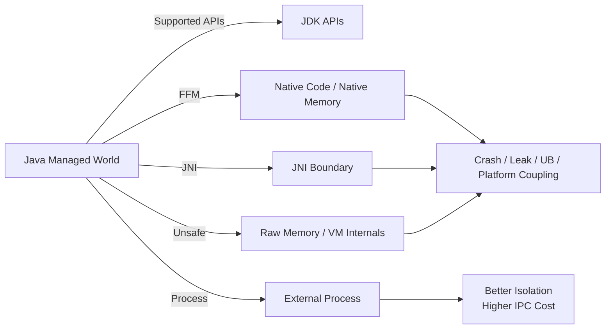
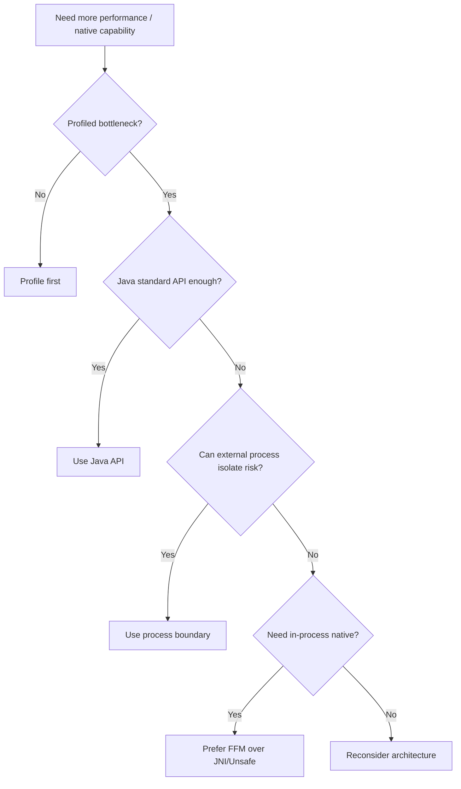
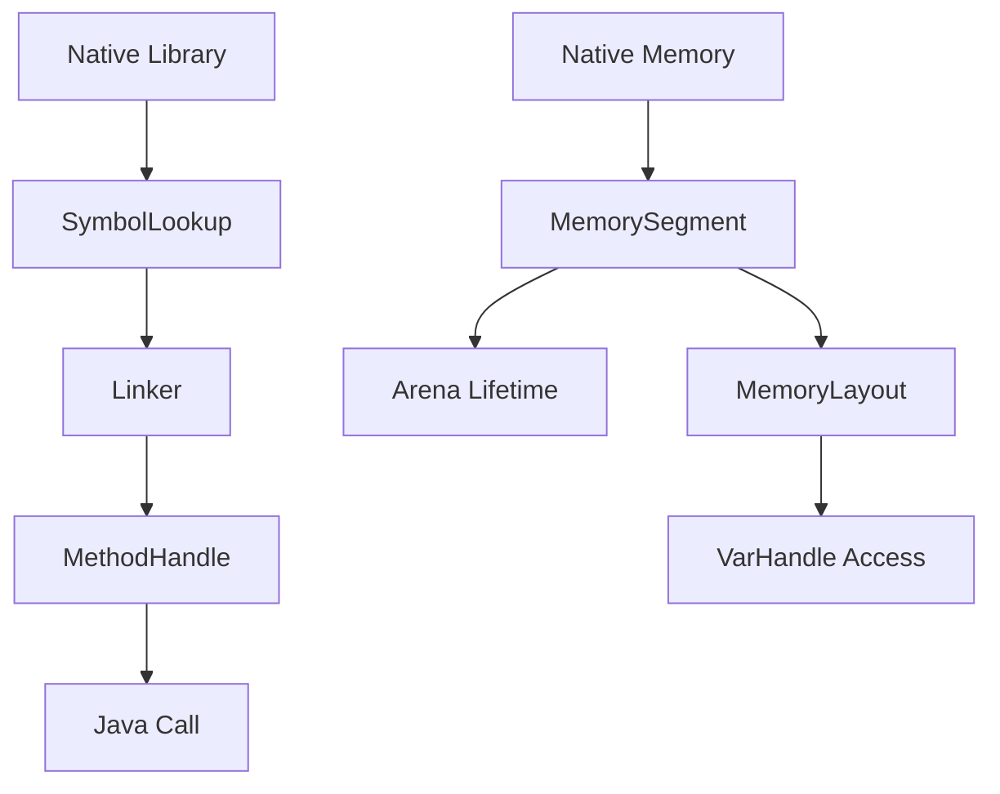

# Part 022 — Native Interop dan High-Performance Computing: FFM API, Vector API, Unsafe, dan Panama

Java sering diposisikan sebagai managed runtime: aman, portable, garbage-collected, dan produktif. Tetapi sistem nyata kadang perlu melewati boundary JVM:

- memanggil library C/C++;
- mengakses native OS API;
- membaca/menulis memory off-heap;
- mengintegrasikan hardware/driver;
- melakukan komputasi SIMD;
- memproses buffer besar tanpa copy berlebih;
- membangun runtime/library performance-sensitive;
- melakukan interop dengan format binary native.

Di masa lalu, jawaban Java biasanya:

- JNI;
- `sun.misc.Unsafe`;
- direct `ByteBuffer`;
- library wrapper pihak ketiga;
- native process terpisah.

Java modern memberi opsi yang lebih baik: **Foreign Function & Memory API** sebagai hasil Project Panama, dan **Vector API** untuk mengekspresikan komputasi vektor/SIMD. Namun dua area ini harus dipelajari dengan mental model risiko yang benar.

Native interop dan high-performance API bukan fitur yang harus dipakai oleh semua aplikasi. Mereka adalah **boundary tools** untuk kasus tertentu.

---

## 1. Target Performa

Setelah bagian ini, kamu harus mampu:

- menjelaskan kapan Java murni cukup dan kapan native interop layak;
- membedakan JNI, FFM API, `Unsafe`, direct `ByteBuffer`, dan `VarHandle`;
- memakai mental model `MemorySegment`, `Arena`, `Linker`, `SymbolLookup`, `MemoryLayout`, dan `VarHandle`;
- memahami lifetime management memory off-heap;
- menjelaskan failure modes native interop;
- membaca warning native access di JDK modern;
- menilai apakah Vector API layak digunakan berdasarkan benchmark;
- menolak penggunaan native/SIMD jika bottleneck sebenarnya bukan di sana;
- membuat decision record sebelum membawa native interop ke production.

---

## 2. Native Boundary Mental Model



Managed Java memberi:

- memory safety;
- type safety;
- GC;
- portability;
- exception model;
- tooling;
- observability.

Native boundary dapat menghilangkan sebagian benefit itu.

Rule:

> Begitu masuk native boundary, sebagian safety Java berubah menjadi tanggung jawab desain, review, dan test.

---

## 3. Decision Framework: Apakah Perlu Native Interop?

Tanyakan:

1. Apakah masalah bisa diselesaikan dengan Java standar?
2. Apakah bottleneck sudah dibuktikan dengan profiling?
3. Apakah library native benar-benar memberi value?
4. Apakah deployment multi-platform dibutuhkan?
5. Apakah crash native dapat diterima?
6. Apakah security review siap?
7. Apakah memory lifecycle bisa dikelola?
8. Apakah tim punya kompetensi C/native debugging?
9. Apakah native dependency punya update/CVE process?
10. Apakah interop overhead lebih kecil daripada benefit?

Jika jawaban profiling belum ada, jangan mulai dari native.



---

## 4. JNI: Legacy Power, High Cost

JNI memungkinkan Java memanggil native code dan native code memanggil Java.

Kelebihan:

- mature;
- luas dipakai library lama;
- bisa mengakses hampir semua native capability;
- cocok untuk existing native libraries.

Biaya:

- verbose;
- raw pointer risk;
- JVM crash jika native bug;
- manual memory management;
- platform-specific build;
- sulit test/debug;
- security/integrity risk;
- thread attachment concern;
- exception bridging rumit;
- deployment native artifact kompleks.

JNI masih ada dan masih relevan untuk banyak library lama. Tetapi untuk code baru, FFM API sering lebih menarik karena menyediakan Java-first interop model.

---

## 5. FFM API Overview

Foreign Function & Memory API final di JDK 22. Tujuannya:

- memanggil function di luar JVM;
- mengakses memory di luar heap Java;
- mengurangi brittleness/danger JNI;
- memberikan API yang lebih safe dan composable.

Komponen utama:

| Komponen | Fungsi |
|---|---|
| `MemorySegment` | Region memory contiguous, on-heap/off-heap/native |
| `Arena` | Lifetime manager untuk segment |
| `MemoryLayout` | Deskripsi layout data native |
| `ValueLayout` | Layout primitive value |
| `StructLayout` | Layout struct |
| `SequenceLayout` | Layout array |
| `Linker` | Menghubungkan Java ke native function |
| `SymbolLookup` | Mencari symbol native |
| `FunctionDescriptor` | Signature native function |
| `MethodHandle` | Handle Java untuk invoke native function |
| `VarHandle` | Access typed ke memory berdasarkan layout |

Mental model:



---

## 6. MemorySegment dan Arena

`MemorySegment` merepresentasikan memory region. Bisa on-heap atau off-heap/native. Untuk native memory, lifetime harus dikelola.

`Arena` mengelola lifecycle segment.

Contoh konseptual:

```java
try (Arena arena = Arena.ofConfined()) {
    MemorySegment segment = arena.allocate(ValueLayout.JAVA_INT);
    segment.set(ValueLayout.JAVA_INT, 0, 42);

    int value = segment.get(ValueLayout.JAVA_INT, 0);
    System.out.println(value);
}
```

Ketika arena ditutup, memory yang dialokasikan di arena dibebaskan.

### 6.1 Arena Types

Secara praktis, pikirkan:

| Arena | Use Case |
|---|---|
| Confined | Memory dipakai oleh satu thread/scope jelas |
| Shared | Memory perlu diakses lintas thread |
| Auto | Lifetime dikelola otomatis, tetapi lebih sulit diprediksi |
| Global | Lifetime selama aplikasi; hati-hati leak |

Rule:

> Pilih lifetime paling sempit yang memenuhi kebutuhan.

---

## 7. Memory Layout

Native code sering memakai struct.

Contoh C:

```c
struct Point {
    int x;
    int y;
};
```

Di Java FFM, kita mendeskripsikan layout:

```java
MemoryLayout POINT = MemoryLayout.structLayout(
        ValueLayout.JAVA_INT.withName("x"),
        ValueLayout.JAVA_INT.withName("y")
);
```

Access field dengan var handle:

```java
VarHandle X = POINT.varHandle(
        MemoryLayout.PathElement.groupElement("x")
);

VarHandle Y = POINT.varHandle(
        MemoryLayout.PathElement.groupElement("y")
);
```

Contoh penggunaan:

```java
try (Arena arena = Arena.ofConfined()) {
    MemorySegment point = arena.allocate(POINT);

    X.set(point, 10);
    Y.set(point, 20);

    int x = (int) X.get(point);
    int y = (int) Y.get(point);
}
```

Nilai penting:

- layout eksplisit;
- offset tidak ditulis manual;
- type access lebih jelas;
- lifetime tetap dikontrol.

---

## 8. Linker dan Function Call

FFM bisa memanggil native function melalui `Linker`.

Contoh konseptual memanggil C `strlen`:

```java
Linker linker = Linker.nativeLinker();
SymbolLookup stdlib = linker.defaultLookup();

MethodHandle strlen = linker.downcallHandle(
        stdlib.find("strlen").orElseThrow(),
        FunctionDescriptor.of(ValueLayout.JAVA_LONG, ValueLayout.ADDRESS)
);

try (Arena arena = Arena.ofConfined()) {
    MemorySegment cString = arena.allocateFrom("hello");
    long length = (long) strlen.invoke(cString);
    System.out.println(length);
}
```

Perhatikan:

- signature harus benar;
- ABI/platform matters;
- string encoding matters;
- memory lifetime matters;
- native call bisa crash process jika salah.

---

## 9. FFM Safety Model

FFM lebih aman daripada raw JNI/Unsafe, tetapi bukan bebas risiko.

Safety guardrail:

- memory segment punya bounds;
- arena mengelola lifetime;
- layout mendeskripsikan structure;
- access bisa dicek;
- native access perlu explicit enablement.

Risiko tetap:

- salah function descriptor;
- salah layout/alignment;
- native function menulis di luar memory;
- use-after-close jika design buruk;
- concurrency race di shared segment;
- native library crash;
- ABI mismatch;
- platform-specific behavior;
- security issue native dependency.

Rule:

> FFM membuat native interop lebih terstruktur, bukan membuat native code otomatis aman.

---

## 10. Native Access Policy

JDK modern bergerak ke arah membatasi native access secara eksplisit. Saat aplikasi memakai FFM/JNI, deployment harus mengizinkan native access untuk module tertentu.

Contoh flag:

```bash
java --enable-native-access=com.acme.nativebridge \
     --module-path mods \
     --module com.acme.app/com.acme.Main
```

Untuk classpath/all unnamed:

```bash
java --enable-native-access=ALL-UNNAMED -jar app.jar
```

Governance:

- hindari `ALL-UNNAMED` jika bisa;
- batasi ke module tertentu;
- dokumentasikan alasan;
- monitor warning;
- CI harus fail jika native access warning baru muncul;
- native access adalah deployment contract.

---

## 11. Off-Heap Memory

Off-heap memory berguna untuk:

- buffer besar;
- interop native;
- memory-mapped style access;
- mengurangi GC pressure untuk data tertentu;
- high-performance I/O.

Tetapi off-heap bukan magic.

Biaya:

- manual/explicit lifetime;
- memory leak tidak terlihat sebagai heap object biasa;
- debugging lebih sulit;
- accounting container memory penting;
- crash risk lebih tinggi;
- GC tidak membebaskan jika lifecycle salah.

Comparison:

| Tool | Use Case | Risiko |
|---|---|---|
| Heap array | Default, aman | GC pressure untuk buffer besar |
| Direct ByteBuffer | I/O/native-ish buffer | Cleaner/lifetime tidak selalu jelas |
| MemorySegment | FFM/off-heap modern | Perlu arena/lifetime discipline |
| Unsafe memory | Legacy low-level | Hindari untuk app code |

---

## 12. Direct ByteBuffer vs MemorySegment

`ByteBuffer.allocateDirect` sudah lama dipakai untuk off-heap buffer.

Kelemahan:

- API indexing relatif awkward;
- lifecycle explicit terbatas;
- cleaner timing tidak selalu jelas;
- structured layout kurang natural;
- slicing/position/limit bisa membingungkan.

`MemorySegment` memberi:

- scope/lifetime lebih eksplisit;
- layout model;
- typed access;
- interop langsung dengan FFM;
- bounds check;
- var handle integration.

Decision:

- untuk NIO klasik, direct buffer masih relevan;
- untuk native interop baru, prefer `MemorySegment`;
- untuk structured native data, prefer FFM layouts.

---

## 13. VarHandle sebagai Replacement Modern

`VarHandle` menyediakan operasi typed dan memory-order-aware untuk field/array/byte buffer/memory access.

Use case:

- atomic update;
- memory fences;
- low-level concurrent data structure;
- replacement sebagian `Unsafe`;
- access ke field/array dengan mode tertentu.

Contoh:

```java
public final class Counter {
    private volatile int value;

    private static final VarHandle VALUE;

    static {
        try {
            VALUE = MethodHandles.lookup()
                    .findVarHandle(Counter.class, "value", int.class);
        } catch (ReflectiveOperationException e) {
            throw new ExceptionInInitializerError(e);
        }
    }

    public int increment() {
        return (int) VALUE.getAndAdd(this, 1) + 1;
    }
}
```

Namun jangan gunakan `VarHandle` untuk code biasa jika `AtomicInteger` cukup.

Rule:

> Gunakan abstraction tertinggi yang memenuhi kebutuhan. Turun ke low-level hanya jika ada alasan terukur.

---

## 14. Unsafe Migration Strategy

Jika menemukan `Unsafe`, klasifikasikan:

| Pattern | Replacement |
|---|---|
| CAS field | `Atomic*`, `VarHandle` |
| Fences | `VarHandle` fences |
| Off-heap allocation | FFM `MemorySegment`/`Arena` |
| Direct buffer cleaner hack | Structured lifetime / FFM |
| Object instantiation hack | Refactor design / serialization replacement |
| Field offset introspection | Avoid or framework-specific supported API |

Audit command:

```bash
grep -R "sun.misc.Unsafe\|jdk.internal.misc.Unsafe" src/
jdeps --jdk-internals app.jar
```

Dependency audit:

```bash
jdeps --jdk-internals --recursive target/*.jar
```

Checklist:

- [ ] penggunaan langsung atau via reflection?
- [ ] library mana?
- [ ] apakah versi baru sudah migrate?
- [ ] apakah warning muncul di JDK 24/25?
- [ ] apakah replacement tested?
- [ ] apakah behavior/performance dibandingkan?

---

## 15. Vector API Overview

Vector API memungkinkan developer menulis komputasi vektor yang dapat dikompilasi JIT ke instruksi SIMD optimal pada CPU yang mendukung.

Contoh problem scalar:

```java
void add(float[] a, float[] b, float[] out) {
    for (int i = 0; i < a.length; i++) {
        out[i] = a[i] + b[i];
    }
}
```

Vectorized style konseptual:

```java
static final VectorSpecies<Float> SPECIES = FloatVector.SPECIES_PREFERRED;

void add(float[] a, float[] b, float[] out) {
    int i = 0;
    int upperBound = SPECIES.loopBound(a.length);

    for (; i < upperBound; i += SPECIES.length()) {
        var va = FloatVector.fromArray(SPECIES, a, i);
        var vb = FloatVector.fromArray(SPECIES, b, i);
        va.add(vb).intoArray(out, i);
    }

    for (; i < a.length; i++) {
        out[i] = a[i] + b[i];
    }
}
```

Java 25 masih menempatkan Vector API sebagai incubator. Artinya:

- perlu `--add-modules jdk.incubator.vector`;
- API bisa berubah;
- jangan expose ke public stable API tanpa policy;
- gunakan untuk performance lab/library internal dengan benchmark.

---

## 16. SIMD Mental Model

SIMD berarti **Single Instruction, Multiple Data**.

Alih-alih:

```text
add a[0] + b[0]
add a[1] + b[1]
add a[2] + b[2]
add a[3] + b[3]
```

CPU dapat melakukan:

```text
add [a0,a1,a2,a3] + [b0,b1,b2,b3]
```

Manfaat terasa pada:

- numeric arrays;
- image/audio processing;
- compression;
- hashing/checksum tertentu;
- ML/math kernels;
- parsing tertentu;
- vector distance/similarity;
- signal processing.

Tidak cocok jika:

- object-heavy;
- branch-heavy;
- random memory access;
- small arrays;
- I/O-bound;
- bottleneck di DB/network;
- data layout tidak contiguous.

---

## 17. Data Layout Matters

Vectorization lebih mudah jika data contiguous dan primitive.

Buruk untuk SIMD:

```java
record Point(float x, float y) {}

List<Point> points;
```

Lebih baik untuk numeric kernel:

```java
float[] xs;
float[] ys;
```

Atau packed layout native/off-heap jika memang perlu.

Object-oriented model bagus untuk domain clarity, tetapi high-performance numeric kernels sering butuh data-oriented layout.

Decision:

- gunakan domain object di boundary bisnis;
- gunakan primitive arrays/buffers di hot loop;
- convert di boundary dengan jelas;
- benchmark biaya conversion.

---

## 18. JMH Wajib untuk Vector API

Microbenchmark manual sering salah karena:

- dead-code elimination;
- warmup belum selesai;
- constant folding;
- branch prediction;
- CPU frequency scaling;
- memory bandwidth;
- allocation effects;
- GC;
- vectorization auto by JIT.

Gunakan JMH:

```java
@Benchmark
public void scalar(Blackhole bh) {
    kernel.scalar(a, b, out);
    bh.consume(out);
}

@Benchmark
public void vector(Blackhole bh) {
    kernel.vector(a, b, out);
    bh.consume(out);
}
```

Ukur:

- throughput;
- latency;
- allocation;
- CPU profile;
- different input sizes;
- different CPU architectures;
- warmup/fork variation.

Rule:

> Jika tidak ada benchmark, Vector API hanya kompleksitas tambahan.

---

## 19. Native Interop Failure Modes

### 19.1 Process Crash

Native segfault akan menjatuhkan JVM.

Mitigasi:

- isolate process untuk untrusted/native risky code;
- crash-only worker model;
- supervisor;
- canary;
- native test suite;
- fuzz input jika parser native.

### 19.2 Memory Leak

Off-heap leak tidak selalu terlihat di Java heap.

Mitigasi:

- arena scope sempit;
- native memory tracking;
- container memory metrics;
- JFR/native memory observability;
- leak test.

### 19.3 ABI Mismatch

Signature/layout salah bisa menghasilkan corruption.

Mitigasi:

- generate bindings jika bisa;
- test per platform;
- version pin native library;
- checksum artifacts;
- run integration test di target OS/arch.

### 19.4 Concurrency Bugs

Shared native memory bisa race.

Mitigasi:

- confined arena jika bisa;
- immutable data transfer;
- explicit synchronization;
- avoid sharing mutable segment;
- test stress.

### 19.5 Security Vulnerability

Native library dapat memiliki CVE.

Mitigasi:

- SBOM mencakup native;
- patch pipeline;
- source provenance;
- minimize native surface;
- sandbox process jika high-risk.

---

## 20. FFM vs JNI vs External Process

| Criteria | FFM | JNI | External Process |
|---|---:|---:|---:|
| Java-first API | Tinggi | Rendah | Sedang |
| Legacy support | Sedang | Tinggi | Tinggi |
| Safety structure | Lebih baik | Rendah | Tinggi via isolation |
| In-process performance | Tinggi | Tinggi | Lebih rendah |
| Crash isolation | Rendah | Rendah | Tinggi |
| Deployment complexity | Sedang | Tinggi | Sedang/Tinggi |
| API stability modern | Final sejak JDK 22 | Mature legacy | Tergantung protocol |
| Best for | New interop | Existing JNI libs | Untrusted/risky native |

Rule:

- pilih Java murni jika cukup;
- pilih process boundary jika isolation lebih penting;
- pilih FFM untuk in-process native interop baru;
- pilih JNI jika library existing sudah JNI dan biaya rewrite tidak sepadan;
- hindari `Unsafe` untuk aplikasi biasa.

---

## 21. FFM Design Pattern: Thin Native Adapter

Jangan sebarkan FFM call ke seluruh codebase.

Buat adapter sempit:

```java
public interface CompressionEngine {
    byte[] compress(byte[] input);
    byte[] decompress(byte[] input);
}
```

Implementasi Java murni:

```java
public final class JavaCompressionEngine implements CompressionEngine {
    public byte[] compress(byte[] input) {
        // pure Java implementation
    }

    public byte[] decompress(byte[] input) {
        // pure Java implementation
    }
}
```

Implementasi native:

```java
public final class NativeCompressionEngine implements CompressionEngine {
    public byte[] compress(byte[] input) {
        // FFM boundary here only
    }

    public byte[] decompress(byte[] input) {
        // FFM boundary here only
    }
}
```

Benefit:

- fallback mudah;
- test contract sama;
- rollout bisa feature-flag;
- native risk terisolasi;
- benchmark apple-to-apple.

---

## 22. Error Handling di Native Boundary

Native function sering mengembalikan:

- error code;
- null pointer;
- errno;
- output parameter;
- negative length;
- status enum.

Jangan biarkan error code bocor raw ke domain.

Buat mapping:

```java
public final class NativeCodecException extends RuntimeException {
    private final int nativeCode;

    public NativeCodecException(int nativeCode, String message) {
        super(message);
        this.nativeCode = nativeCode;
    }

    public int nativeCode() {
        return nativeCode;
    }
}
```

Pattern:

```java
int rc = (int) nativeCompress.invoke(input, output);

if (rc != 0) {
    throw mapNativeError(rc);
}
```

Checklist:

- [ ] semua error code dimap;
- [ ] null pointer dicek;
- [ ] buffer size dicek;
- [ ] errno/thread-local native error ditangani;
- [ ] logs tidak dump raw sensitive buffer;
- [ ] retry hanya jika error transient.

---

## 23. Testing Strategy

### Unit Test

- test adapter contract;
- mock native boundary jika perlu;
- validate input/output.

### Integration Test

- run native library nyata;
- test per OS/arch;
- test missing library;
- test version mismatch;
- test permission/native access flag.

### Stress Test

- repeated calls;
- concurrent calls;
- large input;
- small input;
- malformed input;
- cancellation/shutdown.

### Performance Test

- JMH for micro-kernel;
- load test for service-level;
- compare Java vs native;
- include data transfer/copy cost.

### Failure Injection

- native function returns error;
- native library not found;
- invalid pointer-like response;
- large allocation failure;
- corrupted input;
- timeout process boundary.

---

## 24. Observability

Native/off-heap area perlu metrics tambahan:

- native memory usage;
- direct buffer memory;
- allocation rate;
- call count per native function;
- native error code count;
- latency per native call;
- fallback count;
- crash count;
- library version;
- enabled native access modules;
- JFR events;
- OS-level memory/RSS.

Log startup:

```text
native_codec_enabled=true
native_codec_library=libcodec.so
native_codec_version=1.4.2
native_access_module=com.acme.codec
fallback_available=true
```

Jangan log:

- raw buffer;
- key material;
- PII;
- binary payload besar.

---

## 25. Deployment Concerns

Native dependency membuat deployment lebih sulit.

Checklist:

- [ ] artifact tersedia untuk Linux x64/arm64 sesuai target;
- [ ] macOS/windows support jika dev environment butuh;
- [ ] container image punya library path benar;
- [ ] glibc/musl compatibility dicek;
- [ ] CPU instruction requirement jelas;
- [ ] checksum/signature native library diverifikasi;
- [ ] library version dilog;
- [ ] SBOM mencakup native artifact;
- [ ] CVE process jelas;
- [ ] fallback Java tersedia jika feasible.

Common failure:

```text
Works on developer laptop, fails in Alpine container because native library expects glibc.
```

---

## 26. Vector API Deployment Concerns

Vector API bergantung pada CPU capability dan JIT compilation.

Checklist:

- [ ] target CPU instruction sets diketahui;
- [ ] fallback scalar tersedia;
- [ ] benchmark di hardware production-like;
- [ ] incubator module flag dikonfigurasi;
- [ ] API tidak diekspos di public stable interface;
- [ ] performance regression test ada;
- [ ] correctness test mencakup tail elements;
- [ ] input size distribution realistis.

Tail handling penting:

```java
int upperBound = SPECIES.loopBound(length);

for (int i = 0; i < upperBound; i += SPECIES.length()) {
    // vector loop
}

for (int i = upperBound; i < length; i++) {
    // scalar tail
}
```

---

## 27. Case Study: Fast Checksum Service

### 27.1 Baseline Java

```java
public interface Checksum {
    long compute(byte[] data);
}
```

Implementasi Java:

```java
public final class JavaChecksum implements Checksum {
    public long compute(byte[] data) {
        long sum = 0;
        for (byte value : data) {
            sum += Byte.toUnsignedInt(value);
        }
        return sum;
    }
}
```

### 27.2 Optimized Path

Sebelum native/vector:

- profile;
- cek apakah bottleneck di checksum;
- cek input size;
- cek CPU;
- cek GC;
- cek I/O.

Jika iya, buat implementasi alternatif:

```java
public final class VectorChecksum implements Checksum {
    public long compute(byte[] data) {
        // vectorized implementation
    }
}
```

Atau:

```java
public final class NativeChecksum implements Checksum {
    public long compute(byte[] data) {
        // FFM call to native implementation
    }
}
```

### 27.3 Decision

Bandingkan:

| Metric | Java | Vector | Native |
|---|---:|---:|---:|
| Correctness | must pass | must pass | must pass |
| p50 latency | measure | measure | measure |
| p99 latency | measure | measure | measure |
| throughput | measure | measure | measure |
| allocation | measure | measure | measure |
| deployment risk | low | medium | high |
| portability | high | medium | low/medium |
| crash isolation | high | high | low |

Sering kali Java murni cukup. Native hanya menang jika benefit measurable dan risk acceptable.

---

## 28. Production Checklist

### Decision

- [ ] Bottleneck dibuktikan profiler.
- [ ] Java-only alternative dievaluasi.
- [ ] External process alternative dievaluasi.
- [ ] FFM/JNI/native risk diterima.
- [ ] Owner jelas.

### Design

- [ ] Native boundary di adapter sempit.
- [ ] Fallback tersedia jika feasible.
- [ ] API domain tidak bergantung ke FFM/JNI detail.
- [ ] Memory lifetime eksplisit.
- [ ] Error mapping lengkap.
- [ ] Thread-safety didefinisikan.

### Build/Deploy

- [ ] Platform matrix jelas.
- [ ] Native artifacts versioned.
- [ ] CI test per OS/arch.
- [ ] `--enable-native-access` dikonfigurasi minimal.
- [ ] SBOM mencakup native dependencies.
- [ ] Runtime logs versi native.

### Observability

- [ ] Native call latency.
- [ ] Native error code metrics.
- [ ] Native memory/RSS metrics.
- [ ] Fallback metrics.
- [ ] JFR/profile baseline.
- [ ] Crash diagnostics.

### Security

- [ ] Source/provenance native library jelas.
- [ ] CVE monitoring.
- [ ] Input native boundary divalidasi.
- [ ] Sensitive buffers tidak dilog.
- [ ] Privilege minimal.

---

## 29. Latihan 20 Jam

### Jam 1–3: Native Decision Drill

Ambil satu problem performance.

Tulis:

- apakah bottleneck sudah terbukti;
- apa Java-only option;
- apa native option;
- apa external process option;
- risk matrix.

### Jam 4–6: MemorySegment Lab

Buat program:

- allocate int;
- allocate array;
- allocate struct-like layout;
- baca/tulis dengan layout;
- tutup arena;
- observasi error setelah close.

### Jam 7–9: FFM Function Call Lab

Panggil native function sederhana seperti `strlen`.

Catat:

- symbol lookup;
- function descriptor;
- arena;
- string conversion;
- failure mode jika symbol tidak ada.

### Jam 10–12: ByteBuffer vs MemorySegment

Implementasikan buffer processing dengan:

- heap byte array;
- direct ByteBuffer;
- MemorySegment.

Bandingkan readability dan lifecycle.

### Jam 13–15: Vector API Lab

Implementasikan scalar dan vector add untuk float arrays.

Gunakan JMH.

Ukur:

- small arrays;
- medium arrays;
- large arrays;
- tail handling;
- different forks.

### Jam 16–18: Unsafe Audit

Cari penggunaan `Unsafe` di dependency/project.

Tulis migration plan:

- `VarHandle`;
- FFM;
- atomic classes;
- remove usage;
- upgrade dependency.

### Jam 19–20: Production RFC

Tulis RFC adopsi FFM atau Vector API:

- problem;
- alternative;
- benchmark;
- risk;
- rollout;
- rollback;
- observability.

---

## 30. Anti-Pattern

### Anti-Pattern 1 — Native First

Memilih native sebelum profiling.

### Anti-Pattern 2 — FFM Everywhere

Menyebarkan `MemorySegment`, `Linker`, dan `MethodHandle` ke domain code.

### Anti-Pattern 3 — No Fallback

Native path gagal berarti service mati total.

### Anti-Pattern 4 — Ignoring Copy Cost

Native function cepat, tetapi biaya copy Java-native membuat total lebih lambat.

### Anti-Pattern 5 — Unsafe for Convenience

Memakai `Unsafe` karena API standar terasa verbose.

### Anti-Pattern 6 — SIMD Without Data Layout

Memakai Vector API pada data object-heavy/random access.

### Anti-Pattern 7 — Benchmarking Without JMH

Mengukur hot loop dengan `System.nanoTime()` lalu mengambil kesimpulan.

### Anti-Pattern 8 — No Platform Matrix

Native artifact hanya diuji di satu laptop.

---

## 31. Ringkasan

Native interop dan high-performance computing di Java modern adalah area high-leverage sekaligus high-risk.

FFM API memberi cara lebih terstruktur untuk memanggil native function dan mengakses native memory dibanding JNI. Vector API memberi cara eksplisit mengekspresikan SIMD computation, tetapi masih incubator di Java 25. `Unsafe` makin ditekan dan harus dimigrasikan ke API supported seperti `VarHandle` dan FFM.

Mental model terpenting:

```text
Profile first.
Prefer Java.
Isolate boundary.
Use supported APIs.
Measure end-to-end.
Own the operational risk.
```

Engineer top-tier tidak memakai native interop untuk terlihat canggih. Mereka memakainya hanya ketika boundary, risk, deployment, observability, dan rollback sudah jelas.

---

## 32. Referensi Resmi

- JEP 454 — Foreign Function & Memory API: https://openjdk.org/jeps/454
- Oracle Java 25 FFM API Guide: https://docs.oracle.com/en/java/javase/25/core/foreign-function-and-memory-api.html
- JEP 472 — Prepare to Restrict the Use of JNI: https://openjdk.org/jeps/472
- JEP 471 — Deprecate the Memory-Access Methods in sun.misc.Unsafe for Removal: https://openjdk.org/jeps/471
- JEP 498 — Warn upon Use of Memory-Access Methods in sun.misc.Unsafe: https://openjdk.org/jeps/498
- JEP 193 — Variable Handles: https://openjdk.org/jeps/193
- JEP 508 — Vector API, Tenth Incubator: https://openjdk.org/jeps/508
- Java API — java.lang.foreign: https://docs.oracle.com/en/java/javase/25/docs/api/java.base/java/lang/foreign/package-summary.html
- Java API — java.lang.invoke.VarHandle: https://docs.oracle.com/en/java/javase/25/docs/api/java.base/java/lang/invoke/VarHandle.html
