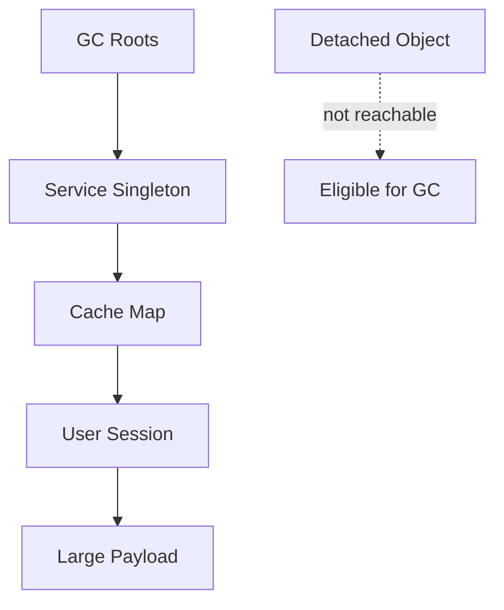
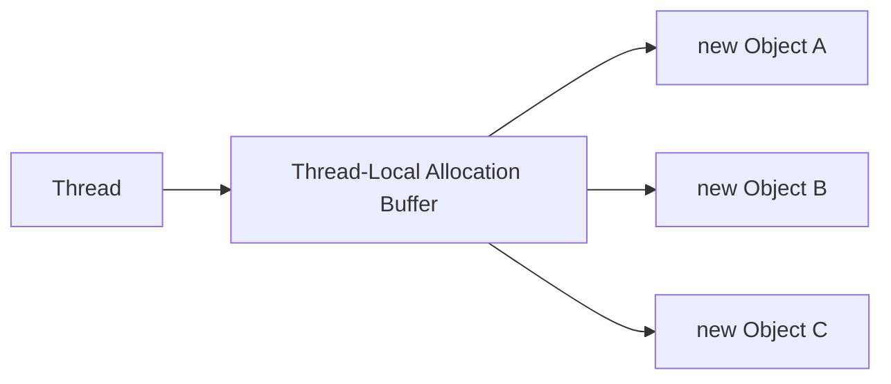
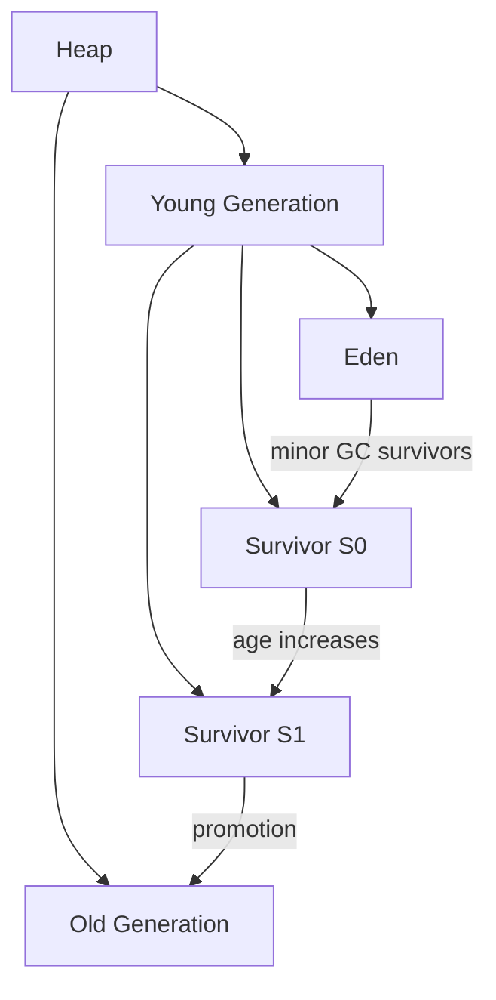
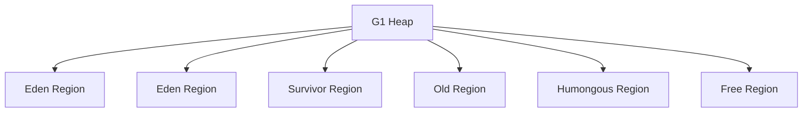
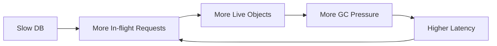

# Part 024 — Garbage Collection: G1, ZGC, Shenandoah, Generational GC, dan Memory Tuning

Garbage collection sering dipahami terlalu dangkal:

> "GC membersihkan object yang tidak dipakai."

Itu benar, tetapi tidak cukup untuk production engineering.

Di production, GC adalah trade-off antara:

- latency;
- throughput;
- memory footprint;
- CPU overhead;
- allocation rate;
- pause predictability;
- startup/warmup;
- heap size;
- container limits;
- object lifetime profile;
- operational simplicity.

Part ini membangun mental model untuk menjawab pertanyaan yang lebih berguna:

- Kenapa latency p99 naik saat traffic tinggi?
- Kenapa heap terlihat cukup tetapi container OOMKilled?
- Kenapa GC pause pendek tetapi CPU naik?
- Kenapa memory tidak turun setelah request selesai?
- Kapan G1 cukup?
- Kapan ZGC masuk akal?
- Kapan Shenandoah relevan?
- Apa yang harus dilihat di GC log?
- Kapan tuning perlu, dan kapan masalahnya bukan GC?

---

## 1. Target Performa

Setelah bagian ini, kamu harus mampu:

- menjelaskan allocation lifecycle object di JVM;
- memahami generational hypothesis;
- membaca perbedaan young GC, mixed GC, full GC, concurrent GC;
- membedakan throughput collector, region-based collector, dan low-latency concurrent collector;
- memilih baseline collector secara rasional;
- membaca GC log dasar;
- membuat heap dump dan menemukan retention path;
- mengenali memory leak vs legitimate memory growth;
- menghindari tuning flags tanpa evidence;
- memahami efek container memory limit;
- membuat playbook investigasi GC/memory issue.

---

## 2. GC Bukan Pengganti Ownership Thinking

Java punya GC, tetapi bukan berarti memory tidak perlu dipikirkan.

GC hanya bisa menghapus object yang **tidak lagi reachable**. Jika object masih direferensikan dari GC root, GC tidak boleh menghapusnya.



Jika cache global menyimpan payload besar tanpa eviction, GC melihat object itu masih hidup. Itu bukan GC leak. Itu application retention bug.

---

## 3. GC Roots

GC roots adalah titik awal reachability analysis.

Contoh root:

- local variables di thread stack;
- static fields;
- JNI references;
- system classloader references;
- active thread objects;
- monitor/lock references;
- JIT/runtime internal references.

Object dianggap live jika reachable dari root.

Mental model:

```text
Reachable = live from JVM perspective
Unreachable = collectible
```

Business perspective bisa berbeda. Object yang "sudah tidak dibutuhkan bisnis" tetap live jika masih direferensikan.

---

## 4. Allocation Fast Path

Object allocation di Java biasanya sangat cepat.

Untuk thread tertentu, JVM bisa memakai TLAB: Thread-Local Allocation Buffer.



Allocation fast path sering hanya pointer bump.

Namun allocation murah bukan berarti allocation gratis. Allocation rate tinggi menyebabkan:

- young GC lebih sering;
- memory bandwidth naik;
- cache pressure;
- GC CPU naik;
- possible promotion pressure;
- latency variability.

Optimization goal bukan "zero allocation". Goal-nya:

```text
Allocation rate sesuai dengan latency/throughput target.
```

---

## 5. Generational Hypothesis

Banyak object mati muda.

Contoh:

```java
public Response handle(Request request) {
    var dto = parser.parse(request.body());
    var result = service.process(dto);
    return mapper.toResponse(result);
}
```

Banyak intermediate object hanya hidup selama request.

Generational GC memanfaatkan pola ini:



Konsep:

| Area | Makna |
|---|---|
| Eden | tempat object baru dialokasikan |
| Survivor | tempat object muda yang masih hidup dipindah |
| Old | tempat object yang bertahan lama |
| Promotion | object muda dipindah ke old |
| Minor/young GC | collection young generation |
| Mixed GC | collection sebagian young + old regions |
| Full GC | collection besar, sering stop-the-world berat |

---

## 6. Pause Time vs Throughput vs Footprint

Tidak ada collector terbaik universal.

| Goal | Bias Collector/Tuning |
|---|---|
| Throughput maksimum | Kurangi overhead GC, heap cukup besar |
| Pause rendah | Concurrent collector, memory headroom |
| Footprint rendah | Heap lebih ketat, tetapi pause/CPU bisa naik |
| Predictability | Hindari full GC, pantau allocation/promotion |
| Simplicity | Gunakan default dulu, tuning minimal |
| Startup/warmup | CDS/AOT/class loading strategy juga relevan |

Trade-off penting:

```text
Lower pause often costs more CPU and/or memory.
Lower memory often costs more pause and/or CPU.
Higher throughput often accepts longer pauses.
```

---

## 7. Collector Landscape Java Modern

Collectors utama yang sering dipertimbangkan:

| Collector | Fokus | Catatan |
|---|---|---|
| Serial GC | Sederhana, small footprint | Cocok untuk app kecil/single-core tertentu |
| Parallel GC | Throughput | Pause bisa lebih panjang |
| G1 GC | Balanced/default umum | Region-based, banyak workload enterprise cocok |
| ZGC | Low latency scalable heap | Concurrent, pause sangat rendah, overhead/headroom perlu diperhatikan |
| Shenandoah | Low pause concurrent | Tersedia di distribusi tertentu, generational final di JDK 25 |
| Epsilon | No-op GC | Testing allocation behavior, bukan production umum |

Oracle HotSpot modern sering menjadikan G1 sebagai default server collector, tetapi pemilihan collector tetap harus didasarkan pada workload.

---

## 8. G1 GC Mental Model

G1 adalah region-based collector.

Heap dibagi menjadi banyak region:



G1 mencoba memenuhi pause target dengan memilih region yang paling menguntungkan untuk dikoleksi.

Konsep penting:

- region-based heap;
- young collection;
- mixed collection;
- remembered sets;
- concurrent marking;
- evacuation;
- humongous allocation;
- pause time goal;
- IHOP: Initiating Heap Occupancy Percent.

Enable eksplisit:

```bash
-XX:+UseG1GC
```

Pause target:

```bash
-XX:MaxGCPauseMillis=200
```

Namun pause target bukan guarantee. Itu goal untuk heuristik.

---

## 9. G1 Failure Modes

### 9.1 Evacuation Failure

G1 memindahkan live objects dari region yang dikoleksi. Jika tidak ada cukup ruang untuk memindahkan object, bisa terjadi evacuation failure.

Gejala:

- pause naik;
- full GC;
- log menyebut evacuation failure/to-space exhausted.

Mitigasi:

- tambah heap;
- kurangi allocation rate;
- kurangi live set;
- tuning reserve percent;
- audit humongous objects;
- cek memory pressure.

### 9.2 Humongous Allocation

Object besar bisa dialokasikan sebagai humongous region.

Contoh:

- byte array besar;
- String besar;
- JSON payload besar;
- buffer besar;
- image/file content;
- batch list besar.

Mitigasi:

- streaming;
- chunking;
- batasi payload;
- hindari membaca file besar ke memory;
- cek serializer;
- cek request max size.

### 9.3 Mixed GC Tidak Mengejar

Jika old generation tumbuh lebih cepat daripada kemampuan mixed GC membersihkan, full GC bisa terjadi.

Mitigasi:

- tambah heap/headroom;
- kurangi retention;
- audit cache;
- cek promotion rate;
- tune marking start;
- perbaiki allocation burst.

---

## 10. ZGC Mental Model

ZGC adalah low-latency concurrent collector. ZGC dirancang agar pause time sangat pendek bahkan untuk heap besar.

Enable:

```bash
-XX:+UseZGC
```

Konsep:

- concurrent marking;
- concurrent relocation;
- load barriers;
- colored pointers/metadata;
- very short stop-the-world phases;
- scalable heap;
- generational mode modern.

Generational ZGC menjadi penting di Java 21+ dan non-generational ZGC dihapus pada JDK 24. Artinya arah ZGC modern adalah generational.

Kapan ZGC cocok:

- latency-sensitive service;
- heap besar;
- p99/p999 penting;
- pause G1 terlalu tinggi;
- memory headroom tersedia;
- CPU overhead tambahan masih acceptable.

Kapan hati-hati:

- memory sangat ketat;
- CPU sangat ketat;
- workload kecil yang tidak butuh low-latency collector;
- environment tidak punya observability cukup.

---

## 11. Shenandoah Mental Model

Shenandoah adalah low-pause concurrent GC. Ia melakukan banyak pekerjaan GC secara concurrent dengan application threads.

Enable, jika distribusi mendukung:

```bash
-XX:+UseShenandoahGC
```

Java 25 memfinalisasi Generational Shenandoah melalui JEP 521.

Kapan Shenandoah dipertimbangkan:

- low-pause target;
- distribusi JDK mendukung;
- workload latency-sensitive;
- ingin membandingkan dengan ZGC/G1;
- tim punya kemampuan observability/tuning.

Catatan:

- dukungan bisa berbeda antar distribusi JDK;
- selalu cek vendor JDK;
- benchmark dengan workload nyata;
- jangan pilih hanya dari artikel atau benchmark sintetis.

---

## 12. Compact Object Headers dan Efek ke GC

Java 25 membawa Compact Object Headers sebagai fitur final.

Efek potensial:

- object header lebih kecil;
- object-heavy workload memakai heap lebih sedikit;
- live set bisa lebih kecil;
- cache locality membaik;
- GC pressure bisa turun.

Namun:

- tidak semua workload mendapat manfaat sama;
- object besar/payload byte besar mungkin tidak banyak berubah;
- alignment dan VM flags tetap berpengaruh;
- benchmark harus dilakukan pada workload nyata.

Checklist evaluasi:

- allocation profile sebelum/sesudah;
- heap occupancy;
- GC frequency;
- CPU;
- latency percentile;
- RSS/container memory;
- correctness test.

---

## 13. Reading GC Logs

Aktifkan GC log modern:

```bash
-Xlog:gc*,safepoint:file=gc.log:time,uptime,level,tags
```

Contoh hal yang dicari:

| Sinyal | Makna |
|---|---|
| Young GC sering sekali | Allocation rate tinggi |
| Pause time naik | Live set besar, evacuation mahal, CPU pressure |
| Full GC | Red flag untuk service latency-sensitive |
| Concurrent cycle sering | Heap pressure atau live set tinggi |
| Promotion rate tinggi | Object hidup lebih lama |
| Humongous allocation | Payload/buffer besar |
| Metaspace growth | Class loading/classloader issue |
| Allocation stall | Collector tidak mengejar allocation |
| To-space exhausted | Relocation/evacuation space kurang |

Jangan membaca satu event secara terisolasi. Lihat trend:

```text
traffic -> allocation rate -> heap occupancy -> GC frequency -> pause -> latency
```

---

## 14. Heap Dump Analysis

Heap dump menjawab pertanyaan:

```text
Object apa yang menahan memory?
```

Buat heap dump:

```bash
jcmd <pid> GC.heap_dump /tmp/heap.hprof
```

Atau:

```bash
jmap -dump:format=b,file=/tmp/heap.hprof <pid>
```

Tools:

- Eclipse MAT;
- VisualVM;
- YourKit;
- JProfiler;
- IntelliJ profiler;
- heap dump tools vendor.

Yang dicari:

- dominator tree;
- retained size;
- GC root path;
- duplicate strings;
- large arrays;
- cache maps;
- ThreadLocal maps;
- classloader retention;
- listener/subscriber lists;
- queue backlog;
- session maps.

Key distinction:

| Metric | Makna |
|---|---|
| Shallow size | Ukuran object itu sendiri |
| Retained size | Memory yang bisa bebas jika object ini hilang |
| Dominator | Object yang menjadi penguasa retention graph |
| GC root path | Jalur referensi dari root ke object |

---

## 15. Memory Leak Patterns

### 15.1 Static Map Leak

```java
public final class Registry {
    private static final Map<String, Object> VALUES = new HashMap<>();

    public static void register(String key, Object value) {
        VALUES.put(key, value);
    }
}
```

Mitigasi:

- eviction;
- lifecycle unregister;
- weak reference jika sesuai;
- bounded cache;
- metrics size.

### 15.2 Cache Tanpa Bound

Gunakan cache dengan:

- maximum size;
- TTL;
- eviction metrics;
- hit/miss metrics;
- backpressure.

### 15.3 ThreadLocal Leak

```java
private static final ThreadLocal<byte[]> BUFFER = new ThreadLocal<>();

void handle() {
    BUFFER.set(new byte[1024 * 1024]);
    // no remove
}
```

Mitigasi:

```java
try {
    BUFFER.set(buffer);
    process();
} finally {
    BUFFER.remove();
}
```

Pada virtual threads, leak antar-request lebih kecil jika thread tidak dipakai ulang, tetapi object besar per virtual thread tetap bisa menyebabkan memory pressure.

### 15.4 Listener Leak

Object register listener tetapi tidak unregister.

```java
eventBus.register(this);
```

Mitigasi:

- explicit close lifecycle;
- weak listener jika sesuai;
- ownership model;
- test lifecycle.

### 15.5 Queue Backlog

Message queue internal tumbuh karena consumer lambat.

Gejala:

- heap growth;
- latency naik;
- GC makin sering;
- retained size di queue besar.

Mitigasi:

- bounded queue;
- backpressure;
- drop policy;
- load shedding;
- consumer scaling;
- investigate downstream bottleneck.

### 15.6 ClassLoader Leak

Sering muncul saat redeploy/hot reload/plugin.

Mitigasi:

- stop threads;
- clear ThreadLocal;
- deregister drivers;
- close executors;
- avoid global static registry;
- heap dump classloader dominator analysis.

---

## 16. Allocation Profiling

Heap dump menunjukkan snapshot. Allocation profiler menunjukkan object dibuat di mana.

Gunakan:

- JFR allocation profiling;
- async-profiler allocation mode;
- commercial profilers.

Pertanyaan:

- type apa paling banyak dialokasikan?
- call stack allocation hotspot di mana?
- allocation rate per request berapa?
- apakah allocation berasal dari serialization/deserialization?
- apakah logging membuat banyak temporary object?
- apakah stream/lambda chain membuat object tambahan?
- apakah boxing terjadi?
- apakah collection resizing sering?

Contoh boxing trap:

```java
List<Integer> values = new ArrayList<>();
for (int i = 0; i < 1_000_000; i++) {
    values.add(i); // boxing Integer
}
```

---

## 17. GC dan Containers

Di container, masalah memory bukan hanya heap.

Total memory process mencakup:

```text
heap + metaspace + code cache + thread stacks + direct memory + GC native structures + libc/native libs
```

Jika container limit 1 GiB dan kamu set:

```bash
-Xmx1g
```

maka process bisa OOMKilled karena native memory tidak punya ruang.

Rule praktis:

```text
Container memory limit > Xmx + native overhead
```

Gunakan persentase:

```bash
-XX:MaxRAMPercentage=75
```

Tetapi angka terbaik tergantung:

- jumlah thread;
- virtual vs platform threads;
- direct buffer;
- metaspace;
- code cache;
- GC;
- native libraries;
- observability agent.

Checklist container:

- [ ] Xmx tidak sama dengan container limit penuh.
- [ ] direct memory dipahami.
- [ ] metaspace dipantau.
- [ ] thread count dipantau.
- [ ] RSS dipantau.
- [ ] container OOMKilled dibedakan dari Java OOME.
- [ ] memory request/limit selaras dengan GC strategy.

---

## 18. Tuning Principles

### Principle 1 — Default First

Mulai dengan default collector dan flags sesedikit mungkin.

### Principle 2 — Measure Before Tuning

Jangan tuning berdasarkan rumor.

Minimal data:

- GC logs;
- heap usage over time;
- latency percentiles;
- throughput;
- CPU;
- allocation rate;
- thread count;
- heap dump jika leak suspected;
- JFR profile.

### Principle 3 — Tuning Tidak Menghapus Leak

Jika retention bug, menaikkan heap hanya menunda kegagalan.

### Principle 4 — Tune Goal, Not Flag

Goal:

```text
p99 latency < 200 ms under 1000 RPS with memory limit 2 GiB
```

Bukan:

```text
pakai flag yang katanya cepat
```

### Principle 5 — One Change at a Time

Ubah satu variabel, ukur, catat.

---

## 19. Collector Selection Heuristic

### Mulai dari G1 Jika

- workload enterprise umum;
- tidak punya low-latency requirement ekstrem;
- ingin operational simplicity;
- pause target ratusan ms acceptable;
- tim belum punya GC expertise tinggi;
- memory footprint penting.

### Evaluasi ZGC Jika

- p99/p999 latency sangat penting;
- heap besar;
- pause G1 tidak acceptable;
- memory headroom cukup;
- CPU overhead bisa diterima;
- service latency-sensitive.

### Evaluasi Shenandoah Jika

- distribusi JDK mendukung;
- low-pause target;
- ingin alternatif ZGC;
- workload cocok setelah benchmark.

### Pertimbangkan Parallel GC Jika

- throughput batch paling penting;
- pause panjang acceptable;
- workload bukan latency-sensitive.

### Pertimbangkan Serial GC Jika

- app kecil;
- memory kecil;
- single-core;
- CLI kecil.

---

## 20. GC Troubleshooting Playbook

### Step 1 — Tentukan Gejala

```text
Apakah masalahnya latency, throughput, memory, CPU, atau OOM?
```

### Step 2 — Ambil Data

- GC log;
- JFR;
- heap usage chart;
- container RSS;
- CPU;
- request latency;
- allocation rate;
- heap dump jika leak;
- thread dump jika blocking.

### Step 3 — Klasifikasikan

| Gejala | Kelas Masalah |
|---|---|
| Heap naik terus | Leak/retention atau load naik |
| Heap naik turun sehat | Normal sawtooth |
| GC terlalu sering | Allocation rate tinggi/heap kecil |
| Full GC muncul | Red flag |
| Pause tinggi | Live set besar/evacuation/CPU pressure |
| RSS tinggi, heap rendah | Native/direct/metaspace/thread stack |
| OOMKilled tanpa Java OOME | Container native/RSS issue |
| Allocation stall | Collector tidak mengejar allocation |

### Step 4 — Cari Root Cause

- retention path;
- allocation hotspot;
- large object;
- cache;
- queue;
- classloader;
- ThreadLocal;
- serializer;
- payload;
- DB/result set;
- framework behavior.

### Step 5 — Mitigasi

- fix leak;
- bound cache/queue;
- stream large data;
- reduce allocation;
- increase heap;
- change collector;
- tune pause goal;
- adjust container memory;
- scale out;
- reduce fan-out;
- backpressure.

### Step 6 — Validasi

- repeat load test;
- compare before/after;
- watch p95/p99/p999;
- check GC CPU;
- check RSS;
- check error rate.

---

## 21. Practical Flag Baselines

### 21.1 Conservative G1 Baseline

```bash
-XX:+UseG1GC
-Xlog:gc*,safepoint:file=/var/log/app/gc.log:time,uptime,level,tags
-XX:+HeapDumpOnOutOfMemoryError
-XX:HeapDumpPath=/var/log/app/heapdump.hprof
```

Optional, workload-specific:

```bash
-XX:MaxGCPauseMillis=200
```

### 21.2 ZGC Baseline

```bash
-XX:+UseZGC
-Xlog:gc*,safepoint:file=/var/log/app/gc.log:time,uptime,level,tags
-XX:+HeapDumpOnOutOfMemoryError
```

### 21.3 Container-Aware Memory

```bash
-XX:MaxRAMPercentage=75
-XX:InitialRAMPercentage=50
```

Do not copy blindly. Validate with RSS and native memory.

### 21.4 Native Memory Tracking for Investigation

```bash
-XX:NativeMemoryTracking=summary
```

Then:

```bash
jcmd <pid> VM.native_memory summary
```

NMT has overhead. Use intentionally.

---

## 22. Large Object and Payload Discipline

Bad pattern:

```java
byte[] bytes = inputStream.readAllBytes();
```

For unbounded input, this is dangerous.

Better:

```java
try (InputStream in = request.inputStream();
     OutputStream out = storage.openOutput()) {
    in.transferTo(out);
}
```

For JSON, avoid loading giant object graph if streaming parser suffices.

Checklist:

- max request size;
- max response size;
- streaming for files;
- chunking for batch;
- pagination;
- limit result set;
- avoid `SELECT *` for large query;
- avoid building giant intermediate list;
- cap queue size.

---

## 23. Object Lifetime Design

You can often reduce GC pressure by designing object lifetime clearly.

Bad:

```java
public final class RequestProcessor {
    private final List<Event> events = new ArrayList<>();

    public void process(Event event) {
        events.add(event); // grows forever
    }
}
```

Better:

```java
public void process(List<Event> events) {
    for (Event event : events) {
        handle(event);
    }
}
```

Or if retention is intentional:

```java
Cache<String, Event> cache = Caffeine.newBuilder()
        .maximumSize(100_000)
        .expireAfterWrite(Duration.ofMinutes(10))
        .build();
```

GC-friendly design:

- keep scopes small;
- avoid unnecessary object retention;
- prefer bounded collections;
- close resources;
- avoid static mutable state;
- make ownership explicit;
- stream large data;
- avoid accidental capture in lambdas;
- avoid retaining request object in async callbacks.

---

## 24. Latency Percentiles and GC

Average latency hides GC impact.

Use percentiles:

| Metric | Meaning |
|---|---|
| p50 | typical request |
| p95 | common tail |
| p99 | serious tail |
| p999 | rare but user-visible at scale |
| max | often noisy but useful during incident |

GC pause often appears in tail latency.

Correlation workflow:

1. plot request latency;
2. plot GC pause;
3. plot allocation rate;
4. plot CPU;
5. plot downstream latency;
6. compare timestamps.

Do not blame GC just because latency and GC both exist. Correlate.

---

## 25. GC vs Application Bottleneck

Sometimes GC is victim, not culprit.

Example:

- DB slows down;
- request objects live longer;
- in-flight requests increase;
- heap occupancy rises;
- GC works harder;
- latency rises further.

Root cause is DB latency, but symptom includes GC pressure.

Diagram:



Investigasi harus melihat full system, bukan hanya JVM.

---

## 26. Memory Leak Triage Example

Gejala:

```text
Heap after GC increases slowly for 6 hours until OOME.
```

Langkah:

1. Aktifkan GC log.
2. Ambil heap dump saat sehat.
3. Ambil heap dump saat tinggi.
4. Bandingkan dominator tree.
5. Cari class dengan retained size tumbuh.
6. Cari path to GC root.
7. Identifikasi owner object.
8. Tentukan apakah retention legitimate.
9. Tambahkan bound/eviction/cleanup.
10. Load test ulang.

Output yang diharapkan:

```text
Root -> static CacheManager.INSTANCE -> ConcurrentHashMap -> tenantId -> List<Report> -> byte[]
```

Fix:

- maximum size;
- TTL;
- explicit invalidation;
- store pointer, bukan payload;
- stream report;
- metrics cache size.

---

## 27. Allocation Rate Triage Example

Gejala:

```text
CPU tinggi, GC sering, heap sawtooth normal, tidak ada leak.
```

Ini mungkin allocation pressure.

Langkah:

1. JFR allocation profile.
2. Cari top allocation types.
3. Cari stack trace.
4. Bedakan necessary vs accidental allocation.
5. Optimasi hotspot.

Contoh accidental:

- repeated regex compile;
- `DateTimeFormatter` dibuat per request;
- JSON mapper dibuat per request;
- `String.split` di hot path;
- boxing primitive;
- collecting stream besar lalu memfilter;
- logging string concatenation sebelum level check;
- exception untuk control flow.

Fix:

- reuse immutable formatter/mapper;
- precompile pattern;
- avoid intermediate collection;
- primitive collections jika benar-benar perlu;
- lazy logging;
- avoid exceptions on normal path.

---

## 28. GC Review Checklist untuk Service

### Before Production

- [ ] GC logs enabled.
- [ ] Heap dump on OOME enabled.
- [ ] Container memory headroom defined.
- [ ] Collector choice documented.
- [ ] Load test includes realistic payload.
- [ ] p95/p99 latency measured.
- [ ] Allocation rate measured.
- [ ] Cache sizes bounded.
- [ ] Queue sizes bounded.
- [ ] Max request size enforced.
- [ ] DB result set bounded/paginated.
- [ ] Direct memory usage known.
- [ ] Thread count known.
- [ ] Metaspace monitored.

### During Incident

- [ ] Capture GC log window.
- [ ] Capture JFR if possible.
- [ ] Capture heap dump if leak/OOME.
- [ ] Capture thread dump if stalls.
- [ ] Check RSS vs heap.
- [ ] Check container OOMKilled events.
- [ ] Check downstream latency.
- [ ] Check traffic change.
- [ ] Check recent deploy.
- [ ] Check dependency/version change.

---

## 29. Latihan 20 Jam

### Jam 1–3: GC Log Basics

Buat program yang mengalokasikan object kecil dalam loop. Jalankan dengan:

```bash
-Xlog:gc*
```

Catat:

- young GC frequency;
- heap before/after;
- pause time.

### Jam 4–6: Heap Dump

Buat static map leak. Ambil heap dump. Buka di MAT. Cari dominator.

### Jam 7–9: Allocation Profiling

Buat endpoint/simulasi yang melakukan JSON serialization banyak. Ambil JFR allocation profile. Optimasi satu hotspot.

### Jam 10–12: G1 vs ZGC

Jalankan workload yang sama dengan:

```bash
-XX:+UseG1GC
-XX:+UseZGC
```

Bandingkan:

- p95/p99;
- CPU;
- heap;
- GC log;
- RSS.

### Jam 13–15: Container Memory Simulation

Jalankan app di container dengan memory limit kecil. Uji:

- `-Xmx` terlalu besar;
- `MaxRAMPercentage`;
- direct buffer allocation;
- thread count.

### Jam 16–18: Large Payload

Buat versi yang memakai `readAllBytes()` dan versi streaming. Bandingkan heap dan latency.

### Jam 19–20: GC Incident Report

Tulis incident report mini:

- symptom;
- timeline;
- GC evidence;
- heap evidence;
- root cause;
- fix;
- prevention.

---

## 30. Anti-Pattern

### Anti-Pattern 1 — Tuning by Folklore

Menyalin flag dari blog tanpa workload sendiri.

### Anti-Pattern 2 — Xmx Sama dengan Container Limit

Mengabaikan native memory.

### Anti-Pattern 3 — Heap Terlalu Kecil untuk Target Latency

Heap terlalu kecil membuat GC terlalu sering.

### Anti-Pattern 4 — Heap Terlalu Besar Tanpa Alasan

Heap besar bisa memperlama certain operations dan menyembunyikan leak.

### Anti-Pattern 5 — Menganggap OOME Selalu Leak

Bisa jadi legitimate load, batch terlalu besar, payload tidak dibatasi, atau container memory salah.

### Anti-Pattern 6 — Mengoptimasi Allocation Sebelum Profiling

Banyak allocation murah dan sudah dioptimalkan JIT. Optimasi hanya hotspot.

### Anti-Pattern 7 — Tidak Menyimpan GC Log

Tanpa log, incident GC menjadi forensik spekulatif.

---

## 31. Ringkasan

Garbage collection adalah mekanisme runtime, tetapi masalah GC sering berasal dari desain aplikasi:

- object lifetime tidak jelas;
- cache tidak bounded;
- queue tidak bounded;
- payload terlalu besar;
- batch tidak dipaginasi;
- downstream lambat;
- thread/request terlalu banyak;
- container memory salah;
- dependency membuat allocation tinggi.

Mental model terpenting:

```text
GC collects unreachable objects.
GC cannot collect objects you still reference.
GC tuning cannot fix ownership bugs.
Collector choice is a workload decision.
Memory tuning is an evidence-driven process.
```

G1 adalah baseline umum yang sehat. ZGC dan Shenandoah adalah opsi kuat untuk low-latency workload, tetapi membutuhkan measurement dan headroom. Java 25 memperkuat cerita GC/runtime dengan Compact Object Headers dan Generational Shenandoah, tetapi tidak mengubah prinsip utama: ukur, pahami live set, pahami allocation rate, dan batasi retention.

---

## 32. Referensi Resmi

- HotSpot Virtual Machine Garbage Collection Tuning Guide, Java SE 25: https://docs.oracle.com/en/java/javase/25/gctuning/
- Available Collectors, Java SE 25: https://docs.oracle.com/en/java/javase/25/gctuning/available-collectors.html
- Garbage-First Garbage Collector Tuning: https://docs.oracle.com/en/java/javase/25/gctuning/garbage-first-garbage-collector-tuning.html
- Z Garbage Collector: https://docs.oracle.com/en/java/javase/25/gctuning/z-garbage-collector.html
- JEP 521 — Generational Shenandoah: https://openjdk.org/jeps/521
- JEP 519 — Compact Object Headers: https://openjdk.org/jeps/519
- JEP 490 — ZGC: Remove the Non-Generational Mode: https://openjdk.org/jeps/490
- JDK Tools and Utilities: https://docs.oracle.com/en/java/javase/25/docs/specs/man/
