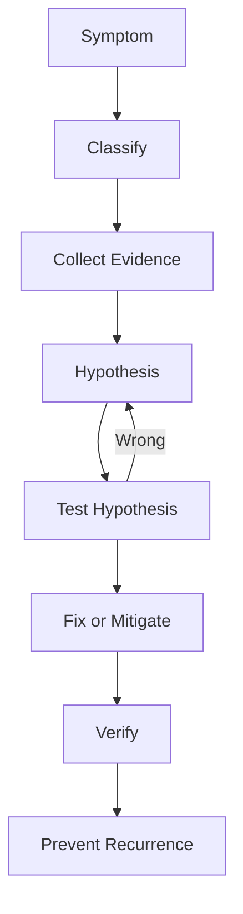
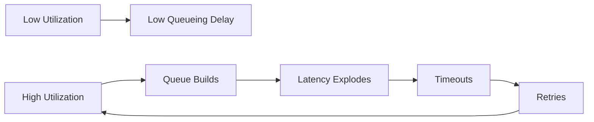
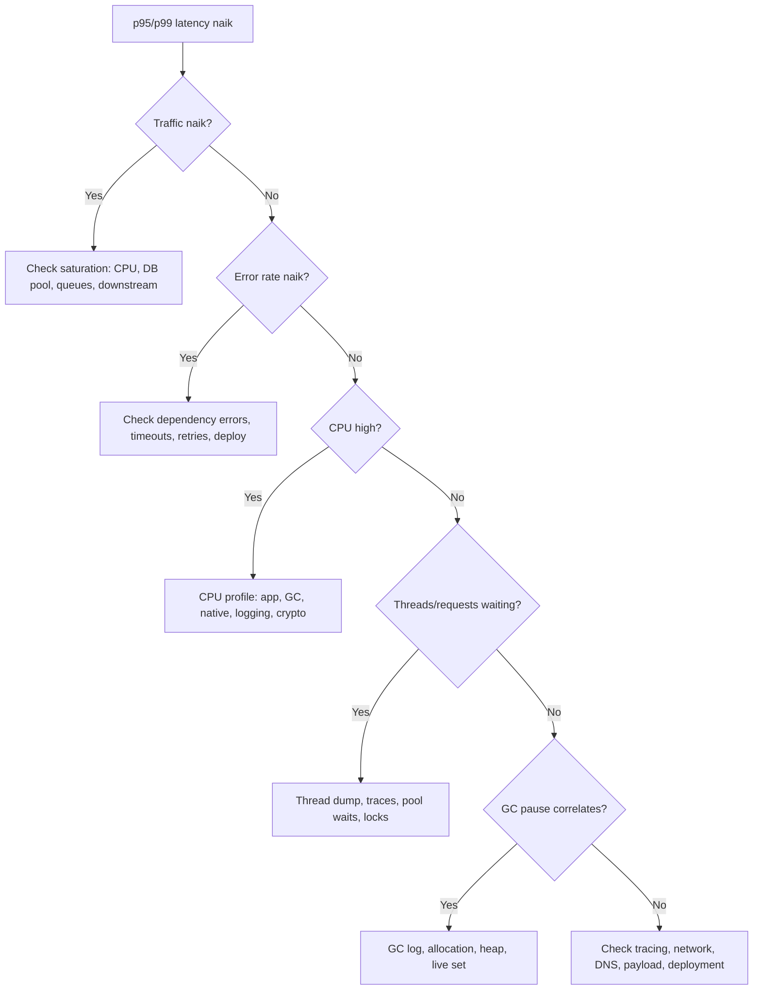
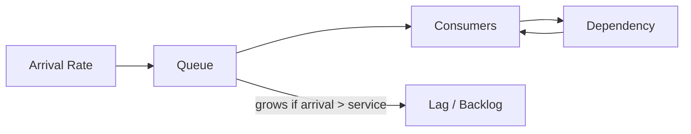
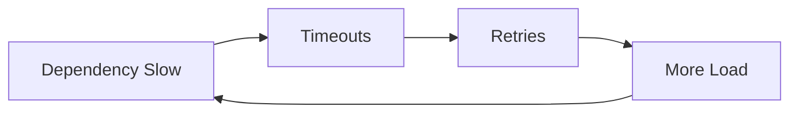

# Part 027 — Performance Troubleshooting Playbook: Latency, Throughput, Memory, Blocking, dan Saturation

Performance troubleshooting bukan mencari "kode mana yang lambat" secara acak. Performance troubleshooting adalah proses mengubah gejala menjadi hipotesis, mengumpulkan evidence, lalu mempersempit ruang penyebab.

Dalam sistem Java production, gejala yang sama bisa berasal dari banyak subsistem.

Contoh:

```text
p99 latency naik
```

Penyebab mungkin:

- database lambat;
- connection pool penuh;
- remote API timeout;
- GC pause;
- CPU saturation;
- lock contention;
- thread starvation;
- common pool blocked;
- queue backlog;
- virtual threads menunggu resource;
- allocation rate naik;
- logging sinkron;
- DNS/TLS issue;
- container CPU throttling;
- batch job mengambil resource;
- downstream retry storm;
- deploy baru mengubah serialization;
- cache miss meningkat;
- payload size naik.

Playbook ini membangun cara berpikir untuk tidak langsung menyalahkan satu komponen. Fokusnya adalah **diagnostic discipline**.

---

## 1. Target Performa

Setelah menyelesaikan bagian ini, kamu harus mampu:

- mengklasifikasikan masalah performa menjadi latency, throughput, saturation, memory, CPU, blocking, atau dependency issue;
- memakai metrik RED/USE untuk orientasi awal;
- menjelaskan performance sebagai queueing problem;
- menerapkan Little's Law secara praktis;
- membaca hubungan antara in-flight work, queue depth, utilization, latency, dan throughput;
- membedakan CPU-bound, I/O-bound, lock-bound, memory-bound, dan dependency-bound workload;
- memilih evidence yang tepat: logs, metrics, traces, JFR, GC logs, thread dump, heap dump, profiler;
- membuat decision tree incident;
- menulis incident analysis yang defensible;
- membuat prevention checklist agar masalah yang sama tidak berulang.

---

## 2. Prinsip Utama: Jangan Menebak Subsystem

Saat latency naik, jangan langsung tuning GC. Saat CPU naik, jangan langsung optimasi algorithm. Saat throughput turun, jangan langsung tambah instance.

Mulai dari pertanyaan:

```text
Apa resource yang saturated?
Apa work yang menunggu?
Apa yang berubah?
Apakah sistem lambat karena bekerja, menunggu, atau retrying?
```

Diagram berpikir:



---

## 3. Golden Signals untuk Service

Untuk service request/response, gunakan empat sinyal utama:

| Signal | Pertanyaan |
|---|---|
| Latency | Berapa lama request diproses? |
| Traffic | Berapa banyak request/task masuk? |
| Errors | Berapa yang gagal? |
| Saturation | Resource apa yang mendekati batas? |

Java-specific saturation:

- CPU usage/throttling;
- heap occupancy;
- allocation rate;
- GC pause;
- thread pool active/queue;
- virtual thread wait pattern;
- DB connection pool active/waiting;
- HTTP client pool;
- queue lag;
- lock contention;
- file descriptors;
- direct memory;
- metaspace;
- network I/O;
- disk I/O.

---

## 4. USE Method untuk Resource

USE = Utilization, Saturation, Errors.

Untuk setiap resource, tanya:

| Resource | Utilization | Saturation | Errors |
|---|---|---|---|
| CPU | CPU usage | run queue / throttling | CPU steal/throttle |
| Memory | used/RSS | near limit, GC pressure | OOME/OOMKilled |
| Disk | I/O usage | I/O queue | read/write error |
| Network | bandwidth | packet queue | connection reset |
| DB pool | active conn | waiting threads | timeout |
| Thread pool | active threads | queue depth | rejected tasks |
| Locks | lock held time | waiters | deadlock |
| Queue | consumption rate | backlog | dropped/expired messages |

Performance issue sering lebih jelas jika dilihat sebagai resource pressure.

---

## 5. Latency, Throughput, Utilization, Saturation

Definisi:

| Konsep | Makna |
|---|---|
| Latency | waktu menyelesaikan satu unit kerja |
| Throughput | jumlah unit kerja per waktu |
| Utilization | seberapa sibuk resource |
| Saturation | pekerjaan menunggu karena resource penuh |
| Queue depth | jumlah pekerjaan menunggu |
| Service time | waktu kerja aktual tanpa antre |
| Wait time | waktu menunggu sebelum/di antara kerja |
| Response time | wait time + service time |

Ketika utilization mendekati 100%, latency biasanya naik tajam karena antrean.



---

## 6. Little's Law Praktis

Little's Law:

```text
L = λ × W
```

Dimana:

- `L` = jumlah rata-rata work in system;
- `λ` = throughput/arrival rate;
- `W` = waktu rata-rata dalam sistem.

Contoh:

```text
1000 requests/second × 0.2 second latency = 200 in-flight requests
```

Jika latency naik ke 2 detik pada traffic sama:

```text
1000 req/s × 2 s = 2000 in-flight requests
```

Artinya memory, thread, connection, dan queue pressure bisa naik 10x meski traffic tidak berubah.

Implikasi:

- latency dependency naik dapat memperbanyak in-flight object;
- heap occupancy naik bisa menjadi efek, bukan root cause;
- thread pool penuh bisa terjadi karena downstream lambat;
- retry dapat memperparah arrival rate.

---

## 7. Klasifikasi Masalah

Gunakan tabel awal ini.

| Gejala | Kemungkinan Kelas |
|---|---|
| CPU 100%, latency naik | CPU-bound, GC CPU, hot loop, serialization, crypto |
| CPU rendah, latency naik | blocking, downstream wait, lock, queue, pool |
| Heap after-GC naik terus | leak/retention |
| GC sering, heap sawtooth normal | allocation pressure |
| Thread pool queue naik | worker saturated atau downstream lambat |
| DB pool waiting naik | DB pool bottleneck atau query lambat |
| Error timeout naik | downstream/deadline/queueing |
| p99 naik, p50 normal | tail issue, contention, GC pause, dependency outliers |
| Throughput flat meski traffic naik | bottleneck saturated |
| OOMKilled tanpa Java OOME | native/RSS/container memory |
| Latency naik setelah deploy | regression, config, warmup, dependency version |

---

## 8. Decision Tree: Latency Naik



---

## 9. Decision Tree: Throughput Turun

Throughput turun bisa berarti:

- incoming traffic turun;
- service menolak request;
- service saturated;
- dependency lambat;
- queue consumer lambat;
- error/timeout naik;
- autoscaling issue;
- rate limiting;
- CPU throttling;
- lock contention.

Checklist:

1. Apakah request masuk turun atau processing capacity turun?
2. Apakah error/rejection naik?
3. Apakah latency naik?
4. Apakah in-flight naik?
5. Apakah queue backlog naik?
6. Apakah CPU penuh?
7. Apakah DB pool penuh?
8. Apakah thread pool queue naik?
9. Apakah downstream latency naik?
10. Apakah deploy/config berubah?

---

## 10. CPU-Bound Troubleshooting

Gejala:

- CPU tinggi;
- run queue tinggi;
- latency naik;
- thread states banyak RUNNABLE;
- JFR/async-profiler menunjukkan hot methods;
- GC CPU mungkin tinggi atau rendah tergantung kasus.

Ambil evidence:

```bash
jcmd <pid> JFR.start name=cpu settings=profile duration=60s filename=/tmp/cpu.jfr
asprof -d 60 -e cpu -f /tmp/cpu.html <pid>
jcmd <pid> Thread.print > threads.txt
```

Pertanyaan:

- CPU habis di application code atau GC?
- Ada hot loop?
- Ada serialization/deserialization?
- Ada compression/encryption?
- Ada regex?
- Ada logging formatting?
- Ada JSON mapping besar?
- Ada accidental quadratic algorithm?
- Ada busy-wait?
- Ada retry loop?
- Ada JIT warmup setelah deploy?
- Container CPU throttled?

Mitigasi:

- fix algorithmic complexity;
- reduce work;
- cache with bounds;
- batch;
- avoid repeated expensive object creation;
- optimize serializer;
- limit concurrency CPU-bound;
- scale horizontally;
- increase CPU limit;
- tune GC jika terbukti GC CPU tinggi.

---

## 11. CPU Tinggi karena GC

Gejala:

- CPU tinggi;
- GC count/frequency naik;
- allocation rate tinggi;
- latency naik;
- heap sawtooth normal atau heap pressure tinggi.

Evidence:

- GC log;
- JFR allocation profile;
- allocation flame graph;
- heap usage chart.

Kemungkinan:

- allocation rate naik;
- payload lebih besar;
- repeated object creation;
- intermediate collections;
- boxing;
- string manipulation;
- exception-heavy control flow;
- serializer/config baru;
- logging membuat banyak temporary object.

Mitigasi:

- reduce allocation hotspot;
- stream large data;
- reuse immutable expensive objects;
- avoid unnecessary collection materialization;
- tune heap size;
- collector selection jika perlu;
- fix retention jika live set membesar.

---

## 12. Blocking dan Waiting Troubleshooting

Gejala:

- CPU tidak tinggi;
- latency tinggi;
- banyak thread WAITING/TIMED_WAITING/BLOCKED;
- in-flight requests naik;
- pool waits naik.

Evidence:

```bash
jcmd <pid> Thread.print > threads.txt
```

Cari stack yang dominan:

- DB pool acquire;
- socket read;
- HTTP client wait;
- lock monitor;
- `CompletableFuture.get/join`;
- queue take/put;
- semaphore acquire;
- rate limiter wait;
- file I/O;
- DNS lookup;
- TLS handshake.

Pertanyaan:

- menunggu dependency mana?
- apakah wait punya timeout?
- apakah pool habis?
- apakah queue unbounded?
- apakah lock terlalu besar?
- apakah thread pool starvation?
- apakah common pool digunakan untuk blocking task?
- apakah virtual threads menunggu resource yang sama?

---

## 13. Lock Contention

Gejala:

- latency naik;
- CPU mungkin sedang/rendah;
- thread dump banyak `BLOCKED`;
- JFR monitor enter events;
- async-profiler lock profile menunjukkan lock hot.

Contoh buruk:

```java
public synchronized User getUser(String id) {
    User user = cache.get(id);
    if (user == null) {
        user = remoteClient.fetch(id); // blocking I/O inside lock
        cache.put(id, user);
    }
    return user;
}
```

Masalah:

- semua caller serial;
- remote call di dalam lock;
- satu dependency lambat menahan semua request.

Perbaikan:

```java
public User getUser(String id) {
    User cached = cache.get(id);
    if (cached != null) {
        return cached;
    }

    User loaded = remoteClient.fetch(id);

    User existing = cache.putIfAbsent(id, loaded);
    return existing != null ? existing : loaded;
}
```

Atau gunakan cache library yang mendukung loading/eviction dengan concurrency yang benar.

Checklist lock:

- lock scope terlalu besar?
- I/O di dalam lock?
- lock global untuk data yang bisa dishard?
- synchronized method di hot path?
- nested locks?
- lock ordering jelas?
- data structure concurrent lebih cocok?
- immutable snapshot lebih cocok?

---

## 14. Thread Pool Starvation

Gejala:

- thread pool active penuh;
- queue depth naik;
- latency naik;
- task menunggu task lain di pool yang sama;
- `CompletableFuture` chain blocked;
- common pool dipakai untuk blocking.

Contoh deadlock/starvation:

```java
ExecutorService pool = Executors.newFixedThreadPool(10);

Future<String> outer = pool.submit(() -> {
    Future<String> inner = pool.submit(() -> remoteCall());
    return inner.get(); // waits for same pool
});
```

Jika semua worker menjalankan outer task dan menunggu inner task, inner task tidak punya worker.

Mitigasi:

- jangan block menunggu task dari pool yang sama;
- pisahkan pool CPU dan I/O;
- gunakan virtual threads untuk blocking I/O;
- gunakan structured concurrency;
- bound queue;
- expose pool metrics;
- set rejection policy jelas;
- hindari common pool untuk blocking.

---

## 15. Connection Pool Exhaustion

Gejala:

- DB pool active=max;
- waiting threads naik;
- acquire timeout;
- DB CPU mungkin tinggi atau tidak;
- request latency naik;
- thread dump menunjukkan wait di pool.

Kemungkinan:

- query lambat;
- transaction terlalu panjang;
- connection leak;
- pool terlalu kecil;
- traffic naik;
- N+1 query;
- lock database;
- downstream DB degraded;
- batch job menghabiskan connection;
- virtual threads meningkatkan concurrency tanpa membatasi DB pressure.

Checklist:

- active/idle/waiting?
- acquire time?
- query latency?
- transaction duration?
- connection leak detection?
- DB slow query log?
- deadlock/lock wait database?
- pool size vs DB max connections?
- retry storm?
- per-request query count?

Mitigasi:

- fix slow query;
- add index;
- shorten transaction;
- close resources;
- tune pool carefully;
- add timeout;
- reduce fan-out;
- bulkhead per workload;
- cache safely;
- paginate;
- remove N+1.

---

## 16. Queue Backlog

Queue backlog berarti arrival rate > processing rate.



Gejala:

- message lag naik;
- consumer CPU tinggi atau rendah;
- processing latency naik;
- retry count naik;
- DLQ naik;
- memory naik jika queue internal;
- downstream saturated.

Pertanyaan:

- producer rate naik?
- consumer rate turun?
- dependency lambat?
- partition imbalance?
- poison message?
- retry storm?
- batch size berubah?
- consumer concurrency cukup?
- ordering constraint membatasi parallelism?
- offset commit lambat?

Mitigasi:

- scale consumers;
- reduce per-message work;
- batch;
- optimize dependency;
- isolate poison messages;
- DLQ strategy;
- backpressure producers;
- increase partitions if model allows;
- tune consumer concurrency;
- load shed non-critical work.

---

## 17. Memory Troubleshooting

Klasifikasi:

| Gejala | Kemungkinan |
|---|---|
| Heap after-GC naik terus | leak/retention |
| Heap sawtooth sehat, GC sering | allocation pressure |
| OOME heap | leak, burst, batch too large |
| OOME metaspace | classloader/class generation |
| Direct buffer memory | direct buffer/native I/O |
| OOMKilled container | RSS > limit, native overhead |
| High memory after traffic spike | in-flight requests retained |
| Memory tidak turun cepat | collector behavior/live set/cache |

Evidence:

- GC log;
- heap usage after GC;
- heap dump;
- allocation profile;
- native memory tracking;
- container RSS;
- thread count;
- direct memory usage;
- metaspace metrics.

Pertanyaan:

- object apa retained?
- siapa GC root?
- apakah cache bounded?
- apakah queue bounded?
- apakah payload besar?
- apakah batch dipaginasi?
- apakah ThreadLocal?
- apakah classloader leak?
- apakah in-flight request naik karena downstream lambat?

---

## 18. GC Pause Troubleshooting

Jangan langsung menyalahkan GC. Korelasikan.

Data:

- timestamp GC pause;
- request latency;
- allocation rate;
- live set;
- heap size;
- CPU;
- container throttling;
- traffic/payload.

Jika GC pause muncul bersamaan dengan latency spike:

- cek pause duration vs p99 increase;
- cek full GC;
- cek humongous allocation;
- cek promotion failure;
- cek old generation occupancy;
- cek allocation burst;
- cek CPU saturation.

Mitigasi tergantung root cause:

- reduce allocation;
- fix retention;
- increase heap/headroom;
- stream payload;
- change collector;
- tune pause target;
- reduce CPU throttling;
- split workload.

---

## 19. Dependency Latency

Dependency lambat sering membuat Java service terlihat bermasalah.

Gejala:

- traces menunjukkan slow span;
- thread dump waiting in socket/client;
- DB/HTTP pool waits;
- retries naik;
- in-flight requests naik;
- memory naik;
- timeout errors naik.

Checklist dependency:

- connect timeout?
- read/request timeout?
- total deadline?
- retry count?
- backoff + jitter?
- circuit breaker?
- bulkhead?
- per-dependency metrics?
- fallback?
- idempotency?
- request size?
- response size?
- DNS/TLS overhead?
- connection reuse?

Anti-pattern:

```text
No timeout + infinite retry + unbounded concurrency
```

Ini adalah incident generator.

---

## 20. Retry Storm

Retry bisa memperbaiki transient failure, tetapi bisa memperparah overload.



Mitigasi:

- exponential backoff;
- jitter;
- retry budget;
- circuit breaker;
- deadline propagation;
- idempotency keys;
- distinguish retryable vs non-retryable;
- load shedding;
- queue with backpressure.

---

## 21. Container CPU Throttling

Di Kubernetes/container environment, CPU limit bisa menyebabkan throttling.

Gejala:

- app CPU terlihat tidak 100% dari perspektif container;
- latency naik;
- JFR menunjukkan wall time tinggi;
- GC/JIT/app semua lebih lambat;
- throttling metrics naik.

Mitigasi:

- cek CPU limit/request;
- cek throttling metrics;
- naikkan limit atau hapus limit sesuai policy;
- kurangi worker concurrency;
- set pool size sesuai CPU quota;
- benchmark di environment yang sama.

---

## 22. Cold Start dan Warmup

Java performance bisa buruk setelah deploy karena:

- class loading;
- JIT warmup;
- framework initialization;
- lazy caches;
- connection pool cold;
- TLS handshake;
- DNS cache;
- serializer warmup;
- branch profile belum stabil.

Gejala:

- latency tinggi hanya awal deploy;
- CPU/JIT activity tinggi;
- compilation events di JFR;
- error timeout saat readiness terlalu cepat.

Mitigasi:

- readiness setelah benar-benar siap;
- warm critical paths;
- pre-create connection pool;
- CDS/AppCDS/AOT jika sesuai;
- canary gradual;
- avoid routing full traffic instantly;
- record startup profile.

---

## 23. Performance Incident Workflow

### 23.1 First 5 Minutes

- cek user impact;
- cek recent deploy/config;
- cek traffic/error/latency;
- cek dependency dashboards;
- cek saturation dashboard;
- ambil thread dump jika hang/blocking;
- start JFR jika aman;
- jangan restart sebelum mengambil evidence jika memungkinkan.

### 23.2 First 15 Minutes

- tentukan kelas masalah;
- mitigasi user impact;
- rollback jika deploy-related kuat;
- scale jika safe dan bottleneck bukan dependency;
- reduce traffic/non-critical workload;
- disable expensive feature flag;
- increase timeout hanya jika jelas, bukan default.

### 23.3 Investigation

- correlate timeline;
- compare baseline;
- analyze traces;
- analyze JFR/profile;
- analyze GC logs;
- analyze thread dump;
- analyze heap dump jika memory;
- identify root cause.

### 23.4 Post-Incident

- write RCA;
- add missing metrics/logs;
- add guardrail;
- add load/performance test;
- update runbook;
- fix architectural cause.

---

## 24. Evidence Matrix

| Problem Class | Best Evidence |
|---|---|
| CPU hotspot | JFR CPU, async-profiler CPU |
| Allocation pressure | JFR allocation, async-profiler alloc, GC logs |
| Memory leak | Heap dump, dominator tree, GC after-collection trend |
| GC pause | GC logs, JFR GC events |
| Lock contention | Thread dump, JFR monitor events, lock profiler |
| Thread starvation | Thread dump, executor metrics |
| DB pool exhaustion | Pool metrics, thread dump, traces |
| Dependency latency | Traces, HTTP client metrics, thread dump |
| Queue backlog | queue lag/depth, consumer metrics |
| Container memory | RSS, NMT, heap/non-heap metrics |
| CPU throttling | container throttling metrics, JFR wall-clock |
| Warmup | JFR compilation/class loading, deployment timeline |

---

## 25. Performance Review Checklist

Before merging performance-sensitive change:

- [ ] Does it change allocation rate?
- [ ] Does it add blocking I/O?
- [ ] Does it add remote calls?
- [ ] Does it add retries?
- [ ] Does it change transaction duration?
- [ ] Does it change lock scope?
- [ ] Does it add shared mutable state?
- [ ] Does it add unbounded queue/cache/list?
- [ ] Does it change serialization/deserialization?
- [ ] Does it add logging in hot path?
- [ ] Does it change thread pool/executor usage?
- [ ] Does it increase fan-out?
- [ ] Does it add large payload retention?
- [ ] Does it expose metrics for new resource?
- [ ] Does it have timeout/deadline?
- [ ] Does it have load test evidence?

---

## 26. Performance Test Design

A useful load test defines:

- target workload;
- request mix;
- payload distribution;
- concurrency;
- ramp-up;
- duration;
- dependency behavior;
- data size;
- cache state;
- JVM/JDK version;
- container limits;
- GC;
- success criteria.

Metrics:

- throughput;
- p50/p95/p99/p999 latency;
- error rate;
- CPU;
- memory/RSS;
- GC pauses;
- allocation rate;
- DB pool;
- dependency latency;
- queue depth;
- retry/timeout;
- lock contention.

Avoid:

- testing only happy path;
- unrealistic payload;
- no warmup;
- no think time;
- no dependency latency;
- no GC logs;
- no baseline;
- no repeat runs.

---

## 27. Incident Report Template

```markdown
# Incident: <Title>

## Summary

What happened, when, and user impact.

## Timeline

- T0:
- T1:
- T2:

## Symptoms

- Latency:
- Error rate:
- Throughput:
- Saturation:

## Root Cause

What caused the issue?

## Contributing Factors

- Missing timeout?
- Unbounded queue?
- Insufficient metric?
- Deploy process?
- Capacity assumption?
- Dependency behavior?

## Evidence

- Metrics:
- Logs:
- Traces:
- JFR:
- Thread dump:
- GC log:
- Heap dump:

## Mitigation

What restored service?

## Permanent Fix

What prevents recurrence?

## Follow-ups

- Owner:
- Due date:
- Validation:
```

---

## 28. Latihan 20 Jam

### Jam 1–3: Queueing Simulation

Buat server simulasi dengan fixed processing time. Naikkan arrival rate sampai queue terbentuk. Catat latency.

### Jam 4–6: CPU Hotspot

Tambahkan endpoint CPU-heavy. Capture JFR/async-profiler. Temukan hot method.

### Jam 7–9: DB Pool Simulation

Buat fake connection pool dengan semaphore. Jalankan banyak request. Amati wait time.

### Jam 10–12: Thread Pool Starvation

Buat nested task yang menunggu task lain di pool sama. Ambil thread dump.

### Jam 13–15: Lock Contention

Buat synchronized hot path dengan sleep di dalam lock. Ambil JFR/thread dump. Refactor.

### Jam 16–18: Memory Retention

Buat unbounded cache. Ambil heap dump. Temukan retained path.

### Jam 19–20: Full Incident Drill

Simulasikan latency p99 naik. Ikuti workflow:

- classify;
- collect evidence;
- hypothesize;
- fix;
- verify;
- write mini-RCA.

---

## 29. Anti-Pattern

### Anti-Pattern 1 — Tuning Sebelum Diagnosis

Mengubah JVM flags tanpa tahu root cause.

### Anti-Pattern 2 — Average Latency

Average menyembunyikan tail.

### Anti-Pattern 3 — No Timeout

Blocking call tanpa timeout menciptakan infinite wait.

### Anti-Pattern 4 — Infinite Retry

Retry tanpa budget memperparah overload.

### Anti-Pattern 5 — Unbounded Everything

Unbounded queue, cache, list, executor, fan-out.

### Anti-Pattern 6 — Thread Pool as Backpressure

Thread pool sering hanya menyembunyikan batas resource yang salah.

### Anti-Pattern 7 — Blaming GC by Default

GC sering symptom dari allocation/retention/downstream issue.

### Anti-Pattern 8 — Restart Before Evidence

Restart bisa menghapus bukti paling penting.

---

## 30. Ringkasan

Performance troubleshooting Java adalah proses sistematis.

Mental model utama:

```text
Latency = service time + wait time.
Saturation creates queues.
Queues amplify latency.
Latency increases in-flight work.
In-flight work increases memory/thread/resource pressure.
Retries can turn partial failure into overload.
```

Jangan mulai dari tuning. Mulai dari klasifikasi gejala, resource saturation, evidence, dan hipotesis. Tools seperti JFR, thread dump, GC logs, heap dump, traces, dan metrics bukan tujuan. Mereka adalah cara untuk menjawab pertanyaan yang benar.

---

## 31. Referensi Resmi dan Lanjutan

- Oracle JDK Mission Control: https://docs.oracle.com/en/java/java-components/jdk-mission-control/
- JDK Flight Recorder Tutorial: https://dev.java/learn/jvm/jfr/
- Java SE 25 `Thread`: https://docs.oracle.com/en/java/javase/25/docs/api/java.base/java/lang/Thread.html
- Java SE 25 `java.util.concurrent`: https://docs.oracle.com/en/java/javase/25/docs/api/java.base/java/util/concurrent/package-summary.html
- Java SE 25 GC Tuning Guide: https://docs.oracle.com/en/java/javase/25/gctuning/
- JDK Tools and Utilities: https://docs.oracle.com/en/java/javase/25/docs/specs/man/
