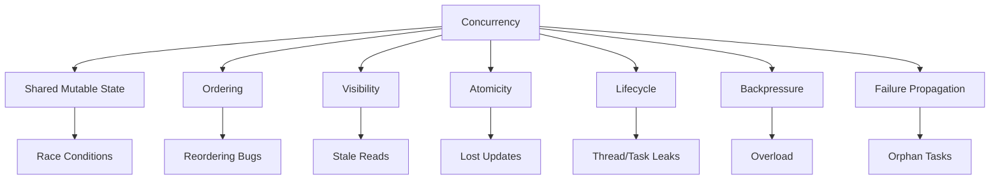
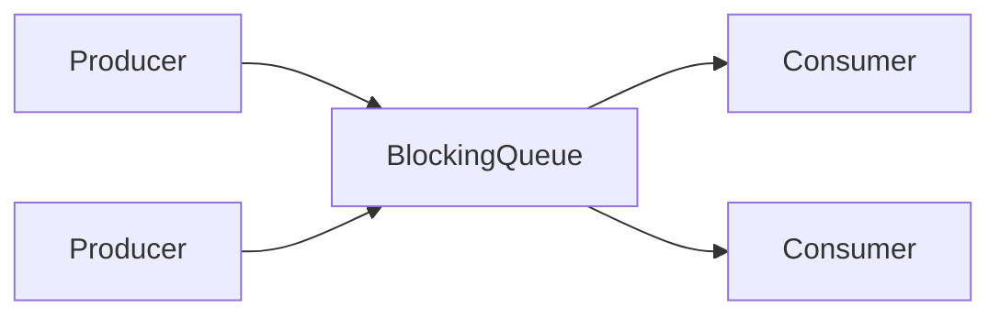
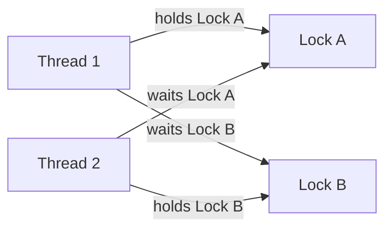

# Part 028 — Java Concurrency Deep Dive: JMM, Locks, Atomics, Queues, Synchronizers

Concurrency adalah area Java yang paling sering terlihat mudah sampai production membuktikan sebaliknya.

Kode concurrent bisa:

- lulus unit test ribuan kali;
- terlihat benar saat code review;
- berjalan baik di laptop;
- gagal hanya saat load tinggi;
- gagal hanya di mesin tertentu;
- gagal hanya setelah JDK upgrade;
- gagal hanya ketika timing berubah;
- gagal tanpa exception;
- merusak data secara diam-diam.

Karena itu, concurrency tidak boleh dipelajari sebagai daftar API. Concurrency harus dipahami sebagai kombinasi:

- shared state;
- interleavings;
- atomicity;
- visibility;
- ordering;
- ownership;
- lifecycle;
- cancellation;
- backpressure;
- failure propagation.

Part ini memperdalam fondasi Java concurrency yang sudah diperkenalkan sebelumnya.

---

## 1. Target Performa

Setelah menyelesaikan bagian ini, kamu harus mampu:

- membedakan race condition dan data race;
- menjelaskan Java Memory Model secara praktis;
- menggunakan `synchronized`, `volatile`, locks, atomics, concurrent collections, dan synchronizers dengan tepat;
- memilih antara locking, lock-free, message passing, immutability, confinement, dan copy-on-write;
- menghindari deadlock, starvation, livelock, lost update, unsafe publication, dan check-then-act bugs;
- mendesain thread-safe class dengan invariants jelas;
- memahami CAS dan ABA problem secara konseptual;
- memakai `BlockingQueue`, `Semaphore`, `CountDownLatch`, `CyclicBarrier`, `Phaser`, dan `ForkJoinPool`;
- menguji concurrent code dengan strategi yang realistis;
- melakukan code review concurrency dengan checklist.

---

## 2. Mental Model: Concurrency Problem Space



Concurrency bugs biasanya muncul ketika beberapa thread mengakses state yang sama dan setidaknya satu melakukan write tanpa koordinasi yang benar.

---

## 3. Race Condition vs Data Race

### Race Condition

Race condition terjadi ketika correctness bergantung pada timing/interleaving.

```java
if (!users.contains(id)) {
    users.add(id);
}
```

Jika dua thread menjalankan ini bersamaan, keduanya bisa melihat `id` belum ada lalu menambahkan.

### Data Race

Data race lebih spesifik: dua thread mengakses memory yang sama, setidaknya satu write, tanpa happens-before relation.

```java
class Flag {
    boolean done;

    void finish() {
        done = true;
    }

    boolean isDone() {
        return done;
    }
}
```

Tanpa synchronization/volatile, read `done` di thread lain bisa stale.

Semua data race berbahaya. Race condition bisa terjadi bahkan dengan synchronized code jika desain logic salah.

---

## 4. Tiga Dimensi Correctness

| Dimensi | Pertanyaan | Contoh Bug |
|---|---|---|
| Atomicity | Apakah operasi tidak bisa disela? | lost update |
| Visibility | Apakah write terlihat oleh thread lain? | stale flag |
| Ordering | Apakah urutan penting dipertahankan? | unsafe publication |

Contoh lost update:

```java
count++;
```

Secara konseptual:

```text
read count
add 1
write count
```

Jika dua thread melakukan itu bersamaan, satu update bisa hilang.

---

## 5. Java Memory Model

Java Memory Model mendefinisikan perilaku program multi-thread terkait shared memory.

Ia menjawab:

```text
Write dari thread A kapan wajib terlihat oleh read di thread B?
```

Konsep kunci:

- happens-before;
- synchronization actions;
- volatile read/write;
- monitor lock/unlock;
- thread start/join;
- final field semantics;
- data race;
- reordering.

JMM tidak menjamin bahwa semua write langsung terlihat oleh semua thread. Tanpa happens-before, hasil bisa mengejutkan.

---

## 6. Happens-Before Rules

Happens-before adalah relasi ordering dan visibility.

| Rule | Praktik |
|---|---|
| Program order | Dalam satu thread, statement sebelumnya happens-before statement sesudahnya |
| Monitor | Unlock happens-before lock berikutnya pada monitor yang sama |
| Volatile | Write volatile happens-before read volatile berikutnya |
| Thread start | `start()` happens-before aksi thread baru |
| Thread join | aksi thread happens-before `join()` berhasil |
| Final fields | final fields visible setelah construction aman |
| Transitive | jika A hb B dan B hb C, maka A hb C |

Contoh:

```java
class Holder {
    private int value;
    private volatile boolean ready;

    void publish() {
        value = 42;
        ready = true;
    }

    int read() {
        return ready ? value : -1;
    }
}
```

Jika thread B melihat `ready == true`, maka write `value = 42` sebelumnya terlihat.

---

## 7. Safe Publication

Object harus dipublikasikan dengan cara yang membuat state-nya terlihat benar oleh thread lain.

Cara safe publication:

- store ke `volatile` field;
- store ke field yang dilindungi lock;
- initialize static final field;
- publish melalui thread-safe collection;
- publish sebelum `Thread.start()`;
- final fields dengan construction aman.

Buruk:

```java
class Registry {
    static Service service;

    static void init() {
        service = new Service(); // unsafe publication
    }
}
```

Lebih baik:

```java
class Registry {
    private static volatile Service service;

    static void init() {
        service = new Service();
    }

    static Service get() {
        return service;
    }
}
```

Atau lifecycle eksplisit dengan dependency injection yang menjamin publication.

---

## 8. Thread Confinement

Cara paling mudah membuat code thread-safe adalah tidak berbagi state.

Contoh:

```java
public Response handle(Request request) {
    List<Event> events = new ArrayList<>();
    events.add(parse(request));
    return process(events);
}
```

`events` hanya digunakan thread request tersebut.

Jenis confinement:

- stack confinement;
- thread confinement;
- actor/single writer;
- event loop confinement;
- request scope;
- transaction scope.

Rule:

> Shared mutable state adalah sumber utama complexity. Hindari sebelum mengunci.

---

## 9. Immutability

Immutable object thread-safe jika dibangun dengan benar.

```java
public record Money(BigDecimal amount, Currency currency) {
    public Money {
        Objects.requireNonNull(amount);
        Objects.requireNonNull(currency);
    }
}
```

Tapi hati-hati dengan mutable fields:

```java
public record UserRoles(List<String> roles) {
    public UserRoles {
        roles = List.copyOf(roles);
    }
}
```

Records tidak otomatis deep immutable. Kamu tetap harus defensive copy untuk mutable components.

---

## 10. `synchronized`

`synchronized` menyediakan:

- mutual exclusion;
- visibility;
- reentrancy;
- monitor-based wait/notify.

Contoh:

```java
public final class Counter {
    private int value;

    public synchronized void increment() {
        value++;
    }

    public synchronized int get() {
        return value;
    }
}
```

Unlock dari `increment` happens-before lock berikutnya pada `get`.

Kelebihan:

- sederhana;
- language-level;
- otomatis release lock saat exception;
- cukup untuk banyak kasus.

Kekurangan:

- tidak bisa try-lock;
- tidak bisa interrupt lock acquisition;
- satu condition queue implicit;
- bisa contention;
- wait/notify raw mudah salah.

---

## 11. Monitor Invariant

Jika memakai lock, tentukan invariant yang dilindungi lock.

```java
public final class BoundedCounter {
    private int value;
    private final int max;

    public BoundedCounter(int max) {
        this.max = max;
    }

    public synchronized boolean incrementIfPossible() {
        if (value >= max) {
            return false;
        }
        value++;
        return true;
    }

    public synchronized int value() {
        return value;
    }
}
```

Invariant:

```text
0 <= value <= max
```

Semua akses ke `value` harus melewati lock yang sama. Jika ada satu akses tanpa lock, invariant bisa bocor.

---

## 12. `wait` / `notify` / `notifyAll`

Low-level condition coordination.

Pattern benar selalu memakai loop:

```java
synchronized (lock) {
    while (!condition) {
        lock.wait();
    }
    // proceed
}
```

Kenapa loop?

- spurious wakeup;
- condition bisa berubah sebelum thread bangun;
- beberapa waiter;
- notify tidak membawa state.

Biasanya lebih baik memakai:

- `BlockingQueue`;
- `CountDownLatch`;
- `Semaphore`;
- `Condition`;
- higher-level concurrency utilities.

---

## 13. `ReentrantLock`

`ReentrantLock` memberi kontrol lebih dari `synchronized`.

```java
private final ReentrantLock lock = new ReentrantLock();

public void update() {
    lock.lock();
    try {
        mutateState();
    } finally {
        lock.unlock();
    }
}
```

Fitur:

- `tryLock`;
- lock interruptibly;
- fairness option;
- multiple `Condition`;
- introspection tertentu.

Contoh try-lock:

```java
if (lock.tryLock(100, TimeUnit.MILLISECONDS)) {
    try {
        return compute();
    } finally {
        lock.unlock();
    }
}
throw new TimeoutException("Could not acquire lock");
```

Gunakan jika butuh kemampuan ini. Jika tidak, `synchronized` sering lebih sederhana.

---

## 14. `ReadWriteLock`

`ReadWriteLock` memisahkan read lock dan write lock.

Cocok jika:

- read jauh lebih banyak daripada write;
- read operation cukup lama;
- contention nyata;
- data dilindungi lock yang sama;
- benchmark membuktikan manfaat.

```java
private final ReadWriteLock rw = new ReentrantReadWriteLock();
private final Map<String, User> users = new HashMap<>();

public User get(String id) {
    rw.readLock().lock();
    try {
        return users.get(id);
    } finally {
        rw.readLock().unlock();
    }
}

public void put(String id, User user) {
    rw.writeLock().lock();
    try {
        users.put(id, user);
    } finally {
        rw.writeLock().unlock();
    }
}
```

Hati-hati:

- writer starvation;
- lock upgrade sulit;
- overhead bisa lebih besar dari manfaat;
- concurrent map bisa lebih cocok.

---

## 15. `StampedLock`

`StampedLock` mendukung optimistic read.

```java
private final StampedLock lock = new StampedLock();
private double x;
private double y;

double distanceFromOrigin() {
    long stamp = lock.tryOptimisticRead();
    double currentX = x;
    double currentY = y;

    if (!lock.validate(stamp)) {
        stamp = lock.readLock();
        try {
            currentX = x;
            currentY = y;
        } finally {
            lock.unlockRead(stamp);
        }
    }

    return Math.hypot(currentX, currentY);
}
```

Cocok untuk read-heavy data dengan write jarang.

Hati-hati:

- tidak reentrant;
- API lebih sulit;
- salah unlock bisa fatal;
- optimistic read hanya aman jika validate benar;
- tidak untuk default pilihan.

---

## 16. `volatile`

`volatile` memberi visibility dan ordering, bukan mutual exclusion untuk compound action.

Cocok:

```java
private volatile boolean shutdown;

public void stop() {
    shutdown = true;
}

public void run() {
    while (!shutdown) {
        doWork();
    }
}
```

Tidak cukup:

```java
private volatile int count;

public void increment() {
    count++; // not atomic
}
```

Gunakan volatile untuk:

- status flag;
- immutable reference publication;
- simple state visibility;
- double-checked locking field.

Jangan gunakan volatile untuk:

- compound update;
- multi-field invariant;
- collection mutation;
- check-then-act.

---

## 17. Atomics

Atomic classes mendukung lock-free thread-safe operations pada single variables.

Contoh:

```java
private final AtomicInteger count = new AtomicInteger();

public int increment() {
    return count.incrementAndGet();
}
```

Atomic classes:

- `AtomicInteger`;
- `AtomicLong`;
- `AtomicBoolean`;
- `AtomicReference`;
- `AtomicIntegerArray`;
- `AtomicReferenceArray`.

Use cases:

- counters;
- state machine CAS;
- one-time initialization;
- non-blocking algorithms;
- metrics.

---

## 18. CAS

CAS = Compare-And-Set.

Konsep:

```text
Jika current value == expected, set ke new value.
Jika tidak, gagal.
```

Contoh:

```java
AtomicReference<State> state = new AtomicReference<>(State.NEW);

boolean started = state.compareAndSet(State.NEW, State.STARTED);
```

CAS loop:

```java
public void add(int delta) {
    while (true) {
        int current = value.get();
        int next = current + delta;
        if (value.compareAndSet(current, next)) {
            return;
        }
    }
}
```

Risiko:

- spin under contention;
- livelock-like behavior;
- complex correctness;
- ABA problem;
- hard to compose multi-variable invariants.

---

## 19. ABA Problem

ABA terjadi ketika value berubah dari A ke B lalu kembali ke A. CAS melihat A dan menganggap tidak berubah.

```text
Thread 1 reads A
Thread 2 changes A -> B -> A
Thread 1 CAS A -> C succeeds
```

Padahal state pernah berubah.

Mitigasi:

- `AtomicStampedReference`;
- version number;
- immutable state object;
- lock;
- higher-level structure.

Sering kali, untuk business application, lock lebih jelas dan aman daripada custom lock-free structure.

---

## 20. `LongAdder`

`LongAdder` lebih baik dari `AtomicLong` untuk high-contention counters.

```java
private final LongAdder requests = new LongAdder();

public void increment() {
    requests.increment();
}

public long count() {
    return requests.sum();
}
```

Cocok untuk:

- metrics counters;
- high update rate;
- approximate/current sum acceptable.

Tidak cocok jika:

- butuh immediate exact value untuk correctness;
- value menjadi bagian invariant;
- update dan read harus linearizable.

---

## 21. Concurrent Collections

### 21.1 `ConcurrentHashMap`

```java
ConcurrentHashMap<String, User> users = new ConcurrentHashMap<>();
```

Useful methods:

```java
users.putIfAbsent(id, user);
users.computeIfAbsent(id, this::loadUser);
users.compute(id, (key, old) -> update(old));
```

Hati-hati dengan `computeIfAbsent`:

- mapping function sebaiknya tidak terlalu berat;
- jangan melakukan nested update yang bisa membingungkan;
- jangan melakukan blocking I/O lama jika contention key tinggi tanpa memahami efek.

### 21.2 `CopyOnWriteArrayList`

Cocok untuk:

- read sangat sering;
- write sangat jarang;
- listener list.

Tidak cocok untuk:

- write sering;
- list besar;
- mutation-heavy workload.

### 21.3 `ConcurrentLinkedQueue`

Non-blocking queue untuk producer/consumer tertentu. Tidak menyediakan blocking wait.

### 21.4 `BlockingQueue`

Lebih cocok untuk bounded producer/consumer dengan backpressure.

---

## 22. `BlockingQueue`

`BlockingQueue` menggabungkan queue dan coordination.

Contoh:

```java
BlockingQueue<Job> queue = new ArrayBlockingQueue<>(1000);

public void produce(Job job) throws InterruptedException {
    queue.put(job); // blocks if full
}

public Job consume() throws InterruptedException {
    return queue.take(); // blocks if empty
}
```

Pilihan:

| Queue | Karakter |
|---|---|
| `ArrayBlockingQueue` | bounded, array-backed |
| `LinkedBlockingQueue` | optionally bounded, linked nodes |
| `PriorityBlockingQueue` | priority order, unbounded |
| `DelayQueue` | delayed availability |
| `SynchronousQueue` | direct handoff, no capacity |
| `LinkedTransferQueue` | transfer semantics |

Rule:

> Prefer bounded queue for production unless unbounded growth is explicitly safe.

---

## 23. Producer-Consumer Pattern



Production concerns:

- queue capacity;
- rejection/drop policy;
- shutdown;
- poison message;
- retry;
- backpressure;
- consumer exception handling;
- metrics:
  - queue depth;
  - enqueue rate;
  - dequeue rate;
  - processing latency;
  - failure count.

---

## 24. `CountDownLatch`

One-shot gate. Threads wait until count reaches zero.

```java
CountDownLatch ready = new CountDownLatch(3);

executor.submit(() -> {
    initializeA();
    ready.countDown();
});

executor.submit(() -> {
    initializeB();
    ready.countDown();
});

executor.submit(() -> {
    initializeC();
    ready.countDown();
});

ready.await();
startService();
```

Use cases:

- wait for startup tasks;
- coordinate test threads;
- wait for N operations.

Cannot be reset.

---

## 25. `CyclicBarrier`

Reusable barrier. A group of threads wait until all arrive.

```java
CyclicBarrier barrier = new CyclicBarrier(4);

void worker() throws Exception {
    prepare();
    barrier.await();
    runPhase();
}
```

Use cases:

- phased algorithms;
- test coordination;
- simulation.

If one thread fails, barrier can break.

---

## 26. `Semaphore`

Semaphore controls permits.

```java
Semaphore permits = new Semaphore(50);

public Response callDependency(Request request) throws Exception {
    if (!permits.tryAcquire(100, TimeUnit.MILLISECONDS)) {
        throw new RejectedExecutionException("dependency bulkhead full");
    }

    try {
        return dependency.call(request);
    } finally {
        permits.release();
    }
}
```

Use cases:

- limit concurrent access to dependency;
- bulkhead;
- resource permits;
- virtual-thread resource control.

Do not use semaphore as hidden business logic. Name it after the resource it protects.

---

## 27. `Phaser`

`Phaser` supports dynamic parties and multiple phases.

```java
Phaser phaser = new Phaser(1);

for (Task task : tasks) {
    phaser.register();
    executor.submit(() -> {
        try {
            runTask(task);
        } finally {
            phaser.arriveAndDeregister();
        }
    });
}

phaser.arriveAndAwaitAdvance();
```

Use cases:

- dynamic phased coordination;
- test harness;
- simulation;
- staged parallel processing.

More flexible than `CyclicBarrier`, but also harder to reason about.

---

## 28. `ForkJoinPool`

`ForkJoinPool` is designed for work-stealing parallelism.

Cocok untuk:

- divide-and-conquer CPU work;
- recursive decomposition;
- tasks that fork subtasks and join;
- parallel streams.

Tidak cocok untuk:

- blocking I/O tanpa managed blocking;
- long-lived blocking tasks;
- arbitrary request handling;
- hiding slow dependency.

Example:

```java
class SumTask extends RecursiveTask<Long> {
    private final long[] values;
    private final int start;
    private final int end;

    SumTask(long[] values, int start, int end) {
        this.values = values;
        this.start = start;
        this.end = end;
    }

    @Override
    protected Long compute() {
        if (end - start <= 10_000) {
            long sum = 0;
            for (int i = start; i < end; i++) {
                sum += values[i];
            }
            return sum;
        }

        int mid = (start + end) >>> 1;
        SumTask left = new SumTask(values, start, mid);
        SumTask right = new SumTask(values, mid, end);

        left.fork();
        long rightResult = right.compute();
        long leftResult = left.join();

        return leftResult + rightResult;
    }
}
```

---

## 29. Deadlock

Deadlock terjadi ketika thread saling menunggu resource yang tidak akan dilepas.



Contoh:

```java
void transfer(Account from, Account to, Money amount) {
    synchronized (from) {
        synchronized (to) {
            from.debit(amount);
            to.credit(amount);
        }
    }
}
```

Jika thread lain transfer arah sebaliknya, deadlock mungkin.

Mitigasi: lock ordering.

```java
void transfer(Account a, Account b, Money amount) {
    Account first = a.id().compareTo(b.id()) < 0 ? a : b;
    Account second = first == a ? b : a;

    synchronized (first) {
        synchronized (second) {
            a.debit(amount);
            b.credit(amount);
        }
    }
}
```

---

## 30. Starvation dan Livelock

### Starvation

Thread tidak mendapat kesempatan berjalan atau resource.

Penyebab:

- unfair lock;
- priority issue;
- pool penuh oleh task lama;
- queue priority salah;
- writer starvation di read/write lock.

### Livelock

Thread aktif tetapi tidak membuat progress.

Contoh konseptual:

```text
Thread A backs off for B.
Thread B backs off for A.
Both keep retrying forever.
```

Mitigasi:

- backoff random/jitter;
- fairness jika perlu;
- bounded retry;
- progress metrics;
- simpler coordination.

---

## 31. Cancellation dan Interruption

Java interruption adalah cooperative cancellation signal.

```java
public void run() {
    while (!Thread.currentThread().isInterrupted()) {
        doUnitOfWork();
    }
}
```

Blocking methods seperti `BlockingQueue.take()` bisa throw `InterruptedException`.

Pattern benar:

```java
try {
    queue.take();
} catch (InterruptedException e) {
    Thread.currentThread().interrupt();
    return;
}
```

Jangan swallow interrupt:

```java
catch (InterruptedException e) {
    // bad: lost cancellation signal
}
```

Cancellation harus menjadi bagian desain API concurrent.

---

## 32. Thread-Safe Class Design

Template berpikir:

```markdown
# Thread Safety Design

## State

What mutable state exists?

## Ownership

Who owns the state?

## Access

Which methods read/write it?

## Invariant

What must always be true?

## Synchronization

What lock/atomic/confinement protects it?

## Publication

How is object safely published?

## Lifecycle

How does it start/stop?

## Cancellation

How are operations cancelled?

## Backpressure

What happens under overload?
```

---

## 33. Choosing a Concurrency Strategy

| Strategy | Best For | Trade-off |
|---|---|---|
| Immutability | value objects, configs | copying cost |
| Confinement | request/task state | requires clear ownership |
| `synchronized` | simple invariants | contention, less control |
| `ReentrantLock` | tryLock, interruptible, conditions | manual unlock |
| Atomics | single-variable state | hard composition |
| Concurrent collections | shared maps/queues | semantics still matter |
| BlockingQueue | producer-consumer | capacity/shutdown complexity |
| Semaphore | resource permits | misuse can hide bottleneck |
| Actor/single writer | ordered mutation | queue/backpressure |
| Virtual threads | blocking I/O tasks | resource control still needed |
| ForkJoin | CPU divide-and-conquer | blocking dangerous |

---

## 34. Testing Concurrent Code

Normal unit tests are not enough.

Strategies:

- deterministic tests for invariants;
- stress tests;
- repeated tests;
- thread coordination with latches/barriers;
- randomized scheduling;
- timeouts;
- jcstress for JMM-level concurrency tests;
- property-based tests for invariants;
- static analysis;
- code review checklist.

Example test coordination:

```java
CountDownLatch start = new CountDownLatch(1);
CountDownLatch done = new CountDownLatch(threadCount);

for (int i = 0; i < threadCount; i++) {
    executor.submit(() -> {
        try {
            start.await();
            counter.increment();
        } finally {
            done.countDown();
        }
    });
}

start.countDown();
done.await();

assertEquals(threadCount, counter.value());
```

This makes threads race more intentionally.

---

## 35. Concurrency Code Review Checklist

- [ ] What mutable state is shared?
- [ ] What invariant is protected?
- [ ] What synchronization mechanism protects it?
- [ ] Are all accesses protected consistently?
- [ ] Is publication safe?
- [ ] Is `volatile` used only for visibility/simple state?
- [ ] Are compound actions atomic?
- [ ] Is there check-then-act race?
- [ ] Is there iterate-then-modify race?
- [ ] Are locks acquired in consistent order?
- [ ] Is I/O performed inside lock?
- [ ] Can task block pool worker waiting for same pool?
- [ ] Are queues bounded?
- [ ] Is cancellation handled?
- [ ] Are interrupts preserved?
- [ ] Are timeouts present?
- [ ] Are thread pools named and instrumented?
- [ ] Are virtual threads used only with resource limits?
- [ ] Are tests designed to expose interleavings?

---

## 36. Latihan 20 Jam

### Jam 1–3: Lost Update

Implementasikan counter dengan plain `int`, `synchronized`, `AtomicInteger`, dan `LongAdder`. Stress dengan banyak thread.

### Jam 4–6: Visibility Bug

Buat stop flag non-volatile. Amati behavior. Perbaiki dengan `volatile`.

### Jam 7–9: Safe Publication

Buat object mutable dipublish unsafe. Refactor ke final fields + safe publication.

### Jam 10–12: Producer Consumer

Buat bounded queue dengan multiple producers/consumers. Tambahkan shutdown protocol.

### Jam 13–15: Semaphore Bulkhead

Batasi fake remote dependency dengan semaphore. Tambahkan timeout dan metrics.

### Jam 16–18: Deadlock Drill

Buat deadlock dua lock. Capture thread dump. Perbaiki dengan lock ordering.

### Jam 19–20: Concurrent Class Review

Ambil class mutable existing. Tulis thread-safety design doc:

- state;
- invariant;
- synchronization;
- lifecycle;
- tests.

---

## 37. Anti-Pattern

### Anti-Pattern 1 — "ConcurrentHashMap Makes Everything Safe"

Map operation thread-safe tidak otomatis membuat business invariant thread-safe.

### Anti-Pattern 2 — `volatile` untuk Semua Masalah

`volatile` bukan lock.

### Anti-Pattern 3 — Blocking di Common Pool

Blocking task di common pool bisa starve unrelated tasks.

### Anti-Pattern 4 — Unbounded Queue

Unbounded queue mengubah overload menjadi memory problem.

### Anti-Pattern 5 — Swallow InterruptedException

Menghapus cancellation signal.

### Anti-Pattern 6 — I/O di Dalam Lock

Satu dependency lambat bisa menahan semua thread.

### Anti-Pattern 7 — Custom Lock-Free Algorithm Tanpa Bukti

Sulit benar, sulit diuji, sulit direview.

### Anti-Pattern 8 — Tests Without Real Interleaving

Concurrent bug jarang muncul di test single-threaded.

---

## 38. Ringkasan

Java concurrency adalah tentang menjaga invariant di bawah interleaving.

Mental model utama:

```text
If state is mutable and shared, it needs a correctness strategy.
The strategy can be immutability, confinement, locking, atomics, message passing, or higher-level coordination.
Visibility is not automatic.
Atomicity is not automatic.
Ordering is not automatic.
Thread-safe components do not automatically create thread-safe workflows.
```

Kunci top-tier bukan tahu semua class di `java.util.concurrent`, tetapi mampu menjawab:

```text
State apa yang dibagi?
Invariant apa yang harus dijaga?
Siapa owner state?
Apa happens-before relation-nya?
Apa yang terjadi saat overload?
Apa yang terjadi saat cancellation?
Bagaimana kita tahu ini benar?
```

---

## 39. Referensi Resmi

- Java SE 25 `java.util.concurrent`: https://docs.oracle.com/en/java/javase/25/docs/api/java.base/java/util/concurrent/package-summary.html
- Java SE 25 `java.util.concurrent.atomic`: https://docs.oracle.com/en/java/javase/25/docs/api/java.base/java/util/concurrent/atomic/package-summary.html
- Java SE 25 `java.util.concurrent.locks`: https://docs.oracle.com/en/java/javase/25/docs/api/java.base/java/util/concurrent/locks/package-summary.html
- Java Language Specification Java SE 25 — Chapter 17, Threads and Locks: https://docs.oracle.com/javase/specs/jls/se25/html/jls-17.html
- Java SE 25 `Thread`: https://docs.oracle.com/en/java/javase/25/docs/api/java.base/java/lang/Thread.html
- jcstress: https://openjdk.org/projects/code-tools/jcstress/
