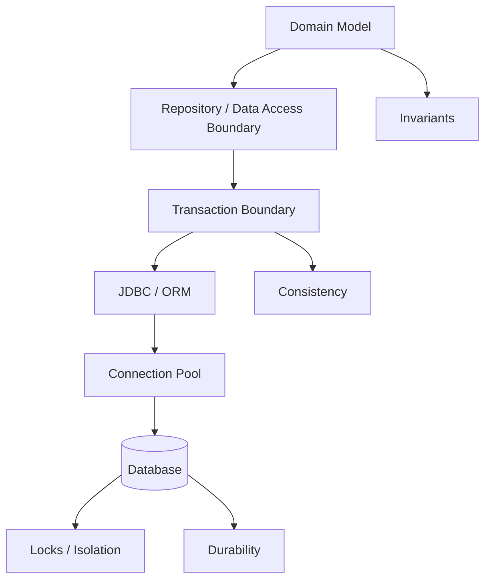
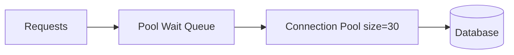
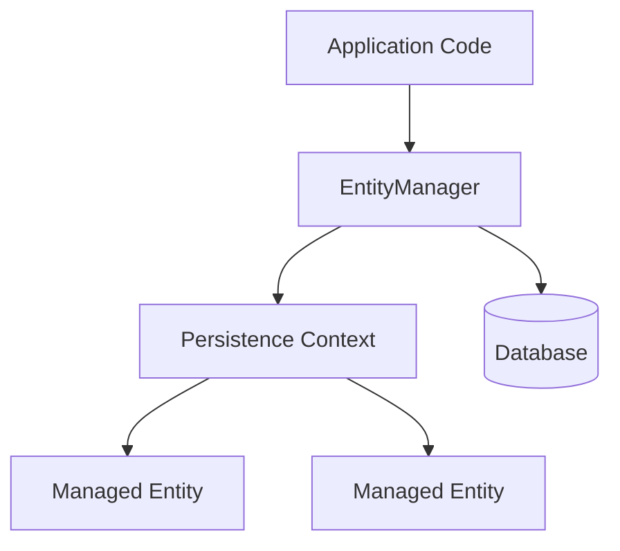
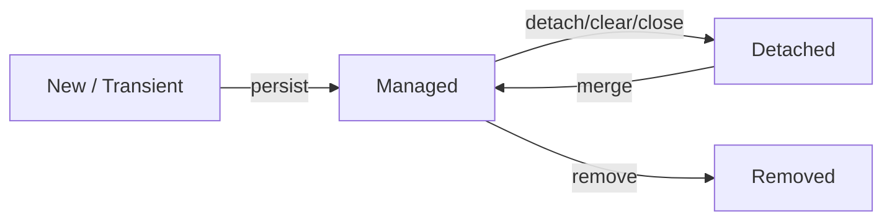
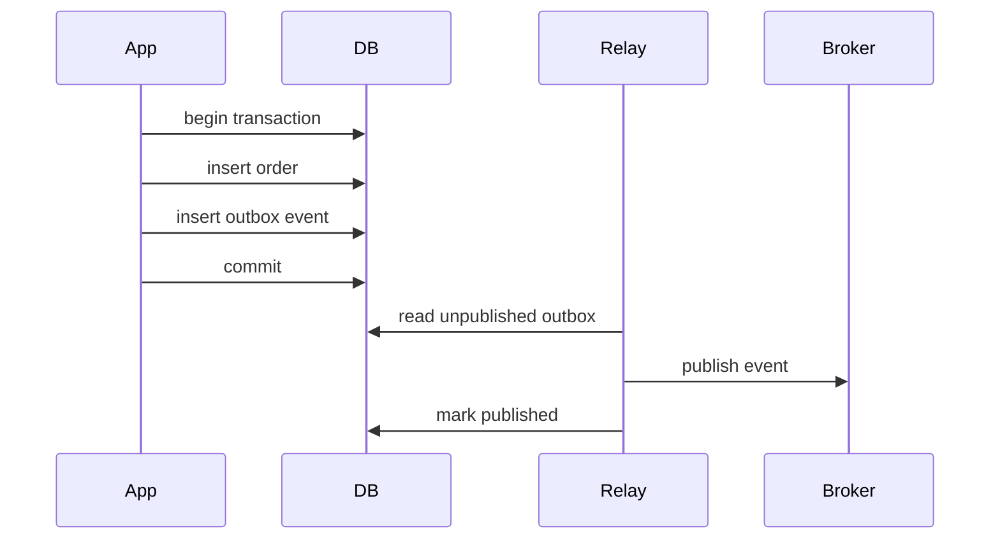
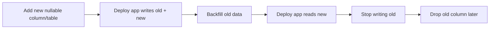

# Part 030 — Persistence, Transaction, Consistency, JDBC, JPA, dan Data Access Boundaries

Sebagian besar sistem bisnis Java bukan CPU-bound. Mereka data-bound.

Masalah production yang sering muncul:

- connection pool habis;
- query lambat;
- transaction terlalu panjang;
- deadlock database;
- N+1 query;
- lazy loading di tempat salah;
- optimistic lock exception tidak ditangani;
- duplicate message processing;
- partial write;
- inconsistent read;
- migration gagal;
- ORM menyembunyikan query mahal;
- transaction boundary bocor ke API layer;
- entity dipakai sebagai DTO;
- async task memakai persistence context yang sudah tutup;
- retry membuat duplicate side effect.

Persistence bukan hanya “cara menyimpan data”. Persistence adalah boundary antara memory, transaction, consistency, concurrency, failure, dan auditability.

Part ini membangun mental model Java data access dari JDBC sampai JPA dan production patterns.

---

## 1. Target Performa

Setelah menyelesaikan bagian ini, kamu harus mampu:

- memahami JDBC sebagai baseline data access Java;
- memakai `Connection`, `PreparedStatement`, `ResultSet`, commit, rollback, dan isolation dengan benar;
- menjelaskan auto-commit dan transaction boundary;
- memilih isolation level berdasarkan anomaly yang ingin dicegah;
- memahami connection pool sebagai resource boundary;
- mengenali connection leak, pool exhaustion, long transaction, dan slow query;
- memahami JPA persistence context, entity lifecycle, dirty checking, flush, lazy loading, dan transaction interaction;
- menghindari N+1 query dan entity/DTO boundary leak;
- memilih optimistic vs pessimistic locking;
- mendesain repository/data-access boundary yang tidak merusak domain;
- menerapkan outbox pattern dan idempotency untuk consistency antar-service;
- membuat database migration discipline;
- membuat data-access production checklist.

---

## 2. Persistence sebagai Boundary



Boundary yang harus jelas:

| Boundary | Pertanyaan |
|---|---|
| Domain boundary | Apa invariant bisnis? |
| Transaction boundary | Operasi apa harus atomic? |
| Data access boundary | Query/write apa yang diizinkan? |
| Consistency boundary | Kapan data boleh eventually consistent? |
| Resource boundary | Berapa connection/query/concurrency yang aman? |
| Failure boundary | Apa yang terjadi saat commit gagal? |
| Migration boundary | Bagaimana schema berubah tanpa downtime? |

---

## 3. JDBC Mental Model

JDBC adalah API Java standar untuk berinteraksi dengan database relational.

Core objects:

| Object | Fungsi |
|---|---|
| `DataSource` | sumber connection, biasanya dari pool |
| `Connection` | session/connection ke database |
| `PreparedStatement` | SQL precompiled/parameterized |
| `ResultSet` | hasil query |
| `SQLException` | failure dari database/driver |
| Transaction | dikelola via connection commit/rollback |

Contoh baseline:

```java
public Optional<User> findById(DataSource dataSource, String id) throws SQLException {
    String sql = """
            select id, name, email
            from users
            where id = ?
            """;

    try (Connection connection = dataSource.getConnection();
         PreparedStatement statement = connection.prepareStatement(sql)) {

        statement.setString(1, id);

        try (ResultSet rs = statement.executeQuery()) {
            if (!rs.next()) {
                return Optional.empty();
            }

            User user = new User(
                    rs.getString("id"),
                    rs.getString("name"),
                    rs.getString("email")
            );

            return Optional.of(user);
        }
    }
}
```

Prinsip:

- selalu close resource;
- gunakan try-with-resources;
- gunakan `PreparedStatement`;
- jangan string-concatenate input ke SQL;
- map `ResultSet` secara eksplisit;
- batasi result set;
- punya timeout.

---

## 4. PreparedStatement dan SQL Injection

Buruk:

```java
String sql = "select * from users where email = '" + email + "'";
```

Jika `email` mengandung input berbahaya, SQL injection mungkin terjadi.

Benar:

```java
String sql = "select * from users where email = ?";
PreparedStatement ps = connection.prepareStatement(sql);
ps.setString(1, email);
```

`PreparedStatement` memisahkan SQL structure dari parameter value.

Namun `PreparedStatement` bukan silver bullet untuk semua dynamic SQL. Untuk dynamic order by/table/column names, kamu tetap perlu whitelist.

```java
String orderBy = switch (sort) {
    case "name" -> "name";
    case "createdAt" -> "created_at";
    default -> throw new IllegalArgumentException("Unsupported sort");
};

String sql = "select id, name from users order by " + orderBy;
```

---

## 5. Auto-Commit

Secara default, JDBC connection baru biasanya berada dalam auto-commit mode. Dalam mode ini, setiap statement dieksekusi dan di-commit sebagai transaction sendiri.

Contoh:

```java
connection.setAutoCommit(false);
try {
    debit(connection, fromAccount, amount);
    credit(connection, toAccount, amount);

    connection.commit();
} catch (Exception e) {
    connection.rollback();
    throw e;
}
```

Jika debit sukses tetapi credit gagal, rollback menjaga atomicity.

Rule:

> Setiap operasi multi-statement yang harus atomic harus punya transaction boundary eksplisit.

---

## 6. Transaction Boundary

Transaction menjamin ACID dalam scope tertentu:

| Property | Makna Praktis |
|---|---|
| Atomicity | semua sukses atau semua rollback |
| Consistency | invariant database/domain dijaga |
| Isolation | concurrent transaction tidak saling merusak sesuai level |
| Durability | commit bertahan setelah failure tertentu |

Transaction boundary harus mengikuti business invariant.

Contoh:

```text
Transfer uang:
- debit account A
- credit account B
- insert ledger entry
```

Harus satu transaction.

Contoh yang tidak harus satu transaction:

```text
Update order status
Send email notification
```

Email tidak bisa rollback bersama DB secara natural. Gunakan outbox/event.

---

## 7. Transaction Scope Terlalu Panjang

Buruk:

```java
@Transactional
public void processOrder(OrderId id) {
    Order order = repository.findById(id);

    PaymentResult payment = paymentGateway.charge(order); // remote call inside tx

    order.markPaid(payment.id());
    repository.save(order);
}
```

Risiko:

- DB lock dipegang saat remote call;
- transaction lama;
- deadlock risk naik;
- connection pool tertahan;
- timeout;
- payment side effect tidak rollback jika DB commit gagal.

Lebih baik desain ulang:

1. reserve/validate order dalam transaction pendek;
2. call payment di luar transaction;
3. update result dalam transaction baru;
4. gunakan idempotency key/outbox/saga jika perlu.

---

## 8. Isolation Levels

Isolation menentukan anomaly apa yang dicegah.

JDBC constants umum:

| Isolation | Anomaly yang Bisa Dicegah |
|---|---|
| `READ_UNCOMMITTED` | paling lemah, dirty reads mungkin |
| `READ_COMMITTED` | mencegah dirty read |
| `REPEATABLE_READ` | mencegah non-repeatable read |
| `SERIALIZABLE` | isolation terkuat, menghindari banyak anomaly tetapi mahal |
| DB-specific snapshot | tergantung database |

Anomalies:

| Anomaly | Contoh |
|---|---|
| Dirty read | membaca data transaction lain yang belum commit |
| Non-repeatable read | membaca row sama dua kali, hasil berubah |
| Phantom read | query range sama dua kali, row baru muncul |
| Lost update | dua transaction update berdasarkan read lama |
| Write skew | dua transaction menjaga invariant gabungan tetapi lolos bersamaan |

Jangan memilih isolation level berdasarkan “semakin tinggi semakin bagus”. Pilih berdasarkan invariant.

---

## 9. Optimistic Locking

Optimistic locking cocok saat conflict jarang.

Pola umum: version column.

```sql
update orders
set status = ?, version = version + 1
where id = ? and version = ?
```

Jika affected rows = 0, ada conflict.

Di JPA:

```java
@Version
private long version;
```

Saat conflict, provider melempar optimistic lock exception.

Gunakan untuk:

- entity update oleh user;
- aggregate dengan conflict jarang;
- mencegah lost update;
- UX retry/merge bisa diterima.

Tangani:

- retry dengan batas;
- tampilkan conflict ke user;
- reload state;
- merge intent, bukan overwrite buta.

---

## 10. Pessimistic Locking

Pessimistic locking cocok saat conflict sering atau invariant sangat kritis.

SQL:

```sql
select *
from accounts
where id = ?
for update
```

JPA lock mode:

```java
entityManager.find(Account.class, id, LockModeType.PESSIMISTIC_WRITE);
```

Risiko:

- deadlock;
- lock wait;
- transaction lama;
- throughput turun;
- connection tertahan.

Gunakan hati-hati untuk:

- inventory reservation;
- financial ledger mutation;
- sequence/allocator;
- critical uniqueness/invariant yang tidak cukup dengan optimistic.

---

## 11. Connection Pool sebagai Resource Boundary

Connection pool bukan performance decoration. Ia adalah batas concurrency ke database.

Jika pool size 30, hanya 30 operation DB concurrent yang bisa memakai connection.



Jika virtual threads membuat 10.000 request concurrent, DB tetap mungkin hanya aman menerima 30–100 connection.

Metrics wajib:

- active connections;
- idle connections;
- waiting threads/tasks;
- acquire time;
- timeout count;
- connection creation;
- max lifetime;
- leak detection;
- transaction duration.

Rule:

> Pool size harus mengikuti kapasitas DB dan workload, bukan jumlah request thread.

---

## 12. Connection Leak

Leak terjadi ketika connection tidak dikembalikan ke pool.

Penyebab:

- lupa close;
- exception path tidak close;
- transaction tidak selesai;
- resultset/statement lifecycle buruk;
- framework misuse;
- long-running stream memegang connection;
- async task memakai connection melewati scope.

Mitigasi:

- try-with-resources;
- framework transaction management;
- leak detection;
- timeout;
- code review;
- metrics pool wait.

---

## 13. Query Timeout dan Statement Timeout

Blocking query tanpa timeout bisa menahan connection lama.

Gunakan:

```java
statement.setQueryTimeout(3); // seconds
```

Database/driver behavior bisa berbeda. Pada production, lebih baik kombinasikan:

- client-side timeout;
- driver query timeout;
- database statement timeout;
- transaction timeout;
- request deadline.

---

## 14. Result Set Discipline

Bahaya:

```java
List<Row> rows = repository.findAll();
```

Tanpa limit, pagination, atau streaming, ini bisa OOM.

Checklist query read:

- `where` clause selective?
- index ada?
- limit/pagination?
- result set size dibatasi?
- fetch size?
- streaming lifecycle jelas?
- connection tidak ditahan terlalu lama?
- mapping efisien?
- payload tidak terlalu besar?

---

## 15. JPA Mental Model

JPA bukan sekadar SQL generator. JPA punya persistence context.



Persistence context adalah identity map dan unit of work.

Konsep:

| Konsep | Makna |
|---|---|
| Entity | object persistent dengan identity |
| EntityManager | API untuk interaksi persistence context |
| Persistence context | kumpulan managed entities |
| Managed | entity dilacak perubahan |
| Detached | entity tidak lagi dilacak |
| Flush | sinkronisasi perubahan ke DB |
| Dirty checking | perubahan entity terdeteksi otomatis |
| Lazy loading | association dimuat saat diakses |
| Transaction | scope konsistensi write |

---

## 16. Entity Lifecycle



### New / Transient

Object belum dikenal persistence context.

### Managed

Entity dilacak. Perubahan field bisa di-flush ke DB.

### Detached

Entity punya identity tetapi tidak dilacak.

### Removed

Entity dijadwalkan untuk delete.

Failure mode:

- mengubah detached entity dan mengira otomatis tersimpan;
- mengirim managed entity ke layer view/API;
- lazy association diakses setelah EntityManager closed;
- merge dipakai tanpa memahami overwrite risk.

---

## 17. Dirty Checking

Dalam transaction:

```java
@Transactional
public void rename(UserId id, String name) {
    User user = entityManager.find(User.class, id);
    user.rename(name);
}
```

Tidak ada explicit `save`. JPA provider bisa mendeteksi perubahan dan flush saat commit.

Ini powerful, tetapi bisa mengejutkan.

Risiko:

- perubahan tak sengaja tersimpan;
- entity bocor ke layer lain;
- transaction terlalu besar;
- flush terjadi sebelum query;
- debugging query sulit.

Rule:

> Managed entity harus hidup dalam boundary yang sempit dan terkendali.

---

## 18. Flush

Flush bukan commit. Flush mengirim perubahan ke database dalam transaction, tetapi transaction belum durable sampai commit.

Flush bisa terjadi:

- saat commit;
- sebelum query tertentu;
- ketika `flush()` dipanggil;
- tergantung flush mode.

Implication:

- constraint violation bisa muncul sebelum commit;
- query bisa memicu flush;
- SQL execution timing tidak selalu sama dengan perubahan object.

---

## 19. Lazy Loading

Lazy loading menunda pemuatan association.

```java
Order order = repository.findById(id);
Customer customer = order.getCustomer(); // may trigger query
```

Masalah umum:

- N+1 query;
- `LazyInitializationException`;
- query terjadi di serialization;
- API response diam-diam memicu database;
- transaction dibuka terlalu luas untuk “memperbaiki” lazy loading.

Rule:

> Jangan biarkan serialization/API layer mengontrol query plan.

Gunakan:

- fetch join;
- entity graph;
- DTO projection;
- explicit query;
- application service menentukan kebutuhan data.

---

## 20. N+1 Query

Contoh:

```java
List<Order> orders = orderRepository.findRecent();

for (Order order : orders) {
    System.out.println(order.getCustomer().getName());
}
```

Jika `getCustomer()` lazy, ini bisa menjadi:

```text
1 query orders
N query customers
```

Mitigasi:

- fetch join;
- batch fetching;
- DTO projection;
- explicit query;
- data loader pattern;
- avoid entity traversal in view.

Checklist:

- SQL logging di test/perf;
- query count assertion;
- trace DB spans;
- repository method punya documented query shape.

---

## 21. Entity vs DTO vs Domain Model

Jangan otomatis memakai entity sebagai API response.

Risiko entity sebagai DTO:

- lazy loading saat serialization;
- cyclic graph;
- overfetching;
- exposing internal fields;
- versioning sulit;
- security leak;
- tight coupling API to schema;
- accidental updates jika managed.

Gunakan DTO/projection untuk boundary eksternal:

```java
public record OrderSummaryDto(
        String id,
        String status,
        BigDecimal total,
        String customerName
) {}
```

Entity bisa tetap menjadi domain aggregate jika desainnya disiplin, tetapi jangan bocorkan managed entity ke semua layer.

---

## 22. Repository Boundary

Repository sebaiknya mengekspresikan intent domain, bukan sekadar generic CRUD tanpa batas.

Kurang baik:

```java
interface OrderRepository {
    List<Order> findAll();
    Order save(Order order);
}
```

Lebih baik:

```java
interface OrderRepository {
    Optional<Order> findForUpdate(OrderId id);
    List<OrderSummary> findPendingShipment(int limit);
    boolean existsOpenOrderForCustomer(CustomerId customerId);
    void appendEvent(OrderEvent event);
}
```

Repository method harus jelas:

- data apa yang dimuat;
- lock atau tidak;
- transaction expectation;
- cardinality;
- ordering;
- pagination;
- query cost;
- consistency expectation.

---

## 23. Unit of Work

Unit of Work melacak perubahan selama business transaction dan commit sekaligus.

JPA persistence context adalah bentuk Unit of Work.

Keuntungan:

- mengurangi explicit save;
- identity consistency;
- batching perubahan;
- transaction consistency.

Risiko:

- scope terlalu besar;
- hidden writes;
- memory membesar;
- flush timing mengejutkan;
- entity graph terlalu banyak dimuat.

Rule:

```text
Keep unit of work short, explicit, and aligned with business transaction.
```

---

## 24. Transaction Script vs Domain Model

Transaction script:

```java
@Transactional
public void approve(String orderId) {
    OrderEntity order = repository.find(orderId);
    if (!order.status().equals("PENDING")) {
        throw new IllegalStateException();
    }
    order.setStatus("APPROVED");
    audit.insert(...);
}
```

Domain model:

```java
@Transactional
public void approve(OrderId orderId) {
    Order order = repository.get(orderId);
    OrderApproved event = order.approve(clock.instant(), actor);
    repository.save(order);
    outbox.append(event);
}
```

Tidak selalu domain model lebih baik. Untuk CRUD sederhana, transaction script bisa cukup. Untuk invariant/workflow kompleks, domain model biasanya lebih defensible.

---

## 25. Outbox Pattern

Masalah:

```java
@Transactional
public void placeOrder(Order order) {
    orderRepository.save(order);
}

eventPublisher.publish(new OrderPlaced(order.id()));
```

Jika DB commit sukses tetapi publish gagal, event hilang. Jika publish sukses tetapi DB rollback, event palsu.

Outbox pattern:



Dalam transaction yang sama:

- update aggregate;
- insert outbox row.

Relay terpisah publish ke broker.

Consumer harus idempotent karena event bisa terkirim lebih dari sekali.

---

## 26. Idempotency

Idempotency berarti operasi bisa diulang tanpa efek ganda yang salah.

Contoh payment:

```text
POST /payments with Idempotency-Key: abc
```

Jika client retry, server mengembalikan result yang sama, bukan charge dua kali.

Database support:

```sql
create unique index ux_payment_idempotency
on payments(idempotency_key);
```

Consumer idempotency:

```sql
create table processed_messages (
    message_id varchar primary key,
    processed_at timestamp not null
);
```

Pattern:

1. begin transaction;
2. insert message_id;
3. if duplicate, skip;
4. apply business change;
5. commit.

---

## 27. Distributed Consistency

Dalam distributed system, single ACID transaction antar-service biasanya tidak tersedia atau tidak diinginkan.

Pilihan:

| Pattern | Cocok Untuk | Trade-off |
|---|---|---|
| Local transaction | satu database/boundary | simple, strong consistency lokal |
| Outbox | DB + event publish | eventual event delivery |
| Saga | multi-step business transaction | compensation complexity |
| Idempotency | retry-safe operation | storage/uniqueness design |
| Event sourcing | audit/event-first domain | complexity/query model |
| Two-phase commit | strong distributed transaction | coupling/availability cost |

Rule:

> Jangan menyembunyikan distributed consistency dengan annotation transaction lokal.

---

## 28. Migration Discipline

Database migration adalah production risk besar.

Tools umum:

- Flyway;
- Liquibase;
- framework migration tool;
- native migration pipeline.

Prinsip:

- migration versioned;
- forward-compatible;
- backward-compatible saat rolling deploy;
- additive first;
- destructive later;
- no long lock in peak traffic;
- large backfill terpisah;
- migration tested on production-like data;
- rollback strategy realistis.

Expand-contract pattern:



---

## 29. Schema Migration Anti-Patterns

- rename column in one deploy with app change;
- drop column while old app still running;
- add non-null column with default on huge table without testing lock;
- backfill huge table in one transaction;
- no index creation strategy;
- no migration timeout;
- migration coupled to app startup;
- no backup/restore test;
- no production-like rehearsal.

---

## 30. Observability for Persistence

Metrics:

- connection pool active/idle/waiting;
- acquire time;
- query latency;
- transaction duration;
- rows returned;
- rows updated;
- slow query count;
- deadlock count;
- lock wait;
- optimistic lock conflict;
- rollback count;
- migration duration;
- outbox lag;
- consumer idempotency duplicate count.

Logs:

- SQL for debug/test, not always production full volume;
- slow query logs;
- transaction failure with stable error code;
- deadlock/timeout details;
- migration start/end.

Traces:

- span per DB query or logical repository operation;
- rows count as attribute with care;
- query shape, not raw parameter secrets;
- transaction span for critical workflows.

---

## 31. Testing Persistence

Test layers:

| Test | Purpose |
|---|---|
| Unit | domain invariant without DB |
| Repository integration | SQL/mapping/query shape |
| Transaction test | commit/rollback behavior |
| Concurrency test | locking/conflict |
| Migration test | schema evolution |
| Performance test | query/index/pool behavior |
| Contract test | data boundary/API compatibility |

Use real database engine in integration tests when behavior matters. In-memory DB may not match locking, isolation, SQL dialect, index behavior, JSON types, or transaction semantics.

Testcontainers is often useful for production-like database tests.

---

## 32. Persistence Failure Modes

### 32.1 Slow Query

Symptoms:

- query latency high;
- DB CPU high;
- connection pool wait;
- p99 latency high.

Fix:

- index;
- query rewrite;
- limit/pagination;
- reduce joins;
- analyze execution plan;
- cache if appropriate;
- denormalize if justified.

### 32.2 N+1

Symptoms:

- many small queries per request;
- DB spans repeated;
- latency grows with list size.

Fix:

- fetch join;
- DTO projection;
- batch fetching;
- query count test.

### 32.3 Long Transaction

Symptoms:

- lock wait;
- connection held;
- deadlocks;
- pool exhaustion.

Fix:

- shorten scope;
- remove remote call from transaction;
- split workflow;
- outbox/saga.

### 32.4 Connection Leak

Symptoms:

- active connections never drop;
- waiting increases;
- timeout acquiring connection.

Fix:

- close resources;
- transaction boundary;
- leak detection;
- code review.

### 32.5 Lost Update

Symptoms:

- user update overwritten;
- inconsistent state.

Fix:

- optimistic locking;
- atomic SQL update;
- pessimistic lock;
- higher isolation if needed.

### 32.6 Duplicate Side Effect

Symptoms:

- duplicate payment/email/shipment/event.

Fix:

- idempotency key;
- unique constraint;
- outbox;
- processed message table.

---

## 33. Code Review Checklist

- [ ] Transaction boundary matches business invariant.
- [ ] Remote call not inside transaction unless explicitly justified.
- [ ] Query has limit/pagination when cardinality can grow.
- [ ] `PreparedStatement` or safe query binding used.
- [ ] Dynamic SQL identifiers are whitelisted.
- [ ] Connection/resource lifecycle safe.
- [ ] Query timeout/deadline configured.
- [ ] Connection pool metrics available.
- [ ] Long transaction risk reviewed.
- [ ] Isolation level chosen intentionally.
- [ ] Optimistic/pessimistic locking strategy defined.
- [ ] Entity not exposed as API DTO.
- [ ] Lazy loading not triggered by serialization.
- [ ] N+1 risk tested.
- [ ] Outbox/idempotency used for external side effects.
- [ ] Migration is backward-compatible.
- [ ] Large backfill separated from deploy.
- [ ] Observability exists for query/transaction/outbox.

---

## 34. Latihan 20 Jam

### Jam 1–3: JDBC Baseline

Implementasikan CRUD kecil dengan `DataSource`, `Connection`, `PreparedStatement`, `ResultSet`, try-with-resources.

### Jam 4–6: Transaction Rollback

Buat transfer account. Simulasikan failure setelah debit. Pastikan rollback.

### Jam 7–9: Isolation Anomaly Lab

Dengan dua connection/thread, simulasikan lost update atau non-repeatable read. Perbaiki dengan optimistic locking atau isolation/lock.

### Jam 10–12: Connection Pool Saturation

Buat pool kecil. Jalankan banyak concurrent request. Amati acquire time dan timeout.

### Jam 13–15: JPA N+1

Buat `Order -> Customer`. Tampilkan list orders dengan customer name. Amati N+1. Perbaiki dengan fetch join/projection.

### Jam 16–18: Outbox

Implementasikan order placed + outbox table + relay sederhana. Pastikan event tidak hilang saat crash simulasi.

### Jam 19–20: Migration Expand-Contract

Desain migration rename field tanpa downtime:

- add new column;
- dual write;
- backfill;
- read new;
- drop old later.

---

## 35. Anti-Pattern

### Anti-Pattern 1 — Transaction Terlalu Lebar

Mencakup remote call, file I/O, message publish, dan user think time.

### Anti-Pattern 2 — Entity sebagai API Contract

Mengikat schema, persistence, dan public API.

### Anti-Pattern 3 — Lazy Loading sebagai Query Planner

Membiarkan akses property menentukan SQL.

### Anti-Pattern 4 — Generic Repository untuk Semua Hal

Menyembunyikan query cost dan business intent.

### Anti-Pattern 5 — No Query Limit

Query list tanpa limit di data yang bisa tumbuh.

### Anti-Pattern 6 — Retry Tanpa Idempotency

Duplicate side effect.

### Anti-Pattern 7 — Migration Destructive in One Step

Drop/rename kolom saat rolling deploy.

### Anti-Pattern 8 — In-Memory DB as Full Fidelity Test

Mengira H2/in-memory selalu sama dengan production database.

---

## 36. Ringkasan

Persistence Java production adalah gabungan API, transaction, consistency, database behavior, dan failure handling.

Mental model utama:

```text
Connection is a scarce resource.
Transaction is a consistency boundary.
EntityManager is not just a DAO; it manages identity and unit of work.
Lazy loading is a query decision delayed, not eliminated.
External side effects do not rollback with database transactions.
Distributed consistency requires explicit patterns.
Schema migration is part of runtime compatibility.
```

Engineer yang kuat tidak hanya bisa menulis repository. Ia bisa menjawab:

```text
Apa invariant bisnis?
Apa transaction boundary-nya?
Apa isolation yang cukup?
Apa lock strategy-nya?
Apa query shape-nya?
Apa yang terjadi saat retry?
Apa yang terjadi jika publish event gagal?
Apa yang terjadi saat deploy rolling?
Apa evidence saat DB menjadi bottleneck?
```

---

## 37. Referensi Resmi

- Java SE 25 `java.sql.Connection`: https://docs.oracle.com/en/java/javase/25/docs/api/java.sql/java/sql/Connection.html
- Java SE 25 `java.sql.PreparedStatement`: https://docs.oracle.com/en/java/javase/25/docs/api/java.sql/java/sql/PreparedStatement.html
- Java SE 25 `java.sql.ResultSet`: https://docs.oracle.com/en/java/javase/25/docs/api/java.sql/java/sql/ResultSet.html
- Oracle JDBC Tutorial — Prepared Statements: https://docs.oracle.com/javase/tutorial/jdbc/basics/prepared.html
- Jakarta Persistence 3.2 Specification: https://jakarta.ee/specifications/persistence/3.2/jakarta-persistence-spec-3.2
- Jakarta Persistence API 3.2: https://jakarta.ee/specifications/persistence/3.2/apidocs/
