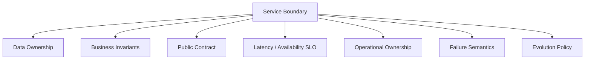
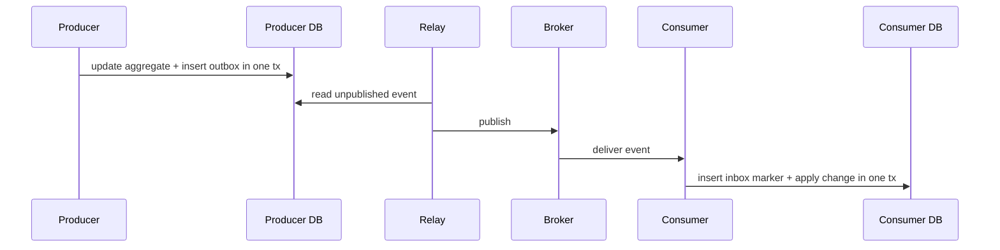
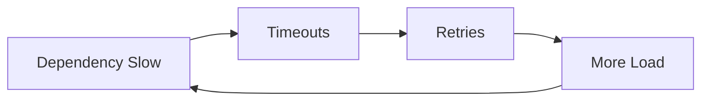
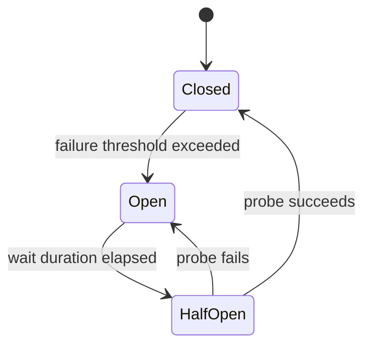
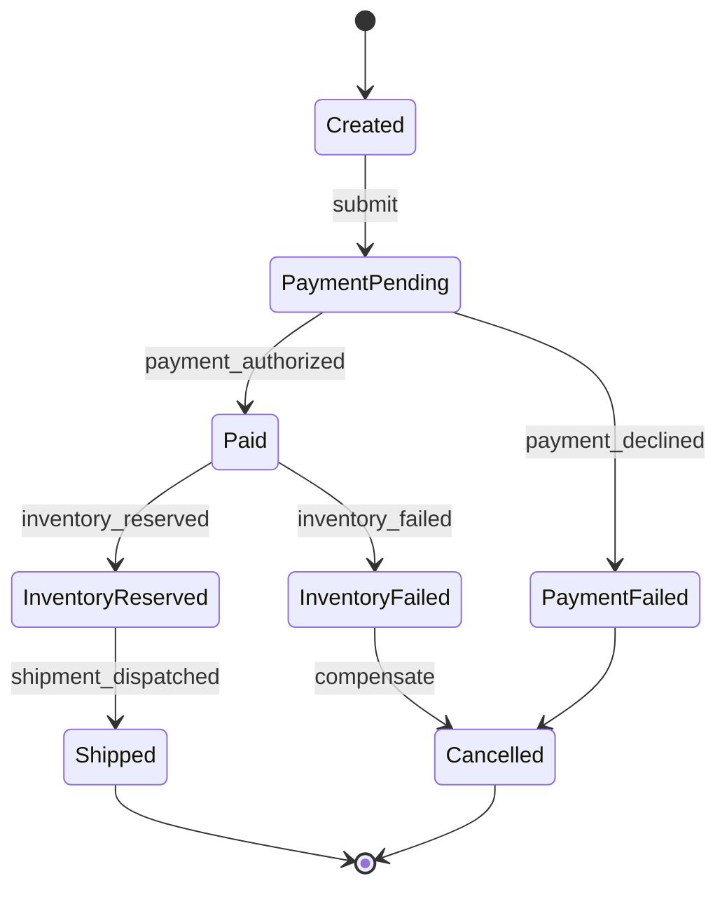
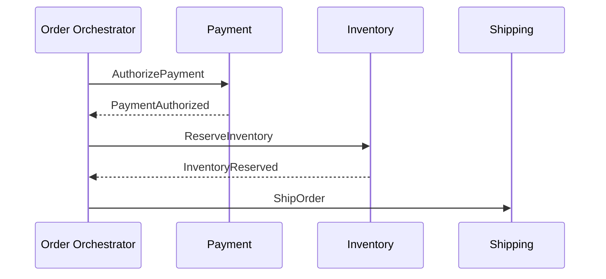
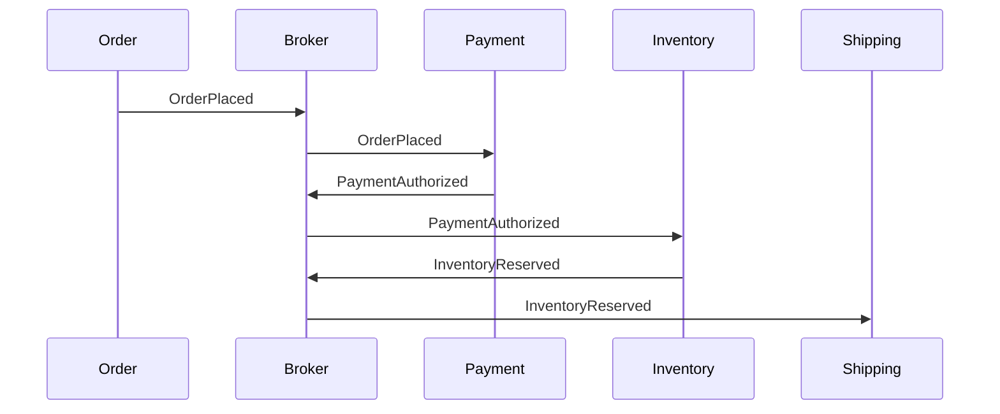

# Part 031 — Service Architecture: HTTP, gRPC, Messaging, Resilience, dan Workflow Boundaries

Service architecture bukan sekadar memilih REST, gRPC, Kafka, RabbitMQ, atau Spring Boot. Architecture adalah desain boundary: boundary data, boundary failure, boundary transaction, boundary ownership, boundary latency, boundary consistency, dan boundary operasional.

Dalam sistem Java production, service architecture yang buruk sering terlihat sebagai:

- API sulit dievolusi;
- retry storm;
- timeout tidak konsisten;
- idempotency tidak ada;
- event duplicate merusak state;
- service saling menunggu dalam chain panjang;
- transaksi lokal disangka transaksi distributed;
- workflow state tersebar di banyak service tanpa ownership jelas;
- incident sulit dianalisis karena boundary tidak observable;
- contract berubah tanpa backward compatibility;
- messaging dipakai untuk menyembunyikan coupling, bukan menguranginya.

Part ini membangun mental model service architecture untuk Java engineer: bagaimana memilih HTTP/gRPC/messaging, bagaimana mendesain resilience, dan bagaimana memodelkan workflow/state secara defensible.

---

## 1. Target Performa

Setelah menyelesaikan bagian ini, kamu harus mampu:

- membedakan service boundary teknis dan domain boundary;
- memilih HTTP, gRPC, atau messaging berdasarkan semantics, bukan tren;
- mendesain API request/response yang versionable dan observable;
- memahami `HttpClient` Java modern sebagai building block outbound HTTP;
- memahami gRPC sebagai contract-first RPC berbasis service definition;
- membedakan command, event, notification, dan query;
- menerapkan timeout, retry, circuit breaker, bulkhead, rate limiting, dan load shedding;
- membuat idempotency key dan duplicate handling;
- memahami saga, orchestration, choreography, outbox, inbox, dan compensation;
- memodelkan workflow/state machine dengan invariant jelas;
- membuat contract testing strategy;
- membuat failure mode catalog untuk service Java production.

---

## 2. Service Boundary Bukan Network Boundary Saja

Service boundary yang sehat punya owner, data, invariant, SLA, failure policy, dan deployment lifecycle yang relatif mandiri.



Boundary buruk:

```text
Service A owns tables used directly by Service B.
Service B calls Service C only to update one field in same business transaction.
Service C publishes events whose schema changes without consumer compatibility.
```

Boundary baik:

```text
Service owns its data and exposes stable capabilities.
Other services interact through contracts: API, command, event, or query.
Failure semantics are explicit.
```

---

## 3. Communication Style Matrix

| Style | Best For | Trade-off |
|---|---|---|
| HTTP REST/JSON | public/internal APIs, resource-oriented operations | human-readable, broad tooling, schema discipline optional unless enforced |
| gRPC | internal service-to-service, strongly typed RPC, streaming | contract-first, HTTP/2, codegen, less browser-native |
| Messaging | async workflows, decoupling, buffering, eventing | eventual consistency, duplicate handling, ordering complexity |
| Database sharing | rarely acceptable | tight coupling, migration pain, hidden ownership |
| File/dropbox integration | batch/interoperability | latency, schema/versioning discipline needed |

Rule:

```text
Use synchronous calls for immediate answers.
Use messaging for durable asynchronous facts or commands.
Use workflow/state machine for long-running business processes.
```

---

## 4. HTTP API Design

HTTP API bukan hanya endpoint. Ia adalah contract.

Contoh endpoint:

```http
POST /payments
Idempotency-Key: 01JABC...
Content-Type: application/json
```

Request:

```json
{
  "orderId": "ord-123",
  "amount": { "currency": "USD", "value": "42.00" },
  "methodId": "pm-456"
}
```

Response:

```json
{
  "paymentId": "pay-789",
  "status": "AUTHORIZED"
}
```

Design questions:

- apakah operation safe, idempotent, atau mutating?
- apakah retry client aman?
- apakah ada idempotency key?
- apakah error response punya stable code?
- apakah response bisa bertambah field tanpa breaking?
- apakah enum bisa bertambah value?
- apakah pagination/limit ada?
- apakah request punya deadline?
- apakah endpoint observable?

---

## 5. Java `HttpClient` sebagai Outbound Boundary

Java standard `HttpClient` tersedia sebagai API modern untuk mengirim request dan menerima response. Instance `HttpClient` dibuat melalui builder dan setelah dibuat bersifat immutable serta bisa dipakai untuk banyak request.

Contoh:

```java
HttpClient client = HttpClient.newBuilder()
        .connectTimeout(Duration.ofSeconds(2))
        .version(HttpClient.Version.HTTP_2)
        .build();

HttpRequest request = HttpRequest.newBuilder()
        .uri(URI.create("https://payment.example.com/payments"))
        .timeout(Duration.ofSeconds(3))
        .header("Content-Type", "application/json")
        .POST(HttpRequest.BodyPublishers.ofString(json))
        .build();

HttpResponse<String> response = client.send(
        request,
        HttpResponse.BodyHandlers.ofString()
);
```

Async:

```java
CompletableFuture<HttpResponse<String>> future = client.sendAsync(
        request,
        HttpResponse.BodyHandlers.ofString()
);
```

Checklist outbound HTTP:

- connect timeout;
- request/read timeout;
- total deadline;
- retry policy;
- idempotency;
- circuit breaker;
- bulkhead;
- correlation/trace headers;
- metrics per dependency;
- error classification;
- response size limit;
- TLS/certificate policy;
- client reuse.

---

## 6. HTTP Error Model

Jangan hanya meneruskan status code mentah.

Buat error taxonomy:

```java
public enum ErrorCategory {
    VALIDATION,
    AUTHORIZATION,
    NOT_FOUND,
    CONFLICT,
    RATE_LIMITED,
    DEPENDENCY_TIMEOUT,
    DEPENDENCY_ERROR,
    INTERNAL_BUG,
    CAPACITY,
    DATA_INTEGRITY
}
```

Response:

```json
{
  "error": {
    "code": "PAYMENT_METHOD_DECLINED",
    "category": "VALIDATION",
    "message": "Payment method was declined.",
    "correlationId": "01JABC..."
  }
}
```

Rules:

- `message` boleh berubah, `code` jangan sembarangan berubah;
- jangan expose stack trace;
- jangan expose secret/internal SQL;
- gunakan correlation id;
- bedakan retryable dan non-retryable;
- dokumentasikan compatibility.

---

## 7. gRPC Mental Model

gRPC adalah RPC framework modern yang biasanya memakai Protocol Buffers sebagai IDL dan HTTP/2 sebagai transport. Dalam gRPC, service didefinisikan dalam `.proto`, lalu server/client code bisa di-generate.

Contoh `.proto`:

```proto
syntax = "proto3";

package billing.v1;

service PaymentService {
  rpc AuthorizePayment(AuthorizePaymentRequest)
      returns (AuthorizePaymentResponse);
}

message AuthorizePaymentRequest {
  string order_id = 1;
  string idempotency_key = 2;
  Money amount = 3;
}

message Money {
  string currency = 1;
  string value = 2;
}

message AuthorizePaymentResponse {
  string payment_id = 1;
  PaymentStatus status = 2;
}

enum PaymentStatus {
  PAYMENT_STATUS_UNSPECIFIED = 0;
  PAYMENT_STATUS_AUTHORIZED = 1;
  PAYMENT_STATUS_DECLINED = 2;
}
```

Kelebihan:

- contract-first;
- generated stubs;
- efficient binary serialization;
- streaming support;
- strong schema discipline;
- good for internal service-to-service.

Risiko:

- browser/public client story lebih kompleks;
- schema evolution perlu disiplin;
- debug manual kurang semudah JSON;
- gateway/proxy/load balancer perlu support HTTP/2/gRPC;
- deadline/error semantics harus dipahami.

---

## 8. HTTP vs gRPC

| Faktor | HTTP/JSON | gRPC |
|---|---|---|
| Public API | sangat cocok | bisa, tapi perlu gateway/client support |
| Internal API | cocok | sangat cocok jika contract-first |
| Human readability | tinggi | rendah tanpa tooling |
| Schema enforcement | optional | kuat |
| Streaming | bisa, tapi bervariasi | first-class |
| Browser support | native | butuh grpc-web/gateway |
| Tooling curl/manual | mudah | butuh grpcurl/tooling |
| Performance | cukup untuk banyak kasus | biasanya lebih efisien |
| Evolution | disiplin manual | proto rules kuat, tetap perlu governance |

Rule:

```text
Use HTTP/JSON when interoperability and human-operability dominate.
Use gRPC when typed internal contracts, streaming, and generated clients dominate.
```

---

## 9. Messaging: Command, Event, Notification, Query

Banyak sistem rusak karena semua message disebut “event”. Bedakan intent.

| Jenis | Makna | Contoh |
|---|---|---|
| Command | permintaan melakukan sesuatu | `ShipOrderCommand` |
| Event | fakta yang sudah terjadi | `OrderPaidEvent` |
| Notification | pemberitahuan tanpa ownership state | `EmailRequested` |
| Query | meminta data | jarang ideal via broker kecuali pattern khusus |

Event harus diberi nama past tense:

```text
OrderPlaced
PaymentAuthorized
ShipmentDispatched
CaseEscalated
```

Command imperative:

```text
AuthorizePayment
ReserveInventory
SendEmail
GenerateInvoice
```

Jika pesan adalah event, publisher tidak boleh mengharapkan consumer tertentu langsung melakukan action agar transaction publisher dianggap selesai.

---

## 10. Event Design

Event adalah public historical fact.

Contoh:

```json
{
  "eventId": "evt-123",
  "eventType": "OrderPaid",
  "eventVersion": 1,
  "occurredAt": "2026-06-26T10:00:00Z",
  "aggregateId": "ord-123",
  "traceId": "01J...",
  "payload": {
    "orderId": "ord-123",
    "paymentId": "pay-456",
    "amount": {
      "currency": "USD",
      "value": "42.00"
    }
  }
}
```

Checklist event:

- stable event id;
- type/version;
- occurred time;
- aggregate id;
- producer metadata;
- trace/correlation id;
- schema compatibility;
- no secret;
- no accidental internal entity dump;
- consumer idempotency strategy.

---

## 11. Delivery Semantics

Messaging systems often provide practical semantics like:

| Semantics | Meaning | Application Requirement |
|---|---|---|
| at-most-once | bisa hilang, tidak duplicate | only if loss acceptable |
| at-least-once | tidak hilang jika system works, bisa duplicate | idempotent consumer wajib |
| exactly-once | often scoped/conditional | jangan bergantung tanpa memahami batasnya |

Most business systems should assume:

```text
Messages can be duplicated.
Messages can be delayed.
Messages can arrive out of order unless key/partitioning guarantees otherwise.
Consumers can fail after side effect but before ack.
```

---

## 12. Idempotent Consumer

Pattern:

```sql
create table processed_messages (
    consumer_name varchar not null,
    message_id varchar not null,
    processed_at timestamp not null,
    primary key (consumer_name, message_id)
);
```

Pseudo-code:

```java
@Transactional
public void handle(Message message) {
    boolean firstTime = processedMessageRepository.tryInsert(
            "shipping-consumer",
            message.id()
    );

    if (!firstTime) {
        return;
    }

    shippingService.apply(message.payload());
}
```

Invariant:

```text
Business side effect and processed-message marker commit atomically.
```

---

## 13. Outbox and Inbox

Outbox ensures local DB change and event creation are atomic.

Inbox/processed-message table ensures consumer duplicate handling.



This is the default pattern for reliable event-driven Java services unless infrastructure gives stronger guarantees that you fully understand.

---

## 14. Timeouts

Timeouts must exist at every blocking boundary.

Bad:

```text
Gateway timeout: 30s
Service A -> B: no timeout
Service B -> DB: no timeout
```

Better:

```text
Gateway deadline: 2s
Service A budget: 700ms
Service B budget: 500ms
DB budget: 200ms
Retry only within remaining budget
```

Java design:

```java
public record Deadline(Instant expiresAt) {
    public Duration remaining(Clock clock) {
        Duration remaining = Duration.between(clock.instant(), expiresAt);
        return remaining.isNegative() ? Duration.ZERO : remaining;
    }

    public boolean expired(Clock clock) {
        return remaining(clock).isZero();
    }
}
```

Rule:

```text
Local timeout must not exceed caller deadline.
```

---

## 15. Retry

Retry is useful only when failure is transient and operation is safe to retry.

Retry safe when:

- operation is idempotent;
- idempotency key exists;
- failure is transient;
- retry budget exists;
- backoff and jitter used;
- downstream is not already overloaded.

Retry dangerous when:

- operation charges payment without idempotency;
- error is validation/permanent;
- retry is immediate and synchronized;
- retry ignores deadline;
- every layer retries independently.

Retry storm:



Mitigation:

- exponential backoff;
- jitter;
- retry budget;
- circuit breaker;
- rate limiting;
- idempotency;
- deadline propagation.

---

## 16. Circuit Breaker

Circuit breaker prevents repeated calls to a dependency that is likely failing.

States:



Use when:

- dependency failure can cascade;
- fast failure is better than piling up waits;
- fallback/degraded response exists;
- observability can track open/half-open states.

Avoid when:

- used to hide all errors;
- thresholds arbitrary;
- no runbook;
- no per-dependency metrics;
- circuit breaker state not visible.

---

## 17. Bulkhead

Bulkhead isolates resource usage.

Example with semaphore:

```java
public final class DependencyBulkhead {
    private final Semaphore permits;

    public DependencyBulkhead(int maxConcurrentCalls) {
        this.permits = new Semaphore(maxConcurrentCalls);
    }

    public <T> T call(Callable<T> operation) throws Exception {
        if (!permits.tryAcquire(100, TimeUnit.MILLISECONDS)) {
            throw new RejectedExecutionException("bulkhead saturated");
        }
        try {
            return operation.call();
        } finally {
            permits.release();
        }
    }
}
```

Bulkhead should protect real scarce resources:

- DB connections;
- remote API quota;
- CPU-heavy operation;
- file handles;
- per-tenant concurrency;
- message processing capacity.

---

## 18. Rate Limiting and Load Shedding

Rate limiting controls how much work is accepted. Load shedding rejects work when the system is saturated.

Use:

- per client;
- per tenant;
- per endpoint;
- per dependency;
- per worker/consumer group.

Return meaningful errors:

```http
HTTP/1.1 429 Too Many Requests
Retry-After: 10
```

Or for internal services:

```json
{
  "error": {
    "code": "RATE_LIMITED",
    "retryable": true,
    "retryAfterMs": 10000
  }
}
```

Do not accept infinite work just to fail later with OOM.

---

## 19. Workflow Boundary

Long-running business processes should be modeled explicitly.

Example order workflow:



If workflow state is not explicit, it usually becomes implicit across logs, events, flags, and support tickets.

---

## 20. State Machine Invariants

For every workflow:

- list states;
- list allowed transitions;
- list transition triggers;
- list side effects;
- list idempotency rule per transition;
- list compensation rule;
- list timeout/escalation rule;
- list audit requirements.

Example Java model:

```java
public enum OrderStatus {
    CREATED,
    PAYMENT_PENDING,
    PAID,
    PAYMENT_FAILED,
    INVENTORY_RESERVED,
    INVENTORY_FAILED,
    SHIPPED,
    CANCELLED
}
```

Better with sealed commands/events:

```java
public sealed interface OrderEvent permits PaymentAuthorized, PaymentDeclined, InventoryReserved {}

public record PaymentAuthorized(String paymentId) implements OrderEvent {}
public record PaymentDeclined(String reasonCode) implements OrderEvent {}
public record InventoryReserved(String reservationId) implements OrderEvent {}
```

Transition method:

```java
public Order apply(OrderEvent event) {
    return switch (status) {
        case PAYMENT_PENDING -> switch (event) {
            case PaymentAuthorized e -> markPaid(e.paymentId());
            case PaymentDeclined e -> markPaymentFailed(e.reasonCode());
            default -> throw invalid(event);
        };
        default -> throw invalid(event);
    };
}
```

---

## 21. Orchestration vs Choreography

### Orchestration

A central workflow coordinator tells participants what to do.



Pros:

- workflow visible;
- easier timeout/escalation;
- centralized state;
- easier support/debug.

Cons:

- orchestrator can become complex;
- more central coupling;
- needs high reliability.

### Choreography

Services react to events without central controller.



Pros:

- decoupled participants;
- natural event flow;
- fewer central commands.

Cons:

- workflow state scattered;
- harder debugging;
- implicit dependencies;
- adding participant can change emergent behavior;
- support needs event timeline tooling.

Rule:

```text
Use orchestration when process visibility, timeout, compensation, and auditability dominate.
Use choreography when independent services react to facts and global workflow is simple.
```

---

## 22. Saga and Compensation

Saga is a sequence of local transactions with compensating actions.

Example:

```text
1. Create order
2. Authorize payment
3. Reserve inventory
4. Create shipment
```

If step 3 fails after payment authorized, compensation might void payment.

Important:

- compensation is not rollback;
- compensation can fail;
- compensation may be business-specific;
- every step needs idempotency;
- saga needs durable state;
- timeout/escalation required.

Saga state:

```java
public enum SagaStatus {
    STARTED,
    PAYMENT_AUTHORIZED,
    INVENTORY_RESERVED,
    SHIPMENT_CREATED,
    COMPENSATING,
    COMPLETED,
    FAILED
}
```

---

## 23. API Versioning

Compatibility rules:

- adding optional response field is usually safe;
- removing field is breaking;
- changing type is breaking;
- changing enum semantics can be breaking;
- adding enum value can break strict consumers;
- changing error code is breaking for automated clients;
- changing default ordering/pagination can break clients;
- narrowing accepted input can break clients.

Strategies:

- URI versioning: `/v1/payments`;
- media type versioning;
- header versioning;
- schema version in event;
- proto package version: `billing.v1`;
- additive evolution;
- deprecation policy;
- consumer-driven contract tests.

---

## 24. Contract Testing

Contract tests verify provider and consumer agree on API/message shape and semantics.

For HTTP:

- request method/path/query/header;
- response status;
- response schema;
- error model;
- compatibility expectations.

For messaging:

- event type;
- event version;
- required fields;
- optional fields;
- enum behavior;
- ordering/key expectations.

Contract testing does not replace integration tests. It prevents breaking consumers accidentally.

---

## 25. Observability by Boundary

Every boundary should emit:

- latency;
- success/failure count;
- timeout count;
- retry count;
- circuit breaker state;
- rate limited/rejected count;
- in-flight count;
- dependency name;
- route/method or operation;
- trace/span id;
- correlation id;
- payload size class;
- error category.

For messaging:

- publish rate;
- consume rate;
- lag;
- processing latency;
- duplicate count;
- DLQ count;
- retry count;
- poison message count;
- outbox age;
- relay errors.

---

## 26. Failure Mode Catalog

| Failure | Design Response |
|---|---|
| dependency slow | timeout, deadline, circuit breaker, fallback |
| dependency down | circuit breaker, degraded mode, queue if async |
| duplicate event | idempotent consumer |
| event lost before publish | outbox |
| consumer fails after side effect | inbox/idempotency |
| message out of order | key ordering, version check, state machine guard |
| retry storm | budget, jitter, breaker |
| API schema breaking | contract tests, versioning |
| DB pool exhausted | bulkhead, query fix, timeout |
| long workflow stuck | durable state, timeout, escalation |
| partial saga failure | compensation and manual recovery path |
| high tenant load | tenant rate limit/bulkhead |
| downstream quota exceeded | rate limiter, queue, backoff |

---

## 27. Architecture Review Checklist

- [ ] What capability does this service own?
- [ ] What data does it own?
- [ ] What invariants are local?
- [ ] Which operations are synchronous and why?
- [ ] Which operations are asynchronous and why?
- [ ] Is idempotency defined for mutating commands?
- [ ] Are timeouts/deadlines defined?
- [ ] Is retry safe and bounded?
- [ ] Is circuit breaker/bulkhead needed?
- [ ] Is workflow state explicit?
- [ ] Is compensation needed?
- [ ] Is event schema versioned?
- [ ] Are consumers idempotent?
- [ ] Is outbox needed?
- [ ] Are API/event contracts tested?
- [ ] Is observability sufficient at every boundary?
- [ ] What is the rollback/degraded mode?

---

## 28. Latihan 20 Jam

### Jam 1–3: HTTP Boundary

Buat Java HTTP client wrapper dengan timeout, error taxonomy, correlation id, dan metrics hook.

### Jam 4–6: Idempotent Command

Implementasikan `POST /payments` dengan idempotency key dan unique constraint.

### Jam 7–9: Retry and Circuit Breaker Simulation

Simulasikan dependency lambat. Tambahkan timeout, bounded retry, jitter, dan circuit breaker.

### Jam 10–12: Outbox

Implementasikan outbox table dan relay sederhana.

### Jam 13–15: Idempotent Consumer

Implementasikan inbox/processed message table. Simulasikan duplicate event.

### Jam 16–18: Workflow State Machine

Modelkan order workflow dengan states, transitions, invalid transition handling, dan timeout state.

### Jam 19–20: Architecture RFC

Tulis RFC service baru:

- boundary;
- API;
- events;
- failure modes;
- resilience;
- observability;
- data ownership;
- migration/versioning.

---

## 29. Anti-Pattern

### Anti-Pattern 1 — Synchronous Chain Panjang

Service A memanggil B, C, D, E dalam satu request tanpa deadline jelas.

### Anti-Pattern 2 — Messaging Tanpa Idempotency

At-least-once delivery diperlakukan seolah exactly-once.

### Anti-Pattern 3 — Event sebagai Database Dump

Event berisi internal entity penuh tanpa schema ownership.

### Anti-Pattern 4 — Retry Tanpa Budget

Setiap layer retry tiga kali, membuat ledakan load.

### Anti-Pattern 5 — Timeout Tidak Konsisten

Downstream timeout lebih besar dari upstream deadline.

### Anti-Pattern 6 — Workflow State Tersebar

State bisnis hanya bisa dipahami dengan membaca log banyak service.

### Anti-Pattern 7 — Shared Database antar-Service

Service boundary palsu. Migration dan ownership rusak.

### Anti-Pattern 8 — No Contract Tests

Provider deploy memecahkan consumer tanpa diketahui.

---

## 30. Ringkasan

Service architecture adalah desain kontrak dan kegagalan.

Mental model utama:

```text
Synchronous call couples availability and latency.
Messaging decouples time but introduces duplicates, ordering, and eventual consistency.
Retries require idempotency.
Timeouts require deadlines.
Events require schema evolution.
Workflows require explicit state.
Boundaries require observability.
```

Engineer Java yang kuat tidak hanya membuat endpoint. Ia merancang apa yang terjadi saat dependency lambat, event duplicate, consumer crash, transaction commit gagal, schema berubah, workflow stuck, dan traffic meningkat.

---

## 31. Referensi Resmi

- Java SE 25 `HttpClient`: https://docs.oracle.com/en/java/javase/25/docs/api/java.net.http/java/net/http/HttpClient.html
- Java SE 25 `HttpRequest`: https://docs.oracle.com/en/java/javase/25/docs/api/java.net.http/java/net/http/HttpRequest.html
- gRPC Java Documentation: https://grpc.io/docs/languages/java/
- gRPC Introduction: https://grpc.io/docs/what-is-grpc/introduction/
- gRPC Java Basics Tutorial: https://grpc.io/docs/languages/java/basics/
- Java SE 25 `java.util.concurrent`: https://docs.oracle.com/en/java/javase/25/docs/api/java.base/java/util/concurrent/package-summary.html
