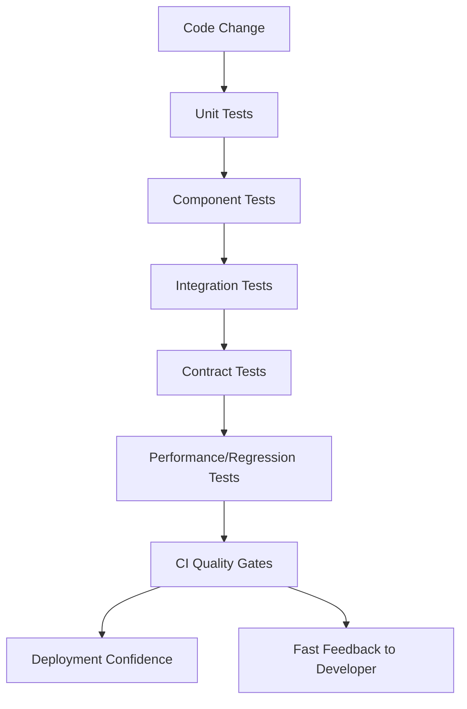
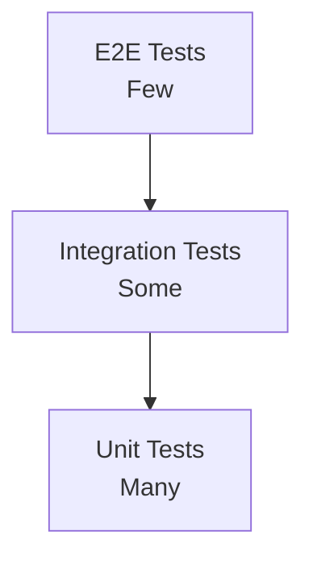
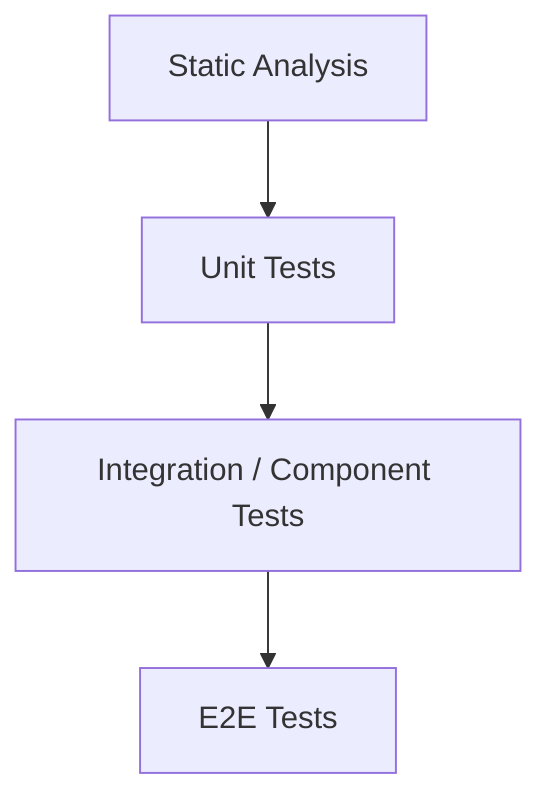
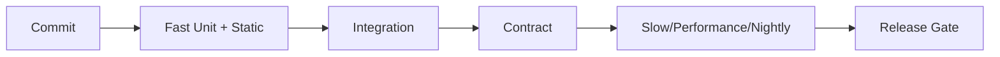

# Part 032 — Testing dan Quality Engineering: Unit, Integration, Contract, Mutation, Property-Based, Testcontainers

Testing bukan aktivitas menulis assertion setelah kode selesai. Testing adalah sistem feedback yang menjaga kemampuan tim untuk mengubah software tanpa takut.

Dalam sistem Java production, testing yang buruk sering terlihat sebagai:

- test banyak tetapi bug tetap lolos;
- test lambat sehingga jarang dijalankan;
- test rapuh terhadap refactor internal;
- mock terlalu banyak sehingga integration bug tidak terlihat;
- integration test tidak pakai database/broker yang mirip production;
- contract berubah tanpa consumer tahu;
- flaky test dianggap biasa;
- coverage tinggi tapi assertion lemah;
- concurrent code tidak pernah diuji dengan interleaving;
- migration database tidak dites dengan data realistis;
- performance regression baru diketahui setelah production incident.

Part ini membangun quality engineering strategy: bukan hanya jenis test, tetapi fungsi setiap test dalam feedback loop.

---

## 1. Target Performa

Setelah menyelesaikan bagian ini, kamu harus mampu:

- membedakan unit, integration, component, contract, end-to-end, property-based, mutation, concurrency, performance, dan migration tests;
- menulis JUnit 5 test yang jelas, terstruktur, dan maintainable;
- memakai assertion yang ekspresif;
- memakai mock secara defensible, bukan sebagai default;
- mendesain test data builder;
- memakai Testcontainers untuk dependency nyata seperti database/message broker;
- membuat contract tests untuk HTTP/message schemas;
- memahami mutation testing sebagai ukuran kualitas assertion;
- memakai property-based testing untuk invariant;
- menguji concurrent code dengan latch/barrier/stress strategy;
- mendiagnosis flaky tests;
- mendesain CI test strategy yang cepat dan reliable.

---

## 2. Testing sebagai Feedback System



Tujuan testing:

- mendeteksi bug;
- mendokumentasikan behavior;
- menjaga invariant;
- mendukung refactoring;
- mencegah regression;
- mempercepat review;
- mengurangi risiko deploy;
- memberi confidence pada migration.

Coverage bukan tujuan utama. Confidence adalah tujuan utama.

---

## 3. Testing Pyramid vs Trophy

Pyramid klasik:



Testing trophy lebih menekankan integration/component tests untuk aplikasi modern:



Tidak ada bentuk universal. Pilihan bergantung pada:

- domain complexity;
- integration complexity;
- UI complexity;
- persistence behavior;
- distributed contracts;
- deployment risk;
- runtime failure modes.

Rule praktis:

```text
Use the cheapest test that catches the class of bug you care about.
```

---

## 4. Test Taxonomy

| Test Type | Menjawab | Cepat? | Risiko Jika Tidak Ada |
|---|---|---:|---|
| Unit | apakah logic kecil benar? | sangat | domain bug, refactor takut |
| Integration | apakah boundary nyata bekerja? | sedang | SQL/schema/config bug |
| Component | apakah service slice bekerja? | sedang | wiring/lifecycle bug |
| Contract | apakah provider-consumer compatible? | sedang | breaking API/event |
| E2E | apakah user journey bekerja? | lambat | deployment flow bug |
| Property-based | apakah invariant tahan banyak input? | sedang | edge case bug |
| Mutation | apakah assertion kuat? | lambat | false confidence |
| Concurrency | apakah interleaving aman? | sulit | race/deadlock |
| Performance regression | apakah latency/allocation berubah? | lambat | production regression |
| Migration | apakah schema/data upgrade aman? | sedang/lambat | deploy/data loss |

---

## 5. JUnit 5 Baseline

JUnit 5 adalah platform modern untuk testing Java. Struktur umum:

```java
import org.junit.jupiter.api.Test;
import static org.junit.jupiter.api.Assertions.*;

class MoneyTest {

    @Test
    void rejectsNegativeAmount() {
        IllegalArgumentException error = assertThrows(
                IllegalArgumentException.class,
                () -> new Money("USD", new BigDecimal("-1.00"))
        );

        assertEquals("amount must be non-negative", error.getMessage());
    }
}
```

Naming style:

```java
@Test
void approveRejectsAlreadyCancelledOrder() {}
```

Avoid names like:

```java
test1()
testApprove()
```

Good test name describes behavior, not implementation detail.

---

## 6. Arrange-Act-Assert

```java
@Test
void approvingPendingOrderMovesItToApproved() {
    // Arrange
    Order order = Order.pending("ord-123");
    Actor actor = Actor.system("risk-engine");

    // Act
    OrderApproved event = order.approve(actor, clock.instant());

    // Assert
    assertEquals(OrderStatus.APPROVED, order.status());
    assertEquals("ord-123", event.orderId());
}
```

AAA keeps tests readable.

For complex setup, use builders rather than long setup blocks.

---

## 7. Assertion Quality

Weak:

```java
assertNotNull(result);
```

Stronger:

```java
assertEquals(PaymentStatus.AUTHORIZED, result.status());
assertEquals("pay-123", result.paymentId());
assertEquals(Money.usd("42.00"), result.amount());
```

Good assertions check business-relevant observable behavior.

Avoid over-asserting implementation details:

```java
verify(repository).save(order); // not always meaningful if final state is what matters
```

Prefer state/output assertions unless interaction itself is contract.

---

## 8. Test Data Builders

Bad setup:

```java
Order order = new Order(
        "ord-123",
        "cust-456",
        List.of(new OrderLine("sku-1", 2, new BigDecimal("10.00"))),
        OrderStatus.PENDING,
        Instant.parse("2026-01-01T00:00:00Z"),
        null,
        null,
        false
);
```

Builder:

```java
public final class OrderBuilder {
    private String id = "ord-123";
    private String customerId = "cust-456";
    private List<OrderLine> lines = List.of(OrderLineBuilder.anOrderLine().build());
    private OrderStatus status = OrderStatus.PENDING;

    public static OrderBuilder anOrder() {
        return new OrderBuilder();
    }

    public OrderBuilder cancelled() {
        this.status = OrderStatus.CANCELLED;
        return this;
    }

    public Order build() {
        return new Order(id, customerId, lines, status);
    }
}
```

Usage:

```java
Order order = anOrder().cancelled().build();
```

Test data should reveal intent.

---

## 9. Unit Tests

Unit test scope:

- domain method;
- pure function;
- validator;
- mapper;
- policy;
- state transition;
- error classification;
- retry decision;
- idempotency decision.

Good unit test properties:

- fast;
- deterministic;
- no network;
- no database;
- no real clock unless controlled;
- no sleeps;
- focused behavior;
- clear failure message.

Use `Clock` injection:

```java
Clock fixedClock = Clock.fixed(
        Instant.parse("2026-06-26T00:00:00Z"),
        ZoneOffset.UTC
);
```

---

## 10. Mocking: Tool, Not Lifestyle

Mocks are useful when:

- dependency is slow/unavailable;
- interaction is part of contract;
- simulating failure/timeout;
- isolating domain logic from infrastructure;
- verifying outbound command/event emitted.

Mocks are harmful when:

- every class mocks every collaborator;
- test mirrors implementation;
- refactor breaks tests without behavior change;
- database behavior is mocked but SQL bug is the risk;
- HTTP client is mocked but serialization/status mapping is untested.

Example useful mock:

```java
when(paymentGateway.authorize(any()))
        .thenThrow(new DependencyTimeoutException("payment timeout"));

PaymentResult result = service.pay(request);

assertEquals(PaymentStatus.PENDING_RETRY, result.status());
```

---

## 11. Test Doubles

| Double | Meaning |
|---|---|
| Dummy | passed but not used |
| Stub | returns predefined data |
| Fake | working simplified implementation |
| Mock | verifies interaction |
| Spy | partial real object with verification |

Prefer fakes for complex domain tests.

Example fake repository:

```java
public final class InMemoryOrderRepository implements OrderRepository {
    private final Map<OrderId, Order> orders = new HashMap<>();

    @Override
    public Optional<Order> findById(OrderId id) {
        return Optional.ofNullable(orders.get(id));
    }

    @Override
    public void save(Order order) {
        orders.put(order.id(), order);
    }
}
```

But do not use fake DB when SQL/isolation/transaction behavior is the thing being tested.

---

## 12. Integration Tests

Integration tests verify real boundaries:

- database;
- message broker;
- filesystem;
- HTTP serialization;
- configuration;
- transaction management;
- migration;
- object mapping;
- framework wiring.

Example repository integration test:

```java
@Test
void findsPendingOrdersByCustomer() {
    insertOrder("ord-1", "cust-1", "PENDING");
    insertOrder("ord-2", "cust-1", "SHIPPED");

    List<OrderSummary> orders = repository.findPendingByCustomer("cust-1", 10);

    assertThat(orders)
            .extracting(OrderSummary::id)
            .containsExactly("ord-1");
}
```

This catches SQL/schema/query mapping bugs that unit tests cannot.

---

## 13. Testcontainers

Testcontainers for Java provides lightweight, throwaway instances of dependencies such as databases, message brokers, browsers, or any Docker container for tests.

Example PostgreSQL:

```java
@Testcontainers
class OrderRepositoryTest {

    @Container
    static PostgreSQLContainer<?> postgres = new PostgreSQLContainer<>("postgres:16")
            .withDatabaseName("orders")
            .withUsername("test")
            .withPassword("test");

    @Test
    void persistsOrder() {
        DataSource dataSource = createDataSource(
                postgres.getJdbcUrl(),
                postgres.getUsername(),
                postgres.getPassword()
        );

        OrderRepository repository = new JdbcOrderRepository(dataSource);
        repository.save(Order.pending("ord-123"));

        assertThat(repository.findById("ord-123")).isPresent();
    }
}
```

Benefits:

- real database behavior;
- real SQL dialect;
- real transaction semantics;
- isolated test dependency;
- reproducible CI environment.

Risks:

- slower than unit tests;
- Docker dependency;
- container startup overhead;
- image version drift;
- test data cleanup discipline needed.

---

## 14. Database Test Strategy

Test with real DB when verifying:

- SQL syntax/dialect;
- transaction isolation;
- locking;
- constraints;
- migrations;
- JSON/array/custom types;
- query performance;
- indexes;
- JPA lazy loading/query shape;
- deadlock/conflict behavior.

Do not rely solely on in-memory DB if production DB is PostgreSQL/MySQL/Oracle/SQL Server. Behavior can differ significantly.

Checklist:

- migrations run before test;
- schema same as production path;
- each test isolated;
- data cleanup deterministic;
- no shared mutable test order dependency;
- query count can be asserted for N+1-prone code;
- indexes included.

---

## 15. Contract Tests

Contract tests protect boundaries between provider and consumer.

For HTTP contract:

```text
Consumer expects:
GET /orders/{id}
200 response with id, status, total
404 error with code ORDER_NOT_FOUND
```

For event contract:

```text
OrderPaid v1 has:
- eventId
- eventType
- occurredAt
- aggregateId
- payload.orderId
- payload.paymentId
```

Provider must prove it satisfies contract. Consumer must prove it can handle provider schema.

Contract tests catch:

- removed field;
- changed type;
- changed error code;
- enum incompatibility;
- path/status changes;
- event schema breakage.

They do not catch all runtime behavior. Combine with integration and E2E tests.

---

## 16. Property-Based Testing

Property-based testing checks invariants over many generated inputs.

Example invariant:

```text
For any non-negative amount A and B:
A + B >= A
A + B >= B
```

For workflow:

```text
Cancelled order can never become shipped.
```

For parser:

```text
serialize(parse(x)) preserves normalized value.
```

Conceptual example:

```java
@Property
void cancelledOrderNeverShips(@ForAll("eventSequences") List<OrderEvent> events) {
    Order order = Order.created("ord-123");

    for (OrderEvent event : events) {
        order = applyIfValid(order, event);
    }

    if (order.history().contains(OrderStatus.CANCELLED)) {
        assertThat(order.status()).isNotEqualTo(OrderStatus.SHIPPED);
    }
}
```

Property-based testing is excellent for:

- value objects;
- parsers;
- validators;
- state machines;
- financial calculations;
- date/time logic;
- serialization round trips;
- idempotency;
- commutativity/associativity rules.

---

## 17. Mutation Testing

Mutation testing changes code slightly and checks whether tests fail.

Example mutation:

```java
if (amount.signum() < 0) {
```

mutated to:

```java
if (amount.signum() <= 0) {
```

If tests still pass, assertion may be weak.

Mutation testing answers:

```text
Do our tests actually detect behavior changes?
```

Use it for:

- domain logic;
- critical validators;
- pricing/tax/fee calculations;
- workflow transitions;
- security checks;
- error classification.

Do not run mutation testing on every commit for huge codebase unless optimized. It can be CI nightly/targeted.

---

## 18. Concurrency Testing

Concurrent tests must create contention intentionally.

Example lost update test:

```java
@Test
void counterIsThreadSafe() throws Exception {
    int threads = 16;
    int incrementsPerThread = 10_000;

    ExecutorService executor = Executors.newFixedThreadPool(threads);
    CountDownLatch start = new CountDownLatch(1);
    CountDownLatch done = new CountDownLatch(threads);

    Counter counter = new Counter();

    for (int i = 0; i < threads; i++) {
        executor.submit(() -> {
            try {
                start.await();
                for (int j = 0; j < incrementsPerThread; j++) {
                    counter.increment();
                }
            } finally {
                done.countDown();
            }
        });
    }

    start.countDown();
    assertTrue(done.await(10, TimeUnit.SECONDS));

    assertEquals(threads * incrementsPerThread, counter.value());
}
```

For JMM-level tests, use specialized tools such as jcstress.

Concurrent code requires:

- stress;
- repeatability;
- timeouts;
- no arbitrary sleeps;
- invariant checks;
- thread dumps on failure;
- race-focused design.

---

## 19. Performance Regression Tests

Performance tests should be treated like experiments.

Capture:

- JDK version;
- JVM flags;
- hardware/container limits;
- dataset size;
- warmup;
- duration;
- traffic mix;
- baseline;
- threshold;
- p95/p99;
- allocation rate;
- GC logs;
- CPU;
- error rate.

Types:

- JMH microbenchmark for algorithm/API;
- component benchmark for parser/mapper/repository;
- load test for service;
- soak test for leak/stability;
- migration benchmark for DB changes.

Avoid asserting overly tight thresholds in noisy CI. Use trend analysis or dedicated performance environment.

---

## 20. Testing Error Paths

Happy-path-only tests are insufficient.

Test:

- validation error;
- not found;
- conflict;
- duplicate idempotency key;
- dependency timeout;
- dependency 500;
- retry exhausted;
- circuit breaker open;
- database constraint violation;
- optimistic lock conflict;
- event duplicate;
- malformed message;
- migration partial failure;
- cancellation.

Failure behavior is part of contract.

---

## 21. Test Naming and Structure

Good pattern:

```text
methodName_condition_expectedBehavior
```

or behavior sentence:

```java
void rejectsPaymentWhenOrderAlreadyCancelled()
void returnsCachedResultForDuplicateIdempotencyKey()
void emitsOrderPaidEventAfterSuccessfulPayment()
```

Avoid testing implementation:

```java
void callsRepositorySave()
```

unless the interaction is the observable contract, for example publishing an event.

---

## 22. Flaky Test Diagnosis

Flaky tests are production-quality problems in the test system.

Common causes:

- time dependency;
- `Thread.sleep`;
- test order dependency;
- shared mutable state;
- static state;
- port conflicts;
- async operation not awaited;
- eventual consistency not handled;
- random data not seeded;
- system timezone/locale;
- external network;
- resource leak;
- container startup race;
- parallel test interference;
- clock uses real time.

Fix strategy:

1. quarantine only if necessary;
2. reproduce with repetition;
3. capture logs/thread dump;
4. remove shared state;
5. inject clock/random;
6. replace sleep with await condition;
7. isolate ports/resources;
8. make cleanup deterministic;
9. add timeout diagnostics.

---

## 23. Test Isolation

Each test should be independent.

Avoid:

- relying on execution order;
- shared DB rows;
- static mutable caches;
- global config mutation;
- shared temp files;
- fixed ports;
- leftover messages;
- real current time.

Prefer:

- unique test IDs;
- transaction rollback if appropriate;
- truncate/clean schema;
- temp directories;
- random free ports;
- per-test container when necessary;
- deterministic clock;
- deterministic random seed.

---

## 24. Golden Master and Approval Tests

Golden master tests compare output to approved reference output.

Useful for:

- report generation;
- serialization format;
- migration output;
- complex legacy refactor;
- compiler/code generation;
- rules engine output.

Risks:

- approving wrong output;
- noisy diffs;
- large snapshots nobody reviews;
- brittle formatting changes.

Use when behavior is complex and output review is meaningful.

---

## 25. Migration Testing

Database/code migration tests should verify:

- migration applies cleanly from previous version;
- migration is backward-compatible during rolling deploy;
- old app can run against expanded schema if required;
- new app can read old data;
- backfill correct;
- destructive changes delayed;
- rollback path understood;
- migration duration acceptable;
- locks acceptable;
- data integrity preserved.

Expand-contract test scenario:

```text
1. Start with v1 schema and v1 data.
2. Apply expand migration.
3. Run v1 app compatibility checks.
4. Run v2 app dual-write checks.
5. Backfill.
6. Run v2 read-new checks.
7. Apply contract migration later.
```

---

## 26. CI Strategy

Split tests by cost and purpose.



Example:

| Stage | Runs | Contents |
|---|---|---|
| pre-commit/local | developer | unit, focused integration |
| PR fast | every PR | compile, format, unit, static analysis |
| PR full | every PR or label | integration, Testcontainers, contract |
| nightly | scheduled | mutation, performance, soak, security scan |
| release | before deploy | migration, smoke, canary checks |

Keep fast feedback fast. Move expensive tests to appropriate stage, but do not skip them entirely.

---

## 27. Quality Gates

Potential gates:

- compile with warnings policy;
- formatting;
- static analysis;
- unit tests;
- integration tests;
- contract tests;
- minimum meaningful coverage for changed code;
- mutation score for critical modules;
- no known flaky tests;
- dependency vulnerability threshold;
- migration test pass;
- performance threshold for critical path.

Avoid vanity gates:

```text
80% coverage across repo, regardless of assertions and criticality.
```

Better:

```text
Critical domain package requires branch coverage and mutation score threshold.
```

---

## 28. Test Review Checklist

- [ ] Does test name describe behavior?
- [ ] Is arrange-act-assert clear?
- [ ] Does assertion check meaningful outcome?
- [ ] Is time controlled?
- [ ] Is randomness controlled?
- [ ] Are external dependencies avoided or containerized?
- [ ] Is test independent?
- [ ] Does it avoid arbitrary sleep?
- [ ] Does it test failure path?
- [ ] Does it verify contract if boundary changes?
- [ ] Does it catch regression or only execute code?
- [ ] Would mutation survive?
- [ ] Is mock necessary?
- [ ] Is setup intent clear?
- [ ] Is data realistic enough for the bug class?
- [ ] Is test too coupled to implementation?

---

## 29. Production Bug to Test Mapping

When a bug reaches production, add the cheapest test that would have caught it.

| Bug | Likely Test |
|---|---|
| wrong domain transition | unit/property-based |
| SQL syntax wrong | repository integration |
| N+1 regression | integration query-count/perf test |
| provider broke consumer | contract test |
| duplicate event applied twice | idempotency integration test |
| race condition | concurrency stress/jcstress |
| memory leak | soak test/allocation profile |
| bad migration | migration test |
| retry duplicate payment | idempotency test + failure injection |
| timeout missing | component test with slow dependency |
| bad serialization enum | contract/schema test |

---

## 30. Latihan 20 Jam

### Jam 1–3: Domain Unit Tests

Ambil state machine order/payment. Tulis tests untuk valid/invalid transitions.

### Jam 4–6: Test Data Builder

Refactor setup besar menjadi builders. Pastikan test intent lebih jelas.

### Jam 7–9: Repository Test with Testcontainers

Jalankan PostgreSQL container. Test repository query, constraint, dan transaction rollback.

### Jam 10–12: Contract Test

Definisikan contract HTTP atau event. Buat provider test yang memastikan schema tidak breaking.

### Jam 13–15: Property-Based Test

Pilih invariant value object atau state machine. Generate banyak input/event sequences.

### Jam 16–18: Mutation Testing

Jalankan mutation testing pada package domain. Perbaiki weak assertions.

### Jam 19–20: Flaky Test Drill

Buat test async dengan sleep, lalu refactor menjadi deterministic await/latch. Dokumentasikan diagnosis.

---

## 31. Anti-Pattern

### Anti-Pattern 1 — Coverage Worship

Coverage tinggi tidak berarti assertion kuat.

### Anti-Pattern 2 — Mock Everything

Test menjadi duplikasi implementation, bukan behavior verification.

### Anti-Pattern 3 — Sleep-Based Async Test

`Thread.sleep` membuat test lambat dan flaky.

### Anti-Pattern 4 — In-Memory DB as Production Substitute

SQL/isolation/index behavior bisa berbeda.

### Anti-Pattern 5 — Ignoring Flaky Tests

Flaky test menghancurkan trust pada CI.

### Anti-Pattern 6 — E2E for Everything

Slow, brittle, sulit diagnosis.

### Anti-Pattern 7 — No Failure Path Tests

Sistem production lebih sering rusak di failure path.

### Anti-Pattern 8 — Snapshot Nobody Reviews

Golden files besar yang selalu di-approve tanpa pemahaman.

---

## 32. Ringkasan

Quality engineering adalah desain feedback.

Mental model utama:

```text
Unit tests protect logic.
Integration tests protect boundaries.
Contract tests protect compatibility.
Property-based tests protect invariants.
Mutation tests test the tests.
Concurrency tests expose interleavings.
Performance tests protect operational behavior.
Migration tests protect data evolution.
```

Engineer Java yang kuat tidak hanya menulis test. Ia memilih level test yang tepat untuk risiko yang tepat, menjaga test cepat dan reliable, serta memperbaiki test suite sebagai sistem produksi internal.

---

## 33. Referensi Resmi

- JUnit User Guide: https://docs.junit.org/current/user-guide/
- Testcontainers for Java: https://java.testcontainers.org/
- Testcontainers: https://testcontainers.com/
- AssertJ Core: https://assertj.github.io/doc/
- Mockito: https://site.mockito.org/
- PIT Mutation Testing: https://pitest.org/
- jqwik Property-Based Testing: https://jqwik.net/
- OpenJDK jcstress: https://openjdk.org/projects/code-tools/jcstress/
