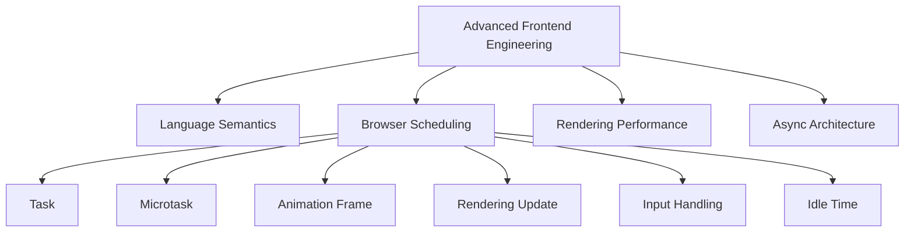
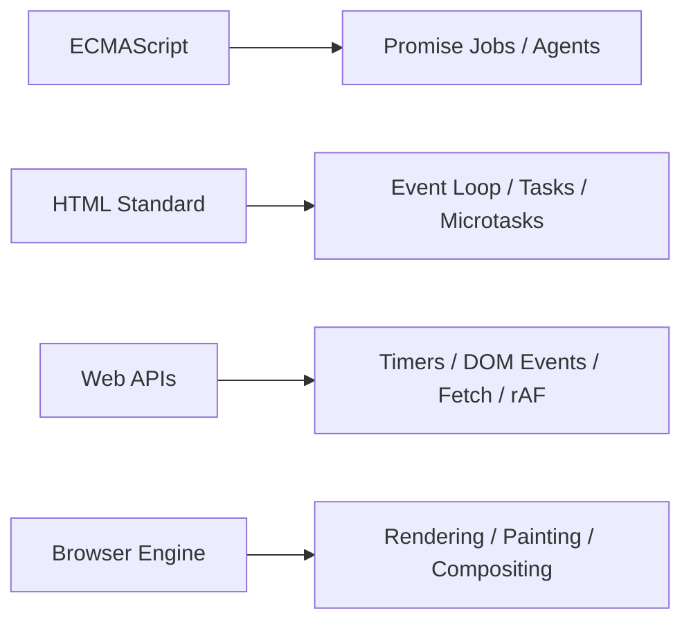
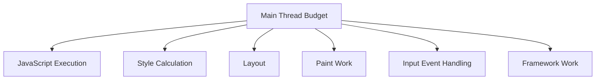
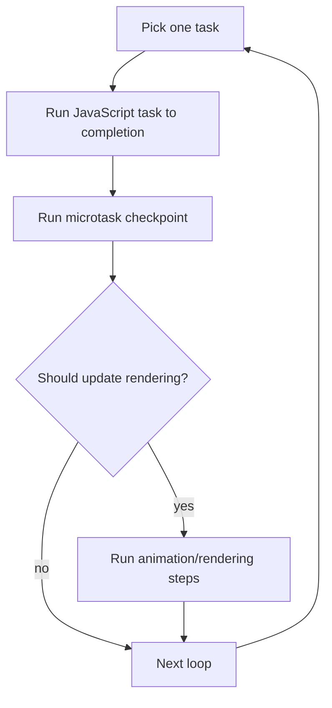
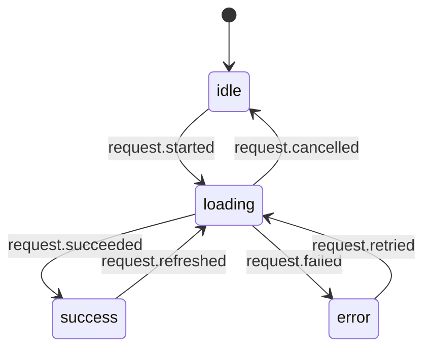
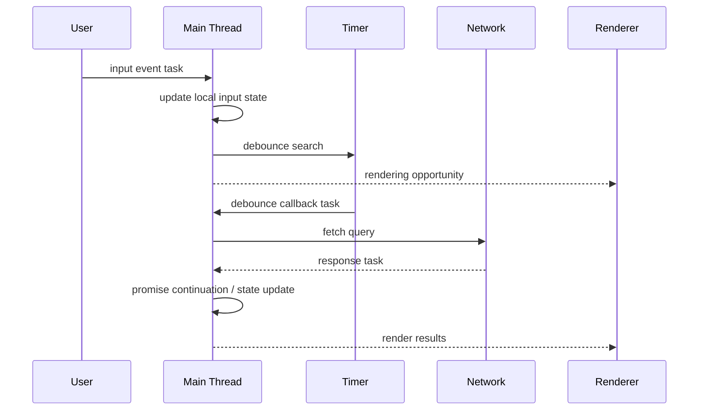
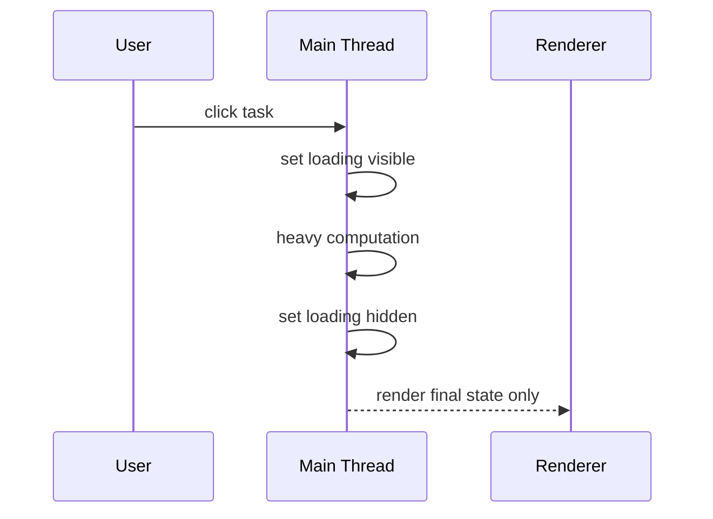
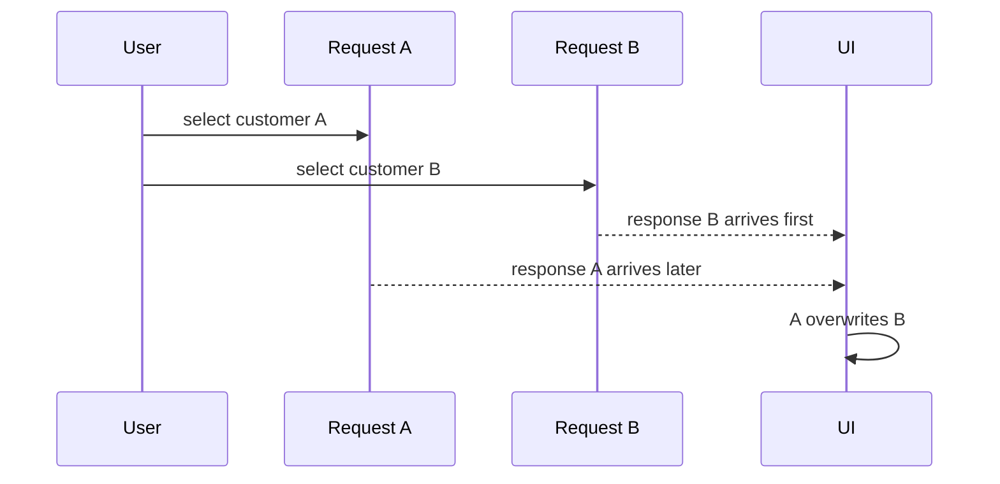

------
title: Learn Advanced JavaScript for Web / Frontend Engineering - Part 004
description: Deep dive ke browser event loop: tasks, microtasks, Promise jobs, rendering opportunity, requestAnimationFrame, timers, input responsiveness, starvation, scheduling, cancellation, dan debugging async UI bugs.
series: learn-javascript-frontend-advanced
seriesTitle: Learn Advanced JavaScript for Web / Frontend Engineering
order: 4
partTitle: Event Loop, Tasks, Microtasks, and Rendering
tags:
- javascript
- frontend
- web
- event-loop
- async
- rendering
- browser
- performance
date: 2026-06-27
---

# Event Loop, Tasks, Microtasks, and Rendering

Part ini menjawab pertanyaan inti yang sering membedakan frontend engineer biasa dan frontend engineer kuat:

> Kapan sebuah callback benar-benar berjalan, dan apa dampaknya terhadap rendering, input responsiveness, race condition, dan user experience?

Event loop bukan sekadar interview topic. Ia adalah fondasi untuk:

- UI freeze;
- delayed click handling;
- Promise ordering;
- `setTimeout(..., 0)` yang tidak langsung jalan;
- microtask starvation;
- animation jank;
- hydration scheduling;
- debounced search;
- retry/backoff;
- cancellation;
- long task;
- race condition pada data fetching;
- state update timing dalam framework.

Part sebelumnya membahas semantic JavaScript. Part ini membahas bagaimana host browser mengatur kapan JavaScript diberi kesempatan berjalan dan kapan browser melakukan rendering.

---

## 1. Posisi Dalam Framework Kaufman

Kaufman menyarankan memecah skill menjadi sub-skill yang bisa dilatih. Event loop adalah sub-skill kecil tetapi berdampak luas.



Target part ini: Anda bisa melihat bug asynchronous dan memetakan bug itu ke queue, phase, dan rendering opportunity yang benar.

---

## 2. Batas Konsep: ECMAScript vs Browser Host

ECMAScript mendefinisikan bahasa dan Promise jobs. Browser mendefinisikan event loop, task source, timers, DOM events, rendering update, dan integration dengan APIs.

Jadi, kalimat "JavaScript event loop" sebenarnya ringkas tapi kurang presisi. Lebih tepat:

- ECMAScript punya jobs dan agents;
- browser HTML standard mendefinisikan event loop processing model;
- Web APIs mengantrikan tasks atau callbacks ke mekanisme host;
- rendering engine punya kesempatan update rendering di antara pekerjaan tertentu;
- browser implementation punya optimisasi dan kebijakan scheduling sendiri.



Untuk engineering, pemisahan ini penting. Promise ordering tidak sama dengan timer ordering. `requestAnimationFrame` bukan "microtask". Rendering bukan callback JavaScript biasa.

---

## 3. Main Thread Sebagai Resource Terbatas

Di browser, banyak pekerjaan UI terjadi di main thread:

- menjalankan JavaScript;
- memproses event handler;
- mengubah DOM;
- style calculation;
- layout;
- paint preparation;
- sebagian rendering coordination;
- menjalankan framework reconciliation;
- menjalankan synchronous storage APIs;
- parsing HTML/CSS pada konteks tertentu.

Browser modern punya banyak thread internal, tetapi JavaScript UI application sering bottleneck di main thread.



Jika JavaScript menjalankan pekerjaan panjang, browser tidak bisa merespons input dan tidak bisa update visual tepat waktu.

---

## 4. Event Loop Mental Model

Sederhanakan dulu:



Model ini sengaja disederhanakan, tetapi cukup untuk mayoritas debugging frontend.

Rule utama:

1. satu task berjalan sampai selesai;
2. setelah task selesai, browser menjalankan microtasks sampai queue kosong;
3. setelah itu browser punya kesempatan melakukan rendering update;
4. jika task atau microtask terlalu lama, rendering dan input tertunda.

---

## 5. Run-to-Completion

JavaScript task berjalan sampai selesai. Browser tidak menghentikan function Anda di tengah kecuali hal luar biasa seperti page termination.

```js
button.addEventListener("click", () => {
  expensiveStep1();
  expensiveStep2();
  expensiveStep3();
});
```

Selama handler ini berjalan:

- click berikutnya tidak diproses;
- paint tidak terjadi;
- Promise callback lain tidak berjalan;
- timer callback lain menunggu;
- user bisa melihat UI freeze.

### 5.1 Run-to-Completion Menghindari Data Race Sederhana

Kelebihan model ini: tidak ada thread lain yang tiba-tiba mengubah variable JavaScript Anda di tengah synchronous function.

```js
let count = 0;

button.addEventListener("click", () => {
  const before = count;
  count = before + 1;
});
```

Namun race tetap bisa terjadi antar async boundary.

```js
let version = 0;

async function refresh() {
  const localVersion = ++version;
  const data = await fetchData();

  if (localVersion === version) {
    render(data);
  }
}
```

Async boundary membuka kemungkinan hasil lama datang setelah hasil baru.

---

## 6. Task

Task adalah unit kerja yang dimasukkan host ke event loop.

Sumber task dapat mencakup:

- script initial execution;
- timer callback;
- DOM event;
- network event;
- message event;
- history/navigation event;
- user interaction;
- postMessage;
- MessageChannel.

Contoh:

```js
console.log("A");

setTimeout(() => {
  console.log("B");
}, 0);

console.log("C");
```

Output:

```txt
A
C
B
```

Timer callback adalah task masa depan. Ia tidak interrupt task saat ini.

### 6.1 `setTimeout(..., 0)` Bukan "Sekarang"

`0` berarti minimum delay yang diminta, bukan guarantee langsung jalan. Callback harus menunggu:

- current task selesai;
- microtask checkpoint selesai;
- browser scheduling;
- timer clamping;
- tab throttling;
- task lain yang lebih dulu.

```js
setTimeout(() => {
  console.log("timer");
}, 0);

queueMicrotask(() => {
  console.log("microtask");
});

console.log("sync");
```

Output umum:

```txt
sync
microtask
timer
```

---

## 7. Microtask

Microtask berjalan setelah current task selesai dan sebelum browser kembali mengambil task berikutnya. Promise reactions dan `queueMicrotask` masuk ke microtask queue.

```js
console.log("A");

Promise.resolve().then(() => {
  console.log("B");
});

console.log("C");
```

Output:

```txt
A
C
B
```

### 7.1 Microtask Checkpoint

Setelah task selesai, browser menjalankan microtasks sampai queue kosong.

```js
queueMicrotask(() => {
  console.log("microtask 1");

  queueMicrotask(() => {
    console.log("microtask 2");
  });
});

console.log("sync");
```

Output:

```txt
sync
microtask 1
microtask 2
```

Microtask yang menambahkan microtask baru akan ikut dijalankan sebelum browser lanjut ke rendering/task berikutnya.

### 7.2 Microtask Starvation

Ini berbahaya:

```js
function loop() {
  queueMicrotask(loop);
}

loop();
```

Microtask queue tidak pernah kosong. Browser tidak punya kesempatan rendering atau mengambil task input berikutnya. Page bisa freeze.

Promise juga bisa membuat starvation:

```js
function loop() {
  Promise.resolve().then(loop);
}

loop();
```

---

## 8. Promise Ordering

Promise reaction callback adalah microtask.

```js
console.log("1");

setTimeout(() => console.log("2"), 0);

Promise.resolve()
  .then(() => console.log("3"))
  .then(() => console.log("4"));

console.log("5");
```

Output umum:

```txt
1
5
3
4
2
```

Mengapa?

1. synchronous code berjalan dulu;
2. timer mengantrikan task;
3. promise `.then` mengantrikan microtask;
4. setelah current task selesai, microtasks berjalan;
5. baru task timer diambil.

### 8.1 Promise Callback Tidak Menjadikan CPU Work Async

```js
Promise.resolve().then(() => {
  heavyComputation();
});
```

Ini menunda heavy computation ke microtask, tetapi tetap berjalan di main thread dan tetap bisa block rendering.

Jika pekerjaan berat, Anda butuh chunking, worker, atau algorithmic optimization.

---

## 9. `async` / `await` Dari Perspektif Scheduling

`await` memecah function menjadi beberapa bagian. Bagian setelah `await` berjalan sebagai continuation ketika promise settled.

```js
async function run() {
  console.log("A");
  await null;
  console.log("B");
}

run();
console.log("C");
```

Output:

```txt
A
C
B
```

Karena `await null` diperlakukan seperti await promise yang already fulfilled; continuation tetap asynchronous.

### 9.1 `await` Bisa Membuka Race

```js
let currentRequestId = 0;

async function loadUser(userId) {
  const requestId = ++currentRequestId;

  const user = await fetchUser(userId);

  if (requestId !== currentRequestId) {
    return;
  }

  renderUser(user);
}
```

Tanpa guard, response request lama bisa menimpa UI request baru.

---

## 10. Rendering Opportunity

Browser tidak render setelah setiap line JavaScript. Browser punya kesempatan update rendering di antara event loop turns dan berdasarkan kebijakan internal.

Contoh:

```js
element.textContent = "Loading...";

heavyComputation();

element.textContent = "Done";
```

User mungkin tidak pernah melihat "Loading..." karena JavaScript task belum selesai, sehingga browser belum sempat paint.

### 10.1 Yield Agar Browser Bisa Paint

```js
element.textContent = "Loading...";

setTimeout(() => {
  heavyComputation();
  element.textContent = "Done";
}, 0);
```

Ini memberi browser kesempatan untuk memproses rendering sebelum task berikutnya, walau tidak selalu guarantee dalam semua kondisi.

Alternatif modern bergantung support target:

```js
await new Promise((resolve) => requestAnimationFrame(resolve));
```

Jika ingin memberi kesempatan frame berikutnya:

```js
await new Promise((resolve) => requestAnimationFrame(() => {
  requestAnimationFrame(resolve);
}));
```

Double rAF kadang dipakai untuk memastikan perubahan style awal sudah ter-render sebelum transisi berikutnya, tetapi gunakan dengan hati-hati dan test di target browser.

---

## 11. `requestAnimationFrame`

`requestAnimationFrame` meminta browser menjalankan callback sebelum repaint berikutnya.

```js
function animate() {
  updateModel();
  renderFrame();

  requestAnimationFrame(animate);
}

requestAnimationFrame(animate);
```

Use case:

- animation;
- DOM read/write scheduling;
- visual updates;
- measuring frame-to-frame changes;
- coordinating with browser paint cycle.

### 11.1 rAF Bukan Timer Umum

Jangan gunakan rAF untuk retry network, debounce search, atau polling domain data.

rAF cocok untuk pekerjaan visual. Timer atau scheduler lain lebih cocok untuk non-visual tasks.

### 11.2 rAF dan Tab Background

Browser bisa pause atau throttle rAF pada background tab. Ini baik untuk battery dan performance.

Jadi jangan taruh domain-critical background work hanya di rAF.

---

## 12. `requestIdleCallback`

`requestIdleCallback` menjalankan callback saat browser idle. Namun support dan behavior bisa berbeda antar browser, dan tidak cocok untuk pekerjaan yang wajib segera selesai.

Use case:

- non-critical analytics preparation;
- cache warmup ringan;
- precompute optional;
- cleanup ringan;
- background indexing kecil.

```js
requestIdleCallback((deadline) => {
  while (deadline.timeRemaining() > 0 && hasWork()) {
    doSmallUnitOfWork();
  }
});
```

Fallback perlu disediakan jika target browser tidak mendukung.

```js
const scheduleIdle =
  window.requestIdleCallback ??
  ((callback) => setTimeout(() => callback({
    timeRemaining: () => 0,
    didTimeout: true,
  }), 1));
```

### Production Rule

Idle callback bukan tempat untuk pekerjaan correctness-critical.

---

## 13. Timer Clamping dan Throttling

Timer tidak selalu presisi. Browser bisa melakukan:

- minimum timeout clamping;
- nested timer clamping;
- background tab throttling;
- battery-saving behavior;
- privacy-driven timer precision reduction.

Jangan membuat logic domain yang bergantung pada presisi `setTimeout`.

Buruk:

```js
setTimeout(() => {
  assumePaymentExpired();
}, 15 * 60 * 1000);
```

Lebih baik:

```js
function isPaymentExpired(payment) {
  return Date.now() >= payment.expiresAt;
}
```

Timer boleh memicu check, tetapi source of truth harus timestamp/domain state.

---

## 14. MessageChannel Untuk Yielding

`MessageChannel` bisa dipakai untuk schedule task dengan overhead rendah.

```js
function createTaskScheduler() {
  const queue = [];
  const channel = new MessageChannel();

  channel.port1.onmessage = () => {
    const task = queue.shift();

    if (task) {
      task();
    }

    if (queue.length > 0) {
      channel.port2.postMessage(null);
    }
  };

  return function schedule(task) {
    queue.push(task);

    if (queue.length === 1) {
      channel.port2.postMessage(null);
    }
  };
}

const scheduleTask = createTaskScheduler();

scheduleTask(() => {
  console.log("scheduled task");
});
```

Ini berguna untuk chunking pekerjaan tanpa bergantung hanya pada timer.

---

## 15. Chunking CPU Work

Masalah:

```js
function processAll(items) {
  for (const item of items) {
    expensiveProcess(item);
  }
}
```

Jika `items` besar, UI freeze.

Solusi: pecah menjadi chunk.

```js
async function processInChunks(items, chunkSize = 100) {
  for (let index = 0; index < items.length; index += chunkSize) {
    const chunk = items.slice(index, index + chunkSize);

    for (const item of chunk) {
      expensiveProcess(item);
    }

    await yieldToMain();
  }
}

function yieldToMain() {
  return new Promise((resolve) => setTimeout(resolve, 0));
}
```

### 15.1 Time Budget Lebih Baik Dari Fixed Chunk

```js
async function processWithBudget(items, budgetMs = 8) {
  let index = 0;

  while (index < items.length) {
    const start = performance.now();

    while (index < items.length && performance.now() - start < budgetMs) {
      expensiveProcess(items[index]);
      index += 1;
    }

    await yieldToMain();
  }
}
```

Kenapa 8ms? Pada layar 60Hz, satu frame sekitar 16.67ms. Jika JavaScript mengambil seluruh budget, style/layout/paint/input tidak punya ruang. Nilai nyata perlu disesuaikan dengan target device.

---

## 16. Long Tasks

Long task umumnya berarti pekerjaan main thread yang berlangsung lama dan mengganggu responsiveness. Dalam performance tooling, threshold 50ms sering digunakan untuk menandai task yang cukup panjang untuk mengganggu interaksi.

Dampaknya:

- input terlambat diproses;
- animation frame drop;
- INP memburuk;
- perceived performance turun;
- user menganggap aplikasi hang.

### 16.1 Long Task Sources

- JSON parsing besar;
- rendering list besar;
- synchronous validation kompleks;
- syntax highlighting besar;
- markdown rendering besar;
- crypto/compression di main thread;
- expensive selector/reducer;
- uncontrolled re-render;
- synchronous localStorage access berulang;
- layout thrashing;
- hydration bundle besar.

---

## 17. Input Responsiveness

User interaction adalah pekerjaan time-sensitive.

Buruk:

```js
input.addEventListener("input", (event) => {
  const result = expensiveSearch(event.target.value);
  render(result);
});
```

Lebih baik:

```js
input.addEventListener("input", (event) => {
  const query = event.target.value;

  scheduleSearch(query);
});
```

Dengan debounce:

```js
function debounce(fn, delay) {
  let timerId;

  return (...args) => {
    clearTimeout(timerId);

    timerId = setTimeout(() => {
      fn(...args);
    }, delay);
  };
}

const scheduleSearch = debounce((query) => {
  render(expensiveSearch(query));
}, 150);
```

Tetapi debounce bukan solusi untuk CPU work yang tetap berat. Jika expensive search lokal besar, gunakan worker atau indexing.

---

## 18. Debounce, Throttle, dan Frame Throttle

### 18.1 Debounce

Menunggu input berhenti.

Cocok untuk:

- search request;
- autosave;
- validation mahal;
- resize final calculation.

```js
const debouncedSave = debounce(saveDraft, 500);
```

### 18.2 Throttle

Membatasi frekuensi.

Cocok untuk:

- scroll tracking;
- pointer move;
- repeated measurement;
- telemetry.

```js
function throttle(fn, interval) {
  let last = 0;
  let trailingArgs = null;
  let timerId = null;

  return (...args) => {
    const now = Date.now();
    const remaining = interval - (now - last);

    if (remaining <= 0) {
      last = now;
      fn(...args);
      return;
    }

    trailingArgs = args;

    if (!timerId) {
      timerId = setTimeout(() => {
        last = Date.now();
        timerId = null;
        fn(...trailingArgs);
        trailingArgs = null;
      }, remaining);
    }
  };
}
```

### 18.3 rAF Throttle

Untuk visual event seperti scroll/pointer:

```js
function rafThrottle(fn) {
  let scheduled = false;
  let latestArgs;

  return (...args) => {
    latestArgs = args;

    if (scheduled) {
      return;
    }

    scheduled = true;

    requestAnimationFrame(() => {
      scheduled = false;
      fn(...latestArgs);
    });
  };
}
```

Ini menyelaraskan update dengan frame.

---

## 19. DOM Read/Write Scheduling

Masalah layout thrashing:

```js
for (const item of items) {
  const height = item.element.offsetHeight; // read layout
  item.element.style.height = `${height + 10}px`; // write
}
```

Mencampur read/write bisa memaksa layout berulang.

Lebih baik batch read lalu write:

```js
const heights = items.map((item) => item.element.offsetHeight);

items.forEach((item, index) => {
  item.element.style.height = `${heights[index] + 10}px`;
});
```

Atau schedule:

```js
requestAnimationFrame(() => {
  const rect = element.getBoundingClientRect();

  requestAnimationFrame(() => {
    element.style.transform = `translateX(${rect.width}px)`;
  });
});
```

Detail rendering pipeline dibahas lebih dalam di Part 009.

---

## 20. Race Condition Pada Data Fetching

Event loop membuat JavaScript single-threaded per agent, tetapi async I/O tetap bisa menghasilkan race.

```js
let currentUserId;

async function selectUser(userId) {
  currentUserId = userId;

  const user = await fetchUser(userId);

  renderUser(user);
}
```

Jika user memilih A lalu B, response A bisa datang setelah B dan menimpa UI.

### 20.1 Version Guard

```js
let requestVersion = 0;

async function selectUser(userId) {
  const version = ++requestVersion;

  const user = await fetchUser(userId);

  if (version !== requestVersion) {
    return;
  }

  renderUser(user);
}
```

### 20.2 AbortController

```js
let currentController;

async function selectUser(userId) {
  currentController?.abort();

  const controller = new AbortController();
  currentController = controller;

  try {
    const response = await fetch(`/api/users/${userId}`, {
      signal: controller.signal,
    });

    const user = await response.json();

    renderUser(user);
  } catch (error) {
    if (error.name === "AbortError") {
      return;
    }

    showError(error);
  }
}
```

Cancellation akan dibahas lebih dalam di Part 005.

---

## 21. Async State Machine

Async flow sebaiknya tidak hanya "loading boolean".

Buruk untuk kasus kompleks:

```js
let loading = false;
let error = null;
let data = null;
```

Lebih baik model state eksplisit:

```js
const LoadState = {
  IDLE: "idle",
  LOADING: "loading",
  SUCCESS: "success",
  ERROR: "error",
};

let state = {
  status: LoadState.IDLE,
  data: null,
  error: null,
};
```

State transition:



Event loop tidak menghapus kebutuhan state machine. Justru async boundary membuat state machine makin penting.

---

## 22. Microtask Dalam Framework

Framework modern sering menggunakan microtask atau scheduler internal untuk batching.

Contoh conceptual:

```js
let pending = false;

function setState(partial) {
  applyPartial(partial);

  if (!pending) {
    pending = true;

    queueMicrotask(() => {
      pending = false;
      render();
    });
  }
}
```

Jika beberapa `setState` terjadi dalam task yang sama:

```js
setState({ a: 1 });
setState({ b: 2 });
setState({ c: 3 });
```

Render bisa dibatch menjadi satu microtask.

### 22.1 Danger

Jika framework atau app mengantrikan terlalu banyak microtask, rendering tertunda.

```js
for (let i = 0; i < 100_000; i++) {
  queueMicrotask(() => doSmallWork(i));
}
```

"Small work" dikali 100.000 tetap besar.

---

## 23. Macro vs Micro Naming

Banyak artikel memakai istilah "macrotask". HTML standard memakai "task". Untuk komunikasi internal, boleh pakai "task vs microtask", dan hindari bergantung pada istilah "macrotask" jika sedang menjelaskan berdasarkan spec.

Ringkas:

| Informal | Lebih presisi |
|---|---|
| macrotask | task |
| microtask | microtask |
| render queue | bukan queue umum yang sama seperti task; rendering steps punya model sendiri |
| callback queue | terlalu umum |
| event queue | terlalu umum |

---

## 24. Ordering Drill

Prediksi output:

```js
console.log("A");

setTimeout(() => console.log("B"), 0);

queueMicrotask(() => {
  console.log("C");
});

Promise.resolve().then(() => {
  console.log("D");

  queueMicrotask(() => {
    console.log("E");
  });
});

console.log("F");
```

Output:

```txt
A
F
C
D
E
B
```

Reason:

1. sync: A, schedule timer, schedule C, schedule D, F;
2. microtask checkpoint: C, D;
3. D schedules E;
4. E runs before task queue lanjut;
5. timer B runs in later task.

---

## 25. Rendering Drill

```js
box.style.transform = "translateX(0px)";

requestAnimationFrame(() => {
  box.style.transition = "transform 300ms ease";
  box.style.transform = "translateX(100px)";
});
```

Apakah transisi selalu terjadi? Biasanya lebih baik daripada synchronous write, tetapi masih bisa dipengaruhi style flush dan browser optimization.

Lebih robust untuk beberapa transition setup:

```js
box.style.transition = "none";
box.style.transform = "translateX(0px)";

requestAnimationFrame(() => {
  requestAnimationFrame(() => {
    box.style.transition = "transform 300ms ease";
    box.style.transform = "translateX(100px)";
  });
});
```

Namun double rAF bukan magic universal. Gunakan ketika Anda benar-benar perlu memisahkan frame setup dan frame transition, dan sertai test visual/regression.

---

## 26. Scheduling Strategy Untuk Frontend

Pilih scheduler sesuai intent.

| Intent | Tool umum | Catatan |
|---|---|---|
| run after current sync work before paint | microtask | hati-hati starvation |
| run in later task | `setTimeout`, `MessageChannel` | memberi browser peluang lain |
| visual update before repaint | `requestAnimationFrame` | untuk rendering/animation |
| non-critical idle work | `requestIdleCallback` | butuh fallback/support check |
| cancellable network | `AbortController` | bukan scheduler, tapi lifecycle control |
| heavy CPU | Web Worker | off-main-thread |
| repeated visual event | rAF throttle | align ke frame |
| final user input | debounce | delay sampai user berhenti |
| periodic cap | throttle | batasi frekuensi |

---

## 27. Yielding API Utility

Utility sederhana:

```js
export function nextTask() {
  return new Promise((resolve) => setTimeout(resolve, 0));
}

export function nextFrame() {
  return new Promise((resolve) => requestAnimationFrame(resolve));
}

export async function afterPaint() {
  await nextFrame();
  await nextFrame();
}
```

Gunakan nama sesuai intent:

- `nextTask` untuk memberi event loop kesempatan mengambil task lain;
- `nextFrame` untuk align sebelum repaint;
- `afterPaint` untuk memisahkan dua frame, misalnya setup transition.

Jangan menyebar `setTimeout(..., 0)` random tanpa nama. Itu membuat intent hilang.

---

## 28. Cooperative Scheduler Mini Implementation

```js
export function createCooperativeScheduler({
  budgetMs = 8,
  yieldFn = () => new Promise((resolve) => setTimeout(resolve, 0)),
} = {}) {
  return async function run(work) {
    let shouldContinue = true;

    while (shouldContinue) {
      const start = performance.now();

      while (performance.now() - start < budgetMs) {
        shouldContinue = work();

        if (!shouldContinue) {
          return;
        }
      }

      await yieldFn();
    }
  };
}
```

Usage:

```js
const runCooperatively = createCooperativeScheduler();

await runCooperatively(() => {
  const item = queue.shift();

  if (!item) {
    return false;
  }

  process(item);
  return true;
});
```

Ini pattern penting untuk:

- process large list;
- client-side import;
- CSV parse ringan;
- offline cache migration;
- syntax highlighting;
- search indexing kecil.

Jika CPU work tetap berat, pindahkan ke Worker.

---

## 29. Web Worker Boundary

Event loop main thread tidak boleh memikul semua pekerjaan. Untuk compute besar, Worker adalah boundary.

```js
// main.js
const worker = new Worker(new URL("./worker.js", import.meta.url), {
  type: "module",
});

worker.postMessage({ type: "compute", payload: largeInput });

worker.onmessage = (event) => {
  render(event.data);
};
```

```js
// worker.js
self.onmessage = (event) => {
  if (event.data.type !== "compute") {
    return;
  }

  const result = expensiveCompute(event.data.payload);

  self.postMessage(result);
};
```

Trade-off:

- serialization cost;
- transferables;
- error handling;
- worker lifecycle;
- bundler config;
- cancellation;
- memory duplication;
- API boundary design.

Part 022 akan membahas ini secara dalam.

---

## 30. Event Listener Ordering

DOM event dispatch sendiri punya model capture-target-bubble.

```js
parent.addEventListener("click", () => console.log("parent bubble"));
parent.addEventListener("click", () => console.log("parent capture"), true);

child.addEventListener("click", () => console.log("child"));
```

Jika child diklik:

```txt
parent capture
child
parent bubble
```

Event handler berjalan dalam task event dispatch. Microtasks yang dijadwalkan di handler akan berjalan setelah stack event dispatch selesai, bukan di tengah propagation normal.

```js
parent.addEventListener("click", () => {
  queueMicrotask(() => console.log("microtask"));
  console.log("parent");
});

child.addEventListener("click", () => {
  console.log("child");
});
```

Detail event DOM lebih dalam akan dibahas di Part 008.

---

## 31. Synchronous APIs Yang Memblok Main Thread

Beberapa API terlihat ringan tetapi synchronous:

- `localStorage`;
- `sessionStorage`;
- besar `JSON.parse`;
- besar `JSON.stringify`;
- sync DOM measurement;
- alert/confirm/prompt;
- document.cookie access;
- heavy regex;
- crypto/compression JS implementation;
- large canvas readback.

Contoh buruk:

```js
window.addEventListener("scroll", () => {
  localStorage.setItem("scrollY", String(window.scrollY));
});
```

Lebih baik throttle dan simpan pada interval wajar, atau gunakan lifecycle event yang sesuai.

---

## 32. Event Loop dan Testing

Async UI test sering flaky karena test tidak tahu kapan sistem "settled".

Buruk:

```js
button.click();

expect(screen.getByText("Saved")).toBeVisible();
```

Jika update async:

```js
button.click();

expect(await screen.findByText("Saved")).toBeVisible();
```

Namun "await next tick" random juga buruk:

```js
await new Promise((resolve) => setTimeout(resolve, 0));
```

Lebih baik tunggu observable user outcome:

```js
await expect(page.getByText("Saved")).toBeVisible();
```

Testing strategy akan dibahas di Part 025 dan Playwright di Part 026.

---

## 33. Debugging Event Loop Bugs

Gunakan pendekatan ini.

### 33.1 Reconstruct Timeline

Tulis timeline:

```md
T0: user clicks Save
T1: click handler starts
T2: set loading true
T3: fetch started
T4: handler returns
T5: render loading
T6: user clicks Cancel
T7: abort called
T8: fetch rejects AbortError
T9: catch runs
T10: final state?
```

### 33.2 Classify Each Step

Untuk setiap step:

- sync stack;
- task;
- microtask;
- rAF callback;
- network completion task;
- framework scheduler;
- worker message;
- rendering opportunity.

### 33.3 Identify Broken Invariant

Contoh invariant:

- only latest request may update visible data;
- cancelled request must not show error toast;
- loading indicator must be visible before heavy work;
- unmounted component must not receive state update;
- input keystroke must not run more than X ms of sync work.

---

## 34. Performance Timeline Instrumentation

Gunakan Performance API untuk memberi marker.

```js
performance.mark("search:start");

const result = search(query);

performance.mark("search:end");
performance.measure("search", "search:start", "search:end");

console.table(performance.getEntriesByName("search"));
```

Untuk async:

```js
performance.mark("save:start");

try {
  await save();
  performance.mark("save:success");
} catch (error) {
  performance.mark("save:error");
  throw error;
} finally {
  performance.measure("save:total", "save:start");
}
```

Instrumentation membantu membedakan:

- network lambat;
- JS CPU lambat;
- rendering lambat;
- scheduling delay;
- framework delay;
- main-thread contention.

---

## 35. Timeline Example: Search Input



Failure modes:

- debounce terlalu lama;
- request lama menang race;
- parsing response besar memblok main thread;
- rendering result list terlalu mahal;
- no cancellation;
- no loading state;
- no accessibility announcement.

---

## 36. Timeline Example: Show Loading Before Heavy Work

Buruk:

```js
button.addEventListener("click", () => {
  loading.hidden = false;

  heavyComputation();

  loading.hidden = true;
});
```

Timeline:



Lebih baik:

```js
button.addEventListener("click", async () => {
  loading.hidden = false;

  await nextFrame();

  heavyComputation();

  loading.hidden = true;
});
```

Namun jika `heavyComputation` panjang, UI tetap freeze setelah loading muncul. Lebih baik chunk atau worker.

---

## 37. Common Misconceptions

### 37.1 "Promise Membuat Code Parallel"

Salah. Promise merepresentasikan eventual result. Callback Promise tetap berjalan di thread JavaScript terkait.

### 37.2 "`setTimeout(fn, 0)` Berarti Segera"

Salah. Ia schedule task masa depan dengan delay minimum, bukan immediate execution.

### 37.3 "Microtask Selalu Lebih Baik Karena Lebih Cepat"

Salah. Microtask bisa menunda rendering dan input jika terlalu banyak.

### 37.4 "rAF Sama Dengan 16ms Timer"

Salah. rAF diselaraskan dengan repaint dan bisa pause/throttle.

### 37.5 "Jika JavaScript Single-Threaded, Tidak Ada Race Condition"

Salah. Race antar async completion sangat umum.

---

## 38. Code Review Red Flags

Cari ini:

```js
// 1. Heavy work in input handler
input.addEventListener("input", () => {
  expensiveWork();
});

// 2. Infinite microtask chain
Promise.resolve().then(function loop() {
  return Promise.resolve().then(loop);
});

// 3. Loading state not painted before heavy work
setLoading(true);
expensiveWork();
setLoading(false);

// 4. No guard against stale fetch response
const data = await fetchData(id);
setData(data);

// 5. Timer as source of truth
setTimeout(expireSession, sessionExpiresInMs);

// 6. rAF for non-visual domain polling
requestAnimationFrame(pollServer);

// 7. localStorage in high-frequency event
window.addEventListener("scroll", saveToLocalStorage);

// 8. Random await timeout in test
await new Promise((resolve) => setTimeout(resolve, 100));
```

---

## 39. Production Heuristics

1. Keep user input handlers short.
2. Do not run unbounded loops on main thread.
3. Treat microtasks as urgent and small.
4. Use rAF for visual coordination, not business scheduling.
5. Use timestamp/domain state as source of truth, not timer precision.
6. Guard async requests with version or cancellation.
7. Chunk CPU work if it must stay on main thread.
8. Move heavy compute to Worker.
9. Instrument timeline before guessing.
10. Test user-visible outcomes, not internal ticks.

---

## 40. Practice Loop Kaufman

### Drill 1 — Ordering

Untuk setiap snippet:

1. prediksi output;
2. klasifikasikan setiap callback sebagai sync/task/microtask/rAF;
3. jalankan;
4. perbaiki mental model.

```js
console.log("start");

setTimeout(() => console.log("timeout"), 0);

Promise.resolve().then(() => {
  console.log("promise 1");
  queueMicrotask(() => console.log("queued"));
});

Promise.resolve().then(() => console.log("promise 2"));

console.log("end");
```

### Drill 2 — Paint Visibility

Buat halaman kecil dengan tombol:

1. klik tombol;
2. tampilkan loading;
3. jalankan CPU loop 500ms;
4. amati apakah loading terlihat;
5. ubah dengan `requestAnimationFrame`;
6. ubah dengan chunking;
7. ubah dengan worker.

Catat difference.

### Drill 3 — Race Condition

Buat fake API:

```js
function fetchUser(id, delay) {
  return new Promise((resolve) => {
    setTimeout(() => resolve({ id }), delay);
  });
}
```

Simulasikan:

```js
selectUser("A", 500);
selectUser("B", 100);
```

Pastikan UI akhirnya menampilkan B, bukan A. Implementasikan dengan:

- version guard;
- AbortController-like cancellation;
- state machine event reducer.

---

## 41. Mini Lab: Build Event Loop Trace Logger

```js
function log(label) {
  console.log(`${performance.now().toFixed(2)}ms ${label}`);
}

log("sync:start");

setTimeout(() => {
  log("task:timeout");
}, 0);

queueMicrotask(() => {
  log("microtask:queueMicrotask");
});

Promise.resolve().then(() => {
  log("microtask:promise");
});

requestAnimationFrame(() => {
  log("raf");
});

log("sync:end");
```

Extend:

- tambahkan nested microtask;
- tambahkan nested timer;
- tambahkan CPU loop 100ms;
- tambahkan DOM mutation;
- lihat timeline di DevTools Performance panel.

Tujuannya bukan menghafal output semua browser, tetapi memahami pola scheduling.

---

## 42. Mini Lab: Cooperative List Processor

```js
async function renderLargeList(items, container) {
  container.textContent = "";

  const fragment = document.createDocumentFragment();

  for (let index = 0; index < items.length; index++) {
    const row = document.createElement("div");
    row.textContent = items[index].name;
    fragment.append(row);

    if (index % 250 === 0) {
      container.append(fragment.cloneNode(true));
      fragment.textContent = "";
      await nextTask();
    }
  }

  container.append(fragment);
}
```

Masalah pada contoh ini: `cloneNode(true)` bisa mahal dan semantic-nya mungkin salah. Tugas Anda adalah memperbaiki lab menjadi:

- append batch fragment tanpa clone;
- ukuran batch berdasarkan waktu;
- cancellation jika user berpindah route;
- progress indicator;
- performance marks.

Sketch lebih baik:

```js
async function renderLargeList(items, container, signal) {
  container.textContent = "";

  let index = 0;

  while (index < items.length) {
    if (signal.aborted) {
      return;
    }

    const start = performance.now();
    const fragment = document.createDocumentFragment();

    while (index < items.length && performance.now() - start < 8) {
      const row = document.createElement("div");
      row.textContent = items[index].name;
      fragment.append(row);
      index += 1;
    }

    container.append(fragment);

    await nextTask();
  }
}
```

---

## 43. Mini Case Study: Stale Request Overwrites Latest UI

### Symptom

User memilih customer B, tetapi UI menampilkan customer A.

### Timeline



### Fix Dengan Version

```js
let selectedCustomerVersion = 0;

async function selectCustomer(customerId) {
  const version = ++selectedCustomerVersion;

  setState({ status: "loading", customerId });

  try {
    const customer = await api.fetchCustomer(customerId);

    if (version !== selectedCustomerVersion) {
      return;
    }

    setState({
      status: "success",
      customerId,
      customer,
    });
  } catch (error) {
    if (version !== selectedCustomerVersion) {
      return;
    }

    setState({
      status: "error",
      customerId,
      error,
    });
  }
}
```

### Invariant

Only the latest selected customer may update the visible customer panel.

---

## 44. Mini Case Study: Microtask Starvation Dari Library Internal

### Symptom

Aplikasi freeze setelah import data kecil-menengah.

```js
function processQueue(queue) {
  if (queue.length === 0) {
    return;
  }

  const item = queue.shift();
  process(item);

  queueMicrotask(() => processQueue(queue));
}
```

### Root Cause

Microtask chain terus mengisi dirinya sampai queue habis. Browser tidak punya kesempatan memproses rendering atau input jika queue besar.

### Fix

Gunakan task yielding dengan budget.

```js
async function processQueue(queue) {
  while (queue.length > 0) {
    const start = performance.now();

    while (queue.length > 0 && performance.now() - start < 8) {
      process(queue.shift());
    }

    await nextTask();
  }
}
```

### Lesson

Microtask untuk "soon", bukan untuk "do all background work".

---

## 45. Self-Assessment

Anda siap lanjut ke Part 005 jika bisa menjawab:

1. Apa beda task dan microtask?
2. Mengapa Promise callback berjalan sebelum timer callback?
3. Mengapa microtask bisa membuat UI freeze?
4. Mengapa loading indicator bisa tidak terlihat sebelum CPU work?
5. Kapan memakai rAF, bukan setTimeout?
6. Kapan debounce tidak cukup?
7. Bagaimana stale response bisa menimpa state terbaru?
8. Mengapa `await` membuka async boundary?
9. Bagaimana cara chunking CPU work di main thread?
10. Apa tanda bahwa pekerjaan harus dipindah ke Worker?

---

## 46. What Comes Next

Part 005 akan membahas **Async Control Flow and Cancellation**:

- Promise failure semantics;
- structured async flow;
- AbortController;
- timeout;
- retry/backoff;
- request deduplication;
- idempotency;
- cancellation propagation;
- async resource cleanup;
- failure-mode modeling untuk UI production.

---

## 47. References

- WHATWG HTML Living Standard, Web application APIs and event loops: https://html.spec.whatwg.org/multipage/webappapis.html
- MDN, In depth: Microtasks and the JavaScript runtime environment: https://developer.mozilla.org/en-US/docs/Web/API/HTML_DOM_API/Microtask_guide/In_depth
- MDN, Using microtasks in JavaScript with queueMicrotask(): https://developer.mozilla.org/en-US/docs/Web/API/HTML_DOM_API/Microtask_guide
- MDN, requestAnimationFrame(): https://developer.mozilla.org/en-US/docs/Web/API/Window/requestAnimationFrame
- MDN, requestIdleCallback(): https://developer.mozilla.org/en-US/docs/Web/API/Window/requestIdleCallback
- MDN, AbortController: https://developer.mozilla.org/en-US/docs/Web/API/AbortController
- web.dev, Optimize long tasks: https://web.dev/articles/optimize-long-tasks
