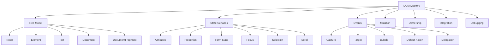
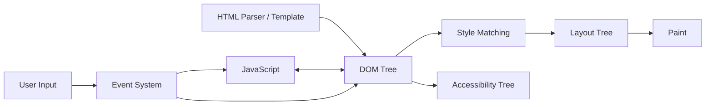
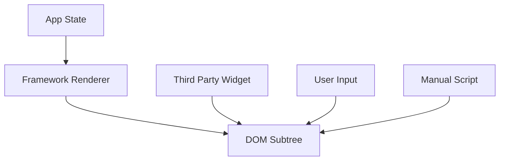
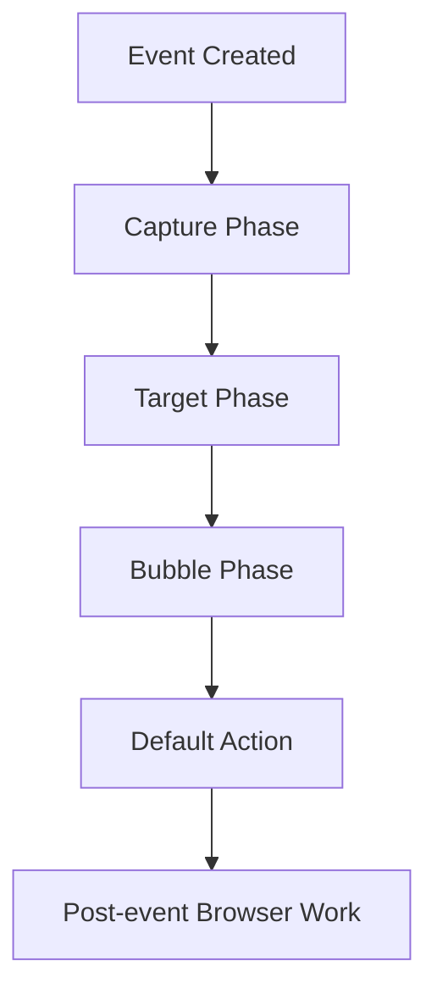
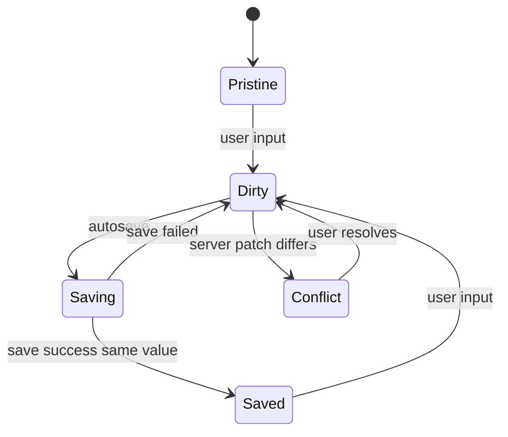

------
title: Learn Advanced JavaScript for Web / Frontend Engineering - Part 008
description: Deep dive ke DOM sebagai stateful system: DOM tree, node ownership, live/static collections, event propagation, mutation, observer, focus/selection/scroll state, imperative DOM integration, dan failure modes di aplikasi frontend modern.
series: learn-javascript-frontend-advanced
seriesTitle: Learn Advanced JavaScript for Web / Frontend Engineering
order: 8
partTitle: DOM as a Stateful System
tags:
- javascript
- frontend
- web
- dom
- browser
- eventtarget
- mutationobserver
- state
- architecture
- advanced
date: 2026-06-27
---

# DOM as a Stateful System

DOM bukan sekadar hasil render HTML. DOM adalah object graph mutable yang menjadi boundary antara JavaScript, parser HTML, CSS engine, event system, accessibility tree, layout engine, user input, browser history, focus, selection, scroll, dan framework runtime.

Frontend engineer yang hanya melihat DOM sebagai “tempat menaruh element” akan kesulitan saat menghadapi bug seperti:

- input value berubah tetapi state framework tidak berubah;
- event handler jalan dua kali atau tidak jalan;
- click dari portal/shadow DOM tidak sesuai ekspektasi;
- focus hilang setelah re-render;
- scroll jump setelah navigasi;
- node sudah dihapus tetapi memory tetap naik;
- MutationObserver membuat feedback loop;
- third-party widget merusak subtree yang dianggap milik framework;
- query DOM mengembalikan collection yang berubah saat sedang diiterasi;
- browser melakukan default action yang bertabrakan dengan state aplikasi.

Part ini membangun mental model DOM sebagai **stateful system**.

---

## 1. Posisi Part Ini Dalam Framework Kaufman

Menguasai DOM bukan berarti hafal semua method. Yang penting adalah tahu primitive apa yang membentuk perilaku runtime.



Target part ini:

1. Anda bisa membedakan DOM tree, rendered layout, accessibility tree, dan framework virtual/reactive state.
2. Anda bisa menentukan siapa pemilik sebuah subtree.
3. Anda bisa memprediksi event propagation dan default action.
4. Anda bisa menghindari mutation feedback loop.
5. Anda bisa mengintegrasikan imperative DOM library tanpa merusak framework state.

---

## 2. Kontrak Belajar

Setelah menyelesaikan part ini, Anda harus bisa:

- menjelaskan DOM sebagai tree of nodes dan object graph yang mutable;
- membedakan node, element, attribute, property, text, document, dan fragment;
- memahami perbedaan attribute dan property, terutama pada form controls;
- mengenali live collection vs static collection;
- memahami event propagation: capture, target, bubble, composed path, cancelation, dan default action;
- menggunakan event delegation secara aman;
- memahami mutation API dan `MutationObserver`;
- mengelola focus, selection, dan scroll sebagai state;
- membuat DOM ownership boundary untuk mencegah state drift;
- membuat integration wrapper untuk third-party imperative widget;
- membuat checklist debugging DOM bug.

Yang tidak dibahas ulang:

- syntax HTML dasar;
- semantic HTML dasar;
- CSS layout dasar;
- framework rendering detail yang akan dibahas di part berikutnya.

---

## 3. Mental Model: DOM Adalah State Graph

DOM adalah representasi dokumen sebagai node dan object. JavaScript dapat membaca dan mengubah graph ini. Browser menggunakan graph ini, bersama CSSOM dan state lain, untuk menghasilkan rendering, accessibility representation, dan event behavior.



Hal penting:

- DOM tree bukan layout tree;
- DOM node bisa ada tanpa terlihat;
- element terlihat belum tentu interactive;
- DOM property bisa berbeda dari HTML attribute;
- user input dapat mengubah DOM state tanpa mengubah application state;
- framework state bisa berbeda dari DOM state jika ownership tidak jelas.

---

## 4. DOM Bukan HTML String

HTML adalah markup/source. DOM adalah object model hasil parsing dan mutation.

```html
<input id="name" value="Alice">
```

Setelah browser membuat DOM, Anda berinteraksi dengan object:

```js
const input = document.querySelector("#name");

console.log(input.getAttribute("value")); // initial attribute
console.log(input.value);                 // current property value
```

Jika user mengetik `Bob`, property berubah:

```js
console.log(input.getAttribute("value")); // "Alice"
console.log(input.value);                 // "Bob"
```

Ini sumber bug besar pada form, hydration, reset, dan uncontrolled components.

---

## 5. Node, Element, Text, Document, Fragment

DOM tree terdiri dari node. Tidak semua node adalah element.

| Concept | Contoh | Catatan |
|---|---|---|
| `Document` | `window.document` | root dokumen |
| `Element` | `<div>`, `<button>` | node dengan tag dan attribute |
| `Text` | text di dalam element | whitespace juga bisa menjadi text node |
| `Comment` | `<!-- comment -->` | jarang dipakai untuk UI modern |
| `DocumentFragment` | fragment sementara | berguna untuk batch insertion |
| `ShadowRoot` | root shadow DOM | boundary DOM tersendiri |

Contoh:

```html
<ul id="list">
  <li>A</li>
  <li>B</li>
</ul>
```

`ul.childNodes` dapat berisi text node whitespace dan `li`. `ul.children` hanya berisi element children.

```js
const list = document.querySelector("#list");

console.log(list.childNodes); // NodeList: text, li, text, li, text
console.log(list.children);   // HTMLCollection: li, li
```

Rule:

> Gunakan API yang sesuai dengan model yang Anda butuhkan. Jika Anda butuh element, jangan iterasi `childNodes` tanpa sadar adanya text node.

---

## 6. Attribute vs Property

Attribute adalah data di markup/DOM attribute map. Property adalah field pada object JavaScript.

```html
<input id="email" value="a@example.com" disabled>
```

```js
const input = document.querySelector("#email");

input.getAttribute("value"); // "a@example.com"
input.value;                 // current value property

input.hasAttribute("disabled"); // true
input.disabled;                 // true
```

Beberapa property melakukan reflection ke attribute, beberapa tidak selalu mengikuti secara simetris, dan beberapa merepresentasikan current runtime state.

### 6.1 Form Control Adalah State Machine Kecil

Input memiliki beberapa lapisan state:

| State | API | Makna |
|---|---|---|
| initial/default value | `defaultValue`, `value` attribute | nilai awal/reset |
| current value | `value` property | nilai saat ini |
| checked initial | `defaultChecked`, `checked` attribute | checked awal |
| checked current | `checked` property | checked saat ini |
| validity | `validity`, `validationMessage` | hasil constraint validation |
| focus | `document.activeElement` | control aktif |
| selection | `selectionStart`, `selectionEnd` | caret/range |

Contoh bug:

```js
input.setAttribute("value", "Server Value");
console.log(input.value);
```

Jika input sudah dirty karena user mengetik, update attribute tidak selalu berarti current value berubah sesuai ekspektasi aplikasi.

Prinsip:

> Untuk form, tentukan apakah DOM menjadi source of truth atau application state menjadi source of truth. Jangan campur tanpa kontrak sinkronisasi.

---

## 7. DOM State Surfaces

DOM menyimpan banyak state selain struktur node.

| Surface | Contoh | Risiko |
|---|---|---|
| Structure | parent/child/sibling | ownership conflict |
| Attribute | `aria-expanded`, `data-id`, `hidden` | drift dengan property/app state |
| Property | `input.value`, `details.open` | berubah oleh user/browser |
| Class | `classList` | konflik dengan renderer/framework |
| Style inline | `element.style.width` | override CSS system |
| Focus | `document.activeElement` | hilang saat re-render |
| Selection | caret/range | input editor bugs |
| Scroll | `scrollTop`, `scrollLeft` | jump, restoration bugs |
| Media | `currentTime`, `paused` | state async browser-controlled |
| Custom element internals | lifecycle callbacks | upgrade timing |
| Shadow DOM | encapsulated subtree | event retargeting |

Semakin banyak surface yang dimutasi oleh banyak owner, semakin besar risiko drift.

---

## 8. Static vs Live Collections

DOM API mengembalikan beberapa jenis collection. Sebagian live, sebagian static.

Static collection tidak berubah setelah dibuat. Live collection berubah saat DOM berubah.

```js
const staticItems = document.querySelectorAll(".item");
const liveItems = document.getElementsByClassName("item");
```

`querySelectorAll()` mengembalikan static `NodeList`. Banyak API lama seperti `getElementsByClassName()` mengembalikan live `HTMLCollection`.

### 8.1 Bug Saat Iterasi Live Collection

```js
const items = document.getElementsByClassName("item");

for (let i = 0; i < items.length; i += 1) {
  items[i].classList.remove("item");
}
```

Karena collection live, panjang dan index berubah saat class dihapus. Sebagian element bisa terlewat.

Fix:

```js
const items = [...document.getElementsByClassName("item")];

for (const item of items) {
  item.classList.remove("item");
}
```

Rule:

> Jika Anda akan memutasi DOM saat iterasi, snapshot collection lebih dulu kecuali Anda memang membutuhkan live behavior.

---

## 9. DOM Mutation: Operasi Kecil Bisa Punya Dampak Besar

Mutation DOM dapat berupa:

- menambah/menghapus node;
- mengganti text;
- mengubah attribute;
- mengubah class;
- mengubah inline style;
- mengubah form property;
- mengubah focus/selection;
- mengubah scroll.

Contoh:

```js
const row = document.createElement("div");
row.textContent = item.label;
container.append(row);
```

Mutation terlihat sederhana, tetapi bisa memicu konsekuensi:

- observer callback;
- event listener lifecycle;
- style recalculation;
- layout invalidation;
- accessibility tree update;
- focus movement;
- scroll anchoring;
- framework hydration mismatch.

Part 009 akan masuk lebih dalam ke rendering pipeline. Di part ini, fokusnya adalah state correctness.

---

## 10. Batch Mutation Dengan DocumentFragment

Jika membuat banyak node secara imperative, gunakan fragment untuk menyusun subtree sebelum insert.

```js
function renderList(container, rows) {
  const fragment = document.createDocumentFragment();

  for (const row of rows) {
    const item = document.createElement("li");
    item.textContent = row.label;
    item.dataset.id = row.id;
    fragment.append(item);
  }

  container.replaceChildren(fragment);
}
```

Keuntungan:

- ownership update jelas;
- insertion ke document terjadi sekali;
- intermediate state tidak terlihat;
- lebih mudah dipahami dan diuji.

Catatan: fragment bukan silver bullet performa untuk semua kasus. Browser modern sudah mengoptimalkan banyak operasi. Tetapi fragment membantu menjaga mutation sebagai transaksi konseptual.

---

## 11. DOM Ownership

Dalam aplikasi modern, pertanyaan penting adalah:

> Siapa pemilik subtree ini?

Pemilik bisa berupa:

- server-rendered HTML;
- framework renderer;
- custom element;
- third-party widget;
- manual imperative module;
- browser/user melalui form control;
- contenteditable/editor engine.

Ownership conflict terjadi ketika dua sistem menulis subtree yang sama tanpa kontrak.



Jika semua menulis ke `S`, state drift hampir pasti.

### 11.1 Ownership Rules

Gunakan aturan:

1. Satu subtree memiliki satu writer utama.
2. Writer lain harus lewat API pemilik, bukan mutate langsung.
3. Jika integration imperative perlu DOM, beri container khusus.
4. Jangan framework-render child yang juga dimutasi third-party library.
5. Cleanup boundary harus jelas.

Contoh wrapper:

```js
function mountChart(container, config) {
  container.replaceChildren();

  const chartRoot = document.createElement("div");
  container.append(chartRoot);

  const chart = createImperativeChart(chartRoot, config);

  return {
    update(nextConfig) {
      chart.update(nextConfig);
    },

    dispose() {
      chart.destroy();
      chartRoot.remove();
    },
  };
}
```

Framework hanya memiliki `container`. Chart library memiliki `chartRoot`.

---

## 12. Event System: Event Bukan Sekadar Callback

DOM event punya lifecycle.



Ketika event terjadi, browser menentukan path dari root ke target. Listener dapat berjalan pada capture phase atau bubble phase.

```js
parent.addEventListener("click", () => {
  console.log("parent bubble");
});

parent.addEventListener(
  "click",
  () => {
    console.log("parent capture");
  },
  { capture: true },
);

child.addEventListener("click", () => {
  console.log("child target");
});
```

Urutan umumnya:

```txt
parent capture
child target
parent bubble
```

---

## 13. Event Target, CurrentTarget, dan Delegation

`event.target` adalah target asli event. `event.currentTarget` adalah element tempat listener saat ini terdaftar.

```js
list.addEventListener("click", event => {
  console.log(event.target);
  console.log(event.currentTarget);
});
```

Untuk delegation, jangan asumsikan `target` adalah element yang Anda cari.

```js
list.addEventListener("click", event => {
  const button = event.target.closest("button[data-action]");
  if (!button || !list.contains(button)) return;

  executeAction(button.dataset.action);
});
```

`list.contains(button)` penting untuk mencegah `closest` menangkap element di luar boundary pada kasus nested/portal tertentu.

---

## 14. Prevent Default, Stop Propagation, dan Stop Immediate Propagation

Event control sering disalahgunakan.

| Method | Efek | Risiko |
|---|---|---|
| `preventDefault()` | mencegah default action jika cancelable | gagal jika event tidak cancelable/passive |
| `stopPropagation()` | menghentikan propagation ke ancestor berikutnya | memutus listener global/delegation |
| `stopImmediatePropagation()` | menghentikan listener lain di target yang sama | sulit didebug |

Contoh valid:

```js
form.addEventListener("submit", event => {
  event.preventDefault();
  submitForm(new FormData(form));
});
```

Contoh yang perlu hati-hati:

```js
document.addEventListener("click", closeMenu);

menu.addEventListener("click", event => {
  event.stopPropagation();
});
```

Pola di atas bisa memutus logic lain yang juga membutuhkan click global. Alternatif yang lebih explicit:

```js
document.addEventListener("click", event => {
  if (menu.contains(event.target)) return;
  closeMenu();
});
```

Rule:

> Jangan gunakan `stopPropagation()` sebagai default. Gunakan boundary check jika tujuan Anda hanya membedakan click inside/outside.

---

## 15. Passive, Once, dan Signal

Listener options adalah bagian dari lifecycle dan performance.

```js
window.addEventListener("scroll", onScroll, {
  passive: true,
});
```

`passive: true` memberi sinyal bahwa listener tidak akan memanggil `preventDefault()`. Ini penting untuk event seperti scroll/touch karena browser tidak perlu menunggu handler sebelum scrolling.

```js
button.addEventListener("click", onFirstClick, {
  once: true,
});
```

`once: true` otomatis melepas listener setelah pertama kali jalan.

```js
const controller = new AbortController();

window.addEventListener("resize", onResize, {
  signal: controller.signal,
});

controller.abort();
```

`signal` membantu cleanup massal.

---

## 16. Default Action Adalah Bagian Dari State Transition

Event sering diikuti default action browser:

| Event | Default action |
|---|---|
| click link | navigasi |
| submit form | submit/navigasi |
| keydown in input | ubah value/caret |
| pointer down | focus/selection behavior |
| wheel | scroll |
| drag/drop | drag operation |

Jika aplikasi mengubah state tanpa memperhatikan default action, bug muncul.

Contoh:

```js
link.addEventListener("click", event => {
  router.navigate(link.href);
});
```

Jika tidak `preventDefault()`, browser bisa tetap melakukan navigasi penuh.

```js
link.addEventListener("click", event => {
  event.preventDefault();
  router.navigate(link.href);
});
```

Tetapi jangan cegah default action tanpa mengganti behavior penting seperti keyboard navigation, focus, dan accessibility semantics.

---

## 17. Shadow DOM dan Composed Events

Shadow DOM membuat boundary tree. Event dari dalam shadow tree bisa mengalami retargeting. Untuk event yang composed, path dapat melewati shadow boundary.

```js
element.addEventListener("click", event => {
  console.log(event.target);
  console.log(event.composedPath());
});
```

Di aplikasi kompleks, `event.target` mungkin bukan node internal sebenarnya karena retargeting. `composedPath()` memberi path yang lebih lengkap untuk event composed.

Prinsip:

- jangan bergantung buta pada struktur internal custom element;
- gunakan public event/API custom element;
- pahami apakah event bubble dan composed;
- untuk design system berbasis shadow DOM, definisikan event contract.

---

## 18. MutationObserver: Observasi, Bukan Ownership

`MutationObserver` memungkinkan Anda menerima notifikasi perubahan DOM.

```js
const observer = new MutationObserver(records => {
  for (const record of records) {
    console.log(record.type, record.target);
  }
});

observer.observe(root, {
  childList: true,
  subtree: true,
  attributes: true,
});
```

Observer berguna untuk:

- integration dengan legacy/third-party DOM;
- mendeteksi node yang ditambahkan;
- instrumentation;
- custom behavior yang tidak bisa masuk renderer utama.

Tetapi observer mudah menjadi sumber masalah:

- callback terlalu berat;
- observer mengubah DOM yang ia observe;
- feedback loop;
- subtree terlalu besar;
- observer tidak disconnect;
- attributes tanpa filter memicu terlalu banyak record.

### 18.1 Hindari Feedback Loop

Buruk:

```js
const observer = new MutationObserver(() => {
  root.querySelectorAll(".item").forEach(item => {
    item.setAttribute("data-observed", "true");
  });
});

observer.observe(root, {
  attributes: true,
  subtree: true,
});
```

Callback mengubah attribute, perubahan attribute memicu observer lagi.

Lebih aman:

```js
const observer = new MutationObserver(records => {
  for (const record of records) {
    if (record.type !== "childList") continue;

    for (const node of record.addedNodes) {
      if (!(node instanceof Element)) continue;
      initializeNode(node);
    }
  }
});

observer.observe(root, {
  childList: true,
  subtree: true,
});
```

Jika perlu observe attribute:

```js
observer.observe(root, {
  attributes: true,
  attributeFilter: ["aria-expanded", "data-state"],
  subtree: true,
});
```

Rule:

> MutationObserver adalah adapter untuk boundary sulit, bukan mekanisme state management utama.

---

## 19. Focus Sebagai State

Focus adalah state browser yang sangat penting untuk UX dan accessibility.

```js
console.log(document.activeElement);
```

Focus dapat berubah karena:

- user keyboard/mouse interaction;
- script memanggil `.focus()`;
- element dihapus dari DOM;
- dialog dibuka/ditutup;
- route berubah;
- browser default action;
- shadow DOM focus delegation.

Bug umum:

```js
function rerender(container, html) {
  container.innerHTML = html;
}
```

Jika input yang sedang fokus diganti, focus dan selection hilang.

### 19.1 Preserve Focus Dengan Identity

Framework biasanya menjaga identity melalui key. Secara imperative, Anda perlu menjaga node yang sama jika ingin focus tetap stabil.

```js
function updateLabel(input, label) {
  const labelNode = input.closest("label").querySelector(".label-text");
  labelNode.textContent = label;
}
```

Jangan replace seluruh subtree jika hanya text kecil berubah.

### 19.2 Restore Focus Dengan Kontrak

Untuk modal:

```js
function openDialog(dialog) {
  const previouslyFocused = document.activeElement;

  dialog.showModal();
  dialog.querySelector("[autofocus], button, input, select, textarea")?.focus();

  return () => {
    dialog.close();

    if (previouslyFocused instanceof HTMLElement && document.contains(previouslyFocused)) {
      previouslyFocused.focus();
    }
  };
}
```

Focus restoration adalah bagian dari lifecycle, bukan polish opsional.

---

## 20. Selection dan Caret

Input dan editor menyimpan selection state.

```js
const input = document.querySelector("input");
console.log(input.selectionStart, input.selectionEnd);
```

Bug umum pada formatter:

```js
input.addEventListener("input", () => {
  input.value = format(input.value);
});
```

Ini dapat membuat caret lompat ke akhir atau posisi tidak natural.

Pola lebih aman:

```js
input.addEventListener("input", () => {
  const previousStart = input.selectionStart;
  const raw = input.value;
  const next = format(raw);

  input.value = next;

  const nextPosition = computeNextCaretPosition(raw, next, previousStart);
  input.setSelectionRange(nextPosition, nextPosition);
});
```

Untuk editor kompleks, jangan membangun sendiri tanpa memahami selection model. Gunakan editor engine yang memang mengelola DOM selection secara eksplisit.

---

## 21. Scroll Sebagai State

Scroll bukan efek visual belaka. Scroll adalah state yang mempengaruhi konteks user.

```js
const position = container.scrollTop;
container.scrollTop = position;
```

Bug umum:

- route change tidak restore scroll;
- data prepend membuat posisi lompat;
- virtualized list kehilangan anchor;
- focus memicu auto-scroll;
- image lazy-load mengubah layout dan scroll;
- sticky header mengganggu scroll target.

### 21.1 Preserve Scroll Saat Update

Untuk list yang prepend item:

```js
function prependItems(container, items) {
  const previousHeight = container.scrollHeight;
  const previousTop = container.scrollTop;

  const fragment = document.createDocumentFragment();
  for (const item of items) {
    fragment.append(renderItem(item));
  }

  container.prepend(fragment);

  const nextHeight = container.scrollHeight;
  container.scrollTop = previousTop + (nextHeight - previousHeight);
}
```

Ini menjaga visual anchor.

---

## 22. DOM Querying Sebagai Boundary Contract

Query DOM bukan sekadar mencari element. Query adalah dependency terhadap struktur.

Buruk:

```js
const button = root.children[0].children[2].children[1];
```

Rapuh terhadap perubahan markup.

Lebih baik:

```js
const button = root.querySelector("[data-action='save']");
```

Untuk internal module, `data-*` sering lebih stabil daripada class CSS karena class bisa berubah untuk styling.

```html
<button data-action="save" class="Button Button--primary">Save</button>
```

Rule:

> Jangan gunakan selector styling sebagai API behavior kecuali tim sepakat class tersebut adalah contract.

---

## 23. Idempotent DOM Writes

Mutation sebaiknya idempotent: memanggil update dengan state yang sama tidak membuat DOM makin rusak.

Buruk:

```js
function markError(field, message) {
  const error = document.createElement("div");
  error.className = "error";
  error.textContent = message;
  field.after(error);
}
```

Dipanggil 5 kali, muncul 5 error.

Lebih baik:

```js
function setFieldError(field, message) {
  const id = `${field.id}-error`;
  let error = document.getElementById(id);

  if (!message) {
    error?.remove();
    field.removeAttribute("aria-describedby");
    field.removeAttribute("aria-invalid");
    return;
  }

  if (!error) {
    error = document.createElement("div");
    error.id = id;
    error.className = "error";
    field.after(error);
  }

  error.textContent = message;
  field.setAttribute("aria-describedby", id);
  field.setAttribute("aria-invalid", "true");
}
```

Idempotency mengurangi duplicate node, listener leak, dan visual drift.

---

## 24. Read/Write Separation

DOM read tertentu dapat memerlukan layout information. DOM write dapat menginvalidasi layout. Campuran read/write di loop dapat memperburuk performance dan correctness.

Buruk:

```js
for (const item of items) {
  const height = item.getBoundingClientRect().height;
  item.style.width = `${height * 2}px`;
}
```

Lebih baik pisahkan fase:

```js
const measurements = items.map(item => ({
  item,
  height: item.getBoundingClientRect().height,
}));

for (const { item, height } of measurements) {
  item.style.width = `${height * 2}px`;
}
```

Part 009 akan membahas forced synchronous layout dan rendering pipeline lebih detail. Untuk sekarang, prinsipnya:

> Jangan campur pengukuran dan mutation tanpa alasan.

---

## 25. Integration Dengan Framework Renderer

Framework memiliki model state/render sendiri. DOM imperative harus masuk lewat boundary yang jelas.

Contoh masalah:

```js
// Framework render mengontrol #chart
// Library juga mutate #chart langsung
createChart(document.querySelector("#chart"));
```

Jika framework re-render `#chart`, library kehilangan node atau membuat duplicate.

Pola lebih aman:

```js
function createChartAdapter(container, initialConfig) {
  const host = document.createElement("div");
  container.replaceChildren(host);

  const chart = createChart(host, initialConfig);

  return {
    update(config) {
      chart.update(config);
    },

    dispose() {
      chart.destroy();
      host.remove();
    },
  };
}
```

Di framework, adapter dibuat saat mount, `update` saat props berubah, `dispose` saat unmount.

Prinsip:

- framework memiliki container;
- library memiliki isi container;
- data masuk lewat method adapter;
- cleanup eksplisit;
- jangan dua renderer menulis node yang sama.

---

## 26. DOM Security Boundary

DOM mutation juga punya konsekuensi security. Ini akan dibahas lebih lengkap di Part 027, tetapi dasar DOM perlu disebut.

Buruk:

```js
container.innerHTML = userProvidedHtml;
```

Jika input tidak dipercaya, ini membuka risiko XSS.

Lebih aman untuk text:

```js
container.textContent = userProvidedText;
```

Jika memang harus render HTML, gunakan sanitization policy yang jelas dan pertimbangkan Trusted Types/CSP pada aplikasi production.

Rule:

> Default ke `textContent` untuk data user. Perlakukan `innerHTML` sebagai API berbahaya yang memerlukan justifikasi.

---

## 27. DOM Debugging Checklist

Saat bug DOM muncul, jangan langsung menebak framework. Gunakan checklist.

### 27.1 Ownership

- Siapa pemilik subtree?
- Apakah ada dua writer?
- Apakah third-party library mutate node yang sama dengan renderer?
- Apakah server-rendered markup diubah sebelum hydration?

### 27.2 State Drift

- Apakah attribute dan property berbeda?
- Apakah DOM value berbeda dari application state?
- Apakah focus/selection/scroll berubah tanpa state transition eksplisit?
- Apakah browser default action berjalan setelah handler?

### 27.3 Events

- Listener terpasang di node yang benar?
- Event bubble/capture sesuai ekspektasi?
- `target` vs `currentTarget` benar?
- Ada `stopPropagation()` yang memutus event?
- Listener passive padahal memanggil `preventDefault()`?
- Event melewati shadow boundary atau tidak?

### 27.4 Mutation

- Collection yang diiterasi live atau static?
- MutationObserver menyebabkan feedback loop?
- Update idempotent?
- Node diganti padahal cukup update text/property?

### 27.5 Memory

- Node sudah dihapus tetapi masih direferensikan?
- Listener/observer/timer sudah cleanup?
- Adapter imperative punya dispose?
- Detached DOM muncul setelah interaction loop?

---

## 28. Case Study: Form Drift di Workflow Enforcement

Konteks:

- aplikasi case management;
- form enforcement action memiliki field `recommendedPenalty`;
- server mengirim draft awal;
- user mengedit nilai;
- autosave berjalan;
- validator memberi error;
- route dapat restore draft.

Bug:

- setelah autosave, input kadang kembali ke nilai lama;
- error message duplikat;
- screen reader membaca error lama;
- submit mengirim nilai yang berbeda dari yang terlihat.

Diagnosis:

1. server patch mengubah `value` attribute;
2. user edit mengubah `input.value` property;
3. validator menambahkan `.error` baru setiap validasi;
4. state aplikasi membaca dari cached draft, bukan current DOM;
5. DOM dan app state tidak punya source of truth tunggal.

Fix design:

- application state menjadi source of truth untuk field controlled;
- DOM property `input.value` diset dari state pada render;
- user input dispatch action ke state;
- server patch hanya masuk jika field belum dirty atau melalui conflict policy;
- error rendering idempotent;
- `aria-describedby` mengarah ke satu error node stabil.

Pseudo-flow:



Key invariant:

```txt
Visible input value must equal fieldState.currentValue.
Submitted value must come from fieldState.currentValue.
Error node identity must be stable per field.
```

---

## 29. Case Study: Dropdown Click Outside Bug

Bug:

- dropdown tertutup saat user klik item di dalam;
- kadang tidak tertutup saat klik luar;
- bug hanya muncul setelah refactor markup.

Kode lama:

```js
document.addEventListener("click", () => closeDropdown());

dropdown.addEventListener("click", event => {
  event.stopPropagation();
});
```

Masalah:

- bergantung pada propagation blocking;
- nested component lain juga butuh document click;
- refactor memindahkan item ke portal sehingga tidak lagi child dropdown;
- stop propagation membuat behavior global sulit diprediksi.

Fix dengan boundary eksplisit:

```js
function installClickOutside({ trigger, panel, onOutside }) {
  const controller = new AbortController();

  document.addEventListener(
    "pointerdown",
    event => {
      const path = event.composedPath();

      if (path.includes(trigger)) return;
      if (path.includes(panel)) return;

      onOutside(event);
    },
    {
      capture: true,
      signal: controller.signal,
    },
  );

  return () => controller.abort();
}
```

Keuntungan:

- tidak memutus propagation untuk sistem lain;
- menangani shadow DOM/composed path lebih baik;
- cleanup eksplisit;
- boundary trigger/panel jelas.

---

## 30. Practice Loop Kaufman

Latihan 1: Attribute vs property

1. Buat input dengan `value` attribute.
2. Ubah value lewat user input.
3. Ubah attribute lewat script.
4. Catat perbedaan `getAttribute("value")`, `value`, dan `defaultValue`.
5. Buat policy controlled/uncontrolled.

Latihan 2: Live collection bug

1. Buat 10 item dengan class `.item`.
2. Iterasi `getElementsByClassName("item")` sambil menghapus class.
3. Amati item yang terlewat.
4. Fix dengan snapshot array.

Latihan 3: Event propagation

1. Buat nested parent-child.
2. Pasang listener capture dan bubble.
3. Catat urutan event.
4. Tambahkan `preventDefault`, `stopPropagation`, dan `once`.
5. Jelaskan efek masing-masing.

Latihan 4: MutationObserver feedback

1. Observe attribute subtree.
2. Di callback, ubah attribute.
3. Amati loop.
4. Fix dengan `attributeFilter`, guard, atau observe `childList` saja.

Latihan 5: Focus restoration

1. Buat modal sederhana.
2. Buka dari button.
3. Fokuskan elemen pertama di modal.
4. Tutup modal.
5. Restore focus ke trigger.

---

## 31. Ringkasan Mental Model

DOM adalah stateful system. Ia menyimpan struktur, attribute, property, form state, focus, selection, scroll, event listener, observer relationship, dan lifecycle object. Browser dan user dapat mengubah sebagian state itu secara langsung.

Prinsip utama:

1. DOM adalah object graph mutable, bukan HTML string.
2. Attribute dan property bisa berbeda, terutama pada form.
3. Live collection dapat berubah saat diiterasi.
4. Event memiliki propagation, default action, target/currentTarget, dan boundary.
5. Mutation harus punya ownership dan sebaiknya idempotent.
6. Focus, selection, dan scroll adalah state yang perlu didesain.
7. Third-party imperative DOM harus masuk lewat adapter dan dispose contract.
8. Satu subtree harus punya satu writer utama.
9. `innerHTML` adalah boundary security, bukan shortcut biasa.
10. DOM bug sering berasal dari state drift, bukan dari browser yang “aneh”.

Part berikutnya akan membahas browser rendering pipeline: style calculation, layout, paint, compositing, layer, forced synchronous layout, dan bagaimana DOM mutation berubah menjadi rendering cost.

---

## 32. Referensi

- WHATWG DOM Standard
- MDN Web Docs, "Document Object Model (DOM)"
- MDN Web Docs, "EventTarget"
- MDN Web Docs, "EventTarget.addEventListener"
- MDN Web Docs, "NodeList"
- MDN Web Docs, "Document.querySelectorAll()"
- MDN Web Docs, "Document.getElementsByClassName()"
- MDN Web Docs, "MutationObserver.observe()"
