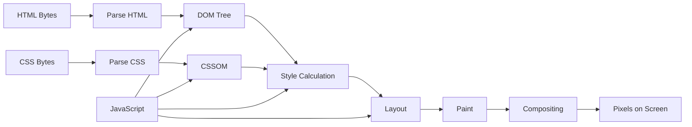
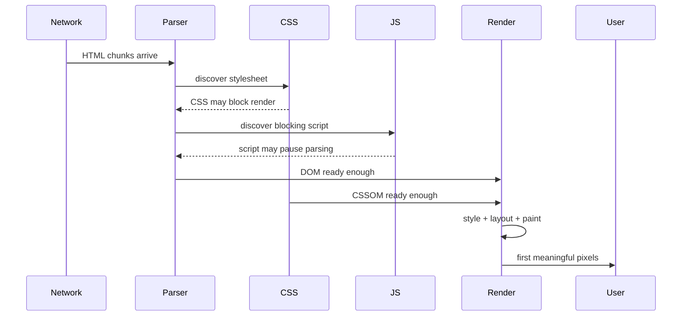
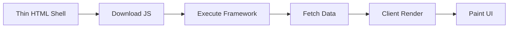
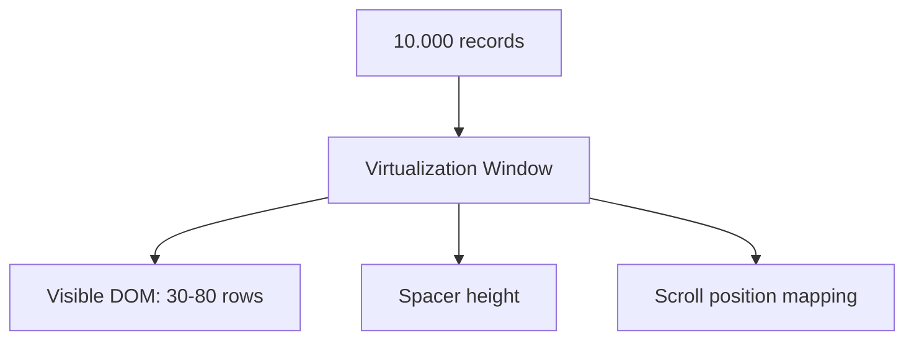
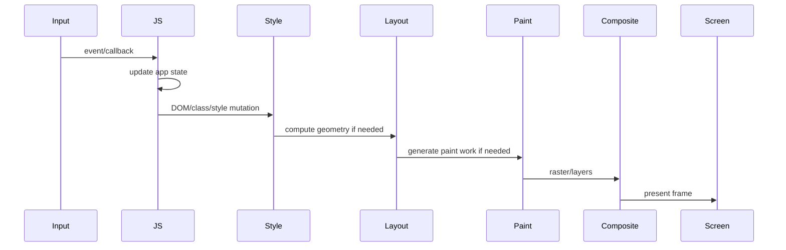
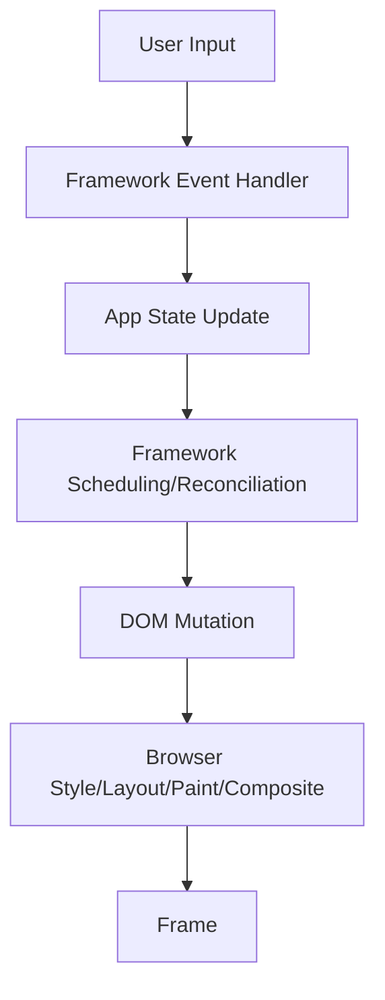
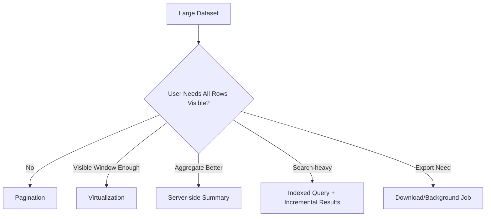
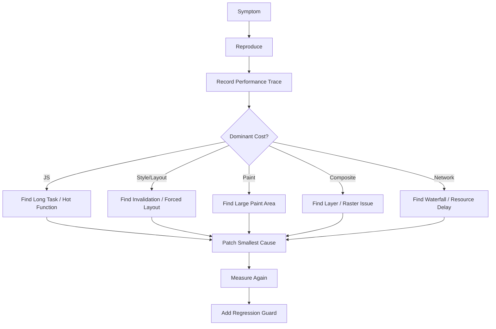

------
title: Learn Advanced JavaScript for Web / Frontend Engineering - Part 009
description: Deep dive ke browser rendering pipeline: parsing, DOM/CSSOM, style calculation, layout, paint, compositing, invalidation, forced synchronous layout, layer promotion, animation cost, dan workflow debugging rendering performance.
series: learn-javascript-frontend-advanced
seriesTitle: Learn Advanced JavaScript for Web / Frontend Engineering
order: 9
partTitle: Browser Rendering Pipeline
tags:
- javascript
- frontend
- web
- browser
- rendering
- performance
- layout
- paint
- compositing
- cssom
- advanced
date: 2026-06-27
---

# Browser Rendering Pipeline

Browser tidak langsung mengubah HTML, CSS, dan JavaScript menjadi pixel. Browser menjalankan pipeline yang terdiri dari parsing, style calculation, layout, paint, compositing, dan presentasi frame ke layar. Pipeline ini tidak selalu berjalan penuh pada setiap perubahan. Kadang browser cukup melakukan compositing. Kadang harus layout ulang sebagian subtree. Kadang sebuah baris JavaScript memaksa browser menghentikan kerja asynchronous dan melakukan layout secara synchronous.

Inilah sumber banyak masalah frontend production:

- halaman terlihat “berat” walau bundle kecil;
- scroll terasa patah-patah;
- animasi tidak smooth;
- typing di input terasa lag;
- membuka modal membuat halaman freeze;
- resize viewport menyebabkan long task;
- chart/dashboard lambat walau data tidak banyak;
- hidden panel tetap mahal karena CSS/DOM-nya masih masuk pipeline;
- satu pembacaan `offsetHeight` membuat layout flush;
- perubahan style kecil memicu repaint area besar;
- `will-change` dipakai sembarangan lalu memory/GPU naik.

Part ini membangun mental model browser sebagai **rendering system**. Tujuannya bukan menghafal istilah “reflow/repaint”, tetapi memahami kapan perubahan state UI berubah menjadi biaya CPU/GPU, bagaimana biaya itu muncul, dan bagaimana mendesain UI agar pipeline tetap terkendali.

---

## 1. Posisi Part Ini Dalam Framework Kaufman

Dalam pendekatan Kaufman, skill besar harus dipecah menjadi sub-skill yang bisa dilatih secara sengaja. Rendering pipeline adalah salah satu sub-skill paling bernilai karena dampaknya langsung terasa pada user experience.

```mermaid
flowchart TD
  A[Rendering Pipeline Mastery] --> B[Critical Rendering Path]
  A --> C[Style Calculation]
  A --> D[Layout]
  A --> E[Paint]
  A --> F[Compositing]
  A --> G[Invalidation]
  A --> H[Profiling]

  B --> B1[HTML Parsing]
  B --> B2[CSSOM]
  B --> B3[Render Tree]
  B --> B4[First Paint]

  C --> C1[Selector Matching]
  C --> C2[Cascade]
  C --> C3[Computed Style]

  D --> D1[Geometry]
  D --> D2[Fragmentation]
  D --> D3[Layout Dependencies]

  E --> E1[Display List]
  E --> E2[Rasterization]
  E --> E3[Invalidated Regions]

  F --> F1[Layers]
  F --> F2[GPU Composition]
  F --> F3[Transform Opacity]

  H --> H1[Performance Panel]
  H --> H2[Long Tasks]
  H --> H3[Layout Shift]
  H --> H4[Paint Flashing]
```



Target part ini:

1. Anda bisa menjelaskan pipeline HTML/CSS/JS sampai menjadi pixel.
2. Anda bisa membedakan style recalculation, layout, paint, dan compositing.
3. Anda bisa mengidentifikasi operasi JavaScript/CSS yang memicu biaya rendering.
4. Anda bisa menghindari forced synchronous layout.
5. Anda bisa mendesain animasi yang bekerja di compositor bila memungkinkan.
6. Anda bisa membaca flame chart rendering secara sistematis.
7. Anda bisa membuat performance budget untuk rendering, bukan hanya bundle size.

---

## 2. Mental Model Utama

Pikirkan browser sebagai sistem yang terus menyelesaikan pertanyaan berikut:

> Untuk state dokumen saat ini, pixel apa yang harus tampil di layar pada frame berikutnya?

Untuk menjawabnya, browser perlu mengetahui:

1. struktur dokumen;
2. rule styling;
3. computed style setiap node relevan;
4. ukuran dan posisi box;
5. instruksi menggambar;
6. layer compositing;
7. perubahan mana yang perlu dihitung ulang.

Pipeline sederhananya:



Dalam aplikasi modern, JavaScript terus mengubah input pipeline:

- menambah/menghapus DOM node;
- mengubah class;
- mengubah inline style;
- membaca geometry;
- men-trigger transition/animation;
- merender komponen;
- memasukkan image/font;
- mengubah viewport/scroll;
- mengubah data yang menghasilkan markup baru.

Frontend engineer senior tidak hanya bertanya “apakah state berubah?”. Ia bertanya:

> Perubahan ini membatalkan tahap pipeline yang mana, seberapa luas invalidasinya, dan apakah bisa ditunda/dibatasi/dialihkan ke compositor?

---

## 3. Critical Rendering Path

Critical rendering path adalah jalur minimum yang harus dilalui browser untuk menampilkan konten awal. Pada halaman klasik, browser perlu:

1. menerima HTML;
2. mem-parse HTML menjadi DOM;
3. menemukan CSS blocking;
4. mem-parse CSS menjadi CSSOM;
5. menghitung style;
6. melakukan layout;
7. melakukan paint;
8. menampilkan frame.

Masalah critical rendering path biasanya muncul saat:

- CSS besar dan render-blocking;
- JavaScript synchronous blocking parser;
- font loading menahan text paint;
- image hero tidak diprioritaskan;
- layout awal bergantung pada script;
- server mengirim HTML terlalu lambat;
- framework mengirim HTML tipis lalu menunggu JavaScript besar untuk render konten utama.

Diagram mental:



Pada aplikasi SPA, jalurnya sering menjadi:



Ini membuat konten utama bergantung pada JavaScript. Karena itu part selanjutnya tentang rendering strategy akan penting. Tetapi sebelum itu, kita perlu memahami biaya pipeline di browser.

---

## 4. Parsing: Dari Bytes ke DOM dan CSSOM

HTML parser bersifat incremental. Browser bisa mulai membangun DOM sebelum seluruh dokumen selesai diterima. CSS parser membangun CSSOM dari stylesheet. JavaScript dapat memengaruhi keduanya.

Contoh:

```html
<link rel="stylesheet" href="/app.css" />
<script src="/app.js"></script>
```

Script klasik tanpa `defer` atau `async` dapat menghentikan HTML parser. Alasannya: script bisa memanggil `document.write`, membaca style, atau memodifikasi DOM pada titik tersebut.

Versi lebih ramah parsing:

```html
<script type="module" src="/app.js"></script>
```

Module script secara default dieksekusi setelah dokumen diparse seperti `defer` secara konseptual, walau tetap punya semantics sendiri seperti module graph dan dependency fetching.

Hal yang perlu diingat:

- HTML parser membangun DOM.
- CSS parser membangun CSSOM.
- JavaScript bisa memodifikasi DOM dan CSSOM.
- CSS dapat menunda render karena browser perlu style untuk menghindari flash yang salah.
- JavaScript bisa menunda parsing dan menunda first paint jika ditempatkan buruk.

Anti-pattern:

```html
<head>
  <script src="/huge-app.js"></script>
  <link rel="stylesheet" href="/app.css" />
</head>
```

Lebih baik:

```html
<head>
  <link rel="stylesheet" href="/critical.css" />
  <script type="module" src="/app.js"></script>
</head>
```

Untuk production, keputusan detail tergantung framework, hydration, route, dan bundler. Tetapi invariant-nya tetap: jangan membuat pixel awal bergantung pada resource yang tidak perlu berada di critical path.

---

## 5. Style Calculation

Style calculation menjawab pertanyaan:

> Untuk setiap element relevan, computed style akhirnya apa?

Browser harus mempertimbangkan:

- user agent stylesheet;
- author stylesheet;
- cascade order;
- specificity;
- inheritance;
- custom properties;
- media queries;
- container queries;
- pseudo-classes;
- pseudo-elements;
- inline style;
- computed values.

Contoh sederhana:

```css
.card {
  color: var(--text-color);
  padding: 16px;
}

.card:hover {
  color: red;
}

@media (max-width: 600px) {
  .card {
    padding: 12px;
  }
}
```

Computed style `card` tidak hanya berasal dari `.card`. Ia bergantung pada cascade, viewport, inheritance, custom property, dan state seperti `:hover`.

### 5.1 Style Invalidation

Saat Anda menjalankan:

```js
document.body.classList.toggle("dark");
```

Browser harus menentukan style mana yang invalid. Jika class `dark` memengaruhi custom property global, banyak subtree bisa terkena.

Contoh:

```css
body.dark {
  --surface: #111;
  --text: #fff;
}

.card {
  background: var(--surface);
  color: var(--text);
}
```

Mengubah class di `body` dapat membuat banyak `.card` perlu recalculation.

Bandingkan dengan perubahan lokal:

```js
card.classList.toggle("selected");
```

Jika rule CSS-nya lokal, invalidasi lebih kecil.

### 5.2 Selector Matching

Browser modern sangat optimal, tetapi selector tetap punya biaya ketika invalidasi luas.

Selector seperti ini mudah dipahami dan biasanya cukup baik:

```css
.product-card__title {
  font-weight: 600;
}
```

Selector seperti ini memperbesar coupling:

```css
body.theme-dark main section article div.product-card h2:first-child span {
  font-weight: 600;
}
```

Masalah utamanya bukan hanya performa matching. Masalah besarnya adalah maintainability dan luasnya konsekuensi perubahan struktur DOM.

Rule praktis:

- gunakan selector yang stabil terhadap perubahan markup;
- minimalkan selector yang bergantung pada depth;
- jangan jadikan global ancestor sebagai switch untuk semua hal kecuali memang dimaksudkan sebagai theme boundary;
- pahami bahwa custom property global adalah state global styling.

---

## 6. Layout

Layout menjawab pertanyaan:

> Berapa ukuran dan posisi setiap box yang terlihat?

Layout perlu mempertimbangkan:

- display model;
- containing block;
- writing mode;
- font metrics;
- intrinsic size;
- viewport size;
- flex/grid algorithms;
- percentage resolution;
- scrollbars;
- aspect ratio;
- replaced elements seperti image/video;
- min/max constraints;
- fragmentation;
- transforms dalam konteks tertentu;
- container queries.

Contoh perubahan yang biasanya memicu layout:

```js
el.style.width = "300px";
el.style.padding = "24px";
el.style.fontSize = "18px";
el.style.display = "none";
el.textContent = "Longer text that changes wrapping";
```

Jika ukuran atau posisi box berubah, layout bisa perlu dihitung ulang. Luasnya tergantung dependency graph layout.

### 6.1 Layout Bukan Hanya Reflow Sederhana

Istilah “reflow” sering dipakai, tetapi untuk engineer yang serius lebih baik berpikir dalam bentuk:

- subtree mana yang invalid;
- ancestor mana yang bergantung pada ukuran child;
- sibling mana yang posisinya terpengaruh;
- viewport/scrollbar berubah atau tidak;
- fragment/text wrapping berubah atau tidak;
- apakah layout containment bisa membatasi dampak.

Contoh:

```html
<div class="feed">
  <article class="post">...</article>
  <article class="post">...</article>
  <article class="post">...</article>
</div>
```

Jika post pertama bertambah tinggi, post setelahnya mungkin bergeser. Ini bisa memicu layout ulang pada banyak item.

Dengan virtualization, DOM hanya berisi item visible plus buffer:



Biaya layout menjadi lebih terkendali karena jumlah node yang terlibat kecil.

### 6.2 Layout Dependency

Layout adalah dependency problem. Beberapa layout bergantung pada child, beberapa child bergantung pada parent.

Contoh parent bergantung pada child:

```css
.card {
  width: max-content;
}
```

Contoh child bergantung pada parent:

```css
.item {
  width: 50%;
}
```

Contoh sibling saling memengaruhi lewat flex:

```css
.toolbar {
  display: flex;
}

.search {
  flex: 1;
}
```

Ketika satu item berubah, algoritma flex mungkin menghitung ulang distribusi ruang.

### 6.3 Containment

CSS containment dapat membantu browser membatasi efek perubahan.

```css
.widget {
  contain: layout paint;
}
```

Artinya, perubahan layout/paint di dalam `.widget` tidak seharusnya memengaruhi luar secara bebas. Ini powerful tetapi harus hati-hati karena containment mengubah semantics layout.

Gunakan ketika:

- widget self-contained;
- ukuran boundary jelas;
- komponen tidak perlu memengaruhi layout luar selain lewat ukuran yang sudah diketahui;
- ada banyak komponen serupa seperti cards, panels, embeds.

Hindari ketika:

- komponen bergantung pada intrinsic size kompleks;
- popover/dropdown perlu keluar dari boundary;
- accessibility/focus/overflow behavior belum dites;
- Anda hanya menebak performa tanpa profiling.

---

## 7. Paint

Paint menjawab pertanyaan:

> Instruksi menggambar apa yang dibutuhkan untuk menghasilkan visual setiap box?

Paint melibatkan:

- background;
- border;
- text;
- shadow;
- image;
- gradient;
- clipping;
- masks;
- filters;
- outlines;
- SVG;
- canvas compositing dalam konteksnya.

Perubahan yang biasanya memicu paint:

```js
el.style.backgroundColor = "red";
el.style.boxShadow = "0 8px 24px rgba(0,0,0,.2)";
el.style.borderColor = "blue";
```

Jika geometry tidak berubah, layout mungkin tidak perlu. Tetapi paint tetap perlu dilakukan.

### 7.1 Paint Area

Paint cost bukan hanya “property apa yang berubah”, tetapi juga area yang perlu digambar ulang.

Mengubah background sebuah icon kecil murah. Mengubah box-shadow besar pada fixed header full-width bisa mahal.

Contoh mahal:

```css
.modal-backdrop {
  position: fixed;
  inset: 0;
  backdrop-filter: blur(12px);
}
```

Efek blur backdrop bisa mahal karena browser perlu memproses area besar. Pada device lemah, ini bisa terasa berat.

### 7.2 Paint Storm

Paint storm terjadi saat banyak area perlu digambar ulang berulang kali.

Contoh:

```js
window.addEventListener("scroll", () => {
  document.querySelectorAll(".row").forEach((row, index) => {
    row.style.backgroundColor = index % 2 ? "#fff" : "#fafafa";
  });
});
```

Ini buruk karena scroll event sering terjadi dan tiap event memodifikasi banyak style.

Lebih baik:

- gunakan CSS static untuk zebra striping;
- hindari mutation per scroll;
- gunakan IntersectionObserver untuk trigger terbatas;
- throttle/debounce jika memang event-driven;
- gunakan transform/opacity untuk efek visual yang berjalan tiap frame.

---

## 8. Compositing

Compositing menyusun layer menjadi final frame. Browser dapat mempromosikan elemen tertentu ke layer terpisah. Jika perubahan hanya memengaruhi transform atau opacity pada layer yang sudah sesuai, browser bisa menghindari layout dan paint.

Contoh animasi yang biasanya compositor-friendly:

```css
.toast {
  transform: translateY(0);
  opacity: 1;
  transition: transform 150ms ease, opacity 150ms ease;
}

.toast[data-state="closing"] {
  transform: translateY(8px);
  opacity: 0;
}
```

Contoh animasi yang biasanya mahal:

```css
.sidebar {
  width: 320px;
  transition: width 200ms ease;
}
```

Mengubah width biasanya memicu layout. Jika sidebar memengaruhi area content, banyak layout ikut berubah.

Alternatif:

```css
.sidebar-panel {
  transform: translateX(-100%);
  transition: transform 200ms ease;
}

.sidebar-panel[data-open="true"] {
  transform: translateX(0);
}
```

Tetapi ini bukan magic. Jika layout akhir benar-benar harus berubah, transform hanya menggeser visual. Anda tetap perlu mendesain semantics, focus, hit testing, dan layout final.

### 8.1 Layer Promotion

Layer promotion bisa membantu animasi, tetapi tidak gratis. Layer memakai memory. Terlalu banyak layer bisa membuat GPU memory naik dan compositing mahal.

`will-change` memberi hint ke browser:

```css
.card:hover {
  will-change: transform;
}
```

Tetapi jangan pasang permanen ke ratusan element:

```css
* {
  will-change: transform;
}
```

Itu anti-pattern. `will-change` sebaiknya dipakai sangat selektif, idealnya dekat dengan waktu perubahan.

### 8.2 Compositing Pitfalls

Compositing dapat menimbulkan bug visual:

- stacking context berubah;
- z-index tidak sesuai ekspektasi;
- fixed element terlihat berbeda;
- text rendering berubah;
- overflow/clipping berbeda;
- layer terlalu banyak;
- GPU memory naik;
- transform memengaruhi containing block untuk fixed/absolute dalam beberapa konteks.

Jangan menganggap “pakai transform” selalu benar. Gunakan untuk perubahan visual yang memang tidak perlu mengubah flow layout.

---

## 9. Frame Budget

Layar 60Hz memberi sekitar 16.67ms per frame. Layar 120Hz memberi sekitar 8.33ms per frame. Tetapi JavaScript tidak memiliki seluruh budget itu. Browser juga perlu input handling, style, layout, paint, compositing, raster, dan pekerjaan sistem lain.

Target praktis:

- per interaction, hindari long task;
- untuk animasi, kerja main thread per frame harus sangat kecil;
- untuk typing, feedback harus hampir langsung;
- untuk scroll, jangan pasang handler berat;
- untuk resize, batch pekerjaan;
- untuk rendering list besar, gunakan windowing/virtualization.

Diagram frame:



Jika JavaScript mengambil 40ms, browser tidak bisa menghasilkan frame tepat waktu. User melihat jank.

---

## 10. Forced Synchronous Layout

Forced synchronous layout adalah salah satu bug performance paling umum. Terjadi ketika JavaScript mengubah DOM/style, lalu segera membaca property geometry yang membutuhkan layout terbaru. Browser terpaksa flush style/layout sekarang juga.

Contoh buruk:

```js
const box = document.querySelector(".box");

box.classList.add("expanded");

const height = box.offsetHeight; // forces layout if layout is dirty

console.log(height);
```

Contoh lebih buruk dalam loop:

```js
const items = document.querySelectorAll(".item");

for (const item of items) {
  item.classList.add("active");
  const height = item.offsetHeight;
  item.style.marginTop = `${height / 10}px`;
}
```

Ini memicu pola read-write-read-write. Browser tidak bisa batch.

Lebih baik pisahkan read dan write:

```js
const items = Array.from(document.querySelectorAll(".item"));

const heights = items.map((item) => item.offsetHeight);

items.forEach((item, index) => {
  item.classList.add("active");
  item.style.marginTop = `${heights[index] / 10}px`;
});
```

Atau jadwalkan write pada frame berikutnya:

```js
const height = box.offsetHeight;

requestAnimationFrame(() => {
  box.style.setProperty("--measured-height", `${height}px`);
  box.classList.add("expanded");
});
```

### 10.1 Property yang Sering Memaksa Layout

Property/method berikut sering membutuhkan geometry terbaru:

- `offsetWidth`, `offsetHeight`;
- `offsetTop`, `offsetLeft`;
- `clientWidth`, `clientHeight`;
- `scrollWidth`, `scrollHeight`;
- `getBoundingClientRect()`;
- `getComputedStyle()` untuk property tertentu;
- `elementFromPoint()` dalam konteks tertentu;
- selection/focus measurement tertentu.

Bukan berarti tidak boleh dipakai. Artinya: gunakan dengan sadar, batch, dan ukur.

---

## 11. Layout Thrashing

Layout thrashing terjadi ketika kode berulang kali memaksa browser menghitung layout karena operasi read/write saling berselang-seling.

Anti-pattern:

```js
function alignLabels(labels) {
  for (const label of labels) {
    const width = label.offsetWidth;
    label.style.transform = `translateX(${width}px)`;
  }
}
```

Jika setiap write membuat layout dirty, read berikutnya bisa memaksa layout lagi.

Pattern lebih baik:

```js
function alignLabels(labels) {
  const widths = labels.map((label) => label.offsetWidth);

  labels.forEach((label, index) => {
    label.style.transform = `translateX(${widths[index]}px)`;
  });
}
```

Untuk aplikasi besar, buat abstraksi:

```js
const measureQueue = [];
const mutateQueue = [];
let scheduled = false;

export function measure(fn) {
  measureQueue.push(fn);
  schedule();
}

export function mutate(fn) {
  mutateQueue.push(fn);
  schedule();
}

function schedule() {
  if (scheduled) return;
  scheduled = true;

  requestAnimationFrame(() => {
    scheduled = false;

    const measurements = measureQueue.splice(0);
    for (const fn of measurements) fn();

    const mutations = mutateQueue.splice(0);
    for (const fn of mutations) fn();
  });
}
```

Ini bukan library sempurna, tetapi menunjukkan prinsip: batch read, lalu batch write.

---

## 12. Rendering Cost Taxonomy

Untuk debugging, klasifikasikan operasi UI berdasarkan tahap pipeline yang kemungkinan terkena.

| Operasi | Style | Layout | Paint | Composite | Catatan |
|---|---:|---:|---:|---:|---|
| Ubah `color` | Ya | Biasanya tidak | Ya | Mungkin | Text repaint |
| Ubah `background-color` | Ya | Tidak | Ya | Mungkin | Area paint penting |
| Ubah `width` | Ya | Ya | Ya | Ya | Bisa memengaruhi subtree/sibling |
| Ubah `height` | Ya | Ya | Ya | Ya | Berisiko layout shift |
| Ubah `top/left` positioned element | Ya | Bisa | Ya | Ya | Tergantung positioning/layer |
| Ubah `transform` | Ya | Biasanya tidak | Bisa tidak | Ya | Cocok untuk animasi visual |
| Ubah `opacity` | Ya | Tidak | Bisa tidak | Ya | Cocok untuk fade |
| Tambah DOM node | Ya | Ya | Ya | Ya | Luas tergantung lokasi |
| Ubah text | Ya | Ya | Ya | Ya | Wrapping/font metrics dapat berubah |
| Ubah class global | Ya | Bisa | Bisa | Bisa | Invalidasi luas |
| Scroll transform visual | Ya | Biasanya tidak | Bisa tidak | Ya | Hindari handler berat |

Tabel ini adalah heuristic. Browser implementation dapat berbeda. Production decision harus dibuktikan dengan profiling.

---

## 13. Rendering dan JavaScript Framework

Framework seperti React, Vue, Svelte, Solid, atau Angular tidak menghapus rendering pipeline browser. Framework hanya mengatur kapan dan bagaimana DOM mutation terjadi.



Jika component render mahal, JavaScript cost naik. Jika DOM mutation luas, browser rendering cost naik. Jika keduanya terjadi dalam interaction yang sama, user merasakan lag.

Contoh React mental model:

- render phase menghasilkan deskripsi UI;
- commit phase melakukan perubahan DOM;
- browser kemudian memproses rendering pipeline;
- effect dapat berjalan setelah commit dan bisa memicu mutation tambahan.

Anti-pattern:

```jsx
function Table({ rows }) {
  return (
    <table>
      <tbody>
        {rows.map((row) => (
          <tr key={row.id}>
            <td>{expensiveFormat(row.name)}</td>
            <td>{row.status}</td>
          </tr>
        ))}
      </tbody>
    </table>
  );
}
```

Jika `rows` besar, masalah bisa terjadi di beberapa lapisan:

1. render JavaScript mahal;
2. DOM node banyak;
3. layout table mahal;
4. paint area besar;
5. accessibility tree besar;
6. memory besar.

Solusi bukan hanya `memo`. Solusi mungkin:

- pagination;
- virtualization;
- column width constraints;
- CSS containment;
- simpler row DOM;
- deferred formatting;
- worker untuk transform data;
- server-side aggregation;
- skeleton/progressive rendering.

---

## 14. Style Mutation Design

Banyak performance bug muncul dari mutation style yang tidak didesain.

Buruk:

```js
button.onclick = () => {
  panel.style.width = "400px";
  panel.style.height = "600px";
  panel.style.padding = "24px";
  panel.style.backgroundColor = "white";
  panel.style.boxShadow = "0 24px 80px rgba(0,0,0,.2)";
};
```

Lebih baik:

```js
button.onclick = () => {
  panel.dataset.state = "open";
};
```

```css
.panel {
  transform: translateY(8px);
  opacity: 0;
  pointer-events: none;
  transition: transform 150ms ease, opacity 150ms ease;
}

.panel[data-state="open"] {
  transform: translateY(0);
  opacity: 1;
  pointer-events: auto;
}
```

Keuntungan:

- styling tetap di CSS;
- state transition jelas;
- browser dapat mengoptimalkan transition;
- code lebih mudah diuji;
- class/data attribute menjadi state boundary.

Tetapi tetap ingat: `display: none` ke visible dapat memicu layout. Jika modal masuk/keluar DOM, layout tetap terjadi. Yang dioptimalkan adalah animasi visualnya.

---

## 15. Animation Cost Model

Animasi buruk terjadi ketika setiap frame memicu layout/paint besar.

### 15.1 Animasi Layout Property

```css
.accordion-content {
  height: 0;
  overflow: hidden;
  transition: height 200ms ease;
}

.accordion-content[data-open="true"] {
  height: 300px;
}
```

Ini bisa memicu layout setiap frame karena height berubah.

Alternatif visual:

```css
.dropdown {
  transform: scaleY(0);
  transform-origin: top;
  transition: transform 160ms ease;
}

.dropdown[data-open="true"] {
  transform: scaleY(1);
}
```

Namun scaleY dapat membuat text terlihat gepeng selama animasi. Untuk accordion yang benar-benar mengubah flow layout, terkadang layout animation memang diperlukan. Maka pendekatannya:

- batasi area;
- gunakan containment jika cocok;
- gunakan durasi pendek;
- jangan animasikan banyak item sekaligus;
- pertimbangkan animasi opacity/transform untuk wrapper visual;
- hormati `prefers-reduced-motion`.

### 15.2 JavaScript Animation

```js
function animate(element, from, to, duration) {
  const startedAt = performance.now();

  function frame(now) {
    const progress = Math.min((now - startedAt) / duration, 1);
    const value = from + (to - from) * progress;

    element.style.transform = `translateX(${value}px)`;

    if (progress < 1) {
      requestAnimationFrame(frame);
    }
  }

  requestAnimationFrame(frame);
}
```

`requestAnimationFrame` cocok untuk animasi yang perlu sinkron dengan paint. Tetapi jangan melakukan kerja berat di dalam callback. Callback harus cepat.

### 15.3 Reduced Motion

Animasi harus mempertimbangkan user preference:

```css
@media (prefers-reduced-motion: reduce) {
  *,
  *::before,
  *::after {
    animation-duration: 0.01ms !important;
    animation-iteration-count: 1 !important;
    scroll-behavior: auto !important;
    transition-duration: 0.01ms !important;
  }
}
```

Untuk design system, lebih baik buat token motion:

```css
:root {
  --duration-fast: 120ms;
  --duration-normal: 200ms;
}

@media (prefers-reduced-motion: reduce) {
  :root {
    --duration-fast: 1ms;
    --duration-normal: 1ms;
  }
}
```

---

## 16. Scroll Performance

Scroll adalah interaction high-frequency. Jangan perlakukan scroll event seperti click event.

Buruk:

```js
window.addEventListener("scroll", () => {
  expensiveRecalculateEverything();
});
```

Lebih baik:

```js
let scheduled = false;

window.addEventListener("scroll", () => {
  if (scheduled) return;
  scheduled = true;

  requestAnimationFrame(() => {
    scheduled = false;
    updateScrollLinkedUI(window.scrollY);
  });
}, { passive: true });
```

Gunakan `{ passive: true }` untuk listener yang tidak memanggil `preventDefault()`, agar browser tidak perlu menunggu handler sebelum scroll.

Lebih baik lagi jika bisa memakai CSS atau observer:

```js
const observer = new IntersectionObserver((entries) => {
  for (const entry of entries) {
    entry.target.dataset.visible = String(entry.isIntersecting);
  }
});

document.querySelectorAll("[data-track-visibility]").forEach((node) => {
  observer.observe(node);
});
```

IntersectionObserver menghindari polling geometry manual pada setiap scroll.

---

## 17. Layout Shift

Layout shift terjadi saat element berpindah posisi setelah sudah terlihat. Ini mengganggu user dan dapat memperburuk Core Web Vitals.

Penyebab umum:

- image tanpa ukuran eksplisit;
- ad/embed yang masuk setelah render;
- font swap mengubah metrics;
- async content menyisip di atas viewport;
- skeleton berbeda ukuran dengan konten final;
- banner/notification didorong masuk tanpa reservasi ruang;
- accordion auto-open setelah data datang;
- hydration menghasilkan markup berbeda.

Contoh buruk:

```html

```

Lebih baik:

```html

```

Atau dengan CSS aspect ratio:

```css
.hero-media {
  aspect-ratio: 1200 / 630;
}
```

Untuk async panel:

```css
.summary-card {
  min-height: 160px;
}
```

Tujuannya bukan sekadar “jangan shift”, tetapi menjaga spatial contract: jika ruang akan dipakai, reservasi sejak awal.

---

## 18. Image, Font, dan Media Dalam Pipeline

Media sering memengaruhi layout dan paint.

### 18.1 Image

Image tanpa dimension membuat browser tidak tahu ruang yang perlu disediakan sebelum image metadata datang. Gunakan width/height atau aspect-ratio.

Untuk image besar:

- gunakan format modern bila cocok;
- gunakan responsive image;
- set priority untuk hero bila framework mendukung;
- lazy-load image non-critical;
- jangan lazy-load LCP image;
- hindari decode besar di interaction path.

### 18.2 Font

Font dapat memengaruhi text metrics. Jika font custom datang terlambat, layout bisa berubah. Gunakan strategi loading yang sadar trade-off:

- `font-display: swap` dapat mempercepat text visible tetapi berisiko shift;
- font fallback metrics harus dipilih baik;
- preload font critical bila perlu;
- subset font;
- jangan pakai terlalu banyak weight/style.

### 18.3 Video dan Canvas

Video/canvas bisa berat pada decode, paint, dan memory. Untuk canvas dashboard:

- batasi resolusi sesuai device pixel ratio;
- jangan redraw semua jika hanya sebagian berubah;
- gunakan OffscreenCanvas/worker jika cocok;
- pause rendering saat tab hidden;
- jangan render chart invisible.

---

## 19. Hidden UI Tidak Selalu Gratis

Banyak aplikasi menyimpan panel/tab/modal hidden di DOM. Ini bisa baik untuk preserving state, tetapi tidak gratis.

Contoh:

```css
.tab-panel[hidden] {
  display: none;
}
```

Jika `display: none`, subtree tidak ikut layout/paint, tetapi DOM dan memory tetap ada.

Contoh lain:

```css
.tab-panel.is-hidden {
  opacity: 0;
  pointer-events: none;
}
```

Subtree tetap ikut layout jika masih dalam flow. Ini bisa mahal.

Untuk panel kompleks:

- unmount jika state tidak perlu dipertahankan;
- lazy mount saat pertama dibuka;
- gunakan `display: none` untuk panel non-active;
- simpan state data di store, bukan harus menyimpan DOM;
- jangan render chart/table besar di tab tersembunyi;
- gunakan virtualization untuk list panjang.

---

## 20. Large DOM Cost

DOM besar memengaruhi banyak hal:

- memory;
- style calculation;
- layout;
- paint;
- accessibility tree;
- event handling;
- query performance;
- framework reconciliation;
- hydration cost;
- devtools inspection.

Contoh masalah:

```jsx
function AuditLog({ events }) {
  return (
    <div>
      {events.map((event) => (
        <AuditLogRow key={event.id} event={event} />
      ))}
    </div>
  );
}
```

Jika `events` berisi 50.000 item, ini bukan hanya masalah React render. Browser harus mengelola puluhan ribu node.

Solusi:



Jangan memaksakan UI menampilkan semua data hanya karena API mengembalikan semua data.

---

## 21. Rendering Boundaries Dalam Architecture

Komponen besar perlu boundary rendering yang jelas.

Boundary yang berguna:

- route boundary;
- tab boundary;
- modal boundary;
- virtualized list boundary;
- chart boundary;
- editor boundary;
- third-party widget boundary;
- server/client boundary;
- worker boundary.

Contoh boundary contract:

```ts
export interface RenderBoundaryContract {
  mount(container: HTMLElement): void;
  update(input: unknown): void;
  suspend(): void;
  resume(): void;
  dispose(): void;
}
```

Untuk widget mahal, jangan hanya punya `render()`. Perlu lifecycle:

- mount pertama;
- update data;
- resize;
- pause saat hidden;
- resume saat visible;
- dispose listeners/timers/observers.

---

## 22. Rendering Pipeline dan State Invariants

Rendering bug sering muncul karena state UI tidak punya invariant.

Contoh invariant buruk:

> Jika `isOpen = false`, modal harus tidak terlihat.

Ini kurang lengkap.

Invariant lebih baik:

> Jika modal tertutup, subtree modal tidak boleh menerima focus, tidak boleh intercept pointer, tidak boleh dibaca screen reader sebagai dialog aktif, tidak boleh menjalankan animation loop, dan tidak boleh melakukan layout measurement periodik.

Ini menghubungkan state dengan rendering, accessibility, event, dan resource lifecycle.

Contoh:

```css
.modal[data-state="closed"] {
  opacity: 0;
  pointer-events: none;
}
```

Masih kurang jika focus tetap bisa masuk via keyboard. Maka perlu:

```html
<div role="dialog" aria-modal="true" hidden>
  ...
</div>
```

Atau gunakan primitive dialog/modal yang benar. Rendering performance tidak boleh memotong semantic/accessibility.

---

## 23. Profiling Workflow

Jangan menebak. Gunakan workflow.



Langkah:

1. Reproduce dengan device/network realistis.
2. Record performance trace.
3. Cari long task, layout, paint, composite, raster, idle gap.
4. Kaitkan event user dengan kerja browser.
5. Temukan root cause paling kecil.
6. Patch.
7. Ukur ulang.
8. Simpan benchmark atau regression test jika memungkinkan.

### 23.1 Jangan Mulai dari Micro-Optimization

Buruk:

- “pakai memo semua component”;
- “hapus semua shadow”;
- “minify class name”;
- “pakai transform semua”;
- “hapus animation semua”;
- “ganti framework”.

Baik:

- identifikasi apakah bottleneck JS, layout, paint, compositing, network, atau server;
- optimalkan bottleneck dominan;
- ukur efeknya.

---

## 24. Membaca Performance Trace

Saat membaca trace, cari:

- Main thread flame chart;
- task panjang;
- `Recalculate Style`;
- `Layout`;
- `Paint`;
- `Composite Layers`;
- `Evaluate Script`;
- `Function Call`;
- `Event`;
- `requestAnimationFrame` callback;
- `Timer Fired`;
- forced layout warning;
- layout shift record.

Pertanyaan diagnosis:

1. Event user mana yang memulai pekerjaan?
2. Berapa lama JavaScript berjalan sebelum browser bisa render?
3. Apakah ada style/layout berulang?
4. Apakah layout terjadi setelah DOM write dan sebelum read?
5. Apakah paint area besar?
6. Apakah layer terlalu banyak atau raster mahal?
7. Apakah pekerjaan terjadi saat element hidden?
8. Apakah update framework terlalu luas?
9. Apakah data transform berada di main thread?
10. Apakah ada third-party script yang mengambil budget?

---

## 25. Debugging Forced Layout Dengan Instrumentasi Sederhana

Kadang Anda perlu membuktikan area kode mana yang mahal.

```js
function measureCost(label, fn) {
  const startedAt = performance.now();

  try {
    return fn();
  } finally {
    const duration = performance.now() - startedAt;
    console.log(`${label}: ${duration.toFixed(2)}ms`);
  }
}

measureCost("measure cards", () => {
  for (const card of document.querySelectorAll(".card")) {
    card.getBoundingClientRect();
  }
});
```

Untuk rendering work, instrumentation manual hanya indikasi. Performance trace tetap lebih akurat karena browser menampilkan style/layout/paint secara terpisah.

---

## 26. CSS Architecture dan Rendering

CSS architecture memengaruhi rendering bukan hanya lewat property, tetapi lewat coupling.

### 26.1 Global Theme Toggle

```css
body[data-theme="dark"] .dashboard .panel .metric .value {
  color: var(--metric-value-color);
}
```

Ini membuat rule bergantung pada banyak ancestor. Lebih baik pakai token pada boundary:

```css
[data-theme="dark"] {
  --color-surface: #111;
  --color-text: #f5f5f5;
}

.metric-value {
  color: var(--color-text);
}
```

Tetap global, tetapi dependency lebih terstruktur.

### 26.2 Component Boundary

```css
.user-card {
  contain: layout paint;
}
```

Jika cocok, boundary ini membantu browser dan engineer memahami konsekuensi mutation.

### 26.3 Avoid Accidental Layout Coupling

```css
.page * + * {
  margin-top: 16px;
}
```

Rule global seperti ini bisa memudahkan prototype, tetapi di sistem besar dapat menyebabkan layout coupling tak terlihat. Untuk design system, lebih baik eksplisit melalui stack primitive:

```css
.stack {
  display: flex;
  flex-direction: column;
  gap: var(--stack-gap, 16px);
}
```

`gap` memberi layout semantics yang lebih jelas daripada margin antar elemen yang tersebar.

---

## 27. Rendering dan Accessibility Tree

DOM/rendering tidak berdiri sendiri. Browser juga membangun accessibility tree. Hidden/visible state harus konsisten.

Contoh visual hidden tetapi masih accessible:

```css
.tooltip {
  opacity: 0;
}
```

Jika tooltip tetap ada di accessibility tree pada waktu salah, screen reader bisa membaca konten yang tidak relevan.

Gunakan state semantic:

```html
<div role="tooltip" id="save-tip" hidden>
  Saves the current draft
</div>
```

Atau gunakan `aria-hidden` secara hati-hati ketika element visual tidak boleh dibaca.

Rendering decision harus diuji terhadap:

- visual output;
- keyboard navigation;
- screen reader semantics;
- focus order;
- hit testing;
- reduced motion;
- high contrast mode.

---

## 28. Rendering dan Security

Beberapa optimasi rendering punya implikasi security.

Contoh anti-pattern:

```js
container.innerHTML = cachedHtml;
```

Mungkin terlihat cepat karena langsung memasukkan markup. Tetapi jika `cachedHtml` mengandung input tidak dipercaya, ini XSS boundary.

Lebih aman:

- gunakan text node untuk text user;
- sanitize HTML jika memang harus render rich text;
- gunakan Trusted Types/CSP di aplikasi berisiko tinggi;
- batasi sumber HTML;
- jangan mencampur caching HTML dengan data user tanpa policy.

Rendering cepat tetapi tidak aman bukan solusi engineering.

---

## 29. Production Performance Budget

Performance budget harus mencakup rendering, bukan hanya asset size.

Contoh budget internal:

```yaml
route: /dashboard
interaction_budget:
  open_filter_panel:
    max_main_thread_blocking_ms: 50
    max_layout_ms: 20
    max_paint_area: bounded
  type_search_query:
    max_input_latency_ms: 100
    debounce_ms: 150
    max_dom_nodes_updated: visible-results-only
rendering_budget:
  initial_dom_nodes: <= 1500
  visible_table_rows: <= 80
  animation_properties:
    preferred: [transform, opacity]
    requires_review: [width, height, top, left]
  hidden_panels:
    expensive_widgets: unmounted_or_suspended
```

Budget seperti ini membantu review arsitektur. Ia membuat performance menjadi desain, bukan audit terlambat.

---

## 30. Case Study: Dashboard Lambat Saat Filter Dibuka

### 30.1 Gejala

User membuka filter panel di dashboard. UI freeze 600ms.

### 30.2 Dugaan Awal

- bundle terlalu besar;
- React render terlalu banyak;
- CSS terlalu kompleks;
- browser lambat;
- data terlalu besar.

Dugaan tidak cukup. Perlu trace.

### 30.3 Trace Menunjukkan

- click handler 30ms;
- React commit 80ms;
- style recalculation 120ms;
- layout 250ms;
- paint 90ms;
- total blocking 570ms.

Root cause:

1. filter panel mount menyebabkan seluruh dashboard grid relayout;
2. chart tersembunyi tetap resize;
3. table 5.000 row tetap berada di DOM;
4. beberapa component membaca `getBoundingClientRect()` setelah update.

### 30.4 Fix

- filter panel menjadi overlay fixed, tidak mendorong grid utama;
- table diganti virtualization;
- chart adapter punya `suspend()` saat hidden;
- measurement dipindah ke batch `requestAnimationFrame`;
- resize observer diberi guard;
- CSS containment pada card widget yang independen.

### 30.5 Hasil

- click handler 15ms;
- React commit 35ms;
- style recalculation 35ms;
- layout 40ms;
- paint 20ms;
- total sekitar 145ms.

Masih bisa ditingkatkan, tetapi pengalaman user jauh lebih baik.

---

## 31. Case Study: Tooltip Membuat Scroll Jank

### 31.1 Gejala

Pada tabel besar, scroll tersendat ketika hover tooltip aktif.

### 31.2 Root Cause

Tooltip melakukan:

```js
window.addEventListener("scroll", () => {
  const rect = anchor.getBoundingClientRect();
  tooltip.style.top = `${rect.bottom + 8}px`;
  tooltip.style.left = `${rect.left}px`;
});
```

Masalah:

- scroll event high-frequency;
- setiap scroll membaca geometry;
- setiap scroll menulis top/left;
- tooltip berada dalam subtree table sehingga memengaruhi layout;
- listener tidak passive;
- tidak ada cleanup saat tooltip closed.

### 31.3 Fix

- tooltip dipindah ke portal layer;
- posisi diperbarui via `requestAnimationFrame`;
- gunakan transform untuk movement;
- listener passive;
- update hanya saat tooltip visible;
- cleanup saat close.

```js
let frame = 0;

function schedulePositionUpdate() {
  if (frame) return;

  frame = requestAnimationFrame(() => {
    frame = 0;

    const rect = anchor.getBoundingClientRect();
    tooltip.style.transform = `translate(${rect.left}px, ${rect.bottom + 8}px)`;
  });
}

window.addEventListener("scroll", schedulePositionUpdate, { passive: true });
```

---

## 32. Checklist Review Rendering

Gunakan checklist ini saat review PR frontend besar.

### 32.1 DOM Size

- Apakah jumlah node visible wajar?
- Apakah list besar divirtualisasi?
- Apakah hidden tab masih merender chart/table besar?
- Apakah SSR/hydration menghasilkan DOM berlebihan?

### 32.2 Mutation

- Apakah update DOM dibatasi ke boundary yang tepat?
- Apakah class global memicu invalidasi luas?
- Apakah style inline dipakai untuk state yang seharusnya CSS class/data attribute?
- Apakah read/write DOM dibatch?

### 32.3 Layout

- Apakah ada animasi width/height/top/left yang berjalan tiap frame?
- Apakah layout shift dicegah dengan reservasi ruang?
- Apakah image/video punya dimension/aspect ratio?
- Apakah container besar bisa diberi containment?

### 32.4 Paint

- Apakah shadow/filter/backdrop besar dipakai di area luas?
- Apakah scroll memicu repaint besar?
- Apakah effect visual pada fixed full-screen element realistis untuk device rendah?

### 32.5 Compositing

- Apakah animasi memakai transform/opacity bila sesuai?
- Apakah `will-change` dipakai terlalu luas?
- Apakah layer count masuk akal?
- Apakah z-index/stacking context diuji?

### 32.6 Interaction

- Apakah click/typing/scroll punya trace?
- Apakah expensive work ditunda atau dipindah dari main thread?
- Apakah ada regression guard?

---

## 33. Latihan Deliberate Practice

### Latihan 1: Forced Layout Lab

Buat halaman dengan 1.000 card. Implementasikan dua versi:

1. read/write berselang-seling;
2. batch read lalu batch write.

Gunakan Performance panel untuk membandingkan jumlah dan durasi layout.

### Latihan 2: Animation Cost Lab

Buat sidebar yang membuka dengan:

1. `width`;
2. `left`;
3. `transform`.

Bandingkan trace style/layout/paint/composite.

### Latihan 3: Layout Shift Lab

Buat feed yang memuat image tanpa width/height. Catat layout shift. Tambahkan aspect ratio. Bandingkan.

### Latihan 4: Hidden DOM Lab

Buat tab dengan chart/list besar. Bandingkan:

1. semua tab selalu mounted;
2. inactive tab `display: none`;
3. lazy mount;
4. unmount inactive expensive widget.

Catat memory, layout, dan interaction latency.

### Latihan 5: Paint Area Lab

Buat card dengan box-shadow besar dan filter. Aktifkan paint flashing di DevTools. Ubah desain agar paint area lebih kecil.

---

## 34. Anti-Pattern Umum

### 34.1 “Bundle Kecil Berarti Cepat”

Bundle kecil membantu, tetapi rendering bisa tetap lambat jika DOM besar, layout kompleks, dan paint mahal.

### 34.2 “Pakai Transform Saja”

Transform bagus untuk animasi visual, tetapi tidak mengganti layout semantics. Jika elemen harus benar-benar mengambil ruang, layout tetap perlu dipikirkan.

### 34.3 “will-change Semua”

`will-change` bukan turbo button. Ia hint yang dapat meningkatkan memory/layer cost.

### 34.4 “Memo Semua Component”

Memo mengurangi render JavaScript dalam kondisi tertentu. Ia tidak menyelesaikan layout/paint besar, DOM besar, atau forced layout.

### 34.5 “Dev Machine Smooth Berarti Aman”

MacBook high-end menutupi masalah. Uji CPU throttling, device kelas menengah, dan data realistis.

### 34.6 “CSS Tidak Pernah Jadi Bottleneck”

CSS bisa memicu style invalidation, layout kompleks, paint mahal, dan compositing issue. CSS adalah bagian dari runtime.

---

## 35. Production Decision Matrix

| Masalah | Pertanyaan Kunci | Kandidat Solusi |
|---|---|---|
| Scroll jank | Apakah handler scroll berat? | passive listener, rAF throttle, IntersectionObserver, virtualize |
| Slow open modal | Apakah mount memicu layout besar? | overlay boundary, lazy content, defer expensive widget |
| Table lambat | Apakah DOM terlalu besar? | virtualization, pagination, server aggregation |
| Animation jank | Property apa yang dianimasikan? | transform/opacity, reduce layout animation, containment |
| Layout shift | Apakah ruang direservasi? | width/height, aspect-ratio, skeleton size match |
| Paint mahal | Area dan efek apa yang repaint? | kurangi blur/shadow/filter, smaller layer, simpler visual |
| Chart berat | Apakah render di main thread? | canvas optimization, worker, reduce points, suspend hidden |
| Hydration lambat | Apakah semua island perlu interactive? | partial/lazy hydration, server component, code split |

---

## 36. Mental Model Akhir

Rendering pipeline adalah sistem invalidasi dan komputasi. Setiap perubahan UI dapat membatalkan sebagian hasil sebelumnya. Engineer yang kuat tidak hanya tahu cara membuat UI terlihat benar, tetapi tahu biaya membuatnya benar pada device nyata.

Prinsip utama:

1. DOM/CSS/JS adalah input ke pipeline pixel.
2. Style calculation menentukan computed style.
3. Layout menentukan geometry.
4. Paint menggambar visual.
5. Compositing menyusun layer.
6. Tidak semua perubahan sama mahal.
7. Forced synchronous layout terjadi karena read/write geometry tidak disiplin.
8. Animasi paling aman biasanya transform/opacity, tetapi semantics tetap harus benar.
9. DOM besar membuat hampir semua tahap lebih mahal.
10. Hidden UI tidak otomatis gratis.
11. Performance harus diprofiling, bukan ditebak.
12. Rendering budget harus menjadi bagian dari architecture review.

Part berikutnya membahas state modeling untuk frontend systems: bagaimana membedakan local state, remote state, derived state, URL state, server state, form state, transient state, dan bagaimana menjaga invariant agar UI tidak drift.

---

## 37. Referensi

- MDN Web Docs, "Populating the page: how browsers work"
- MDN Web Docs, "CSS and JavaScript animation performance"
- MDN Web Docs, "CSS performance optimization"
- web.dev, "Understand the critical path"
- web.dev, rendering performance materials
- Chrome DevTools Performance panel documentation
- WHATWG HTML Standard, event loop and rendering update model
- CSS Containment Module
- CSS Transforms Module
- CSSOM View Module
