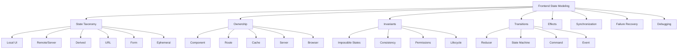
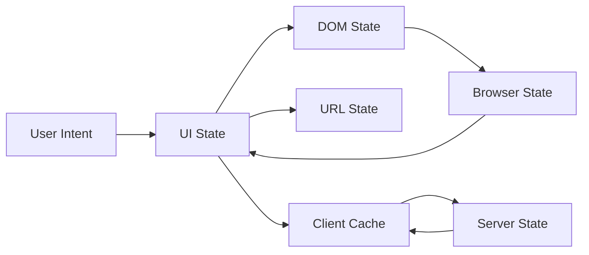
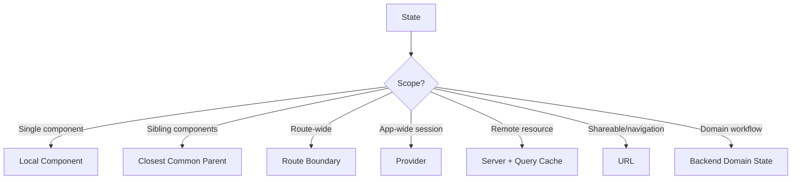
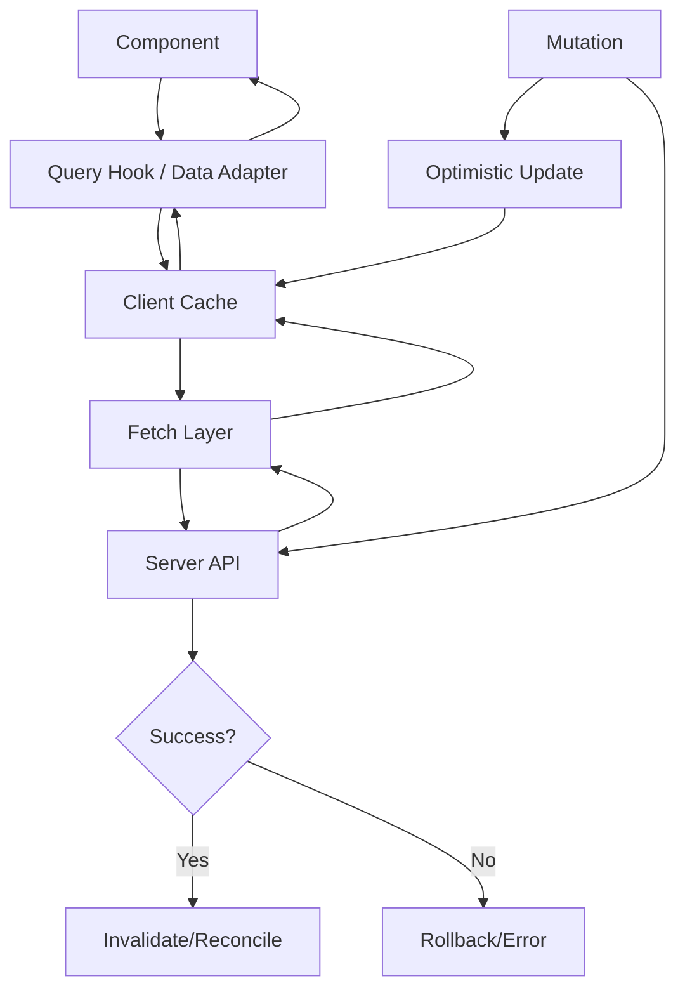
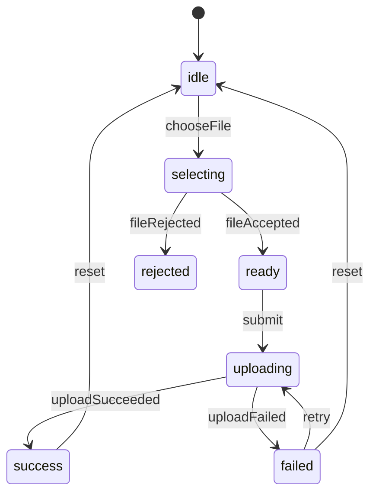
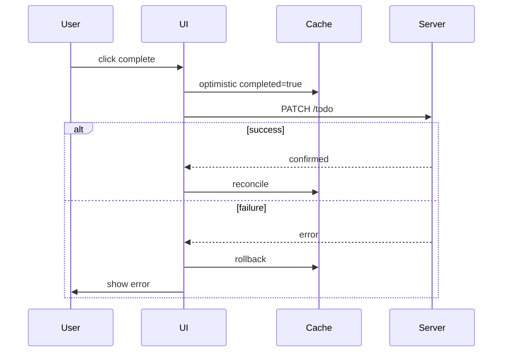
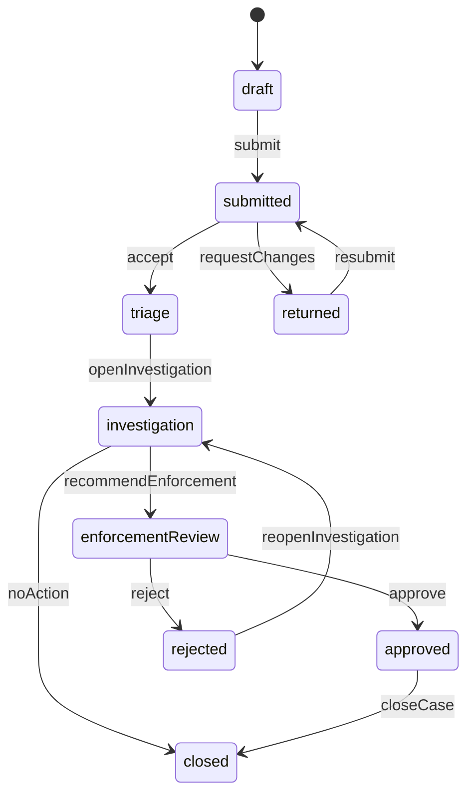
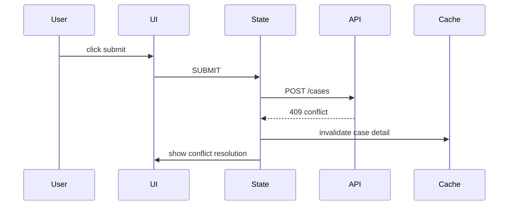
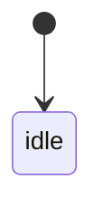
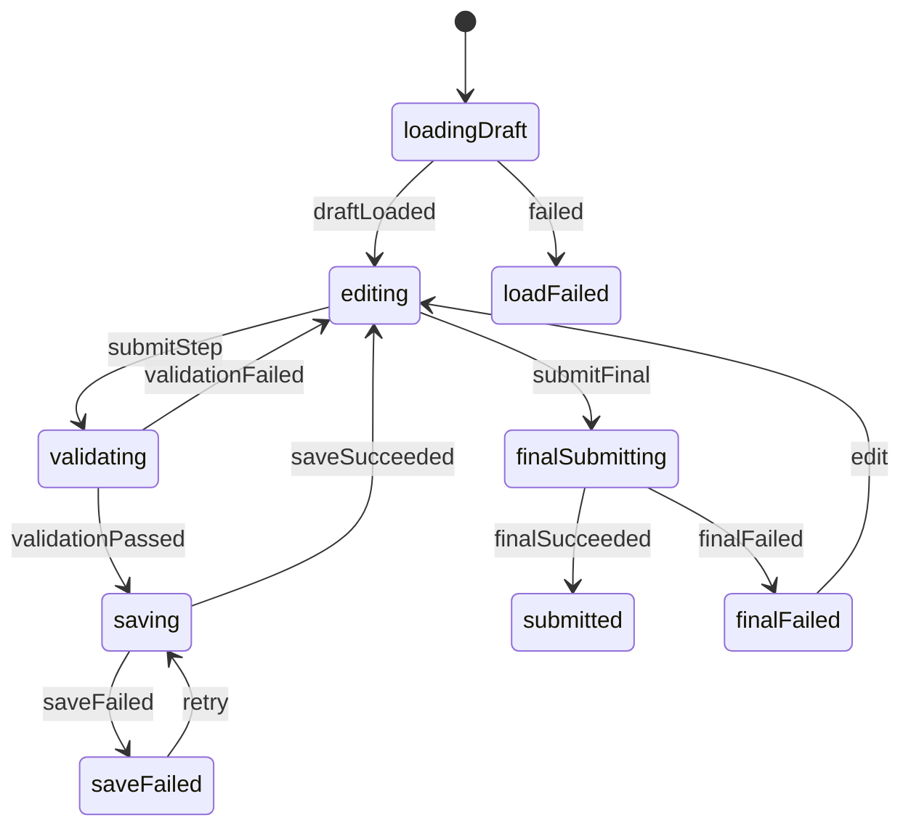

------
title: Learn Advanced JavaScript for Web / Frontend Engineering - Part 010
description: Deep dive ke state modeling untuk frontend systems: local, remote, server, derived, URL, form, session, ephemeral state; invariant, state machine, reducers, effects, synchronization boundary, dan failure modes aplikasi UI kompleks.
series: learn-javascript-frontend-advanced
seriesTitle: Learn Advanced JavaScript for Web / Frontend Engineering
order: 10
partTitle: State Modeling for Frontend Systems
tags:
- javascript
- frontend
- web
- state
- state-machine
- architecture
- react
- ui
- consistency
- advanced
date: 2026-06-27
---

# State Modeling for Frontend Systems

State adalah sumber kompleksitas terbesar dalam aplikasi frontend modern. Bukan karena `useState`, store, reducer, signal, atau cache itu sulit. Yang sulit adalah menentukan **state apa yang benar-benar ada**, siapa pemiliknya, kapan boleh berubah, invariant apa yang harus dijaga, efek apa yang muncul dari perubahan itu, dan bagaimana menghindari drift antara UI, URL, cache, server, form, DOM, dan user intent.

Banyak bug frontend senior-level bukan bug syntax. Bug-nya berbentuk:

- UI menampilkan data lama setelah mutation berhasil;
- optimistic update tidak rollback dengan benar;
- filter di URL berbeda dari filter di store;
- form terlihat valid tetapi payload tidak valid;
- modal tertutup tetapi request masih berjalan;
- tab berpindah tetapi subscription lama masih hidup;
- selected row hilang setelah pagination;
- derived count berbeda dari list item;
- loading spinner stuck karena race condition;
- user mengetik cepat lalu response lama menimpa response baru;
- permission berubah tetapi UI masih memperbolehkan action;
- undo/redo tidak deterministik;
- workflow case management masuk state mustahil.

Part ini membahas state modeling sebagai disiplin engineering, bukan sebagai pilihan library.

---

## 1. Posisi Part Ini Dalam Framework Kaufman

Dalam framework Kaufman, kita pecah skill “state management” menjadi komponen yang bisa dilatih:



Target part ini:

1. Anda bisa mengklasifikasikan state frontend secara presisi.
2. Anda bisa menentukan ownership state.
3. Anda bisa membedakan source state dan derived state.
4. Anda bisa mendesain invariant yang mencegah impossible state.
5. Anda bisa memodelkan workflow UI sebagai state machine.
6. Anda bisa memisahkan transition dan side effect.
7. Anda bisa menghindari race, stale data, dan synchronization bug.
8. Anda bisa memilih library state management berdasarkan problem, bukan hype.

---

## 2. Definisi State

State adalah informasi yang memengaruhi output sistem sekarang atau keputusan sistem berikutnya.

Dalam frontend, output sistem bisa berupa:

- DOM visual;
- accessibility tree;
- network request;
- enabled/disabled action;
- URL;
- browser history;
- focus;
- scroll;
- form payload;
- cache;
- telemetry;
- local storage;
- server mutation;
- permission-gated UI;
- workflow transition.

State bukan hanya data yang disimpan di JavaScript variable. State juga bisa berada di:

- server database;
- HTTP cache;
- query cache;
- URL query string;
- browser storage;
- DOM property;
- form input internal state;
- selected text;
- focused element;
- media playback position;
- service worker cache;
- feature flag service;
- auth/session provider.

Mental model:



Setiap panah adalah synchronization boundary. Bug muncul ketika boundary tidak didefinisikan.

---

## 3. Taxonomy State Frontend

Klasifikasi state membantu menentukan ownership dan lifecycle.

| Jenis State | Contoh | Owner Ideal | Persistensi | Risiko Utama |
|---|---|---|---|---|
| Local UI state | dropdown open, selected tab | component/feature | sementara | over-lifting, stale after unmount |
| Form state | values, touched, errors | form boundary | sampai submit/reset | mismatch payload/validation |
| URL state | search query, filters, pagination | router/route | shareable | drift dengan store |
| Server state | user, invoice, case detail | server + query cache | remote | stale, invalidation, race |
| Derived state | count, filtered list, status label | computed from source | tidak disimpan | duplication drift |
| Session state | auth user, tenant, permissions | auth/session provider | session | permission mismatch |
| Ephemeral state | hover, pressed, focus-visible | DOM/browser/component | sangat sementara | disimpan terlalu global |
| Async state | loading, success, error, retry | request boundary | lifecycle request | impossible combinations |
| Workflow state | draft, submitted, under review | domain/server | long-lived | illegal transition |
| Client cache state | query result, mutation queue | cache layer | configurable | invalidation bug |
| Browser state | focus, scroll, history | browser | bervariasi | framework tidak sadar |
| Feature flag state | enabled experiments | flag provider | session/request | inconsistent rendering |

State modeling dimulai dengan pertanyaan:

> State ini milik siapa, berapa lama hidupnya, siapa yang boleh mengubahnya, dan apa invariant-nya?

---

## 4. Source State vs Derived State

Kesalahan paling umum adalah menyimpan derived state sebagai source state.

Buruk:

```js
const [items, setItems] = useState([]);
const [filteredItems, setFilteredItems] = useState([]);
const [count, setCount] = useState(0);
```

Jika `items`, `filteredItems`, dan `count` harus selalu konsisten, tetapi disimpan terpisah, Anda menciptakan risiko drift.

Lebih baik:

```js
const [items, setItems] = useState([]);
const [query, setQuery] = useState("");

const filteredItems = items.filter((item) =>
  item.name.toLowerCase().includes(query.toLowerCase())
);

const count = filteredItems.length;
```

Derived state boleh disimpan jika:

- computation sangat mahal dan memoization dibutuhkan;
- hasil berasal dari snapshot waktu tertentu;
- hasil perlu diedit independen setelah dibuat;
- hasil perlu persist sebagai domain data;
- computation non-deterministic dan harus dibekukan;
- Anda punya invalidation policy yang jelas.

Kalau tidak, derive.

### 4.1 Rule Praktis

Jangan menyimpan nilai yang bisa dihitung dari state lain dengan murah dan deterministik.

Contoh derived:

```ts
const canSubmit = form.isDirty && form.isValid && !form.isSubmitting;
```

Jangan jadikan `canSubmit` state manual kecuali ada alasan domain.

---

## 5. Ownership State

State tanpa owner akan menjadi global secara sosial walau tidak global secara teknis.

Pertanyaan ownership:

1. Siapa source of truth?
2. Siapa boleh menulis?
3. Siapa boleh membaca?
4. Apa lifecycle-nya?
5. Apa yang terjadi saat owner unmount?
6. Bagaimana state di-reset?
7. Apakah state harus survive navigation?
8. Apakah state harus shareable via URL?
9. Apakah state perlu sinkron dengan server?
10. Apakah state perlu audit trail?

Diagram ownership:



Rule yang sering benar:

- state milik component paling dekat yang membutuhkan write;
- jika perlu share antar sibling, lift ke common parent;
- jika perlu survive route reload/share, gunakan URL atau server;
- jika berasal dari server, jangan jadikan global store manual tanpa cache semantics;
- jika domain-critical, server harus menjadi authority.

---

## 6. Local State

Local state cocok untuk state UI yang terbatas scope-nya.

Contoh:

```jsx
function Disclosure({ title, children }) {
  const [open, setOpen] = useState(false);

  return (
    <section>
      <button
        type="button"
        aria-expanded={open}
        onClick={() => setOpen((value) => !value)}
      >
        {title}
      </button>

      {open ? <div>{children}</div> : null}
    </section>
  );
}
```

Ini state lokal yang sehat karena:

- hanya disclosure yang peduli;
- lifecycle sama dengan component;
- tidak perlu share URL;
- tidak perlu server;
- reset saat unmount masuk akal.

Anti-pattern:

```js
globalStore.disclosures[disclosureId].open = true;
```

Jika disclosure sederhana dimasukkan ke global store, kompleksitas naik tanpa manfaat.

---

## 7. Lifted State

State perlu diangkat ketika beberapa component harus konsisten.

Contoh:

```jsx
function ProductPage() {
  const [selectedVariantId, setSelectedVariantId] = useState(null);

  return (
    <>
      <VariantPicker
        selectedVariantId={selectedVariantId}
        onSelect={setSelectedVariantId}
      />
      <Price selectedVariantId={selectedVariantId} />
      <Inventory selectedVariantId={selectedVariantId} />
      <AddToCartButton selectedVariantId={selectedVariantId} />
    </>
  );
}
```

Ini baik jika variant selection adalah state halaman.

Namun jangan lift terlalu jauh.

Buruk:

```jsx
<App>
  <GlobalProvider selectedVariantId={...} />
</App>
```

Jika hanya ProductPage yang perlu, jangan jadikan app-wide.

---

## 8. URL State

URL adalah state container untuk state yang harus:

- shareable;
- bookmarkable;
- restorable dengan refresh;
- terintegrasi dengan back/forward;
- dipakai untuk deep link;
- menjadi bagian dari navigation semantics.

Contoh:

```txt
/cases?status=open&assignee=me&page=2&sort=priority.desc
```

State yang cocok di URL:

- search query;
- filter;
- pagination;
- sort;
- selected tab route-level;
- entity id;
- view mode;
- date range.

State yang kurang cocok di URL:

- hover;
- dropdown open kecil;
- unsaved form value sensitif;
- token;
- transient animation state;
- data besar;
- object kompleks tanpa encoding stabil.

### 8.1 URL as Source of Truth

Jika filter ada di URL, jangan duplikasi manual di store tanpa sync jelas.

Buruk:

```js
const [filters, setFilters] = useState(defaultFilters);
const searchParams = useSearchParams();

useEffect(() => {
  setFilters(parseFilters(searchParams));
}, [searchParams]);
```

Ini bisa benar, tetapi mudah drift jika update filters tidak selalu update URL.

Lebih baik buat adapter eksplisit:

```ts
export function readCaseListParams(search: string): CaseListParams {
  const params = new URLSearchParams(search);

  return {
    status: params.get("status") ?? "open",
    assignee: params.get("assignee") ?? "any",
    page: Number(params.get("page") ?? 1),
    sort: params.get("sort") ?? "createdAt.desc",
  };
}

export function writeCaseListParams(params: CaseListParams): string {
  const search = new URLSearchParams();

  if (params.status !== "open") search.set("status", params.status);
  if (params.assignee !== "any") search.set("assignee", params.assignee);
  if (params.page !== 1) search.set("page", String(params.page));
  if (params.sort !== "createdAt.desc") search.set("sort", params.sort);

  return search.toString();
}
```

URL encoding adalah contract. Test seperti API contract.

---

## 9. Server State

Server state adalah data yang dimiliki server tetapi dicerminkan di client.

Contoh:

- user profile;
- case detail;
- invoice list;
- permissions;
- notification count;
- audit log;
- workflow status.

Server state berbeda dari client state karena:

- bisa stale;
- bisa berubah oleh aktor lain;
- perlu fetching;
- perlu caching;
- perlu invalidation;
- perlu retry;
- perlu error handling;
- perlu authorization;
- mutation bisa gagal;
- optimistic update bisa perlu rollback.

Anti-pattern:

```js
const [cases, setCases] = useState([]);

useEffect(() => {
  fetch("/api/cases")
    .then((r) => r.json())
    .then(setCases);
}, []);
```

Ini cukup untuk demo, tetapi kurang untuk production karena tidak ada:

- cache key;
- stale policy;
- request deduplication;
- loading/error state konsisten;
- invalidation;
- cancellation;
- refetch policy;
- optimistic mutation;
- retry policy.

Pola production biasanya memakai query/cache layer.

Mental model:



---

## 10. Async State

Async state sering dimodelkan buruk.

Anti-pattern:

```js
const [loading, setLoading] = useState(false);
const [error, setError] = useState(null);
const [data, setData] = useState(null);
```

Ini memungkinkan impossible state:

- `loading=true` dan `data` lama masih ada, apakah itu refetch atau initial load?
- `error` dan `data` sama-sama ada, apakah error refetch atau failure total?
- `loading=false`, `error=null`, `data=null`, apakah idle atau empty?

Lebih baik pakai union state:

```ts
type AsyncState<T> =
  | { status: "idle" }
  | { status: "loading" }
  | { status: "success"; data: T; stale?: boolean }
  | { status: "empty" }
  | { status: "error"; error: Error; recoverable: boolean };
```

Untuk refetch yang mempertahankan data:

```ts
type QueryState<T> =
  | { status: "pending" }
  | { status: "success"; data: T; fetching: boolean }
  | { status: "error"; error: Error }
  | { status: "stale"; data: T; fetching: boolean; lastUpdatedAt: number };
```

Model harus sesuai kebutuhan UX.

---

## 11. State Machine

State machine berguna ketika ada transition yang harus legal/illegal.

Contoh upload file:



Representasi TypeScript:

```ts
type UploadState =
  | { status: "idle" }
  | { status: "selecting" }
  | { status: "ready"; file: File }
  | { status: "rejected"; reason: string }
  | { status: "uploading"; file: File; progress: number }
  | { status: "success"; assetId: string }
  | { status: "failed"; file: File; error: Error; retryCount: number };
```

Reducer:

```ts
type UploadEvent =
  | { type: "CHOOSE_FILE" }
  | { type: "FILE_ACCEPTED"; file: File }
  | { type: "FILE_REJECTED"; reason: string }
  | { type: "SUBMIT" }
  | { type: "PROGRESS"; progress: number }
  | { type: "SUCCEEDED"; assetId: string }
  | { type: "FAILED"; error: Error }
  | { type: "RETRY" }
  | { type: "RESET" };

function uploadReducer(state: UploadState, event: UploadEvent): UploadState {
  switch (state.status) {
    case "idle":
      if (event.type === "CHOOSE_FILE") return { status: "selecting" };
      return state;

    case "selecting":
      if (event.type === "FILE_ACCEPTED") return { status: "ready", file: event.file };
      if (event.type === "FILE_REJECTED") return { status: "rejected", reason: event.reason };
      return state;

    case "ready":
      if (event.type === "SUBMIT") {
        return { status: "uploading", file: state.file, progress: 0 };
      }
      if (event.type === "RESET") return { status: "idle" };
      return state;

    case "uploading":
      if (event.type === "PROGRESS") {
        return { ...state, progress: event.progress };
      }
      if (event.type === "SUCCEEDED") return { status: "success", assetId: event.assetId };
      if (event.type === "FAILED") {
        return { status: "failed", file: state.file, error: event.error, retryCount: 0 };
      }
      return state;

    case "failed":
      if (event.type === "RETRY") {
        return {
          status: "uploading",
          file: state.file,
          progress: 0,
        };
      }
      if (event.type === "RESET") return { status: "idle" };
      return state;

    case "success":
    case "rejected":
      if (event.type === "RESET") return { status: "idle" };
      return state;
  }
}
```

State machine mencegah pertanyaan ambigu seperti “apa arti `loading=true` saat `error` masih ada?”.

---

## 12. Invariant

Invariant adalah kondisi yang harus selalu benar.

Contoh UI invariant:

- hanya satu modal blocking yang aktif;
- selected item harus ada dalam current result set atau dinyatakan stale;
- submit button disabled jika form invalid atau sedang submitting;
- route `/cases/:id` harus punya `caseId` valid;
- optimistic item harus punya temporary id;
- user tanpa permission tidak boleh melihat action destructive;
- jika upload `status=uploading`, maka `file` harus ada;
- jika workflow `status=closed`, action escalation tidak tersedia.

Invariant buruk jika hanya implicit.

Contoh implicit:

```js
if (isUploading) {
  upload(file);
}
```

Apa jaminannya `file` ada?

Lebih baik:

```ts
if (state.status === "uploading") {
  upload(state.file);
}
```

Type membantu menjaga invariant.

---

## 13. Reducer as Transition Boundary

Reducer berguna ketika update state punya aturan.

Buruk:

```js
setIsSubmitting(true);
setError(null);
setCanSubmit(false);
```

Update tersebar dan mudah lupa.

Lebih baik:

```ts
type FormState =
  | { status: "editing"; values: Values; errors: Errors }
  | { status: "submitting"; values: Values }
  | { status: "submitted"; receiptId: string }
  | { status: "failed"; values: Values; error: Error };
```

Reducer:

```ts
function formReducer(state: FormState, event: FormEvent): FormState {
  switch (state.status) {
    case "editing":
      if (event.type === "CHANGE") {
        const values = { ...state.values, [event.field]: event.value };
        return { status: "editing", values, errors: validate(values) };
      }
      if (event.type === "SUBMIT" && isValid(state.errors)) {
        return { status: "submitting", values: state.values };
      }
      return state;

    case "submitting":
      if (event.type === "SUCCEEDED") return { status: "submitted", receiptId: event.receiptId };
      if (event.type === "FAILED") return { status: "failed", values: state.values, error: event.error };
      return state;

    case "failed":
      if (event.type === "CHANGE") {
        const values = { ...state.values, [event.field]: event.value };
        return { status: "editing", values, errors: validate(values) };
      }
      return state;

    case "submitted":
      return state;
  }
}
```

Reducer membuat transition explicit.

---

## 14. Transition vs Effect

State transition harus murni. Side effect harus dipisah.

Transition:

```ts
{ status: "ready", file } + SUBMIT -> { status: "uploading", file, progress: 0 }
```

Effect:

```ts
callUploadApi(file)
```

Jika dicampur, state sulit dites dan race sulit dikontrol.

Pattern:

```ts
type Command =
  | { type: "START_UPLOAD"; file: File }
  | { type: "SHOW_TOAST"; message: string }
  | { type: "NAVIGATE"; to: string };

type TransitionResult<S> = {
  state: S;
  commands: Command[];
};
```

Reducer command-style:

```ts
function transition(state: UploadState, event: UploadEvent): TransitionResult<UploadState> {
  if (state.status === "ready" && event.type === "SUBMIT") {
    return {
      state: { status: "uploading", file: state.file, progress: 0 },
      commands: [{ type: "START_UPLOAD", file: state.file }],
    };
  }

  return { state, commands: [] };
}
```

Command runner:

```ts
async function runCommand(command: Command, dispatch: (event: UploadEvent) => void) {
  switch (command.type) {
    case "START_UPLOAD":
      try {
        const result = await uploadFile(command.file);
        dispatch({ type: "SUCCEEDED", assetId: result.assetId });
      } catch (error) {
        dispatch({ type: "FAILED", error: toError(error) });
      }
      break;
  }
}
```

Ini mirip model event-driven architecture kecil di frontend.

---

## 15. Race Conditions

Race condition terjadi ketika urutan hasil asynchronous tidak sama dengan urutan intent user.

Contoh search:

```js
useEffect(() => {
  fetch(`/api/search?q=${query}`)
    .then((r) => r.json())
    .then(setResults);
}, [query]);
```

Jika user mengetik `a`, lalu `ab`, response `a` bisa datang setelah `ab` dan menimpa hasil terbaru.

Fix dengan AbortController:

```js
useEffect(() => {
  const controller = new AbortController();

  fetch(`/api/search?q=${encodeURIComponent(query)}`, {
    signal: controller.signal,
  })
    .then((r) => r.json())
    .then(setResults)
    .catch((error) => {
      if (error.name !== "AbortError") {
        setError(error);
      }
    });

  return () => controller.abort();
}, [query]);
```

Fix dengan request id:

```js
let nextRequestId = 0;

function createSearchController() {
  let latestRequestId = 0;

  return async function search(query) {
    const requestId = ++nextRequestId;
    latestRequestId = requestId;

    const result = await fetchSearch(query);

    if (requestId !== latestRequestId) {
      return { ignored: true };
    }

    return { ignored: false, result };
  };
}
```

Rule:

> Async result hanya boleh commit jika masih relevan terhadap intent terbaru.

---

## 16. Stale Closures

Stale closure terjadi ketika callback membawa state lama.

Contoh:

```js
function Counter() {
  const [count, setCount] = useState(0);

  function incrementLater() {
    setTimeout(() => {
      setCount(count + 1);
    }, 1000);
  }
}
```

Jika `incrementLater` dipanggil beberapa kali, `count` yang tertangkap bisa lama.

Gunakan functional update:

```js
setCount((current) => current + 1);
```

Untuk event subscription:

```js
useEffect(() => {
  function onMessage(message) {
    setMessages((current) => [...current, message]);
  }

  socket.addEventListener("message", onMessage);
  return () => socket.removeEventListener("message", onMessage);
}, [socket]);
```

Rule:

- callback async harus sadar snapshot;
- gunakan functional update jika update bergantung pada state sebelumnya;
- jangan menutup state lama dalam subscription panjang tanpa strategi;
- gunakan ref/event callback pattern jika butuh latest value tanpa resubscribe.

---

## 17. Form State

Form adalah state machine kompleks:

- initial values;
- current values;
- dirty fields;
- touched fields;
- sync errors;
- async errors;
- submit status;
- server errors;
- field-level loading;
- disabled fields;
- conditional fields;
- hidden fields;
- reset behavior;
- autosave status.

Model minimal:

```ts
type FieldState<T> = {
  initialValue: T;
  value: T;
  touched: boolean;
  dirty: boolean;
  error?: string;
  validating: boolean;
};

type FormState<TValues> = {
  values: TValues;
  fields: Record<keyof TValues, FieldState<TValues[keyof TValues]>>;
  submitStatus: "idle" | "submitting" | "submitted" | "failed";
  submitError?: string;
};
```

### 17.1 Validation Layers

Validasi bukan satu lapisan:

1. UI constraint: required, min length, format dasar.
2. Domain constraint: rule bisnis.
3. Cross-field constraint: start date <= end date.
4. Async constraint: username unique.
5. Server authority: validasi final.

Jangan menganggap validasi frontend cukup untuk domain. Frontend validation adalah UX dan early feedback. Server tetap authority.

### 17.2 Autosave

Autosave membutuhkan state tambahan:

```ts
type AutosaveState =
  | { status: "idle" }
  | { status: "dirty"; changedAt: number }
  | { status: "saving"; version: number }
  | { status: "saved"; savedAt: number; version: number }
  | { status: "failed"; error: Error; retryable: boolean };
```

Invariant:

- save response lama tidak boleh menimpa perubahan baru;
- user harus tahu apakah draft tersimpan;
- konflik versi harus ditangani;
- unload warning hanya jika ada perubahan belum tersimpan.

---

## 18. Optimistic Update

Optimistic update memperbarui UI sebelum server mengonfirmasi.

Contoh:

```ts
type Todo = {
  id: string;
  title: string;
  completed: boolean;
  optimistic?: boolean;
};
```

Flow:



Optimistic update harus menjawab:

1. Apa snapshot sebelum mutation?
2. Bagaimana rollback?
3. Bagaimana reconcile jika server mengubah shape?
4. Bagaimana jika mutation berurutan?
5. Bagaimana jika entity dihapus oleh aktor lain?
6. Bagaimana permission failure ditangani?
7. Apakah action idempotent?

Anti-pattern:

```js
setTodos((todos) => todos.filter((todo) => todo.id !== id));
await deleteTodo(id);
```

Jika delete gagal, data hilang dari UI tanpa recovery.

Lebih baik simpan rollback:

```js
const previousTodos = queryClient.getQueryData(["todos"]);

queryClient.setQueryData(["todos"], (todos) =>
  todos.filter((todo) => todo.id !== id)
);

try {
  await deleteTodo(id);
} catch (error) {
  queryClient.setQueryData(["todos"], previousTodos);
  showError("Failed to delete todo");
}
```

---

## 19. Cache Invalidation

Cache invalidation adalah problem state synchronization.

Pertanyaan cache:

- cache key-nya apa?
- data dianggap fresh berapa lama?
- kapan refetch?
- mutation mana yang invalidate data apa?
- apakah update bisa patch cache langsung?
- apakah list dan detail harus konsisten?
- apakah user melihat stale data diperbolehkan?
- apakah data punya version/etag?

Contoh key design:

```ts
const caseKeys = {
  all: ["cases"] as const,
  lists: () => [...caseKeys.all, "list"] as const,
  list: (params: CaseListParams) => [...caseKeys.lists(), params] as const,
  details: () => [...caseKeys.all, "detail"] as const,
  detail: (id: string) => [...caseKeys.details(), id] as const,
};
```

Key harus mencakup parameter yang memengaruhi data. Jika tidak, cache akan mengembalikan data salah.

Buruk:

```ts
useQuery(["cases"], () => fetchCases({ status, page }));
```

Baik:

```ts
useQuery(["cases", { status, page }], () => fetchCases({ status, page }));
```

---

## 20. Normalized vs Document Cache

Ada dua pendekatan besar.

### 20.1 Document Cache

Cache menyimpan hasil query seperti dokumen.

```ts
["cases", { status: "open" }] -> Case[]
["case", "C-123"] -> CaseDetail
```

Kelebihan:

- sederhana;
- cocok untuk banyak aplikasi;
- invalidation berbasis query;
- mudah dipahami.

Kekurangan:

- list/detail bisa duplikat;
- update satu entity perlu patch beberapa query atau invalidate;
- consistency tergantung policy.

### 20.2 Normalized Cache

Cache menyimpan entity per id.

```ts
entities: {
  Case: {
    "C-123": {...}
  }
}
```

Kelebihan:

- entity consistency lebih mudah;
- cocok untuk graph data;
- update entity menyebar ke consumer.

Kekurangan:

- lebih kompleks;
- schema/identity harus kuat;
- invalidation tidak selalu sederhana;
- pagination/sorting tetap tricky.

Decision:

| Kondisi | Pendekatan Umum |
|---|---|
| REST screens sederhana | Document cache |
| CRUD admin moderate | Document cache + targeted invalidation |
| GraphQL entity-rich | Normalized cache |
| Collaborative real-time | Normalized/event-sourced hybrid |
| Compliance workflow | Server authority + explicit versioning |

---

## 21. Synchronization Boundaries

Synchronization boundary adalah titik di mana dua state source harus diselaraskan.

Contoh boundary:

- URL <-> route state;
- form <-> server draft;
- local optimistic cache <-> server truth;
- component state <-> DOM focus;
- feature flag <-> rendered UI;
- auth session <-> permission gate;
- local storage <-> in-memory state;
- tab A <-> tab B via BroadcastChannel/storage event.

Setiap boundary perlu policy:

```yaml
boundary: URL <-> case list params
source_of_truth: URL
parse_on: navigation
write_on: user_filter_change
invalid_input: coerce_to_default
history_policy: replace_during_typing_push_on_submit
```

Tanpa policy, implementasi menjadi ad-hoc.

---

## 22. Browser State Integration

Frontend state tidak hanya di framework. Browser menyimpan:

- focus;
- selection;
- scroll;
- history;
- autofill;
- form control internal state;
- media playback;
- fullscreen;
- pointer lock;
- permissions;
- clipboard state.

Contoh bug:

```jsx
{items.map((item, index) => (
  <input key={index} defaultValue={item.name} />
))}
```

Jika list reorder, browser input state bisa melekat ke row salah karena key tidak stabil.

Gunakan key identity:

```jsx
{items.map((item) => (
  <input key={item.id} defaultValue={item.name} />
))}
```

State modeling harus mencakup identity.

---

## 23. Identity

Identity adalah inti state consistency.

Pertanyaan:

- Apa id entity?
- Apakah id stabil sebelum server response?
- Bagaimana optimistic id diganti server id?
- Apakah key UI sama dengan id domain?
- Apakah item bisa reorder?
- Apakah entity bisa merge/split?
- Apakah tenant memengaruhi identity?

Contoh temporary id:

```ts
type ClientId = string & { readonly brand: "ClientId" };
type ServerId = string & { readonly brand: "ServerId" };

type DraftComment = {
  id: ClientId;
  body: string;
  status: "pending";
};

type SavedComment = {
  id: ServerId;
  body: string;
  status: "saved";
};
```

Jangan mencampur temporary id dan server id tanpa pembeda.

---

## 24. Permission State

Permission state sering berubah dan tidak boleh hanya menjadi dekorasi UI.

Contoh:

```ts
type CasePermissions = {
  canAssign: boolean;
  canEscalate: boolean;
  canClose: boolean;
  canReopen: boolean;
};
```

UI bisa menggunakan permission untuk enable/disable action, tetapi server tetap harus enforce.

Invariant:

- UI tidak menampilkan action yang jelas tidak tersedia;
- server menolak action ilegal;
- permission error ditampilkan sebagai state yang bisa dipahami;
- stale permission harus direfresh setelah role/context berubah;
- destructive action harus dicek ulang jika state domain berubah.

Anti-pattern:

```js
if (user.role === "admin") showCloseButton();
```

Lebih baik:

```js
if (caseDetail.permissions.canClose) showCloseButton();
```

Role bukan permission. Permission adalah hasil policy dalam context.

---

## 25. Workflow State

Untuk aplikasi regulasi/case management, workflow state harus dimodelkan eksplisit.

Contoh:



Jangan representasikan workflow hanya dengan boolean:

```ts
type BadCaseState = {
  isDraft: boolean;
  isSubmitted: boolean;
  isUnderInvestigation: boolean;
  isClosed: boolean;
};
```

Ini memungkinkan impossible state:

```ts
{
  isDraft: true,
  isClosed: true
}
```

Lebih baik:

```ts
type CaseLifecycleStatus =
  | "draft"
  | "submitted"
  | "returned"
  | "triage"
  | "investigation"
  | "enforcementReview"
  | "approved"
  | "rejected"
  | "closed";
```

Untuk domain-critical, state machine utama harus berada di backend/domain layer. Frontend mencerminkan dan membantu user menjalani transition dengan aman.

---

## 26. Event Log vs Current State

Beberapa sistem cukup butuh current state. Beberapa butuh event log.

Current state:

```json
{
  "caseId": "C-123",
  "status": "investigation",
  "assignee": "u-7"
}
```

Event log:

```json
[
  { "type": "CASE_SUBMITTED", "at": "2026-06-01T10:00:00Z" },
  { "type": "CASE_ACCEPTED", "at": "2026-06-02T11:00:00Z" },
  { "type": "INVESTIGATION_OPENED", "at": "2026-06-03T09:30:00Z" }
]
```

Frontend biasanya mengonsumsi current state untuk render cepat, tetapi audit UI mungkin memerlukan event log.

State modeling harus membedakan:

- state untuk render;
- state untuk audit;
- state untuk transition validation;
- state untuk analytics;
- state untuk undo/redo;
- state untuk synchronization.

---

## 27. State Persistence

Tidak semua state harus persist.

| State | Persist? | Tempat |
|---|---:|---|
| Auth session | Ya | secure server/session mechanism |
| Search filters | Sering | URL |
| Draft form panjang | Ya | server draft/local autosave |
| Modal open | Jarang | local component |
| Theme | Ya | user preference/local storage/server profile |
| Feature flag | Ya selama session | flag provider/cache |
| Table column layout | Mungkin | user settings |
| Hover state | Tidak | DOM/local transient |

Local storage bukan database. Gunakan untuk preference ringan, bukan domain-critical truth.

Risiko local storage:

- stale schema;
- multi-tab race;
- privacy/security;
- quota;
- unavailable mode;
- manual user clearing;
- migration bug.

Buat adapter:

```ts
type StorageResult<T> =
  | { ok: true; value: T }
  | { ok: false; reason: "missing" | "invalid" | "unavailable" };

function readJson<T>(key: string, parse: (value: unknown) => T): StorageResult<T> {
  try {
    const raw = localStorage.getItem(key);
    if (raw == null) return { ok: false, reason: "missing" };
    return { ok: true, value: parse(JSON.parse(raw)) };
  } catch {
    return { ok: false, reason: "invalid" };
  }
}
```

---

## 28. Multi-Tab State

User bisa membuka aplikasi di beberapa tab. Jika state disimpan di local storage atau session berubah, tab lain bisa stale.

Pilihan sync:

- `storage` event;
- BroadcastChannel;
- server push/WebSocket;
- polling;
- refetch on focus;
- version check.

Contoh BroadcastChannel:

```js
const channel = new BroadcastChannel("app-session");

channel.postMessage({ type: "SESSION_UPDATED" });

channel.onmessage = (event) => {
  if (event.data.type === "SESSION_UPDATED") {
    refetchSession();
  }
};
```

Policy:

- apa yang harus sync antar tab?
- apakah tab lain harus logout?
- apakah draft conflict perlu resolusi?
- apakah stale tab boleh submit mutation?
- apakah version mismatch harus diblok?

---

## 29. Undo/Redo State

Undo/redo membutuhkan model history.

```ts
type HistoryState<T> = {
  past: T[];
  present: T;
  future: T[];
};
```

Update:

```ts
function apply<T>(history: HistoryState<T>, next: T): HistoryState<T> {
  return {
    past: [...history.past, history.present],
    present: next,
    future: [],
  };
}

function undo<T>(history: HistoryState<T>): HistoryState<T> {
  const previous = history.past.at(-1);
  if (!previous) return history;

  return {
    past: history.past.slice(0, -1),
    present: previous,
    future: [history.present, ...history.future],
  };
}
```

Untuk domain operations, lebih baik simpan command/event daripada snapshot besar.

```ts
type EditorCommand =
  | { type: "INSERT_TEXT"; position: number; text: string }
  | { type: "DELETE_RANGE"; start: number; end: number };
```

Command bisa punya inverse.

---

## 30. State and Observability

State bug sulit tanpa observability.

Log event state penting:

```ts
type StateTransitionLog = {
  feature: string;
  previousStatus: string;
  event: string;
  nextStatus: string;
  correlationId?: string;
  userId?: string;
  entityId?: string;
  timestamp: number;
};
```

Untuk production:

- log transition penting, bukan setiap keystroke;
- jangan log data sensitif;
- sertakan correlation id untuk request/mutation;
- sertakan entity id dan route;
- bedakan user action dan system event;
- capture error boundary dengan state snapshot terbatas.

Debugging state butuh timeline:



---

## 31. Choosing State Tools

Jangan mulai dari library. Mulai dari problem.

| Problem | Tool/Pattern yang Cocok |
|---|---|
| UI state kecil | component local state |
| State kompleks dalam component | reducer/state machine |
| Deep prop passing untuk stable context | context/provider |
| Server state/cache | query library/cache layer |
| Global client state kecil | lightweight store |
| Complex workflow | state machine/event model |
| URL-driven page | router/search params adapter |
| Form kompleks | form library + schema validation |
| Real-time collaborative | normalized/event-driven store |
| Undo/redo editor | command/history model |

Kriteria tool:

1. Apakah tool memodelkan problem utama?
2. Apakah lifecycle jelas?
3. Apakah devtools membantu diagnosis?
4. Apakah TypeScript support kuat?
5. Apakah cache/invalidation semantics jelas?
6. Apakah tim memahami mental modelnya?
7. Apakah migrasi feasible?
8. Apakah cocok dengan SSR/RSC/framework target?
9. Apakah bundle/runtime cost sesuai?
10. Apakah failure mode bisa diuji?

---

## 32. Common Anti-Patterns

### 32.1 Global Store untuk Semua Hal

Global store membuat state mudah diakses, tetapi juga membuat ownership kabur.

### 32.2 Duplicated Derived State

Menyimpan count, filtered list, dan source list terpisah tanpa invalidation policy.

### 32.3 Boolean Explosion

Banyak boolean menghasilkan impossible states.

```ts
type Bad = {
  isLoading: boolean;
  isSuccess: boolean;
  isError: boolean;
  isEmpty: boolean;
};
```

Gunakan union.

### 32.4 Effect sebagai State Machine Tersembunyi

Banyak `useEffect` saling update state sehingga transition tidak terlihat.

### 32.5 URL Drift

Filter di URL, store, dan component local berbeda.

### 32.6 Ignoring Cancellation

Request lama menimpa state baru.

### 32.7 Permission as UI Only

UI menyembunyikan button tetapi server tidak enforce, atau UI terlalu percaya role lokal.

### 32.8 Form Payload Tidak Sama Dengan UI

Field hidden masih terkirim, field disabled tidak masuk, conditional field tidak di-reset.

### 32.9 Uncontrolled Browser State Tanpa Key Stabil

Input state berpindah row karena key menggunakan index.

### 32.10 Cache Key Tidak Lengkap

Query parameter tidak masuk key sehingga data salah dipakai ulang.

---

## 33. State Modeling Template

Gunakan template ini sebelum membuat fitur kompleks.

```md
# State Model: <Feature>

## User Intent
- Apa user action utama?
- Apa feedback yang harus terlihat?

## State Inventory
| State | Type | Owner | Source/Derived | Persist? | Reset Policy |
|---|---|---|---|---|---|

## Invariants
- ...

## Events
| Event | Source | Allowed From | Result |
|---|---|---|---|

## State Machine


## Effects
| Effect | Trigger | Cancellation | Retry | Error Handling |
|---|---|---|---|---|

## Synchronization Boundaries
| Boundary | Source of Truth | Conflict Policy |
|---|---|---|

## Failure Modes
- Race condition:
- Stale cache:
- Permission change:
- Network failure:
- Multi-tab:
- Unmount during request:

## Tests
- transition tests
- URL parse/write tests
- async race tests
- permission tests
- rollback tests
```

---

## 34. Case Study: Case List Filters

### 34.1 Requirement

User dapat filter case berdasarkan status, assignee, date range, priority, dan search keyword. Filter harus shareable lewat URL. Data dari server. Pagination harus stabil.

### 34.2 State Inventory

| State | Owner | Source/Derived | Persist |
|---|---|---|---|
| `status` | URL | source | URL |
| `assignee` | URL | source | URL |
| `dateRange` | URL | source | URL |
| `priority` | URL | source | URL |
| `query` | URL/local draft | source | URL on submit |
| `page` | URL | source | URL |
| `cases` | server/query cache | source remote | cache |
| `totalCount` | server | source remote | cache |
| `hasNextPage` | derived | derived | no |
| `selectedCaseId` | route/local | source | maybe URL |
| `isFetching` | query cache | source async | no |

### 34.3 Invariants

- query key harus mencakup semua filter yang memengaruhi result;
- page reset ke 1 ketika filter utama berubah;
- URL invalid harus dicoerce ke default;
- selected case harus tetap valid atau ditandai not in current result;
- loading state harus membedakan initial load dan refetch;
- back button harus mengembalikan filter sebelumnya.

### 34.4 URL Adapter

```ts
type CaseListParams = {
  status: "open" | "closed" | "all";
  assignee: string | "any";
  priority: "low" | "medium" | "high" | "any";
  query: string;
  page: number;
};

function normalizeCaseListParams(params: Partial<CaseListParams>): CaseListParams {
  return {
    status: params.status ?? "open",
    assignee: params.assignee ?? "any",
    priority: params.priority ?? "any",
    query: params.query ?? "",
    page: Math.max(1, params.page ?? 1),
  };
}
```

### 34.5 Filter Change Policy

```ts
function applyFilterChange(
  current: CaseListParams,
  patch: Partial<CaseListParams>
): CaseListParams {
  return normalizeCaseListParams({
    ...current,
    ...patch,
    page: 1,
  });
}
```

---

## 35. Case Study: Multi-Step Enforcement Form

### 35.1 Problem

Form enforcement memiliki beberapa step, conditional fields, autosave, server validation, dan submit final. User bisa keluar lalu kembali.

### 35.2 State Machine



### 35.3 Key Invariants

- hidden conditional fields tidak boleh terkirim kecuali domain meminta;
- autosave response lama tidak boleh menimpa edit baru;
- server validation error harus terikat ke field/step yang benar;
- submit final hanya dari draft version terbaru;
- navigation away harus memperingatkan jika ada dirty unsaved changes;
- permission harus dicek ulang sebelum final submit.

### 35.4 Versioning

```ts
type DraftState = {
  draftId: string;
  version: number;
  values: EnforcementValues;
  dirtySinceVersion?: number;
};
```

Setiap save membawa version. Jika server menolak karena conflict, UI masuk conflict resolution state.

---

## 36. Testing State Models

State model bisa dites tanpa browser.

### 36.1 Reducer Transition Tests

```ts
it("moves ready upload to uploading on submit", () => {
  const file = new File(["x"], "x.txt");
  const state: UploadState = { status: "ready", file };

  expect(uploadReducer(state, { type: "SUBMIT" })).toEqual({
    status: "uploading",
    file,
    progress: 0,
  });
});
```

### 36.2 Impossible Transition Tests

```ts
it("does not submit from idle", () => {
  const state: UploadState = { status: "idle" };

  expect(uploadReducer(state, { type: "SUBMIT" })).toBe(state);
});
```

### 36.3 URL Roundtrip Tests

```ts
it("roundtrips case list params", () => {
  const params = {
    status: "open",
    assignee: "me",
    priority: "high",
    query: "fraud",
    page: 2,
  } as const;

  expect(readCaseListParams(writeCaseListParams(params))).toEqual(params);
});
```

### 36.4 Async Race Tests

Simulasikan response datang terbalik dan pastikan result lama diabaikan.

---

## 37. Deliberate Practice

### Latihan 1: Boolean Explosion Refactor

Ambil state berikut:

```ts
type State = {
  isLoading: boolean;
  isSaving: boolean;
  isError: boolean;
  isSuccess: boolean;
  data?: unknown;
  error?: Error;
};
```

Refactor menjadi discriminated union dan tulis transition legal.

### Latihan 2: URL State Adapter

Buat parser/writer untuk halaman list dengan filter, sort, dan page. Tulis roundtrip test.

### Latihan 3: Search Race

Buat search box yang sengaja mengalami stale response. Fix dengan AbortController dan request id.

### Latihan 4: Form State Machine

Modelkan form multi-step dengan validation, save draft, failure, retry, dan submit final.

### Latihan 5: Optimistic Update

Implement optimistic delete dengan rollback, lalu tes failure.

### Latihan 6: Workflow Model

Modelkan lifecycle complaint/case management dengan transition legal dan permission.

---

## 38. Mental Model Akhir

State management bukan pertanyaan “pakai library apa?”. Pertanyaan sebenarnya adalah:

> State apa yang ada, siapa pemiliknya, bagaimana ia berubah, invariant apa yang harus benar, dan bagaimana sistem pulih saat perubahan gagal?

Prinsip utama:

1. Klasifikasikan state sebelum memilih tool.
2. Jangan menyimpan derived state tanpa alasan.
3. Tentukan owner dan lifecycle.
4. URL adalah source of truth untuk state navigasi/shareable.
5. Server state butuh cache, invalidation, stale policy, dan error handling.
6. Async state sebaiknya dimodelkan sebagai union, bukan boolean terpisah.
7. Workflow kompleks butuh state machine.
8. Transition harus dipisahkan dari side effect.
9. Race condition harus dianggap default risk, bukan edge case langka.
10. Permission adalah context/domain policy, bukan sekadar role string.
11. Browser state seperti focus, scroll, dan input identity harus dihormati.
12. State model yang baik membuat impossible state sulit atau tidak mungkin terjadi.

Part berikutnya akan membahas reactivity dan change propagation: bagaimana perubahan state diketahui, dijadwalkan, dibatch, dan disebarkan ke UI tanpa membuat sistem tidak deterministik atau boros.

---

## 39. Referensi

- React Docs, "Managing State"
- React Docs, "Sharing State Between Components"
- React Docs, "Choosing the State Structure"
- React Docs, "Extracting State Logic into a Reducer"
- MDN Web Docs, "AbortController"
- MDN Web Docs, "URLSearchParams"
- MDN Web Docs, "History API"
- TanStack Query documentation, query keys and invalidation concepts
- XState documentation, finite state machines and statecharts concepts
- Redux documentation, reducers and normalized state concepts
