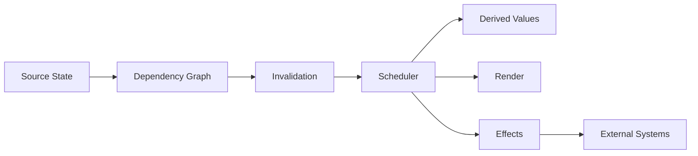
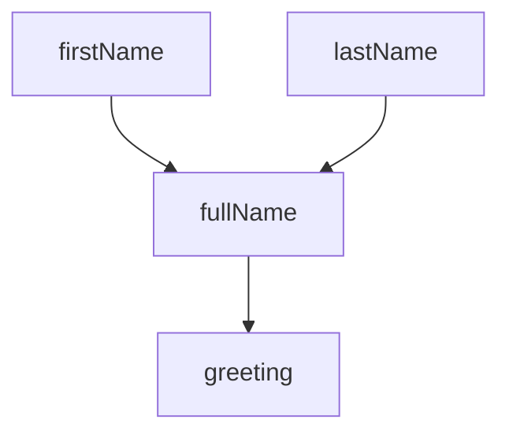
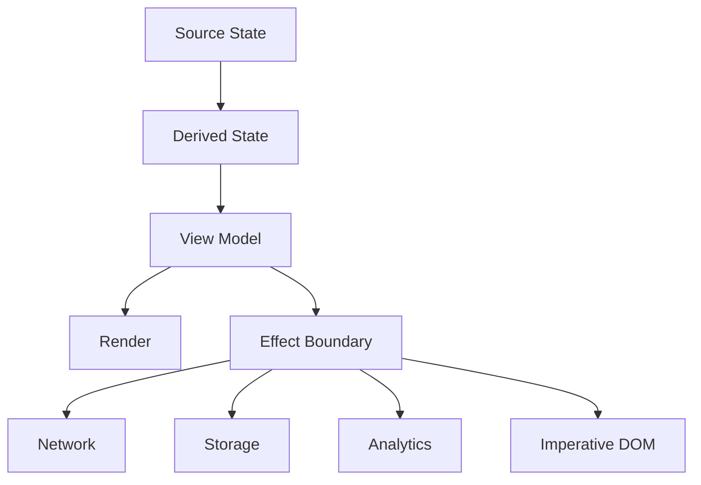
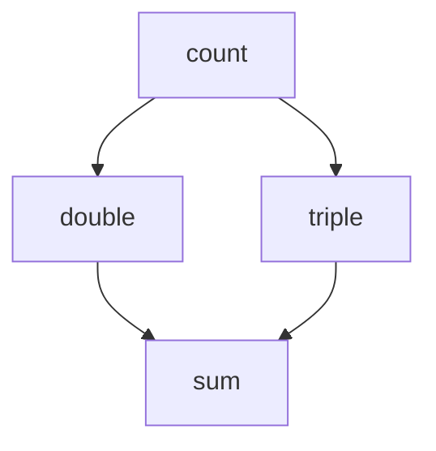
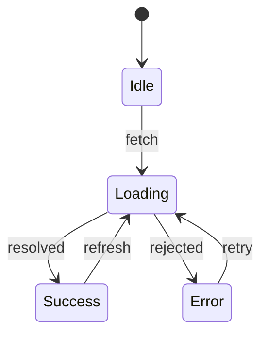

# Part 011 — Reactivity and Change Propagation

Di part sebelumnya, kita membahas **state modeling**: bagaimana membedakan source state, derived state, server state, URL state, workflow state, dan effect state. Part ini menjawab pertanyaan lanjutannya:

> Setelah state berubah, bagaimana perubahan itu bergerak ke seluruh UI tanpa membuat sistem menjadi lambat, tidak deterministik, atau sulit di-debug?

Inilah domain **reactivity and change propagation**.

Frontend engineer biasa sering melihat reactivity sebagai fitur framework: `useState`, `computed`, `watch`, `signal`, `store`, atau `observable`. Engineer yang lebih matang melihatnya sebagai **mekanisme propagasi perubahan di atas graph dependensi**.

Reactivity bukan tujuan. Reactivity adalah cara menjaga konsistensi antara:

1. **source state**;
2. **derived state**;
3. **rendered output**;
4. **side effect**;
5. **external system** seperti network, storage, analytics, URL, worker, dan DOM imperative.

Kalau graph ini tidak dirancang, aplikasi akan tetap berjalan, tetapi akan muncul gejala berikut:

- render berulang tanpa alasan jelas;
- derived state drift dari source state;
- watcher/effect saling memicu;
- cache tidak invalid;
- race antara user input dan response server;
- UI terlihat benar di happy path tetapi rusak pada interaksi cepat;
- bug sulit direproduksi karena urutan update bergantung timing.

Part ini memakai pendekatan Kaufman: kita pecah skill reactivity menjadi sub-skill yang bisa dilatih, cukup teori untuk self-correction, lalu masuk ke failure modes dan practice loop.

---

## 1. Target Skill

Setelah menyelesaikan part ini, targetnya bukan sekadar tahu perbedaan React, Vue, Solid, atau RxJS. Targetnya adalah mampu:

1. membaca UI sebagai **dependency graph**;
2. menentukan mana state yang harus disimpan dan mana yang harus diturunkan;
3. memilih model propagasi perubahan: pull, push, hybrid, render-based, fine-grained, observable, atau explicit event;
4. membedakan **derivation** dan **effect**;
5. mendiagnosis rerender, stale value, glitch, infinite loop, dan over-subscription;
6. mendesain reactive boundary yang aman untuk production.

Skill ini penting karena mayoritas bug frontend kompleks bukan berasal dari syntax, tetapi dari **perubahan state yang menyebar tanpa model yang jelas**.

---

## 2. Mental Model Utama

Reactivity adalah sistem yang menjawab empat pertanyaan:

| Pertanyaan | Makna Engineering |
|---|---|
| Apa yang berubah? | Source of mutation |
| Siapa yang bergantung pada nilai itu? | Dependency tracking |
| Kapan perubahan diproses? | Scheduling and batching |
| Apa yang harus dijalankan ulang? | Invalidation and recomputation |

Secara konseptual:



Model ini berlaku meskipun framework berbeda.

- React cenderung memakai model **render-driven invalidation**.
- Vue memakai reactive proxy dan dependency tracking.
- Solid memakai fine-grained signals.
- RxJS memakai stream/observable push model.
- Vanilla DOM bisa reactive bila kita membangun mekanisme subscription sendiri.

Perbedaannya bukan pada “mana yang modern”, tetapi pada:

1. granularitas tracking;
2. kapan update dijalankan;
3. apakah dependency diketahui secara eksplisit atau otomatis;
4. apakah side effect terkontrol;
5. seberapa mudah sistem di-debug saat skala membesar.

---

## 3. Decomposition ala Kaufman

Untuk menguasai reactivity, pecah menjadi tujuh sub-skill:

| Sub-skill | Pertanyaan Latihan | Output yang Diharapkan |
|---|---|---|
| Dependency modeling | Nilai apa bergantung pada nilai apa? | Dependency graph eksplisit |
| Derivation discipline | Apakah nilai ini harus disimpan atau dihitung? | Minim duplicated state |
| Effect isolation | Apakah operasi ini pure atau menyentuh dunia luar? | Effect ditempatkan di edge |
| Scheduling awareness | Kapan update dijalankan? | Tidak ada timing assumption palsu |
| Invalidation design | Apa yang menjadi stale saat input berubah? | Cache dan memo invalid dengan benar |
| Debugging propagation | Mengapa ini rerender/ter-update? | Diagnosis path perubahan |
| Failure modeling | Bagaimana graph ini bisa loop, glitch, atau drift? | Guard dan invariant |

Jangan mulai dari API framework. Mulai dari graph.

---

## 4. Vocabulary yang Harus Presisi

### 4.1 Source State

**Source state** adalah data yang memiliki otoritas. Ia tidak bisa dihitung sepenuhnya dari state lain di client.

Contoh:

```ts
const selectedUserId = "u-123";
const usersById = new Map();
const currentRoute = "/users/u-123";
```

Source state harus dijaga seminimal mungkin. Semakin banyak source state, semakin banyak kemungkinan inkonsistensi.

### 4.2 Derived State

**Derived state** adalah nilai yang dapat dihitung dari source state.

```ts
const selectedUser = usersById.get(selectedUserId);
const isAdmin = selectedUser?.roles.includes("admin") ?? false;
```

Kalau derived state disimpan sebagai source state tambahan, kita membuat peluang drift.

Bad smell:

```ts
let selectedUserId = "u-123";
let selectedUser = usersById.get(selectedUserId);

// selectedUserId berubah, selectedUser lupa diperbarui.
selectedUserId = "u-456";
```

Better:

```ts
function getSelectedUser(state: State) {
  return state.usersById.get(state.selectedUserId) ?? null;
}
```

### 4.3 Dependency

Dependency adalah relasi: “nilai A membutuhkan nilai B untuk dihitung”.



Kalau `firstName` berubah, `fullName` menjadi stale, lalu `greeting` juga stale.

### 4.4 Invalidation

Invalidation bukan recomputation. Invalidation berarti menandai nilai sebagai **tidak lagi dapat dipercaya**.

```txt
source changes -> dependents become stale -> scheduler decides recompute timing
```

Sistem yang baik tidak selalu langsung recompute semua hal. Ia tahu kapan cukup menandai stale, kapan harus recompute, dan kapan harus batch.

### 4.5 Effect

Effect adalah operasi yang menyentuh dunia luar atau punya konsekuensi di luar proses komputasi pure.

Contoh effect:

- fetch API;
- menulis ke `localStorage`;
- push analytics event;
- update `document.title`;
- subscribe ke WebSocket;
- imperatively focus input;
- mutate DOM di luar renderer.

Rule penting:

> Derived value harus pure. Effect harus berada di boundary.

Kalau derived value melakukan effect, graph menjadi sulit diprediksi.

---

## 5. Pull, Push, dan Hybrid Reactivity

Ada tiga keluarga besar propagasi perubahan.

### 5.1 Pull Model

Dalam pull model, consumer meminta nilai saat dibutuhkan.

```ts
function getTotal(items: Item[]) {
  return items.reduce((sum, item) => sum + item.price, 0);
}
```

Karakteristik:

- sederhana;
- mudah diuji;
- tidak butuh subscription;
- bisa boros kalau komputasi mahal dan sering dipanggil.

Pull model cocok untuk derived value murah dan synchronous.

### 5.2 Push Model

Dalam push model, producer mengirim perubahan ke subscriber.

```ts
class Store<T> {
  private value: T;
  private listeners = new Set<(value: T) => void>();

  constructor(initialValue: T) {
    this.value = initialValue;
  }

  get() {
    return this.value;
  }

  set(next: T) {
    if (Object.is(this.value, next)) return;
    this.value = next;
    for (const listener of this.listeners) {
      listener(next);
    }
  }

  subscribe(listener: (value: T) => void) {
    this.listeners.add(listener);
    return () => this.listeners.delete(listener);
  }
}
```

Karakteristik:

- responsif;
- bagus untuk event stream;
- butuh lifecycle unsubscribe;
- rentan cascading update dan infinite loop.

Push model cocok untuk external event, WebSocket, user event, observable stream, atau state global yang perlu memberi tahu banyak consumer.

### 5.3 Hybrid Model

Hybrid model menggabungkan invalidation push dengan recomputation pull.

Contoh mental model:

```txt
source.set(next)
  -> mark derived value stale
  -> consumer reads derived value
  -> recompute lazily if stale
```

Model ini umum pada computed/memo/signal system.

Keuntungan:

- tidak recompute kalau tidak dibaca;
- dependency tetap diketahui;
- bisa menghindari pekerjaan sia-sia.

Risiko:

- butuh dependency tracking akurat;
- stale flag harus benar;
- effect tidak boleh membaca/menulis secara kacau.

---

## 6. Mini Reactive System dari Nol

Untuk memahami framework, kita bangun versi sederhana. Tujuannya bukan membuat library, tetapi memahami mekanisme.

### 6.1 Signal Minimal

```ts
type Subscriber = () => void;

function createSignal<T>(initialValue: T) {
  let value = initialValue;
  const subscribers = new Set<Subscriber>();

  function get() {
    if (activeSubscriber) {
      subscribers.add(activeSubscriber);
    }
    return value;
  }

  function set(nextValue: T) {
    if (Object.is(value, nextValue)) return;
    value = nextValue;
    for (const subscriber of subscribers) {
      subscriber();
    }
  }

  return [get, set] as const;
}

let activeSubscriber: Subscriber | null = null;

function createEffect(fn: () => void) {
  const subscriber = () => {
    activeSubscriber = subscriber;
    try {
      fn();
    } finally {
      activeSubscriber = null;
    }
  };

  subscriber();
}
```

Pemakaian:

```ts
const [count, setCount] = createSignal(0);

createEffect(() => {
  console.log("count changed:", count());
});

setCount(1);
setCount(2);
```

Apa yang terjadi?

1. `createEffect` menjalankan function.
2. Saat `count()` dibaca, signal tahu siapa subscriber aktif.
3. Saat `setCount` dipanggil, subscriber dijalankan ulang.

Ini inti dependency tracking otomatis.

### 6.2 Problem: Subscription Lama Tidak Dibersihkan

Versi di atas punya bug.

```ts
const [flag, setFlag] = createSignal(true);
const [a, setA] = createSignal(1);
const [b, setB] = createSignal(10);

createEffect(() => {
  console.log(flag() ? a() : b());
});
```

Saat `flag` `true`, effect membaca `a`. Saat `flag` berubah ke `false`, effect membaca `b`. Tetapi versi sederhana tadi tidak menghapus subscription lama ke `a`. Akibatnya `setA` masih bisa menjalankan effect walau `a` tidak lagi relevan.

Framework reactivity yang matang harus menangani **dynamic dependency cleanup**.

### 6.3 Problem: Nested Effect

```ts
createEffect(() => {
  createEffect(() => {
    console.log(count());
  });
});
```

Kalau active subscriber hanya satu global variable, nested effect akan menimpa subscriber luar. Sistem yang benar butuh stack.

```ts
const subscriberStack: Subscriber[] = [];

function runWithSubscriber(subscriber: Subscriber, fn: () => void) {
  subscriberStack.push(subscriber);
  try {
    fn();
  } finally {
    subscriberStack.pop();
  }
}

function getActiveSubscriber() {
  return subscriberStack[subscriberStack.length - 1] ?? null;
}
```

Ini contoh kecil mengapa reactivity terlihat mudah tetapi rumit di production.

---

## 7. Derived Values dan Memoization

Derived value harus pure.

```ts
const subtotal = computed(() => {
  return cartItems().reduce((sum, item) => sum + item.price * item.qty, 0);
});
```

Derived value yang baik:

1. hanya membaca dependency;
2. tidak mutate state lain;
3. tidak fetch;
4. tidak subscribe manual;
5. deterministic untuk input yang sama;
6. bisa di-cache;
7. aman dijalankan ulang.

Derived value yang buruk:

```ts
const total = computed(() => {
  analytics.track("total_computed");
  localStorage.setItem("lastTotal", String(subtotal()));
  return subtotal() + tax();
});
```

Kenapa buruk?

- komputasi menjadi effectful;
- setiap recomputation mengirim analytics;
- memoization menjadi berbahaya;
- testing lebih sulit;
- urutan eksekusi menjadi observable.

Pisahkan:

```ts
const total = computed(() => subtotal() + tax());

effect(() => {
  localStorage.setItem("lastTotal", String(total()));
});
```

Bahkan ini pun perlu hati-hati: apakah setiap perubahan total memang harus menulis ke storage? Apakah perlu debounce? Apakah perlu guard hydration? Apakah storage tersedia?

---

## 8. Effects Harus di Edge

Effect adalah boundary antara graph internal dan dunia luar.



Rule praktis:

> Kalau sebuah function membuat hasil yang bisa diuji hanya dengan input-output, itu derivation. Kalau function membutuhkan waktu, I/O, environment, atau cleanup, itu effect.

Contoh effect dengan cleanup:

```ts
function subscribeToRoom(roomId: string, onMessage: (msg: Message) => void) {
  const socket = new WebSocket(`/rooms/${roomId}`);

  socket.addEventListener("message", event => {
    onMessage(JSON.parse(event.data));
  });

  return () => socket.close();
}
```

Dalam reactive UI, effect harus punya lifecycle:

1. kapan dibuat;
2. dependency apa yang membuatnya dibuat ulang;
3. kapan cleanup dijalankan;
4. apa yang terjadi jika dependency berubah cepat;
5. bagaimana race dicegah.

Bad smell:

```ts
watch(searchTerm, async term => {
  const result = await fetch(`/api/search?q=${term}`).then(r => r.json());
  setResults(result);
});
```

Masalah:

- request lama bisa selesai setelah request baru;
- tidak ada cancellation;
- tidak ada debounce;
- tidak ada error state;
- tidak ada loading state yang reliable.

Better shape:

```ts
let currentRequestId = 0;

async function search(term: string, signal: AbortSignal) {
  const response = await fetch(`/api/search?q=${encodeURIComponent(term)}`, { signal });
  if (!response.ok) throw new Error("Search failed");
  return response.json() as Promise<SearchResult[]>;
}

function createSearchEffect(getTerm: () => string, setState: (state: SearchState) => void) {
  let cleanup: (() => void) | null = null;

  return effect(() => {
    cleanup?.();

    const term = getTerm().trim();
    if (term.length < 2) {
      setState({ status: "idle", results: [] });
      return;
    }

    const requestId = ++currentRequestId;
    const controller = new AbortController();
    cleanup = () => controller.abort();

    setState({ status: "loading", results: [] });

    search(term, controller.signal)
      .then(results => {
        if (requestId !== currentRequestId) return;
        setState({ status: "success", results });
      })
      .catch(error => {
        if (controller.signal.aborted) return;
        if (requestId !== currentRequestId) return;
        setState({ status: "error", error });
      });
  });
}
```

Intinya: reactive effect tidak boleh naif terhadap waktu.

---

## 9. Batching dan Scheduling

Tanpa batching:

```ts
setFirstName("Ada");
setLastName("Lovelace");
setAge(36);
```

Tiga mutation bisa memicu tiga propagasi.

Dengan batching:

```ts
batch(() => {
  setFirstName("Ada");
  setLastName("Lovelace");
  setAge(36);
});
```

Satu flush cukup untuk semua perubahan.

### 9.1 Kenapa Batching Penting?

Batching menjaga:

- performance;
- konsistensi snapshot;
- jumlah render;
- jumlah effect;
- stabilitas input handling.

Tanpa batching, consumer bisa melihat intermediate state.

```ts
setStartDate("2026-06-01");
setEndDate("2026-05-01");
```

Selama beberapa saat, invariant `startDate <= endDate` bisa rusak jika update tidak atomic.

Better:

```ts
setDateRange({
  start: "2026-06-01",
  end: "2026-06-30"
});
```

Atau gunakan transaction.

### 9.2 Scheduler Bukan Detail Implementasi

Scheduler menentukan kapan update dijalankan:

| Scheduler | Cocok Untuk | Risiko |
|---|---|---|
| Immediate | State kecil, invariant harus langsung valid | Cascading update |
| Microtask | Batch update setelah call stack | Microtask starvation |
| Animation frame | Visual update | Latency untuk non-visual work |
| Idle callback | Low-priority work | Tidak guaranteed segera jalan |
| Explicit queue | Workflow kompleks | Butuh governance |

Frontend production harus sadar scheduler karena user interaction, rendering, network, dan animation semua berbagi resource.

---

## 10. Glitch dan Diamond Dependency

Glitch terjadi ketika derived value melihat kombinasi dependency yang tidak konsisten.



Jika `count` berubah dari `1` ke `2`, idealnya:

```txt
double = 4
triple = 6
sum = 10
```

Tetapi sistem yang buruk bisa sementara menghitung:

```txt
double = 4
triple = 3
sum = 7
```

Ini glitch: derived value membaca kombinasi lama dan baru.

Cara mencegah:

1. topological ordering;
2. batching;
3. transaction;
4. lazy recomputation;
5. versioning;
6. single snapshot per render.

---

## 11. Reactivity vs Rendering

Jangan samakan reactivity dengan rendering.

Reactivity menjawab:

> Nilai mana berubah dan siapa bergantung padanya?

Rendering menjawab:

> Bagaimana perubahan itu menjadi output visual?

Beberapa framework menggabungkan keduanya. Beberapa memisahkan.

| Model | Unit Update | Mental Model |
|---|---|---|
| Render-based component model | Component/subtree | State change schedules render |
| Fine-grained signal model | Specific computation/binding | Dependency change reruns exact consumer |
| Observable stream | Event value over time | Subscriber reacts to emitted value |
| Manual DOM | Arbitrary imperative code | Developer menentukan update |

### 11.1 Render-Based Model

Dalam render-based model, perubahan state menjadwalkan render ulang component/subtree.

Keuntungan:

- mental model deklaratif;
- render adalah pure projection dari state;
- mudah compose component;
- debugging bisa dimulai dari state -> render.

Risiko:

- render terlalu besar;
- memoization salah sasaran;
- referential equality menjadi penting;
- derived data dihitung ulang berlebihan;
- child component ikut render karena parent render.

### 11.2 Fine-Grained Model

Dalam fine-grained model, dependency tracking dilakukan pada level computation kecil.

Keuntungan:

- update sangat presisi;
- tidak selalu butuh virtual DOM diff;
- derived values bisa lazy;
- cocok untuk UI data-dense.

Risiko:

- graph dependency lebih eksplisit/rumit;
- effect lifecycle harus disiplin;
- debug graph bisa sulit tanpa tooling;
- overuse signal bisa membuat architecture fragmented.

---

## 12. Proxy-Based Reactivity

Proxy-based reactivity melacak access property pada object.

Contoh simplified:

```ts
const targetMap = new WeakMap<object, Map<PropertyKey, Set<Subscriber>>>();
let activeEffect: Subscriber | null = null;

function track(target: object, key: PropertyKey) {
  if (!activeEffect) return;

  let depsMap = targetMap.get(target);
  if (!depsMap) {
    depsMap = new Map();
    targetMap.set(target, depsMap);
  }

  let dep = depsMap.get(key);
  if (!dep) {
    dep = new Set();
    depsMap.set(key, dep);
  }

  dep.add(activeEffect);
}

function trigger(target: object, key: PropertyKey) {
  const depsMap = targetMap.get(target);
  const dep = depsMap?.get(key);
  if (!dep) return;

  for (const effect of dep) {
    effect();
  }
}

function reactive<T extends object>(target: T): T {
  return new Proxy(target, {
    get(obj, key, receiver) {
      track(obj, key);
      return Reflect.get(obj, key, receiver);
    },
    set(obj, key, value, receiver) {
      const oldValue = Reflect.get(obj, key, receiver);
      const result = Reflect.set(obj, key, value, receiver);
      if (!Object.is(oldValue, value)) {
        trigger(obj, key);
      }
      return result;
    }
  });
}
```

Proxy-based reactivity memungkinkan:

```ts
state.user.name = "Ada";
```

Tetapi mutasi nested juga membawa risiko:

- identity sulit dikontrol;
- debugging mutation path lebih sulit;
- deep reactivity bisa mahal;
- serialization/hydration perlu hati-hati;
- object dari luar boundary bisa ikut reactive secara tidak sengaja.

Rule praktis:

> Gunakan mutasi ergonomis bila framework mendukung, tetapi tetap desain ownership dan boundary secara eksplisit.

---

## 13. Observable dan Stream Thinking

Observable/stream cocok untuk nilai yang berubah sepanjang waktu.

Contoh domain:

- input event;
- WebSocket messages;
- drag gesture;
- polling;
- media events;
- real-time validation;
- collaborative cursor;
- background sync.

Stream thinking melihat perubahan sebagai sequence:

```txt
--a----b-c-----d---->
```

Operator seperti map, filter, debounce, throttle, switchMap, merge, concat, dan retry bukan sekadar utility. Mereka adalah cara mendesain **time semantics**.

Contoh search:

```txt
input:      a--ad--ada-------ada l---->
debounce:  ----ad-----ada-------ada l->
switchMap:      cancel old request on new query
```

`switchMap` secara konsep berarti:

> Ambil request terbaru dan batalkan/abaikan hasil lama.

Ini sangat penting untuk UI yang menerima input cepat.

---

## 14. Reactivity untuk Server State

Server state berbeda dari local state.

Local state:

- dimiliki client;
- update synchronous;
- lifespan biasanya pendek;
- invalidation lokal.

Server state:

- dimiliki server;
- asynchronous;
- bisa stale;
- bisa dibagi antar tab/user;
- butuh cache, revalidation, deduplication, retry, dan invalidation.

Jangan perlakukan server state sebagai local signal biasa.

Bad smell:

```ts
const [users, setUsers] = createSignal<User[]>([]);

async function loadUsers() {
  setUsers(await fetchUsers());
}
```

Ini cukup untuk demo, tetapi kurang untuk production karena tidak menjawab:

- apakah data stale?;
- apakah request sedang berjalan?;
- apakah ada error?;
- apakah request duplicate?;
- kapan cache invalid?;
- bagaimana optimistic update rollback?;
- bagaimana pagination?;
- bagaimana partial failure?;
- bagaimana authorization berubah?;
- bagaimana tab lain mengubah data?

Production shape:

```ts
type RemoteData<T> =
  | { status: "idle" }
  | { status: "loading"; previous?: T }
  | { status: "success"; data: T; fetchedAt: number; stale: boolean }
  | { status: "error"; error: Error; previous?: T };
```

Server state adalah reactive, tetapi reactivity-nya harus memasukkan **time, freshness, and authority**.

---

## 15. State Machine dan Reactivity

State machine sering lebih aman daripada reactive flags lepas.

Bad:

```ts
const isLoading = signal(false);
const isError = signal(false);
const isSuccess = signal(false);
const data = signal<User[] | null>(null);
```

Kombinasi invalid mungkin terjadi:

```txt
isLoading = true
isError = true
isSuccess = true
data = null
```

Better:

```ts
type UsersState =
  | { tag: "idle" }
  | { tag: "loading" }
  | { tag: "success"; data: User[] }
  | { tag: "error"; error: Error };
```

Reactive graph menjadi lebih sederhana karena satu source state menjaga invariant.



Derived values:

```ts
const canRetry = computed(() => usersState().tag === "error");
const showSkeleton = computed(() => usersState().tag === "loading");
const users = computed(() => usersState().tag === "success" ? usersState().data : []);
```

---

## 16. Referential Equality dan Change Detection

Banyak sistem reactivity memakai equality untuk menentukan apakah update perlu disebarkan.

```ts
Object.is(oldValue, nextValue)
```

Masalah umum:

```ts
const user = getUser();
user.name = "Ada";
setUser(user);
```

Jika equality berbasis reference, update bisa tidak terdeteksi karena reference sama.

Better immutable update:

```ts
setUser({
  ...user,
  name: "Ada"
});
```

Tetapi immutability juga punya trade-off:

- object allocation lebih banyak;
- nested update verbose;
- memoization bergantung identity;
- over-copying bisa mahal.

Rule:

> Pilih mutation model sesuai framework, tetapi jangan campur tanpa boundary jelas.

Kalau satu layer memakai immutable identity dan layer lain memakai mutable proxy, bug identity bisa muncul.

---

## 17. Over-Reactivity

Tidak semua hal harus reactive.

Contoh over-reactivity:

- menyimpan nilai konstan sebagai signal;
- membuat signal untuk setiap field kecil tanpa alasan;
- membuat watcher untuk derivation sederhana;
- menaruh server cache di global reactive store tanpa freshness model;
- membuat effect untuk sync dua state yang seharusnya satu source state;
- memasukkan function/object baru ke dependency tanpa stabilisasi.

Bad:

```ts
watch(firstName, value => {
  fullName.set(`${value} ${lastName.get()}`);
});

watch(lastName, value => {
  fullName.set(`${firstName.get()} ${value}`);
});
```

Better:

```ts
const fullName = computed(() => `${firstName()} ${lastName()}`);
```

Prinsip:

> Kalau sesuatu bisa dihitung, hitung. Jangan disinkronkan manual.

---

## 18. Under-Reactivity

Under-reactivity terjadi ketika dependency berubah tetapi consumer tidak update.

Contoh:

```ts
const user = state.usersById.get(userId);
```

Jika `usersById` adalah `Map`, tidak semua sistem reactivity otomatis melacak operasi `get`, `set`, `delete`, iterasi, dan size. Perlu pahami framework.

Masalah lain:

```ts
const value = props.user.name;

function onClick() {
  console.log(value);
}
```

Jika `props.user.name` berubah tetapi `value` disimpan di closure lama, handler bisa membaca stale value tergantung framework dan lifecycle.

Diagnosis:

1. Apakah dependency benar-benar dibaca dalam reactive scope?
2. Apakah mutasi terdeteksi oleh sistem?
3. Apakah identity berubah?
4. Apakah closure menangkap snapshot lama?
5. Apakah memo/cache dependency list lengkap?
6. Apakah update terjadi di luar framework boundary?

---

## 19. Infinite Loop dan Cascading Update

Infinite loop muncul ketika effect menulis state yang dibacanya sendiri.

```ts
const [count, setCount] = createSignal(0);

createEffect(() => {
  setCount(count() + 1);
});
```

Ini jelas salah. Yang lebih halus:

```ts
createEffect(() => {
  const normalized = normalize(formValue());
  setFormValue(normalized);
});
```

Kalau `normalize` selalu membuat object baru, effect bisa loop.

Better:

```ts
function setNormalizedFormValue(next: FormValue) {
  setFormValue(prev => {
    const normalized = normalize(next);
    return deepEqual(prev, normalized) ? prev : normalized;
  });
}
```

Atau jadikan normalization sebagai bagian dari reducer, bukan effect.

---

## 20. Reactive Boundary Design

Semakin besar aplikasi, semakin penting boundary.

Boundary yang perlu dipisahkan:

| Boundary | Contoh |
|---|---|
| UI local state | dropdown open, active tab, focused row |
| Domain state | selected case, current workflow transition |
| Server cache | query result, mutation result, freshness |
| URL state | filters, pagination, route params |
| Session state | feature flag, tenant, user role |
| External state | WebSocket, BroadcastChannel, storage event |
| Imperative state | third-party widget, map instance, editor instance |

Jangan masukkan semua ke satu global reactive store.

Global store yang terlalu besar menjadi:

- sulit di-test;
- sulit di-code split;
- sulit di-reset;
- rawan unauthorized data retention;
- rawan cross-feature coupling;
- sulit memetakan ownership.

Better:

```txt
feature boundary owns feature state
server cache owns remote data
router owns URL state
component owns ephemeral interaction state
domain service owns workflow rules
```

---

## 21. Debugging Reactive Systems

Saat UI update tidak sesuai harapan, gunakan alur diagnosis berikut.

### 21.1 Jika UI Tidak Update

Checklist:

1. Apakah source state berubah?
2. Apakah mutation dilakukan melalui API reactive yang benar?
3. Apakah dependency dibaca dalam reactive scope?
4. Apakah equality menganggap nilai tidak berubah?
5. Apakah derived value di-cache dengan dependency salah?
6. Apakah component memoized terlalu agresif?
7. Apakah update terjadi di luar framework boundary?
8. Apakah async result lama menimpa result baru?

### 21.2 Jika UI Terlalu Sering Update

Checklist:

1. Apakah source state terlalu luas?
2. Apakah object/function identity berubah setiap render?
3. Apakah context/store menyebabkan semua consumer update?
4. Apakah derived value mahal tidak dimemo?
5. Apakah effect menulis state saat render/update?
6. Apakah subscription dibuat ulang tanpa cleanup?
7. Apakah event handler memicu state pada frekuensi tinggi?
8. Apakah batching tidak aktif?

### 21.3 Jika UI Kadang Salah

Checklist:

1. Apakah ada race async?
2. Apakah ada stale closure?
3. Apakah ada optimistic update tanpa rollback?
4. Apakah ada partial state update yang melanggar invariant?
5. Apakah ada external event yang datang di urutan tidak terduga?
6. Apakah ada local cache yang tidak invalid?
7. Apakah hydration/server snapshot berbeda dari client?

---

## 22. Production Invariants

Gunakan invariant ini saat desain review:

1. Setiap derived value punya dependency jelas.
2. Derived value tidak melakukan effect.
3. Effect punya cleanup bila membuka resource.
4. Effect async punya cancellation atau stale-result guard.
5. Source state tidak menduplikasi derived state.
6. Global state punya ownership dan reset policy.
7. Server state punya freshness dan error model.
8. State transition yang kompleks dimodelkan sebagai union/state machine.
9. Update yang harus atomic tidak dipecah menjadi flags terpisah.
10. Reactive graph tidak punya cycle tanpa guard eksplisit.
11. UI tidak bergantung pada urutan timing yang tidak dijamin.
12. Debug path dari mutation ke render bisa dijelaskan.

---

## 23. Decision Matrix

| Masalah | Model yang Cocok | Hindari |
|---|---|---|
| Derived value murah | Function/pull derivation | Stored duplicated state |
| Derived value mahal | Memo/computed | Recompute di banyak tempat |
| User input cepat | Debounced reactive effect | Fire request per keystroke |
| Realtime stream | Observable/event stream | Polling tanpa model |
| Workflow state | State machine/reducer | Boolean flags lepas |
| Server data | Query cache/resource abstraction | Local signal biasa tanpa freshness |
| Local UI toggle | Component local state | Global store |
| Cross-feature session | Scoped global store/context | Prop drilling ekstrem |
| Third-party widget | Imperative boundary with cleanup | Direct mutation tersebar |
| Animation | Frame scheduler | Microtask-heavy visual update |

---

## 24. Practice Loop 1 — Build Reactive Core

Latihan:

1. Implement `createSignal`.
2. Implement `createEffect`.
3. Tambahkan dependency cleanup.
4. Tambahkan nested effect stack.
5. Tambahkan `createMemo`.
6. Tambahkan batching.
7. Buat diamond dependency test.
8. Buat infinite loop detection sederhana.

Acceptance criteria:

- effect hanya rerun bila dependency aktual berubah;
- dependency conditional dibersihkan;
- nested effect tidak salah subscribe;
- memo tidak recompute bila tidak stale;
- batch hanya flush sekali;
- diamond graph tidak glitch.

---

## 25. Practice Loop 2 — Search UI dengan Race Control

Bangun search box dengan requirement:

1. minimal 2 karakter;
2. debounce 300ms;
3. request lama dibatalkan atau diabaikan;
4. loading state tidak flicker berlebihan;
5. error dapat diretry;
6. result cache per query;
7. clear input membatalkan request;
8. test untuk out-of-order response.

State model:

```ts
type SearchState =
  | { tag: "idle" }
  | { tag: "debouncing"; query: string }
  | { tag: "loading"; query: string; previous?: SearchResult[] }
  | { tag: "success"; query: string; results: SearchResult[]; cached: boolean }
  | { tag: "error"; query: string; error: Error; previous?: SearchResult[] };
```

Learning goal:

> Bisa membedakan reactivity biasa dari time-aware reactivity.

---

## 26. Practice Loop 3 — Workflow UI

Buat UI workflow case management:

```txt
Draft -> Submitted -> Under Review -> Escalated -> Resolved -> Closed
```

Requirement:

1. role menentukan transition yang tersedia;
2. status menentukan action button;
3. transition tertentu butuh confirmation;
4. transition tertentu butuh reason;
5. optimistic update boleh, tetapi harus rollback bila gagal;
6. URL menyimpan selected case dan active tab;
7. server cache invalid setelah transition sukses.

Goal:

- source state minimal;
- derived actions pure;
- mutation effect terisolasi;
- rollback eksplisit;
- tidak ada boolean flags inkonsisten.

---

## 27. Anti-Patterns

### 27.1 Syncing State with Effects

```ts
useEffect(() => {
  setFullName(`${firstName} ${lastName}`);
}, [firstName, lastName]);
```

Jika full name bisa dihitung saat render, tidak perlu effect.

### 27.2 Global Store as Dumping Ground

```ts
const globalStore = {
  currentUser: null,
  modalOpen: false,
  searchInput: "",
  checkoutStep: 1,
  temporaryTooltipPosition: null,
  adminTableHoveredRowId: null
};
```

Ini mencampur session, local UI, workflow, dan ephemeral state.

### 27.3 Watcher Chains

```txt
watch A -> set B
watch B -> set C
watch C -> fetch D
watch D -> set E
```

Lebih baik desain sebagai reducer/resource pipeline.

### 27.4 Hidden Effect in Getter

```ts
function getCurrentUser() {
  analytics.track("read_current_user");
  return store.user;
}
```

Getter harus pure.

### 27.5 Memoization as Band-Aid

Memoization tidak memperbaiki state boundary yang buruk. Ia hanya mengurangi gejala.

---

## 28. Architecture Review Checklist

Gunakan checklist ini untuk pull request besar:

```txt
[ ] Source state minimal dan jelas owner-nya.
[ ] Derived state tidak disimpan tanpa alasan kuat.
[ ] Effect hanya berada di boundary.
[ ] Async effect punya cancellation/stale guard.
[ ] Tidak ada watcher chain yang menggantikan model domain.
[ ] Tidak ada global store untuk ephemeral component state.
[ ] Server state punya cache/freshness/error/retry model.
[ ] Invariant state kompleks dimodelkan dengan union/state machine.
[ ] Dependency graph bisa dijelaskan oleh author PR.
[ ] Performance impact update path sudah dipikirkan.
[ ] Cleanup subscription/timer/observer/socket tersedia.
[ ] Test mencakup race condition dan rapid interaction.
```

---

## 29. Common Failure Modes

| Failure Mode | Gejala | Penyebab Umum | Perbaikan |
|---|---|---|---|
| Stale closure | Handler membaca nilai lama | Closure menangkap snapshot lama | Gunakan reactive read/ref/updater |
| Effect loop | CPU tinggi, UI freeze | Effect menulis dependency sendiri | Pindahkan ke reducer atau guard equality |
| Glitch | Derived value sementara salah | Propagation order buruk | Batch/topological/lazy recompute |
| Over-render | Component sering render | State terlalu luas atau identity tidak stabil | Narrow state, memo tepat, split boundary |
| Under-update | UI tidak berubah | Dependency tidak tracked | Pastikan read terjadi di reactive scope |
| Memory leak | Heap naik terus | Subscription/timer tidak cleanup | Lifecycle cleanup |
| Race overwrite | Data lama menimpa data baru | Async tanpa cancellation/versioning | AbortController/request id |
| Cache drift | UI beda dari server | Invalidasi tidak jelas | Query cache policy |
| State drift | Dua state tidak sinkron | Derived state disimpan | Single source + computed |

---

## 30. Ringkasan

Reactivity bukan magic framework. Reactivity adalah disiplin untuk menjaga graph perubahan tetap benar.

Prinsip utama:

1. Modelkan dependency sebelum memilih API.
2. Simpan source state seminimal mungkin.
3. Hitung derived state, jangan sinkronkan manual.
4. Letakkan effect di edge.
5. Semua async effect perlu cancellation atau stale guard.
6. Scheduler memengaruhi correctness, bukan hanya performance.
7. Over-reactivity sama bahayanya dengan under-reactivity.
8. Server state butuh model freshness, bukan sekadar signal.
9. Workflow kompleks lebih aman dengan state machine.
10. Reactive system yang baik dapat dijelaskan sebagai graph.

Part berikutnya akan membahas **component architecture at scale**: bagaimana membangun component contract, ownership boundary, headless primitives, controlled/uncontrolled patterns, dan design-system-grade API agar reactive state tidak berubah menjadi spaghetti antar component.

---

## 31. Referensi

- MDN Web Docs — Microtask guide: https://developer.mozilla.org/en-US/docs/Web/API/HTML_DOM_API/Microtask_guide
- Vue.js Guide — Reactivity Fundamentals: https://vuejs.org/guide/essentials/reactivity-fundamentals.html
- Vue.js API — Reactivity Core: https://vuejs.org/api/reactivity-core
- SolidJS Docs — Signals: https://docs.solidjs.com/concepts/signals
- SolidJS Docs — Intro to Reactivity: https://docs.solidjs.com/concepts/intro-to-reactivity
- React Docs — Managing State: https://react.dev/learn/managing-state
- React Docs — Sharing State Between Components: https://react.dev/learn/sharing-state-between-components
