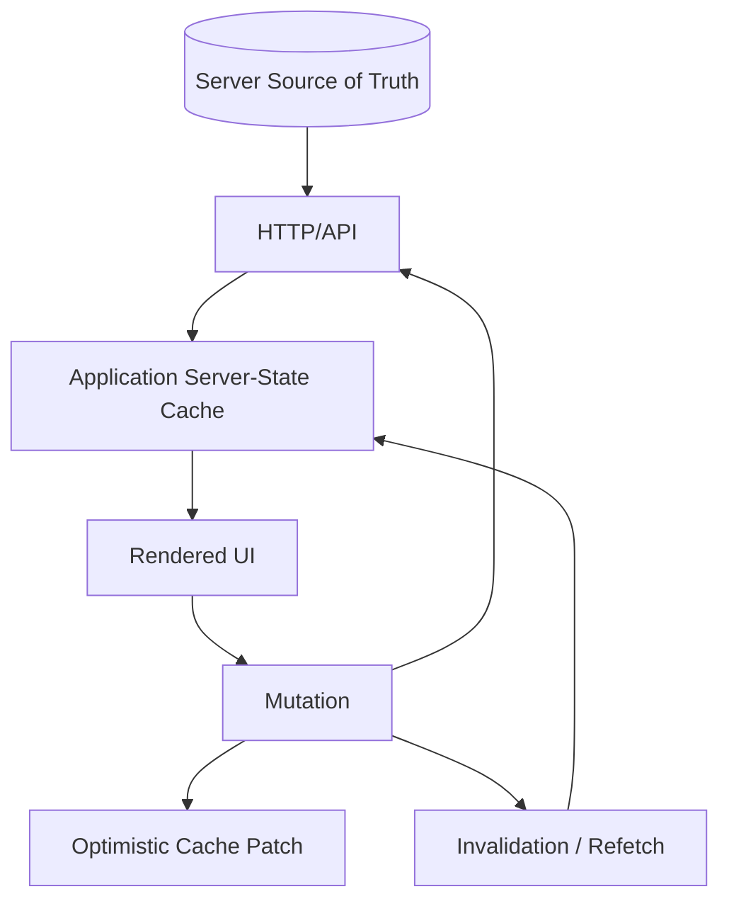
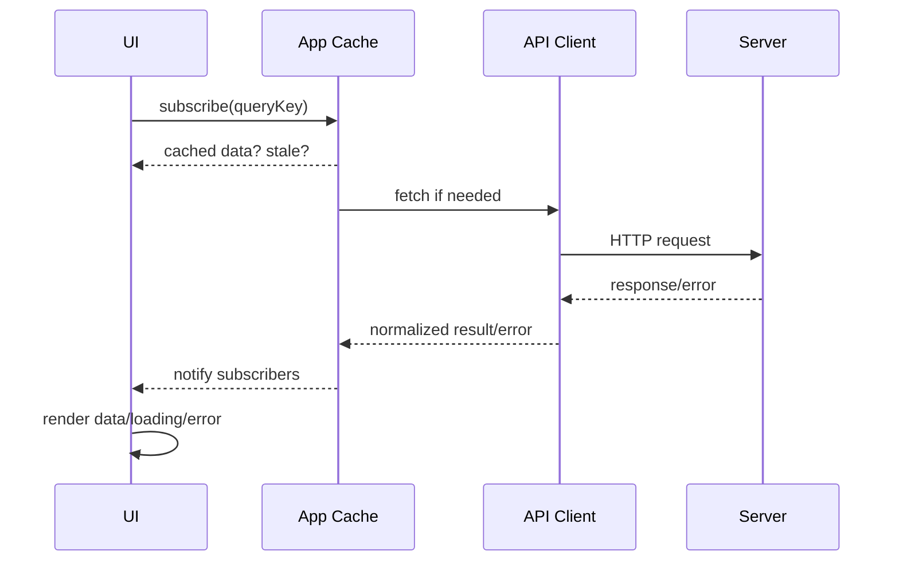
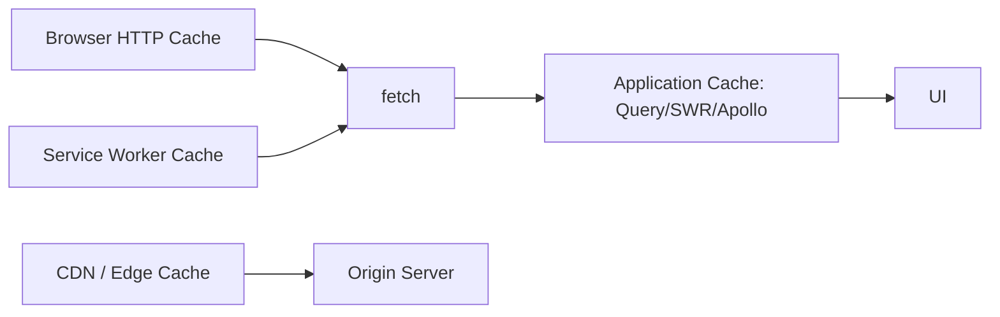
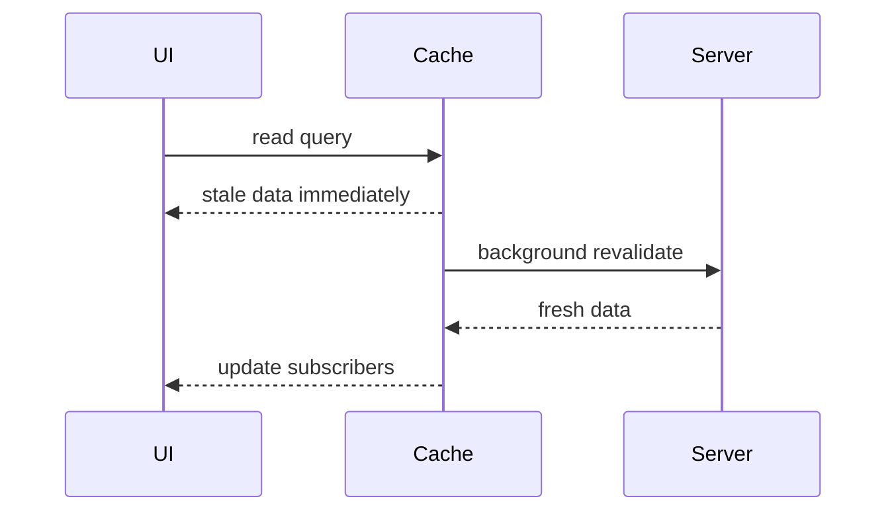
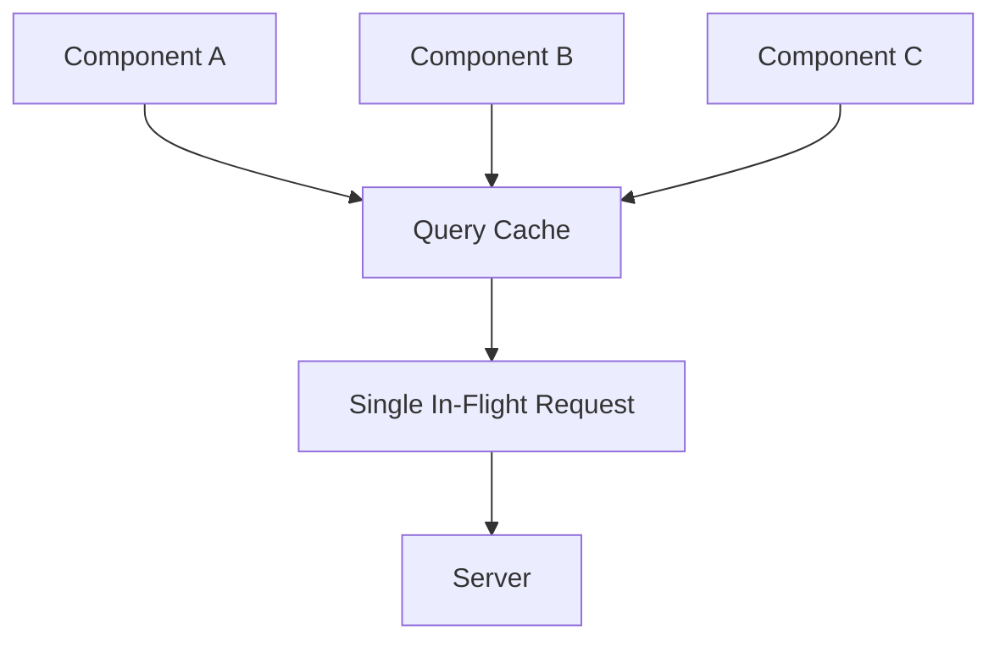
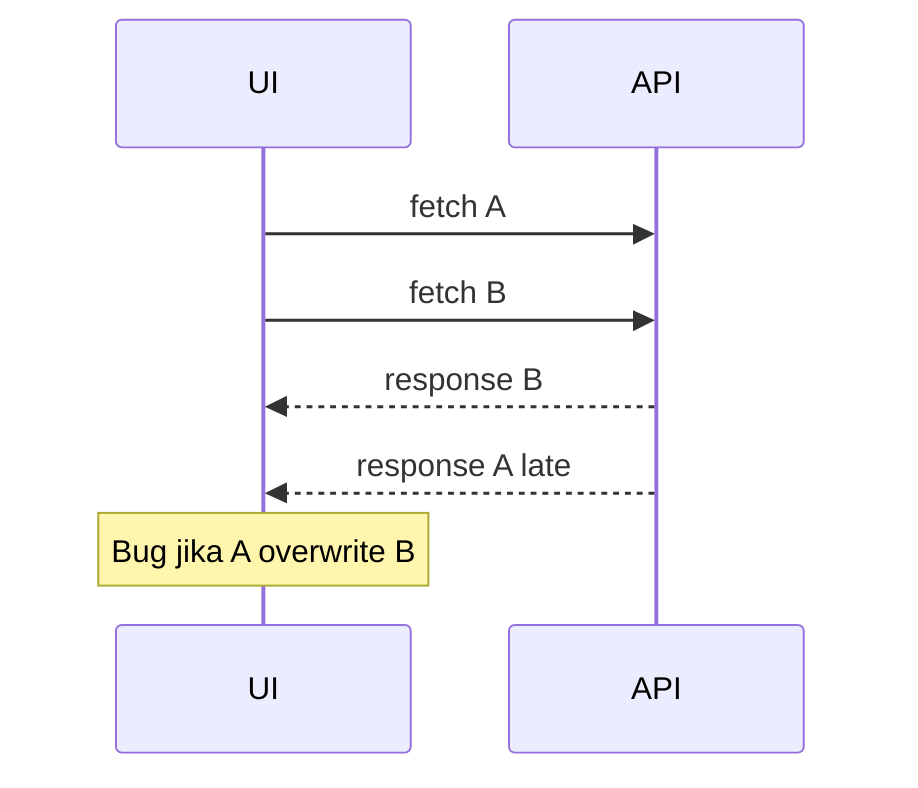
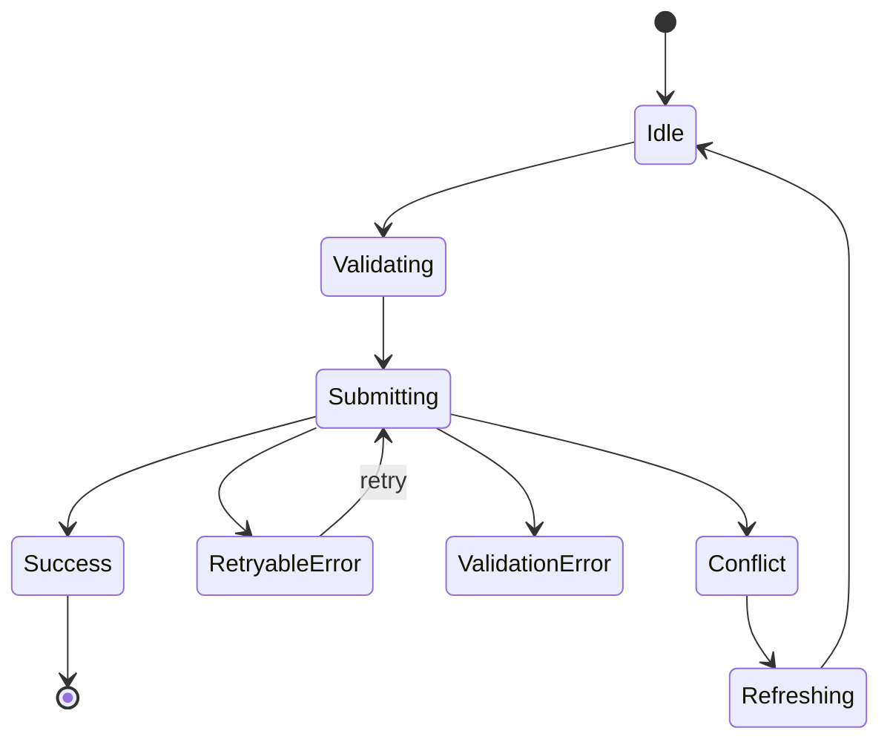
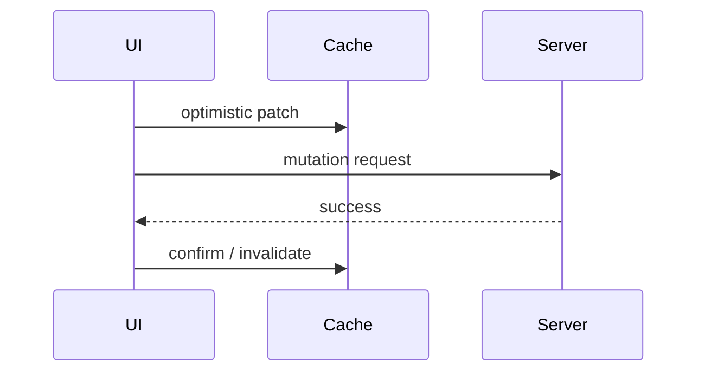
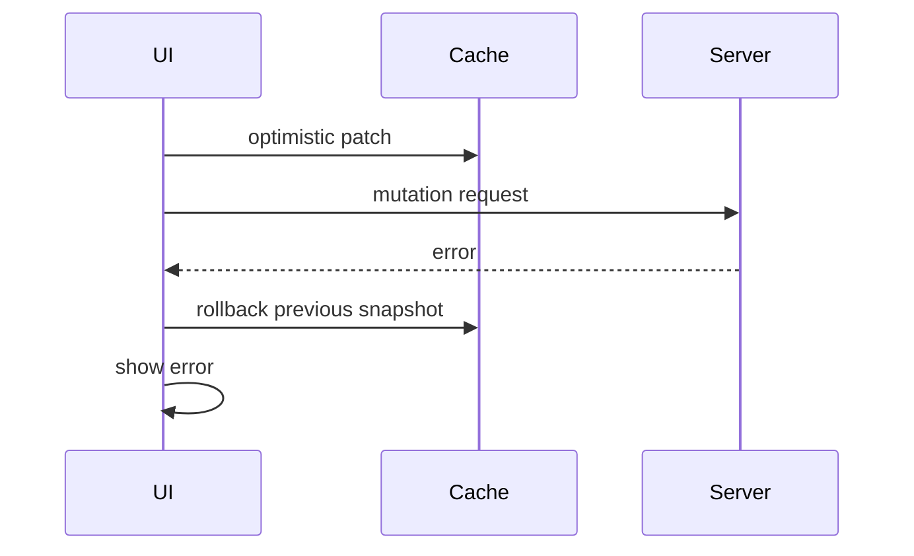
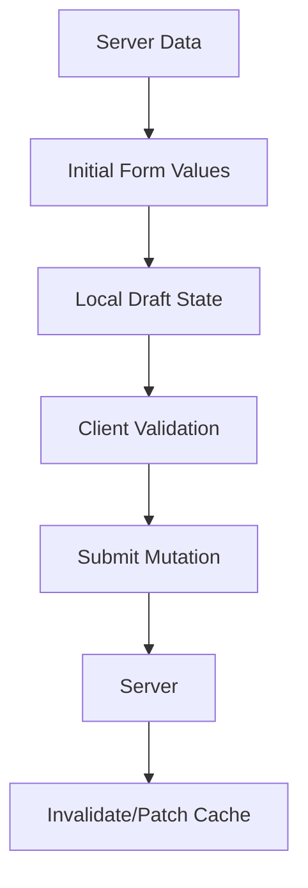

------
title: Learn Advanced JavaScript for Web / Frontend Engineering - Part 014
description: Data fetching, cache, and consistency for production frontend systems: HTTP cache, application cache, server state, invalidation, optimistic updates, concurrency, and failure modes.
series: learn-javascript-frontend-advanced
seriesTitle: Learn Advanced JavaScript for Web / Frontend Engineering
order: 14
partTitle: Data Fetching, Cache, and Consistency
tags:
- javascript
- frontend
- data-fetching
- cache
- consistency
- http
- tanstack-query
- kaufman
- series
date: 2026-06-27
---

# Part 014 — Data Fetching, Cache, and Consistency

> Target utama part ini: mampu mendesain data layer frontend yang cepat, benar, bisa dipulihkan dari error, tidak mudah race, dan tidak membuat UI berbohong kepada user. Kita tidak hanya belajar `fetch()`. Kita belajar **data consistency as a frontend engineering problem**.

Pada aplikasi kecil, data fetching terlihat sederhana:

```ts
const response = await fetch('/api/cases');
const cases = await response.json();
```

Pada aplikasi production, pertanyaannya berubah:

- data ini milik siapa?
- kapan data dianggap fresh?
- siapa yang boleh mengubah cache?
- apa yang terjadi kalau request lama selesai setelah request baru?
- bagaimana invalidasi setelah mutation?
- bagaimana optimistic update di-rollback?
- apakah data boleh stale?
- apakah loading state lokal atau global?
- apakah error retryable?
- apakah user melihat data yang konsisten dengan permission dan workflow?

Frontend modern banyak berurusan dengan **server state**: data yang dimiliki server, tetapi disalin sementara ke browser untuk ditampilkan, difilter, dimutasi, dan di-cache. Server state berbeda dari local UI state karena memiliki freshness, ownership, synchronization, invalidation, dan concurrency problem.

---

## 1. Kaufman Skill Deconstruction

Skill “data fetching, cache, and consistency” kita pecah menjadi sub-skill yang bisa dilatih.

| Sub-skill | Yang harus bisa dilakukan | Bukti penguasaan |
|---|---|---|
| Fetch lifecycle | Mendesain request dari trigger sampai cleanup | sequence diagram |
| HTTP semantics | Memahami status code, method, header, cache-control | network debugging |
| Cache taxonomy | Membedakan browser cache, CDN cache, app cache, memory cache | cache map |
| Server state modeling | Memisahkan server state dari local/derived state | state ownership table |
| Invalidation | Menentukan query mana yang stale setelah mutation | invalidation matrix |
| Optimistic update | Mendesain update sementara dan rollback | mutation state machine |
| Race control | Menghindari stale response overwrite | cancellation / request id |
| Error strategy | Membedakan retryable, validation, permission, conflict | error taxonomy |
| Consistency trade-off | Memilih strong-ish vs eventual UI consistency | decision record |

Skill ini berhasil jika kamu bisa melihat sebuah layar data-heavy dan menjawab:

> “Data mana yang authoritative, cache mana yang boleh stale, mutation mana yang harus invalidate apa, dan failure mode apa yang paling berbahaya?”

---

## 2. Mental Model: Server State Bukan Local State

Local UI state:

- owned by browser/component;
- ephemeral;
- tidak butuh synchronization dengan server;
- contoh: modal open, tab aktif, hover, local draft.

Server state:

- owned by server;
- fetched asynchronously;
- bisa stale;
- bisa berubah tanpa user saat ini;
- shared dengan user/session lain;
- punya latency dan failure;
- contoh: case list, profile, invoice, workflow status, permission, notifications.

Derived state:

- dihitung dari source state;
- sebaiknya tidak disimpan kecuali ada alasan performa/UX;
- contoh: filtered list, status label, total count dari data loaded.

Diagram:



Kesalahan paling umum:

> Menyalin server state ke local component state, lalu lupa menjaga sinkronisasinya.

Contoh buruk:

```tsx
const { data: caseData } = useCase(caseId);
const [caseStatus, setCaseStatus] = useState(caseData?.status);
```

Ini rawan drift. Kalau `caseData` berubah, `caseStatus` belum tentu ikut.

Lebih baik:

```tsx
const { data: caseData } = useCase(caseId);
const caseStatus = caseData?.status;
```

Kalau butuh editable draft, beri nama eksplisit:

```tsx
const [draftStatus, setDraftStatus] = useState<CaseStatus | null>(null);
```

Nama `draft` membuat ownership lebih jelas.

---

## 3. Fetch Lifecycle

Data fetching production bukan hanya “request lalu render”. Minimal lifecycle:



State yang perlu dimodelkan:

| State | Arti |
|---|---|
| idle | belum mulai atau disabled |
| loading initial | belum ada data, sedang fetch |
| success fresh | ada data dan masih fresh |
| success stale | ada data, tapi perlu revalidate |
| refetching | ada data lama, sedang fetch baru |
| error no data | request gagal dan belum ada fallback data |
| error with stale data | request gagal tapi data lama masih bisa ditampilkan |
| paused/offline | request ditunda karena kondisi runtime |

UI yang matang membedakan `loading initial` dan `refetching`. Kalau setiap refetch membuat full-page spinner, UX terasa buruk.

---

## 4. HTTP Method dan Safety

HTTP method punya semantic yang mempengaruhi cache dan retry.

| Method | Umum dipakai untuk | Safe? | Idempotent? | Catatan frontend |
|---|---|---:|---:|---|
| GET | membaca data | yes | yes | cacheable tergantung header |
| HEAD | membaca metadata | yes | yes | jarang dipakai UI biasa |
| POST | membuat aksi/resource | no | no by default | hati-hati retry |
| PUT | replace resource | no | yes | bisa retry jika idempotency jelas |
| PATCH | partial update | no | not guaranteed | conflict handling penting |
| DELETE | hapus resource | no | yes secara semantic | UX confirmation sering perlu |

Catatan penting: “idempotent” bukan berarti aman secara bisnis. DELETE dua kali bisa menghasilkan respons berbeda, tetapi state akhir sama. Namun UI tetap harus menangani 404/410/409 dengan benar.

---

## 5. HTTP Cache vs Application Cache

Ada beberapa cache yang berbeda.



### 5.1 Browser HTTP Cache

Dikontrol oleh header seperti:

- `Cache-Control`;
- `ETag`;
- `Last-Modified`;
- `Expires`;
- `Vary`.

HTTP cache bagus untuk static asset dan beberapa response GET. Namun untuk data user-specific, perlu hati-hati.

Contoh static asset:

```http
Cache-Control: public, max-age=31536000, immutable
```

Contoh sensitive user data:

```http
Cache-Control: no-store
```

### 5.2 Application Cache

Application cache adalah cache di level aplikasi JavaScript. Contoh konsep:

- query key;
- stale time;
- garbage collection time;
- refetch on focus;
- invalidation;
- optimistic update;
- background refetch.

Library seperti TanStack Query, SWR, Apollo Client, Relay, RTK Query, atau framework cache membantu mengelola server state. Namun mental model-nya tetap harus dipahami.

### 5.3 Service Worker Cache

Service worker cache berguna untuk:

- offline-first app;
- asset caching;
- API caching dengan strategi eksplisit;
- background sync;
- progressive web app.

Namun service worker juga bisa membuat debugging sulit jika tidak ada versioning dan invalidation strategy yang jelas.

---

## 6. Freshness, Staleness, and Revalidation

Data cache bukan hanya “ada” atau “tidak ada”. Data punya freshness.

| Kondisi | Arti | UI strategy |
|---|---|---|
| fresh | masih dalam window freshness | render langsung |
| stale | boleh ditampilkan tapi perlu revalidate | render + background refetch |
| expired | tidak boleh dipercaya | block atau refetch sebelum render |
| invalidated | diketahui berubah | refetch atau patch |
| optimistic | asumsi sementara | tampilkan pending affordance |

### 6.1 stale-while-revalidate

Pattern `stale-while-revalidate`:

1. tampilkan data cached walau stale;
2. fetch data baru di background;
3. update UI saat data baru datang.

Diagram:



Pattern ini cocok untuk:

- dashboard;
- list data;
- profile non-kritis;
- notification count;
- search result cached;
- page yang butuh perceived performance tinggi.

Tidak cocok untuk:

- final approval sebelum aksi hukum/regulatori;
- payment confirmation;
- permission enforcement;
- data yang harus fresh sebelum mutation kritis.

Untuk aksi kritis, lakukan revalidation eksplisit sebelum commit atau gunakan backend conflict control.

---

## 7. Query Key sebagai Identitas Cache

Application cache biasanya memakai query key.

Contoh:

```ts
const caseListKey = ['cases', { status: 'open', assignee: 'me' }];
const caseDetailKey = ['case', caseId];
```

Query key harus merepresentasikan semua input yang mempengaruhi hasil.

Buruk:

```ts
useQuery({
  queryKey: ['cases'],
  queryFn: () => fetchCases({ status, assignee, page }),
});
```

Kalau `status`, `assignee`, atau `page` berubah, key tetap sama. Cache bisa salah.

Baik:

```ts
useQuery({
  queryKey: ['cases', { status, assignee, page }],
  queryFn: () => fetchCases({ status, assignee, page }),
});
```

### 7.1 Query Key Factory

Untuk codebase besar, buat query key factory.

```ts
export const caseKeys = {
  all: ['cases'] as const,
  lists: () => [...caseKeys.all, 'list'] as const,
  list: (filters: CaseFilters) => [...caseKeys.lists(), filters] as const,
  details: () => [...caseKeys.all, 'detail'] as const,
  detail: (caseId: CaseId) => [...caseKeys.details(), caseId] as const,
};
```

Manfaat:

- invalidation lebih aman;
- key tidak tersebar;
- refactor lebih mudah;
- naming cache konsisten.

---

## 8. Request Deduplication

Jika tiga component butuh data yang sama, jangan kirim tiga request identik.



Deduplication mencegah:

- network waste;
- race condition;
- inconsistent UI;
- duplicated loading states.

Application cache biasanya menangani ini jika query key sama. Kalau query key tidak stabil, deduplication gagal.

---

## 9. Race Conditions dalam Fetching

Race paling umum:

1. user memilih case A;
2. request A dimulai;
3. user cepat memilih case B;
4. request B dimulai;
5. request B selesai;
6. request A selesai belakangan dan overwrite UI.

Diagram:



Solusi:

### 9.1 Abort Previous Request

```ts
let currentController: AbortController | null = null;

async function loadCase(caseId: string) {
  currentController?.abort();
  currentController = new AbortController();

  const response = await fetch(`/api/cases/${caseId}`, {
    signal: currentController.signal,
  });

  return response.json();
}
```

### 9.2 Request Token

```ts
let requestSeq = 0;

async function loadCase(caseId: string) {
  const seq = ++requestSeq;
  const data = await fetchCase(caseId);

  if (seq !== requestSeq) {
    return; // stale response ignored
  }

  render(data);
}
```

### 9.3 Cache Key Isolation

Jika memakai server-state cache, pastikan detail A dan B punya key berbeda:

```ts
useQuery({
  queryKey: ['case', caseId],
  queryFn: () => fetchCase(caseId),
});
```

---

## 10. Loading State Design

Loading state buruk:

```tsx
if (isLoading) return <Spinner />;
if (error) return <Error />;
return <Table data={data} />;
```

Ini terlalu kasar.

Loading state production membedakan:

| Kondisi | UI |
|---|---|
| initial load no data | skeleton/page loader |
| refetch with data | subtle progress indicator |
| pagination load | row skeleton atau button loading |
| mutation pending | disable target action, not whole page |
| offline | offline banner + queued state |
| slow request | delayed spinner agar tidak flicker |

Contoh:

```tsx
if (query.isPending) {
  return <CaseListSkeleton />;
}

if (query.isError && !query.data) {
  return <CaseListError onRetry={query.refetch} />;
}

return (
  <CaseListLayout>
    {query.isFetching && <InlineRefreshIndicator />}
    {query.isError && query.data && <StaleDataWarning onRetry={query.refetch} />}
    <CaseTable cases={query.data ?? []} />
  </CaseListLayout>
);
```

---

## 11. Error Taxonomy

Jangan semua error menjadi “Something went wrong”.

| Error kind | Contoh | UX |
|---|---|---|
| network | offline, timeout, DNS | retry, offline message |
| timeout | server lambat | retry/backoff, trace ID |
| validation | invalid input | field-level message |
| permission | 401/403 | re-auth atau forbidden state |
| not found | 404 | empty/deleted state |
| conflict | 409 | refresh/merge/conflict UI |
| rate limit | 429 | wait/retry after |
| server | 500 | retry, support info |
| parse/contract | unexpected shape | safe fallback + telemetry |

Typed error membantu UI membuat keputusan.

```ts
export type AppError =
  | { kind: 'network'; retryable: true }
  | { kind: 'timeout'; retryable: true }
  | { kind: 'validation'; fieldErrors: Record<string, string> }
  | { kind: 'permission'; action: string }
  | { kind: 'not-found'; resource: string }
  | { kind: 'conflict'; serverVersion?: string }
  | { kind: 'rate-limit'; retryAfterMs?: number }
  | { kind: 'server'; traceId?: string; retryable: boolean }
  | { kind: 'contract'; traceId?: string };
```

---

## 12. Retry Strategy

Retry bukan selalu benar.

Retry cocok untuk:

- transient network error;
- 502/503/504;
- timeout;
- idempotent GET;
- mutation dengan idempotency key.

Retry berbahaya untuk:

- payment POST tanpa idempotency;
- destructive action;
- validation error;
- permission error;
- conflict error.

### 12.1 Exponential Backoff with Jitter

```ts
function getRetryDelay(attempt: number): number {
  const base = Math.min(1000 * 2 ** attempt, 30_000);
  const jitter = Math.random() * 300;
  return base + jitter;
}
```

Jitter menghindari banyak client retry bersamaan.

### 12.2 Idempotency Key

Untuk mutation penting, backend sebaiknya mendukung idempotency key.

```ts
await fetch('/api/payments', {
  method: 'POST',
  headers: {
    'Idempotency-Key': crypto.randomUUID(),
    'Content-Type': 'application/json',
  },
  body: JSON.stringify(input),
});
```

Tanpa idempotency, retry mutation bisa membuat double submit.

---

## 13. Mutation Lifecycle

Mutation bukan hanya POST lalu selesai.



Tahap mutation:

1. validate client-side;
2. optionally revalidate server state;
3. submit request;
4. apply optimistic update atau wait;
5. handle success;
6. invalidate affected queries;
7. handle failure/rollback;
8. show final state.

---

## 14. Invalidation Matrix

Setiap mutation harus punya invalidation plan.

Contoh domain case management:

| Mutation | Patch langsung | Invalidate |
|---|---|---|
| `assignCase(caseId, userId)` | case detail assignee | case detail, case list, assignee workload |
| `closeCase(caseId)` | case detail status | case detail, open case list, metrics, audit timeline |
| `addNote(caseId)` | note list append | case timeline, activity feed |
| `approveAction(actionId)` | action status | action detail, case detail, pending approvals list |
| `bulkEscalate(ids)` | maybe none | all affected lists, dashboard metrics |

Tanpa matrix, invalidation akan reaktif dan sering salah.

### 14.1 Broad vs Targeted Invalidation

Broad invalidation:

```ts
queryClient.invalidateQueries({ queryKey: ['cases'] });
```

Kelebihan:

- simple;
- aman untuk correctness;
- cocok saat data kecil.

Kekurangan:

- banyak refetch;
- performance buruk;
- flicker;
- server load tinggi.

Targeted invalidation:

```ts
queryClient.invalidateQueries({ queryKey: caseKeys.detail(caseId) });
queryClient.invalidateQueries({ queryKey: caseKeys.lists() });
```

Kelebihan:

- lebih efisien;
- UX lebih stabil.

Kekurangan:

- butuh domain knowledge;
- mudah lupa query terkait.

Rule praktis:

> Untuk correctness awal, broad invalidation acceptable. Untuk skala dan performance, pindah ke invalidation matrix yang eksplisit.

---

## 15. Optimistic Updates

Optimistic update membuat UI terasa cepat dengan mengubah cache sebelum server sukses.

Contoh:



Jika gagal:



### 15.1 Kapan Optimistic Update Cocok?

Cocok:

- like/unlike;
- toggle preference;
- mark as read;
- local reorder;
- non-critical simple mutation.

Hati-hati:

- approval workflow;
- payment;
- legal/regulatory action;
- permission-sensitive action;
- mutation dengan complex side effects;
- bulk operation.

Untuk domain enforcement atau case management, optimistic update harus selektif. UI tidak boleh memberi ilusi bahwa aksi regulatori sudah final jika server belum commit.

### 15.2 Pending Affordance

Optimistic bukan berarti menyembunyikan pending state.

```tsx
<CaseStatusBadge status="closed" pending>
  Closing…
</CaseStatusBadge>
```

Pending affordance penting agar user tidak salah memahami state.

---

## 16. Conflict Handling

Conflict terjadi saat client melakukan mutation berdasarkan data yang sudah stale.

Contoh:

1. user A membuka case pending;
2. user B menutup case;
3. user A mencoba approve;
4. server mengembalikan 409 conflict.

UI yang baik:

- tidak hanya menampilkan generic error;
- refresh data terbaru;
- jelaskan state berubah;
- tawarkan action yang valid sekarang.

```tsx
<ConflictPanel
  title="Case changed while you were reviewing it"
  description="This case was closed by another user. Approval is no longer available."
  action={<Button onClick={refresh}>Refresh case</Button>}
/>
```

Backend idealnya menyediakan:

- version number;
- ETag;
- updatedAt;
- conflict reason;
- latest resource state.

---

## 17. Pagination, Infinite Scroll, and Consistency

Pagination bukan hanya UI pattern. Ia mempengaruhi consistency.

### 17.1 Offset Pagination

```http
GET /cases?page=3&pageSize=20
```

Masalah:

- item bisa pindah halaman saat data baru masuk;
- duplicate/missing item;
- tidak stabil untuk list yang sering berubah.

### 17.2 Cursor Pagination

```http
GET /cases?after=cursor123&limit=20
```

Lebih stabil untuk feed/list dinamis.

### 17.3 Infinite Scroll Failure Modes

- duplicate item;
- gap antar halaman;
- filter berubah tapi page lama masih muncul;
- scroll restoration buruk;
- memory membesar karena semua page disimpan;
- refetch semua page terlalu mahal;
- mutation tidak update semua page terkait.

Checklist:

- query key mencakup filter/sort;
- cursor disimpan per filter;
- item punya stable ID;
- duplicate dedupe by ID;
- memory cap untuk infinite pages;
- empty state berbeda dari end-of-list.

---

## 18. Search and Debounced Fetching

Search UI sering rawan race dan waste.

Pattern buruk:

```tsx
useEffect(() => {
  fetch(`/api/search?q=${query}`).then(...);
}, [query]);
```

Setiap keypress request.

Pattern lebih baik:

- debounce input;
- minimum query length;
- abort previous request;
- query key mencakup query;
- tampilkan stale results saat query baru loading jika sesuai;
- bedakan “no query”, “no result”, dan “loading”.

```ts
const debouncedQuery = useDebouncedValue(query, 300);

const resultsQuery = useQuery({
  queryKey: ['search', debouncedQuery],
  queryFn: ({ signal }) => searchCases(debouncedQuery, { signal }),
  enabled: debouncedQuery.length >= 3,
});
```

---

## 19. Dependent Queries

Beberapa data bergantung pada data lain.

Contoh:

```ts
const caseQuery = useCase(caseId);
const actionsQuery = useCaseActions(caseQuery.data?.workflowId, {
  enabled: Boolean(caseQuery.data?.workflowId),
});
```

Failure mode:

- dependent query jalan dengan `undefined`;
- stale parent membuat child salah;
- child cache tidak invalidated saat parent berubah;
- loading state tidak jelas.

Prinsip:

- dependency harus eksplisit;
- query key child mencakup input final;
- disabled state harus punya UI meaningful;
- parent mutation harus invalidate child jika input berubah.

---

## 20. Data Normalization

Ada dua pendekatan cache:

1. document/query cache;
2. normalized entity cache.

### 20.1 Query Cache

Data disimpan per query.

```text
['cases', { status: 'open' }] -> [case1, case2]
['case', case1] -> case1 detail
```

Sederhana, cocok untuk banyak aplikasi.

Kelemahan: entity yang sama bisa muncul di beberapa query dan perlu invalidation/patch manual.

### 20.2 Normalized Cache

Data disimpan by entity ID.

```text
Case:1 -> {...}
Case:2 -> {...}
List(open) -> [1,2]
```

Kuat untuk GraphQL/relational data kompleks. Namun lebih sulit dipahami dan di-debug.

Rule praktis:

- gunakan query cache untuk kebanyakan REST frontend;
- gunakan normalized cache jika graph data kompleks dan entity sharing intens;
- jangan membangun normalized cache sendiri tanpa kebutuhan kuat.

---

## 21. Cache and Authorization

Data cache harus memperhatikan identity dan permission.

Bahaya:

- user logout/login lain tetapi cache lama masih tampil;
- permission berubah tetapi UI masih menunjukkan action lama;
- shared browser session menampilkan data sensitive;
- cache key tidak memasukkan tenant/organization;
- HTTP cache menyimpan private response.

Checklist:

- clear application cache on logout;
- query key memasukkan tenant/org jika mempengaruhi hasil;
- permission query punya stale policy konservatif;
- sensitive response pakai `Cache-Control: no-store` jika perlu;
- route guard tidak menggantikan server authorization;
- UI authorization hanya UX, bukan security boundary final.

---

## 22. Cache and Multi-Tenancy

Jika aplikasi multi-tenant, query key harus tenant-aware.

Buruk:

```ts
['cases', filters]
```

Jika user pindah tenant, cache bisa bercampur.

Baik:

```ts
['tenant', tenantId, 'cases', filters]
```

Atau clear cache saat tenant switch.

Untuk domain regulatori, tenant/agency/jurisdiction sering mempengaruhi data visibility. Treat it as part of cache identity.

---

## 23. Real-Time and Polling

Data bisa berubah tanpa user melakukan aksi.

Strategi:

| Strategi | Cocok untuk | Trade-off |
|---|---|---|
| manual refresh | data jarang berubah | user effort |
| refetch on focus | dashboard/list | good default |
| polling | status progress, queue | server load |
| long polling | event-ish system | complexity |
| WebSocket | collaboration/live updates | lifecycle complexity |
| Server-Sent Events | one-way updates | simpler than WS for feeds |

### 23.1 Polling Failure Modes

- polling tetap jalan saat tab hidden;
- polling semua user bersamaan;
- polling response 404/500 terlalu sering;
- tidak ada backoff;
- tidak stop setelah terminal state;
- memory leak dari interval.

Pattern:

```ts
useQuery({
  queryKey: ['case-status', caseId],
  queryFn: fetchCaseStatus,
  refetchInterval: (query) => {
    const status = query.state.data?.status;
    return status === 'processing' ? 5_000 : false;
  },
});
```

---

## 24. Offline and Queued Mutations

Offline support bukan sekadar “cache data”. Jika user bisa mutate saat offline, perlu queue.

Mutation queue harus menyimpan:

- operation type;
- payload;
- idempotency key;
- timestamp;
- retry count;
- dependency order;
- rollback/compensation strategy;
- conflict handling.

Untuk aplikasi regulatori, offline mutation harus sangat hati-hati. Beberapa aksi mungkin tidak boleh dilakukan offline karena perlu fresh permission/state.

Rule:

> Offline read bisa luas. Offline write harus dibatasi pada aksi yang punya conflict model jelas.

---

## 25. Data Fetching and Rendering Strategy

Data fetching dipengaruhi rendering mode:

| Rendering mode | Data fetching concern |
|---|---|
| SPA | client fetch, cache hydration optional |
| SSR | server fetch, serialize data, avoid double fetch |
| SSG | build-time data, revalidation strategy |
| ISR | stale generated page + background regeneration |
| RSC | server component fetch boundary |
| streaming SSR | partial data arrival and suspense boundaries |

Masalah umum:

- server fetch dan client fetch double;
- stale server-rendered HTML di-hydrate dengan data berbeda;
- cache policy server dan client tidak konsisten;
- user-specific data tercache sebagai public;
- suspense boundary terlalu kasar.

Part 017 dan 018 akan membahas rendering lebih dalam. Di sini cukup pahami bahwa data layer tidak independen dari rendering architecture.

---

## 26. Suspense and Data Fetching

Suspense mengubah cara loading state dikomposisi.

Tanpa Suspense:

```tsx
if (query.isPending) return <Spinner />;
return <CaseDetail data={query.data} />;
```

Dengan Suspense:

```tsx
<Suspense fallback={<CaseDetailSkeleton />}>
  <CaseDetail caseId={caseId} />
</Suspense>
```

Namun Suspense bukan pengganti error taxonomy, cache invalidation, atau mutation design. Suspense membantu rendering pending state, bukan menyelesaikan consistency problem.

---

## 27. Form Submission and Server State

Form sering menjadi pertemuan local draft state dan server state.

Model:



Failure modes:

- initial data berubah saat user sedang edit;
- submit memakai stale version;
- server validation berbeda dari client validation;
- user double submit;
- draft hilang saat navigation;
- autosave race;
- optimistic update menampilkan data yang ditolak server.

Pattern:

- simpan `version`/`updatedAt` jika ada;
- disable submit saat pending;
- gunakan idempotency untuk aksi penting;
- tampilkan conflict jika server version berubah;
- pisahkan draft dan server state dengan nama eksplisit.

---

## 28. Observability for Data Layer

Data layer perlu observability.

Log/telemetry yang berguna:

- endpoint/query name;
- duration;
- status code;
- retry count;
- cache hit/miss;
- stale render count;
- abort count;
- error kind;
- trace/correlation ID;
- user action that triggered request.

Jangan log PII/sensitive payload sembarangan.

Example event:

```ts
telemetry.track('api.request.completed', {
  queryName: 'case.detail',
  status: 200,
  durationMs: 182,
  cacheHit: false,
  retryCount: 0,
  traceId,
});
```

---

## 29. Data Layer Architecture Template

Contoh struktur:

```text
features/case-management/
  api/
    case-dto.ts
    case-schema.ts
    case-mapper.ts
    case-gateway.ts
  model/
    case.ts
    case-keys.ts
    case-errors.ts
    case-permissions.ts
    use-case-detail.ts
    use-case-list.ts
    use-close-case.ts
  ui/
    CaseDetailPage.tsx
    CaseListPage.tsx
    CloseCaseButton.tsx
```

`case-gateway.ts`:

```ts
export async function getCase(caseId: CaseId, options?: { signal?: AbortSignal }): Promise<Case> {
  const json = await http.get(`/cases/${caseId}`, { signal: options?.signal });
  const dto = CaseDtoSchema.parse(json);
  return mapCaseDto(dto);
}
```

`case-keys.ts`:

```ts
export const caseKeys = {
  all: ['cases'] as const,
  lists: () => [...caseKeys.all, 'list'] as const,
  list: (filters: CaseFilters) => [...caseKeys.lists(), filters] as const,
  details: () => [...caseKeys.all, 'detail'] as const,
  detail: (caseId: CaseId) => [...caseKeys.details(), caseId] as const,
};
```

`use-case-detail.ts`:

```ts
export function useCaseDetail(caseId: CaseId) {
  return useQuery({
    queryKey: caseKeys.detail(caseId),
    queryFn: ({ signal }) => getCase(caseId, { signal }),
    staleTime: 30_000,
  });
}
```

`use-close-case.ts`:

```ts
export function useCloseCase() {
  const queryClient = useQueryClient();

  return useMutation({
    mutationFn: closeCase,
    onSuccess: (_, input) => {
      queryClient.invalidateQueries({ queryKey: caseKeys.detail(input.caseId) });
      queryClient.invalidateQueries({ queryKey: caseKeys.lists() });
    },
  });
}
```

---

## 30. Consistency Levels for Frontend UX

Tidak semua UI membutuhkan consistency yang sama.

| Level | Deskripsi | Contoh |
|---|---|---|
| Cosmetic stale OK | Data boleh stale cukup lama | avatar, display name |
| Informational stale OK | Data stale boleh tampil dengan refresh | dashboard metrics |
| Action stale risky | Data harus revalidate sebelum action | approve case |
| Strong user-visible | UI harus menunggu commit server | payment, legal submit |
| Conflict-aware collaborative | perubahan user lain harus ditangani | collaborative editing |

Decision rule:

> Semakin besar konsekuensi aksi, semakin konservatif freshness dan optimistic strategy.

Untuk enforcement lifecycle, action seperti escalation, approval, closure, assignment, dan sanction-related workflow harus conflict-aware.

---

## 31. Production Checklist

### 31.1 Query Design

- Query key mencakup semua input.
- Query key tenant/user-aware jika hasil bergantung pada tenant/user.
- Initial loading dan refetching dibedakan.
- Stale data policy eksplisit.
- Query disabled state punya arti jelas.
- Request bisa di-abort saat tidak relevan.

### 31.2 Mutation Design

- Mutation punya lifecycle state.
- Retry policy sesuai idempotency.
- Optimistic update hanya untuk aksi yang aman.
- Rollback tersedia jika optimistic gagal.
- Invalidation matrix jelas.
- Conflict 409 ditangani secara domain-specific.
- Double submit dicegah.

### 31.3 Cache Design

- Browser cache dan app cache tidak dicampur mental model-nya.
- Sensitive data tidak disimpan di cache publik.
- Cache clear saat logout/tenant switch.
- Stale time disesuaikan dengan domain risk.
- Infinite query punya memory strategy.
- Service worker cache punya versioning.

### 31.4 Error and Observability

- Error ditaxonomikan.
- Retryable vs non-retryable jelas.
- Trace ID ditampilkan/log saat relevan.
- Contract parse error dilaporkan.
- Latency dan cache hit/miss bisa diobservasi.

---

## 32. Common Failure Modes

| Failure Mode | Gejala | Perbaikan |
|---|---|---|
| Query key incomplete | filter berubah tapi data lama tampil | masukkan semua input ke key |
| Local copy drift | server data dan local state beda | derive atau beri nama draft |
| Over-invalidating | banyak refetch/flicker | invalidation matrix |
| Under-invalidating | UI menampilkan data stale setelah mutation | invalidate affected queries |
| Optimistic lie | UI menampilkan aksi selesai padahal gagal | pending affordance + rollback |
| Double submit | dua mutation identik | disable pending + idempotency key |
| Race overwrite | response lama overwrite data baru | abort/request token/cache key |
| Permission cache leak | user melihat action/data lama | clear cache + permission stale policy |
| Tenant cache leak | data tenant A muncul di tenant B | tenant-aware query key |
| Generic error UX | semua error sama | typed error taxonomy |
| Polling abuse | server load tinggi | adaptive interval + backoff |

---

## 33. Deliberate Practice

### Latihan 1 — Cache Map

Ambil satu halaman data-heavy. Buat tabel:

| Data | Source | Cache | Freshness | Owner | Invalidated by |
|---|---|---|---|---|---|
| case detail | server | query cache | 30s | case feature | close/assign/update |
| permissions | server | query cache | 5m? | auth | role change/logout |
| active tab | local | component | session | UI | user click |
| filters | URL | router | shareable | route | navigation |

### Latihan 2 — Invalidation Matrix

Pilih 5 mutation. Buat matrix mutation vs affected queries. Tandai mana yang patch langsung dan mana yang refetch.

### Latihan 3 — Race Simulation

Buat mock fetch dengan delay random. Implement search atau detail switcher. Buktikan bug response lama overwrite data baru. Perbaiki dengan abort atau request token.

### Latihan 4 — Optimistic Update with Rollback

Implement toggle `markAsRead`. Simpan snapshot, patch cache, rollback saat gagal, tampilkan pending state.

### Latihan 5 — Conflict Handling

Simulasikan mutation yang mengembalikan 409. Buat UI yang refresh resource dan menjelaskan perubahan state, bukan generic toast.

---

## 34. Baeldung-Style Summary

Data fetching production adalah masalah state synchronization, bukan sekadar request.

Prinsip inti:

- bedakan local state, server state, dan derived state;
- query key adalah identitas cache;
- stale data boleh berguna jika UX dan risk-nya sesuai;
- invalidation harus dirancang, bukan ditebak;
- optimistic update perlu rollback dan pending affordance;
- retry harus mempertimbangkan idempotency;
- race condition harus dicegah dengan abort, request token, atau cache key benar;
- permission/tenant harus menjadi bagian dari cache identity;
- aksi kritis perlu freshness dan conflict handling lebih konservatif.

Kalimat yang harus diingat:

> Frontend data layer yang baik tidak hanya cepat; ia jujur tentang freshness, pending state, error, dan authority.

---

## 35. Self-Assessment

Kamu sudah menguasai part ini jika bisa:

- menjelaskan perbedaan HTTP cache, application cache, service worker cache, dan CDN cache;
- mendesain query key yang benar;
- menentukan stale time berdasarkan risk;
- membuat invalidation matrix;
- membedakan initial loading dan background refetch;
- mendesain optimistic update dengan rollback;
- mencegah race response lama;
- menangani conflict 409 secara domain-specific;
- menghindari tenant/permission cache leak;
- membuat checklist production untuk data-heavy frontend.

---

## 36. References

- MDN — Fetch API: https://developer.mozilla.org/en-US/docs/Web/API/Fetch_API
- MDN — Request.cache: https://developer.mozilla.org/en-US/docs/Web/API/Request/cache
- MDN — Cache-Control: https://developer.mozilla.org/en-US/docs/Web/HTTP/Reference/Headers/Cache-Control
- web.dev — Keeping things fresh with stale-while-revalidate: https://web.dev/articles/stale-while-revalidate
- WHATWG Fetch Standard: https://fetch.spec.whatwg.org/
- TanStack Query Docs — Important Defaults: https://tanstack.com/query/latest/docs/framework/react/guides/important-defaults
- TanStack Query Docs — Query Keys: https://tanstack.com/query/latest/docs/framework/react/guides/query-keys
- TanStack Query Docs — Optimistic Updates: https://tanstack.com/query/latest/docs/framework/react/guides/optimistic-updates
