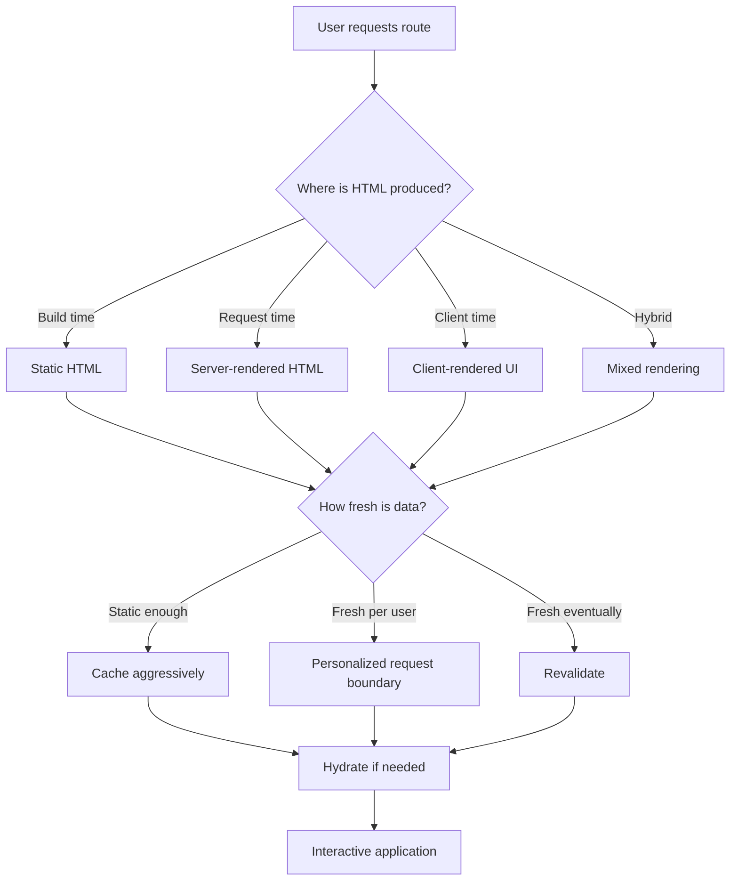
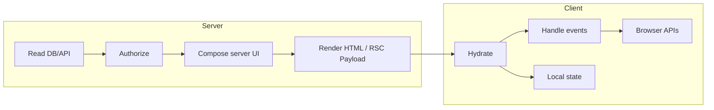
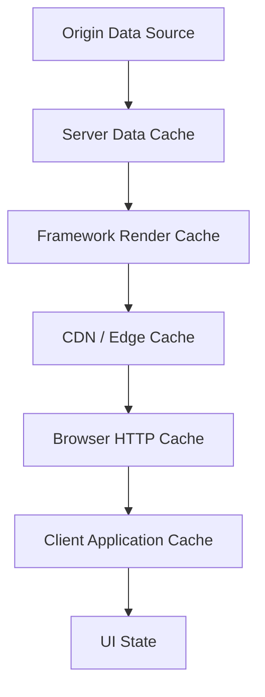
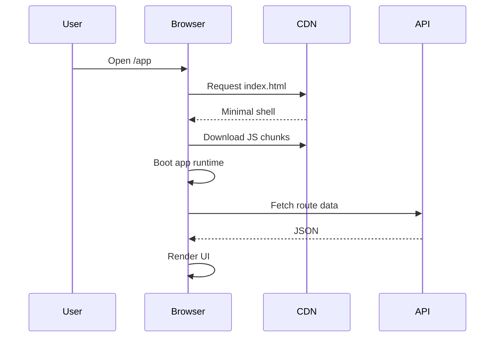
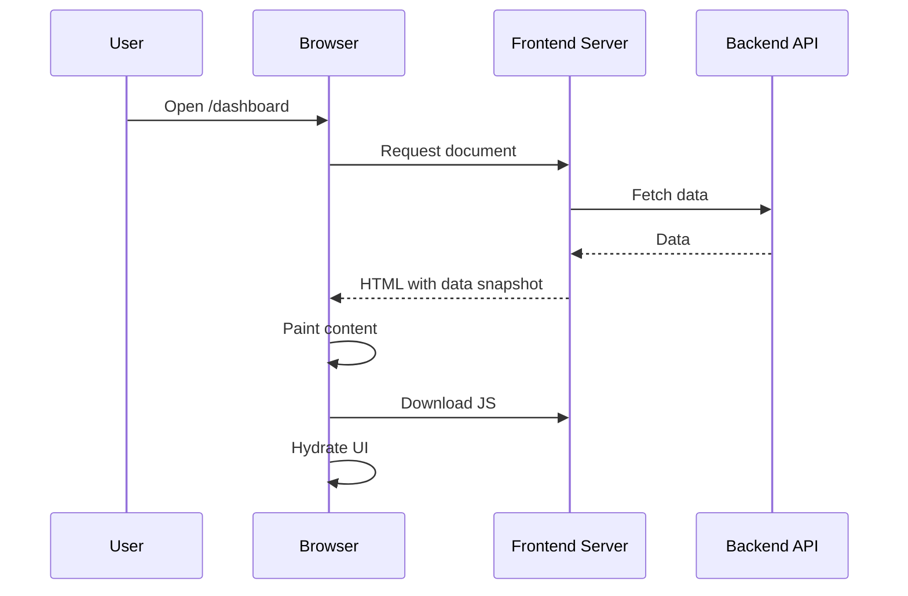
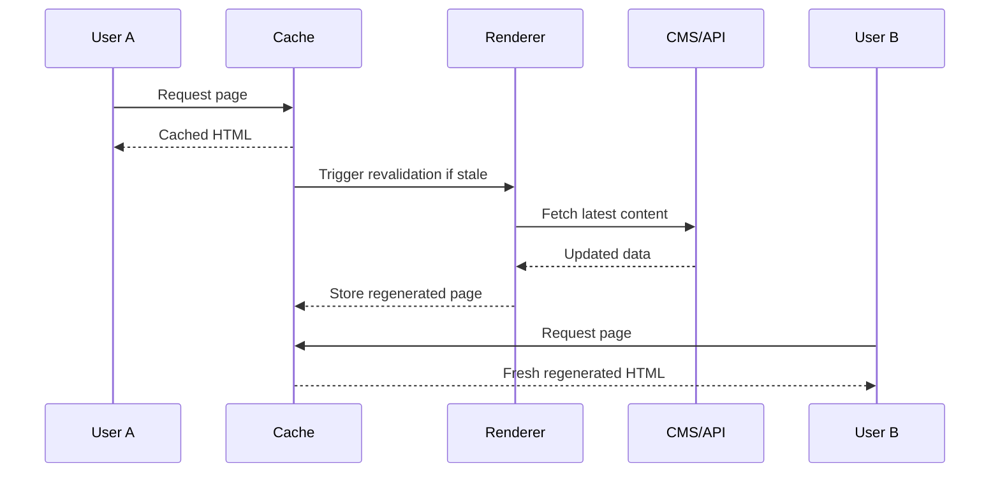
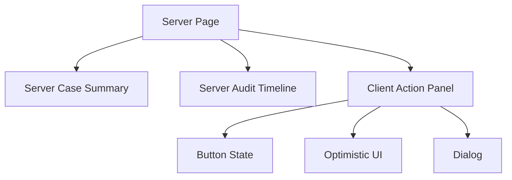

------
title: Learn Advanced JavaScript for Web / Frontend Engineering - Part 017
description: Rendering strategy decision-making across SPA, SSR, SSG, ISR, streaming, and React Server Components for production frontend systems.
series: learn-javascript-frontend-advanced
seriesTitle: Learn Advanced JavaScript for Web / Frontend Engineering
order: 17
partTitle: Rendering Strategies: SPA, SSR, SSG, ISR, RSC
tags:
  - javascript
  - frontend
  - rendering
  - spa
  - ssr
  - ssg
  - isr
  - rsc
  - nextjs
  - architecture
  - series
date: 2026-06-27
---

# Part 017 — Rendering Strategies: SPA, SSR, SSG, ISR, RSC

> Target part ini: kamu mampu memilih strategi rendering berdasarkan **source of truth, freshness, interactivity, latency, cacheability, security boundary, operational cost, dan failure mode**, bukan berdasarkan framework hype.

Di level basic, rendering sering dipahami sebagai “React/Vue/Svelte menampilkan UI”. Di level production, rendering adalah keputusan sistemik: kapan HTML dibuat, di mana data diambil, siapa yang mengeksekusi kode, kapan JavaScript dikirim, kapan UI menjadi interaktif, bagaimana cache bekerja, dan bagaimana kegagalan terlihat ke user.

Frontend engineer top-tier tidak bertanya, “Harus pakai SSR atau SPA?” Pertanyaannya lebih tajam:

- bagian mana dari halaman yang harus punya HTML cepat?
- bagian mana yang harus fresh per request?
- bagian mana yang bisa static?
- bagian mana yang personalized dan tidak boleh cache bocor?
- bagian mana yang butuh interactivity segera?
- bagian mana yang bisa menunggu hydration?
- bagian mana yang sebaiknya tidak pernah masuk client bundle?
- bagian mana yang harus stream agar user tidak menunggu slow dependency?

Rendering strategy adalah **architecture boundary**.

---

## 1. Kaufman Skill Framing

Berdasarkan pendekatan Josh Kaufman, kita pecah skill “menguasai rendering frontend modern” menjadi sub-skill kecil yang bisa dilatih secara deliberate.

### 1.1 Deconstruct the Skill

Skill rendering modern terdiri dari beberapa sub-skill:

1. membedakan **HTML production** dari **interactivity production**;
2. memahami perbedaan **rendering time**: build time, request time, background regeneration, client time;
3. memahami perbedaan **execution location**: browser, server runtime, edge runtime, build worker;
4. memahami **cache scope**: browser cache, CDN cache, framework cache, server data cache, router cache, application cache;
5. memetakan route berdasarkan **freshness dan personalization**;
6. mengenali hydration cost dan JavaScript budget;
7. mendesain server/client boundary;
8. mendiagnosis mismatch antara UI, cache, auth, dan data freshness.

### 1.2 Learn Enough to Self-Correct

Kamu harus bisa membaca sebuah route dan menjawab:

```txt
Untuk route ini:
1. HTML awal dibuat di mana?
2. Data dibaca kapan?
3. Cache berlaku untuk siapa?
4. User melihat apa sebelum JS selesai?
5. Kapan UI menjadi interactive?
6. Apa yang terjadi bila API lambat?
7. Apa yang terjadi bila user belum login?
8. Apa yang terjadi bila data berubah 5 detik setelah halaman dibuat?
9. Apa yang bocor bila route salah dikategorikan sebagai static?
10. Apa yang rusak bila hydration gagal?
```

### 1.3 Remove Practice Barriers

Untuk belajar efektif, jangan mulai dari framework raksasa. Mulai dari route kecil:

- landing page public;
- product detail page;
- authenticated dashboard;
- admin case detail;
- search page;
- collaborative workflow page;
- report export page.

Untuk setiap route, buat rendering decision table. Jangan langsung implement.

### 1.4 Deliberate Practice

Latihan inti:

1. ambil satu route;
2. petakan data source;
3. petakan freshness requirement;
4. petakan cache layer;
5. pilih rendering strategy;
6. tulis failure modes;
7. ukur output: HTML size, JS size, LCP, TTFB, INP, cache hit ratio;
8. refactor boundary.

---

## 2. Mental Model Utama: Rendering Bukan Satu Hal

Rendering frontend modern bisa dipisah menjadi empat hal:

1. **produce HTML** — membuat markup yang bisa dilihat browser;
2. **produce data** — mengambil dan menyusun data untuk UI;
3. **produce interactivity** — mengirim dan menjalankan JavaScript;
4. **preserve consistency** — memastikan HTML, data, cache, dan state tidak bertentangan.

Kesalahan umum adalah menggabungkan semuanya menjadi satu kata: render.



Rendering strategy bukan hanya soal SEO atau performance. Ia memengaruhi:

- correctness;
- privacy;
- cost;
- availability;
- observability;
- deployment architecture;
- developer experience;
- rollback strategy;
- incident blast radius.

---

## 3. Rendering Taxonomy

Kita gunakan istilah berikut secara presisi.

### 3.1 CSR / SPA Rendering

**Client-Side Rendering (CSR)** berarti HTML awal biasanya minimal, lalu browser mengunduh JavaScript, menjalankan app, mengambil data, dan membangun UI di client.

Contoh mental model:

```html
<div id="root"></div>
<script src="/app.js"></script>
```

Setelah JavaScript berjalan:

```txt
Browser downloads JS -> JS boots runtime -> route resolved -> data fetched -> UI rendered -> events attached
```

SPA cocok ketika:

- aplikasi sangat interaktif;
- SEO bukan kebutuhan utama;
- user biasanya authenticated;
- data sangat personalized;
- navigasi internal sering;
- shell UI bisa reuse;
- latency initial load masih acceptable;
- tim ingin deployment static sederhana.

SPA buruk ketika:

- LCP harus sangat cepat di jaringan lambat;
- content public harus crawlable dan shareable;
- device user low-end;
- JS bundle besar;
- data pertama harus muncul tanpa waterfall panjang;
- loading screen menjadi pengalaman dominan.

SPA bukan anti-pattern. SPA menjadi buruk saat dipakai untuk semua masalah tanpa budget JS, data strategy, dan fallback.

### 3.2 MPA / Traditional Server Rendering

**Multi-Page Application (MPA)** berarti setiap navigation besar meminta dokumen baru dari server. Interactivity bisa sedikit atau banyak, tetapi route boundary mengikuti document request.

MPA modern bisa sangat kuat:

- HTML pertama cepat;
- browser semantics natural;
- cache/CDN mudah;
- progressive enhancement lebih sederhana;
- failure mode lebih mudah dipahami;
- JavaScript bisa lebih kecil.

Kelemahannya:

- transisi antar halaman bisa terasa lebih berat;
- state client antar halaman perlu desain eksplisit;
- complex app interactions bisa sulit tanpa client runtime;
- sebagian pengalaman SPA perlu dibangun ulang.

Top-tier frontend engineer tidak meremehkan MPA. Banyak sistem internal, content-heavy site, commerce page, dan dashboard hybrid bisa lebih sehat dengan model MPA/hybrid.

### 3.3 SSR — Server-Side Rendering

**SSR** berarti HTML dibuat di server pada saat request atau pada saat tertentu sebelum dikirim ke browser. Setelah HTML diterima, client JavaScript biasanya melakukan hydration agar UI menjadi interactive.

SSR memberikan:

- HTML awal lebih lengkap;
- LCP bisa lebih baik;
- content tersedia sebelum JS boot;
- server bisa membaca data dekat dengan backend;
- route-level access control lebih natural;
- fallback UX lebih baik saat JS lambat.

Namun SSR menambah:

- server runtime cost;
- TTFB risk;
- cache complexity;
- hydration mismatch risk;
- duplicated work server + client;
- operational failure modes;
- coupling antara frontend dan deployment runtime.

SSR bukan jaminan performance. Jika server lambat, data waterfall buruk, dan hydration berat, user tetap mendapat pengalaman buruk.

### 3.4 SSG — Static Site Generation

**Static Site Generation (SSG)** berarti HTML dibuat saat build. Output bisa disimpan sebagai file statis dan disajikan oleh CDN.

Cocok untuk:

- documentation;
- marketing pages;
- blog;
- legal pages;
- catalog yang jarang berubah;
- public content dengan freshness rendah;
- route yang jumlahnya terbatas atau bisa di-generate incremental.

Kekuatan SSG:

- sangat cacheable;
- server runtime minimal;
- failure runtime lebih kecil;
- scalable;
- TTFB rendah jika CDN dekat user.

Risiko SSG:

- build time membengkak;
- data bisa stale;
- personalization tidak natural;
- preview/editorial workflow perlu mekanisme tambahan;
- rollback content bisa rumit jika content dan deploy tergabung.

### 3.5 ISR / Incremental Regeneration

**Incremental Static Regeneration** atau konsep sejenis berarti static output dapat diperbarui setelah deploy, biasanya berdasarkan TTL, event, atau on-demand revalidation.

Mental model:

```txt
Serve cached static HTML now.
Regenerate in background or on-demand.
Future requests receive refreshed HTML.
```

Cocok untuk:

- product detail dengan update periodik;
- content page yang butuh cache tetapi tidak harus real-time;
- catalog besar;
- marketplace listing;
- docs dengan preview/revalidate workflow;
- route public yang punya traffic cukup untuk amortize regeneration.

Risiko:

- user melihat data lama;
- cache invalidation kompleks;
- race regeneration;
- partial update antar page tidak konsisten;
- preview bisa berbeda dari production;
- auth/personalization berbahaya bila tercampur static cache.

### 3.6 Streaming SSR

**Streaming SSR** berarti server tidak harus menunggu seluruh halaman selesai sebelum mengirim response. Bagian yang siap bisa dikirim lebih dulu, sementara bagian lambat menyusul.

Cocok untuk:

- halaman dengan beberapa data dependency yang latency-nya berbeda;
- dashboard dengan panel independen;
- product page dengan recommendation lambat;
- route yang butuh shell cepat;
- pengalaman loading granular.

Streaming mengubah pertanyaan dari:

```txt
Kapan halaman selesai?
```

menjadi:

```txt
Bagian mana yang harus terlihat dulu?
Bagian mana yang boleh tertunda?
Bagian mana yang tidak boleh memblokir LCP?
```

Risiko streaming:

- fallback terlalu banyak dan visual noise;
- layout shift jika skeleton buruk;
- error boundary tidak jelas;
- observability lebih sulit;
- server resource tetap tertahan selama stream;
- ordering data dan UX perlu dirancang.

### 3.7 RSC — React Server Components

**React Server Components (RSC)** adalah model React di mana sebagian component dapat berjalan hanya di server dan menghasilkan payload yang kemudian dikombinasikan dengan Client Components. Server Components bukan sekadar SSR. SSR menghasilkan HTML. RSC menghasilkan representasi component tree yang dapat mengurangi client bundle dan memindahkan data access ke server boundary.

Mental model:

```txt
Server Component:
- runs on server
- can access server-only resources
- does not ship component code to client
- cannot use browser-only APIs
- cannot hold client interactive state

Client Component:
- ships JavaScript to browser
- can use state/effects/events/browser APIs
- receives serializable data/props from server boundary
```

RSC cocok untuk:

- data-heavy UI yang tidak perlu interactivity di semua node;
- page dengan banyak read-only server data;
- mengurangi client bundle;
- menjaga secret/server-only code tetap di server;
- colocated data fetching pada server boundary;
- streaming component subtree.

RSC buruk bila dipahami sebagai:

- pengganti API design;
- cara menyembunyikan semua complexity;
- solusi otomatis performance;
- tempat menyimpan state interaktif;
- alasan mencampur domain logic sembarangan ke component.

---

## 4. Rendering Strategy Matrix

Gunakan matrix ini sebagai starting point, bukan aturan absolut.

| Route Type | Freshness | Personalization | Interactivity | Recommended Starting Strategy |
|---|---:|---:|---:|---|
| Marketing landing page | Low | Low | Low/medium | SSG + minimal islands/hydration |
| Documentation | Low/medium | Low | Low | SSG + search island |
| Blog/news article | Medium | Low | Low | SSG/ISR + CDN cache |
| Product detail | Medium/high | Medium | Medium | ISR/SSR hybrid + client purchase island |
| Search results | High | Medium | Medium | SSR or CSR with server-backed cache |
| Authenticated dashboard | High | High | High | SSR/RSC/CSR hybrid depending data and latency |
| Admin case detail | High | High | High | Authenticated SSR/RSC + client workflow islands |
| Real-time collaboration | Very high | High | Very high | CSR core + server-rendered shell optional |
| Analytics report | Medium | High | Medium | SSR for first view + worker/client charting |
| Settings form | High | High | Medium | SSR shell + client form state |

Kesalahan umum: memilih satu rendering strategy untuk seluruh aplikasi. Aplikasi besar biasanya membutuhkan **route-level strategy** dan bahkan **component-level strategy**.

---

## 5. Decision Framework: 9 Pertanyaan Sebelum Memilih

### 5.1 Apakah content harus terlihat sebelum JavaScript aktif?

Jika ya, CSR murni perlu dipertanyakan.

Contoh:

- article text;
- product title/price;
- compliance notice;
- incident dashboard status;
- checkout summary.

Jika user harus melihat content walaupun JS lambat, mati, atau tertunda, sediakan HTML meaningful dari server/static output.

### 5.2 Seberapa fresh data harus terlihat?

Kategorikan data:

| Freshness Class | Meaning | Example |
|---|---|---|
| Immutable | Hampir tidak berubah | versioned docs, static legal archive |
| Slow-changing | Jam/hari | marketing copy, docs, blog |
| Eventually fresh | Menit | product catalog, public inventory approximation |
| Request fresh | Per request | account balance, permissions, case status |
| Real-time | Sub-second/several seconds | collaboration cursor, live monitoring |

Freshness menentukan cache. Cache menentukan rendering.

### 5.3 Apakah output personalized?

Personalization adalah boundary privacy.

Contoh personalized:

- user name;
- tenant-specific menu;
- role-based action button;
- unread count;
- account balance;
- case assignment;
- internal enforcement status.

Jika personalized content masuk ke static/CDN cache yang salah, kamu punya incident data leak.

### 5.4 Apakah route bisa di-cache secara publik?

Jika route bisa di-cache publik, manfaatkan SSG/ISR/CDN. Jika tidak, gunakan private cache atau no-store dengan hati-hati.

Pertanyaan:

```txt
Apakah dua user berbeda boleh menerima byte HTML yang sama?
```

Jika jawabannya “tidak yakin”, jangan cache publik.

### 5.5 Apakah interactivity tersebar atau terlokalisir?

Jika interactivity hanya di beberapa bagian, pertimbangkan islands/component-level hydration.

Jika seluruh page adalah workspace interaktif, CSR atau hybrid dengan client-heavy core mungkin lebih masuk akal.

### 5.6 Apakah initial route atau subsequent navigation lebih penting?

SPA sering unggul setelah app boot karena navigasi internal cepat. SSR/SSG sering unggul pada initial document load.

Untuk aplikasi internal yang dibuka sekali lalu dipakai berjam-jam, initial load bukan satu-satunya metric. Untuk landing page public, initial load sangat penting.

### 5.7 Apakah data dependency bisa diparalelkan?

SSR buruk bila semua data fetch serial.

Anti-pattern:

```txt
request page
  fetch user
    fetch permissions
      fetch tenant
        fetch dashboard
          fetch notifications
```

Lebih baik:

```txt
request page
  fetch identity + permissions + dashboard + notifications in parallel where safe
```

### 5.8 Apakah server runtime tersedia dan reliable?

SSG bisa disajikan dari CDN sederhana. SSR butuh runtime, scaling, observability, cold start management, dan error handling.

Jangan memilih SSR jika organisasi tidak siap mengoperasikan frontend server.

### 5.9 Apakah framework cache semantics dipahami tim?

Banyak bug Next.js/App Router, Remix, Nuxt, atau framework sejenis bukan karena framework salah, tetapi karena tim tidak memahami default cache, revalidation, route segment, dan data lifecycle.

Aturan praktis:

```txt
Tidak boleh memakai framework cache default untuk data sensitif tanpa decision record.
```

---

## 6. Server/Client Boundary

Boundary paling penting dalam rendering modern adalah boundary antara server dan client.



### 6.1 Yang Idealnya Tetap di Server

- secret access;
- direct database access;
- privileged service calls;
- tenant isolation logic;
- authorization decision;
- expensive data shaping;
- large read-only dependency;
- content rendering yang tidak butuh interactivity;
- security-sensitive branching.

### 6.2 Yang Idealnya di Client

- event handlers;
- local ephemeral state;
- focus/selection/scroll state;
- drag and drop;
- keyboard interaction;
- optimistic interaction;
- browser-only API;
- real-time socket management;
- animation;
- offline queue.

### 6.3 Boundary Smell

Kode berbau buruk bila:

- server component tahu terlalu banyak tentang hover state;
- client component menerima data besar yang bisa dirender di server;
- client bundle mengandung library parsing besar untuk output static;
- authorization hanya dilakukan dengan menyembunyikan button di client;
- data personalized tercache sebagai public route;
- server route fetch serial semua dependency;
- client component memanggil banyak endpoint untuk data yang bisa di-compose server-side.

---

## 7. Cache as Rendering Constraint

Rendering strategy tidak bisa dipisahkan dari cache strategy.

### 7.1 Cache Layer



Setiap layer punya scope:

| Layer | Scope | Risk |
|---|---|---|
| Database/service cache | backend internal | stale domain data |
| Server data cache | request/server | wrong revalidation |
| Framework route cache | route output | personalized leak |
| CDN cache | public edge | tenant/user leak |
| Browser HTTP cache | device/user | stale asset/data |
| Client app cache | app session | stale UI, optimistic conflict |

### 7.2 Cache Decision Rule

Untuk setiap data dependency, tulis:

```yaml
name: caseSummary
owner: case-service
freshness: request-fresh
personalized: true
cacheScope: private-user
revalidate: never public
failureMode: stale case status can cause invalid action
```

Jika kamu tidak bisa menulis ini, kamu belum siap memilih rendering strategy.

### 7.3 Static by Accident

Framework modern sering mengoptimalkan route menjadi static bila tidak ada dynamic signal. Ini bagus untuk performance, tetapi berbahaya bila engineer tidak sadar.

Contoh risiko:

- route membaca config tenant saat build, padahal tenant berubah;
- route menampilkan menu role saat build;
- route mengambil “current user” dari placeholder yang tidak benar-benar dynamic;
- route caching response berdasarkan path, bukan user/session.

Checklist:

```txt
[ ] Apakah route membaca cookie/header/session?
[ ] Apakah route mengandung role/tenant/user-specific output?
[ ] Apakah route memanggil API yang return-nya berbeda per user?
[ ] Apakah route boleh disimpan CDN publik?
[ ] Apakah cache key memasukkan tenant/user/locale/permission bila diperlukan?
```

---

## 8. Hydration in Rendering Strategy

SSR/SSG sering tetap membutuhkan hydration untuk interactivity. Ini berarti browser harus menjalankan JavaScript untuk “menghidupkan” HTML.

SSR bisa mempercepat first content, tetapi hydration bisa memperlambat interactivity.

```txt
SSR improves seeing.
Hydration determines doing.
```

Jika user melihat button cepat tetapi tidak bisa klik karena hydration tertunda, UX masih buruk.

Metrics yang perlu dipantau:

- JS transferred;
- JS parsed/compiled;
- main-thread blocking time;
- long tasks;
- INP;
- hydration duration;
- event delay before hydration;
- CPU time on low-end device.

Rendering strategy yang baik memisahkan:

- content critical;
- interaction critical;
- decoration;
- below-the-fold;
- admin-only tooling;
- analytics;
- expensive visualization.

---

## 9. Strategy Deep Dive

### 9.1 Pure SPA

Architecture:



Strengths:

- static deployment easy;
- rich interactivity natural;
- offline-first possible;
- client-side transitions fast after boot;
- simpler separation between frontend and backend deployment;
- backend can expose API-only surface.

Weaknesses:

- initial blank/loading shell;
- heavy JS budget;
- poor no-JS fallback;
- SEO/content delay;
- data waterfall if not designed;
- security errors if frontend hides controls without server enforcement.

Production safeguards:

- route-level code splitting;
- prefetch critical chunks;
- skeleton with meaningful structure;
- API request deduplication;
- error boundary per route;
- persistent query cache with invalidation;
- Core Web Vitals monitoring;
- bundle analyzer in CI.

### 9.2 SSR + Hydration

Architecture:



Strengths:

- meaningful HTML first;
- better first-load UX;
- server-side auth gate;
- less client waterfall for first route;
- better public content crawling;
- can colocate data dependencies with route.

Weaknesses:

- server bottleneck;
- hydration cost;
- duplicated rendering;
- mismatch risk;
- more complex deployment;
- cache headers must be precise.

Production safeguards:

- explicit cache policy per route;
- parallel data fetch;
- streaming for slow sections;
- deterministic rendering;
- hydration mismatch monitoring;
- server error boundaries;
- TTFB and origin saturation dashboards.

### 9.3 SSG + Client Islands

Architecture:

```txt
Build produces mostly static HTML.
Only interactive regions load JavaScript.
```

Cocok untuk documentation, marketing, blog, product education, dan semi-static content.

Strengths:

- minimal runtime;
- excellent CDN cache;
- low operational cost;
- resilient;
- small JS possible.

Weaknesses:

- not naturally fresh;
- build pipeline matters;
- preview/revalidation complexity;
- interactive state across islands needs design.

### 9.4 ISR / Revalidation

Architecture:



Key design question:

```txt
Bila user melihat versi lama selama N detik/menit, apakah itu acceptable?
```

Untuk price, stock, account state, enforcement status, dan permission, jawabannya sering “tidak”. Untuk content editorial, jawabannya sering “ya”.

### 9.5 Streaming + Suspense Boundary

Streaming efektif bila halaman bisa dipecah menjadi independent sections.

Contoh layout:

```txt
[Header: fast]
[Critical summary: medium]
[Recommendations: slow]
[Audit history: slow]
[Related cases: slow]
```

Jangan stream sembarangan. Stream berdasarkan priority:

| Section | User Value | Latency | Strategy |
|---|---:|---:|---|
| Title / primary identity | Very high | low | block initial shell |
| Permission gate | Very high | medium | block protected actions |
| Sidebar metadata | medium | medium | stream/skeleton |
| Recommendations | low | high | stream late or client fetch |
| Analytics chart | medium | high | placeholder + lazy client chart |

---

## 10. RSC Mental Model in Detail

RSC memaksa engineer memikirkan ulang component boundary.

### 10.1 Server Component Is Not “SSR Component”

SSR menjawab:

```txt
Bagaimana HTML awal dibuat?
```

RSC menjawab:

```txt
Bagian component tree mana yang tidak perlu dikirim sebagai JavaScript client?
```

Keduanya bisa bekerja bersama, tetapi bukan hal yang sama.

### 10.2 Serializable Boundary

Server ke client boundary harus melewati data yang bisa diserialisasi. Ini membentuk contract.

Good:

```tsx
<ClientCaseActions
  caseId={caseId}
  allowedActions={["assign", "escalate"]}
/>
```

Risky:

```tsx
<ClientCaseActions
  service={caseService}
  dbConnection={db}
  canEscalate={() => policyEngine.canEscalate(user, case)}
/>
```

Client tidak boleh menerima server capability. Client menerima data dan action endpoints yang tetap divalidasi server.

### 10.3 Keep Interaction Leaves Small

Pattern yang sehat:

```txt
Server renders data-rich layout.
Client handles small interactive leaves.
```



Jika root layout menjadi Client Component karena satu dropdown kecil, kamu mungkin memindahkan terlalu banyak JavaScript ke browser.

### 10.4 RSC and Security

RSC membantu menjaga server-only code tidak terkirim ke client, tetapi tidak mengganti authorization.

Aturan:

```txt
Server Components can reduce accidental exposure.
They do not remove the need for server-side authorization on mutations and data access.
```

Semua mutation tetap harus divalidasi di server.

### 10.5 RSC Failure Modes

- client boundary terlalu tinggi;
- server component melakukan fetch serial;
- props terlalu besar;
- data sensitive bocor ke client props;
- mutation mengandalkan hidden button;
- cache policy salah;
- semua route dibuat dynamic tanpa alasan;
- semua route dibuat static tanpa sadar;
- observability sulit karena render tersebar antara server/client.

---

## 11. Rendering and Data Fetching Waterfalls

Waterfall adalah musuh rendering.

### 11.1 Client Waterfall

```txt
Load JS -> render shell -> fetch user -> render -> fetch permissions -> render -> fetch data
```

Masalah: setiap langkah menunggu langkah sebelumnya.

### 11.2 Server Waterfall

```txt
Request -> fetch A -> fetch B -> fetch C -> render -> send HTML
```

Masalah: user menunggu TTFB panjang.

### 11.3 Parallelized Route Plan

```ts
async function loadCasePage(caseId: string) {
  const userPromise = getCurrentUser();
  const casePromise = getCase(caseId);
  const auditPromise = getAuditSummary(caseId);

  const [user, caseRecord, audit] = await Promise.all([
    userPromise,
    casePromise,
    auditPromise,
  ]);

  const permissions = await computePermissions(user, caseRecord);

  return { user, caseRecord, audit, permissions };
}
```

Tidak semua dependency bisa diparalelkan. Authorization sering perlu identity dan resource. Tetapi banyak fetch yang sengaja dibuat serial karena code organization buruk.

### 11.4 Route Data Plan

Sebelum implement, tulis:

```yaml
route: /cases/:caseId
critical:
  - identity
  - case header
  - permission gate
streamable:
  - audit timeline
  - related cases
  - attachments
clientOnly:
  - action dialog local state
  - keyboard shortcuts
  - live collaboration presence
cache:
  identity: private, request-bound
  case header: private tenant/user scoped, short TTL or no-store
  audit timeline: private tenant scoped, can revalidate
  related cases: private tenant scoped, low priority
```

---

## 12. Personalization and Auth Boundary

Rendering personalized UI is dangerous when cache is involved.

### 12.1 Three Kinds of Auth Rendering

| Kind | Meaning | Risk |
|---|---|---|
| Public route | same for everyone | accidental personalization |
| Authenticated route | requires login | private cache mistake |
| Authorized route | depends on permission/resource | stale permission, hidden controls |

“Authenticated” is not enough. Many routes require resource-level authorization.

### 12.2 Do Not Trust Client Visibility

Bad:

```tsx
{user.role === "admin" && <DeleteButton caseId={caseId} />}
```

This only hides UI. It does not secure action.

Better:

```txt
Server computes allowed actions.
Client shows actions based on allowed action list.
Mutation endpoint re-checks permission at execution time.
Audit log records actor, decision, and resource version.
```

### 12.3 Permission Freshness

If permission can change during a session:

- route render permission may be stale;
- client cache permission may be stale;
- optimistic UI may expose invalid action;
- mutation must re-check permission;
- server response must handle denial gracefully.

Rendering strategy must assume permission can change.

---

## 13. SEO Is Only One Dimension

SSR/SSG is often justified with SEO, but SEO is only one reason.

Other reasons:

- first meaningful content;
- social preview metadata;
- accessibility fallback;
- low-end device CPU reduction;
- lower client bundle;
- no-JS resilience;
- faster error visibility;
- server-side data aggregation;
- privacy of data shaping.

Do not reduce rendering strategy to SEO.

---

## 14. Rendering Strategy by Domain

### 14.1 Public Content Site

Preferred:

- SSG for stable pages;
- ISR/revalidation for CMS content;
- image optimization;
- minimal hydration;
- search island if needed;
- CDN-first delivery.

Avoid:

- full SPA for mostly static pages;
- shipping markdown parser to client unnecessarily;
- blocking page on analytics;
- client fetching primary article body.

### 14.2 SaaS Dashboard

Preferred:

- SSR/RSC for shell and first meaningful data if latency acceptable;
- CSR for rich interaction panels;
- client server-state cache;
- route-level error boundaries;
- optimistic updates for low-risk actions;
- real-time updates where necessary.

Avoid:

- caching personalized HTML publicly;
- loading all dashboard widgets before first paint;
- server-rendering giant charts that need client libraries anyway;
- requiring hydration for every static label.

### 14.3 Internal Case Management Platform

Preferred:

- server-rendered identity/resource header;
- strict permission boundary;
- client workflow state machines;
- route-level audit context;
- no-store or private scoped caching for sensitive data;
- progressive loading for audit/history/attachments;
- explicit unsaved change navigation guard.

Avoid:

- static generation of tenant/resource-specific pages;
- stale permission button;
- optimistic irreversible enforcement action;
- hiding security policy only in client UI.

### 14.4 Ecommerce

Preferred:

- SSG/ISR for product pages where safe;
- SSR for personalized price/availability if needed;
- client island for cart and checkout interactions;
- edge/CDN cache with variant awareness;
- inventory truth checked during checkout.

Avoid:

- treating cached product stock as transactional truth;
- putting cart identity in public cache;
- blocking product content on recommendation service;
- rendering all review widgets above the fold.

---

## 15. Operational Cost Model

Rendering strategy has cost.

| Strategy | Runtime Cost | Build Cost | Cache Complexity | Client JS Cost | Operational Risk |
|---|---:|---:|---:|---:|---:|
| SPA static hosting | low | low/medium | medium client cache | high | low/medium |
| SSG | very low | medium/high | low/medium | low/medium | low |
| ISR | low/medium | medium | high | low/medium | medium |
| SSR | medium/high | low/medium | high | medium/high | high |
| Streaming SSR | high | medium | high | medium | high |
| RSC hybrid | medium/high | medium | high | lower possible | high learning curve |

A sophisticated strategy is not automatically better. Complexity must buy measurable value.

---

## 16. Failure Modes

### 16.1 Hydration Mismatch

Causes:

- server and client render different time/random values;
- locale/timezone mismatch;
- browser-only condition during render;
- non-deterministic data;
- invalid HTML structure;
- user-specific data embedded incorrectly.

Prevention:

- deterministic render;
- move browser-only code to effect/client boundary;
- pass explicit locale/timezone;
- avoid `Date.now()` in render output unless snapshot is serialized;
- validate HTML nesting.

### 16.2 TTFB Regression

Causes:

- slow server data fetch;
- cold start;
- serial dependency;
- origin region far from user;
- server rendering CPU heavy;
- no cache.

Prevention:

- parallel fetch;
- cache safe data;
- stream non-critical sections;
- regional deployment;
- profile server render time;
- avoid heavy CPU in render path.

### 16.3 Static Cache Leak

Causes:

- user-specific output inside static route;
- missing cache key dimension;
- CDN public cache for private response;
- framework default misunderstood.

Prevention:

- classify data dependency;
- explicit cache headers;
- tenant/user cache key review;
- automated tests for cross-user response isolation;
- security review for route caching.

### 16.4 Client Bundle Explosion

Causes:

- high client boundary;
- importing server-only library into client component;
- barrel exports pulling too much;
- design system components bundling all variants;
- chart/editor library above the fold;
- no route-level splitting.

Prevention:

- bundle analysis;
- dynamic import heavy widgets;
- keep client leaves small;
- measure per route JS;
- avoid accidental shared chunk bloat.

### 16.5 Over-Streaming

Causes:

- too many Suspense boundaries;
- skeleton everywhere;
- layout shifts;
- unclear loading hierarchy;
- hidden error states.

Prevention:

- stream only meaningful independent sections;
- reserve layout space;
- group low-value sections;
- design fallbacks intentionally;
- instrument section latency.

---

## 17. Rendering Review Checklist

Gunakan checklist ini saat design review.

### 17.1 Route Classification

```txt
[ ] Route public, authenticated, atau authorized?
[ ] Output sama untuk semua user?
[ ] Data source dan owner jelas?
[ ] Freshness requirement tertulis?
[ ] Cache scope tertulis?
[ ] Initial content harus terlihat tanpa JS?
[ ] Interactivity critical berada di mana?
[ ] JS budget per route diketahui?
[ ] Server runtime cost acceptable?
[ ] Fallback saat API lambat jelas?
```

### 17.2 Cache Safety

```txt
[ ] Tidak ada personalized data dalam public cache.
[ ] Cache key mencakup locale/tenant/user/permission bila perlu.
[ ] Revalidation tidak membuat state domain invalid.
[ ] Mutation melakukan invalidation tepat.
[ ] Browser/app cache tidak mengalahkan server truth.
```

### 17.3 Hydration Safety

```txt
[ ] Render deterministic antara server dan client.
[ ] Browser-only API tidak dipanggil saat server render.
[ ] Timezone/locale eksplisit.
[ ] Client boundary tidak terlalu tinggi.
[ ] Event penting tidak terlambat terlalu lama.
```

### 17.4 Security Safety

```txt
[ ] Authorization dilakukan di server.
[ ] Hidden button bukan security control.
[ ] Data sensitive tidak dikirim ke client bila tidak perlu.
[ ] Server component tidak membocorkan secret lewat props.
[ ] Error page tidak membocorkan internal detail.
```

---

## 18. Architecture Patterns

### 18.1 Static Shell + Client App

Cocok untuk authenticated internal app.

```txt
Static HTML shell
  -> JS app boot
  -> authenticated API calls
  -> client routing
```

Gunakan bila:

- interactivity sangat tinggi;
- user session panjang;
- SEO irrelevant;
- deployment static diinginkan.

### 18.2 Server-Rendered Route + Client Islands

Cocok untuk hybrid dashboard/content.

```txt
Server route renders primary content
  -> client islands hydrate only interactive parts
```

Gunakan bila:

- primary content penting;
- interactivity terlokalisir;
- JS budget penting.

### 18.3 RSC Data Layout + Client Action Leaves

Cocok untuk data-heavy React app.

```txt
Server Components compose data-rich layout
  -> Client Components handle actions, dialogs, local interaction
```

Gunakan bila:

- banyak UI read-only;
- data access lebih aman di server;
- client bundle harus dikurangi;
- framework/team siap dengan mental model RSC.

### 18.4 Streaming Dashboard

Cocok untuk route dengan panel independen.

```txt
Critical shell first
  -> stream panel A
  -> stream panel B
  -> lazy hydrate interactive charts
```

Gunakan bila:

- data dependency beragam;
- beberapa panel lambat;
- user bisa mendapat value sebelum semua selesai.

---

## 19. Decision Records

Untuk keputusan rendering signifikan, buat ADR kecil.

```md
# ADR: Rendering Strategy for Case Detail Page

## Context
Case detail is authenticated, tenant-scoped, and permission-sensitive. User needs case header and allowed actions quickly. Audit history can load later.

## Decision
Use authenticated SSR/RSC for case header and permission gate. Stream audit timeline. Use client component for action panel and dialogs. Do not public-cache HTML. Use private user/tenant scoped data caching only where safe.

## Consequences
- Better first meaningful content than pure CSR.
- More server runtime cost.
- Need strict cache headers.
- Mutations must invalidate case detail and audit timeline.
- Hydration limited to action panel.

## Failure Modes
- stale permission action;
- slow case API increases TTFB;
- audit timeline stream failure;
- client action panel hydration delay.
```

ADR memaksa rendering strategy menjadi conscious decision.

---

## 20. Practice: Rendering Drill

Ambil 5 route dan isi tabel ini.

| Route | Public/Auth/Authz | Freshness | Interactivity | Suggested Strategy | Cache Scope | Failure Mode |
|---|---|---:|---:|---|---|---|
| `/` | public | low | low | SSG | public CDN | stale marketing copy |
| `/products/:id` | public | medium | medium | ISR + cart island | public + client | stale stock display |
| `/dashboard` | auth | high | high | SSR/RSC + client widgets | private | slow TTFB, cache leak |
| `/cases/:id` | authz | high | high | SSR/RSC + streamed panels | private tenant/user | stale permission |
| `/settings` | auth | high | medium | SSR shell + client form | private | unsaved change/data loss |

Lalu untuk setiap route, jawab:

```txt
1. Apa content critical?
2. Apa interaction critical?
3. Apa data yang bisa stale?
4. Apa data yang tidak boleh stale?
5. Apa yang bisa public cache?
6. Apa yang harus private?
7. Apa yang harus client-only?
8. Apa yang harus server-only?
9. Apa fallback saat dependency lambat?
10. Metric apa yang membuktikan strategi ini benar?
```

---

## 21. Common Anti-Patterns

### 21.1 Framework-Driven Architecture

Bad:

```txt
Framework X supports SSR, therefore all pages use SSR.
```

Better:

```txt
Route strategy follows route constraints.
Framework is implementation vehicle.
```

### 21.2 SEO-Only SSR

Bad:

```txt
Use SSR because SEO.
```

Better:

```txt
Use SSR/SSG because primary content must be available before JS, social metadata matters, LCP matters, and route is cache-safe.
```

### 21.3 All-or-Nothing Client Component

Bad:

```txt
Make layout client because one menu needs state.
```

Better:

```txt
Keep layout server/static. Hydrate only menu.
```

### 21.4 Cache Without Ownership

Bad:

```txt
Set revalidate: 60 everywhere.
```

Better:

```txt
Data owner defines freshness, revalidation trigger, and safety scope.
```

### 21.5 Streaming Without UX Design

Bad:

```txt
Wrap every component in Suspense.
```

Better:

```txt
Define loading hierarchy and reserve layout for late content.
```

---

## 22. Production Metrics

Rendering strategy harus dibuktikan dengan data.

### 22.1 User-Centric Metrics

- LCP for critical content;
- INP for interactive readiness;
- CLS for streaming/skeleton stability;
- TTFB for SSR routes;
- hydration duration;
- route transition latency;
- error rate per route;
- blank screen duration;
- slow API fallback visibility.

### 22.2 System Metrics

- server render duration;
- cache hit ratio;
- origin request rate;
- CDN hit/miss;
- JS bundle size per route;
- chunk load failure;
- memory usage during render;
- cold start latency;
- stream abort count.

### 22.3 Decision Metric Example

```yaml
route: /products/:id
strategy: ISR + client cart island
success:
  p75_lcp_mobile: < 2500ms
  js_initial_route: < 150kb gzip
  cache_hit_ratio: > 90%
  stale_price_incidents: 0
  checkout_price_revalidated: true
```

Jangan menyebut strategi “lebih baik” tanpa metric.

---

## 23. Advanced Considerations

### 23.1 Edge Rendering

Edge rendering memindahkan render dekat user. Ini bisa menurunkan latency, tetapi punya constraint:

- runtime API terbatas;
- cold start berbeda;
- data source mungkin jauh;
- DB connection pooling bisa sulit;
- debugging lebih kompleks;
- cost model berbeda.

Edge cocok jika latency network dari user ke render node dominan dan data juga tersedia dekat edge. Jika edge masih harus memanggil origin DB jauh, manfaatnya bisa hilang.

### 23.2 Partial Prerendering

Beberapa framework modern mendukung ide halaman sebagian static dan sebagian dynamic. Mental modelnya:

```txt
Static shell can be served immediately.
Dynamic holes resolve later.
```

Ini menarik untuk route dengan layout stabil tetapi data personalized/fresh di beberapa bagian.

Risiko tetap sama:

- boundary cache harus jelas;
- placeholder layout harus stabil;
- dynamic holes tidak boleh membocorkan data;
- fallback harus meaningful.

### 23.3 Server Actions / Mutations

Framework yang mengintegrasikan server actions mengurangi boilerplate API, tetapi tidak menghilangkan desain mutation.

Tetap perlu:

- validation;
- authorization;
- idempotency;
- audit;
- CSRF/session strategy;
- cache invalidation;
- optimistic UI policy;
- error taxonomy.

Jangan menganggap transport abstraction sebagai domain correctness.

---

## 24. What Top 1% Engineers Do Differently

Engineer kuat tidak memilih rendering strategy dari opini umum. Mereka:

1. mengklasifikasikan route berdasarkan data dan user value;
2. memisahkan seeing dari doing;
3. menulis cache policy eksplisit;
4. menjaga client boundary tetap kecil;
5. mengukur JS budget per route;
6. mendesain loading hierarchy;
7. memperlakukan permission sebagai data fresh dan server-enforced;
8. menghindari static/personalization leak;
9. melakukan profiling pada device lambat;
10. membuat ADR untuk keputusan rendering besar.

---

## 25. Summary

Rendering strategy adalah keputusan arsitektur, bukan fitur framework.

Inti mental model:

```txt
Rendering = HTML production + data production + interactivity production + consistency preservation.
```

Gunakan SPA saat interactivity dan session panjang dominan. Gunakan SSG saat content stabil dan cacheable. Gunakan ISR saat freshness eventual cukup. Gunakan SSR saat HTML awal/freshness/server boundary penting. Gunakan streaming saat page punya dependency independen yang berbeda latency. Gunakan RSC saat kamu ingin mengurangi client JavaScript dan memindahkan server-only composition ke server boundary.

Strategi terbaik bukan yang paling modern, tetapi yang paling cocok dengan constraint route.

---

## References

- React Docs — Server Components: https://react.dev/reference/rsc/server-components
- React Docs — Suspense: https://react.dev/reference/react/Suspense
- Next.js Docs — Server and Client Components: https://nextjs.org/docs/app/getting-started/server-and-client-components
- Next.js Docs — Caching: https://nextjs.org/docs/app/getting-started/caching
- MDN — Progressive Web Apps and rendering concepts: https://developer.mozilla.org/
- Astro Docs — Islands Architecture: https://docs.astro.build/en/concepts/islands/
