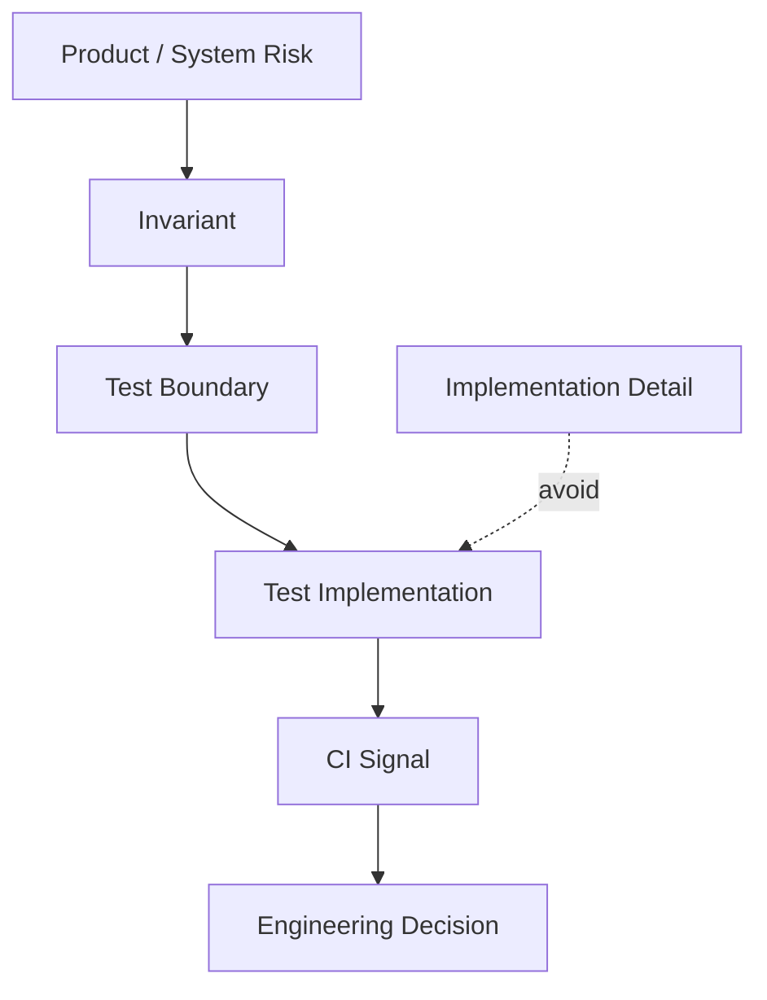
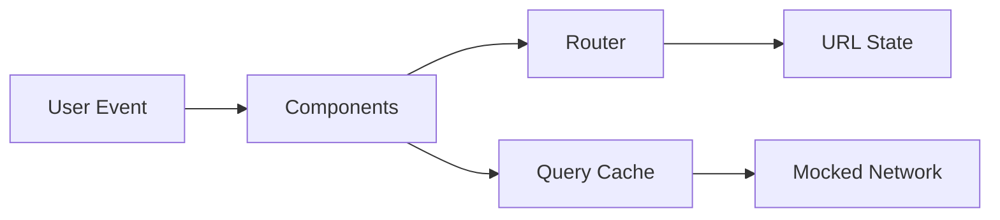
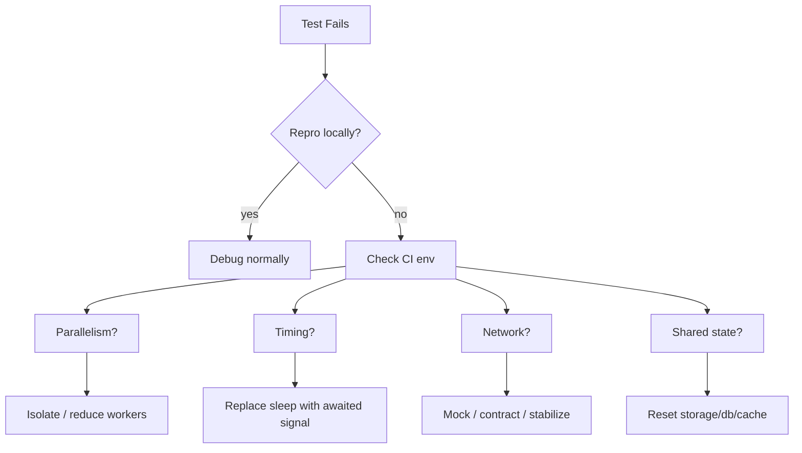
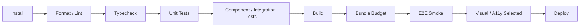

# Part 025 — Testing Strategy for Frontend Systems

## 1. Posisi Part Ini dalam Roadmap

Part sebelumnya membahas error handling, observability, dan debuggability. Testing berada satu langkah sebelum production failure: ia adalah cara kita mengubah asumsi engineering menjadi bukti yang bisa dijalankan berulang.

Untuk frontend advanced, testing bukan hanya pertanyaan:

> "Apakah component ini render?"

Pertanyaan yang lebih tepat:

> "Risiko apa yang paling mahal jika rusak, dan bukti otomatis apa yang cukup untuk membuat kita percaya sistem masih benar?"

Frontend production punya risiko khas:

- UI tampak benar, tetapi state internal salah;
- request lama menimpa request baru;
- loading state tidak pernah selesai;
- tombol bisa diklik dua kali dan menghasilkan duplicate mutation;
- cache menampilkan data tenant lama;
- route guard bocor saat permission berubah;
- form autosave overwrite data terbaru;
- hydration mismatch hanya muncul di production;
- layout shift merusak interaksi;
- screen reader flow tidak sesuai visual flow;
- test hijau karena terlalu banyak mocking;
- test merah karena flake, bukan bug.

Part ini membangun strategi testing yang menyambungkan design, runtime, dan CI.

---

## 2. Lensa Kaufman: Testing sebagai Sub-Skill yang Bisa Dilatih

Dalam framework Kaufman, kita tidak mencoba "belajar semua testing" secara abstrak. Kita pecah skill menjadi komponen kecil yang bisa dilatih dengan feedback cepat.

| Sub-skill | Target Latihan | Feedback |
|---|---|---|
| Risk modeling | Menentukan hal mana yang layak dites | Test map punya alasan bisnis/teknis |
| Test boundary design | Memilih unit, integration, E2E, contract, visual | Test cepat, stabil, dan mendeteksi bug yang relevan |
| Deterministic async | Mengontrol promise, timer, network, animation | Tidak ada race/flaky assertion |
| User-centric assertion | Menguji behavior, bukan implementation detail | Refactor internal tidak merusak test |
| Mocking discipline | Menentukan apa yang boleh dipalsukan | Test tidak menjadi fantasy system |
| CI signal quality | Membuat test suite memberi sinyal jelas | Failure mudah ditriage |
| Flake diagnosis | Membedakan bug, race, env, dan test smell | Retry bukan solusi utama |

Tujuan 20 jam pertama di area testing advanced bukan membuat ratusan test. Tujuannya adalah memiliki judgment: kapan test diperlukan, jenis test apa yang tepat, dan bagaimana membuat test tetap berguna setelah sistem berkembang.

---

## 3. Mental Model: Test adalah Executable Risk Model

Test yang baik bukan mirror dari implementasi. Test yang baik adalah representasi risiko.



Contoh risiko:

> User tidak boleh bisa submit pembayaran dua kali.

Invariant:

> Setelah submit dimulai, mutation kedua tidak boleh dikirim sampai mutation pertama selesai atau gagal secara terkendali.

Test boundary:

- unit test reducer untuk state machine submit;
- integration test form untuk double-click;
- E2E test checkout happy path;
- observability assertion di production untuk duplicate payment attempt.

Test yang buruk langsung menguji detail:

> `isSubmitting` harus `true` setelah `setState` dipanggil.

Masalahnya, detail itu bisa berubah. Invariant tidak.

---

## 4. Testing Pyramid Tidak Cukup, tapi Tetap Berguna

Testing pyramid klasik mengatakan: banyak unit test, lebih sedikit integration test, lebih sedikit E2E test.

Untuk frontend modern, pyramid perlu diperluas karena risiko UI tidak hanya berada di function kecil.

```mermaid
pyramid-beta
  title Frontend Test Portfolio
  "Static checks: types, lint, schema" : 30
  "Unit tests: pure logic, reducers, policies" : 25
  "Component/integration tests: user behavior" : 25
  "Contract tests: API and data boundary" : 8
  "E2E/smoke tests: critical journeys" : 7
  "Visual/a11y/performance gates" : 5
```

Angka di atas bukan formula. Ia menggambarkan bias:

- semakin bawah, test makin cepat dan murah;
- semakin atas, test makin realistis dan mahal;
- production-grade strategy memakai kombinasi, bukan satu jenis test.

Top-tier engineer tidak bertanya "unit atau E2E?". Ia bertanya:

1. failure ini berasal dari logic, integration, browser, network, atau environment?
2. test mana yang paling murah tetapi cukup mampu menangkap failure?
3. test mana yang memberi sinyal paling cepat saat regress?

---

## 5. Taxonomy Test Frontend

| Jenis Test | Boundary | Cocok untuk | Tidak Cocok untuk |
|---|---|---|---|
| Static check | compile/lint/type/schema | invalid state, API shape, unsafe code | runtime browser behavior |
| Unit test | function/class/reducer/policy | pure logic, date/time calculation, permission rules | DOM integration |
| Component test | component + DOM | interaction lokal, accessible name, form field | full navigation/data lifecycle |
| Integration test | beberapa component + router/cache/mock API | user flow dalam satu feature | cross-browser guarantee |
| Contract test | client-server boundary | request/response shape, schema evolution | visual correctness |
| E2E test | browser + app deployed/test env | critical journey, routing, auth, browser APIs | semua edge case kecil |
| Visual regression | screenshot/render output | UI unintended change | semantic correctness |
| Accessibility test | automated + manual flow | missing role/name/focus failures | semua masalah screen reader |
| Performance test | lab/field measurement | regression budget | correctness logic |
| Smoke test | minimal high-value path | deployment health | deep behavior validation |

Kunci strategi: setiap test harus punya **owner risiko**.

Jika tidak bisa menjawab "bug apa yang test ini cegah?", test itu kemungkinan hanya menambah maintenance cost.

---

## 6. Static Checks sebagai Test Termurah

Static checks adalah lapisan termurah karena berjalan tanpa browser dan sering menangkap error sebelum runtime.

Lapisan static yang penting:

- TypeScript strict mode;
- ESLint rule untuk hooks, imports, promises, accessibility;
- formatting untuk mengurangi noise review;
- schema validation untuk runtime boundary;
- dependency policy;
- forbidden imports;
- circular dependency detection;
- dead code detection;
- bundle size analysis;
- generated API type drift check.

Contoh invariant yang sebaiknya dicegah statically:

```ts
// Buruk: semua status bisa punya semua field.
type LoadState<T> = {
  status: 'idle' | 'loading' | 'success' | 'error';
  data?: T;
  error?: Error;
};

// Lebih baik: invalid state tidak representable.
type LoadState<T> =
  | { status: 'idle' }
  | { status: 'loading'; requestId: string }
  | { status: 'success'; data: T }
  | { status: 'error'; error: Error };
```

Jika invalid state bisa dicegah oleh type system, jangan menunggu unit test.

---

## 7. Unit Test: Untuk Logic yang Stabil dan Terisolasi

Unit test paling berguna untuk logic yang:

- pure;
- deterministik;
- punya banyak edge case;
- tidak bergantung browser;
- sering dipakai ulang;
- merepresentasikan policy bisnis/produk.

Contoh target unit test frontend:

- permission decision;
- route authorization policy;
- reducer state transition;
- query key builder;
- cache invalidation policy;
- date range normalization;
- currency/number formatting wrapper;
- feature flag resolver;
- form validation rule;
- retry/backoff function;
- optimistic update rollback.

Contoh reducer test:

```ts
import { describe, expect, it } from 'vitest';

type State =
  | { tag: 'editing'; value: string }
  | { tag: 'submitting'; value: string; requestId: string }
  | { tag: 'submitted'; id: string }
  | { tag: 'failed'; value: string; message: string };

type Event =
  | { type: 'CHANGE'; value: string }
  | { type: 'SUBMIT'; requestId: string }
  | { type: 'RESOLVE'; requestId: string; id: string }
  | { type: 'REJECT'; requestId: string; message: string };

function reducer(state: State, event: Event): State {
  switch (state.tag) {
    case 'editing':
      if (event.type === 'CHANGE') return { tag: 'editing', value: event.value };
      if (event.type === 'SUBMIT') return { tag: 'submitting', value: state.value, requestId: event.requestId };
      return state;

    case 'submitting':
      if (event.type === 'RESOLVE' && event.requestId === state.requestId) {
        return { tag: 'submitted', id: event.id };
      }
      if (event.type === 'REJECT' && event.requestId === state.requestId) {
        return { tag: 'failed', value: state.value, message: event.message };
      }
      return state;

    default:
      return state;
  }
}

describe('submission reducer', () => {
  it('ignores stale resolve from older request', () => {
    const state: State = { tag: 'submitting', value: 'abc', requestId: 'newer' };

    const next = reducer(state, {
      type: 'RESOLVE',
      requestId: 'older',
      id: '123',
    });

    expect(next).toEqual(state);
  });
});
```

Notice: test ini tidak tahu framework UI. Ia mengunci invariant concurrency.

---

## 8. Component Test: Uji Kontrak UI, Bukan Struktur Internal

Component test berguna saat behavior terjadi di boundary DOM:

- user mengisi input;
- tombol disabled/enabled;
- pesan error muncul;
- dialog focus trap;
- keyboard shortcut;
- aria label;
- conditional content;
- event callback dipanggil;
- component merespons async state.

Prinsip penting:

> Query component seperti user atau assistive technology melihat UI, bukan seperti developer melihat class name.

Contoh:

```tsx
import { render, screen } from '@testing-library/react';
import userEvent from '@testing-library/user-event';
import { describe, expect, it, vi } from 'vitest';

it('submits email after valid input', async () => {
  const user = userEvent.setup();
  const onSubmit = vi.fn();

  render(<NewsletterForm onSubmit={onSubmit} />);

  await user.type(screen.getByRole('textbox', { name: /email/i }), 'dev@example.com');
  await user.click(screen.getByRole('button', { name: /subscribe/i }));

  expect(onSubmit).toHaveBeenCalledWith({ email: 'dev@example.com' });
});
```

Yang sengaja dihindari:

```tsx
// Rapuh: coupling ke struktur internal.
container.querySelector('.newsletter-form__email')

// Rapuh: coupling ke implementation detail.
expect(component.state.email).toBe('dev@example.com')
```

Test harus bertahan saat component direfactor selama kontrak user tetap sama.

---

## 9. Integration Test: Tempat Banyak Bug Frontend Berasal

Banyak bug frontend bukan bug function, melainkan bug integrasi:

- component A update state yang dibaca component B;
- route loader dibatalkan tapi response lama tetap commit;
- cache invalidation tidak terjadi setelah mutation;
- permission berubah tapi menu masih tampil;
- form submit sukses tapi list tidak refresh;
- modal close tidak restore focus;
- query param berubah tapi filter UI tidak sinkron.

Integration test perlu menggabungkan beberapa boundary:



Contoh integration test dengan mocked network:

```tsx
it('refreshes project list after creating a project', async () => {
  const user = userEvent.setup();

  renderApp({ route: '/projects', server: mockServer });

  expect(await screen.findByRole('heading', { name: /projects/i })).toBeVisible();

  await user.click(screen.getByRole('button', { name: /new project/i }));
  await user.type(screen.getByRole('textbox', { name: /project name/i }), 'Regulatory Casework');
  await user.click(screen.getByRole('button', { name: /create/i }));

  expect(await screen.findByText('Regulatory Casework')).toBeVisible();
  expect(screen.queryByRole('dialog')).not.toBeInTheDocument();
});
```

Integration test yang baik:

- tidak tahu terlalu banyak implementation detail;
- tetap berjalan cepat;
- menguji interaction antar boundary;
- memakai network fake yang realistis;
- punya assert terhadap user-visible result.

---

## 10. Network Mocking: Fake yang Terlalu Indah Berbahaya

Network mocking dibutuhkan agar test deterministik, tetapi mocking juga bisa membuat test memvalidasi dunia palsu.

Mock yang buruk:

```ts
vi.mock('../api', () => ({
  createProject: vi.fn().mockResolvedValue({ ok: true }),
}));
```

Masalah:

- tidak menguji request shape;
- tidak menguji HTTP status;
- tidak menguji serialization;
- tidak menguji error payload;
- tidak menguji loading state realistis;
- tidak menguji cache invalidation berbasis key.

Mock lebih baik berada di boundary HTTP:

```ts
import { http, HttpResponse } from 'msw';

export const handlers = [
  http.post('/api/projects', async ({ request }) => {
    const body = await request.json() as { name?: string };

    if (!body.name) {
      return HttpResponse.json({ code: 'NAME_REQUIRED' }, { status: 400 });
    }

    return HttpResponse.json({ id: 'p1', name: body.name }, { status: 201 });
  }),
];
```

Lebih baik lagi: mock dan server contract sama-sama divalidasi dengan schema.

---

## 11. Contract Test: Boundary Client-Server

Frontend sering rusak bukan karena component, tetapi karena kontrak API berubah.

Contract test menjawab:

- apakah frontend mengirim request yang disepakati?
- apakah response masih bisa diparse?
- apakah enum baru ditangani?
- apakah optional field benar-benar optional?
- apakah error payload kompatibel?
- apakah pagination/cursor semantics berubah?

Contoh schema boundary:

```ts
import { z } from 'zod';

const ProjectSchema = z.object({
  id: z.string(),
  name: z.string(),
  status: z.enum(['draft', 'active', 'archived']),
  ownerId: z.string(),
});

type Project = z.infer<typeof ProjectSchema>;

async function fetchProject(id: string): Promise<Project> {
  const response = await fetch(`/api/projects/${id}`);
  const json = await response.json();
  return ProjectSchema.parse(json);
}
```

Contract test bukan pengganti E2E. Ia adalah guard agar boundary data tidak diam-diam drift.

---

## 12. E2E Test: Sedikit, Mahal, dan Harus Bernilai Tinggi

E2E test paling mahal karena melibatkan browser, app, routing, network, storage, dan sering backend/test environment.

Gunakan E2E untuk:

- login/logout;
- critical purchase/submission flow;
- permission-critical journey;
- onboarding;
- dashboard loading smoke;
- create/edit/delete entity utama;
- cross-route navigation penting;
- browser-only feature;
- regression yang pernah mahal.

Jangan gunakan E2E untuk:

- semua validasi field kecil;
- semua varian empty state;
- semua branch reducer;
- semua formatting logic;
- semua component visual minor.

E2E harus mengunci **journey**, bukan internal behavior.

Contoh scope E2E yang baik:

```text
As a case officer,
when I create a new enforcement case from intake,
then I can assign it, see it in the case list,
and open the generated case detail page.
```

Contoh scope E2E yang buruk:

```text
Every button class in the intake form should be rendered correctly.
```

---

## 13. Visual Regression Testing

Visual regression berguna untuk mendeteksi perubahan tampilan yang tidak dimaksudkan.

Cocok untuk:

- design system component;
- chart/dashboard critical;
- PDF/print preview;
- layout responsive;
- theme/dark mode;
- marketing page;
- visual state matrix.

Risiko visual regression:

- snapshot terlalu banyak;
- test noise karena font/rendering environment;
- dynamic data berubah;
- animation tidak distabilkan;
- viewport tidak dikontrol;
- threshold terlalu longgar atau terlalu ketat.

Strategi:

1. mulai dari design system primitives;
2. stabilkan data, time, locale, viewport;
3. disable animation di test;
4. review diff sebagai code review artefact;
5. jangan snapshot seluruh aplikasi tanpa alasan.

---

## 14. Accessibility Testing: Automated + Manual

Automated accessibility test penting, tetapi tidak cukup.

Automated checks bisa menangkap:

- missing label;
- invalid ARIA;
- contrast tertentu;
- heading order tertentu;
- missing alt;
- role conflict;
- form association failure.

Manual/semimanual check tetap dibutuhkan untuk:

- keyboard flow;
- focus order;
- screen reader semantics;
- announcement timing;
- meaning of content;
- complex widget behavior;
- cognitive load;
- error recovery.

Minimum accessibility test strategy:

| Layer | Check |
|---|---|
| Static | eslint-plugin-jsx-a11y atau equivalent |
| Component | accessible role/name query |
| Integration | keyboard navigation dan focus management |
| E2E | critical journey dengan a11y scan |
| Manual | screen reader + keyboard pass untuk high-risk flows |

Contoh component test yang sekaligus meningkatkan a11y:

```tsx
expect(screen.getByRole('button', { name: /save changes/i })).toBeEnabled();
expect(screen.getByRole('alert')).toHaveTextContent(/name is required/i);
```

Jika UI tidak bisa ditemukan dengan role/name, mungkin UI juga tidak cukup accessible.

---

## 15. Performance Testing dalam Test Strategy

Performance tidak bisa dijamin hanya dengan unit test. Namun regression gate tetap bisa dibuat.

Layer performance test:

- bundle size budget;
- Lighthouse/lab budget untuk route utama;
- Core Web Vitals field monitoring;
- synthetic journey untuk LCP/INP regression;
- custom user timing marks;
- CI budget untuk asset size;
- smoke test untuk long task ekstrem.

Contoh budget policy:

```json
{
  "budgets": [
    {
      "path": "/dashboard",
      "resourceSizes": [
        { "resourceType": "script", "budget": 350 },
        { "resourceType": "total", "budget": 1200 }
      ],
      "timings": [
        { "metric": "interactive", "budget": 4000 }
      ]
    }
  ]
}
```

Jangan berharap performance gate sempurna di CI. Gunakan sebagai guardrail, bukan oracle tunggal.

---

## 16. Deterministic Async Testing

Frontend async bug sering muncul karena test tidak mengontrol waktu.

Sumber async:

- promise microtask;
- timer;
- animation frame;
- fetch;
- debounce/throttle;
- transition;
- observer callback;
- router navigation;
- Suspense/loading state;
- retry/backoff;
- polling;
- browser auto-wait.

Prinsip:

1. assert hasil akhir dengan async query;
2. jangan mencampur fake timer sembarangan dengan user-event;
3. kontrol network response;
4. test intermediate state hanya jika itu behavior penting;
5. hindari `sleep` arbitrary;
6. gunakan timeout sebagai failure signal, bukan synchronization primitive.

Buruk:

```ts
await new Promise((resolve) => setTimeout(resolve, 500));
expect(screen.getByText('Saved')).toBeVisible();
```

Lebih baik:

```ts
expect(await screen.findByText('Saved')).toBeVisible();
```

Jika test membutuhkan delay spesifik, expose clock boundary.

---

## 17. Test Data dan Fixture Design

Test data yang buruk membuat test sulit dibaca dan mudah rusak.

Anti-pattern:

```ts
const project = {
  id: '1',
  name: 'A',
  status: 'active',
  owner: null,
  createdAt: '2021-01-01',
  updatedAt: '2021-01-02',
  region: 'x',
  permissions: ['a', 'b', 'c'],
  metadata: {},
};
```

Lebih baik pakai factory:

```ts
function buildProject(overrides: Partial<Project> = {}): Project {
  return {
    id: 'project_1',
    name: 'Regulatory Casework',
    status: 'active',
    ownerId: 'user_1',
    createdAt: '2026-06-27T00:00:00.000Z',
    ...overrides,
  };
}
```

Prinsip fixture:

- default harus valid;
- field penting terlihat di test;
- data irrelevant disembunyikan;
- factory harus dekat domain;
- hindari shared mutable fixture;
- gunakan persona untuk E2E.

Contoh persona:

```ts
const personas = {
  admin: { role: 'admin', permissions: ['case:create', 'case:assign'] },
  viewer: { role: 'viewer', permissions: ['case:read'] },
};
```

---

## 18. Test Naming yang Membantu Debugging

Nama test harus menjelaskan behavior dan kondisi.

Buruk:

```ts
it('works', () => {});
it('submit test', () => {});
it('renders correctly', () => {});
```

Lebih baik:

```ts
it('prevents duplicate submit while create request is pending', () => {});
it('restores previous value when optimistic update is rejected', () => {});
it('redirects viewer to forbidden page when opening admin route', () => {});
```

Format useful:

```text
it('<expected behavior> when <condition>')
```

Atau:

```text
given <state>, when <event>, then <outcome>
```

Test name adalah observability layer pertama saat CI gagal.

---

## 19. Flaky Test: Taxonomy dan Diagnosis

Flaky test adalah test yang kadang pass kadang fail tanpa perubahan code. Ia merusak trust terhadap CI.

| Flake Source | Gejala | Fix |
|---|---|---|
| Async race | Kadang element belum muncul | await behavior, bukan sleep |
| Shared state | Pass sendiri, fail bersama | isolate storage/db/cache |
| Order dependency | Fail hanya setelah test tertentu | reset global state |
| Network nondeterminism | timeout random | mock/stub/control network |
| Animation/transition | click gagal atau screenshot diff | disable/stabilize animation |
| Timezone/locale | fail di CI saja | set timezone/locale |
| Random data | snapshot berubah | seed random |
| Browser resource pressure | fail under parallelism | tune workers/isolation |
| Test too broad | failure tidak jelas | split by risk boundary |

Retry boleh dipakai sebagai mitigation sementara, bukan root-cause fix.



---

## 20. Coverage: Useful Metric, Dangerous Target

Coverage menjawab:

> Baris/branch mana yang dieksekusi test?

Coverage tidak menjawab:

- apakah assertion meaningful;
- apakah edge case penting tercakup;
- apakah test realistis;
- apakah test stabil;
- apakah risk utama aman.

Coverage berguna untuk:

- menemukan dead zone;
- memaksa branch penting diuji;
- melacak penurunan test coverage;
- melihat module high-risk tanpa test.

Coverage berbahaya jika menjadi target buta:

```ts
// Test ini menaikkan coverage, tetapi hampir tidak memberi confidence.
render(<UserCard user={user} />);
expect(true).toBe(true);
```

Gunakan coverage bersama risk review.

---

## 21. CI Test Pipeline

Pipeline frontend harus memberi feedback cepat dan bertahap.

Contoh pipeline:



Prinsip:

- failure murah harus muncul lebih awal;
- test mahal hanya jalan setelah build masuk akal;
- PR pipeline dan nightly pipeline boleh berbeda;
- test high-risk harus blocking;
- exploratory/long-running tests bisa scheduled;
- artifacts harus cukup untuk debugging.

Artifact penting:

- test report;
- screenshot/video/trace untuk E2E;
- coverage report;
- bundle analysis;
- accessibility report;
- changed test list;
- flaky test history.

---

## 22. Test Selection: Apa yang Harus Dites Dulu?

Gunakan matrix risiko.

| Risiko | Impact | Probability | Test First? |
|---|---:|---:|---|
| Payment duplicate submit | High | Medium | Yes |
| Dashboard title typo | Low | Low | No |
| Permission leak | Critical | Medium | Yes |
| Dark mode minor spacing | Low | Medium | Visual selected |
| Cache stale after mutation | High | High | Yes |
| Loading spinner color | Low | Low | No |
| Form data loss on route change | High | Medium | Yes |
| Button component snapshot for every variant | Medium | Medium | Design-system visual only |

Pertanyaan praktis:

1. Apakah failure bisa menyebabkan data loss, security issue, financial/regulatory impact, atau workflow block?
2. Apakah failure pernah terjadi sebelumnya?
3. Apakah code path sering berubah?
4. Apakah behavior sulit dicek manual?
5. Apakah user impact tinggi?

Jika jawabannya ya, test harus ada.

---

## 23. Testing State Machine dan Workflow

Frontend enterprise sering punya workflow: draft, review, submit, approve, reject, escalate, archive.

Test state machine lebih stabil daripada test event acak.

Contoh matrix:

| Current State | Event | Expected State | Side Effect |
|---|---|---|---|
| draft | submit | submitting | POST /cases |
| submitting | success | submitted | invalidate case list |
| submitting | failure | draftWithError | show error |
| submitted | edit | editingSubmitted | audit warning |
| approved | edit | approved | blocked |

Test:

```ts
it.each([
  ['draft', 'submit', 'submitting'],
  ['submitting', 'success', 'submitted'],
  ['approved', 'edit', 'approved'],
])('transitions from %s via %s to %s', (from, event, to) => {
  expect(transition(from, event)).toEqual(to);
});
```

Untuk workflow high-risk, buat transition table sebagai artefact desain sekaligus test source.

---

## 24. Snapshot Testing: Gunakan dengan Hati-Hati

Snapshot test berguna jika output besar dan perubahan output memang perlu review.

Cocok untuk:

- generated config;
- serialized state transition table;
- AST transform;
- design token output;
- API client generated shape;
- small stable render output.

Kurang cocok untuk:

- snapshot seluruh DOM component besar;
- snapshot yang berubah karena random ID;
- snapshot yang reviewer tidak baca;
- snapshot yang diupdate otomatis tanpa pemahaman.

Rule:

> Snapshot hanya berguna jika manusia benar-benar mengevaluasi diff.

---

## 25. Mocking Policy

Mocking harus punya policy eksplisit.

| Dependency | Default | Catatan |
|---|---|---|
| Pure util | Jangan mock | Test real behavior |
| Date/time | Inject/freeze | Hindari global random time |
| Random | Seed/inject | Reproducible |
| Network | Mock at HTTP boundary | Jangan mock internal API function kecuali unit |
| Router | Real memory router | Lebih realistis untuk integration |
| Query cache | Real isolated cache | Reset per test |
| Browser API unavailable | Thin adapter | Mock adapter, bukan app logic |
| Analytics | Spy/no-op | Assert only high-value events |
| Feature flag | Controlled provider | Test key combinations |
| Third-party widget | Contract fake | Jangan load vendor di unit/component |

Mocking berlebihan sering membuat test pass saat produk rusak.

---

## 26. Anti-Patterns Testing Frontend

| Anti-pattern | Kenapa Buruk | Alternatif |
|---|---|---|
| `waitForTimeout(1000)` | Lambat dan flaky | Await user-visible signal |
| Test implementation detail | Refactor kecil merusak test | Test behavior |
| Mock semua dependency | Test fantasy world | Mock boundary eksternal saja |
| Snapshot besar | Reviewer tidak membaca | Assert behavior/visual targeted |
| Satu E2E untuk semua hal | Failure sulit ditriage | Pisah critical journey |
| Data fixture global mutable | Order dependency | Factory per test |
| Coverage sebagai tujuan | False confidence | Risk-based coverage |
| Test tanpa assertion meaningful | Noise | Assert invariant |
| Retry sebagai solusi flake | Menyembunyikan bug | Diagnosis root cause |
| Tidak ada CI artifact | Debug lambat | Trace/screenshot/report |

---

## 27. Practice Loop 120 Menit

Gunakan latihan ini untuk menginternalisasi testing strategy.

### 0–20 Menit — Risk Map

Pilih satu feature nyata, misalnya "create case" atau "checkout".

Tulis:

- critical user journey;
- data loss risk;
- permission risk;
- async race risk;
- cache consistency risk;
- accessibility risk;
- performance risk.

### 20–45 Menit — Test Portfolio

Untuk tiap risiko, tentukan test boundary:

- static;
- unit;
- component;
- integration;
- contract;
- E2E;
- visual;
- accessibility.

### 45–75 Menit — Implement 3 Test

Implement:

1. satu unit test untuk reducer/policy;
2. satu integration test user flow;
3. satu contract/schema test.

### 75–95 Menit — Flake Hardening

Hapus semua arbitrary sleep. Isolasi cache/storage. Freeze time jika perlu.

### 95–110 Menit — CI Thinking

Tentukan test mana blocking PR dan mana nightly.

### 110–120 Menit — Retrospective

Jawab:

- bug apa yang sekarang akan tertangkap?
- bug apa yang masih lolos?
- test mana paling mahal?
- test mana paling memberi confidence?

---

## 28. Production Readiness Checklist

Sebuah frontend feature high-risk dianggap punya testing strategy layak jika:

- [ ] invariant utama terdokumentasi;
- [ ] invalid state penting dicegah TypeScript/schema;
- [ ] pure logic high-risk punya unit test;
- [ ] user behavior utama punya component/integration test;
- [ ] network boundary dimock secara realistis;
- [ ] API response divalidasi dengan schema/contract;
- [ ] critical journey punya E2E/smoke test;
- [ ] accessibility critical path dicek role/name/focus;
- [ ] test tidak memakai arbitrary sleep;
- [ ] cache/storage diisolasi per test;
- [ ] CI artifact cukup untuk debugging;
- [ ] flaky test punya owner dan policy;
- [ ] coverage dilihat bersama risk, bukan sebagai target buta.

---

## 29. Ringkasan

Testing frontend advanced adalah aktivitas desain sistem.

Kesimpulan utama:

- test adalah executable risk model;
- static checks adalah test termurah;
- unit test cocok untuk pure invariant dan policy;
- component/integration test cocok untuk behavior user-visible;
- contract test menjaga boundary client-server;
- E2E test harus sedikit, mahal, dan high-value;
- visual dan accessibility testing adalah lapisan terpisah;
- deterministic async adalah skill wajib;
- mocking harus dilakukan di boundary yang tepat;
- coverage tidak sama dengan confidence;
- flake adalah production-quality problem untuk test suite.

Part berikutnya membahas Playwright sebagai alat browser automation production-grade: locator strategy, auto-waiting, fixture, trace, network control, parallelism, CI, dan flake diagnosis.

---

## 30. Referensi

- Testing Library — Introduction and guiding principles: https://testing-library.com/docs/
- Vitest — Browser Mode: https://vitest.dev/guide/browser/
- Vitest — Mocking: https://vitest.dev/guide/mocking/
- W3C — WCAG 2.2: https://www.w3.org/TR/WCAG22/
- W3C WAI — WCAG overview: https://www.w3.org/WAI/standards-guidelines/wcag/
