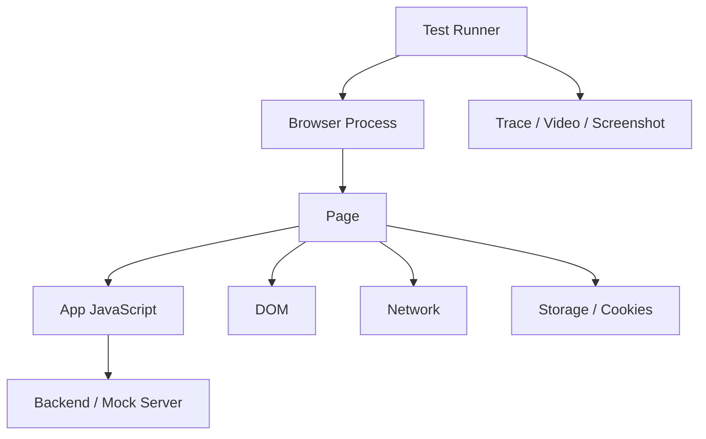
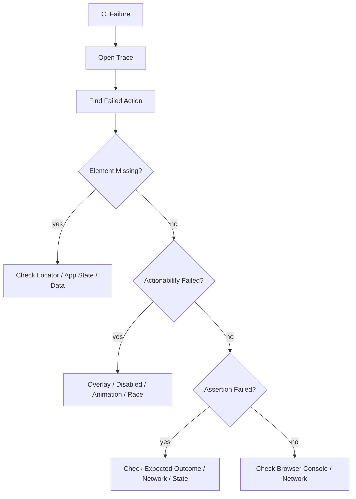

# Part 026 — Playwright and Browser Automation

## 1. Posisi Part Ini dalam Roadmap

Part sebelumnya membahas strategi testing. Part ini memperdalam satu alat utama untuk E2E/browser automation modern: Playwright.

Kita tidak belajar Playwright sebagai kumpulan API. Kita belajar Playwright sebagai cara mengontrol browser nyata untuk memvalidasi journey, integrasi, dan failure mode yang tidak bisa dibuktikan oleh unit/component test saja.

Playwright berguna untuk menguji:

- routing dan navigation;
- auth/session;
- browser storage;
- network request;
- cross-browser behavior;
- file upload/download;
- dialog;
- permissions;
- responsive viewport;
- critical journey;
- regression production;
- accessibility smoke;
- deployment smoke;
- flaky interaction yang hanya muncul di browser nyata.

Namun Playwright juga bisa menjadi sumber test lambat dan flaky jika dipakai tanpa strategi.

Tujuan part ini: membuat Playwright suite yang **resilient, cepat, debuggable, dan bernilai tinggi**.

---

## 2. Mental Model: Browser Automation adalah Sistem Terdistribusi Kecil

E2E test terlihat seperti script linear:

```ts
await page.goto('/login');
await page.fill('input', '...');
await page.click('button');
```

Padahal di bawahnya ada banyak sistem:



Failure bisa berasal dari:

- app bug;
- test bug;
- locator rapuh;
- timing race;
- network nondeterminism;
- shared storage;
- backend test data;
- browser difference;
- CI resource pressure;
- animation/transition;
- parallelism;
- stale deployment.

Top-tier engineer tidak langsung menambah timeout. Ia mencari boundary failure.

---

## 3. Kapan Menggunakan Playwright

Gunakan Playwright untuk risiko yang membutuhkan browser nyata.

| Use Case | Playwright Cocok? | Alasan |
|---|---|---|
| Login lalu membuka dashboard | Ya | Auth, cookie, navigation |
| Reducer state transition | Tidak | Unit test lebih murah |
| Modal focus trap | Ya, selected | Browser focus behavior penting |
| Button label render | Tidak | Component test cukup |
| Checkout happy path | Ya | Critical journey |
| Cache invalidation after mutation | Kadang | Integration test dulu, E2E untuk smoke |
| Drag-and-drop browser behavior | Ya | Browser event realism |
| API schema compatibility | Tidak | Contract test |
| Responsive nav menu | Ya, selected viewport | Layout + interaction |
| Visual layout all variants | Kadang | Visual test/storybook lebih tepat |

Rule:

> Playwright dipakai saat confidence membutuhkan browser, bukan saat kita malas membuat integration test yang tepat.

---

## 4. Struktur Minimal Project

Contoh struktur:

```text
apps/web/
  playwright.config.ts
  tests/
    e2e/
      auth.spec.ts
      case-create.spec.ts
      dashboard-smoke.spec.ts
    fixtures/
      test.ts
      personas.ts
      data-builders.ts
    pages/
      login.page.ts
      case.page.ts
    support/
      routes.ts
      assertions.ts
```

Prinsip:

- spec dikelompokkan berdasarkan journey, bukan component;
- fixture menyimpan setup umum;
- page helper boleh ada, tetapi jangan menyembunyikan behavior penting;
- test data builder harus eksplisit;
- artifact harus aktif di CI untuk failure.

---

## 5. Playwright Config sebagai Architecture Boundary

Contoh konfigurasi awal:

```ts
import { defineConfig, devices } from '@playwright/test';

export default defineConfig({
  testDir: './tests/e2e',
  timeout: 30_000,
  expect: {
    timeout: 5_000,
  },
  fullyParallel: true,
  retries: process.env.CI ? 2 : 0,
  workers: process.env.CI ? 4 : undefined,
  reporter: process.env.CI
    ? [['html'], ['junit', { outputFile: 'test-results/junit.xml' }]]
    : [['list'], ['html']],
  use: {
    baseURL: process.env.E2E_BASE_URL ?? 'http://localhost:3000',
    trace: 'on-first-retry',
    screenshot: 'only-on-failure',
    video: 'retain-on-failure',
  },
  projects: [
    {
      name: 'chromium',
      use: { ...devices['Desktop Chrome'] },
    },
    {
      name: 'firefox',
      use: { ...devices['Desktop Firefox'] },
    },
    {
      name: 'webkit',
      use: { ...devices['Desktop Safari'] },
    },
  ],
});
```

Keputusan penting:

- `timeout` tidak boleh terlalu besar untuk menutupi flake;
- `expect.timeout` mengatur waktu tunggu assertion;
- `retries` di CI boleh ada, tapi flake tetap harus ditriage;
- `trace` sebaiknya aktif minimal saat retry/failure;
- jumlah `workers` disesuaikan resource CI;
- cross-browser project dipilih berdasarkan risiko, bukan selalu semua test di semua browser.

---

## 6. Locator Strategy: Fondasi Test Stabil

Locator adalah kontrak antara test dan UI.

Prioritas locator:

1. `getByRole` dengan accessible name;
2. `getByLabel` untuk form;
3. `getByPlaceholder` jika placeholder adalah bagian UX stabil;
4. `getByText` untuk content user-visible;
5. `getByTestId` untuk area yang tidak punya semantic locator stabil;
6. CSS/XPath sebagai fallback terakhir.

Contoh:

```ts
await page.getByRole('button', { name: 'Create case' }).click();
await page.getByLabel('Case title').fill('Unauthorized trading report');
await expect(page.getByRole('heading', { name: 'Case created' })).toBeVisible();
```

Buruk:

```ts
await page.locator('.btn-primary').click();
await page.locator('div:nth-child(4) > span').click();
```

Locator yang baik:

- merefleksikan user-visible behavior;
- stabil terhadap refactor DOM;
- memaksa UI lebih accessible;
- failure message lebih mudah dipahami.

---

## 7. Accessible Locator sebagai Quality Gate

Jika test tidak bisa menemukan button dengan role dan name, pertanyaannya bukan hanya "bagaimana cara mencari element?".

Pertanyaannya:

> Apakah user dengan assistive technology juga bisa menemukan action ini?

Contoh:

```ts
await page.getByRole('button', { name: /submit application/i }).click();
```

Ini memvalidasi bahwa element adalah button secara semantic dan punya accessible name.

Untuk icon-only button:

```tsx
<button aria-label="Delete project">
  <TrashIcon />
</button>
```

Test:

```ts
await page.getByRole('button', { name: 'Delete project' }).click();
```

Testability dan accessibility sering sejalan.

---

## 8. Auto-Waiting dan Actionability

Playwright tidak sekadar menjalankan click. Ia menunggu kondisi actionability tertentu sebelum action.

Secara mental, action seperti click membutuhkan element:

- ada;
- visible;
- stable;
- enabled;
- menerima event;
- tidak tertutup element lain.

Karena itu, ini biasanya cukup:

```ts
await page.getByRole('button', { name: 'Save' }).click();
```

Jangan tambahkan wait manual tanpa alasan:

```ts
// Buruk
await page.waitForTimeout(1000);
await page.getByRole('button', { name: 'Save' }).click();
```

Gunakan assertion sebagai synchronization:

```ts
await expect(page.getByRole('status')).toHaveText(/saving/i);
await expect(page.getByRole('status')).toHaveText(/saved/i);
```

Auto-waiting mengurangi flake, tetapi tidak memperbaiki app yang tidak punya signal user-visible jelas.

---

## 9. Assertion yang Tepat

Assertion harus menjelaskan outcome user-visible atau system-critical.

Contoh baik:

```ts
await expect(page.getByText('Case assigned to Maya')).toBeVisible();
await expect(page).toHaveURL(/\/cases\/case_123$/);
await expect(page.getByRole('button', { name: 'Submit' })).toBeDisabled();
```

Assertion lemah:

```ts
expect(await page.locator('.case-card').count()).toBeGreaterThan(0);
```

Lebih baik:

```ts
await expect(page.getByRole('link', { name: /unauthorized trading report/i })).toBeVisible();
```

Assertion Playwright bisa retry. Manfaatkan itu daripada polling manual.

---

## 10. Test Isolation

Setiap test harus bisa berjalan sendiri, urutan bebas, parallel-safe.

Sumber state yang harus diisolasi:

- browser context;
- cookies;
- local/session storage;
- IndexedDB;
- service worker;
- backend database test;
- generated entity;
- queue/job async;
- feature flag;
- tenant/org;
- timezone/locale;
- user account/persona.

Pattern:

```ts
import { test as base } from '@playwright/test';

export const test = base.extend<{ orgId: string }>({
  orgId: async ({ request }, use) => {
    const org = await createTestOrg(request);
    await use(org.id);
    await deleteTestOrg(request, org.id);
  },
});
```

Isolation lebih penting daripada test speed jika data corruption menyebabkan flake.

---

## 11. Authentication Strategy

Login via UI di setiap test membuat suite lambat dan rapuh. Tetapi melewati login sepenuhnya bisa kehilangan coverage auth.

Strategi umum:

1. satu atau sedikit test khusus login via UI;
2. mayoritas test memakai pre-authenticated storage state;
3. persona berbeda punya storage state berbeda;
4. token/session punya expiry yang dikelola;
5. test permission tetap eksplisit.

Contoh setup auth:

```ts
// auth.setup.ts
import { test as setup, expect } from '@playwright/test';

setup('authenticate as admin', async ({ page }) => {
  await page.goto('/login');
  await page.getByLabel('Email').fill(process.env.E2E_ADMIN_EMAIL!);
  await page.getByLabel('Password').fill(process.env.E2E_ADMIN_PASSWORD!);
  await page.getByRole('button', { name: 'Sign in' }).click();

  await expect(page.getByRole('heading', { name: 'Dashboard' })).toBeVisible();
  await page.context().storageState({ path: 'playwright/.auth/admin.json' });
});
```

Config:

```ts
projects: [
  { name: 'setup', testMatch: /.*\.setup\.ts/ },
  {
    name: 'admin-chromium',
    use: { storageState: 'playwright/.auth/admin.json' },
    dependencies: ['setup'],
  },
]
```

Jangan simpan credential production di CI test.

---

## 12. Fixtures: Dependency Injection untuk Test

Fixture adalah cara Playwright mengelola setup/teardown.

Contoh custom fixture:

```ts
import { test as base, expect } from '@playwright/test';

type Fixtures = {
  caseId: string;
};

export const test = base.extend<Fixtures>({
  caseId: async ({ request }, use) => {
    const response = await request.post('/api/test/cases', {
      data: { title: 'E2E case' },
    });
    const body = await response.json();

    await use(body.id);

    await request.delete(`/api/test/cases/${body.id}`);
  },
});

export { expect };
```

Spec:

```ts
import { test, expect } from './fixtures/test';

test('opens case detail', async ({ page, caseId }) => {
  await page.goto(`/cases/${caseId}`);
  await expect(page.getByRole('heading', { name: /e2e case/i })).toBeVisible();
});
```

Fixture yang baik:

- eksplisit;
- cepat;
- cleanup aman;
- tidak menyembunyikan assertion penting;
- tidak membuat global state shared.

---

## 13. Page Object: Gunakan Secukupnya

Page object sering membantu, tetapi juga sering menyembunyikan test intent.

Buruk:

```ts
await app.doEverything();
expect(await app.success()).toBe(true);
```

Lebih baik:

```ts
await casePage.openNewCase();
await casePage.fillTitle('Unauthorized trading report');
await casePage.submit();
await expect(casePage.createdHeading).toBeVisible();
```

Page object sebaiknya:

- membungkus repeated interaction yang jelas;
- expose locator penting;
- tidak menyembunyikan branching kompleks;
- tidak mengandung assertion terlalu banyak kecuali assertion reusable;
- tidak menjadi mini framework.

Contoh:

```ts
import { Page, Locator } from '@playwright/test';

export class CasePage {
  readonly page: Page;
  readonly titleInput: Locator;
  readonly submitButton: Locator;

  constructor(page: Page) {
    this.page = page;
    this.titleInput = page.getByLabel('Case title');
    this.submitButton = page.getByRole('button', { name: 'Create case' });
  }

  async gotoNew() {
    await this.page.goto('/cases/new');
  }

  async create(title: string) {
    await this.titleInput.fill(title);
    await this.submitButton.click();
  }
}
```

---

## 14. Network Control

Playwright bisa mengamati dan mengontrol network.

Use cases:

- simulate API error;
- simulate slow response;
- assert request payload;
- block third-party scripts;
- mock unstable dependency;
- test empty state;
- test permission error;
- avoid external network in CI.

Contoh route mock:

```ts
test('shows retry action when project API fails', async ({ page }) => {
  await page.route('**/api/projects', async (route) => {
    await route.fulfill({
      status: 503,
      contentType: 'application/json',
      body: JSON.stringify({ code: 'SERVICE_UNAVAILABLE' }),
    });
  });

  await page.goto('/projects');

  await expect(page.getByRole('alert')).toContainText(/temporarily unavailable/i);
  await expect(page.getByRole('button', { name: /retry/i })).toBeVisible();
});
```

Contoh assert request:

```ts
const requestPromise = page.waitForRequest((request) =>
  request.url().endsWith('/api/cases') && request.method() === 'POST'
);

await page.getByRole('button', { name: 'Create case' }).click();

const request = await requestPromise;
expect(request.postDataJSON()).toMatchObject({ title: 'Unauthorized trading report' });
```

Hati-hati: terlalu banyak route mock bisa membuat E2E kehilangan realism. Untuk critical smoke, lebih baik pakai backend test environment yang terkontrol.

---

## 15. Waiting Strategy

Waiting adalah sumber utama flake.

Preferensi:

1. locator action auto-wait;
2. web-first assertions;
3. wait for URL/navigation jika navigation adalah outcome;
4. wait for response/request jika network adalah signal utama;
5. custom app signal jika diperlukan;
6. `waitForTimeout` hampir selalu anti-pattern.

Contoh URL:

```ts
await page.getByRole('link', { name: 'Reports' }).click();
await expect(page).toHaveURL(/\/reports$/);
await expect(page.getByRole('heading', { name: 'Reports' })).toBeVisible();
```

Contoh response:

```ts
const responsePromise = page.waitForResponse((response) =>
  response.url().includes('/api/reports') && response.status() === 200
);

await page.getByRole('button', { name: 'Refresh' }).click();
await responsePromise;
await expect(page.getByText('Updated just now')).toBeVisible();
```

Jika app tidak punya visible signal yang bisa ditunggu, itu mungkin masalah UX, bukan hanya test problem.

---

## 16. Trace Viewer sebagai Debugging Tool

Trace adalah artifact paling penting untuk Playwright failure.

Trace membantu melihat:

- action timeline;
- DOM snapshot sebelum/sesudah action;
- network requests;
- console logs;
- screenshots;
- source location;
- assertion failure;
- timing.

Workflow debugging:



Jangan debug E2E hanya dari log text jika trace tersedia.

---

## 17. Screenshots, Video, dan Artifacts

Artifact policy:

| Artifact | Kapan Berguna | Biaya |
|---|---|---|
| Screenshot on failure | Visual state saat fail | rendah |
| Video on failure | Urutan interaksi | sedang |
| Trace on retry/failure | Root cause detail | sedang |
| HTML report | Review suite | rendah |
| JUnit report | CI integration | rendah |
| Network logs | API failure | sedang |

Recommended default:

```ts
use: {
  screenshot: 'only-on-failure',
  video: 'retain-on-failure',
  trace: 'on-first-retry',
}
```

Untuk flake investigation sementara:

```ts
use: {
  trace: 'on',
  video: 'on',
}
```

Jangan permanenkan artifact terlalu berat jika storage CI mahal.

---

## 18. Parallelism dan Sharding

Playwright tests bisa parallel. Parallelism mempercepat suite, tetapi memperbesar risiko shared-state bug.

Syarat parallel-safe:

- data unik per test;
- tidak memakai user account sama untuk mutation parallel;
- cleanup tidak menghapus data test lain;
- no global mutable server state;
- idempotent setup;
- environment cukup resource;
- no port collision;
- no shared file path tanpa unique name.

Contoh data unik:

```ts
const title = `Case ${test.info().parallelIndex}-${Date.now()}`;
```

Lebih baik pakai ID deterministic dari test info:

```ts
const title = `Case ${test.info().project.name}-${test.info().workerIndex}-${test.info().retry}`;
```

Sharding digunakan saat suite besar:

```bash
npx playwright test --shard=1/4
npx playwright test --shard=2/4
npx playwright test --shard=3/4
npx playwright test --shard=4/4
```

Parallelism bukan pengganti test portfolio yang ramping.

---

## 19. Retries: Mitigation, Bukan Obat

Retries berguna untuk:

- mengurangi noise sementara;
- mengumpulkan trace on first retry;
- membedakan deterministic failure vs flaky failure;
- menjaga CI tidak lumpuh saat investigation berjalan.

Retries berbahaya jika:

- dianggap solusi permanen;
- menutupi bug race nyata;
- membuat suite lambat;
- membuat failure hilang tanpa root cause;
- tidak ada flake tracking.

Policy sehat:

- PR CI boleh retry 1–2 kali;
- setiap flaky test punya issue/owner;
- flake rate dimonitor;
- test yang sering flaky di-quarantine hanya sementara;
- quarantine tidak boleh menjadi kuburan test.

---

## 20. Cross-Browser Strategy

Tidak semua test harus jalan di semua browser.

Strategy:

| Test Type | Browser Coverage |
|---|---|
| Smoke critical journey | Chromium + WebKit + Firefox |
| Feature-specific E2E | Primary browser, selected cross-browser |
| Browser API-specific | Browser yang relevan |
| Visual regression | Browser/rendering target utama |
| Mobile responsive smoke | Device profile selected |
| Long full regression | Nightly cross-browser |

Jalankan cross-browser berdasarkan risk:

- Safari/WebKit jika user base iOS besar;
- Firefox jika enterprise environment relevan;
- Chromium jika Chrome/Edge dominan;
- mobile viewport jika produk mobile-first.

---

## 21. Mobile dan Responsive Testing

Playwright device emulation membantu menguji viewport, user agent, touch, dan device scale factor.

Contoh:

```ts
projects: [
  {
    name: 'mobile-safari',
    use: { ...devices['iPhone 13'] },
  },
]
```

Test responsive yang bernilai:

```ts
test('opens mobile navigation menu', async ({ page }) => {
  await page.goto('/dashboard');
  await page.getByRole('button', { name: 'Open navigation' }).click();
  await expect(page.getByRole('navigation')).toBeVisible();
  await page.getByRole('link', { name: 'Cases' }).click();
  await expect(page).toHaveURL(/\/cases$/);
});
```

Jangan snapshot semua breakpoint tanpa reason. Pilih interaction yang berubah karena layout.

---

## 22. File Upload dan Download

Playwright bisa menguji browser file workflow.

Upload:

```ts
await page.goto('/documents/new');
await page.getByLabel('Upload document').setInputFiles('tests/fixtures/sample.pdf');
await page.getByRole('button', { name: 'Submit' }).click();
await expect(page.getByText('sample.pdf')).toBeVisible();
```

Download:

```ts
const downloadPromise = page.waitForEvent('download');
await page.getByRole('button', { name: 'Export CSV' }).click();
const download = await downloadPromise;
expect(download.suggestedFilename()).toMatch(/cases.*\.csv/);
```

Untuk regulated/domain-critical exports, validasi isi file lebih penting daripada hanya filename.

---

## 23. Dialog, Popup, dan Permissions

Browser APIs punya lifecycle khusus.

Dialog:

```ts
page.on('dialog', async (dialog) => {
  expect(dialog.message()).toContain('Delete case?');
  await dialog.accept();
});

await page.getByRole('button', { name: 'Delete case' }).click();
```

Permissions:

```ts
await context.grantPermissions(['clipboard-read', 'clipboard-write']);
```

Popup:

```ts
const popupPromise = page.waitForEvent('popup');
await page.getByRole('link', { name: 'Open report' }).click();
const popup = await popupPromise;
await expect(popup).toHaveURL(/\/reports\//);
```

Test ini sulit digantikan oleh unit/component test karena melibatkan browser capability.

---

## 24. Console dan Page Error Monitoring

Banyak E2E pass meskipun browser console penuh error. Untuk smoke test, kita bisa fail on unexpected console error.

```ts
test.beforeEach(async ({ page }) => {
  page.on('pageerror', (error) => {
    throw error;
  });

  page.on('console', (message) => {
    if (message.type() === 'error') {
      throw new Error(`Unexpected console error: ${message.text()}`);
    }
  });
});
```

Hati-hati:

- beberapa third-party script noisy;
- browser extension tidak relevan di CI;
- app mungkin log expected error saat testing error state.

Gunakan allowlist/ignore policy jika perlu.

---

## 25. Accessibility Smoke dengan Playwright

Playwright bisa menjadi driver untuk accessibility smoke, terutama untuk:

- role/name queries;
- keyboard navigation;
- focus assertions;
- automated a11y scan via additional library;
- critical path manual trace.

Keyboard example:

```ts
test('dialog traps focus and closes with Escape', async ({ page }) => {
  await page.goto('/projects');
  await page.getByRole('button', { name: 'New project' }).click();

  const dialog = page.getByRole('dialog', { name: 'Create project' });
  await expect(dialog).toBeVisible();

  await page.keyboard.press('Tab');
  await expect(page.getByLabel('Project name')).toBeFocused();

  await page.keyboard.press('Escape');
  await expect(dialog).not.toBeVisible();
  await expect(page.getByRole('button', { name: 'New project' })).toBeFocused();
});
```

Ini menangkap failure yang sering tidak terlihat dari mouse-only testing.

---

## 26. Visual Regression dengan Playwright

Playwright punya screenshot assertion.

Contoh:

```ts
test('settings page visual snapshot', async ({ page }) => {
  await page.goto('/settings');
  await expect(page).toHaveScreenshot('settings-page.png', {
    fullPage: true,
    animations: 'disabled',
  });
});
```

Stabilkan:

- data;
- time;
- locale;
- viewport;
- animation;
- fonts;
- dynamic ads/third-party;
- network;
- random IDs.

Visual test idealnya untuk selected high-value screens, bukan semua halaman.

---

## 27. APIRequestContext untuk Setup dan Assertion

Playwright menyediakan request context untuk API calls di test.

Gunakan untuk:

- create test data;
- cleanup;
- assert backend state setelah UI action;
- login via API jika sesuai;
- seed fixtures.

Contoh:

```ts
test('archives a case', async ({ page, request }) => {
  const createResponse = await request.post('/api/test/cases', {
    data: { title: 'Archive me' },
  });
  const created = await createResponse.json();

  await page.goto(`/cases/${created.id}`);
  await page.getByRole('button', { name: 'Archive case' }).click();
  await page.getByRole('button', { name: 'Confirm archive' }).click();

  await expect(page.getByText('Case archived')).toBeVisible();

  const getResponse = await request.get(`/api/test/cases/${created.id}`);
  expect(await getResponse.json()).toMatchObject({ status: 'archived' });
});
```

UI assertion tetap diperlukan. API assertion hanya menambah confidence terhadap side effect.

---

## 28. Environment Strategy

E2E environment harus realistis tetapi terkendali.

| Environment | Use Case | Risiko |
|---|---|---|
| Local dev server | fast feedback | berbeda dari deploy |
| Preview deployment | PR validation | setup lebih mahal |
| Staging | full smoke | shared state/flaky data |
| Production smoke | health check kecil | tidak boleh destructive |

Best practice:

- PR: local/preview app + mocked/controlled backend;
- main branch: staging smoke;
- nightly: larger cross-browser suite;
- production: read-only smoke dengan synthetic account aman.

Jangan menjalankan destructive E2E di production.

---

## 29. CI Implementation Pattern

Contoh GitHub Actions sederhana:

```yaml
name: e2e

on:
  pull_request:
  push:
    branches: [main]

jobs:
  playwright:
    runs-on: ubuntu-latest
    steps:
      - uses: actions/checkout@v4
      - uses: actions/setup-node@v4
        with:
          node-version: 22
          cache: npm
      - run: npm ci
      - run: npx playwright install --with-deps
      - run: npm run build
      - run: npm run start:test & npx wait-on http://localhost:3000
      - run: npx playwright test
      - uses: actions/upload-artifact@v4
        if: always()
        with:
          name: playwright-report
          path: playwright-report/
```

Hal yang perlu diperhatikan:

- browser dependencies harus terinstall;
- server readiness harus ditunggu dengan signal jelas;
- artifact diupload walau test fail;
- secret tidak boleh bocor ke trace/video;
- parallel job harus punya data isolation.

---

## 30. Flake Diagnosis Playbook

Saat test flaky, lakukan ini:

1. buka trace dari failure dan retry;
2. lihat action terakhir sebelum fail;
3. cek apakah locator menemukan element yang benar;
4. cek apakah element visible/enabled/stable;
5. cek network request/response;
6. cek console/page error;
7. cek shared data/storage;
8. jalankan test sendiri dan bersama suite;
9. jalankan dengan workers=1;
10. jalankan headed/UI mode;
11. jika hanya CI, cek CPU/memory/parallelism/timezone;
12. buat minimal reproduction;
13. perbaiki root cause;
14. catat pattern agar tidak berulang.

Decision table:

| Symptom | Kemungkinan | Investigasi |
|---|---|---|
| Timeout waiting locator | app state salah, locator salah, data tidak ada | trace DOM, network |
| Click intercepted | overlay, animation, sticky header | actionability detail |
| Pass local fail CI | resource, timing, env, timezone | headed CI artifact, workers=1 |
| Pass sendiri fail suite | shared state/order dependency | isolation, cleanup |
| Fail hanya browser tertentu | browser API/CSS difference | project-specific trace |
| Fail setelah retry pass | race/flaky app/test | compare trace fail/pass |

---

## 31. Anti-Patterns Playwright

| Anti-pattern | Masalah | Alternatif |
|---|---|---|
| CSS selector rapuh | DOM refactor memecah test | role/name locator |
| `waitForTimeout` | lambat dan flaky | web-first assertion |
| Login UI setiap test | suite lambat | storageState + login smoke |
| Shared mutable account | data race | persona/data per test |
| Semua test semua browser | CI mahal | risk-based cross-browser |
| Page object terlalu abstrak | test intent hilang | helper tipis |
| Mock semua network | E2E kehilangan realism | mock selected external dependency |
| Timeout besar | menutupi root cause | perbaiki signal/isolation |
| Retry tanpa tracking | flake permanen | flake owner + issue |
| Tidak upload trace | debug lambat | artifact policy |

---

## 32. Production-Grade Playwright Checklist

Sebuah Playwright suite dianggap sehat jika:

- [ ] test hanya untuk journey/browser risk bernilai tinggi;
- [ ] locator memakai role/name/label sebelum test id;
- [ ] tidak ada arbitrary sleep;
- [ ] auth strategy memisahkan login coverage dan storage state;
- [ ] data test isolated dan parallel-safe;
- [ ] network mocking dilakukan secara sadar;
- [ ] trace/screenshot/video tersedia untuk failure;
- [ ] retries dipakai sebagai mitigation, bukan solusi;
- [ ] flake punya owner dan tracking;
- [ ] cross-browser scope berdasarkan risk;
- [ ] CI artifacts diupload walau test gagal;
- [ ] secrets tidak terekam di artifact;
- [ ] test name menjelaskan journey dan expected behavior;
- [ ] Playwright bukan pengganti unit/integration/contract test.

---

## 33. Practice Loop 120 Menit

### 0–20 Menit — Pilih Journey

Pilih satu critical journey, misalnya:

- login;
- create case;
- assign case;
- submit application;
- export report.

Tulis invariant:

- user harus sampai ke halaman X;
- entity harus dibuat;
- status harus berubah;
- permission harus dihormati;
- error harus tampil jika API gagal.

### 20–45 Menit — Buat Test Happy Path

Gunakan role/name locator. Jangan gunakan CSS selector.

### 45–65 Menit — Tambahkan Data Setup

Gunakan fixture/API setup. Pastikan test bisa diulang.

### 65–85 Menit — Tambahkan Failure Path

Mock satu API error. Assert user-visible recovery.

### 85–100 Menit — Aktifkan Trace dan Artifact

Pastikan report bisa dibuka dan cukup untuk debug.

### 100–115 Menit — Parallel Safety

Jalankan test beberapa kali dengan parallel workers. Perbaiki shared-state issue.

### 115–120 Menit — Review

Jawab:

- apakah test menangkap risiko yang benar?
- apakah selector stabil?
- apakah test masih terlalu luas?
- apakah failure mudah ditriage?

---

## 34. Ringkasan

Playwright adalah alat kuat untuk browser automation, tetapi nilainya bergantung pada strategi.

Kesimpulan utama:

- pakai Playwright untuk risiko yang memang membutuhkan browser;
- locator strategy menentukan stabilitas suite;
- role/name locator sekaligus meningkatkan accessibility discipline;
- auto-waiting mengurangi flake, tetapi visible app signal tetap penting;
- fixtures adalah dependency injection untuk test setup;
- auth harus dioptimalkan dengan storage state;
- network control harus menjaga keseimbangan realism dan determinism;
- trace viewer adalah alat utama debugging;
- parallelism butuh data isolation;
- retry bukan root-cause fix;
- cross-browser testing harus risk-based;
- CI artifact adalah bagian dari test design.

Part berikutnya akan membahas security untuk modern frontends: XSS, CSRF, token storage, CORS, CSP, Trusted Types, dependency risk, supply-chain risk, dan frontend threat modeling.

---

## 35. Referensi

- Playwright — Locators: https://playwright.dev/docs/locators
- Playwright — Auto-waiting and actionability: https://playwright.dev/docs/actionability
- Playwright — Running and debugging tests: https://playwright.dev/docs/running-tests
- Playwright — Best practices: https://playwright.dev/docs/best-practices
- Playwright — Continuous Integration: https://playwright.dev/docs/ci
- Playwright — Configuration use options: https://playwright.dev/docs/test-use-options
