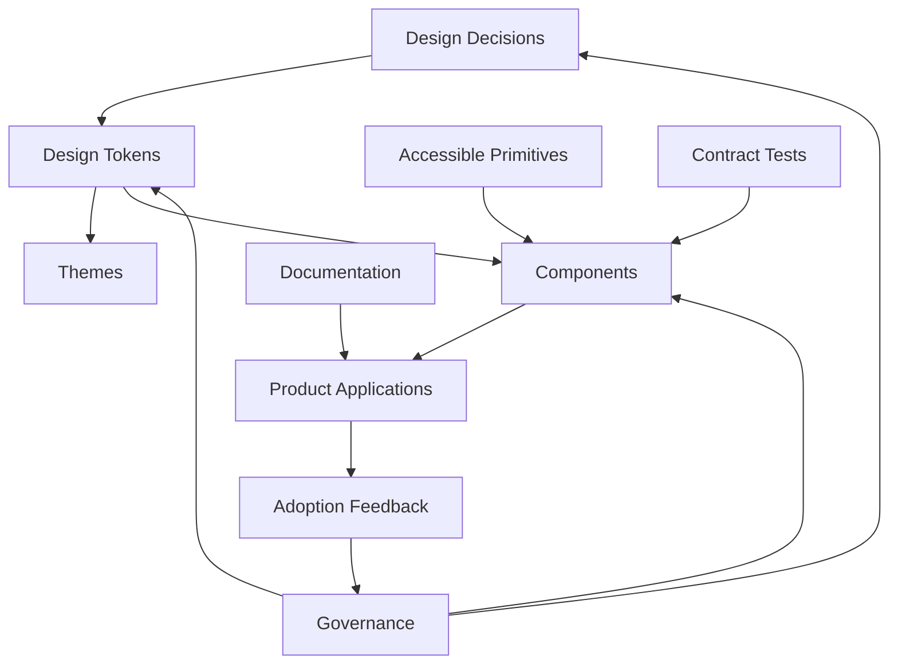
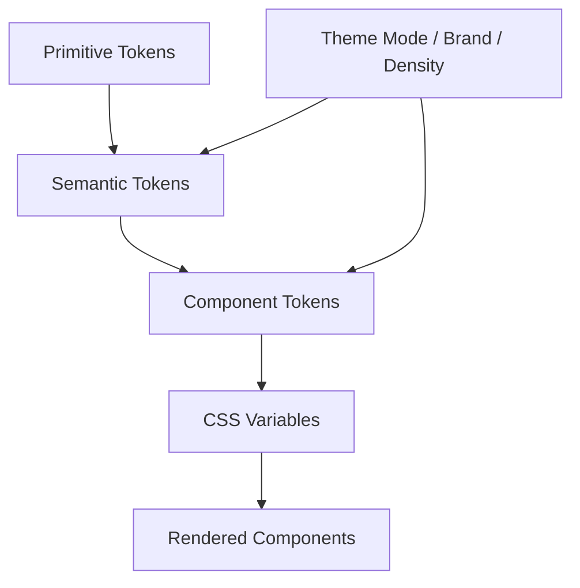
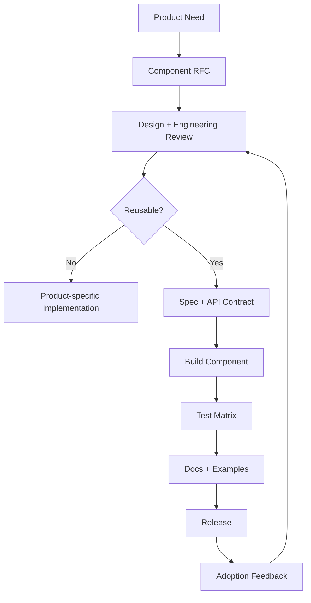

# Part 030 — Design System Engineering

A design system is not a component library.

A component library is a set of reusable UI components.

A design system is a product engineering system for making user interfaces consistent, accessible, maintainable, themeable, measurable, and evolvable across teams and applications.

```txt
Component library = reusable implementation pieces
Design system     = decisions, contracts, tokens, components, documentation, governance, and migration path
```

In high-performing engineering organizations, the design system behaves like an internal platform. It has customers, APIs, versioning, compatibility guarantees, operational metrics, and a support model.

This part treats design system work as frontend platform engineering.

---

## 1. Kaufman Skill Deconstruction

To become strong at design system engineering, decompose the skill into observable sub-skills.

| Sub-skill | What You Must Be Able To Do | Common Failure |
|---|---|---|
| Token modeling | Represent design decisions as typed, layered, themeable tokens | Raw hex values and spacing constants scattered everywhere |
| Primitive design | Build low-level accessible primitives with stable contracts | Over-specific components that cannot compose |
| Component API design | Design props/events/slots that encode intent and prevent misuse | Boolean explosion and ambiguous prop combinations |
| Accessibility contracts | Bake keyboard, focus, ARIA, semantics, and screen reader behavior into components | Accessibility depends on every product engineer remembering details |
| Theming | Support brand, density, color mode, contrast, and tenant variation safely | Runtime style overrides that break invariants |
| Documentation | Explain usage, constraints, examples, anti-patterns, and migration | Storybook full of screenshots but no decision guidance |
| Testing | Validate visual, behavioral, accessibility, and API contracts | Snapshot tests that catch little and annoy everyone |
| Versioning | Evolve components without breaking product teams unpredictably | Breaking CSS/prop changes shipped as minor updates |
| Governance | Decide contribution, review, ownership, deprecation, and support policies | Design system becomes either bottleneck or junk drawer |
| Adoption strategy | Migrate products incrementally with codemods and compatibility layers | Big-bang rewrite that never finishes |

### Kaufman target performance

After this part, you should be able to review a design system component and produce an engineering assessment like this:

```txt
Component: Dialog
Layer: accessible primitive + product wrapper
Contract: controlled/uncontrolled open state; focus trap; restore focus; Escape; outside click policy
Accessibility: role="dialog"/"alertdialog"; aria-labelledby; aria-describedby; inert background; keyboard tests
Tokens: surface, overlay, radius, elevation, spacing, motion.duration.fast
Theming: supports color mode and density through semantic tokens only
API risk: avoid boolean pair isModal/isDismissible; use mode/policy object instead
Testing: unit behavior, Playwright focus cycle, axe, visual regression across themes/RTL
Versioning: adding closeReason is minor; changing focus behavior is breaking
Migration: legacy modal adapter available for one release line
```

That is engineering-level design system thinking.

---

## 2. Core Mental Model: A Design System Is an API

Every design system exposes APIs:

```txt
- token API
- component API
- CSS variable API
- theme API
- accessibility behavior API
- documentation API
- migration API
- governance API
```

If consumers depend on it, it is an API whether you acknowledge it or not.



A design system without API discipline becomes shared technical debt.

---

## 3. The Layer Model

A scalable design system should have layers.

```txt
Layer 0: Foundations
  color, typography, spacing, radius, elevation, motion, breakpoints

Layer 1: Tokens
  primitive tokens, semantic tokens, component tokens

Layer 2: Primitives
  ButtonBase, DialogPrimitive, PopoverPrimitive, VisuallyHidden, FocusScope

Layer 3: Components
  Button, Dialog, Select, Tabs, Table, Alert, Toast

Layer 4: Patterns
  Search form, filter panel, confirmation dialog, empty state, wizard stepper

Layer 5: Product templates
  Case dashboard, enforcement workflow page, review queue, admin console
```

### Why layers matter

| Layer | Stability Expectation | Consumer |
|---|---|---|
| Foundations | High | Designers + system engineers |
| Tokens | Very high | Components + products + themes |
| Primitives | High | Design system engineers |
| Components | High | Product engineers |
| Patterns | Medium | Product teams |
| Templates | Lower | Specific product domains |

Do not force every abstraction into one component layer.

---

## 4. Design Tokens: Decisions as Data

Design tokens are named design decisions.

Bad:

```css
.button {
  background: #2563eb;
  border-radius: 6px;
  padding: 8px 12px;
}
```

Better:

```css
.button {
  background: var(--color-action-primary-bg);
  border-radius: var(--radius-control-md);
  padding-block: var(--space-2);
  padding-inline: var(--space-3);
}
```

Tokens let teams change design decisions without hunting raw values across codebases.

### Token taxonomy

| Token Type | Example | Meaning |
|---|---|---|
| Primitive token | `color.blue.600` | Raw palette/reference value |
| Semantic token | `color.action.primary.bg` | Role-based decision |
| Component token | `button.primary.bg` | Component-specific decision |
| Alias token | `color.brand.default -> color.blue.600` | Reference indirection |
| Mode token | `color.surface.default` in light/dark | Context-specific value |
| Density token | `control.height.compact` | UI density variant |

### Primitive vs semantic token

Primitive token:

```json
{
  "color": {
    "blue": {
      "600": { "$value": "#2563eb", "$type": "color" }
    }
  }
}
```

Semantic token:

```json
{
  "color": {
    "action": {
      "primary": {
        "bg": { "$value": "{color.blue.600}", "$type": "color" }
      }
    }
  }
}
```

Product components should usually consume semantic or component tokens, not raw primitive tokens.

---

## 5. Token Layering and Theme Resolution

A robust token system separates raw values from role-based decisions.



### Example resolution

```txt
color.blue.600 = #2563eb
color.action.primary.bg = {color.blue.600}
button.primary.bg = {color.action.primary.bg}
--button-primary-bg = resolved value
```

### Why not use primitive tokens everywhere?

Because primitive tokens encode appearance, not intent.

```txt
color.blue.600 means “a blue value.”
color.action.primary.bg means “primary action background.”
```

Intent survives redesign better than appearance.

### Token invariants

| Invariant | Explanation |
|---|---|
| Product code avoids raw values | Raw hex/spacing values bypass system governance |
| Semantic tokens encode intent | Components should not know palette internals |
| Token names are stable APIs | Renaming tokens is a breaking change |
| Modes are complete | Dark/high-contrast themes cannot miss token values |
| Tokens are typed | Color, dimension, duration, font, shadow are not interchangeable |
| Token output is automated | Do not manually sync design and code values |

---

## 6. CSS Variables as Runtime Token Delivery

CSS custom properties are the common runtime delivery mechanism for web tokens.

```css
:root {
  --color-action-primary-bg: #2563eb;
  --color-action-primary-fg: #ffffff;
  --radius-control-md: 0.375rem;
  --space-2: 0.5rem;
  --space-3: 0.75rem;
}

[data-theme="dark"] {
  --color-action-primary-bg: #60a5fa;
  --color-action-primary-fg: #0f172a;
}
```

Component:

```css
.buttonPrimary {
  background: var(--color-action-primary-bg);
  color: var(--color-action-primary-fg);
  border-radius: var(--radius-control-md);
  padding-block: var(--space-2);
  padding-inline: var(--space-3);
}
```

### Benefits

```txt
- runtime theme switching
- cascade-based scoping
- less JS for visual changes
- browser-native inheritance
- compatibility with SSR
- easier tenant/brand theming
```

### Risks

| Risk | Mitigation |
|---|---|
| Token missing at runtime | Build validation + fallback policy |
| Arbitrary overrides | Public/private token boundary |
| Cascade surprises | Theme scope documentation |
| Performance issues with huge variable sets | Scope tokens reasonably |
| Debugging complexity | DevTools-friendly naming |

---

## 7. Component API Design

A component API should make correct usage easy and incorrect usage hard.

Bad:

```tsx
<Button primary secondary danger large small disabled loading icon text />
```

This creates impossible states.

Better:

```tsx
type ButtonVariant = "primary" | "secondary" | "danger" | "ghost";
type ButtonSize = "sm" | "md" | "lg";

type ButtonProps = {
  variant?: ButtonVariant;
  size?: ButtonSize;
  isLoading?: boolean;
  leadingIcon?: React.ReactNode;
  trailingIcon?: React.ReactNode;
  children: React.ReactNode;
} & React.ButtonHTMLAttributes<HTMLButtonElement>;
```

Better still: encode state-specific requirements.

```tsx
type LoadingButtonProps = {
  isLoading: true;
  loadingLabel: string;
  children: React.ReactNode;
};

type IdleButtonProps = {
  isLoading?: false;
  loadingLabel?: never;
  children: React.ReactNode;
};

type ButtonProps = (LoadingButtonProps | IdleButtonProps) & {
  variant?: "primary" | "secondary" | "danger";
};
```

Now loading buttons must provide accessible loading text.

### Component API invariants

| Invariant | Explanation |
|---|---|
| Props express intent | `variant="danger"`, not `red` |
| Invalid combinations are impossible | Use unions instead of boolean explosion |
| Native behavior is preserved | Button should still accept button attributes where safe |
| Accessibility is represented | Icon-only buttons require labels |
| Escape hatches are explicit | `className`/`slotProps` policy documented |
| Breaking changes are treated as API changes | Visual behavior can be breaking too |

---

## 8. Controlled vs Uncontrolled Components

Design system components often need state ownership flexibility.

### Controlled component

```tsx
<Dialog open={isOpen} onOpenChange={setIsOpen} />
```

Consumer owns state.

### Uncontrolled component

```tsx
<Dialog defaultOpen />
```

Component owns state.

### Hybrid contract

```tsx
type ControllableStateProps<T> = {
  value?: T;
  defaultValue?: T;
  onValueChange?: (value: T) => void;
};
```

### Invariants

| Invariant | Explanation |
|---|---|
| Do not switch controlledness silently | Warn or document behavior |
| Controlled state is source of truth | Internal state must not drift |
| Change callback includes reason when needed | Dialog close via Escape vs submit can matter |
| Default value only initializes | Later changes to default should not reset unexpectedly |

### Close reason example

```ts
type DialogCloseReason =
  | "escapeKey"
  | "outsidePointer"
  | "closeButton"
  | "submitSuccess"
  | "programmatic";

type DialogProps = {
  open?: boolean;
  defaultOpen?: boolean;
  onOpenChange?: (open: boolean, reason: DialogCloseReason) => void;
};
```

This is better than a bare boolean event because consumers can encode domain policy.

---

## 9. Composition Over Configuration

Design system components must balance power and simplicity.

Configuration-heavy API:

```tsx
<DataTable
  columns={columns}
  showFilters
  showExport
  enableBulkActions
  enableRowExpansion
  enableColumnPinning
  enableStickyHeader
  emptyStateTitle="No cases"
  emptyStateActionLabel="Create case"
/>
```

Composition-oriented API:

```tsx
<DataTable.Root data={cases}>
  <DataTable.Toolbar>
    <CaseFilters />
    <ExportButton />
  </DataTable.Toolbar>
  <DataTable.Header columns={columns} />
  <DataTable.Body />
  <DataTable.EmptyState>
    <EmptyState title={t("cases.empty.title")} />
  </DataTable.EmptyState>
</DataTable.Root>
```

### Decision rule

Use configuration when:

```txt
- variation is small and finite
- behavior is standardized
- consistency matters more than flexibility
```

Use composition when:

```txt
- product variation is large
- teams need custom content
- layout slots are natural
- state needs explicit ownership
```

### Anti-pattern

A “universal enterprise table” that attempts to cover every workflow through props usually becomes unmaintainable.

Prefer:

```txt
- low-level table primitives
- standard table patterns
- product-specific wrappers
```

---

## 10. Accessibility as a System Contract

The design system should absorb accessibility complexity.

Example: Dialog component contract.

```txt
Dialog must:
- render correct role
- associate title/description
- move focus into dialog on open
- trap focus while modal
- restore focus to opener on close
- close on Escape when allowed
- hide/inert background where appropriate
- prevent background scroll if modal
- support screen reader announcement
- expose deterministic test hooks or roles
```

Product teams should not re-implement this per feature.

### Accessibility contract example

```tsx
type DialogProps = {
  open?: boolean;
  defaultOpen?: boolean;
  onOpenChange?: (open: boolean, reason: DialogCloseReason) => void;
  modal?: boolean;
  initialFocusRef?: React.RefObject<HTMLElement>;
  restoreFocus?: boolean;
  children: React.ReactNode;
};
```

### Icon button contract

```tsx
type IconButtonProps = {
  "aria-label": string;
  icon: React.ReactNode;
  variant?: "plain" | "subtle" | "solid";
};
```

Do not allow icon-only buttons without accessible names.

---

## 11. Headless Components and Primitives

A headless component provides behavior and accessibility without prescribing visual style.

Examples:

```txt
DialogPrimitive
PopoverPrimitive
TabsPrimitive
ComboboxPrimitive
MenuPrimitive
TooltipPrimitive
FocusScope
DismissableLayer
VisuallyHidden
```

### Why headless primitives matter

| Benefit | Explanation |
|---|---|
| Behavior reuse | Focus/keyboard logic implemented once |
| Visual flexibility | Product/design can style separately |
| Accessibility consistency | ARIA and keyboard patterns centralized |
| Lower duplication | Teams do not rebuild tricky widgets |
| Easier testing | Primitive contract can be tested directly |

### Risk

Headless primitives are still APIs. If too low-level, every consumer assembles them incorrectly.

A mature system usually provides both:

```txt
- primitives for design system authors
- opinionated components for product engineers
```

---

## 12. Styling Architecture

A design system needs a styling strategy that survives scale.

Options include:

| Strategy | Strength | Risk |
|---|---|---|
| Global CSS | Simple, platform-native | Collision and implicit dependencies |
| CSS Modules | Local scoping | Harder cross-component theming if unmanaged |
| CSS-in-JS runtime | Dynamic styling power | Runtime cost, SSR complexity |
| Compile-time CSS-in-JS | Type-safe/generated CSS | Tooling complexity |
| Utility CSS | Fast composition | Token drift if not governed |
| Web Components styles | Encapsulation | Theming and framework integration concerns |

There is no universal winner. Evaluate against:

```txt
- SSR requirements
- runtime performance
- theming needs
- design token integration
- component package distribution
- team familiarity
- debugging experience
- framework portability
```

### Styling invariants

| Invariant | Explanation |
|---|---|
| Styles consume tokens | Raw values are exceptions |
| Component internals are protected | Avoid consumers depending on private DOM structure |
| Public styling hooks are documented | Provide slots/classes/tokens intentionally |
| SSR output is deterministic | Avoid hydration style mismatch |
| Critical styles load early | Prevent unstyled/flashing UI |
| Themes do not require rerender when CSS can solve it | Prefer CSS variables for visual mode changes |

---

## 13. Escape Hatches

Consumers will need escape hatches.

Bad policy:

```txt
No escape hatches ever.
```

This causes forks and copy-paste components.

Also bad:

```txt
Override anything with arbitrary CSS.
```

This destroys consistency and makes upgrades risky.

### Better escape hatch hierarchy

| Escape Hatch | Risk | Example |
|---|---|---|
| Variant prop | Low | `variant="danger"` |
| Size/density prop | Low | `size="compact"` |
| Slots | Medium | `footer={<CustomFooter />}` |
| Slot props | Medium | `slotProps={{ trigger: { id } }}` |
| Data attributes | Medium | `[data-state="open"]` |
| CSS variables | Medium | `--card-padding` |
| `className` | Medium/high | Scoped external class |
| Raw style | High | One-off visual override |
| DOM structure dependency | Very high | Consumer targets `.button > span:first-child` |
| Forking | Highest | Copy component into app |

Document which escape hatches are stable API.

---

## 14. Theming Beyond Dark Mode

Theming may include:

```txt
- light/dark color mode
- high contrast
- brand/tenant identity
- density
- platform theme
- motion preference
- typography scale
- jurisdiction-specific visual standards
```

### Theme dimensions

```ts
type ThemeConfig = {
  colorMode: "light" | "dark";
  contrast: "normal" | "high";
  density: "comfortable" | "compact";
  brand: "default" | "agency" | "partner";
  motion: "normal" | "reduced";
};
```

### Theme resolution problem

Naively combining dimensions creates explosion.

```txt
2 color modes × 2 contrast modes × 2 densities × 5 brands = 40 theme variants
```

Instead, layer tokens by concern:

```txt
base primitives
brand aliases
semantic tokens
color mode overrides
contrast overrides
density overrides
component tokens
```

### Theme invariants

| Invariant | Explanation |
|---|---|
| Themes are complete | No missing token under any supported combination |
| Contrast is tested | Dark mode alone does not guarantee accessibility |
| Density preserves target size | Compact mode must not break usability |
| Brand cannot override semantics unsafely | Danger should not look like success |
| Theme switch avoids layout jump | Token changes should be stable where possible |
| User preference is respected | `prefers-color-scheme`, `prefers-reduced-motion` where appropriate |

---

## 15. Motion Tokens and Interaction Feedback

Motion is part of the design system.

Tokens:

```json
{
  "motion": {
    "duration": {
      "fast": { "$value": "120ms", "$type": "duration" },
      "normal": { "$value": "200ms", "$type": "duration" },
      "slow": { "$value": "320ms", "$type": "duration" }
    },
    "easing": {
      "standard": { "$value": "cubic-bezier(0.2, 0, 0, 1)", "$type": "cubicBezier" }
    }
  }
}
```

CSS:

```css
.popover {
  transition-duration: var(--motion-duration-fast);
  transition-timing-function: var(--motion-easing-standard);
}

@media (prefers-reduced-motion: reduce) {
  .popover {
    transition-duration: 1ms;
  }
}
```

### Motion invariants

| Invariant | Explanation |
|---|---|
| Motion has semantic purpose | Not only decoration |
| Reduced motion is respected | Avoid vestibular issues |
| Motion does not block interaction | Long animations delay workflow |
| Exit animations coordinate with unmount | Avoid disappearing focus target |
| Tests account for animation | E2E should not be flaky due to transitions |

---

## 16. Component State Taxonomy

Every component has states.

For a button:

```txt
default
hover
active
focus-visible
disabled
loading
pressed
selected
invalid? maybe no, unless toggle-like
```

For an input:

```txt
empty
filled
focused
disabled
readonly
invalid
required
dirty
loading validation
success
```

For async data component:

```txt
idle
loading
success-empty
success-data
error-retryable
error-permission
offline
stale
refreshing
```

### State design invariant

```txt
A design system component must define visual, semantic, and behavioral output for every supported state.
```

### State table example

| State | Visual | Semantics | Behavior |
|---|---|---|---|
| Loading button | Spinner + label | `aria-busy` or loading text policy | Prevent duplicate submit if configured |
| Disabled button | Muted | `disabled` if native button | Not focusable by default |
| Pressed toggle | Active style | `aria-pressed=true` | Activation toggles state |
| Invalid input | Error style | `aria-invalid`, `aria-describedby` | Error announced/linked |

---

## 17. Component Contract Documentation

Good docs are not just examples. They encode decisions.

A component page should include:

```txt
- purpose
- when to use
- when not to use
- anatomy
- props/API
- accessibility behavior
- keyboard interaction
- content guidelines
- token references
- theming behavior
- examples
- anti-patterns
- migration notes
- testing guidance
```

### Example documentation skeleton

```mdx
# Dialog

## Purpose
Use Dialog when the user must complete or acknowledge a focused task before returning to the page.

## When Not To Use
Do not use Dialog for non-blocking status messages; use Toast or InlineAlert.

## Accessibility
- Uses role="dialog" by default.
- Requires visible title.
- Moves focus inside on open.
- Restores focus on close.
- Escape closes unless `escapeKeyBehavior="ignore"`.

## API
...

## Anti-patterns
- Do not put large multi-step workflows in a small dialog.
- Do not open a dialog from page load without user context.
```

Docs are part of the system's runtime because they shape usage.

---

## 18. Testing Design System Components

Testing must validate contracts, not implementation trivia.

### Test layers

| Layer | What To Test |
|---|---|
| Type tests | Invalid prop combinations fail |
| Unit tests | State transitions and pure logic |
| Component tests | Rendered roles, labels, events |
| Accessibility tests | Axe/static checks plus manual pattern coverage |
| Keyboard tests | Tab, arrows, Escape, Enter, Space |
| Visual regression | Themes, states, density, RTL |
| E2E smoke | Critical components in real app contexts |
| Package tests | Build output, tree shaking, SSR import safety |

### Example behavioral test

```tsx
it("requires accessible label for icon-only button", () => {
  // Prefer TypeScript type-level enforcement, plus runtime dev warning if needed.
});
```

### Playwright focus test example

```ts
test("dialog traps and restores focus", async ({ page }) => {
  await page.goto("/design-system/dialog");
  await page.getByRole("button", { name: "Open dialog" }).click();

  await expect(page.getByRole("dialog")).toBeVisible();
  await expect(page.getByRole("button", { name: "Confirm" })).toBeFocused();

  await page.keyboard.press("Escape");
  await expect(page.getByRole("button", { name: "Open dialog" })).toBeFocused();
});
```

### Visual matrix

```txt
Button:
- variants: primary, secondary, danger, ghost
- sizes: sm, md, lg
- states: default, hover, active, focus, disabled, loading
- themes: light, dark, high contrast
- directions: ltr, rtl
- density: comfortable, compact
```

You cannot snapshot every permutation forever. Select risk-based coverage.

---

## 19. Versioning and Compatibility

Design system versioning is harder than normal library versioning because visual and behavioral changes can break workflows.

### Breaking changes include

```txt
- removing prop
- changing prop meaning
- changing DOM structure if consumers rely on it
- changing CSS variable names
- changing token names
- changing keyboard behavior
- changing focus behavior
- changing default variant
- changing spacing that breaks layout
- changing z-index/elevation policy
- changing SSR output shape
```

### SemVer interpretation

| Version Type | Examples |
|---|---|
| Patch | Bug fix that preserves API/behavior; accessibility correction with minimal visual change |
| Minor | New component, new prop, new token alias, additive variant |
| Major | Removed prop, renamed token, changed behavior/defaults, incompatible DOM/styling contract |

### Deprecation pattern

```txt
1. Introduce new API.
2. Keep old API with warning.
3. Provide migration docs.
4. Provide codemod if possible.
5. Track adoption.
6. Remove in next major.
```

### Runtime warning example

```ts
if (process.env.NODE_ENV !== "production") {
  if (props.isPrimary !== undefined) {
    console.warn(
      "Button: `isPrimary` is deprecated. Use `variant=\"primary\"` instead."
    );
  }
}
```

---

## 20. Migration Strategy

A design system rarely starts from a clean slate.

You inherit:

```txt
- legacy CSS
- inconsistent components
- product-specific forks
- old token names
- ad hoc themes
- inaccessible custom widgets
- duplicated form controls
- abandoned Storybook stories
```

### Migration approaches

| Approach | When It Works | Risk |
|---|---|---|
| Big-bang rewrite | Small app, strong mandate | Usually fails at scale |
| Opportunistic replacement | Teams already touching screens | Slow, inconsistent |
| Compatibility wrapper | Legacy API mapped to new component | Temporary complexity |
| Codemod migration | API shape can be transformed | Requires strong tests |
| Route-by-route modernization | Product workflows isolated | Needs long-term tracking |
| Token-first migration | Visual consistency first | Behavior/accessibility may remain broken |

### Practical migration plan

```txt
1. Inventory components and usage.
2. Identify high-risk/high-volume primitives: Button, Input, Dialog, Select, Table.
3. Define token foundation.
4. Build compatibility wrappers for top components.
5. Add lint rule against new raw values/legacy imports.
6. Migrate critical workflows first.
7. Track adoption dashboard.
8. Deprecate old APIs with deadlines.
9. Remove after major release or product milestone.
```

---

## 21. Governance Model

Without governance, a design system becomes either a bottleneck or a junk drawer.

### Governance questions

```txt
- Who owns foundations/tokens?
- Who approves new components?
- Who can change component APIs?
- What counts as breaking change?
- How are accessibility requirements enforced?
- How are product-specific needs evaluated?
- How are bugs prioritized?
- What is the support SLA?
- How do teams contribute safely?
- How is adoption measured?
```

### Contribution flow



### RFC template

```md
# Component RFC: [Name]

## Problem
What user/product problem does this solve?

## Existing Alternatives
Can current components solve this?

## Proposed API
Props, slots, events, tokens.

## Accessibility Contract
Roles, keyboard behavior, focus, announcements.

## Theming/Token Needs
New tokens or aliases.

## Migration Impact
Existing usages affected?

## Open Questions
Trade-offs and unresolved constraints.
```

---

## 22. Component Admission Criteria

Not every useful UI belongs in the design system.

A component should be admitted when:

```txt
- multiple teams need it
- behavior is reusable
- accessibility is non-trivial
- consistency matters
- design has stable enough pattern
- maintenance owner exists
- API can be generalized without overfitting
```

A component should stay product-local when:

```txt
- it is domain-specific
- requirements are unstable
- only one team uses it
- abstraction would hide important business logic
- design is experimental
```

### Rule

```txt
Promote patterns after repeated evidence, not before understanding variation.
```

Premature design-system abstraction creates rigid components that either block teams or acquire dozens of props.

---

## 23. Public vs Private API

A design system must define what consumers may depend on.

Public API:

```txt
- documented props
- documented events
- documented slots
- documented CSS variables
- documented data attributes
- documented token names
- documented keyboard behavior
```

Private implementation:

```txt
- internal DOM nesting
- internal class names
- internal helper components
- private token aliases
- implementation-specific effects
```

### Why it matters

If consumers depend on private DOM structure, you cannot refactor internals safely.

Bad consumer CSS:

```css
.myPage .ds-button > span:first-child {
  margin-left: -4px;
}
```

Better public hook:

```tsx
<Button slotProps={{ icon: { className: styles.icon } }} />
```

Or a component token:

```css
.myPage {
  --button-icon-gap: var(--space-1);
}
```

---

## 24. Design System and Frontend Architecture

The design system should not absorb application architecture.

Keep these separate:

| Concern | Belongs In Design System? |
|---|---|
| Button visual/interaction contract | Yes |
| Case approval business logic | No |
| Dialog focus management | Yes |
| Whether case can be deleted | No |
| Form field layout primitives | Yes |
| Regulatory validation rules | No |
| Toast primitive | Yes |
| Error message content | Usually product/domain |
| Data table primitive | Maybe |
| Enforcement queue filtering logic | No |

### Boundary rule

```txt
The design system owns UI behavior and presentation contracts.
Product code owns domain decisions and workflow semantics.
```

### Domain wrapper pattern

```tsx
function DeleteCaseDialog({ caseId }: { caseId: string }) {
  const t = useTranslations("case.deleteDialog");
  const mutation = useDeleteCaseMutation(caseId);

  return (
    <Dialog>
      <Dialog.Title>{t("title")}</Dialog.Title>
      <Dialog.Description>{t("description")}</Dialog.Description>
      <Dialog.Footer>
        <Button variant="secondary">{t("cancel")}</Button>
        <Button variant="danger" onClick={() => mutation.mutate()}>
          {t("confirm")}
        </Button>
      </Dialog.Footer>
    </Dialog>
  );
}
```

The design system provides `Dialog` and `Button`. Product owns case deletion semantics.

---

## 25. Performance Considerations

Design system code is multiplied across the product.

Small inefficiencies become systemic.

### Performance risks

| Risk | Example |
|---|---|
| Heavy components | Every button imports large icon library |
| Runtime style cost | CSS-in-JS recalculates styles per render |
| Poor tree shaking | Importing one component bundles all components |
| Excessive context updates | Theme/state provider rerenders entire app |
| Uncontrolled layout cost | Components measure layout during render/effect |
| Animation jank | Expensive properties animated by default |
| Huge token payload | All themes loaded for every user |

### Package design

```txt
@org/design-system/tokens
@org/design-system/primitives
@org/design-system/components/button
@org/design-system/components/dialog
@org/design-system/icons
@org/design-system/styles
```

Support direct imports if bundle size matters:

```ts
import { Button } from "@org/design-system/button";
```

### Performance invariants

| Invariant | Explanation |
|---|---|
| Components are tree-shakeable | Consumers pay for what they use |
| CSS loads predictably | Avoid FOUC and style waterfalls |
| Theme change is cheap | CSS variables over app-wide rerender where possible |
| Icons are optimized | Avoid importing entire icon sets |
| Measurements are intentional | Avoid forced layout in reusable components |
| Default animations are safe | No layout-triggering animation by default |

---

## 26. Packaging and Distribution

A design system package must work across target build environments.

### Package concerns

```txt
- ESM/CJS policy
- TypeScript declarations
- CSS distribution
- sideEffects field
- peer dependencies
- React/framework version compatibility
- SSR safety
- browser-only code guards
- tree shaking
- source maps
- changelog
```

### Example package exports

```json
{
  "name": "@org/design-system",
  "type": "module",
  "exports": {
    "./button": {
      "types": "./dist/button/index.d.ts",
      "import": "./dist/button/index.js"
    },
    "./dialog": {
      "types": "./dist/dialog/index.d.ts",
      "import": "./dist/dialog/index.js"
    },
    "./styles.css": "./dist/styles.css"
  },
  "sideEffects": [
    "**/*.css"
  ]
}
```

### SSR safety

Bad:

```ts
const prefersDark = window.matchMedia("(prefers-color-scheme: dark)").matches;
```

at module top-level.

Better:

```ts
function getPreferredColorMode() {
  if (typeof window === "undefined") {
    return "light";
  }

  return window.matchMedia("(prefers-color-scheme: dark)").matches ? "dark" : "light";
}
```

---

## 27. Documentation and Interactive Sandboxes

Storybook or equivalent documentation should be more than a gallery.

Useful docs include:

```txt
- controlled examples
- uncontrolled examples
- async examples
- form integration
- accessibility notes
- keyboard interaction table
- token table
- theme switcher
- RTL toggle
- density toggle
- error states
- loading states
- anti-pattern examples
- migration notes
```

### Story quality checklist

```txt
[ ] Shows default state
[ ] Shows all variants
[ ] Shows disabled/loading/error states
[ ] Shows long text
[ ] Shows icon and no-icon cases
[ ] Shows keyboard/focus behavior
[ ] Shows RTL
[ ] Shows dark/high contrast theme
[ ] Includes accessibility notes
[ ] Includes usage guidance
```

Docs should teach decisions, not just display components.

---

## 28. Linting and Static Enforcement

Adoption improves when correct behavior is enforced automatically.

Possible rules:

```txt
- no raw hex values in product CSS
- no direct use of deprecated tokens
- no import from internal design system paths
- icon-only button requires aria-label
- no legacy component imports
- no physical CSS properties in RTL-supported surfaces
- no unsupported variant names
- no hardcoded spacing outside allowed contexts
```

### Example ESLint-style intent

```txt
Rule: no-raw-design-values
Detect: #fff, #000, px spacing values, arbitrary box-shadow
Allow: token definition files, one-off documented exceptions
Fix: suggest semantic token
```

### Why linting matters

Review comments do not scale. Static enforcement turns design system policy into immediate feedback.

---

## 29. Observability and Adoption Metrics

A design system needs operational visibility.

Track:

```txt
- package versions used per app
- component usage counts
- deprecated API usage
- raw token/value violations
- accessibility test failures
- visual regression failures
- bundle size impact
- migration progress
- issue volume by component
- time to resolve design system bugs
```

### Adoption dashboard example

```txt
Application: enforcement-admin
Design system version: 3.4.2
Deprecated imports: 18
Raw color violations: 42
Legacy modal usages: 7
A11y component test failures: 0
Top components: Button 412, Input 203, Dialog 34, Table 19
Migration target: v4 by 2026-09-01
```

Metrics prevent design system work from becoming opinion-driven only.

---

## 30. Failure Modes at Scale

| Failure Mode | Symptom | Root Cause | Countermeasure |
|---|---|---|---|
| Junk drawer system | Too many inconsistent components | No admission criteria | RFC + ownership model |
| Bottleneck system | Teams wait weeks for simple changes | Central team owns everything | Contribution model + primitives |
| Forked components | Products copy and modify | Escape hatches missing | Stable customization API |
| Token chaos | Raw values everywhere | Token governance weak | Lint + token docs + migration |
| Accessibility regression | Each app implements behavior differently | A11y not centralized | Accessible primitives + tests |
| API explosion | Components have dozens of booleans | Over-configured abstraction | Composition + domain wrappers |
| Theme breakage | Dark/brand mode incomplete | Token matrix untested | Token completeness tests |
| Upgrade fear | Teams stuck on old version | Breaking changes unmanaged | SemVer + codemods + deprecation |
| Poor performance | Components bloat all apps | Packaging/tree-shaking weak | Import boundaries + bundle checks |

---

## 31. Case Study: Enforcement Platform Design System

Imagine a regulatory enforcement platform used by investigators, supervisors, legal reviewers, and external respondents.

### Product requirements

```txt
- dense data tables
- multi-step workflows
- legal confirmation dialogs
- status badges
- deadline alerts
- document upload flows
- audit-friendly UI states
- accessibility compliance
- internationalization
- tenant/jurisdiction theming
```

### Design system architecture

```txt
Foundations:
  color, typography, spacing, motion, elevation, radius, z-index

Tokens:
  semantic status tokens: success, warning, danger, info, neutral
  workflow tokens: overdue, dueSoon, blocked, escalated

Primitives:
  FocusScope, DialogPrimitive, TooltipPrimitive, MenuPrimitive

Components:
  Button, Badge, Alert, Dialog, FormField, TextArea, Select, DataTable

Patterns:
  ConfirmationDialog, DeadlineBanner, ReviewPanel, AssignmentPicker

Product wrappers:
  CaseStatusBadge, EnforcementActionButton, LegalNoticeDialog
```

### Important boundary

`Badge` belongs in the design system.

`CaseStatusBadge` may belong in a domain UI package because it maps regulatory case states to badge semantics.

```tsx
function CaseStatusBadge({ status }: { status: CaseStatus }) {
  const t = useTranslations("case.status");

  const variantByStatus = {
    OPEN: "info",
    UNDER_REVIEW: "warning",
    ESCALATED: "danger",
    CLOSED: "neutral",
  } as const;

  return (
    <Badge variant={variantByStatus[status]}>
      {t(status)}
    </Badge>
  );
}
```

The design system owns `Badge`. The domain package owns case semantics.

---

## 32. Capstone Exercise for This Part

Design a production-ready `Dialog` component spec.

Deliverables:

```txt
1. Component purpose and non-goals
2. Public API
3. Controlled/uncontrolled behavior
4. Accessibility contract
5. Keyboard behavior table
6. Focus lifecycle
7. Token usage
8. Theming behavior
9. RTL considerations
10. Test matrix
11. Migration plan from legacy modal
12. Versioning policy
```

### Starter API

```tsx
type DialogCloseReason =
  | "escapeKey"
  | "outsidePointer"
  | "closeButton"
  | "programmatic";

type DialogProps = {
  open?: boolean;
  defaultOpen?: boolean;
  onOpenChange?: (open: boolean, reason: DialogCloseReason) => void;
  modal?: boolean;
  initialFocusRef?: React.RefObject<HTMLElement>;
  restoreFocus?: boolean;
  children: React.ReactNode;
};
```

### Test matrix

```txt
Behavior:
  opens/closes
  controlled state
  uncontrolled state
  Escape policy
  outside click policy
  nested dialog policy

Accessibility:
  role/name/description
  initial focus
  focus trap
  restore focus
  screen reader announcement

Visual:
  light/dark
  high contrast
  compact density
  long title/body
  RTL

Integration:
  SSR import
  route transition cleanup
  form submit inside dialog
  async close after mutation
```

---

## 33. Production Readiness Checklist

```txt
[ ] Token taxonomy documented
[ ] Token build pipeline automated
[ ] Raw values blocked or tracked
[ ] Components consume semantic/component tokens
[ ] Public/private API boundary documented
[ ] Accessibility contracts written for interactive components
[ ] Keyboard behavior tested
[ ] Focus lifecycle tested
[ ] RTL and i18n considered
[ ] Theme matrix validated
[ ] Visual regression coverage exists
[ ] Package exports are tree-shakeable
[ ] SSR safety validated
[ ] Component docs include usage and anti-patterns
[ ] Deprecation policy exists
[ ] Changelog is maintained
[ ] Contribution RFC process exists
[ ] Adoption metrics are tracked
[ ] Migration path from legacy components exists
```

---

## 34. Summary

Design system engineering is frontend platform engineering.

The key mental models:

1. A design system is an API.
2. Tokens are design decisions as data.
3. Semantic tokens encode intent better than raw values.
4. Components need contracts, not just props.
5. Accessibility belongs in primitives and components by default.
6. Composition often scales better than configuration.
7. Theming is multi-dimensional, not just dark mode.
8. Documentation is part of the product API.
9. Versioning must account for visual and behavioral breaking changes.
10. Governance prevents both bottlenecks and chaos.

A top-tier frontend engineer does not merely consume design system components. They understand how design system decisions propagate through product architecture, accessibility, performance, localization, testing, and long-term maintainability.

---

## References

- Design Tokens Community Group: `https://www.designtokens.org/`
- Design Tokens Format Module: `https://www.designtokens.org/tr/drafts/format/`
- W3C Design Tokens Community Group: `https://www.w3.org/community/design-tokens/`
- MDN CSS Custom Properties: `https://developer.mozilla.org/en-US/docs/Web/CSS/--*`
- MDN CSS Logical Properties and Values: `https://developer.mozilla.org/en-US/docs/Web/CSS/CSS_logical_properties_and_values`
- WAI-ARIA Authoring Practices Guide: `https://www.w3.org/WAI/ARIA/apg/`
- Storybook Accessibility Testing: `https://storybook.js.org/docs/writing-tests/accessibility-testing`
