# learn-piano-accompaniment-part-000.md

# Learn Piano Accompaniment — Part 000
## Daftar Isi, Scope, Target Performa, dan Kontrak Belajar

> Seri: `learn-piano-accompaniment`  
> Format file: `learn-piano-accompaniment-part-000.md`  
> Target: mampu mengiringi penyanyi dengan piano/keyboard secara fungsional dalam konteks performa  
> Framework utama: *The First 20 Hours: How to Learn Anything... Fast* — Josh Kaufman  
> Audiens utama: software engineer / technical thinker yang ingin membangun skill musikal secara sistematis tanpa kehilangan rasa musikalitas

---

## Status Seri

Ini adalah **Part 000** dari seri `learn-piano-accompaniment`.

Seri ini **belum selesai**. Part ini adalah pembukaan, peta besar, dan kontrak belajar. Materi teknis piano dimulai secara bertahap dari Part 001 dan seterusnya.

---

## Daftar Isi Part 000

1. [Tujuan Part Ini](#1-tujuan-part-ini)
2. [Definisi: Apa Maksud “Menulis Piano” di Seri Ini?](#2-definisi-apa-maksud-menulis-piano-di-seri-ini)
3. [Target Akhir 20 Jam Pertama](#3-target-akhir-20-jam-pertama)
4. [Yang Sengaja Tidak Kita Kejar di 20 Jam Pertama](#4-yang-sengaja-tidak-kita-kejar-di-20-jam-pertama)
5. [Framework Kaufman yang Dipakai](#5-framework-kaufman-yang-dipakai)
6. [Penerjemahan Framework Kaufman ke Piano Pengiring](#6-penerjemahan-framework-kaufman-ke-piano-pengiring)
7. [Mental Model untuk Software Engineer](#7-mental-model-untuk-software-engineer)
8. [Skill Tree Piano Pengiring](#8-skill-tree-piano-pengiring)
9. [Performance Definition: Seperti Apa “Cukup Bisa”?](#9-performance-definition-seperti-apa-cukup-bisa)
10. [Roadmap 20 Jam Pertama](#10-roadmap-20-jam-pertama)
11. [Output Konkret Setelah 20 Jam](#11-output-konkret-setelah-20-jam)
12. [Baseline Assessment Sebelum Mulai](#12-baseline-assessment-sebelum-mulai)
13. [Setup Minimal](#13-setup-minimal)
14. [Cara Menggunakan Seri Ini](#14-cara-menggunakan-seri-ini)
15. [Practice Log dan Metrik Progress](#15-practice-log-dan-metrik-progress)
16. [Prinsip Latihan: Lagu Dulu, Teori Secukupnya](#16-prinsip-latihan-lagu-dulu-teori-secukupnya)
17. [Kriteria Lagu Latihan](#17-kriteria-lagu-latihan)
18. [Failure Mode yang Harus Diantisipasi](#18-failure-mode-yang-harus-diantisipasi)
19. [Kontrak 20 Jam](#19-kontrak-20-jam)
20. [Peta Seluruh Seri](#20-peta-seluruh-seri)
21. [Checklist Selesai Part 000](#21-checklist-selesai-part-000)
22. [Referensi Ringkas](#22-referensi-ringkas)

---

# 1. Tujuan Part Ini

Part ini bukan latihan jari, bukan teori chord, dan bukan tutorial lagu tertentu.

Part ini adalah **arsitektur belajar**.

Sebelum belajar piano, kita harus memperjelas beberapa hal:

- skill apa yang sebenarnya ingin dicapai;
- skill mana yang penting untuk performa;
- skill mana yang bisa ditunda;
- apa bentuk performa minimal yang dianggap berhasil;
- bagaimana 20 jam latihan akan dipakai;
- bagaimana menghindari jebakan belajar terlalu luas;
- bagaimana cara mengevaluasi diri tanpa guru setiap hari;
- bagaimana mengubah cara pikir deterministik menjadi alat bantu, bukan hambatan.

Jika bagian ini dilewati, risiko terbesarnya adalah belajar piano secara terlalu umum:

- hari ini belajar scale;
- besok belajar not balok;
- lusa belajar lagu random;
- minggu depan menonton tutorial voicing jazz;
- akhirnya merasa banyak belajar tetapi belum bisa mengiringi satu penyanyi dengan stabil.

Seri ini menghindari itu.

Kita akan memperlakukan piano pengiring sebagai **skill operasional**: sesuatu yang harus bekerja di situasi nyata, di depan penyanyi, dalam tempo, dengan struktur lagu, dengan risiko salah, dan dengan kebutuhan recovery.

---

# 2. Definisi: Apa Maksud “Menulis Piano” di Seri Ini?

Istilah “menulis piano” bisa berarti banyak hal:

1. menulis partitur piano;
2. membuat aransemen piano;
3. membuat chord progression;
4. membuat iringan piano untuk lagu;
5. memainkan piano sambil membaca chord;
6. membuat piano accompaniment untuk penyanyi;
7. composing lagu dari piano.

Dalam seri ini, definisi yang dipakai adalah:

> **Menulis piano = merancang dan memainkan iringan piano yang mendukung penyanyi dalam sebuah lagu.**

Jadi fokusnya bukan piano sebagai instrumen solo, melainkan piano sebagai **support system untuk vokal**.

Piano pengiring yang baik tidak selalu terdengar rumit. Justru sering kali piano pengiring yang baik adalah piano yang:

- memberi fondasi harmoni;
- menjaga pulse;
- memberi ruang untuk vokal;
- membangun emosi lagu;
- tahu kapan diam;
- tahu kapan mengisi;
- bisa membuka lagu dengan jelas;
- bisa menutup lagu dengan bersih;
- bisa mengikuti napas dan phrasing penyanyi.

## 2.1 Perbedaan Pianis Solo dan Pianis Pengiring

| Aspek | Pianis Solo | Pianis Pengiring Penyanyi |
|---|---|---|
| Pusat perhatian | Piano | Vokal |
| Prioritas | Kelengkapan musikal | Dukungan terhadap penyanyi |
| Ruang frekuensi | Boleh penuh | Harus menyisakan ruang |
| Ritme | Bisa lebih bebas | Harus cukup stabil untuk penyanyi |
| Melodi | Biasanya dimainkan piano | Biasanya dinyanyikan vokal |
| Error utama | Salah nada terdengar jelas | Menutupi penyanyi atau membuat penyanyi kehilangan pijakan |
| Kompetensi minimal | Bisa memainkan karya utuh | Bisa memberi harmoni, tempo, mood, cue, dan ending |

Pianis solo bisa memainkan banyak detail karena ia membawa seluruh lagu sendiri.

Pianis pengiring harus berpikir berbeda: **vokal adalah primary thread**, piano adalah supporting thread.

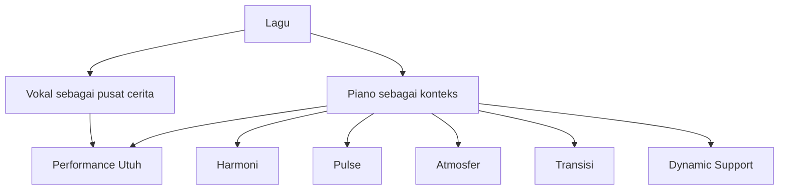

---

# 3. Target Akhir 20 Jam Pertama

Target 20 jam pertama harus spesifik.

Target yang terlalu luas:

> “Saya ingin bisa piano.”

Target yang lebih baik:

> “Saya ingin bisa mengiringi penyanyi dengan piano untuk beberapa lagu sederhana.”

Target seri ini:

> Setelah 20 jam latihan terarah, Anda mampu mengiringi satu penyanyi dalam 3 lagu sederhana menggunakan piano/keyboard dengan chord benar, tempo cukup stabil, pola iringan dasar, intro sederhana, ending bersih, dan kontrol dinamika yang tidak menutupi vokal.

## 3.1 Bentuk Performa Minimal

Pada akhir 20 jam pertama, Anda harus bisa:

1. membaca chord chart sederhana;
2. menemukan nada dasar di keyboard;
3. memainkan chord mayor dan minor dasar;
4. memainkan progresi 4 chord umum;
5. memakai tangan kiri untuk bass/root;
6. memakai tangan kanan untuk chord;
7. memainkan minimal 2 pola iringan:
   - block chord sederhana;
   - broken chord/arpeggio sederhana;
8. menjaga tempo dalam 4/4 lambat sampai sedang;
9. membuat intro 2 atau 4 bar;
10. membuat ending sederhana;
11. membedakan verse dan chorus secara dinamis;
12. tidak bermain terlalu penuh saat vokal masuk;
13. recover jika salah chord ringan;
14. mengiringi lagu dari awal sampai akhir tanpa berhenti.

## 3.2 Ukuran Keberhasilan

Anda dianggap berhasil pada 20 jam pertama jika bisa merekam 3 lagu latihan dengan kriteria berikut:

| Area | Kriteria Minimal |
|---|---|
| Chord | 90% chord benar atau recovery cepat |
| Tempo | tidak berhenti; tempo tidak collapse |
| Struktur | tidak tersesat di verse/chorus/bridge |
| Intro | penyanyi tahu kapan masuk |
| Ending | lagu selesai dengan jelas |
| Dinamika | chorus lebih besar dari verse |
| Ruang vokal | piano tidak menutupi melodi utama |
| Recovery | salah kecil tidak membuat lagu berhenti |

Tujuannya bukan “sempurna”. Tujuannya adalah **performable**.

---

# 4. Yang Sengaja Tidak Kita Kejar di 20 Jam Pertama

Kaufman-style learning membutuhkan pemangkasan scope.

Skill musikal sangat luas. Jika semua dikejar sekaligus, 20 jam akan habis untuk “belajar tentang piano” tetapi belum bisa mengiringi penyanyi.

Karena itu, beberapa hal sengaja ditunda.

## 4.1 Tidak Fokus Membaca Not Balok

Membaca not balok adalah skill penting, tetapi bukan jalur tercepat untuk target ini.

Untuk mengiringi penyanyi pop/ballad/worship/folk, chord chart sering lebih langsung berguna daripada partitur lengkap.

Kita akan fokus pada:

- chord symbol;
- angka Romawi;
- number system;
- struktur lagu;
- pattern iringan.

Not balok bisa dipelajari setelah fondasi performa terbentuk.

## 4.2 Tidak Fokus Teknik Klasik Lengkap

Teknik klasik seperti Hanon, Czerny, etude, fingering formal, sight-reading, articulation detail, dan repertoire klasik tidak dibahas mendalam di 20 jam pertama.

Bukan karena tidak penting, tetapi karena target kita adalah:

> bisa mengiringi penyanyi secepat mungkin dengan aman dan musikal.

Teknik tetap dibahas secukupnya:

- posisi tangan;
- relaksasi;
- akurasi dasar;
- perpindahan chord;
- kontrol velocity;
- pedal dasar.

## 4.3 Tidak Fokus Jazz Harmony Advanced

Kita belum akan mengejar:

- altered dominant;
- tritone substitution;
- upper structure triads;
- drop 2 voicing;
- quartal voicing;
- modal interchange kompleks;
- bebop comping;
- reharmonisasi penuh.

Untuk 20 jam pertama, chord warna yang cukup:

- major;
- minor;
- dominant 7;
- major 7;
- minor 7;
- sus2/sus4;
- add9.

Itu pun akan digunakan secara praktis, bukan teoritis berlebihan.

## 4.4 Tidak Fokus Solo Piano Penuh

Solo piano membutuhkan piano mengisi:

- bass;
- harmony;
- melody;
- rhythm;
- inner voice;
- arrangement penuh.

Piano pengiring penyanyi tidak harus membawa melodi utama karena melodi dibawa vokal.

Maka beban awal lebih ringan, tetapi tanggung jawab interaksi lebih besar.

## 4.5 Tidak Mengejar Semua Key dari Awal

Idealnya pianis bisa semua key.

Namun untuk 20 jam pertama, kita mulai dari key yang paling ramah:

- C major;
- G major;
- F major;
- D major;
- A minor;
- E minor;
- D minor.

Transposisi akan dikenalkan dengan number system, tetapi fluency semua key bukan target awal.

---

# 5. Framework Kaufman yang Dipakai

Josh Kaufman dalam *The First 20 Hours* membedakan antara **skill acquisition** dan **learning in general**.

Belajar tentang piano tidak sama dengan mampu memainkan piano.

Anda bisa menonton 100 jam tutorial piano dan tetap tidak bisa mengiringi penyanyi jika tangan, telinga, timing, dan respons live tidak pernah dilatih.

Seri ini memakai empat prinsip besar:

1. **Deconstruct the skill**  
   Pecah skill besar menjadi sub-skill kecil.

2. **Learn enough to self-correct**  
   Belajar teori secukupnya agar bisa mendeteksi dan memperbaiki kesalahan.

3. **Remove barriers to practice**  
   Hilangkan hambatan latihan agar praktik benar-benar terjadi.

4. **Practice deliberately for at least 20 hours**  
   Latihan sadar, terukur, berulang, dengan feedback.

Selain empat prinsip itu, kita juga memakai prinsip pendukung:

- pilih project yang benar-benar relevan;
- fokus pada satu skill;
- definisikan target performa;
- dapatkan tool penting;
- buat feedback loop cepat;
- latih sub-skill paling penting lebih dulu;
- jangan belajar terlalu banyak teori sebelum praktik;
- terima fase awal yang terasa buruk.

## 5.1 Skill Acquisition vs Knowledge Acquisition

| Jenis | Contoh | Output |
|---|---|---|
| Knowledge acquisition | membaca teori chord | tahu konsep |
| Skill acquisition | memainkan chord dalam tempo | bisa melakukan |
| Performance acquisition | mengiringi penyanyi live | bisa melakukan dalam konteks nyata |

Seri ini menargetkan lapisan ketiga.

Bukan sekadar:

> “Saya tahu chord C terdiri dari C-E-G.”

Tetapi:

> “Saya bisa memainkan C ke G ke Am ke F dengan pola iringan stabil sambil memberi ruang untuk vokal.”

---

# 6. Penerjemahan Framework Kaufman ke Piano Pengiring

## 6.1 Deconstruct the Skill

Skill “mengiringi penyanyi dengan piano” sebenarnya gabungan dari banyak sub-skill.

Kita pecah menjadi beberapa domain:

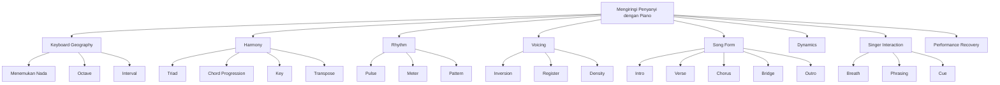

Tidak semua domain punya bobot yang sama untuk 20 jam pertama.

Yang paling penting:

1. chord dasar;
2. progression;
3. rhythm/pulse;
4. pattern iringan;
5. struktur lagu;
6. dinamika;
7. recovery.

Yang bisa ditunda:

1. not balok;
2. chord kompleks;
3. improvisasi panjang;
4. teknik klasik detail;
5. semua key;
6. teori harmoni akademik.

## 6.2 Learn Enough to Self-Correct

Anda tidak perlu tahu seluruh teori musik untuk mulai.

Tetapi Anda perlu tahu cukup untuk menjawab pertanyaan debugging:

- chord yang saya mainkan benar atau tidak?
- tangan kiri saya terlalu rendah atau tidak?
- ritme saya stabil atau tidak?
- penyanyi kehilangan tempo karena saya atau bukan?
- chord saya terlalu padat atau tidak?
- kenapa transisi verse ke chorus terasa lemah?
- kenapa ending terasa menggantung?

Self-correction membutuhkan vocabulary minimal.

Vocabulary yang harus dimiliki:

| Vocabulary | Untuk Apa |
|---|---|
| root | tahu bass note utama |
| third | membedakan major/minor |
| fifth | membentuk triad stabil |
| inversion | membuat perpindahan chord halus |
| progression | memahami urutan chord |
| beat | menjaga waktu |
| bar | memahami struktur hitungan |
| subdivision | membuat pola ritme |
| verse/chorus | membaca arsitektur lagu |
| dynamics | mengatur intensitas |
| register | mengatur posisi nada agar tidak menabrak vokal |

## 6.3 Remove Barriers to Practice

Hambatan utama pemula bukan kurang informasi. Justru terlalu banyak informasi.

Hambatan umum:

- keyboard tidak siap;
- harus membuka laptop dulu;
- terlalu banyak tutorial;
- tidak punya lagu target;
- tidak tahu harus latihan apa hari ini;
- malu mendengar rekaman sendiri;
- terlalu cepat mengejar lagu sulit;
- gonta-ganti materi sebelum satu pola stabil;
- ingin semua teori jelas sebelum praktik.

Solusi seri ini:

1. siapkan keyboard selalu bisa dimainkan;
2. pilih 3 lagu target;
3. pakai practice log;
4. rekam latihan pendek;
5. latihan dengan metronome;
6. jangan pindah pola sebelum stabil;
7. evaluasi dengan checklist, bukan perasaan;
8. batasi teori per sesi;
9. ulang 2–4 bar sampai stabil;
10. mainkan lagu utuh walaupun sederhana.

## 6.4 Practice Deliberately for 20 Hours

Latihan 20 jam bukan “main-main piano selama 20 jam”.

Latihan harus punya:

- target kecil;
- durasi jelas;
- feedback;
- pengulangan;
- isolasi masalah;
- integrasi ke lagu.

Contoh latihan buruk:

> Main lagu dari awal sampai salah, berhenti, ulang dari awal, salah lagi, frustrasi.

Contoh latihan baik:

> Ambil 2 bar transisi dari verse ke chorus, turunkan tempo 50%, ulang 10 kali, rekam, dengarkan, koreksi chord/inversion, naikkan tempo bertahap.

---

# 7. Mental Model untuk Software Engineer

Sebagai software engineer, Anda mungkin terbiasa dengan sistem yang deterministik:

- input jelas;
- output jelas;
- error bisa direproduksi;
- state bisa di-log;
- test bisa diulang;
- correctness bisa didefinisikan.

Musik tidak sepenuhnya seperti itu.

Tetapi bukan berarti musik kacau.

Musik punya struktur kuat, hanya saja correctness-nya tidak selalu binary. Ada dimensi:

- benar/salah;
- cocok/tidak cocok;
- stabil/goyah;
- terlalu penuh/terlalu kosong;
- mendukung/mengganggu;
- emosional/datar;
- natural/kaku.

## 7.1 Piano Pengiring sebagai Runtime System

Pikirkan lagu sebagai runtime system.

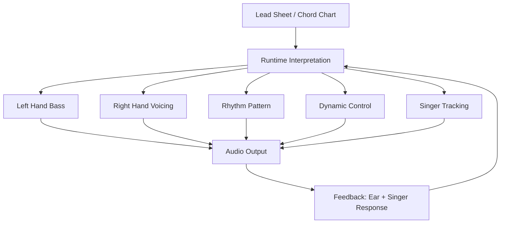

Chord chart adalah source code minimal.

Performance adalah runtime.

Penyanyi adalah external dependency yang timing-nya bisa sedikit berubah.

Tugas piano adalah menjaga sistem tetap berjalan walaupun input manusia tidak 100% predictable.

## 7.2 Lagu sebagai State Machine

Lagu punya state:

- intro;
- verse;
- pre-chorus;
- chorus;
- bridge;
- outro.

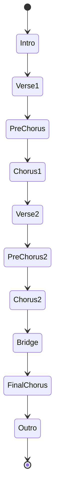

Error umum pemula adalah hanya belajar chord, tetapi tidak belajar state transition.

Akibatnya:

- tidak tahu kapan chorus masuk;
- lupa repeat;
- intro tidak memberi cue;
- ending tidak disepakati;
- bridge terasa jatuh;
- penyanyi bingung.

Maka, dalam seri ini, chord tidak pernah dipelajari terpisah dari struktur lagu.

## 7.3 Chord sebagai Object, Voicing sebagai Implementation

Chord symbol seperti `C`, `Am`, `F`, `G` adalah interface.

Cara Anda memainkan chord itu adalah implementation.

Contoh:

```text
Chord symbol: C
Possible notes: C E G
Possible implementations:
- C E G
- E G C
- G C E
- C G E
- C G C E
- C E G B
- C G D E
```

Artinya, chord `C` tidak hanya satu bentuk.

Dalam piano pengiring, Anda harus belajar bahwa chord symbol memberi constraint, tetapi Anda bebas memilih voicing sesuai konteks.

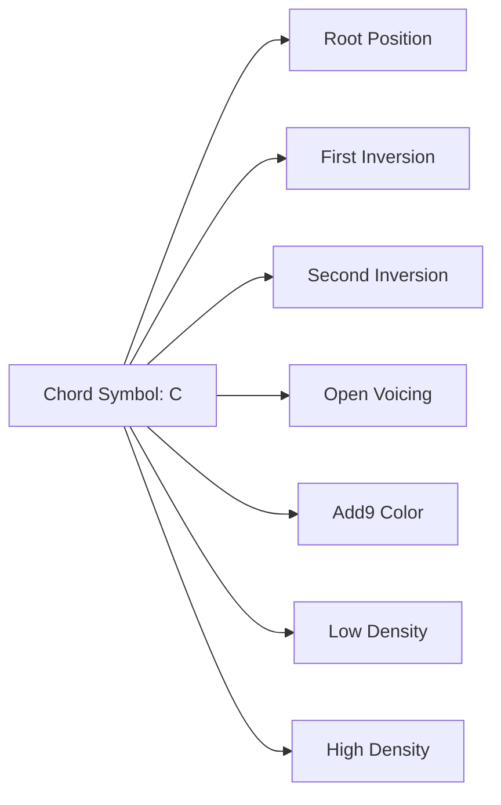

## 7.4 Rhythm sebagai Scheduler

Dalam software, scheduler menentukan kapan sesuatu dieksekusi.

Dalam musik, ritme menentukan kapan chord/nada dibunyikan.

Chord benar tetapi timing salah akan terasa salah.

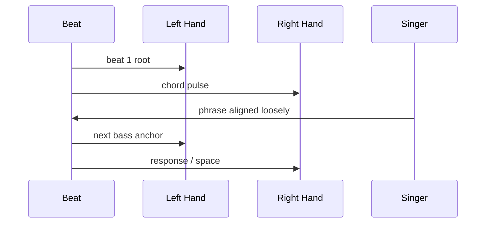

Pemula sering berpikir chord adalah hal utama. Dalam performa, **timing sering lebih penting daripada chord extension**.

Chord Cmaj9 yang indah tetapi telat masuk bisa lebih mengganggu daripada chord C sederhana yang masuk tepat.

## 7.5 Dynamic sebagai Load Balancer

Piano punya banyak register dan volume.

Jika semua dimainkan keras, vokal tertutup.

Dynamic control seperti load balancing:

- verse: load rendah;
- pre-chorus: naik;
- chorus: penuh;
- bridge: kontras;
- final chorus: puncak;
- outro: release.

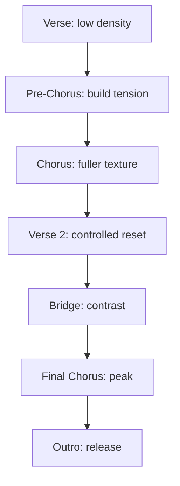

---

# 8. Skill Tree Piano Pengiring

Skill tree ini adalah peta besar. Tidak semuanya dipelajari di Part 0, tetapi semua akan menjadi konteks seri.

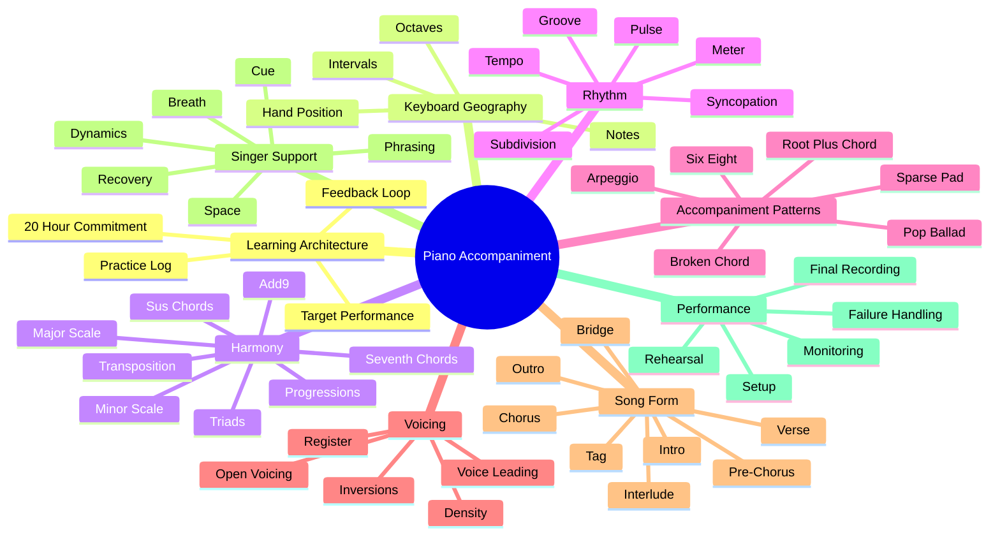

## 8.1 Prioritas Skill untuk 20 Jam Pertama

Tidak semua node di skill tree punya prioritas sama.

Prioritas A — wajib:

- menemukan nada di keyboard;
- chord mayor/minor dasar;
- progresi I–V–vi–IV dan variasinya;
- block chord pattern;
- broken chord pattern;
- pulse stabil;
- intro sederhana;
- ending sederhana;
- dinamika verse vs chorus;
- membaca struktur lagu.

Prioritas B — penting tetapi bertahap:

- inversion;
- add9/sus chord;
- 6/8 feel;
- transposisi dasar;
- fill antar frase;
- pedal control;
- rehearsal cue.

Prioritas C — nanti:

- sight reading;
- walking bass;
- stride;
- jazz reharmonization;
- gospel voicing;
- advanced improvisation;
- solo piano arrangement.

---

# 9. Performance Definition: Seperti Apa “Cukup Bisa”?

Kaufman menekankan pentingnya mendefinisikan target performance level. Tanpa target, belajar akan melebar.

Dalam seri ini, “cukup bisa” berarti:

> Anda bisa masuk ke ruangan latihan, membuka chord chart, menyepakati key dengan penyanyi, memberi intro, mengiringi lagu dari awal sampai akhir, mengikuti dinamika vokal, dan menutup lagu tanpa membuat penyanyi bingung.

## 9.1 Minimum Viable Accompaniment

Minimum viable accompaniment terdiri dari lima komponen:

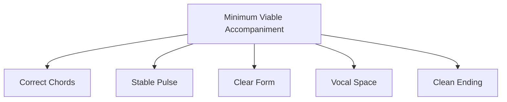

Jika lima hal ini terpenuhi, iringan sudah berguna.

Belum harus indah sekali.

Belum harus kaya.

Belum harus advanced.

Tetapi sudah bisa dipakai.

## 9.2 Rubrik Penilaian

Gunakan rubrik ini untuk menilai rekaman latihan.

| Skor | Chord | Tempo | Struktur | Dinamika | Vokal Space | Recovery |
|---:|---|---|---|---|---|---|
| 1 | sering salah dan berhenti | collapse | tersesat | datar | menutupi vokal | berhenti total |
| 2 | beberapa benar | banyak goyah | kadang bingung | sedikit beda | terlalu penuh | recovery lambat |
| 3 | mayoritas benar | cukup stabil | lagu selesai | verse/chorus mulai beda | cukup aman | bisa lanjut |
| 4 | hampir semua benar | stabil | transisi jelas | musikal | vokal nyaman | recovery natural |
| 5 | sangat solid | hidup dan stabil | sangat jelas | ekspresif | mendukung kuat | error nyaris tak terasa |

Target 20 jam pertama bukan skor 5.

Target realistis:

- chord: 3–4;
- tempo: 3;
- struktur: 3–4;
- dinamika: 3;
- vocal space: 3;
- recovery: 3.

Skor 3 yang konsisten lebih berguna daripada skor 5 sesaat tetapi collapse saat live.

---

# 10. Roadmap 20 Jam Pertama

Roadmap ini bukan jadwal kaku. Ini adalah alokasi prioritas.

## 10.1 Gambaran Besar

```mermaid
gantt
    title Roadmap 20 Jam Piano Accompaniment
    dateFormat  X
    axisFormat %s jam

    section Foundation
    Keyboard Geography        :0, 1
    Basic Chords              :1, 3
    Basic Progressions        :3, 5

    section Patterns
    Root Plus Chord           :5, 7
    Broken Chord              :7, 9
    Pop Ballad Pattern        :9, 11

    section Musicality
    Inversions                :11, 13
    Register and Space        :13, 15
    Dynamics                  :15, 16

    section Song Performance
    Intro and Ending          :16, 17
    Singer Interaction        :17, 18
    Full Song Simulation      :18, 20
```

## 10.2 Detail Alokasi Jam

| Jam | Fokus | Materi | Output |
|---:|---|---|---|
| 0–1 | Orientasi keyboard | nada, octave, pola tuts | bisa menemukan C, D, E, F, G, A, B |
| 1–2 | Triad mayor | C, F, G | bisa memainkan 3 chord mayor |
| 2–3 | Triad minor | Am, Dm, Em | bisa memainkan 3 chord minor |
| 3–4 | Progression umum | C-G-Am-F | bisa loop 4 chord pelan |
| 4–5 | Progression lain | Am-F-C-G, C-Am-F-G | bisa variasi progression |
| 5–6 | Root + chord | LH root, RH chord | iringan paling minimal |
| 6–7 | Tempo stabil | metronome, 4/4 | tidak berhenti selama 2 menit |
| 7–8 | Broken chord | pola 1-5-3-5 | ballad pattern dasar |
| 8–9 | Arpeggio variasi | 1-3-5-3, 1-5-8-5 | texture lebih hidup |
| 9–10 | Pop comping | chord pulse | verse/chorus mulai terasa |
| 10–11 | Pattern switching | verse sparse, chorus fuller | dinamika awal |
| 11–12 | Inversion | C/G/Am/F closest movement | tangan tidak lompat jauh |
| 12–13 | Voice leading | smooth transition | chord lebih natural |
| 13–14 | Register | low/mid/high | tidak menabrak vokal |
| 14–15 | Density | sedikit vs penuh | kontrol ruang |
| 15–16 | Dynamics | velocity, range, rhythm | chorus lebih besar |
| 16–17 | Intro/outro | 2-bar/4-bar intro, clean ending | lagu punya awal/akhir |
| 17–18 | Singer cue | breath, entry, phrase | bisa memberi ruang |
| 18–19 | Full song 1–2 | rekaman simulasi | lagu selesai |
| 19–20 | Full song 3 + review | evaluasi rubrik | target performa tercapai |

## 10.3 Kenapa Urutannya Begini?

Urutan ini sengaja tidak dimulai dari teori musik lengkap.

Alasannya:

1. **Anda perlu bunyi dulu.**  
   Musik harus segera terdengar. Tanpa bunyi, teori tidak punya anchor.

2. **Chord lebih cepat memberi hasil daripada not balok.**  
   Untuk pengiring penyanyi, chord chart memberi jalur tercepat ke performa.

3. **Ritme harus muncul sangat awal.**  
   Chord benar tanpa tempo stabil tidak usable.

4. **Voicing datang setelah chord dasar.**  
   Tidak masuk akal menghaluskan chord yang belum bisa dimainkan.

5. **Dinamika datang setelah pola.**  
   Anda harus punya pattern dulu sebelum bisa mengatur intensitas pattern.

6. **Singer interaction datang mendekati akhir.**  
   Anda tidak bisa mengikuti penyanyi jika diri sendiri belum stabil.

---

# 11. Output Konkret Setelah 20 Jam

Pada akhir seri latihan 20 jam, Anda harus memiliki artefak berikut:

## 11.1 Tiga Rekaman Lagu

Minimal 3 rekaman audio/video:

1. lagu lambat sederhana;
2. lagu pop/ballad medium;
3. lagu dengan chorus lebih besar.

Rekaman tidak harus dipublikasikan.

Fungsinya untuk feedback.

## 11.2 Tiga Chord Chart

Setiap lagu harus punya chord chart sendiri dengan:

- key;
- tempo;
- time signature;
- intro;
- verse;
- chorus;
- bridge jika ada;
- outro;
- catatan dinamika;
- cue masuk vokal;
- ending.

Contoh format minimal:

```text
Title: Example Song
Key: C
Tempo: 72 BPM
Feel: 4/4 ballad

Intro: | C | G | Am | F |
Verse: | C | G | Am | F | x2
Chorus: | F | G | C | Am | F | G | C | C |
Outro: | F | G | C |

Notes:
- Verse: soft broken chord
- Chorus: fuller block + pulse
- Ending: slow down last 2 bars
```

## 11.3 Pattern Library Pribadi

Minimal punya 3 pattern yang bisa dipakai ulang:

1. **root + block chord**;
2. **broken chord ballad**;
3. **pop chorus pulse**.

## 11.4 Self-Assessment Log

Setiap lagu diberi skor:

- chord;
- tempo;
- struktur;
- dinamika;
- ruang vokal;
- recovery.

Contoh:

| Lagu | Chord | Tempo | Struktur | Dinamika | Space | Recovery | Catatan |
|---|---:|---:|---:|---:|---:|---:|---|
| Lagu 1 | 3 | 3 | 4 | 2 | 3 | 3 | chorus masih kurang naik |
| Lagu 2 | 4 | 3 | 3 | 3 | 3 | 2 | transisi bridge lemah |
| Lagu 3 | 3 | 4 | 3 | 3 | 4 | 3 | ending sudah cukup bersih |

---

# 12. Baseline Assessment Sebelum Mulai

Sebelum masuk Part 001, lakukan baseline test.

Tujuannya bukan untuk menghakimi, tetapi untuk menentukan starting point.

## 12.1 Test 1 — Keyboard Familiarity

Tanpa mencari di internet, coba jawab:

- bisa menemukan C di keyboard?
- bisa menemukan F?
- bisa menemukan G?
- tahu pola 2 black keys dan 3 black keys?
- tahu octave itu apa?

Skor:

| Skor | Kondisi |
|---:|---|
| 0 | belum tahu sama sekali |
| 1 | tahu C saja |
| 2 | tahu beberapa nada tapi lambat |
| 3 | bisa menemukan semua white keys |
| 4 | bisa menemukan white dan black keys dasar |
| 5 | sudah nyaman di beberapa octave |

## 12.2 Test 2 — Chord Familiarity

Coba mainkan chord berikut:

- C;
- F;
- G;
- Am;
- Dm;
- Em.

Skor:

| Skor | Kondisi |
|---:|---|
| 0 | belum tahu chord |
| 1 | bisa 1–2 chord dengan melihat diagram |
| 2 | bisa beberapa chord tetapi lambat |
| 3 | bisa semua chord dasar di C major |
| 4 | bisa pindah chord pelan |
| 5 | bisa pindah chord dalam tempo |

## 12.3 Test 3 — Timing

Nyalakan metronome 60 BPM.

Tepuk tangan di setiap beat selama 1 menit.

Lalu coba tepuk hanya di beat 1 dan 3.

Lalu coba tepuk di beat 2 dan 4.

Skor:

| Skor | Kondisi |
|---:|---|
| 0 | tidak bisa mengikuti metronome |
| 1 | sering keluar tempo |
| 2 | bisa beberapa bar lalu goyah |
| 3 | cukup stabil 1 menit |
| 4 | stabil dan rileks |
| 5 | bisa subdivide dengan nyaman |

## 12.4 Test 4 — Lagu Utuh

Pilih satu lagu sederhana yang Anda suka.

Coba cari chord chart-nya.

Tanyakan:

- tahu key-nya?
- tahu verse dan chorus-nya?
- bisa mengikuti chord sambil lagu diputar?
- bisa menandai bagian yang berulang?

Skor:

| Skor | Kondisi |
|---:|---|
| 0 | belum bisa membaca chart |
| 1 | tahu chord tapi bingung struktur |
| 2 | bisa mengikuti sebagian |
| 3 | bisa mengikuti lagu pelan |
| 4 | bisa menandai struktur |
| 5 | bisa memainkan versi sederhana |

## 12.5 Baseline Summary

Isi tabel ini sebelum mulai.

```markdown
| Area | Skor Awal | Catatan |
|---|---:|---|
| Keyboard geography |  |  |
| Chord dasar |  |  |
| Timing |  |  |
| Membaca lagu |  |  |
| Kepercayaan diri |  |  |
```

Baseline bukan final identity.

Baseline hanya log awal.

---

# 13. Setup Minimal

Untuk belajar cepat, setup harus rendah friksi.

## 13.1 Instrumen

Minimal:

- keyboard/piano digital/acoustic;
- minimal 61 keys, lebih baik 88 keys;
- touch sensitivity sangat disarankan;
- sustain pedal sangat disarankan;
- suara piano yang cukup natural.

Jika belum punya 88 keys, 61 keys masih bisa untuk awal.

Untuk piano pengiring penyanyi, yang penting:

- chord bisa dimainkan;
- tangan kiri dan kanan cukup ruang;
- volume bisa diatur;
- pedal bisa digunakan;
- instrumen selalu mudah diakses.

## 13.2 Tool Latihan

Minimal:

- metronome app;
- recorder HP;
- notebook/practice log;
- chord chart;
- earphone/speaker;
- tempat latihan yang relatif tenang.

Opsional:

- DAW sederhana;
- MIDI keyboard;
- sustain pedal berkualitas;
- tablet untuk chord chart;
- backing track;
- vocal track;
- iReal-style accompaniment app.

## 13.3 Physical Setup

Checklist:

- kursi stabil;
- tinggi duduk nyaman;
- siku tidak terlalu tinggi/rendah;
- pergelangan rileks;
- pedal mudah dijangkau;
- metronome terlihat;
- recorder siap;
- chord chart terbuka;
- tidak perlu setup ulang setiap latihan.

## 13.4 Remove Friction Checklist

Sebelum mulai 20 jam, pastikan:

```markdown
- [ ] Keyboard siap dimainkan tanpa bongkar-pasang rumit
- [ ] Sustain pedal tersedia atau direncanakan
- [ ] Metronome app tersedia
- [ ] Recorder HP siap
- [ ] Folder khusus chord chart dibuat
- [ ] Practice log dibuat
- [ ] 3 lagu target awal dipilih
- [ ] Jadwal latihan 20 jam ditentukan
- [ ] Notifikasi distraksi bisa dimatikan
```

---

# 14. Cara Menggunakan Seri Ini

Seri ini dirancang sebagai kombinasi:

1. materi konseptual;
2. latihan fisik;
3. latihan musikal;
4. debugging;
5. simulasi performa.

## 14.1 Jangan Membaca Semua Part Tanpa Praktik

Ini penting.

Membaca seluruh seri tanpa menyentuh piano akan memberi ilusi progress.

Setiap part harus menghasilkan salah satu dari:

- chord yang bisa dimainkan;
- pattern yang bisa diulang;
- chart yang bisa dipakai;
- rekaman latihan;
- improvement pada lagu target.

## 14.2 Pola Konsumsi Materi

Gunakan pola:

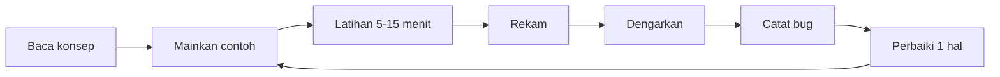

Jangan bergerak ke 5 konsep baru sebelum 1 konsep lama menghasilkan bunyi yang cukup stabil.

## 14.3 Batas Teori per Sesi

Setiap sesi latihan sebaiknya:

- 20% membaca/memahami;
- 70% memainkan;
- 10% merekam dan mengevaluasi.

Jika sesi 45 menit:

| Aktivitas | Durasi |
|---|---:|
| Baca konsep | 5–8 menit |
| Latihan terarah | 30–35 menit |
| Rekam/evaluasi | 5 menit |

## 14.4 Jangan Mengejar Banyak Lagu Terlalu Cepat

Lebih baik:

- 3 lagu dimainkan cukup stabil;

Daripada:

- 20 lagu hanya tahu chord awalnya.

Piano pengiring butuh stabilitas, bukan koleksi setengah jadi.

---

# 15. Practice Log dan Metrik Progress

Kaufman-style practice membutuhkan feedback. Tanpa log, progress akan terasa kabur.

## 15.1 Template Practice Log

Gunakan template ini setiap latihan.

```markdown
## Practice Log

Tanggal:
Jam ke-:
Durasi:
Fokus utama:
Lagu/pattern:
Tempo:

### Yang dilatih
-
-
-

### Yang sudah membaik
-
-
-

### Bug utama
-
-
-

### Satu hal yang akan diperbaiki sesi berikutnya
-

### Skor cepat
Chord accuracy: /5
Tempo stability: /5
Transition: /5
Dynamics: /5
Confidence: /5
```

## 15.2 Metrik yang Berguna

Metrik bukan untuk membuat musik menjadi kaku. Metrik dipakai agar latihan tidak hanya berdasarkan mood.

| Metrik | Pertanyaan |
|---|---|
| chord accuracy | apakah chord yang dimainkan sesuai chart? |
| tempo stability | apakah lagu tetap jalan? |
| transition quality | apakah pindah section lancar? |
| voicing smoothness | apakah tangan melompat terlalu jauh? |
| dynamic contrast | apakah chorus terasa lebih besar? |
| vocal space | apakah piano memberi ruang? |
| recovery | apakah salah kecil bisa dilewati? |
| full-song completion | apakah lagu selesai tanpa berhenti? |

## 15.3 Rekaman sebagai Unit Test

Rekaman adalah unit test musikal.

Bukan untuk menghakimi diri.

Rekaman membantu mendeteksi hal yang sering tidak terasa saat bermain:

- tempo makin cepat;
- tangan kiri terlalu keras;
- chord terlalu padat;
- sustain pedal kotor;
- intro tidak jelas;
- chorus tidak naik;
- ending canggung;
- fill mengganggu vokal.

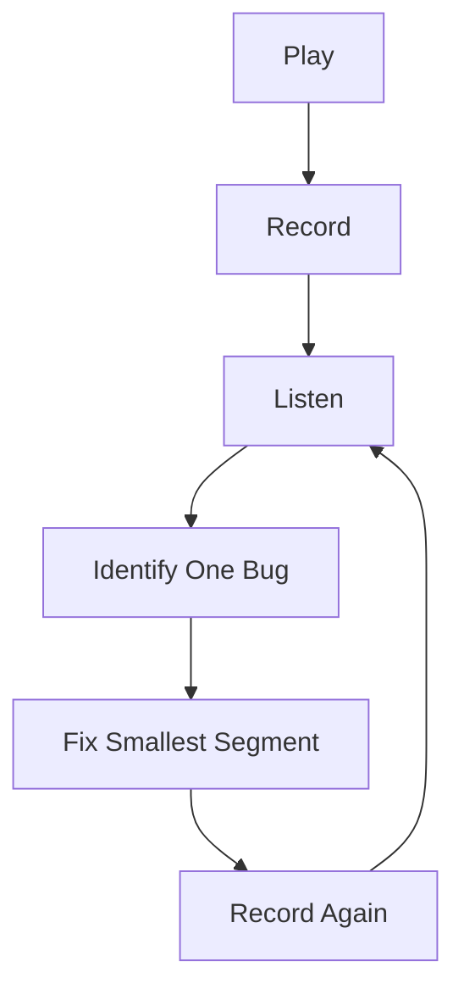

## 15.4 Jangan Memperbaiki Semua Bug Sekaligus

Jika satu rekaman punya 10 masalah, pilih 1.

Urutan prioritas bug:

1. lagu berhenti;
2. chord salah fatal;
3. tempo collapse;
4. struktur tersesat;
5. vokal tertutup;
6. intro/ending tidak jelas;
7. dinamika datar;
8. voicing kurang indah;
9. fill kurang menarik;
10. warna chord kurang kaya.

Pilih bug paling blocking.

---

# 16. Prinsip Latihan: Lagu Dulu, Teori Secukupnya

Seri ini menggunakan prinsip:

> Theory serves performance.

Teori dipelajari karena membantu Anda memainkan lagu lebih baik.

Bukan karena teori harus lengkap dulu.

## 16.1 Contoh Urutan yang Salah

Urutan yang sering membuat pemula macet:

1. belajar semua major scale;
2. belajar semua minor scale;
3. belajar circle of fifths;
4. belajar not balok;
5. belajar chord extension;
6. belum memainkan satu lagu utuh.

Masalahnya: terlalu banyak knowledge sebelum skill.

## 16.2 Contoh Urutan yang Lebih Baik

Urutan seri ini:

1. pilih lagu sederhana;
2. pahami chord utamanya;
3. mainkan root + chord;
4. stabilkan tempo;
5. buat intro;
6. mainkan verse dan chorus;
7. rekam;
8. perbaiki bug;
9. tambahkan inversion;
10. tambahkan dinamika.

Dengan cara ini, teori langsung menempel ke penggunaan nyata.

## 16.3 Teori Minimal untuk Mulai

Untuk mulai, Anda hanya perlu:

- nama nada;
- jarak antar nada;
- chord mayor/minor;
- progression;
- hitungan 4/4;
- struktur lagu;
- konsep dinamika.

Teori lain menyusul saat dibutuhkan.

---

# 17. Kriteria Lagu Latihan

Pemilihan lagu sangat menentukan keberhasilan 20 jam.

Jika lagu terlalu sulit, Anda akan menghabiskan waktu untuk bertahan hidup.

Jika lagu terlalu mudah tetapi tidak Anda sukai, motivasi turun.

## 17.1 Kriteria Lagu Ideal

Lagu ideal untuk 20 jam pertama:

- tempo lambat sampai sedang;
- chord 4–6 saja;
- struktur jelas;
- tidak banyak modulasi;
- tidak terlalu cepat;
- melodi vokal tidak terlalu rapat;
- bisa dimainkan dengan 4/4 atau 6/8 sederhana;
- Anda suka lagunya;
- cocok untuk penyanyi yang akan Anda iringi.

## 17.2 Hindari Lagu dengan Ciri Ini Dulu

Untuk awal, hindari lagu yang:

- banyak slash chord;
- banyak modulasi key;
- tempo sangat cepat;
- ritme syncopation kompleks;
- banyak chord jazz;
- struktur tidak regular;
- butuh piano riff ikonik yang sulit;
- vokalnya sangat bebas/rubato ekstrem;
- banyak perubahan meter.

## 17.3 Pilih 3 Lagu Target

Kategori yang disarankan:

1. **Lagu 1 — sangat sederhana**  
   Target: chord dan tempo stabil.

2. **Lagu 2 — ballad emosional**  
   Target: broken chord dan dinamika.

3. **Lagu 3 — chorus lebih besar**  
   Target: struktur, build-up, dan ending.

## 17.4 Template Pemilihan Lagu

```markdown
## Candidate Song

Judul:
Penyanyi asli:
Key asli:
Tempo kira-kira:
Time signature:
Jumlah chord:
Chord tersulit:
Ada modulasi? ya/tidak
Struktur jelas? ya/tidak
Cocok untuk vokalis? ya/tidak
Saya suka lagu ini? /5
Kesulitan teknis: /5
Prioritas latihan: /5
```

---

# 18. Failure Mode yang Harus Diantisipasi

Belajar cepat bukan berarti tanpa error. Justru kita perlu mengantisipasi error sejak awal.

## 18.1 Failure Mode: Terlalu Banyak Teori

Gejala:

- banyak menonton tutorial;
- banyak mencatat;
- jarang memainkan lagu utuh;
- merasa belum siap praktik;
- terus mencari “materi terbaik”.

Solusi:

- batasi teori 20% sesi;
- pilih satu lagu;
- mainkan versi buruknya dulu;
- rekam;
- perbaiki satu hal.

## 18.2 Failure Mode: Ingin Terdengar Indah Terlalu Cepat

Gejala:

- ingin add9, maj7, passing chord sejak awal;
- chord dasar belum stabil;
- tempo goyah;
- tangan freeze.

Solusi:

- kembali ke root + chord;
- turunkan tempo;
- stabilkan 4 bar;
- baru tambahkan warna.

## 18.3 Failure Mode: Tangan Kiri Terlalu Berat

Gejala:

- bass terdengar menabrak;
- vokal tertutup;
- lagu terasa muddy;
- sustain pedal membuat suara kotor.

Solusi:

- mainkan tangan kiri lebih ringan;
- hindari chord penuh di register rendah;
- gunakan single bass note dulu;
- pakai pedal lebih bersih.

## 18.4 Failure Mode: Semua Section Sama

Gejala:

- verse dan chorus terdengar sama;
- lagu datar;
- emosi tidak berkembang.

Solusi:

- verse: sedikit nada, lembut;
- pre-chorus: mulai naik;
- chorus: register lebih luas, rhythm lebih aktif;
- bridge: kontras.

## 18.5 Failure Mode: Tidak Bisa Recovery

Gejala:

- salah chord langsung berhenti;
- panik;
- ulang dari awal;
- kehilangan struktur.

Solusi:

- latih “keep going”;
- kembali ke root chord berikutnya;
- tunggu bar berikutnya;
- prioritaskan pulse;
- jangan memperbaiki error masa lalu saat lagu masih berjalan.

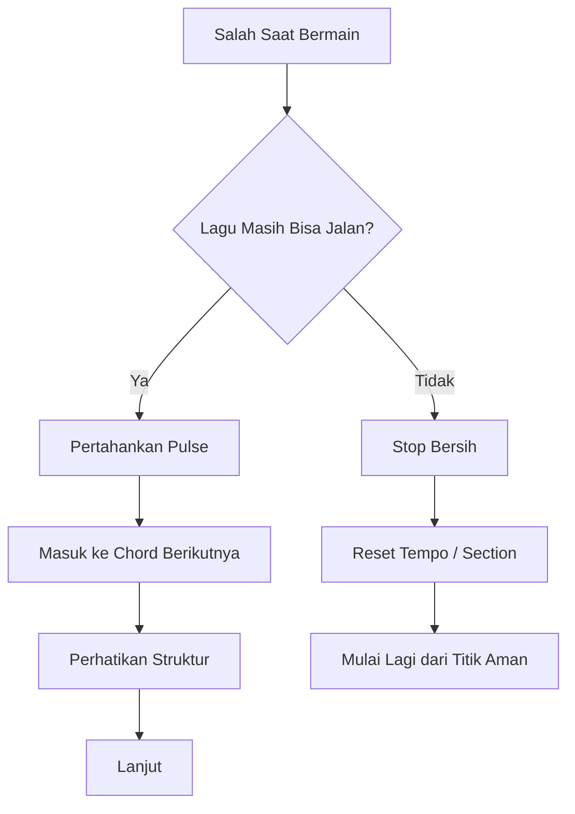

## 18.6 Failure Mode: Terlalu Deterministik

Gejala:

- ingin semua aturan pasti;
- takut memainkan variasi;
- merasa salah jika tidak sesuai tutorial;
- sulit menerima bahwa “terasa cocok” juga valid.

Solusi:

- bedakan hard rule dan soft rule;
- rekam dan dengarkan;
- gunakan rubrik, bukan hanya teori;
- pahami bahwa musik punya constraint, bukan hanya instruksi presisi.

| Hard Rule | Soft Rule |
|---|---|
| chord harus sesuai harmoni dasar | voicing boleh banyak variasi |
| pulse tidak boleh collapse | tempo boleh sedikit bernapas |
| jangan menutupi vokal | seberapa penuh tergantung emosi |
| struktur harus jelas | fill bisa berbeda tiap performa |
| ending harus disepakati | warna ending bisa fleksibel |

---

# 19. Kontrak 20 Jam

Kaufman-style learning membutuhkan komitmen eksplisit.

Bukan komitmen seumur hidup.

Cukup 20 jam pertama.

## 19.1 Kenapa 20 Jam?

20 jam cukup pendek untuk realistis, tetapi cukup panjang untuk melewati fase awal yang paling tidak nyaman.

Fase awal biasanya terasa buruk karena:

- tangan belum patuh;
- otak terlalu lambat membaca chord;
- perpindahan chord patah-patah;
- tempo goyah;
- suara terdengar tidak musikal;
- rekaman terdengar lebih buruk daripada yang dirasakan.

Itu normal.

Tujuan 20 jam adalah melewati fase “tidak bisa apa-apa” menuju “cukup bisa dipakai”.

## 19.2 Format Komitmen

Tulis kontrak ini:

```markdown
# Kontrak 20 Jam Piano Accompaniment

Saya berkomitmen latihan piano pengiring selama 20 jam terarah.

Target saya bukan menjadi pianis sempurna.
Target saya adalah mampu mengiringi penyanyi dalam 3 lagu sederhana dengan chord benar, tempo cukup stabil, intro jelas, ending bersih, dan dinamika yang mendukung vokal.

Saya akan:
- latihan dengan jadwal yang saya tentukan;
- mencatat practice log;
- merekam latihan secara berkala;
- memperbaiki satu bug utama per sesi;
- tidak melompat ke materi advanced sebelum fondasi stabil;
- menerima bahwa 1–4 jam pertama mungkin terdengar buruk;
- menyelesaikan minimal 3 lagu performable.

Tanggal mulai:
Target selesai:
Lagu target 1:
Lagu target 2:
Lagu target 3:
```

## 19.3 Jadwal Latihan yang Disarankan

Beberapa opsi:

### Opsi A — 45 Menit x 27 Sesi

Total sekitar 20 jam.

Cocok jika ingin latihan ringan selama satu bulan.

### Opsi B — 60 Menit x 20 Sesi

Cocok jika punya blok waktu konsisten.

### Opsi C — 90 Menit x 14 Sesi

Cocok jika latihan lebih jarang tetapi lebih panjang.

Untuk pemula, opsi A atau B lebih aman karena otot dan koordinasi butuh repetisi terdistribusi.

## 19.4 Aturan Sesi Latihan

Setiap sesi harus punya:

- satu fokus utama;
- satu lagu atau pattern;
- satu tempo target;
- satu rekaman pendek atau evaluasi;
- satu catatan bug untuk sesi berikutnya.

Contoh sesi buruk:

> “Hari ini latihan piano.”

Contoh sesi baik:

> “Hari ini latihan progression C-G-Am-F dengan pattern broken chord di 60 BPM selama 20 menit, lalu rekam 1 chorus lagu target.”

---

# 20. Peta Seluruh Seri

Berikut peta seri yang akan digunakan.

## Phase A — Framework Kaufman & Target Skill

| Part | Judul |
|---:|---|
| 000 | Daftar Isi, Scope, Target Performa, dan Kontrak Belajar |
| 001 | Framework *The First 20 Hours* untuk Piano Pengiring |
| 002 | Skill Decomposition: Piano Pengiring sebagai Sistem |

## Phase B — Minimum Viable Piano

| Part | Judul |
|---:|---|
| 003 | Keyboard Geography: Peta Piano untuk Orang Teknis |
| 004 | Major Scale sebagai API Musik |
| 005 | Chord Dasar: Triad sebagai Data Structure |
| 006 | Progression Dasar untuk Lagu Pop |

## Phase C — Iringan Minimal yang Bisa Dipakai Tampil

| Part | Judul |
|---:|---|
| 007 | Pattern 1: Left Hand Root + Right Hand Chord |
| 008 | Rhythm First: Mengapa Ritme Lebih Penting daripada Banyak Chord |
| 009 | Pattern 2: Broken Chord / Arpeggio Dasar |
| 010 | Pattern 3: Pop Ballad Comping |
| 011 | Pattern 4: 6/8 dan Slow Cinematic Feel |

## Phase D — Voicing: Membuat Chord Tidak Kaku

| Part | Judul |
|---:|---|
| 012 | Inversion dan Voice Leading |
| 013 | Register, Density, dan Ruang untuk Vokal |
| 014 | Seventh Chords dan Warna Emosi |
| 015 | Voicing Pop Modern: Add9, Sus, dan Open Voicing |

## Phase E — Struktur Lagu & Aransemen

| Part | Judul |
|---:|---|
| 016 | Membaca Lagu sebagai State Machine |
| 017 | Intro: Cara Membuka Lagu untuk Penyanyi |
| 018 | Interlude, Fill, dan Transisi Antar Section |
| 019 | Outro dan Ending yang Bersih |

## Phase F — Mengiringi Penyanyi secara Real-Time

| Part | Judul |
|---:|---|
| 020 | Penyanyi sebagai Lead Process |
| 021 | Dynamic Control: Verse Kecil, Chorus Besar |
| 022 | Rubato, Tempo, dan Human Feel |
| 023 | Transposisi untuk Penyanyi |

## Phase G — Repertoire & Practice System

| Part | Judul |
|---:|---|
| 024 | Memilih Lagu Latihan yang Tepat |
| 025 | Lead Sheet, Chord Chart, dan Cheat Sheet Panggung |
| 026 | Latihan 20 Jam: Jadwal Harian Kaufman-Style |
| 027 | Debugging Latihan: Cara Self-Correct |

## Phase H — Practical Performance Readiness

| Part | Judul |
|---:|---|
| 028 | Simulasi Mengiringi Penyanyi |
| 029 | Setup Keyboard/Piano untuk Tampil |
| 030 | Performance Failure Modeling |
| 031 | Final Integration: Dari 20 Jam ke Skill Jangka Panjang |

Part 031 adalah bagian terakhir seri.

---

# 21. Checklist Selesai Part 000

Sebelum lanjut ke Part 001, pastikan Anda sudah:

```markdown
- [ ] Memahami bahwa target seri ini adalah piano pengiring, bukan piano umum
- [ ] Menerima batasan 20 jam pertama
- [ ] Mengetahui skill yang diprioritaskan dan yang ditunda
- [ ] Menyiapkan keyboard/piano atau rencana akses latihan
- [ ] Menyiapkan metronome
- [ ] Menyiapkan recorder HP
- [ ] Membuat practice log
- [ ] Melakukan baseline assessment
- [ ] Memilih minimal 3 kandidat lagu
- [ ] Menulis kontrak 20 jam
- [ ] Siap masuk ke Part 001
```

---

# 22. Referensi Ringkas

Referensi ini bukan daftar bacaan wajib sebelum praktik. Ini hanya landasan konseptual yang dipakai untuk menyusun seri.

1. Josh Kaufman — *The First 20 Hours: How to Learn Anything... Fast*. Inti yang dipakai: rapid skill acquisition, deconstruction, self-correction, removing barriers, focused practice.
2. Josh Kaufman TEDx Talk — *The First 20 Hours: How to Learn Anything*.
3. Berklee material on jazz piano comping — comping sebagai praktik menggunakan chord untuk mendukung melodi/solo/ensemble.
4. Piano/vocal accompaniment pedagogy umum — prinsip sederhana: keep pulse, support harmony, leave space, avoid overpowering singer.

---

# Penutup Part 000

Part ini menetapkan satu hal penting:

> Kita tidak sedang belajar piano secara abstrak. Kita sedang membangun kemampuan performatif untuk mengiringi penyanyi.

Maka semua materi berikutnya akan selalu ditanyakan ulang terhadap satu kriteria:

> Apakah ini membantu saya mengiringi penyanyi dengan lebih stabil, lebih jelas, lebih musikal, dan lebih aman saat tampil?

Jika ya, dipelajari.

Jika tidak, ditunda.

Pada Part 001, kita akan membedah framework *The First 20 Hours* lebih detail dan menerjemahkannya menjadi sistem latihan piano pengiring yang konkret, terukur, dan bisa dieksekusi.

---

**Status:** Part 000 selesai.  
**Seri belum selesai.** Lanjut ke `learn-piano-accompaniment-part-001.md`.
