# learn-piano-accompaniment-part-001.md

# Part 001 — Framework *The First 20 Hours* untuk Piano Pengiring

> Seri: `learn-piano-accompaniment`  
> Fokus: belajar piano/keyboard sebagai pengiring penyanyi  
> Pendekatan: rapid skill acquisition berdasarkan kerangka Josh Kaufman dalam *The First 20 Hours*  
> Target praktis: mampu tampil mengiringi penyanyi dengan pola piano sederhana, stabil, musikal, dan bisa berkembang setelah 20 jam pertama

---

## Daftar Isi

1. [Posisi Part Ini dalam Seri](#1-posisi-part-ini-dalam-seri)
2. [Apa Masalah Utama Pemula Piano Pengiring?](#2-apa-masalah-utama-pemula-piano-pengiring)
3. [Inti Framework Kaufman](#3-inti-framework-kaufman)
4. [Skill Acquisition vs Learning About Music](#4-skill-acquisition-vs-learning-about-music)
5. [Definisi Target Performa](#5-definisi-target-performa)
6. [Piano Pengiring sebagai Skill Bundle](#6-piano-pengiring-sebagai-skill-bundle)
7. [Deconstruct: Pecah Skill Menjadi Sub-Skill](#7-deconstruct-pecah-skill-menjadi-sub-skill)
8. [Learn Enough to Self-Correct](#8-learn-enough-to-self-correct)
9. [Remove Practice Barriers](#9-remove-practice-barriers)
10. [Deliberate Practice 20 Jam](#10-deliberate-practice-20-jam)
11. [Mengapa Harus Berbasis Lagu, Bukan Teori Terpisah](#11-mengapa-harus-berbasis-lagu-bukan-teori-terpisah)
12. [Cara Menghindari Tutorial Hell](#12-cara-menghindari-tutorial-hell)
13. [Feedback Loop: Debugging Skill Musik](#13-feedback-loop-debugging-skill-musik)
14. [Metrik Progress per Jam](#14-metrik-progress-per-jam)
15. [Roadmap 20 Jam Versi Kaufman untuk Piano Pengiring](#15-roadmap-20-jam-versi-kaufman-untuk-piano-pengiring)
16. [Practice Architecture untuk Software Engineer](#16-practice-architecture-untuk-software-engineer)
17. [Failure Mode Umum dan Countermeasure](#17-failure-mode-umum-dan-countermeasure)
18. [Checklist Selesai Part Ini](#18-checklist-selesai-part-ini)
19. [Latihan Praktis Part 001](#19-latihan-praktis-part-001)
20. [Ringkasan](#20-ringkasan)
21. [Preview Part Berikutnya](#21-preview-part-berikutnya)

---

# 1. Posisi Part Ini dalam Seri

Part 000 sudah menetapkan scope besar seri ini: belajar piano bukan sebagai pianis klasik, melainkan sebagai **pemain piano pengiring penyanyi**.

Part 001 ini menjawab pertanyaan yang lebih fundamental:

> Bagaimana cara belajar skill ini supaya 20 jam pertama menghasilkan kemampuan performa nyata, bukan sekadar tumpukan teori, tutorial, dan chord yang belum bisa dipakai tampil?

Banyak orang gagal belajar piano bukan karena kurang bakat. Lebih sering karena jalur belajarnya salah:

- terlalu lama membaca teori;
- terlalu banyak menonton tutorial;
- terlalu cepat masuk lagu sulit;
- terlalu fokus pada tangan kanan;
- mengabaikan ritme;
- tidak merekam diri;
- tidak punya target performa;
- tidak tahu apa yang harus dikoreksi;
- latihan selalu dari awal lagu, bukan bagian yang bermasalah;
- merasa harus “menguasai piano” sebelum boleh mengiringi.

Framework Kaufman berguna karena ia memotong semua ilusi itu. Fokusnya bukan “belajar semua hal”, tetapi:

1. pilih skill spesifik;
2. pecah menjadi komponen kecil;
3. pelajari hanya teori yang dibutuhkan untuk koreksi diri;
4. hilangkan hambatan latihan;
5. praktik terfokus minimal 20 jam.

Dalam konteks seri ini, skill spesifiknya adalah:

> Mengiringi penyanyi dengan piano/keyboard untuk lagu sederhana secara stabil dan musikal.

---

# 2. Apa Masalah Utama Pemula Piano Pengiring?

Sebelum membangun roadmap, kita perlu mendefinisikan masalahnya dengan benar.

Pemula biasanya mengira masalah utama adalah:

> “Saya belum hafal banyak chord.”

Atau:

> “Saya belum bisa membaca not balok.”

Atau:

> “Jari saya belum cepat.”

Semua itu bisa relevan, tetapi bukan bottleneck utama untuk target **mengiringi penyanyi**.

Bottleneck utama biasanya adalah:

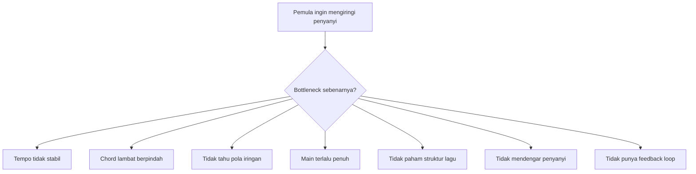

## 2.1 Chord benar saja tidak cukup

Misalnya Anda tahu chord progression:

```text
C - G - Am - F
```

Secara teori, ini mudah. Tetapi saat mengiringi penyanyi, masalahnya bukan hanya tahu chord.

Anda harus bisa:

- masuk di tempo yang tepat;
- menjaga pulse;
- berpindah chord sebelum bar berikutnya;
- memilih inversion agar tangan tidak lompat jauh;
- tidak menabrak range vokal;
- membuat verse lebih kecil dari chorus;
- memberi intro yang jelas;
- memberi ending yang disepakati;
- tetap lanjut jika salah satu chord meleset.

Jadi skill piano pengiring adalah **skill koordinasi real-time**, bukan sekadar hafalan chord.

## 2.2 Piano pengiring adalah skill support, bukan display skill

Pianis solo bertanya:

> “Bagaimana membuat piano terdengar lengkap sendiri?”

Pianis pengiring bertanya:

> “Bagaimana membuat penyanyi terdengar lebih baik?”

Ini perbedaan besar.

Dalam accompaniment, piano bukan pusat. Vokal adalah pusat. Piano adalah konteks harmonik, ritmik, dan emosional.

Analoginya dalam software:

- vokal = primary service;
- piano = supporting service;
- tempo = clock/scheduler;
- chord progression = state transition;
- dynamic = runtime resource allocation;
- rehearsal = integration test;
- live performance = production traffic.

Kalau supporting service terlalu agresif, primary service terganggu. Kalau piano terlalu ramai, penyanyi kehilangan ruang.

## 2.3 Skill ini harus dilatih sebagai sistem

Kesalahan umum adalah melatih komponen secara terpisah terlalu lama:

- latihan scale tanpa lagu;
- latihan chord tanpa ritme;
- latihan ritme tanpa struktur;
- latihan lagu tanpa mendengar penyanyi;
- latihan tangan kanan tanpa tangan kiri;
- latihan full speed tanpa isolasi masalah.

Padahal untuk tampil, semua komponen harus berjalan bersama.

Maka pendekatan seri ini:

> Teori dipelajari secukupnya, lalu langsung diuji dalam konteks lagu.

---

# 3. Inti Framework Kaufman

Josh Kaufman membedakan antara **rapid skill acquisition** dan “belajar secara akademik”. Tujuannya bukan menjadi master dalam 20 jam, tetapi melewati fase awal yang paling frustratif sampai kita bisa melakukan skill tersebut pada level fungsional.

Untuk piano pengiring, ini sangat cocok. Kita tidak menargetkan conservatory-level musicianship. Kita menargetkan kemampuan nyata:

- bisa memainkan chord;
- bisa menjaga tempo;
- bisa membentuk pola iringan;
- bisa mengikuti struktur lagu;
- bisa mengiringi vokalis pada lagu sederhana.

Framework dasarnya bisa dimodelkan seperti ini:

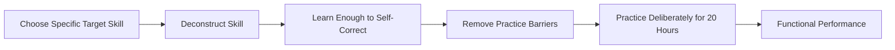

## 3.1 Pilih skill spesifik

Skill yang terlalu luas:

> “Saya mau belajar piano.”

Skill yang lebih tepat:

> “Saya mau bisa mengiringi penyanyi dengan piano untuk 3 lagu pop ballad sederhana dalam 20 jam pertama.”

Skill pertama terlalu abstrak. Tidak ada batas, tidak ada metrik, tidak ada definition of done.

Skill kedua bisa dipecah:

- lagu apa;
- key apa;
- chord apa;
- pattern apa;
- tempo berapa;
- output performa seperti apa.

## 3.2 Deconstruct skill

Jangan mulai dari “belajar piano” sebagai satu benda besar. Pecah menjadi sub-skill kecil.

Untuk piano pengiring, sub-skill awalnya:

1. mengenali layout keyboard;
2. membentuk chord mayor/minor;
3. memainkan root di tangan kiri;
4. memainkan chord di tangan kanan;
5. menjaga pulse 4/4;
6. berpindah chord tepat waktu;
7. memakai pola iringan sederhana;
8. membaca struktur lagu;
9. mengatur dinamika;
10. memberi intro dan ending.

## 3.3 Learn enough to self-correct

Belajar teori bukan untuk pamer istilah. Belajar teori agar tahu ketika salah.

Anda perlu cukup tahu untuk menjawab:

- chord saya salah atau benar?
- perpindahan saya telat atau tepat?
- tempo saya stabil atau goyah?
- tangan kiri terlalu keras atau tidak?
- chord saya terlalu padat atau cukup?
- intro saya memberi cue yang jelas atau tidak?
- penyanyi punya ruang atau saya menutupi?

## 3.4 Remove barriers

Skill tidak berkembang kalau friction latihan terlalu tinggi.

Barrier umum:

- keyboard tidak siap dinyalakan;
- adaptor/pedal dicari setiap kali latihan;
- chord chart belum disiapkan;
- lagu latihan terlalu sulit;
- metronome tidak dipakai;
- tidak ada rekaman;
- latihan tanpa jadwal;
- terlalu banyak membuka YouTube;
- terlalu malu mendengar rekaman sendiri.

Tujuan fase ini: membuat latihan semudah mungkin dimulai.

## 3.5 Practice at least 20 hours

20 jam bukan angka magis untuk mastery. Ini adalah commitment minimum agar otak dan tubuh melewati fase awal yang buruk.

Dalam konteks piano:

- jam 1–3: tangan terasa bodoh;
- jam 4–6: mulai bisa memainkan chord dasar;
- jam 7–10: ritme mulai stabil;
- jam 11–15: pattern mulai terasa musikal;
- jam 16–20: mulai bisa simulasi lagu penuh.

Yang penting: 20 jam ini harus berupa **praktik aktif**, bukan 20 jam menonton tutorial.

---

# 4. Skill Acquisition vs Learning About Music

Ini bagian penting karena banyak orang teknis senang mengumpulkan pengetahuan sebelum praktik.

Dalam engineering, membaca dokumentasi sebelum implementasi sering masuk akal. Tetapi dalam skill motorik-musikal, dokumentasi tanpa praktik cepat berubah menjadi ilusi kompetensi.

## 4.1 Learning about piano

Contoh learning about piano:

- membaca sejarah piano;
- membaca teori harmony panjang;
- menghafal semua scale;
- menonton 30 video chord progression;
- membaca artikel tentang voicing;
- memahami circle of fifths secara konseptual;
- menghafal istilah Italia;
- membandingkan keyboard digital.

Ini berguna, tetapi belum tentu meningkatkan kemampuan tampil.

## 4.2 Skill acquisition

Contoh skill acquisition:

- memainkan C ke G tanpa berhenti;
- memainkan C-G-Am-F selama 2 menit dengan metronome;
- merekam diri dan mendengar tempo goyah;
- memperbaiki 2 bar yang kacau;
- mengulang transisi Am ke F sebanyak 20 kali;
- memainkan intro 4 bar yang memberi cue vokalis;
- mencoba verse kecil dan chorus lebih besar;
- latihan ending sampai berhenti bersih.

Skill acquisition menghasilkan perubahan nyata pada perilaku.

## 4.3 Tabel perbedaan

| Aspek | Learning About Music | Skill Acquisition |
|---|---|---|
| Fokus | Mengetahui konsep | Melakukan tindakan |
| Output | Paham istilah | Bisa memainkan |
| Risiko | Ilusi kompetensi | Frustrasi awal |
| Feedback | “Saya mengerti” | Rekaman terdengar benar/salah |
| Ukuran sukses | Banyak materi dikonsumsi | Lagu bisa dimainkan |
| Cocok untuk | Pendalaman jangka panjang | 20 jam pertama |

## 4.4 Prinsip seri ini

Seri ini tetap mengajarkan teori, tetapi dengan aturan keras:

> Setiap teori harus punya konsekuensi langsung terhadap permainan piano.

Misalnya:

- teori interval → membangun chord;
- teori scale degree → transpose key;
- teori inversion → perpindahan chord lebih halus;
- teori meter → pattern iringan stabil;
- teori chord function → intro/outro lebih masuk akal.

Kalau teori belum dipakai untuk membuat bunyi, teori itu belum menjadi skill.

---

# 5. Definisi Target Performa

Target performa harus konkret. Tanpa target konkret, kita tidak tahu apa yang harus dipelajari dan apa yang harus ditunda.

## 5.1 Target performa 20 jam pertama

Setelah 20 jam latihan terarah, targetnya:

> Bisa mengiringi satu penyanyi pada minimal 3 lagu sederhana, masing-masing 3–5 menit, dengan chord mayor/minor dasar, pola iringan sederhana, tempo cukup stabil, intro/outro jelas, dan dinamika dasar antara verse dan chorus.

## 5.2 Kriteria lagu yang masuk scope

Lagu yang cocok:

- tempo lambat sampai sedang;
- chord 4–6 jenis;
- struktur jelas;
- tanpa modulasi rumit;
- tidak terlalu cepat;
- tidak perlu solo piano advanced;
- bisa dimainkan dengan pattern berulang.

Contoh tipe lagu:

- pop ballad;
- worship ballad;
- folk/pop acoustic;
- slow rock sederhana;
- lagu cinematic sederhana;
- lagu Indonesia populer dengan progression umum.

## 5.3 Kriteria performa minimum

Performa dianggap cukup untuk 20 jam pertama bila:

| Area | Minimum yang Diharapkan |
|---|---|
| Chord | Mayor/minor dasar benar 80–90% |
| Tempo | Tidak berhenti, tidak collapse |
| Pattern | Bisa memakai 1–2 pola iringan |
| Struktur | Tahu intro, verse, chorus, ending |
| Dinamika | Verse lebih kecil, chorus lebih besar |
| Singer support | Tidak menutupi vokal |
| Recovery | Jika salah, tetap lanjut ke bar/section berikutnya |

## 5.4 Hal yang sengaja tidak dikejar dulu

Tidak dikejar dalam 20 jam pertama:

- semua scale;
- semua key;
- sight reading not balok;
- improvisasi jazz;
- stride piano;
- walking bass;
- reharmonisasi kompleks;
- teknik Hanon panjang;
- classical repertoire;
- solo piano arrangement penuh.

Ini bukan karena tidak penting. Ini karena belum menjadi bottleneck untuk target awal.

---

# 6. Piano Pengiring sebagai Skill Bundle

Piano pengiring bukan satu skill. Ia adalah bundle dari beberapa sub-skill yang saling tergantung.

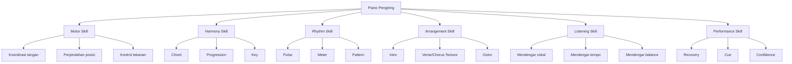

## 6.1 Motor skill

Motor skill adalah kemampuan fisik:

- jari menekan tuts yang benar;
- tangan kiri dan kanan bergerak bersama;
- perpindahan chord tidak terlambat;
- tekanan suara tidak terlalu keras;
- sustain pedal tidak kotor.

Motor skill tidak bisa dipahami hanya dengan membaca. Harus dilatih melalui repetisi.

## 6.2 Harmony skill

Harmony skill adalah kemampuan memahami chord dan progression:

- chord C berisi C-E-G;
- chord Am berisi A-C-E;
- progression C-G-Am-F punya arah emosional tertentu;
- chord G cenderung ingin kembali ke C;
- chord minor memberi warna lebih gelap.

Untuk 20 jam pertama, harmony cukup sederhana tetapi harus benar-benar usable.

## 6.3 Rhythm skill

Rhythm skill adalah fondasi paling kritis.

Penyanyi bisa memaafkan voicing sederhana, tetapi sulit bernyanyi di atas iringan yang tempo-nya goyah.

Untuk pengiring, ritme adalah contract.

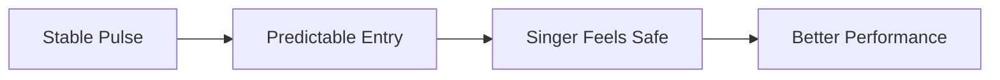

## 6.4 Arrangement skill

Arrangement skill adalah kemampuan memutuskan:

- verse dimainkan tipis atau penuh;
- chorus dibuat lebih besar;
- intro pakai progression apa;
- kapan diam;
- kapan fill;
- ending seperti apa.

Ini yang membuat permainan tidak hanya benar, tetapi juga musikal.

## 6.5 Listening skill

Listening skill adalah kemampuan mendengar sambil bermain.

Pemula sering seluruh CPU mentalnya habis untuk tangan sendiri. Akibatnya tidak mendengar penyanyi.

Target kita adalah menurunkan beban kognitif tangan lewat pattern sederhana, sehingga masih ada kapasitas untuk mendengar.

## 6.6 Performance skill

Performance skill adalah kemampuan tetap berjalan saat kondisi tidak ideal:

- ada salah chord;
- penyanyi masuk lebih cepat;
- tempo sedikit berubah;
- lupa ending;
- tangan tegang;
- suara keyboard terlalu keras;
- chart kurang jelas.

Live performance tidak menuntut zero bug. Ia menuntut graceful recovery.

---

# 7. Deconstruct: Pecah Skill Menjadi Sub-Skill

Deconstruction adalah jantung framework Kaufman.

Pertanyaannya:

> Apa unit terkecil dari piano pengiring yang kalau dikuasai akan memberi leverage terbesar?

Untuk target kita, urutan sub-skill yang paling berguna adalah sebagai berikut.

## 7.1 Dependency graph

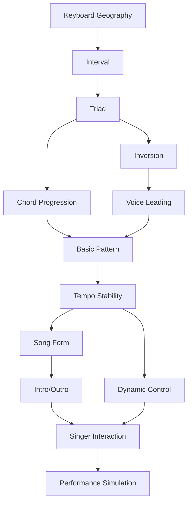

## 7.2 Sub-skill 1: Keyboard geography

Minimal harus bisa:

- menemukan C dengan cepat;
- memahami pola 2 black keys dan 3 black keys;
- tahu octave;
- tahu arah naik/turun pitch;
- menemukan root chord.

Tidak perlu langsung hafal semua nada secara sempurna. Cukup bisa navigasi.

## 7.3 Sub-skill 2: Chord construction

Minimal harus bisa membangun:

- major triad;
- minor triad;
- chord C, Dm, Em, F, G, Am;
- chord dalam C major;
- chord dasar di G major nanti.

Prinsipnya:

> Chord bukan bentuk acak. Chord adalah struktur interval.

## 7.4 Sub-skill 3: Chord transition

Tahu chord belum cukup. Anda harus bisa pindah antar chord.

Contoh transisi penting:

- C → G;
- G → Am;
- Am → F;
- F → C;
- C → F;
- Dm → G.

Transisi ini harus dilatih sebagai unit kecil, bukan selalu memainkan seluruh lagu.

## 7.5 Sub-skill 4: Pulse dan meter

Minimal harus bisa menghitung:

```text
1 2 3 4 | 1 2 3 4
```

Dan tahu kapan chord berganti.

Masalah besar pemula:

- chord benar tapi masuk telat;
- tangan mencari chord di beat 1;
- bar jadi memanjang;
- penyanyi kehilangan tempat masuk.

Solusi:

> chord berikutnya harus sudah “dipersiapkan” sebelum beat 1.

## 7.6 Sub-skill 5: Basic accompaniment pattern

Pola awal:

```text
LH: root
RH: chord
Count: 1 - 2 - 3 - 4
```

Lalu berkembang:

```text
LH: root on 1
RH: chord on 1 and 3
```

Lalu:

```text
LH: root-octave or root-fifth
RH: broken chord / pulse chord
```

## 7.7 Sub-skill 6: Song form

Harus tahu peta lagu:

```text
Intro → Verse 1 → Chorus → Verse 2 → Chorus → Bridge → Final Chorus → Outro
```

Kalau tidak tahu struktur, Anda akan tersesat walaupun chord benar.

## 7.8 Sub-skill 7: Dynamic control

Minimal:

- verse kecil;
- chorus lebih besar;
- bridge beda warna;
- ending turun atau naik sesuai lagu.

Dalam 20 jam pertama, cukup atur tiga parameter:

1. volume;
2. density;
3. register.

## 7.9 Sub-skill 8: Singer interaction

Minimal:

- mendengar napas sebelum masuk;
- memberi intro jelas;
- tidak menabrak frase vokal;
- tetap stabil jika penyanyi sedikit rubato;
- mengikuti ending yang disepakati.

## 7.10 Prioritas sub-skill

Tidak semua sub-skill sama pentingnya di awal.

| Prioritas | Sub-Skill | Alasan |
|---:|---|---|
| 1 | Pulse stabil | Tanpa ini penyanyi sulit masuk |
| 2 | Chord dasar | Harmoni harus benar |
| 3 | Perpindahan chord | Lagu harus mengalir |
| 4 | Pattern sederhana | Agar tidak monoton dan tidak kosong |
| 5 | Struktur lagu | Agar tidak tersesat |
| 6 | Dinamika | Agar musikal |
| 7 | Voicing | Agar lebih halus |
| 8 | Warna chord | Bisa ditunda setelah basic stabil |

---

# 8. Learn Enough to Self-Correct

Kaufman tidak menyarankan belajar semua teori sebelum praktik. Ia menyarankan belajar cukup untuk bisa memperbaiki diri saat praktik.

Dalam piano pengiring, self-correction berarti Anda bisa mendeteksi bug permainan sendiri.

## 8.1 Apa yang harus bisa dikoreksi?

Ada lima kategori bug utama.

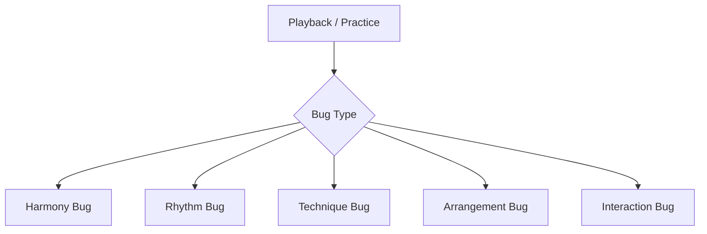

## 8.2 Harmony bug

Contoh:

- memainkan C minor padahal harus C major;
- memainkan bass A saat chord F;
- salah inversion sampai bunyi terasa janggal;
- lupa chord di tengah lagu.

Minimal knowledge untuk koreksi:

- tahu isi chord;
- tahu root chord;
- tahu chord progression;
- tahu bar tempat chord berganti.

## 8.3 Rhythm bug

Contoh:

- chord masuk terlambat;
- tempo mempercepat saat chorus;
- arpeggio tidak rata;
- tangan kanan tidak sinkron dengan tangan kiri;
- berhenti saat mencari chord.

Minimal knowledge untuk koreksi:

- bisa menghitung beat;
- tahu meter lagu;
- bisa pakai metronome;
- bisa tepuk pola sebelum main;
- bisa mengidentifikasi bar yang goyah.

## 8.4 Technique bug

Contoh:

- tangan terlalu tegang;
- jari sulit menjangkau;
- lompatan chord terlalu jauh;
- pedal blur;
- tangan kiri terlalu keras.

Minimal knowledge untuk koreksi:

- gunakan inversion;
- pelan dulu;
- kurangi density;
- pisah tangan;
- pakai pedal hanya setelah chord bersih.

## 8.5 Arrangement bug

Contoh:

- verse terlalu ramai;
- chorus tidak naik;
- intro tidak memberi cue;
- ending membingungkan;
- fill menabrak vokal.

Minimal knowledge untuk koreksi:

- pahami fungsi section;
- bedakan texture verse/chorus;
- pakai ruang;
- sepakati intro/outro;
- dengarkan vokal sebagai pusat.

## 8.6 Interaction bug

Contoh:

- tidak mendengar penyanyi mengambil napas;
- memaksa tempo saat penyanyi rubato;
- tidak memberi cue masuk;
- tidak ikut berhenti saat ending;
- terlalu keras.

Minimal knowledge untuk koreksi:

- rekam latihan bersama vokal;
- dengarkan balance;
- tandai titik napas;
- buat cue yang jelas;
- latihan dengan backing vocal atau manusia.

## 8.7 Self-correction loop

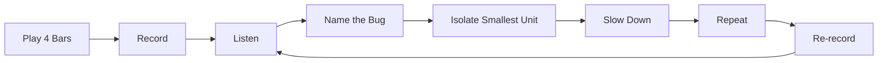

Kuncinya adalah **name the bug**.

Jangan hanya berkata:

> “Main saya jelek.”

Itu tidak bisa diperbaiki.

Lebih baik:

> “Transisi G ke Am telat setengah beat.”

Atau:

> “Tangan kiri terlalu keras pada verse.”

Atau:

> “Intro tidak menunjukkan kapan vokal masuk.”

Bug yang spesifik bisa diperbaiki.

---

# 9. Remove Practice Barriers

Skill cepat berkembang jika praktik mudah dimulai dan sulit dihindari.

Untuk orang sibuk, bottleneck bukan hanya pengetahuan. Bottleneck adalah friction.

## 9.1 Barrier fisik

Contoh:

- keyboard disimpan di tempat sulit dijangkau;
- adaptor tidak selalu terpasang;
- sustain pedal tidak dipasang;
- kursi tidak nyaman;
- volume terlalu keras sehingga takut mengganggu orang;
- tidak ada headphone;
- chart tidak siap.

Countermeasure:

- keyboard selalu siap;
- headphone tersedia;
- sustain pedal terpasang;
- metronome app siap;
- folder chart siap;
- satu lagu latihan sudah dibuka;
- practice log tersedia.

## 9.2 Barrier mental

Contoh:

- merasa harus belajar teori dulu;
- malu karena terdengar buruk;
- takut salah;
- merasa tidak berbakat;
- membandingkan diri dengan pianis profesional;
- terlalu perfeksionis.

Countermeasure:

- targetnya bukan indah di jam pertama;
- rekaman awal memang akan buruk;
- tugas 20 jam pertama adalah melewati fase buruk;
- ukur progress kecil;
- jangan bandingkan dengan orang yang sudah 10 tahun main.

## 9.3 Barrier informasi

Contoh:

- terlalu banyak tutorial;
- bingung memilih lagu;
- bingung memilih metode;
- ingin belajar semua style;
- menonton konten lebih lama daripada praktik.

Countermeasure:

- pilih 3–5 resource saja;
- pilih 3 lagu target;
- gunakan roadmap seri ini sebagai jalur utama;
- batasi konsumsi tutorial;
- setiap materi harus menghasilkan latihan.

## 9.4 Barrier emosional

Piano itu brutal karena feedback-nya langsung terdengar. Salah chord terdengar. Tempo goyah terdengar. Jari kaku terdengar.

Untuk orang yang terbiasa berpikir deterministik, fase awal ini bisa terasa menyebalkan karena tubuh tidak langsung mengikuti logika.

Masalahnya bukan Anda tidak paham. Masalahnya sistem motorik perlu waktu membangun mapping.

Dalam istilah engineering:

> cognitive understanding sudah compile, tetapi runtime motorik belum warm up.

## 9.5 Setup latihan minimum

Sebelum mulai 20 jam, siapkan:

| Item | Minimum |
|---|---|
| Instrument | Piano/keyboard 61 keys atau lebih |
| Pedal | Sustain pedal sederhana |
| Audio | Headphone atau speaker kecil |
| Metronome | App HP cukup |
| Recording | Voice memo HP cukup |
| Chart | 3 lagu target dalam chord sheet |
| Timer | 25–45 menit per sesi |
| Log | Markdown/notebook/spreadsheet |

## 9.6 Environment design

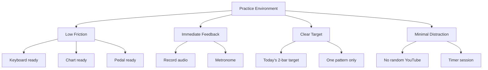

---

# 10. Deliberate Practice 20 Jam

Tidak semua praktik sama nilainya.

Satu jam mengulang kesalahan tanpa sadar bisa lebih buruk daripada 15 menit praktik fokus.

## 10.1 Apa itu deliberate practice dalam konteks ini?

Deliberate practice berarti:

- punya target kecil;
- tahu apa yang sedang diperbaiki;
- bermain cukup pelan agar benar;
- mendapat feedback;
- memperbaiki bug;
- mengulang sampai stabil;
- menaikkan kesulitan sedikit demi sedikit.

Bukan deliberate practice:

- main lagu dari awal sampai akhir berkali-kali tanpa evaluasi;
- menonton tutorial panjang tanpa memainkan;
- mengganti lagu setiap merasa bosan;
- memainkan bagian yang sudah bisa saja;
- mengejar speed sebelum akurasi.

## 10.2 Unit latihan ideal

Unit latihan ideal bukan “satu lagu penuh”.

Unit latihan ideal bisa berupa:

- 2 chord;
- 1 bar;
- 2 bar;
- satu transisi;
- satu pattern;
- satu intro;
- satu ending;
- satu section verse.

Contoh:

```text
Target: transisi G → Am tidak telat.
Durasi: 10 menit.
Tempo: 60 BPM.
Loop: | G | Am | G | Am |
Metrik: 10 repetisi berturut-turut tanpa berhenti.
```

Ini jauh lebih efektif daripada memainkan seluruh lagu 10 kali dan selalu salah di tempat yang sama.

## 10.3 Prinsip slow practice

Kalau salah di tempo normal, jangan ulangi di tempo normal.

Turunkan tempo sampai bisa benar.

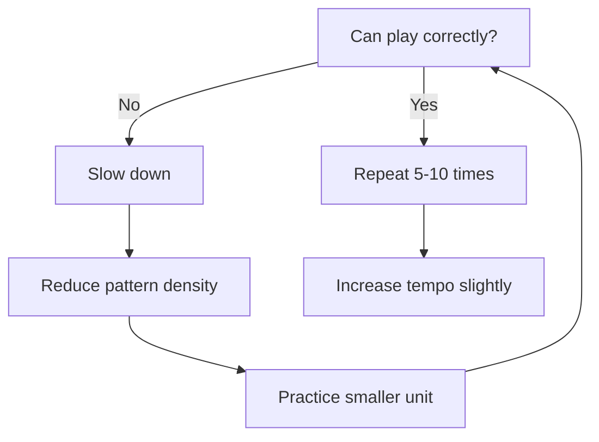

## 10.4 Practice block 30 menit

Format sesi 30 menit:

| Menit | Aktivitas |
|---:|---|
| 0–3 | Setup, pilih target kecil |
| 3–8 | Warm-up chord/progression |
| 8–18 | Isolasi masalah utama |
| 18–25 | Terapkan ke lagu/section |
| 25–28 | Rekam satu take |
| 28–30 | Catat bug dan next action |

## 10.5 Practice block 45 menit

Format sesi 45 menit:

| Menit | Aktivitas |
|---:|---|
| 0–5 | Setup + review log sebelumnya |
| 5–10 | Rhythm/chord warm-up |
| 10–25 | Deliberate practice sub-skill utama |
| 25–35 | Apply ke lagu target |
| 35–40 | Record performance slice |
| 40–45 | Playback + bug list |

## 10.6 Jangan mengejar durasi kosong

Lebih baik:

> 25 menit fokus, target jelas, rekam, koreksi.

Daripada:

> 2 jam duduk di piano tapi random.

---

# 11. Mengapa Harus Berbasis Lagu, Bukan Teori Terpisah

Teori musik penting. Tetapi untuk target mengiringi penyanyi, teori harus dikaitkan dengan lagu.

## 11.1 Lagu adalah integration environment

Dalam software, unit test penting. Tetapi sistem baru benar-benar diuji saat integration test.

Dalam musik:

- chord = unit;
- pattern = unit;
- voicing = unit;
- intro = unit;
- lagu penuh = integration test.

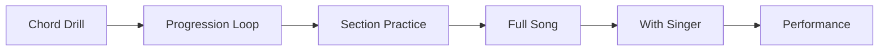

## 11.2 Teori tanpa lagu tidak punya constraint

Misalnya belajar chord Cmaj7.

Pertanyaan praktisnya:

- dipakai di lagu apa?
- di section mana?
- apakah cocok dengan melodi vokal?
- apakah terlalu jazzy untuk genre tersebut?
- apakah tangan bisa pindah tepat waktu?
- apakah membuat chorus lebih emosional?

Tanpa konteks lagu, chord hanya objek statis.

## 11.3 Lagu memberi prioritas

Anda tidak perlu belajar semua chord. Lagu target akan memberi tahu chord mana yang harus dipelajari dulu.

Jika 3 lagu target hanya memakai:

```text
C, G, Am, F, Dm, Em
```

Maka itulah prioritas 20 jam pertama.

Bukan:

- Bbm7b5;
- F# altered dominant;
- secondary dominant;
- tritone substitution;
- quartal voicing.

Semua itu bisa nanti.

## 11.4 Lagu memberi feedback emosional

Piano accompaniment bukan hanya benar/salah. Ia juga harus “mendukung rasa lagu”.

Lagu membuat Anda bertanya:

- Apakah verse terlalu penuh?
- Apakah chorus cukup naik?
- Apakah intro memberi mood?
- Apakah ending terasa selesai?
- Apakah penyanyi bisa bernapas?

Teori tidak selalu memaksa pertanyaan ini. Lagu memaksa.

---

# 12. Cara Menghindari Tutorial Hell

Tutorial hell dalam musik terjadi saat Anda merasa produktif karena terus belajar materi baru, tetapi kemampuan performa tidak naik.

## 12.1 Gejala tutorial hell

Anda mungkin masuk tutorial hell jika:

- punya banyak playlist tutorial tapi tidak punya rekaman latihan;
- tahu banyak istilah tapi tidak bisa main satu lagu penuh;
- sering ganti metode;
- setiap kesulitan mencari video baru;
- merasa “belum siap praktik”;
- latihan selalu diawali konsumsi konten;
- tidak punya lagu target;
- tidak punya deadline performa.

## 12.2 Aturan 3–5 resource

Dalam framework Kaufman, resource dipakai untuk mempercepat self-correction, bukan sebagai tempat bersembunyi.

Gunakan maksimal 3–5 resource utama:

1. seri markdown ini;
2. satu channel/video referensi basic piano chord;
3. satu referensi chord chart lagu;
4. satu metronome/recording app;
5. satu orang/teman/musisi untuk feedback bila ada.

Jangan kumpulkan 30 resource.

## 12.3 Aturan 1:3

Untuk 20 jam pertama, gunakan rasio:

```text
1 bagian konsumsi teori : 3 bagian praktik aktif
```

Jika membaca/menonton 10 menit, minimal praktik 30 menit.

## 12.4 Setiap tutorial harus menghasilkan action

Sebelum menonton tutorial, tentukan:

> “Setelah menonton ini, saya akan mempraktikkan apa?”

Contoh buruk:

> “Saya mau nonton video tentang piano accompaniment.”

Contoh baik:

> “Saya mau belajar satu pattern ballad 4/4, lalu memakainya untuk progression C-G-Am-F selama 10 menit.”

## 12.5 No new concept tanpa stabilisasi

Jangan menambah konsep baru sebelum konsep lama cukup stabil.

Contoh:

- belum bisa triad stabil, jangan masuk jazz voicing;
- belum bisa tempo stabil, jangan masuk arpeggio cepat;
- belum bisa verse/chorus sederhana, jangan masuk reharmonisasi;
- belum bisa satu lagu penuh, jangan ganti 10 lagu.

---

# 13. Feedback Loop: Debugging Skill Musik

Sebagai software engineer, gunakan mental model debugging.

Anda tidak memperbaiki “aplikasi jelek”. Anda memperbaiki bug spesifik.

Dalam piano, jangan memperbaiki “main saya jelek”. Perbaiki bug spesifik.

## 13.1 Pipeline debugging

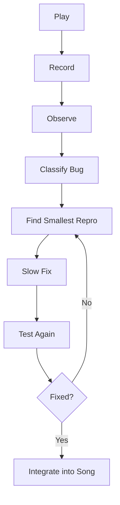

## 13.2 Bug classification table

| Bug | Symptom | Likely Cause | Fix |
|---|---|---|---|
| Chord salah | Bunyi janggal | Bentuk chord belum hafal | Drill chord terpisah |
| Telat pindah | Ada jeda sebelum chord | Tangan belum siap | Slow transition loop |
| Tempo naik | Chorus makin cepat | Excitement/tension | Metronome + lower density |
| Verse terlalu ramai | Vokal tertutup | Overplaying | Kurangi tangan kanan |
| Pedal blur | Harmoni kotor | Pedal tidak diganti | Ganti pedal tiap chord |
| Intro membingungkan | Penyanyi ragu masuk | Cue tidak jelas | Buat intro 2/4 bar fixed |
| Ending jatuh | Berhenti tidak kompak | Ending belum disepakati | Latih ending terpisah |

## 13.3 Smallest reproducible musical bug

Dalam software, Anda cari minimal reproducible example.

Dalam piano, cari unit terkecil yang gagal.

Jangan bilang:

> “Lagu ini susah.”

Tanya:

- bar mana?
- chord mana?
- transisi mana?
- beat mana?
- tangan mana?
- pattern mana?

Contoh:

```text
Bug: telat pindah dari G ke Am.
Smallest repro: 2 bar loop | G | Am |
Tempo: 55 BPM.
Pattern: LH root, RH block chord on beat 1.
Fix: tangan kanan berpindah ke Am shape sebelum beat 1 berikutnya.
```

## 13.4 Rekaman adalah observability

Tanpa rekaman, Anda hanya mengandalkan persepsi saat bermain. Itu tidak cukup.

Saat bermain, otak sibuk:

- melihat tuts;
- mengingat chord;
- mengatur jari;
- menghitung beat;
- mendengar suara;
- mengantisipasi chord berikutnya.

Akibatnya Anda sering tidak sadar tempo goyah atau suara terlalu keras.

Rekaman memberi observability.

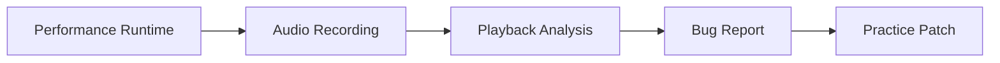

## 13.5 Practice log sebagai issue tracker

Gunakan practice log seperti issue tracker.

Contoh:

```markdown
## Practice Log - Day 3
Duration: 35 min
Song: Lagu A
Focus: C-G-Am-F transition
Tempo: 65 BPM

Bugs:
- G to Am still late at bar 3
- LH too loud during verse
- Forgot chorus repeat

Fix next session:
- 10 min loop G-Am only at 55 BPM
- play LH softer, RH slightly louder
- mark chorus repeat in chart
```

Ini lebih baik daripada hanya menulis:

```text
Latihan piano 35 menit.
```

---

# 14. Metrik Progress per Jam

Skill musik sering terasa subjektif. Tetapi untuk 20 jam pertama, kita bisa membuat metrik praktis.

## 14.1 Metrik utama

| Metrik | Cara Mengukur |
|---|---|
| Chord accuracy | Berapa kali chord salah per lagu/section |
| Transition fluency | Ada jeda atau tidak saat pindah chord |
| Tempo stability | Bisa main dengan metronome tanpa drift besar |
| Pattern consistency | Pattern tetap jalan tanpa collapse |
| Song completion | Bisa main dari intro sampai ending |
| Dynamic control | Verse/chorus terdengar berbeda |
| Singer support | Vokal tidak tertutup, cue jelas |

## 14.2 Progress bukan linear

Kemajuan 20 jam pertama tidak linear.

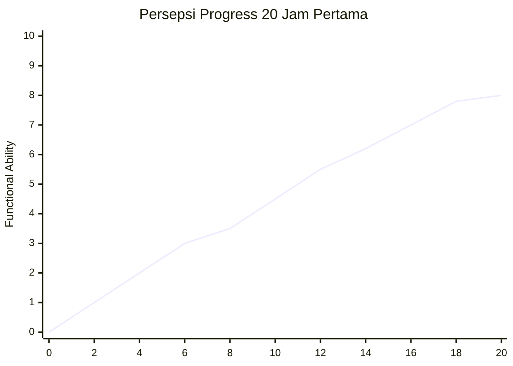

Biasanya:

- awal terasa buruk;
- lalu ada sedikit breakthrough;
- lalu plateau;
- lalu naik lagi setelah pattern stabil;
- lalu turun saat mencoba bersama vokal;
- lalu stabil setelah simulasi.

## 14.3 Hour-by-hour expectation

| Jam | Ekspektasi Realistis |
|---:|---|
| 1 | Masih bingung layout keyboard |
| 2 | Bisa menemukan C/F/G/Am perlahan |
| 3 | Bisa bentuk chord dasar dengan jeda |
| 4 | Bisa loop 2 chord sederhana |
| 5 | Bisa C-G-Am-F sangat pelan |
| 6 | Mulai stabil dengan metronome lambat |
| 7 | Bisa root + chord pattern |
| 8 | Bisa memainkan satu verse lambat |
| 9 | Mulai mencoba broken chord |
| 10 | Satu lagu sangat sederhana mulai terbentuk |
| 11 | Mulai belajar inversion |
| 12 | Perpindahan chord lebih halus |
| 13 | Verse/chorus mulai beda texture |
| 14 | Intro sederhana mulai jelas |
| 15 | Ending mulai bisa dikontrol |
| 16 | Latihan dengan vocal track |
| 17 | Bisa mengikuti phrasing sederhana |
| 18 | Simulasi satu lagu penuh |
| 19 | Simulasi 2–3 lagu |
| 20 | Evaluasi performa final |

## 14.4 Rubric sederhana

Gunakan skala 0–3.

| Area | 0 | 1 | 2 | 3 |
|---|---|---|---|---|
| Chord | Tidak tahu | Banyak salah | Mayoritas benar | Stabil |
| Tempo | Berhenti | Sering goyah | Cukup stabil | Stabil dengan feel |
| Pattern | Tidak ada | Putus-putus | Konsisten | Musikal |
| Struktur | Tersesat | Perlu banyak bantuan | Cukup tahu | Mandiri |
| Dinamika | Datar | Kadang beda | Verse/chorus beda | Emosional |
| Singer support | Menutupi | Kurang peka | Cukup support | Responsif |

Target 20 jam pertama bukan semua 3. Target realistis:

```text
Chord: 2-3
Tempo: 2
Pattern: 2
Struktur: 2
Dinamika: 1-2
Singer support: 1-2
```

---

# 15. Roadmap 20 Jam Versi Kaufman untuk Piano Pengiring

Roadmap ini akan dipakai sebagai backbone seri.

```mermaid
gantt
    title Roadmap 20 Jam Pertama - Piano Pengiring
    dateFormat  X
    axisFormat %s

    section Foundation
    Keyboard Geography       :0, 1
    Basic Chord Construction :1, 3
    Progression Loop         :3, 5

    section Rhythm & Pattern
    Pulse and Meter          :5, 6
    Root + Chord Pattern     :6, 8
    Broken Chord             :8, 10

    section Musicality
    Inversion                :10, 12
    Voice Leading            :12, 13
    Dynamics                 :13, 15

    section Songcraft
    Intro and Outro          :15, 16
    Song Form                :16, 17

    section Performance
    Singer Interaction       :17, 18
    Full Song Simulation     :18, 20
```

## 15.1 Jam 0–1: Keyboard geography

Goal:

- tahu layout piano;
- bisa menemukan C;
- tahu octave;
- bisa menemukan root chord dasar.

Output:

- tidak panik melihat keyboard;
- tahu arah naik/turun nada;
- bisa menemukan C, F, G, A.

## 15.2 Jam 1–3: Chord construction

Goal:

- membangun major/minor triad;
- memainkan C, F, G, Am, Dm, Em;
- memahami root-third-fifth.

Output:

- bisa bentuk chord tanpa hanya menghafal gambar;
- tahu kenapa chord major/minor berbeda.

## 15.3 Jam 3–5: Progression loop

Goal:

- memainkan C-G-Am-F;
- memainkan I-V-vi-IV;
- berpindah chord perlahan tanpa berhenti.

Output:

- bisa membuat loop harmoni sederhana selama 1–2 menit.

## 15.4 Jam 5–8: Pulse dan root + chord pattern

Goal:

- main dengan hitungan 1-2-3-4;
- tangan kiri root;
- tangan kanan chord;
- chord berganti di beat 1.

Output:

- bisa mengiringi lagu sangat sederhana.

## 15.5 Jam 8–10: Broken chord

Goal:

- memainkan arpeggio sederhana;
- cocok untuk ballad;
- tidak terlalu ramai.

Output:

- iringan mulai terasa seperti lagu, bukan hanya block chord.

## 15.6 Jam 10–13: Inversion dan voice leading

Goal:

- mengurangi lompatan chord;
- membuat perpindahan lebih smooth;
- tangan kanan tidak terlalu jauh bergerak.

Output:

- chord progression terdengar lebih profesional.

## 15.7 Jam 13–15: Dynamics

Goal:

- verse lebih kecil;
- chorus lebih besar;
- bridge beda warna.

Output:

- lagu punya perkembangan emosional.

## 15.8 Jam 15–17: Intro, outro, structure

Goal:

- membuat intro 2/4 bar;
- memberi cue vokal;
- ending bersih;
- tidak tersesat dalam section.

Output:

- lagu terasa punya bentuk performa.

## 15.9 Jam 17–20: Singer interaction dan simulasi

Goal:

- latihan dengan vokal/vocal track;
- mendengar phrasing;
- menjaga volume;
- recovery saat salah;
- main 3 lagu end-to-end.

Output:

- siap tampil sederhana.

---

# 16. Practice Architecture untuk Software Engineer

Karena Anda punya latar software engineering, kita bisa gunakan analogi yang lebih sistemik.

## 16.1 Skill sebagai pipeline

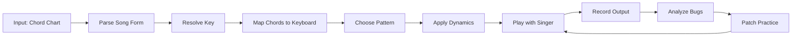

## 16.2 Jangan optimize sebelum benar

Dalam software:

> Make it work, make it right, make it fast.

Dalam piano:

> Make it sound, make it stable, make it musical.

Tahap awal:

1. bunyi chord benar;
2. tempo tidak berhenti;
3. pattern konsisten;
4. dinamika masuk;
5. voicing diperhalus;
6. variasi ditambah.

Jangan mulai dari variasi kalau chord belum stabil.

## 16.3 Practice backlog

Buat backlog latihan seperti ini:

| Priority | Item | Status |
|---:|---|---|
| P0 | C-G-Am-F block chord 60 BPM | In Progress |
| P0 | G→Am transition no pause | Open |
| P1 | Broken chord pattern | Open |
| P1 | Verse soft, chorus louder | Open |
| P2 | Add9 voicing | Later |
| P3 | Jazz reharm | Not now |

Ini membantu mencegah scope creep.

## 16.4 Definition of done untuk latihan

Setiap latihan harus punya DoD.

Contoh DoD buruk:

```text
Latihan chord.
```

DoD baik:

```text
Bisa memainkan C-G-Am-F pada 65 BPM selama 2 menit tanpa berhenti, maksimal 2 chord error.
```

Contoh lain:

```text
Bisa memainkan intro 4 bar untuk Lagu A dan memberi cue vokal masuk pada bar ke-5.
```

## 16.5 Regression testing

Skill bisa regress. Jika hari ini bisa, besok belum tentu otomatis stabil.

Maka perlu regression test:

- mainkan progression lama sebelum konsep baru;
- rekam ulang lagu target setiap beberapa hari;
- cek apakah tempo masih stabil;
- cek apakah chord lama masih bersih.

## 16.6 Production readiness

Sebelum tampil, tanyakan:

- Apakah lagu bisa dimainkan end-to-end?
- Apakah key sudah cocok untuk penyanyi?
- Apakah intro jelas?
- Apakah ending jelas?
- Apakah ada chart backup?
- Apakah volume keyboard aman?
- Apakah sustain pedal bekerja?
- Apakah saya tahu recovery plan jika salah?

Ini seperti production deployment checklist.

---

# 17. Failure Mode Umum dan Countermeasure

## 17.1 Failure mode: terlalu banyak teori

Symptom:

- tahu istilah;
- tidak bisa main lagu;
- sering merasa belum siap.

Countermeasure:

- pakai teori hanya untuk latihan hari itu;
- setiap teori harus dimainkan;
- batasi resource.

## 17.2 Failure mode: chord benar tapi tempo hancur

Symptom:

- progression terdengar putus;
- penyanyi susah masuk;
- ada jeda saat pindah chord.

Countermeasure:

- turunkan tempo;
- gunakan metronome;
- latihan transisi 2 chord;
- kurangi pattern.

## 17.3 Failure mode: tangan kiri terlalu keras

Symptom:

- iringan terasa berat;
- vokal tenggelam;
- bass mendominasi.

Countermeasure:

- tangan kiri lebih lembut;
- main root saja;
- hindari register terlalu rendah;
- rekam balance.

## 17.4 Failure mode: overplaying

Symptom:

- terlalu banyak fill;
- semua ruang diisi;
- penyanyi terdengar berkompetisi dengan piano.

Countermeasure:

- gunakan rule: vocal phrase first;
- isi hanya di antara frase;
- verse minimal;
- chorus baru lebih penuh.

## 17.5 Failure mode: lagu terasa datar

Symptom:

- verse dan chorus sama;
- tidak ada perkembangan;
- emosi tidak naik.

Countermeasure:

- ubah density;
- ubah register;
- ubah volume;
- tambah rhythm di chorus;
- kurangi di verse.

## 17.6 Failure mode: takut salah saat live

Symptom:

- tangan freeze;
- berhenti setelah salah;
- panik mencari chord.

Countermeasure:

- latih recovery;
- jangan berhenti saat salah kecil;
- kembali ke root chord;
- masuk lagi di beat 1 berikutnya;
- pakai chart jelas.

## 17.7 Failure mode matrix

| Failure | Impact | Probability Pemula | Mitigasi |
|---|---:|---:|---|
| Tempo goyah | Tinggi | Tinggi | Metronome + slow practice |
| Chord salah | Sedang/Tinggi | Tinggi | Chord drill + chart |
| Transisi telat | Tinggi | Tinggi | 2-chord loop |
| Overplaying | Sedang | Sedang | Leave space |
| Intro tidak jelas | Tinggi | Sedang | Fixed 2/4 bar intro |
| Ending kacau | Sedang | Sedang | Latih ending terpisah |
| Panik saat salah | Tinggi | Sedang | Recovery drill |

---

# 18. Checklist Selesai Part Ini

Sebelum lanjut ke Part 002, pastikan Anda memahami hal berikut.

## 18.1 Concept checklist

- [ ] Saya paham bahwa targetnya bukan “menguasai piano”, tetapi mengiringi penyanyi.
- [ ] Saya paham bahwa 20 jam pertama adalah functional performance, bukan mastery.
- [ ] Saya paham empat langkah utama: deconstruct, self-correct, remove barriers, deliberate practice.
- [ ] Saya paham piano pengiring adalah bundle skill.
- [ ] Saya paham ritme dan tempo lebih fundamental daripada variasi chord.
- [ ] Saya paham teori harus dipakai untuk memperbaiki praktik.
- [ ] Saya paham rekaman adalah alat feedback utama.
- [ ] Saya paham latihan harus berbasis unit kecil, bukan selalu lagu penuh.

## 18.2 Setup checklist

- [ ] Keyboard/piano siap dipakai.
- [ ] Sustain pedal tersedia jika ada.
- [ ] Headphone/speaker siap.
- [ ] Metronome app siap.
- [ ] Recording app siap.
- [ ] Folder/file practice log siap.
- [ ] Minimal satu lagu target sudah dipilih.
- [ ] Waktu latihan 20 jam sudah dikomit.

## 18.3 Mindset checklist

- [ ] Saya menerima bahwa jam 1–4 akan terdengar buruk.
- [ ] Saya tidak akan mengganti metode setiap frustrasi.
- [ ] Saya akan merekam latihan walaupun belum bagus.
- [ ] Saya akan memperbaiki bug spesifik, bukan menghakimi diri secara umum.
- [ ] Saya akan memprioritaskan stabilitas sebelum kompleksitas.

---

# 19. Latihan Praktis Part 001

Part ini belum masuk teori chord detail. Tetapi Anda sudah bisa melakukan latihan persiapan.

## 19.1 Latihan 1 — Tulis target performa personal

Buat file/notebook:

```markdown
# Piano Accompaniment Target

Target 20 jam:
Saya ingin bisa mengiringi penyanyi untuk lagu:
1. ...
2. ...
3. ...

Kriteria sukses:
- bisa memainkan chord dasar tanpa berhenti;
- bisa menjaga tempo;
- bisa memberi intro;
- bisa ending bersih;
- verse dan chorus punya dinamika berbeda.

Bukan target sekarang:
- improvisasi jazz;
- membaca not balok kompleks;
- semua key;
- solo piano arrangement.
```

## 19.2 Latihan 2 — Pilih 3 lagu target

Kriteria:

- Anda suka lagunya;
- lagunya mungkin akan dinyanyikan;
- chord tidak terlalu banyak;
- tempo tidak terlalu cepat;
- struktur jelas.

Template:

```markdown
# Candidate Songs

## Song 1
Title:
Original key:
Estimated difficulty:
Chord count:
Why useful:

## Song 2
Title:
Original key:
Estimated difficulty:
Chord count:
Why useful:

## Song 3
Title:
Original key:
Estimated difficulty:
Chord count:
Why useful:
```

## 19.3 Latihan 3 — Setup practice log

Gunakan format ini dari awal:

```markdown
# Piano Practice Log

## Session 001
Date:
Duration:
Focus:
Song/Progression:
Tempo:

What improved:

Bugs found:

Next action:
```

## 19.4 Latihan 4 — Siapkan environment

Checklist 10 menit:

- taruh keyboard di tempat mudah dijangkau;
- pasang adaptor;
- pasang pedal;
- siapkan headphone;
- buka metronome;
- buka recording app;
- buat folder chart;
- buat practice log.

Tujuannya menurunkan friction sebelum masuk latihan teknis.

---

# 20. Ringkasan

Part 001 menetapkan cara belajar.

Intinya:

1. Jangan belajar piano sebagai skill abstrak.
2. Definisikan target spesifik: mengiringi penyanyi.
3. Pecah skill menjadi sub-skill kecil.
4. Pelajari teori secukupnya untuk bisa self-correct.
5. Hilangkan hambatan latihan.
6. Praktik aktif minimal 20 jam.
7. Gunakan lagu sebagai integration environment.
8. Rekam diri untuk feedback.
9. Debug bug musikal secara spesifik.
10. Stabilitas lebih penting daripada kompleksitas.

Model paling penting:

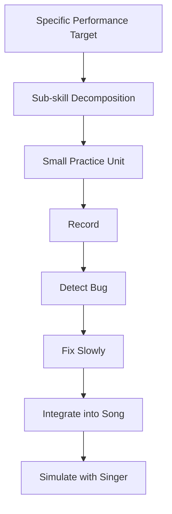

Untuk 20 jam pertama, jangan kejar menjadi pianis hebat. Kejar menjadi pengiring yang bisa dipercaya.

Pengiring yang bisa dipercaya berarti:

- tidak berhenti;
- chord cukup benar;
- tempo cukup stabil;
- mendukung vokal;
- tahu struktur;
- bisa recover dari kesalahan kecil.

Itu sudah sangat bernilai.

---

# 21. Preview Part Berikutnya

Part berikutnya:

```text
learn-piano-accompaniment-part-002.md
```

Judul:

```text
Skill Decomposition: Piano Pengiring sebagai Sistem
```

Fokus Part 002:

- membedah piano pengiring menjadi arsitektur skill yang lebih rinci;
- dependency antar sub-skill;
- skill mana yang menjadi bottleneck;
- skill mana yang bisa ditunda;
- urutan belajar optimal;
- failure model awal;
- bagaimana membuat practice backlog.

Part 002 akan menjadi peta teknis sebelum masuk ke keyboard geography, chord, dan pattern.

---

## Status Seri

- Part 000: selesai.
- Part 001: selesai.
- Seri belum selesai.
- Lanjut ke Part 002.
