# learn-piano-accompaniment-part-002.md
# Skill Decomposition: Piano Pengiring sebagai Sistem

> Seri: **Learn Piano Accompaniment for Singer Performance**  
> Part: **002**  
> Fokus: memecah skill piano pengiring menjadi sub-skill kecil yang bisa dilatih, diukur, dan digabungkan kembali menjadi performa utuh.  
> Basis metode: prinsip rapid skill acquisition dari Josh Kaufman — pecah skill, belajar cukup untuk koreksi diri, hilangkan hambatan latihan, lalu praktik terarah selama 20 jam pertama.

---

## Daftar Isi

1. [Tujuan Part Ini](#1-tujuan-part-ini)
2. [Masalah Umum: Belajar Piano Terlalu Monolitik](#2-masalah-umum-belajar-piano-terlalu-monolitik)
3. [Definisi Skill Utama: Mengiringi Penyanyi dengan Piano](#3-definisi-skill-utama-mengiringi-penyanyi-dengan-piano)
4. [Skill Decomposition Menurut Logika Kaufman](#4-skill-decomposition-menurut-logika-kaufman)
5. [Piano Pengiring sebagai Sistem Real-Time](#5-piano-pengiring-sebagai-sistem-real-time)
6. [Skill Tree Besar](#6-skill-tree-besar)
7. [Dependency Graph: Apa yang Harus Dipelajari Duluan](#7-dependency-graph-apa-yang-harus-dipelajari-duluan)
8. [Sub-Skill 1: Keyboard Geography](#8-sub-skill-1-keyboard-geography)
9. [Sub-Skill 2: Harmonic Foundation](#9-sub-skill-2-harmonic-foundation)
10. [Sub-Skill 3: Chord Construction](#10-sub-skill-3-chord-construction)
11. [Sub-Skill 4: Chord Progression](#11-sub-skill-4-chord-progression)
12. [Sub-Skill 5: Rhythm and Pulse](#12-sub-skill-5-rhythm-and-pulse)
13. [Sub-Skill 6: Hand Role Separation](#13-sub-skill-6-hand-role-separation)
14. [Sub-Skill 7: Accompaniment Pattern](#14-sub-skill-7-accompaniment-pattern)
15. [Sub-Skill 8: Voicing and Inversion](#15-sub-skill-8-voicing-and-inversion)
16. [Sub-Skill 9: Register, Density, and Space](#16-sub-skill-9-register-density-and-space)
17. [Sub-Skill 10: Song Form Awareness](#17-sub-skill-10-song-form-awareness)
18. [Sub-Skill 11: Dynamic Control](#18-sub-skill-11-dynamic-control)
19. [Sub-Skill 12: Singer Interaction](#19-sub-skill-12-singer-interaction)
20. [Sub-Skill 13: Transposition Readiness](#20-sub-skill-13-transposition-readiness)
21. [Sub-Skill 14: Performance Recovery](#21-sub-skill-14-performance-recovery)
22. [Minimum Viable Accompaniment](#22-minimum-viable-accompaniment)
23. [Apa yang Harus Dikuasai, Apa yang Boleh Ditunda](#23-apa-yang-harus-dikuasai-apa-yang-boleh-ditunda)
24. [Roadmap Prioritas 20 Jam](#24-roadmap-prioritas-20-jam)
25. [Practice Architecture](#25-practice-architecture)
26. [Feedback Loop: Cara Menemukan Bug Musik](#26-feedback-loop-cara-menemukan-bug-musik)
27. [Failure Mode untuk Pemula](#27-failure-mode-untuk-pemula)
28. [Checklist Kelulusan Part Ini](#28-checklist-kelulusan-part-ini)
29. [Latihan Praktis](#29-latihan-praktis)
30. [Ringkasan](#30-ringkasan)
31. [Apa yang Akan Dibahas di Part Berikutnya](#31-apa-yang-akan-dibahas-di-part-berikutnya)

---

# 1. Tujuan Part Ini

Part sebelumnya membahas kerangka belajar Kaufman: jangan belajar piano sebagai domain raksasa, tetapi pecah menjadi bagian kecil yang bisa langsung dipraktikkan.

Part ini menjawab pertanyaan inti:

> “Skill apa saja sebenarnya yang dibutuhkan agar saya bisa mengiringi penyanyi dengan piano?”

Kita tidak akan langsung masuk ke chord C, F, G, atau pola tangan kiri. Sebelum itu, kita perlu membangun peta sistemnya.

Mengapa?

Karena banyak pemula gagal bukan karena mereka tidak berbakat, tetapi karena mereka salah mendefinisikan masalah.

Mereka berpikir:

> “Saya harus belajar piano.”

Padahal kebutuhan sebenarnya:

> “Saya harus bisa memainkan harmoni, ritme, tekstur, dan dinamika yang cukup stabil untuk menopang vokal dalam konteks lagu.”

Itu dua scope yang sangat berbeda.

Belajar “piano” secara umum terlalu besar. Belajar “piano pengiring penyanyi untuk 3–5 lagu sederhana” jauh lebih bisa dieksekusi.

---

# 2. Masalah Umum: Belajar Piano Terlalu Monolitik

Banyak orang memulai piano dengan cara seperti ini:

1. belajar nama-nama nada;
2. belajar membaca not balok;
3. belajar scale;
4. belajar lagu dari tutorial YouTube;
5. meniru gerakan tangan;
6. hafal satu lagu;
7. lupa ketika pindah lagu;
8. bingung saat penyanyi minta transpose;
9. gugup saat live;
10. menyimpulkan bahwa piano terlalu sulit.

Masalahnya bukan seluruh langkah itu salah. Masalahnya adalah urutannya sering tidak sesuai dengan target performa.

Jika target Anda adalah tampil mengiringi penyanyi, maka kemampuan membaca not balok lengkap bukan bottleneck pertama. Bottleneck pertama biasanya adalah:

- tidak tahu chord;
- tidak tahu pola ritme;
- tangan kiri dan kanan belum punya peran jelas;
- tempo goyah;
- tidak tahu struktur lagu;
- terlalu banyak bermain sehingga menutupi vokal;
- tidak tahu bagaimana recovery saat salah.

Dalam bahasa engineering, masalahnya adalah **wrong abstraction boundary**.

Anda tidak sedang membangun “full piano mastery platform”. Anda sedang membangun **minimum viable accompanist**.

---

# 3. Definisi Skill Utama: Mengiringi Penyanyi dengan Piano

Skill utama seri ini adalah:

> Kemampuan memainkan piano/keyboard sebagai pendukung vokal dalam sebuah lagu, dengan chord benar, tempo stabil, pola iringan sesuai genre, dinamika terkendali, struktur lagu jelas, dan respons cukup baik terhadap phrasing penyanyi.

Skill ini memiliki beberapa output nyata.

Anda dianggap mulai bisa mengiringi penyanyi jika mampu:

1. membaca chord chart sederhana;
2. menentukan key lagu;
3. memainkan chord dasar dengan tangan kanan;
4. memainkan bass/root dengan tangan kiri;
5. menjaga pulse stabil;
6. memilih pola iringan sederhana;
7. membedakan verse, chorus, bridge, dan outro;
8. memberi intro yang jelas;
9. mengakhiri lagu dengan bersih;
10. tidak menabrak vokal;
11. menyesuaikan volume dan intensitas;
12. recovery ketika terjadi kesalahan kecil.

Hal penting:

> Piano pengiring bukan kompetisi melodi. Piano pengiring adalah seni menopang.

Penyanyi adalah pusat perhatian. Piano adalah sistem pendukung.

---

# 4. Skill Decomposition Menurut Logika Kaufman

Dalam pendekatan Kaufman, skill besar harus dipecah menjadi sub-skill yang lebih kecil. Tujuannya bukan memecah demi teori, tetapi untuk menemukan bagian mana yang paling menentukan performa awal.

Untuk piano pengiring, kita memecah skill menjadi empat lapis:

1. **Foundation layer**  
   Hal-hal minimum agar tangan tahu harus menekan apa.

2. **Execution layer**  
   Hal-hal yang membuat permainan bisa berjalan dalam waktu nyata.

3. **Musical layer**  
   Hal-hal yang membuat iringan tidak kaku dan tidak mengganggu vokal.

4. **Performance layer**  
   Hal-hal yang dibutuhkan saat bermain dengan penyanyi dan audiens.

Diagramnya:

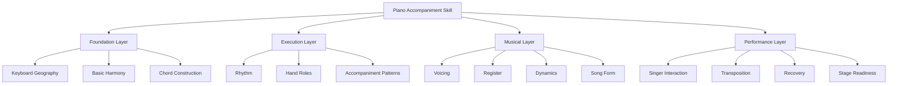

Jika Anda mencoba mempelajari semua lapis sekaligus, latihan terasa kacau. Jika Anda mempelajarinya berurutan, progres menjadi lebih jelas.

---

# 5. Piano Pengiring sebagai Sistem Real-Time

Sebagai software engineer, Anda bisa membayangkan piano pengiring sebagai sistem real-time yang memproses beberapa input dan menghasilkan output musikal.

Input:

- chord chart;
- struktur lagu;
- tempo;
- genre/feel;
- suara penyanyi;
- napas penyanyi;
- dinamika lirik;
- kondisi panggung.

Output:

- bass note;
- chord voicing;
- rhythm pattern;
- fill;
- transition;
- dynamic response;
- cue.

Diagram:

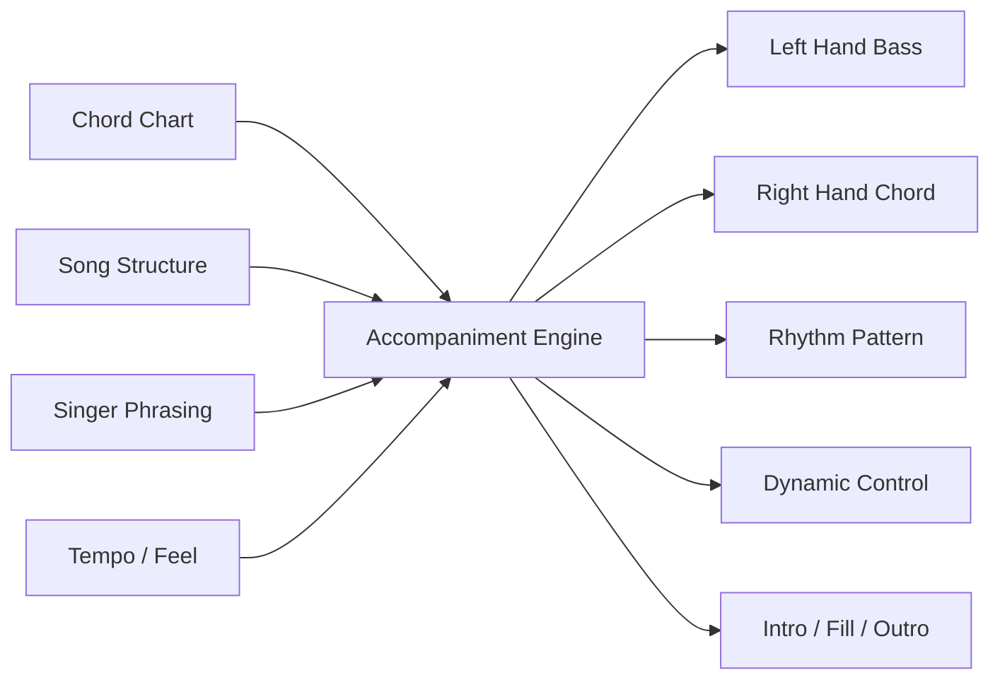

Pianis pengiring yang baik tidak hanya menekan chord. Ia terus melakukan monitoring:

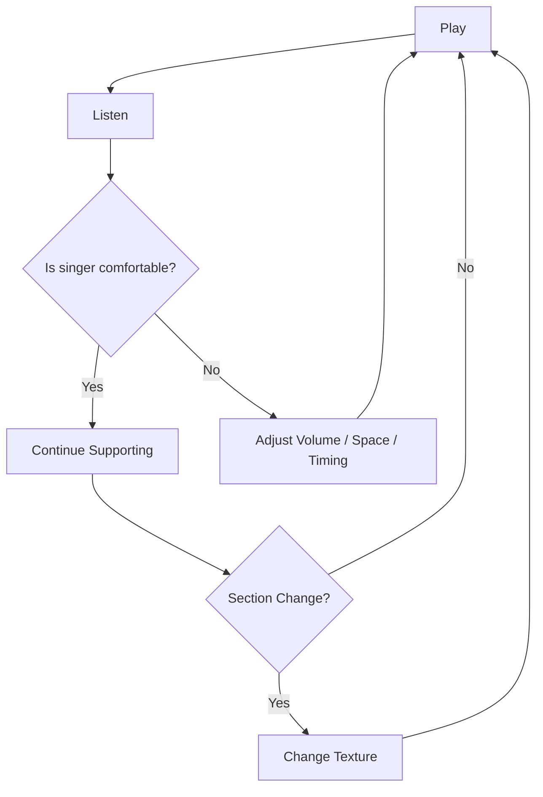

Ini sebabnya “mendengar” sama pentingnya dengan “memainkan”.

---

# 6. Skill Tree Besar

Berikut peta besar skill piano pengiring.

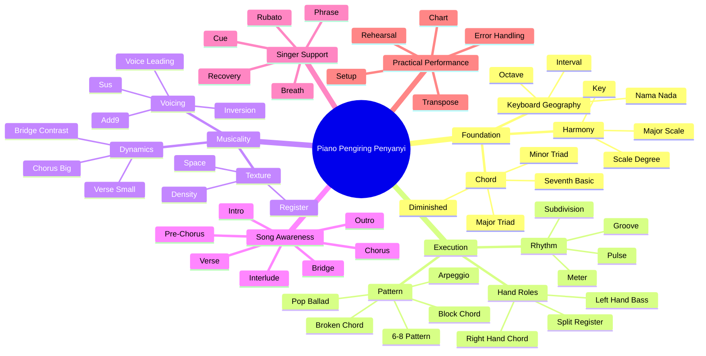

Skill tree ini bukan daftar teori. Ini adalah peta prioritas.

Dalam 20 jam pertama, kita tidak perlu menguasai seluruh cabang. Kita perlu menguasai cabang yang menghasilkan kemampuan tampil paling cepat.

---

# 7. Dependency Graph: Apa yang Harus Dipelajari Duluan

Tidak semua sub-skill memiliki bobot yang sama. Ada yang menjadi fondasi, ada yang hanya mempercantik.

Urutan dependency yang masuk akal:

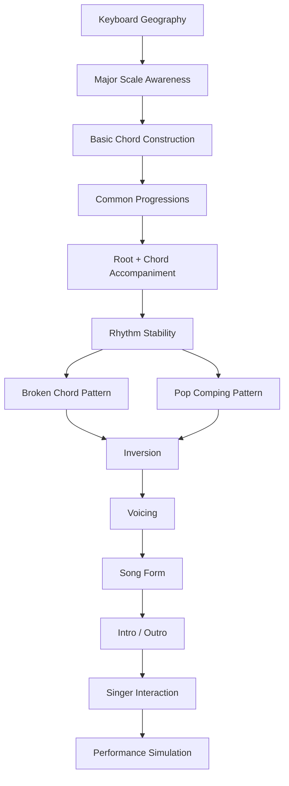

Perhatikan bahwa **rhythm stability** muncul sebelum voicing advanced.

Alasannya sederhana:

> Chord sederhana dengan ritme stabil masih bisa dipakai. Chord indah dengan tempo berantakan sulit dipakai.

Dalam performance, waktu adalah kontrak utama. Chord salah satu kali bisa lewat. Tempo yang terus goyah akan membuat penyanyi kehilangan pijakan.

---

# 8. Sub-Skill 1: Keyboard Geography

## 8.1 Apa itu keyboard geography?

Keyboard geography adalah kemampuan mengenali peta fisik piano:

- di mana letak C;
- pola black keys;
- octave;
- jarak antar nada;
- naik-turun register;
- posisi tangan relatif terhadap chord.

Ini seperti memahami layout keyboard komputer sebelum mengetik cepat.

Anda tidak harus langsung hafal semua nada dengan refleks sempurna. Tetapi Anda harus cukup familiar sehingga tidak panik mencari C, F, G, A, D, E.

## 8.2 Mengapa penting untuk accompaniment?

Karena chord sering berpindah cepat. Jika setiap perpindahan masih membutuhkan pencarian visual lama, ritme akan rusak.

Untuk 20 jam pertama, targetnya:

- menemukan C dalam 1–2 detik;
- menemukan F dan G dengan cepat dari C;
- mengenali pola 2 black keys dan 3 black keys;
- memahami octave rendah, tengah, dan tinggi;
- tahu bahwa tangan kiri umumnya bermain lebih rendah daripada tangan kanan.

## 8.3 Mental model

Piano terdiri dari pola 12 nada yang berulang.

```text
C  C#  D  D#  E  F  F#  G  G#  A  A#  B
```

Lalu pola ini berulang di octave berikutnya.

```text
... C D E F G A B | C D E F G A B | C D E F G A B ...
```

Black keys membantu orientasi:

```text
2 black keys -> C ada di kiri kelompok 2 black keys
3 black keys -> F ada di kiri kelompok 3 black keys
```

## 8.4 Ukuran lulus

Anda lulus sub-skill ini jika bisa:

- menunjuk semua C di keyboard;
- menunjuk F dan G tanpa menghitung dari awal;
- memainkan C rendah dengan tangan kiri dan C tengah dengan tangan kanan;
- berpindah C–F–G–C tanpa berhenti lama.

---

# 9. Sub-Skill 2: Harmonic Foundation

## 9.1 Apa itu harmonic foundation?

Harmonic foundation adalah pemahaman minimum tentang bagaimana nada membentuk key dan chord.

Untuk accompaniment, Anda tidak perlu langsung mempelajari seluruh teori musik. Tetapi Anda perlu memahami:

- key;
- major scale;
- scale degree;
- chord dalam satu key;
- fungsi chord sederhana.

## 9.2 Mengapa penting?

Tanpa harmonic foundation, chord terasa seperti daftar simbol acak:

```text
C - G - Am - F
```

Dengan harmonic foundation, Anda melihat pola:

```text
I - V - vi - IV dalam key C
```

Ini membuat Anda bisa transpose dan memahami hubungan chord.

## 9.3 Key sebagai namespace

Untuk software engineer, key bisa dipahami seperti namespace.

Dalam key C:

```text
I   = C
ii  = Dm
iii = Em
IV  = F
V   = G
vi  = Am
vii°= Bdim
```

Dalam key G:

```text
I   = G
ii  = Am
iii = Bm
IV  = C
V   = D
vi  = Em
vii°= F#dim
```

Progression yang sama dapat hidup di namespace berbeda.

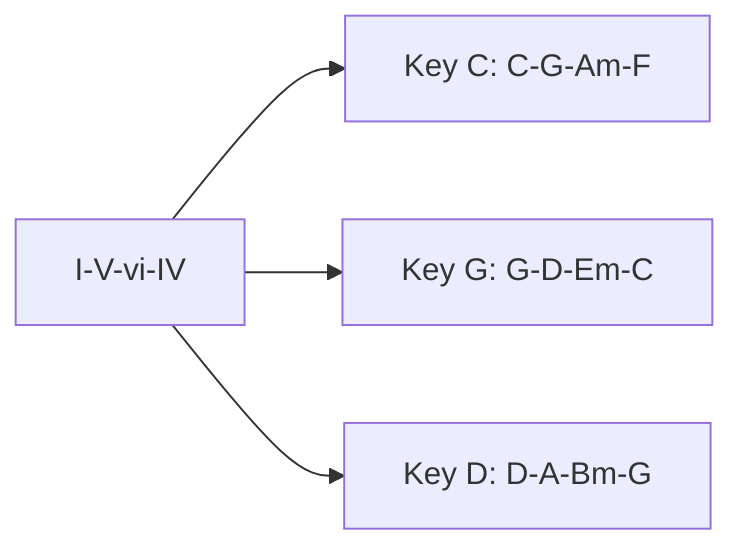

## 9.4 Ukuran lulus

Anda lulus jika bisa menjelaskan:

- apa itu key;
- apa itu scale degree;
- mengapa C–G–Am–F dan G–D–Em–C memiliki fungsi yang sama dalam key berbeda;
- mengapa ini berguna untuk penyanyi.

---

# 10. Sub-Skill 3: Chord Construction

## 10.1 Apa itu chord construction?

Chord construction adalah kemampuan membangun chord dari root, third, dan fifth.

Contoh:

```text
C major = C - E - G
A minor = A - C - E
F major = F - A - C
G major = G - B - D
```

## 10.2 Mengapa penting?

Jika Anda hanya menghafal bentuk chord, Anda akan cepat mentok.

Masalah yang muncul:

- bingung ketika chord pindah key;
- tidak tahu mengapa chord major/minor terdengar beda;
- sulit membuat inversion;
- sulit membaca chord baru;
- sulit memperbaiki salah nada.

Dengan chord construction, Anda tahu struktur internal chord.

## 10.3 Major dan minor sebagai quality

Chord major biasanya terdengar terang/stabil.

Chord minor biasanya terdengar lebih gelap/sendih/introspektif.

Secara struktur:

```text
Major triad = root + major third + perfect fifth
Minor triad = root + minor third + perfect fifth
```

Namun untuk awal, Anda bisa fokus pada chord paling sering:

```text
C, F, G, Am, Dm, Em
```

## 10.4 Ukuran lulus

Anda lulus jika bisa:

- memainkan C, F, G, Am, Dm, Em;
- menyebutkan nada penyusun masing-masing chord;
- membedakan major dan minor secara bunyi;
- memainkan chord dengan tangan kanan tanpa mencari terlalu lama.

---

# 11. Sub-Skill 4: Chord Progression

## 11.1 Apa itu chord progression?

Chord progression adalah urutan chord dalam waktu.

Contoh:

```text
C - G - Am - F
```

Chord tunggal memberi warna. Progression memberi perjalanan.

## 11.2 Mengapa penting untuk penyanyi?

Penyanyi membutuhkan konteks harmoni. Chord progression memberi rasa:

- pulang;
- menjauh;
- tegang;
- lega;
- sedih;
- besar;
- menggantung.

Jika chord progression stabil, penyanyi merasa aman.

## 11.3 Progression prioritas

Untuk 20 jam pertama, progression yang sangat berguna:

```text
I - V - vi - IV
vi - IV - I - V
I - vi - IV - V
I - IV - V - I
ii - V - I
```

Dalam key C:

```text
C - G - Am - F
Am - F - C - G
C - Am - F - G
C - F - G - C
Dm - G - C
```

## 11.4 Ukuran lulus

Anda lulus jika bisa:

- memainkan progression 4 chord secara berulang;
- tidak berhenti di antara chord;
- menjaga tempo sederhana;
- mendengar mana chord yang terasa “pulang”;
- memainkan progression yang sama minimal di key C dan G secara lambat.

---

# 12. Sub-Skill 5: Rhythm and Pulse

## 12.1 Apa itu pulse?

Pulse adalah denyut dasar musik.

Jika lagu adalah sistem berjalan, pulse adalah clock-nya.

Tanpa pulse, chord tidak punya pijakan waktu.

## 12.2 Mengapa ritme lebih penting daripada chord indah?

Karena penyanyi masuk berdasarkan waktu.

Penyanyi tidak hanya mendengar chord. Penyanyi merasakan kapan harus mulai frase.

Jika pianis tidak stabil:

- penyanyi ragu masuk;
- lirik terasa terseret;
- chorus tidak naik;
- ending berantakan;
- semua orang merasa tidak aman.

## 12.3 Komponen ritme

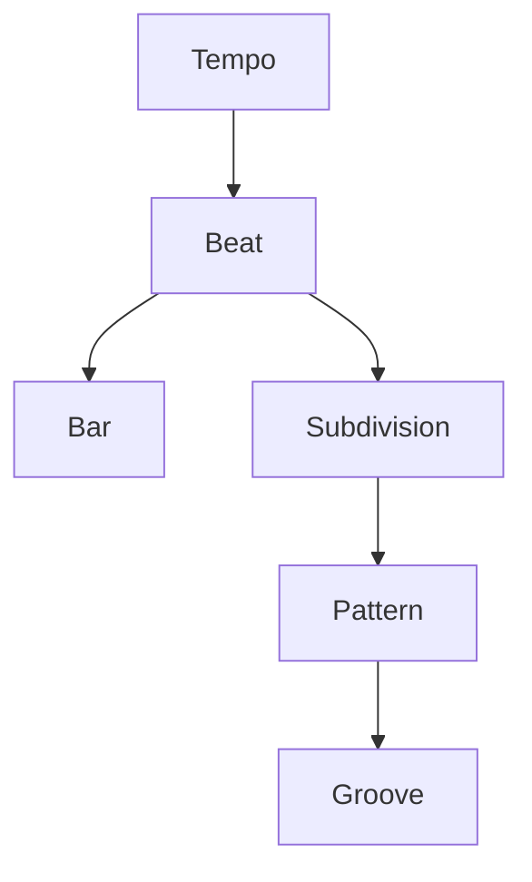

Untuk awal, fokus pada:

- 4/4;
- hitungan 1-2-3-4;
- chord pada beat 1;
- chord pada beat 1 dan 3;
- pola broken chord stabil.

## 12.4 Ukuran lulus

Anda lulus jika bisa:

- memainkan C–G–Am–F dengan metronome lambat;
- tidak mempercepat ketika pindah chord;
- tidak berhenti saat salah kecil;
- menghitung 1-2-3-4 sambil bermain.

---

# 13. Sub-Skill 6: Hand Role Separation

## 13.1 Apa itu hand role separation?

Dalam accompaniment awal, tangan kiri dan kanan sebaiknya punya peran jelas.

Pola minimum:

```text
Left hand  = bass/root note
Right hand = chord
```

Contoh pada chord C:

```text
LH: C rendah
RH: C-E-G
```

## 13.2 Mengapa tangan perlu dipisah perannya?

Karena pemula mudah overload.

Jika kedua tangan diminta melakukan banyak hal sekaligus, sistem motorik gagal.

Maka untuk 20 jam pertama, kita buat arsitektur sederhana:

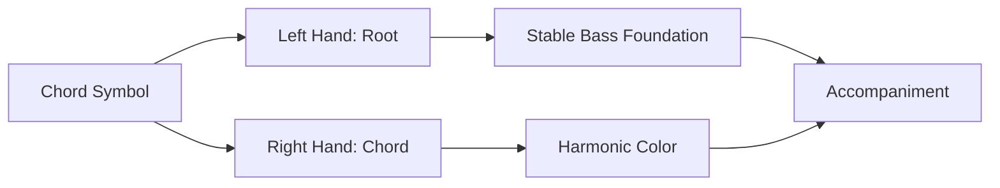

## 13.3 Ukuran lulus

Anda lulus jika bisa:

- tangan kiri memainkan root chord;
- tangan kanan memainkan chord;
- kedua tangan masuk bersamaan pada beat 1;
- berpindah chord tanpa tangan saling mengacaukan.

---

# 14. Sub-Skill 7: Accompaniment Pattern

## 14.1 Apa itu accompaniment pattern?

Pattern adalah cara membagi chord ke dalam waktu.

Chord yang sama bisa terdengar sangat berbeda tergantung pattern.

Contoh chord C:

### Block chord

```text
C-E-G dimainkan bersamaan
```

### Broken chord

```text
C - E - G - E
```

### Arpeggio

```text
C - G - C - E - G
```

## 14.2 Pattern sebagai rendering strategy

Chord adalah data. Pattern adalah rendering.

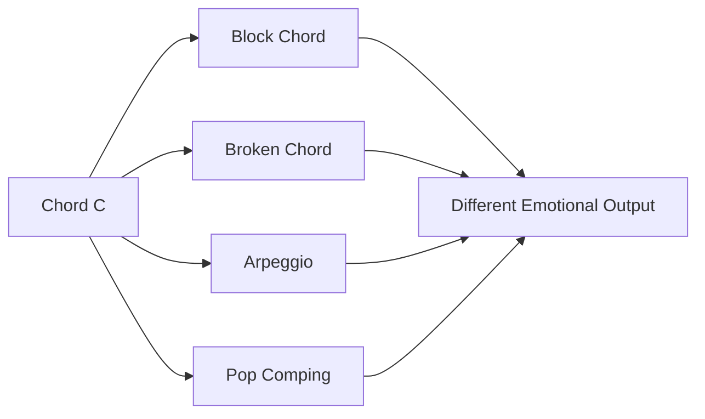

## 14.3 Pattern prioritas

Untuk 20 jam pertama:

1. root + block chord;
2. root + chord on beat 1 and 3;
3. broken chord 1-5-3-5;
4. simple pop ballad pulse;
5. 6/8 broken pattern.

## 14.4 Ukuran lulus

Anda lulus jika bisa memainkan satu progression dengan minimal dua pattern berbeda.

Contoh:

```text
Progression: C - G - Am - F
Pattern A: block chord
Pattern B: broken chord
```

---

# 15. Sub-Skill 8: Voicing and Inversion

## 15.1 Apa itu voicing?

Voicing adalah cara menyusun nada chord di keyboard.

Chord C bisa dimainkan sebagai:

```text
C - E - G
E - G - C
G - C - E
```

Semuanya tetap C major, tetapi rasa dan perpindahannya berbeda.

## 15.2 Apa itu inversion?

Inversion adalah chord yang nadanya sama tetapi urutannya berbeda.

```text
C major root position  = C - E - G
C major first inversion = E - G - C
C major second inversion = G - C - E
```

## 15.3 Mengapa penting?

Jika semua chord dimainkan root position, tangan banyak melompat.

Contoh:

```text
C = C-E-G
G = G-B-D
Am = A-C-E
F = F-A-C
```

Tangan kanan berpindah jauh.

Dengan inversion, perpindahan bisa lebih dekat.

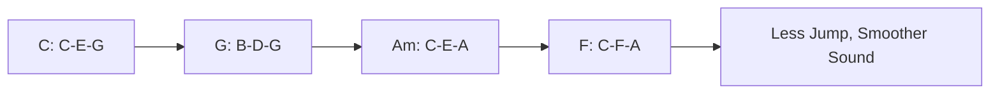

## 15.4 Ukuran lulus

Anda lulus jika bisa:

- memainkan C dalam tiga inversion;
- memilih inversion yang paling dekat dengan chord berikutnya;
- memainkan C–G–Am–F tanpa lompatan besar.

---

# 16. Sub-Skill 9: Register, Density, and Space

## 16.1 Register

Register adalah wilayah tinggi-rendah di piano.

Secara sederhana:

```text
Low register    = bass, berat, gelap
Middle register = padat, dekat dengan vokal
High register   = terang, ringan, sparkling
```

## 16.2 Density

Density adalah jumlah nada dan frekuensi permainan dalam satu waktu.

Density rendah:

```text
sedikit nada, banyak ruang
```

Density tinggi:

```text
banyak nada, rhythm aktif, chord penuh
```

## 16.3 Space

Space adalah ruang untuk vokal.

Piano pengiring yang buruk sering terlalu memenuhi semua ruang.

Piano pengiring yang baik tahu kapan harus diam.

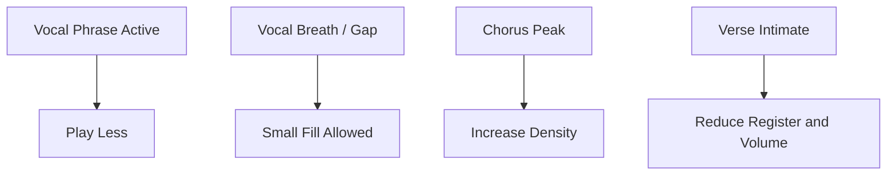

## 16.4 Ukuran lulus

Anda lulus jika bisa:

- memainkan verse lebih kecil dari chorus;
- menghindari chord terlalu rendah yang muddy;
- tidak memainkan fill saat penyanyi sedang bernyanyi padat;
- memilih register tengah-atas untuk chord lembut.

---

# 17. Sub-Skill 10: Song Form Awareness

## 17.1 Apa itu song form?

Song form adalah struktur lagu.

Contoh umum:

```text
Intro - Verse 1 - Chorus - Verse 2 - Chorus - Bridge - Final Chorus - Outro
```

## 17.2 Mengapa penting?

Banyak pemula bisa memainkan chord, tetapi tersesat di struktur.

Mereka tidak tahu:

- kapan chorus masuk;
- kapan bridge;
- kapan ulang;
- kapan ending;
- kapan penyanyi masuk setelah intro.

Dalam live performance, tersesat struktur bisa lebih fatal daripada salah satu chord.

## 17.3 Song form sebagai state machine

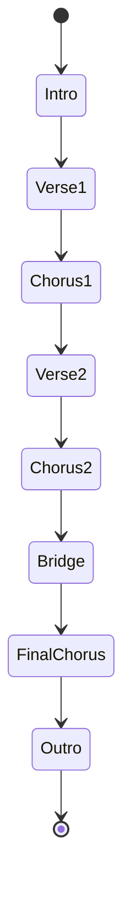

## 17.4 Ukuran lulus

Anda lulus jika bisa:

- menulis struktur lagu di chart;
- tahu jumlah bar intro;
- tahu kapan vokal masuk;
- tahu kapan chorus diulang;
- tahu ending yang disepakati.

---

# 18. Sub-Skill 11: Dynamic Control

## 18.1 Apa itu dynamic control?

Dynamic control adalah kemampuan mengatur intensitas permainan.

Bukan hanya volume, tetapi juga:

- seberapa keras tuts ditekan;
- seberapa sering chord dimainkan;
- seberapa penuh voicing;
- register mana yang dipakai;
- seberapa banyak pedal;
- seberapa aktif tangan kiri.

## 18.2 Dynamic arc

Lagu biasanya punya perjalanan intensitas.

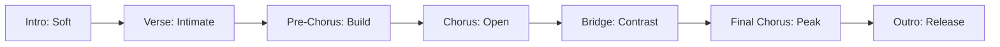

## 18.3 Ukuran lulus

Anda lulus jika bisa memainkan progression yang sama dalam tiga level:

```text
Level 1: very soft, sparse
Level 2: medium, steady
Level 3: bigger, fuller
```

---

# 19. Sub-Skill 12: Singer Interaction

## 19.1 Mengiringi penyanyi bukan mengiringi metronome saja

Metronome penting untuk latihan. Tetapi saat tampil dengan penyanyi, Anda juga harus mendengar manusia.

Penyanyi bisa:

- mengambil napas lebih lama;
- masuk sedikit terlambat;
- memperpanjang kata;
- menahan nada;
- mempercepat frase emosional;
- meminta key berbeda;
- mengulang chorus spontan.

## 19.2 Pianis sebagai supporting process

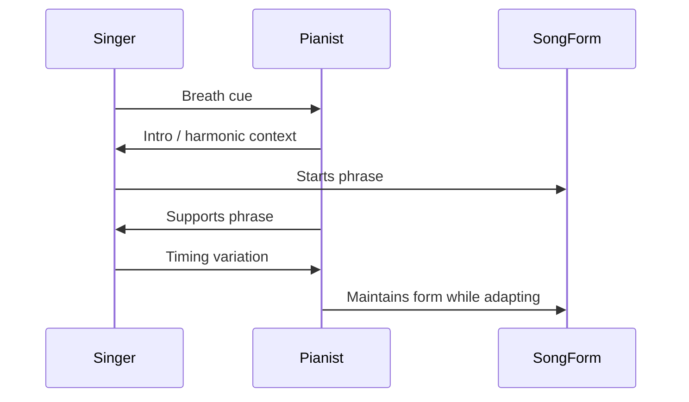

## 19.3 Ukuran lulus

Anda lulus jika bisa:

- memberi intro yang membuat penyanyi tahu kapan masuk;
- mengecilkan permainan saat vokal masuk;
- tidak panik saat penyanyi agak lambat;
- menjaga chord sampai penyanyi selesai frase;
- menyelesaikan ending bersama.

---

# 20. Sub-Skill 13: Transposition Readiness

## 20.1 Apa itu transposition?

Transposition adalah memindahkan lagu ke key lain.

Contoh:

```text
C - G - Am - F
```

Jika dinaikkan ke key D:

```text
D - A - Bm - G
```

## 20.2 Mengapa penting untuk penyanyi?

Karena lagu harus cocok dengan range vokal penyanyi.

Penyanyi mungkin berkata:

> “Terlalu rendah. Bisa naik satu nada?”

Atau:

> “Chorus terlalu tinggi. Turunin ke G.”

Jika Anda hanya hafal chord absolut, Anda akan panik. Jika Anda memahami angka, Anda bisa mapping.

## 20.3 Number system

```text
C - G - Am - F = I - V - vi - IV in key C
D - A - Bm - G = I - V - vi - IV in key D
G - D - Em - C = I - V - vi - IV in key G
```

## 20.4 Ukuran lulus awal

Dalam 20 jam pertama, Anda belum harus bebas transpose semua key.

Target realistis:

- paham konsepnya;
- bisa transpose progression sederhana dengan tabel;
- siap memainkan minimal key C dan G;
- tahu bahwa chart angka lebih fleksibel daripada chord absolut.

---

# 21. Sub-Skill 14: Performance Recovery

## 21.1 Mengapa recovery penting?

Saat live, kesalahan akan terjadi.

Kesalahan umum:

- salah chord;
- salah inversion;
- lupa bar;
- tangan kiri salah bass;
- penyanyi masuk lebih awal;
- pedal terlalu panjang;
- tempo naik;
- lupa ending.

Pianis pemula sering menganggap targetnya adalah tidak pernah salah. Itu tidak realistis.

Target yang lebih baik:

> Jika salah, tetap jaga pulse, kembali ke chord aman, dan recover di bar berikutnya.

## 21.2 Error handling model

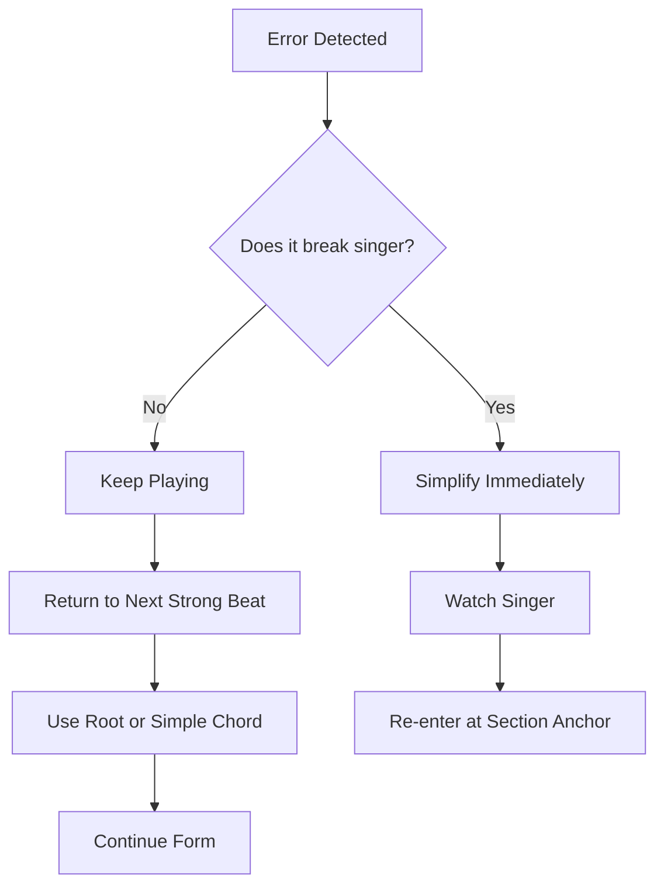

## 21.3 Ukuran lulus

Anda lulus jika bisa:

- tidak berhenti saat salah satu nada;
- kembali ke root chord;
- masuk lagi pada beat 1;
- tetap mengikuti struktur lagu.

---

# 22. Minimum Viable Accompaniment

Setelah semua skill dipecah, kita bisa mendefinisikan minimum viable accompaniment.

## 22.1 Definisi

Minimum viable accompaniment adalah bentuk iringan paling sederhana yang masih bisa dipakai untuk mendukung penyanyi.

Komponennya:

1. key jelas;
2. chord benar;
3. tempo cukup stabil;
4. bass sederhana;
5. chord sederhana;
6. struktur lagu tidak hilang;
7. intro jelas;
8. ending bersih;
9. dinamika tidak mengganggu vokal.

## 22.2 Bentuk paling minimal

Untuk chord C–G–Am–F:

```text
Bar 1: LH C + RH C-E-G
Bar 2: LH G + RH G-B-D
Bar 3: LH A + RH A-C-E
Bar 4: LH F + RH F-A-C
```

Count:

```text
1   2   3   4
Hit -   -   -
```

Atau sedikit lebih aktif:

```text
1   2   3   4
Hit -   Hit -
```

## 22.3 Kenapa ini cukup untuk awal?

Karena penyanyi membutuhkan:

- nada dasar;
- harmoni;
- timing;
- kestabilan.

Penyanyi tidak membutuhkan Anda memainkan 16th-note arpeggio rumit sejak hari pertama.

---

# 23. Apa yang Harus Dikuasai, Apa yang Boleh Ditunda

## 23.1 Harus dikuasai dalam 20 jam pertama

| Area | Harus Bisa |
|---|---|
| Keyboard | menemukan C, F, G, A, D, E |
| Chord | C, F, G, Am, Dm, Em |
| Progression | I–V–vi–IV, I–IV–V, vi–IV–I–V |
| Rhythm | 4/4 stabil, hitungan beat |
| Pattern | block chord, broken chord sederhana |
| Voicing | inversion dasar |
| Structure | intro, verse, chorus, outro |
| Dynamics | verse kecil, chorus lebih besar |
| Performance | tidak berhenti saat salah kecil |

## 23.2 Boleh ditunda

| Area | Kenapa Ditunda |
|---|---|
| Not balok kompleks | tidak wajib untuk chord accompaniment awal |
| Jazz reharmonization | terlalu advanced |
| Improvisasi solo panjang | bukan kebutuhan utama pengiring vokal |
| Semua scale mode | belum relevan untuk 20 jam pertama |
| Teknik klasik advanced | baik, tapi bukan bottleneck awal |
| Semua key | cukup mulai dari C, G, D, A secara bertahap |
| Reading bass clef advanced | belum prioritas |
| Polyrhythm | belum dibutuhkan |

Menunda bukan berarti tidak penting. Artinya belum menjadi constraint utama.

---

# 24. Roadmap Prioritas 20 Jam

Berikut bagaimana sub-skill ini masuk ke 20 jam pertama.

```mermaid
gantt
    title 20 Jam Pertama - Skill Decomposition Roadmap
    dateFormat  X
    axisFormat %s

    section Foundation
    Keyboard Geography        :0, 1
    Major Scale + Key         :1, 2
    Basic Chords              :2, 4

    section Execution
    Progression Loop          :4, 6
    Rhythm Stability          :6, 8
    Hand Role Separation      :8, 9
    Basic Patterns            :9, 11

    section Musicality
    Inversions                :11, 13
    Register + Space          :13, 14
    Dynamics                  :14, 15

    section Song Performance
    Song Form                 :15, 16
    Intro + Outro             :16, 17
    Singer Interaction        :17, 18
    Full Simulation           :18, 20
```

## 24.1 Kenapa urutannya seperti ini?

Karena setiap tahap memberi pijakan untuk tahap berikutnya.

- Tanpa keyboard geography, chord lambat ditemukan.
- Tanpa chord, progression tidak bisa dimainkan.
- Tanpa progression, pattern tidak punya konteks.
- Tanpa rhythm, accompaniment tidak stabil.
- Tanpa voicing, permainan terdengar kaku.
- Tanpa song form, Anda tersesat saat lagu berjalan.
- Tanpa singer interaction, Anda hanya bermain sendiri.

---

# 25. Practice Architecture

Latihan yang efektif harus punya struktur.

Jangan hanya duduk di depan piano lalu bertanya:

> “Hari ini mau main apa ya?”

Gunakan arsitektur latihan berikut.

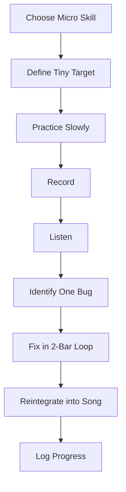

## 25.1 Format sesi 30 menit

Contoh sesi latihan:

| Menit | Aktivitas |
|---:|---|
| 0–3 | warm-up: cari nada C, F, G |
| 3–8 | chord drill: C, G, Am, F |
| 8–15 | progression loop dengan metronome |
| 15–22 | pattern tertentu |
| 22–27 | terapkan ke lagu |
| 27–30 | rekam, dengar, catat bug |

## 25.2 Satu sesi, satu fokus

Jangan dalam satu sesi mencoba memperbaiki:

- chord;
- rhythm;
- voicing;
- pedal;
- dinamika;
- intro;
- transposition;
- improvisasi.

Itu terlalu banyak.

Gunakan prinsip:

> Satu sesi latihan harus punya satu bug utama yang ingin dikurangi.

---

# 26. Feedback Loop: Cara Menemukan Bug Musik

Dalam engineering, bug bisa dilihat melalui log, metric, trace, test failure.

Dalam musik, bug ditemukan melalui:

- telinga;
- rekaman;
- metronome;
- penyanyi;
- guru/teman;
- video tangan;
- perasaan tubuh saat bermain.

## 26.1 Bug taxonomy

| Bug Type | Gejala | Contoh |
|---|---|---|
| Harmony bug | chord salah | G dimainkan saat harusnya F |
| Timing bug | tempo goyah | melambat saat chord sulit |
| Motor bug | tangan tidak sinkron | LH telat dari RH |
| Pattern bug | pola tidak konsisten | arpeggio berubah acak |
| Voicing bug | chord kaku/melompat | semua root position |
| Register bug | suara muddy | chord terlalu rendah |
| Dynamic bug | terlalu keras | vokal tertutup |
| Form bug | tersesat struktur | masuk chorus terlalu cepat |
| Interaction bug | tidak mengikuti penyanyi | tetap main saat penyanyi menahan nada |

## 26.2 Debugging loop

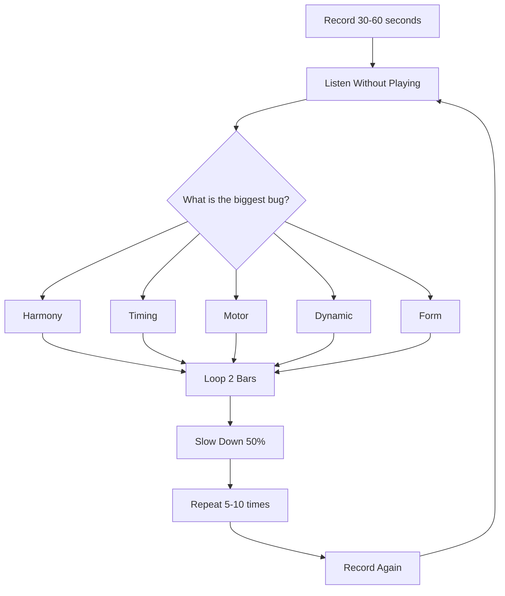

## 26.3 Jangan memperbaiki semua bug sekaligus

Jika rekaman Anda buruk, itu normal.

Pilih satu bug paling besar.

Contoh:

> “Chord sudah benar, tapi setiap pindah ke F tempo berhenti.”

Maka fokusnya bukan chord lagi. Fokusnya adalah transisi ke F.

Latihan:

```text
C -> F
C -> F
C -> F
slowly, without stopping
```

---

# 27. Failure Mode untuk Pemula

## 27.1 Failure Mode 1: Terlalu banyak teori, terlalu sedikit lagu

Gejala:

- tahu scale;
- tahu interval;
- tahu istilah;
- tetapi tidak bisa mengiringi satu lagu utuh.

Solusi:

- setiap teori harus masuk ke lagu;
- gunakan 1 progression utama;
- latihan dalam konteks performa.

## 27.2 Failure Mode 2: Hafal tutorial, tidak memahami chord

Gejala:

- bisa meniru satu video;
- tidak bisa mengganti key;
- tidak tahu chord yang dimainkan;
- lupa jika tangan sedikit berbeda.

Solusi:

- pelajari chord symbol;
- sebutkan nama chord saat bermain;
- ubah pattern dengan chord yang sama.

## 27.3 Failure Mode 3: Ritme goyah saat chord sulit

Gejala:

- lancar di C;
- berhenti di F;
- memperlambat saat G;
- metronome terasa mengganggu.

Solusi:

- perlambat tempo;
- isolasi transisi;
- latihan 2 chord saja;
- jangan lanjut sebelum stabil.

## 27.4 Failure Mode 4: Tangan kiri terlalu ramai

Gejala:

- suara muddy;
- vokal tertutup;
- bass terasa berat;
- lagu kehilangan ruang.

Solusi:

- tangan kiri cukup root;
- hindari chord penuh di register rendah;
- gunakan pedal dengan hati-hati;
- dengarkan rekaman.

## 27.5 Failure Mode 5: Semua section terdengar sama

Gejala:

- verse, chorus, bridge sama intensitasnya;
- lagu terasa datar;
- tidak ada emotional lift.

Solusi:

- verse: lebih sedikit nada;
- chorus: tambah density;
- bridge: ubah register/pattern;
- outro: kurangi intensitas.

## 27.6 Failure Mode 6: Tidak memberi ruang untuk penyanyi

Gejala:

- fill terlalu banyak;
- chord terlalu keras;
- bermain saat vokal padat;
- penyanyi terdengar “bertarung” dengan piano.

Solusi:

- vokal aktif = piano sederhana;
- vokal diam = fill kecil boleh;
- lirik penting = main lebih tipis;
- chorus besar = dukung, bukan menutup.

## 27.7 Failure Mode 7: Berhenti saat salah

Gejala:

- satu chord salah langsung berhenti;
- wajah panik;
- penyanyi ikut kehilangan arah.

Solusi:

- tetap jaga beat;
- kembali ke root;
- masuk ulang di beat 1;
- latih error recovery sengaja.

---

# 28. Checklist Kelulusan Part Ini

Part ini bukan tentang memainkan banyak lagu. Part ini tentang memahami peta skill.

Anda lulus Part 002 jika bisa menjawab pertanyaan berikut.

## 28.1 Konsep

- [ ] Apa perbedaan belajar piano umum dan belajar piano pengiring?
- [ ] Apa itu minimum viable accompaniment?
- [ ] Mengapa rhythm lebih prioritas daripada voicing advanced?
- [ ] Mengapa penyanyi harus menjadi pusat?
- [ ] Apa fungsi intro dalam accompaniment?
- [ ] Apa bedanya chord dan progression?
- [ ] Mengapa inversion penting?
- [ ] Mengapa register rendah bisa berbahaya?
- [ ] Apa yang dimaksud dengan dynamic arc?
- [ ] Apa yang harus dilakukan saat salah chord live?

## 28.2 Skill map

- [ ] Bisa menyebutkan minimal 8 sub-skill piano pengiring.
- [ ] Bisa menjelaskan dependency dari chord ke progression ke pattern.
- [ ] Bisa membedakan foundation, execution, musicality, dan performance layer.
- [ ] Bisa menentukan sub-skill mana yang harus dilatih dulu.

## 28.3 Praktik awal

- [ ] Bisa memilih satu progression utama untuk latihan.
- [ ] Bisa menentukan satu lagu sederhana sebagai target.
- [ ] Bisa membuat practice log sederhana.
- [ ] Bisa merekam latihan dan mencari satu bug terbesar.

---

# 29. Latihan Praktis

## 29.1 Latihan 1 — Buat skill map pribadi

Tulis daftar berikut di catatan Anda:

```text
Target lagu 1:
Target lagu 2:
Target lagu 3:

Skill paling lemah saat ini:
1.
2.
3.

Skill paling penting untuk tampil:
1.
2.
3.
```

Contoh:

```text
Target lagu 1: lagu pop ballad sederhana
Target lagu 2: lagu worship 4 chord
Target lagu 3: lagu slow 6/8

Skill paling lemah saat ini:
1. mencari chord cepat
2. menjaga tempo
3. tangan kiri dan kanan sinkron

Skill paling penting untuk tampil:
1. chord dasar
2. rhythm stabil
3. intro/outro jelas
```

## 29.2 Latihan 2 — Pilih progression utama

Pilih satu progression sebagai “hello world” piano pengiring.

Rekomendasi:

```text
C - G - Am - F
```

Tulis sebagai angka:

```text
I - V - vi - IV
```

Lalu jawab:

```text
Key: C
I  = ?
V  = ?
vi = ?
IV = ?
```

Jawaban:

```text
I  = C
V  = G
vi = Am
IV = F
```

## 29.3 Latihan 3 — Identifikasi layer

Untuk setiap masalah berikut, tentukan layer-nya.

| Masalah | Layer |
|---|---|
| Tidak tahu letak F | Foundation |
| Tempo melambat saat pindah chord | Execution |
| Chord terdengar kaku | Musicality |
| Tersesat setelah chorus | Song Awareness / Performance |
| Penyanyi tertutup suara piano | Musicality / Singer Support |
| Panik saat salah chord | Performance Recovery |

## 29.4 Latihan 4 — Rekam 30 detik

Walaupun belum bisa main lancar, rekam 30 detik percobaan berikut:

```text
C - G - Am - F
```

Mainkan sangat sederhana:

```text
LH: root
RH: chord
Hit: beat 1 only
Tempo: lambat
```

Setelah merekam, jawab:

```text
Bug terbesar saya adalah:
- chord?
- rhythm?
- transisi?
- tangan kiri?
- tangan kanan?
- terlalu keras?
- berhenti saat salah?
```

Jangan memperbaiki semua sekaligus. Pilih satu.

---

# 30. Ringkasan

Piano pengiring adalah skill gabungan, bukan satu kemampuan tunggal.

Sub-skill utamanya:

1. keyboard geography;
2. harmonic foundation;
3. chord construction;
4. chord progression;
5. rhythm and pulse;
6. hand role separation;
7. accompaniment pattern;
8. voicing and inversion;
9. register, density, and space;
10. song form awareness;
11. dynamic control;
12. singer interaction;
13. transposition readiness;
14. performance recovery.

Untuk 20 jam pertama, prioritasnya bukan menjadi pianis lengkap. Prioritasnya adalah membangun **minimum viable accompanist**:

- chord benar;
- tempo stabil;
- pola sederhana;
- struktur jelas;
- vokal tidak tertutup;
- bisa menyelesaikan lagu.

Jika Anda memahami peta ini, latihan berikutnya akan jauh lebih terarah.

Anda tidak lagi bertanya:

> “Saya harus belajar piano dari mana?”

Tetapi:

> “Sub-skill mana yang paling membatasi kemampuan saya mengiringi penyanyi saat ini?”

Itulah cara berpikir yang sesuai dengan pendekatan Kaufman.

---

# 31. Apa yang Akan Dibahas di Part Berikutnya

Part berikutnya:

```text
learn-piano-accompaniment-part-003.md
```

Judul:

```text
Keyboard Geography: Peta Piano untuk Orang Teknis
```

Fokusnya:

- memahami layout piano;
- menemukan nada penting dengan cepat;
- memahami octave;
- memahami pola black keys;
- mengenali interval dasar;
- membangun peta mental keyboard;
- latihan awal agar tangan tidak panik mencari nada.

Status seri:

```text
Part 002 selesai.
Seri belum selesai.
```
