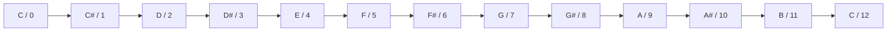
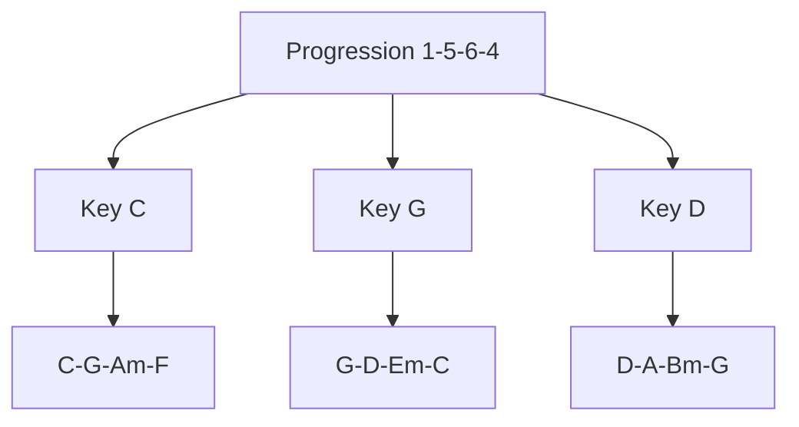
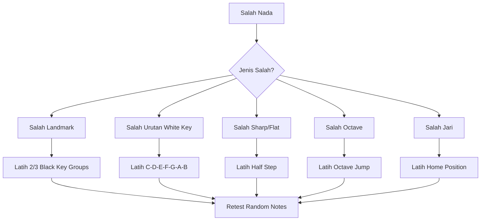

# learn-piano-accompaniment-part-003.md

# Part 003 — Keyboard Geography: Peta Piano untuk Orang Teknis

> Seri: **Learn Piano Accompaniment for Singer Performance**  
> Framework utama: **The First 20 Hours — Josh Kaufman**  
> Target akhir seri: mampu tampil mengiringi penyanyi dengan piano/keyboard secara stabil, musikal, dan praktis.  
> Fokus part ini: membangun peta mental keyboard agar tangan, mata, dan telinga tidak selalu “panic search” saat bermain.

---

## Daftar Isi

1. [Posisi Part Ini dalam Roadmap](#1-posisi-part-ini-dalam-roadmap)
2. [Kenapa Keyboard Geography Penting untuk Pengiring Vokal](#2-kenapa-keyboard-geography-penting-untuk-pengiring-vokal)
3. [Tujuan Praktis Part Ini](#3-tujuan-praktis-part-ini)
4. [Mental Model: Keyboard sebagai Sistem Koordinat](#4-mental-model-keyboard-sebagai-sistem-koordinat)
5. [Anatomi Keyboard: 12 Nada yang Berulang](#5-anatomi-keyboard-12-nada-yang-berulang)
6. [White Keys dan Black Keys](#6-white-keys-dan-black-keys)
7. [Cara Cepat Menemukan C, D, E, F, G, A, B](#7-cara-cepat-menemukan-c-d-e-f-g-a-b)
8. [Sharps, Flats, dan Enharmonic: Nama Berbeda untuk Lokasi Sama](#8-sharps-flats-dan-enharmonic-nama-berbeda-untuk-lokasi-sama)
9. [Octave: Versi Berulang dari Nada yang Sama](#9-octave-versi-berulang-dari-nada-yang-sama)
10. [Middle C dan Register Aman untuk Mengiringi Penyanyi](#10-middle-c-dan-register-aman-untuk-mengiringi-penyanyi)
11. [Interval sebagai Jarak Deterministik](#11-interval-sebagai-jarak-deterministik)
12. [Half Step dan Whole Step](#12-half-step-dan-whole-step)
13. [Mapping Angka ke Nada](#13-mapping-angka-ke-nada)
14. [Pola Visual: 2 Black Keys dan 3 Black Keys](#14-pola-visual-2-black-keys-dan-3-black-keys)
15. [Finger Numbering: API Minimum untuk Tangan](#15-finger-numbering-api-minimum-untuk-tangan)
16. [Home Position untuk Pemula](#16-home-position-untuk-pemula)
17. [Register: Low, Mid, High sebagai Layer Aransemen](#17-register-low-mid-high-sebagai-layer-aransemen)
18. [Piano vs Keyboard Digital: Implikasi Praktis](#18-piano-vs-keyboard-digital-implikasi-praktis)
19. [Latihan 20 Menit Pertama](#19-latihan-20-menit-pertama)
20. [Latihan 45 Menit: Sesi Lengkap Part Ini](#20-latihan-45-menit-sesi-lengkap-part-ini)
21. [Debugging: Jika Masih Sering Salah Nada](#21-debugging-jika-masih-sering-salah-nada)
22. [Failure Mode Umum](#22-failure-mode-umum)
23. [Checklist Kelulusan Part Ini](#23-checklist-kelulusan-part-ini)
24. [Practice Log Template](#24-practice-log-template)
25. [Ringkasan Eksekutif](#25-ringkasan-eksekutif)
26. [Persiapan ke Part 004](#26-persiapan-ke-part-004)

---

## 1. Posisi Part Ini dalam Roadmap

Pada part sebelumnya kita sudah memecah piano pengiring menjadi sistem yang terdiri dari beberapa layer:

1. **Harmony** — chord, key, progression.
2. **Rhythm** — pulse, meter, subdivision, groove.
3. **Texture** — voicing, register, density, pola tangan.
4. **Song form** — intro, verse, chorus, bridge, outro.
5. **Singer interaction** — napas, phrasing, dinamika, cue.
6. **Performance control** — recovery, setup, simulasi live.

Part ini berada di layer paling dasar: **keyboard geography**.

Sebelum membahas chord, scale, voicing, atau pattern, Anda perlu tahu “di mana benda-benda berada”. Untuk software engineer, ini mirip sebelum mulai menulis business logic, Anda harus tahu dulu struktur file, package, namespace, endpoint, dan dependency utama.

Piano adalah interface fisik. Kesalahan pemula sering bukan karena mereka tidak paham teori, tetapi karena otak mereka belum punya peta keyboard yang cukup cepat. Akibatnya:

- mata terus mencari nada;
- tangan ragu-ragu;
- tempo hancur;
- penyanyi kehilangan pegangan;
- chord sederhana pun terasa rumit;
- latihan menjadi lambat dan melelahkan.

Target part ini bukan membuat Anda bisa bermain lagu penuh. Targetnya membuat keyboard terasa **tidak asing**.

---

## 2. Kenapa Keyboard Geography Penting untuk Pengiring Vokal

Untuk mengiringi penyanyi, Anda tidak punya kemewahan untuk berhenti lama mencari nada. Penyanyi membutuhkan tiga hal dari Anda:

1. **Key center jelas** — mereka tahu nada dasar lagu.
2. **Chord tepat waktu** — mereka tahu harmoni saat menyanyi.
3. **Pulse stabil** — mereka bisa masuk, bernapas, dan menyelesaikan frase.

Keyboard geography membantu ketiganya.

Jika Anda belum hafal lokasi nada, maka saat membaca chord seperti:

```text
C   G   Am   F
```

proses internal Anda mungkin seperti ini:

```text
C di mana? Oke ketemu.
G di mana? Tunggu, hitung dulu.
Am berarti A-C-E, A di mana?
F di mana? Salah tekan F#?
```

Proses ini terlalu lambat untuk performance. Saat live, Anda harus sampai ke level:

```text
C -> tangan otomatis ke area C
G -> tangan tahu pola G
Am -> tangan tahu anchor A
F -> tangan tahu anchor F
```

Belum perlu cepat seperti pianis profesional. Tetapi cukup cepat untuk tidak merusak flow lagu.

### Prinsip penting

> Untuk 20 jam pertama, piano bukan harus “dikuasai seluruhnya”. Piano harus cukup dipetakan agar chord dan pattern dasar bisa dieksekusi tanpa panik.

---

## 3. Tujuan Praktis Part Ini

Setelah menyelesaikan part ini, Anda harus mampu:

1. menemukan semua nada natural: **C, D, E, F, G, A, B**;
2. memahami pola 12 nada yang berulang;
3. membedakan white keys dan black keys;
4. memahami sharp dan flat secara lokasi;
5. menemukan Middle C;
6. memahami octave sebagai pengulangan register;
7. memahami interval sebagai jarak;
8. memahami half step dan whole step;
9. memakai pola 2-black-keys dan 3-black-keys sebagai landmark;
10. memainkan latihan sederhana tanpa harus menatap keyboard terus-menerus.

Yang belum menjadi target part ini:

- membaca not balok;
- memainkan chord cepat;
- memainkan lagu lengkap;
- improvisasi;
- teknik fingering klasik;
- transposisi semua key;
- arpeggio kompleks.

Part ini adalah peta. Nanti chord dan scale akan memakai peta ini.

---

## 4. Mental Model: Keyboard sebagai Sistem Koordinat

Piano terlihat panjang, tetapi sebenarnya hanya terdiri dari pola 12 nada yang diulang berkali-kali.

Secara konseptual:

```text
... C C# D D# E F F# G G# A A# B | C C# D D# E F F# G G# A A# B | C ...
```

Dalam istilah engineering, bayangkan keyboard sebagai array siklik:

```text
notes = [C, C#, D, D#, E, F, F#, G, G#, A, A#, B]
```

Setelah indeks 11, kembali ke indeks 0 pada octave berikutnya.



Nada yang sama di octave berbeda punya identitas huruf yang sama, tetapi register berbeda.

Contoh:

```text
C rendah   C tengah   C tinggi
```

Semuanya “C”, tetapi efek musikalnya berbeda.

Untuk piano pengiring:

- tangan kiri sering memainkan register rendah/tengah-rendah;
- tangan kanan sering memainkan register tengah/tengah-atas;
- vokal biasanya berada di sekitar register tengah;
- terlalu banyak nada di tengah bisa menutupi vokal;
- terlalu banyak nada rendah bisa membuat suara muddy.

Jadi peta keyboard bukan hanya soal “nama nada”, tetapi juga **fungsi register**.

---

## 5. Anatomi Keyboard: 12 Nada yang Berulang

Satu octave berisi 12 lokasi nada:

| Urutan | Nama Sharp | Nama Flat Alternatif | Jenis Key |
|---:|---|---|---|
| 0 | C | C | Putih |
| 1 | C# | Db | Hitam |
| 2 | D | D | Putih |
| 3 | D# | Eb | Hitam |
| 4 | E | E | Putih |
| 5 | F | F | Putih |
| 6 | F# | Gb | Hitam |
| 7 | G | G | Putih |
| 8 | G# | Ab | Hitam |
| 9 | A | A | Putih |
| 10 | A# | Bb | Hitam |
| 11 | B | B | Putih |
| 12 | C | C | Putih, octave berikutnya |

Perhatikan dua hal penting:

1. Antara **E dan F** tidak ada black key.
2. Antara **B dan C** tidak ada black key.

Ini akan sangat penting saat memahami scale dan chord.

Banyak pemula salah karena mengira setiap white key selalu dipisahkan black key. Tidak. Keyboard punya dua “gap natural”:

```text
E-F
B-C
```

Gap ini adalah landmark.

---

## 6. White Keys dan Black Keys

### 6.1 White keys

White keys adalah nada natural:

```text
C D E F G A B
```

Setelah B, kembali ke C:

```text
C D E F G A B C D E F G A B C ...
```

White keys adalah starting point terbaik untuk 20 jam pertama karena:

- lebih mudah dilihat;
- C major memakai semua white keys;
- banyak chord dasar bisa dipahami dari white keys dulu;
- Anda bisa membangun mental model interval tanpa terlalu banyak variabel.

### 6.2 Black keys

Black keys adalah nada antara white keys tertentu:

```text
C# / Db
D# / Eb
F# / Gb
G# / Ab
A# / Bb
```

Black keys muncul dalam pola:

```text
2 black keys, lalu 3 black keys, lalu 2 black keys, lalu 3 black keys, ...
```

Pola ini adalah “GPS visual” keyboard.

```text
   black:     [C#] [D#]       [F#] [G#] [A#]
white:    C    D    E    F     G    A    B    C
```

Atau secara visual:

```text
| C | D | E | F | G | A | B | C |
  |#| |#|     |#| |#| |#|
```

### 6.3 Jangan menghafal keyboard dari kiri ke kanan saja

Pemula sering belajar seperti ini:

```text
C D E F G A B C D E F G A B ...
```

Masalahnya, saat diminta menemukan F atau A secara cepat, mereka menghitung dari C. Itu lambat.

Lebih baik gunakan landmark:

- C = white key sebelum grup 2 black keys;
- D = white key di antara 2 black keys;
- E = white key setelah grup 2 black keys;
- F = white key sebelum grup 3 black keys;
- G = white key antara black key pertama dan kedua dari grup 3;
- A = white key antara black key kedua dan ketiga dari grup 3;
- B = white key setelah grup 3 black keys.

---

## 7. Cara Cepat Menemukan C, D, E, F, G, A, B

### 7.1 C

Cari grup **2 black keys**.

C adalah white key tepat di kiri grup 2 black keys.

```text
     C#   D#
      |   |
... C   D   E ...
```

Formula visual:

```text
C = white key before 2-black-key group
```

### Latihan C

1. Cari semua grup 2 black keys.
2. Tekan white key sebelum grup tersebut.
3. Ucapkan “C”.
4. Lakukan dari kiri ke kanan.
5. Lakukan dari kanan ke kiri.

Target: menemukan semua C dalam 10 detik.

---

### 7.2 D

D adalah white key di tengah grup 2 black keys.

```text
     C#   D#
      |   |
... C   D   E ...
```

Formula visual:

```text
D = white key between the 2 black keys
```

### Latihan D

1. Cari grup 2 black keys.
2. Tekan white key di antara dua black keys itu.
3. Ucapkan “D”.
4. Lakukan di semua octave.

---

### 7.3 E

E adalah white key tepat di kanan grup 2 black keys.

```text
     C#   D#
      |   |
... C   D   E ...
```

Formula visual:

```text
E = white key after 2-black-key group
```

---

### 7.4 F

F adalah white key tepat di kiri grup 3 black keys.

```text
       F#   G#   A#
        |    |    |
... E F   G    A    B C ...
```

Formula visual:

```text
F = white key before 3-black-key group
```

---

### 7.5 G

G adalah white key antara black key pertama dan kedua dalam grup 3 black keys.

```text
       F#   G#   A#
        |    |    |
... F   G    A    B ...
```

Formula visual:

```text
G = between black key 1 and 2 in the 3-black-key group
```

---

### 7.6 A

A adalah white key antara black key kedua dan ketiga dalam grup 3 black keys.

```text
       F#   G#   A#
        |    |    |
... F   G    A    B ...
```

Formula visual:

```text
A = between black key 2 and 3 in the 3-black-key group
```

---

### 7.7 B

B adalah white key tepat di kanan grup 3 black keys.

```text
       F#   G#   A#
        |    |    |
... F   G    A    B ...
```

Formula visual:

```text
B = white key after 3-black-key group
```

---

### 7.8 Ringkasan landmark

| Nada | Landmark Visual |
|---|---|
| C | sebelum grup 2 black keys |
| D | di antara grup 2 black keys |
| E | setelah grup 2 black keys |
| F | sebelum grup 3 black keys |
| G | antara black key 1 dan 2 dari grup 3 |
| A | antara black key 2 dan 3 dari grup 3 |
| B | setelah grup 3 black keys |

Ini harus menjadi refleks.

---

## 8. Sharps, Flats, dan Enharmonic: Nama Berbeda untuk Lokasi Sama

Black key bisa punya dua nama, tergantung konteks.

Contoh:

```text
C# = Db
D# = Eb
F# = Gb
G# = Ab
A# = Bb
```

Secara fisik, C# dan Db adalah key yang sama. Tetapi secara teori, nama yang dipakai tergantung key dan fungsi harmoninya.

Untuk 20 jam pertama, cukup pahami ini:

- **sharp (#)** berarti naik satu half step;
- **flat (b)** berarti turun satu half step;
- satu key hitam bisa punya dua nama;
- jangan panik jika chart memakai Bb, bukan A#.

### 8.1 Contoh lokasi

C#:

```text
C# = black key tepat di kanan C
```

Db:

```text
Db = black key tepat di kiri D
```

Keduanya lokasi yang sama.

### 8.2 Kenapa ini penting untuk accompaniment?

Karena chord chart lagu populer sering memakai chord seperti:

```text
Bb   Eb   Ab   Fm
```

Jika Anda hanya mengenal sharp, Anda akan bingung melihat flat. Padahal:

```text
Bb = A#
Eb = D#
Ab = G#
```

Namun pada tahap awal, Anda tidak perlu menguasai semua key. Anda hanya perlu tahu bahwa simbol itu menunjuk lokasi tertentu di keyboard.

### 8.3 Jangan terlalu cepat masuk teori enharmonic

Untuk sekarang, jangan masuk terlalu dalam ke pertanyaan seperti:

- kenapa kadang disebut C# bukan Db?
- kenapa key tertentu memakai flat?
- kenapa E# bisa ada?
- kenapa Cb bisa ada?

Itu penting nanti, tetapi bukan prioritas 20 jam pertama. Prinsip Kaufman: belajar secukupnya agar bisa koreksi diri, bukan menelan seluruh teori sebelum praktik.

---

## 9. Octave: Versi Berulang dari Nada yang Sama

Keyboard berisi pola 12 nada yang berulang. Setiap pengulangan disebut octave.

C ke C berikutnya adalah satu octave.

```text
C D E F G A B C
^             ^
|             |
C awal        C octave berikutnya
```

Dalam piano standar 88 keys, ada banyak C:

```text
C rendah, C lebih tinggi, Middle C, C tinggi, C sangat tinggi
```

Semua punya nama huruf yang sama, tetapi register berbeda.

### 9.1 Analogi engineering

Bayangkan `C` sebagai class name, dan octave sebagai namespace atau instance region.

```text
Low.C
Mid.C
High.C
```

Atau:

```text
C2, C3, C4, C5
```

Nada sama, tetapi konteks register berbeda.

### 9.2 Efek octave terhadap emosi

Nada rendah:

- berat;
- gelap;
- stabil;
- bisa muddy jika terlalu banyak.

Nada tengah:

- jelas;
- dekat dengan vokal;
- cocok untuk chord;
- bisa menabrak suara penyanyi.

Nada tinggi:

- terang;
- tipis;
- bisa memberi sparkle;
- bisa terdengar tajam jika terlalu keras.

Untuk accompaniment, register adalah keputusan aransemen.

---

## 10. Middle C dan Register Aman untuk Mengiringi Penyanyi

Middle C sering disebut **C4** dalam scientific pitch notation. Pada piano, ini menjadi anchor utama.

Pada keyboard 61 keys, Middle C biasanya berada tidak jauh dari tengah keyboard. Pada piano 88 keys, Middle C juga berada dekat area tengah, sedikit ke kiri dari pusat visual penuh.

### 10.1 Kenapa Middle C penting?

Karena banyak pembelajaran piano memakai Middle C sebagai titik orientasi.

Untuk accompaniment:

- tangan kanan sering bermain di sekitar Middle C sampai satu octave di atasnya;
- tangan kiri sering bermain satu sampai dua octave di bawah Middle C;
- chord terlalu rendah terdengar keruh;
- chord terlalu tinggi bisa terasa tipis.

### 10.2 Zona awal yang aman

Untuk 20 jam pertama, gunakan zona ini:

```text
Tangan kiri:  C2 - C3 / C3 - C4 area bawah-tengah
Tangan kanan: C3 - C5 area tengah
```

Jika Anda memakai keyboard 61 keys, sederhanakan:

- tangan kiri: bagian kiri tengah;
- tangan kanan: bagian tengah;
- hindari ujung paling kiri dan paling kanan di awal.

### 10.3 Diagram register sederhana

```text
[Very Low] [Low/Bass] [Middle] [Upper Middle] [High]
    LH        LH          RH         RH          Accent
```

Untuk mengiringi penyanyi:

```text
Bass terlalu rendah + pedal banyak = muddy
Chord terlalu tengah + volume keras = menutupi vokal
Nada tinggi terlalu sering = mengganggu lirik
```

Prinsip awal:

> Mainkan lebih sedikit, di register yang jelas, dengan tempo stabil.

---

## 11. Interval sebagai Jarak Deterministik

Interval adalah jarak antara dua nada.

Untuk programmer, interval adalah operasi offset.

Jika C adalah indeks 0:

```text
C  = 0
C# = 1
D  = 2
D# = 3
E  = 4
F  = 5
F# = 6
G  = 7
G# = 8
A  = 9
A# = 10
B  = 11
C  = 12
```

Maka:

```text
C ke D = +2 half steps
C ke E = +4 half steps
C ke F = +5 half steps
C ke G = +7 half steps
C ke C berikutnya = +12 half steps
```

Ini penting karena chord dibangun dari interval.

Contoh major chord nanti:

```text
Root + 4 half steps + 7 half steps
```

C major:

```text
C + E + G
0 + 4 + 7
```

Minor chord:

```text
Root + 3 half steps + 7 half steps
```

A minor:

```text
A + C + E
```

Kita belum masuk chord secara detail. Tetapi Anda sudah perlu melihat bahwa keyboard punya struktur jarak yang deterministik.

---

## 12. Half Step dan Whole Step

### 12.1 Half step

Half step adalah jarak terkecil di keyboard dari satu key ke key paling dekat berikutnya, termasuk black key.

Contoh:

```text
C ke C# = 1 half step
C# ke D = 1 half step
E ke F = 1 half step
B ke C = 1 half step
```

Penting: E ke F adalah half step walaupun dua-duanya white key. B ke C juga half step.

### 12.2 Whole step

Whole step = 2 half steps.

Contoh:

```text
C ke D = whole step
D ke E = whole step
F ke G = whole step
G ke A = whole step
A ke B = whole step
```

Tetapi:

```text
E ke F = half step, bukan whole step
B ke C = half step, bukan whole step
```

### 12.3 Kenapa half/whole step penting?

Karena major scale dibangun dari pola:

```text
W W H W W W H
```

Nanti di Part 004, kita akan memakai pola ini untuk membangun major scale.

Keyboard geography mempersiapkan itu.

---

## 13. Mapping Angka ke Nada

Untuk 20 jam pertama, kita akan sering memakai angka karena lebih portable daripada nama nada.

Dalam key C major:

| Degree | Nada |
|---:|---|
| 1 | C |
| 2 | D |
| 3 | E |
| 4 | F |
| 5 | G |
| 6 | A |
| 7 | B |
| 1 / 8 | C |

Jika progression tertulis:

```text
1 - 5 - 6 - 4
```

Dalam C major artinya:

```text
C - G - Am - F
```

Nanti saat transposisi, angka ini sangat membantu.

Contoh dalam G major:

```text
1 - 5 - 6 - 4 = G - D - Em - C
```

Tetapi sebelum transposisi, Anda harus nyaman dulu menemukan nada di keyboard.

### 13.1 Angka sebagai abstraction layer

Nama nada adalah implementasi spesifik.

Angka adalah abstraction.



Untuk sekarang, cukup pahami bahwa keyboard geography adalah fondasi untuk mapping ini.

---

## 14. Pola Visual: 2 Black Keys dan 3 Black Keys

Pola black keys adalah fitur paling penting untuk orientasi cepat.

```text
2 black keys: C# D#
3 black keys: F# G# A#
```

Visual lengkap satu octave:

```text
      C#  D#      F#  G#  A#
      |   |       |   |   |
C  D  E   F   G   A   B   C
```

Lebih akurat:

```text
Black:     C#   D#          F#   G#   A#
White:  C    D    E    F     G    A    B    C
```

### 14.1 Landmark cepat

- Grup 2 black keys = area C-D-E.
- Grup 3 black keys = area F-G-A-B.

Jadi Anda tidak perlu menghitung dari awal keyboard.

Jika Anda ingin menemukan A:

1. cari grup 3 black keys;
2. ambil white key antara black key ke-2 dan ke-3;
3. itu A.

Jika ingin menemukan E:

1. cari grup 2 black keys;
2. ambil white key di kanan grup tersebut;
3. itu E.

### 14.2 Drill visual tanpa suara

Latihan ini bisa dilakukan tanpa menyalakan keyboard.

1. Tatap keyboard.
2. Cari semua grup 2 black keys.
3. Tunjuk semua C.
4. Tunjuk semua D.
5. Tunjuk semua E.
6. Cari semua grup 3 black keys.
7. Tunjuk semua F.
8. Tunjuk semua G.
9. Tunjuk semua A.
10. Tunjuk semua B.

Jangan mainkan dulu. Tujuannya mempercepat visual recognition.

---

## 15. Finger Numbering: API Minimum untuk Tangan

Piano memakai nomor jari:

| Nomor | Jari |
|---:|---|
| 1 | ibu jari |
| 2 | telunjuk |
| 3 | tengah |
| 4 | manis |
| 5 | kelingking |

Kedua tangan memakai nomor yang sama.

```text
Left hand:  5 4 3 2 1
Right hand: 1 2 3 4 5
```

Saat nanti kita menulis:

```text
RH: 1-3-5 on C-E-G
```

Artinya tangan kanan:

- ibu jari di C;
- jari tengah di E;
- kelingking di G.

Saat menulis:

```text
LH: 5 on C
```

Artinya tangan kiri kelingking memainkan C.

### 15.1 Kenapa nomor jari penting?

Karena tanpa fingering, Anda akan memilih jari secara acak. Itu membuat gerakan tidak konsisten.

Skill musik butuh reproducibility.

Jika setiap repetisi memakai jari berbeda, sistem motorik sulit belajar.

Prinsip:

> Pada tahap awal, konsistensi lebih penting daripada kecepatan.

---

## 16. Home Position untuk Pemula

Home position adalah posisi tangan awal yang membuat Anda tidak selalu mencari dari nol.

### 16.1 Right hand C position

Tangan kanan:

| Jari | Nada |
|---:|---|
| 1 | C |
| 2 | D |
| 3 | E |
| 4 | F |
| 5 | G |

```text
RH C position:
1 2 3 4 5
C D E F G
```

Gunakan ini untuk mengenal area C major.

### 16.2 Left hand C position

Tangan kiri:

| Jari | Nada |
|---:|---|
| 5 | C |
| 4 | D |
| 3 | E |
| 2 | F |
| 1 | G |

```text
LH C position:
5 4 3 2 1
C D E F G
```

### 16.3 Jangan kaku terlalu lama

Home position hanya training wheel. Dalam accompaniment, tangan akan sering berpindah chord dan register. Tetapi untuk part ini, home position membantu:

- mengenal white keys;
- membangun koordinasi awal;
- membuat latihan tidak chaotic.

---

## 17. Register: Low, Mid, High sebagai Layer Aransemen

Piano bukan hanya horizontal. Piano juga punya fungsi vertikal berdasarkan register.

```text
Low Register       Middle Register       High Register
Bass / Weight      Chords / Body         Color / Sparkle
```

Untuk pengiring vokal, register harus dipakai hati-hati.

### 17.1 Low register

Fungsi:

- memberi dasar bass;
- memberi berat;
- menegaskan root chord.

Risiko:

- muddy;
- terlalu boomy;
- mengganggu clarity;
- sustain pedal membuat suara kabur.

Aturan awal:

> Di register rendah, mainkan sedikit nada.

### 17.2 Middle register

Fungsi:

- chord terdengar jelas;
- cocok untuk tangan kanan;
- body harmoni berada di sini.

Risiko:

- menabrak vokal;
- terlalu padat;
- membuat penyanyi terasa “ditutup”.

Aturan awal:

> Di register tengah, jaga volume dan density.

### 17.3 High register

Fungsi:

- memberi warna;
- fill antar frase;
- sparkle;
- emotional lift.

Risiko:

- terdengar menusuk;
- terdengar terlalu ramai;
- fill bisa mengganggu lirik.

Aturan awal:

> Di register tinggi, gunakan sebagai aksen, bukan tempat tinggal permanen.

---

## 18. Piano vs Keyboard Digital: Implikasi Praktis

Anda mungkin belajar dengan:

- piano akustik;
- digital piano 88 keys;
- keyboard 61 keys;
- MIDI controller;
- aplikasi piano virtual.

Semua bisa dipakai untuk tahap awal, tetapi ada implikasi.

### 18.1 Piano akustik

Kelebihan:

- respons dinamis alami;
- suara kaya;
- sustain natural;
- feel bagus.

Kekurangan:

- tidak bisa pakai headphone;
- tuning bisa masalah;
- volume sulit dikontrol;
- tidak portable.

### 18.2 Digital piano 88 keys weighted

Kelebihan:

- ideal untuk latihan modern;
- headphone;
- volume control;
- biasanya punya sustain pedal;
- touch response lebih dekat ke piano asli.

Kekurangan:

- butuh ruang;
- harga lebih tinggi.

### 18.3 Keyboard 61 keys

Kelebihan:

- cukup untuk 20 jam pertama;
- portable;
- murah;
- banyak sound.

Kekurangan:

- range terbatas;
- tuts kadang ringan;
- dinamika kurang natural;
- pedal kadang tidak tersedia.

### 18.4 MIDI controller

Kelebihan:

- bisa pakai VST piano bagus;
- fleksibel;
- cocok untuk produksi.

Kekurangan:

- perlu laptop/software;
- setup friction lebih besar;
- latency bisa mengganggu jika tidak diatur.

### 18.5 Prinsip Kaufman: remove practice barriers

Untuk 20 jam pertama, alat terbaik adalah alat yang membuat Anda **paling mudah latihan**.

Jika digital piano bagus tetapi jarang disentuh, kalah dengan keyboard sederhana yang selalu siap.

Prioritas:

1. mudah dinyalakan;
2. sustain pedal jika ada;
3. volume/headphone;
4. touch response;
5. range cukup;
6. suara piano tidak terlalu buruk.

---

## 19. Latihan 20 Menit Pertama

Ini adalah latihan pertama yang harus dilakukan setelah membaca part ini.

Tujuan: membangun orientasi keyboard.

Gunakan timer 20 menit.

### Menit 0–3: Observasi pola black keys

Tanpa bermain cepat.

1. Cari semua grup 2 black keys.
2. Cari semua grup 3 black keys.
3. Ucapkan:

```text
2 black keys = C-D-E area
3 black keys = F-G-A-B area
```

Jangan tekan banyak nada. Fokus visual.

---

### Menit 3–6: Cari semua C

1. Cari grup 2 black keys.
2. Tekan white key sebelum grup itu.
3. Ucapkan “C”.
4. Lakukan dari kiri ke kanan.
5. Lakukan dari kanan ke kiri.

Target:

```text
Semua C bisa ditemukan tanpa menghitung dari awal keyboard.
```

---

### Menit 6–9: Cari semua F

1. Cari grup 3 black keys.
2. Tekan white key sebelum grup itu.
3. Ucapkan “F”.
4. Lakukan semua octave.

Kenapa C dan F dulu?

Karena C dan F adalah anchor kiri dari dua jenis grup black keys.

```text
C = anchor grup 2
F = anchor grup 3
```

---

### Menit 9–12: Cari D, E, G, A, B

Gunakan landmark:

```text
D = tengah grup 2
E = kanan grup 2
G = antara black 1 dan 2 dari grup 3
A = antara black 2 dan 3 dari grup 3
B = kanan grup 3
```

Latihan:

1. Pilih satu nada secara acak.
2. Cari di 3 octave berbeda.
3. Ucapkan nama nada.
4. Jangan terburu-buru.

---

### Menit 12–15: Mainkan C-D-E-F-G-A-B-C

Pakai tangan kanan.

```text
C D E F G A B C
```

Tidak perlu cepat. Tujuan:

- mata mengenal urutan;
- jari mengenal jarak;
- telinga mendengar naik.

Lalu turun:

```text
C B A G F E D C
```

---

### Menit 15–17: Half step walk

Mainkan semua key berurutan dari C ke C:

```text
C C# D D# E F F# G G# A A# B C
```

Perhatikan E-F dan B-C.

Ucapkan:

```text
E-F tidak ada black key.
B-C tidak ada black key.
```

---

### Menit 17–20: Random note drill

Pilih nada acak:

```text
C, F, A, D, G, B, E
```

Untuk setiap nada:

1. cari di keyboard;
2. tekan;
3. ucapkan;
4. cari octave lain;
5. tekan lagi.

Target bukan sempurna. Targetnya mulai membangun peta.

---

## 20. Latihan 45 Menit: Sesi Lengkap Part Ini

Jika Anda punya waktu lebih panjang, gunakan sesi 45 menit ini.

### Struktur sesi

| Durasi | Latihan | Tujuan |
|---:|---|---|
| 5 menit | Black key groups | landmark visual |
| 8 menit | C dan F anchor drill | orientasi cepat |
| 8 menit | Semua white key drill | nama nada natural |
| 6 menit | Half/whole step drill | jarak dasar |
| 6 menit | Octave drill | register |
| 6 menit | Finger numbering + home position | koordinasi awal |
| 6 menit | Random note test | self-correction |

---

### 20.1 Drill 1 — Black key groups

Instruksi:

1. Jangan mainkan nada.
2. Tunjuk grup 2 black keys.
3. Tunjuk grup 3 black keys.
4. Ulangi sampai mata otomatis melihat pola.

Checklist:

- bisa membedakan grup 2 dan grup 3;
- tidak salah melihat area;
- tidak menghitung dari kiri keyboard.

---

### 20.2 Drill 2 — C dan F anchor

Instruksi:

```text
C = sebelum grup 2
F = sebelum grup 3
```

Lakukan:

- semua C dari kiri ke kanan;
- semua F dari kiri ke kanan;
- campur C-F-C-F secara acak.

Tujuan:

C dan F menjadi anchor utama.

---

### 20.3 Drill 3 — White key naming

Pola:

```text
C D E F G A B C
```

Lakukan di beberapa octave.

Lalu mulai dari F:

```text
F G A B C D E F
```

Lalu mulai dari A:

```text
A B C D E F G A
```

Kenapa mulai dari nada berbeda?

Agar Anda tidak hanya hafal urutan dari C. Dalam lagu, chord bisa mulai dari mana saja.

---

### 20.4 Drill 4 — Half step dan whole step

Dari C:

- half step up = C#;
- whole step up = D.

Dari E:

- half step up = F;
- whole step up = F#.

Dari B:

- half step up = C;
- whole step up = C#.

Latihan:

| Start | Half Step Up | Whole Step Up |
|---|---|---|
| C | C# | D |
| D | D# | E |
| E | F | F# |
| F | F# | G |
| G | G# | A |
| A | A# | B |
| B | C | C# |

---

### 20.5 Drill 5 — Octave jump

Pilih nada C.

1. Tekan C tengah.
2. Cari C di kiri.
3. Cari C di kanan.
4. Ucapkan “same note, different register”.

Ulangi untuk:

```text
F, G, A, D
```

Tujuan:

Anda memahami bahwa nada punya identitas dan register.

---

### 20.6 Drill 6 — Home position

Right hand C position:

```text
1 2 3 4 5
C D E F G
```

Mainkan:

```text
C D E F G F E D C
```

Left hand C position:

```text
5 4 3 2 1
C D E F G
```

Mainkan:

```text
C D E F G F E D C
```

Jangan mengejar speed.

Target:

- jari tidak tegang;
- tangan tidak naik terlalu tinggi;
- suara tiap nada relatif rata;
- Anda tahu jari mana memainkan nada mana.

---

### 20.7 Drill 7 — Random note test

Buat daftar acak:

```text
F, C, A, E, G, B, D, F, A, C
```

Untuk setiap nada:

1. cari lokasi;
2. tekan;
3. ucapkan nama;
4. pindah octave;
5. ulangi.

Self-check:

- apakah Anda masih menghitung dari C?
- apakah Anda melihat black-key landmark?
- apakah C dan F sudah cepat ditemukan?
- apakah E-F dan B-C masih membingungkan?

---

## 21. Debugging: Jika Masih Sering Salah Nada

Kesalahan nada adalah bug. Jangan hanya ulangi lagu penuh. Debug seperti sistem.



### 21.1 Salah landmark

Gejala:

- C tertukar dengan F;
- D tertukar dengan G/A;
- Anda tidak melihat grup black keys.

Solusi:

- jangan main lagu dulu;
- lakukan visual drill 5 menit;
- ucapkan landmark keras-keras.

### 21.2 Salah urutan white key

Gejala:

- setelah G bingung lanjut A atau H;
- lupa bahwa setelah B kembali ke C;
- urutan turun lebih sulit daripada naik.

Solusi:

- latih naik dan turun;
- mulai dari nada selain C;
- ucapkan nada saat menekan.

### 21.3 Salah sharp/flat

Gejala:

- Bb tidak dikenali;
- F# tertukar F;
- mengira semua black key hanya sharp.

Solusi:

- pahami black key punya dua nama;
- latih pasangan:

```text
C# = Db
D# = Eb
F# = Gb
G# = Ab
A# = Bb
```

### 21.4 Salah octave

Gejala:

- chord benar tapi register terlalu rendah;
- tangan kiri dan kanan terlalu berdekatan;
- suara terdengar muddy.

Solusi:

- cari nada sama di octave berbeda;
- mainkan C rendah, C tengah, C tinggi;
- dengarkan efeknya.

### 21.5 Salah jari

Gejala:

- jari berganti-ganti acak;
- tangan tegang;
- sulit mengulang pola.

Solusi:

- gunakan home position;
- perlambat;
- ulangi dengan fingering konsisten.

---

## 22. Failure Mode Umum

### Failure Mode 1 — Menghafal keyboard secara linear

Pola buruk:

```text
Untuk menemukan A, mulai hitung dari C: C-D-E-F-G-A.
```

Masalah:

- lambat;
- tidak scalable;
- kacau saat pindah octave;
- mengganggu tempo.

Solusi:

Gunakan landmark 2/3 black keys.

---

### Failure Mode 2 — Mengabaikan black keys

Pemula sering nyaman di white keys, lalu takut dengan black keys.

Masalah:

- tidak bisa membaca chord seperti Bb, Eb, F#;
- transposisi sulit;
- key selain C terasa menakutkan.

Solusi:

Jangan harus menguasai semua key sekarang, tetapi kenali lokasi black keys sejak awal.

---

### Failure Mode 3 — Terlalu cepat belajar lagu

Belajar lagu memang menyenangkan, tetapi jika peta keyboard belum ada, lagu menjadi aktivitas trial-and-error.

Gejala:

- satu bar diulang 100 kali tetapi tidak tahu masalahnya;
- chord salah karena salah lokasi;
- tempo tidak pernah stabil.

Solusi:

Sisihkan 10–15 menit setiap sesi untuk keyboard geography sebelum lagu.

---

### Failure Mode 4 — Mata terlalu bergantung pada tangan

Awalnya melihat keyboard itu normal. Tetapi jika setiap nada harus dicari visual penuh, performa menjadi rapuh.

Solusi:

- gunakan landmark;
- latih octave jump;
- latih random note;
- perlahan kurangi durasi melihat tangan.

---

### Failure Mode 5 — Tidak memahami register

Chord benar tetapi terdengar jelek karena register salah.

Contoh:

- C major terlalu rendah dengan pedal penuh;
- tangan kanan terlalu dekat dengan vocal range;
- tangan kiri memainkan terlalu banyak nada.

Solusi:

Mulai dengarkan register sebagai bagian dari aransemen.

---

## 23. Checklist Kelulusan Part Ini

Anda boleh lanjut ke Part 004 jika bisa melakukan hal berikut.

### 23.1 Keyboard note recognition

- [ ] Bisa menemukan semua C tanpa menghitung dari awal.
- [ ] Bisa menemukan semua F tanpa menghitung dari awal.
- [ ] Bisa menemukan D dan E dari grup 2 black keys.
- [ ] Bisa menemukan G, A, B dari grup 3 black keys.
- [ ] Bisa menyebut urutan white keys naik dan turun.

### 23.2 Black key awareness

- [ ] Tahu C# dan Db adalah lokasi sama.
- [ ] Tahu D# dan Eb adalah lokasi sama.
- [ ] Tahu F# dan Gb adalah lokasi sama.
- [ ] Tahu G# dan Ab adalah lokasi sama.
- [ ] Tahu A# dan Bb adalah lokasi sama.

### 23.3 Interval basics

- [ ] Tahu half step adalah jarak ke key terdekat.
- [ ] Tahu whole step adalah dua half steps.
- [ ] Tahu E-F adalah half step.
- [ ] Tahu B-C adalah half step.

### 23.4 Octave and register

- [ ] Bisa menemukan C di minimal tiga octave.
- [ ] Bisa menjelaskan beda low, middle, high register.
- [ ] Tahu register rendah bisa muddy.
- [ ] Tahu register tengah bisa menabrak vokal.

### 23.5 Finger basics

- [ ] Tahu nomor jari 1–5.
- [ ] Bisa memainkan RH C-D-E-F-G dengan jari 1-2-3-4-5.
- [ ] Bisa memainkan LH C-D-E-F-G dengan jari 5-4-3-2-1.

Jika checklist belum selesai, jangan panik. Ulangi latihan 20 menit pertama selama 2–3 sesi.

---

## 24. Practice Log Template

Gunakan template ini setelah latihan part ini.

```markdown
# Practice Log — Part 003 Keyboard Geography

Tanggal:
Durasi:
Alat:

## Latihan yang dilakukan
- [ ] Black key group recognition
- [ ] C anchor drill
- [ ] F anchor drill
- [ ] White key naming
- [ ] Half/whole step drill
- [ ] Octave drill
- [ ] Home position
- [ ] Random note test

## Temuan
Nada yang paling mudah:
Nada yang paling sering salah:
Bagian keyboard yang membingungkan:

## Error utama
Contoh:
- masih menghitung dari C
- C dan F tertukar
- B-C masih terasa aneh
- black keys belum otomatis
- tangan tegang

## Perbaikan sesi berikutnya
Fokus 1:
Fokus 2:

## Skor subjektif
Keyboard familiarity: __ / 10
Note recognition speed: __ / 10
Confidence: __ / 10
```

---

## 25. Ringkasan Eksekutif

Keyboard terlihat kompleks, tetapi struktur dasarnya sederhana:

```text
12 nada berulang dalam pola octave.
```

White keys:

```text
C D E F G A B
```

Black keys:

```text
C#/Db, D#/Eb, F#/Gb, G#/Ab, A#/Bb
```

Landmark utama:

```text
C-D-E = sekitar grup 2 black keys
F-G-A-B = sekitar grup 3 black keys
```

Dua gap penting:

```text
E-F
B-C
```

Untuk piano pengiring, keyboard geography bukan teori kosong. Ini menentukan apakah Anda bisa:

- menemukan chord tepat waktu;
- menjaga tempo;
- memilih register yang tidak mengganggu vokal;
- pindah chord tanpa panik;
- membangun skill lebih lanjut.

Part ini adalah fondasi sebelum major scale dan chord.

---

## 26. Persiapan ke Part 004

Part berikutnya:

```text
learn-piano-accompaniment-part-004.md
Major Scale sebagai API Musik
```

Di Part 004, kita akan memakai peta keyboard ini untuk memahami major scale.

Kita akan membahas:

- major scale sebagai sumber chord;
- formula W-W-H-W-W-W-H;
- kenapa C major memakai semua white keys;
- scale degree 1–7;
- key sebagai namespace;
- hubungan scale dengan chord progression;
- latihan C major dan G major.

Sebelum lanjut, minimal lakukan ini:

1. temukan semua C;
2. temukan semua F;
3. mainkan C-D-E-F-G-A-B-C;
4. pahami E-F dan B-C sebagai half step;
5. lakukan random note drill 5 menit.

---

# Status Part

**Part 003 selesai.**  
**Seri belum selesai.**

Lanjut ke Part 004 setelah ini.
