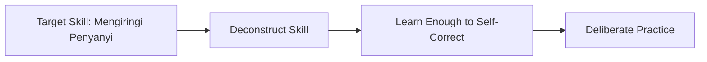
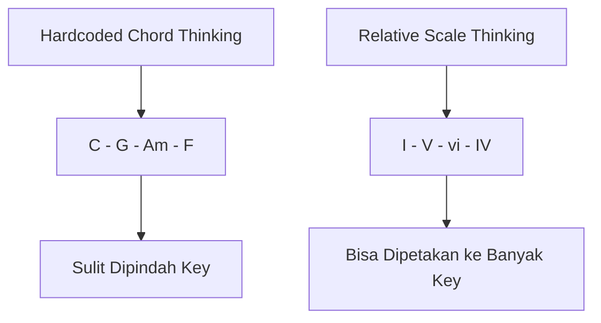
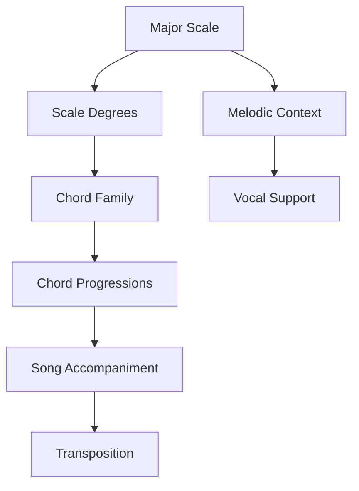
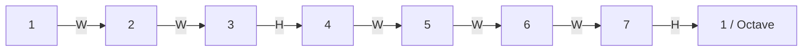
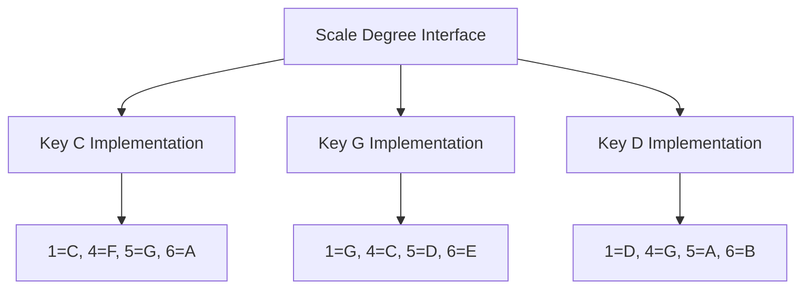
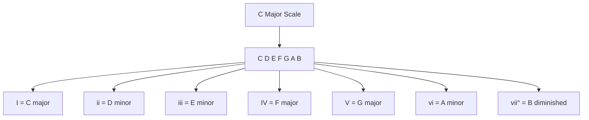
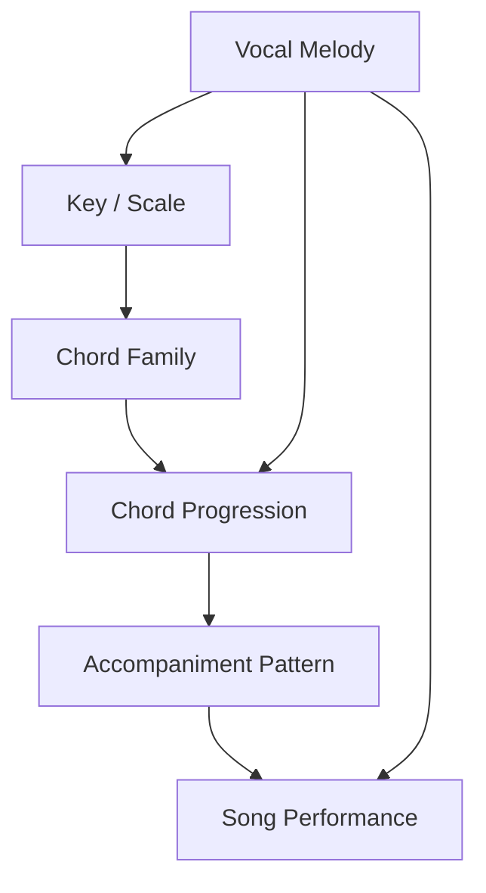
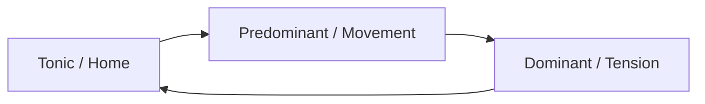
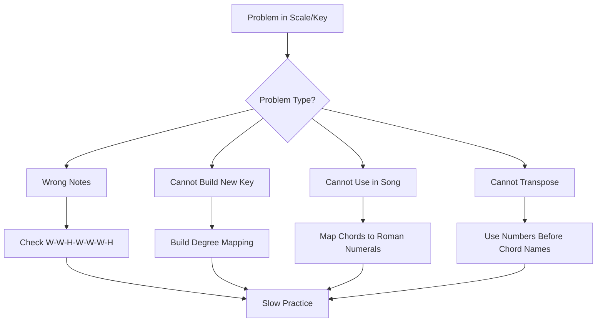

# learn-piano-accompaniment-part-004.md
# Part 004 — Major Scale sebagai API Musik

> Seri: **Learn Piano Accompaniment for Singer Performance**  
> Fokus: **Belajar piano untuk mengiringi penyanyi**  
> Framework: **The First 20 Hours — Josh Kaufman**  
> Target akhir seri: mampu mengiringi penyanyi dalam 3–5 lagu sederhana dengan chord benar, tempo stabil, pola iringan masuk akal, dinamika terkendali, dan kemampuan mengikuti vokal.

---

## Daftar Isi

1. [Tujuan Part Ini](#1-tujuan-part-ini)
2. [Kenapa Major Scale Sangat Penting](#2-kenapa-major-scale-sangat-penting)
3. [Major Scale sebagai API Musik](#3-major-scale-sebagai-api-musik)
4. [Musik Tidak Harus Dipikir Absolut](#4-musik-tidak-harus-dipikir-absolut)
5. [Formula Major Scale](#5-formula-major-scale)
6. [Half Step dan Whole Step](#6-half-step-dan-whole-step)
7. [Membangun C Major Scale](#7-membangun-c-major-scale)
8. [Scale Degree: Angka 1 sampai 7](#8-scale-degree-angka-1-sampai-7)
9. [Key sebagai Namespace](#9-key-sebagai-namespace)
10. [Roman Numeral: Interface untuk Chord Progression](#10-roman-numeral-interface-untuk-chord-progression)
11. [Diatonic Chords dalam Major Key](#11-diatonic-chords-dalam-major-key)
12. [Kenapa Pola I–V–vi–IV Bisa Dipindah Key](#12-kenapa-pola-ivviiv-bisa-dipindah-key)
13. [Hubungan Scale, Chord, dan Lagu](#13-hubungan-scale-chord-dan-lagu)
14. [Fungsi Harmoni: Tonic, Predominant, Dominant](#14-fungsi-harmoni-tonic-predominant-dominant)
15. [Cara Berpikir Relatif untuk Pengiring Penyanyi](#15-cara-berpikir-relatif-untuk-pengiring-penyanyi)
16. [Latihan 1 — Mainkan C Major Scale](#16-latihan-1--mainkan-c-major-scale)
17. [Latihan 2 — Bangun Major Scale dari G](#17-latihan-2--bangun-major-scale-dari-g)
18. [Latihan 3 — Ubah Nada Menjadi Angka](#18-latihan-3--ubah-nada-menjadi-angka)
19. [Latihan 4 — Ubah Angka Menjadi Chord](#19-latihan-4--ubah-angka-menjadi-chord)
20. [Latihan 5 — Dengarkan Rasa Setiap Degree](#20-latihan-5--dengarkan-rasa-setiap-degree)
21. [Debugging Major Scale](#21-debugging-major-scale)
22. [Kesalahan Umum Pemula](#22-kesalahan-umum-pemula)
23. [Checklist Kelulusan Part 004](#23-checklist-kelulusan-part-004)
24. [Practice Log](#24-practice-log)
25. [Ringkasan](#25-ringkasan)
26. [Apa yang Dilanjutkan di Part 005](#26-apa-yang-dilanjutkan-di-part-005)

---

# 1. Tujuan Part Ini

Part sebelumnya membahas **keyboard geography**: bagaimana melihat piano sebagai peta nada, bukan sebagai deretan tombol acak.

Part ini masuk ke fondasi berikutnya: **major scale**.

Tujuan part ini bukan agar Anda menjadi ahli teori musik, melainkan agar Anda punya model mental yang cukup untuk:

- memahami dari mana chord berasal;
- membaca chord progression dengan lebih cepat;
- memahami kenapa lagu bisa dipindah key;
- melihat hubungan antar chord;
- tidak terlalu bergantung pada hafalan absolut;
- mulai berpikir seperti pengiring penyanyi, bukan hanya pemain chord mekanis.

Dalam framework *The First 20 Hours*, ini termasuk tahap:



Major scale adalah bagian dari **learn enough to self-correct**.

Anda tidak perlu menguasai seluruh teori harmoni sekarang. Namun Anda perlu cukup paham untuk menjawab pertanyaan praktis seperti:

- “Chord ini masuk key apa?”
- “Kalau penyanyi minta naik dari C ke D, chord-nya jadi apa?”
- “Kenapa setelah G biasanya enak kembali ke C?”
- “Kenapa Am terasa sedih padahal masih dalam keluarga C major?”
- “Kenapa F ke G ke C terasa selesai?”

Kalau Anda tidak punya model major scale, semua pertanyaan itu akan terasa seperti magic. Kalau Anda paham major scale, semuanya menjadi sistem.

---

# 2. Kenapa Major Scale Sangat Penting

Dalam konteks piano pengiring, major scale adalah **basis koordinat**.

Tanpa major scale, Anda cenderung berpikir seperti ini:

> Lagu ini chord-nya C, G, Am, F. Hafalkan saja.

Itu bisa bekerja untuk satu lagu. Tetapi begitu penyanyi minta ganti key, Anda akan bingung.

Dengan major scale, Anda berpikir seperti ini:

> Lagu ini progression-nya I–V–vi–IV di key C. Kalau pindah ke key D, progression-nya tetap I–V–vi–IV, hanya mapping chord-nya berubah menjadi D–A–Bm–G.

Ini jauh lebih kuat.

Perbedaannya seperti hardcoded value vs abstraction.



Untuk software engineer, major scale bisa dianggap seperti **contract** atau **interface** yang membuat banyak komponen musik saling kompatibel.

```text
Key C:
I   = C
V   = G
vi  = Am
IV  = F

Key D:
I   = D
V   = A
vi  = Bm
IV  = G
```

Pola relasinya sama. Implementasinya berbeda.

---

# 3. Major Scale sebagai API Musik

Bayangkan sebuah API.

API tidak selalu memberitahu detail internal implementasi. API memberikan cara standar untuk berinteraksi dengan sistem.

Dalam musik, major scale memberikan cara standar untuk memahami:

- nada dasar;
- jarak antar nada;
- nomor nada;
- chord yang muncul dari key tersebut;
- fungsi harmoni;
- rasa stabil/tidak stabil;
- relasi antar chord;
- transposisi.

Model sederhananya:



Major scale bukan hanya “do re mi fa sol la si”. Major scale adalah sistem yang menjawab:

> Di key ini, siapa 1? siapa 4? siapa 5? siapa 6 minor? siapa chord yang terasa pulang?

Dalam mengiringi penyanyi, ini sangat penting karena penyanyi sering berpikir dari sisi rasa dan range:

- “Terlalu tinggi, turunin satu nada.”
- “Bagian chorus kurang naik.”
- “Intro-nya kasih rasa pulang dulu.”
- “Bridge-nya jangan terlalu terang.”

Anda perlu menerjemahkan kebutuhan musikal itu ke keputusan harmoni.

---

# 4. Musik Tidak Harus Dipikir Absolut

Pemula sering menganggap nada sebagai objek absolut:

```text
C adalah C.
G adalah G.
Am adalah Am.
F adalah F.
```

Itu benar, tetapi belum cukup.

Dalam lagu, chord punya **peran relatif** terhadap key.

Contoh di key C:

```text
C  = I   = rumah / stabil
G  = V   = tegang / ingin pulang
Am = vi  = minor relatif / emosional
F  = IV  = terbuka / bergerak
```

Di key D:

```text
D  = I   = rumah / stabil
A  = V   = tegang / ingin pulang
Bm = vi  = minor relatif / emosional
G  = IV  = terbuka / bergerak
```

Nama chord berubah, tetapi **peran sistemnya sama**.

Ini sama seperti dependency injection:

```text
interface Role {
    tonic()
    dominant()
    submediant()
    subdominant()
}
```

Implementasi di key C berbeda dengan key D, tetapi kontraknya tetap.

---

# 5. Formula Major Scale

Major scale dibangun dari pola jarak berikut:

```text
Whole - Whole - Half - Whole - Whole - Whole - Half
```

Atau disingkat:

```text
W - W - H - W - W - W - H
```

Di mana:

- **W / Whole step** = naik 2 half step;
- **H / Half step** = naik 1 half step.

Pada piano:

- dari satu tuts ke tuts paling dekat di kanan = half step;
- dua kali half step = whole step.

Diagram formula:



Formula ini adalah algoritma.

Kalau diterapkan dari C, hasilnya C major scale.

Kalau diterapkan dari G, hasilnya G major scale.

Kalau diterapkan dari D, hasilnya D major scale.

Ini sangat penting karena Anda tidak ingin sekadar menghafal setiap scale. Anda ingin tahu cara membangunnya.

---

# 6. Half Step dan Whole Step

## 6.1 Half Step

Half step adalah jarak terkecil pada piano.

Contoh:

```text
C  -> C# = half step
E  -> F  = half step
B  -> C  = half step
G# -> A  = half step
```

Perhatikan dua kasus penting:

```text
E -> F tidak punya black key di tengah.
B -> C tidak punya black key di tengah.
```

Ini sering membuat pemula salah.

## 6.2 Whole Step

Whole step adalah dua half step.

Contoh:

```text
C  -> D  = whole step
D  -> E  = whole step
F  -> G  = whole step
G  -> A  = whole step
A  -> B  = whole step
```

Contoh dengan black key:

```text
E  -> F# = whole step
B  -> C# = whole step
Bb -> C  = whole step
```

## 6.3 Visualisasi

```text
C   C#   D   D#   E   F   F#   G   G#   A   A#   B   C
|----H----|----H----|---H---|---H---|----H----|----H----|---H---|

C -> D = W
D -> E = W
E -> F = H
F -> G = W
G -> A = W
A -> B = W
B -> C = H
```

Pola itulah yang membuat C major scale tidak punya sharp/flat.

---

# 7. Membangun C Major Scale

Gunakan formula:

```text
W - W - H - W - W - W - H
```

Mulai dari C:

| Step | Dari | Jarak | Ke |
|---:|---|---|---|
| 1 | C | W | D |
| 2 | D | W | E |
| 3 | E | H | F |
| 4 | F | W | G |
| 5 | G | W | A |
| 6 | A | W | B |
| 7 | B | H | C |

Maka C major scale adalah:

```text
C - D - E - F - G - A - B - C
```

Dengan scale degree:

```text
1 - 2 - 3 - 4 - 5 - 6 - 7 - 1
```

Mapping:

| Degree | Nada di C Major |
|---:|---|
| 1 | C |
| 2 | D |
| 3 | E |
| 4 | F |
| 5 | G |
| 6 | A |
| 7 | B |
| 1 / 8 | C |

C major adalah key paling mudah di piano karena semua nadanya white keys. Tetapi jangan salah: konsepnya berlaku untuk semua key.

---

# 8. Scale Degree: Angka 1 sampai 7

Scale degree adalah nomor posisi nada dalam scale.

Di C major:

```text
C = 1
D = 2
E = 3
F = 4
G = 5
A = 6
B = 7
C = 1 lagi
```

Mengapa angka ini penting?

Karena lagu sering lebih mudah dipahami sebagai relasi angka daripada nama nada absolut.

Contoh melodi sederhana:

```text
1 - 2 - 3 - 1
```

Di C major:

```text
C - D - E - C
```

Di G major:

```text
G - A - B - G
```

Di D major:

```text
D - E - F# - D
```

Relasi melodinya sama, nama nadanya berbeda.

Ini adalah dasar dari transposisi.

---

# 9. Key sebagai Namespace

Untuk software engineer, cara paling mudah memahami key adalah sebagai **namespace**.

Di namespace C major:

```text
1 = C
2 = D
3 = E
4 = F
5 = G
6 = A
7 = B
```

Di namespace G major:

```text
1 = G
2 = A
3 = B
4 = C
5 = D
6 = E
7 = F#
```

Di namespace D major:

```text
1 = D
2 = E
3 = F#
4 = G
5 = A
6 = B
7 = C#
```

Angka adalah interface. Key adalah namespace. Nada adalah implementasi.



Jika Anda mengiringi penyanyi, ini sangat praktis.

Penyanyi mungkin berkata:

> “Key C terlalu rendah, coba naik ke D.”

Kalau Anda hafal chord absolut saja, Anda harus menerjemahkan satu per satu dengan panik.

Kalau Anda berpikir angka:

```text
C - G - Am - F
= I - V - vi - IV
```

Maka di D:

```text
I - V - vi - IV
= D - A - Bm - G
```

---

# 10. Roman Numeral: Interface untuk Chord Progression

Dalam teori musik, chord dalam key sering ditulis dengan Roman numeral:

```text
I, ii, iii, IV, V, vi, vii°
```

Huruf besar berarti major chord.

Huruf kecil berarti minor chord.

Tanda `°` berarti diminished chord.

Dalam major key, pola chord-nya biasanya:

```text
I    = major
ii   = minor
iii  = minor
IV   = major
V    = major
vi   = minor
vii° = diminished
```

Di C major:

| Roman | Chord | Quality |
|---|---|---|
| I | C | major |
| ii | Dm | minor |
| iii | Em | minor |
| IV | F | major |
| V | G | major |
| vi | Am | minor |
| vii° | Bdim | diminished |

Ini salah satu tabel paling penting dalam seluruh seri.

Karena banyak lagu populer bisa dijelaskan dengan kombinasi chord ini.

---

# 11. Diatonic Chords dalam Major Key

**Diatonic chord** adalah chord yang dibangun dari nada-nada dalam satu key.

Di C major, scale-nya:

```text
C - D - E - F - G - A - B
```

Jika kita membangun triad dari setiap nada, dengan cara mengambil:

```text
root - third - fifth
```

Maka hasilnya:

## 11.1 Chord I: C Major

```text
C - E - G
```

Chord: C

## 11.2 Chord ii: D Minor

```text
D - F - A
```

Chord: Dm

## 11.3 Chord iii: E Minor

```text
E - G - B
```

Chord: Em

## 11.4 Chord IV: F Major

```text
F - A - C
```

Chord: F

## 11.5 Chord V: G Major

```text
G - B - D
```

Chord: G

## 11.6 Chord vi: A Minor

```text
A - C - E
```

Chord: Am

## 11.7 Chord vii°: B Diminished

```text
B - D - F
```

Chord: Bdim

Diagram:



Dalam 20 jam pertama, chord yang paling sering dipakai adalah:

```text
I, IV, V, vi
```

Di C major:

```text
C, F, G, Am
```

Kalau Anda bisa memainkan empat chord ini dengan stabil, Anda sudah bisa mulai mengiringi banyak lagu sederhana.

---

# 12. Kenapa Pola I–V–vi–IV Bisa Dipindah Key

Salah satu progression paling umum dalam musik populer adalah:

```text
I - V - vi - IV
```

Di key C:

```text
C - G - Am - F
```

Di key G:

```text
G - D - Em - C
```

Di key D:

```text
D - A - Bm - G
```

Di key A:

```text
A - E - F#m - D
```

Tabel:

| Key | I | V | vi | IV |
|---|---|---|---|---|
| C | C | G | Am | F |
| G | G | D | Em | C |
| D | D | A | Bm | G |
| A | A | E | F#m | D |
| F | F | C | Dm | Bb |

Inilah kekuatan berpikir relatif.

Anda tidak menghafal semua lagu sebagai string chord absolut. Anda membaca pola relasinya.

Dalam konteks singer accompaniment, ini sangat penting karena key sering berubah sesuai range vokal.

---

# 13. Hubungan Scale, Chord, dan Lagu

Musik lagu populer biasanya bisa dilihat sebagai tiga lapisan:



Major scale menyediakan kumpulan nada.

Dari kumpulan nada itu, kita membangun chord family.

Dari chord family, kita membuat progression.

Dari progression, kita membuat iringan.

Lalu penyanyi menyanyikan melodi di atasnya.

Jika chord progression dan melodi berasal dari key yang sama, hasilnya biasanya terdengar koheren.

Kalau ada chord di luar key, itu bukan selalu salah. Tetapi untuk 20 jam pertama, Anda fokus dulu pada chord diatonic agar pondasinya kuat.

---

# 14. Fungsi Harmoni: Tonic, Predominant, Dominant

Chord bukan hanya nama. Chord punya fungsi.

Dalam major key, fungsi paling dasar adalah:

| Fungsi | Roman | Rasa Umum |
|---|---|---|
| Tonic | I, vi | stabil, rumah, tempat pulang |
| Predominant | ii, IV | bergerak, membuka jalan |
| Dominant | V, vii° | tegang, ingin resolve |

## 14.1 Tonic

Tonic adalah pusat gravitasi.

Di C major, tonic adalah C.

Saat lagu berhenti di C, biasanya terasa selesai.

```text
G -> C
V -> I
```

Rasanya seperti pulang.

## 14.2 Predominant

Predominant adalah area yang membawa lagu keluar dari rumah dan menuju tension.

Contoh:

```text
C -> F -> G -> C
I -> IV -> V -> I
```

F membantu perjalanan dari C ke G.

## 14.3 Dominant

Dominant adalah chord yang menciptakan dorongan untuk kembali ke tonic.

Di C major, dominant adalah G.

```text
G -> C
```

Terasa selesai karena G punya tension yang ingin resolve ke C.

Diagram:



Untuk pengiring penyanyi, fungsi harmoni membantu Anda memahami arah lagu.

Misalnya jika bagian lyric sedang “bertanya” atau “menggantung”, chord dominant atau sus bisa cocok.

Jika lyric sudah menyelesaikan kalimat, tonic terasa natural.

---

# 15. Cara Berpikir Relatif untuk Pengiring Penyanyi

Saat mengiringi penyanyi, Anda tidak hanya memikirkan:

> Chord berikutnya apa?

Anda juga memikirkan:

> Chord ini sedang menjalankan fungsi apa terhadap vokal?

Contoh:

```text
I - V - vi - IV
```

Rasa umumnya:

```text
I  = mulai dari rumah
V  = memberi dorongan / tension
vi = jatuh ke warna minor / emosional
IV = membuka ruang / belum selesai total
```

Jika chorus ingin terasa besar, Anda bisa memainkan chord yang sama dengan:

- register lebih luas;
- rhythm lebih aktif;
- voicing lebih terbuka;
- tangan kiri lebih tegas;
- sustain lebih penuh.

Jadi major scale membantu Anda memahami struktur harmoni, tetapi ekspresi tetap ditentukan oleh arrangement.

Major scale menjawab:

```text
Chord mana yang tersedia?
```

Accompaniment menjawab:

```text
Bagaimana chord itu dimainkan agar mendukung vokal?
```

---

# 16. Latihan 1 — Mainkan C Major Scale

## Tujuan

Membiasakan tangan dan telinga dengan scale paling dasar.

## Instruksi

Mainkan:

```text
C - D - E - F - G - A - B - C
```

Lalu turun:

```text
C - B - A - G - F - E - D - C
```

Gunakan tangan kanan dulu.

Fingering sederhana untuk tangan kanan:

```text
C D E F G A B C
1 2 3 1 2 3 4 5
```

Keterangan:

```text
1 = thumb
2 = index
3 = middle
4 = ring
5 = pinky
```

## Latihan

1. Mainkan sangat pelan.
2. Ucapkan nama nada.
3. Ucapkan angka degree.
4. Jangan peduli kecepatan.
5. Fokus pada akurasi.

Contoh:

```text
C  D  E  F  G  A  B  C
1  2  3  4  5  6  7  1
```

## Target Kelulusan

Anda lulus jika bisa:

- memainkan C major naik dan turun tanpa berhenti;
- menyebut nama nada;
- menyebut degree;
- tidak perlu melihat diagram.

---

# 17. Latihan 2 — Bangun Major Scale dari G

Sekarang gunakan formula, bukan hafalan.

Formula:

```text
W - W - H - W - W - W - H
```

Mulai dari G:

| Step | Dari | Jarak | Ke |
|---:|---|---|---|
| 1 | G | W | A |
| 2 | A | W | B |
| 3 | B | H | C |
| 4 | C | W | D |
| 5 | D | W | E |
| 6 | E | W | F# |
| 7 | F# | H | G |

Maka G major scale:

```text
G - A - B - C - D - E - F# - G
```

Perhatikan:

```text
F menjadi F#
```

Kenapa?

Karena dari E ke F hanya half step, sedangkan formula major scale butuh whole step pada posisi 6 ke 7.

## Latihan

Mainkan G major:

```text
G - A - B - C - D - E - F# - G
```

Lalu ucapkan:

```text
1 - 2 - 3 - 4 - 5 - 6 - 7 - 1
```

## Target

Anda tidak harus lancar seperti pianis klasik. Targetnya adalah memahami mapping:

| Degree | Nada di G Major |
|---:|---|
| 1 | G |
| 2 | A |
| 3 | B |
| 4 | C |
| 5 | D |
| 6 | E |
| 7 | F# |

---

# 18. Latihan 3 — Ubah Nada Menjadi Angka

Ambil chord progression:

```text
C - G - Am - F
```

Di key C:

| Chord | Degree | Roman |
|---|---:|---|
| C | 1 | I |
| G | 5 | V |
| Am | 6 | vi |
| F | 4 | IV |

Maka:

```text
C - G - Am - F
= I - V - vi - IV
```

Sekarang ambil progression lain:

```text
C - F - G - C
```

Mapping:

| Chord | Roman |
|---|---|
| C | I |
| F | IV |
| G | V |
| C | I |

Maka:

```text
I - IV - V - I
```

## Latihan Mandiri

Ubah progression berikut menjadi Roman numeral di key C:

```text
1. C - Am - F - G
2. C - Dm - G - C
3. Am - F - C - G
4. F - G - C - Am
5. C - Em - F - G
```

Jawaban:

```text
1. I - vi - IV - V
2. I - ii - V - I
3. vi - IV - I - V
4. IV - V - I - vi
5. I - iii - IV - V
```

---

# 19. Latihan 4 — Ubah Angka Menjadi Chord

Sekarang sebaliknya.

Gunakan key C.

Mapping:

| Roman | Chord |
|---|---|
| I | C |
| ii | Dm |
| iii | Em |
| IV | F |
| V | G |
| vi | Am |
| vii° | Bdim |

Ubah progression berikut:

```text
1. I - V - vi - IV
2. I - vi - IV - V
3. vi - IV - I - V
4. I - IV - V - I
5. ii - V - I
```

Jawaban:

```text
1. C - G - Am - F
2. C - Am - F - G
3. Am - F - C - G
4. C - F - G - C
5. Dm - G - C
```

Sekarang lakukan di key G.

Mapping G major:

| Roman | Chord |
|---|---|
| I | G |
| ii | Am |
| iii | Bm |
| IV | C |
| V | D |
| vi | Em |
| vii° | F#dim |

Progression:

```text
I - V - vi - IV
```

Menjadi:

```text
G - D - Em - C
```

---

# 20. Latihan 5 — Dengarkan Rasa Setiap Degree

Teori tanpa telinga tidak cukup.

Anda perlu mulai mengasosiasikan degree dengan rasa.

Gunakan C major.

Mainkan C di tangan kiri sebagai drone/root. Lalu mainkan nada scale di tangan kanan:

```text
C - D - E - F - G - A - B - C
```

Dengarkan rasa tiap degree:

| Degree | Nada | Rasa Sederhana |
|---:|---|---|
| 1 | C | pulang, stabil |
| 2 | D | bergerak, belum selesai |
| 3 | E | terang, identitas major |
| 4 | F | terbuka, ingin bergerak |
| 5 | G | kuat, anchor kedua |
| 6 | A | emosional, minor relatif |
| 7 | B | sangat ingin naik ke C |

Jangan terlalu teoritis dulu. Cukup dengarkan.

Terutama rasakan:

```text
7 -> 1
B -> C
```

Ini terasa seperti resolution.

Lalu rasakan:

```text
5 -> 1
G -> C
```

Ini terasa seperti pulang.

Dalam lagu, rasa ini muncul terus-menerus.

---

# 21. Debugging Major Scale

Gunakan pendekatan debugging.

## 21.1 Symptom: Scale Terdengar Aneh

Kemungkinan penyebab:

- salah jarak W/H;
- lupa bahwa E–F adalah half step;
- lupa bahwa B–C adalah half step;
- salah memainkan black key;
- memainkan minor scale tanpa sadar.

Fix:

- ulangi formula pelan;
- hitung half step;
- jangan langsung cepat;
- cek dari nada ke nada.

## 21.2 Symptom: Bisa Main C Major tapi Bingung di G Major

Kemungkinan penyebab:

- hafal bentuk white keys, bukan paham formula;
- belum internalisasi W-W-H-W-W-W-H;
- takut black key.

Fix:

- bangun G major dari formula;
- tulis mapping degree;
- mainkan pelan;
- ulangi sampai F# terasa normal.

## 21.3 Symptom: Bisa Teori tapi Tidak Bisa Pakai di Lagu

Kemungkinan penyebab:

- terlalu lama belajar scale sebagai latihan mekanis;
- belum menghubungkan scale ke chord;
- belum mengubah chord menjadi Roman numeral.

Fix:

- ambil satu lagu sederhana;
- tentukan key;
- ubah chord ke angka;
- mainkan progression dengan chord sederhana.

## 21.4 Symptom: Transpose Lambat

Kemungkinan penyebab:

- masih berpikir chord absolut;
- belum punya mapping degree di key baru;
- belum mengenal chord family.

Fix:

- jangan transpose chord satu per satu secara buta;
- ubah dulu ke Roman numeral;
- baru mapping ke key baru.

Diagram debugging:



---

# 22. Kesalahan Umum Pemula

## 22.1 Menghafal Chord tanpa Memahami Key

Ini kesalahan paling umum.

Pemula hafal:

```text
C - G - Am - F
```

Tapi tidak tahu bahwa itu:

```text
I - V - vi - IV
```

Akibatnya, ketika pindah key, langsung bingung.

## 22.2 Menganggap Scale Hanya Latihan Jari

Scale bukan hanya olahraga jari. Scale adalah peta harmoni.

Untuk pengiring, scale berguna karena chord berasal dari scale.

## 22.3 Terlalu Banyak Key Terlalu Cepat

Untuk 20 jam pertama, cukup fokus pada key praktis:

```text
C, G, D, F
```

Cukup pahami dulu konsepnya. Jangan mengejar semua 12 key sekaligus.

## 22.4 Takut Black Keys

Black keys bukan level advanced. Black keys hanya bagian dari sistem 12 nada.

G major butuh F#. D major butuh F# dan C#. Itu normal.

## 22.5 Tidak Menghubungkan Angka dengan Rasa

Roman numeral bukan hanya simbol akademik.

`I` terasa seperti rumah.  
`V` terasa ingin pulang.  
`vi` memberi warna minor.  
`IV` terasa terbuka.

Kalau Anda hanya menghafal tabel tanpa mendengar rasa, iringan akan tetap mekanis.

---

# 23. Checklist Kelulusan Part 004

Anda dianggap lulus Part 004 jika bisa melakukan hal berikut:

## Pemahaman

- [ ] Menjelaskan apa itu major scale.
- [ ] Menyebut formula major scale: W-W-H-W-W-W-H.
- [ ] Menjelaskan half step dan whole step.
- [ ] Menjelaskan kenapa C major tidak punya sharp/flat.
- [ ] Menjelaskan kenapa G major punya F#.
- [ ] Menjelaskan scale degree 1–7.
- [ ] Menjelaskan key sebagai pusat relasi.

## Praktik

- [ ] Memainkan C major scale naik dan turun.
- [ ] Memainkan G major scale naik dan turun pelan.
- [ ] Menyebut degree saat memainkan scale.
- [ ] Mengubah C–G–Am–F menjadi I–V–vi–IV.
- [ ] Mengubah I–V–vi–IV di key G menjadi G–D–Em–C.

## Pendengaran

- [ ] Mendengar bahwa 1 terasa stabil.
- [ ] Mendengar bahwa 5 ingin kembali ke 1.
- [ ] Mendengar bahwa 7 ingin naik ke 1.
- [ ] Mendengar bahwa vi memberi warna lebih emosional.

## Aplikasi Pengiring

- [ ] Paham kenapa major scale membantu transposisi.
- [ ] Paham bahwa chord progression lebih baik dipahami secara relatif.
- [ ] Paham bahwa scale adalah fondasi chord family.

---

# 24. Practice Log

Gunakan log berikut untuk latihan Part 004.

```text
Tanggal:
Durasi:

Latihan:
[ ] C major scale naik-turun
[ ] G major scale naik-turun
[ ] Ucapkan degree 1-7
[ ] Mapping chord ke Roman numeral
[ ] Mapping Roman numeral ke chord
[ ] Dengarkan rasa degree

Tempo / Kecepatan:

Masalah yang muncul:

Perbaikan yang dilakukan:

Catatan telinga:

Skor 1-5:
```

Contoh pengisian:

```text
Tanggal: 2026-06-25
Durasi: 30 menit

Latihan:
[x] C major scale naik-turun
[x] G major scale naik-turun
[x] Ucapkan degree 1-7
[x] Mapping chord ke Roman numeral
[ ] Mapping Roman numeral ke chord
[x] Dengarkan rasa degree

Tempo / Kecepatan:
Sangat pelan, fokus akurasi.

Masalah yang muncul:
Sering lupa F# di G major.

Perbaikan yang dilakukan:
Mengulang E -> F# -> G sebanyak 10 kali.

Catatan telinga:
B ke C terasa sangat ingin resolve. G ke C terasa pulang.

Skor 1-5: 3
```

---

# 25. Ringkasan

Major scale adalah salah satu fondasi paling penting untuk piano pengiring.

Bukan karena Anda harus menjadi teoritikus, tetapi karena major scale memberi struktur untuk memahami lagu.

Inti part ini:

```text
Major scale = W - W - H - W - W - W - H
```

Di C major:

```text
C - D - E - F - G - A - B - C
1 - 2 - 3 - 4 - 5 - 6 - 7 - 1
```

Dari scale, kita membangun chord family:

```text
I - ii - iii - IV - V - vi - vii°
```

Di C major:

```text
C - Dm - Em - F - G - Am - Bdim
```

Progression seperti:

```text
C - G - Am - F
```

Lebih kuat dipahami sebagai:

```text
I - V - vi - IV
```

Karena pola itu bisa dipindah ke key lain.

Di G major:

```text
G - D - Em - C
```

Di D major:

```text
D - A - Bm - G
```

Untuk mengiringi penyanyi, kemampuan ini sangat penting karena penyanyi sering butuh key yang sesuai dengan range vokal.

Jadi, jangan belajar chord sebagai objek terpisah. Belajarlah melihat chord sebagai bagian dari sistem key.

---

# 26. Apa yang Dilanjutkan di Part 005

Part berikutnya:

```text
learn-piano-accompaniment-part-005.md
```

Judul:

```text
Chord Dasar: Triad sebagai Data Structure
```

Kita akan membahas:

- apa itu triad;
- root, third, fifth;
- major triad;
- minor triad;
- diminished triad;
- chord symbol;
- cara membangun chord dari scale;
- cara memainkan C, F, G, Am, Dm, Em;
- inversion dasar;
- mengapa chord adalah “data structure” musikal;
- latihan membentuk chord tanpa hafalan buta.

Status seri:

```text
Part 004 selesai.
Seri belum selesai.
```
