# learn-piano-accompaniment-part-005.md

# Part 005 — Chord Dasar: Triad sebagai Data Structure

> Seri: **Learn Piano Accompaniment for Singer Performance**  
> Basis framework: **The First 20 Hours — Josh Kaufman**  
> Target besar: mampu tampil mengiringi penyanyi dengan piano secara stabil, musikal, dan praktis.  
> Fokus part ini: memahami dan memainkan **triad chord** sebagai unit harmoni paling penting untuk iringan piano.

---

## 0. Posisi Part Ini dalam Roadmap

Pada part sebelumnya, kita membangun pondasi:

1. **Part 000** — scope, target performa, roadmap 20 jam.
2. **Part 001** — framework Kaufman untuk rapid skill acquisition.
3. **Part 002** — decomposition piano pengiring sebagai sistem.
4. **Part 003** — keyboard geography.
5. **Part 004** — major scale sebagai API musik.

Sekarang kita masuk ke unit harmoni paling penting:

> **Chord.**

Untuk tujuan mengiringi penyanyi, chord adalah “runtime context” yang membuat melodi vokal punya arah, warna, tensi, dan resolusi.

Kalau penyanyi adalah proses utama, chord adalah environment tempat proses itu berjalan.

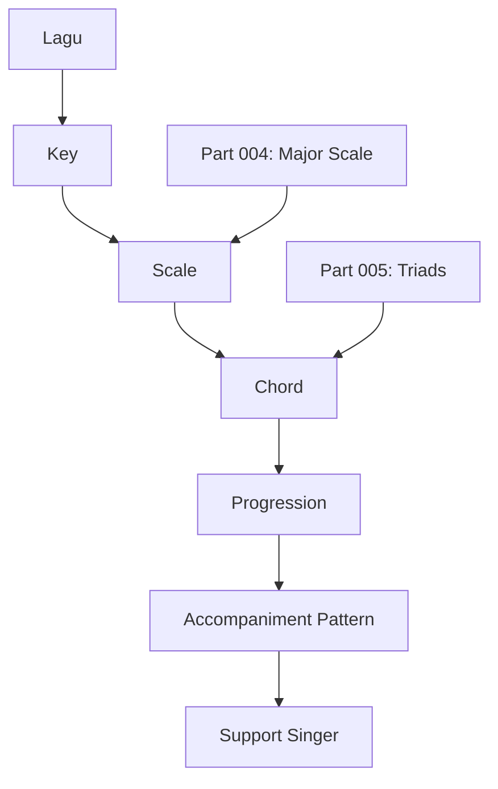

Part ini penting karena hampir semua pola iringan awal dibangun dari:

- chord mayor;
- chord minor;
- inversion;
- root di tangan kiri;
- chord/voicing di tangan kanan;
- perpindahan antar chord.

---

## 1. Tujuan Pembelajaran Part Ini

Setelah menyelesaikan part ini, Anda harus bisa:

1. menjelaskan chord sebagai kombinasi beberapa nada;
2. membangun major triad dari root;
3. membangun minor triad dari root;
4. mengenali root, third, dan fifth;
5. membaca simbol chord dasar seperti `C`, `Cm`, `F`, `G`, `Am`, `Dm`, `Em`;
6. memainkan chord dasar di piano;
7. memahami perbedaan chord mayor dan minor secara fungsi emosi;
8. memahami inversion sebagai cara mengubah posisi nada tanpa mengubah identitas chord;
9. memainkan progression sederhana dengan chord dasar;
10. melakukan self-correction saat chord terasa salah.

Target praktisnya:

> Anda bisa memainkan chord `C`, `F`, `G`, `Am`, `Dm`, dan `Em` dengan tangan kanan, sambil tangan kiri memainkan root note.

---

## 2. Hubungan dengan Framework Kaufman

Dalam framework Josh Kaufman, kita tidak belajar seluruh teori harmoni dari nol sampai advanced. Kita melakukan **deconstruction** dan mengambil subset yang langsung berguna untuk target performa.

Untuk tampil mengiringi penyanyi dalam 20 jam pertama, kita tidak butuh:

- semua mode;
- semua altered chord;
- chord extended kompleks;
- reharmonisasi jazz;
- voice leading advanced;
- notasi klasik;
- species counterpoint.

Yang kita butuhkan sekarang adalah:

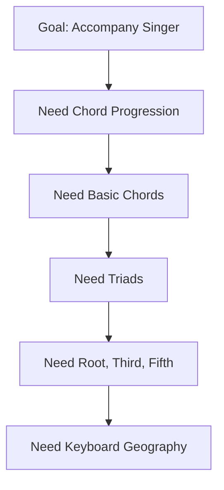

Artinya, **triad** adalah sub-skill kecil dengan leverage sangat besar.

Kaufman-style decision:

| Pertanyaan | Jawaban untuk part ini |
|---|---|
| Skill besar apa yang ingin dicapai? | Mengiringi penyanyi |
| Sub-skill kecil apa yang paling penting? | Memainkan chord dasar |
| Unit terkecilnya apa? | Triad |
| Apa yang perlu diketahui agar bisa self-correct? | Root, third, fifth, mayor/minor |
| Apa yang perlu dilatih? | Bentuk chord, perpindahan chord, mendengar kualitas chord |
| Apa yang tidak perlu dulu? | Chord jazz kompleks, reading not balok, improvisasi panjang |

---

## 3. Mental Model: Chord sebagai Data Structure

Sebagai software engineer, bayangkan chord seperti object atau struct:

```text
Chord {
    root: Note
    quality: Major | Minor | Diminished | Augmented
    tones: [root, third, fifth]
}
```

Contoh:

```text
C major = {
    root: C,
    quality: Major,
    tones: [C, E, G]
}

A minor = {
    root: A,
    quality: Minor,
    tones: [A, C, E]
}
```

Chord bukan sekadar “bentuk tangan”. Chord adalah struktur data yang punya:

1. **root** — identitas utama chord;
2. **quality** — mayor/minor/diminished/dll;
3. **tones** — nada penyusun;
4. **voicing** — urutan dan penyebaran nada saat dimainkan;
5. **function** — peran chord dalam key/progression;
6. **emotion** — warna rasa yang ditimbulkan.

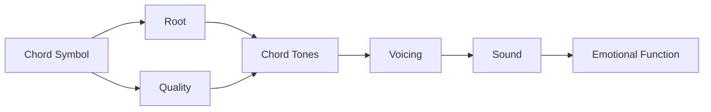

Kesalahan umum pemula adalah menganggap chord hanya sebagai:

> “posisi jari yang harus dihafal”.

Itu berbahaya karena saat lagu pindah key, Anda bingung.

Mental model yang lebih kuat:

> Chord adalah formula interval dari sebuah root.

---

## 4. Apa Itu Triad?

**Triad** adalah chord berisi tiga nada.

Triad dasar terdiri dari:

1. **root**;
2. **third**;
3. **fifth**.

```text
Triad = Root + Third + Fifth
```

Contoh `C major`:

```text
C - E - G
```

- `C` = root;
- `E` = third;
- `G` = fifth.

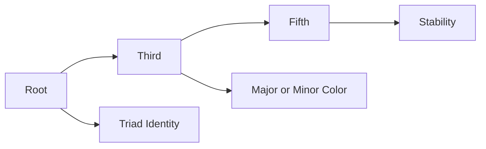

Dalam banyak konteks pop, rock, worship, ballad, dan lagu populer, triad sudah cukup untuk mengiringi penyanyi.

---

## 5. Root, Third, dan Fifth

### 5.1 Root

Root adalah nama utama chord.

Pada chord `C`, root-nya adalah `C`.

Pada chord `Am`, root-nya adalah `A`.

Pada chord `F`, root-nya adalah `F`.

Root menjawab pertanyaan:

> “Chord ini berdiri di atas nada apa?”

Dalam accompaniment awal, tangan kiri sering memainkan root.

Contoh:

```text
LH: C
RH: C-E-G
```

Artinya tangan kiri memberi fondasi, tangan kanan memberi harmoni.

---

### 5.2 Third

Third adalah nada ketiga dari root berdasarkan scale/interval.

Third sangat penting karena menentukan warna chord:

- major third → chord mayor;
- minor third → chord minor.

Contoh:

```text
C major = C - E - G
C minor = C - Eb - G
```

Perbedaannya hanya satu nada:

```text
E  vs  Eb
```

Tetapi rasa emosinya sangat berbeda.

Secara kasar:

| Chord | Third | Rasa umum |
|---|---|---|
| Major | major third | terang, stabil, terbuka |
| Minor | minor third | gelap, sedih, introspektif |

Catatan penting:

> Mayor tidak selalu “bahagia” dan minor tidak selalu “sedih”, tetapi untuk tahap awal asosiasi ini cukup membantu.

---

### 5.3 Fifth

Fifth memberi stabilitas.

Pada `C major`:

```text
C - E - G
```

`G` adalah fifth.

Fifth biasanya terdengar kuat dan stabil. Dalam banyak voicing, fifth bisa digandakan atau kadang dihilangkan, tetapi untuk pemula jangan hilangkan dulu.

---

## 6. Interval: Cara Menghitung Chord Tanpa Hafalan Buta

Untuk membangun chord dari root, kita pakai jarak interval dalam half step.

Dari part sebelumnya:

- half step = jarak satu tombol terdekat;
- whole step = dua half step.

### 6.1 Formula Major Triad

Major triad:

```text
Root + 4 half steps + 3 half steps
```

Atau:

```text
Major = 0 - 4 - 7
```

Contoh `C major`:

```text
C -> E = 4 half steps
E -> G = 3 half steps
```

Maka:

```text
C major = C - E - G
```

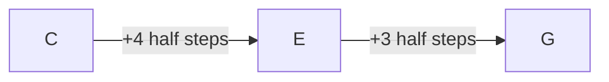

---

### 6.2 Formula Minor Triad

Minor triad:

```text
Root + 3 half steps + 4 half steps
```

Atau:

```text
Minor = 0 - 3 - 7
```

Contoh `C minor`:

```text
C -> Eb = 3 half steps
Eb -> G = 4 half steps
```

Maka:

```text
C minor = C - Eb - G
```

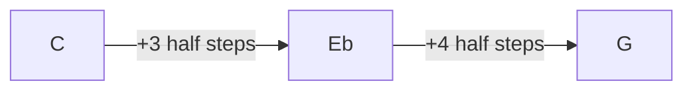

---

### 6.3 Major vs Minor sebagai Perubahan Satu Nada

Bandingkan:

```text
C major = C - E  - G
C minor = C - Eb - G
```

Yang berubah hanya third.

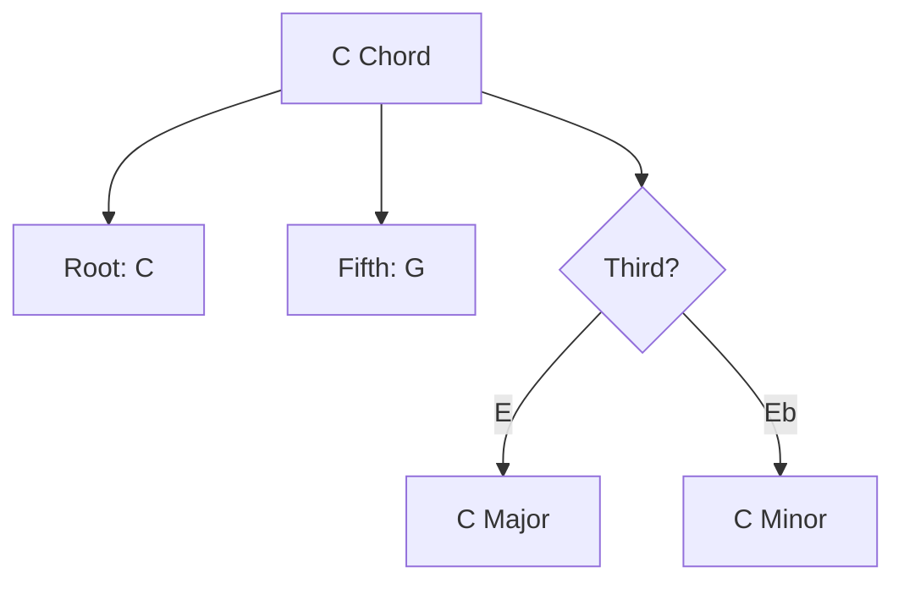

Ini insight besar:

> Untuk mengubah chord mayor menjadi minor, turunkan third setengah langkah.

Contoh:

```text
C  -> Cm  = E turun ke Eb
F  -> Fm  = A turun ke Ab
G  -> Gm  = B turun ke Bb
D  -> Dm  = F# turun ke F
A  -> Am  = C# turun ke C
```

---

## 7. Chord Symbol Dasar

Dalam chord chart, Anda akan melihat simbol seperti:

```text
C   G   Am   F
```

Ini bukan notasi lengkap. Ini shorthand.

### 7.1 Simbol Chord Mayor

Jika hanya ditulis huruf kapital:

```text
C
F
G
D
A
E
```

Biasanya berarti **major chord**.

| Simbol | Dibaca | Nada |
|---|---|---|
| C | C major | C-E-G |
| F | F major | F-A-C |
| G | G major | G-B-D |
| D | D major | D-F#-A |
| A | A major | A-C#-E |
| E | E major | E-G#-B |

---

### 7.2 Simbol Chord Minor

Jika ada `m` kecil:

```text
Am
Dm
Em
Cm
Gm
```

Artinya **minor chord**.

| Simbol | Dibaca | Nada |
|---|---|---|
| Am | A minor | A-C-E |
| Dm | D minor | D-F-A |
| Em | E minor | E-G-B |
| Cm | C minor | C-Eb-G |
| Gm | G minor | G-Bb-D |

Catatan:

```text
m = minor
```

Jangan salah membaca:

```text
C  = C major
Cm = C minor
```

---

### 7.3 Simbol yang Sering Membingungkan Pemula

| Simbol | Arti | Jangan dibaca sebagai |
|---|---|---|
| C | C major | C saja tanpa quality |
| Cm | C minor | C major |
| Cmaj | C major | C major 7, kecuali tertulis Cmaj7 |
| Cmin | C minor | C diminished |
| C- | C minor dalam beberapa chart jazz | minus matematika |

Untuk tahap awal, fokus pada:

```text
C, F, G, Am, Dm, Em
```

---

## 8. Chord Diatonis dalam C Major

Di part sebelumnya, kita belajar C major scale:

```text
C D E F G A B
```

Dari scale ini, kita bisa membangun chord dengan mengambil setiap nada secara lompat satu:

```text
1 - 3 - 5
```

### 8.1 Chord I: C Major

Mulai dari C:

```text
C D E F G A B
C   E   G
```

Hasil:

```text
C = C-E-G
```

### 8.2 Chord ii: D Minor

Mulai dari D:

```text
D E F G A B C
D   F   A
```

Hasil:

```text
Dm = D-F-A
```

### 8.3 Chord iii: E Minor

Mulai dari E:

```text
E F G A B C D
E   G   B
```

Hasil:

```text
Em = E-G-B
```

### 8.4 Chord IV: F Major

Mulai dari F:

```text
F G A B C D E
F   A   C
```

Hasil:

```text
F = F-A-C
```

### 8.5 Chord V: G Major

Mulai dari G:

```text
G A B C D E F
G   B   D
```

Hasil:

```text
G = G-B-D
```

### 8.6 Chord vi: A Minor

Mulai dari A:

```text
A B C D E F G
A   C   E
```

Hasil:

```text
Am = A-C-E
```

### 8.7 Chord vii°: B Diminished

Mulai dari B:

```text
B C D E F G A
B   D   F
```

Hasil:

```text
Bdim = B-D-F
```

Untuk tahap awal, chord diminished boleh Anda kenali tapi tidak perlu diprioritaskan.

---

### 8.8 Ringkasan Chord di C Major

| Degree | Roman | Chord | Notes | Quality |
|---:|---|---|---|---|
| 1 | I | C | C-E-G | Major |
| 2 | ii | Dm | D-F-A | Minor |
| 3 | iii | Em | E-G-B | Minor |
| 4 | IV | F | F-A-C | Major |
| 5 | V | G | G-B-D | Major |
| 6 | vi | Am | A-C-E | Minor |
| 7 | vii° | Bdim | B-D-F | Diminished |

Pattern kualitas chord major scale:

```text
Major - Minor - Minor - Major - Major - Minor - Diminished
```

Atau:

```text
I - ii - iii - IV - V - vi - vii°
```

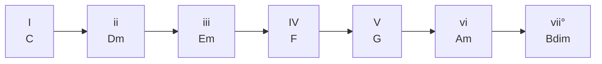

---

## 9. Chord Paling Penting untuk 20 Jam Pertama

Untuk mengiringi penyanyi, Anda tidak perlu langsung menguasai semua chord di semua key.

Mulai dari 6 chord ini:

```text
C, F, G, Am, Dm, Em
```

Alasannya:

1. semuanya ada di C major;
2. banyak lagu populer bisa dimainkan dengan subset ini;
3. bentuknya mudah di white keys;
4. cocok untuk memahami major/minor;
5. bisa dipakai untuk progression dasar;
6. bisa menjadi basis transposisi ke key lain nanti.

---

## 10. Bentuk Chord Dasar di Piano

### 10.1 C Major

```text
C = C - E - G
```

Fingering tangan kanan umum:

```text
1 - 3 - 5
thumb - middle - pinky
```

Visual sederhana:

```text
C D E F G
●   ●   ●
```

---

### 10.2 F Major

```text
F = F - A - C
```

```text
F G A B C
●   ●   ●
```

---

### 10.3 G Major

```text
G = G - B - D
```

```text
G A B C D
●   ●   ●
```

---

### 10.4 A Minor

```text
Am = A - C - E
```

```text
A B C D E
●   ●   ●
```

---

### 10.5 D Minor

```text
Dm = D - F - A
```

```text
D E F G A
●   ●   ●
```

---

### 10.6 E Minor

```text
Em = E - G - B
```

```text
E F G A B
●   ●   ●
```

---

## 11. Jangan Hanya Hafal Bentuk: Hafal Fungsi dan Relasi

Bentuk chord di C major memang mudah karena banyak white keys.

Tetapi tujuan Anda bukan hanya:

```text
C = bentuk tangan ini
F = bentuk tangan itu
G = bentuk tangan itu
```

Tujuan yang lebih dalam:

```text
C = I
F = IV
G = V
Am = vi
Dm = ii
Em = iii
```

Karena nanti ketika pindah key:

```text
I - V - vi - IV
```

bisa menjadi:

| Key | I | V | vi | IV |
|---|---|---|---|---|
| C | C | G | Am | F |
| G | G | D | Em | C |
| D | D | A | Bm | G |
| F | F | C | Dm | Bb |

Ini menghubungkan chord dengan transposisi.

---

## 12. Major dan Minor dalam Konteks Pengiring Penyanyi

Chord bukan hanya benar/salah secara teori. Chord punya efek emosional terhadap vokal.

### 12.1 Major Chord

Major chord sering terdengar:

- terbuka;
- stabil;
- terang;
- confident;
- resolved.

Contoh:

```text
C, F, G
```

Dalam lagu, major chord sering dipakai untuk:

- pembukaan yang jelas;
- chorus yang lega;
- resolusi;
- bagian yang hopeful.

---

### 12.2 Minor Chord

Minor chord sering terdengar:

- melankolis;
- gelap;
- introspektif;
- vulnerable;
- belum selesai.

Contoh:

```text
Am, Dm, Em
```

Dalam lagu, minor chord sering dipakai untuk:

- verse yang personal;
- bridge yang lebih emosional;
- bagian lirik yang sedih;
- warna tension sebelum kembali ke major.

---

### 12.3 Tetapi Jangan Terlalu Literal

Jangan pakai aturan:

```text
major = bahagia
minor = sedih
```

sebagai hukum mutlak.

Musik lebih kompleks. Major bisa terdengar tragis jika tempo lambat, voicing terbuka, dan liriknya gelap. Minor bisa terdengar energik jika rhythm-nya kuat.

Yang benar:

> Major/minor adalah salah satu parameter emosi, bukan seluruh emosi.

---

## 13. Chord Inversion: Identitas Sama, Posisi Berbeda

Sekarang konsep penting: **inversion**.

Chord `C major` terdiri dari:

```text
C - E - G
```

Selama nada yang dipakai tetap `C`, `E`, dan `G`, chord-nya tetap C major, walaupun urutannya berubah.

### 13.1 Root Position

```text
C - E - G
```

Root ada di bawah.

```text
C major root position
C E G
```

### 13.2 First Inversion

Pindahkan C ke atas:

```text
E - G - C
```

Ini masih C major.

Disebut:

```text
C/E
```

atau C major first inversion jika E di bass.

Namun untuk tahap awal, cukup pahami:

> Nada sama, urutan berbeda, chord tetap sama.

### 13.3 Second Inversion

Pindahkan E ke atas:

```text
G - C - E
```

Ini juga masih C major.

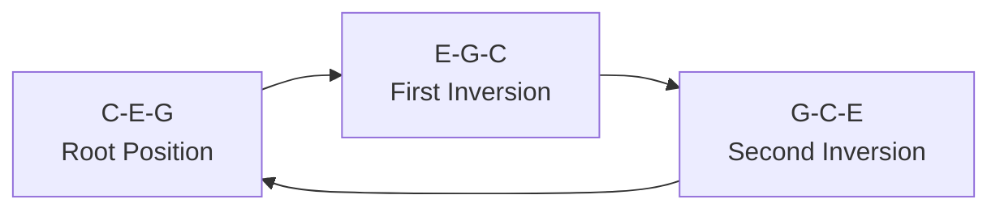

---

## 14. Kenapa Inversion Penting untuk Pengiring?

Jika semua chord dimainkan dalam root position, tangan Anda akan lompat jauh.

Contoh progression:

```text
C - G - Am - F
```

Root position:

```text
C = C-E-G
G = G-B-D
Am = A-C-E
F = F-A-C
```

Gerakan tangan:

```text
C-E-G -> G-B-D -> A-C-E -> F-A-C
```

Tangan sering lompat.

Dengan inversion, kita cari posisi terdekat:

```text
C  = C-E-G
G  = B-D-G
Am = C-E-A
F  = C-F-A
```

Perhatikan banyak nada dekat.

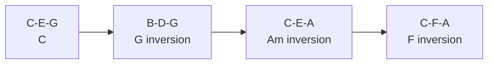

Tujuan inversion:

1. chord movement lebih smooth;
2. tangan tidak lompat jauh;
3. suara lebih profesional;
4. penyanyi lebih nyaman;
5. iringan tidak terdengar seperti blok kasar.

---

## 15. Root Position vs Inversion: Kapan Dipakai?

### 15.1 Root Position Cocok untuk

- belajar awal;
- memahami struktur chord;
- latihan membangun chord;
- bagian lagu yang butuh statement jelas;
- intro sangat sederhana.

### 15.2 Inversion Cocok untuk

- progression yang cepat;
- iringan pop;
- ballad;
- verse lembut;
- comping yang smooth;
- mengurangi lompatan tangan.

Rule awal:

> Belajar chord dalam root position dulu, lalu segera belajar inversion untuk progression yang sering dipakai.

---

## 16. Tangan Kiri dan Tangan Kanan

Untuk tahap awal, distribusi paling sederhana:

```text
Left Hand  = root note
Right Hand = triad chord
```

Contoh:

```text
C chord:
LH = C
RH = C-E-G
```

```text
Am chord:
LH = A
RH = A-C-E
```

Diagram:

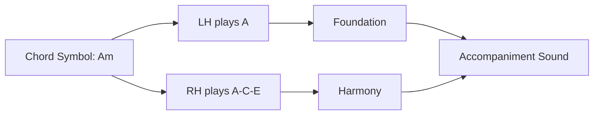

Ini adalah pola awal yang akan dipakai di part berikutnya.

---

## 17. Register Aman untuk Chord Dasar

Jangan memainkan semua chord terlalu rendah.

Jika tangan kanan main chord terlalu rendah, suara akan:

- muddy;
- berat;
- menutupi vokal;
- tidak jelas.

Aturan awal:

```text
LH root: sekitar C2-C3
RH chord: sekitar C3-C5
```

Untuk pemula:

- tangan kiri jangan terlalu rendah;
- tangan kanan jangan terlalu tinggi terus;
- gunakan middle C sebagai anchor;
- cari suara yang jelas tapi tidak menusuk.

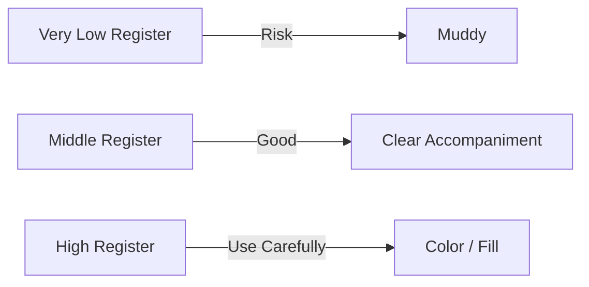

---

## 18. Latihan 1 — Bangun Chord dari Formula

Durasi: 10–15 menit.

Pilih root berikut:

```text
C, F, G, A, D, E
```

Untuk setiap root:

1. mainkan root;
2. hitung major triad dengan formula `0-4-7`;
3. mainkan major chord;
4. turunkan third setengah langkah;
5. dengarkan minor chord.

Contoh:

```text
C major = C-E-G
C minor = C-Eb-G
```

Lakukan untuk:

```text
F major -> F minor
G major -> G minor
A major -> A minor
D major -> D minor
E major -> E minor
```

Tujuannya bukan cepat. Tujuannya memahami bahwa:

```text
major/minor difference = third
```

---

## 19. Latihan 2 — Chord Dasar di C Major

Durasi: 15 menit.

Mainkan chord berikut tangan kanan:

```text
C
Dm
Em
F
G
Am
```

Setiap chord:

1. sebutkan nama chord;
2. sebutkan nada penyusunnya;
3. mainkan pelan;
4. tahan 4 beat;
5. lepaskan;
6. ulangi 5 kali.

Format latihan:

```text
C  = C-E-G
Dm = D-F-A
Em = E-G-B
F  = F-A-C
G  = G-B-D
Am = A-C-E
```

Gunakan metronome pelan:

```text
60 BPM
```

Hitungan:

```text
1 - 2 - 3 - 4
```

Mainkan chord di beat 1, tahan sampai beat 4.

---

## 20. Latihan 3 — Tangan Kiri Root, Tangan Kanan Chord

Durasi: 15–20 menit.

Gunakan progression:

```text
C - G - Am - F
```

Setiap chord 4 beat:

```text
| C | G | Am | F |
```

Tangan kiri:

```text
C - G - A - F
```

Tangan kanan:

```text
C-E-G
G-B-D
A-C-E
F-A-C
```

Pattern awal:

```text
Beat: 1 2 3 4
LH:   X - - -
RH:   X - - -
```

Artinya tangan kiri dan tangan kanan main bersamaan di beat 1.

Latihan:

```text
| C    | G    | Am   | F    |
| 1 2 3 4 | 1 2 3 4 | 1 2 3 4 | 1 2 3 4 |
```

Tujuan:

- chord benar;
- tempo stabil;
- perpindahan tidak panik;
- tangan kiri dan kanan sinkron.

---

## 21. Latihan 4 — Progression Emosional

Durasi: 15 menit.

Mainkan progression:

```text
Am - F - C - G
```

Ini umum untuk lagu pop/ballad.

Tangan kiri:

```text
A - F - C - G
```

Tangan kanan:

```text
Am = A-C-E
F  = F-A-C
C  = C-E-G
G  = G-B-D
```

Dengarkan efek emosinya.

Bandingkan dengan:

```text
C - G - Am - F
```

Insight:

- `C-G-Am-F` sering terasa lebih terang/terbuka;
- `Am-F-C-G` sering terasa lebih melankolis/dramatis.

Tetapi chord-nya sama, hanya urutannya berbeda.

---

## 22. Latihan 5 — Major vs Minor Ear Training Dasar

Durasi: 10 menit.

Mainkan pasangan berikut:

```text
C  -> Cm
F  -> Fm
G  -> Gm
D  -> Dm
A  -> Am
E  -> Em
```

Untuk setiap pasangan:

1. mainkan chord mayor;
2. dengarkan;
3. mainkan chord minor;
4. dengarkan;
5. sebutkan perbedaannya secara verbal.

Contoh:

```text
"C major terdengar lebih terang."
"C minor terdengar lebih gelap."
```

Jangan malu mendeskripsikan suara dengan kata subjektif. Musik bukan hanya validasi biner.

---

## 23. Latihan 6 — Inversion Pertama untuk C-G-Am-F

Durasi: 20 menit.

Gunakan voicing berikut:

```text
C  = C-E-G
G  = B-D-G
Am = C-E-A
F  = C-F-A
```

Mainkan perlahan:

```text
| C | G | Am | F |
```

Perhatikan:

- dari C ke G, hanya beberapa jari bergerak sedikit;
- dari G ke Am, posisi tangan tetap dekat;
- dari Am ke F, gerakan juga kecil.

Bandingkan dengan root position:

```text
C  = C-E-G
G  = G-B-D
Am = A-C-E
F  = F-A-C
```

Tanyakan:

> Mana yang lebih smooth?

Tujuan latihan ini bukan langsung mahir inversion, tetapi mulai mendengar bahwa chord bisa punya banyak posisi.

---

## 24. Chord Quality sebagai Type System

Untuk orang teknis, chord quality bisa dianggap seperti enum:

```text
enum ChordQuality {
    Major,
    Minor,
    Diminished,
    Augmented,
    Suspended,
    Dominant,
    MajorSeventh,
    MinorSeventh
}
```

Di part ini, kita hanya aktif memakai:

```text
Major
Minor
```

Diminished cukup dikenali.

Kenapa jangan semua dipelajari sekarang?

Karena menurut pendekatan Kaufman, semakin banyak scope, semakin lambat skill fungsional terbentuk. Kita ingin cepat mencapai minimum viable performance.

---

## 25. Diminished Chord: Kenali, Tapi Jangan Prioritaskan

Diminished triad punya formula:

```text
0 - 3 - 6
```

Contoh:

```text
Bdim = B-D-F
```

Rasanya:

- tegang;
- tidak stabil;
- ingin bergerak/resolusi.

Dalam C major, chord vii° adalah:

```text
Bdim
```

Untuk tahap awal:

> Anda hanya perlu tahu bahwa diminished ada, tetapi belum perlu banyak dipakai untuk mengiringi penyanyi.

---

## 26. Cara Membaca Chord Chart Sederhana

Chord chart sederhana bisa terlihat seperti ini:

```text
Verse:
| C | G | Am | F |
| C | G | F  | F |

Chorus:
| F | G | Am | C |
| F | G | C  | C |
```

Cara membacanya:

1. setiap kotak/bar biasanya berisi satu chord;
2. chord dimainkan selama durasi bar tersebut;
3. jika ada 4/4, satu bar = 4 beat;
4. ulangi sesuai struktur lagu;
5. perhatikan section: verse, chorus, bridge.

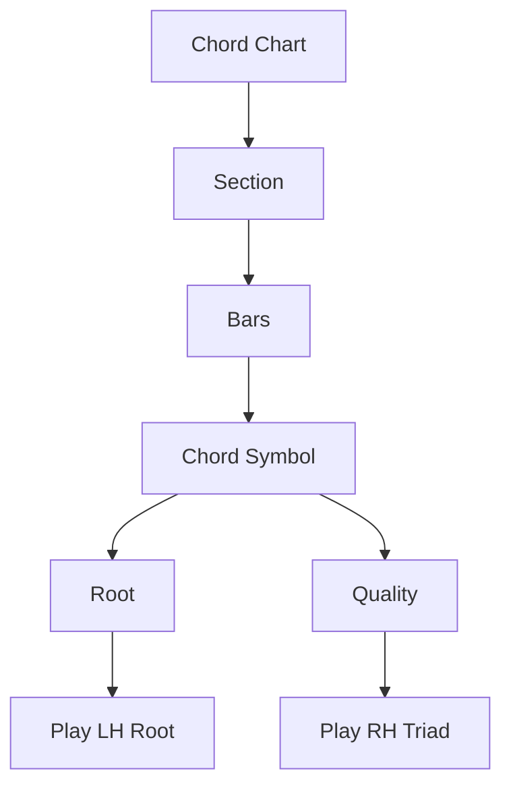

---

## 27. Kesalahan Umum Saat Belajar Chord

### 27.1 Menghafal Shape Tanpa Nama Nada

Gejala:

- bisa main C jika tangan sudah tahu bentuk;
- tetapi tidak tahu C terdiri dari C-E-G;
- bingung saat pindah key;
- sulit memperbaiki chord salah.

Solusi:

Setiap memainkan chord, sebutkan:

```text
C = C-E-G
```

---

### 27.2 Semua Chord Dimainkan Terlalu Keras

Untuk mengiringi penyanyi, chord tidak boleh selalu seperti pukulan.

Solusi:

- mainkan pelan;
- dengarkan sustain;
- jangan tekan terlalu agresif;
- fokus pada support, bukan dominasi.

---

### 27.3 Tangan Kiri Terlalu Rendah

Gejala:

- suara keruh;
- chord terdengar “boomy”;
- vokal tertutup.

Solusi:

- naikkan tangan kiri satu octave;
- gunakan root tunggal dulu;
- jangan main full chord di tangan kiri untuk tahap awal.

---

### 27.4 Terlalu Cepat Pindah ke Chord Advanced

Gejala:

- belajar `Cmaj9#11` tapi C-F-G-Am belum stabil;
- teori banyak, lagu tidak selesai;
- latihan terasa pintar tapi performa rapuh.

Solusi Kaufman-style:

> Stabilkan subset kecil yang langsung dipakai tampil.

---

### 27.5 Tidak Melatih Perpindahan Chord

Bisa memainkan chord satu per satu belum berarti bisa mengiringi lagu.

Skill sebenarnya ada di:

```text
C -> G -> Am -> F
```

bukan hanya:

```text
C
G
Am
F
```

Solusi:

Latih transition sebagai unit utama.

---

## 28. Debugging Chord

Saat chord terdengar salah, jangan panik. Debug seperti sistem.

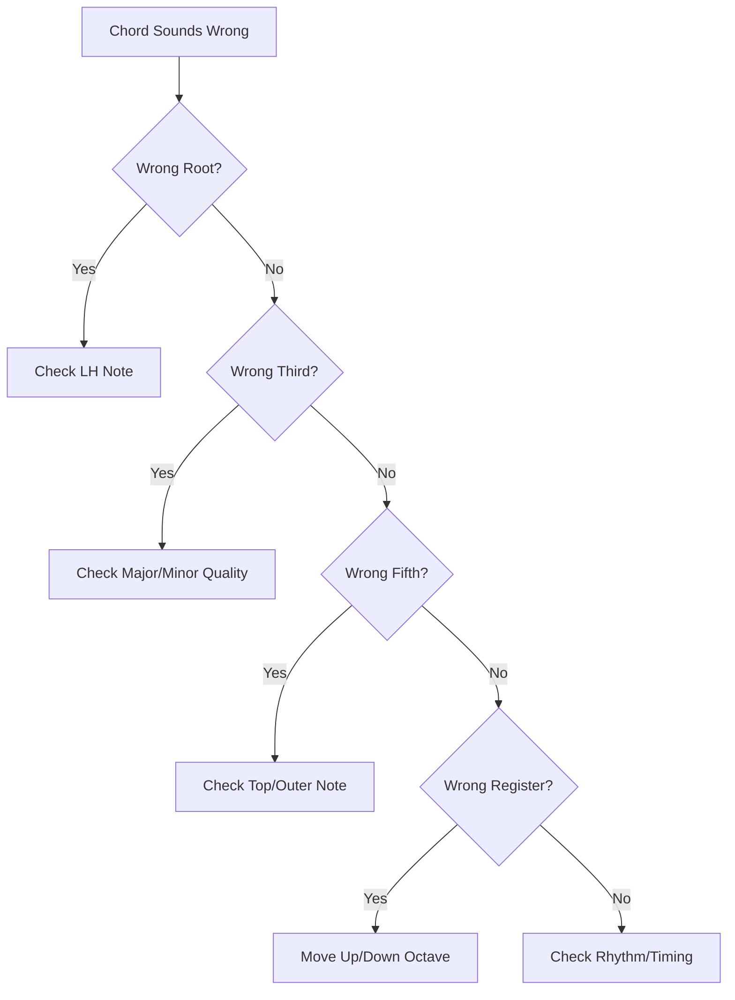

Debug checklist:

1. Apakah root benar?
2. Apakah chord major/minor benar?
3. Apakah third terlalu tinggi/rendah?
4. Apakah ada accidental yang salah?
5. Apakah tangan kiri dan kanan main chord yang sama?
6. Apakah chord dimainkan di register terlalu rendah?
7. Apakah chord sebenarnya benar tapi timing-nya salah?

---

## 29. Practice Protocol Part Ini

Gunakan format latihan berikut selama 45–60 menit.

### 29.1 Warm-up — 5 menit

Mainkan dan sebutkan:

```text
C D E F G A B C
```

Naik dan turun.

Tujuan:

- orientasi keyboard;
- membiasakan nama nada;
- mengurangi friction.

---

### 29.2 Build Chord — 10 menit

Bangun:

```text
C, F, G, Am, Dm, Em
```

Untuk setiap chord:

```text
Nama chord -> nada penyusun -> mainkan
```

---

### 29.3 Major/Minor Contrast — 10 menit

Mainkan:

```text
C -> Cm
F -> Fm
G -> Gm
A -> Am
D -> Dm
E -> Em
```

Dengarkan third.

---

### 29.4 Progression Root Position — 10 menit

Mainkan:

```text
| C | G | Am | F |
```

Tiap chord 4 beat.

---

### 29.5 Progression dengan Inversion — 10 menit

Mainkan:

```text
C  = C-E-G
G  = B-D-G
Am = C-E-A
F  = C-F-A
```

Tiap chord 4 beat.

---

### 29.6 Record and Listen — 5 menit

Rekam satu loop 1 menit.

Dengarkan:

- chord benar?
- tempo stabil?
- perpindahan bersih?
- suara terlalu keras?
- tangan kiri terlalu rendah?
- ada pause saat ganti chord?

---

## 30. Minimum Viable Chord Vocabulary

Untuk bisa lanjut ke part berikutnya, Anda minimal harus punya vocabulary ini:

```text
C  = C-E-G
F  = F-A-C
G  = G-B-D
Am = A-C-E
Dm = D-F-A
Em = E-G-B
```

Dan progression ini:

```text
C - G - Am - F
Am - F - C - G
C - F - G - C
C - Am - F - G
```

Tidak perlu sempurna. Tetapi harus bisa dimainkan pelan dan stabil.

---

## 31. Chord sebagai Contract antara Pianis dan Penyanyi

Dalam performance, chord adalah kontrak implisit.

Penyanyi bergantung pada piano untuk:

- tahu key;
- merasakan arah harmoni;
- masuk di section yang tepat;
- mendengar tension/resolution;
- merasa aman secara pitch.

Jika chord Anda salah, penyanyi bisa:

- kehilangan pitch;
- ragu masuk;
- merasa lagu “jatuh”;
- terdorong menyanyi lebih keras;
- kehilangan confidence.

Jadi chord tidak boleh dipelajari sebagai dekorasi. Chord adalah fondasi komunikasi.

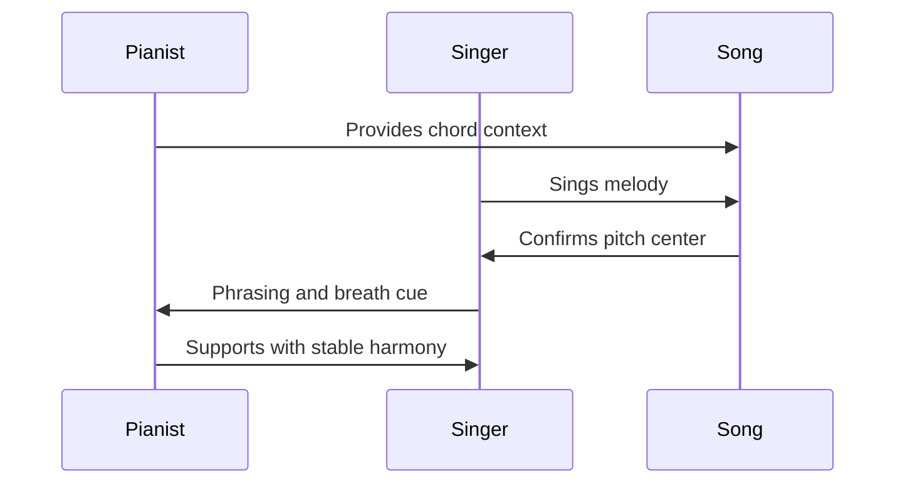

---

## 32. Hubungan Chord dengan Part Berikutnya

Part ini menjawab:

> “Apa yang dimainkan?”

Part berikutnya mulai menjawab:

> “Chord itu disusun menjadi progression seperti apa?”

Urutan skill:


Di part berikutnya, kita akan belajar:

- progression pop dasar;
- I–V–vi–IV;
- vi–IV–I–V;
- I–vi–IV–V;
- I–IV–V;
- tonic, predominant, dominant;
- tension dan release;
- cara memilih progression untuk penyanyi.

---

## 33. Checklist Kelulusan Part 005

Anda boleh lanjut jika bisa melakukan minimal 80% dari checklist ini:

### Conceptual Checklist

- [ ] Saya tahu triad terdiri dari root, third, fifth.
- [ ] Saya tahu major triad formula `0-4-7`.
- [ ] Saya tahu minor triad formula `0-3-7`.
- [ ] Saya tahu major/minor terutama dibedakan oleh third.
- [ ] Saya tahu chord symbol `C` berarti C major.
- [ ] Saya tahu chord symbol `Cm` berarti C minor.
- [ ] Saya tahu inversion tidak mengubah identitas chord.
- [ ] Saya tahu tangan kiri bisa memainkan root dan tangan kanan chord.

### Practical Checklist

- [ ] Saya bisa memainkan C major.
- [ ] Saya bisa memainkan F major.
- [ ] Saya bisa memainkan G major.
- [ ] Saya bisa memainkan A minor.
- [ ] Saya bisa memainkan D minor.
- [ ] Saya bisa memainkan E minor.
- [ ] Saya bisa memainkan `C-G-Am-F` pelan dan stabil.
- [ ] Saya bisa memainkan `Am-F-C-G` pelan dan stabil.
- [ ] Saya bisa memainkan root di tangan kiri dan chord di tangan kanan.
- [ ] Saya bisa membedakan suara mayor dan minor secara pendengaran kasar.

### Performance-Relevant Checklist

- [ ] Saya tidak berhenti total saat salah chord.
- [ ] Saya bisa kembali ke chord berikutnya.
- [ ] Saya bisa menjaga tempo walau perpindahan chord belum sempurna.
- [ ] Saya bisa memainkan chord tidak terlalu keras.
- [ ] Saya bisa mendengar jika tangan kiri terlalu rendah/muddy.

---

## 34. Latihan Harian Setelah Part Ini

Selama 2–3 hari, lakukan latihan 20 menit berikut.

```text
5 menit  : mainkan C major scale
5 menit  : mainkan C, F, G, Am, Dm, Em
5 menit  : mainkan C-G-Am-F
5 menit  : mainkan Am-F-C-G
```

Setiap latihan, rekam minimal satu kali.

Setelah mendengar rekaman, tulis:

```text
Tanggal:
Tempo:
Progression:
Chord paling sulit:
Perpindahan paling lambat:
Masalah utama:
Perbaikan berikutnya:
```

Contoh:

```text
Tanggal: 2026-06-25
Tempo: 60 BPM
Progression: C-G-Am-F
Chord paling sulit: G
Perpindahan paling lambat: G -> Am
Masalah utama: tangan kanan lompat terlalu jauh
Perbaikan berikutnya: coba inversion G = B-D-G
```

---

## 35. Ringkasan Inti

Triad adalah chord tiga nada:

```text
Root + Third + Fifth
```

Major triad:

```text
0 - 4 - 7
```

Minor triad:

```text
0 - 3 - 7
```

Major/minor terutama ditentukan oleh third.

Chord dasar yang harus dikuasai:

```text
C, F, G, Am, Dm, Em
```

Pola awal untuk accompaniment:

```text
LH = root
RH = chord
```

Inversion membantu chord bergerak lebih halus.

Untuk piano pengiring, chord bukan sekadar teori. Chord adalah fondasi yang membuat penyanyi merasa aman, lagu punya arah, dan performance tidak runtuh.

---

## 36. Preview Part Berikutnya

Part berikutnya:

# Part 006 — Progression Dasar untuk Lagu Pop

Kita akan membahas:

- apa itu chord progression;
- kenapa chord punya arah;
- I–V–vi–IV;
- vi–IV–I–V;
- I–vi–IV–V;
- I–IV–V;
- tonic, predominant, dominant;
- tension dan release;
- latihan progression yang langsung bisa dipakai untuk mengiringi lagu populer.

Status seri:

> **Part 005 selesai. Seri belum selesai.**
