# learn-piano-accompaniment-part-006.md

# Part 006 — Progression Dasar untuk Lagu Pop

> Seri: **Learn Piano Accompaniment for Singer Performance**  
> Fokus: **belajar piano untuk mengiringi penyanyi**  
> Framework utama: **The First 20 Hours — Josh Kaufman**  
> Tahap: **Phase B — Minimum Viable Piano**

---

## Status Seri

| Item | Status |
|---|---|
| Part | 006 |
| Nama file | `learn-piano-accompaniment-part-006.md` |
| Fokus | Progression dasar untuk lagu pop |
| Prasyarat | Part 000–005 |
| Output praktis | Bisa memainkan beberapa progression pop dasar dengan fungsi harmoni yang dipahami |
| Status seri | Belum selesai |

---

## Daftar Isi

- [1. Tujuan Part Ini](#1-tujuan-part-ini)
- [2. Hubungan Part Ini dengan Framework Kaufman](#2-hubungan-part-ini-dengan-framework-kaufman)
- [3. Masalah Utama: Chord Tidak Berdiri Sendiri](#3-masalah-utama-chord-tidak-berdiri-sendiri)
- [4. Mental Model: Progression sebagai State Transition](#4-mental-model-progression-sebagai-state-transition)
- [5. Review Cepat: Chord Diatonis dalam C Major](#5-review-cepat-chord-diatonis-dalam-c-major)
- [6. Fungsi Harmoni: Tonic, Predominant, Dominant](#6-fungsi-harmoni-tonic-predominant-dominant)
- [7. Tension dan Release](#7-tension-dan-release)
- [8. Progression 1: I–V–vi–IV](#8-progression-1-ivviiiv)
- [9. Progression 2: vi–IV–I–V](#9-progression-2-viiviv)
- [10. Progression 3: I–vi–IV–V](#10-progression-3-iviivv)
- [11. Progression 4: I–IV–V](#11-progression-4-iivv)
- [12. Progression 5: ii–V–I](#12-progression-5-iivi)
- [13. Progression 6: I–V–IV–I](#13-progression-6-ivivi)
- [14. Progression 7: vi–V–IV–V](#14-progression-7-vivivv)
- [15. Progression 8: I–IV–vi–V](#15-progression-8-iivivv)
- [16. Cara Membaca Progression sebagai Number System](#16-cara-membaca-progression-sebagai-number-system)
- [17. Mengapa Progression Sama Bisa Menghasilkan Lagu Berbeda](#17-mengapa-progression-sama-bisa-menghasilkan-lagu-berbeda)
- [18. Progression dan Penyanyi](#18-progression-dan-penyanyi)
- [19. Cara Berlatih Progression dengan Piano](#19-cara-berlatih-progression-dengan-piano)
- [20. Latihan 1: Root Only](#20-latihan-1-root-only)
- [21. Latihan 2: Root + Chord](#21-latihan-2-root--chord)
- [22. Latihan 3: Chord dengan Hitungan Stabil](#22-latihan-3-chord-dengan-hitungan-stabil)
- [23. Latihan 4: Loop 4 Bar](#23-latihan-4-loop-4-bar)
- [24. Latihan 5: Mengganti Key dari C ke G](#24-latihan-5-mengganti-key-dari-c-ke-g)
- [25. Latihan 6: Memilih Progression untuk Mood Lagu](#25-latihan-6-memilih-progression-untuk-mood-lagu)
- [26. Debugging Progression](#26-debugging-progression)
- [27. Failure Mode Pemula](#27-failure-mode-pemula)
- [28. Practice Protocol 45 Menit](#28-practice-protocol-45-menit)
- [29. Checklist Kelulusan Part 006](#29-checklist-kelulusan-part-006)
- [30. Ringkasan Mental Model](#30-ringkasan-mental-model)
- [31. Persiapan ke Part 007](#31-persiapan-ke-part-007)

---

# 1. Tujuan Part Ini

Pada part sebelumnya, kita sudah membahas chord dasar sebagai struktur:

```text
Root + Third + Fifth = Triad
```

Namun dalam musik nyata, chord jarang berdiri sendiri. Chord bergerak. Pergerakan chord itulah yang disebut:

```text
Chord progression
```

Dalam konteks mengiringi penyanyi, chord progression adalah **jalur harmoni** yang membuat lagu terasa punya arah.

Tanpa progression, Anda hanya tahu “bentuk chord”. Dengan progression, Anda mulai tahu:

- lagu sedang pulang;
- lagu sedang menegang;
- lagu sedang membuka ruang;
- lagu sedang menuju chorus;
- lagu sedang meminta resolusi;
- penyanyi sedang membutuhkan fondasi harmoni.

Target part ini:

> Anda mampu memainkan beberapa chord progression pop dasar dalam C major, memahami fungsi emosionalnya, dan mulai menggunakannya sebagai fondasi iringan piano sederhana.

Setelah part ini, Anda seharusnya bisa memainkan loop seperti:

```text
C - G - Am - F
Am - F - C - G
C - Am - F - G
C - F - G - C
Dm - G - C
```

Tetapi yang lebih penting: Anda tidak hanya menghafal urutan chord. Anda mulai memahami **mengapa chord tersebut terasa bergerak**.

---

# 2. Hubungan Part Ini dengan Framework Kaufman

Dalam framework *The First 20 Hours*, salah satu prinsip penting adalah:

> Pecah skill besar menjadi sub-skill kecil yang paling menentukan performa awal.

Untuk piano pengiring, salah satu sub-skill paling menentukan adalah:

```text
mengenali dan memainkan chord progression umum
```

Kenapa?

Karena sebagian besar lagu populer tidak membutuhkan ratusan chord. Banyak lagu bisa dimainkan dengan beberapa progression dasar. Jadi untuk 20 jam pertama, strategi yang paling efektif bukan belajar semua teori harmoni, tetapi belajar progression yang paling sering muncul dan paling berguna untuk tampil.

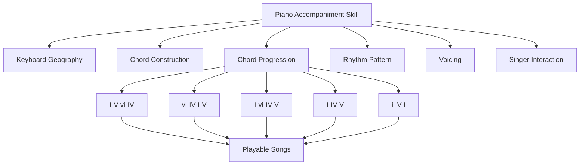

Part ini adalah titik transisi dari:

```text
Saya tahu chord
```

menjadi:

```text
Saya bisa membangun alur lagu
```

---

# 3. Masalah Utama: Chord Tidak Berdiri Sendiri

Pemula sering berpikir:

```text
Saya harus menghafal chord sebanyak mungkin.
```

Ini kurang tepat untuk tahap awal.

Yang lebih penting:

```text
Saya harus memahami bagaimana chord saling bergerak.
```

Contoh:

```text
C
```

Chord `C` sendiri terasa stabil.

Tetapi lihat konteks berikut:

```text
C - G - Am - F
```

Sekarang `C` menjadi awal perjalanan.

Bandingkan:

```text
F - G - C
```

Di sini `C` terasa seperti tujuan akhir.

Bandingkan lagi:

```text
Am - F - C - G
```

Di sini `C` tidak lagi terasa seperti awal, melainkan bagian dari gerak emosional yang dimulai dari minor.

Artinya:

> Makna chord ditentukan oleh konteks sebelum dan sesudahnya.

Dalam software analogy:

```text
value tanpa context = data
value dalam flow = behavior
```

Chord adalah data. Progression adalah behavior.

---

# 4. Mental Model: Progression sebagai State Transition

Untuk software engineer, chord progression bisa dipahami seperti state machine.

Setiap chord adalah state. Perpindahan chord adalah transition. Lagu terasa masuk akal ketika transition punya arah.

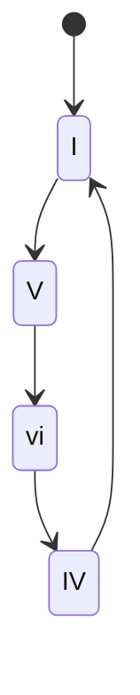

Dalam C major:

```text
I   = C
V   = G
vi  = Am
IV  = F
```

Maka:

```text
I - V - vi - IV
=
C - G - Am - F
```

Progression bukan sekadar urutan. Ia menciptakan pengalaman:

```text
home -> tension -> emotional shift -> warmth/opening
```

Atau dalam bahasa musikal:

```text
stabil -> bergerak -> melankolis -> terbuka
```

---

# 5. Review Cepat: Chord Diatonis dalam C Major

Dalam C major, nada-nadanya:

```text
C D E F G A B
```

Jika kita membangun triad dari setiap scale degree, kita mendapat:

| Degree | Roman | Chord | Quality | Fungsi Umum |
|---:|---|---|---|---|
| 1 | I | C | major | home / stabil |
| 2 | ii | Dm | minor | persiapan |
| 3 | iii | Em | minor | lembut / penghubung |
| 4 | IV | F | major | terbuka / lift |
| 5 | V | G | major | tension / dorongan pulang |
| 6 | vi | Am | minor | emosional / relatif minor |
| 7 | vii° | Bdim | diminished | tension kuat, jarang dipakai awal |

Untuk 20 jam pertama, fokus utama:

```text
I, IV, V, vi, ii
```

Dalam C major:

```text
C, F, G, Am, Dm
```

Dengan lima chord ini, Anda sudah bisa mengiringi banyak lagu sederhana.

---

# 6. Fungsi Harmoni: Tonic, Predominant, Dominant

Chord tidak hanya punya nama. Chord punya fungsi.

Dalam harmoni dasar, fungsi utama dapat disederhanakan menjadi tiga:

```text
Tonic -> Predominant -> Dominant -> Tonic
```

## 6.1 Tonic

Tonic adalah pusat gravitasi.

Dalam C major:

```text
I = C
vi = Am
iii = Em
```

Untuk tahap awal, tonic utama adalah:

```text
C
```

Rasanya:

- stabil;
- pulang;
- aman;
- selesai;
- tidak banyak menuntut gerak.

## 6.2 Predominant

Predominant adalah area persiapan sebelum tension.

Dalam C major:

```text
IV = F
ii = Dm
```

Rasanya:

- membuka;
- bergerak;
- belum selesai;
- mempersiapkan perubahan.

## 6.3 Dominant

Dominant adalah chord yang mendorong kembali ke tonic.

Dalam C major:

```text
V = G
vii° = Bdim
```

Untuk tahap awal, dominant utama adalah:

```text
G
```

Rasanya:

- tegang;
- menggantung;
- minta resolusi;
- ingin kembali ke C.

---

## 6.4 Diagram Fungsi Harmoni

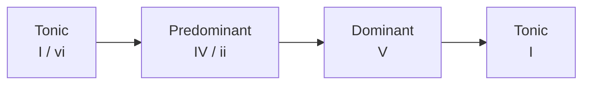

Contoh dalam C major:

```text
C -> F -> G -> C
```

Atau:

```text
C -> Dm -> G -> C
```

Ini adalah pola dasar “pergi lalu pulang”.

---

# 7. Tension dan Release

Musik populer sangat bergantung pada:

```text
tension -> release
```

Tension adalah rasa belum selesai.

Release adalah rasa selesai.

Contoh paling sederhana:

```text
G -> C
```

Dalam C major, `G` adalah dominant dan `C` adalah tonic.

Saat Anda memainkan:

```text
G
```

pendengar sering merasa:

```text
ini harus pulang ke mana?
```

Saat Anda memainkan:

```text
C
```

pendengar merasa:

```text
selesai / pulang
```

## 7.1 Analogi Sistem

Bayangkan harmonic tension seperti open transaction.

```text
G = transaction belum commit
C = commit sukses
```

Atau seperti request-response:

```text
G = request pending
C = response complete
```

Chord dominant memberi “pertanyaan”. Chord tonic memberi “jawaban”.

---

## 7.2 Tension Tidak Selalu Buruk

Pemula sering ingin semua chord terdengar aman. Padahal tension adalah bagian penting dari musik.

Tanpa tension:

```text
lagu datar
```

Dengan tension yang terlalu lama tanpa arah:

```text
lagu gelisah / membingungkan
```

Dengan tension dan release yang seimbang:

```text
lagu terasa bergerak
```

---

# 8. Progression 1: I–V–vi–IV

Ini mungkin salah satu progression paling terkenal dalam musik pop.

Dalam C major:

```text
I  - V  - vi - IV
C  - G  - Am - F
```

## 8.1 Rasa Emosional

Progression ini terasa:

- familiar;
- stabil tapi emosional;
- cocok untuk pop ballad;
- cocok untuk chorus;
- cukup luas untuk banyak melodi.

Urutan rasanya:

```text
C  = home
G  = tension / forward motion
Am = emotional turn
F  = warmth / open space
```

## 8.2 Mengapa Cocok untuk Penyanyi?

Karena progression ini memberi kombinasi:

- awal yang jelas;
- gerak yang kuat;
- warna minor;
- akhir yang tidak terlalu final sehingga bisa loop.

Saat loop kembali ke C:

```text
C - G - Am - F | C - G - Am - F
```

terasa natural.

## 8.3 Diagram

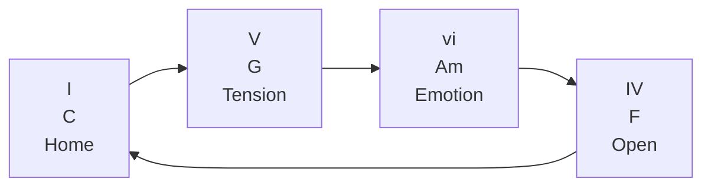

## 8.4 Latihan

Mainkan dengan hitungan:

```text
| C     | G     | Am    | F     |
| 1 2 3 4 | 1 2 3 4 | 1 2 3 4 | 1 2 3 4 |
```

Tangan kiri:

```text
C - G - A - F
```

Tangan kanan:

```text
C chord - G chord - Am chord - F chord
```

---

# 9. Progression 2: vi–IV–I–V

Dalam C major:

```text
vi - IV - I - V
Am - F  - C - G
```

Ini adalah variasi yang memulai dari minor.

## 9.1 Rasa Emosional

Progression ini terasa:

- lebih melankolis;
- lebih introspektif;
- cocok untuk verse;
- cocok untuk lagu sedih atau reflektif;
- tetap pop dan mudah dinyanyikan.

Urutan rasanya:

```text
Am = luka / refleksi
F  = hangat / luas
C  = pulang sementara
G  = menggantung / lanjut
```

## 9.2 Mengapa Kuat?

Karena mulai dari `vi`, pendengar langsung dibawa ke warna minor, tetapi tidak sepenuhnya keluar dari C major.

Ini seperti:

```text
major key dengan bayangan minor
```

Banyak lagu pop emosional menggunakan rasa seperti ini.

## 9.3 Diagram

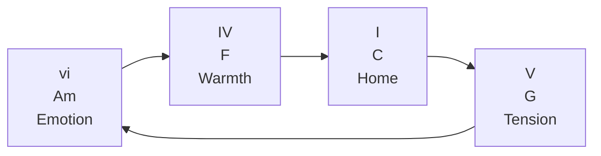

## 9.4 Latihan

```text
| Am    | F     | C     | G     |
| 1 2 3 4 | 1 2 3 4 | 1 2 3 4 | 1 2 3 4 |
```

Saat memainkan progression ini, coba nyanyikan satu nada sederhana di atasnya, misalnya:

```text
E - E - G - D
```

Tidak perlu bagus. Tujuannya merasakan bagaimana melodi duduk di atas harmony.

---

# 10. Progression 3: I–vi–IV–V

Dalam C major:

```text
I - vi - IV - V
C - Am - F  - G
```

Progression ini punya rasa klasik dan sangat mudah dipakai.

## 10.1 Rasa Emosional

Progression ini terasa:

- jelas;
- manis;
- nostalgic;
- sangat stabil;
- cocok untuk lagu sederhana;
- cocok untuk latihan awal.

Urutan rasanya:

```text
C  = home
Am = soft emotional color
F  = open / lift
G  = tension back to home
```

Setelah `G`, sangat natural kembali ke `C`.

```text
C - Am - F - G | C
```

## 10.2 Mengapa Bagus untuk Pemula?

Karena fungsi harmoninya sangat jelas:

```text
Tonic -> Tonic substitute -> Predominant -> Dominant -> Tonic
```

Atau:

```text
home -> softer home -> prepare -> tension -> home
```

## 10.3 Diagram

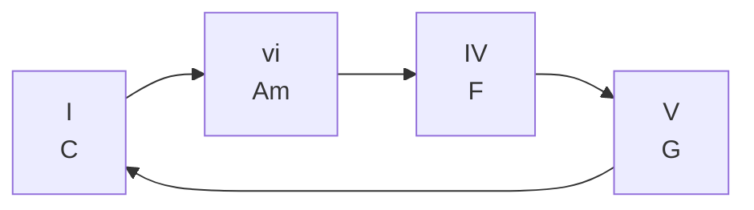

## 10.4 Latihan

Mainkan:

```text
| C     | Am    | F     | G     |
```

Lalu ulangi 8 kali tanpa berhenti.

Targetnya bukan cepat, tapi:

- chord benar;
- perpindahan tepat di beat 1;
- tangan tidak panik;
- tempo tidak berubah;
- telinga tahu bahwa `G` ingin pulang ke `C`.

---

# 11. Progression 4: I–IV–V

Dalam C major:

```text
I - IV - V
C - F  - G
```

Ini progression paling fundamental dalam banyak musik populer, folk, gospel, rock, blues sederhana, dan lagu anak.

## 11.1 Rasa Emosional

Progression ini terasa:

- sederhana;
- jelas;
- langsung;
- stabil;
- mudah diikuti;
- cocok untuk lagu yang tidak terlalu kompleks.

## 11.2 Fungsi

```text
C = home
F = pergi / membuka
G = tegang / ingin pulang
C = pulang
```

Bentuk lengkap:

```text
C - F - G - C
```

## 11.3 Diagram

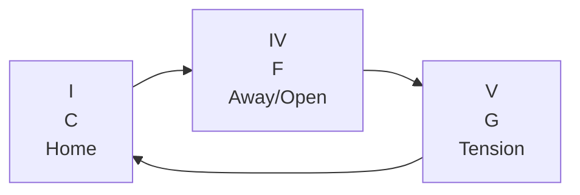

## 11.4 Latihan

Mainkan dalam 4 bar:

```text
| C     | F     | G     | C     |
```

Hitung keras:

```text
one two three four
one two three four
one two three four
one two three four
```

Jangan terburu-buru pindah chord. Pindah tepat di beat 1 bar berikutnya.

---

# 12. Progression 5: ii–V–I

Dalam C major:

```text
ii - V - I
Dm - G - C
```

Progression ini sangat penting di banyak genre, terutama jazz, pop, R&B, gospel, dan ballad. Untuk tahap awal, kita tidak perlu membahas jazz kompleks. Kita hanya perlu memahami bahwa `ii–V–I` adalah salah satu cara paling kuat untuk “pulang”.

## 12.1 Rasa Emosional

```text
Dm = persiapan
G  = tension
C  = resolusi
```

Atau:

```text
prepare -> ask -> answer
```

## 12.2 Fungsi

```text
ii = predominant
V  = dominant
I  = tonic
```

## 12.3 Diagram

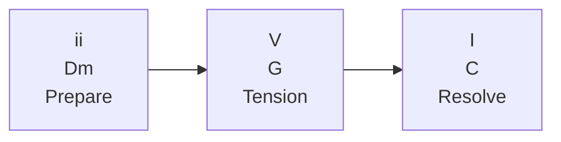

## 12.4 Latihan

Mainkan:

```text
| Dm    | G     | C     | C     |
```

Kenapa `C` diulang dua bar?

Karena pemula perlu merasakan resolusi. Jangan langsung pindah lagi. Biarkan telinga mendengar bahwa progression sudah sampai rumah.

---

# 13. Progression 6: I–V–IV–I

Dalam C major:

```text
I - V - IV - I
C - G - F  - C
```

Progression ini memberi rasa pulang yang sedikit berbeda dari `I–IV–V`.

## 13.1 Rasa Emosional

```text
C = home
G = tension
F = opening / soft landing
C = return
```

Karena `G` tidak langsung pulang ke `C`, tetapi melewati `F`, rasanya tidak se-“final” `G -> C`. Ini bisa memberi efek lebih lembut.

## 13.2 Kapan Dipakai?

Cocok untuk:

- verse yang santai;
- folk/pop sederhana;
- bagian lagu yang tidak ingin terlalu dramatis;
- iringan yang ingin terasa natural dan tidak terlalu “besar”.

## 13.3 Latihan

```text
| C     | G     | F     | C     |
```

Bandingkan dengan:

```text
| C     | F     | G     | C     |
```

Dengarkan bedanya. Ini latihan telinga, bukan hanya jari.

---

# 14. Progression 7: vi–V–IV–V

Dalam C major:

```text
vi - V - IV - V
Am - G - F  - G
```

Progression ini cenderung terasa lebih gelap dan menggantung, karena tidak langsung menyelesaikan ke `C`.

## 14.1 Rasa Emosional

```text
Am = minor/emotional
G  = tension
F  = falling/open
G  = tension lagi
```

Karena berakhir di `G`, progression ini minta lanjut.

Jika setelah itu masuk ke `C`, rasanya:

```text
Am - G - F - G | C
```

seperti akhirnya menemukan rumah.

## 14.2 Cocok Untuk

- pre-chorus;
- build-up menuju chorus;
- bagian yang ingin menahan resolusi;
- lagu dramatis;
- transisi menuju bagian besar.

## 14.3 Latihan

Mainkan:

```text
| Am    | G     | F     | G     |
```

Lalu lanjutkan ke:

```text
| C     |
```

Rasakan bagaimana `G` menyiapkan `C`.

---

# 15. Progression 8: I–IV–vi–V

Dalam C major:

```text
I - IV - vi - V
C - F  - Am - G
```

Progression ini memberi rasa pop yang luas dan cukup emosional.

## 15.1 Rasa Emosional

```text
C  = home
F  = open
Am = emotional color
G  = tension
```

Akhir di `G` membuat progression ini mudah loop kembali ke `C`.

```text
C - F - Am - G | C
```

## 15.2 Cocok Untuk

- verse;
- chorus ringan;
- lagu pop modern;
- worship;
- ballad sederhana.

## 15.3 Latihan

```text
| C     | F     | Am    | G     |
```

Setelah lancar, bandingkan dengan:

```text
| C     | G     | Am    | F     |
```

Keduanya memakai chord yang sama, tetapi urutan berbeda menghasilkan emosi berbeda.

---

# 16. Cara Membaca Progression sebagai Number System

Kenapa kita menulis:

```text
I - V - vi - IV
```

bukan langsung:

```text
C - G - Am - F
```

Karena number system membuat progression bisa dipindah ke key lain.

Contoh:

```text
I - V - vi - IV
```

Dalam C major:

```text
C - G - Am - F
```

Dalam G major:

```text
G - D - Em - C
```

Dalam D major:

```text
D - A - Bm - G
```

Dalam A major:

```text
A - E - F#m - D
```

## 16.1 Tabel Transposisi Sederhana

| Roman | C Major | G Major | D Major | A Major |
|---|---|---|---|---|
| I | C | G | D | A |
| ii | Dm | Am | Em | Bm |
| iii | Em | Bm | F#m | C#m |
| IV | F | C | G | D |
| V | G | D | A | E |
| vi | Am | Em | Bm | F#m |

Untuk 20 jam pertama, jangan mencoba semua key. Fokus dulu:

```text
C major
G major
D major
```

Kenapa?

Karena banyak lagu populer dan penyanyi pemula sering nyaman di sekitar key tersebut, dan ketiganya relatif mudah untuk piano awal.

---

# 17. Mengapa Progression Sama Bisa Menghasilkan Lagu Berbeda

Satu hal penting:

> Progression yang sama tidak otomatis berarti lagu sama.

Contoh:

```text
C - G - Am - F
```

Progression ini bisa terasa:

- bahagia;
- sedih;
- megah;
- intim;
- gelap;
- ringan;
- dramatis.

Tergantung:

- tempo;
- pola ritme;
- melodi vokal;
- lirik;
- voicing;
- register;
- dinamika;
- instrumentasi;
- artikulasi;
- sustain pedal;
- struktur lagu.

## 17.1 Analogi Software

Progression seperti data model.

Aransemen seperti implementation.

Vokal seperti main business flow.

Dua sistem bisa memakai schema sama, tetapi behavior berbeda karena logic dan runtime berbeda.

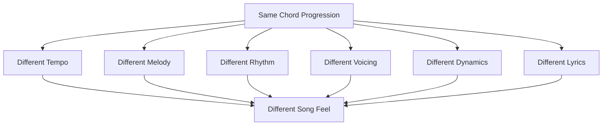

---

# 18. Progression dan Penyanyi

Dalam accompaniment, progression bukan hanya untuk pianis. Progression membantu penyanyi.

## 18.1 Progression Memberi Pitch Context

Penyanyi butuh tahu:

```text
nada saya sedang berada di atas harmoni apa?
```

Jika chord Anda jelas, penyanyi lebih mudah menjaga intonasi.

## 18.2 Progression Memberi Form Context

Penyanyi juga butuh tahu:

```text
saya sedang di verse, chorus, bridge, atau ending?
```

Perubahan progression atau intensitas iringan memberi sinyal struktur lagu.

## 18.3 Progression Memberi Emotional Context

Chord minor bisa membuat lirik terasa lebih rapuh.

Chord major bisa membuat lirik terasa lebih terbuka.

Dominant bisa memberi rasa “akan terjadi sesuatu”.

Tonic bisa memberi rasa “sampai”.

## 18.4 Prinsip Penting

Saat mengiringi penyanyi:

```text
Chord harus cukup jelas untuk mendukung,
tetapi tidak terlalu ramai sampai menutupi vokal.
```

Part ini belum membahas voicing dan pattern secara mendalam. Tetapi sejak sekarang, biasakan berpikir:

```text
Saya tidak sedang bermain piano sendirian.
Saya sedang menopang narasi vokal.
```

---

# 19. Cara Berlatih Progression dengan Piano

Urutan latihan progression harus bertahap.

Jangan langsung main dengan dua tangan rumit.

Gunakan pipeline berikut:

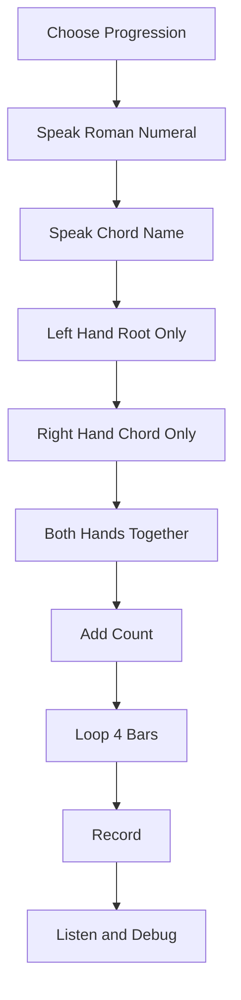

Contoh untuk `I–V–vi–IV`:

```text
Roman:
I - V - vi - IV

Chord:
C - G - Am - F

Left hand:
C - G - A - F

Right hand:
C chord - G chord - Am chord - F chord
```

---

# 20. Latihan 1: Root Only

Tujuan:

> Membuat tangan kiri dan telinga memahami jalur bass.

Pilih progression:

```text
C - G - Am - F
```

Mainkan root saja dengan tangan kiri:

```text
C - G - A - F
```

Hitungan:

```text
C:  1 2 3 4
G:  1 2 3 4
A:  1 2 3 4
F:  1 2 3 4
```

Notasi sederhana:

```text
| C     | G     | A     | F     |
```

Jangan peduli chord penuh dulu. Dengarkan bass movement.

## 20.1 Kenapa Root Only Penting?

Karena bass sering menentukan rasa gerak harmoni.

Jika bass salah, chord kanan sering terasa salah walaupun bentuknya benar.

## 20.2 Target

Anda lulus latihan ini jika bisa:

- memainkan root tepat;
- tidak berhenti saat berpindah;
- menyebut chord sambil bermain;
- menjaga tempo stabil;
- mengulang 8 kali tanpa panik.

---

# 21. Latihan 2: Root + Chord

Sekarang tambahkan tangan kanan.

Progression:

```text
C - G - Am - F
```

Tangan kiri:

```text
C - G - A - F
```

Tangan kanan:

```text
C chord = C E G
G chord = G B D
Am chord = A C E
F chord = F A C
```

Pola:

```text
LH + RH bersama di beat 1
tahan sampai bar berikutnya
```

Hitungan:

```text
1   2   3   4
CHORD - - -
```

Contoh:

```text
| C     | G     | Am    | F     |
| hit   | hit   | hit   | hit   |
```

## 21.1 Jangan Terlalu Cepat

Tempo awal cukup:

```text
60 BPM
```

Jika masih sulit, gunakan:

```text
50 BPM
```

Yang penting:

```text
steady > fast
```

## 21.2 Debugging Cepat

Jika tangan kanan lambat pindah:

- pisahkan tangan kanan saja;
- cari bentuk chord berikutnya sebelum pindah;
- jangan angkat tangan terlalu tinggi;
- latih dua chord saja, misalnya `C -> G`;
- ulang 20 kali.

---

# 22. Latihan 3: Chord dengan Hitungan Stabil

Sekarang kita latih stabilitas.

Ambil progression:

```text
C - Am - F - G
```

Mainkan satu chord per bar.

Hitung keras:

```text
1 2 3 4
```

Setiap chord jatuh di beat 1.

```text
| C     | Am    | F     | G     |
  1 2 3 4 1 2 3 4 1 2 3 4 1 2 3 4
```

## 22.1 Kenapa Harus Hitung Keras?

Karena banyak pemula mengira masalah mereka adalah chord, padahal masalah utama adalah timing.

Jika Anda bisa main chord benar tetapi pindah terlambat, penyanyi akan merasa tidak aman.

Untuk pengiring, timing lebih penting daripada hiasan.

---

# 23. Latihan 4: Loop 4 Bar

Pilih satu progression:

```text
C - G - Am - F
```

Loop selama 5 menit tanpa berhenti.

Aturan:

- jangan berhenti jika salah;
- jangan mengulang bar yang salah;
- tetap lanjut ke chord berikutnya;
- perbaiki di loop berikutnya;
- jaga tempo.

Ini penting karena performance tidak punya tombol undo.

## 23.1 Mental Model Live Recovery

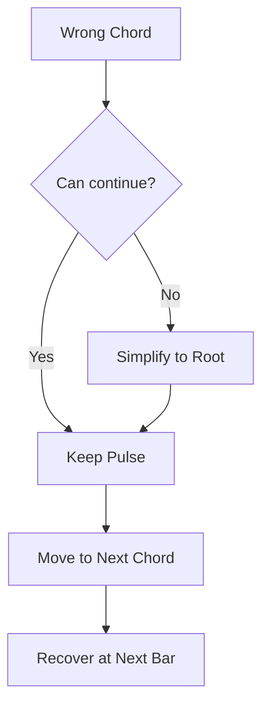

Saat live, kesalahan kecil lebih aman jika pulse tetap berjalan.

Kesalahan chord satu detik sering lebih kecil daripada berhenti total.

---

# 24. Latihan 5: Mengganti Key dari C ke G

Sekarang ambil progression:

```text
I - V - vi - IV
```

Dalam C major:

```text
C - G - Am - F
```

Dalam G major:

```text
G - D - Em - C
```

Latihan:

```text
C key:
| C | G | Am | F |

G key:
| G | D | Em | C |
```

## 24.1 Tujuan

Bukan agar Anda langsung mahir transposisi semua key.

Tujuannya agar otak mulai memahami:

```text
progression = relationship
bukan sekadar chord absolut
```

## 24.2 Cara Latihan

Langkah:

1. Ucapkan Roman numeral:

```text
I - V - vi - IV
```

2. Ucapkan chord dalam C:

```text
C - G - Am - F
```

3. Ucapkan chord dalam G:

```text
G - D - Em - C
```

4. Mainkan root only.

5. Mainkan root + chord.

---

# 25. Latihan 6: Memilih Progression untuk Mood Lagu

Progression punya mood.

Tidak absolut, tetapi ada kecenderungan.

| Mood | Progression Kandidat | Dalam C |
|---|---|---|
| Pop familiar | I–V–vi–IV | C–G–Am–F |
| Sedih/reflektif | vi–IV–I–V | Am–F–C–G |
| Manis/nostalgia | I–vi–IV–V | C–Am–F–G |
| Sederhana/folk | I–IV–V–I | C–F–G–C |
| Resolusi kuat | ii–V–I | Dm–G–C |
| Build-up | vi–V–IV–V | Am–G–F–G |
| Terbuka modern | I–IV–vi–V | C–F–Am–G |

## 25.1 Latihan Mood

Pilih satu kalimat lirik sederhana:

```text
Aku masih menunggu di sini
```

Mainkan kalimat itu di atas progression berbeda.

Tidak perlu melodi kompleks. Cukup nyanyikan satu atau dua nada.

Dengarkan:

- apakah terasa sedih?
- apakah terasa pulang?
- apakah terasa menggantung?
- apakah terasa lebih cocok untuk verse?
- apakah terasa lebih cocok untuk chorus?

Ini mulai melatih hubungan antara harmony dan narasi.

---

# 26. Debugging Progression

Saat progression terasa salah, jangan langsung menyimpulkan:

```text
Saya tidak berbakat.
```

Debug seperti sistem.

## 26.1 Kemungkinan Bug

| Gejala | Kemungkinan Penyebab | Solusi |
|---|---|---|
| Chord terdengar salah | Bentuk chord salah | Cek root-third-fifth |
| Progression tidak mengalir | Urutan chord keliru | Ucapkan chord sebelum main |
| Tempo goyah | Pindah chord terlambat | Perlambat BPM |
| Tangan kanan panik | Jarak chord terlalu jauh | Gunakan inversion nanti |
| Bass terdengar aneh | Root tangan kiri salah | Latih root only |
| Penyanyi sulit masuk | Intro/progression tidak jelas | Mainkan pulse lebih eksplisit |
| Lagu terasa datar | Dinamika sama terus | Nanti ditangani di part dynamics |
| Loop terasa membosankan | Pattern terlalu statis | Nanti ditangani di part rhythm/pattern |

## 26.2 Debug Loop

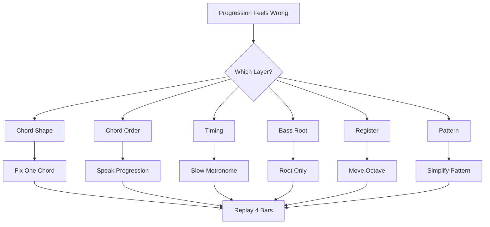

---

# 27. Failure Mode Pemula

## 27.1 Menghafal Chord Tanpa Fungsi

Pemula bisa tahu:

```text
C, G, Am, F
```

tetapi tidak tahu:

```text
I, V, vi, IV
```

Akibatnya, sulit transpose dan sulit memahami lagu baru.

Solusi:

Selalu ucapkan dua bentuk:

```text
C - G - Am - F
I - V - vi - IV
```

---

## 27.2 Pindah Chord Terlalu Lambat

Ini sangat umum.

Solusi:

Latih dua chord saja:

```text
C -> G
```

Ulangi 20 kali.

Lalu:

```text
G -> Am
```

Lalu:

```text
Am -> F
```

Jangan selalu latihan 4 chord penuh jika masalahnya hanya satu transition.

---

## 27.3 Semua Chord Dimainkan Terlalu Berat

Untuk mengiringi penyanyi, chord tidak boleh selalu dipukul keras.

Walau part ini belum fokus dinamika, mulai biasakan:

- tangan kiri jangan terlalu keras;
- tangan kanan jangan menutup vokal;
- sustain pedal jangan berlebihan;
- dengarkan ruang.

---

## 27.4 Terlalu Cepat Masuk ke Progression Rumit

Pemula sering ingin langsung belajar chord slash, jazz chord, passing chord, borrowed chord, dan reharmonization.

Untuk 20 jam pertama, itu belum prioritas.

Prioritas:

```text
simple progression + stable timing + clean transition
```

---

## 27.5 Tidak Mendengar Fungsi Chord

Bermain piano bukan hanya menekan tuts. Anda harus mendengar.

Saat memainkan `G`, rasakan tension.

Saat kembali ke `C`, rasakan release.

Jika Anda tidak mendengar beda fungsi chord, latihan hanya menjadi mekanik.

---

# 28. Practice Protocol 45 Menit

Gunakan sesi ini untuk Part 006.

## 28.1 Menit 0–5: Warm-up Root

Mainkan root C major:

```text
C D E F G A B C
```

Lalu mainkan root chord utama:

```text
C F G Am Dm
```

## 28.2 Menit 5–10: Chord Review

Mainkan tangan kanan:

```text
C = C E G
F = F A C
G = G B D
Am = A C E
Dm = D F A
```

## 28.3 Menit 10–20: Progression 1 dan 2

Mainkan:

```text
C - G - Am - F
Am - F - C - G
```

Masing-masing 5 menit.

## 28.4 Menit 20–30: Progression 3 dan 4

Mainkan:

```text
C - Am - F - G
C - F - G - C
```

Masing-masing 5 menit.

## 28.5 Menit 30–35: ii–V–I

Mainkan:

```text
Dm - G - C - C
```

Dengarkan rasa pulang.

## 28.6 Menit 35–40: Loop Tanpa Berhenti

Pilih satu progression dan loop 5 menit.

Aturan:

```text
jangan berhenti walau salah
```

## 28.7 Menit 40–45: Record dan Review

Rekam 1 menit permainan Anda.

Dengarkan dan jawab:

- chord mana yang paling lambat pindah?
- apakah tempo stabil?
- apakah bass root benar?
- apakah chord kanan terlalu keras?
- apakah progression terdengar seperti lagu?

---

# 29. Checklist Kelulusan Part 006

Anda boleh lanjut ke Part 007 jika bisa melakukan sebagian besar hal berikut.

## 29.1 Pemahaman

- [ ] Saya tahu arti chord progression.
- [ ] Saya tahu bahwa chord punya fungsi dalam konteks.
- [ ] Saya bisa membedakan tonic, predominant, dan dominant secara dasar.
- [ ] Saya tahu `I` dalam C major adalah `C`.
- [ ] Saya tahu `V` dalam C major adalah `G`.
- [ ] Saya tahu `vi` dalam C major adalah `Am`.
- [ ] Saya tahu `IV` dalam C major adalah `F`.
- [ ] Saya paham kenapa `G -> C` terasa seperti pulang.

## 29.2 Praktik

- [ ] Saya bisa memainkan `C - G - Am - F`.
- [ ] Saya bisa memainkan `Am - F - C - G`.
- [ ] Saya bisa memainkan `C - Am - F - G`.
- [ ] Saya bisa memainkan `C - F - G - C`.
- [ ] Saya bisa memainkan `Dm - G - C`.
- [ ] Saya bisa memainkan root only dengan tangan kiri.
- [ ] Saya bisa memainkan root + chord dengan dua tangan.
- [ ] Saya bisa loop 4 bar tanpa berhenti minimal 2 menit.
- [ ] Saya bisa menjaga chord pindah di beat 1.
- [ ] Saya bisa menyebut Roman numeral sambil memahami chord name.

## 29.3 Self-Correction

- [ ] Saya bisa mendeteksi jika root salah.
- [ ] Saya bisa mendeteksi jika chord kanan salah.
- [ ] Saya bisa tahu transition mana yang lambat.
- [ ] Saya bisa memperlambat tempo tanpa merasa gagal.
- [ ] Saya bisa memperbaiki dua chord transition secara terpisah.

---

# 30. Ringkasan Mental Model

Progression adalah alur.

Chord adalah titik.

Progression adalah perjalanan antar titik.

Untuk mengiringi penyanyi, progression berfungsi sebagai:

```text
harmonic roadmap
```

Yang perlu Anda kuasai dulu bukan semua chord, tetapi beberapa jalur paling sering dipakai:

```text
I - V - vi - IV
vi - IV - I - V
I - vi - IV - V
I - IV - V
ii - V - I
```

Dalam C major:

```text
C - G - Am - F
Am - F - C - G
C - Am - F - G
C - F - G
Dm - G - C
```

Fungsi dasar:

```text
Tonic       = home
Predominant = prepare
Dominant    = tension
Tonic       = release
```

Diagram akhir:

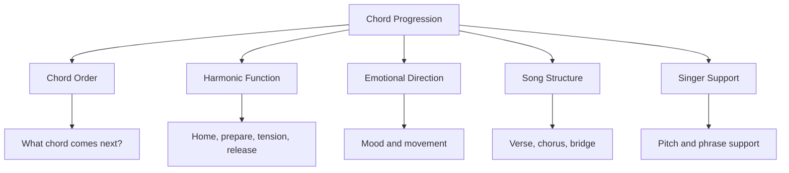

---

# 31. Persiapan ke Part 007

Part berikutnya adalah:

```text
learn-piano-accompaniment-part-007.md
```

Judul:

```text
Pattern 1: Left Hand Root + Right Hand Chord
```

Di Part 006, kita sudah tahu progression.

Di Part 007, kita akan mulai mengubah progression menjadi iringan yang benar-benar bisa dipakai.

Kita akan membahas:

- pola paling sederhana untuk tampil;
- tangan kiri memainkan root;
- tangan kanan memainkan chord;
- cara menjaga register aman;
- cara memainkan chord tanpa terdengar kaku;
- cara memakai sustain pedal dasar;
- cara mengiringi satu lagu sederhana dari awal sampai akhir;
- kapan pola ini cukup;
- kapan pola ini harus dikembangkan.

---

## Status Akhir Part 006

```text
Part 006 selesai.
Seri belum selesai.
Lanjut ke Part 007.
```
