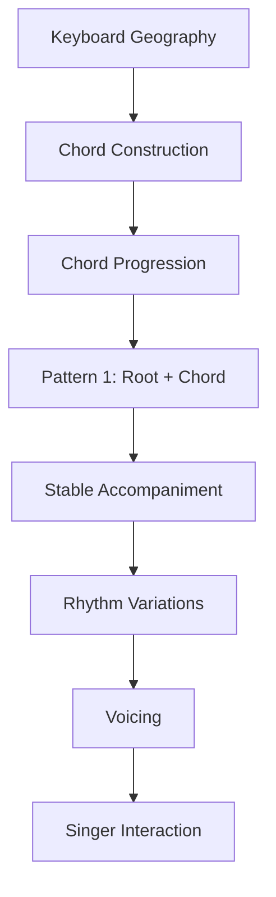
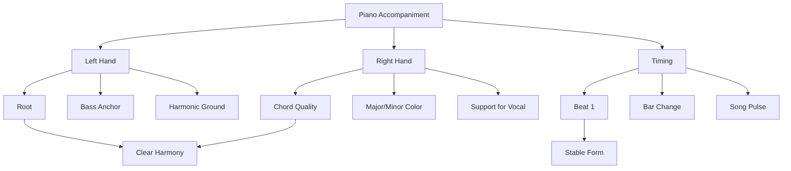
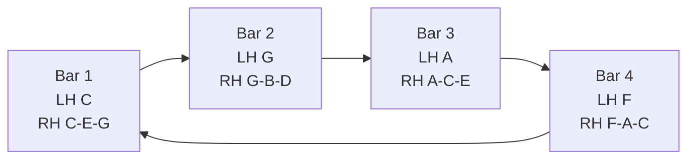
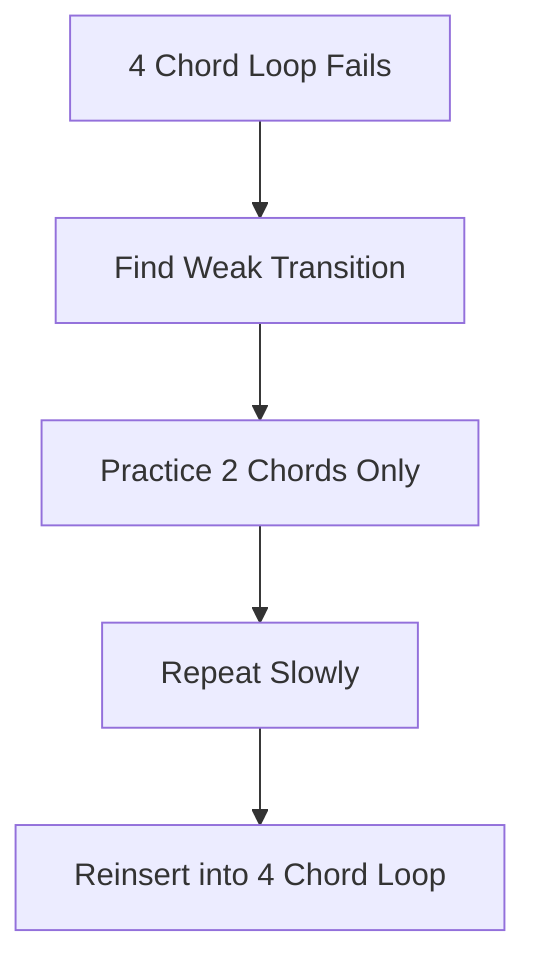
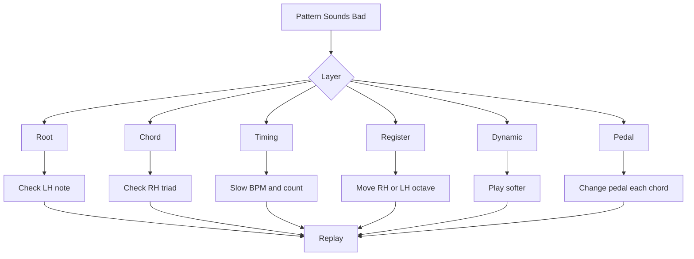
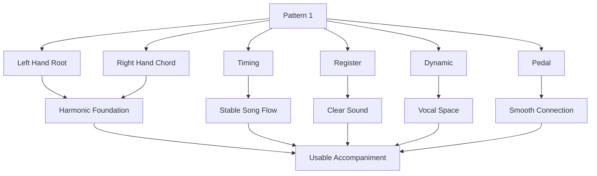

# learn-piano-accompaniment-part-007.md

# Part 007 — Pattern 1: Left Hand Root + Right Hand Chord

> Seri: **Learn Piano Accompaniment for Singer Performance**  
> Fokus: **belajar piano untuk mengiringi penyanyi**  
> Framework utama: **The First 20 Hours — Josh Kaufman**  
> Tahap: **Phase C — Iringan Paling Minimal yang Bisa Dipakai Tampil**

---

## Status Seri

| Item | Status |
|---|---|
| Part | 007 |
| Nama file | `learn-piano-accompaniment-part-007.md` |
| Fokus | Pola iringan pertama: tangan kiri root, tangan kanan chord |
| Prasyarat | Part 000–006 |
| Output praktis | Bisa mengiringi progression sederhana dengan dua tangan secara stabil |
| Status seri | Belum selesai |

---

## Daftar Isi

- [1. Tujuan Part Ini](#1-tujuan-part-ini)
- [2. Posisi Part Ini dalam Framework Kaufman](#2-posisi-part-ini-dalam-framework-kaufman)
- [3. Definisi Pattern 1](#3-definisi-pattern-1)
- [4. Kenapa Pattern Ini Penting](#4-kenapa-pattern-ini-penting)
- [5. Mental Model: Piano sebagai Harmonic Clock](#5-mental-model-piano-sebagai-harmonic-clock)
- [6. Komponen Pattern](#6-komponen-pattern)
- [7. Tangan Kiri: Root sebagai Anchor](#7-tangan-kiri-root-sebagai-anchor)
- [8. Tangan Kanan: Chord sebagai Harmonic Block](#8-tangan-kanan-chord-sebagai-harmonic-block)
- [9. Register Aman untuk Mengiringi Penyanyi](#9-register-aman-untuk-mengiringi-penyanyi)
- [10. Basic Layout di Keyboard](#10-basic-layout-di-keyboard)
- [11. Count dan Timing](#11-count-dan-timing)
- [12. Pola Dasar 1: Whole Note Chord](#12-pola-dasar-1-whole-note-chord)
- [13. Pola Dasar 2: Half Note Pulse](#13-pola-dasar-2-half-note-pulse)
- [14. Pola Dasar 3: Quarter Note Pulse](#14-pola-dasar-3-quarter-note-pulse)
- [15. Progression Latihan Utama](#15-progression-latihan-utama)
- [16. Cara Memainkan I–V–vi–IV dengan Pattern 1](#16-cara-memainkan-ivviiiv-dengan-pattern-1)
- [17. Cara Memainkan vi–IV–I–V dengan Pattern 1](#17-cara-memainkan-viiviv-dengan-pattern-1)
- [18. Cara Memainkan I–vi–IV–V dengan Pattern 1](#18-cara-memainkan-iviivv-dengan-pattern-1)
- [19. Pedal Dasar](#19-pedal-dasar)
- [20. Dynamic Dasar: Jangan Semua Dipukul Sama](#20-dynamic-dasar-jangan-semua-dipukul-sama)
- [21. Prinsip Ruang untuk Vokal](#21-prinsip-ruang-untuk-vokal)
- [22. Cara Membuat Pattern Ini Tidak Terlalu Kaku](#22-cara-membuat-pattern-ini-tidak-terlalu-kaku)
- [23. Latihan 1: Satu Chord Satu Bar](#23-latihan-1-satu-chord-satu-bar)
- [24. Latihan 2: Dua Chord Transition](#24-latihan-2-dua-chord-transition)
- [25. Latihan 3: Empat Chord Loop](#25-latihan-3-empat-chord-loop)
- [26. Latihan 4: Simulasi Verse](#26-latihan-4-simulasi-verse)
- [27. Latihan 5: Simulasi Chorus](#27-latihan-5-simulasi-chorus)
- [28. Latihan 6: Mengiringi Vokal Sederhana](#28-latihan-6-mengiringi-vokal-sederhana)
- [29. Debugging Pattern](#29-debugging-pattern)
- [30. Failure Mode Pemula](#30-failure-mode-pemula)
- [31. Practice Protocol 45 Menit](#31-practice-protocol-45-menit)
- [32. Checklist Kelulusan Part 007](#32-checklist-kelulusan-part-007)
- [33. Ringkasan Mental Model](#33-ringkasan-mental-model)
- [34. Persiapan ke Part 008](#34-persiapan-ke-part-008)

---

# 1. Tujuan Part Ini

Pada Part 006, kita sudah belajar chord progression dasar:

```text
C - G - Am - F
Am - F - C - G
C - Am - F - G
C - F - G - C
Dm - G - C
```

Namun mengetahui progression belum otomatis membuat Anda bisa mengiringi penyanyi.

Untuk tampil, Anda butuh pola eksekusi.

Part ini membahas pola paling minimal:

```text
Left Hand  = root note
Right Hand = chord
```

Dalam bahasa sederhana:

```text
tangan kiri memberi fondasi
tangan kanan memberi harmoni
```

Target part ini:

> Anda mampu memainkan chord progression sederhana dengan dua tangan secara stabil, cukup jelas untuk membantu penyanyi masuk, dan cukup rapi untuk menjadi iringan paling dasar.

Ini adalah **minimum viable accompaniment**.

Bukan pola yang paling indah. Bukan pola final. Tetapi pola ini adalah baseline yang harus kuat sebelum masuk arpeggio, broken chord, syncopation, voicing, atau fill.

---

# 2. Posisi Part Ini dalam Framework Kaufman

Dalam kerangka *The First 20 Hours*, setelah skill dipecah menjadi sub-skill kecil, kita harus memilih latihan yang memberi hasil performa paling cepat.

Untuk piano pengiring, urutan rasionalnya:



Part ini penting karena ia mengubah teori menjadi skill motorik.

Di Part 000–006, sebagian besar masih berupa:

```text
understanding
```

Mulai Part 007, fokus bergeser ke:

```text
execution
```

Dalam 20 jam pertama, kita tidak mencari kompleksitas. Kita mencari:

```text
usable simplicity
```

Pola root + chord adalah bentuk paling sederhana yang bisa langsung dipakai untuk lagu nyata.

---

# 3. Definisi Pattern 1

Pattern 1:

```text
LH: root note dari chord
RH: chord penuh
```

Contoh chord `C`:

```text
LH: C
RH: C E G
```

Contoh chord `G`:

```text
LH: G
RH: G B D
```

Contoh chord `Am`:

```text
LH: A
RH: A C E
```

Contoh chord `F`:

```text
LH: F
RH: F A C
```

Jika progression:

```text
C - G - Am - F
```

maka pattern-nya:

```text
LH: C   G   A   F
RH: C   G   Am  F
```

Atau lebih lengkap:

```text
Bar 1:
LH C
RH C-E-G

Bar 2:
LH G
RH G-B-D

Bar 3:
LH A
RH A-C-E

Bar 4:
LH F
RH F-A-C
```

---

# 4. Kenapa Pattern Ini Penting

Ada beberapa alasan mengapa pola ini harus dikuasai lebih dulu.

## 4.1 Paling Mudah Dipahami

Anda tidak harus langsung memikirkan:

- arpeggio;
- syncopation;
- walking bass;
- passing chord;
- fill;
- slash chord;
- extension;
- reharmonization.

Anda hanya perlu berpikir:

```text
root + chord
```

Ini mengurangi cognitive load.

## 4.2 Paling Mudah Didengar Penyanyi

Penyanyi membutuhkan konteks harmoni yang jelas.

Jika tangan kiri memberi root dan tangan kanan memberi chord, penyanyi lebih mudah mendengar:

```text
sekarang chord apa?
```

## 4.3 Paling Mudah Didebug

Jika terdengar salah, lapisannya jelas:

```text
apakah root tangan kiri salah?
apakah chord tangan kanan salah?
apakah timing pindah chord salah?
```

Pola rumit lebih sulit didebug karena terlalu banyak variabel.

## 4.4 Paling Cocok untuk 20 Jam Pertama

Target 20 jam pertama bukan impress orang dengan teknik. Targetnya:

```text
bisa mengiringi lagu sederhana tanpa runtuh
```

Pattern ini cukup untuk:

- latihan progression;
- latihan tempo;
- latihan transisi;
- latihan mendengar penyanyi;
- latihan intro sederhana;
- latihan ending sederhana.

---

# 5. Mental Model: Piano sebagai Harmonic Clock

Saat mengiringi penyanyi, piano punya dua fungsi besar:

```text
1. memberi harmoni
2. memberi waktu
```

Pattern root + chord membuat keduanya eksplisit.

Tangan kiri:

```text
menentukan root / fondasi harmoni
```

Tangan kanan:

```text
menentukan kualitas chord
```

Timing dua tangan:

```text
menentukan kapan harmony berubah
```

Diagram:



Pattern ini seperti clock signal dalam sistem digital.

Jika clock tidak stabil, komponen lain kehilangan sinkronisasi.

Dalam musik:

```text
jika pulse dan chord change tidak stabil,
penyanyi kehilangan rasa aman
```

---

# 6. Komponen Pattern

Pattern ini punya lima komponen:

| Komponen | Fungsi |
|---|---|
| Root | Menentukan fondasi chord |
| Chord | Menentukan warna major/minor |
| Timing | Menentukan kapan chord berubah |
| Register | Menentukan apakah suara nyaman |
| Dynamic | Menentukan apakah vokal tetap dominan |

Jika salah satu komponen kacau, iringan bisa terganggu.

## 6.1 Root

Root adalah nama chord.

Chord `C` punya root `C`.

Chord `Am` punya root `A`.

Chord `F` punya root `F`.

## 6.2 Chord

Chord memberi warna.

`C` major terasa stabil/terang.

`Am` minor terasa lebih sendu.

## 6.3 Timing

Chord harus berubah pada waktu yang benar.

Biasanya pemula terlambat pindah di beat 1.

## 6.4 Register

Chord terlalu rendah terdengar keruh.

Chord terlalu tinggi terdengar tipis atau mengganggu.

## 6.5 Dynamic

Chord terlalu keras bisa menutup vokal.

Chord terlalu lemah bisa membuat penyanyi kehilangan fondasi.

---

# 7. Tangan Kiri: Root sebagai Anchor

Tangan kiri memainkan root.

Contoh:

| Chord | Root LH |
|---|---|
| C | C |
| G | G |
| Am | A |
| F | F |
| Dm | D |
| Em | E |

Tangan kiri tidak perlu memainkan banyak nada dulu.

Untuk tahap awal:

```text
one root note is enough
```

## 7.1 Kenapa Bukan Octave Dulu?

Banyak pemain pemula langsung ingin memainkan octave:

```text
C + C
```

Di piano, octave memang bisa terdengar besar. Tetapi untuk pemula, octave menambah risiko:

- tangan tegang;
- lompat terlalu jauh;
- root salah;
- timing terlambat;
- volume bass terlalu keras.

Untuk 20 jam pertama, satu root note lebih aman.

Nanti setelah stabil, octave bisa ditambahkan.

## 7.2 Posisi Root

Gunakan register rendah-tengah, bukan terlalu rendah.

Untuk chord `C`, root yang aman kira-kira:

```text
C3
```

Jika terlalu rendah:

```text
C2
```

bisa terdengar muddy/keruh, terutama jika pedal dipakai.

Jika terlalu tinggi:

```text
C4
```

root kehilangan fungsi bass.

## 7.3 Prinsip Bass

```text
Bass harus jelas, tetapi tidak dominan.
```

Dalam accompaniment, penyanyi adalah pusat. Piano tidak boleh berubah menjadi kompetitor.

---

# 8. Tangan Kanan: Chord sebagai Harmonic Block

Tangan kanan memainkan chord.

Untuk tahap ini, gunakan triad root position dulu:

| Chord | RH Notes |
|---|---|
| C | C E G |
| G | G B D |
| Am | A C E |
| F | F A C |
| Dm | D F A |
| Em | E G B |

## 8.1 Kenapa Root Position Dulu?

Karena root position mudah dipahami.

Namun root position punya kekurangan:

```text
perpindahan chord bisa jauh
```

Contoh:

```text
C-E-G
G-B-D
A-C-E
F-A-C
```

Pergerakan tangan kanan cukup banyak.

Kita akan memperbaiki ini di Part 012 tentang inversion dan voice leading.

Untuk sekarang, root position boleh, karena targetnya adalah:

```text
mengenal pola dan menjaga timing
```

## 8.2 Bentuk Tangan

Jangan menekan chord dengan tangan kaku.

Prinsip:

- pergelangan rileks;
- jari melengkung natural;
- bahu tidak naik;
- jangan menekan terlalu dalam;
- lepaskan ketegangan setelah menekan.

Jika chord terasa sakit, berarti teknik Anda terlalu tegang.

---

# 9. Register Aman untuk Mengiringi Penyanyi

Register adalah wilayah tinggi-rendah nada.

Untuk accompaniment awal:

```text
LH: rendah-tengah
RH: tengah
```

Hindari:

```text
LH terlalu rendah + pedal banyak
```

karena hasilnya keruh.

Hindari juga:

```text
RH terlalu tinggi dan keras
```

karena bisa mengganggu vokal.

## 9.1 Layout Aman

Secara sederhana:

```text
LH root: sekitar C3 sampai A3
RH chord: sekitar C4 sampai C5
```

Tidak harus presisi. Yang penting:

- tangan kiri lebih rendah dari tangan kanan;
- tangan kanan tidak terlalu rendah;
- suara tidak keruh;
- vokal masih punya ruang.

Diagram register:

```text
Low Bass        Low-Mid        Middle        High
|---------------|--------------|-------------|-------------|
muddy risk      LH root        RH chord      color/fill
```

## 9.2 Prinsip Utama

```text
Piano mengisi bawah dan sekitar vokal,
bukan menabrak pusat vokal.
```

Untuk penyanyi pria baritone/tenor, area tengah bisa cepat penuh.

Untuk penyanyi wanita, chord tinggi yang terlalu keras bisa menusuk.

Karena itu, mulai dari register aman dan volume sedang.

---

# 10. Basic Layout di Keyboard

Ambil progression:

```text
C - G - Am - F
```

Layout dasar:

```text
LH C     RH C-E-G
LH G     RH G-B-D
LH A     RH A-C-E
LH F     RH F-A-C
```

Diagram sederhana:



Untuk tahap awal, jangan memikirkan ornament.

Tugas utama:

```text
pindah chord tepat waktu
```

---

# 11. Count dan Timing

Dalam 4/4, satu bar punya empat beat:

```text
1 2 3 4
```

Pattern paling sederhana:

```text
Chord berubah di beat 1.
Chord ditahan sampai bar berikutnya.
```

Contoh:

```text
| C       | G       | Am      | F       |
  1 2 3 4  1 2 3 4  1 2 3 4  1 2 3 4
```

Saat beat 1 tiba, tangan kiri dan kanan menekan bersama.

```text
1     2     3     4
hit   hold  hold  hold
```

## 11.1 Jangan Meremehkan Timing

Banyak pemula berpikir:

```text
asal chord benar, cukup
```

Tidak cukup.

Jika chord benar tetapi terlambat setengah beat, penyanyi bisa kehilangan arah.

Untuk pengiring, chord change di waktu yang tepat adalah prioritas tinggi.

## 11.2 Count Keras

Saat latihan, hitung keras:

```text
one two three four
```

Atau:

```text
satu dua tiga empat
```

Lebih baik terdengar konyol saat latihan daripada timing hancur saat tampil.

---

# 12. Pola Dasar 1: Whole Note Chord

Ini pola paling sederhana.

Setiap chord ditekan sekali di beat 1 dan ditahan 4 beat.

```text
Count: 1 2 3 4
Play : X - - -
```

Contoh:

```text
| C       | G       | Am      | F       |
  X - - -   X - - -   X - - -   X - - -
```

Tangan kiri dan kanan bersama:

```text
Beat 1:
LH root + RH chord

Beat 2-4:
hold / sustain
```

## 12.1 Cocok Untuk

- latihan awal;
- intro lambat;
- verse sangat lembut;
- bagian lagu yang butuh ruang;
- mengiringi penyanyi yang sangat bebas/rubato.

## 12.2 Kelemahan

Jika dipakai terlalu lama, bisa terdengar:

- kosong;
- kaku;
- tidak punya groove;
- terlalu statis.

Namun untuk tahap awal, ini sangat berguna.

---

# 13. Pola Dasar 2: Half Note Pulse

Chord dimainkan dua kali per bar:

```text
Count: 1 2 3 4
Play : X - X -
```

Contoh:

```text
| C       | G       | Am      | F       |
  X - X -   X - X -   X - X -   X - X -
```

Biasanya:

```text
Beat 1 = lebih kuat
Beat 3 = lebih ringan
```

## 13.1 Fungsi

Half note pulse memberi lebih banyak gerak daripada whole note.

Cocok untuk:

- verse yang mulai bergerak;
- chorus ringan;
- latihan tempo;
- penyanyi yang butuh pulse lebih jelas.

## 13.2 Dynamic

Jangan pukul beat 1 dan 3 sama keras.

Gunakan:

```text
1 = medium
3 = soft
```

Atau:

```text
1 = strong
3 = gentle
```

Ini membantu musik terasa bernapas.

---

# 14. Pola Dasar 3: Quarter Note Pulse

Chord dimainkan di setiap beat:

```text
Count: 1 2 3 4
Play : X X X X
```

Contoh:

```text
| C       | G       | Am      | F       |
  X X X X   X X X X   X X X X   X X X X
```

## 14.1 Cocok Untuk

- latihan internal pulse;
- chorus yang lebih tegas;
- lagu dengan energi lebih stabil;
- bagian yang perlu drive.

## 14.2 Risiko

Quarter note pulse bisa terdengar:

- terlalu mekanis;
- seperti latihan;
- mengganggu vokal;
- terlalu berat jika semua beat sama keras.

Solusi:

Gunakan accent:

```text
1 strong
2 soft
3 medium
4 soft
```

Pattern rasa:

```text
ONE two THREE four
```

Atau:

```text
1 > 3 > 2/4
```

## 14.3 Untuk 20 Jam Pertama

Quarter note pulse bagus untuk latihan timing, tetapi jangan selalu dipakai dalam performa. Gunakan sebagai alat latihan.

---

# 15. Progression Latihan Utama

Di part ini, kita gunakan progression yang sudah dikenal:

## 15.1 Progression A

```text
I - V - vi - IV
C - G - Am - F
```

## 15.2 Progression B

```text
vi - IV - I - V
Am - F - C - G
```

## 15.3 Progression C

```text
I - vi - IV - V
C - Am - F - G
```

## 15.4 Progression D

```text
I - IV - V - I
C - F - G - C
```

Jangan belajar semuanya sekaligus dalam satu sesi jika masih berat.

Urutan prioritas:

```text
C - G - Am - F
C - Am - F - G
Am - F - C - G
C - F - G - C
```

---

# 16. Cara Memainkan I–V–vi–IV dengan Pattern 1

Progression:

```text
C - G - Am - F
```

## 16.1 Whole Note Version

```text
| C       | G       | Am      | F       |
  X - - -   X - - -   X - - -   X - - -
```

Detail:

| Bar | LH | RH |
|---:|---|---|
| 1 | C | C E G |
| 2 | G | G B D |
| 3 | A | A C E |
| 4 | F | F A C |

## 16.2 Half Note Version

```text
| C       | G       | Am      | F       |
  X - X -   X - X -   X - X -   X - X -
```

## 16.3 Quarter Note Version

```text
| C       | G       | Am      | F       |
  X X X X   X X X X   X X X X   X X X X
```

## 16.4 Practice Rule

Mulai dari whole note. Jangan naik ke half note jika whole note belum stabil.

Urutan:

```text
whole note -> half note -> quarter note
```

Bukan sebaliknya.

---

# 17. Cara Memainkan vi–IV–I–V dengan Pattern 1

Progression:

```text
Am - F - C - G
```

## 17.1 Whole Note Version

```text
| Am      | F       | C       | G       |
  X - - -   X - - -   X - - -   X - - -
```

Detail:

| Bar | LH | RH |
|---:|---|---|
| 1 | A | A C E |
| 2 | F | F A C |
| 3 | C | C E G |
| 4 | G | G B D |

## 17.2 Rasa

Karena dimulai dari `Am`, progression ini terasa lebih emosional.

Cocok untuk latihan verse.

## 17.3 Dynamic Suggestion

Coba mainkan lebih pelan:

```text
Am = soft
F  = soft-medium
C  = medium
G  = medium, sedikit tension
```

Ini mulai melatih rasa bentuk walau pattern masih sederhana.

---

# 18. Cara Memainkan I–vi–IV–V dengan Pattern 1

Progression:

```text
C - Am - F - G
```

## 18.1 Whole Note Version

```text
| C       | Am      | F       | G       |
  X - - -   X - - -   X - - -   X - - -
```

Detail:

| Bar | LH | RH |
|---:|---|---|
| 1 | C | C E G |
| 2 | A | A C E |
| 3 | F | F A C |
| 4 | G | G B D |

## 18.2 Rasa

Progression ini sangat jelas:

```text
home -> emotional -> open -> tension
```

Saat kembali ke C:

```text
C - Am - F - G | C
```

resolusinya terasa kuat.

## 18.3 Latihan Resolusi

Mainkan 4 bar, lalu tambahkan bar ke-5:

```text
| C | Am | F | G | C |
```

Tahan chord terakhir `C` selama 4 beat penuh.

Tujuannya agar telinga Anda merasakan:

```text
G ingin pulang ke C
```

---

# 19. Pedal Dasar

Sustain pedal membuat chord lebih menyambung.

Namun untuk pemula, pedal juga bisa membuat suara keruh.

Prinsip awal:

```text
ganti pedal setiap ganti chord
```

## 19.1 Pedal Change Sederhana

Saat chord baru ditekan:

```text
1. tekan chord baru
2. angkat pedal sebentar
3. tekan pedal lagi
```

Ini disebut pedal change.

Jika pedal ditahan terus dari C ke G ke Am ke F, semua nada bercampur dan terdengar kabur.

## 19.2 Latihan Pedal

Gunakan progression:

```text
C - G - Am - F
```

Latihan:

```text
Bar 1 C: pedal
Bar 2 G: ganti pedal
Bar 3 Am: ganti pedal
Bar 4 F: ganti pedal
```

## 19.3 Tanpa Pedal Dulu Juga Boleh

Jika koordinasi pedal membuat kacau, buang pedal dulu.

Prioritas:

```text
chord benar + timing stabil
```

Pedal adalah enhancement, bukan fondasi.

## 19.4 Failure Mode Pedal

| Gejala | Penyebab | Solusi |
|---|---|---|
| Suara keruh | Pedal tidak diganti | Ganti pedal tiap chord |
| Chord lama bercampur | Pedal ditahan terus | Angkat pedal saat chord change |
| Timing kacau | Fokus terlalu banyak | Latihan tanpa pedal |
| Bass terlalu besar | LH terlalu rendah + pedal | Pindah LH lebih tinggi |

---

# 20. Dynamic Dasar: Jangan Semua Dipukul Sama

Walau pattern sederhana, dynamic tetap penting.

Jika semua chord dimainkan dengan volume sama:

```text
lagu terasa datar
```

Gunakan prinsip:

```text
verse lebih kecil
chorus lebih besar
```

## 20.1 Dynamic Level

Buat level sederhana:

| Level | Keterangan |
|---|---|
| 1 | sangat lembut |
| 2 | lembut |
| 3 | sedang |
| 4 | kuat |
| 5 | sangat kuat |

Untuk latihan:

```text
Verse  = level 2
Chorus = level 3 atau 4
```

Jangan main level 5 kecuali benar-benar perlu.

## 20.2 Dynamic dalam Satu Bar

Untuk half note pulse:

```text
1 = medium
3 = soft
```

Untuk quarter note pulse:

```text
1 = medium
2 = soft
3 = medium-soft
4 = soft
```

Ini membuat iringan lebih manusiawi.

---

# 21. Prinsip Ruang untuk Vokal

Pola root + chord bisa menjadi terlalu padat jika dimainkan keras terus-menerus.

Ingat:

```text
vokal adalah foreground
piano adalah support
```

## 21.1 Jangan Mengisi Semua Ruang

Jika penyanyi sedang menyanyikan frase panjang, piano cukup menjaga harmoni.

Jangan menambah banyak gerakan.

## 21.2 Dengarkan Napas

Saat penyanyi mengambil napas, Anda boleh sedikit memberi chord pulse atau fill kecil.

Namun di part ini, belum perlu fill. Cukup sadari ruang.

## 21.3 Piano Bukan Lead

Kecuali ada bagian intro/interlude, jangan bermain seolah piano adalah melodi utama.

Dalam accompaniment:

```text
support > decoration
```

---

# 22. Cara Membuat Pattern Ini Tidak Terlalu Kaku

Pattern 1 memang sederhana. Tetapi tetap bisa dibuat lebih musikal.

## 22.1 Gunakan Dynamic

Jangan semua chord sama keras.

Contoh:

```text
C  = medium
G  = medium
Am = soft-medium
F  = soft
```

## 22.2 Gunakan Register yang Nyaman

Jika chord terdengar terlalu berat, pindahkan tangan kanan lebih tinggi.

Jika terdengar terlalu tipis, pindahkan sedikit lebih rendah.

## 22.3 Gunakan Half Note Pulse

Daripada hanya whole note, gunakan:

```text
X - X -
```

Ini memberi gerak tanpa terlalu ramai.

## 22.4 Kurangi Nada

Kadang tangan kanan tidak harus memainkan tiga nada penuh.

Misalnya chord `C`:

```text
C E G
```

Bisa dimainkan:

```text
E G
```

Namun untuk tahap ini, tetap mulai dari triad penuh dulu. Pengurangan nada akan lebih masuk akal setelah belajar voicing.

## 22.5 Jangan Over-Pedal

Pedal yang bersih membuat pattern sederhana terdengar lebih profesional.

Pedal yang buruk membuat chord bagus terdengar amatir.

---

# 23. Latihan 1: Satu Chord Satu Bar

Tujuan:

> membiasakan dua tangan menekan bersama di beat 1.

Pilih chord:

```text
C
```

Mainkan:

```text
LH: C
RH: C E G
```

Hitung:

```text
1 2 3 4
```

Tekan di beat 1, tahan sampai beat 4.

```text
1     2     3     4
play  hold  hold  hold
```

Ulang 10 kali.

Lalu lakukan untuk:

```text
G
Am
F
Dm
```

## 23.1 Checklist

- [ ] LH dan RH jatuh bersamaan.
- [ ] Chord tidak pecah tidak sengaja.
- [ ] Suara tidak terlalu keras.
- [ ] Pergelangan rileks.
- [ ] Anda bisa menyebut nama chord saat bermain.

---

# 24. Latihan 2: Dua Chord Transition

Pemula sering gagal bukan karena tidak tahu chord, tetapi karena transisi lambat.

Latih dua chord saja.

## 24.1 C ke G

```text
| C | G |
```

Detail:

```text
C:
LH C
RH C-E-G

G:
LH G
RH G-B-D
```

Ulangi:

```text
C -> G -> C -> G
```

Selama 2 menit.

## 24.2 G ke Am

```text
| G | Am |
```

Ulangi 2 menit.

## 24.3 Am ke F

```text
| Am | F |
```

Ulangi 2 menit.

## 24.4 F ke C

```text
| F | C |
```

Ulangi 2 menit.

## 24.5 Debug Rule

Jika transisi 4 chord kacau, jangan terus mengulang 4 chord penuh.

Cari transition paling lemah.

Latih hanya transition itu.



---

# 25. Latihan 3: Empat Chord Loop

Sekarang mainkan progression penuh:

```text
C - G - Am - F
```

Gunakan whole note:

```text
| C       | G       | Am      | F       |
  X - - -   X - - -   X - - -   X - - -
```

Aturan:

- tempo pelan;
- jangan berhenti;
- jika salah, lanjut;
- perbaiki di loop berikutnya;
- rekam 1 menit.

## 25.1 Target

Bisa loop 3 menit tanpa berhenti.

Bukan tanpa salah sama sekali, tetapi:

```text
tidak runtuh ketika salah
```

Ini skill performa penting.

---

# 26. Latihan 4: Simulasi Verse

Verse biasanya lebih kecil daripada chorus.

Gunakan progression:

```text
Am - F - C - G
```

Pattern:

```text
whole note atau half note lembut
```

Dynamic:

```text
level 2
```

Tekstur:

```text
ringan
```

Count:

```text
1 2 3 4
```

Contoh:

```text
| Am      | F       | C       | G       |
  X - - -   X - - -   X - - -   X - - -
```

atau:

```text
| Am      | F       | C       | G       |
  X - X -   X - X -   X - X -   X - X -
```

## 26.1 Tujuan

Anda belajar bahwa pattern yang sama bisa dimainkan dengan energi berbeda.

Verse tidak perlu besar.

Untuk penyanyi, verse sering membutuhkan ruang untuk lirik.

---

# 27. Latihan 5: Simulasi Chorus

Chorus biasanya lebih besar.

Gunakan progression:

```text
C - G - Am - F
```

Pattern:

```text
half note atau quarter note ringan
```

Dynamic:

```text
level 3
```

Contoh half note:

```text
| C       | G       | Am      | F       |
  X - X -   X - X -   X - X -   X - X -
```

Contoh quarter note:

```text
| C       | G       | Am      | F       |
  X X X X   X X X X   X X X X   X X X X
```

## 27.1 Jangan Terlalu Besar

Chorus lebih besar bukan berarti memukul keras.

Bisa lebih besar karena:

- chord lebih sering dimainkan;
- register sedikit lebih penuh;
- tangan kanan lebih stabil;
- dynamic naik sedikit.

## 27.2 Latihan Verse ke Chorus

Mainkan:

```text
Verse:
| Am | F | C | G |

Chorus:
| C | G | Am | F |
```

Verse level 2.

Chorus level 3.

Latih transisi:

```text
G -> C
```

karena ini sering menjadi pintu masuk chorus.

---

# 28. Latihan 6: Mengiringi Vokal Sederhana

Ambil satu kalimat sederhana:

```text
Aku masih menunggu di sini
```

Nyanyikan bebas di atas progression:

```text
C - G - Am - F
```

Tidak perlu melodi bagus.

Tujuannya:

- merasakan vokal di atas chord;
- menjaga piano tidak mengganggu;
- mendengar apakah chord mendukung suara;
- melatih dua tugas sekaligus: bermain dan mendengar.

## 28.1 Aturan

Saat bernyanyi:

- jangan main terlalu keras;
- jangan mempercepat tempo;
- jangan berhenti jika vokal ragu;
- jangan mengubah pattern terlalu banyak.

## 28.2 Jika Tidak Mau Bernyanyi

Gunakan humming:

```text
hmm hmm hmm
```

Atau putar vocal acapella/metronome sederhana.

Tujuannya bukan kualitas vokal Anda, tetapi melatih awareness bahwa piano bukan satu-satunya suara.

---

# 29. Debugging Pattern

Jika pattern root + chord terdengar buruk, debug per layer.



## 29.1 Root Bug

Gejala:

```text
lagu terasa salah dari bawah
```

Solusi:

Mainkan LH saja.

Ucapkan:

```text
C - G - A - F
```

Pastikan root benar.

## 29.2 Chord Bug

Gejala:

```text
warna major/minor terasa salah
```

Solusi:

Cek triad.

Contoh:

```text
Am = A C E
bukan A C# E
```

## 29.3 Timing Bug

Gejala:

```text
chord benar tapi terasa telat
```

Solusi:

- perlambat;
- hitung keras;
- latih transition 2 chord;
- pindah tangan sebelum beat 1 secara mental.

## 29.4 Register Bug

Gejala:

```text
suara keruh / muddy
```

Solusi:

- naikkan LH sedikit;
- naikkan RH;
- kurangi pedal;
- main lebih lembut.

## 29.5 Dynamic Bug

Gejala:

```text
piano menutupi vokal
```

Solusi:

- kurangi velocity;
- main lebih sedikit;
- gunakan whole note;
- hindari quarter pulse keras.

## 29.6 Pedal Bug

Gejala:

```text
semua chord bercampur
```

Solusi:

- ganti pedal tiap chord;
- atau latihan tanpa pedal dulu.

---

# 30. Failure Mode Pemula

## 30.1 Memainkan Bass Terlalu Keras

Tangan kiri yang terlalu keras membuat iringan terasa berat.

Solusi:

```text
LH lebih lembut daripada RH
```

Atau minimal:

```text
LH tidak lebih dominan dari vokal
```

## 30.2 Tangan Kanan Terlalu Rendah

Chord tangan kanan di register rendah bisa terdengar keruh.

Solusi:

Pindahkan RH ke sekitar middle C ke atas.

## 30.3 Menekan Chord Terlalu Lama Tanpa Pulse

Whole note berguna untuk latihan, tetapi jika dipakai terus, lagu bisa terasa mati.

Solusi:

Setelah stabil, coba half note pulse.

## 30.4 Quarter Note Terlalu Mekanis

Quarter note bisa membuat iringan seperti mesin.

Solusi:

Gunakan accent:

```text
1 > 3 > 2/4
```

atau kembali ke half note.

## 30.5 Pindah Chord dengan Panik

Panik biasanya muncul karena otak belum tahu chord berikutnya.

Solusi:

Selalu lihat satu chord ke depan.

Dalam chart:

```text
current chord + next chord
```

Jangan hanya berpikir chord saat ini.

## 30.6 Terlalu Cepat Menggunakan Pedal

Jika pedal membuat kacau, lepaskan dulu.

Pedal bukan syarat untuk latihan pattern ini.

## 30.7 Tidak Mendengar Penyanyi

Jika Anda hanya fokus ke tangan sendiri, accompaniment kehilangan tujuan.

Solusi:

Latihan dengan humming/vocal track sedini mungkin.

---

# 31. Practice Protocol 45 Menit

Gunakan sesi ini untuk menguasai Part 007.

## 31.1 Menit 0–5: Warm-up Root

Mainkan root dengan tangan kiri:

```text
C - G - A - F
```

Lalu:

```text
C - A - F - G
```

Lalu:

```text
A - F - C - G
```

Hitung 4 beat per root.

## 31.2 Menit 5–10: Chord Tangan Kanan

Mainkan tangan kanan saja:

```text
C = C E G
G = G B D
Am = A C E
F = F A C
```

Satu chord satu bar.

## 31.3 Menit 10–15: Root + Chord Whole Note

Mainkan dua tangan:

```text
| C | G | Am | F |
```

Pattern:

```text
X - - -
```

## 31.4 Menit 15–20: Transition Drill

Latih dua chord:

```text
C -> G
G -> Am
Am -> F
F -> C
```

Masing-masing 1 menit.

## 31.5 Menit 20–25: Half Note Pulse

Progression:

```text
C - G - Am - F
```

Pattern:

```text
X - X -
```

## 31.6 Menit 25–30: Verse Simulation

Progression:

```text
Am - F - C - G
```

Dynamic:

```text
level 2
```

Pattern:

```text
whole note atau half note lembut
```

## 31.7 Menit 30–35: Chorus Simulation

Progression:

```text
C - G - Am - F
```

Dynamic:

```text
level 3
```

Pattern:

```text
half note atau quarter note ringan
```

## 31.8 Menit 35–40: Verse to Chorus

Mainkan:

```text
Verse:
| Am | F | C | G |

Chorus:
| C | G | Am | F |
```

Jaga transisi `G -> C`.

## 31.9 Menit 40–45: Record and Review

Rekam 1 menit.

Dengarkan dan jawab:

- apakah chord pindah tepat di beat 1?
- apakah LH terlalu keras?
- apakah RH terlalu rendah?
- apakah pedal membuat suara keruh?
- apakah verse dan chorus terasa beda?
- apakah Anda tetap lanjut saat salah?

---

# 32. Checklist Kelulusan Part 007

Anda boleh lanjut ke Part 008 jika sebagian besar checklist ini terpenuhi.

## 32.1 Pemahaman

- [ ] Saya tahu Pattern 1 berarti LH root + RH chord.
- [ ] Saya tahu fungsi tangan kiri sebagai anchor.
- [ ] Saya tahu fungsi tangan kanan sebagai warna harmoni.
- [ ] Saya tahu kenapa timing chord change penting.
- [ ] Saya tahu register terlalu rendah bisa membuat suara keruh.
- [ ] Saya tahu pedal harus diganti saat chord berubah.
- [ ] Saya tahu penyanyi adalah pusat, bukan piano.

## 32.2 Praktik

- [ ] Saya bisa memainkan `C - G - Am - F` dengan Pattern 1.
- [ ] Saya bisa memainkan `Am - F - C - G` dengan Pattern 1.
- [ ] Saya bisa memainkan `C - Am - F - G` dengan Pattern 1.
- [ ] Saya bisa memainkan whole note pattern.
- [ ] Saya bisa memainkan half note pulse.
- [ ] Saya bisa memainkan quarter note pulse pelan.
- [ ] Saya bisa loop 3 menit tanpa berhenti.
- [ ] Saya bisa memainkan verse lebih lembut daripada chorus.
- [ ] Saya bisa ganti pedal tiap chord, atau sadar kapan harus melepas pedal.

## 32.3 Self-Correction

- [ ] Saya bisa membedakan root bug dan chord bug.
- [ ] Saya bisa mendengar jika timing terlambat.
- [ ] Saya bisa memperlambat BPM saat transisi kacau.
- [ ] Saya bisa memperbaiki dua-chord transition.
- [ ] Saya bisa mendeteksi jika piano terlalu keras.
- [ ] Saya bisa mendeteksi jika suara terlalu keruh.

---

# 33. Ringkasan Mental Model

Pattern 1 adalah fondasi iringan piano:

```text
LH = root / bass anchor
RH = chord / harmonic color
Timing = harmonic clock
Dynamic = vocal support
Register = clarity
Pedal = connection
```

Diagram ringkas:



Pola ini sederhana, tetapi jangan diremehkan.

Banyak iringan yang baik dimulai dari kemampuan memainkan pola sederhana dengan:

- timing stabil;
- volume terkendali;
- chord bersih;
- ruang untuk vokal;
- transisi tidak panik.

Musikalitas bukan dimulai dari banyak nada.

Musikalitas dimulai dari:

```text
nada yang tepat
di waktu yang tepat
dengan intensitas yang tepat
untuk mendukung vokal
```

---

# 34. Persiapan ke Part 008

Part berikutnya adalah:

```text
learn-piano-accompaniment-part-008.md
```

Judul:

```text
Rhythm First: Mengapa Ritme Lebih Penting daripada Banyak Chord
```

Di Part 007, kita sudah punya pola dasar:

```text
root + chord
```

Namun pola ini baru berguna jika timing stabil.

Di Part 008, kita akan membahas:

- pulse;
- beat;
- bar;
- subdivision;
- 4/4;
- 3/4;
- 6/8;
- metronome;
- groove;
- kenapa chord benar tetapi ritme buruk tetap terasa salah;
- latihan clapping sebelum piano;
- cara membangun internal clock;
- deterministic timing model untuk software engineer.

Part 008 sangat penting karena accompaniment tidak boleh hanya benar secara harmoni. Ia harus benar secara waktu.

---

## Status Akhir Part 007

```text
Part 007 selesai.
Seri belum selesai.
Lanjut ke Part 008.
```
