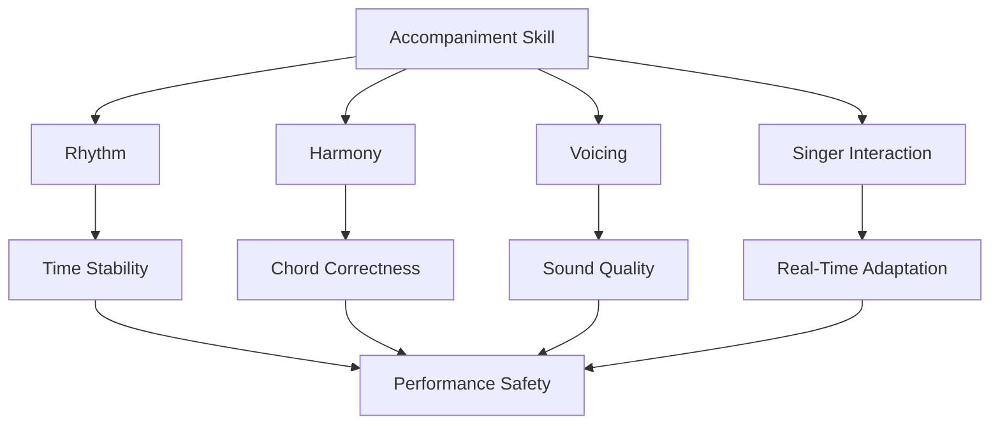
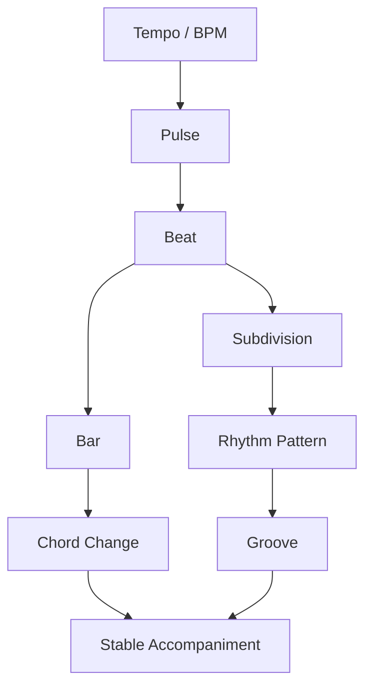
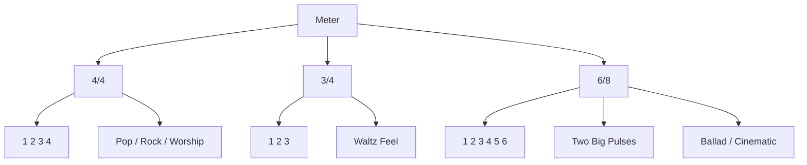
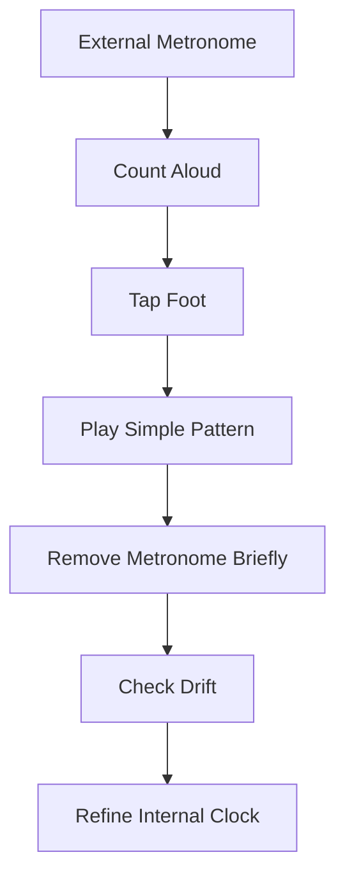
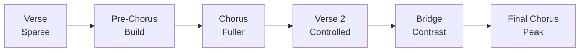
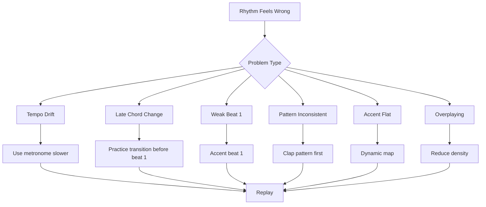
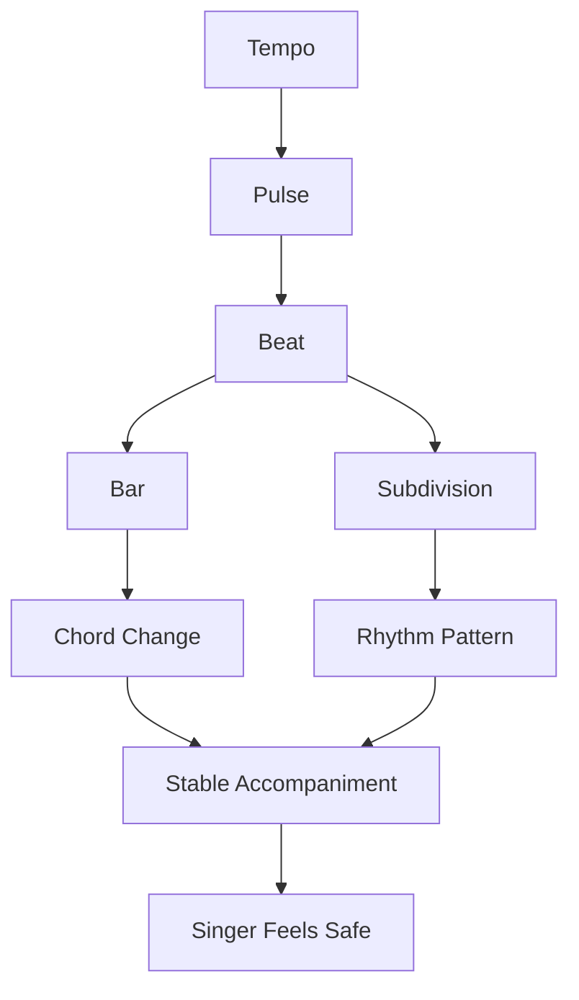

# learn-piano-accompaniment-part-008.md

# Part 008 — Rhythm First: Mengapa Ritme Lebih Penting daripada Banyak Chord

> Seri: **Learn Piano Accompaniment for Singer Performance**  
> Fokus: **belajar piano untuk mengiringi penyanyi**  
> Framework utama: **The First 20 Hours — Josh Kaufman**  
> Tahap: **Phase C — Iringan Paling Minimal yang Bisa Dipakai Tampil**

---

## Status Seri

| Item | Status |
|---|---|
| Part | 008 |
| Nama file | `learn-piano-accompaniment-part-008.md` |
| Fokus | Ritme, pulse, beat, subdivision, groove, dan stabilitas waktu |
| Prasyarat | Part 000–007 |
| Output praktis | Bisa memainkan progression sederhana dengan timing stabil dan pattern ritme dasar |
| Status seri | Belum selesai |

---

## Daftar Isi

- [1. Tujuan Part Ini](#1-tujuan-part-ini)
- [2. Posisi Part Ini dalam Framework Kaufman](#2-posisi-part-ini-dalam-framework-kaufman)
- [3. Premis Utama: Chord Benar + Ritme Buruk = Iringan Buruk](#3-premis-utama-chord-benar--ritme-buruk--iringan-buruk)
- [4. Mental Model: Rhythm sebagai Scheduler](#4-mental-model-rhythm-sebagai-scheduler)
- [5. Pulse, Beat, Bar, dan Subdivision](#5-pulse-beat-bar-dan-subdivision)
- [6. Tempo dan BPM](#6-tempo-dan-bpm)
- [7. Meter: 4/4, 3/4, dan 6/8](#7-meter-44-34-dan-68)
- [8. Strong Beat dan Weak Beat](#8-strong-beat-dan-weak-beat)
- [9. Subdivision: Cara Membagi Waktu](#9-subdivision-cara-membagi-waktu)
- [10. Groove: Ritme yang Terasa Hidup](#10-groove-ritme-yang-terasa-hidup)
- [11. Why Rhythm Matters More Than Chord Complexity](#11-why-rhythm-matters-more-than-chord-complexity)
- [12. Rhythm untuk Pengiring Penyanyi](#12-rhythm-untuk-pengiring-penyanyi)
- [13. Internal Clock: Metronome di Dalam Kepala](#13-internal-clock-metronome-di-dalam-kepala)
- [14. Latihan Tanpa Piano: Clap Before Play](#14-latihan-tanpa-piano-clap-before-play)
- [15. Pattern Ritme 1: Whole Note](#15-pattern-ritme-1-whole-note)
- [16. Pattern Ritme 2: Half Note Pulse](#16-pattern-ritme-2-half-note-pulse)
- [17. Pattern Ritme 3: Quarter Note Pulse](#17-pattern-ritme-3-quarter-note-pulse)
- [18. Pattern Ritme 4: Downbeat + Anticipation](#18-pattern-ritme-4-downbeat--anticipation)
- [19. Pattern Ritme 5: Simple Syncopation](#19-pattern-ritme-5-simple-syncopation)
- [20. Dynamic Accent: Bukan Semua Beat Sama](#20-dynamic-accent-bukan-semua-beat-sama)
- [21. Rhythm dan Pedal](#21-rhythm-dan-pedal)
- [22. Rhythm dalam Verse, Chorus, Bridge](#22-rhythm-dalam-verse-chorus-bridge)
- [23. Mengubah Pattern Tanpa Mengubah Chord](#23-mengubah-pattern-tanpa-mengubah-chord)
- [24. Latihan 1: Count Keras](#24-latihan-1-count-keras)
- [25. Latihan 2: Clap Pattern](#25-latihan-2-clap-pattern)
- [26. Latihan 3: Tap Kaki + Clap Tangan](#26-latihan-3-tap-kaki--clap-tangan)
- [27. Latihan 4: Metronome Layering](#27-latihan-4-metronome-layering)
- [28. Latihan 5: Progression dengan Tiga Level Ritme](#28-latihan-5-progression-dengan-tiga-level-ritme)
- [29. Latihan 6: Verse ke Chorus dengan Ritme Berbeda](#29-latihan-6-verse-ke-chorus-dengan-ritme-berbeda)
- [30. Debugging Rhythm](#30-debugging-rhythm)
- [31. Failure Mode Pemula](#31-failure-mode-pemula)
- [32. Practice Protocol 45 Menit](#32-practice-protocol-45-menit)
- [33. Checklist Kelulusan Part 008](#33-checklist-kelulusan-part-008)
- [34. Ringkasan Mental Model](#34-ringkasan-mental-model)
- [35. Persiapan ke Part 009](#35-persiapan-ke-part-009)

---

# 1. Tujuan Part Ini

Di Part 007, kita sudah membangun pola iringan paling minimal:

```text
LH = root
RH = chord
```

Pola tersebut secara harmoni sudah cukup untuk mengiringi lagu sederhana.

Namun ada masalah besar:

> Chord yang benar tidak otomatis membuat iringan terasa benar.

Jika timing buruk, penyanyi akan kesulitan. Jika pulse goyah, lagu terasa tidak aman. Jika chord berpindah terlambat, vokal terasa seperti kehilangan lantai.

Part ini fokus pada ritme karena dalam accompaniment, ritme adalah **fondasi real-time**.

Target part ini:

> Anda mampu menjaga pulse stabil, memahami beat/bar/subdivision, memainkan progression sederhana dengan beberapa pattern ritme dasar, dan mulai membangun internal clock yang aman untuk penyanyi.

Setelah part ini, Anda harus bisa memainkan progression seperti:

```text
C - G - Am - F
```

dengan beberapa pola ritme:

```text
X - - -
X - X -
X X X X
X - X X
X - - X
```

Tetapi yang lebih penting, Anda tahu **kapan dan mengapa** pattern tersebut dipakai.

---

# 2. Posisi Part Ini dalam Framework Kaufman

Dalam kerangka *The First 20 Hours*, kita harus mencari sub-skill yang memberi leverage besar.

Untuk piano pengiring, ritme memberi leverage sangat besar karena:

- membuat chord sederhana terasa musikal;
- membuat penyanyi merasa aman;
- membuat lagu punya arah;
- membuat verse/chorus terasa berbeda;
- membantu recovery saat salah;
- menjadi dasar untuk arpeggio, broken chord, comping, dan groove.

Diagram posisi ritme:



Dalam 20 jam pertama, ritme harus diprioritaskan karena:

```text
simple harmony + strong rhythm > complex harmony + unstable rhythm
```

Seorang pengiring yang hanya memainkan chord sederhana tetapi stabil lebih berguna daripada pemain yang tahu chord rumit tetapi timing-nya goyah.

---

# 3. Premis Utama: Chord Benar + Ritme Buruk = Iringan Buruk

Bayangkan progression:

```text
C - G - Am - F
```

Jika chord benar tetapi Anda pindah terlambat:

```text
C ...... G terlambat .... Am terlambat .... F terlambat
```

penyanyi akan merasa seperti lantainya bergeser.

Dalam accompaniment, waktu adalah kontrak.

Jika penyanyi masuk di bar 2 tetapi piano masih tertinggal di bar 1, seluruh lagu terasa tidak sinkron.

## 3.1 Chord Salah vs Ritme Salah

Kesalahan chord kadang bisa lewat jika cepat pulih.

Kesalahan ritme lebih berbahaya karena merusak koordinasi semua orang.

| Jenis Kesalahan | Dampak |
|---|---|
| Satu chord salah tapi tempo tetap | Masih bisa recovery |
| Timing chord terlambat terus | Penyanyi kehilangan pegangan |
| Tempo makin cepat | Lagu terasa panik |
| Tempo makin lambat | Lagu kehilangan energi |
| Beat 1 tidak jelas | Penyanyi sulit masuk |
| Pattern tidak konsisten | Lagu terasa amatir |

## 3.2 Prinsip Pengiring

```text
Chord memberi warna.
Ritme memberi lantai.
Penyanyi berdiri di atas lantai, bukan di atas warna.
```

---

# 4. Mental Model: Rhythm sebagai Scheduler

Untuk software engineer, ritme bisa dipahami sebagai scheduler.

Scheduler menentukan kapan proses berjalan.

Dalam musik:

```text
beat = tick
bar = batch/window
chord change = scheduled event
pattern = recurring task
tempo = clock frequency
```

Jika scheduler tidak stabil, sistem menjadi nondeterministic.

Diagram:



Dalam piano pengiring:

```text
Chord progression = event sequence
Rhythm = event timing
```

Progression tanpa ritme seperti data tanpa scheduler.

---

# 5. Pulse, Beat, Bar, dan Subdivision

Sebelum memainkan pattern, kita perlu definisi.

## 5.1 Pulse

Pulse adalah denyut dasar musik.

Contoh saat Anda mengangguk mengikuti lagu:

```text
tap tap tap tap
```

Itu pulse.

Pulse tidak selalu dimainkan secara eksplisit, tetapi harus terasa.

## 5.2 Beat

Beat adalah unit waktu yang dihitung.

Dalam 4/4:

```text
1 2 3 4
```

Setiap angka adalah beat.

## 5.3 Bar / Measure

Bar adalah kelompok beat.

Dalam 4/4:

```text
1 2 3 4 | 1 2 3 4 | 1 2 3 4
```

Setiap kelompok `1 2 3 4` adalah satu bar.

## 5.4 Subdivision

Subdivision adalah pembagian beat menjadi unit lebih kecil.

Contoh eighth note:

```text
1 & 2 & 3 & 4 &
```

Contoh sixteenth note:

```text
1 e & a 2 e & a 3 e & a 4 e & a
```

Untuk 20 jam pertama, fokus pada:

```text
quarter note
eighth note
```

Belum perlu masuk sixteenth note kompleks.

---

# 6. Tempo dan BPM

Tempo adalah kecepatan lagu.

BPM berarti:

```text
beats per minute
```

Jika tempo 60 BPM:

```text
60 beat per menit
1 beat per detik
```

Jika tempo 120 BPM:

```text
120 beat per menit
2 beat per detik
```

## 6.1 Tempo Awal Latihan

Untuk pemula, gunakan:

```text
50–70 BPM
```

Bukan karena lagu harus lambat, tetapi karena Anda butuh ruang untuk:

- membaca chord;
- memindahkan tangan;
- mendengar timing;
- memperbaiki transisi.

## 6.2 Jangan Latihan Selalu Cepat

Jika Anda hanya bisa memainkan progression di tempo cepat dengan panik, skill belum stabil.

Skill stabil berarti Anda bisa memainkan:

```text
pelan
sedang
cepat
```

dengan kontrol.

## 6.3 Tempo dan Penyanyi

Penyanyi sering membutuhkan tempo sedikit lebih lambat atau lebih cepat dari versi original.

Pengiring harus bisa:

- menjaga tempo yang disepakati;
- tidak mempercepat karena gugup;
- tidak melambat karena transisi sulit;
- tidak memaksa penyanyi jika phrasing butuh ruang.

---

# 7. Meter: 4/4, 3/4, dan 6/8

Meter adalah cara beat dikelompokkan.

Untuk accompaniment awal, tiga meter penting:

```text
4/4
3/4
6/8
```

## 7.1 4/4

Paling umum di pop.

Hitungan:

```text
1 2 3 4
```

Accent natural:

```text
1 kuat
3 sedang
2 dan 4 lebih ringan
```

Rasa:

```text
stable, straight, pop
```

## 7.2 3/4

Hitungan:

```text
1 2 3
```

Accent:

```text
1 kuat
2 dan 3 ringan
```

Rasa:

```text
waltz, mengayun, circular
```

Contoh pattern sederhana:

```text
Bass - chord - chord
1      2       3
```

## 7.3 6/8

Hitungan:

```text
1 2 3 4 5 6
```

Tetapi sering dirasakan sebagai dua grup:

```text
ONE two three FOUR five six
```

Rasa:

```text
flowing, cinematic, ballad, emotional
```

6/8 sangat penting untuk ballad dan lagu dramatis.

## 7.4 Diagram Meter



Part ini lebih fokus 4/4. 6/8 akan dibahas lebih dalam di Part 011.

---

# 8. Strong Beat dan Weak Beat

Tidak semua beat punya bobot sama.

Dalam 4/4:

```text
1 = paling kuat
3 = cukup kuat
2 = ringan
4 = ringan / preparation
```

Jika semua beat dimainkan sama keras:

```text
1 2 3 4
X X X X
```

hasilnya mekanis.

Jika ada bobot:

```text
1   2   3   4
X   x   X   x
```

hasilnya lebih musikal.

## 8.1 Accent

Accent adalah penekanan.

Contoh:

```text
ONE two THREE four
```

Dalam piano:

- beat 1 sedikit lebih kuat;
- beat 3 medium;
- beat 2 dan 4 lebih ringan.

## 8.2 Mengapa Ini Penting?

Penyanyi mendengar struktur bar dari accent.

Beat 1 yang jelas memberi sinyal:

```text
bar baru mulai di sini
```

Jika beat 1 tidak jelas, penyanyi bisa tersesat.

---

# 9. Subdivision: Cara Membagi Waktu

Subdivision adalah pembagian beat.

## 9.1 Quarter Note

Hitungan:

```text
1 2 3 4
```

Satu aksi per beat.

Pattern:

```text
X X X X
```

## 9.2 Eighth Note

Hitungan:

```text
1 & 2 & 3 & 4 &
```

Dua unit per beat.

Pattern bisa menjadi:

```text
X - X - X - X -
```

atau:

```text
X - - X X - - X
```

## 9.3 Kenapa Subdivision Penting?

Tanpa subdivision, Anda hanya tahu beat besar.

Dengan subdivision, Anda tahu ruang di antara beat.

Itu yang membuat rhythm bisa:

- lebih hidup;
- lebih lembut;
- lebih mengalir;
- lebih sinkop;
- lebih manusiawi.

## 9.4 Analogi

Beat seperti detik.

Subdivision seperti millisecond.

Untuk scheduler kasar, detik cukup.

Untuk timing musikal, Anda perlu tahu ruang di antara detik.

---

# 10. Groove: Ritme yang Terasa Hidup

Groove bukan hanya pattern tertulis.

Groove adalah rasa stabil, berulang, dan enak diikuti.

Pattern yang sama bisa terasa:

- kaku;
- hidup;
- lambat;
- terburu-buru;
- berat;
- ringan.

Groove muncul dari kombinasi:

```text
timing + accent + consistency + feel
```

## 10.1 Groove Bukan Kompleksitas

Groove yang baik tidak harus rumit.

Progression sederhana:

```text
C - G - Am - F
```

dengan rhythm stabil bisa terasa sangat enak.

Sebaliknya, chord rumit dengan timing kacau terdengar buruk.

## 10.2 Groove untuk Pengiring

Untuk pengiring penyanyi, groove harus:

- stabil;
- tidak egois;
- tidak terlalu ramai;
- memberi ruang vokal;
- mendukung phrasing;
- menjaga energi lagu.

---

# 11. Why Rhythm Matters More Than Chord Complexity

Untuk 20 jam pertama, prioritas praktis:

```text
1. timing
2. chord correctness
3. clean transition
4. dynamic
5. voicing
6. ornament
```

Chord extension seperti:

```text
Cmaj9
Fadd9
Gsus4
Am7
```

bisa memperindah warna.

Namun jika timing buruk, extension tidak menyelamatkan lagu.

## 11.1 Contoh

Versi A:

```text
Chord sederhana:
C - G - Am - F

Timing:
stabil

Hasil:
usable
```

Versi B:

```text
Chord kompleks:
Cmaj9 - G13 - Am11 - Fmaj7#11

Timing:
goyah

Hasil:
tidak aman untuk penyanyi
```

Untuk accompaniment:

```text
usable beats impressive
```

pada tahap awal.

---

# 12. Rhythm untuk Pengiring Penyanyi

Penyanyi membutuhkan tiga hal dari ritme piano:

## 12.1 Entry Cue

Penyanyi perlu tahu kapan masuk.

Beat 1 yang jelas membantu masuk vokal.

## 12.2 Phrase Support

Penyanyi menyanyikan frase yang punya napas.

Piano harus mendukung frase, bukan memotongnya secara kasar.

## 12.3 Section Energy

Verse, chorus, dan bridge biasanya punya energi berbeda.

Rhythm membantu membedakannya.

Contoh:

```text
Verse  = whole note / half note
Chorus = half note / quarter note
Bridge = lebih sparse atau lebih build-up
```

## 12.4 Jangan Menarik Penyanyi

Pemula sering tidak sadar mempercepat saat chorus.

Akibatnya penyanyi terasa dikejar.

Pengiring yang baik menjaga:

```text
energi naik tanpa tempo lari
```

---

# 13. Internal Clock: Metronome di Dalam Kepala

Internal clock adalah kemampuan merasakan tempo tanpa bergantung penuh pada metronome.

Metronome penting, tetapi target akhirnya bukan menjadi robot. Targetnya:

```text
stabil tetapi tetap manusiawi
```

## 13.1 Tahap Membangun Internal Clock



## 13.2 Cara Tahu Clock Anda Goyah

Rekam latihan dengan metronome.

Dengarkan:

- apakah Anda mendahului click?
- apakah Anda tertinggal dari click?
- apakah tempo naik saat chord sulit?
- apakah tempo turun saat tangan ragu?
- apakah beat 1 selalu jelas?

## 13.3 Metronome Bukan Musuh

Banyak orang merasa metronome membuat musik kaku.

Masalahnya bukan metronome. Masalahnya adalah memakai metronome tanpa rasa.

Metronome melatih stabilitas. Rasa musikal datang dari accent, dynamic, dan phrasing.

---

# 14. Latihan Tanpa Piano: Clap Before Play

Sebelum memainkan pattern di piano, tepuk dulu.

Ini penting karena jika Anda tidak bisa menepuk rhythm, kemungkinan besar Anda belum bisa memainkannya dengan dua tangan.

Pipeline:

```text
count -> clap -> tap foot -> play root -> play chord -> play both hands
```

Diagram:


## 14.1 Kenapa Clap?

Clap menghilangkan kompleksitas keyboard.

Anda hanya fokus pada timing.

Ini sesuai prinsip Kaufman:

```text
latih sub-skill kecil secara terisolasi
```

Jika rhythm kacau, jangan langsung menyalahkan piano. Isolasi ritmenya dulu.

---

# 15. Pattern Ritme 1: Whole Note

Pattern:

```text
1 2 3 4
X - - -
```

Artinya:

- main di beat 1;
- tahan sampai beat 4;
- chord berubah di beat 1 bar berikutnya.

Contoh:

```text
| C       | G       | Am      | F       |
  X - - -   X - - -   X - - -   X - - -
```

## 15.1 Fungsi

Whole note cocok untuk:

- latihan awal;
- verse lembut;
- intro sederhana;
- lagu lambat;
- bagian lirik yang butuh ruang;
- rubato ringan.

## 15.2 Risiko

Jika dipakai terus:

- terlalu kosong;
- tidak ada drive;
- penyanyi bisa kehilangan pulse;
- lagu terasa diam.

Untuk latihan awal, ini aman. Untuk performance, perlu dikombinasikan.

---

# 16. Pattern Ritme 2: Half Note Pulse

Pattern:

```text
1 2 3 4
X - X -
```

Contoh:

```text
| C       | G       | Am      | F       |
  X - X -   X - X -   X - X -   X - X -
```

## 16.1 Fungsi

Half note pulse memberi gerak tanpa terlalu ramai.

Cocok untuk:

- verse yang lebih jelas;
- chorus ringan;
- latihan tempo;
- ballad;
- worship/pop sederhana.

## 16.2 Accent

Jangan main:

```text
X - X -
```

dengan dua X sama keras.

Gunakan:

```text
Beat 1 = medium
Beat 3 = soft
```

Atau:

```text
1 = anchor
3 = echo
```

## 16.3 Dengan LH/RH

Versi paling mudah:

```text
Beat 1: LH + RH
Beat 3: RH saja
```

Contoh chord C:

```text
1: LH C + RH C-E-G
3: RH C-E-G
```

Ini membuat bass tidak terlalu berat.

---

# 17. Pattern Ritme 3: Quarter Note Pulse

Pattern:

```text
1 2 3 4
X X X X
```

Contoh:

```text
| C       | G       | Am      | F       |
  X X X X   X X X X   X X X X   X X X X
```

## 17.1 Fungsi

Quarter note pulse cocok untuk:

- membangun internal clock;
- chorus lebih kuat;
- bagian dengan drive;
- latihan stabilitas.

## 17.2 Accent

Gunakan:

```text
1 = strong
2 = soft
3 = medium
4 = soft
```

Atau:

```text
ONE two THREE four
```

## 17.3 Hindari Robot Feel

Jika semua beat sama:

```text
X X X X
```

hasilnya mudah terdengar seperti mesin.

Tambahkan variasi dynamic:

```text
X x X x
```

dengan `X` lebih kuat dan `x` lebih lembut.

---

# 18. Pattern Ritme 4: Downbeat + Anticipation

Anticipation berarti memainkan chord sedikit sebelum beat utama.

Untuk tahap awal, gunakan bentuk paling sederhana:

```text
1 2 3 4 &
X - - - X
```

Artinya:

- main chord di beat 1;
- main lagi di `&` setelah beat 4;
- chord berikutnya terasa “ditarik masuk”.

Contoh count:

```text
1 & 2 & 3 & 4 &
X - - - - - - X
```

## 18.1 Contoh

Progression:

```text
C - G
```

Anda bisa memainkan chord G sedikit sebelum bar G, yaitu di `4&` bar sebelumnya.

Namun untuk pemula, hati-hati. Anticipation mudah membuat timing berantakan.

## 18.2 Fungsi

Anticipation memberi rasa:

- forward motion;
- pop feel;
- masuk chorus lebih hidup;
- tidak terlalu kaku.

## 18.3 Aturan Aman

Jangan gunakan anticipation jika:

- Anda belum stabil dengan beat 1;
- Anda masih sering terlambat chord;
- penyanyi belum nyaman;
- lagu sangat lambat dan bebas.

---

# 19. Pattern Ritme 5: Simple Syncopation

Syncopation berarti penekanan terjadi di tempat yang tidak terlalu expected.

Pattern sederhana:

```text
1 & 2 & 3 & 4 &
X - - X - X - -
```

Dibaca:

```text
main di 1, 2&, 3&
```

Atau pattern lain:

```text
1 & 2 & 3 & 4 &
X - X - - X - -
```

Dibaca:

```text
main di 1, 2, 3&
```

## 19.1 Jangan Terburu-buru

Syncopation menarik, tetapi untuk 20 jam pertama, gunakan secukupnya.

Lebih baik memainkan half note pulse dengan stabil daripada syncopation yang goyah.

## 19.2 Fungsi

Simple syncopation cocok untuk:

- pop groove;
- chorus modern;
- bagian yang butuh lift;
- menghindari kesan terlalu kotak.

## 19.3 Latihan Clap Dulu

Sebelum main piano, tepuk:

```text
1 & 2 & 3 & 4 &
X - - X - X - -
```

Jika tepukan belum stabil, jangan pindah ke piano.

---

# 20. Dynamic Accent: Bukan Semua Beat Sama

Rhythm tidak hanya “kapan”, tetapi juga “seberapa kuat”.

Pattern yang sama bisa terasa berbeda karena dynamic.

Contoh quarter note:

```text
Flat:
1 2 3 4
X X X X

Musical:
1 2 3 4
X x M x
```

Keterangan:

```text
X = strong
M = medium
x = soft
```

## 20.1 Dynamic Map 4/4

| Beat | Bobot |
|---:|---|
| 1 | kuat |
| 2 | ringan |
| 3 | sedang |
| 4 | ringan / persiapan |

## 20.2 Dynamic dan Emosi

Untuk verse:

```text
lebih ringan, lebih sparse
```

Untuk chorus:

```text
lebih tegas, lebih sering pulse
```

Untuk bridge:

```text
bisa dikurangi atau dibangun bertahap
```

Dynamic adalah bagian dari rhythm karena accent mengubah rasa waktu.

---

# 21. Rhythm dan Pedal

Pedal bisa membantu rhythm terasa menyambung, tetapi juga bisa mengaburkan rhythm.

Jika pedal terlalu banyak:

```text
attack chord tidak jelas
```

Akibatnya, beat 1 kabur.

## 21.1 Pedal untuk Whole Note

Whole note sering cocok dengan pedal penuh per chord:

```text
ganti pedal setiap chord berubah
```

## 21.2 Pedal untuk Half Note

Untuk half note pulse, jangan selalu pedal terlalu tebal.

Coba:

```text
pedal ringan
ganti setiap chord
```

## 21.3 Pedal untuk Quarter Note

Jika quarter note sudah memberi banyak attack, pedal terlalu banyak bisa membuat keruh.

Coba tanpa pedal dulu.

## 21.4 Prinsip

```text
Pedal tidak boleh menghapus kejelasan beat.
```

---

# 22. Rhythm dalam Verse, Chorus, Bridge

Rhythm membantu membentuk aransemen.

## 22.1 Verse

Verse biasanya lebih rendah energinya.

Pattern cocok:

```text
X - - -
X - X -
```

Dynamic:

```text
level 1–2
```

## 22.2 Chorus

Chorus biasanya lebih besar.

Pattern cocok:

```text
X - X -
X X X X
X - - X
```

Dynamic:

```text
level 3–4
```

## 22.3 Bridge

Bridge bisa dua arah:

1. dikurangi agar terasa intim;
2. dibangun agar menuju final chorus.

Pattern bridge bisa:

```text
whole note sparse
```

atau:

```text
quarter note build-up
```

## 22.4 Energy Map



---

# 23. Mengubah Pattern Tanpa Mengubah Chord

Satu progression bisa terasa berbeda hanya dengan mengubah ritme.

Progression:

```text
C - G - Am - F
```

## 23.1 Verse Version

```text
| C       | G       | Am      | F       |
  X - - -   X - - -   X - - -   X - - -
```

Rasa:

```text
tenang, luas, lembut
```

## 23.2 Chorus Version

```text
| C       | G       | Am      | F       |
  X - X -   X - X -   X - X -   X - X -
```

Rasa:

```text
lebih bergerak
```

## 23.3 Bigger Chorus Version

```text
| C       | G       | Am      | F       |
  X X X X   X X X X   X X X X   X X X X
```

Rasa:

```text
lebih tegas, lebih padat
```

## 23.4 Kesimpulan

Anda tidak selalu butuh chord baru untuk membuat lagu berkembang.

Kadang cukup ubah:

- density rhythm;
- accent;
- register;
- dynamic;
- pedal.

---

# 24. Latihan 1: Count Keras

Tujuan:

> membangun kesadaran waktu sebelum memainkan piano.

Set metronome:

```text
60 BPM
```

Hitung:

```text
1 2 3 4
```

Selama 2 menit.

Aturan:

- jangan memainkan piano;
- tepuk kaki di setiap beat;
- ucapkan angka dengan stabil;
- jangan mempercepat.

## 24.1 Variasi

Ucapkan beat 1 lebih kuat:

```text
ONE two three four
```

Lalu:

```text
ONE two THREE four
```

Ini melatih strong beat.

---

# 25. Latihan 2: Clap Pattern

Gunakan metronome 60 BPM.

Clap pattern berikut.

## 25.1 Whole Note

```text
1 2 3 4
X - - -
```

## 25.2 Half Note

```text
1 2 3 4
X - X -
```

## 25.3 Quarter Note

```text
1 2 3 4
X X X X
```

## 25.4 Eighth Note Count

Hitung:

```text
1 & 2 & 3 & 4 &
```

Clap:

```text
X - - X - X - -
```

## 25.5 Aturan

Jika clap tidak stabil, jangan lanjut ke piano.

Ritme harus masuk tubuh dulu.

---

# 26. Latihan 3: Tap Kaki + Clap Tangan

Tujuan:

> memisahkan pulse dan pattern.

Kaki:

```text
tap di setiap beat
1 2 3 4
```

Tangan:

```text
clap pattern
```

Contoh:

```text
Kaki : 1 2 3 4
Clap : X - X -
```

Lalu:

```text
Kaki : 1 & 2 & 3 & 4 &
Clap : X - - X - X - -
```

## 26.1 Kenapa Penting?

Saat bermain piano, tubuh harus merasakan pulse meskipun tangan memainkan pattern yang tidak selalu jatuh di beat utama.

Ini dasar syncopation yang aman.

---

# 27. Latihan 4: Metronome Layering

Latihan ini bertahap.

## 27.1 Level 1: Metronome Setiap Beat

Set:

```text
60 BPM
```

Click berbunyi di:

```text
1 2 3 4
```

Mainkan chord di beat 1.

## 27.2 Level 2: Metronome Lebih Lambat

Set:

```text
30 BPM
```

Anggap click hanya beat 1 dan 3, atau hanya beat 1 tergantung kemampuan.

Tujuannya agar internal clock bekerja lebih banyak.

## 27.3 Level 3: Metronome Off Sebentar

Mainkan 4 bar dengan metronome.

Matikan 4 bar.

Nyalakan lagi.

Cek apakah Anda masih sinkron.

## 27.4 Jangan Terlalu Cepat ke Level 3

Jika level 1 belum stabil, jangan naik.

---

# 28. Latihan 5: Progression dengan Tiga Level Ritme

Progression:

```text
C - G - Am - F
```

## 28.1 Level A: Whole Note

```text
| C       | G       | Am      | F       |
  X - - -   X - - -   X - - -   X - - -
```

Mainkan 2 menit.

## 28.2 Level B: Half Note

```text
| C       | G       | Am      | F       |
  X - X -   X - X -   X - X -   X - X -
```

Mainkan 2 menit.

## 28.3 Level C: Quarter Note

```text
| C       | G       | Am      | F       |
  X X X X   X X X X   X X X X   X X X X
```

Mainkan 2 menit.

## 28.4 Evaluasi

Tanya:

- level mana paling stabil?
- level mana paling musikal?
- level mana membuat tangan tegang?
- apakah tempo berubah saat pattern lebih padat?
- apakah chord change tetap tepat di beat 1?

---

# 29. Latihan 6: Verse ke Chorus dengan Ritme Berbeda

Buat aransemen sederhana.

## 29.1 Verse

Progression:

```text
Am - F - C - G
```

Pattern:

```text
X - - -
```

Dynamic:

```text
level 2
```

## 29.2 Chorus

Progression:

```text
C - G - Am - F
```

Pattern:

```text
X - X -
```

Dynamic:

```text
level 3
```

## 29.3 Format

```text
Verse:
| Am | F | C | G |

Chorus:
| C  | G | Am | F |
```

Mainkan:

```text
Verse 2x
Chorus 2x
```

## 29.4 Tujuan

Anda belajar bahwa section change bisa dibuat jelas melalui rhythm.

Bukan dengan chord rumit.

---

# 30. Debugging Rhythm

Debug ritme harus spesifik.

Jangan hanya berkata:

```text
main saya berantakan
```

Cari layer mana yang bermasalah.



## 30.1 Tempo Drift

Gejala:

- makin cepat saat chorus;
- makin lambat saat chord sulit;
- tidak sadar berubah BPM.

Solusi:

- gunakan metronome;
- rekam;
- main lebih pelan;
- jangan naik dynamic dengan menaikkan tempo.

## 30.2 Late Chord Change

Gejala:

- chord benar tetapi masuk terlambat;
- beat 1 terasa kabur.

Solusi:

- latih transition dua chord;
- persiapkan bentuk chord sebelum beat 1;
- gunakan pattern lebih sederhana;
- jangan menunggu sampai beat 1 baru berpikir chord berikutnya.

## 30.3 Weak Beat 1

Gejala:

- bar terasa tidak punya awal;
- penyanyi sulit masuk.

Solusi:

- accent beat 1;
- main LH root jelas di beat 1;
- hitung keras;
- jangan over-pedal.

## 30.4 Pattern Inconsistent

Gejala:

- bar pertama half note, bar kedua quarter note tanpa sengaja;
- tangan kanan berubah-ubah karena panik.

Solusi:

- clap pattern dulu;
- main satu chord saja dengan pattern;
- baru masukkan progression.

## 30.5 Accent Flat

Gejala:

- semua beat sama;
- terdengar mekanis.

Solusi:

- beri bobot beat 1;
- kurangi beat 2 dan 4;
- dengarkan groove, bukan hanya klik.

## 30.6 Overplaying

Gejala:

- terlalu banyak pukulan chord;
- vokal tertutup;
- lagu terasa ramai.

Solusi:

- kembali ke whole note atau half note;
- main lebih lembut;
- sisakan ruang setelah frase vokal.

---

# 31. Failure Mode Pemula

## 31.1 Mengira Ritme adalah Urusan Drummer

Ini salah.

Walau ada drummer, pianis tetap harus punya pulse.

Jika pianis goyah, band terasa tidak solid.

Jika tampil solo mengiringi penyanyi, piano adalah fondasi utama.

## 31.2 Tidak Mau Menghitung

Pemula sering ingin langsung “feeling”.

Feeling bagus jika internal clock sudah kuat.

Jika belum, counting adalah alat wajib.

```text
counting is scaffolding
```

Nanti scaffolding bisa dilepas. Tetapi awalnya perlu.

## 31.3 Main Terlalu Cepat

Tempo cepat memberi ilusi lancar karena detail tidak terdengar.

Latihan pelan membuka semua bug.

Jika Anda bisa stabil di 60 BPM, naik ke 70. Jangan lompat ke 100.

## 31.4 Beat 1 Tidak Jelas

Ini fatal untuk accompaniment.

Beat 1 adalah checkpoint.

Jika beat 1 kabur, penyanyi sulit tahu posisi bar.

## 31.5 Accent Sama Semua

Semua beat sama membuat iringan kaku.

Gunakan hierarchy:

```text
1 > 3 > 2/4
```

## 31.6 Mengubah Pattern Saat Panik

Ketika panik, pemula sering menambah pukulan.

Padahal solusi biasanya mengurangi pattern.

Jika ragu:

```text
simplify
```

Kembali ke:

```text
X - - -
```

atau:

```text
X - X -
```

## 31.7 Menganggap Metronome Membunuh Feel

Metronome tidak membunuh feel.

Metronome membongkar timing yang belum stabil.

Feel tanpa timing stabil sering hanya berarti:

```text
tempo tidak terkendali
```

---

# 32. Practice Protocol 45 Menit

Gunakan sesi ini untuk Part 008.

## 32.1 Menit 0–5: Count dan Tap

Set metronome 60 BPM.

Hitung:

```text
1 2 3 4
```

Tap kaki di setiap beat.

Accent beat 1:

```text
ONE two three four
```

## 32.2 Menit 5–10: Clap Pattern

Clap:

```text
X - - -
X - X -
X X X X
```

Masing-masing 1–2 menit.

## 32.3 Menit 10–15: Clap Eighth Note Pattern

Hitung:

```text
1 & 2 & 3 & 4 &
```

Clap:

```text
X - - X - X - -
```

Jangan main piano dulu.

## 32.4 Menit 15–20: Satu Chord dengan Pattern

Chord:

```text
C
```

Mainkan:

```text
whole note
half note
quarter note
```

Tetap di satu chord agar fokus ke timing.

## 32.5 Menit 20–25: Progression Whole Note

Progression:

```text
C - G - Am - F
```

Pattern:

```text
X - - -
```

## 32.6 Menit 25–30: Progression Half Note

Progression sama:

```text
C - G - Am - F
```

Pattern:

```text
X - X -
```

Beat 1 lebih kuat dari beat 3.

## 32.7 Menit 30–35: Progression Quarter Note

Progression sama:

```text
C - G - Am - F
```

Pattern:

```text
X X X X
```

Accent:

```text
1 strong
3 medium
2/4 soft
```

## 32.8 Menit 35–40: Verse-Chorus Simulation

Verse:

```text
Am - F - C - G
Pattern: X - - -
Dynamic: level 2
```

Chorus:

```text
C - G - Am - F
Pattern: X - X -
Dynamic: level 3
```

## 32.9 Menit 40–45: Record and Review

Rekam 1 menit.

Jawab:

- apakah tempo stabil?
- apakah beat 1 jelas?
- apakah chord berubah tepat waktu?
- apakah accent terdengar natural?
- apakah verse dan chorus berbeda?
- apakah pattern terlalu ramai?
- apakah Anda mempercepat saat chorus?

---

# 33. Checklist Kelulusan Part 008

Anda boleh lanjut ke Part 009 jika sebagian besar checklist ini terpenuhi.

## 33.1 Pemahaman

- [ ] Saya tahu perbedaan pulse, beat, bar, dan subdivision.
- [ ] Saya tahu arti BPM.
- [ ] Saya tahu 4/4 dihitung `1 2 3 4`.
- [ ] Saya tahu 3/4 dihitung `1 2 3`.
- [ ] Saya tahu 6/8 dihitung `1 2 3 4 5 6`.
- [ ] Saya tahu beat 1 biasanya paling kuat.
- [ ] Saya tahu subdivision eighth note dihitung `1 & 2 & 3 & 4 &`.
- [ ] Saya tahu chord benar tidak cukup jika rhythm buruk.
- [ ] Saya tahu metronome adalah alat debugging timing.

## 33.2 Praktik

- [ ] Saya bisa count keras 4/4 dengan stabil.
- [ ] Saya bisa clap whole note pattern.
- [ ] Saya bisa clap half note pattern.
- [ ] Saya bisa clap quarter note pattern.
- [ ] Saya bisa tap kaki sambil clap pattern.
- [ ] Saya bisa memainkan `C - G - Am - F` dengan whole note.
- [ ] Saya bisa memainkan `C - G - Am - F` dengan half note.
- [ ] Saya bisa memainkan `C - G - Am - F` dengan quarter note pelan.
- [ ] Saya bisa membuat beat 1 lebih jelas dari beat lain.
- [ ] Saya bisa memainkan verse lebih sparse dan chorus lebih aktif.

## 33.3 Self-Correction

- [ ] Saya bisa mendengar jika tempo saya makin cepat.
- [ ] Saya bisa mendengar jika chord change terlambat.
- [ ] Saya bisa mendeteksi jika pattern berubah tanpa sengaja.
- [ ] Saya bisa memperlambat metronome saat timing kacau.
- [ ] Saya bisa kembali ke pattern sederhana saat panik.
- [ ] Saya bisa membedakan masalah chord dan masalah rhythm.

---

# 34. Ringkasan Mental Model

Ritme adalah sistem waktu.

Untuk accompaniment:

```text
harmony tells what
rhythm tells when
dynamic tells how much
```

Jika harmony benar tetapi rhythm salah, iringan tetap tidak aman.

Mental model utama:



Prioritas awal:

```text
stable pulse
clear beat 1
clean chord change
simple pattern
controlled dynamic
```

Ritme yang baik bukan berarti rumit.

Ritme yang baik berarti:

```text
konsisten
jelas
mendukung vokal
punya energi
tidak mengganggu lagu
```

Untuk 20 jam pertama, Anda tidak perlu groove kompleks. Anda perlu fondasi waktu yang dapat dipercaya.

---

# 35. Persiapan ke Part 009

Part berikutnya adalah:

```text
learn-piano-accompaniment-part-009.md
```

Judul:

```text
Pattern 2: Broken Chord / Arpeggio Dasar
```

Di Part 007, kita belajar:

```text
root + chord block
```

Di Part 008, kita memperkuat:

```text
timing dan rhythm
```

Di Part 009, kita akan mulai membuat iringan lebih mengalir dengan broken chord dan arpeggio dasar.

Kita akan membahas:

- apa itu broken chord;
- apa itu arpeggio;
- pola `1-5-3-5`;
- pola `1-3-5-3`;
- pola `1-5-8-5`;
- kapan cocok untuk ballad;
- cara menghindari tabrakan dengan vokal;
- cara menjaga tempo saat tangan mulai bergerak;
- latihan untuk lagu lambat;
- dinamika lembut.

Part 009 akan menjadi langkah pertama menuju iringan yang lebih musikal dan tidak hanya berbentuk block chord.

---

## Status Akhir Part 008

```text
Part 008 selesai.
Seri belum selesai.
Lanjut ke Part 009.
```
