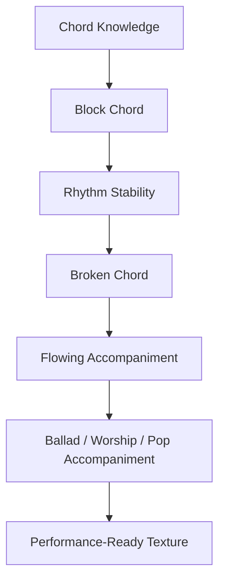
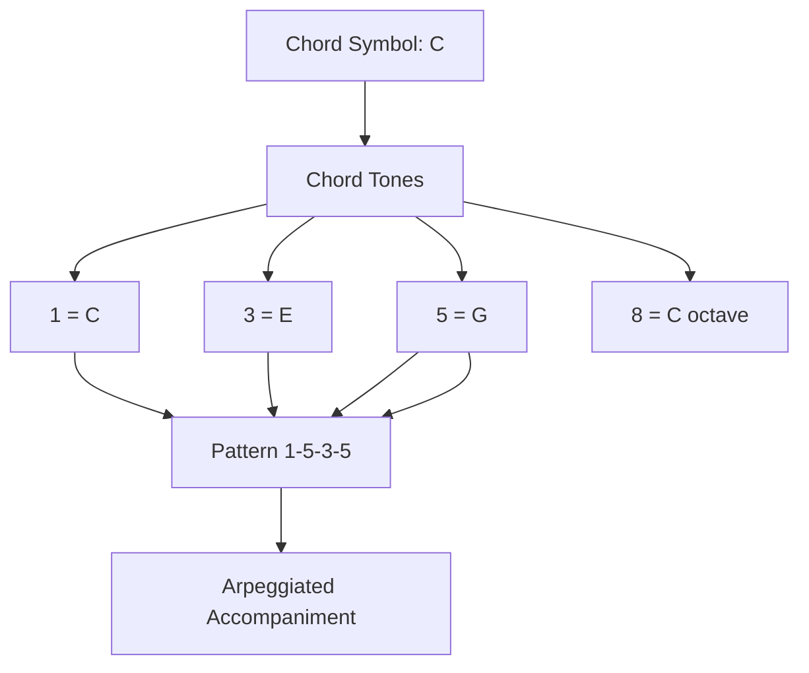
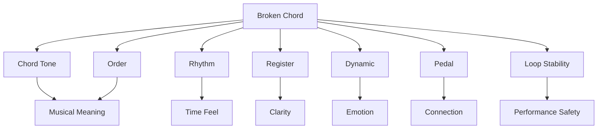
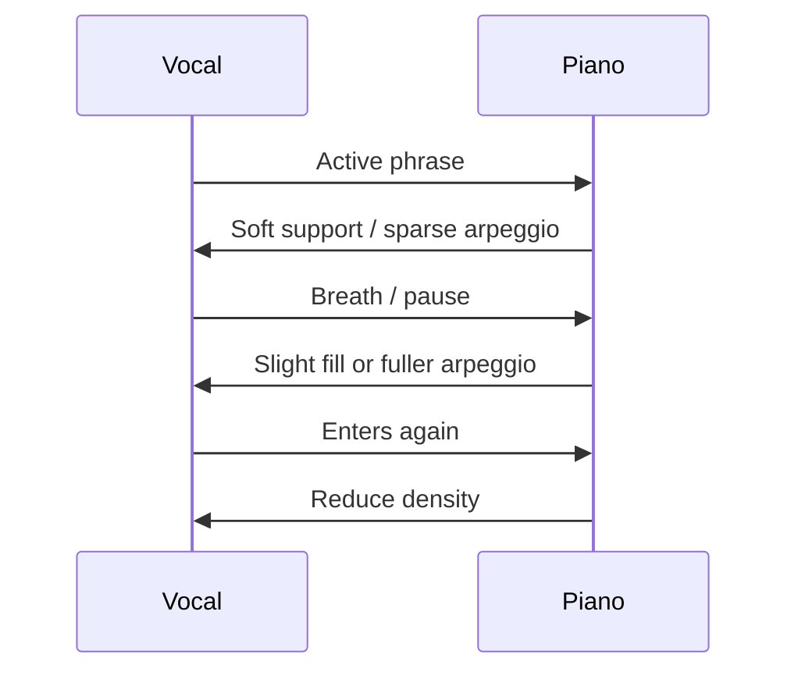
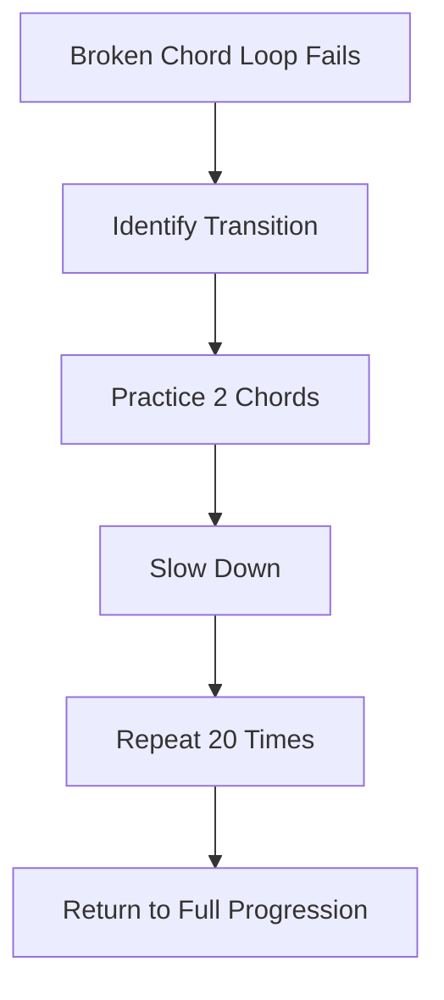
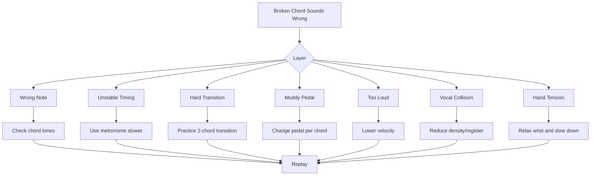
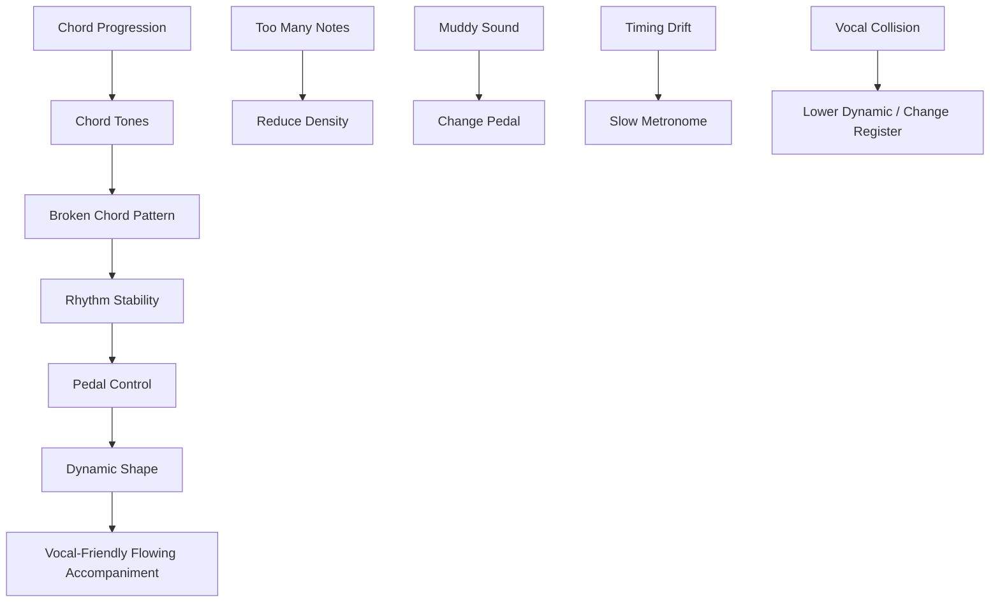

# learn-piano-accompaniment-part-009.md

# Part 009 — Pattern 2: Broken Chord / Arpeggio Dasar

> Seri: **Learn Piano Accompaniment for Singer Performance**  
> Fokus: **belajar piano untuk mengiringi penyanyi**  
> Framework utama: **The First 20 Hours — Josh Kaufman**  
> Tahap: **Phase C — Iringan Paling Minimal yang Bisa Dipakai Tampil**

---

## Status Seri

| Item | Status |
|---|---|
| Part | 009 |
| Nama file | `learn-piano-accompaniment-part-009.md` |
| Fokus | Broken chord dan arpeggio dasar untuk iringan piano |
| Prasyarat | Part 000–008 |
| Output praktis | Bisa memainkan progression sederhana dengan pola broken chord/arpeggio yang stabil dan vokal-friendly |
| Status seri | Belum selesai |

---

## Daftar Isi

- [1. Tujuan Part Ini](#1-tujuan-part-ini)
- [2. Posisi Part Ini dalam Framework Kaufman](#2-posisi-part-ini-dalam-framework-kaufman)
- [3. Dari Block Chord ke Broken Chord](#3-dari-block-chord-ke-broken-chord)
- [4. Definisi Broken Chord dan Arpeggio](#4-definisi-broken-chord-dan-arpeggio)
- [5. Mental Model: Chord sebagai Object, Arpeggio sebagai Iteration](#5-mental-model-chord-sebagai-object-arpeggio-sebagai-iteration)
- [6. Kenapa Broken Chord Cocok untuk Mengiringi Penyanyi](#6-kenapa-broken-chord-cocok-untuk-mengiringi-penyanyi)
- [7. Risiko Broken Chord untuk Pemula](#7-risiko-broken-chord-untuk-pemula)
- [8. Komponen Broken Chord](#8-komponen-broken-chord)
- [9. Mapping Chord Tone: 1, 3, 5, dan 8](#9-mapping-chord-tone-1-3-5-dan-8)
- [10. Pattern A: 1–5–3–5](#10-pattern-a-1535)
- [11. Pattern B: 1–3–5–3](#11-pattern-b-1353)
- [12. Pattern C: 1–5–8–5](#12-pattern-c-1585)
- [13. Pattern D: LH Root, RH Broken Chord](#13-pattern-d-lh-root-rh-broken-chord)
- [14. Pattern E: Alternating Bass + Chord Tone](#14-pattern-e-alternating-bass--chord-tone)
- [15. Pattern dalam 4/4](#15-pattern-dalam-44)
- [16. Pattern dalam 6/8](#16-pattern-dalam-68)
- [17. Cara Memakai Broken Chord untuk Verse](#17-cara-memakai-broken-chord-untuk-verse)
- [18. Cara Memakai Broken Chord untuk Chorus](#18-cara-memakai-broken-chord-untuk-chorus)
- [19. Cara Menghindari Tabrakan dengan Vokal](#19-cara-menghindari-tabrakan-dengan-vokal)
- [20. Register dan Density](#20-register-dan-density)
- [21. Pedal untuk Broken Chord](#21-pedal-untuk-broken-chord)
- [22. Dynamic dan Shape Frase](#22-dynamic-dan-shape-frase)
- [23. Latihan 1: Satu Chord, Satu Pattern](#23-latihan-1-satu-chord-satu-pattern)
- [24. Latihan 2: Dua Chord Transition](#24-latihan-2-dua-chord-transition)
- [25. Latihan 3: Progression I–V–vi–IV](#25-latihan-3-progression-ivviiiv)
- [26. Latihan 4: Progression vi–IV–I–V](#26-latihan-4-progression-viiviv)
- [27. Latihan 5: Verse ke Chorus dengan Texture Change](#27-latihan-5-verse-ke-chorus-dengan-texture-change)
- [28. Latihan 6: Mengiringi Vokal dengan Broken Chord](#28-latihan-6-mengiringi-vokal-dengan-broken-chord)
- [29. Debugging Broken Chord](#29-debugging-broken-chord)
- [30. Failure Mode Pemula](#30-failure-mode-pemula)
- [31. Practice Protocol 45 Menit](#31-practice-protocol-45-menit)
- [32. Checklist Kelulusan Part 009](#32-checklist-kelulusan-part-009)
- [33. Ringkasan Mental Model](#33-ringkasan-mental-model)
- [34. Persiapan ke Part 010](#34-persiapan-ke-part-010)

---

# 1. Tujuan Part Ini

Pada Part 007, kita belajar pola paling minimal:

```text
LH = root
RH = chord block
```

Pada Part 008, kita belajar bahwa rhythm lebih penting daripada banyak chord.

Sekarang kita masuk ke pola yang lebih musikal:

```text
broken chord / arpeggio dasar
```

Block chord memberi harmoni secara langsung. Broken chord memberi harmoni secara mengalir.

Bandingkan:

```text
Block chord:
C-E-G ditekan bersamaan

Broken chord:
C lalu G lalu E lalu G
```

Keduanya menggunakan chord yang sama. Yang berubah adalah **cara menyajikan chord dalam waktu**.

Target part ini:

> Anda mampu memainkan chord progression sederhana dengan pola broken chord/arpeggio dasar, menjaga timing stabil, mengontrol volume, dan menghindari tabrakan dengan vokal.

Setelah part ini, Anda harus bisa memainkan progression seperti:

```text
C - G - Am - F
```

dengan pola:

```text
1 - 5 - 3 - 5
1 - 3 - 5 - 3
1 - 5 - 8 - 5
```

Contoh pada chord `C`:

```text
1 - 5 - 3 - 5
C - G - E - G
```

---

# 2. Posisi Part Ini dalam Framework Kaufman

Dalam framework *The First 20 Hours*, kita tidak menunggu sampai teori lengkap baru mulai bermain lagu. Kita mencari pola kecil yang langsung menghasilkan performa fungsional.

Broken chord adalah salah satu sub-skill dengan leverage tinggi karena:

- membuat iringan terdengar lebih musikal daripada block chord;
- cocok untuk lagu lambat;
- memberi aliran tanpa terlalu ramai;
- membantu membangun sense of time;
- bisa diterapkan ke banyak chord;
- mudah ditingkatkan nanti menjadi aransemen lebih kompleks.

Diagram:



Dalam 20 jam pertama, broken chord adalah jembatan dari:

```text
saya bisa memainkan chord
```

menuju:

```text
saya bisa mengiringi dengan rasa lagu
```

---

# 3. Dari Block Chord ke Broken Chord

Block chord:

```text
C-E-G
```

dimainkan bersamaan.

Broken chord:

```text
C - E - G
```

dimainkan satu per satu.

Secara harmoni, keduanya sama-sama mewakili chord `C`.

Namun secara texture, hasilnya berbeda.

## 3.1 Block Chord

Kesan:

- jelas;
- langsung;
- tegas;
- cocok untuk cue;
- cocok untuk chorus sederhana;
- bisa terasa kaku jika dipakai terus.

## 3.2 Broken Chord

Kesan:

- mengalir;
- lembut;
- lebih emosional;
- cocok untuk ballad;
- cocok untuk verse;
- cocok untuk piano solo accompaniment;
- bisa terasa berantakan jika timing tidak stabil.

## 3.3 Analogi

Block chord seperti mengirim object lengkap sekaligus.

Broken chord seperti streaming field-field object tersebut secara berurutan.

```text
Block:
{ root: C, third: E, fifth: G }

Broken:
emit(C)
emit(E)
emit(G)
```

Harmoni sama. Delivery berbeda.

---

# 4. Definisi Broken Chord dan Arpeggio

Istilah ini sering dipakai saling bertukar, tetapi untuk kebutuhan awal kita bisa bedakan sederhana.

## 4.1 Broken Chord

Broken chord adalah chord yang nadanya dimainkan tidak bersamaan.

Contoh chord `C`:

```text
C E G
```

Broken chord bisa:

```text
C - E - G
C - G - E
E - G - C
G - E - C
```

Tidak harus naik berurutan.

## 4.2 Arpeggio

Arpeggio biasanya berarti nada chord dimainkan satu per satu dengan arah tertentu, sering naik/turun.

Contoh:

```text
C - E - G - C
```

atau turun:

```text
C - G - E - C
```

## 4.3 Untuk Seri Ini

Kita akan memakai istilah praktis:

```text
broken chord = chord tones dimainkan satu per satu
arpeggio = broken chord yang terasa mengalir naik/turun
```

Yang penting bukan istilahnya, tetapi kemampuan memakai pattern untuk mengiringi penyanyi.

---

# 5. Mental Model: Chord sebagai Object, Arpeggio sebagai Iteration

Untuk software engineer:

```text
Chord = collection of chord tones
Arpeggio = iteration over chord tones
Pattern = iteration order
Rhythm = timing of iteration
```

Contoh chord `C`:

```text
Chord C = [C, E, G]
```

Pattern `1-5-3-5`:

```text
[C, G, E, G]
```

Pattern `1-3-5-3`:

```text
[C, E, G, E]
```

Pattern `1-5-8-5`:

```text
[C, G, C, G]
```

Diagram:



Pattern adalah urutan akses terhadap chord tone.

Jika chord berubah, pattern tetap sama, tetapi datanya berubah.

Contoh:

```text
Pattern: 1-5-3-5
C chord: C-G-E-G
G chord: G-D-B-D
Am chord: A-E-C-E
F chord: F-C-A-C
```

---

# 6. Kenapa Broken Chord Cocok untuk Mengiringi Penyanyi

Broken chord sangat berguna untuk accompaniment karena ia memberi gerak tanpa harus menambah chord baru.

## 6.1 Mengisi Ruang dengan Halus

Dalam ballad, jika piano hanya memainkan block chord setiap bar:

```text
X - - -
```

lagu bisa terasa kosong.

Broken chord mengisi ruang:

```text
1 2 3 4
C G E G
```

tetapi tetap berasal dari chord yang sama.

## 6.2 Memberi Flow

Broken chord membuat harmony terasa bergerak walau chord progression sederhana.

Contoh:

```text
C - G - Am - F
```

dengan block chord terdengar sederhana.

Dengan arpeggio, progression yang sama bisa terdengar lebih emosional dan “mengalir”.

## 6.3 Cocok untuk Lagu Lambat

Lagu lambat butuh sustain dan gerak.

Jika tidak ada gerak, lagu terasa mati.

Jika terlalu banyak gerak, vokal terganggu.

Broken chord adalah kompromi:

```text
cukup bergerak, tetapi masih harmonis
```

## 6.4 Membantu Penyanyi Mendengar Harmoni

Karena chord tones muncul satu per satu, penyanyi tetap mendapat konteks pitch.

Namun jangan memainkan arpeggio terlalu keras, karena bisa mengganggu melodi vokal.

---

# 7. Risiko Broken Chord untuk Pemula

Broken chord lebih musikal, tetapi ada risiko.

## 7.1 Timing Mudah Goyah

Karena nada dimainkan satu per satu, Anda harus menjaga subdivision.

Block chord:

```text
satu event per bar
```

Broken chord:

```text
beberapa event per bar
```

Lebih banyak event berarti lebih banyak peluang salah timing.

## 7.2 Tangan Bisa Tegang

Pemula sering menekan tiap nada terlalu keras.

Broken chord harus mengalir, bukan dipukul satu per satu dengan tegang.

## 7.3 Bisa Menabrak Vokal

Jika tangan kanan terlalu aktif di register vokal, arpeggio bisa mengganggu melodi.

## 7.4 Bisa Terlalu Ramai

Tidak semua bagian lagu butuh arpeggio penuh.

Kadang verse cukup sparse.

Kadang chorus butuh lebih besar.

Kadang bagian lirik penting justru butuh diam.

## 7.5 Pedal Bisa Membuat Keruh

Broken chord + pedal berlebihan = suara bercampur.

Pedal harus bersih.

---

# 8. Komponen Broken Chord

Broken chord terdiri dari beberapa layer:

| Layer | Pertanyaan |
|---|---|
| Chord tone | Nada mana dari chord yang dimainkan? |
| Order | Urutannya bagaimana? |
| Rhythm | Kapan tiap nada dimainkan? |
| Register | Di octave mana dimainkan? |
| Dynamic | Seberapa keras tiap nada? |
| Pedal | Apakah nada disambung atau dipisah? |
| Loop | Apakah pattern diulang stabil? |

Diagram:



Jika broken chord terdengar buruk, debug layer-layer ini.

Jangan langsung menyimpulkan “saya tidak bisa piano”.

---

# 9. Mapping Chord Tone: 1, 3, 5, dan 8

Kita akan memakai angka chord tone:

```text
1 = root
3 = third
5 = fifth
8 = root octave
```

Contoh chord `C`:

| Chord Tone | Nada |
|---:|---|
| 1 | C |
| 3 | E |
| 5 | G |
| 8 | C |

Contoh chord `G`:

| Chord Tone | Nada |
|---:|---|
| 1 | G |
| 3 | B |
| 5 | D |
| 8 | G |

Contoh chord `Am`:

| Chord Tone | Nada |
|---:|---|
| 1 | A |
| 3 | C |
| 5 | E |
| 8 | A |

Contoh chord `F`:

| Chord Tone | Nada |
|---:|---|
| 1 | F |
| 3 | A |
| 5 | C |
| 8 | F |

## 9.1 Kenapa Pakai Angka?

Karena pattern bisa dipakai di semua chord.

Jika pattern:

```text
1 - 5 - 3 - 5
```

maka pada chord `C`:

```text
C - G - E - G
```

pada chord `F`:

```text
F - C - A - C
```

pada chord `Am`:

```text
A - E - C - E
```

Ini sama seperti function generic.

```text
pattern(chord) -> sequence of notes
```

---

# 10. Pattern A: 1–5–3–5

Pattern:

```text
1 - 5 - 3 - 5
```

Pada chord `C`:

```text
C - G - E - G
```

Pada chord `G`:

```text
G - D - B - D
```

Pada chord `Am`:

```text
A - E - C - E
```

Pada chord `F`:

```text
F - C - A - C
```

## 10.1 Rasa Pattern

Pattern ini terasa:

- stabil;
- sedikit terbuka;
- tidak terlalu naik;
- cocok untuk verse/ballad;
- mudah dijaga karena fifth sering menjadi anchor.

## 10.2 Dalam 4/4

Satu nada per beat:

```text
1 2 3 4
1 5 3 5
```

Contoh chord C:

```text
Beat: 1 2 3 4
Note: C G E G
```

## 10.3 Untuk Progression

Progression:

```text
C - G - Am - F
```

Pattern:

```text
C : C G E G
G : G D B D
Am: A E C E
F : F C A C
```

Ditulis:

```text
| C G E G | G D B D | A E C E | F C A C |
```

## 10.4 Kelebihan

- mudah dihafal;
- cocok untuk tempo lambat;
- tidak terlalu ramai;
- memberi rasa ayunan sederhana.

## 10.5 Kelemahan

- jika dimainkan terlalu keras, terdengar seperti latihan;
- jika timing tidak stabil, langsung terasa goyah;
- root position kadang membuat lompatan besar antar chord.

---

# 11. Pattern B: 1–3–5–3

Pattern:

```text
1 - 3 - 5 - 3
```

Pada chord `C`:

```text
C - E - G - E
```

Pada chord `G`:

```text
G - B - D - B
```

Pada chord `Am`:

```text
A - C - E - C
```

Pada chord `F`:

```text
F - A - C - A
```

## 11.1 Rasa Pattern

Pattern ini terasa:

- lebih “naik”;
- lebih jelas sebagai arpeggio;
- cocok untuk latihan chord tone;
- cocok untuk lagu yang butuh gerak sederhana.

## 11.2 Dalam 4/4

```text
1 2 3 4
1 3 5 3
```

Contoh chord C:

```text
Beat: 1 2 3 4
Note: C E G E
```

## 11.3 Untuk Progression

```text
| C E G E | G B D B | A C E C | F A C A |
```

## 11.4 Kelebihan

- sangat intuitif;
- mudah memahami chord construction;
- terdengar seperti arpeggio dasar.

## 11.5 Kelemahan

- bisa terdengar terlalu “exercise-like”;
- third yang sering muncul bisa menabrak melodi vokal jika register/dynamic salah;
- transisi antar chord bisa terasa lompat.

---

# 12. Pattern C: 1–5–8–5

Pattern:

```text
1 - 5 - 8 - 5
```

Pada chord `C`:

```text
C - G - C - G
```

Pada chord `G`:

```text
G - D - G - D
```

Pada chord `Am`:

```text
A - E - A - E
```

Pada chord `F`:

```text
F - C - F - C
```

## 12.1 Rasa Pattern

Pattern ini terasa:

- terbuka;
- luas;
- cinematic;
- cocok untuk ballad;
- cocok untuk intro/verse;
- tidak terlalu menekankan major/minor karena third tidak dimainkan.

## 12.2 Catatan Penting

Karena pattern ini tidak memainkan third, warna major/minor menjadi kurang jelas.

Contoh:

```text
C = C E G
Cm = C Eb G
```

Jika pattern hanya:

```text
C - G - C - G
```

maka perbedaan major/minor tidak terdengar.

Karena itu, pattern `1-5-8-5` bagus jika:

- chord sebelumnya/sesudahnya sudah memberi konteks;
- tangan kanan/vokal memberi third;
- Anda ingin warna lebih terbuka;
- tidak perlu menegaskan major/minor setiap saat.

## 12.3 Dalam 4/4

```text
1 2 3 4
1 5 8 5
```

Contoh progression:

```text
| C G C G | G D G D | A E A E | F C F C |
```

## 12.4 Kelebihan

- suara luas;
- tidak terlalu padat;
- cocok untuk vokal;
- mudah dipedal;
- aman untuk intro sederhana.

## 12.5 Kelemahan

- warna chord kurang lengkap;
- bisa terdengar kosong;
- perlu konteks harmoni tambahan.

---

# 13. Pattern D: LH Root, RH Broken Chord

Sejauh ini pattern bisa dimainkan satu tangan. Namun untuk accompaniment, pembagian dua tangan lebih praktis.

Pattern D:

```text
LH: root di beat 1
RH: chord tones sebagai broken chord
```

Contoh chord `C`:

```text
LH: C
RH: E - G - E
```

Hitungan:

```text
Beat 1: LH C + RH E
Beat 2: RH G
Beat 3: RH E
Beat 4: RH G atau hold
```

Versi sederhana:

```text
1 2 3 4
LH+RH RH RH RH
```

## 13.1 Kenapa RH Bisa Mulai dari Third?

Karena LH sudah memainkan root.

Jika RH juga selalu mulai dari root, suara bisa terlalu root-heavy.

Contoh:

```text
LH C
RH E-G-E-G
```

Ini masih mewakili chord C karena root sudah ada di LH.

## 13.2 Pattern Praktis

Untuk chord `C`:

```text
LH: C
RH: E G E G
```

Untuk chord `G`:

```text
LH: G
RH: B D B D
```

Untuk chord `Am`:

```text
LH: A
RH: C E C E
```

Untuk chord `F`:

```text
LH: F
RH: A C A C
```

Ditulis secara chord tone:

```text
LH: 1
RH: 3 - 5 - 3 - 5
```

## 13.3 Rasa

Pattern ini lebih ringan karena LH hanya memberi anchor, RH memberi gerak.

Cocok untuk:

- verse lembut;
- ballad;
- accompaniment dengan vokal jelas;
- latihan koordinasi dua tangan.

---

# 14. Pattern E: Alternating Bass + Chord Tone

Pattern ini sedikit lebih bergerak.

```text
LH: root
RH: chord tone
LH: fifth atau root octave
RH: chord tone
```

Namun untuk 20 jam pertama, kita gunakan versi sangat sederhana:

```text
Beat 1: LH root
Beat 2: RH chord tone
Beat 3: LH root
Beat 4: RH chord tone
```

Contoh chord C:

```text
1: LH C
2: RH E-G
3: LH C
4: RH E-G
```

Atau lebih ringan:

```text
1: LH C
2: RH E
3: LH C
4: RH G
```

## 14.1 Fungsi

Pattern ini memberi dialog antara tangan kiri dan kanan.

Rasa:

```text
bass - answer - bass - answer
```

## 14.2 Kapan Dipakai?

Cocok untuk:

- lagu medium slow;
- accompaniment yang ingin sedikit bergerak;
- latihan koordinasi;
- verse yang tidak ingin terlalu kosong.

## 14.3 Risiko

Jika LH terlalu keras, pattern terasa berat.

Jika RH terlalu tajam, vokal terganggu.

Gunakan dynamic lembut.

---

# 15. Pattern dalam 4/4

Dalam 4/4, kita punya empat beat per bar.

Broken chord dasar bisa memakai satu nada per beat:

```text
1 2 3 4
```

Pattern:

```text
1 - 5 - 3 - 5
```

atau:

```text
1 - 3 - 5 - 3
```

## 15.1 Contoh 4/4 dengan C

```text
Count: 1 2 3 4
Note : C G E G
```

## 15.2 Contoh 4/4 dengan Progression

```text
| C       | G       | Am      | F       |
| C G E G | G D B D | A E C E | F C A C |
```

## 15.3 Dengan Eighth Note

Jika ingin lebih mengalir, bisa gunakan eighth note:

```text
1 & 2 & 3 & 4 &
```

Contoh chord C:

```text
C G E G C G E G
```

Namun untuk tahap awal, jangan terburu-buru.

Gunakan quarter-note arpeggio dulu sampai stabil.

---

# 16. Pattern dalam 6/8

6/8 punya rasa mengalir yang sangat cocok untuk ballad.

Hitungan:

```text
1 2 3 4 5 6
```

Dua pulse besar:

```text
ONE two three FOUR five six
```

## 16.1 Pattern 6/8 Dasar

Untuk chord C:

```text
1 2 3 4 5 6
C G E G E G
```

Atau:

```text
1 2 3 4 5 6
C E G C G E
```

## 16.2 Pattern 1–5–8–5 dalam 6/8

Bisa diperluas:

```text
1 2 3 4 5 6
1 5 8 5 3 5
```

Pada C:

```text
C G C G E G
```

## 16.3 Untuk 20 Jam Pertama

Cukup pahami rasa 6/8. Detailnya akan dibahas di Part 011.

Untuk sekarang, jangan campur 4/4 dan 6/8 dalam satu sesi jika masih bingung.

---

# 17. Cara Memakai Broken Chord untuk Verse

Verse biasanya butuh ruang.

Broken chord untuk verse harus:

- lembut;
- tidak terlalu penuh;
- tidak terlalu tinggi;
- tidak terlalu cepat;
- tidak menutup lirik.

## 17.1 Pattern Rekomendasi Verse

```text
1 - 5 - 3 - 5
```

atau:

```text
LH root
RH 3 - 5 - 3 - 5
```

## 17.2 Dynamic

Gunakan level:

```text
1–2 dari 5
```

Artinya:

- lembut;
- tidak menusuk;
- cukup terdengar;
- memberi fondasi.

## 17.3 Contoh Verse

Progression:

```text
Am - F - C - G
```

Pattern:

```text
Am: A E C E
F : F C A C
C : C G E G
G : G D B D
```

Ditulis:

```text
| A E C E | F C A C | C G E G | G D B D |
```

## 17.4 Tujuan Verse

Verse adalah tempat lirik bercerita.

Jadi piano harus:

```text
support narrative, not dominate
```

---

# 18. Cara Memakai Broken Chord untuk Chorus

Chorus biasanya lebih besar.

Namun lebih besar tidak selalu berarti lebih keras.

Bisa berarti:

- pattern lebih padat;
- register sedikit lebih tinggi;
- chord lebih jelas;
- dynamic naik sedikit;
- LH lebih tegas di beat 1.

## 18.1 Pattern Rekomendasi Chorus

Untuk chorus sederhana:

```text
1 - 5 - 8 - 5
```

atau:

```text
1 - 3 - 5 - 3
```

Dengan dynamic lebih kuat dari verse.

## 18.2 Contoh Chorus

Progression:

```text
C - G - Am - F
```

Pattern:

```text
C : C G C G
G : G D G D
Am: A E A E
F : F C F C
```

Ini terdengar lebih terbuka karena memakai octave.

## 18.3 Alternatif Chorus Lebih Jelas

Jika warna major/minor perlu lebih jelas, gunakan:

```text
1 - 3 - 5 - 3
```

```text
C : C E G E
G : G B D B
Am: A C E C
F : F A C A
```

## 18.4 Prinsip

Chorus harus terasa naik, tetapi penyanyi tetap pusat.

Jangan membuat arpeggio terlalu ramai sampai vokal kehilangan ruang.

---

# 19. Cara Menghindari Tabrakan dengan Vokal

Broken chord bisa menabrak vokal karena nadanya bergerak terus.

## 19.1 Hindari Register Vokal yang Terlalu Padat

Jika vokal berada di mid register, jangan memainkan RH terlalu keras di wilayah yang sama.

Gunakan:

```text
lebih lembut
lebih rendah sedikit
atau lebih tinggi tapi tidak tajam
```

## 19.2 Jangan Mainkan Nada Terlalu Banyak Saat Vokal Padat

Jika penyanyi menyanyikan frase cepat, piano sebaiknya lebih sederhana.

Jika vokal sedang sustain panjang, broken chord bisa mengisi ruang.

## 19.3 Dengarkan Melodi

Jika arpeggio Anda menciptakan “melodi kedua” yang terlalu jelas, itu bisa mengganggu.

Pengiring harus hati-hati agar broken chord tidak terdengar seperti melodi tandingan.

## 19.4 Prinsip

```text
Saat vokal aktif, piano lebih support.
Saat vokal diam, piano boleh sedikit menjawab.
```

Diagram:



---

# 20. Register dan Density

Broken chord punya dua parameter penting:

```text
register = di mana dimainkan
density = seberapa banyak nada per waktu
```

## 20.1 Register

Register rendah:

- hangat;
- bisa muddy;
- cocok untuk bass/root;
- berbahaya jika pedal banyak.

Register tengah:

- paling natural;
- bisa menabrak vokal;
- harus dikontrol dynamic.

Register tinggi:

- cerah;
- bisa indah;
- bisa menusuk;
- cocok untuk fill, bukan terus-menerus keras.

## 20.2 Density

Density rendah:

```text
1 nada per beat
```

Density sedang:

```text
2 nada per beat
```

Density tinggi:

```text
eighth note terus-menerus atau lebih
```

Untuk 20 jam pertama, gunakan density rendah-sedang.

## 20.3 Rule of Thumb

```text
Jika vokal padat, kurangi density.
Jika lagu kosong, tambah density sedikit.
Jika suara keruh, naikkan register atau kurangi pedal.
Jika vokal tertutup, turunkan dynamic.
```

---

# 21. Pedal untuk Broken Chord

Pedal membuat broken chord menyambung.

Tanpa pedal, arpeggio bisa terdengar kering.

Dengan pedal terlalu banyak, arpeggio bisa terdengar keruh.

## 21.1 Pedal Dasar

Aturan awal:

```text
ganti pedal setiap chord berubah
```

Contoh progression:

```text
C - G - Am - F
```

Pedal:

```text
C: pedal
G: change pedal
Am: change pedal
F: change pedal
```

## 21.2 Half-Pedal secara Konsep

Jika digital/acoustic piano mendukung, pedal tidak harus selalu penuh.

Namun untuk tahap awal, jangan terlalu fokus pada half-pedal.

Fokus:

```text
bersih atau tidak?
```

Jika keruh, kurangi pedal.

## 21.3 Pedal dan Bass

Jika LH memainkan root rendah dan pedal ditahan, suara mudah muddy.

Solusi:

- main LH lebih lembut;
- pindahkan root sedikit lebih tinggi;
- ganti pedal lebih cepat;
- gunakan pattern lebih sparse.

## 21.4 Latihan Pedal

Mainkan chord C dengan pattern:

```text
C - G - E - G
```

Lalu pindah ke G:

```text
G - D - B - D
```

Saat pindah:

```text
tekan chord baru dulu
angkat pedal
tekan pedal lagi
```

Ini membuat transisi halus tetapi tidak bercampur.

---

# 22. Dynamic dan Shape Frase

Broken chord tidak boleh datar.

Jika setiap nada sama keras:

```text
C G E G
```

terdengar mekanis.

Gunakan shape.

## 22.1 Shape Dasar

Dalam 4 beat:

```text
1    2    3    4
medium soft soft soft
```

atau:

```text
1 = anchor
2 = light
3 = slight lift
4 = light
```

## 22.2 Crescendo Kecil

Untuk menuju chorus, Anda bisa menaikkan dynamic sedikit demi sedikit.

Contoh 4 bar:

```text
Bar 1: level 2
Bar 2: level 2
Bar 3: level 2.5
Bar 4: level 3
```

## 22.3 Decrescendo

Untuk menutup phrase, kurangi dynamic.

Contoh:

```text
Bar 1: level 3
Bar 2: level 2.5
Bar 3: level 2
Bar 4: level 1.5
```

## 22.4 Prinsip

```text
Broken chord harus bernapas.
Jangan menjadi mesin nada.
```

---

# 23. Latihan 1: Satu Chord, Satu Pattern

Tujuan:

> menguasai pattern tanpa beban chord progression.

Pilih chord:

```text
C
```

Pattern A:

```text
1 - 5 - 3 - 5
C - G - E - G
```

Mainkan 2 menit dengan metronome 60 BPM.

Count:

```text
1 2 3 4
C G E G
```

## 23.1 Lanjutkan ke Pattern B

```text
1 - 3 - 5 - 3
C - E - G - E
```

Mainkan 2 menit.

## 23.2 Lanjutkan ke Pattern C

```text
1 - 5 - 8 - 5
C - G - C - G
```

Mainkan 2 menit.

## 23.3 Checklist

- [ ] timing stabil;
- [ ] tangan rileks;
- [ ] suara tidak terlalu keras;
- [ ] nada tidak tersandung;
- [ ] Anda bisa menghitung sambil bermain.

---

# 24. Latihan 2: Dua Chord Transition

Broken chord menjadi sulit saat chord berubah.

Latih dua chord saja.

## 24.1 C ke G

Pattern:

```text
C: C G E G
G: G D B D
```

Ditulis:

```text
| C G E G | G D B D |
```

Ulang 2 menit.

## 24.2 G ke Am

```text
| G D B D | A E C E |
```

## 24.3 Am ke F

```text
| A E C E | F C A C |
```

## 24.4 F ke C

```text
| F C A C | C G E G |
```

## 24.5 Debug Rule

Jika transition gagal, perlambat.

Jangan mengulang full progression jika bug-nya ada di satu transition.



---

# 25. Latihan 3: Progression I–V–vi–IV

Progression:

```text
C - G - Am - F
```

Pattern A:

```text
1 - 5 - 3 - 5
```

Full sequence:

```text
| C G E G | G D B D | A E C E | F C A C |
```

## 25.1 Step 1: Ucapkan Chord

Sebelum main:

```text
C
G
Am
F
```

## 25.2 Step 2: Ucapkan Pattern

```text
one five three five
```

## 25.3 Step 3: Mainkan Pelan

Metronome:

```text
50–60 BPM
```

## 25.4 Step 4: Loop 3 Menit

Aturan:

- jangan berhenti;
- jika salah, lanjut;
- perbaiki di loop berikutnya;
- jangan mempercepat.

## 25.5 Evaluasi

Tanya:

- apakah tempo stabil?
- apakah chord change tepat?
- apakah tangan tegang?
- apakah suara terlalu keras?
- apakah pattern mengalir?

---

# 26. Latihan 4: Progression vi–IV–I–V

Progression:

```text
Am - F - C - G
```

Pattern A:

```text
1 - 5 - 3 - 5
```

Full sequence:

```text
| A E C E | F C A C | C G E G | G D B D |
```

## 26.1 Rasa

Progression ini cocok untuk verse yang lebih melankolis.

Dynamic:

```text
level 1–2
```

Pedal:

```text
ganti setiap chord
```

## 26.2 Latihan

Mainkan 4 bar sebanyak 8 kali.

Setiap loop, coba lebih lembut.

Targetnya:

```text
bukan lebih cepat
tetapi lebih tenang dan stabil
```

---

# 27. Latihan 5: Verse ke Chorus dengan Texture Change

Sekarang kita gabungkan block chord dan broken chord.

## 27.1 Verse

Progression:

```text
Am - F - C - G
```

Texture:

```text
broken chord lembut
```

Pattern:

```text
1 - 5 - 3 - 5
```

## 27.2 Chorus

Progression:

```text
C - G - Am - F
```

Texture:

```text
block chord half note pulse
```

Pattern:

```text
X - X -
```

## 27.3 Format

```text
Verse:
| Am | F | C | G |
Broken chord

Chorus:
| C | G | Am | F |
Block chord half note
```

## 27.4 Tujuan

Belajar bahwa aransemen bisa berkembang dengan texture change.

Verse mengalir.

Chorus lebih tegas.

## 27.5 Alternatif

Kebalikannya juga bisa:

```text
Verse: block chord sparse
Chorus: broken chord lebih padat
```

Tidak ada aturan absolut. Yang penting mendukung vokal.

---

# 28. Latihan 6: Mengiringi Vokal dengan Broken Chord

Gunakan kalimat sederhana:

```text
Aku masih menunggu di sini
```

Progression:

```text
C - G - Am - F
```

Pattern:

```text
1 - 5 - 3 - 5
```

Nyanyikan atau humming.

## 28.1 Aturan

- piano level 1–2;
- jangan mengejar vokal;
- jangan terlalu keras;
- jangan isi semua ruang;
- jika vokal masuk, jaga pattern tetap lembut;
- jika vokal berhenti, boleh sedikit naik dynamic.

## 28.2 Evaluasi

Rekam dan dengarkan.

Tanya:

- apakah arpeggio mengganggu vokal?
- apakah pattern terlalu ramai?
- apakah chord masih jelas?
- apakah timing stabil?
- apakah pedal bersih?
- apakah lagu terasa mengalir?

## 28.3 Jika Tabrakan

Kurangi salah satu:

- volume;
- register;
- density;
- pedal;
- jumlah nada.

Jangan otomatis mengganti chord.

Masalah sering bukan harmony, tetapi texture.

---

# 29. Debugging Broken Chord

Jika broken chord terasa buruk, debug layer.



## 29.1 Wrong Note

Gejala:

```text
ada nada yang terdengar asing
```

Solusi:

- cek chord tone;
- ucapkan 1-3-5;
- mainkan block chord dulu;
- baru pecah menjadi arpeggio.

## 29.2 Timing Tidak Stabil

Gejala:

```text
pattern melambat saat chord sulit
```

Solusi:

- metronome 50 BPM;
- main satu chord saja;
- clap pattern dulu;
- jangan pedal dulu.

## 29.3 Transition Sulit

Gejala:

```text
pindah dari satu chord ke chord lain tersandung
```

Solusi:

- latih dua chord;
- gunakan pattern lebih sederhana;
- lihat chord berikutnya sebelum bar selesai.

## 29.4 Pedal Keruh

Gejala:

```text
semua nada bercampur
```

Solusi:

- ganti pedal tiap chord;
- kurangi bass;
- main tanpa pedal dulu.

## 29.5 Terlalu Keras

Gejala:

```text
vokal tertutup
```

Solusi:

- main level 1–2;
- kurangi attack;
- RH lebih lembut;
- jangan main di register vokal terlalu kuat.

## 29.6 Tangan Tegang

Gejala:

```text
jari cepat capek
pergelangan kaku
bahu naik
```

Solusi:

- perlambat;
- kurangi volume;
- gunakan gerakan kecil;
- rileks setelah setiap nada;
- jangan menekan tuts secara agresif.

---

# 30. Failure Mode Pemula

## 30.1 Mengira Broken Chord Harus Cepat

Tidak.

Broken chord lambat dan stabil jauh lebih baik daripada cepat tapi kacau.

Untuk accompaniment, flow lebih penting dari speed.

## 30.2 Memainkan Semua Nada Sama Keras

Ini membuat arpeggio terdengar seperti latihan teknis.

Gunakan shape:

```text
beat 1 sedikit lebih jelas
sisanya lebih ringan
```

## 30.3 Pedal Ditahan Terus

Ini membuat chord bercampur.

Ganti pedal setiap chord.

Jika belum bisa, latihan tanpa pedal.

## 30.4 Terlalu Banyak Gerak Saat Vokal Aktif

Broken chord bisa menjadi terlalu ramai.

Kurangi density saat vokal sedang padat.

## 30.5 Tidak Tahu Chord Tone

Jika Anda tidak tahu 1, 3, 5 dari chord, pattern akan menjadi hafalan jari.

Solusi:

Sebelum arpeggio, sebut:

```text
C = C E G
G = G B D
Am = A C E
F = F A C
```

## 30.6 Lupa Beat 1

Karena sibuk memainkan arpeggio, pemula sering kehilangan posisi bar.

Solusi:

- accent beat 1;
- gunakan metronome;
- hitung keras;
- LH root di beat 1.

## 30.7 Arpeggio Menjadi Melodi Tandingan

Jika broken chord terlalu menonjol, pendengar bisa fokus ke piano, bukan vokal.

Solusi:

```text
lower dynamic
simplify pattern
leave space
```

---

# 31. Practice Protocol 45 Menit

Gunakan sesi ini untuk Part 009.

## 31.1 Menit 0–5: Chord Tone Review

Ucapkan dan mainkan block chord:

```text
C  = C E G
G  = G B D
Am = A C E
F  = F A C
```

## 31.2 Menit 5–10: Pattern di Chord C

Mainkan:

```text
C-G-E-G
C-E-G-E
C-G-C-G
```

Masing-masing 1–2 menit.

## 31.3 Menit 10–15: Pattern A di Empat Chord

Pattern:

```text
1 - 5 - 3 - 5
```

Chord:

```text
C
G
Am
F
```

Mainkan satu chord satu bar.

## 31.4 Menit 15–20: Transition Drill

Latih:

```text
C -> G
G -> Am
Am -> F
F -> C
```

Pattern:

```text
1 - 5 - 3 - 5
```

## 31.5 Menit 20–25: Full Progression

Mainkan:

```text
| C G E G | G D B D | A E C E | F C A C |
```

Loop 5 menit.

## 31.6 Menit 25–30: Verse Progression

Mainkan:

```text
| A E C E | F C A C | C G E G | G D B D |
```

Dynamic level 1–2.

## 31.7 Menit 30–35: Pedal Practice

Mainkan progression:

```text
C - G - Am - F
```

Ganti pedal tiap chord.

Jika keruh, matikan pedal.

## 31.8 Menit 35–40: Verse to Chorus Texture

Verse:

```text
Am - F - C - G
broken chord
level 2
```

Chorus:

```text
C - G - Am - F
half note block chord
level 3
```

## 31.9 Menit 40–45: Record and Review

Rekam 1 menit.

Jawab:

- apakah pattern stabil?
- apakah chord tone benar?
- apakah pedal bersih?
- apakah tangan tegang?
- apakah vokal masih punya ruang?
- apakah verse dan chorus terasa berbeda?
- apakah broken chord terdengar musikal atau seperti latihan?

---

# 32. Checklist Kelulusan Part 009

Anda boleh lanjut ke Part 010 jika sebagian besar checklist ini terpenuhi.

## 32.1 Pemahaman

- [ ] Saya tahu perbedaan block chord dan broken chord.
- [ ] Saya tahu arpeggio adalah chord tone yang dimainkan satu per satu.
- [ ] Saya tahu arti 1, 3, 5, dan 8 dalam chord tone.
- [ ] Saya bisa memetakan `C` menjadi `C E G`.
- [ ] Saya bisa memetakan `G` menjadi `G B D`.
- [ ] Saya bisa memetakan `Am` menjadi `A C E`.
- [ ] Saya bisa memetakan `F` menjadi `F A C`.
- [ ] Saya tahu kenapa broken chord cocok untuk ballad/verse.
- [ ] Saya tahu broken chord bisa menabrak vokal jika terlalu ramai.

## 32.2 Praktik

- [ ] Saya bisa memainkan pattern `1-5-3-5` pada chord C.
- [ ] Saya bisa memainkan pattern `1-3-5-3` pada chord C.
- [ ] Saya bisa memainkan pattern `1-5-8-5` pada chord C.
- [ ] Saya bisa memainkan `C - G - Am - F` dengan pattern `1-5-3-5`.
- [ ] Saya bisa memainkan `Am - F - C - G` dengan pattern `1-5-3-5`.
- [ ] Saya bisa loop progression minimal 2 menit tanpa berhenti.
- [ ] Saya bisa menjaga beat 1 tetap jelas.
- [ ] Saya bisa menggunakan pedal bersih atau sadar kapan harus melepas pedal.
- [ ] Saya bisa memainkan broken chord dengan dynamic lembut.

## 32.3 Self-Correction

- [ ] Saya bisa mendeteksi wrong note dalam arpeggio.
- [ ] Saya bisa mendeteksi timing yang goyah.
- [ ] Saya bisa memperlambat tempo tanpa merasa gagal.
- [ ] Saya bisa memperbaiki transition dua chord.
- [ ] Saya bisa mendengar jika pedal terlalu keruh.
- [ ] Saya bisa mengurangi density saat vokal terganggu.
- [ ] Saya bisa membedakan masalah chord tone, rhythm, dynamic, dan pedal.

---

# 33. Ringkasan Mental Model

Broken chord adalah cara menyajikan chord secara berurutan.

```text
Chord = collection
Pattern = iteration order
Rhythm = timing
Dynamic = expression
Pedal = connection
```

Pattern utama:

```text
1 - 5 - 3 - 5
1 - 3 - 5 - 3
1 - 5 - 8 - 5
```

Pada chord `C`:

```text
C - G - E - G
C - E - G - E
C - G - C - G
```

Untuk mengiringi penyanyi, broken chord harus:

- stabil;
- lembut;
- tidak terlalu ramai;
- tidak menabrak vokal;
- punya beat 1 jelas;
- pedaling bersih;
- punya dynamic shape.

Diagram akhir:



Musikalitas broken chord bukan berasal dari banyak nada.

Musikalitasnya berasal dari:

```text
urutan nada yang jelas
waktu yang stabil
sentuhan yang lembut
ruang yang cukup untuk vokal
```

---

# 34. Persiapan ke Part 010

Part berikutnya adalah:

```text
learn-piano-accompaniment-part-010.md
```

Judul:

```text
Pattern 3: Pop Ballad Comping
```

Di Part 009, kita belajar broken chord/arpeggio dasar.

Di Part 010, kita akan masuk ke pola iringan pop ballad yang lebih practical untuk lagu nyata.

Kita akan membahas:

- pola tangan kiri bass;
- tangan kanan chord pulse;
- syncopation ringan;
- sustain pedal;
- cara membuat chorus lebih besar dari verse;
- dynamic ramp;
- contoh variasi 4 bar;
- cara tidak terdengar monoton;
- comping sebagai support terhadap vokal;
- kapan memainkan chord penuh;
- kapan memecah chord;
- kapan diam.

Part 010 akan mulai menggabungkan:

```text
chord progression + rhythm + broken chord + dynamic
```

menjadi pattern accompaniment yang lebih dekat ke performance.

---

## Status Akhir Part 009

```text
Part 009 selesai.
Seri belum selesai.
Lanjut ke Part 010.
```
