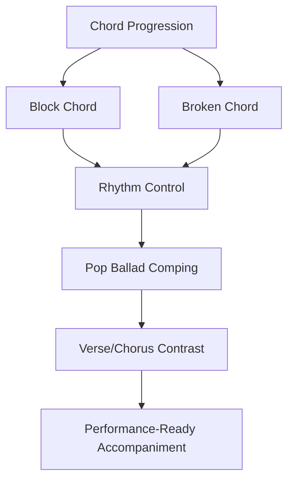
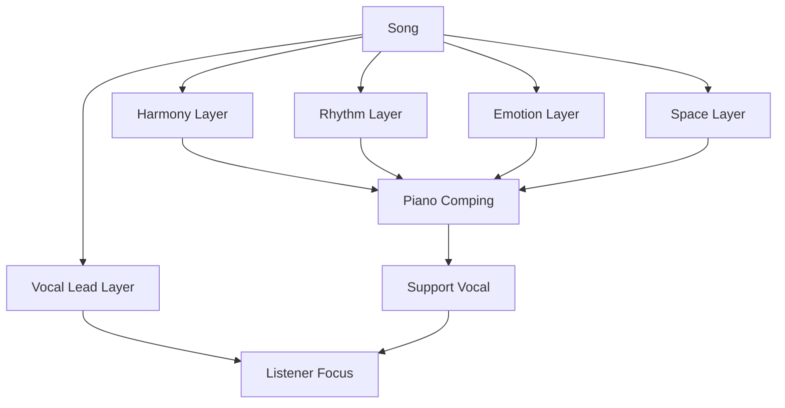
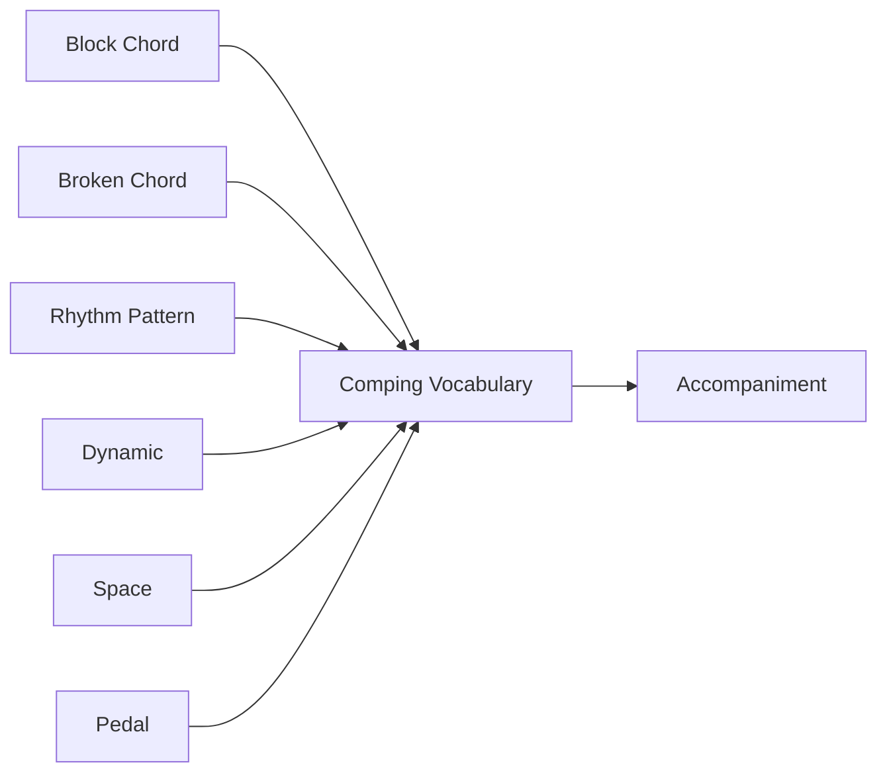
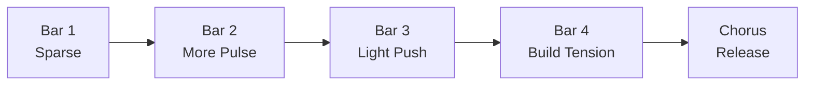
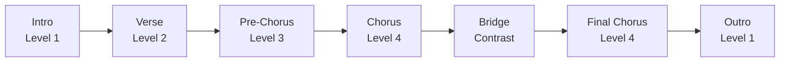
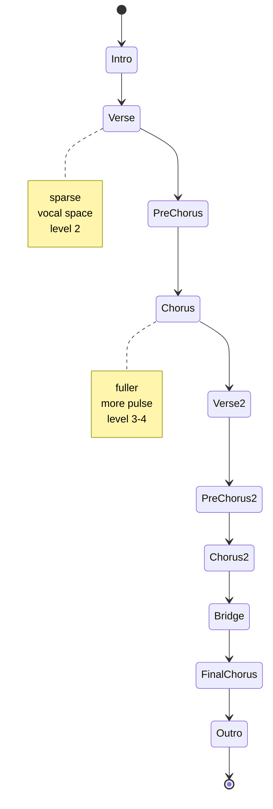
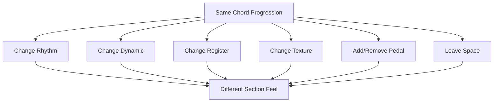
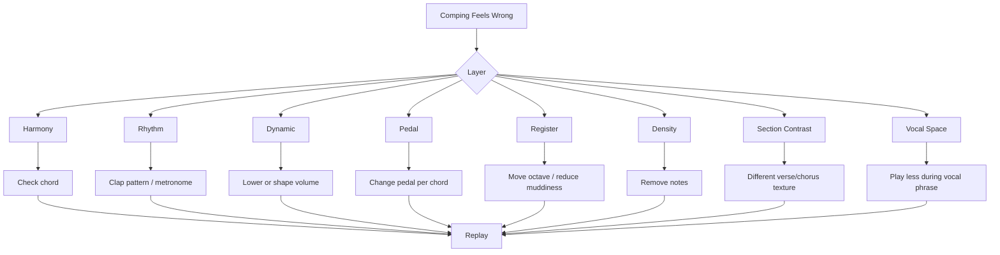
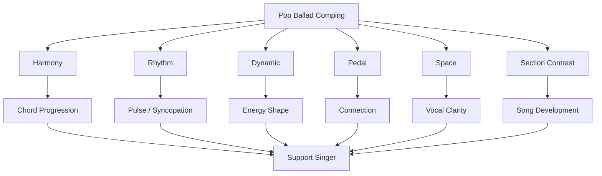

# learn-piano-accompaniment-part-010.md

# Part 010 — Pattern 3: Pop Ballad Comping

> Seri: **Learn Piano Accompaniment for Singer Performance**  
> Fokus: **belajar piano untuk mengiringi penyanyi**  
> Framework utama: **The First 20 Hours — Josh Kaufman**  
> Tahap: **Phase C — Iringan Paling Minimal yang Bisa Dipakai Tampil**

---

## Status Seri

| Item | Status |
|---|---|
| Part | 010 |
| Nama file | `learn-piano-accompaniment-part-010.md` |
| Fokus | Pop ballad comping untuk mengiringi penyanyi |
| Prasyarat | Part 000–009 |
| Output praktis | Bisa memainkan pola iringan pop ballad dasar dengan verse/chorus contrast |
| Status seri | Belum selesai |

---

## Daftar Isi

- [1. Tujuan Part Ini](#1-tujuan-part-ini)
- [2. Posisi Part Ini dalam Framework Kaufman](#2-posisi-part-ini-dalam-framework-kaufman)
- [3. Apa Itu Comping?](#3-apa-itu-comping)
- [4. Pop Ballad Comping dalam Konteks Mengiringi Penyanyi](#4-pop-ballad-comping-dalam-konteks-mengiringi-penyanyi)
- [5. Mental Model: Comping sebagai Support Layer](#5-mental-model-comping-sebagai-support-layer)
- [6. Perbedaan Block Chord, Broken Chord, dan Comping](#6-perbedaan-block-chord-broken-chord-dan-comping)
- [7. Komponen Pop Ballad Comping](#7-komponen-pop-ballad-comping)
- [8. Prinsip Utama: Jangan Mengisi Semua Ruang](#8-prinsip-utama-jangan-mengisi-semua-ruang)
- [9. Pattern A: Bass on 1 + Chord on 1 and 3](#9-pattern-a-bass-on-1--chord-on-1-and-3)
- [10. Pattern B: Bass on 1 + Chord Push on 2&](#10-pattern-b-bass-on-1--chord-push-on-2)
- [11. Pattern C: Ballad Pulse 1–2&–3–4&](#11-pattern-c-ballad-pulse-1234)
- [12. Pattern D: Verse Sparse Comping](#12-pattern-d-verse-sparse-comping)
- [13. Pattern E: Chorus Fuller Comping](#13-pattern-e-chorus-fuller-comping)
- [14. Pattern F: Build-Up Menuju Chorus](#14-pattern-f-build-up-menuju-chorus)
- [15. Tangan Kiri dalam Pop Ballad](#15-tangan-kiri-dalam-pop-ballad)
- [16. Tangan Kanan dalam Pop Ballad](#16-tangan-kanan-dalam-pop-ballad)
- [17. Syncopation Ringan](#17-syncopation-ringan)
- [18. Dynamic Ramp](#18-dynamic-ramp)
- [19. Pedal dalam Pop Ballad Comping](#19-pedal-dalam-pop-ballad-comping)
- [20. Register dan Voicing Sementara](#20-register-dan-voicing-sementara)
- [21. Verse, Pre-Chorus, Chorus: Energy Map](#21-verse-pre-chorus-chorus-energy-map)
- [22. Intro Sederhana dengan Pop Ballad Pattern](#22-intro-sederhana-dengan-pop-ballad-pattern)
- [23. Fill Pendek antar Frase](#23-fill-pendek-antar-frase)
- [24. Cara Tidak Terdengar Monoton](#24-cara-tidak-terdengar-monoton)
- [25. Latihan 1: Satu Chord dengan Comping](#25-latihan-1-satu-chord-dengan-comping)
- [26. Latihan 2: Progression C–G–Am–F](#26-latihan-2-progression-cgamf)
- [27. Latihan 3: Verse ke Chorus](#27-latihan-3-verse-ke-chorus)
- [28. Latihan 4: Build-Up 4 Bar](#28-latihan-4-build-up-4-bar)
- [29. Latihan 5: Comping dengan Vokal](#29-latihan-5-comping-dengan-vokal)
- [30. Latihan 6: Membuat Mini Arrangement](#30-latihan-6-membuat-mini-arrangement)
- [31. Debugging Pop Ballad Comping](#31-debugging-pop-ballad-comping)
- [32. Failure Mode Pemula](#32-failure-mode-pemula)
- [33. Practice Protocol 45 Menit](#33-practice-protocol-45-menit)
- [34. Checklist Kelulusan Part 010](#34-checklist-kelulusan-part-010)
- [35. Ringkasan Mental Model](#35-ringkasan-mental-model)
- [36. Persiapan ke Part 011](#36-persiapan-ke-part-011)

---

# 1. Tujuan Part Ini

Pada Part 007, kita belajar:

```text
LH root + RH block chord
```

Pada Part 008, kita belajar:

```text
rhythm first
```

Pada Part 009, kita belajar:

```text
broken chord / arpeggio dasar
```

Part ini menggabungkan ketiganya menjadi sesuatu yang lebih dekat ke permainan nyata:

```text
pop ballad comping
```

Target part ini:

> Anda mampu memainkan pola iringan pop ballad sederhana untuk mengiringi penyanyi, membedakan energi verse dan chorus, memakai syncopation ringan, mengontrol pedal, dan menjaga vokal tetap menjadi pusat.

Di akhir part ini, Anda tidak hanya memainkan:

```text
C - G - Am - F
```

sebagai chord statis. Anda mulai bisa membentuknya menjadi iringan seperti:

```text
Verse  : sparse, soft, breathable
Chorus : fuller, wider, more driving
Bridge : contrast / build-up
```

Dengan kata lain, kita mulai berpindah dari:

```text
memainkan chord
```

ke:

```text
mengiringi lagu
```

---

# 2. Posisi Part Ini dalam Framework Kaufman

Dalam *The First 20 Hours*, tujuan awal bukan menguasai semua detail, tetapi mencapai performa fungsional secepat mungkin dengan latihan terarah.

Pop ballad comping adalah sub-skill yang sangat berguna karena:

- banyak lagu populer memakai feel ballad;
- cocok untuk mengiringi satu penyanyi;
- bisa dimainkan hanya dengan chord dasar;
- terdengar lebih musikal daripada block chord polos;
- bisa dilatih dalam waktu singkat;
- langsung berguna untuk performa.

Diagram posisi part ini:



Secara Kaufman-style, kita mengambil beberapa sub-skill kecil:

```text
root
chord
rhythm
pedal
dynamic
space
```

lalu menggabungkannya menjadi unit performa sederhana.

---

# 3. Apa Itu Comping?

Comping berasal dari kata “accompanying” atau “complementing”.

Dalam konteks praktis, comping berarti:

```text
memainkan chord, rhythm, dan texture untuk mendukung bagian utama musik
```

Bagian utama bisa:

- vokal;
- melodi instrument;
- solo;
- ensemble.

Dalam seri ini, fokusnya:

```text
comping untuk mendukung penyanyi
```

Jadi comping bukan sekadar memainkan chord. Comping adalah keputusan real-time tentang:

- kapan memainkan chord;
- seberapa keras;
- seberapa penuh;
- di register mana;
- apakah harus diam;
- apakah harus memberi cue;
- apakah harus mengisi ruang;
- apakah harus mengikuti napas vokal.

## 3.1 Comping Bukan Solo

Pemain piano pemula sering ingin membuat iringan terdengar “keren” dengan banyak nada.

Namun dalam accompaniment, pertanyaan utamanya bukan:

```text
apakah piano terdengar hebat?
```

Melainkan:

```text
apakah penyanyi terdengar lebih baik karena piano?
```

Jika jawaban tidak, comping belum berhasil.

---

# 4. Pop Ballad Comping dalam Konteks Mengiringi Penyanyi

Pop ballad biasanya memiliki karakter:

- tempo lambat sampai sedang;
- lirik emosional;
- vokal sebagai pusat;
- chord progression relatif sederhana;
- dynamic berkembang dari kecil ke besar;
- piano sering menjadi fondasi utama;
- sustain pedal berperan penting;
- ruang antar frase sangat penting.

Dalam pop ballad, piano sering melakukan tiga hal:

```text
1. menjaga harmoni
2. menjaga pulse halus
3. membangun emosi
```

## 4.1 Kualitas yang Dicari

Pop ballad comping yang baik terasa:

- lembut;
- stabil;
- bernapas;
- emosional;
- tidak terlalu ramai;
- mendukung lirik;
- berkembang saat chorus;
- memberi ruang saat verse;
- tidak menutup vokal.

## 4.2 Kualitas yang Dihindari

Pop ballad comping yang buruk sering terdengar:

- terlalu mekanis;
- terlalu keras;
- terlalu banyak nada;
- pedal keruh;
- beat tidak jelas;
- chord pindah terlambat;
- semua section sama intensitasnya;
- piano seperti bersaing dengan vokal.

---

# 5. Mental Model: Comping sebagai Support Layer

Bayangkan lagu sebagai sistem berlapis.



Vokal adalah foreground.

Piano adalah support layer.

Support layer yang baik:

- memberi konteks;
- tidak mencuri fokus;
- stabil;
- adaptif;
- memperkuat emosi utama.

Dalam software analogy:

```text
vocal = main process
piano = supporting service
song form = orchestration
rhythm = scheduler
dynamic = resource allocation
space = backpressure
```

Jika support service terlalu agresif, main process terganggu.

---

# 6. Perbedaan Block Chord, Broken Chord, dan Comping

## 6.1 Block Chord

```text
C-E-G dimainkan bersamaan
```

Fungsi:

- memberi chord jelas;
- cocok untuk cue;
- cocok untuk chorus sederhana;
- bisa kaku jika dipakai terus.

## 6.2 Broken Chord

```text
C-G-E-G dimainkan berurutan
```

Fungsi:

- memberi aliran;
- cocok untuk ballad;
- mengisi ruang;
- bisa terlalu ramai jika tidak dikontrol.

## 6.3 Comping

Comping bisa memakai block chord, broken chord, rhythm, syncopation, pause, dan dynamic.

Contoh comping:

```text
Beat 1: LH root + RH chord
Beat 2&: RH chord ringan
Beat 3: LH root atau RH chord
Beat 4&: RH chord sebagai pickup
```

Comping bukan satu pattern tetap. Comping adalah framework keputusan.

Diagram:



---

# 7. Komponen Pop Ballad Comping

Pop ballad comping memiliki beberapa komponen:

| Komponen | Fungsi |
|---|---|
| Bass/root | Memberi fondasi |
| Chord pulse | Memberi rhythm dan harmony |
| Broken chord | Memberi flow |
| Syncopation | Memberi gerak pop |
| Pedal | Menghubungkan nada |
| Dynamic | Membentuk emosi |
| Register | Menjaga kejernihan |
| Space | Memberi ruang vokal |
| Section contrast | Membuat lagu berkembang |

Tidak semua komponen harus aktif setiap saat.

Tugas pengiring adalah memilih komponen secukupnya.

---

# 8. Prinsip Utama: Jangan Mengisi Semua Ruang

Pop ballad sering terasa kuat justru karena ada ruang.

Ruang membuat:

- lirik terdengar;
- napas vokal terasa;
- emosi masuk;
- chorus terasa lebih besar;
- pendengar tidak lelah.

## 8.1 Ruang Bukan Kekosongan

Diam bukan berarti tidak bermain musik.

Dalam accompaniment, diam bisa berarti:

```text
memberi tempat untuk vokal
```

atau:

```text
menahan energi sebelum chorus
```

## 8.2 Aturan Praktis

Jika penyanyi sedang menyanyikan frase penting:

```text
main lebih sederhana
```

Jika penyanyi berhenti atau mengambil napas:

```text
boleh isi sedikit
```

Jika lagu menuju chorus:

```text
bangun energi bertahap
```

Jika chorus sudah besar:

```text
jaga stabil, jangan tambah terus-menerus
```

---

# 9. Pattern A: Bass on 1 + Chord on 1 and 3

Ini pattern paling aman untuk pop ballad awal.

Hitungan 4/4:

```text
1 2 3 4
```

Pattern:

```text
1: LH root + RH chord
3: RH chord ringan
```

Ditulis:

```text
1 2 3 4
X - x -
```

`X` = lebih jelas  
`x` = lebih lembut

## 9.1 Contoh Chord C

```text
Beat 1:
LH C + RH C-E-G

Beat 3:
RH C-E-G
```

## 9.2 Progression C–G–Am–F

```text
| C       | G       | Am      | F       |
  X - x -   X - x -   X - x -   X - x -
```

## 9.3 Cocok Untuk

- verse;
- intro sederhana;
- chorus ringan;
- latihan awal comping;
- mengiringi penyanyi yang butuh pulse jelas.

## 9.4 Kelemahan

Jika dipakai sepanjang lagu tanpa variasi, bisa monoton.

Namun sebagai baseline, pattern ini sangat aman.

---

# 10. Pattern B: Bass on 1 + Chord Push on 2&

Pattern ini mulai memberi rasa pop.

Hitungan eighth note:

```text
1 & 2 & 3 & 4 &
```

Pattern:

```text
1: LH root + RH chord
2&: RH chord ringan
3: RH chord atau hold
```

Ditulis:

```text
1 & 2 & 3 & 4 &
X - - x X - - -
```

Atau versi lebih sederhana:

```text
1 & 2 & 3 & 4 &
X - - x - - - -
```

## 10.1 Apa Itu Push?

Push adalah chord yang dimainkan sedikit sebelum beat yang terasa kuat.

Misalnya `2&` menuju beat 3.

Ini memberi rasa:

```text
bergerak ke depan
```

## 10.2 Contoh Chord C

```text
1  &: LH C + RH C-E-G
2& : RH C-E-G ringan
3  : tahan atau RH chord ringan
```

## 10.3 Cocok Untuk

- pre-chorus;
- chorus pop ballad;
- bagian yang butuh lift;
- transisi menuju section baru.

## 10.4 Risiko

Jika internal rhythm belum stabil, push bisa membuat tempo lari.

Latih clap dulu sebelum piano.

---

# 11. Pattern C: Ballad Pulse 1–2&–3–4&

Pattern:

```text
1 & 2 & 3 & 4 &
X - - x X - - x
```

Main di:

```text
1
2&
3
4&
```

Ini memberi flow pop ballad yang cukup umum.

## 11.1 Contoh

Chord C:

```text
1  : LH C + RH C-E-G
2& : RH C-E-G lembut
3  : RH C-E-G medium
4& : RH C-E-G lembut/pickup
```

## 11.2 Rasa

Pattern ini terasa:

- lebih mengalir;
- lebih pop;
- tidak terlalu kotak;
- cukup penuh untuk chorus;
- masih manageable untuk pemula.

## 11.3 Ditulis per Bar

```text
Count : 1 & 2 & 3 & 4 &
Play  : X - - x X - - x
```

## 11.4 Gunakan Dynamic

Jangan semua pukulan sama keras.

Gunakan:

```text
1  = medium/strong
2& = soft
3  = medium
4& = soft
```

## 11.5 Jangan Dipakai Terlalu Cepat

Jika tempo lagu cepat, pattern ini bisa terasa terlalu ramai.

Gunakan untuk tempo lambat-sedang.

---

# 12. Pattern D: Verse Sparse Comping

Verse sering membutuhkan ruang.

Pattern sparse:

```text
1 & 2 & 3 & 4 &
X - - - - - x -
```

Main di:

```text
1
4
```

Atau:

```text
1 & 2 & 3 & 4 &
X - - - X - - -
```

Main di:

```text
1
3
```

## 12.1 Verse Pattern 1

```text
1 2 3 4
X - - x
```

Beat 4 chord ringan seperti napas menuju bar berikutnya.

## 12.2 Verse Pattern 2

```text
1 2 3 4
X - X -
```

Lebih stabil, cocok jika penyanyi butuh pulse.

## 12.3 Prinsip Verse

Verse adalah narasi.

Piano sebaiknya:

- ringan;
- lebih rendah dynamic;
- tidak terlalu banyak syncopation;
- tidak banyak fill;
- menjaga chord jelas.

---

# 13. Pattern E: Chorus Fuller Comping

Chorus butuh energi lebih besar.

Pattern chorus bisa:

```text
1 & 2 & 3 & 4 &
X - x - X - x -
```

Main di:

```text
1
2
3
4
```

tetapi dengan beat 2 dan 4 lebih ringan.

Atau pattern pop:

```text
1 & 2 & 3 & 4 &
X - - x X - - x
```

## 13.1 Chorus Tidak Harus Keras

Chorus bisa lebih besar karena:

- chord lebih sering;
- register lebih luas;
- LH lebih jelas;
- RH lebih penuh;
- dynamic sedikit naik;
- pedal lebih connect;
- rhythm lebih aktif.

## 13.2 Progression C–G–Am–F

```text
| C       | G       | Am      | F       |
  X - x -   X - x -   X - x -   X - x -
```

atau:

```text
| C       | G       | Am      | F       |
  X - - x   X - - x   X - - x   X - - x
```

## 13.3 Hindari Overplaying

Jika chorus sudah dinyanyikan kuat, piano tidak perlu mengisi semua celah.

Tugas piano:

```text
support the lift, not compete with the vocal
```

---

# 14. Pattern F: Build-Up Menuju Chorus

Build-up biasanya terjadi di pre-chorus atau bar terakhir verse.

Tujuannya:

```text
meningkatkan energi tanpa langsung meledak
```

## 14.1 Build-Up 4 Bar

Misalnya progression:

```text
Am - F - C - G
```

Dynamic dan density:

```text
Bar 1: whole note
Bar 2: half note
Bar 3: half note + push
Bar 4: quarter pulse / stronger push
```

Ditulis:

```text
Bar 1: X - - -
Bar 2: X - X -
Bar 3: X - - x
Bar 4: X x X x
```

## 14.2 Diagram Energy Ramp



## 14.3 Jangan Naik Tempo

Build-up sering membuat pemula mempercepat.

Energi naik tidak sama dengan tempo naik.

Naikkan:

- dynamic;
- density;
- register;
- chord frequency;
- pedal intensity.

Jangan menaikkan BPM tanpa sengaja.

---

# 15. Tangan Kiri dalam Pop Ballad

Tangan kiri adalah fondasi.

Untuk tahap ini, gunakan tiga opsi.

## 15.1 Opsi 1: Root Only

```text
Beat 1: root
```

Contoh C:

```text
LH C
```

Aman untuk awal.

## 15.2 Opsi 2: Root + Octave

```text
C + C
```

Lebih besar, tetapi lebih sulit.

Gunakan jika:

- tangan nyaman;
- tempo lambat;
- tidak terlalu keras;
- register tidak muddy.

## 15.3 Opsi 3: Root + Fifth

```text
C + G
```

Memberi rasa lebih penuh.

Namun hati-hati:

- bisa terlalu berat;
- bisa muddy jika terlalu rendah;
- bisa mengganggu jika pedal banyak.

## 15.4 Aturan Awal

Untuk 20 jam pertama:

```text
root only is enough
```

Gunakan octave/fifth hanya setelah root stabil.

---

# 16. Tangan Kanan dalam Pop Ballad

Tangan kanan memainkan chord pulse, broken chord, atau kombinasi.

## 16.1 RH Block Chord

```text
C-E-G
```

Cocok untuk:

- cue;
- chorus;
- chord hit;
- section transition.

## 16.2 RH Broken Chord

```text
E-G-E-G
```

Cocok untuk:

- verse;
- lagu lembut;
- bagian yang butuh flow.

## 16.3 RH Partial Chord

Kadang RH tidak perlu memainkan semua nada.

Contoh C:

```text
E-G
```

Jika LH sudah memainkan C, RH cukup memainkan E dan G.

Ini mengurangi density.

## 16.4 Sementara Belum Voicing Advanced

Kita belum masuk inversion/voice leading detail.

Namun mulai biasakan:

```text
RH tidak harus selalu memainkan chord besar
```

Jika suara terlalu padat, kurangi nada.

---

# 17. Syncopation Ringan

Syncopation berarti accent atau chord terjadi di tempat yang tidak sepenuhnya “lurus”.

Untuk pemula, gunakan syncopation ringan:

```text
2&
4&
```

## 17.1 Count

```text
1 & 2 & 3 & 4 &
```

Main di:

```text
1
2&
3
4&
```

Pattern:

```text
X - - x X - - x
```

## 17.2 Clap Dulu

Sebelum piano, clap:

```text
1 & 2 & 3 & 4 &
X - - x X - - x
```

Jika clap belum stabil, jangan main piano dulu.

## 17.3 Fungsi

Syncopation ringan membuat iringan:

- tidak terlalu kotak;
- terasa pop;
- punya forward motion;
- lebih natural untuk chorus.

## 17.4 Risiko

Syncopation bisa membuat:

- tempo lari;
- chord change kacau;
- penyanyi bingung;
- beat 1 hilang.

Solusi:

```text
beat 1 harus tetap jelas
```

---

# 18. Dynamic Ramp

Dynamic ramp adalah peningkatan intensitas bertahap.

Dalam pop ballad, dynamic ramp sangat penting.

## 18.1 Level Dynamic

Gunakan skala:

| Level | Rasa |
|---:|---|
| 1 | sangat lembut |
| 2 | verse lembut |
| 3 | chorus sedang |
| 4 | chorus kuat |
| 5 | klimaks besar |

Untuk 20 jam pertama, cukup gunakan level 1–4.

## 18.2 Contoh Dynamic Map

```text
Intro       level 1
Verse 1     level 2
Pre-Chorus  level 2.5–3
Chorus      level 3–4
Verse 2     level 2.5
Bridge      level 1.5 atau build ke 4
Final Chorus level 4
Outro       level 1
```

## 18.3 Dynamic Tidak Sama dengan Tempo

Jangan mempercepat untuk membuat chorus terasa besar.

Gunakan:

- volume;
- density;
- register;
- chord pulse;
- pedal;
- LH emphasis.

## 18.4 Diagram



---

# 19. Pedal dalam Pop Ballad Comping

Pedal sangat penting untuk ballad.

Namun pedal yang buruk langsung membuat permainan terdengar amatir.

## 19.1 Aturan Dasar

```text
ganti pedal setiap chord berubah
```

Contoh:

```text
C - G - Am - F
```

Pedal harus berubah di setiap chord.

## 19.2 Pedal dan Rhythm

Jika pattern Anda punya banyak chord pulse, jangan pedal terlalu tebal.

Pedal harus menyambung, bukan mengaburkan.

## 19.3 Pedal Timing

Prinsip sederhana:

```text
tekan chord baru
angkat pedal cepat
tekan pedal lagi
```

Ini mencegah chord lama bercampur dengan chord baru.

## 19.4 Latihan Tanpa Pedal

Jika pedal mengganggu timing, latihan tanpa pedal dulu.

Urutan prioritas:

```text
timing
chord
dynamic
pedal
```

Pedal tidak boleh menyelamatkan permainan yang belum stabil.

## 19.5 Common Pedal Bug

| Gejala | Penyebab | Solusi |
|---|---|---|
| Suara keruh | pedal ditahan terus | ganti pedal per chord |
| Beat 1 tidak jelas | pedal terlalu tebal | kurangi pedal |
| Bass muddy | LH terlalu rendah + pedal | naikkan LH |
| Rhythm hilang | sustain terlalu panjang | pedal lebih pendek |
| Tangan-pedal tidak sinkron | koordinasi belum stabil | latihan tanpa pedal |

---

# 20. Register dan Voicing Sementara

Walau voicing detail baru dibahas di Part 012–015, kita butuh aturan sementara.

## 20.1 Register Aman

```text
LH: rendah-tengah
RH: tengah
```

Hindari:

```text
LH terlalu rendah
RH terlalu padat di register vokal
```

## 20.2 Jangan Semua Chord Root Position Terlalu Jauh

Root position boleh untuk awal, tetapi kadang terasa melompat.

Contoh:

```text
C-E-G -> G-B-D
```

Jaraknya cukup jauh.

Jika sulit, boleh gunakan chord yang lebih dekat secara praktis, tetapi detail inversion akan dibahas nanti.

Untuk sekarang, jika root position terlalu jauh:

```text
perlambat
latih transition
atau gunakan partial chord
```

## 20.3 Partial Chord Aman

Jika LH memainkan root, RH bisa memainkan dua nada:

| Chord | LH | RH partial |
|---|---|---|
| C | C | E G |
| G | G | B D |
| Am | A | C E |
| F | F | A C |

Ini sering lebih ringan untuk accompaniment.

## 20.4 Prinsip

```text
Semakin aktif rhythm, semakin hati-hati density chord.
```

Jika tangan kanan sering memukul chord, jangan selalu pakai chord terlalu tebal.

---

# 21. Verse, Pre-Chorus, Chorus: Energy Map

Pop ballad biasanya berkembang.

Bukan semua section dimainkan sama.

## 21.1 Verse

Fungsi:

```text
narasi
```

Piano:

- sparse;
- lembut;
- banyak ruang;
- chord jelas;
- sedikit broken chord;
- dynamic level 1–2.

## 21.2 Pre-Chorus

Fungsi:

```text
membangun tension
```

Piano:

- mulai tambah pulse;
- dynamic naik;
- bisa pakai push;
- LH lebih jelas;
- bar terakhir menuju chorus lebih kuat.

## 21.3 Chorus

Fungsi:

```text
release / statement utama
```

Piano:

- lebih penuh;
- rhythm lebih aktif;
- dynamic level 3–4;
- chord lebih jelas;
- tetap tidak menutup vokal.

## 21.4 State Machine Section



---

# 22. Intro Sederhana dengan Pop Ballad Pattern

Intro harus memberi tiga informasi kepada penyanyi:

```text
key
tempo
mood
```

Untuk pemula, intro tidak perlu rumit.

## 22.1 Intro 4 Bar dari Progression

Gunakan progression chorus:

```text
C - G - Am - F
```

Pattern:

```text
X - x -
```

atau broken chord:

```text
1 - 5 - 3 - 5
```

## 22.2 Intro 2 Bar

Jika ingin lebih singkat:

```text
| C | G |
```

atau:

```text
| C | F |
```

Namun pastikan penyanyi tahu kapan masuk.

## 22.3 Cue Masuk Vokal

Bar terakhir intro harus memberi sinyal.

Contoh:

```text
Bar 4 F:
main lebih ringan di akhir
angkat sedikit energi
beri ruang sebelum vokal masuk
```

## 22.4 Hindari Intro yang Membingungkan

Intro buruk biasanya:

- tempo tidak jelas;
- chord terlalu bebas;
- beat 1 tidak jelas;
- terlalu banyak fill;
- penyanyi tidak tahu kapan masuk.

Untuk 20 jam pertama, gunakan intro sederhana dan stabil.

---

# 23. Fill Pendek antar Frase

Fill adalah isian pendek saat vokal berhenti.

Namun di tahap ini, fill harus sangat sederhana.

## 23.1 Prinsip Fill

```text
fill hanya boleh muncul ketika ada ruang
```

Ruang biasanya saat:

- akhir frase vokal;
- penyanyi mengambil napas;
- transisi section;
- sebelum chorus;
- menuju outro.

## 23.2 Fill Sederhana dari Chord Tone

Jika chord C:

```text
C E G
```

Fill pendek:

```text
E - G
```

atau:

```text
G - E
```

Jika chord Am:

```text
A C E
```

Fill:

```text
C - E
```

## 23.3 Jangan Buat Melodi Baru yang Dominan

Fill bukan solo.

Fill harus seperti:

```text
jawaban kecil
```

bukan:

```text
piano mengambil alih lagu
```

## 23.4 Aturan 20 Jam Pertama

Gunakan fill maksimal:

```text
1–3 nada
```

Dan hanya saat vokal diam.

---

# 24. Cara Tidak Terdengar Monoton

Pop ballad sering memakai chord progression yang berulang.

Agar tidak monoton, ubah parameter berikut.

## 24.1 Ubah Density

Verse:

```text
X - - -
```

Chorus:

```text
X - x -
```

Final chorus:

```text
X - - x X - - x
```

## 24.2 Ubah Dynamic

Verse level 2.

Chorus level 3.

Final chorus level 4.

## 24.3 Ubah Register

Chorus bisa sedikit lebih tinggi atau lebih lebar.

Jangan ekstrem.

## 24.4 Ubah Texture

Verse:

```text
broken chord
```

Chorus:

```text
block chord pulse
```

Atau sebaliknya.

## 24.5 Ubah Pedal

Verse lebih connected.

Chorus lebih rhythmic/clear.

## 24.6 Sisakan Ruang

Kadang variasi terbaik adalah tidak memainkan apa-apa selama setengah bar.

## 24.7 Diagram Variasi



---

# 25. Latihan 1: Satu Chord dengan Comping

Tujuan:

> melatih pattern tanpa beban pindah chord.

Gunakan chord:

```text
C
```

## 25.1 Pattern A

```text
1 2 3 4
X - x -
```

Mainkan:

```text
Beat 1: LH C + RH C-E-G
Beat 3: RH C-E-G lembut
```

## 25.2 Pattern B

```text
1 & 2 & 3 & 4 &
X - - x X - - -
```

Main di:

```text
1
2&
3
```

## 25.3 Pattern C

```text
1 & 2 & 3 & 4 &
X - - x X - - x
```

Main di:

```text
1
2&
3
4&
```

## 25.4 Checklist

- [ ] beat 1 jelas;
- [ ] dynamic tidak rata;
- [ ] tempo tidak lari;
- [ ] tangan rileks;
- [ ] pattern stabil selama 2 menit.

---

# 26. Latihan 2: Progression C–G–Am–F

Gunakan progression:

```text
C - G - Am - F
```

## 26.1 Level 1: Pattern A

```text
| C       | G       | Am      | F       |
  X - x -   X - x -   X - x -   X - x -
```

Mainkan 3 menit.

## 26.2 Level 2: Pattern B

```text
1 & 2 & 3 & 4 &
X - - x X - - -
```

Terapkan ke setiap chord.

## 26.3 Level 3: Pattern C

```text
1 & 2 & 3 & 4 &
X - - x X - - x
```

Gunakan hanya jika Level 2 stabil.

## 26.4 Evaluasi

Tanya:

- chord change tepat di beat 1?
- syncopation stabil?
- dynamic terkendali?
- beat 1 tetap jelas?
- pattern tidak menutup vokal?

---

# 27. Latihan 3: Verse ke Chorus

Buat mini structure.

## 27.1 Verse

Progression:

```text
Am - F - C - G
```

Pattern:

```text
X - - -
```

atau:

```text
broken chord 1-5-3-5
```

Dynamic:

```text
level 2
```

## 27.2 Chorus

Progression:

```text
C - G - Am - F
```

Pattern:

```text
X - x -
```

atau:

```text
X - - x X - - x
```

Dynamic:

```text
level 3
```

## 27.3 Format

```text
Verse  x2
Chorus x2
```

## 27.4 Target

- verse terasa lebih kecil;
- chorus terasa lebih besar;
- tempo tetap sama;
- chord change bersih;
- tidak ada panic transition.

---

# 28. Latihan 4: Build-Up 4 Bar

Progression:

```text
Am - F - C - G
```

Gunakan build-up:

```text
Bar 1 Am: X - - -
Bar 2 F : X - x -
Bar 3 C : X - - x
Bar 4 G : X x X x
```

## 28.1 Dynamic

```text
Am: level 2
F : level 2.5
C : level 3
G : level 3.5
```

Lalu masuk chorus:

```text
C - G - Am - F
```

level 4.

## 28.2 Tujuan

Melatih naik energi tanpa menaikkan tempo.

## 28.3 Debug

Jika tempo naik saat build-up:

- kurangi dynamic;
- pakai metronome;
- main pattern lebih sederhana;
- jangan pakai syncopation dulu.

---

# 29. Latihan 5: Comping dengan Vokal

Gunakan kalimat sederhana:

```text
Aku masih menunggu di sini
```

Atau gunakan lagu sederhana yang Anda tahu chord-nya.

## 29.1 Pattern

Verse:

```text
X - - -
```

Chorus:

```text
X - x -
```

## 29.2 Aturan

- vokal harus terdengar lebih utama;
- piano jangan terlalu keras;
- jika vokal padat, kurangi chord pulse;
- jika vokal berhenti, boleh isi sedikit;
- jangan kehilangan tempo saat bernyanyi/humming.

## 29.3 Evaluasi Rekaman

Dengarkan:

- apakah vokal punya ruang?
- apakah piano menutup kata?
- apakah beat 1 jelas?
- apakah chorus terasa naik?
- apakah ada bagian terlalu ramai?
- apakah ada bagian terlalu kosong?

---

# 30. Latihan 6: Membuat Mini Arrangement

Buat mini arrangement 1 menit.

Gunakan progression:

```text
Verse:
Am - F - C - G

Chorus:
C - G - Am - F
```

## 30.1 Struktur

```text
Intro  : C - G - Am - F
Verse  : Am - F - C - G
Chorus : C - G - Am - F
Outro  : F - G - C
```

## 30.2 Pattern

Intro:

```text
broken chord lembut
```

Verse:

```text
sparse comping
```

Chorus:

```text
fuller comping
```

Outro:

```text
slow block chord
```

## 30.3 Dynamic

```text
Intro  level 1
Verse  level 2
Chorus level 3
Outro  level 1
```

## 30.4 Output

Rekam 1 menit.

Tujuan bukan sempurna.

Tujuannya agar Anda mulai berpikir seperti arranger/pengiring:

```text
section
energy
space
transition
support
```

---

# 31. Debugging Pop Ballad Comping

Jika comping terdengar buruk, debug layer.



## 31.1 Harmony Bug

Gejala:

```text
chord terasa salah
```

Solusi:

- kembali ke block chord;
- cek chord symbol;
- main root only;
- baru kembali ke comping.

## 31.2 Rhythm Bug

Gejala:

```text
pattern tidak stabil
```

Solusi:

- clap dulu;
- metronome;
- gunakan pattern lebih sederhana;
- hilangkan syncopation.

## 31.3 Dynamic Bug

Gejala:

```text
piano menutup vokal
```

Solusi:

- main lebih lembut;
- kurangi density;
- gunakan partial chord;
- jangan semua beat sama keras.

## 31.4 Pedal Bug

Gejala:

```text
suara keruh
```

Solusi:

- ganti pedal per chord;
- kurangi bass;
- latihan tanpa pedal.

## 31.5 Register Bug

Gejala:

```text
terlalu muddy atau terlalu menusuk
```

Solusi:

- LH jangan terlalu rendah;
- RH jangan terlalu keras di register vokal;
- gunakan partial chord.

## 31.6 Section Contrast Bug

Gejala:

```text
verse dan chorus terasa sama
```

Solusi:

- verse sparse;
- chorus fuller;
- dynamic ramp;
- tambah density hanya di chorus.

---

# 32. Failure Mode Pemula

## 32.1 Semua Section Sama

Pemula sering memainkan intro, verse, chorus, bridge dengan pattern dan volume sama.

Akibatnya lagu tidak berkembang.

Solusi:

```text
buat energy map sebelum bermain
```

## 32.2 Terlalu Banyak Syncopation

Syncopation membuat iringan terasa pop, tetapi jika berlebihan, penyanyi bisa kehilangan pegangan.

Solusi:

```text
beat 1 harus selalu jelas
```

## 32.3 Chorus Menjadi Terlalu Keras

Chorus lebih besar bukan berarti piano menghantam tuts.

Solusi:

- tambah density sedikit;
- naikkan dynamic sedikit;
- jangan langsung level 5;
- dengarkan vokal.

## 32.4 Pedal Dipakai untuk Menutupi Ketidakstabilan

Pedal bisa membuat permainan terdengar menyambung, tetapi juga bisa menyembunyikan timing buruk.

Solusi:

```text
latihan tanpa pedal dulu
```

## 32.5 Tidak Memberi Ruang untuk Napas Vokal

Piano terus mengisi membuat lagu terasa penuh dan melelahkan.

Solusi:

```text
saat vokal aktif, main lebih sederhana
saat vokal diam, isi sedikit
```

## 32.6 Build-Up dengan Menaikkan Tempo

Ini sangat umum.

Energi naik, tetapi tempo harus tetap.

Solusi:

- metronome;
- count keras;
- naikkan dynamic, bukan BPM;
- gunakan density bertahap.

## 32.7 Terobsesi dengan Pattern

Pattern adalah alat, bukan tujuan.

Jika pattern tidak mendukung vokal, ubah atau kurangi.

---

# 33. Practice Protocol 45 Menit

Gunakan sesi ini untuk Part 010.

## 33.1 Menit 0–5: Count dan Clap

Metronome:

```text
60 BPM
```

Clap:

```text
X - x -
X - - x
X - - x X - - x
```

## 33.2 Menit 5–10: Satu Chord

Chord:

```text
C
```

Latih:

```text
X - x -
X - - x
X - - x X - - x
```

## 33.3 Menit 10–15: Progression Pattern A

Progression:

```text
C - G - Am - F
```

Pattern:

```text
X - x -
```

## 33.4 Menit 15–20: Progression Pattern C

Progression sama:

```text
C - G - Am - F
```

Pattern:

```text
1 & 2 & 3 & 4 &
X - - x X - - x
```

## 33.5 Menit 20–25: Verse Sparse

Progression:

```text
Am - F - C - G
```

Pattern:

```text
X - - -
```

Dynamic:

```text
level 2
```

## 33.6 Menit 25–30: Chorus Fuller

Progression:

```text
C - G - Am - F
```

Pattern:

```text
X - x -
```

Dynamic:

```text
level 3
```

## 33.7 Menit 30–35: Build-Up

Progression:

```text
Am - F - C - G
```

Density ramp:

```text
X - - -
X - x -
X - - x
X x X x
```

## 33.8 Menit 35–40: Mini Arrangement

Struktur:

```text
Intro  4 bar
Verse  8 bar
Chorus 8 bar
Outro  4 bar
```

Gunakan pattern berbeda per section.

## 33.9 Menit 40–45: Record and Review

Rekam 1 menit.

Jawab:

- apakah verse dan chorus berbeda?
- apakah tempo stabil?
- apakah build-up tidak mempercepat?
- apakah pedal bersih?
- apakah piano terlalu ramai?
- apakah vokal punya ruang?
- apakah pattern terdengar musikal atau mekanis?

---

# 34. Checklist Kelulusan Part 010

Anda boleh lanjut ke Part 011 jika sebagian besar checklist ini terpenuhi.

## 34.1 Pemahaman

- [ ] Saya tahu comping berarti mendukung bagian utama, bukan solo.
- [ ] Saya tahu pop ballad comping harus memberi ruang untuk vokal.
- [ ] Saya tahu perbedaan block chord, broken chord, dan comping.
- [ ] Saya tahu verse biasanya lebih sparse.
- [ ] Saya tahu chorus biasanya lebih fuller.
- [ ] Saya tahu dynamic ramp bukan berarti tempo naik.
- [ ] Saya tahu syncopation ringan seperti `2&` dan `4&`.
- [ ] Saya tahu pedal harus menjaga connection tanpa membuat keruh.
- [ ] Saya tahu pattern adalah alat, bukan tujuan.

## 34.2 Praktik

- [ ] Saya bisa memainkan pattern `X - x -`.
- [ ] Saya bisa memainkan pattern `X - - x`.
- [ ] Saya bisa memainkan pattern `X - - x X - - x`.
- [ ] Saya bisa memainkan `C - G - Am - F` dengan pop ballad comping.
- [ ] Saya bisa memainkan verse lebih lembut dari chorus.
- [ ] Saya bisa membuat build-up 4 bar tanpa mempercepat tempo.
- [ ] Saya bisa memainkan intro sederhana 4 bar.
- [ ] Saya bisa menggunakan pedal per chord dengan cukup bersih.
- [ ] Saya bisa mengiringi humming/vokal sederhana tanpa menutup vokal.

## 34.3 Self-Correction

- [ ] Saya bisa mendeteksi jika pattern terlalu ramai.
- [ ] Saya bisa mendeteksi jika syncopation membuat timing goyah.
- [ ] Saya bisa mendeteksi jika piano terlalu keras.
- [ ] Saya bisa mendeteksi jika pedal membuat suara keruh.
- [ ] Saya bisa menyederhanakan pattern saat panik.
- [ ] Saya bisa membedakan bug harmony, rhythm, dynamic, pedal, dan density.
- [ ] Saya bisa membuat verse/chorus contrast secara sengaja.

---

# 35. Ringkasan Mental Model

Pop ballad comping adalah kombinasi dari:

```text
chord
rhythm
dynamic
space
pedal
section energy
```

Ia bukan sekadar pattern tangan.

Ia adalah cara mendukung penyanyi secara musikal.

Prinsip utama:

```text
vokal adalah foreground
piano adalah support
```

Pattern penting:

```text
X - x -
X - - x
X - - x X - - x
```

Energy map dasar:

```text
intro  = small
verse  = sparse
pre    = build
chorus = fuller
outro  = release
```

Diagram akhir:



Kalimat kunci:

```text
Jangan bertanya: seberapa banyak nada yang bisa saya mainkan?
Tanyakan: apa yang dibutuhkan penyanyi dan lagu saat ini?
```

---

# 36. Persiapan ke Part 011

Part berikutnya adalah:

```text
learn-piano-accompaniment-part-011.md
```

Judul:

```text
Pattern 4: 6/8 dan Slow Cinematic Feel
```

Di Part 010, kita belajar pop ballad comping dalam konteks 4/4.

Di Part 011, kita akan masuk ke feel 6/8 yang sangat penting untuk lagu ballad, cinematic, worship, dan slow dramatic accompaniment.

Kita akan membahas:

- feel 6/8;
- count `1-2-3-4-5-6`;
- dua pulse besar `ONE two three FOUR five six`;
- pola bass + broken chord;
- emotional pacing;
- rubato ringan;
- kapan mengikuti penyanyi vs metronome;
- latihan lagu balada;
- cara membuat intro dramatis;
- cara menjaga 6/8 tidak berubah menjadi 3/4;
- cara membangun slow cinematic accompaniment.

Part 011 akan memperluas kemampuan Anda dari pop ballad 4/4 menuju iringan yang lebih mengalun dan dramatis.

---

## Status Akhir Part 010

```text
Part 010 selesai.
Seri belum selesai.
Lanjut ke Part 011.
```
