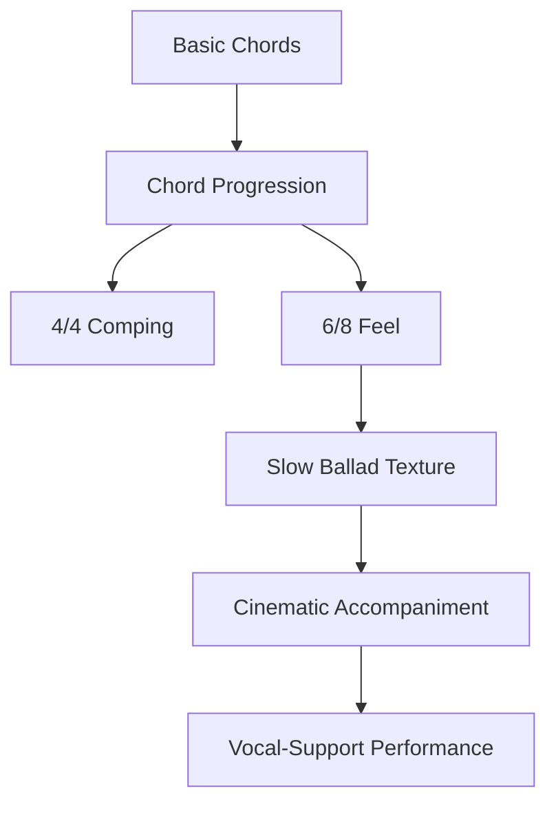
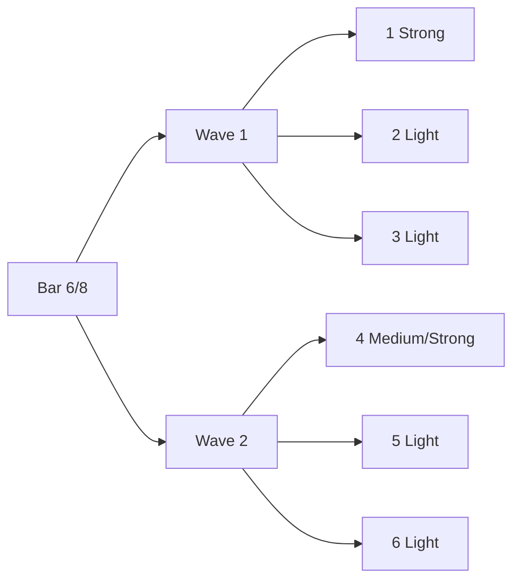
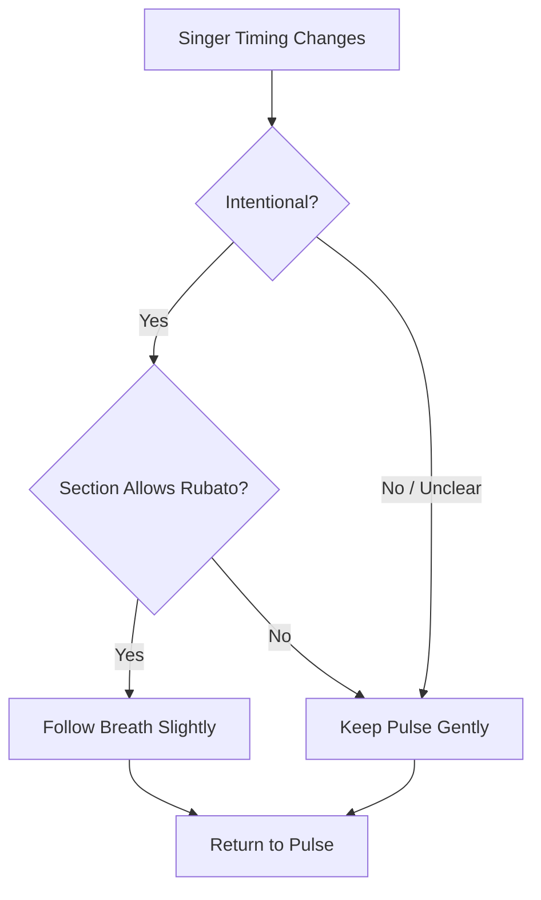
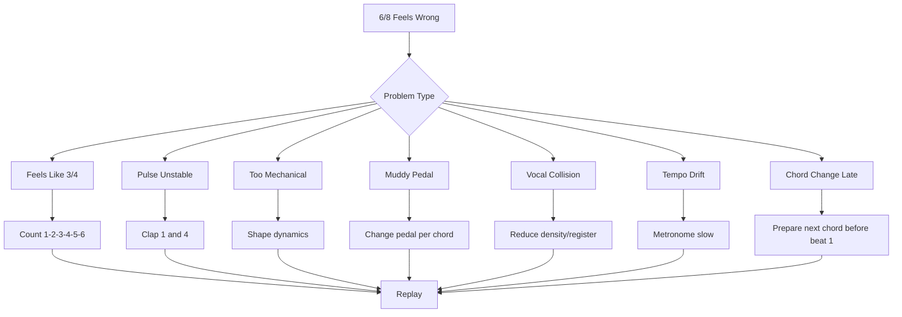
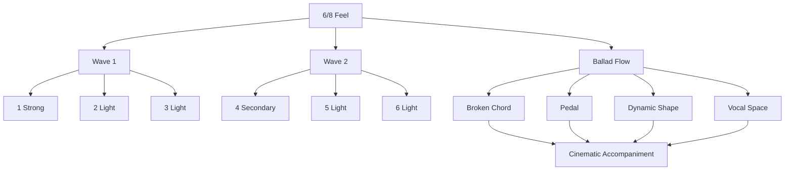

# learn-piano-accompaniment-part-011.md

# Part 011 — Pattern 4: 6/8 dan Slow Cinematic Feel

> Seri: **Learn Piano Accompaniment for Singer Performance**  
> Fokus: **belajar piano untuk mengiringi penyanyi**  
> Framework utama: **The First 20 Hours — Josh Kaufman**  
> Tahap: **Phase C — Iringan Paling Minimal yang Bisa Dipakai Tampil**

---

## Status Seri

| Item | Status |
|---|---|
| Part | 011 |
| Nama file | `learn-piano-accompaniment-part-011.md` |
| Fokus | 6/8 feel, slow ballad, cinematic accompaniment |
| Prasyarat | Part 000–010 |
| Output praktis | Bisa memainkan iringan 6/8 sederhana untuk ballad/lagu dramatis dengan pulse stabil dan ruang vokal |
| Status seri | Belum selesai |

---

## Daftar Isi

- [1. Tujuan Part Ini](#1-tujuan-part-ini)
- [2. Posisi Part Ini dalam Framework Kaufman](#2-posisi-part-ini-dalam-framework-kaufman)
- [3. Kenapa 6/8 Penting untuk Pengiring Piano](#3-kenapa-68-penting-untuk-pengiring-piano)
- [4. Apa Itu 6/8?](#4-apa-itu-68)
- [5. Perbedaan 6/8 dan 3/4](#5-perbedaan-68-dan-34)
- [6. Mental Model: 6/8 sebagai Dua Gelombang Besar](#6-mental-model-68-sebagai-dua-gelombang-besar)
- [7. Count Utama: ONE two three FOUR five six](#7-count-utama-one-two-three-four-five-six)
- [8. Strong Pulse dan Sub-Pulse](#8-strong-pulse-dan-sub-pulse)
- [9. Pattern A: Bass di 1, Chord di 4](#9-pattern-a-bass-di-1-chord-di-4)
- [10. Pattern B: 1–5–3 / 1–5–3](#10-pattern-b-153--153)
- [11. Pattern C: 1–5–8 / 5–3–5](#11-pattern-c-158--535)
- [12. Pattern D: LH Root + RH Rolling Chord](#12-pattern-d-lh-root--rh-rolling-chord)
- [13. Pattern E: Cinematic Open Fifth](#13-pattern-e-cinematic-open-fifth)
- [14. Pattern F: Sparse 6/8 untuk Verse](#14-pattern-f-sparse-68-untuk-verse)
- [15. Pattern G: Fuller 6/8 untuk Chorus](#15-pattern-g-fuller-68-untuk-chorus)
- [16. Progression Latihan 6/8](#16-progression-latihan-68)
- [17. Mengubah 4/4 Progression Menjadi 6/8 Feel](#17-mengubah-44-progression-menjadi-68-feel)
- [18. Pedal dalam 6/8](#18-pedal-dalam-68)
- [19. Dynamic Shape dalam 6/8](#19-dynamic-shape-dalam-68)
- [20. Register untuk Slow Cinematic Feel](#20-register-untuk-slow-cinematic-feel)
- [21. Rubato Ringan](#21-rubato-ringan)
- [22. Mengikuti Penyanyi vs Menjaga Pulse](#22-mengikuti-penyanyi-vs-menjaga-pulse)
- [23. Intro Dramatis 6/8](#23-intro-dramatis-68)
- [24. Build-Up Menuju Chorus dalam 6/8](#24-build-up-menuju-chorus-dalam-68)
- [25. Ending 6/8 yang Bersih](#25-ending-68-yang-bersih)
- [26. Cara Menjaga 6/8 Tidak Berubah Menjadi 3/4](#26-cara-menjaga-68-tidak-berubah-menjadi-34)
- [27. Latihan 1: Count dan Clap 6/8](#27-latihan-1-count-dan-clap-68)
- [28. Latihan 2: Satu Chord 6/8](#28-latihan-2-satu-chord-68)
- [29. Latihan 3: Progression C–G–Am–F dalam 6/8](#29-latihan-3-progression-cgamf-dalam-68)
- [30. Latihan 4: Verse ke Chorus dalam 6/8](#30-latihan-4-verse-ke-chorus-dalam-68)
- [31. Latihan 5: Mengiringi Vokal dengan 6/8](#31-latihan-5-mengiringi-vokal-dengan-68)
- [32. Debugging 6/8](#32-debugging-68)
- [33. Failure Mode Pemula](#33-failure-mode-pemula)
- [34. Practice Protocol 45 Menit](#34-practice-protocol-45-menit)
- [35. Checklist Kelulusan Part 011](#35-checklist-kelulusan-part-011)
- [36. Ringkasan Mental Model](#36-ringkasan-mental-model)
- [37. Persiapan ke Part 012](#37-persiapan-ke-part-012)

---

# 1. Tujuan Part Ini

Pada Part 010, kita belajar pop ballad comping dalam konteks 4/4.

Sekarang kita masuk ke feel yang sangat penting untuk lagu balada, cinematic, worship, slow rock, dan lagu dramatis:

```text
6/8
```

6/8 bukan sekadar “enam hitungan”. 6/8 adalah feel yang mengalun.

Jika 4/4 sering terasa seperti:

```text
jalan lurus
1 2 3 4
```

maka 6/8 terasa seperti:

```text
dua gelombang besar
ONE two three FOUR five six
```

Target part ini:

> Anda mampu memainkan iringan 6/8 sederhana untuk mengiringi penyanyi, menjaga dua pulse besar, memakai broken chord yang mengalun, mengontrol pedal, dan membangun rasa slow cinematic tanpa kehilangan tempo.

Setelah part ini, Anda harus bisa memainkan progression seperti:

```text
C - G - Am - F
```

dengan feel:

```text
ONE two three FOUR five six
```

dan pattern seperti:

```text
1 5 3  1 5 3
1 5 8  5 3 5
LH root + RH rolling chord
```

---

# 2. Posisi Part Ini dalam Framework Kaufman

Dalam *The First 20 Hours*, kita mencari pola kecil yang paling cepat memberi performa berguna.

6/8 penting karena banyak lagu lambat yang terasa emosional bukan karena chord-nya rumit, tetapi karena feel-nya mengalun.

Untuk piano pengiring, 6/8 memberi:

- aliran;
- ruang;
- rasa cinematic;
- ketegangan lembut;
- support yang cocok untuk vokal panjang;
- build-up natural ke chorus;
- intro dramatis yang mudah dibuat.

Diagram posisi part ini:



Secara Kaufman-style, kita tidak perlu menguasai semua meter musik. Untuk 20 jam pertama, cukup kuasai:

```text
4/4 untuk pop umum
6/8 untuk ballad mengalun
```

Ini sudah memberi cakupan performa yang besar.

---

# 3. Kenapa 6/8 Penting untuk Pengiring Piano

6/8 sangat sering muncul dalam lagu yang ingin terasa:

- emosional;
- lambat tapi tetap bergerak;
- sinematik;
- megah;
- lembut;
- mengalun;
- prayerful/worship-like;
- dramatic ballad.

Dengan 6/8, Anda bisa membuat chord sederhana terasa lebih dalam.

Progression:

```text
C - G - Am - F
```

dalam 4/4 bisa terasa pop biasa.

Progression yang sama dalam 6/8 bisa terasa:

```text
lebih mengalir
lebih sedih
lebih besar
lebih cinematic
```

Bukan karena chord berubah, tetapi karena **waktu dan texture** berubah.

---

# 4. Apa Itu 6/8?

Secara notasi, 6/8 berarti satu bar berisi enam eighth-note pulses.

Hitungan dasar:

```text
1 2 3 4 5 6
```

Namun secara feel, 6/8 biasanya tidak dirasakan sebagai enam beat yang sama kuat.

Ia dirasakan sebagai dua kelompok besar:

```text
1 2 3 | 4 5 6
```

Dengan accent:

```text
ONE two three FOUR five six
```

Beat besar:

```text
1 dan 4
```

Sub-pulse:

```text
2, 3, 5, 6
```

## 4.1 Diagram

```text
6/8 bar:

1   2   3   4   5   6
>           >
```

`>` berarti accent.

## 4.2 Perasaan Tubuh

Jika Anda mengayun tangan mengikuti 6/8, biasanya terasa:

```text
turun-naik | turun-naik
```

Atau:

```text
gelombang 1 | gelombang 2
```

Bukan:

```text
enam ketukan rata
```

---

# 5. Perbedaan 6/8 dan 3/4

Ini penting.

Banyak pemula menghitung 6/8 seperti 3/4 dua bar.

## 5.1 3/4

Hitungan:

```text
1 2 3
```

Accent:

```text
ONE two three
```

Rasa:

```text
waltz
berputar
satu strong beat per bar
```

## 5.2 6/8

Hitungan:

```text
1 2 3 4 5 6
```

Accent:

```text
ONE two three FOUR five six
```

Rasa:

```text
dua gelombang dalam satu bar
mengalun
ballad/cinematic
```

## 5.3 Bandingkan

3/4:

```text
1 2 3 | 1 2 3
>       >
```

6/8:

```text
1 2 3 4 5 6
>     >
```

## 5.4 Kesalahan Umum

Jika Anda memberi accent seperti ini:

```text
ONE two three ONE two three
```

Anda cenderung memainkan 3/4.

Jika Anda memberi accent seperti ini:

```text
ONE two three FOUR five six
```

Anda memainkan 6/8.

---

# 6. Mental Model: 6/8 sebagai Dua Gelombang Besar

Untuk software engineer, 6/8 bisa dianggap sebagai satu bar dengan dua main ticks.

```text
major tick: 1 dan 4
minor ticks: 2, 3, 5, 6
```

Diagram:



Dalam rhythm scheduler:

```text
bar = window
1 = primary event
4 = secondary event
2/3/5/6 = subdivision events
```

Piano pattern harus menjaga dua gelombang ini.

Jika semua enam note sama keras, feel 6/8 hilang.

---

# 7. Count Utama: ONE two three FOUR five six

Ini count wajib.

Ucapkan:

```text
ONE two three FOUR five six
```

Bukan:

```text
one two three four five six
```

Dan bukan:

```text
ONE two three ONE two three
```

## 7.1 Clap Latihan

Clap di 1 dan 4:

```text
1 2 3 4 5 6
X - - X - -
```

Ucapkan:

```text
ONE two three FOUR five six
```

## 7.2 Tap Kaki

Tap kaki di 1 dan 4:

```text
tap - - tap - -
```

Ini membantu tubuh merasakan dua pulse besar.

## 7.3 Untuk Piano

Tangan kiri sering bermain di 1.

Tangan kanan atau chord pulse sering menandai 4.

Contoh:

```text
1: LH root
4: RH chord
```

---

# 8. Strong Pulse dan Sub-Pulse

Dalam 6/8:

```text
1 = strong pulse utama
4 = strong/medium pulse kedua
2,3,5,6 = sub-pulse ringan
```

## 8.1 Dynamic Map

| Count | Bobot |
|---:|---|
| 1 | paling kuat |
| 2 | ringan |
| 3 | ringan |
| 4 | sedang/kuat |
| 5 | ringan |
| 6 | ringan |

## 8.2 Prinsip

```text
1 harus jelas.
4 harus terasa.
2,3,5,6 tidak boleh terlalu berat.
```

Jika 2,3,5,6 terlalu berat, 6/8 terasa mekanis.

## 8.3 Dalam Ballad

6/8 ballad tidak harus keras. Bahkan accent 1 dan 4 bisa sangat halus.

Yang penting:

```text
arah gelombangnya terasa
```

---

# 9. Pattern A: Bass di 1, Chord di 4

Pattern paling sederhana:

```text
1 2 3 4 5 6
B - - C - -
```

`B` = bass/root tangan kiri  
`C` = chord tangan kanan

Contoh chord `C`:

```text
1: LH C
4: RH C-E-G
```

Ditulis:

```text
1 2 3 4 5 6
C - - CEG - -
```

## 9.1 Fungsi

Pattern ini cocok untuk:

- latihan awal 6/8;
- intro sederhana;
- verse sparse;
- lagu sangat lambat;
- menjaga penyanyi dengan pulse jelas.

## 9.2 Progression C–G–Am–F

```text
| C       | G       | Am      | F       |
  B - - C - -  B - - C - -  B - - C - -  B - - C - -
```

## 9.3 Kelebihan

- sangat jelas;
- mudah dihitung;
- tidak ramai;
- memberi ruang vokal;
- menjaga 1 dan 4.

## 9.4 Kelemahan

- bisa terasa kosong;
- perlu pedal yang bersih;
- tidak cukup untuk chorus besar.

---

# 10. Pattern B: 1–5–3 / 1–5–3

Pattern ini memakai dua kelompok tiga nada.

```text
1 2 3 | 4 5 6
1 5 3 | 1 5 3
```

Contoh chord `C`:

```text
C G E | C G E
```

Atau jika ingin gelombang kedua sedikit lebih tinggi:

```text
C G E | G E G
```

## 10.1 Versi Satu Tangan

Pada chord C:

```text
C - G - E - C - G - E
```

## 10.2 Versi Dua Tangan

```text
1: LH root
2: RH fifth
3: RH third
4: LH root atau RH root
5: RH fifth
6: RH third
```

Contoh:

```text
1 2 3 4 5 6
LH RH RH LH RH RH
```

## 10.3 Fungsi

Pattern ini cocok untuk:

- verse mengalun;
- slow ballad;
- accompaniment lembut;
- latihan stabilitas 6/8.

## 10.4 Risiko

Jika dimainkan terlalu keras, terdengar seperti etude/latihan.

Gunakan dynamic lembut.

---

# 11. Pattern C: 1–5–8 / 5–3–5

Pattern:

```text
1 2 3 | 4 5 6
1 5 8 | 5 3 5
```

Pada chord C:

```text
C G C | G E G
```

## 11.1 Rasa

Pattern ini terasa:

- lebih cinematic;
- lebih terbuka;
- lebih luas;
- lebih cocok untuk intro;
- cocok untuk slow dramatic accompaniment.

## 11.2 Pada Progression

C:

```text
C G C | G E G
```

G:

```text
G D G | D B D
```

Am:

```text
A E A | E C E
```

F:

```text
F C F | C A C
```

Ditulis:

```text
| C G C G E G | G D G D B D | A E A E C E | F C F C A C |
```

## 11.3 Kelebihan

- terdengar luas;
- cocok untuk ballad;
- root dan fifth memberi fondasi;
- third muncul di bagian kedua sehingga warna chord tetap jelas.

## 11.4 Kelemahan

- butuh kontrol register;
- bisa muddy jika terlalu rendah;
- bisa menabrak vokal jika terlalu keras.

---

# 12. Pattern D: LH Root + RH Rolling Chord

Pattern ini lebih praktis untuk accompaniment.

```text
1 2 3 4 5 6
LH RH RH RH RH RH
```

Contoh chord C:

```text
1: LH C
2: RH E
3: RH G
4: RH C
5: RH G
6: RH E
```

Ditulis:

```text
C | E G C G E
```

atau:

```text
LH: C
RH: E-G-C-G-E
```

## 12.1 Kenapa RH Tidak Mulai dari Root?

Karena root sudah dimainkan oleh LH.

RH bisa fokus pada warna:

```text
third
fifth
octave/root
```

Contoh chord C:

```text
LH C
RH E G C G E
```

## 12.2 Progression

C:

```text
LH C | RH E G C G E
```

G:

```text
LH G | RH B D G D B
```

Am:

```text
LH A | RH C E A E C
```

F:

```text
LH F | RH A C F C A
```

## 12.3 Rasa

Pattern ini terasa sangat ballad.

Cocok untuk:

- verse;
- intro;
- interlude;
- lagu lambat;
- penyanyi dengan frase panjang.

---

# 13. Pattern E: Cinematic Open Fifth

Open fifth berarti memakai root dan fifth tanpa third.

Contoh chord C:

```text
C - G - C
```

Pattern 6/8:

```text
1 2 3 4 5 6
C G C G C G
```

atau:

```text
1 5 8 5 8 5
```

## 13.1 Rasa

Open fifth terasa:

- luas;
- netral;
- cinematic;
- sedikit ambigu;
- tidak terlalu major/minor;
- cocok untuk intro atau build-up.

## 13.2 Risiko Harmoni Ambigu

Karena third tidak dimainkan, pendengar tidak mendengar jelas apakah chord major atau minor.

Contoh:

```text
C major = C E G
C minor = C Eb G
```

Jika Anda hanya memainkan:

```text
C G C
```

warna major/minor hilang.

## 13.3 Cara Memakai

Gunakan open fifth:

- di intro;
- di awal verse;
- di build-up;
- ketika vokal/melodi akan memberi third;
- ketika ingin kesan besar dan kosong.

Tambahkan third nanti saat chord perlu lebih jelas.

---

# 14. Pattern F: Sparse 6/8 untuk Verse

Verse membutuhkan ruang.

Pattern sparse:

```text
1 2 3 4 5 6
X - - x - -
```

atau:

```text
1 2 3 4 5 6
X - - - - x
```

## 14.1 Versi 1

```text
1: LH root + RH partial chord
4: RH chord lembut
```

## 14.2 Versi 2

```text
1: LH root
6: RH pickup menuju bar berikutnya
```

## 14.3 Fungsi

Sparse 6/8 cocok untuk:

- verse sangat lembut;
- bagian lirik penting;
- awal lagu;
- penyanyi yang butuh ruang;
- rubato ringan.

## 14.4 Jangan Takut Kosong

Dalam ballad, ruang adalah bagian dari emosi.

Jika piano terlalu aktif sejak awal, chorus kehilangan efek naik.

---

# 15. Pattern G: Fuller 6/8 untuk Chorus

Chorus membutuhkan energi lebih penuh.

Pattern fuller:

```text
1 2 3 4 5 6
X x x X x x
```

atau arpeggio penuh:

```text
1 5 8 5 3 5
```

## 15.1 Contoh C

```text
C G C G E G
```

## 15.2 Versi dengan LH/RH

```text
1: LH C + RH E
2: RH G
3: RH C
4: LH C atau RH G
5: RH E
6: RH G
```

## 15.3 Chorus Lebih Besar Tanpa Tempo Naik

Tambah energi dengan:

- dynamic;
- density;
- register;
- bass lebih jelas;
- pedal lebih connected;
- RH lebih penuh.

Jangan menaikkan tempo tanpa sadar.

## 15.4 Rasa

Fuller 6/8 chorus terasa seperti gelombang lebih besar.

Tetap jaga:

```text
ONE two three FOUR five six
```

---

# 16. Progression Latihan 6/8

Gunakan progression yang sudah dikenal.

## 16.1 Progression A

```text
C - G - Am - F
```

Roman:

```text
I - V - vi - IV
```

Cocok untuk chorus/intro.

## 16.2 Progression B

```text
Am - F - C - G
```

Roman:

```text
vi - IV - I - V
```

Cocok untuk verse emosional.

## 16.3 Progression C

```text
C - Am - F - G
```

Roman:

```text
I - vi - IV - V
```

Cocok untuk ballad klasik.

## 16.4 Progression D

```text
Dm - G - C - C
```

Roman:

```text
ii - V - I - I
```

Cocok untuk ending/resolusi.

---

# 17. Mengubah 4/4 Progression Menjadi 6/8 Feel

Chord progression tidak menentukan meter.

Progression:

```text
C - G - Am - F
```

bisa dimainkan dalam 4/4:

```text
1 2 3 4
```

atau 6/8:

```text
1 2 3 4 5 6
```

## 17.1 4/4 Version

```text
| C       | G       | Am      | F       |
  1 2 3 4   1 2 3 4   1 2 3 4   1 2 3 4
```

## 17.2 6/8 Version

```text
| C           | G           | Am          | F           |
  1 2 3 4 5 6  1 2 3 4 5 6  1 2 3 4 5 6  1 2 3 4 5 6
```

## 17.3 Perubahan Rasa

4/4:

```text
lebih lurus
lebih pop
lebih grounded
```

6/8:

```text
lebih mengalun
lebih emosional
lebih cinematic
```

## 17.4 Prinsip

Jangan hanya mengganti hitungan. Ganti juga feel.

6/8 harus terasa sebagai dua gelombang:

```text
1-2-3
4-5-6
```

---

# 18. Pedal dalam 6/8

Pedal sangat penting dalam 6/8 karena pattern sering mengalun.

Namun pedal harus bersih.

## 18.1 Aturan Dasar

```text
ganti pedal setiap chord berubah
```

Jika satu chord per bar:

```text
ganti pedal setiap bar
```

Jika chord berubah dua kali per bar, ganti pedal setiap chord.

## 18.2 Pedal untuk Arpeggio

Arpeggio 6/8 sering butuh pedal agar nada menyambung.

Namun jangan membuat semua nada bercampur.

Cek:

- apakah chord lama masih terdengar saat chord baru masuk?
- apakah bass terlalu muddy?
- apakah beat 1 tetap jelas?
- apakah vokal tertutup sustain?

## 18.3 Pedal Change

Langkah sederhana:

```text
1. tekan nada/chord baru
2. angkat pedal cepat
3. tekan pedal lagi
```

## 18.4 Latihan

Progression:

```text
C - G - Am - F
```

Pattern:

```text
C G C G E G
G D G D B D
A E A E C E
F C F C A C
```

Ganti pedal pada beat 1 setiap bar.

---

# 19. Dynamic Shape dalam 6/8

6/8 harus punya shape.

Jika semua nada sama keras:

```text
1 2 3 4 5 6
X X X X X X
```

hasilnya seperti mesin.

Dynamic yang lebih musikal:

```text
1 2 3 4 5 6
X x x M x x
```

`X` = paling jelas  
`M` = medium  
`x` = ringan

## 19.1 Shape Gelombang

Bayangkan:

```text
1-2-3 = gelombang naik/turun pertama
4-5-6 = gelombang kedua
```

Dynamic bisa:

```text
1 kuat
2 lembut
3 lembut
4 medium
5 lembut
6 lembut
```

## 19.2 Crescendo ke Chorus

Dalam 4 bar:

```text
Bar 1: level 2
Bar 2: level 2
Bar 3: level 2.5
Bar 4: level 3
Chorus: level 4
```

## 19.3 Jangan Over-Accent

Walau 1 dan 4 penting, jangan memukul terlalu keras.

Untuk ballad, accent bisa halus tetapi terasa.

---

# 20. Register untuk Slow Cinematic Feel

Cinematic feel sering muncul dari register yang luas, tetapi tetap bersih.

## 20.1 LH

Gunakan root di low-mid register.

Jangan terlalu rendah jika pedal banyak.

Jika bass muddy, naikkan LH.

## 20.2 RH

Gunakan middle-to-upper register untuk rolling chord.

Namun jangan terlalu tinggi dan keras karena bisa menusuk vokal.

## 20.3 Open Sound

Untuk cinematic feel, gunakan root/fifth/octave:

```text
1 - 5 - 8
```

Contoh C:

```text
C - G - C
```

Ini memberi rasa luas.

## 20.4 Warna Major/Minor

Agar chord tetap jelas, tambahkan third secara lembut.

Contoh C:

```text
C - G - C - G - E - G
```

`E` memberi warna major.

Untuk Am:

```text
A - E - A - E - C - E
```

`C` memberi warna minor.

---

# 21. Rubato Ringan

Rubato berarti fleksibilitas tempo secara musikal.

Dalam ballad, rubato bisa memberi rasa emosional.

Namun untuk pemula, rubato berbahaya jika dipakai untuk menutupi timing buruk.

## 21.1 Rubato yang Baik

Rubato yang baik:

- disengaja;
- mengikuti frase vokal;
- tetap punya sense of pulse;
- kembali ke tempo;
- tidak membuat penyanyi bingung.

## 21.2 Rubato yang Buruk

Rubato buruk:

- terjadi karena panik;
- tempo melambat saat chord sulit;
- mempercepat saat chorus;
- tidak bisa kembali ke pulse;
- membuat bar length tidak jelas.

## 21.3 Aturan 20 Jam Pertama

Gunakan rubato hanya di:

- intro;
- ending;
- sebelum vokal masuk;
- akhir frase panjang;
- bagian solo piano pendek.

Saat vokal aktif, lebih aman menjaga pulse stabil.

## 21.4 Mental Model

```text
rubato = controlled deviation
timing buruk = uncontrolled drift
```

Jangan menyebut drift sebagai feel.

---

# 22. Mengikuti Penyanyi vs Menjaga Pulse

Pengiring harus bisa mengikuti penyanyi, tetapi tidak kehilangan lagu.

Ada dua mode:

## 22.1 Pulse-Led Mode

Piano menjaga pulse stabil.

Cocok untuk:

- chorus;
- lagu dengan tempo jelas;
- penyanyi yang butuh pegangan;
- rehearsal awal;
- performance dengan band.

## 22.2 Breath-Led Mode

Piano sedikit mengikuti napas/frase penyanyi.

Cocok untuk:

- intro;
- verse sangat lembut;
- ending;
- ballad solo piano + vokal;
- bagian emosional.

## 22.3 Kapan Mengikuti?

Ikuti penyanyi jika:

- penyanyi menahan frase secara musikal;
- section memang bebas;
- sudah ada kesepakatan;
- Anda tetap tahu di mana beat 1 berikutnya.

Jangan mengikuti jika:

- penyanyi ragu karena kehilangan tempo;
- Anda juga tidak tahu posisi bar;
- chorus butuh drive;
- lagu menjadi kacau.

## 22.4 Diagram Decision



---

# 23. Intro Dramatis 6/8

Intro 6/8 bisa sangat efektif.

Intro harus memberi:

```text
key
tempo
mood
entry cue
```

## 23.1 Intro 4 Bar

Gunakan progression:

```text
C - G - Am - F
```

Pattern:

```text
1 - 5 - 8 - 5 - 3 - 5
```

Dalam C:

```text
C G C G E G
```

## 23.2 Dynamic

```text
Bar 1: level 1
Bar 2: level 1.5
Bar 3: level 2
Bar 4: level 2, beri ruang untuk vokal masuk
```

## 23.3 Cue Masuk Vokal

Di bar terakhir, jangan terlalu ramai.

Contoh pada F:

```text
F C F C A C
```

Bisa dibuat lebih sparse:

```text
F - - C - -
```

agar penyanyi tahu akan masuk.

## 23.4 Intro Terlalu Bebas

Jika intro terlalu rubato, penyanyi mungkin tidak tahu kapan masuk.

Untuk pemula, intro sebaiknya:

```text
dramatis tetapi tetap terhitung
```

---

# 24. Build-Up Menuju Chorus dalam 6/8

Build-up dalam 6/8 sering sangat efektif.

## 24.1 Density Ramp

Progression:

```text
Am - F - C - G
```

Pattern:

```text
Bar 1 Am: sparse
1 - - 4 - -

Bar 2 F: half wave
1 5 3 4 - -

Bar 3 C: fuller
1 5 8 5 3 5

Bar 4 G: stronger
1 5 8 5 3 5 + dynamic naik
```

## 24.2 Dynamic Ramp

```text
Am: level 2
F : level 2.5
C : level 3
G : level 3.5
Chorus C: level 4
```

## 24.3 Jangan Mempercepat

6/8 build-up sangat mudah membuat tempo naik.

Gunakan metronome saat latihan.

Ucapkan:

```text
ONE two three FOUR five six
```

sepanjang build-up.

## 24.4 Prinsip

```text
Tambah energi dengan density dan dynamic,
bukan dengan tempo drift.
```

---

# 25. Ending 6/8 yang Bersih

Ending 6/8 biasanya butuh resolusi lembut.

## 25.1 Ending Langsung

Progression:

```text
F - G - C
```

Mainkan:

```text
F: F C F C A C
G: G D G D B D
C: C G C
```

Tahan C terakhir.

## 25.2 Ritardando Ringan

Ritardando berarti melambat.

Untuk pemula, gunakan hanya di bar terakhir.

Contoh:

```text
G -> C
```

Saat C terakhir, tahan dan biarkan sustain.

## 25.3 Sus-Resolve Sederhana

Jika sudah tahu `Gsus4`, bisa:

```text
Gsus4 - G - C
```

Tetapi ini opsional.

Untuk tahap ini, ending sederhana lebih baik.

## 25.4 Ending Harus Disepakati

Saat mengiringi penyanyi, ending harus jelas:

- berhenti langsung?
- ulang chorus?
- tag ending?
- ritardando?
- tahan final chord?

Jangan improvisasi ending tanpa sinyal.

---

# 26. Cara Menjaga 6/8 Tidak Berubah Menjadi 3/4

Ini salah satu bug terbesar.

## 26.1 Jangan Accent 1 dan 4 Sama seperti Bar Baru

Jika Anda merasa:

```text
1 2 3 | 1 2 3
```

Anda cenderung masuk 3/4.

6/8 harus terasa:

```text
1 2 3 4 5 6
```

dalam satu bar.

## 26.2 Count dengan Angka 1–6

Jangan count:

```text
1 2 3 1 2 3
```

Count:

```text
1 2 3 4 5 6
```

## 26.3 Beat 1 Lebih Besar dari Beat 4

Dalam 6/8:

```text
1 = primary
4 = secondary
```

Jika 1 dan 4 terasa sama-sama seperti downbeat besar, bisa terdengar seperti dua bar 3/4.

## 26.4 Diagram

```text
Wrong / 3/4 feel:
1 2 3 | 1 2 3
>       >

Correct / 6/8 feel:
1 2 3 4 5 6
>     >
primary secondary
```

## 26.5 Latihan

Clap beat 1 lebih besar, beat 4 lebih kecil:

```text
1 2 3 4 5 6
X - - x - -
```

---

# 27. Latihan 1: Count dan Clap 6/8

Tujuan:

> memasukkan feel 6/8 ke tubuh sebelum piano.

## 27.1 Count

Ucapkan:

```text
ONE two three FOUR five six
```

Selama 2 menit.

## 27.2 Clap 1 dan 4

```text
1 2 3 4 5 6
X - - X - -
```

## 27.3 Clap Primary/Secondary

```text
1 2 3 4 5 6
X - - x - -
```

`X` lebih kuat dari `x`.

## 27.4 Tap Kaki

Tap kaki di 1 dan 4.

Tangan clap pattern.

Ini melatih koordinasi pulse.

---

# 28. Latihan 2: Satu Chord 6/8

Gunakan chord:

```text
C
```

## 28.1 Pattern A

```text
1 2 3 4 5 6
C - - CEG - -
```

## 28.2 Pattern B

```text
1 2 3 4 5 6
C G E C G E
```

## 28.3 Pattern C

```text
1 2 3 4 5 6
C G C G E G
```

## 28.4 Pattern D

```text
LH C
RH E G C G E
```

## 28.5 Checklist

- [ ] count stabil;
- [ ] 1 dan 4 terasa;
- [ ] 1 lebih kuat dari 4;
- [ ] tangan rileks;
- [ ] dynamic tidak rata;
- [ ] pedal tidak keruh.

---

# 29. Latihan 3: Progression C–G–Am–F dalam 6/8

Progression:

```text
C - G - Am - F
```

Pattern:

```text
1 - 5 - 8 - 5 - 3 - 5
```

## 29.1 Full Notes

```text
C : C G C G E G
G : G D G D B D
Am: A E A E C E
F : F C F C A C
```

Ditulis:

```text
| C G C G E G | G D G D B D | A E A E C E | F C F C A C |
```

## 29.2 Practice

Metronome pelan.

Hitung:

```text
ONE two three FOUR five six
```

Jangan berhenti jika salah.

Loop 3 menit.

## 29.3 Evaluasi

Tanya:

- apakah 6/8 terasa?
- apakah berubah menjadi 3/4?
- apakah chord change tepat di beat 1?
- apakah tangan tegang?
- apakah pedal bersih?
- apakah dynamic punya gelombang?

---

# 30. Latihan 4: Verse ke Chorus dalam 6/8

## 30.1 Verse

Progression:

```text
Am - F - C - G
```

Pattern:

```text
sparse 6/8
X - - x - -
```

Dynamic:

```text
level 2
```

## 30.2 Chorus

Progression:

```text
C - G - Am - F
```

Pattern:

```text
1 - 5 - 8 - 5 - 3 - 5
```

Dynamic:

```text
level 3–4
```

## 30.3 Format

```text
Verse x2
Chorus x2
```

## 30.4 Target

- verse mengalun lembut;
- chorus lebih besar;
- tempo tetap;
- 6/8 feel tetap jelas;
- vokal punya ruang.

---

# 31. Latihan 5: Mengiringi Vokal dengan 6/8

Gunakan kalimat sederhana:

```text
Aku masih menunggu di sini
```

Nyanyikan/humming dengan feel 6/8.

Count dalam kepala:

```text
ONE two three FOUR five six
```

## 31.1 Aturan

- piano jangan terlalu keras;
- jangan semua sub-pulse dipukul kuat;
- jika vokal sustain panjang, arpeggio boleh mengalir;
- jika vokal banyak kata, kurangi density;
- jangan kehilangan beat 1.

## 31.2 Rekam

Rekam 1 menit.

Dengarkan:

- apakah vokal terasa aman?
- apakah piano menabrak melodi?
- apakah 6/8 terasa natural?
- apakah tempo drift?
- apakah pedal terlalu tebal?
- apakah intro memberi cue jelas?

---

# 32. Debugging 6/8

Jika 6/8 terasa salah, debug per layer.



## 32.1 Terasa seperti 3/4

Solusi:

- jangan count `1 2 3 | 1 2 3`;
- count `1 2 3 4 5 6`;
- beat 1 lebih kuat dari beat 4;
- rasakan satu bar besar, bukan dua bar kecil.

## 32.2 Pulse Goyah

Solusi:

- clap 1 dan 4;
- tap kaki;
- main pattern sparse;
- gunakan metronome.

## 32.3 Terlalu Mekanis

Solusi:

- dynamic shape;
- jangan semua nada sama keras;
- gunakan pedal bersih;
- dengarkan frase vokal.

## 32.4 Pedal Keruh

Solusi:

- ganti pedal tiap chord;
- kurangi bass;
- naikkan register;
- matikan pedal saat debugging.

## 32.5 Menabrak Vokal

Solusi:

- kurangi density;
- main lebih lembut;
- gunakan pattern sparse saat vokal aktif;
- sisakan ruang di akhir frase.

## 32.6 Tempo Drift

Solusi:

- metronome;
- jangan build-up dengan menaikkan BPM;
- jaga `ONE two three FOUR five six`;
- rekam dan cek.

---

# 33. Failure Mode Pemula

## 33.1 Menghitung 6/8 seperti Enam Beat Sama

Jika semua beat sama:

```text
1 2 3 4 5 6
X X X X X X
```

feel menjadi datar.

Solusi:

```text
ONE two three FOUR five six
```

## 33.2 Berubah Menjadi 3/4

Jika count menjadi:

```text
ONE two three ONE two three
```

itu 3/4 feel.

Solusi:

```text
1 lebih besar, 4 secondary.
```

## 33.3 Arpeggio Terlalu Cepat

6/8 bukan berarti harus deras.

Slow ballad butuh ruang.

Solusi:

- kurangi density;
- gunakan sparse pattern;
- main lebih lembut.

## 33.4 Pedal Terlalu Banyak

6/8 dengan pedal tebal cepat menjadi muddy.

Solusi:

- ganti pedal;
- naikkan bass;
- matikan pedal saat latihan.

## 33.5 Rubato Dipakai untuk Menutupi Timing

Rubato harus disengaja.

Jika tempo berubah karena chord sulit, itu bukan rubato.

Solusi:

- latihan metronome;
- main lebih pelan;
- baru tambahkan rubato di intro/ending.

## 33.6 Chorus Naik Tempo

Chorus harus naik energi, bukan BPM.

Solusi:

- dynamic ramp;
- density ramp;
- metronome;
- rekam.

## 33.7 Terlalu Sibuk Saat Vokal Aktif

Piano mengalir terus sampai vokal tertutup.

Solusi:

```text
when vocal is active, simplify
```

---

# 34. Practice Protocol 45 Menit

Gunakan sesi ini untuk Part 011.

## 34.1 Menit 0–5: Count 6/8

Ucapkan:

```text
ONE two three FOUR five six
```

Clap:

```text
X - - x - -
```

## 34.2 Menit 5–10: Clap + Tap

Kaki tap di 1 dan 4.

Tangan clap pattern:

```text
X - - x - -
X x x X x x
```

## 34.3 Menit 10–15: Satu Chord

Chord:

```text
C
```

Pattern:

```text
C - - CEG - -
C G E C G E
C G C G E G
```

## 34.4 Menit 15–20: Progression Sparse

Progression:

```text
C - G - Am - F
```

Pattern:

```text
X - - x - -
```

## 34.5 Menit 20–25: Progression Arpeggio

Progression:

```text
C - G - Am - F
```

Pattern:

```text
1 - 5 - 8 - 5 - 3 - 5
```

## 34.6 Menit 25–30: Verse Feel

Progression:

```text
Am - F - C - G
```

Pattern:

```text
sparse 6/8
```

Dynamic:

```text
level 2
```

## 34.7 Menit 30–35: Chorus Feel

Progression:

```text
C - G - Am - F
```

Pattern:

```text
fuller 6/8
```

Dynamic:

```text
level 3
```

## 34.8 Menit 35–40: Intro + Verse + Chorus

Struktur:

```text
Intro  4 bar
Verse  8 bar
Chorus 8 bar
```

Gunakan:

```text
Intro: arpeggio lembut
Verse: sparse
Chorus: fuller
```

## 34.9 Menit 40–45: Record and Review

Rekam 1 menit.

Jawab:

- apakah 6/8 terasa sebagai dua gelombang?
- apakah berubah menjadi 3/4?
- apakah beat 1 jelas?
- apakah beat 4 secondary?
- apakah pedal bersih?
- apakah dynamic tidak rata?
- apakah vokal punya ruang?
- apakah tempo naik saat chorus?

---

# 35. Checklist Kelulusan Part 011

Anda boleh lanjut ke Part 012 jika sebagian besar checklist ini terpenuhi.

## 35.1 Pemahaman

- [ ] Saya tahu 6/8 dihitung `1 2 3 4 5 6`.
- [ ] Saya tahu feel 6/8 adalah `ONE two three FOUR five six`.
- [ ] Saya tahu beat 1 lebih kuat dari beat 4.
- [ ] Saya tahu 6/8 berbeda dari 3/4.
- [ ] Saya tahu 6/8 cocok untuk ballad/cinematic feel.
- [ ] Saya tahu rubato berbeda dari timing drift.
- [ ] Saya tahu chorus naik energi bukan berarti tempo naik.
- [ ] Saya tahu pedal dalam 6/8 harus bersih.
- [ ] Saya tahu sparse pattern penting untuk verse.

## 35.2 Praktik

- [ ] Saya bisa clap 6/8 di beat 1 dan 4.
- [ ] Saya bisa count `ONE two three FOUR five six`.
- [ ] Saya bisa memainkan satu chord dengan pattern 6/8.
- [ ] Saya bisa memainkan `C - G - Am - F` dalam 6/8.
- [ ] Saya bisa memainkan pattern `1-5-8-5-3-5`.
- [ ] Saya bisa memainkan verse sparse dan chorus fuller.
- [ ] Saya bisa ganti pedal setiap chord.
- [ ] Saya bisa menjaga 6/8 tidak berubah menjadi 3/4.
- [ ] Saya bisa membuat intro 4 bar sederhana dalam 6/8.

## 35.3 Self-Correction

- [ ] Saya bisa mendeteksi jika 6/8 saya terasa seperti 3/4.
- [ ] Saya bisa mendeteksi jika semua sub-pulse terlalu keras.
- [ ] Saya bisa mendeteksi jika pedal muddy.
- [ ] Saya bisa mendeteksi jika tempo naik saat chorus.
- [ ] Saya bisa mengurangi density saat vokal tertutup.
- [ ] Saya bisa kembali ke sparse pattern saat panik.
- [ ] Saya bisa membedakan rubato sengaja dan timing drift.

---

# 36. Ringkasan Mental Model

6/8 adalah feel dua gelombang besar:

```text
ONE two three FOUR five six
```

Bukan:

```text
one two three four five six
```

Dan bukan:

```text
ONE two three ONE two three
```

Mental model:



Pattern penting:

```text
X - - x - -
1 5 3 1 5 3
1 5 8 5 3 5
LH root + RH rolling chord
```

Prinsip utama:

```text
6/8 harus mengalun, bukan berlari.
6/8 harus punya dua pulse besar, bukan enam pukulan rata.
6/8 harus memberi ruang vokal, bukan menjadi arpeggio tanpa henti.
```

Untuk mengiringi penyanyi, 6/8 yang baik adalah:

- stabil;
- lembut;
- punya gelombang;
- tidak menutup vokal;
- pedal bersih;
- bisa naik menuju chorus;
- bisa turun ke ending.

---

# 37. Persiapan ke Part 012

Part berikutnya adalah:

```text
learn-piano-accompaniment-part-012.md
```

Judul:

```text
Inversion dan Voice Leading
```

Sampai Part 011, kita sudah bisa:

- membaca chord dasar;
- memainkan progression;
- memakai block chord;
- memakai broken chord;
- memahami rhythm;
- memainkan pop ballad comping;
- memainkan 6/8 feel.

Namun masih ada masalah besar:

```text
perpindahan chord sering terlalu jauh dan kaku
```

Contoh:

```text
C-E-G -> G-B-D -> A-C-E -> F-A-C
```

Tangan kanan banyak melompat.

Di Part 012, kita akan belajar:

- root position;
- first inversion;
- second inversion;
- prinsip jarak terdekat;
- voice leading;
- cara mengurangi lompatan tangan;
- cara membuat chord terdengar smooth;
- latihan C–G–Am–F dengan inversion;
- error umum: semua chord root position.

Part 012 akan membuat iringan Anda terdengar jauh lebih halus walaupun chord progression-nya sama.

---

## Status Akhir Part 011

```text
Part 011 selesai.
Seri belum selesai.
Lanjut ke Part 012.
```
