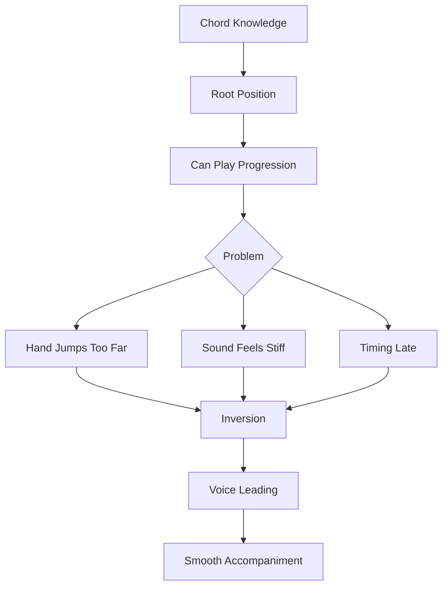
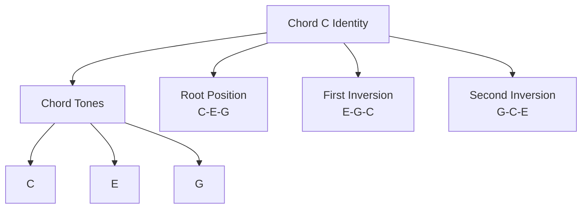
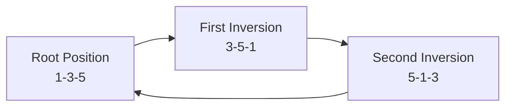
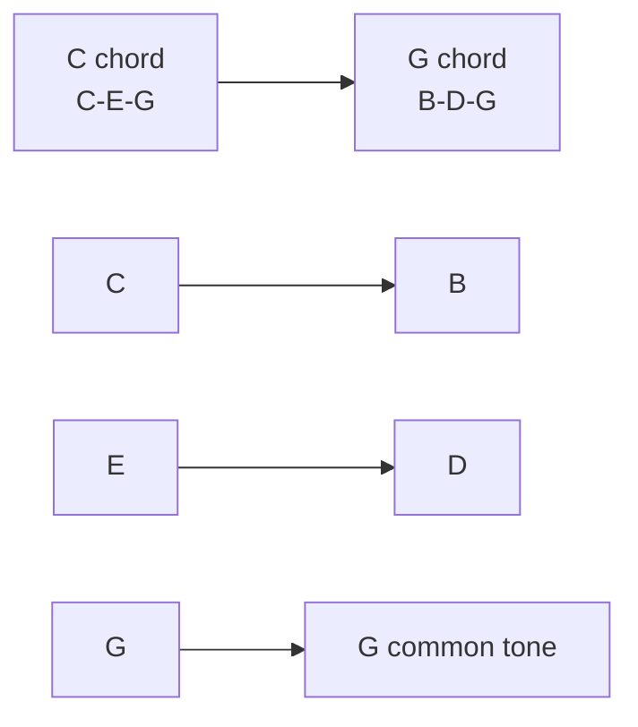
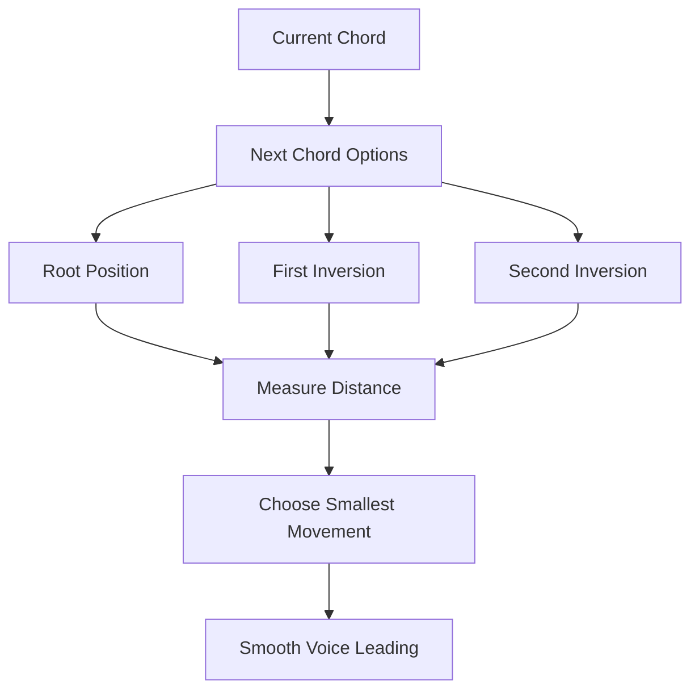
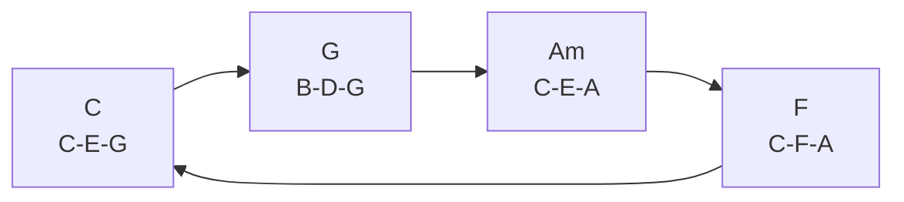
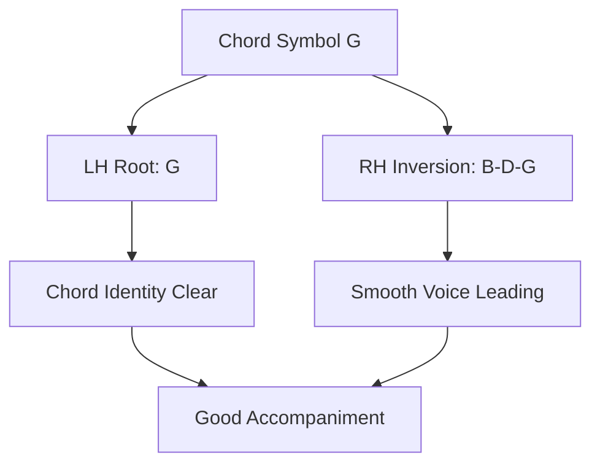
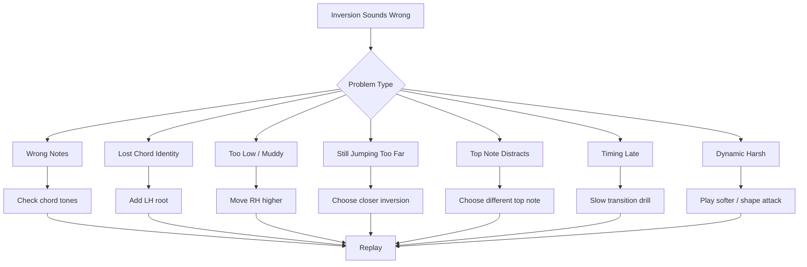
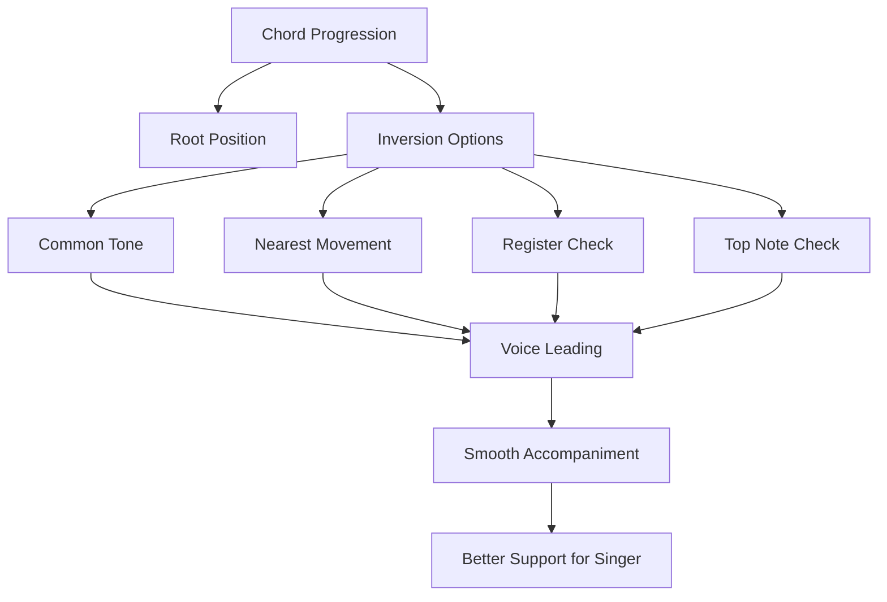

# learn-piano-accompaniment-part-012.md

# Part 012 — Inversion dan Voice Leading

> Seri: **Learn Piano Accompaniment for Singer Performance**  
> Fokus: **belajar piano untuk mengiringi penyanyi**  
> Framework utama: **The First 20 Hours — Josh Kaufman**  
> Tahap: **Phase D — Voicing: Membuat Chord Tidak Kaku**

---

## Status Seri

| Item | Status |
|---|---|
| Part | 012 |
| Nama file | `learn-piano-accompaniment-part-012.md` |
| Fokus | Inversion, perpindahan chord dekat, dan voice leading dasar |
| Prasyarat | Part 000–011 |
| Output praktis | Bisa memainkan progression umum dengan tangan kanan yang lebih smooth dan tidak banyak melompat |
| Status seri | Belum selesai |

---

## Daftar Isi

- [1. Tujuan Part Ini](#1-tujuan-part-ini)
- [2. Posisi Part Ini dalam Framework Kaufman](#2-posisi-part-ini-dalam-framework-kaufman)
- [3. Masalah Utama: Root Position Membuat Iringan Kaku](#3-masalah-utama-root-position-membuat-iringan-kaku)
- [4. Mental Model: Chord Sama, Layout Berbeda](#4-mental-model-chord-sama-layout-berbeda)
- [5. Apa Itu Inversion?](#5-apa-itu-inversion)
- [6. Root Position, First Inversion, Second Inversion](#6-root-position-first-inversion-second-inversion)
- [7. Inversion untuk Chord C, F, G, Am, Dm, Em](#7-inversion-untuk-chord-c-f-g-am-dm-em)
- [8. Apa Itu Voice Leading?](#8-apa-itu-voice-leading)
- [9. Prinsip Jarak Terdekat](#9-prinsip-jarak-terdekat)
- [10. Common Tone: Nada yang Dipertahankan](#10-common-tone-nada-yang-dipertahankan)
- [11. Stepwise Motion: Nada Bergerak Sedikit](#11-stepwise-motion-nada-bergerak-sedikit)
- [12. Progression C–G–Am–F dengan Root Position](#12-progression-cgamf-dengan-root-position)
- [13. Progression C–G–Am–F dengan Inversion Smooth](#13-progression-cgamf-dengan-inversion-smooth)
- [14. Progression Am–F–C–G dengan Inversion Smooth](#14-progression-amfcg-dengan-inversion-smooth)
- [15. Progression C–Am–F–G dengan Inversion Smooth](#15-progression-camfg-dengan-inversion-smooth)
- [16. Progression C–F–G–C dengan Inversion Smooth](#16-progression-cfgc-dengan-inversion-smooth)
- [17. Tangan Kiri Tetap Root, Tangan Kanan Pakai Inversion](#17-tangan-kiri-tetap-root-tangan-kanan-pakai-inversion)
- [18. Inversion dalam Block Chord](#18-inversion-dalam-block-chord)
- [19. Inversion dalam Broken Chord](#19-inversion-dalam-broken-chord)
- [20. Inversion dalam Pop Ballad Comping](#20-inversion-dalam-pop-ballad-comping)
- [21. Inversion dalam 6/8 Feel](#21-inversion-dalam-68-feel)
- [22. Register Aman dan Inversion](#22-register-aman-dan-inversion)
- [23. Dynamic dan Voice Leading](#23-dynamic-dan-voice-leading)
- [24. Kapan Tidak Perlu Inversion](#24-kapan-tidak-perlu-inversion)
- [25. Latihan 1: Semua Inversion Chord C](#25-latihan-1-semua-inversion-chord-c)
- [26. Latihan 2: Semua Inversion Chord F dan G](#26-latihan-2-semua-inversion-chord-f-dan-g)
- [27. Latihan 3: Chord Pair C ke G](#27-latihan-3-chord-pair-c-ke-g)
- [28. Latihan 4: Chord Pair G ke Am](#28-latihan-4-chord-pair-g-ke-am)
- [29. Latihan 5: Full Progression C–G–Am–F](#29-latihan-5-full-progression-cgamf)
- [30. Latihan 6: Verse/Chorus dengan Inversion](#30-latihan-6-versechorus-dengan-inversion)
- [31. Debugging Inversion](#31-debugging-inversion)
- [32. Failure Mode Pemula](#32-failure-mode-pemula)
- [33. Practice Protocol 45 Menit](#33-practice-protocol-45-menit)
- [34. Checklist Kelulusan Part 012](#34-checklist-kelulusan-part-012)
- [35. Ringkasan Mental Model](#35-ringkasan-mental-model)
- [36. Persiapan ke Part 013](#36-persiapan-ke-part-013)

---

# 1. Tujuan Part Ini

Sampai Part 011, kita sudah bisa memainkan:

- chord dasar;
- progression dasar;
- root + chord;
- rhythm pattern;
- broken chord;
- pop ballad comping;
- 6/8 feel.

Namun ada satu masalah yang biasanya langsung muncul ketika pemula mulai mengiringi lagu nyata:

```text
tangan kanan terlalu banyak melompat
```

Contoh progression:

```text
C - G - Am - F
```

Jika semua dimainkan dalam root position:

```text
C = C E G
G = G B D
Am = A C E
F = F A C
```

Tangan kanan bergerak jauh dari satu bentuk ke bentuk lain.

Hasilnya:

- perpindahan lambat;
- timing mudah terlambat;
- suara terasa patah-patah;
- iringan terdengar kaku;
- tangan cepat panik;
- penyanyi merasa chord change tidak mulus.

Part ini memperkenalkan dua konsep penting:

```text
inversion
voice leading
```

Target part ini:

> Anda mampu memainkan chord progression umum dengan tangan kanan yang bergerak lebih dekat, terdengar lebih smooth, lebih mudah dijaga timing-nya, dan lebih nyaman untuk mengiringi penyanyi.

---

# 2. Posisi Part Ini dalam Framework Kaufman

Dalam *The First 20 Hours*, setelah kita bisa melakukan versi paling sederhana dari suatu skill, langkah berikutnya adalah memperbaiki bottleneck terbesar.

Pada piano accompaniment awal, bottleneck besar setelah rhythm adalah:

```text
perpindahan chord yang lambat dan kaku
```

Inversion dan voice leading adalah solusi dengan leverage tinggi karena:

- membuat chord transition lebih dekat;
- mengurangi cognitive load;
- mengurangi lompatan tangan;
- membuat permainan terdengar lebih profesional;
- membuat broken chord lebih mudah;
- membuat comping lebih halus;
- membuat penyanyi lebih nyaman.

Diagram posisi:



Secara Kaufman-style, kita tidak belajar inversion sebagai teori abstrak. Kita belajar inversion karena ia menyelesaikan masalah performa nyata:

```text
bagaimana pindah chord dengan cepat, halus, dan musikal?
```

---

# 3. Masalah Utama: Root Position Membuat Iringan Kaku

Root position berarti root chord berada di nada paling bawah chord tangan kanan.

Contoh:

```text
C  = C E G
G  = G B D
Am = A C E
F  = F A C
```

Semua benar.

Masalahnya bukan salah harmoni.

Masalahnya adalah layout.

## 3.1 Contoh Gerakan Jauh

Dari `C` ke `G`:

```text
C E G -> G B D
```

Tangan kanan harus pindah cukup jauh.

Dari `G` ke `Am`:

```text
G B D -> A C E
```

Lalu ke `F`:

```text
A C E -> F A C
```

Sebagai latihan teori, ini baik. Sebagai accompaniment live, ini sering tidak efisien.

## 3.2 Dampak ke Performa

Jika tangan terlalu banyak melompat:

- chord change terlambat;
- dynamic jadi tidak rata;
- pemain melihat keyboard terus;
- perhatian ke penyanyi berkurang;
- ritme rusak;
- panic meningkat.

## 3.3 Kesimpulan

Root position adalah fondasi belajar chord, tetapi bukan selalu bentuk terbaik untuk mengiringi.

Dalam accompaniment, kita butuh:

```text
chord yang benar
dengan perpindahan yang efisien
dan suara yang smooth
```

---

# 4. Mental Model: Chord Sama, Layout Berbeda

Chord bisa berisi nada yang sama tetapi disusun dalam urutan berbeda.

Contoh chord C:

```text
C E G
E G C
G C E
```

Ketiganya tetap chord C karena berisi nada:

```text
C, E, G
```

Yang berubah hanya:

```text
urutan / posisi
```

Analogi software:

```text
set chord tones = identity
order/layout = representation
```

Chord C:

```text
{C, E, G}
```

Bisa direpresentasikan sebagai:

```text
[C, E, G]
[E, G, C]
[G, C, E]
```

Semua tetap chord C.

Diagram:



Untuk accompaniment, kita memilih representation yang paling berguna untuk:

- jarak tangan;
- register;
- suara;
- vokal;
- rhythm;
- section energy.

---

# 5. Apa Itu Inversion?

Inversion adalah susunan chord di mana nada selain root berada di posisi paling bawah chord.

Chord C punya nada:

```text
C E G
```

Root position:

```text
C E G
```

First inversion:

```text
E G C
```

Second inversion:

```text
G C E
```

Semua tetap chord C.

## 5.1 Kenapa Disebut Inversion?

Karena chord “dibalik” urutannya.

Nada bawah dipindah ke atas.

```text
C E G
```

Pindahkan C ke atas:

```text
E G C
```

Pindahkan E ke atas:

```text
G C E
```

## 5.2 Apa yang Tidak Berubah?

Nama chord tidak berubah.

```text
C E G = C
E G C = C
G C E = C
```

Selama nadanya masih C, E, G, chord-nya tetap C.

## 5.3 Apa yang Berubah?

Yang berubah:

- warna register;
- rasa stabil;
- jarak perpindahan;
- suara top note;
- kemudahan fingering;
- relasi dengan chord sebelum/sesudah.

---

# 6. Root Position, First Inversion, Second Inversion

Untuk triad, ada tiga bentuk utama.

## 6.1 Root Position

Root di bawah.

Chord C:

```text
C E G
```

Struktur:

```text
1 3 5
```

Rasa:

- paling stabil;
- paling mudah dibaca;
- root jelas;
- bisa terdengar berat jika terlalu sering.

## 6.2 First Inversion

Third di bawah.

Chord C:

```text
E G C
```

Struktur:

```text
3 5 1
```

Rasa:

- lebih ringan;
- lebih smooth;
- cocok untuk voice leading;
- root tidak di bawah, tetapi tetap chord C.

## 6.3 Second Inversion

Fifth di bawah.

Chord C:

```text
G C E
```

Struktur:

```text
5 1 3
```

Rasa:

- lebih terbuka;
- bisa terasa menggantung;
- bagus untuk transisi;
- sering berguna untuk chord yang ingin dekat dengan chord sebelumnya.

## 6.4 Diagram



---

# 7. Inversion untuk Chord C, F, G, Am, Dm, Em

Kita fokus pada chord yang paling sering dipakai dalam C major.

## 7.1 Chord C

| Bentuk | Notes | Formula |
|---|---|---|
| Root position | C E G | 1 3 5 |
| First inversion | E G C | 3 5 1 |
| Second inversion | G C E | 5 1 3 |

## 7.2 Chord F

Chord F:

```text
F A C
```

| Bentuk | Notes | Formula |
|---|---|---|
| Root position | F A C | 1 3 5 |
| First inversion | A C F | 3 5 1 |
| Second inversion | C F A | 5 1 3 |

## 7.3 Chord G

Chord G:

```text
G B D
```

| Bentuk | Notes | Formula |
|---|---|---|
| Root position | G B D | 1 3 5 |
| First inversion | B D G | 3 5 1 |
| Second inversion | D G B | 5 1 3 |

## 7.4 Chord Am

Chord Am:

```text
A C E
```

| Bentuk | Notes | Formula |
|---|---|---|
| Root position | A C E | 1 b3 5 |
| First inversion | C E A | b3 5 1 |
| Second inversion | E A C | 5 1 b3 |

## 7.5 Chord Dm

Chord Dm:

```text
D F A
```

| Bentuk | Notes | Formula |
|---|---|---|
| Root position | D F A | 1 b3 5 |
| First inversion | F A D | b3 5 1 |
| Second inversion | A D F | 5 1 b3 |

## 7.6 Chord Em

Chord Em:

```text
E G B
```

| Bentuk | Notes | Formula |
|---|---|---|
| Root position | E G B | 1 b3 5 |
| First inversion | G B E | b3 5 1 |
| Second inversion | B E G | 5 1 b3 |

---

# 8. Apa Itu Voice Leading?

Voice leading adalah cara setiap nada dalam chord bergerak ke nada dalam chord berikutnya.

Alih-alih berpikir:

```text
chord 1 -> chord 2
```

kita berpikir:

```text
nada atas bergerak ke mana?
nada tengah bergerak ke mana?
nada bawah bergerak ke mana?
```

Contoh:

```text
C chord: C E G
G chord: B D G
```

Jika kita pilih G chord dalam inversion:

```text
B D G
```

maka dari C ke G:

```text
C -> B
E -> D
G -> G
```

Pergerakan:

- C turun sedikit ke B;
- E turun sedikit ke D;
- G tetap G.

Ini jauh lebih smooth daripada:

```text
C E G -> G B D
```

## 8.1 Diagram Voice Leading



## 8.2 Tujuan Voice Leading

Tujuannya:

```text
membuat perpindahan chord terdengar natural
```

Untuk accompaniment, voice leading membantu:

- tangan lebih efisien;
- suara lebih halus;
- chord change tidak patah;
- vokal tidak terganggu oleh lompatan piano;
- rhythm lebih stabil.

---

# 9. Prinsip Jarak Terdekat

Prinsip utama voice leading awal:

> Dari chord saat ini, pilih inversion chord berikutnya yang membutuhkan gerakan paling kecil.

Contoh:

```text
C = C E G
```

Chord berikutnya:

```text
G = G B D
```

Kemungkinan bentuk G:

```text
G B D
B D G
D G B
```

Dari C-E-G ke G-B-D, tangan melompat jauh.

Dari C-E-G ke B-D-G:

```text
C -> B
E -> D
G -> G
```

lebih dekat.

Maka untuk progression C ke G, bentuk `B-D-G` sering lebih smooth.

## 9.1 Aturan Praktis

Saat mencari inversion:

1. pertahankan nada yang sama jika ada;
2. gerakkan nada lain ke nada chord berikutnya yang terdekat;
3. hindari lompatan besar jika tidak perlu;
4. jaga tangan di register nyaman;
5. pastikan chord tetap benar.

## 9.2 Diagram



---

# 10. Common Tone: Nada yang Dipertahankan

Common tone adalah nada yang muncul di dua chord berturut-turut.

Contoh:

```text
C = C E G
G = G B D
```

Common tone:

```text
G
```

Jadi saat pindah dari C ke G, kita bisa mempertahankan G.

Contoh smooth:

```text
C chord: C E G
G chord: B D G
```

G tetap di atas.

## 10.1 Contoh Lain: C ke Am

```text
C  = C E G
Am = A C E
```

Common tones:

```text
C dan E
```

Jadi C ke Am bisa sangat smooth.

Bentuk:

```text
C chord: C E G
Am chord: C E A
```

Pergerakan:

```text
C -> C
E -> E
G -> A
```

Hanya satu nada bergerak.

## 10.2 Kenapa Common Tone Penting?

Common tone membuat chord change terdengar natural.

Penyanyi juga merasa harmoni berubah tanpa “lantai” tiba-tiba hilang.

## 10.3 Latihan Mendengar

Mainkan:

```text
C E G
C E A
```

Dengarkan:

- dua nada tetap;
- satu nada naik;
- chord berubah dari C major ke Am;
- perubahan terasa halus.

---

# 11. Stepwise Motion: Nada Bergerak Sedikit

Stepwise motion berarti nada bergerak satu langkah dekat.

Contoh:

```text
C -> B
E -> D
G -> G
```

C ke B turun setengah langkah.

E ke D turun satu whole step.

G tetap.

Ini sangat smooth.

Bandingkan dengan lompatan:

```text
C -> G
E -> B
G -> D
```

Lebih jauh dan terdengar lebih patah.

## 11.1 Prinsip

```text
small movement usually sounds smoother
```

Tidak selalu wajib, tetapi sangat berguna untuk accompaniment.

## 11.2 Stepwise Motion dan Vokal

Jika piano bergerak halus, vokal lebih mudah tetap menjadi pusat.

Jika piano melompat besar terus-menerus, perhatian pendengar bisa tertarik ke piano.

Dalam accompaniment, smoothness sering lebih berguna daripada showiness.

---

# 12. Progression C–G–Am–F dengan Root Position

Progression:

```text
C - G - Am - F
```

Root position:

```text
C  = C E G
G  = G B D
Am = A C E
F  = F A C
```

Ditulis:

```text
C-E-G -> G-B-D -> A-C-E -> F-A-C
```

## 12.1 Masalah

Gerakan tangan:

```text
C-E-G ke G-B-D
```

melompat cukup jauh.

Kemudian:

```text
G-B-D ke A-C-E
```

bergerak naik.

Lalu:

```text
A-C-E ke F-A-C
```

turun lagi.

Secara visual:


Ini benar, tetapi tidak efisien.

## 12.2 Kapan Root Position Masih Berguna?

Root position tetap berguna untuk:

- belajar chord;
- memperkenalkan chord ke telinga;
- memberi suara kuat;
- intro/ending tertentu;
- saat ingin chord terdengar jelas.

Namun untuk comping yang smooth, kita butuh inversion.

---

# 13. Progression C–G–Am–F dengan Inversion Smooth

Kita mulai dari:

```text
C = C E G
```

Cari G yang dekat:

```text
G = B D G
```

Lalu Am yang dekat dari B-D-G:

```text
Am = C E A
```

Lalu F yang dekat dari C-E-A:

```text
F = C F A
```

Jadi progression smooth:

```text
C  = C E G
G  = B D G
Am = C E A
F  = C F A
```

Ditulis:

```text
C-E-G -> B-D-G -> C-E-A -> C-F-A
```

## 13.1 Analisis Pergerakan

C ke G:

```text
C -> B
E -> D
G -> G
```

G ke Am:

```text
B -> C
D -> E
G -> A
```

Am ke F:

```text
C -> C
E -> F
A -> A
```

Sangat dekat.

## 13.2 Diagram



## 13.3 Kenapa Ini Bagus?

- tangan kanan tetap di area yang sama;
- suara lebih smooth;
- timing lebih mudah;
- common tone dipertahankan;
- cocok untuk mengiringi vokal;
- tidak terdengar seperti chord melompat-lompat.

## 13.4 Dengan LH Root

Tangan kiri tetap memainkan root:

```text
LH: C  G  A  F
RH: CEG BDG CEA CFA
```

Ini memberi kejelasan root sekaligus smoothness tangan kanan.

---

# 14. Progression Am–F–C–G dengan Inversion Smooth

Progression:

```text
Am - F - C - G
```

Cocok untuk verse.

Mulai dari Am:

```text
Am = A C E
```

Cari F dekat:

```text
F = A C F
```

Cari C dekat:

```text
C = G C E
```

Cari G dekat:

```text
G = G B D
```

Opsi smooth:

```text
Am = A C E
F  = A C F
C  = G C E
G  = G B D
```

## 14.1 Analisis

Am ke F:

```text
A -> A
C -> C
E -> F
```

Sangat smooth.

F ke C:

```text
A -> G
C -> C
F -> E
```

Dekat.

C ke G:

```text
G -> G
C -> B
E -> D
```

Dekat.

## 14.2 Ditulis

```text
A-C-E -> A-C-F -> G-C-E -> G-B-D
```

## 14.3 Dengan LH

```text
LH: A  F  C  G
RH: ACE ACF GCE GBD
```

## 14.4 Rasa

Karena tangan kanan bergerak halus, progression ini cocok untuk verse yang lembut dan emosional.

---

# 15. Progression C–Am–F–G dengan Inversion Smooth

Progression:

```text
C - Am - F - G
```

Mulai:

```text
C = C E G
```

Am dekat:

```text
Am = C E A
```

F dekat:

```text
F = C F A
```

G dekat:

```text
G = B D G
```

Opsi:

```text
C  = C E G
Am = C E A
F  = C F A
G  = B D G
```

## 15.1 Analisis

C ke Am:

```text
C -> C
E -> E
G -> A
```

Am ke F:

```text
C -> C
E -> F
A -> A
```

F ke G:

```text
C -> B
F -> D
A -> G
```

F ke G sedikit lebih bergerak, tetapi masih cukup dekat jika dipraktikkan.

## 15.2 Alternatif G

Dari F = C F A, bisa juga pilih:

```text
G = D G B
```

Pergerakan:

```text
C -> D
F -> G
A -> B
```

Semua naik stepwise.

Ini juga smooth.

Jadi opsi lain:

```text
C  = C E G
Am = C E A
F  = C F A
G  = D G B
```

## 15.3 Pilihan Praktis

Untuk pemula, pilih yang paling nyaman di tangan.

Dua opsi G:

```text
B-D-G
D-G-B
```

Keduanya benar.

Yang penting:

```text
chord benar
gerakan dekat
register nyaman
```

---

# 16. Progression C–F–G–C dengan Inversion Smooth

Progression:

```text
C - F - G - C
```

Ini progression dasar.

Mulai:

```text
C = C E G
```

F dekat:

```text
F = C F A
```

G dekat:

```text
G = B D G
```

C dekat:

```text
C = C E G
```

Opsi:

```text
C = C E G
F = C F A
G = B D G
C = C E G
```

## 16.1 Analisis

C ke F:

```text
C -> C
E -> F
G -> A
```

F ke G:

```text
C -> B
F -> D
A -> G
```

G ke C:

```text
B -> C
D -> E
G -> G
```

## 16.2 Alternatif Lebih Naik

```text
C = G C E
F = A C F
G = G B D
C = G C E
```

Pilih sesuai register.

## 16.3 Fungsi untuk Accompaniment

Progression `C-F-G-C` sering dipakai untuk lagu sederhana, ending, intro, dan latihan tonic-predominant-dominant-tonic.

Dengan inversion, progression ini tidak terdengar seperti latihan chord kaku.

---

# 17. Tangan Kiri Tetap Root, Tangan Kanan Pakai Inversion

Ini prinsip sangat penting:

> Tangan kiri boleh menjaga root, sementara tangan kanan memakai inversion.

Contoh chord G dalam inversion:

```text
RH: B D G
```

Mungkin Anda bertanya:

```text
Kalau RH tidak mulai dari G, apakah masih chord G?
```

Ya, karena LH memainkan G sebagai root.

```text
LH: G
RH: B D G
```

Gabungan keduanya sangat jelas sebagai chord G.

## 17.1 Kenapa Ini Efektif?

LH memberi:

```text
root identity
```

RH memberi:

```text
smooth harmony
```

Jadi kita mendapatkan dua keuntungan:

- pendengar tahu chord-nya;
- tangan kanan tidak melompat jauh.

Diagram:



## 17.2 Praktik

Progression:

```text
C - G - Am - F
```

LH:

```text
C - G - A - F
```

RH:

```text
C-E-G
B-D-G
C-E-A
C-F-A
```

Mainkan bersama.

---

# 18. Inversion dalam Block Chord

Block chord dengan inversion sangat efektif.

## 18.1 Sebelum

Root position:

```text
C-E-G -> G-B-D -> A-C-E -> F-A-C
```

## 18.2 Sesudah

Inversion smooth:

```text
C-E-G -> B-D-G -> C-E-A -> C-F-A
```

## 18.3 Dengan Rhythm

Pattern Part 007:

```text
1 2 3 4
X - - -
```

atau:

```text
1 2 3 4
X - x -
```

Gunakan RH inversion.

Contoh:

```text
| C       | G       | Am      | F       |
RH C-E-G   B-D-G   C-E-A   C-F-A
LH C       G       A       F
```

## 18.4 Hasil

Chord terdengar:

- lebih dekat;
- lebih lembut;
- tidak melompat;
- lebih profesional;
- lebih mudah dipakai untuk penyanyi.

---

# 19. Inversion dalam Broken Chord

Broken chord dengan inversion membuat arpeggio lebih smooth.

Misalnya progression:

```text
C - G - Am - F
```

RH inversion:

```text
C  = C E G
G  = B D G
Am = C E A
F  = C F A
```

Sekarang broken chord pattern bisa memakai nada dari inversion.

## 19.1 Pattern 1–3–5–3 Berdasarkan Layout RH

Untuk C:

```text
C E G E
```

Untuk G inversion B-D-G:

```text
B D G D
```

Untuk Am inversion C-E-A:

```text
C E A E
```

Untuk F inversion C-F-A:

```text
C F A F
```

Ditulis:

```text
| C E G E | B D G D | C E A E | C F A F |
```

## 19.2 Keuntungan

Gerakan tangan kanan jauh lebih dekat daripada:

```text
C E G E | G B D B | A C E C | F A C A
```

## 19.3 Catatan

Dalam broken chord, “1-3-5” bisa berarti dua hal:

1. chord tone teoritis dari root;
2. posisi dalam layout inversion yang sedang dipakai.

Untuk tahap ini, gunakan pendekatan praktis:

```text
ambil tiga nada RH inversion,
mainkan sebagai broken chord
```

Jangan terlalu kaku dengan angka teori jika membuat bingung.

---

# 20. Inversion dalam Pop Ballad Comping

Dalam pop ballad comping, inversion membuat chord pulse lebih halus.

Pattern:

```text
1 & 2 & 3 & 4 &
X - - x X - - x
```

Jika RH root position, tangan banyak melompat.

Jika RH inversion, pattern lebih mudah.

## 20.1 Contoh

Progression:

```text
C - G - Am - F
```

LH root:

```text
C - G - A - F
```

RH inversion:

```text
C-E-G
B-D-G
C-E-A
C-F-A
```

Pattern:

```text
1: LH + RH
2&: RH light
3: RH medium
4&: RH light
```

## 20.2 Hasil

- chord change lebih cepat;
- tangan kanan tetap di area sama;
- rhythm lebih stabil;
- dynamic lebih mudah dikontrol;
- penyanyi lebih nyaman.

## 20.3 Prinsip

```text
Inversion helps rhythm.
```

Karena jika tangan tidak perlu melompat jauh, Anda punya lebih banyak bandwidth untuk rhythm dan vokal.

---

# 21. Inversion dalam 6/8 Feel

Dalam 6/8, inversion sangat berguna karena arpeggio terus bergerak.

Progression:

```text
C - G - Am - F
```

RH inversion:

```text
C  = C E G
G  = B D G
Am = C E A
F  = C F A
```

Pattern 6/8:

```text
1 2 3 4 5 6
```

Versi RH rolling:

```text
C:  C E G E G E
G:  B D G D G D
Am: C E A E A E
F:  C F A F A F
```

Dengan LH root di count 1:

```text
1: LH root + RH first note
2-6: RH rolling
```

## 21.1 Keuntungan

- 6/8 lebih mengalun;
- chord change tidak terasa patah;
- RH tidak melompat jauh;
- pedal lebih bersih karena register konsisten;
- vokal punya texture yang lebih smooth.

## 21.2 Dynamic

Tetap gunakan accent 6/8:

```text
1 = lebih jelas
4 = secondary
2,3,5,6 = ringan
```

Jangan semua nada sama keras.

---

# 22. Register Aman dan Inversion

Inversion bisa terdengar buruk jika register salah.

## 22.1 Terlalu Rendah

Jika RH inversion terlalu rendah, chord terdengar muddy.

Contoh:

```text
B-D-G
```

di register terlalu rendah bisa keruh, apalagi dengan pedal.

## 22.2 Terlalu Tinggi

Jika RH terlalu tinggi dan keras, bisa mengganggu vokal.

## 22.3 Register Aman

Untuk accompaniment awal:

```text
LH root: low-mid
RH inversion: middle register
```

## 22.4 Top Note

Inversion menentukan nada paling atas.

Contoh:

```text
C-E-G -> top note G
E-G-C -> top note C
G-C-E -> top note E
```

Top note terdengar jelas oleh pendengar.

Jika top note bergerak terlalu aktif atau terlalu tinggi, bisa terasa seperti melodi piano yang bersaing dengan vokal.

## 22.5 Prinsip

```text
Pilih inversion bukan hanya karena dekat,
tetapi juga karena register dan top note-nya mendukung vokal.
```

---

# 23. Dynamic dan Voice Leading

Voice leading bukan hanya soal nada. Dynamic juga penting.

Jika setiap chord ditekan sama keras, smoothness berkurang.

## 23.1 Dynamic Transition

Saat pindah chord halus, mainkan:

- chord baru tidak terlalu keras;
- common tone tetap lembut;
- top note tidak menonjol berlebihan;
- beat 1 tetap jelas tapi tidak agresif.

## 23.2 Common Tone Jangan Dipukul Terlalu Keras

Jika nada yang sama dipertahankan, jangan selalu “dipukul ulang” keras.

Contoh C ke G:

```text
G common tone
```

Jika G tetap di atas, bisa ditekan ulang lebih lembut agar terasa menyambung.

## 23.3 Dynamic untuk Section

Verse:

```text
inversion lembut
```

Chorus:

```text
inversion lebih penuh
```

Bridge:

```text
bisa lebih sparse
```

## 23.4 Prinsip

```text
Smooth notes + harsh attack = still not smooth.
```

Voice leading butuh sentuhan yang mendukung.

---

# 24. Kapan Tidak Perlu Inversion

Inversion penting, tetapi bukan wajib setiap saat.

## 24.1 Saat Belajar Chord Baru

Root position lebih jelas untuk memahami chord.

## 24.2 Saat Ingin Chord Terdengar Sangat Tegas

Root position bisa memberi statement yang kuat.

Cocok untuk:

- final chord;
- ending;
- cue besar;
- chorus hit;
- intro tertentu.

## 24.3 Saat LH Tidak Memainkan Root

Jika tangan kiri tidak memberi root, inversion bisa membuat root kurang jelas.

Tetap boleh, tetapi perlu konteks.

## 24.4 Saat Inversion Membingungkan

Jika inversion membuat Anda kehilangan chord identity, kembali ke root position dulu.

Prinsip 20 jam pertama:

```text
smooth is good,
but clarity comes first.
```

## 24.5 Saat Register Tidak Cocok

Inversion yang secara jarak dekat bagus bisa saja terdengar buruk jika terlalu rendah/tinggi.

Pilih berdasarkan suara, bukan hanya teori.

---

# 25. Latihan 1: Semua Inversion Chord C

Tujuan:

> mengenal satu chord dalam tiga layout.

Chord C:

```text
Root position: C E G
First inversion: E G C
Second inversion: G C E
```

Latihan:

```text
C E G
E G C
G C E
E G C
C E G
```

## 25.1 Count

Mainkan satu bentuk per bar:

```text
1 2 3 4
```

## 25.2 Dynamic

Main lembut.

Jangan memukul.

## 25.3 Checklist

- [ ] semua nada benar;
- [ ] tahu bahwa semuanya tetap chord C;
- [ ] tangan rileks;
- [ ] bisa menyebut root/first/second inversion;
- [ ] bisa mendengar warna berbeda.

---

# 26. Latihan 2: Semua Inversion Chord F dan G

## 26.1 Chord F

```text
F A C
A C F
C F A
```

Mainkan naik dan turun.

## 26.2 Chord G

```text
G B D
B D G
D G B
```

Mainkan naik dan turun.

## 26.3 Latihan

Untuk setiap chord:

```text
root position
first inversion
second inversion
first inversion
root position
```

## 26.4 Tujuan

Bukan speed.

Tujuannya:

- mengenali layout;
- membangun peta tangan;
- mendengar chord yang sama dalam bentuk berbeda.

---

# 27. Latihan 3: Chord Pair C ke G

Tujuan:

> melatih satu transition penting.

## 27.1 Versi Root Position

```text
C-E-G -> G-B-D
```

Mainkan 5 kali.

Dengarkan lompatannya.

## 27.2 Versi Smooth

```text
C-E-G -> B-D-G
```

Mainkan 10 kali.

Dengarkan:

```text
C turun ke B
E turun ke D
G tetap
```

## 27.3 Dengan LH

```text
LH: C -> G
RH: C-E-G -> B-D-G
```

## 27.4 Pattern

Mainkan dengan rhythm:

```text
1 2 3 4
X - - -
```

Lalu:

```text
X - x -
```

## 27.5 Evaluasi

- apakah tangan lebih sedikit bergerak?
- apakah timing lebih mudah?
- apakah suara lebih smooth?
- apakah root tetap jelas karena LH?

---

# 28. Latihan 4: Chord Pair G ke Am

Dari G smooth:

```text
G = B D G
```

Ke Am smooth:

```text
Am = C E A
```

Gerakan:

```text
B -> C
D -> E
G -> A
```

Semua naik sedikit.

## 28.1 Latihan

```text
B-D-G -> C-E-A
```

Ulang 10 kali.

## 28.2 Dengan LH

```text
LH: G -> A
RH: B-D-G -> C-E-A
```

## 28.3 Dengarkan

Rasanya seperti seluruh chord naik halus.

Ini sangat bagus untuk progression:

```text
C - G - Am - F
```

karena G ke Am menjadi natural.

---

# 29. Latihan 5: Full Progression C–G–Am–F

Gunakan voicing smooth:

```text
C  = C E G
G  = B D G
Am = C E A
F  = C F A
```

Dengan LH:

```text
LH: C  G  A  F
RH: CEG BDG CEA CFA
```

## 29.1 Step 1: Block Chord Whole Note

```text
| C       | G       | Am      | F       |
  X - - -   X - - -   X - - -   X - - -
```

## 29.2 Step 2: Half Note Pulse

```text
| C       | G       | Am      | F       |
  X - x -   X - x -   X - x -   X - x -
```

## 29.3 Step 3: Broken Chord

Gunakan nada RH inversion:

```text
| C E G E | B D G D | C E A E | C F A F |
```

## 29.4 Step 4: Pop Ballad Pattern

```text
1 & 2 & 3 & 4 &
X - - x X - - x
```

Gunakan RH inversion.

## 29.5 Evaluasi

Rekam.

Bandingkan dengan root position.

Tanya:

- mana lebih smooth?
- mana lebih mudah timing?
- mana lebih enak untuk vokal?
- apakah root tetap jelas?
- apakah register nyaman?

---

# 30. Latihan 6: Verse/Chorus dengan Inversion

Buat mini arrangement.

## 30.1 Verse

Progression:

```text
Am - F - C - G
```

Voicing:

```text
Am = A C E
F  = A C F
C  = G C E
G  = G B D
```

Pattern:

```text
broken chord lembut
```

Dynamic:

```text
level 2
```

## 30.2 Chorus

Progression:

```text
C - G - Am - F
```

Voicing:

```text
C  = C E G
G  = B D G
Am = C E A
F  = C F A
```

Pattern:

```text
pop ballad comping
```

Dynamic:

```text
level 3
```

## 30.3 Struktur

```text
Verse  x2
Chorus x2
```

## 30.4 Target

- verse smooth;
- chorus lebih besar;
- tangan kanan tidak lompat jauh;
- tempo stabil;
- vokal punya ruang.

---

# 31. Debugging Inversion

Jika inversion membuat bingung, debug layer.



## 31.1 Wrong Notes

Gejala:

```text
chord terdengar salah
```

Solusi:

- tulis chord tone;
- cek apakah semua nada bagian dari chord;
- mainkan root position dulu;
- baru susun inversion.

## 31.2 Lost Chord Identity

Gejala:

```text
saya tidak merasa ini chord G karena RH mulai dari B
```

Solusi:

- tambahkan LH root G;
- ucapkan chord name;
- dengarkan gabungan LH + RH.

## 31.3 Too Low / Muddy

Gejala:

```text
suara keruh
```

Solusi:

- naikkan RH;
- kurangi pedal;
- LH jangan terlalu rendah;
- gunakan partial chord.

## 31.4 Still Jumping Too Far

Gejala:

```text
tangan tetap lompat jauh
```

Solusi:

- cari inversion lain;
- pertahankan common tone;
- gunakan prinsip jarak terdekat.

## 31.5 Top Note Distracts

Gejala:

```text
nada atas piano seperti melodi sendiri
```

Solusi:

- pilih inversion dengan top note lebih tenang;
- main lebih lembut;
- kurangi rhythm activity.

## 31.6 Timing Late

Gejala:

```text
chord masih terlambat
```

Solusi:

- latih pair transition;
- perlambat;
- lihat chord berikutnya lebih awal;
- jangan pakai syncopation dulu.

---

# 32. Failure Mode Pemula

## 32.1 Menghafal Inversion sebagai Bentuk Acak

Inversion bukan bentuk random.

Selalu pahami:

```text
chord tone sama
urutan berbeda
```

## 32.2 Lupa Root karena RH Tidak Mulai dari Root

Solusi:

```text
LH memainkan root
```

Ini membuat chord identity tetap jelas.

## 32.3 Memakai Inversion Terlalu Rendah

Chord inversion di register rendah bisa muddy.

Solusi:

```text
RH di middle register
LH root tidak terlalu rendah
pedal bersih
```

## 32.4 Semua Chord Harus Inversion Smooth

Tidak selalu.

Kadang root position diperlukan untuk clarity atau impact.

## 32.5 Fokus ke Jarak, Lupa Suara

Inversion terdekat belum tentu paling musikal jika top note mengganggu atau register buruk.

Dengarkan.

## 32.6 Tidak Melatih Transition Pair

Pemula sering langsung latihan full song.

Jika satu transition buruk, isolasi.

```text
C -> G
G -> Am
Am -> F
```

## 32.7 Menganggap Smooth Berarti Lemah

Smooth bukan berarti tanpa energi.

Chorus tetap bisa kuat dengan inversion jika dynamic dan rhythm naik.

---

# 33. Practice Protocol 45 Menit

Gunakan sesi ini untuk Part 012.

## 33.1 Menit 0–5: Review Chord Tone

Mainkan:

```text
C  = C E G
F  = F A C
G  = G B D
Am = A C E
Dm = D F A
Em = E G B
```

## 33.2 Menit 5–10: Inversion Chord C, F, G

Mainkan:

```text
C: CEG EGC GCE
F: FAC ACF CFA
G: GBD BDG DGB
```

## 33.3 Menit 10–15: Chord Pair C ke G

Latih:

```text
C-E-G -> B-D-G
```

Dengan LH:

```text
C -> G
```

## 33.4 Menit 15–20: Chord Pair G ke Am

Latih:

```text
B-D-G -> C-E-A
```

Dengan LH:

```text
G -> A
```

## 33.5 Menit 20–25: Chord Pair Am ke F

Latih:

```text
C-E-A -> C-F-A
```

Dengan LH:

```text
A -> F
```

## 33.6 Menit 25–30: Full Progression Block

Mainkan:

```text
LH: C  G  A  F
RH: CEG BDG CEA CFA
```

Pattern:

```text
X - - -
```

## 33.7 Menit 30–35: Full Progression Comping

Pattern:

```text
X - x -
```

Lalu:

```text
X - - x X - - x
```

## 33.8 Menit 35–40: Broken Chord dengan Inversion

Mainkan:

```text
| C E G E | B D G D | C E A E | C F A F |
```

## 33.9 Menit 40–45: Record and Review

Rekam 1 menit.

Jawab:

- apakah tangan kanan lebih smooth?
- apakah chord tetap jelas?
- apakah LH root membantu?
- apakah timing lebih stabil?
- apakah register tidak muddy?
- apakah top note mengganggu vokal?
- apakah dynamic terlalu keras?

---

# 34. Checklist Kelulusan Part 012

Anda boleh lanjut ke Part 013 jika sebagian besar checklist ini terpenuhi.

## 34.1 Pemahaman

- [ ] Saya tahu inversion adalah chord tone yang sama dengan susunan berbeda.
- [ ] Saya tahu root position, first inversion, second inversion.
- [ ] Saya tahu C chord bisa berupa `C-E-G`, `E-G-C`, `G-C-E`.
- [ ] Saya tahu F chord bisa berupa `F-A-C`, `A-C-F`, `C-F-A`.
- [ ] Saya tahu G chord bisa berupa `G-B-D`, `B-D-G`, `D-G-B`.
- [ ] Saya tahu voice leading berarti cara nada bergerak antar chord.
- [ ] Saya tahu common tone adalah nada yang dipertahankan antar chord.
- [ ] Saya tahu tangan kiri bisa menjaga root sementara tangan kanan memakai inversion.
- [ ] Saya tahu inversion dipilih berdasarkan jarak, register, top note, dan kebutuhan vokal.

## 34.2 Praktik

- [ ] Saya bisa memainkan semua inversion chord C.
- [ ] Saya bisa memainkan semua inversion chord F.
- [ ] Saya bisa memainkan semua inversion chord G.
- [ ] Saya bisa memainkan `C-E-G -> B-D-G`.
- [ ] Saya bisa memainkan `B-D-G -> C-E-A`.
- [ ] Saya bisa memainkan `C-E-A -> C-F-A`.
- [ ] Saya bisa memainkan progression `C - G - Am - F` dengan LH root dan RH inversion.
- [ ] Saya bisa memainkan progression tersebut dalam block chord.
- [ ] Saya bisa memainkan progression tersebut dalam broken chord.
- [ ] Saya bisa memainkan progression tersebut dengan pop ballad comping.

## 34.3 Self-Correction

- [ ] Saya bisa mendeteksi jika inversion mengandung wrong note.
- [ ] Saya bisa mendeteksi jika chord identity hilang.
- [ ] Saya bisa menambahkan LH root untuk memperjelas chord.
- [ ] Saya bisa mendeteksi jika RH terlalu rendah/muddy.
- [ ] Saya bisa mencari inversion yang lebih dekat.
- [ ] Saya bisa mendengar jika top note terlalu mengganggu.
- [ ] Saya bisa kembali ke root position saat butuh clarity.

---

# 35. Ringkasan Mental Model

Inversion adalah:

```text
chord yang sama
dengan urutan nada berbeda
```

Voice leading adalah:

```text
cara nada bergerak dari satu chord ke chord berikutnya
```

Prinsip utama:

```text
pertahankan common tone
gerakkan nada lain sedikit mungkin
jaga register nyaman
pastikan root tetap jelas
dengarkan apakah vokal punya ruang
```

Progression penting:

```text
C - G - Am - F
```

Root position:

```text
C-E-G -> G-B-D -> A-C-E -> F-A-C
```

Smooth inversion:

```text
C-E-G -> B-D-G -> C-E-A -> C-F-A
```

Dengan LH:

```text
LH: C  G  A  F
RH: CEG BDG CEA CFA
```

Diagram akhir:



Kalimat kunci:

```text
Chord yang benar belum tentu nyaman dimainkan.
Chord yang nyaman belum tentu enak didengar.
Pilih inversion yang benar, dekat, bersih, dan mendukung vokal.
```

---

# 36. Persiapan ke Part 013

Part berikutnya adalah:

```text
learn-piano-accompaniment-part-013.md
```

Judul:

```text
Register, Density, dan Ruang untuk Vokal
```

Di Part 012, kita memperhalus perpindahan chord dengan inversion dan voice leading.

Namun ada masalah lain:

```text
piano bisa tetap benar dan smooth,
tetapi masih menabrak vokal
```

Karena itu, Part 013 akan membahas:

- range piano;
- register rendah, tengah, tinggi;
- kenapa register tengah bisa bertabrakan dengan vokal;
- density chord;
- kapan main sedikit;
- kapan main penuh;
- konsep leave space;
- cara mengiringi penyanyi tanpa menutupi suara;
- dynamic hierarchy;
- bagaimana memilih register dan density berdasarkan section;
- cara mendengar apakah piano terlalu ramai.

Part 013 sangat penting karena accompaniment bukan hanya tentang chord dan pattern, tetapi tentang **ruang**.

---

## Status Akhir Part 012

```text
Part 012 selesai.
Seri belum selesai.
Lanjut ke Part 013.
```
