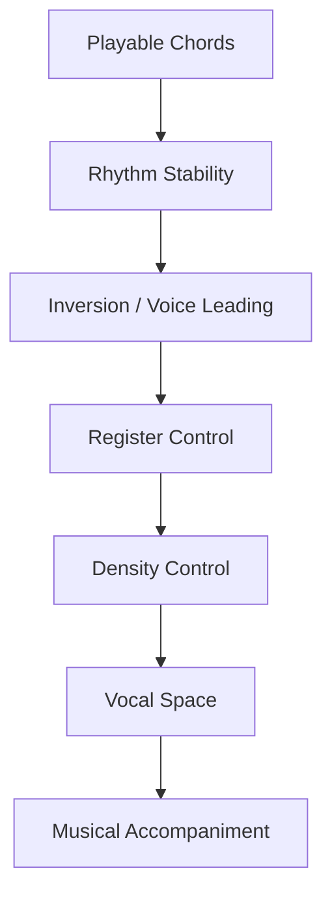
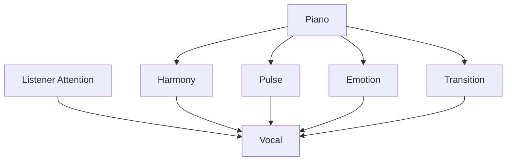
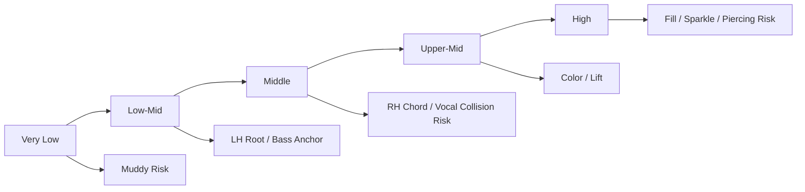
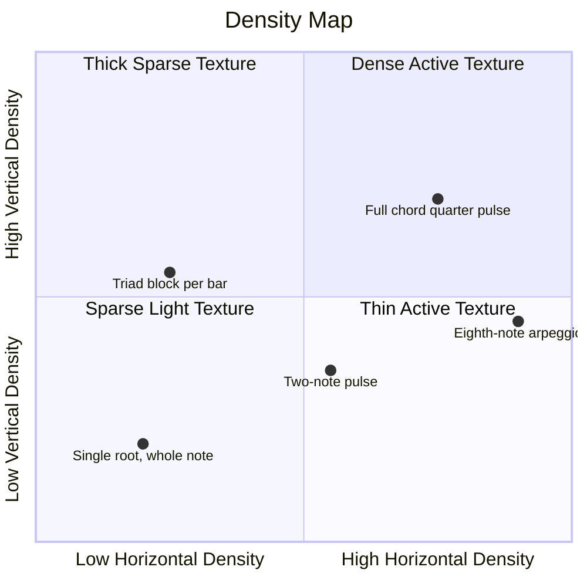
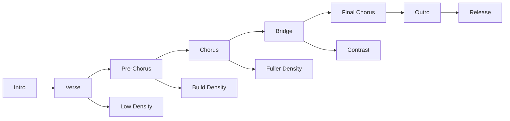
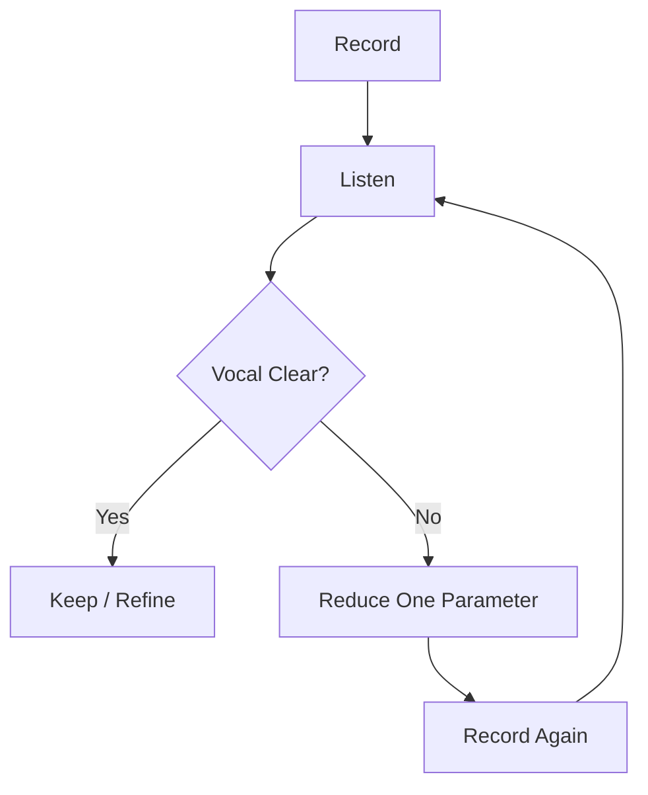
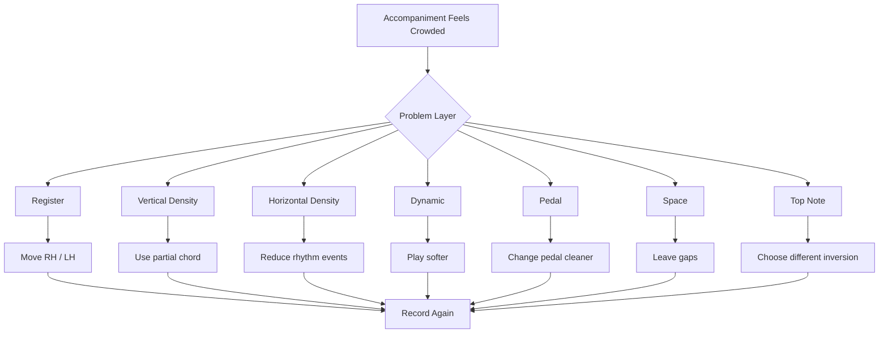
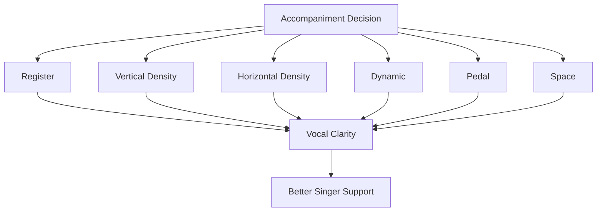

# learn-piano-accompaniment-part-013.md

# Part 013 — Register, Density, dan Ruang untuk Vokal

> Seri: **Learn Piano Accompaniment for Singer Performance**  
> Fokus: **belajar piano untuk mengiringi penyanyi**  
> Framework utama: **The First 20 Hours — Josh Kaufman**  
> Tahap: **Phase D — Voicing: Membuat Chord Tidak Kaku**

---

## Status Seri

| Item | Status |
|---|---|
| Part | 013 |
| Nama file | `learn-piano-accompaniment-part-013.md` |
| Fokus | Register, density, dan ruang untuk vokal |
| Prasyarat | Part 000–012 |
| Output praktis | Bisa memilih register dan kepadatan iringan agar piano mendukung vokal tanpa menutupinya |
| Status seri | Belum selesai |

---

## Daftar Isi

- [1. Tujuan Part Ini](#1-tujuan-part-ini)
- [2. Posisi Part Ini dalam Framework Kaufman](#2-posisi-part-ini-dalam-framework-kaufman)
- [3. Masalah Utama: Piano Benar tetapi Menutupi Vokal](#3-masalah-utama-piano-benar-tetapi-menutupi-vokal)
- [4. Mental Model: Piano sebagai Layer, Bukan Foreground](#4-mental-model-piano-sebagai-layer-bukan-foreground)
- [5. Apa Itu Register?](#5-apa-itu-register)
- [6. Peta Register Piano untuk Pengiring](#6-peta-register-piano-untuk-pengiring)
- [7. Low Register: Fondasi, tetapi Mudah Muddy](#7-low-register-fondasi-tetapi-mudah-muddy)
- [8. Middle Register: Berguna, tetapi Berisiko Menabrak Vokal](#8-middle-register-berguna-tetapi-berisiko-menabrak-vokal)
- [9. High Register: Warna dan Sparkle, tetapi Mudah Menusuk](#9-high-register-warna-dan-sparkle-tetapi-mudah-menusuk)
- [10. Register Aman untuk 20 Jam Pertama](#10-register-aman-untuk-20-jam-pertama)
- [11. Apa Itu Density?](#11-apa-itu-density)
- [12. Density Horizontal dan Vertical](#12-density-horizontal-dan-vertical)
- [13. Vertical Density: Berapa Banyak Nada Sekaligus?](#13-vertical-density-berapa-banyak-nada-sekaligus)
- [14. Horizontal Density: Berapa Banyak Event per Bar?](#14-horizontal-density-berapa-banyak-event-per-bar)
- [15. Space: Diam sebagai Bagian dari Musik](#15-space-diam-sebagai-bagian-dari-musik)
- [16. Vokal sebagai Foreground](#16-vokal-sebagai-foreground)
- [17. Frequency Collision: Kenapa Piano Bisa Menabrak Vokal](#17-frequency-collision-kenapa-piano-bisa-menabrak-vokal)
- [18. Dynamic Hierarchy](#18-dynamic-hierarchy)
- [19. Section-Based Register dan Density](#19-section-based-register-dan-density)
- [20. Register dan Density untuk Verse](#20-register-dan-density-untuk-verse)
- [21. Register dan Density untuk Pre-Chorus](#21-register-dan-density-untuk-pre-chorus)
- [22. Register dan Density untuk Chorus](#22-register-dan-density-untuk-chorus)
- [23. Register dan Density untuk Bridge](#23-register-dan-density-untuk-bridge)
- [24. Register dan Density untuk Intro/Outro](#24-register-dan-density-untuk-introoutro)
- [25. Cara Mengurangi Density Tanpa Membuat Lagu Kosong](#25-cara-mengurangi-density-tanpa-membuat-lagu-kosong)
- [26. Partial Chord: Tidak Semua Nada Harus Dimainkan](#26-partial-chord-tidak-semua-nada-harus-dimainkan)
- [27. Rootless-ish Thinking untuk Pemula: LH Root, RH Warna](#27-rootless-ish-thinking-untuk-pemula-lh-root-rh-warna)
- [28. Top Note Awareness](#28-top-note-awareness)
- [29. Pedal, Register, dan Density](#29-pedal-register-dan-density)
- [30. Singer Type dan Register Strategy](#30-singer-type-dan-register-strategy)
- [31. Latihan 1: Satu Progression, Tiga Register](#31-latihan-1-satu-progression-tiga-register)
- [32. Latihan 2: Satu Progression, Tiga Density](#32-latihan-2-satu-progression-tiga-density)
- [33. Latihan 3: Vokal Aktif vs Vokal Diam](#33-latihan-3-vokal-aktif-vs-vokal-diam)
- [34. Latihan 4: Verse/Chorus dengan Density Map](#34-latihan-4-versechorus-dengan-density-map)
- [35. Latihan 5: Recording Review — Apakah Piano Menutup Vokal?](#35-latihan-5-recording-review--apakah-piano-menutup-vokal)
- [36. Debugging Register dan Density](#36-debugging-register-dan-density)
- [37. Failure Mode Pemula](#37-failure-mode-pemula)
- [38. Practice Protocol 45 Menit](#38-practice-protocol-45-menit)
- [39. Checklist Kelulusan Part 013](#39-checklist-kelulusan-part-013)
- [40. Ringkasan Mental Model](#40-ringkasan-mental-model)
- [41. Persiapan ke Part 014](#41-persiapan-ke-part-014)

---

# 1. Tujuan Part Ini

Sampai Part 012, kita sudah belajar membuat perpindahan chord lebih halus dengan inversion dan voice leading.

Namun ada masalah yang sering muncul bahkan setelah chord benar dan voice leading sudah smooth:

```text
piano tetap menutupi vokal
```

Ini bisa terjadi karena:

- tangan kanan bermain di register yang sama dengan vokal;
- chord terlalu padat;
- rhythm terlalu aktif;
- pedal terlalu banyak;
- tangan kiri terlalu rendah;
- semua section dimainkan terlalu penuh;
- pemain tidak memberi ruang pada frase vokal.

Dalam accompaniment, benar secara harmoni belum cukup.

Target part ini:

> Anda mampu memilih register, density, dynamic, dan ruang yang tepat agar piano mendukung penyanyi tanpa mengambil alih foreground.

Part ini menjawab pertanyaan praktis:

- tangan kiri sebaiknya di mana?
- tangan kanan sebaiknya di mana?
- kapan chord penuh dipakai?
- kapan cukup dua nada?
- kapan broken chord terlalu ramai?
- kapan piano harus diam?
- kenapa verse harus lebih lapang daripada chorus?
- bagaimana tahu piano sedang menabrak vokal?
- bagaimana mengurangi iringan tanpa membuat lagu mati?

---

# 2. Posisi Part Ini dalam Framework Kaufman

Dalam *The First 20 Hours*, kita memprioritaskan sub-skill yang paling menentukan performa awal.

Setelah chord dan rhythm, sub-skill berikutnya adalah:

```text
sound placement
```

Dalam piano accompaniment, sound placement berarti:

```text
di mana suara piano ditempatkan
seberapa banyak suara dimainkan
dan seberapa kuat suara itu terhadap vokal
```

Diagram:



Tanpa register dan density control, pemain bisa saja:

- chord benar;
- timing stabil;
- inversion halus;

tetapi tetap terdengar amatir karena terlalu penuh atau menabrak vokal.

Part ini adalah transisi dari:

```text
bisa main piano
```

ke:

```text
bisa mengiringi penyanyi dengan sadar
```

---

# 3. Masalah Utama: Piano Benar tetapi Menutupi Vokal

Bayangkan Anda memainkan progression:

```text
C - G - Am - F
```

Dengan voicing smooth:

```text
C  = C E G
G  = B D G
Am = C E A
F  = C F A
```

Secara teori bagus.

Tetapi jika dimainkan:

- terlalu keras;
- terlalu sering;
- terlalu tengah;
- terlalu banyak pedal;
- terlalu penuh sepanjang lagu;

hasilnya bisa buruk.

## 3.1 Gejala Piano Menutupi Vokal

Tanda-tanda:

- kata-kata penyanyi tidak jelas;
- piano terasa seperti melodi kedua;
- telinga lebih fokus ke tangan kanan daripada vokal;
- vokal terdengar “tenggelam”;
- chorus terasa ramai tapi tidak emosional;
- verse tidak punya ruang;
- penyanyi tampak sulit masuk;
- penyanyi menaikkan volume karena merasa tidak terdengar;
- rekaman terdengar penuh tapi melelahkan.

## 3.2 Penyebab Umum

| Gejala | Kemungkinan Penyebab |
|---|---|
| Vokal tertutup | RH terlalu keras di register vokal |
| Suara keruh | LH terlalu rendah + pedal banyak |
| Lagu terasa ramai | Horizontal density terlalu tinggi |
| Chord terasa berat | Vertical density terlalu padat |
| Verse tidak intim | Piano terlalu penuh dari awal |
| Chorus tidak naik | Verse sudah terlalu besar |
| Vokal sulit phrase | Piano tidak memberi ruang napas |

## 3.3 Prinsip

```text
Piano accompaniment bukan tentang mengisi semua ruang.
Piano accompaniment adalah tentang memberi ruang yang tepat.
```

---

# 4. Mental Model: Piano sebagai Layer, Bukan Foreground

Dalam lagu dengan penyanyi, vokal adalah foreground.

Piano adalah layer pendukung.



Piano seharusnya membuat vokal:

- lebih jelas;
- lebih emosional;
- lebih stabil;
- lebih mudah masuk;
- lebih mudah dipahami.

Bukan membuat vokal bersaing.

## 4.1 Analogi Software

Bayangkan vokal sebagai main user journey.

Piano adalah supporting service.

Jika supporting service terlalu banyak log, terlalu banyak event, terlalu banyak request, dan mengambil resource utama, user journey terganggu.

```text
vocal = primary UX
piano = supporting infrastructure
```

Supporting infrastructure bagus ketika:

- reliable;
- tidak noisy;
- memberi sinyal saat diperlukan;
- tidak mengganggu core flow.

---

# 5. Apa Itu Register?

Register adalah wilayah tinggi-rendah suara.

Pada piano, secara kasar:

```text
low register    = kiri keyboard
middle register = tengah keyboard
high register   = kanan keyboard
```

Register memengaruhi:

- kejernihan;
- kehangatan;
- berat/ringan;
- tabrakan dengan vokal;
- intensitas emosional;
- kesan penuh/kosong;
- risiko muddy;
- risiko piercing/menusuk.

## 5.1 Register Bukan Sekadar Nada

Chord yang sama di register berbeda terasa berbeda.

Chord C:

```text
C-E-G
```

di register rendah bisa terdengar berat dan keruh.

Di register tengah terdengar jelas.

Di register tinggi terdengar cerah, tetapi bisa tipis atau menusuk.

## 5.2 Register sebagai Desain Ruang

Dalam accompaniment, Anda harus berpikir:

```text
di ruang sonic mana piano harus duduk?
```

Bukan hanya:

```text
chord apa yang saya mainkan?
```

---

# 6. Peta Register Piano untuk Pengiring

Peta sederhana:

```text
Very Low      Low-Mid       Middle       Upper-Mid      High
|-------------|-------------|------------|--------------|-------------|
muddy risk    LH root       RH chord     color/fill     sparkle/fill
```

Untuk 20 jam pertama:

```text
LH: low-mid
RH: middle / upper-middle ringan
```

Hindari dua ekstrem:

```text
LH terlalu rendah
RH terlalu tinggi dan keras
```

## 6.1 Diagram Register



## 6.2 Register Aman Praktis

Jika memakai keyboard/piano standar:

- LH root jangan terlalu jauh ke kiri;
- RH chord jangan terlalu rendah;
- RH fill jangan terlalu keras di atas;
- hindari sustain pedal tebal di register rendah.

Tidak perlu menghafal nomor octave dulu. Gunakan telinga:

```text
apakah suara keruh?
apakah vokal tertutup?
apakah chord terlalu menusuk?
```

---

# 7. Low Register: Fondasi, tetapi Mudah Muddy

Low register berguna untuk tangan kiri.

Fungsi:

- memberi fondasi;
- memberi berat;
- memberi arah harmony;
- membuat chord identity jelas;
- membantu penyanyi mendengar root.

Namun low register mudah menjadi muddy.

## 7.1 Apa Itu Muddy?

Muddy berarti suara terdengar kabur, tebal, tidak jelas, seperti semua nada bercampur.

Penyebab umum:

```text
low notes + banyak nada + pedal panjang
```

## 7.2 Aturan Low Register

Untuk 20 jam pertama:

```text
LH cukup root single note
```

Jangan buru-buru pakai:

- octave besar;
- root + fifth rendah;
- broken bass cepat;
- pedal tebal;
- chord penuh di tangan kiri.

## 7.3 Kapan LH Root Cukup?

Hampir selalu cukup untuk awal.

Contoh:

```text
LH: C
RH: E-G atau C-E-G
```

Ini sudah memberi chord C jelas.

## 7.4 Kapan Octave Boleh?

Octave boleh jika:

- tempo lambat;
- tangan nyaman;
- volume terkendali;
- pedal bersih;
- chorus butuh lebih besar;
- tidak membuat muddy.

Jika ragu:

```text
single root lebih aman
```

---

# 8. Middle Register: Berguna, tetapi Berisiko Menabrak Vokal

Middle register adalah wilayah yang paling sering dipakai tangan kanan.

Ia terdengar natural dan jelas.

Namun justru karena jelas, ia bisa bertabrakan dengan vokal.

## 8.1 Kenapa Bisa Menabrak?

Vokal manusia banyak berada di wilayah tengah.

Jika piano memainkan chord padat dan keras di wilayah yang sama, telinga pendengar harus memilih:

```text
dengar vokal atau dengar piano?
```

Dalam lagu dengan penyanyi, jawabannya harus:

```text
vokal
```

## 8.2 Tanda RH Menabrak Vokal

- kata penyanyi tidak jelas;
- melodi vokal terasa kalah;
- chord piano terdengar seperti lead;
- penyanyi terdengar harus “melawan” piano;
- rekaman terasa penuh di tengah;
- piano dan vokal seperti saling dorong.

## 8.3 Solusi

- kurangi volume RH;
- gunakan partial chord;
- pakai inversion dengan top note tidak terlalu aktif;
- kurangi rhythm density;
- main lebih sparse saat vokal aktif;
- gunakan register sedikit lebih rendah/lebih tinggi secara hati-hati;
- jangan isi semua ruang.

---

# 9. High Register: Warna dan Sparkle, tetapi Mudah Menusuk

High register bisa memberi warna indah.

Cocok untuk:

- fill pendek;
- intro ringan;
- sparkle di chorus;
- ending lembut;
- cinematic color;
- interlude;
- respon antar frase vokal.

Namun high register bisa menusuk jika:

- terlalu keras;
- terlalu sering;
- terlalu banyak nada;
- pedal terlalu bright;
- vokal juga sedang tinggi.

## 9.1 Gunakan High Register sebagai Bumbu

Untuk 20 jam pertama, high register sebaiknya bukan tempat utama chord sepanjang lagu.

Gunakan untuk:

```text
short fill
light color
section lift
```

Bukan:

```text
RH chord keras sepanjang verse
```

## 9.2 Aturan Praktis

Jika RH di high register:

- main lebih lembut;
- gunakan sedikit nada;
- jangan terlalu sering;
- dengarkan apakah mengganggu vokal;
- hindari fill saat vokal aktif.

---

# 10. Register Aman untuk 20 Jam Pertama

Aturan praktis:

```text
LH: root single note di low-mid
RH: inversion/partial chord di middle
Fill: upper-middle/high secara lembut dan jarang
```

## 10.1 Default Layout

Untuk chord C:

```text
LH: C rendah-tengah
RH: E-G-C atau C-E-G di tengah
```

Untuk chord G:

```text
LH: G rendah-tengah
RH: B-D-G atau D-G-B di tengah
```

Untuk Am:

```text
LH: A rendah-tengah
RH: C-E-A atau E-A-C di tengah
```

Untuk F:

```text
LH: F rendah-tengah
RH: A-C-F atau C-F-A di tengah
```

## 10.2 Hindari

```text
LH chord penuh rendah
RH chord penuh keras di tengah
pedal panjang
fill tinggi saat vokal aktif
```

## 10.3 Prinsip

```text
Register terbaik adalah register yang membuat vokal terdengar paling baik.
```

Bukan register yang membuat piano terdengar paling besar.

---

# 11. Apa Itu Density?

Density adalah kepadatan iringan.

Ada dua jenis density:

```text
vertical density
horizontal density
```

## 11.1 Vertical Density

Berapa banyak nada dimainkan bersamaan.

Contoh:

```text
2 notes = ringan
3 notes = normal triad
4+ notes = lebih padat
octave + chord = lebih besar
```

## 11.2 Horizontal Density

Berapa banyak event/nada/pukulan dalam waktu.

Contoh:

```text
whole note = sparse
half note = medium
quarter note = active
eighth arpeggio = dense
```

## 11.3 Kenapa Density Penting?

Density menentukan apakah iringan terasa:

- kosong;
- lapang;
- intimate;
- penuh;
- ramai;
- melelahkan;
- megah;
- menutup vokal.

Density harus dipilih sesuai section dan vokal.

---

# 12. Density Horizontal dan Vertical

Bayangkan dua axis:

```text
vertical = banyak nada bersamaan
horizontal = banyak kejadian per waktu
```

Diagram:



## 12.1 Contoh Low-Low

```text
LH root only
RH silent
```

Sangat sparse.

## 12.2 Low Horizontal, High Vertical

```text
chord besar sekali per bar
```

Jarang, tetapi tebal.

## 12.3 High Horizontal, Low Vertical

```text
broken chord satu nada-satu nada
```

Aktif, tetapi tidak terlalu tebal.

## 12.4 High-High

```text
chord penuh dipukul sering
```

Paling berisiko menutup vokal.

---

# 13. Vertical Density: Berapa Banyak Nada Sekaligus?

Vertical density mengacu pada jumlah nada yang dimainkan bersamaan.

## 13.1 Level Vertical Density

| Level | Contoh | Rasa |
|---:|---|---|
| 1 | LH root saja | sangat minimal |
| 2 | LH root + RH dua nada | ringan dan jelas |
| 3 | LH root + RH triad | normal/full |
| 4 | LH octave + RH triad | besar |
| 5 | LH octave/fifth + RH extended chord | sangat penuh |

Untuk 20 jam pertama, paling aman:

```text
Level 2–3
```

## 13.2 RH Dua Nada Sering Cukup

Jika LH memainkan root, RH tidak harus memainkan root lagi.

Contoh chord C:

```text
LH: C
RH: E G
```

Gabungan:

```text
C + E + G = C chord
```

Ini lebih ringan daripada:

```text
LH: C
RH: C E G
```

## 13.3 Kapan Triad Penuh?

Triad penuh cocok untuk:

- chord cue;
- chorus;
- intro jelas;
- ending;
- section yang butuh harmonic clarity.

## 13.4 Kapan Dua Nada?

Dua nada cocok untuk:

- verse;
- vokal aktif;
- register tengah;
- comping lembut;
- mengurangi tabrakan;
- membuat piano lebih transparan.

---

# 14. Horizontal Density: Berapa Banyak Event per Bar?

Horizontal density adalah seberapa sering Anda memainkan sesuatu dalam bar.

## 14.1 Level Horizontal Density

| Level | Pattern | Rasa |
|---:|---|---|
| 1 | `X - - -` | sparse |
| 2 | `X - x -` | medium |
| 3 | `X x X x` | active |
| 4 | `1 & 2 & 3 & 4 &` aktif | dense |
| 5 | arpeggio cepat terus-menerus | very dense |

## 14.2 Vokal Aktif Butuh Density Lebih Rendah

Saat penyanyi menyanyikan banyak kata, kurangi horizontal density.

Jika piano juga aktif, lagu menjadi penuh.

## 14.3 Vokal Sustain Bisa Menerima Density Lebih Tinggi

Jika penyanyi menahan nada panjang, piano bisa memberi arpeggio lembut.

Namun tetap jangan menabrak volume.

## 14.4 Prinsip

```text
Density harus bergerak mengikuti vokal dan section.
```

Tidak statis sepanjang lagu.

---

# 15. Space: Diam sebagai Bagian dari Musik

Space adalah ruang kosong.

Dalam accompaniment, space sama pentingnya dengan nada.

## 15.1 Diam Bukan Gagal

Pemula sering merasa harus terus memainkan sesuatu.

Padahal diam bisa:

- memberi ruang vokal;
- memperjelas lirik;
- membangun tension;
- membuat chorus lebih besar;
- memberi napas emosional;
- membuat fill berikutnya lebih bermakna.

## 15.2 Space dalam Bar

Contoh:

```text
1 2 3 4
X - - -
```

Ada banyak space.

Contoh lain:

```text
1 & 2 & 3 & 4 &
X - - - - - x -
```

Ada ruang besar antara chord pertama dan pickup.

## 15.3 Space antar Frase

Jika vokal menyanyi:

```text
Aku masih menunggu...
```

lalu berhenti, piano bisa menjawab sedikit.

Tetapi saat vokal aktif, jangan terus bicara.

## 15.4 Analogi Dialog

Accompaniment seperti percakapan.

Jika penyanyi berbicara, piano mendengarkan.

Jika penyanyi diam, piano boleh menjawab.

Jika keduanya bicara terus, makna hilang.

---

# 16. Vokal sebagai Foreground

Dalam performance vocal accompaniment:

```text
foreground = vokal
background/support = piano
```

Piano bisa menjadi foreground hanya saat:

- intro;
- interlude;
- fill antar frase;
- outro;
- solo piano section;
- cue tertentu.

Saat vokal masuk, piano harus turun menjadi support.

## 16.1 Pertanyaan Wajib Saat Bermain

Tanyakan:

```text
Apakah yang saya mainkan membuat vokal lebih jelas?
```

Jika tidak, kurangi.

## 16.2 Vokal Butuh Ruang untuk Tiga Hal

1. **Pitch**  
   Penyanyi butuh mendengar harmony, tetapi tidak ingin dikacaukan oleh terlalu banyak nada.

2. **Text**  
   Kata-kata harus terdengar jelas.

3. **Emotion**  
   Lirik butuh ruang emosional. Terlalu banyak piano bisa membuat emosi terasa dipaksa.

## 16.3 Prinsip Foreground

```text
Saat vokal penting, piano sederhana.
Saat vokal diam, piano boleh sedikit berbicara.
```

---

# 17. Frequency Collision: Kenapa Piano Bisa Menabrak Vokal

Walau kita tidak perlu masuk audio engineering mendalam, penting memahami konsep collision.

Piano dan vokal bisa berada di wilayah frekuensi/register yang mirip.

Jika keduanya aktif dan keras di wilayah yang sama, terjadi collision.

## 17.1 Collision Praktis

Collision terdengar seperti:

- vokal kurang jelas;
- piano terlalu dominan;
- kata-kata tertutup;
- mix terasa penuh di tengah;
- telinga lelah.

## 17.2 Penyebab Collision

- RH chord penuh di middle register;
- RH rhythm terlalu aktif;
- high fill saat vokal tinggi;
- pedal sustain tebal;
- LH terlalu muddy;
- dynamic piano terlalu besar.

## 17.3 Solusi Collision

- turunkan dynamic;
- kurangi jumlah nada;
- kurangi rhythm activity;
- pindahkan register;
- gunakan partial chord;
- beri space;
- gunakan pedal lebih bersih.

## 17.4 Rule

```text
Jika vokal dan piano berada di ruang yang sama,
salah satu harus mundur.
Dalam accompaniment, piano yang mundur.
```

---

# 18. Dynamic Hierarchy

Dynamic hierarchy adalah prioritas volume antar layer.

Untuk vocal accompaniment:

```text
Vocal > Piano chord > Piano bass > Piano fill
```

Atau:

```text
vokal paling depan
piano mendukung
fill paling hati-hati
```

## 18.1 Hierarchy Sederhana

| Layer | Volume relatif |
|---|---|
| Vokal | paling jelas |
| RH chord support | medium-soft |
| LH root | cukup jelas tapi tidak berat |
| Fill | lembut, kecuali interlude |
| Pedal sustain | mendukung, bukan menutupi |

## 18.2 LH Jangan Terlalu Besar

Bass yang terlalu keras membuat lagu berat.

Untuk ballad, LH root harus jelas tetapi tidak menghantam.

## 18.3 RH Jangan Mengambil Lead

RH chord/fill tidak boleh lebih menarik perhatian dari melodi vokal saat vokal aktif.

## 18.4 Dynamic dan Section

Verse:

```text
vocal sangat dominan
piano support lembut
```

Chorus:

```text
piano naik, tetapi vocal tetap paling depan
```

---

# 19. Section-Based Register dan Density

Setiap section punya kebutuhan berbeda.



## 19.1 Jangan Semua Section Sama

Jika verse sudah penuh, chorus sulit terasa naik.

Jika chorus terlalu penuh, final chorus tidak punya ruang untuk berkembang.

Jika intro terlalu ramai, vokal masuk terasa lemah.

## 19.2 Buat Energy Plan

Sebelum bermain, tentukan:

```text
intro = seberapa besar?
verse = seberapa sparse?
pre-chorus = build seperti apa?
chorus = seberapa penuh?
bridge = kontras atau build?
outro = turun atau besar?
```

## 19.3 Simple Energy Scale

Gunakan skala 1–5:

| Section | Energy |
|---|---:|
| Intro | 1–2 |
| Verse | 2 |
| Pre-Chorus | 2.5–3 |
| Chorus | 3–4 |
| Bridge | 1.5 atau 3.5 |
| Final Chorus | 4 |
| Outro | 1–2 |

---

# 20. Register dan Density untuk Verse

Verse adalah tempat cerita dimulai.

Tujuan verse:

```text
lirik jelas
emosi masuk
ruang terasa
```

## 20.1 Register Verse

LH:

```text
single root low-mid
```

RH:

```text
middle register lembut
partial chord atau broken chord ringan
```

Fill:

```text
sedikit atau tidak ada
```

## 20.2 Density Verse

Vertical:

```text
2–3 notes total cukup
```

Horizontal:

```text
whole note, half note, atau broken chord ringan
```

Contoh:

```text
LH root di beat 1
RH dua nada di beat 1 atau 3
```

Atau:

```text
broken chord lembut 1-5-3-5
```

## 20.3 Verse Jangan Terlalu Besar

Jika verse terlalu besar:

- lirik kehilangan intimasi;
- chorus tidak punya lift;
- penyanyi harus melawan piano;
- aransemen terasa datar.

## 20.4 Pattern Verse Aman

```text
1 2 3 4
X - - -
```

atau:

```text
1 2 3 4
X - x -
```

atau 6/8:

```text
1 2 3 4 5 6
X - - x - -
```

---

# 21. Register dan Density untuk Pre-Chorus

Pre-chorus biasanya berfungsi sebagai build-up menuju chorus.

Tujuan:

```text
menaikkan tension dan energi
```

## 21.1 Register Pre-Chorus

LH:

```text
root lebih jelas
```

RH:

```text
chord sedikit lebih aktif
```

Bisa mulai naik register sedikit, tetapi jangan terlalu tinggi.

## 21.2 Density Pre-Chorus

Horizontal density naik bertahap.

Contoh:

```text
Bar 1: X - - -
Bar 2: X - x -
Bar 3: X - - x
Bar 4: X x X x
```

## 21.3 Dynamic Ramp

Naikkan dynamic:

```text
level 2 -> 3
```

Bukan:

```text
tempo naik
```

## 21.4 Prinsip

Pre-chorus harus membuat chorus terasa inevitable.

Tetapi jangan habiskan semua energi sebelum chorus.

---

# 22. Register dan Density untuk Chorus

Chorus adalah statement utama lagu.

Tujuan:

```text
lebih besar, lebih terbuka, lebih jelas
```

Namun vokal tetap foreground.

## 22.1 Register Chorus

LH:

```text
root jelas, mungkin octave jika aman
```

RH:

```text
middle/upper-middle
triad atau partial chord lebih aktif
```

Fill:

```text
hanya di ruang antar frase
```

## 22.2 Density Chorus

Vertical density bisa naik:

```text
RH triad penuh
```

Horizontal density bisa naik:

```text
half note pulse
quarter pulse ringan
pop ballad comping
6/8 fuller pattern
```

## 22.3 Chorus Lebih Besar Tanpa Menutup Vokal

Naikkan salah satu atau dua parameter:

- dynamic sedikit;
- density sedikit;
- register sedikit lebih luas;
- LH lebih jelas;
- rhythm lebih aktif.

Jangan menaikkan semua parameter sekaligus.

## 22.4 Anti-Overload Rule

Jika chorus terasa terlalu ramai, kurangi dulu:

```text
horizontal density
```

Bukan langsung mengganti chord.

---

# 23. Register dan Density untuk Bridge

Bridge harus memberi kontras.

Kontras bisa dua arah:

## 23.1 Bridge Turun

Bridge dibuat lebih kecil:

- density turun;
- register lebih sparse;
- RH lebih lembut;
- LH root sederhana;
- banyak space.

Cocok untuk bridge reflektif.

## 23.2 Bridge Build

Bridge dibuat sebagai build-up:

- mulai sparse;
- density naik;
- dynamic naik;
- menuju final chorus.

## 23.3 Jangan Bridge Sama dengan Chorus

Jika bridge sama seperti chorus, struktur lagu kehilangan kontras.

## 23.4 Pilihan Praktis

Untuk 20 jam pertama, pilih salah satu:

```text
Bridge = breakdown
```

atau:

```text
Bridge = build-up
```

Jangan terlalu kompleks.

---

# 24. Register dan Density untuk Intro/Outro

## 24.1 Intro

Intro harus memberi:

- key;
- tempo;
- mood;
- cue masuk vokal.

Register:

```text
middle, tidak terlalu rendah
```

Density:

```text
cukup untuk memberi tempo, tidak terlalu ramai
```

Pattern:

```text
broken chord ringan
block chord sparse
6/8 arpeggio lembut
```

## 24.2 Outro

Outro harus memberi rasa selesai.

Register:

```text
bisa turun dan melembut
```

Density:

```text
berkurang
```

Pedal:

```text
bersih, sustain final chord
```

## 24.3 Ending

Final chord boleh lebih penuh, tetapi tidak harus keras.

Kadang ending paling emosional adalah:

```text
chord sederhana
lembut
bersih
ditahan
```

---

# 25. Cara Mengurangi Density Tanpa Membuat Lagu Kosong

Pemula sering takut mengurangi density karena takut lagu kosong.

Ada cara mengurangi density tetapi tetap mendukung lagu.

## 25.1 Pertahankan Root

LH root di beat 1 cukup memberi fondasi.

## 25.2 Gunakan RH Dua Nada

Daripada triad penuh:

```text
C-E-G
```

gunakan:

```text
E-G
```

dengan LH C.

## 25.3 Gunakan Pedal Bersih

Pedal membantu sustain tanpa banyak pukulan.

Tetapi harus bersih.

## 25.4 Gunakan Rhythm Sparse

Pattern:

```text
X - - -
```

atau:

```text
X - x -
```

cukup untuk verse.

## 25.5 Gunakan Fill Kecil

Saat vokal diam, isi 1–2 nada.

Jangan isi terus-menerus.

## 25.6 Gunakan Dynamic Shape

Nada sedikit tetapi disentuh dengan baik lebih musikal daripada banyak nada datar.

---

# 26. Partial Chord: Tidak Semua Nada Harus Dimainkan

Partial chord berarti memainkan sebagian nada chord.

Contoh chord C:

```text
Full triad: C E G
Partial: E G
```

Jika LH memainkan C, maka:

```text
LH C + RH E G = C chord
```

## 26.1 Partial Chord untuk Chord Umum

| Chord | LH Root | RH Partial |
|---|---|---|
| C | C | E G |
| G | G | B D |
| Am | A | C E |
| F | F | A C |
| Dm | D | F A |
| Em | E | G B |

## 26.2 Kenapa Partial Chord Berguna?

- mengurangi vertical density;
- memberi ruang vokal;
- lebih ringan;
- lebih mudah di-register;
- lebih bersih dengan pedal;
- lebih mudah dimainkan dalam rhythm aktif.

## 26.3 Kapan Partial Chord Dipakai?

- verse;
- vokal aktif;
- register tengah;
- comping lembut;
- saat full chord terasa terlalu berat.

## 26.4 Kapan Full Chord Dipakai?

- intro cue;
- chorus;
- ending;
- chord hit;
- saat harmony perlu sangat jelas.

---

# 27. Rootless-ish Thinking untuk Pemula: LH Root, RH Warna

Dalam jazz, ada konsep rootless voicing. Kita belum belajar itu secara advanced.

Tetapi untuk pemula, kita bisa memakai ide sederhana:

```text
LH sudah memberi root,
maka RH tidak harus selalu mengulang root.
```

Contoh:

```text
LH: C
RH: E G
```

Ini membuat RH fokus pada warna chord:

```text
third + fifth
```

Untuk chord major/minor, third sangat penting karena menentukan kualitas.

## 27.1 Major/Minor Clarity

C major:

```text
C E G
```

C minor:

```text
C Eb G
```

Yang membedakan major/minor adalah third.

Jadi RH yang memainkan third membantu penyanyi mendengar warna chord.

## 27.2 Praktik

Progression:

```text
C - G - Am - F
```

LH:

```text
C - G - A - F
```

RH partial:

```text
C: E G
G: B D
Am: C E
F: A C
```

## 27.3 Hasil

- lebih ringan;
- tidak terlalu padat;
- vokal lebih bebas;
- chord tetap jelas.

---

# 28. Top Note Awareness

Top note adalah nada paling atas dari chord tangan kanan.

Top note sering terdengar seperti garis melodi kecil.

Contoh:

```text
C-E-G
```

top note:

```text
G
```

Inversion:

```text
E-G-C
```

top note:

```text
C
```

Inversion:

```text
G-C-E
```

top note:

```text
E
```

## 28.1 Kenapa Top Note Penting?

Jika top note bergerak terlalu mencolok, piano bisa terdengar seperti membuat melodi sendiri.

Itu bisa menabrak vokal.

## 28.2 Top Note Smooth

Voice leading yang baik sering membuat top note bergerak halus.

Contoh:

```text
C-E-G -> B-D-G -> C-E-A -> C-F-A
```

Top note:

```text
G -> G -> A -> A
```

Sangat stabil.

## 28.3 Top Note Aktif

Jika root position:

```text
C-E-G -> G-B-D -> A-C-E -> F-A-C
```

Top note:

```text
G -> D -> E -> C
```

Lebih melompat.

## 28.4 Prinsip

```text
Saat vokal aktif, top note piano sebaiknya tidak terlalu dominan.
```

Jika top note terdengar seperti melodi tandingan, kurangi volume atau pilih inversion lain.

---

# 29. Pedal, Register, dan Density

Pedal memperbesar efek register dan density.

## 29.1 Pedal + Low Register

Risiko:

```text
muddy
```

Solusi:

- LH lebih tinggi;
- root single;
- pedal lebih pendek;
- ganti pedal per chord.

## 29.2 Pedal + High Density

Jika banyak event dengan pedal panjang:

```text
suara menumpuk
```

Solusi:

- kurangi pedal;
- kurangi rhythm;
- gunakan partial chord.

## 29.3 Pedal + Middle Register

Bisa membantu sustain, tetapi bisa menutup vokal jika terlalu tebal.

Solusi:

- pedal bersih;
- RH lembut;
- density rendah saat vokal aktif.

## 29.4 Aturan Pedal

```text
Semakin rendah register, semakin hati-hati pedal.
Semakin padat density, semakin hati-hati pedal.
Semakin aktif vokal, semakin bersih pedal.
```

---

# 30. Singer Type dan Register Strategy

Setiap penyanyi punya range dan warna suara berbeda.

Untuk 20 jam pertama, tidak perlu analisis vokal kompleks. Cukup dengarkan.

## 30.1 Penyanyi Pria Rendah / Baritone

Risiko:

```text
LH/RH rendah-tengah bisa menumpuk dengan vokal bawah
```

Strategi:

- LH jangan terlalu besar;
- RH jangan terlalu rendah;
- gunakan partial chord;
- beri ruang saat vokal di nada rendah.

## 30.2 Penyanyi Pria Tinggi / Tenor

Risiko:

```text
RH upper-middle bisa menabrak vokal tinggi
```

Strategi:

- RH lebih lembut;
- hindari fill tinggi saat vokal tinggi;
- gunakan register tengah lebih ringan.

## 30.3 Penyanyi Wanita Alto

Risiko:

```text
middle register piano bisa sangat bertabrakan
```

Strategi:

- RH partial chord;
- density rendah;
- jangan terlalu banyak chord pulse di tengah.

## 30.4 Penyanyi Wanita Soprano

Risiko:

```text
high fill bisa menabrak nada vokal tinggi
```

Strategi:

- high register hanya untuk ruang antar frase;
- jangan fill saat vokal naik;
- chorus tetap support, bukan kompetisi.

## 30.5 Rule

```text
Dengarkan penyanyi, bukan hanya tangan Anda.
```

---

# 31. Latihan 1: Satu Progression, Tiga Register

Progression:

```text
C - G - Am - F
```

Voicing:

```text
C  = C E G
G  = B D G
Am = C E A
F  = C F A
```

## 31.1 Register Rendah

Mainkan RH lebih rendah dari biasanya.

Dengarkan:

- apakah muddy?
- apakah chord jelas?
- apakah pedal membuat keruh?

## 31.2 Register Tengah

Mainkan RH di middle register.

Dengarkan:

- apakah jelas?
- apakah cocok untuk vokal?
- apakah terlalu dominan?

## 31.3 Register Lebih Tinggi

Mainkan RH lebih tinggi.

Dengarkan:

- apakah indah?
- apakah tipis?
- apakah menusuk?
- apakah bisa dipakai sebagai fill saja?

## 31.4 Catatan

Tulis hasil:

```text
low    = ...
middle = ...
high   = ...
```

Tujuan latihan ini adalah membangun telinga, bukan mencari jawaban tunggal.

---

# 32. Latihan 2: Satu Progression, Tiga Density

Progression:

```text
C - G - Am - F
```

## 32.1 Density Rendah

```text
LH root only
RH chord once per bar
```

Pattern:

```text
X - - -
```

## 32.2 Density Sedang

```text
LH root
RH partial chord on 1 and 3
```

Pattern:

```text
X - x -
```

## 32.3 Density Tinggi

```text
LH root
RH chord pulse / broken chord
```

Pattern:

```text
X - - x X - - x
```

atau broken chord eighth-ish.

## 32.4 Evaluasi

Tanya:

- density mana cocok untuk verse?
- density mana cocok untuk chorus?
- density mana mulai menutup vokal?
- density mana membuat tangan tegang?
- density mana paling stabil?

---

# 33. Latihan 3: Vokal Aktif vs Vokal Diam

Gunakan kalimat:

```text
Aku masih menunggu di sini
```

Progression:

```text
C - G - Am - F
```

## 33.1 Saat Vokal Aktif

Mainkan:

```text
LH root
RH partial chord
density rendah
```

## 33.2 Saat Vokal Diam

Tambahkan:

```text
fill 1–2 nada
atau broken chord kecil
```

## 33.3 Format

Nyanyikan/humming:

```text
Aku masih menunggu di sini
[diam 1 bar]
```

Pada bar diam, piano boleh sedikit menjawab.

## 33.4 Tujuan

Melatih call-and-response sederhana:

```text
vokal bicara -> piano mendukung
vokal diam -> piano menjawab kecil
```

---

# 34. Latihan 4: Verse/Chorus dengan Density Map

Buat structure:

```text
Verse:
Am - F - C - G

Chorus:
C - G - Am - F
```

## 34.1 Verse

Register:

```text
RH middle lembut
```

Density:

```text
low-medium
```

Pattern:

```text
X - - -
```

atau partial chord:

```text
X - x -
```

## 34.2 Chorus

Register:

```text
RH middle/upper-middle
```

Density:

```text
medium
```

Pattern:

```text
X - x -
```

atau pop ballad comping.

## 34.3 Jangan Naik Semua Parameter

Untuk chorus, pilih dua saja:

- dynamic naik;
- density naik;
- register naik sedikit.

Jangan semuanya ekstrem.

## 34.4 Rekam

Rekam verse + chorus.

Dengarkan:

- apakah chorus terasa naik?
- apakah vokal tetap jelas?
- apakah verse cukup lapang?
- apakah piano terlalu penuh?

---

# 35. Latihan 5: Recording Review — Apakah Piano Menutup Vokal?

Latihan ini penting.

Rekam diri Anda memainkan progression sambil humming/bernyanyi.

## 35.1 Checklist Listening

Dengarkan rekaman, bukan saat bermain.

Jawab:

- apakah vokal terdengar jelas?
- apakah kata-kata bisa dipahami?
- apakah piano terlalu keras?
- apakah tangan kiri terlalu berat?
- apakah tangan kanan menabrak vokal?
- apakah pedal muddy?
- apakah fill muncul saat vokal aktif?
- apakah chorus naik tanpa menutup vokal?
- apakah verse punya ruang?

## 35.2 Jika Piano Terlalu Dominan

Kurangi satu parameter:

1. dynamic;
2. horizontal density;
3. vertical density;
4. pedal;
5. register collision;
6. fill.

Jangan langsung mengganti semua.

## 35.3 Debug Iteratif



---

# 36. Debugging Register dan Density

Jika iringan terasa tidak nyaman, debug dengan layer berikut.



## 36.1 Register Bug

Gejala:

```text
piano menabrak vokal atau muddy
```

Solusi:

- RH pindah sedikit;
- LH jangan terlalu rendah;
- high fill dikurangi;
- gunakan register aman.

## 36.2 Vertical Density Bug

Gejala:

```text
chord terasa terlalu tebal
```

Solusi:

- RH dua nada;
- LH root only;
- jangan pakai octave dulu;
- hilangkan doubling root.

## 36.3 Horizontal Density Bug

Gejala:

```text
terlalu banyak pukulan/nada
```

Solusi:

- pattern lebih sparse;
- broken chord lebih lambat;
- main hanya di beat 1 dan 3;
- beri space saat vokal aktif.

## 36.4 Dynamic Bug

Gejala:

```text
piano terlalu dominan
```

Solusi:

- main lebih lembut;
- kurangi attack;
- jangan semua beat sama kuat.

## 36.5 Pedal Bug

Gejala:

```text
suara keruh / sustain menutupi vokal
```

Solusi:

- ganti pedal;
- kurangi pedal;
- latihan tanpa pedal;
- naikkan LH.

## 36.6 Top Note Bug

Gejala:

```text
nada atas piano terasa seperti melodi tandingan
```

Solusi:

- pilih inversion lain;
- main lebih lembut;
- hindari top note bergerak terlalu aktif saat vokal aktif.

---

# 37. Failure Mode Pemula

## 37.1 Mengira Lebih Banyak Nada = Lebih Musikal

Tidak.

Lebih banyak nada sering berarti lebih ramai.

Musikalitas adalah memilih nada yang cukup.

## 37.2 Main Penuh dari Intro

Jika intro sudah penuh, lagu tidak punya ruang berkembang.

Mulai lebih kecil.

## 37.3 Chorus Terlalu Besar

Chorus harus naik, tetapi tidak boleh menenggelamkan vokal.

## 37.4 Fill Saat Vokal Aktif

Ini sangat sering.

Fill sebaiknya muncul saat vokal punya ruang.

## 37.5 Pedal Menutupi Semua

Pedal bukan pengganti kontrol jari.

Jika pedal membuat chord kabur, kurangi.

## 37.6 RH Selalu Triad Penuh

RH tidak harus selalu memainkan tiga nada.

Partial chord sering lebih baik.

## 37.7 LH Terlalu Berat

Bass yang terlalu besar membuat iringan terasa kotor dan berat.

## 37.8 Tidak Mendengarkan Rekaman

Saat bermain, perhatian Anda terbagi.

Rekaman memberi feedback objektif.

## 37.9 Semua Section Sama Density

Lagu butuh arc.

Verse, chorus, bridge harus punya perbedaan.

## 37.10 Takut Diam

Diam adalah alat musikal.

Jangan takut memberi ruang.

---

# 38. Practice Protocol 45 Menit

Gunakan sesi ini untuk Part 013.

## 38.1 Menit 0–5: Register Exploration

Progression:

```text
C - G - Am - F
```

Mainkan RH di tiga register:

- rendah;
- tengah;
- lebih tinggi.

Dengarkan perbedaan.

## 38.2 Menit 5–10: Partial Chord

LH root, RH dua nada:

```text
C : LH C, RH E-G
G : LH G, RH B-D
Am: LH A, RH C-E
F : LH F, RH A-C
```

## 38.3 Menit 10–15: Full vs Partial

Mainkan progression dengan:

1. RH triad penuh;
2. RH partial chord.

Bandingkan suara.

## 38.4 Menit 15–20: Horizontal Density

Mainkan progression dengan:

```text
X - - -
X - x -
X - - x X - - x
```

Dengarkan density.

## 38.5 Menit 20–25: Verse Density

Progression:

```text
Am - F - C - G
```

Gunakan:

```text
low density
partial chord
dynamic level 2
```

## 38.6 Menit 25–30: Chorus Density

Progression:

```text
C - G - Am - F
```

Gunakan:

```text
medium density
slightly fuller chord
dynamic level 3
```

## 38.7 Menit 30–35: Vokal Aktif vs Diam

Nyanyikan/humming kalimat sederhana.

Saat vokal aktif:

```text
main sparse
```

Saat vokal diam:

```text
fill 1–2 nada
```

## 38.8 Menit 35–40: Pedal Check

Mainkan verse + chorus dengan pedal.

Lalu tanpa pedal.

Bandingkan:

- mana lebih bersih?
- apakah pedal membuat muddy?
- apakah sustain membantu atau mengganggu?

## 38.9 Menit 40–45: Record and Review

Rekam 1 menit.

Jawab:

- apakah vokal jelas?
- apakah piano terlalu penuh?
- apakah RH menabrak vokal?
- apakah LH terlalu berat?
- apakah pedal bersih?
- apakah verse dan chorus punya perbedaan density?
- apakah ada space?

---

# 39. Checklist Kelulusan Part 013

Anda boleh lanjut ke Part 014 jika sebagian besar checklist ini terpenuhi.

## 39.1 Pemahaman

- [ ] Saya tahu register berarti wilayah tinggi-rendah piano.
- [ ] Saya tahu low register mudah muddy.
- [ ] Saya tahu middle register bisa menabrak vokal.
- [ ] Saya tahu high register bisa menjadi warna tetapi mudah menusuk.
- [ ] Saya tahu density terdiri dari vertical dan horizontal density.
- [ ] Saya tahu vertical density berarti jumlah nada bersamaan.
- [ ] Saya tahu horizontal density berarti jumlah event per waktu.
- [ ] Saya tahu space/diam adalah bagian dari accompaniment.
- [ ] Saya tahu vokal adalah foreground.
- [ ] Saya tahu piano harus mundur saat menabrak vokal.

## 39.2 Praktik

- [ ] Saya bisa memainkan progression yang sama di beberapa register.
- [ ] Saya bisa membedakan suara muddy, clear, dan piercing.
- [ ] Saya bisa memainkan LH root + RH partial chord.
- [ ] Saya bisa mengurangi RH dari triad penuh menjadi dua nada.
- [ ] Saya bisa memainkan verse dengan density rendah.
- [ ] Saya bisa memainkan chorus dengan density lebih tinggi tetapi tetap terkendali.
- [ ] Saya bisa memberi ruang saat vokal aktif.
- [ ] Saya bisa memberi fill kecil saat vokal diam.
- [ ] Saya bisa merekam dan mengevaluasi apakah vokal tertutup.

## 39.3 Self-Correction

- [ ] Saya bisa mendeteksi jika LH terlalu berat.
- [ ] Saya bisa mendeteksi jika RH menabrak vokal.
- [ ] Saya bisa mendeteksi jika pedal muddy.
- [ ] Saya bisa mengurangi vertical density.
- [ ] Saya bisa mengurangi horizontal density.
- [ ] Saya bisa memilih register yang lebih aman.
- [ ] Saya bisa menyederhanakan iringan tanpa merasa gagal.
- [ ] Saya bisa membedakan “kosong” dan “memberi ruang”.

---

# 40. Ringkasan Mental Model

Register adalah:

```text
di mana piano berbunyi
```

Density adalah:

```text
seberapa banyak piano berbunyi
```

Space adalah:

```text
kapan piano tidak perlu berbunyi
```

Untuk mengiringi penyanyi:

```text
vokal = foreground
piano = support
```

Prinsip utama:

```text
LH memberi fondasi, jangan terlalu berat.
RH memberi harmoni, jangan menabrak vokal.
Pedal menyambung, jangan mengaburkan.
Fill menjawab, jangan memotong.
Density naik sesuai section, jangan penuh dari awal.
```

Diagram akhir:



Kalimat kunci:

```text
Piano yang baik tidak selalu terdengar paling banyak.
Piano yang baik membuat penyanyi terdengar lebih baik.
```

---

# 41. Persiapan ke Part 014

Part berikutnya adalah:

```text
learn-piano-accompaniment-part-014.md
```

Judul:

```text
Seventh Chords dan Warna Emosi
```

Sampai Part 013, kita sudah membahas:

- chord dasar;
- progression;
- rhythm;
- broken chord;
- comping;
- 6/8;
- inversion;
- register;
- density;
- ruang vokal.

Namun harmoni kita masih banyak memakai triad:

```text
C
G
Am
F
Dm
Em
```

Di Part 014, kita akan mulai memberi warna yang lebih emosional dengan chord tambahan:

- major 7;
- minor 7;
- dominant 7;
- add9;
- sus2;
- sus4;
- chord color;
- kapan perlu warna;
- kapan terlalu rumit;
- cara mengganti triad menjadi chord lebih emosional;
- latihan Cmaj7, Am7, Fadd9, Gsus4.

Part 014 akan membantu Anda membuat progression sederhana terdengar lebih dewasa tanpa harus mengganti seluruh lagu.

---

## Status Akhir Part 013

```text
Part 013 selesai.
Seri belum selesai.
Lanjut ke Part 014.
```
