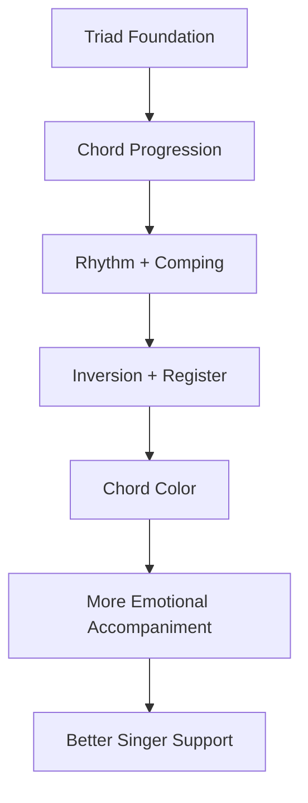
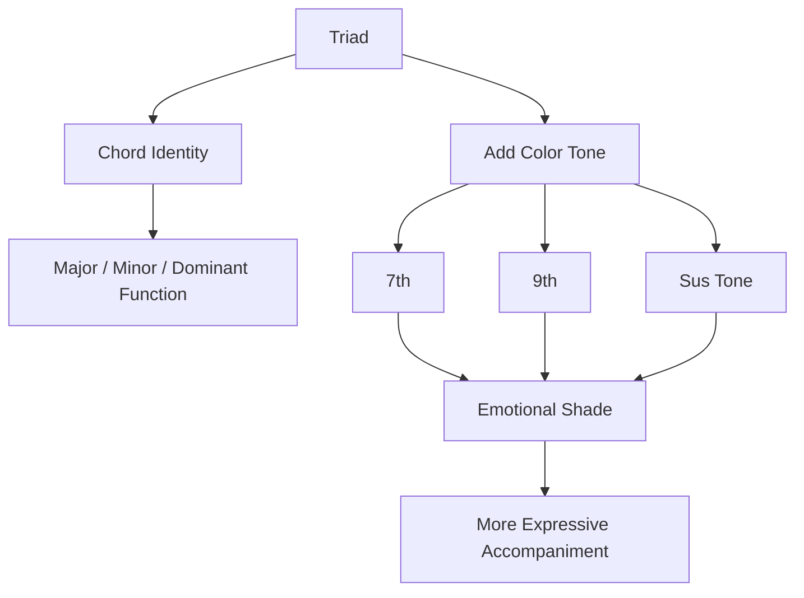
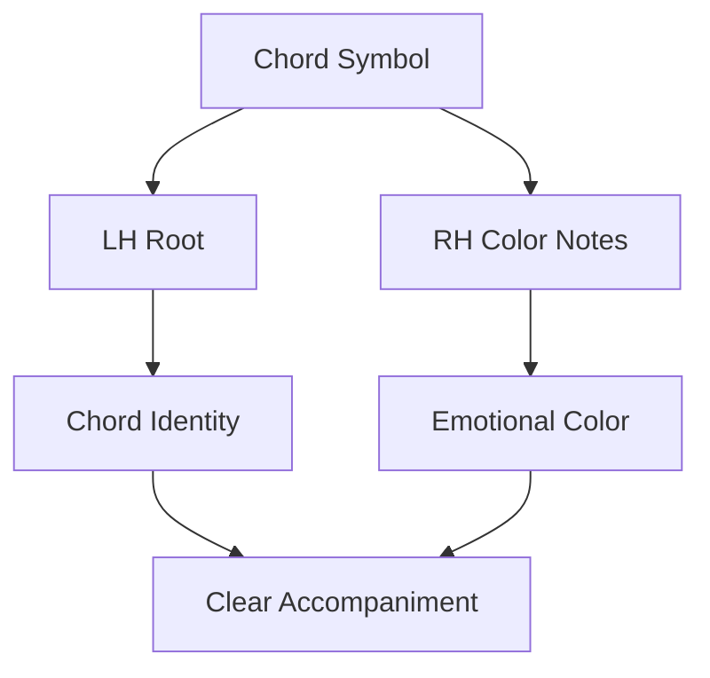
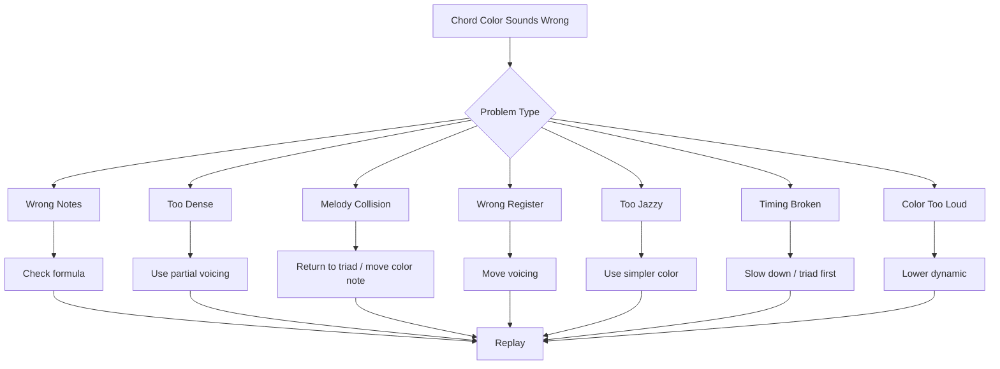
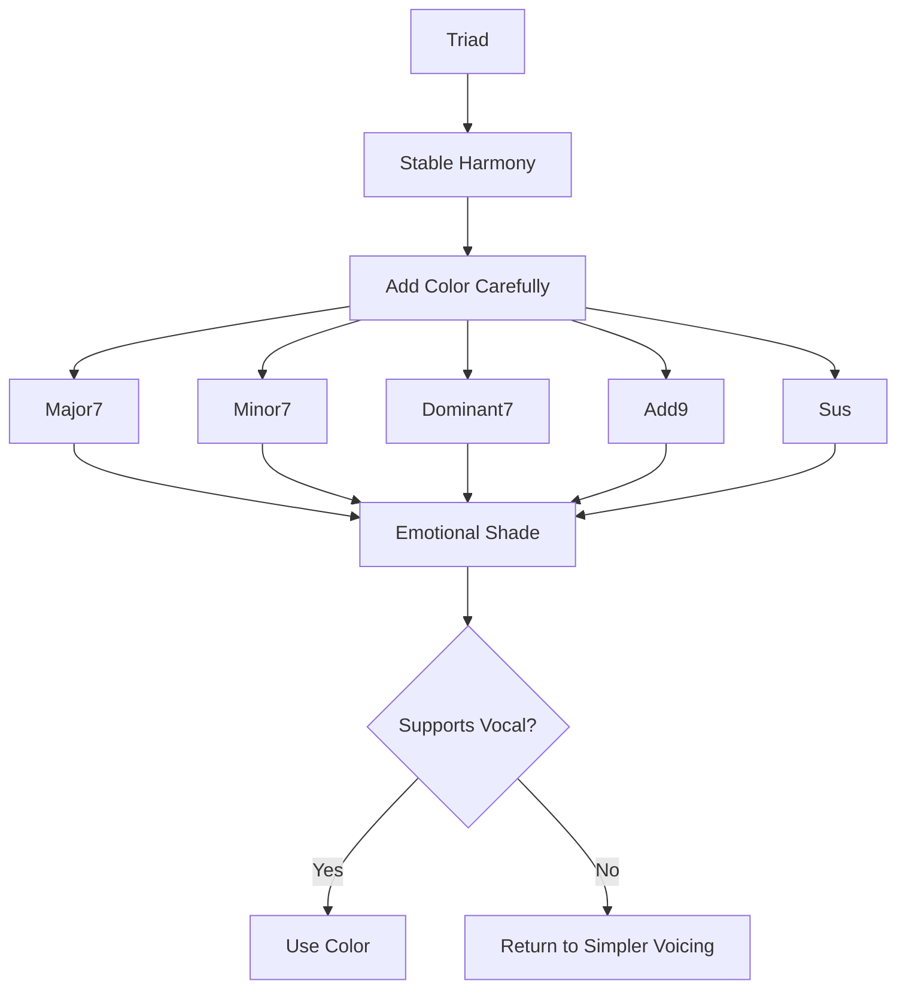

# learn-piano-accompaniment-part-014.md

# Part 014 — Seventh Chords dan Warna Emosi

> Seri: **Learn Piano Accompaniment for Singer Performance**  
> Fokus: **belajar piano untuk mengiringi penyanyi**  
> Framework utama: **The First 20 Hours — Josh Kaufman**  
> Tahap: **Phase D — Voicing: Membuat Chord Tidak Kaku**

---

## Status Seri

| Item | Status |
|---|---|
| Part | 014 |
| Nama file | `learn-piano-accompaniment-part-014.md` |
| Fokus | Seventh chords, add9, sus chord, dan warna emosional untuk accompaniment |
| Prasyarat | Part 000–013 |
| Output praktis | Bisa memperkaya triad sederhana menjadi chord color yang lebih emosional tanpa mengganggu vokal |
| Status seri | Belum selesai |

---

## Daftar Isi

- [1. Tujuan Part Ini](#1-tujuan-part-ini)
- [2. Posisi Part Ini dalam Framework Kaufman](#2-posisi-part-ini-dalam-framework-kaufman)
- [3. Masalah Utama: Triad Benar tetapi Kadang Terlalu Polos](#3-masalah-utama-triad-benar-tetapi-kadang-terlalu-polos)
- [4. Mental Model: Chord Color sebagai Metadata Emosi](#4-mental-model-chord-color-sebagai-metadata-emosi)
- [5. Triad vs Seventh Chord](#5-triad-vs-seventh-chord)
- [6. Scale Degree dan Chord Tone Lanjutan](#6-scale-degree-dan-chord-tone-lanjutan)
- [7. Major 7 Chord](#7-major-7-chord)
- [8. Minor 7 Chord](#8-minor-7-chord)
- [9. Dominant 7 Chord](#9-dominant-7-chord)
- [10. Diminished dan Half-Diminished: Kenali, tetapi Belum Prioritas](#10-diminished-dan-half-diminished-kenali-tetapi-belum-prioritas)
- [11. Chord Color Utama dalam Key C](#11-chord-color-utama-dalam-key-c)
- [12. Cmaj7: Stabil tetapi Lebih Lembut](#12-cmaj7-stabil-tetapi-lebih-lembut)
- [13. Am7: Minor yang Lebih Hangat](#13-am7-minor-yang-lebih-hangat)
- [14. Fmaj7 dan Fadd9: Terbuka dan Emosional](#14-fmaj7-dan-fadd9-terbuka-dan-emosional)
- [15. G7 dan Gsus4: Tension dan Resolusi](#15-g7-dan-gsus4-tension-dan-resolusi)
- [16. Dm7: Predominant yang Lebih Halus](#16-dm7-predominant-yang-lebih-halus)
- [17. Em7: Passing Color dan Warna Lembut](#17-em7-passing-color-dan-warna-lembut)
- [18. Add9: Warna Pop Modern](#18-add9-warna-pop-modern)
- [19. Sus2 dan Sus4](#19-sus2-dan-sus4)
- [20. Add9 vs Sus2: Jangan Tertukar](#20-add9-vs-sus2-jangan-tertukar)
- [21. Sus4 ke Major: Resolusi yang Sangat Berguna](#21-sus4-ke-major-resolusi-yang-sangat-berguna)
- [22. Chord Color dalam Progression I–V–vi–IV](#22-chord-color-dalam-progression-ivviiiv)
- [23. Chord Color dalam Progression vi–IV–I–V](#23-chord-color-dalam-progression-viiviv)
- [24. Chord Color dalam Progression I–vi–IV–V](#24-chord-color-dalam-progression-iviivv)
- [25. Prinsip Aman: Color Jangan Mengganggu Melodi Vokal](#25-prinsip-aman-color-jangan-mengganggu-melodi-vokal)
- [26. Register dan Density untuk Seventh Chords](#26-register-dan-density-untuk-seventh-chords)
- [27. Inversion untuk Seventh Chords](#27-inversion-untuk-seventh-chords)
- [28. Partial Seventh Chord: Tidak Semua Nada Harus Dimainkan](#28-partial-seventh-chord-tidak-semua-nada-harus-dimainkan)
- [29. LH Root + RH Color Notes](#29-lh-root--rh-color-notes)
- [30. Chord Substitution Ringan untuk Pemula](#30-chord-substitution-ringan-untuk-pemula)
- [31. Kapan Memakai Chord Color](#31-kapan-memakai-chord-color)
- [32. Kapan Tidak Memakai Chord Color](#32-kapan-tidak-memakai-chord-color)
- [33. Latihan 1: Dari Triad ke Seventh](#33-latihan-1-dari-triad-ke-seventh)
- [34. Latihan 2: C–G–Am–F dengan Color](#34-latihan-2-cgamf-dengan-color)
- [35. Latihan 3: Verse Minor dengan Am7 dan Fadd9](#35-latihan-3-verse-minor-dengan-am7-dan-fadd9)
- [36. Latihan 4: Sus4 Resolution](#36-latihan-4-sus4-resolution)
- [37. Latihan 5: Color dengan Vokal](#37-latihan-5-color-dengan-vokal)
- [38. Debugging Chord Color](#38-debugging-chord-color)
- [39. Failure Mode Pemula](#39-failure-mode-pemula)
- [40. Practice Protocol 45 Menit](#40-practice-protocol-45-menit)
- [41. Checklist Kelulusan Part 014](#41-checklist-kelulusan-part-014)
- [42. Ringkasan Mental Model](#42-ringkasan-mental-model)
- [43. Persiapan ke Part 015](#43-persiapan-ke-part-015)

---

# 1. Tujuan Part Ini

Sampai Part 013, kita sudah bisa memainkan iringan yang secara fungsional cukup:

- chord dasar;
- progression;
- rhythm;
- broken chord;
- pop ballad comping;
- 6/8;
- inversion;
- register;
- density;
- ruang vokal.

Namun harmoni kita masih banyak memakai triad:

```text
C
G
Am
F
Dm
Em
```

Triad itu benar, stabil, dan wajib dikuasai.

Tetapi dalam banyak lagu pop, ballad, worship, R&B ringan, cinematic ballad, dan accompaniment modern, triad kadang terdengar:

- terlalu polos;
- terlalu “latihan”;
- kurang lembut;
- kurang emosional;
- kurang dewasa;
- kurang cinematic;
- kurang “menggantung” saat dibutuhkan.

Part ini memperkenalkan chord color:

```text
seventh chord
add9
sus2
sus4
```

Target part ini:

> Anda mampu mengubah triad dasar menjadi chord color sederhana seperti `Cmaj7`, `Am7`, `Fadd9`, `Gsus4`, dan `G7`, lalu memakainya secara musikal untuk mengiringi penyanyi tanpa membuat harmoni berlebihan.

Yang penting: kita tidak mengejar chord rumit untuk terlihat pintar.

Kita mengejar:

```text
warna yang tepat
di momen yang tepat
dengan density yang tepat
untuk mendukung vokal
```

---

# 2. Posisi Part Ini dalam Framework Kaufman

Dalam *The First 20 Hours*, kita tidak belajar semua teori harmoni sekaligus. Kita hanya belajar teori secukupnya untuk memperbaiki performa.

Pada tahap awal, triad sudah cukup untuk membuat lagu berjalan.

Namun setelah triad stabil, chord color memberi leverage tinggi karena:

- progression sederhana terdengar lebih musikal;
- verse bisa terasa lebih lembut;
- chorus bisa terasa lebih luas;
- dominant bisa memberi tension lebih jelas;
- intro/outro bisa terdengar lebih dewasa;
- piano tidak perlu banyak nada tambahan jika color dipilih tepat.

Diagram posisi:



Secara Kaufman-style, kita akan mempelajari chord color yang paling sering berguna, bukan semua kemungkinan chord.

Prioritas 20 jam pertama:

```text
Cmaj7
Am7
Fmaj7
Fadd9
G7
Gsus4
Dm7
Em7
```

---

# 3. Masalah Utama: Triad Benar tetapi Kadang Terlalu Polos

Progression dasar:

```text
C - G - Am - F
```

Dengan triad:

```text
C  = C E G
G  = G B D
Am = A C E
F  = F A C
```

Ini benar.

Namun untuk ballad lembut, bisa terasa terlalu polos.

Jika diberi color:

```text
Cmaj7 - Gsus4/G - Am7 - Fadd9
```

rasanya bisa menjadi lebih:

- lembut;
- emosional;
- modern;
- luas;
- cinematic;
- tidak terlalu kaku.

## 3.1 Triad Bukan Salah

Penting:

```text
Triad tidak buruk.
```

Triad adalah fondasi.

Masalah muncul jika:

- semua lagu selalu dimainkan dengan triad polos;
- semua section tidak punya warna;
- chord terlalu “blunt” untuk lirik emosional;
- piano ingin terdengar lebih halus tetapi hanya memakai block triad.

## 3.2 Chord Color Bukan Kewajiban

Chord color adalah pilihan.

Kadang triad lebih tepat karena:

- vokal butuh clarity;
- lagu sederhana;
- chorus butuh statement kuat;
- melodi vokal sudah penuh tension;
- pemain belum stabil.

Prinsip:

```text
Triad first.
Color second.
Song always first.
```

---

# 4. Mental Model: Chord Color sebagai Metadata Emosi

Triad memberi identitas utama chord:

```text
major
minor
dominant-ish context
```

Chord color menambah metadata emosional.

Analogi:

```text
Triad = core object
Chord color = metadata / annotation
```

Contoh:

```text
C = stable home
Cmaj7 = stable home, but softer and more wistful
Cadd9 = stable home, but wider and more open
```

Chord `Am`:

```text
Am = minor / sad / emotional
Am7 = minor, warmer, softer, less harsh
```

Chord `G`:

```text
G = dominant / wants to resolve
G7 = stronger dominant tension
Gsus4 = suspended tension before resolving
```

Diagram:



---

# 5. Triad vs Seventh Chord

Triad memakai tiga nada:

```text
1 - 3 - 5
```

Seventh chord menambahkan nada ke-7:

```text
1 - 3 - 5 - 7
```

atau untuk minor/dominant tertentu:

```text
1 - b3 - 5 - b7
1 - 3 - 5 - b7
```

## 5.1 Contoh C Major Triad

```text
C = C E G
```

Chord tones:

```text
1 = C
3 = E
5 = G
```

## 5.2 Contoh Cmaj7

```text
Cmaj7 = C E G B
```

Chord tones:

```text
1 = C
3 = E
5 = G
7 = B
```

## 5.3 Contoh Am7

```text
Am7 = A C E G
```

Chord tones:

```text
1  = A
b3 = C
5  = E
b7 = G
```

## 5.4 Contoh G7

```text
G7 = G B D F
```

Chord tones:

```text
1  = G
3  = B
5  = D
b7 = F
```

## 5.5 Kenapa 7th Penting?

Nada ke-7 memberi rasa:

- lembut;
- dewasa;
- tension;
- jazzy;
- emotional;
- unresolved;
- sophisticated.

Tetapi jika terlalu banyak dipakai tanpa kontrol, bisa terdengar:

- terlalu jazzy;
- tidak cocok dengan lagu;
- bentrok dengan melodi vokal;
- terlalu padat.

---

# 6. Scale Degree dan Chord Tone Lanjutan

Dalam C major:

```text
C D E F G A B
1 2 3 4 5 6 7
```

Untuk chord C:

```text
1 = C
3 = E
5 = G
7 = B
9 = D
```

Kenapa 9 sama dengan D?

Karena setelah octave:

```text
1 2 3 4 5 6 7 8 9
C D E F G A B C D
```

Jadi:

```text
9 = 2 satu octave lebih tinggi
```

## 6.1 Chord Tone Umum

| Angka | Fungsi |
|---:|---|
| 1 | root |
| 3 / b3 | menentukan major/minor |
| 5 | stabilitas |
| 7 / b7 | color/tension |
| 9 | openness / modern color |
| 4 | suspension |
| 2 | suspension/add color |

## 6.2 Jangan Hafal Buta

Pahami fungsi:

```text
3 menentukan major/minor
7 memberi warna dewasa/tension
9 memberi ruang/open color
4 memberi suspended tension
```

---

# 7. Major 7 Chord

Major 7 chord punya formula:

```text
1 - 3 - 5 - 7
```

Contoh:

```text
Cmaj7 = C E G B
Fmaj7 = F A C E
```

## 7.1 Rasa Major 7

Major 7 terasa:

- lembut;
- nostalgic;
- dreamy;
- wistful;
- sophisticated;
- tidak se-final major triad;
- cocok untuk ballad/intimate verse.

Bandingkan:

```text
C     = terang, stabil, jelas
Cmaj7 = terang, stabil, tetapi lebih lembut dan melankolis
```

## 7.2 Cmaj7

```text
C E G B
```

Jika terlalu padat, gunakan partial:

```text
LH: C
RH: E G B
```

Atau lebih ringan:

```text
LH: C
RH: E B
```

## 7.3 Fmaj7

```text
F A C E
```

Sangat berguna dalam key C.

Progression:

```text
C - G - Am - Fmaj7
```

Fmaj7 sering memberi warna lembut dan emosional.

## 7.4 Kapan Major 7 Cocok?

- verse lembut;
- intro;
- outro;
- ballad;
- bagian reflektif;
- chord I dan IV;
- saat ingin suasana dewasa.

## 7.5 Kapan Hati-Hati?

Major 7 bisa bentrok jika melodi vokal berada sangat dekat dengan nada 7.

Contoh Cmaj7 punya B. Jika melodi vokal menekankan C dengan kuat, B di piano bisa menciptakan gesekan tajam.

Gesekan tidak selalu buruk, tetapi harus disengaja.

---

# 8. Minor 7 Chord

Minor 7 chord punya formula:

```text
1 - b3 - 5 - b7
```

Contoh:

```text
Am7 = A C E G
Dm7 = D F A C
Em7 = E G B D
```

## 8.1 Rasa Minor 7

Minor 7 terasa:

- minor tetapi lebih hangat;
- lebih lembut daripada minor triad polos;
- lebih soulful;
- lebih pop/R&B;
- tidak terlalu gelap;
- cocok untuk verse emosional.

Bandingkan:

```text
Am  = sedih/polos
Am7 = sedih tetapi hangat dan dewasa
```

## 8.2 Am7

```text
A C E G
```

Dalam key C, `Am7` sangat sering dipakai sebagai pengganti `Am`.

Progression:

```text
C - G - Am7 - F
```

atau:

```text
Am7 - Fmaj7 - C - G
```

## 8.3 Dm7

```text
D F A C
```

Cocok sebagai `ii` chord menuju G atau G7:

```text
Dm7 - G7 - C
```

## 8.4 Em7

```text
E G B D
```

Bisa menjadi passing color:

```text
C - Em7 - F
```

atau bagian dari progression:

```text
Em7 - Am7 - Dm7 - G
```

Namun untuk 20 jam pertama, gunakan Em7 secukupnya.

---

# 9. Dominant 7 Chord

Dominant 7 chord punya formula:

```text
1 - 3 - 5 - b7
```

Contoh:

```text
G7 = G B D F
```

Dalam key C, G7 adalah dominant chord yang sangat kuat menuju C.

## 9.1 Rasa Dominant 7

Dominant 7 terasa:

- tegang;
- ingin resolve;
- bluesy;
- classic;
- kuat;
- meminta pulang.

Bandingkan:

```text
G  = tension umum
G7 = tension lebih kuat menuju C
```

## 9.2 G7 ke C

```text
G7 -> C
```

Notes:

```text
G7 = G B D F
C  = C E G
```

Dua nada penting:

```text
B -> C
F -> E
```

Ini memberi resolusi yang kuat.

## 9.3 Kapan G7 Cocok?

- ending;
- sebelum kembali ke C;
- turnaround;
- pre-chorus menuju chorus;
- bagian yang butuh tension;
- ii–V–I:

```text
Dm7 - G7 - C
```

## 9.4 Kapan Hati-Hati?

Dominant 7 bisa terdengar terlalu blues/jazz jika lagu sangat pop polos.

Gunakan jika rasa tension cocok.

Jika terlalu kuat, gunakan:

```text
G
Gsus4
Gadd?
```

atau G triad biasa.

---

# 10. Diminished dan Half-Diminished: Kenali, tetapi Belum Prioritas

Dalam harmoni lengkap, ada chord diminished dan half-diminished.

Namun untuk 20 jam pertama accompaniment pop, ini belum prioritas.

## 10.1 Diminished Triad

Contoh dalam C major:

```text
Bdim = B D F
```

Rasanya:

- tegang;
- tidak stabil;
- ingin resolve;
- sering dipakai sebagai passing chord.

## 10.2 Half-Diminished

Formula:

```text
1 - b3 - b5 - b7
```

Contoh:

```text
Bm7b5 = B D F A
```

## 10.3 Kenapa Belum Prioritas?

Karena untuk target awal:

```text
mengiringi penyanyi dengan piano
```

lebih penting menguasai:

- triad;
- major7;
- minor7;
- dominant7;
- add9;
- sus4.

Diminished bisa dipelajari nanti setelah fondasi accompaniment lebih stabil.

---

# 11. Chord Color Utama dalam Key C

Dalam C major, chord color yang paling berguna untuk tahap awal:

| Degree | Triad | Color Umum | Rasa |
|---:|---|---|---|
| I | C | Cmaj7, Cadd9 | home lembut / terbuka |
| ii | Dm | Dm7 | persiapan halus |
| iii | Em | Em7 | passing lembut |
| IV | F | Fmaj7, Fadd9 | luas, hangat |
| V | G | G7, Gsus4 | tension / resolve |
| vi | Am | Am7 | minor hangat |
| vii° | Bdim | Bm7b5 | belum prioritas |

## 11.1 Progression Dasar dengan Color

Triad:

```text
C - G - Am - F
```

Color:

```text
Cadd9 - Gsus4/G - Am7 - Fadd9
```

atau:

```text
Cmaj7 - G - Am7 - Fmaj7
```

## 11.2 Jangan Semua Color Sekaligus

Jika semua chord diberi color terlalu banyak, lagu bisa kehilangan clarity.

Gunakan secukupnya.

---

# 12. Cmaj7: Stabil tetapi Lebih Lembut

Chord:

```text
Cmaj7 = C E G B
```

Rasa:

```text
home, lembut, dreamy, reflective
```

## 12.1 Dari C ke Cmaj7

Triad:

```text
C E G
```

Tambahkan B:

```text
C E G B
```

## 12.2 Voicing Aman

Dengan LH root:

```text
LH: C
RH: E G B
```

Lebih ringan:

```text
LH: C
RH: E B
```

Atau:

```text
LH: C
RH: G B E
```

## 12.3 Kapan Dipakai?

- intro lembut;
- verse;
- outro;
- chord pertama lagu yang ingin terasa intimate;
- bagian reflektif.

## 12.4 Kapan Tidak?

- jika melody vokal banyak menekankan C dan B terasa mengganggu;
- jika chorus butuh chord C yang sangat clear/strong;
- jika lagu terlalu sederhana dan Cmaj7 terasa tidak cocok.

---

# 13. Am7: Minor yang Lebih Hangat

Chord:

```text
Am7 = A C E G
```

Rasa:

```text
minor, hangat, soft, emotional
```

## 13.1 Dari Am ke Am7

Triad:

```text
A C E
```

Tambahkan G:

```text
A C E G
```

## 13.2 Voicing Aman

Dengan LH root:

```text
LH: A
RH: C E G
```

Lebih ringan:

```text
LH: A
RH: C G
```

Atau:

```text
LH: A
RH: E G C
```

## 13.3 Kapan Dipakai?

- verse emosional;
- ballad;
- progression minor feel;
- `vi` chord dalam key C;
- saat Am triad terasa terlalu polos.

## 13.4 Contoh Progression

```text
Am7 - Fadd9 - C - G
```

atau:

```text
C - G - Am7 - F
```

---

# 14. Fmaj7 dan Fadd9: Terbuka dan Emosional

Chord F sangat penting dalam key C.

Triad:

```text
F = F A C
```

Dua color yang sangat berguna:

```text
Fmaj7 = F A C E
Fadd9 = F A C G
```

## 14.1 Fmaj7

Rasa:

- lembut;
- warm;
- reflective;
- sedikit wistful.

Voicing:

```text
LH: F
RH: A C E
```

atau:

```text
LH: F
RH: C E A
```

## 14.2 Fadd9

Rasa:

- terbuka;
- modern;
- cinematic;
- pop;
- luas.

Voicing:

```text
LH: F
RH: A C G
```

atau lebih open:

```text
LH: F
RH: C G A
```

## 14.3 Fmaj7 vs Fadd9

| Chord | Notes | Rasa |
|---|---|---|
| Fmaj7 | F A C E | lembut, dreamy |
| Fadd9 | F A C G | terbuka, modern |
| F | F A C | jelas, stabil |

## 14.4 Kapan Dipakai?

Fadd9 sangat cocok untuk pop ballad/worship/cinematic accompaniment.

Progression:

```text
C - G - Am7 - Fadd9
```

sering terdengar lebih modern daripada:

```text
C - G - Am - F
```

---

# 15. G7 dan Gsus4: Tension dan Resolusi

Chord G adalah dominant dalam key C.

Triad:

```text
G = G B D
```

Color penting:

```text
G7 = G B D F
Gsus4 = G C D
```

## 15.1 G7

Rasa:

```text
tension kuat menuju C
```

Voicing:

```text
LH: G
RH: B D F
```

atau lebih ringan:

```text
LH: G
RH: B F
```

Nada penting:

```text
B dan F
```

B menuju C.

F menuju E.

## 15.2 Gsus4

Chord:

```text
G C D
```

Sus4 berarti third (`B`) diganti oleh fourth (`C`).

Rasa:

```text
tertahan, menggantung, belum resolve
```

Resolusi:

```text
Gsus4 -> G -> C
```

Notes:

```text
G C D -> G B D -> C E G
```

C turun ke B, lalu resolve ke C chord.

## 15.3 Kapan Gsus4 Cocok?

- sebelum chorus;
- sebelum ending;
- saat ingin tension tetapi tidak terlalu tajam;
- intro/outro;
- cadential moment.

## 15.4 Gsus4 ke G

Ini salah satu gerakan paling berguna untuk pengiring.

```text
Gsus4 -> G
C -> B
```

Satu nada bergerak, efeknya kuat.

---

# 16. Dm7: Predominant yang Lebih Halus

Chord:

```text
Dm7 = D F A C
```

Fungsi dalam key C:

```text
ii chord
```

Biasanya menuju:

```text
G atau G7
```

Progression:

```text
Dm7 - G7 - C
```

## 16.1 Rasa

Dm7 terasa:

- minor;
- lembut;
- persiapan;
- tidak seberat Dm polos;
- cocok untuk menuju dominant.

## 16.2 Voicing Aman

Dengan LH:

```text
LH: D
RH: F A C
```

Lebih ringan:

```text
LH: D
RH: F C
```

## 16.3 Kapan Dipakai?

- pre-chorus;
- ending;
- turnaround;
- bridge;
- saat ingin progression lebih smooth.

## 16.4 Contoh Ending

```text
Dm7 - G7 - Cmaj7
```

Rasanya lebih halus daripada:

```text
Dm - G - C
```

---

# 17. Em7: Passing Color dan Warna Lembut

Chord:

```text
Em7 = E G B D
```

Dalam key C, Em7 adalah `iii7`.

## 17.1 Rasa

Em7 terasa:

- lembut;
- passing;
- tidak terlalu final;
- bisa menghubungkan C dan F atau Am.

## 17.2 Contoh Pemakaian

```text
C - Em7 - F
```

atau:

```text
C - G/B - Am - Em7 - F
```

Namun untuk tahap awal, jangan terlalu banyak memakai Em7 sebagai substitusi.

Gunakan sebagai color ketika progression membutuhkan langkah halus.

## 17.3 Voicing Aman

```text
LH: E
RH: G B D
```

atau:

```text
LH: E
RH: G D
```

## 17.4 Hati-Hati

Em7 bisa membuat progression terasa lebih jazzy/soft. Pastikan cocok dengan lagu.

---

# 18. Add9: Warna Pop Modern

Add9 berarti triad ditambah nada 9, tanpa seventh.

Formula:

```text
1 - 3 - 5 - 9
```

Contoh:

```text
Cadd9 = C E G D
Fadd9 = F A C G
```

## 18.1 Rasa Add9

Add9 terasa:

- modern;
- terbuka;
- luas;
- pop;
- cinematic;
- tidak terlalu jazzy dibanding maj9;
- aman untuk banyak ballad.

## 18.2 Cadd9

```text
C E G D
```

Dengan LH:

```text
LH: C
RH: E G D
```

Atau:

```text
LH: C
RH: G D E
```

## 18.3 Fadd9

```text
F A C G
```

Dengan LH:

```text
LH: F
RH: A C G
```

## 18.4 Kapan Add9 Cocok?

- intro;
- verse;
- chorus yang luas;
- worship/pop ballad;
- cinematic accompaniment;
- saat triad terasa terlalu kaku tetapi maj7 terlalu jazzy.

## 18.5 Hati-Hati

Add9 bisa bentrok dengan melodi jika vokal menekankan nada yang berdekatan.

Tetap dengarkan.

---

# 19. Sus2 dan Sus4

Sus berarti suspended.

Pada sus chord, third diganti oleh second atau fourth.

## 19.1 Sus2

Formula:

```text
1 - 2 - 5
```

Contoh:

```text
Csus2 = C D G
```

Rasa:

- terbuka;
- ambiguous;
- tidak major/minor;
- ringan;
- modern.

## 19.2 Sus4

Formula:

```text
1 - 4 - 5
```

Contoh:

```text
Csus4 = C F G
Gsus4 = G C D
```

Rasa:

- tertahan;
- tension;
- ingin resolve;
- cocok sebelum chord major/minor.

## 19.3 Sus Menghapus Third

Karena third diganti, chord sus tidak jelas major/minor.

Contoh:

```text
G = G B D
Gsus4 = G C D
```

`B` diganti `C`.

## 19.4 Fungsi Sus

Sus chord berguna untuk:

- tension lembut;
- intro;
- transition;
- build-up;
- sebelum resolving chord;
- memberi ruang melodi.

---

# 20. Add9 vs Sus2: Jangan Tertukar

Ini sering membingungkan.

## 20.1 Cadd9

```text
C E G D
```

Ada third:

```text
E
```

Jadi Cadd9 tetap jelas major.

## 20.2 Csus2

```text
C D G
```

Tidak ada third.

Jadi Csus2 tidak jelas major/minor.

## 20.3 Perbedaan

| Chord | Notes | Ada third? | Rasa |
|---|---|---|---|
| Cadd9 | C E G D | Ya | major terbuka |
| Csus2 | C D G | Tidak | suspended/ambiguous |
| C | C E G | Ya | major jelas |

## 20.4 Praktik

Jika ingin warna pop tetapi chord tetap jelas:

```text
Cadd9
```

Jika ingin chord lebih suspended/ambiguous:

```text
Csus2
```

---

# 21. Sus4 ke Major: Resolusi yang Sangat Berguna

Gerakan:

```text
sus4 -> major
```

sangat berguna untuk piano accompaniment.

Contoh:

```text
Gsus4 -> G
```

Notes:

```text
Gsus4 = G C D
G     = G B D
```

Yang bergerak:

```text
C -> B
```

Satu nada turun setengah langkah.

Rasanya:

```text
tertahan -> jelas
```

## 21.1 Menuju C

Setelah itu:

```text
G -> C
```

Jadi full cadence:

```text
Gsus4 -> G -> C
```

## 21.2 Kapan Dipakai?

- akhir intro;
- akhir pre-chorus;
- sebelum chorus;
- ending;
- saat ingin tension tetapi tidak terlalu tajam.

## 21.3 Pattern Praktis

Dengan LH:

```text
LH: G
RH: C D G
```

lalu:

```text
LH: G
RH: B D G
```

lalu:

```text
LH: C
RH: C E G
```

## 21.4 Dynamic

Sus4 bisa dimainkan sedikit lebih tegang.

Resolve ke G lebih lembut.

C final bisa lebih stabil.

---

# 22. Chord Color dalam Progression I–V–vi–IV

Progression dasar:

```text
I - V - vi - IV
C - G - Am - F
```

Versi color:

```text
Cadd9 - Gsus4/G - Am7 - Fadd9
```

atau:

```text
Cmaj7 - G7 - Am7 - Fmaj7
```

## 22.1 Versi Pop Ballad Aman

```text
Cadd9 - G - Am7 - Fadd9
```

Kenapa aman?

- Cadd9 terbuka;
- G tetap jelas;
- Am7 hangat;
- Fadd9 luas.

## 22.2 Versi Lebih Dreamy

```text
Cmaj7 - G - Am7 - Fmaj7
```

Rasa:

- soft;
- dreamy;
- reflective;
- lebih jazzy/pop ballad.

## 22.3 Versi dengan Tension

```text
C - Gsus4 - Am7 - Fadd9
```

atau:

```text
C - G7 - Am7 - F
```

Hati-hati: `G7` ke `Am7` bukan resolusi dominant klasik ke C, tetapi tetap bisa dipakai sebagai color. Dengarkan apakah cocok.

## 22.4 Practical Voicing

```text
LH: C     G     A     F
RH: E-G-D B-D-G C-E-G A-C-G
```

Ini mewakili:

```text
Cadd9 - G - Am7 - Fadd9
```

---

# 23. Chord Color dalam Progression vi–IV–I–V

Progression:

```text
vi - IV - I - V
Am - F - C - G
```

Versi color:

```text
Am7 - Fadd9 - Cadd9 - Gsus4/G
```

## 23.1 Rasa

Ini cocok untuk verse emosional.

```text
Am7   = minor hangat
Fadd9 = luas
Cadd9 = home terbuka
G     = tension
```

## 23.2 Voicing Aman

```text
LH: A     F     C     G
RH: C-E-G A-C-G E-G-D B-D-G
```

## 23.3 Verse Pattern

Gunakan density rendah:

```text
X - - -
```

atau broken chord lembut.

Jangan langsung semua chord full dan keras.

## 23.4 Chorus Transition

Akhiri dengan:

```text
Gsus4 -> G
```

lalu masuk ke chorus:

```text
Cadd9
```

Ini memberi cue yang sangat bagus untuk penyanyi.

---

# 24. Chord Color dalam Progression I–vi–IV–V

Progression:

```text
C - Am - F - G
```

Versi color:

```text
Cadd9 - Am7 - Fadd9 - Gsus4/G
```

atau:

```text
Cmaj7 - Am7 - Fmaj7 - G7
```

## 24.1 Rasa

Progression ini klasik dan stabil.

Dengan color, ia menjadi lebih lembut.

## 24.2 Ending dengan G7

Jika progression kembali ke C, gunakan:

```text
G7 -> C
```

Contoh:

```text
Cadd9 - Am7 - Fadd9 - G7 | C
```

## 24.3 Sus Resolution

Alternatif:

```text
Cadd9 - Am7 - Fadd9 - Gsus4 - G | C
```

Rasa:

```text
open -> warm -> wide -> suspended -> resolve -> home
```

## 24.4 Untuk Accompaniment

Pattern bagus:

- verse: partial chord;
- pre-chorus: add sus;
- chorus: triad/add9 lebih penuh;
- ending: Gsus4-G-C.

---

# 25. Prinsip Aman: Color Jangan Mengganggu Melodi Vokal

Chord color menambah nada.

Nada tambahan bisa indah, tetapi bisa bentrok dengan melodi vokal.

## 25.1 Benturan Tidak Selalu Salah

Tension bisa indah jika disengaja.

Namun untuk pemula, jika color membuat vokal terdengar aneh, kurangi.

## 25.2 Tanda Color Mengganggu

- penyanyi terdengar out of tune padahal tidak;
- melodi terasa melawan chord;
- chord terdengar terlalu jazzy;
- lirik sederhana terasa terlalu kompleks;
- piano menarik perhatian;
- nada color terlalu menonjol di top note.

## 25.3 Solusi

- kembali ke triad;
- gunakan color lebih lembut;
- pindahkan color note ke register lebih rendah/lembut;
- gunakan partial voicing;
- jangan letakkan color note sebagai top note jika mengganggu;
- mainkan color hanya di intro/interlude/outro.

## 25.4 Rule

```text
Jika ragu, triad lebih aman daripada color yang salah konteks.
```

---

# 26. Register dan Density untuk Seventh Chords

Seventh chord punya lebih banyak nada daripada triad.

Artinya vertical density naik.

Jika dimainkan penuh di register tengah dengan volume besar, bisa menutup vokal.

## 26.1 Jangan Selalu Main 4 Nada Penuh

Contoh:

```text
Cmaj7 = C E G B
```

Tidak harus semua dimainkan di RH.

Dengan LH root:

```text
LH: C
RH: E G B
```

Atau lebih ringan:

```text
LH: C
RH: E B
```

## 26.2 Color Note Harus Terkontrol

Color note seperti:

```text
7
9
4/sus
```

sering menarik perhatian.

Mainkan lembut.

## 26.3 Register Aman

- LH root low-mid;
- RH color middle/upper-middle;
- hindari chord 4 nada terlalu rendah;
- hindari high color note terlalu keras.

## 26.4 Density Rule

```text
Semakin banyak color, semakin perlu mengurangi density lain.
```

Jika chord lebih kompleks, rhythm bisa lebih sederhana.

---

# 27. Inversion untuk Seventh Chords

Seventh chord juga bisa diinversi.

Namun untuk 20 jam pertama, jangan terlalu banyak teori inversion seventh chord.

Gunakan prinsip praktis:

```text
LH memainkan root
RH memainkan 2–3 nada penting yang dekat
```

## 27.1 Contoh Cmaj7

Full:

```text
C E G B
```

Dengan LH C:

```text
RH: E G B
```

Inversion/voicing lain:

```text
RH: G B E
RH: B E G
```

## 27.2 Contoh Am7

Full:

```text
A C E G
```

Dengan LH A:

```text
RH: C E G
RH: E G C
RH: G C E
```

## 27.3 Contoh G7

Full:

```text
G B D F
```

Dengan LH G:

```text
RH: B D F
RH: B F
RH: F B D
```

## 27.4 Prinsip

Untuk seventh chord, tidak perlu selalu memainkan fifth.

Contoh G7:

```text
G B D F
```

Nada paling penting:

```text
B dan F
```

Karena mereka membentuk tension dominant.

Dengan LH G, RH cukup:

```text
B F
```

untuk rasa G7 yang jelas.

---

# 28. Partial Seventh Chord: Tidak Semua Nada Harus Dimainkan

Ini sangat penting.

Seventh chord penuh punya empat nada.

Tetapi dalam accompaniment, Anda sering cukup memainkan dua atau tiga nada.

## 28.1 Cmaj7

Full:

```text
C E G B
```

Dengan LH C, RH bisa:

```text
E B
E G B
G B E
```

## 28.2 Am7

Full:

```text
A C E G
```

Dengan LH A, RH bisa:

```text
C G
C E G
E G C
```

## 28.3 Fadd9

Full:

```text
F A C G
```

Dengan LH F, RH bisa:

```text
A G
A C G
C G A
```

## 28.4 G7

Full:

```text
G B D F
```

Dengan LH G, RH bisa:

```text
B F
B D F
F B D
```

## 28.5 Kenapa Partial Penting?

- mengurangi density;
- membuat vocal space;
- memperjelas color;
- menghindari muddy;
- mempermudah fingering;
- membuat accompaniment lebih profesional.

---

# 29. LH Root + RH Color Notes

Ini pattern berpikir paling berguna untuk pemula.

Daripada selalu berpikir:

```text
saya harus memainkan semua nada chord
```

pikirkan:

```text
LH = root
RH = color notes penting
```

## 29.1 Contoh

Cadd9:

```text
LH: C
RH: E G D
```

Am7:

```text
LH: A
RH: C E G
```

Fadd9:

```text
LH: F
RH: A C G
```

G7:

```text
LH: G
RH: B D F
```

Gsus4:

```text
LH: G
RH: C D G
```

## 29.2 RH Dua Nada

Lebih minimal:

```text
Cadd9: LH C, RH E-D
Am7  : LH A, RH C-G
Fadd9: LH F, RH A-G
G7   : LH G, RH B-F
```

## 29.3 Diagram



---

# 30. Chord Substitution Ringan untuk Pemula

Substitution di sini bukan reharmonization advanced.

Maksudnya hanya mengganti triad dengan color version yang masih sangat dekat.

## 30.1 Substitution Aman

| Triad | Color Aman |
|---|---|
| C | Cadd9, Cmaj7 |
| G | Gsus4, G7 |
| Am | Am7 |
| F | Fadd9, Fmaj7 |
| Dm | Dm7 |
| Em | Em7 |

## 30.2 Contoh

Original:

```text
C - G - Am - F
```

Substitution ringan:

```text
Cadd9 - G - Am7 - Fadd9
```

Original:

```text
Dm - G - C
```

Substitution:

```text
Dm7 - G7 - Cmaj7
```

## 30.3 Jangan Terlalu Banyak

Jika semua chord diganti, lagu bisa berubah rasa.

Mulai dari satu atau dua chord saja.

Contoh:

```text
C - G - Am7 - Fadd9
```

lebih aman daripada langsung:

```text
Cmaj9 - G13sus - Am11 - Fmaj9
```

Untuk 20 jam pertama, jangan ke sana.

---

# 31. Kapan Memakai Chord Color

Chord color cocok saat:

## 31.1 Verse Butuh Lembut

Gunakan:

```text
Cmaj7
Am7
Fmaj7
```

## 31.2 Lagu Butuh Rasa Modern

Gunakan:

```text
Cadd9
Fadd9
Gsus4
```

## 31.3 Pre-Chorus Butuh Tension

Gunakan:

```text
Gsus4
G7
Dm7 - G7
```

## 31.4 Intro/Outro Butuh Nuansa

Gunakan:

```text
Cadd9
Fadd9
Cmaj7
Am7
```

## 31.5 Ending Butuh Resolusi

Gunakan:

```text
Gsus4 - G - C
```

atau:

```text
Dm7 - G7 - Cmaj7
```

## 31.6 Vokal Memberi Ruang

Jika vokal sedang diam atau sustain, color bisa lebih terdengar tanpa mengganggu.

---

# 32. Kapan Tidak Memakai Chord Color

Chord color sebaiknya dihindari atau dikurangi saat:

## 32.1 Melodi Vokal Bentrok

Jika color note mengganggu melodi, gunakan triad.

## 32.2 Lagu Butuh Simplicity

Beberapa lagu lebih kuat dengan chord polos.

## 32.3 Chorus Butuh Statement Tegas

Kadang triad lebih powerful daripada maj7 yang lembut.

## 32.4 Pemain Belum Stabil

Jika chord color membuat timing rusak, kembali ke triad.

## 32.5 Register Terlalu Padat

Seventh chord penuh di register tengah bisa menutup vokal.

## 32.6 Semua Chord Terlalu Berwarna

Jika semua chord diberi extension, telinga lelah.

Gunakan contrast.

## 32.7 Tidak Tahu Fungsi Color

Jangan memakai color hanya karena terlihat keren di chord chart.

---

# 33. Latihan 1: Dari Triad ke Seventh

Tujuan:

> mendengar perbedaan triad dan seventh chord.

## 33.1 C ke Cmaj7

Mainkan:

```text
C     = C E G
Cmaj7 = C E G B
```

Dengan LH/RH:

```text
LH: C
RH: E G

LH: C
RH: E G B
```

Dengarkan bedanya.

## 33.2 Am ke Am7

```text
Am  = A C E
Am7 = A C E G
```

Dengan LH:

```text
LH: A
RH: C E

LH: A
RH: C E G
```

## 33.3 G ke G7

```text
G  = G B D
G7 = G B D F
```

Dengan LH:

```text
LH: G
RH: B D

LH: G
RH: B D F
```

## 33.4 F ke Fmaj7/Fadd9

```text
F     = F A C
Fmaj7 = F A C E
Fadd9 = F A C G
```

Bandingkan rasa Fmaj7 dan Fadd9.

---

# 34. Latihan 2: C–G–Am–F dengan Color

Progression original:

```text
C - G - Am - F
```

Versi color aman:

```text
Cadd9 - G - Am7 - Fadd9
```

## 34.1 Voicing

```text
Cadd9: LH C, RH E-G-D
G    : LH G, RH B-D-G
Am7  : LH A, RH C-E-G
Fadd9: LH F, RH A-C-G
```

## 34.2 Pattern

Gunakan pattern sederhana:

```text
X - - -
```

Lalu:

```text
X - x -
```

Jangan langsung rhythm padat.

## 34.3 Evaluasi

Bandingkan dengan triad polos:

```text
C - G - Am - F
```

Tanya:

- apakah lebih lembut?
- apakah lebih modern?
- apakah terlalu padat?
- apakah vokal masih punya ruang?
- chord mana yang paling cocok diberi color?

---

# 35. Latihan 3: Verse Minor dengan Am7 dan Fadd9

Progression:

```text
Am - F - C - G
```

Versi color:

```text
Am7 - Fadd9 - Cadd9 - Gsus4/G
```

## 35.1 Voicing

```text
Am7 : LH A, RH C-E-G
Fadd9: LH F, RH A-C-G
Cadd9: LH C, RH E-G-D
Gsus4: LH G, RH C-D-G
G    : LH G, RH B-D-G
```

## 35.2 Pattern Verse

Gunakan density rendah:

```text
X - - -
```

atau broken chord lembut.

## 35.3 Rasa

Progression ini cocok untuk:

- verse emosional;
- lirik reflektif;
- ballad;
- intro minor-ish.

## 35.4 Tambahkan Resolusi

Akhiri bar G dengan:

```text
Gsus4 -> G
```

lalu masuk ke C atau chorus.

---

# 36. Latihan 4: Sus4 Resolution

Tujuan:

> menguasai tension-resolution paling berguna.

## 36.1 Gsus4 ke G

```text
Gsus4 = G C D
G     = G B D
```

Dengan LH:

```text
LH: G
RH: C D G
```

lalu:

```text
LH: G
RH: B D G
```

Yang bergerak:

```text
C -> B
```

## 36.2 Gsus4 - G - C

Mainkan:

```text
Gsus4 - G - C
```

Voicing:

```text
LH G, RH C-D-G
LH G, RH B-D-G
LH C, RH C-E-G
```

## 36.3 Pattern

Mainkan:

```text
Gsus4: 2 beat
G    : 2 beat
C    : 4 beat
```

Dalam 4/4:

```text
| Gsus4  G | C     |
```

## 36.4 Aplikasi

Gunakan ini:

- sebelum chorus;
- ending;
- intro cue;
- transisi section.

---

# 37. Latihan 5: Color dengan Vokal

Gunakan satu kalimat sederhana:

```text
Aku masih menunggu di sini
```

Mainkan dua versi.

## 37.1 Versi Triad

```text
C - G - Am - F
```

## 37.2 Versi Color

```text
Cadd9 - G - Am7 - Fadd9
```

## 37.3 Rekam

Rekam keduanya sambil humming/bernyanyi.

## 37.4 Evaluasi

Tanya:

- versi mana lebih mendukung vokal?
- apakah color membuat vokal lebih emosional?
- apakah color mengganggu melody?
- apakah chord terasa terlalu jazzy?
- apakah density terlalu tinggi?
- apakah perlu hanya memberi color pada satu chord saja?

## 37.5 Prinsip

Jawaban tidak selalu “color lebih baik”.

Kadang triad lebih tepat.

Latihan ini mengajarkan judgment.

---

# 38. Debugging Chord Color

Jika chord color terdengar aneh, debug layer.



## 38.1 Wrong Notes

Gejala:

```text
chord terdengar benar-benar salah
```

Solusi:

- cek formula;
- tulis notes;
- main triad dulu;
- tambahkan color note satu per satu.

## 38.2 Too Dense

Gejala:

```text
chord terlalu penuh
```

Solusi:

- jangan main semua nada;
- LH root + RH 2–3 notes;
- hilangkan fifth jika perlu.

## 38.3 Melody Collision

Gejala:

```text
vokal terasa melawan chord
```

Solusi:

- kembali ke triad;
- pindahkan color note;
- main color lebih lembut;
- jangan jadikan color note top note.

## 38.4 Wrong Register

Gejala:

```text
muddy atau piercing
```

Solusi:

- RH middle/upper-middle lembut;
- jangan chord 4 nada terlalu rendah;
- kurangi pedal.

## 38.5 Too Jazzy

Gejala:

```text
lagu pop sederhana terasa terlalu kompleks
```

Solusi:

- gunakan add9 daripada maj7;
- gunakan triad di chorus;
- color hanya di intro/verse/outro.

## 38.6 Timing Broken

Gejala:

```text
karena chord lebih sulit, tempo rusak
```

Solusi:

- pakai triad dulu;
- pakai partial color;
- perlambat;
- jangan syncopation dulu.

---

# 39. Failure Mode Pemula

## 39.1 Menggunakan Color karena Terlihat Keren

Chord color harus melayani lagu, bukan ego pemain.

## 39.2 Semua Chord Diberi Seventh

Jika semua chord menjadi seventh tanpa alasan, lagu bisa terlalu jazzy atau terlalu lembek.

## 39.3 Chord Terlalu Padat di RH

Seventh chord penuh di register tengah sering menutup vokal.

Gunakan partial voicing.

## 39.4 Lupa Third

Saat memakai sus atau open voicing, major/minor bisa hilang.

Kadang ini bagus. Kadang membuat chord tidak jelas.

## 39.5 G7 Dipakai Sembarangan

G7 punya tension kuat. Gunakan saat ingin resolve atau memberi tension.

## 39.6 Add9 dan Sus2 Tertukar

Cadd9 masih punya third.

Csus2 tidak punya third.

Jangan tertukar jika butuh major/minor clarity.

## 39.7 Color Note Terlalu Keras

Nada 7 atau 9 bisa sangat terdengar. Mainkan dengan kontrol.

## 39.8 Timing Rusak karena Chord Baru

Jika chord color membuat tangan lambat, pilih voicing lebih sederhana.

## 39.9 Tidak Mendengarkan Vokal

Chord color yang indah sendiri bisa buruk jika mengganggu melodi vokal.

---

# 40. Practice Protocol 45 Menit

Gunakan sesi ini untuk Part 014.

## 40.1 Menit 0–5: Review Triad

Mainkan:

```text
C
G
Am
F
Dm
Em
```

Dengan LH root + RH triad/partial.

## 40.2 Menit 5–10: Major7 dan Minor7

Mainkan:

```text
C -> Cmaj7
F -> Fmaj7
Am -> Am7
Dm -> Dm7
Em -> Em7
```

Dengarkan perbedaannya.

## 40.3 Menit 10–15: Dominant dan Sus

Mainkan:

```text
G -> G7
Gsus4 -> G
Gsus4 -> G -> C
```

## 40.4 Menit 15–20: Add9

Mainkan:

```text
C -> Cadd9
F -> Fadd9
```

Bandingkan dengan:

```text
Cmaj7
Fmaj7
```

## 40.5 Menit 20–25: Progression Color

Mainkan:

```text
Cadd9 - G - Am7 - Fadd9
```

Pattern:

```text
X - - -
```

## 40.6 Menit 25–30: Progression Verse

Mainkan:

```text
Am7 - Fadd9 - Cadd9 - Gsus4/G
```

Dynamic level 2.

## 40.7 Menit 30–35: Sus Resolution

Latih:

```text
Gsus4 - G - C
```

Dalam beberapa dynamic:

- lembut;
- medium;
- ending.

## 40.8 Menit 35–40: Color dengan Vokal

Humming/nyanyikan kalimat sederhana.

Bandingkan:

```text
triad version
color version
```

## 40.9 Menit 40–45: Record and Review

Rekam 1 menit.

Jawab:

- apakah color mendukung vokal?
- apakah chord terlalu padat?
- apakah melody collision terjadi?
- apakah register aman?
- apakah color terlalu keras?
- apakah timing tetap stabil?
- apakah triad mungkin lebih cocok?

---

# 41. Checklist Kelulusan Part 014

Anda boleh lanjut ke Part 015 jika sebagian besar checklist ini terpenuhi.

## 41.1 Pemahaman

- [ ] Saya tahu triad terdiri dari `1-3-5`.
- [ ] Saya tahu seventh chord menambahkan nada ke-7.
- [ ] Saya tahu major7 formula `1-3-5-7`.
- [ ] Saya tahu minor7 formula `1-b3-5-b7`.
- [ ] Saya tahu dominant7 formula `1-3-5-b7`.
- [ ] Saya tahu add9 berarti triad + 9.
- [ ] Saya tahu sus2/sus4 mengganti third.
- [ ] Saya tahu Cadd9 berbeda dari Csus2.
- [ ] Saya tahu chord color bisa mengganggu melodi vokal jika tidak dikontrol.
- [ ] Saya tahu partial voicing sering lebih baik daripada chord penuh.

## 41.2 Praktik

- [ ] Saya bisa memainkan Cmaj7.
- [ ] Saya bisa memainkan Am7.
- [ ] Saya bisa memainkan Fmaj7.
- [ ] Saya bisa memainkan Fadd9.
- [ ] Saya bisa memainkan G7.
- [ ] Saya bisa memainkan Gsus4 ke G.
- [ ] Saya bisa memainkan Dm7.
- [ ] Saya bisa memainkan progression `Cadd9 - G - Am7 - Fadd9`.
- [ ] Saya bisa memainkan progression `Am7 - Fadd9 - Cadd9 - G`.
- [ ] Saya bisa memainkan `Gsus4 - G - C`.

## 41.3 Self-Correction

- [ ] Saya bisa mendeteksi jika chord color terlalu padat.
- [ ] Saya bisa mengurangi chord menjadi partial voicing.
- [ ] Saya bisa kembali ke triad jika color mengganggu.
- [ ] Saya bisa mendengar jika G7 memberi tension kuat.
- [ ] Saya bisa mendengar bedanya Fmaj7 dan Fadd9.
- [ ] Saya bisa mendeteksi jika color note terlalu keras.
- [ ] Saya bisa mengecek apakah chord color mendukung vokal atau tidak.

---

# 42. Ringkasan Mental Model

Triad adalah fondasi:

```text
1 - 3 - 5
```

Chord color menambah warna:

```text
7
b7
9
sus2
sus4
```

Chord penting:

```text
Cmaj7 = C E G B
Am7   = A C E G
Fmaj7 = F A C E
Fadd9 = F A C G
G7    = G B D F
Gsus4 = G C D
Dm7   = D F A C
Em7   = E G B D
```

Prinsip utama:

```text
Triad first.
Color second.
Vocal always first.
```

Diagram ringkas:



Kalimat kunci:

```text
Chord color bukan untuk membuat piano terlihat rumit.
Chord color adalah cara memberi emosi tambahan tanpa mengorbankan vokal.
```

---

# 43. Persiapan ke Part 015

Part berikutnya adalah:

```text
learn-piano-accompaniment-part-015.md
```

Judul:

```text
Voicing Pop Modern: Add9, Sus, dan Open Voicing
```

Di Part 014, kita mengenal chord color:

- major7;
- minor7;
- dominant7;
- add9;
- sus2;
- sus4.

Di Part 015, kita akan memperdalam sisi praktis dari voicing modern:

- open voicing;
- spread voicing;
- shell voicing;
- add9 untuk warna pop;
- sus chord untuk tension;
- chord tanpa third;
- cara menciptakan kesan luas;
- contoh voicing aman untuk lagu worship/pop/ballad;
- latihan progresif;
- cara membuat piano terdengar besar tanpa terlalu padat;
- cara memilih voicing berdasarkan section dan vokal.

Part 015 akan membuat chord sederhana terdengar lebih luas, modern, dan “panggung-ready” tanpa harus memakai harmoni yang terlalu kompleks.

---

## Status Akhir Part 014

```text
Part 014 selesai.
Seri belum selesai.
Lanjut ke Part 015.
```
