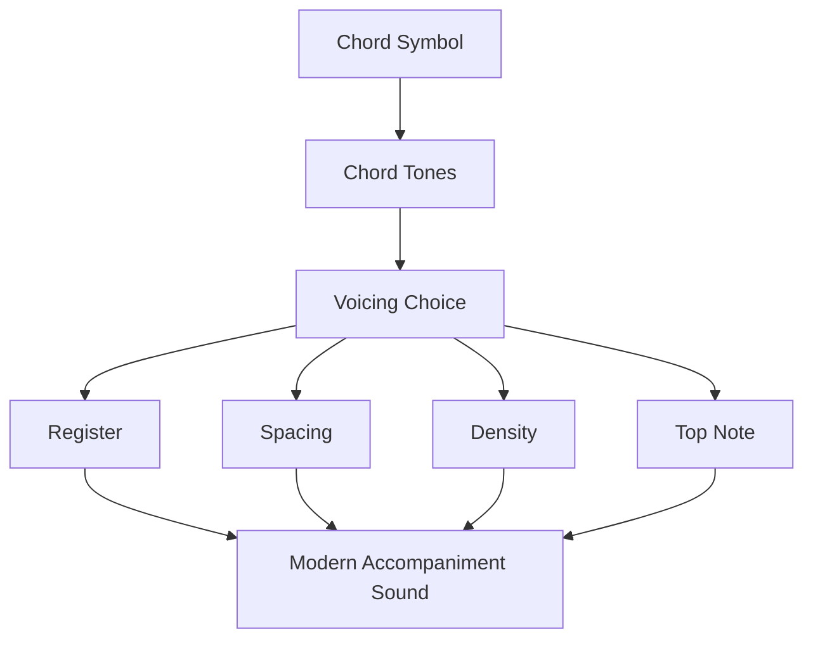
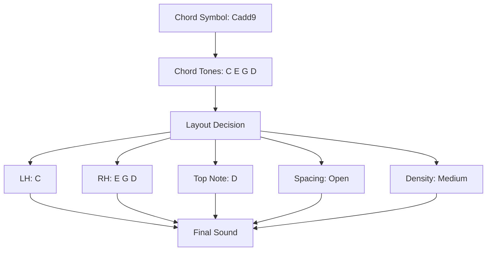
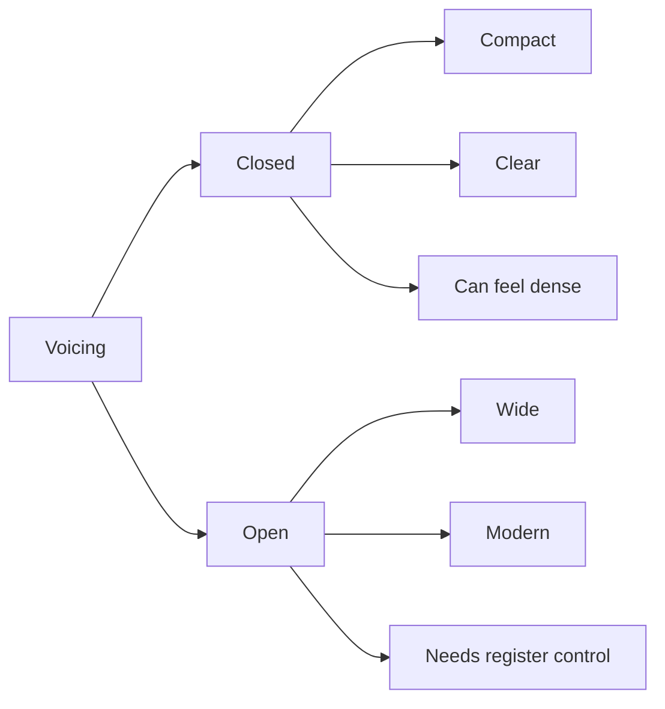
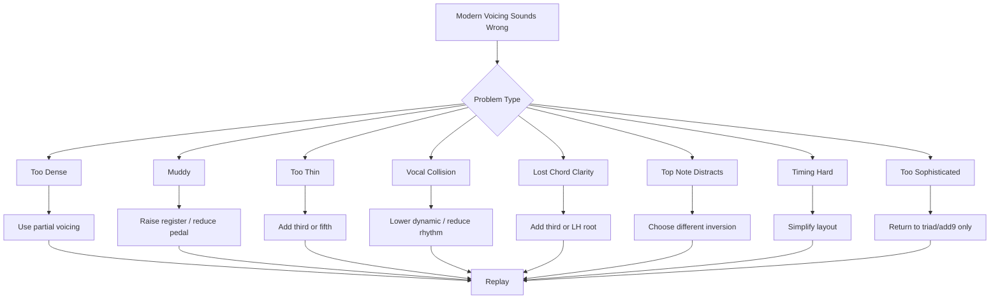
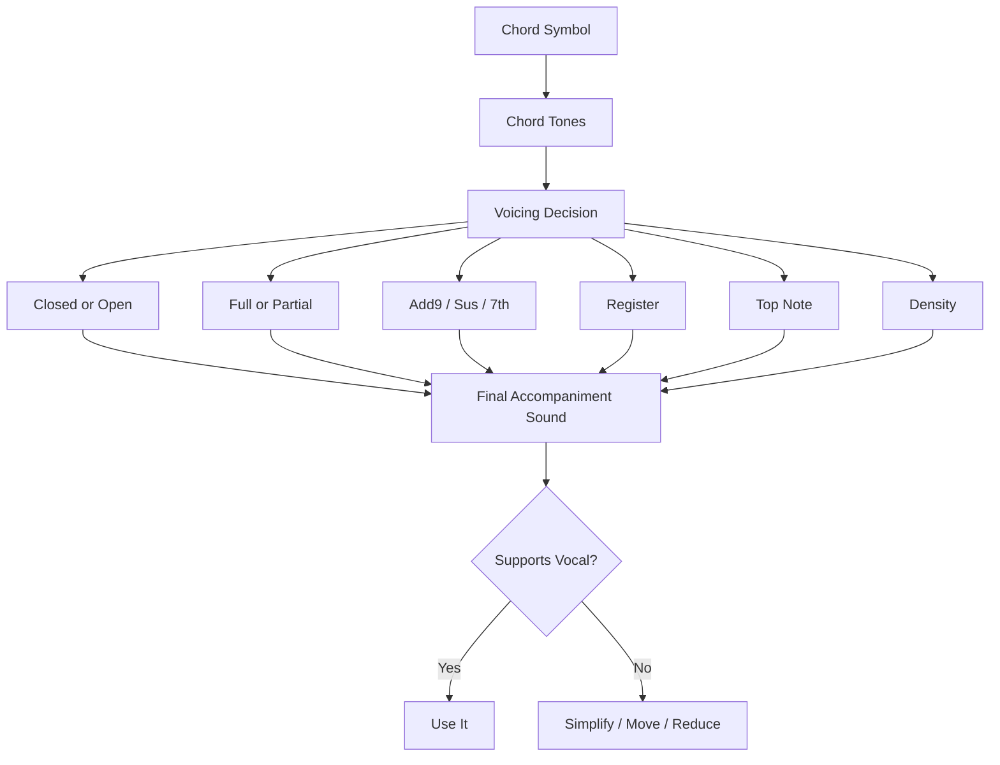

# learn-piano-accompaniment-part-015.md

# Part 015 — Voicing Pop Modern: Add9, Sus, dan Open Voicing

> Seri: **Learn Piano Accompaniment for Singer Performance**  
> Fokus: **belajar piano untuk mengiringi penyanyi**  
> Framework utama: **The First 20 Hours — Josh Kaufman**  
> Tahap: **Phase D — Voicing: Membuat Chord Tidak Kaku**

---

## Status Seri

| Item | Status |
|---|---|
| Part | 015 |
| Nama file | `learn-piano-accompaniment-part-015.md` |
| Fokus | Voicing pop modern, add9, sus, open voicing, dan spread sound |
| Prasyarat | Part 000–014 |
| Output praktis | Bisa membuat chord sederhana terdengar lebih luas, modern, dan vokal-friendly |
| Status seri | Belum selesai |

---

## Daftar Isi

- [1. Tujuan Part Ini](#1-tujuan-part-ini)
- [2. Posisi Part Ini dalam Framework Kaufman](#2-posisi-part-ini-dalam-framework-kaufman)
- [3. Masalah Utama: Chord Benar tetapi Terdengar Sempit](#3-masalah-utama-chord-benar-tetapi-terdengar-sempit)
- [4. Mental Model: Voicing sebagai Layout Engine](#4-mental-model-voicing-sebagai-layout-engine)
- [5. Apa Itu Voicing?](#5-apa-itu-voicing)
- [6. Closed Voicing vs Open Voicing](#6-closed-voicing-vs-open-voicing)
- [7. Spread Voicing: Membuat Chord Terasa Lebar](#7-spread-voicing-membuat-chord-terasa-lebar)
- [8. Shell / Partial Voicing untuk Pemula](#8-shell--partial-voicing-untuk-pemula)
- [9. Add9 sebagai Warna Pop Modern](#9-add9-sebagai-warna-pop-modern)
- [10. Sus2 dan Sus4 sebagai Suspended Color](#10-sus2-dan-sus4-sebagai-suspended-color)
- [11. Chord Tanpa Third: Ambigu tetapi Luas](#11-chord-tanpa-third-ambigu-tetapi-luas)
- [12. Open Fifth: Cinematic dan Stabil](#12-open-fifth-cinematic-dan-stabil)
- [13. LH Root + RH Add9 Voicing](#13-lh-root--rh-add9-voicing)
- [14. LH Root + RH Sus Voicing](#14-lh-root--rh-sus-voicing)
- [15. LH Root + RH Shell Color](#15-lh-root--rh-shell-color)
- [16. Voicing Aman untuk C, G, Am, F](#16-voicing-aman-untuk-c-g-am-f)
- [17. Voicing Aman untuk Dm, Em, Gsus4, G7](#17-voicing-aman-untuk-dm-em-gsus4-g7)
- [18. Progression C–G–Am–F dengan Voicing Modern](#18-progression-cgamf-dengan-voicing-modern)
- [19. Progression Am–F–C–G dengan Voicing Modern](#19-progression-amfcg-dengan-voicing-modern)
- [20. Progression C–Am–F–G dengan Voicing Modern](#20-progression-camfg-dengan-voicing-modern)
- [21. Voice Leading dalam Voicing Modern](#21-voice-leading-dalam-voicing-modern)
- [22. Top Note sebagai Garis Emosi](#22-top-note-sebagai-garis-emosi)
- [23. Register Strategy untuk Voicing Modern](#23-register-strategy-untuk-voicing-modern)
- [24. Density Strategy untuk Voicing Modern](#24-density-strategy-untuk-voicing-modern)
- [25. Voicing untuk Verse](#25-voicing-untuk-verse)
- [26. Voicing untuk Chorus](#26-voicing-untuk-chorus)
- [27. Voicing untuk Bridge dan Build-Up](#27-voicing-untuk-bridge-dan-build-up)
- [28. Voicing dalam 6/8 Cinematic Feel](#28-voicing-dalam-68-cinematic-feel)
- [29. Kapan Voicing Modern Berlebihan](#29-kapan-voicing-modern-berlebihan)
- [30. Latihan 1: Closed vs Open Voicing](#30-latihan-1-closed-vs-open-voicing)
- [31. Latihan 2: Add9 Color](#31-latihan-2-add9-color)
- [32. Latihan 3: Sus Resolution](#32-latihan-3-sus-resolution)
- [33. Latihan 4: Progression Modern Pop](#33-latihan-4-progression-modern-pop)
- [34. Latihan 5: Verse/Chorus Voicing Contrast](#34-latihan-5-versechorus-voicing-contrast)
- [35. Latihan 6: Voicing dengan Vokal](#35-latihan-6-voicing-dengan-vokal)
- [36. Debugging Voicing Modern](#36-debugging-voicing-modern)
- [37. Failure Mode Pemula](#37-failure-mode-pemula)
- [38. Practice Protocol 45 Menit](#38-practice-protocol-45-menit)
- [39. Checklist Kelulusan Part 015](#39-checklist-kelulusan-part-015)
- [40. Ringkasan Mental Model](#40-ringkasan-mental-model)
- [41. Persiapan ke Part 016](#41-persiapan-ke-part-016)

---

# 1. Tujuan Part Ini

Pada Part 014, kita mulai mengenal chord color:

```text
Cmaj7
Am7
Fadd9
Gsus4
G7
Dm7
Em7
```

Namun mengetahui nama chord belum otomatis membuat permainan terdengar modern atau enak untuk vokal.

Masalah berikutnya adalah:

```text
bagaimana menyusun nada-nada chord itu di piano?
```

Itulah topik part ini:

```text
voicing
```

Target part ini:

> Anda mampu menyusun chord sederhana menjadi voicing yang lebih luas, modern, dan vokal-friendly menggunakan add9, sus, open fifth, partial chord, serta open/spread voicing sederhana.

Part ini bukan tentang harmoni jazz advanced.

Part ini adalah tentang membuat chord dasar seperti:

```text
C - G - Am - F
```

terdengar lebih seperti accompaniment modern:

```text
Cadd9 - Gsus4/G - Am7 - Fadd9
```

dengan layout yang tidak sempit, tidak muddy, dan tidak menabrak vokal.

---

# 2. Posisi Part Ini dalam Framework Kaufman

Dalam *The First 20 Hours*, kita terus mencari improvement paling praktis setelah fondasi bisa dimainkan.

Sampai sekarang, kita sudah punya:

```text
chord
progression
rhythm
pattern
inversion
density
chord color
```

Sekarang kita butuh mengatur layout.

Diagram:



Dalam konteks Kaufman, voicing adalah sub-skill yang sangat tinggi leverage-nya karena:

- chord sederhana langsung terdengar lebih matang;
- tangan lebih nyaman;
- vokal punya lebih banyak ruang;
- accompaniment terdengar lebih luas;
- aransemen tidak perlu chord rumit;
- progression yang sama bisa punya banyak warna.

---

# 3. Masalah Utama: Chord Benar tetapi Terdengar Sempit

Chord `C`:

```text
C E G
```

benar.

Tetapi jika dimainkan terus sebagai triad rapat di tengah:

```text
C-E-G
```

bisa terdengar:

- sempit;
- polos;
- seperti latihan;
- kurang luas;
- kurang modern;
- terlalu blocky;
- kurang emosional.

Jika dimainkan sebagai:

```text
LH: C
RH: G-D-E
```

atau:

```text
LH: C-G
RH: E-G-D
```

rasa chord berubah menjadi lebih terbuka.

Chord masih C, tetapi layout-nya lebih modern.

## 3.1 Masalah Bukan Chord, tetapi Penyusunan

Sama seperti object yang sama bisa ditampilkan dengan UI layout berbeda, chord yang sama bisa terdengar berbeda karena voicing.

```text
same data
different layout
different experience
```

## 3.2 Goal Part Ini

Bukan menambah banyak chord.

Goal-nya:

```text
membuat chord yang sudah kita tahu terdengar lebih baik
```

---

# 4. Mental Model: Voicing sebagai Layout Engine

Voicing adalah layout engine untuk chord.

Chord symbol memberi data:

```text
Cadd9
```

Chord tones:

```text
C E G D
```

Voicing menentukan:

```text
LH main apa?
RH main apa?
nada mana di bawah?
nada mana di atas?
berapa jauh jaraknya?
berapa banyak nada dimainkan?
```

Diagram:



Dalam software analogy:

```text
chord tones = data model
voicing = rendering strategy
register = layout container
density = component count
top note = visible headline
```

---

# 5. Apa Itu Voicing?

Voicing adalah cara menyusun nada-nada chord di instrumen.

Chord:

```text
Cadd9 = C E G D
```

Bisa dimainkan sebagai:

```text
C E G D
E G C D
C G D E
LH C, RH E G D
LH C G, RH E D
```

Semua bisa mewakili Cadd9.

Yang berubah:

- kepadatan;
- register;
- top note;
- warna;
- kemudahan fingering;
- tabrakan dengan vokal;
- rasa modern/tradisional.

## 5.1 Voicing Bukan Chord Baru

Jika chord symbol sama tetapi susunan berubah, itu tetap chord yang sama.

Contoh:

```text
Fadd9 = F A C G
```

Voicing:

```text
LH F
RH A C G
```

atau:

```text
LH F C
RH A G
```

masih Fadd9.

## 5.2 Tujuan Voicing dalam Accompaniment

Voicing dipilih untuk:

- mendukung vokal;
- memperjelas harmony;
- menjaga register bersih;
- membuat transition smooth;
- mengatur density;
- memberi emotional color;
- membuat section berbeda.

---

# 6. Closed Voicing vs Open Voicing

## 6.1 Closed Voicing

Closed voicing berarti nada chord disusun rapat.

Contoh C:

```text
C E G
```

Contoh Cadd9:

```text
C D E G
```

Jika semua nada terlalu dekat, bisa terdengar padat.

## 6.2 Open Voicing

Open voicing berarti nada chord disebar lebih jauh.

Contoh C:

```text
C G E
```

atau dengan LH/RH:

```text
LH: C
RH: G E
```

Contoh Cadd9:

```text
LH: C G
RH: D E
```

atau:

```text
LH: C
RH: G D E
```

## 6.3 Rasa

Closed voicing:

- jelas;
- padat;
- compact;
- cocok untuk cue;
- bisa sempit.

Open voicing:

- luas;
- modern;
- cinematic;
- lebih breathable;
- bisa kurang jelas jika terlalu ambiguous.

## 6.4 Diagram



---

# 7. Spread Voicing: Membuat Chord Terasa Lebar

Spread voicing adalah voicing yang menyebarkan nada chord antara tangan kiri dan kanan.

Contoh C:

```text
LH: C
RH: G C E
```

Atau Cadd9:

```text
LH: C G
RH: D E G
```

## 7.1 Kenapa Spread Voicing Berguna?

Karena piano punya range luas.

Jika semua nada dimainkan di tengah, piano terdengar sempit.

Dengan spread:

- chord lebih besar;
- bass lebih jelas;
- RH lebih ringan;
- sound lebih modern;
- ruang vokal bisa lebih diatur.

## 7.2 Risiko Spread Voicing

Jika terlalu lebar:

- chord identity bisa kurang jelas;
- tangan sulit;
- timing lambat;
- bass muddy;
- RH terlalu jauh dari vokal;
- pemain pemula panik.

## 7.3 Aturan 20 Jam Pertama

Gunakan spread sederhana:

```text
LH root
RH 2–3 notes
```

atau:

```text
LH root + fifth
RH 2 notes
```

Jangan langsung memakai spread voicing besar yang sulit dijangkau.

---

# 8. Shell / Partial Voicing untuk Pemula

Shell voicing secara umum berarti memainkan nada-nada penting saja.

Untuk pemula, kita pakai istilah praktis:

```text
partial voicing = tidak memainkan semua nada chord
```

Contoh Cadd9:

```text
Full: C E G D
```

Dengan LH root:

```text
LH: C
RH: E D
```

Ini sudah memberi:

- root;
- major quality dari E;
- add9 color dari D.

Fifth G boleh dihilangkan karena tidak selalu wajib.

## 8.1 Nada Penting

Untuk triad:

```text
root + third = sangat penting
fifth = sering boleh dihilangkan
```

Untuk seventh:

```text
third + seventh = sangat penting
```

Untuk add9:

```text
third + ninth = memberi major/minor clarity + color
```

Untuk sus:

```text
root + sus note + fifth
```

## 8.2 Contoh Partial Voicing

| Chord | LH | RH minimal |
|---|---|---|
| Cadd9 | C | E D |
| Am7 | A | C G |
| Fadd9 | F | A G |
| G7 | G | B F |
| Gsus4 | G | C D |
| Dm7 | D | F C |

## 8.3 Kenapa Ini Penting?

Partial voicing:

- mengurangi density;
- memberi ruang vokal;
- memperjelas color;
- mudah dimainkan;
- membantu rhythm stabil;
- cocok untuk verse.

---

# 9. Add9 sebagai Warna Pop Modern

Add9 adalah salah satu warna paling aman untuk pop modern.

Formula:

```text
1 - 3 - 5 - 9
```

Contoh:

```text
Cadd9 = C E G D
Fadd9 = F A C G
```

## 9.1 Kenapa Add9 Terdengar Modern?

Karena 9 memberi rasa terbuka tanpa membuat chord terlalu jazzy seperti extended seventh chord yang lebih kompleks.

Cadd9 terasa:

```text
home + open air
```

Fadd9 terasa:

```text
wide + emotional lift
```

## 9.2 Voicing Cadd9

Beberapa opsi:

```text
LH: C
RH: E G D
```

```text
LH: C G
RH: D E
```

```text
LH: C
RH: G D E
```

## 9.3 Voicing Fadd9

```text
LH: F
RH: A C G
```

```text
LH: F C
RH: A G
```

```text
LH: F
RH: C G A
```

## 9.4 Kapan Add9 Dipakai?

- intro;
- verse;
- chorus luas;
- worship/pop ballad;
- 6/8 cinematic;
- ending yang open;
- saat triad terdengar terlalu polos.

---

# 10. Sus2 dan Sus4 sebagai Suspended Color

Sus chord mengganti third dengan 2 atau 4.

## 10.1 Sus2

```text
Csus2 = C D G
```

Rasa:

- terbuka;
- netral;
- tidak major/minor;
- cocok untuk texture ambient.

## 10.2 Sus4

```text
Gsus4 = G C D
```

Rasa:

- tertahan;
- tension;
- ingin resolve;
- cocok sebelum G atau C.

## 10.3 Sus sebagai Delay of Clarity

Karena sus menghilangkan third, chord menunda informasi major/minor.

Ini bisa berguna untuk membuat rasa menggantung.

## 10.4 Sus4 Resolution

Contoh:

```text
Gsus4 -> G
```

Notes:

```text
G C D -> G B D
```

C turun ke B.

Ini sangat kuat untuk:

- intro cue;
- pre-chorus;
- ending;
- transition.

---

# 11. Chord Tanpa Third: Ambigu tetapi Luas

Third menentukan major/minor.

Jika third dihilangkan, chord menjadi ambiguous.

Contoh C:

```text
C major = C E G
C minor = C Eb G
```

Jika hanya:

```text
C G
```

kita tidak tahu major/minor.

## 11.1 Kenapa Ini Berguna?

Chord tanpa third bisa terasa:

- luas;
- cinematic;
- netral;
- tidak terlalu emosional secara eksplisit;
- memberi ruang untuk vokal menentukan warna.

## 11.2 Contoh Open Fifth

```text
C G C
```

atau:

```text
F C F
```

## 11.3 Risiko

Jika terlalu lama tanpa third:

- harmony kurang jelas;
- penyanyi bisa kurang pitch context;
- lagu terasa kosong;
- major/minor emotion hilang.

## 11.4 Aturan

Gunakan chord tanpa third untuk:

- intro;
- build-up;
- cinematic section;
- moment of ambiguity.

Tambahkan third saat harmony perlu jelas.

---

# 12. Open Fifth: Cinematic dan Stabil

Open fifth memakai root dan fifth.

Contoh:

```text
C - G
F - C
G - D
A - E
```

## 12.1 Rasa Open Fifth

- kuat;
- luas;
- tidak major/minor;
- cinematic;
- seperti fondasi besar;
- cocok untuk slow dramatic accompaniment.

## 12.2 Dengan Octave

```text
C - G - C
```

Ini lebih luas daripada hanya:

```text
C - G
```

## 12.3 Pattern 6/8

Untuk C:

```text
1 2 3 4 5 6
C G C G C G
```

## 12.4 Tambahkan Third Secara Lembut

Setelah open fifth, tambahkan third di RH:

```text
C G C E
```

atau dalam pattern:

```text
C G C G E G
```

Ini membuat chord major jelas.

---

# 13. LH Root + RH Add9 Voicing

Ini formula sangat praktis.

## 13.1 Cadd9

```text
LH: C
RH: E G D
```

atau partial:

```text
LH: C
RH: E D
```

## 13.2 Fadd9

```text
LH: F
RH: A C G
```

atau partial:

```text
LH: F
RH: A G
```

## 13.3 Kenapa Bagus?

LH root memberi identity.

RH third memberi major/minor quality.

RH 9 memberi color modern.

Fifth boleh ada, boleh tidak.

## 13.4 Pattern

Gunakan:

```text
X - - -
X - x -
broken chord
6/8 rolling
```

Jangan langsung padat. Dengarkan vokal.

---

# 14. LH Root + RH Sus Voicing

Sus voicing sangat berguna untuk dominant atau transition.

## 14.1 Gsus4

```text
LH: G
RH: C D G
```

Partial:

```text
LH: G
RH: C D
```

## 14.2 Gsus4 ke G

```text
LH: G
RH: C D G
```

ke:

```text
LH: G
RH: B D G
```

## 14.3 Csus2

```text
LH: C
RH: D G
```

atau:

```text
LH: C
RH: D G C
```

## 14.4 Fsus2

```text
LH: F
RH: G C
```

## 14.5 Fungsi

- menunda clarity;
- memberi tension lembut;
- cocok untuk intro;
- cocok untuk build-up;
- cocok untuk ending sebelum resolve.

---

# 15. LH Root + RH Shell Color

Shell color berarti RH memainkan nada paling informatif.

## 15.1 Cmaj7

```text
LH: C
RH: E B
```

E = third  
B = major7

## 15.2 Am7

```text
LH: A
RH: C G
```

C = minor third  
G = b7

## 15.3 Fmaj7

```text
LH: F
RH: A E
```

A = third  
E = major7

## 15.4 G7

```text
LH: G
RH: B F
```

B = third  
F = b7

## 15.5 Dm7

```text
LH: D
RH: F C
```

F = minor third  
C = b7

## 15.6 Kenapa Shell Color Efektif?

Karena dengan hanya dua nada RH, chord sudah punya warna yang jelas.

Ini sangat berguna untuk:

- verse;
- vokal aktif;
- comping lembut;
- menghindari density berlebihan.

---

# 16. Voicing Aman untuk C, G, Am, F

Kita susun voicing praktis untuk progression paling umum.

## 16.1 C / Cadd9 / Cmaj7

Triad:

```text
LH: C
RH: E G
```

Cadd9:

```text
LH: C
RH: E G D
```

Cmaj7:

```text
LH: C
RH: E G B
```

Shell Cmaj7:

```text
LH: C
RH: E B
```

Open C:

```text
LH: C G
RH: E G
```

## 16.2 G / Gsus4 / G7

G:

```text
LH: G
RH: B D G
```

Gsus4:

```text
LH: G
RH: C D G
```

G7:

```text
LH: G
RH: B D F
```

Shell G7:

```text
LH: G
RH: B F
```

## 16.3 Am / Am7

Am:

```text
LH: A
RH: C E
```

Am7:

```text
LH: A
RH: C E G
```

Shell Am7:

```text
LH: A
RH: C G
```

Open Am:

```text
LH: A E
RH: C E
```

## 16.4 F / Fadd9 / Fmaj7

F:

```text
LH: F
RH: A C
```

Fadd9:

```text
LH: F
RH: A C G
```

Fmaj7:

```text
LH: F
RH: A C E
```

Shell Fmaj7:

```text
LH: F
RH: A E
```

Open Fadd9:

```text
LH: F C
RH: A G
```

---

# 17. Voicing Aman untuk Dm, Em, Gsus4, G7

## 17.1 Dm / Dm7

Dm:

```text
LH: D
RH: F A
```

Dm7:

```text
LH: D
RH: F A C
```

Shell:

```text
LH: D
RH: F C
```

## 17.2 Em / Em7

Em:

```text
LH: E
RH: G B
```

Em7:

```text
LH: E
RH: G B D
```

Shell:

```text
LH: E
RH: G D
```

## 17.3 Gsus4

```text
LH: G
RH: C D G
```

Partial:

```text
LH: G
RH: C D
```

## 17.4 G7

```text
LH: G
RH: B D F
```

Shell:

```text
LH: G
RH: B F
```

## 17.5 Dm7-G7-C

Progression:

```text
Dm7 - G7 - C
```

Voicing:

```text
LH: D   G   C
RH: F-C B-F E-G
```

Ini ringan, jelas, dan cocok untuk ending/turnaround.

---

# 18. Progression C–G–Am–F dengan Voicing Modern

Original:

```text
C - G - Am - F
```

Versi modern aman:

```text
Cadd9 - Gsus4/G - Am7 - Fadd9
```

## 18.1 Voicing Opsi A

```text
Cadd9: LH C, RH E-G-D
G    : LH G, RH B-D-G
Am7  : LH A, RH C-E-G
Fadd9: LH F, RH A-C-G
```

## 18.2 Voicing Opsi B Lebih Ringan

```text
Cadd9: LH C, RH E-D
G    : LH G, RH B-D
Am7  : LH A, RH C-G
Fadd9: LH F, RH A-G
```

## 18.3 Voicing Opsi C Lebih Open

```text
Cadd9: LH C-G, RH D-E
G    : LH G-D, RH B-D
Am7  : LH A-E, RH C-G
Fadd9: LH F-C, RH A-G
```

## 18.4 Pattern

Verse:

```text
Opsi B
X - - -
```

Chorus:

```text
Opsi A atau C
X - x -
```

6/8:

```text
rolling chord, jangan terlalu keras
```

---

# 19. Progression Am–F–C–G dengan Voicing Modern

Original:

```text
Am - F - C - G
```

Versi modern:

```text
Am7 - Fadd9 - Cadd9 - Gsus4/G
```

## 19.1 Voicing Opsi A

```text
Am7  : LH A, RH C-E-G
Fadd9: LH F, RH A-C-G
Cadd9: LH C, RH E-G-D
Gsus4: LH G, RH C-D-G
G    : LH G, RH B-D-G
```

## 19.2 Opsi Ringan untuk Verse

```text
Am7  : LH A, RH C-G
Fadd9: LH F, RH A-G
Cadd9: LH C, RH E-D
G    : LH G, RH B-D
```

## 19.3 Penggunaan

Cocok untuk:

- verse reflektif;
- intro minor-ish;
- ballad;
- lagu sedih tapi hangat.

## 19.4 Transition ke Chorus

Gunakan:

```text
Gsus4 -> G -> Cadd9
```

sebagai cue menuju chorus.

---

# 20. Progression C–Am–F–G dengan Voicing Modern

Original:

```text
C - Am - F - G
```

Versi modern:

```text
Cadd9 - Am7 - Fadd9 - Gsus4/G
```

## 20.1 Voicing

```text
Cadd9: LH C, RH E-G-D
Am7  : LH A, RH C-E-G
Fadd9: LH F, RH A-C-G
Gsus4: LH G, RH C-D-G
G    : LH G, RH B-D-G
```

## 20.2 Rasa

```text
home open -> minor warm -> wide lift -> suspended tension -> resolve
```

## 20.3 Ending

Akhiri dengan:

```text
Gsus4 - G - Cadd9
```

atau:

```text
G7 - Cmaj7
```

## 20.4 Density

Verse:

```text
partial voicing
```

Chorus:

```text
fuller add9/sus voicing
```

---

# 21. Voice Leading dalam Voicing Modern

Voicing modern tetap harus memperhatikan voice leading.

Jangan hanya memilih chord yang keren secara terpisah.

Perhatikan perpindahan.

Contoh:

```text
Cadd9: E-G-D
G    : B-D-G
Am7  : C-E-G
Fadd9: A-C-G
```

Ada beberapa common tone:

- D dari Cadd9 ke G;
- G dari G ke Am7;
- C/G dari Am7 ke Fadd9.

## 21.1 Prinsip

```text
Pilih voicing yang dekat dan punya common tone jika memungkinkan.
```

## 21.2 Top Note

Top note progression di atas:

```text
D -> G -> G -> G
```

Cukup stabil, tetapi G yang berulang bisa terasa aman.

Jika ingin top note lebih bergerak:

```text
Cadd9: G-D-E
G    : G-B-D
Am7  : G-C-E
Fadd9: G-A-C
```

Top line bisa:

```text
E -> D -> E -> C
```

## 21.3 Jangan Top Note Terlalu Aktif Saat Vokal Aktif

Top note bisa menjadi melodi piano.

Jika vokal sedang menyanyi, top note harus dikontrol.

---

# 22. Top Note sebagai Garis Emosi

Top note adalah nada paling atas dalam RH voicing.

Pendengar sering menangkap top note sebagai garis melodi implisit.

## 22.1 Contoh Top Note Smooth

```text
Cadd9: RH E-G-D  -> top D
G    : RH B-D-G  -> top G
Am7  : RH C-E-G  -> top G
Fadd9: RH A-C-G  -> top G
```

Top line:

```text
D -> G -> G -> G
```

Stabil, tetapi mungkin statis.

## 22.2 Contoh Top Note Lebih Melodis

```text
Cadd9: RH G-D-E -> top E
G    : RH B-D-G -> top G
Am7  : RH C-E-G -> top G
Fadd9: RH C-G-A -> top A
```

Top line:

```text
E -> G -> G -> A
```

Lebih naik.

## 22.3 Risiko

Jika top note terlalu indah/aktif, piano bisa bersaing dengan vokal.

## 22.4 Rule

```text
Intro/interlude/outro: top note boleh lebih melodic.
Saat vokal aktif: top note harus lebih supportive.
```

---

# 23. Register Strategy untuk Voicing Modern

Voicing modern sering memakai add9/sus/open fifth yang luas.

Register harus dijaga.

## 23.1 LH

Gunakan:

```text
root
root + fifth
root + octave
```

Tetapi untuk 20 jam pertama, default:

```text
single root
```

Root + fifth hanya jika tidak muddy.

## 23.2 RH

Gunakan middle / upper-middle.

Hindari chord 4 nada terlalu rendah.

## 23.3 Add9 di Top

9 sebagai top note bisa indah.

Contoh Cadd9:

```text
LH: C
RH: E-G-D
```

D di atas memberi warna open.

Namun jika terlalu keras, bisa menarik perhatian.

## 23.4 Sus di Middle

Gsus4:

```text
LH: G
RH: C-D-G
```

Jangan terlalu rendah agar tidak muddy.

---

# 24. Density Strategy untuk Voicing Modern

Chord modern sering punya lebih banyak nada.

Karena itu, density harus dikontrol.

## 24.1 Jika Chord Lebih Berwarna, Rhythm Bisa Lebih Sederhana

Contoh:

```text
Cadd9
```

sudah punya color.

Tidak perlu selalu pattern padat.

## 24.2 Jika Rhythm Aktif, Voicing Bisa Lebih Ringan

Contoh pop comping aktif:

```text
1 & 2 & 3 & 4 &
X - - x X - - x
```

Gunakan RH partial:

```text
E-D
C-G
A-G
B-D
```

## 24.3 Jika Chorus Butuh Besar

Naikkan secara terkendali:

- LH root lebih jelas;
- RH 3 notes;
- rhythm half/push;
- dynamic naik sedikit.

Jangan langsung:

```text
LH octave + RH 4 notes + pedal tebal + rhythm padat
```

## 24.4 Rule

```text
Color, density, dynamic, register: naikkan maksimal dua parameter sekaligus.
```

---

# 25. Voicing untuk Verse

Verse butuh ruang.

Gunakan:

- partial voicing;
- add9 lembut;
- Am7 hangat;
- Fadd9 luas;
- Gsus4 hanya sebagai transition;
- RH tidak terlalu aktif;
- top note tidak terlalu dominan.

## 25.1 Verse Example

Progression:

```text
Am7 - Fadd9 - Cadd9 - G
```

Voicing:

```text
LH: A   F   C   G
RH: C-G A-G E-D B-D
```

## 25.2 Pattern

```text
X - - -
```

atau:

```text
X - x -
```

## 25.3 Dynamic

```text
level 1–2
```

## 25.4 Prinsip

```text
Verse harus membuat orang mendengar lirik.
```

---

# 26. Voicing untuk Chorus

Chorus butuh lebih besar.

Gunakan:

- Cadd9 lebih penuh;
- Fadd9 lebih open;
- Am7 lebih hangat;
- Gsus4/G untuk tension;
- RH 3 notes jika aman;
- LH root lebih jelas;
- dynamic level 3–4.

## 26.1 Chorus Example

Progression:

```text
Cadd9 - G - Am7 - Fadd9
```

Voicing:

```text
LH: C     G     A     F
RH: E-G-D B-D-G C-E-G A-C-G
```

## 26.2 Pattern

```text
X - x -
```

atau:

```text
X - - x X - - x
```

## 26.3 Jangan Menutup Vokal

Chorus vokal biasanya lebih kuat, tetapi bukan berarti piano bebas keras.

Jaga hierarchy:

```text
vocal > piano
```

---

# 27. Voicing untuk Bridge dan Build-Up

Bridge bisa turun atau naik.

## 27.1 Bridge Breakdown

Gunakan open voicing sparse:

```text
LH root
RH two notes
lots of space
```

Contoh:

```text
Am7: LH A, RH C-G
Fadd9: LH F, RH A-G
```

## 27.2 Bridge Build-Up

Mulai sparse lalu tambah:

```text
bar 1: partial
bar 2: partial + rhythm
bar 3: full RH color
bar 4: sus/dominant tension
```

## 27.3 Build ke Chorus

Gunakan:

```text
Gsus4 -> G -> Cadd9
```

atau:

```text
Dm7 -> G7 -> Cadd9
```

## 27.4 Prinsip

Bridge harus memberi kontras.

Jangan bridge terdengar sama seperti chorus.

---

# 28. Voicing dalam 6/8 Cinematic Feel

6/8 sangat cocok dengan open voicing.

## 28.1 Cadd9 6/8

```text
LH: C
RH: G-D-E-D-G
```

atau:

```text
C G D E G D
```

## 28.2 Fadd9 6/8

```text
LH: F
RH: C-G-A-G-C
```

## 28.3 Am7 6/8

```text
LH: A
RH: E-G-C-G-E
```

## 28.4 Gsus4 6/8

```text
LH: G
RH: D-G-C-G-D
```

## 28.5 Pattern

Count:

```text
ONE two three FOUR five six
```

Jangan semua nada sama keras.

Dynamic:

```text
1 strong
4 medium
others light
```

## 28.6 Prinsip

Open voicing + 6/8 + pedal bersih = cinematic.

Tetapi jika terlalu padat:

```text
muddy + melodramatic + menutup vokal
```

---

# 29. Kapan Voicing Modern Berlebihan

Voicing modern bisa salah konteks.

## 29.1 Lagu Butuh Kesederhanaan

Beberapa lagu lebih kuat dengan triad polos.

## 29.2 Vokal Sudah Kompleks

Jika melodi vokal banyak tension, piano tidak perlu menambah banyak color.

## 29.3 Lirik Butuh Kejujuran

Chord terlalu sophisticated bisa membuat lirik sederhana terasa tidak natural.

## 29.4 Pemain Belum Stabil

Jika voicing membuat timing rusak, kembali ke voicing sederhana.

## 29.5 Mix Terlalu Penuh

Jika bermain dengan band, open voicing besar bisa bertabrakan dengan gitar/pad/string.

Untuk solo piano + vocal, ruang lebih luas. Untuk band, kurangi.

## 29.6 Prinsip

```text
Modern bukan berarti kompleks.
Modern sering berarti luas, bersih, dan tepat.
```

---

# 30. Latihan 1: Closed vs Open Voicing

Progression:

```text
C - G - Am - F
```

## 30.1 Closed Version

```text
C  = C E G
G  = B D G
Am = C E A
F  = C F A
```

## 30.2 Open Version

```text
C  = LH C, RH G-E
G  = LH G, RH D-B
Am = LH A, RH E-C
F  = LH F, RH C-A
```

## 30.3 Add9 Version

```text
Cadd9: LH C, RH E-G-D
G    : LH G, RH B-D-G
Am7  : LH A, RH C-E-G
Fadd9: LH F, RH A-C-G
```

## 30.4 Evaluasi

Dengarkan:

- mana paling clear?
- mana paling luas?
- mana paling cocok untuk verse?
- mana paling cocok untuk chorus?
- mana paling menutup vokal?

---

# 31. Latihan 2: Add9 Color

Latih Cadd9 dan Fadd9.

## 31.1 C ke Cadd9

```text
C     : LH C, RH E-G
Cadd9 : LH C, RH E-G-D
```

Dengarkan D sebagai 9.

## 31.2 F ke Fadd9

```text
F     : LH F, RH A-C
Fadd9 : LH F, RH A-C-G
```

Dengarkan G sebagai 9.

## 31.3 Pattern

Gunakan:

```text
X - - -
X - x -
broken chord
```

## 31.4 Tujuan

Membedakan:

```text
triad clarity
vs
add9 openness
```

---

# 32. Latihan 3: Sus Resolution

Latih:

```text
Gsus4 -> G -> Cadd9
```

## 32.1 Voicing

```text
Gsus4: LH G, RH C-D-G
G    : LH G, RH B-D-G
Cadd9: LH C, RH E-G-D
```

## 32.2 Perhatikan Gerakan

```text
C -> B
```

dari Gsus4 ke G.

Lalu:

```text
G -> Cadd9
```

memberi resolusi.

## 32.3 Pattern

Dalam 4/4:

```text
| Gsus4  G | Cadd9 |
```

Dalam 6/8:

```text
Gsus4 satu bar
G setengah/akhir bar
Cadd9 resolve
```

## 32.4 Aplikasi

Gunakan untuk:

- intro ke verse;
- pre-chorus ke chorus;
- ending;
- cue penyanyi.

---

# 33. Latihan 4: Progression Modern Pop

Mainkan:

```text
Cadd9 - G - Am7 - Fadd9
```

## 33.1 Verse Version

```text
Cadd9: LH C, RH E-D
G    : LH G, RH B-D
Am7  : LH A, RH C-G
Fadd9: LH F, RH A-G
```

Pattern:

```text
X - - -
```

## 33.2 Chorus Version

```text
Cadd9: LH C, RH E-G-D
G    : LH G, RH B-D-G
Am7  : LH A, RH C-E-G
Fadd9: LH F, RH A-C-G
```

Pattern:

```text
X - x -
```

## 33.3 Evaluasi

- apakah chorus lebih besar?
- apakah verse tetap clear?
- apakah voicing modern menutup vokal?
- apakah timing stabil?
- apakah chord terlalu padat?

---

# 34. Latihan 5: Verse/Chorus Voicing Contrast

Buat mini arrangement.

## 34.1 Verse

Progression:

```text
Am7 - Fadd9 - Cadd9 - G
```

Voicing:

```text
partial
```

Pattern:

```text
sparse
```

Dynamic:

```text
level 2
```

## 34.2 Chorus

Progression:

```text
Cadd9 - G - Am7 - Fadd9
```

Voicing:

```text
fuller but controlled
```

Pattern:

```text
pop ballad comping
```

Dynamic:

```text
level 3
```

## 34.3 Format

```text
Verse  x2
Chorus x2
```

## 34.4 Target

- verse lebih intimate;
- chorus lebih luas;
- vokal tetap dominan;
- piano tidak terlalu ramai.

---

# 35. Latihan 6: Voicing dengan Vokal

Gunakan satu kalimat:

```text
Aku masih menunggu di sini
```

Bandingkan tiga versi.

## 35.1 Versi Triad

```text
C - G - Am - F
```

## 35.2 Versi Add9/7

```text
Cadd9 - G - Am7 - Fadd9
```

## 35.3 Versi Sus Transition

```text
Cadd9 - Gsus4/G - Am7 - Fadd9
```

## 35.4 Rekam dan Evaluasi

Tanya:

- versi mana paling mendukung vokal?
- apakah add9 membuat lebih emosional?
- apakah sus membuat tension cocok?
- apakah ada color note yang mengganggu melody?
- apakah top note piano terlalu menarik perhatian?

## 35.5 Kesimpulan

Pilih berdasarkan lagu, bukan berdasarkan teori.

---

# 36. Debugging Voicing Modern

Jika voicing terdengar buruk, debug layer.



## 36.1 Too Dense

Solusi:

```text
kurangi RH menjadi 2 nada
hilangkan fifth
kurangi rhythm
```

## 36.2 Muddy

Solusi:

```text
naikkan RH
jangan LH terlalu rendah
kurangi pedal
jangan chord 4 nada di bawah
```

## 36.3 Too Thin

Solusi:

```text
tambahkan third
tambahkan fifth
gunakan pedal bersih
pakai RH 3 notes di chorus
```

## 36.4 Vocal Collision

Solusi:

```text
main lebih lembut
ubah register
kurangi top note aktif
pakai partial voicing
```

## 36.5 Lost Chord Clarity

Solusi:

```text
pastikan LH root jelas
pastikan third ada saat perlu major/minor clarity
```

## 36.6 Too Sophisticated

Solusi:

```text
pakai add9 saja
hindari maj7/dominant terlalu banyak
kembali ke triad di chorus
```

---

# 37. Failure Mode Pemula

## 37.1 Mengira Open Voicing Selalu Lebih Baik

Tidak selalu.

Open voicing bisa terdengar kosong jika tidak ada third atau root yang jelas.

## 37.2 Terlalu Banyak Add9

Add9 indah, tetapi jika semua chord selalu add9, warna menjadi biasa dan kehilangan efek.

## 37.3 Sus Tidak Di-resolve

Sus chord sering butuh resolusi.

Jika terlalu lama, lagu bisa terasa menggantung tanpa arah.

## 37.4 Chord Tanpa Third Terlalu Lama

Ambigu terlalu lama bisa membuat harmony tidak jelas.

## 37.5 RH Terlalu Tinggi

Modern bukan berarti selalu tinggi dan sparkling.

High register harus dikontrol.

## 37.6 LH Terlalu Lebar

Root + fifth + octave di LH bisa terdengar besar, tetapi juga muddy dan sulit.

## 37.7 Top Note Bersaing dengan Vokal

Top note yang terlalu melodic bisa mengganggu penyanyi.

## 37.8 Timing Rusak karena Layout Sulit

Jika voicing sulit dijangkau, pilih yang lebih sederhana.

Voicing yang bagus tetapi terlambat tidak berguna untuk accompaniment.

## 37.9 Semua Section Pakai Voicing Sama

Verse, chorus, bridge butuh contrast.

Modern voicing harus dipakai sesuai aransemen.

---

# 38. Practice Protocol 45 Menit

Gunakan sesi ini untuk Part 015.

## 38.1 Menit 0–5: Review Chord Color

Mainkan:

```text
Cadd9
Am7
Fadd9
Gsus4
G7
Dm7
```

Dengan LH root + RH partial.

## 38.2 Menit 5–10: Closed vs Open

Progression:

```text
C - G - Am - F
```

Mainkan closed, lalu open.

Dengarkan perbedaan.

## 38.3 Menit 10–15: Add9 Voicing

Latih:

```text
Cadd9: LH C, RH E-G-D
Fadd9: LH F, RH A-C-G
```

Lalu versi partial:

```text
Cadd9: LH C, RH E-D
Fadd9: LH F, RH A-G
```

## 38.4 Menit 15–20: Sus Resolution

Latih:

```text
Gsus4 -> G -> Cadd9
```

Dalam 4/4 dan 6/8 sederhana.

## 38.5 Menit 20–25: Progression Modern

Mainkan:

```text
Cadd9 - G - Am7 - Fadd9
```

Pattern:

```text
X - x -
```

## 38.6 Menit 25–30: Verse Version

Mainkan:

```text
Am7 - Fadd9 - Cadd9 - G
```

Dengan partial voicing dan sparse pattern.

## 38.7 Menit 30–35: Chorus Version

Mainkan:

```text
Cadd9 - G - Am7 - Fadd9
```

Dengan fuller voicing dan pop ballad comping.

## 38.8 Menit 35–40: 6/8 Version

Mainkan progression modern dalam 6/8:

```text
ONE two three FOUR five six
```

Gunakan open voicing dan pedal bersih.

## 38.9 Menit 40–45: Record and Review

Rekam 1 menit.

Jawab:

- apakah voicing terdengar luas?
- apakah vokal tetap jelas?
- apakah top note mengganggu?
- apakah chord clarity hilang?
- apakah pedal muddy?
- apakah timing stabil?
- apakah ada chord yang terlalu sophisticated?

---

# 39. Checklist Kelulusan Part 015

Anda boleh lanjut ke Part 016 jika sebagian besar checklist ini terpenuhi.

## 39.1 Pemahaman

- [ ] Saya tahu voicing adalah cara menyusun nada chord.
- [ ] Saya tahu closed voicing terdengar lebih rapat.
- [ ] Saya tahu open voicing terdengar lebih luas.
- [ ] Saya tahu spread voicing membagi nada antara LH dan RH.
- [ ] Saya tahu partial voicing bisa lebih vokal-friendly.
- [ ] Saya tahu add9 memberi warna pop modern.
- [ ] Saya tahu sus chord menunda clarity.
- [ ] Saya tahu chord tanpa third terdengar ambiguous.
- [ ] Saya tahu top note bisa menjadi garis melodi implisit.
- [ ] Saya tahu voicing harus dipilih berdasarkan vokal dan section.

## 39.2 Praktik

- [ ] Saya bisa memainkan Cadd9 dengan beberapa voicing.
- [ ] Saya bisa memainkan Fadd9 dengan beberapa voicing.
- [ ] Saya bisa memainkan Am7 dengan partial voicing.
- [ ] Saya bisa memainkan Gsus4 ke G.
- [ ] Saya bisa memainkan G7 shell `LH G, RH B-F`.
- [ ] Saya bisa memainkan `Cadd9 - G - Am7 - Fadd9`.
- [ ] Saya bisa memainkan `Am7 - Fadd9 - Cadd9 - G`.
- [ ] Saya bisa membuat verse lebih sparse dari chorus.
- [ ] Saya bisa membuat 6/8 dengan open voicing sederhana.
- [ ] Saya bisa memilih voicing yang tidak menutup vokal.

## 39.3 Self-Correction

- [ ] Saya bisa mendeteksi voicing terlalu padat.
- [ ] Saya bisa mendeteksi voicing terlalu muddy.
- [ ] Saya bisa mendeteksi chord clarity hilang.
- [ ] Saya bisa mendeteksi top note mengganggu vokal.
- [ ] Saya bisa menyederhanakan voicing saat timing rusak.
- [ ] Saya bisa kembali ke triad jika color/voicing tidak cocok.
- [ ] Saya bisa memilih partial voicing untuk vokal aktif.

---

# 40. Ringkasan Mental Model

Voicing adalah layout chord.

Chord symbol menjawab:

```text
chord apa?
```

Voicing menjawab:

```text
disusun bagaimana?
di register mana?
seberapa padat?
nada mana yang paling atas?
apakah mendukung vokal?
```

Prinsip utama:

```text
LH = root/foundation
RH = color/clarity
spacing = width
density = control
top note = implied melody
space = vocal support
```

Diagram akhir:



Kalimat kunci:

```text
Modern voicing bukan berarti chord lebih rumit.
Modern voicing berarti chord disusun lebih luas, bersih, dan mendukung vokal.
```

---

# 41. Persiapan ke Part 016

Part berikutnya adalah:

```text
learn-piano-accompaniment-part-016.md
```

Judul:

```text
Membaca Lagu sebagai State Machine
```

Sampai Part 015, kita sudah fokus pada chord, rhythm, voicing, texture, dan warna.

Namun untuk tampil, kita harus bisa membaca lagu sebagai struktur:

- intro;
- verse;
- pre-chorus;
- chorus;
- bridge;
- interlude;
- outro;
- tag ending;
- repeat;
- cue.

Part 016 akan menghubungkan semua skill musikal ke struktur lagu.

Kita akan membahas:

- lagu sebagai state machine;
- section sebagai state;
- transition sebagai edge;
- cue sebagai event;
- repeat sebagai loop;
- ending sebagai terminal state;
- cara menandai chord chart;
- cara tidak tersesat saat live;
- cara memberi sinyal masuk vokal;
- cara membuat arrangement map sebelum tampil.

Part 016 adalah awal Phase E: **Struktur Lagu & Aransemen**.

---

## Status Akhir Part 015

```text
Part 015 selesai.
Seri belum selesai.
Lanjut ke Part 016.
```
