# learn-piano-accompaniment-part-016.md

# Part 016 — Membaca Lagu sebagai State Machine

> Seri: **Learn Piano Accompaniment for Singer Performance**  
> Fokus: **belajar piano untuk mengiringi penyanyi**  
> Framework utama: **The First 20 Hours — Josh Kaufman**  
> Tahap: **Phase E — Struktur Lagu & Aransemen**

---

## Status Seri

| Item | Status |
|---|---|
| Part | 016 |
| Nama file | `learn-piano-accompaniment-part-016.md` |
| Fokus | Membaca struktur lagu sebagai state machine agar tidak tersesat saat mengiringi |
| Prasyarat | Part 000–015 |
| Output praktis | Bisa membuat arrangement map sederhana dari intro, verse, chorus, bridge, repeat, cue, dan ending |
| Status seri | Belum selesai |

---

## Daftar Isi

- [1. Tujuan Part Ini](#1-tujuan-part-ini)
- [2. Posisi Part Ini dalam Framework Kaufman](#2-posisi-part-ini-dalam-framework-kaufman)
- [3. Masalah Utama: Bisa Main Chord tetapi Tersesat di Lagu](#3-masalah-utama-bisa-main-chord-tetapi-tersesat-di-lagu)
- [4. Mental Model: Lagu sebagai State Machine](#4-mental-model-lagu-sebagai-state-machine)
- [5. State, Transition, Event, dan Terminal State](#5-state-transition-event-dan-terminal-state)
- [6. Section Lagu sebagai State](#6-section-lagu-sebagai-state)
- [7. Intro sebagai Initial State](#7-intro-sebagai-initial-state)
- [8. Verse sebagai Narrative State](#8-verse-sebagai-narrative-state)
- [9. Pre-Chorus sebagai Build State](#9-pre-chorus-sebagai-build-state)
- [10. Chorus sebagai Release State](#10-chorus-sebagai-release-state)
- [11. Bridge sebagai Contrast State](#11-bridge-sebagai-contrast-state)
- [12. Interlude sebagai Instrumental State](#12-interlude-sebagai-instrumental-state)
- [13. Outro dan Ending sebagai Terminal State](#13-outro-dan-ending-sebagai-terminal-state)
- [14. Repeat sebagai Loop](#14-repeat-sebagai-loop)
- [15. Tag Ending sebagai Controlled Loop](#15-tag-ending-sebagai-controlled-loop)
- [16. Cue sebagai Event Signal](#16-cue-sebagai-event-signal)
- [17. Bar Count sebagai Index](#17-bar-count-sebagai-index)
- [18. Chord Chart sebagai Source Code Lagu](#18-chord-chart-sebagai-source-code-lagu)
- [19. Cara Menandai Chord Chart](#19-cara-menandai-chord-chart)
- [20. Arrangement Map: Struktur Sebelum Bermain](#20-arrangement-map-struktur-sebelum-bermain)
- [21. Energy Map: Dinamika per Section](#21-energy-map-dinamika-per-section)
- [22. Texture Map: Pattern per Section](#22-texture-map-pattern-per-section)
- [23. Register Map: Wilayah Piano per Section](#23-register-map-wilayah-piano-per-section)
- [24. Cue Map: Sinyal untuk Penyanyi](#24-cue-map-sinyal-untuk-penyanyi)
- [25. Decision Point: Kapan Mengulang, Kapan Lanjut](#25-decision-point-kapan-mengulang-kapan-lanjut)
- [26. Error Recovery Saat Tersesat](#26-error-recovery-saat-tersesat)
- [27. Membaca Lagu Pop 4/4 sebagai State Machine](#27-membaca-lagu-pop-44-sebagai-state-machine)
- [28. Membaca Ballad 6/8 sebagai State Machine](#28-membaca-ballad-68-sebagai-state-machine)
- [29. Mini Case Study: C–G–Am–F Pop Ballad](#29-mini-case-study-cgamf-pop-ballad)
- [30. Mini Case Study: Am–F–C–G Verse ke Chorus](#30-mini-case-study-amfcg-verse-ke-chorus)
- [31. Latihan 1: Buat State Diagram Lagu Sederhana](#31-latihan-1-buat-state-diagram-lagu-sederhana)
- [32. Latihan 2: Marking Chord Chart](#32-latihan-2-marking-chord-chart)
- [33. Latihan 3: Mainkan Struktur Tanpa Vokal](#33-latihan-3-mainkan-struktur-tanpa-vokal)
- [34. Latihan 4: Mainkan Struktur dengan Humming](#34-latihan-4-mainkan-struktur-dengan-humming)
- [35. Latihan 5: Simulasi Salah Masuk Section](#35-latihan-5-simulasi-salah-masuk-section)
- [36. Debugging Struktur Lagu](#36-debugging-struktur-lagu)
- [37. Failure Mode Pemula](#37-failure-mode-pemula)
- [38. Practice Protocol 45 Menit](#38-practice-protocol-45-menit)
- [39. Checklist Kelulusan Part 016](#39-checklist-kelulusan-part-016)
- [40. Ringkasan Mental Model](#40-ringkasan-mental-model)
- [41. Persiapan ke Part 017](#41-persiapan-ke-part-017)

---

# 1. Tujuan Part Ini

Sampai Part 015, kita sudah membangun banyak fondasi musikal:

- chord dasar;
- chord progression;
- rhythm;
- block chord;
- broken chord;
- pop ballad comping;
- 6/8 feel;
- inversion;
- voice leading;
- register;
- density;
- chord color;
- voicing modern.

Namun saat mengiringi penyanyi, ada masalah besar yang tidak bisa diselesaikan hanya dengan chord dan voicing:

```text
tersesat di struktur lagu
```

Anda bisa saja tahu semua chord, tetapi tetap gagal mengiringi jika:

- tidak tahu kapan verse selesai;
- masuk chorus terlalu cepat;
- lupa repeat;
- salah masuk bridge;
- tidak tahu kapan ending;
- tidak memberi cue vokal;
- tidak tahu apakah harus mengulang chorus;
- tidak bisa recovery saat penyanyi loncat section.

Part ini mengajarkan cara membaca lagu sebagai struktur.

Target part ini:

> Anda mampu melihat lagu sebagai state machine: setiap section adalah state, setiap perpindahan adalah transition, setiap cue adalah event, dan ending adalah terminal state.

Dengan mental model ini, Anda akan lebih mudah:

- membaca chord chart;
- membuat arrangement map;
- menandai repeat;
- menjaga bar count;
- memberi cue;
- mengatur energy;
- tidak panik saat live;
- recovery jika salah section.

---

# 2. Posisi Part Ini dalam Framework Kaufman

Dalam *The First 20 Hours*, skill besar harus dipecah menjadi sub-skill kecil yang bisa dilatih.

Piano accompaniment bukan hanya skill tangan.

Ia adalah kombinasi:

```text
harmony + rhythm + voicing + structure + interaction
```

Diagram:

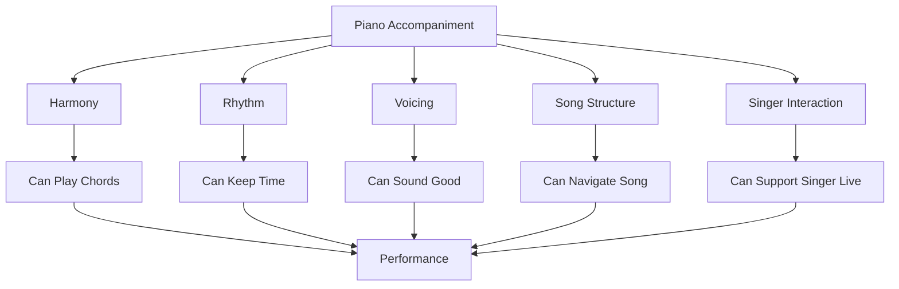

Part ini fokus ke:

```text
Song Structure
```

Tanpa struktur, permainan Anda seperti function yang benar secara lokal tetapi gagal dalam orchestration.

Dalam software analogy:

```text
Chord = instruction
Progression = local flow
Song structure = program control flow
Cue = event
Repeat = loop
Ending = terminal state
```

---

# 3. Masalah Utama: Bisa Main Chord tetapi Tersesat di Lagu

Pemula sering menganggap tantangan terbesar adalah chord.

Namun setelah chord mulai bisa dimainkan, masalah berikutnya muncul:

```text
Saya tidak tahu sedang di bagian lagu yang mana.
```

Gejalanya:

- salah masuk chorus;
- lupa verse 2;
- bridge terlewat;
- intro terlalu panjang;
- ending tidak kompak;
- penyanyi masuk tetapi piano masih di interlude;
- piano berhenti tetapi penyanyi masih lanjut;
- penyanyi ingin ulang chorus tetapi pianis sudah ending;
- chord benar tetapi section salah.

## 3.1 Section Salah Lebih Fatal daripada Chord Salah

Jika satu chord salah tetapi Anda tetap di section yang benar, lagu masih bisa recovery.

Jika section salah, seluruh struktur runtuh.

Contoh:

```text
Penyanyi masuk chorus,
piano masih main verse.
```

Walau chord verse benar, accompaniment gagal karena context salah.

## 3.2 Kenapa Pemula Tersesat?

Penyebab umum:

- hanya membaca chord, bukan struktur;
- tidak menghitung bar;
- tidak menandai repeat;
- tidak tahu lirik sebagai cue;
- tidak punya arrangement map;
- semua section dimainkan dengan pattern sama;
- tidak mendengar frase vokal;
- tidak tahu ending yang disepakati.

## 3.3 Prinsip

```text
Mengiringi lagu bukan hanya memainkan chord yang benar.
Mengiringi lagu adalah menavigasi struktur lagu secara real-time.
```

---

# 4. Mental Model: Lagu sebagai State Machine

State machine terdiri dari:

- state;
- transition;
- event;
- initial state;
- terminal state.

Lagu juga demikian.

Contoh struktur sederhana:

```text
Intro -> Verse -> Chorus -> Verse -> Chorus -> Bridge -> Final Chorus -> Outro
```

Ini bisa digambar sebagai state machine:

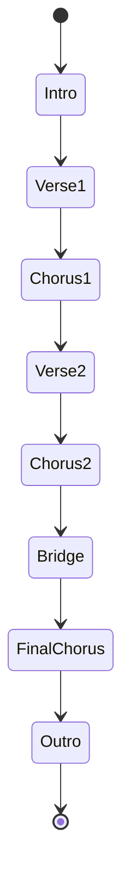

## 4.1 Mengapa Ini Berguna untuk Software Engineer?

Karena software engineer terbiasa berpikir dalam:

- state;
- transition;
- condition;
- loop;
- event;
- terminal;
- error handling.

Lagu live juga punya hal tersebut.

Jika Anda memodelkan lagu sebagai state machine, Anda tidak hanya menghafal chord. Anda tahu:

```text
Saya sekarang di state mana?
Apa transition berikutnya?
Apa event/cue yang menandai pindah state?
Apa yang terjadi jika penyanyi mengulang?
Bagaimana ending?
```

---

# 5. State, Transition, Event, dan Terminal State

## 5.1 State

State adalah section lagu.

Contoh:

```text
Intro
Verse
Pre-Chorus
Chorus
Bridge
Outro
```

Setiap state punya:

- chord progression;
- jumlah bar;
- pattern iringan;
- dynamic;
- register;
- density;
- cue masuk/keluar.

## 5.2 Transition

Transition adalah perpindahan antar state.

Contoh:

```text
Verse -> Pre-Chorus
Pre-Chorus -> Chorus
Chorus -> Verse 2
Bridge -> Final Chorus
```

Transition sering ditandai oleh:

- chord tertentu;
- fill;
- pause;
- build-up;
- lyric cue;
- drum fill jika ada band;
- gesture penyanyi;
- bar count.

## 5.3 Event

Event adalah sinyal yang memicu transition.

Contoh event:

```text
vokal selesai frase
bar ke-8 selesai
penyanyi memberi gesture
chord Gsus4-G muncul
fill pickup dimainkan
```

## 5.4 Terminal State

Terminal state adalah akhir lagu.

Contoh:

```text
final chord
outro selesai
tag terakhir
ritardando ending
```

Ending harus jelas.

Jika tidak, lagu terasa menggantung atau kacau.

---

# 6. Section Lagu sebagai State

Setiap section harus diperlakukan sebagai state dengan properti.

Contoh:

```text
State: Verse
Chord: Am - F - C - G
Length: 8 bar
Energy: 2/5
Texture: sparse broken chord
Register: middle soft
Cue out: lyric selesai / bar 8
Next: Chorus
```

Format state yang berguna:

```text
section_name:
  chord_progression:
  bar_length:
  energy:
  texture:
  register:
  cue_in:
  cue_out:
  next_state:
```

## 6.1 Kenapa Properti Ini Penting?

Karena saat bermain, Anda tidak punya waktu untuk berpikir dari nol.

Jika setiap section sudah punya properti, Anda tinggal menjalankan state.

## 6.2 Diagram State dengan Properti

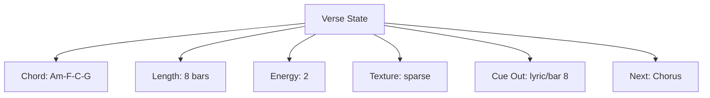

---

# 7. Intro sebagai Initial State

Intro adalah initial state lagu.

Fungsi intro:

```text
memberi key, tempo, mood, dan cue masuk vokal
```

Intro yang baik membuat penyanyi merasa aman.

## 7.1 Intro Harus Memberi Key

Penyanyi perlu tahu pusat nada.

Mainkan chord utama dengan jelas.

Jika lagu di C, intro harus membuat C terasa sebagai home.

## 7.2 Intro Harus Memberi Tempo

Penyanyi perlu tahu seberapa cepat masuk.

Jangan intro terlalu bebas jika belum disepakati.

## 7.3 Intro Harus Memberi Mood

Intro menentukan atmosphere:

- lembut;
- dramatis;
- megah;
- intimate;
- cinematic;
- pop.

## 7.4 Intro Harus Memberi Cue

Bar terakhir intro harus memberi sinyal:

```text
vokal masuk setelah ini
```

Cue bisa berupa:

- fill pendek;
- chord hold;
- rhythm stop;
- Gsus4-G-C;
- dynamic turun;
- eye contact;
- count internal.

## 7.5 Intro State Template

```text
Intro:
  length: 2/4/8 bars
  progression: C - G - Am - F
  texture: broken chord / sparse comping
  energy: 1-2
  cue_out: fill or hold before verse
  next_state: Verse
```

## 7.6 Failure Mode Intro

Intro buruk biasanya:

- terlalu panjang;
- tempo tidak jelas;
- tidak memberi cue;
- terlalu ramai;
- penyanyi tidak tahu kapan masuk.

---

# 8. Verse sebagai Narrative State

Verse adalah state naratif.

Fungsi verse:

```text
menyampaikan cerita
```

Karena itu, accompaniment verse harus memberi ruang.

## 8.1 Karakter Verse

- dynamic lebih rendah;
- density lebih rendah;
- register lebih hati-hati;
- pattern lebih sparse;
- fill sedikit;
- vokal sangat foreground.

## 8.2 Verse State Template

```text
Verse:
  length: 8/16 bars
  progression: Am - F - C - G
  texture: sparse / broken chord
  energy: 2
  register: middle soft
  cue_out: lyric phrase end / bar count
  next_state: Pre-Chorus or Chorus
```

## 8.3 Jangan Main Verse seperti Chorus

Jika verse terlalu penuh:

- lirik tidak jelas;
- chorus tidak punya lift;
- emotional arc datar.

## 8.4 Verse sebagai State yang Bisa Diulang

Banyak lagu punya:

```text
Verse 1
Verse 2
```

Verse 2 sering sedikit lebih besar dari Verse 1.

Contoh:

```text
Verse 1 energy 2
Verse 2 energy 2.5
```

---

# 9. Pre-Chorus sebagai Build State

Pre-chorus adalah state build-up.

Fungsi:

```text
membangun tension menuju chorus
```

Tidak semua lagu punya pre-chorus.

## 9.1 Karakter Pre-Chorus

- energy naik;
- rhythm lebih aktif;
- chord tension meningkat;
- density bertambah;
- dynamic ramp;
- sering berakhir di dominant/sus;
- cue chorus harus jelas.

## 9.2 Pre-Chorus State Template

```text
Pre-Chorus:
  length: 4/8 bars
  progression: Dm - F - Gsus4 - G
  texture: build-up comping
  energy: 2.5 -> 3.5
  cue_out: dominant/sus resolution
  next_state: Chorus
```

## 9.3 Build Jangan Berarti Tempo Naik

Pre-chorus sering membuat pemula mempercepat.

Energi naik melalui:

- density;
- dynamic;
- register;
- chord tension.

Bukan tempo drift.

## 9.4 Pre-Chorus sebagai Transition State

Pre-chorus bukan tujuan akhir. Ia adalah jembatan.

Semua keputusan harus bertanya:

```text
apakah ini membuat chorus terasa lebih inevitable?
```

---

# 10. Chorus sebagai Release State

Chorus adalah release atau statement utama.

Fungsi:

```text
menyampaikan hook utama
```

## 10.1 Karakter Chorus

- energy lebih besar;
- chord lebih jelas;
- rhythm lebih aktif;
- register lebih luas;
- dynamic level 3–4;
- vokal tetap foreground;
- phrase lebih memorable.

## 10.2 Chorus State Template

```text
Chorus:
  length: 8/16 bars
  progression: C - G - Am - F
  texture: fuller comping / open voicing
  energy: 3-4
  cue_out: repeat / verse / bridge / outro
  next_state: Verse2 or Bridge or Outro
```

## 10.3 Chorus Bisa Diulang

Chorus sering muncul beberapa kali:

```text
Chorus 1
Chorus 2
Final Chorus
```

Setiap chorus bisa punya energy berbeda.

```text
Chorus 1: level 3
Chorus 2: level 3.5
Final Chorus: level 4
```

## 10.4 Jangan Overplay Chorus

Chorus lebih besar bukan berarti piano boleh menutup vokal.

Jika vocal hook penting, piano harus support, bukan bersaing.

---

# 11. Bridge sebagai Contrast State

Bridge memberi kontras.

Fungsi bridge:

```text
membawa perspektif baru sebelum kembali ke chorus
```

## 11.1 Dua Jenis Bridge

### Bridge Breakdown

Energy turun.

```text
lebih sparse
lebih intimate
lebih sedikit nada
```

### Bridge Build-Up

Energy mulai rendah lalu naik ke final chorus.

```text
sparse -> build -> final chorus
```

## 11.2 Bridge State Template

```text
Bridge:
  length: 8 bars
  progression: F - G - Am - G
  texture: contrast / breakdown / build
  energy: 1.5 -> 4
  cue_out: build fill / dominant
  next_state: Final Chorus
```

## 11.3 Bridge Jangan Sama seperti Chorus

Jika bridge terdengar sama dengan chorus, struktur kehilangan fungsi kontras.

## 11.4 Bridge dan Penyanyi

Bridge sering punya lirik penting atau high emotional turn.

Piano harus mendengar apakah bridge butuh ruang atau dorongan.

---

# 12. Interlude sebagai Instrumental State

Interlude adalah bagian instrumental di antara section.

Fungsi:

- memberi napas;
- transisi;
- menunjukkan motif piano;
- memberi waktu penyanyi;
- membangun mood;
- mengulang intro;
- menghubungkan chorus ke verse/bridge.

## 12.1 Interlude State Template

```text
Interlude:
  length: 2/4/8 bars
  progression: same as intro or chorus
  texture: piano motif / broken chord
  energy: depends on context
  cue_out: prepare vocal entry
  next_state: Verse / Bridge / Chorus
```

## 12.2 Jangan Interlude Terlalu Sibuk

Interlude boleh piano lebih foreground, tetapi tetap harus memberi cue masuk vokal berikutnya.

## 12.3 Interlude sebagai Reset

Setelah chorus besar, interlude bisa menurunkan energy sebelum verse 2.

Atau sebaliknya, interlude bisa mempertahankan energy menuju bridge.

---

# 13. Outro dan Ending sebagai Terminal State

Outro adalah state menuju akhir.

Ending adalah terminal state.

## 13.1 Outro

Outro bisa:

- mengulang chorus;
- mengulang intro;
- fade out;
- tag ending;
- ritardando;
- final cadence.

## 13.2 Terminal State Harus Jelas

Ending yang tidak jelas membuat performance terasa amatir.

Tentukan:

```text
apakah final chord ditahan?
apakah ada ritardando?
apakah chorus diulang?
apakah ada tag 2x?
apakah ending di C?
```

## 13.3 Ending State Template

```text
Outro:
  length: 4/8 bars or tag repeat
  progression: F - G - C
  texture: reduce density
  energy: 2 -> 1
  terminal: final C chord hold
```

## 13.4 Ending Sederhana

Dalam key C:

```text
F - G - C
```

atau:

```text
Dm7 - G7 - C
```

atau:

```text
Gsus4 - G - C
```

Ini cukup untuk banyak lagu.

---

# 14. Repeat sebagai Loop

Repeat adalah loop.

Contoh:

```text
Chorus x2
```

Dalam state machine:

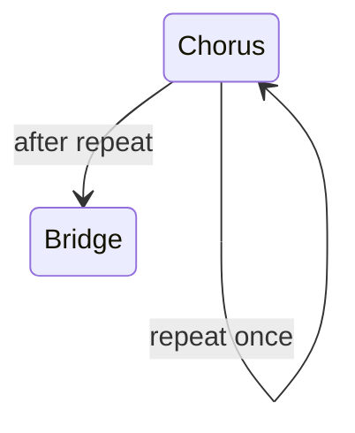

## 14.1 Repeat Harus Dihitung

Jika chorus 8 bar dan diulang 2 kali:

```text
total = 16 bar
```

Jangan hanya “feeling”.

Latih bar count.

## 14.2 Repeat Marking

Di chart, tandai:

```text
Chorus x2
```

atau:

```text
Repeat Chorus, then Bridge
```

## 14.3 Loop Condition

Dalam software:

```text
while repeat_count < 2:
    play chorus
```

Dalam musik:

```text
chorus pertama -> ulang chorus -> lanjut bridge
```

## 14.4 Repeat Live

Kadang penyanyi memberi sinyal untuk repeat extra.

Anda harus siap.

Jika ragu, jaga progression dan lihat cue.

---

# 15. Tag Ending sebagai Controlled Loop

Tag adalah pengulangan pendek di akhir lagu.

Contoh:

```text
last line repeated 2x or 3x
```

Musically:

```text
F - G - C
```

diulang beberapa kali.

## 15.1 Tag sebagai Loop

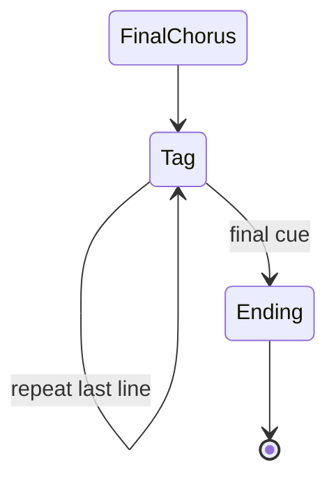

## 15.2 Tag Harus Disepakati

Sebelum tampil, tanyakan/putuskan:

```text
tag berapa kali?
ending setelah tag ke berapa?
apakah ritardando?
siapa memberi cue final?
```

## 15.3 Tag Failure

Jika tag tidak disepakati:

- pianis berhenti terlalu cepat;
- penyanyi masih ulang;
- ending kacau;
- dynamic tidak terkontrol.

## 15.4 Tag Aman untuk Pemula

Gunakan:

```text
Tag x2
Final chord hold
```

Jangan improvisasi tag panjang tanpa latihan.

---

# 16. Cue sebagai Event Signal

Cue adalah sinyal.

Dalam accompaniment, cue bisa diberikan oleh:

- piano;
- penyanyi;
- drummer;
- band leader;
- lyric phrase;
- bar count;
- gesture;
- eye contact;
- dynamic change.

## 16.1 Piano Cue

Piano bisa memberi cue dengan:

- fill pendek;
- chord hold;
- stop;
- pickup;
- dominant chord;
- sus resolution;
- bass movement;
- dynamic lift.

## 16.2 Vocal Cue

Penyanyi memberi cue dengan:

- lyric terakhir;
- napas;
- gesture tangan;
- eye contact;
- mengangkat dinamika;
- menahan nada;
- mengulang kalimat.

## 16.3 Event Model

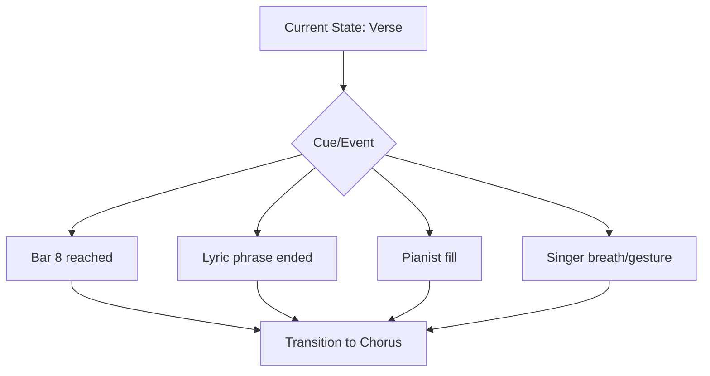

## 16.4 Cue Harus Konsisten

Jika Anda memberi cue yang berbeda setiap kali, penyanyi bingung.

Untuk pemula, cue sederhana lebih baik.

---

# 17. Bar Count sebagai Index

Bar count adalah index dalam section.

Contoh verse 8 bar:

```text
bar 1
bar 2
bar 3
bar 4
bar 5
bar 6
bar 7
bar 8
```

Jika Anda tahu sedang di bar berapa, Anda tahu kapan transition.

## 17.1 Bar Count untuk 4-Bar Progression

Progression:

```text
C - G - Am - F
```

Satu chord per bar:

```text
bar 1 C
bar 2 G
bar 3 Am
bar 4 F
```

Jika progression diulang 2x:

```text
8 bar
```

## 17.2 Counting Section

Jangan hanya hitung beat.

Hitung juga bar.

Contoh:

```text
Verse: 8 bars
Chorus: 8 bars
Bridge: 8 bars
```

## 17.3 Teknik Counting

Dalam kepala:

```text
1 2 3 4 | bar 1
1 2 3 4 | bar 2
...
```

Atau hitung phrase:

```text
phrase 1 = 4 bar
phrase 2 = 4 bar
```

## 17.4 Phrase Count Lebih Praktis

Banyak lagu pop memakai phrase 4 bar.

Maka Anda bisa berpikir:

```text
Verse = 2 phrases
Chorus = 2 phrases
```

Lebih ringan daripada menghitung 1 sampai 8 terus-menerus.

---

# 18. Chord Chart sebagai Source Code Lagu

Chord chart adalah source code sederhana untuk performance.

Namun chord chart sering tidak lengkap.

Ia mungkin hanya berisi:

```text
C G Am F
```

tanpa menjelaskan:

- pattern;
- dynamic;
- register;
- repeat;
- cue;
- ending;
- energy;
- vocal entry.

Tugas pengiring adalah menambahkan annotation.

## 18.1 Chord Chart Mentah

```text
Intro: C G Am F
Verse: Am F C G
Chorus: C G Am F
Bridge: F G Am G
```

## 18.2 Chord Chart yang Siap Tampil

```text
Intro: C G Am F
- 4 bars
- broken chord soft
- cue vocal on bar 4

Verse: Am F C G x2
- sparse
- energy 2
- no fill during vocal

Chorus: C G Am F x2
- fuller comping
- energy 3
- repeat once then verse 2

Bridge: F G Am G
- breakdown first 4, build next 4
- cue final chorus

Outro: F G C
- ritardando
- hold C
```

## 18.3 Source Code Analogy

Raw chord chart:

```text
function names only
```

Annotated chart:

```text
control flow + comments + runtime behavior
```

---

# 19. Cara Menandai Chord Chart

Gunakan marking yang sederhana.

## 19.1 Marking Section

Tulis jelas:

```text
[Intro]
[Verse 1]
[Chorus]
[Verse 2]
[Bridge]
[Final Chorus]
[Outro]
```

## 19.2 Marking Repeat

```text
x2
repeat
D.S.
D.C.
last time
```

Untuk pemula, gunakan bahasa sederhana:

```text
Chorus x2, then Bridge
```

## 19.3 Marking Energy

Gunakan angka:

```text
E1 = sangat lembut
E2 = verse
E3 = chorus
E4 = final chorus
```

## 19.4 Marking Texture

Contoh:

```text
BC = broken chord
BLK = block chord
PB = pop ballad comping
6/8 = rolling
SP = sparse
FULL = fuller
```

## 19.5 Marking Cue

```text
cue vocal
hold
fill
stop
build
rit.
tag x2
```

## 19.6 Contoh Annotated Chart

```text
[Intro] E1 BC
| C | G | Am | F |
bar 4: cue vocal

[Verse 1] E2 SP x2
| Am | F | C | G |

[Chorus] E3 PB x2
| C | G | Am | F |
after x2 -> Verse 2

[Bridge] E2->E4 BUILD
| F | G | Am | G |
bar 4: Gsus4-G cue

[Final Chorus] E4 FULL x2
| C | G | Am | F |

[Outro] E1 rit.
| F | G | C |
hold C
```

---

# 20. Arrangement Map: Struktur Sebelum Bermain

Arrangement map adalah ringkasan struktur lagu.

Contoh:

```text
Intro 4
Verse 8
Chorus 8
Verse 8
Chorus 8
Bridge 8
Final Chorus 16
Outro 4
```

## 20.1 Format Minimal

```text
Intro: 4 bars
Verse 1: 8 bars
Chorus 1: 8 bars
Verse 2: 8 bars
Chorus 2: 8 bars
Bridge: 8 bars
Final Chorus: 16 bars
Outro: 4 bars
```

## 20.2 Dengan Chord

```text
Intro: C-G-Am-F
Verse: Am-F-C-G x2
Chorus: C-G-Am-F x2
Bridge: F-G-Am-G x2
Outro: F-G-C
```

## 20.3 Dengan Texture

```text
Intro: broken chord
Verse: sparse
Chorus: pop comping
Bridge: breakdown -> build
Final Chorus: fuller
Outro: sparse rit.
```

## 20.4 Diagram

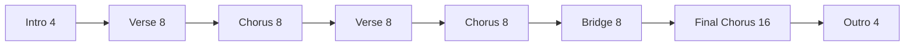

---

# 21. Energy Map: Dinamika per Section

Energy map menentukan seberapa besar setiap section.

Skala sederhana:

```text
1 = sangat lembut
2 = verse
3 = chorus normal
4 = final chorus
5 = peak besar
```

## 21.1 Contoh

| Section | Energy |
|---|---:|
| Intro | 1 |
| Verse 1 | 2 |
| Chorus 1 | 3 |
| Verse 2 | 2.5 |
| Chorus 2 | 3.5 |
| Bridge | 1.5 -> 4 |
| Final Chorus | 4 |
| Outro | 1 |

## 21.2 Kenapa Energy Map Penting?

Tanpa energy map, Anda cenderung memainkan semua bagian sama.

Akibatnya:

- lagu datar;
- chorus tidak terasa naik;
- bridge tidak kontras;
- final chorus tidak punya klimaks.

## 21.3 Energy Bukan Hanya Volume

Energy bisa dinaikkan melalui:

- density;
- register;
- rhythm;
- voicing;
- pedal;
- LH emphasis;
- chord color.

Bukan hanya memukul lebih keras.

---

# 22. Texture Map: Pattern per Section

Texture map menentukan pattern iringan.

Contoh:

| Section | Texture |
|---|---|
| Intro | broken chord soft |
| Verse | sparse root + partial chord |
| Pre-Chorus | build comping |
| Chorus | pop ballad comping |
| Bridge | breakdown/open voicing |
| Final Chorus | fuller comping |
| Outro | sparse/ritardando |

## 22.1 Texture Harus Mendukung Energy

Energy rendah:

```text
sparse, broken, partial
```

Energy tinggi:

```text
fuller, pulse, wider voicing
```

## 22.2 Texture Jangan Berubah Sembarangan

Jika texture berubah tanpa alasan, lagu terasa tidak stabil.

Ubah texture di section boundary atau phrase boundary.

## 22.3 Texture sebagai State Property

```text
Verse.texture = sparse
Chorus.texture = fuller
Bridge.texture = contrast
```

---

# 23. Register Map: Wilayah Piano per Section

Register map menentukan wilayah piano.

Contoh:

| Section | LH | RH |
|---|---|---|
| Intro | low-mid root | middle broken chord |
| Verse | light root | middle partial |
| Chorus | clearer root | middle/upper-middle fuller |
| Bridge | sparse/open | middle/high color |
| Outro | gentle root | middle soft |

## 23.1 Kenapa Register Map Penting?

Karena register memengaruhi:

- vokal clarity;
- energy;
- mood;
- density;
- risk of muddy;
- risk of piercing.

## 23.2 Prinsip

```text
Verse: register aman dan tidak menabrak
Chorus: sedikit lebih luas
Bridge: kontras
Outro: turun/lebih lembut
```

## 23.3 Jangan Semua Section di Register Sama

Jika semua section di register sama, lagu kurang berkembang.

Tetapi jangan juga terlalu ekstrem.

---

# 24. Cue Map: Sinyal untuk Penyanyi

Cue map menentukan kapan dan bagaimana penyanyi masuk.

## 24.1 Cue Masuk Verse

Intro bar terakhir:

```text
fill pendek
hold
dominant/sus
eye contact
```

## 24.2 Cue Masuk Chorus

Pre-chorus akhir:

```text
build
Gsus4 -> G
strong beat 1
pickup
```

## 24.3 Cue Ending

Sebelum final chord:

```text
ritardando
hold dominant
tag final
eye contact
```

## 24.4 Cue Map Contoh

```text
Intro bar 4: small fill -> Verse
Pre-Chorus bar 8: Gsus4-G -> Chorus
Bridge bar 8: build + stop -> Final Chorus
Tag x2: eye cue -> Ending
```

## 24.5 Cue Harus Terlihat atau Terdengar

Cue tidak boleh hanya ada di kepala pianis.

Penyanyi harus bisa menangkapnya.

---

# 25. Decision Point: Kapan Mengulang, Kapan Lanjut

Dalam live performance, kadang ada decision point.

Contoh:

```text
Chorus selesai.
Apakah ulang chorus atau masuk bridge?
```

## 25.1 Decision Point Umum

- setelah intro;
- setelah chorus;
- setelah bridge;
- saat tag ending;
- saat penyanyi memperpanjang phrase;
- saat audience response;
- saat worship/free section;
- saat rehearsal berbeda dari chart.

## 25.2 Cara Mengelola Decision Point

Sebelum bermain, sepakati:

```text
Chorus 2x then Bridge
Final Chorus 2x
Tag 2x
Ending on cue
```

Saat live:

- lihat penyanyi;
- dengarkan lyric;
- jaga loop aman;
- jangan panik;
- jika ragu, mainkan pattern lebih sederhana.

## 25.3 Safe Loop

Jika tidak yakin lanjut ke mana, ulang progression terakhir dengan density lebih rendah sambil mencari cue.

Contoh:

```text
C - G - Am - F
```

bisa menjadi safe loop.

Namun jangan loop terlalu lama tanpa komunikasi.

---

# 26. Error Recovery Saat Tersesat

Tersesat bisa terjadi.

Yang penting adalah recovery.

## 26.1 Prinsip Recovery

```text
jangan berhenti total
jaga pulse
cari chord root
dengarkan vokal
masuk kembali di bar/phrase berikutnya
```

## 26.2 Jika Salah Chord

- jaga rhythm;
- pindah ke chord berikutnya;
- jangan ulang bar;
- jangan berhenti.

## 26.3 Jika Salah Section

- dengarkan vokal;
- cari chord yang cocok;
- sederhanakan ke LH root;
- tunggu phrase boundary;
- masuk ke section yang benar.

## 26.4 Jika Tidak Tahu Ending

- ikuti penyanyi;
- gunakan dominant menuju tonic;
- turunkan dynamic;
- cari final lyric;
- tahan final chord saat jelas.

## 26.5 Recovery Diagram

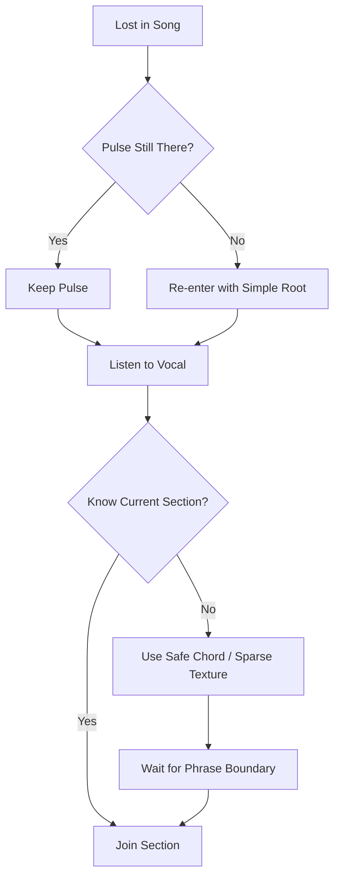

---

# 27. Membaca Lagu Pop 4/4 sebagai State Machine

Contoh struktur pop 4/4:

```text
Intro 4
Verse 8
Pre-Chorus 8
Chorus 8
Verse 8
Pre-Chorus 8
Chorus 8
Bridge 8
Final Chorus 16
Outro 4
```

## 27.1 State Diagram

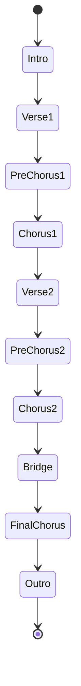

## 27.2 Texture Plan

```text
Intro: broken chord
Verse: sparse
Pre-Chorus: build
Chorus: pop ballad comping
Verse2: slightly fuller
Bridge: breakdown -> build
Final Chorus: fuller
Outro: sparse
```

## 27.3 Bar Count

Untuk setiap section, hitung phrase:

```text
8 bars = 2 phrases of 4 bars
16 bars = 4 phrases of 4 bars
```

## 27.4 Cue

- intro bar 4 cue vocal;
- pre-chorus bar 8 cue chorus;
- bridge bar 8 cue final chorus;
- outro final chord hold.

---

# 28. Membaca Ballad 6/8 sebagai State Machine

Contoh ballad 6/8:

```text
Intro 4
Verse 8
Chorus 8
Verse 8
Chorus 8
Bridge 8
Final Chorus 8
Outro 4
```

## 28.1 State Diagram

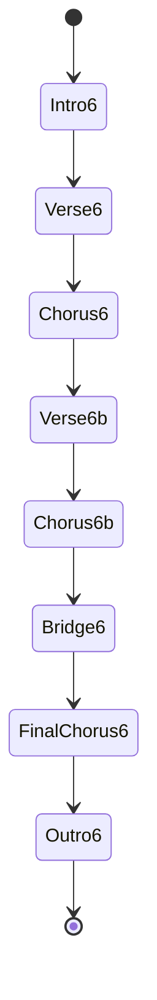

## 28.2 Count

Setiap bar:

```text
ONE two three FOUR five six
```

## 28.3 Texture Plan

```text
Intro: open 6/8 arpeggio
Verse: sparse 6/8
Chorus: fuller rolling chord
Bridge: open fifth / breakdown
Final Chorus: fuller 6/8
Outro: ritardando, final chord
```

## 28.4 Cue

6/8 cue harus menjaga dua pulse besar.

Jangan kehilangan beat 1 saat memberi fill.

---

# 29. Mini Case Study: C–G–Am–F Pop Ballad

Kita buat lagu sederhana dengan progression:

```text
C - G - Am - F
```

## 29.1 Struktur

```text
Intro: 4 bars
Verse: 8 bars
Chorus: 8 bars
Bridge: 8 bars
Final Chorus: 8 bars
Outro: 4 bars
```

## 29.2 State Map

```text
Intro:
  C-G-Am-F
  broken chord
  energy 1

Verse:
  C-G-Am-F x2
  sparse partial voicing
  energy 2

Chorus:
  C-G-Am-F x2
  pop ballad comping
  energy 3

Bridge:
  Am-F-C-G x2
  breakdown then build
  energy 1.5 -> 4

Final Chorus:
  C-G-Am-F x2
  fuller comping
  energy 4

Outro:
  F-G-C
  ritardando
  energy 1
```

## 29.3 Diagram

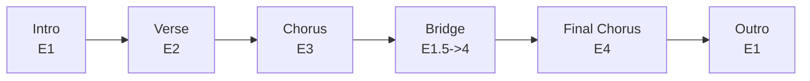

## 29.4 Cue Plan

```text
Intro bar 4: small fill
Verse bar 8: build to chorus
Chorus bar 8: hold or transition
Bridge bar 8: Gsus4-G cue
Outro: F-G-C hold
```

---

# 30. Mini Case Study: Am–F–C–G Verse ke Chorus

Kita gunakan verse minor-ish:

```text
Verse: Am - F - C - G
Chorus: C - G - Am - F
```

## 30.1 Struktur

```text
Intro: C - G - Am - F
Verse: Am - F - C - G x2
Chorus: C - G - Am - F x2
Verse2: Am - F - C - G x2
Final Chorus: C - G - Am - F x2
Outro: F - G - C
```

## 30.2 State Properties

```text
Intro:
  energy 1
  texture broken chord

Verse:
  energy 2
  RH partial
  lots of vocal space

Chorus:
  energy 3
  fuller comping

Verse2:
  energy 2.5
  slightly more movement

Final Chorus:
  energy 4
  open voicing

Outro:
  energy 1
  ritardando
```

## 30.3 State Diagram

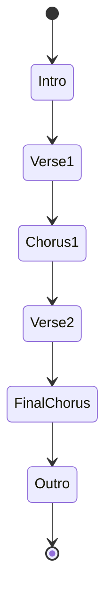

## 30.4 Transition Focus

Kunci transisi:

```text
Verse G -> Chorus C
```

Gunakan:

```text
Gsus4 -> G -> C
```

atau:

```text
G hold -> C strong beat 1
```

---

# 31. Latihan 1: Buat State Diagram Lagu Sederhana

Pilih lagu sederhana atau gunakan progression latihan.

Buat struktur:

```text
Intro
Verse
Chorus
Bridge
Final Chorus
Outro
```

## 31.1 Tulis State

Contoh:

```text
Intro: 4 bars
Verse: 8 bars
Chorus: 8 bars
Bridge: 8 bars
Final Chorus: 16 bars
Outro: 4 bars
```

## 31.2 Gambar Mermaid

Gunakan:

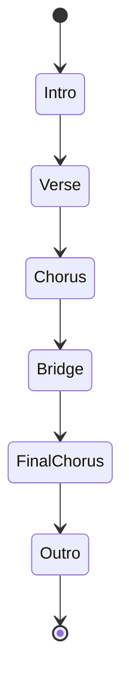

## 31.3 Tambahkan Energy

```text
Intro E1
Verse E2
Chorus E3
Bridge E2->E4
Final Chorus E4
Outro E1
```

## 31.4 Tujuan

Anda belajar melihat lagu sebagai flow, bukan hanya kumpulan chord.

---

# 32. Latihan 2: Marking Chord Chart

Ambil chord chart mentah:

```text
Intro: C G Am F
Verse: Am F C G
Chorus: C G Am F
Bridge: F G Am G
Outro: F G C
```

Tambahkan marking.

## 32.1 Hasil yang Diinginkan

```text
[Intro] 4 bars | E1 | broken chord
| C | G | Am | F |
bar 4 cue vocal

[Verse 1] 8 bars | E2 | sparse partial
| Am | F | C | G | x2

[Chorus] 8 bars | E3 | pop ballad comping
| C | G | Am | F | x2

[Bridge] 8 bars | E2->E4 | build
| F | G | Am | G | x2
bar 8: Gsus4-G cue

[Final Chorus] 16 bars | E4 | fuller
| C | G | Am | F | x4

[Outro] 4 bars | E1 | rit.
| F | G | C | C |
hold C
```

## 32.2 Tujuan

Membiasakan membaca chart sebagai performance instruction, bukan hanya chord list.

---

# 33. Latihan 3: Mainkan Struktur Tanpa Vokal

Mainkan arrangement map tanpa bernyanyi.

Fokus:

- section transition;
- bar count;
- energy change;
- texture change;
- cue points.

## 33.1 Aturan

Jangan improvisasi terlalu banyak.

Ikuti map.

Jika salah, jangan berhenti. Recovery di phrase berikutnya.

## 33.2 Checklist

- intro selesai tepat 4 bar;
- verse tepat 8 bar;
- chorus tepat 8 bar;
- bridge build sesuai rencana;
- final chorus lebih besar;
- outro selesai jelas.

## 33.3 Tujuan

Melatih navigation sebelum ditambah kompleksitas vokal.

---

# 34. Latihan 4: Mainkan Struktur dengan Humming

Sekarang tambahkan humming sederhana.

Tidak perlu melodi bagus.

Tujuan:

```text
melatih perhatian terbagi antara piano dan vokal
```

## 34.1 Gunakan Syllable

```text
hmm
la
na
```

## 34.2 Aturan

Saat humming aktif:

- piano lebih simple;
- jangan fill berlebihan;
- jaga bar count;
- cue chorus tetap jelas.

## 34.3 Evaluasi

Rekam.

Dengarkan:

- apakah struktur jelas?
- apakah vokal masuk aman?
- apakah piano memberi cue?
- apakah Anda tersesat?
- apakah energy map terasa?

---

# 35. Latihan 5: Simulasi Salah Masuk Section

Ini latihan penting untuk live recovery.

## 35.1 Simulasi 1: Salah Chord

Saat memainkan progression, sengaja main chord salah satu kali.

Tugas:

```text
jaga pulse dan lanjut
```

## 35.2 Simulasi 2: Lupa Repeat

Main chorus, lalu pura-pura lupa apakah repeat.

Tugas:

```text
gunakan safe loop 1 bar/4 bar sambil kembali ke map
```

## 35.3 Simulasi 3: Penyanyi Masuk Chorus Lebih Cepat

Saat verse seharusnya 8 bar, anggap vokal masuk chorus di bar 5.

Tugas:

```text
ikuti vokal di phrase boundary terdekat
```

## 35.4 Simulasi 4: Ending Tidak Jelas

Main tag x2, lalu pilih final cue.

Tugas:

```text
gunakan Gsus4-G-C atau F-G-C sebagai ending
```

## 35.5 Tujuan

Anda tidak akan selalu bermain sempurna.

Skill live adalah:

```text
recover gracefully
```

---

# 36. Debugging Struktur Lagu

Jika Anda sering tersesat, debug seperti sistem.

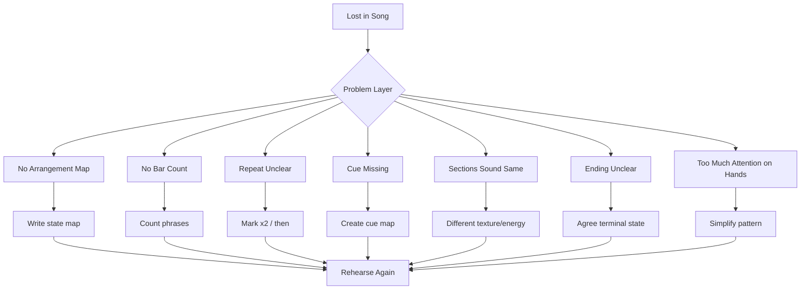

## 36.1 Tidak Ada Arrangement Map

Solusi:

```text
tulis struktur sebelum bermain
```

## 36.2 Tidak Menghitung Bar

Solusi:

```text
hitung phrase 4 bar
```

## 36.3 Repeat Tidak Jelas

Solusi:

```text
tandai x2, x4, then bridge
```

## 36.4 Cue Tidak Ada

Solusi:

```text
tentukan fill/hold/sus sebelum transition
```

## 36.5 Section Terdengar Sama

Solusi:

```text
ubah energy, texture, density, register
```

## 36.6 Ending Tidak Jelas

Solusi:

```text
tentukan terminal state: final chord, tag count, ritardando
```

## 36.7 Terlalu Fokus pada Tangan

Solusi:

```text
sederhanakan pattern agar otak bisa memantau struktur
```

---

# 37. Failure Mode Pemula

## 37.1 Membaca Chord Saja

Chord benar tetapi struktur salah tetap gagal.

Baca section.

## 37.2 Tidak Menghitung Bar

Feeling tanpa bar count sering membuat Anda salah transition.

## 37.3 Semua Section Pakai Pattern Sama

Jika intro, verse, chorus, bridge sama, Anda lebih mudah tersesat dan lagu datar.

## 37.4 Tidak Menandai Repeat

Repeat adalah loop. Loop harus jelas.

## 37.5 Cue Vokal Tidak Jelas

Penyanyi butuh sinyal.

Intro yang tidak memberi cue membuat masuk vokal tidak aman.

## 37.6 Ending Tidak Disepakati

Ending adalah terminal state. Jangan biarkan undefined.

## 37.7 Terlalu Banyak Fill

Fill berlebihan membuat bar count hilang dan vokal terganggu.

## 37.8 Panik Saat Salah

Saat salah, jaga pulse.

Berhenti total lebih buruk daripada chord salah singkat.

## 37.9 Tidak Mendengar Vokal

Jika Anda hanya membaca chart, Anda bisa melewatkan cue penyanyi.

## 37.10 Tidak Membuat Energy Map

Tanpa energy map, lagu tidak punya arc.

---

# 38. Practice Protocol 45 Menit

Gunakan sesi ini untuk Part 016.

## 38.1 Menit 0–5: Tulis Arrangement Map

Gunakan struktur:

```text
Intro 4
Verse 8
Chorus 8
Verse 8
Chorus 8
Bridge 8
Final Chorus 16
Outro 4
```

## 38.2 Menit 5–10: Tambahkan Chord

Isi:

```text
Intro: C-G-Am-F
Verse: Am-F-C-G x2
Chorus: C-G-Am-F x2
Bridge: F-G-Am-G x2
Outro: F-G-C
```

## 38.3 Menit 10–15: Tambahkan Energy dan Texture

Contoh:

```text
Intro E1 broken
Verse E2 sparse
Chorus E3 comping
Bridge E2->E4 build
Final Chorus E4 fuller
Outro E1 rit.
```

## 38.4 Menit 15–20: Mainkan Tanpa Vokal

Mainkan seluruh struktur.

Fokus:

- bar count;
- transition;
- energy;
- ending.

## 38.5 Menit 20–25: Mainkan dengan Count

Hitung phrase 4 bar.

Ucapkan dalam kepala:

```text
phrase 1
phrase 2
next section
```

## 38.6 Menit 25–30: Tambahkan Cue

Latih:

- intro cue;
- pre-chorus/chorus cue;
- bridge to final chorus cue;
- ending cue.

## 38.7 Menit 30–35: Humming

Humming sederhana di atas struktur.

Pastikan piano tidak mengganggu.

## 38.8 Menit 35–40: Error Recovery

Sengaja buat satu kesalahan:

- chord salah;
- repeat salah;
- section delay.

Latih recovery tanpa berhenti.

## 38.9 Menit 40–45: Record and Review

Rekam 1 menit atau full mini arrangement jika kuat.

Jawab:

- apakah struktur jelas?
- apakah transition tepat?
- apakah cue terdengar?
- apakah section punya energy berbeda?
- apakah ending jelas?
- apakah Anda tersesat?
- jika tersesat, layer mana penyebabnya?

---

# 39. Checklist Kelulusan Part 016

Anda boleh lanjut ke Part 017 jika sebagian besar checklist ini terpenuhi.

## 39.1 Pemahaman

- [ ] Saya bisa melihat lagu sebagai state machine.
- [ ] Saya tahu section lagu adalah state.
- [ ] Saya tahu perpindahan section adalah transition.
- [ ] Saya tahu cue adalah event signal.
- [ ] Saya tahu intro adalah initial state.
- [ ] Saya tahu ending adalah terminal state.
- [ ] Saya tahu repeat adalah loop.
- [ ] Saya tahu tag ending adalah controlled loop.
- [ ] Saya tahu bar count penting untuk tidak tersesat.
- [ ] Saya tahu chord chart mentah perlu annotation.

## 39.2 Praktik

- [ ] Saya bisa membuat arrangement map sederhana.
- [ ] Saya bisa menandai intro, verse, chorus, bridge, outro.
- [ ] Saya bisa menandai repeat `x2`.
- [ ] Saya bisa membuat energy map per section.
- [ ] Saya bisa membuat texture map per section.
- [ ] Saya bisa memainkan struktur sederhana tanpa vokal.
- [ ] Saya bisa memainkan struktur sederhana dengan humming.
- [ ] Saya bisa memberi cue masuk vokal setelah intro.
- [ ] Saya bisa membuat ending sederhana `F-G-C` atau `Gsus4-G-C`.
- [ ] Saya bisa recovery jika salah chord tanpa berhenti.

## 39.3 Self-Correction

- [ ] Saya bisa mendeteksi jika saya tersesat karena tidak menghitung bar.
- [ ] Saya bisa mendeteksi jika repeat tidak jelas.
- [ ] Saya bisa mendeteksi jika cue tidak cukup jelas.
- [ ] Saya bisa mendeteksi jika semua section terdengar sama.
- [ ] Saya bisa menyederhanakan pattern agar bisa fokus struktur.
- [ ] Saya bisa menggunakan safe loop saat ragu.
- [ ] Saya bisa menentukan terminal state sebelum tampil.

---

# 40. Ringkasan Mental Model

Lagu bisa dibaca sebagai state machine.

```text
section = state
perpindahan section = transition
cue = event
repeat = loop
tag = controlled loop
ending = terminal state
bar count = index
chord chart = source code
arrangement map = execution plan
```

Diagram akhir:

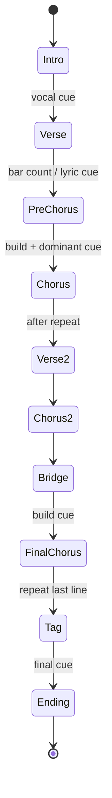

Prinsip utama:

```text
Jangan hanya tahu chord.
Tahu di mana Anda berada dalam lagu.
Tahu ke mana lagu akan pergi.
Tahu sinyal apa yang membuat Anda pindah.
Tahu bagaimana lagu berakhir.
```

Kalimat kunci:

```text
Accompaniment yang baik adalah navigasi struktur secara musikal.
```

---

# 41. Persiapan ke Part 017

Part berikutnya adalah:

```text
learn-piano-accompaniment-part-017.md
```

Judul:

```text
Membuat Intro, Interlude, dan Ending
```

Di Part 016, kita belajar membaca lagu sebagai state machine.

Sekarang kita akan memperdalam tiga bagian yang paling sering membuat pengiring pemula bingung:

- intro;
- interlude;
- ending.

Part 017 akan membahas:

- fungsi intro;
- intro 2 bar, 4 bar, 8 bar;
- memberi key, tempo, mood, dan cue;
- intro dari progression chorus;
- intro dari last line;
- interlude sebagai napas;
- interlude sebagai transisi;
- ending `F-G-C`;
- ending `Gsus4-G-C`;
- tag ending;
- ritardando;
- final chord hold;
- cara memberi cue ending kepada penyanyi;
- cara menghindari ending yang menggantung.

Part 017 akan membuat Anda lebih siap tampil karena awal dan akhir lagu biasanya paling terlihat oleh pendengar.

---

## Status Akhir Part 016

```text
Part 016 selesai.
Seri belum selesai.
Lanjut ke Part 017.
```
