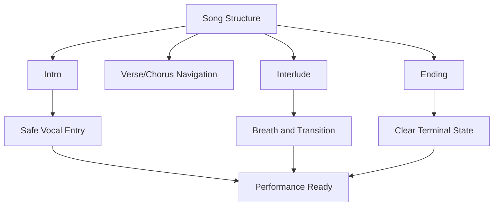
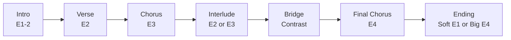
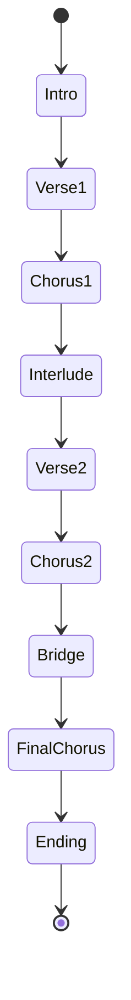
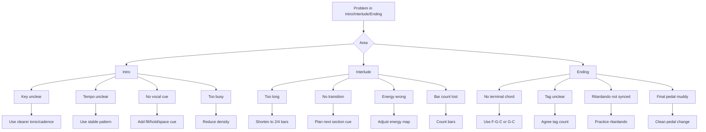
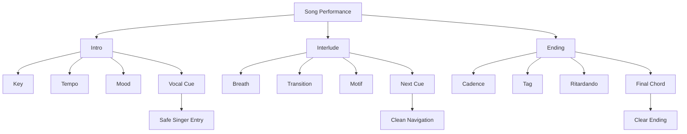

# learn-piano-accompaniment-part-017.md

# Part 017 — Membuat Intro, Interlude, dan Ending

> Seri: **Learn Piano Accompaniment for Singer Performance**  
> Fokus: **belajar piano untuk mengiringi penyanyi**  
> Framework utama: **The First 20 Hours — Josh Kaufman**  
> Tahap: **Phase E — Struktur Lagu & Aransemen**

---

## Status Seri

| Item | Status |
|---|---|
| Part | 017 |
| Nama file | `learn-piano-accompaniment-part-017.md` |
| Fokus | Membuat intro, interlude, dan ending untuk mengiringi penyanyi |
| Prasyarat | Part 000–016 |
| Output praktis | Bisa membuat awal, transisi instrumental, dan akhir lagu yang jelas, musikal, dan aman untuk penyanyi |
| Status seri | Belum selesai |

---

## Daftar Isi

- [1. Tujuan Part Ini](#1-tujuan-part-ini)
- [2. Posisi Part Ini dalam Framework Kaufman](#2-posisi-part-ini-dalam-framework-kaufman)
- [3. Kenapa Intro, Interlude, dan Ending Sangat Penting](#3-kenapa-intro-interlude-dan-ending-sangat-penting)
- [4. Mental Model: Entry, Breath, Exit](#4-mental-model-entry-breath-exit)
- [5. Intro: Memberi Key, Tempo, Mood, dan Cue](#5-intro-memberi-key-tempo-mood-dan-cue)
- [6. Kesalahan Intro yang Sering Terjadi](#6-kesalahan-intro-yang-sering-terjadi)
- [7. Intro 1: Menggunakan Progression Chorus](#7-intro-1-menggunakan-progression-chorus)
- [8. Intro 2: Menggunakan Progression Verse](#8-intro-2-menggunakan-progression-verse)
- [9. Intro 3: Menggunakan Last Line / Ending Phrase](#9-intro-3-menggunakan-last-line--ending-phrase)
- [10. Intro 4: Menggunakan Cadence](#10-intro-4-menggunakan-cadence)
- [11. Intro 5: 6/8 Cinematic Intro](#11-intro-5-68-cinematic-intro)
- [12. Intro 2 Bar, 4 Bar, dan 8 Bar](#12-intro-2-bar-4-bar-dan-8-bar)
- [13. Cue Masuk Vokal](#13-cue-masuk-vokal)
- [14. Interlude: Napas, Transisi, atau Mini-Statement](#14-interlude-napas-transisi-atau-mini-statement)
- [15. Kesalahan Interlude yang Sering Terjadi](#15-kesalahan-interlude-yang-sering-terjadi)
- [16. Interlude 1: Mengulang Intro](#16-interlude-1-mengulang-intro)
- [17. Interlude 2: Menggunakan Progression Chorus](#17-interlude-2-menggunakan-progression-chorus)
- [18. Interlude 3: Menggunakan Motif Pendek](#18-interlude-3-menggunakan-motif-pendek)
- [19. Interlude 4: Breakdown Setelah Chorus](#19-interlude-4-breakdown-setelah-chorus)
- [20. Ending: Terminal State yang Jelas](#20-ending-terminal-state-yang-jelas)
- [21. Kesalahan Ending yang Sering Terjadi](#21-kesalahan-ending-yang-sering-terjadi)
- [22. Ending 1: F–G–C](#22-ending-1-fgc)
- [23. Ending 2: Dm7–G7–C](#23-ending-2-dm7g7c)
- [24. Ending 3: Gsus4–G–C](#24-ending-3-gsus4gc)
- [25. Ending 4: Tag Ending](#25-ending-4-tag-ending)
- [26. Ending 5: Ritardando dan Final Chord Hold](#26-ending-5-ritardando-dan-final-chord-hold)
- [27. Ending 6: Soft Landing vs Big Ending](#27-ending-6-soft-landing-vs-big-ending)
- [28. Intro, Interlude, Ending dalam 4/4](#28-intro-interlude-ending-dalam-44)
- [29. Intro, Interlude, Ending dalam 6/8](#29-intro-interlude-ending-dalam-68)
- [30. Dynamic dan Density untuk Awal, Tengah, Akhir](#30-dynamic-dan-density-untuk-awal-tengah-akhir)
- [31. Pedal untuk Intro, Interlude, dan Ending](#31-pedal-untuk-intro-interlude-dan-ending)
- [32. Komunikasi dengan Penyanyi](#32-komunikasi-dengan-penyanyi)
- [33. Template Arrangement Lengkap](#33-template-arrangement-lengkap)
- [34. Mini Case Study 1: Pop Ballad 4/4](#34-mini-case-study-1-pop-ballad-44)
- [35. Mini Case Study 2: Slow Cinematic 6/8](#35-mini-case-study-2-slow-cinematic-68)
- [36. Latihan 1: Membuat 5 Intro dari Progression yang Sama](#36-latihan-1-membuat-5-intro-dari-progression-yang-sama)
- [37. Latihan 2: Membuat 3 Interlude](#37-latihan-2-membuat-3-interlude)
- [38. Latihan 3: Membuat 5 Ending](#38-latihan-3-membuat-5-ending)
- [39. Latihan 4: Intro ke Verse dengan Cue Vokal](#39-latihan-4-intro-ke-verse-dengan-cue-vokal)
- [40. Latihan 5: Ending dengan Penyanyi](#40-latihan-5-ending-dengan-penyanyi)
- [41. Debugging Intro, Interlude, dan Ending](#41-debugging-intro-interlude-dan-ending)
- [42. Failure Mode Pemula](#42-failure-mode-pemula)
- [43. Practice Protocol 45 Menit](#43-practice-protocol-45-menit)
- [44. Checklist Kelulusan Part 017](#44-checklist-kelulusan-part-017)
- [45. Ringkasan Mental Model](#45-ringkasan-mental-model)
- [46. Persiapan ke Part 018](#46-persiapan-ke-part-018)

---

# 1. Tujuan Part Ini

Pada Part 016, kita belajar membaca lagu sebagai state machine:

```text
Intro -> Verse -> Chorus -> Bridge -> Final Chorus -> Outro
```

Sekarang kita memperdalam tiga state yang sangat penting dalam performa:

```text
Intro
Interlude
Ending
```

Ketiganya sering dianggap “tambahan”, padahal justru sangat menentukan kesan performa.

Intro menentukan:

```text
apakah penyanyi masuk dengan aman?
```

Interlude menentukan:

```text
apakah lagu punya napas dan transisi yang jelas?
```

Ending menentukan:

```text
apakah lagu selesai dengan meyakinkan?
```

Target part ini:

> Anda mampu membuat intro, interlude, dan ending sederhana yang jelas, musikal, tidak membingungkan penyanyi, dan cocok dengan energi lagu.

Setelah part ini, Anda harus bisa membuat:

- intro 2 bar;
- intro 4 bar;
- intro dari progression chorus;
- intro dari progression verse;
- intro 6/8 cinematic;
- interlude pendek;
- ending `F-G-C`;
- ending `Dm7-G7-C`;
- ending `Gsus4-G-C`;
- tag ending;
- ritardando sederhana;
- final chord hold.

---

# 2. Posisi Part Ini dalam Framework Kaufman

Dalam *The First 20 Hours*, kita tidak belajar seluruh teori aransemen sekaligus. Kita memilih pola kecil yang bisa langsung dipakai.

Untuk pengiring piano, intro/interlude/ending punya leverage tinggi karena:

- sering muncul di setiap lagu;
- mudah dilatih secara terpisah;
- langsung memperbaiki performa;
- membantu penyanyi merasa aman;
- membuat lagu terdengar lebih “jadi”;
- mengurangi risiko awal/akhir lagu berantakan.

Diagram:



Dalam konteks 20 jam pertama, kita tidak perlu intro yang virtuosic.

Kita butuh intro yang:

```text
jelas
terhitung
memberi key
memberi tempo
memberi mood
memberi cue
```

Dan ending yang:

```text
tidak menggantung
tidak membingungkan
tidak terlalu panjang
punya final chord yang jelas
```

---

# 3. Kenapa Intro, Interlude, dan Ending Sangat Penting

Pendengar sering paling ingat:

```text
awal lagu
puncak lagu
akhir lagu
```

Bagi penyanyi, intro dan ending juga sangat penting secara praktis.

## 3.1 Intro adalah Landasan Masuk

Intro memberi penyanyi informasi:

- key;
- tempo;
- feel;
- kapan masuk;
- mood;
- energy awal.

Jika intro tidak jelas, penyanyi bisa masuk ragu.

## 3.2 Interlude adalah Napas

Interlude memberi:

- ruang setelah chorus;
- transisi ke verse/bridge;
- momen instrumental;
- kesempatan penyanyi bernapas;
- perubahan energy.

## 3.3 Ending adalah Kesan Terakhir

Ending yang baik membuat lagu terasa selesai.

Ending yang buruk membuat lagu terasa amatir, walau bagian tengahnya bagus.

## 3.4 Prinsip

```text
Intro membuka pintu.
Interlude memberi lorong.
Ending menutup rumah.
```

---

# 4. Mental Model: Entry, Breath, Exit

Kita bisa memodelkan intro, interlude, dan ending sebagai tiga fungsi.

```text
Intro     = entry()
Interlude = breathe_and_transition()
Ending    = exit()
```

Diagram:


## 4.1 Intro sebagai Entry Function

Input:

```text
song key
tempo
mood
vocal entry point
```

Output:

```text
penyanyi masuk dengan aman
```

## 4.2 Interlude sebagai Transition Function

Input:

```text
section sebelumnya
section berikutnya
energy target
```

Output:

```text
transisi terasa natural
```

## 4.3 Ending sebagai Exit Function

Input:

```text
final phrase
cadence
tag count
dynamic target
```

Output:

```text
lagu selesai jelas
```

---

# 5. Intro: Memberi Key, Tempo, Mood, dan Cue

Intro punya empat tugas utama:

```text
key
tempo
mood
cue
```

Jika salah satu hilang, penyanyi bisa tidak aman.

## 5.1 Key

Intro harus memberi tahu:

```text
lagu ini di tonal center apa?
```

Jika lagu di C, intro harus membuat C terasa sebagai rumah.

Cara:

- mulai dari C;
- akhiri intro dengan G atau C;
- gunakan progression yang jelas;
- jangan terlalu banyak chord ambiguous di awal.

## 5.2 Tempo

Intro harus memberi pulse.

Jika tempo tidak jelas, penyanyi tidak tahu kapan masuk.

Cara:

- gunakan pattern yang terhitung;
- jangan terlalu rubato jika belum disepakati;
- berikan beat 1 jelas;
- jangan mengubah tempo di bar terakhir.

## 5.3 Mood

Intro menentukan atmosphere.

Contoh:

```text
block chord lembut = intimate
broken chord = flowing
6/8 arpeggio = cinematic
open fifth = dramatic
pop comping = modern
```

## 5.4 Cue

Cue adalah sinyal masuk vokal.

Bisa berupa:

- fill pendek;
- hold chord;
- stop;
- sus resolution;
- dominant chord;
- gesture/eye contact;
- dynamic dip;
- bar count yang jelas.

---

# 6. Kesalahan Intro yang Sering Terjadi

## 6.1 Terlalu Panjang

Intro yang terlalu panjang tanpa tujuan membuat penyanyi dan pendengar menunggu.

Untuk pemula, pilih:

```text
2 bar
4 bar
8 bar maksimal jika jelas
```

## 6.2 Tidak Memberi Tempo

Intro yang terlalu bebas membuat penyanyi ragu.

Jika ingin rubato, sepakati dulu.

## 6.3 Tidak Memberi Cue

Penyanyi tidak tahu kapan masuk.

Solusi:

```text
bar terakhir intro harus memberi sinyal
```

## 6.4 Terlalu Ramai

Intro terlalu banyak fill membuat mood tidak stabil.

## 6.5 Tidak Menunjukkan Key

Jika intro terlalu ambiguous, penyanyi bisa salah pitch.

## 6.6 Semua Lagu Punya Intro Sama

Setiap lagu punya mood. Jangan memakai satu intro generik untuk semua lagu.

---

# 7. Intro 1: Menggunakan Progression Chorus

Cara paling aman:

```text
ambil progression chorus sebagai intro
```

Jika chorus:

```text
C - G - Am - F
```

Intro bisa:

```text
| C | G | Am | F |
```

## 7.1 Kenapa Aman?

Karena progression chorus biasanya paling familiar dan paling kuat.

Intro ini memberi:

- key;
- mood;
- progression utama;
- cue yang mudah;
- sense of song identity.

## 7.2 Pattern

Untuk 4/4:

```text
X - - -
```

atau:

```text
X - x -
```

Untuk ballad:

```text
broken chord
```

## 7.3 Contoh

```text
[Intro]
| Cadd9 | G | Am7 | Fadd9 |
```

Texture:

```text
broken chord lembut
```

Cue:

```text
bar 4 Fadd9, tahan sedikit, vokal masuk ke Verse
```

## 7.4 Kapan Cocok?

- pop ballad;
- worship/pop;
- lagu sederhana;
- jika penyanyi butuh key dan mood jelas;
- jika chorus progression kuat.

---

# 8. Intro 2: Menggunakan Progression Verse

Jika verse punya mood berbeda dari chorus, intro bisa memakai progression verse.

Contoh verse:

```text
Am - F - C - G
```

Intro:

```text
| Am | F | C | G |
```

## 8.1 Rasa

Intro ini terasa lebih langsung masuk ke mood verse.

Cocok jika lagu dimulai dengan suasana:

- reflektif;
- minor-ish;
- lembut;
- naratif;
- intimate.

## 8.2 Pattern

Gunakan density rendah:

```text
X - - -
```

atau broken chord lembut.

## 8.3 Cue

Bar terakhir biasanya G.

Gunakan:

```text
Gsus4 -> G
```

lalu vokal masuk.

## 8.4 Contoh

```text
[Intro]
| Am7 | Fadd9 | Cadd9 | Gsus4 G |
```

Lalu:

```text
[Verse]
| Am7 | Fadd9 | Cadd9 | G |
```

## 8.5 Kapan Cocok?

- lagu dimulai dengan verse sangat kuat;
- ingin mood minor/hangat dari awal;
- chorus terlalu besar untuk intro;
- lirik awal sangat penting.

---

# 9. Intro 3: Menggunakan Last Line / Ending Phrase

Banyak lagu memakai potongan akhir chorus atau last line sebagai intro.

Misalnya ending phrase:

```text
F - G - C
```

Intro bisa:

```text
| F | G | C | C |
```

## 9.1 Kenapa Berguna?

Karena progression ending sering memberi rasa pulang.

Intro ini memberi key dengan sangat jelas.

## 9.2 Contoh

Jika lagu di C:

```text
| Fadd9 | Gsus4 G | Cadd9 | C |
```

Ini memberi:

```text
predominant -> dominant -> tonic
```

Sangat aman untuk penyanyi.

## 9.3 Rasa

- jelas;
- sederhana;
- classic;
- cocok untuk ballad;
- cocok untuk lagu yang butuh masuk vokal dengan aman.

## 9.4 Kapan Cocok?

- lagu yang tidak punya intro asli;
- latihan cepat dengan penyanyi;
- performance akustik;
- lagu yang butuh key sangat jelas;
- ending phrase lagu mudah dikenali.

---

# 10. Intro 4: Menggunakan Cadence

Cadence adalah gerakan harmoni yang memberi rasa resolusi.

Dalam key C, cadence sederhana:

```text
G - C
```

atau:

```text
F - G - C
```

atau:

```text
Dm7 - G7 - C
```

## 10.1 Intro 2 Bar

```text
| G | C |
```

Atau lebih halus:

```text
| Gsus4 G | C |
```

## 10.2 Intro 4 Bar

```text
| F | G | C | C |
```

atau:

```text
| Dm7 | G7 | Cadd9 | C |
```

## 10.3 Fungsi

Cadence intro cocok jika:

- butuh key jelas;
- intro harus pendek;
- penyanyi ingin langsung masuk;
- lagu tidak butuh motif khusus.

## 10.4 Risiko

Intro cadence bisa terdengar generik jika semua lagu diperlakukan sama.

Gunakan voicing, rhythm, dan dynamic sesuai mood lagu.

---

# 11. Intro 5: 6/8 Cinematic Intro

Untuk lagu 6/8 atau slow cinematic, intro bisa memakai rolling pattern.

Progression:

```text
C - G - Am - F
```

Pattern:

```text
ONE two three FOUR five six
1   5   8     5    3    5
```

Contoh C:

```text
C G C G E G
```

## 11.1 Contoh Intro

```text
| Cadd9 | Gsus4 G | Am7 | Fadd9 |
```

Dengan rolling 6/8.

## 11.2 Dynamic

```text
bar 1 level 1
bar 2 level 1.5
bar 3 level 2
bar 4 turun sedikit untuk cue vocal
```

## 11.3 Cue

Bar terakhir jangan terlalu ramai.

Bisa gunakan:

```text
F - - C - -
```

atau hold Fadd9 lembut sebelum vokal masuk.

## 11.4 Kapan Cocok?

- cinematic ballad;
- worship;
- slow dramatic song;
- lirik emosional;
- intro yang ingin terasa mengalun.

---

# 12. Intro 2 Bar, 4 Bar, dan 8 Bar

## 12.1 Intro 2 Bar

Cocok untuk:

- lagu sederhana;
- penyanyi sudah siap;
- tempo jelas;
- performance informal;
- transisi cepat.

Contoh:

```text
| Gsus4 G | C |
```

## 12.2 Intro 4 Bar

Default paling aman.

Cocok untuk:

- memberi key dan mood;
- memberi penyanyi waktu masuk;
- membangun atmosphere singkat.

Contoh:

```text
| C | G | Am | F |
```

## 12.3 Intro 8 Bar

Cocok jika:

- lagu butuh atmosphere;
- ada motif instrumental;
- ballad dramatis;
- penyanyi butuh ruang;
- performance lebih arranged.

Namun intro 8 bar harus jelas. Jangan hanya mengulang tanpa tujuan.

## 12.4 Rule

```text
Jika tidak yakin, pakai intro 4 bar.
```

---

# 13. Cue Masuk Vokal

Cue masuk vokal adalah hal wajib.

## 13.1 Cue Harmoni

Gunakan dominant atau sus:

```text
Gsus4 -> G -> C
```

atau jika verse mulai Am:

```text
G -> Am
```

## 13.2 Cue Rhythm

Beri pattern yang jelas di bar terakhir:

```text
1 2 3 4
X - x -
```

lalu vokal masuk di beat 1 berikutnya.

## 13.3 Cue Fill

Fill 1–3 nada:

```text
E - G
```

atau:

```text
G - E - D
```

Jangan terlalu panjang.

## 13.4 Cue Space

Kadang cue terbaik adalah diam sebentar sebelum vokal.

Contoh:

```text
bar 4 beat 4: stop
vokal masuk beat 1
```

## 13.5 Cue Visual

Jika tampil dengan penyanyi:

- eye contact;
- anggukan;
- napas bersama;
- gerakan tubuh kecil.

## 13.6 Prinsip

```text
Cue harus mudah ditangkap penyanyi.
Bukan hanya bagus menurut pianis.
```

---

# 14. Interlude: Napas, Transisi, atau Mini-Statement

Interlude adalah bagian instrumental di tengah lagu.

Fungsi interlude bisa berbeda.

## 14.1 Interlude sebagai Napas

Setelah chorus besar, interlude memberi ruang sebelum verse berikutnya.

Texture:

```text
lebih sparse
lebih lembut
```

## 14.2 Interlude sebagai Transisi

Interlude menghubungkan chorus ke bridge atau verse.

Texture:

```text
menjaga energy atau menurunkannya
```

## 14.3 Interlude sebagai Mini-Statement

Piano boleh sedikit lebih foreground.

Tetapi tetap tidak menjadi solo panjang kecuali memang dirancang.

## 14.4 Interlude State Template

```text
Interlude:
  length: 2/4/8 bars
  progression: intro or chorus progression
  texture: broken chord / motif
  energy: depends on previous and next section
  cue_out: prepare vocal re-entry
```

---

# 15. Kesalahan Interlude yang Sering Terjadi

## 15.1 Terlalu Panjang

Interlude tanpa tujuan membuat lagu kehilangan momentum.

## 15.2 Tidak Memberi Cue Masuk Section Berikutnya

Penyanyi tidak tahu kapan masuk.

## 15.3 Terlalu Ramai

Interlude setelah chorus besar kadang butuh turun, bukan makin penuh.

## 15.4 Tidak Sesuai Energy

Jika setelah interlude masuk verse lembut, jangan interlude terlalu besar sampai verse terasa jatuh tanpa sengaja.

## 15.5 Motif Tidak Jelas

Interlude yang hanya random chord/fill bisa terdengar seperti pianis bingung.

## 15.6 Bar Count Hilang

Karena vokal diam, pianis sering kehilangan hitungan.

Interlude tetap harus dihitung.

---

# 16. Interlude 1: Mengulang Intro

Cara paling aman:

```text
interlude = intro
```

Jika intro:

```text
C - G - Am - F
```

Interlude:

```text
C - G - Am - F
```

## 16.1 Kenapa Aman?

Karena motif sudah dikenal pendengar.

Ini membuat lagu terasa cohesive.

## 16.2 Kapan Cocok?

- setelah chorus;
- sebelum verse 2;
- lagu pop sederhana;
- acoustic performance;
- saat tidak punya interlude khusus.

## 16.3 Variation

Bisa sama chord, tetapi energy berbeda.

Intro:

```text
level 1, broken chord
```

Interlude setelah chorus:

```text
level 2, slightly fuller
```

atau sebaliknya:

```text
drop energy to level 1.5
```

## 16.4 Cue

Bar terakhir harus menyiapkan vokal masuk lagi.

---

# 17. Interlude 2: Menggunakan Progression Chorus

Interlude bisa memakai progression chorus, tetapi dimainkan lebih ringan.

Contoh:

```text
Chorus: C - G - Am - F
Interlude: C - G - Am - F
```

Bedanya:

```text
chorus = full comping
interlude = broken chord / motif
```

## 17.1 Fungsi

- mempertahankan identitas lagu;
- memberi napas;
- tidak memperkenalkan chord baru;
- mudah untuk penyanyi.

## 17.2 Pattern

Gunakan:

```text
broken chord
open voicing
partial chord
```

## 17.3 Kapan Cocok?

- setelah chorus pertama;
- sebelum verse 2;
- sebelum bridge;
- saat ingin menjaga momentum.

---

# 18. Interlude 3: Menggunakan Motif Pendek

Motif adalah ide musikal kecil yang bisa diulang.

Contoh motif dari chord C:

```text
E - G - D
```

atau dari Cadd9:

```text
G - D - E
```

## 18.1 Motif dari Chord Tone

Gunakan nada dari chord agar aman.

Chord Cadd9:

```text
C E G D
```

Motif:

```text
E G D
```

Chord Am7:

```text
A C E G
```

Motif:

```text
C E G
```

## 18.2 Motif Harus Singkat

Untuk 20 jam pertama:

```text
2–4 nada cukup
```

## 18.3 Contoh Interlude 4 Bar

```text
| Cadd9 | G | Am7 | Fadd9 |
motif: E-G-D, B-D, C-E-G, A-C-G
```

## 18.4 Risiko

Motif terlalu melodic bisa menabrak vokal berikutnya.

Pastikan motif selesai sebelum vokal masuk.

---

# 19. Interlude 4: Breakdown Setelah Chorus

Setelah chorus besar, Anda bisa membuat interlude breakdown.

Artinya energy turun.

## 19.1 Contoh

Chorus:

```text
C - G - Am - F
full comping
level 3
```

Interlude:

```text
C - G - Am - F
broken chord sparse
level 1.5
```

Verse 2:

```text
Am - F - C - G
level 2.5
```

## 19.2 Fungsi

- memberi napas;
- membuat verse 2 masuk lebih natural;
- menghindari lagu terlalu penuh terus;
- memberi dynamic contrast.

## 19.3 Pattern

```text
X - - -
```

atau:

```text
1-5-3-5 broken chord lembut
```

## 19.4 Cue

Bar terakhir breakdown harus memberi sinyal verse 2.

---

# 20. Ending: Terminal State yang Jelas

Ending adalah terminal state lagu.

Dalam state machine:

```text
Ending -> [*]
```

Ending harus menjawab:

```text
lagu selesai di mana?
dengan chord apa?
apakah ada ritardando?
apakah final chord ditahan?
apakah tag diulang?
siapa memberi cue final?
```

## 20.1 Ending yang Baik

Ending yang baik:

- jelas;
- sesuai mood;
- tidak terlalu panjang;
- memberi resolusi;
- disepakati dengan penyanyi;
- final chord tidak ragu;
- dynamic sesuai emosi.

## 20.2 Ending Bukan Tempat Panik

Pemula sering panik di ending karena tidak direncanakan.

Solusi:

```text
tentukan ending sebelum mulai lagu
```

## 20.3 Ending sebagai Cadence

Dalam key C, ending paling umum:

```text
G -> C
F -> G -> C
Dm7 -> G7 -> C
Gsus4 -> G -> C
```

---

# 21. Kesalahan Ending yang Sering Terjadi

## 21.1 Berhenti Terlalu Cepat

Penyanyi masih menyanyi, piano sudah selesai.

## 21.2 Terlalu Panjang

Piano terus mengulang tanpa sinyal jelas.

## 21.3 Tidak Ada Final Chord

Lagu menggantung tanpa resolusi.

## 21.4 Ritardando Tidak Kompak

Pianis melambat, penyanyi tidak.

Atau sebaliknya.

## 21.5 Tag Tidak Disepakati

Penyanyi ulang 3 kali, pianis hanya 2 kali.

## 21.6 Final Chord Terlalu Keras

Ending lembut bisa rusak karena final chord dihantam.

## 21.7 Pedal Keruh

Final chord tidak bersih karena pedal membawa chord sebelumnya.

---

# 22. Ending 1: F–G–C

Ending paling sederhana dan sangat berguna dalam key C:

```text
F - G - C
```

Fungsi:

```text
IV - V - I
```

Rasa:

```text
pergi -> tension -> pulang
```

## 22.1 Voicing Dasar

```text
F: LH F, RH A-C
G: LH G, RH B-D
C: LH C, RH E-G
```

## 22.2 Voicing Modern

```text
Fadd9: LH F, RH A-C-G
Gsus4/G: LH G, RH C-D-G -> B-D-G
Cadd9: LH C, RH E-G-D
```

## 22.3 Pattern

Dalam 4/4:

```text
| F | G | C | C |
```

Dalam ending lebih pendek:

```text
| F G | C |
```

## 22.4 Kapan Cocok?

- hampir semua lagu sederhana di C;
- acoustic performance;
- ending yang aman;
- lagu pop/ballad;
- latihan awal.

---

# 23. Ending 2: Dm7–G7–C

Ending lebih halus:

```text
Dm7 - G7 - C
```

Fungsi:

```text
ii - V - I
```

Rasa:

```text
prepare -> tension -> home
```

## 23.1 Voicing Aman

```text
Dm7: LH D, RH F-C
G7 : LH G, RH B-F
C  : LH C, RH E-G
```

## 23.2 Versi Lebih Penuh

```text
Dm7: LH D, RH F-A-C
G7 : LH G, RH B-D-F
Cmaj7: LH C, RH E-G-B
```

## 23.3 Kapan Cocok?

- ballad;
- lagu yang ingin ending lebih smooth;
- intro/ending piano solo;
- progression yang punya rasa lebih dewasa;
- slow tempo.

## 23.4 Hati-Hati

Jika lagu sangat sederhana, `Dm7-G7-Cmaj7` bisa terasa terlalu jazzy.

Gunakan sesuai mood.

---

# 24. Ending 3: Gsus4–G–C

Ending ini sangat praktis dan emosional.

```text
Gsus4 - G - C
```

## 24.1 Rasa

```text
suspended -> clear dominant -> home
```

## 24.2 Voicing

```text
Gsus4: LH G, RH C-D-G
G    : LH G, RH B-D-G
C    : LH C, RH C-E-G atau E-G-D
```

## 24.3 Gerakan Penting

```text
C -> B
```

dari Gsus4 ke G.

Lalu resolve ke C.

## 24.4 Kapan Cocok?

- ending ballad;
- cue final chorus;
- ending worship/pop;
- intro ke verse;
- transition pre-chorus ke chorus.

## 24.5 Pattern

Dalam 4/4:

```text
| Gsus4  G | C |
```

Dalam 6/8:

```text
Gsus4 satu bar
G setengah bar
C final
```

---

# 25. Ending 4: Tag Ending

Tag ending mengulang phrase pendek di akhir.

Contoh:

```text
F - G - C
```

diulang:

```text
F - G - C
F - G - C
```

## 25.1 Format

```text
Tag x2:
| F | G | C | C |
| F | G | C | C |
```

## 25.2 Kapan Dipakai?

- lagu emosional;
- final lyric ingin ditekankan;
- penyanyi ingin ulang hook;
- performance live;
- ending yang ingin lebih panjang.

## 25.3 Tag Harus Disepakati

Tentukan:

```text
tag berapa kali?
apakah final tag lebih lambat?
apakah final chord ditahan?
siapa memberi cue?
```

## 25.4 Dynamic Tag

Tag pertama:

```text
level 3
```

Tag kedua:

```text
level 2 -> 1
```

atau sebaliknya jika ingin big ending.

---

# 26. Ending 5: Ritardando dan Final Chord Hold

Ritardando berarti melambat secara bertahap.

Untuk pemula, gunakan ritardando hanya di akhir.

## 26.1 Cara Aman

Jangan mulai melambat terlalu awal.

Gunakan:

```text
bar terakhir atau dua bar terakhir
```

## 26.2 Contoh

```text
| F | G | C |
```

Melambat sedikit di G menuju C.

Tahan C.

## 26.3 Final Chord Hold

Final chord harus ditahan cukup lama agar lagu terasa selesai.

```text
C final: hold 4 beat atau lebih
```

Dengan pedal bersih.

## 26.4 Komunikasi

Ritardando harus diikuti penyanyi.

Jika belum latihan bersama, gunakan ritardando minimal.

## 26.5 Risiko

- melambat terlalu banyak;
- penyanyi tidak ikut;
- final chord masuk terlambat;
- pedal keruh;
- ending terdengar ragu.

---

# 27. Ending 6: Soft Landing vs Big Ending

Ending bisa soft atau besar.

## 27.1 Soft Landing

Cocok untuk:

- ballad intimate;
- lirik sedih;
- acoustic performance;
- ending reflektif.

Ciri:

- dynamic turun;
- density berkurang;
- final chord lembut;
- pedal bersih;
- sustain panjang.

Contoh:

```text
Fadd9 - Gsus4/G - Cadd9
```

## 27.2 Big Ending

Cocok untuk:

- final chorus besar;
- lagu anthem;
- klimaks emosional;
- performance panggung.

Ciri:

- dynamic lebih besar;
- LH lebih kuat;
- chord lebih penuh;
- final hit jelas;
- sustain besar.

Contoh:

```text
Dm7 - G7 - Cadd9
```

dengan final chord lebih penuh.

## 27.3 Jangan Salah Mood

Ending besar untuk lagu intimate bisa terasa berlebihan.

Ending terlalu kecil untuk lagu anthem bisa terasa kurang puas.

---

# 28. Intro, Interlude, Ending dalam 4/4

## 28.1 Intro 4/4

Progression:

```text
| C | G | Am | F |
```

Pattern:

```text
X - x -
```

atau broken chord.

## 28.2 Interlude 4/4

Setelah chorus:

```text
| C | G | Am | F |
```

Texture:

```text
lebih ringan dari chorus
```

## 28.3 Ending 4/4

```text
| F | G | C | C |
```

atau:

```text
| Gsus4 G | C |
```

## 28.4 Count

```text
1 2 3 4
```

Pastikan bar terakhir memberi cue.

---

# 29. Intro, Interlude, Ending dalam 6/8

## 29.1 Intro 6/8

Progression:

```text
| Cadd9 | G | Am7 | Fadd9 |
```

Count:

```text
ONE two three FOUR five six
```

Pattern:

```text
1-5-8-5-3-5
```

## 29.2 Interlude 6/8

Gunakan rolling chord, tetapi kurangi density jika setelah chorus.

## 29.3 Ending 6/8

```text
| Fadd9 | Gsus4 G | Cadd9 |
```

Final C ditahan.

## 29.4 Ritardando

Dalam 6/8, ritardando harus tetap terasa gelombang:

```text
ONE two three FOUR five six
```

Jangan berubah menjadi hitungan bebas yang membingungkan kecuali sudah disepakati.

---

# 30. Dynamic dan Density untuk Awal, Tengah, Akhir

## 30.1 Intro

Biasanya:

```text
energy 1-2
density rendah-sedang
```

Tujuan intro bukan klimaks.

## 30.2 Interlude

Tergantung posisi:

Setelah chorus:

```text
turun sedikit
```

Menuju bridge/final chorus:

```text
build
```

## 30.3 Ending

Soft ending:

```text
density turun
dynamic turun
```

Big ending:

```text
density naik
final chord penuh
```

## 30.4 Energy Map



---

# 31. Pedal untuk Intro, Interlude, dan Ending

## 31.1 Intro

Pedal membantu atmosphere.

Tetapi jangan sampai key/tempo kabur.

Ganti pedal setiap chord.

## 31.2 Interlude

Pedal bisa lebih ekspresif karena vokal diam.

Namun tetap jangan muddy.

## 31.3 Ending

Pedal final chord harus bersih.

Sebelum final chord:

```text
angkat/ganti pedal agar chord akhir tidak bercampur chord sebelumnya
```

## 31.4 Final Chord Pedal

Tekan final chord dengan pedal bersih.

Tahan.

Lepaskan sesuai mood.

## 31.5 Pedal Failure

Ending sering rusak karena:

```text
G masih terdengar saat C final
```

Solusi:

```text
ganti pedal tepat saat C final
```

---

# 32. Komunikasi dengan Penyanyi

Intro/interlude/ending bukan keputusan pianis sendiri.

Harus dikomunikasikan.

## 32.1 Sebelum Mulai

Tanyakan atau sepakati:

```text
intro berapa bar?
masuk vokal setelah chord apa?
interlude ada atau langsung verse?
chorus diulang berapa kali?
ending pakai tag?
ritardando?
siapa memberi cue final?
```

## 32.2 Saat Latihan

Gunakan bahasa sederhana:

```text
Aku intro 4 bar, kamu masuk setelah F.
Setelah chorus pertama, kita interlude 4 bar lalu verse 2.
Ending kita tag 2 kali, lalu tahan C.
```

## 32.3 Saat Live

Gunakan:

- eye contact;
- anggukan;
- napas;
- gesture kecil;
- cue musikal.

## 32.4 Prinsip

```text
Accompaniment adalah kolaborasi.
Pianis bukan hanya pemain chord.
Pianis adalah partner penyanyi.
```

---

# 33. Template Arrangement Lengkap

Gunakan template ini untuk lagu sederhana.

```text
Title:
Key:
Meter:
Tempo:
Singer entry:

[Intro]
Length:
Progression:
Texture:
Energy:
Cue out:

[Verse 1]
Length:
Progression:
Texture:
Energy:
Cue out:

[Chorus]
Length:
Progression:
Texture:
Energy:
Repeat:
Cue out:

[Interlude]
Length:
Progression:
Texture:
Energy:
Cue out:

[Bridge]
Length:
Progression:
Texture:
Energy:
Cue out:

[Final Chorus]
Length:
Progression:
Texture:
Energy:
Repeat:

[Outro/Ending]
Progression:
Tag:
Ritardando:
Final chord:
Cue:
```

## 33.1 Contoh Terisi

```text
Title: Practice Ballad
Key: C
Meter: 4/4
Tempo: 72 BPM
Singer entry: after intro bar 4

[Intro]
Length: 4 bars
Progression: C-G-Am-F
Texture: broken chord
Energy: 1
Cue out: hold F beat 4

[Verse]
Length: 8 bars
Progression: Am-F-C-G x2
Texture: sparse partial
Energy: 2
Cue out: Gsus4-G

[Chorus]
Length: 8 bars
Progression: C-G-Am-F x2
Texture: pop ballad comping
Energy: 3
Repeat: no

[Interlude]
Length: 4 bars
Progression: C-G-Am-F
Texture: broken chord soft
Energy: 2

[Bridge]
Length: 8 bars
Progression: F-G-Am-G x2
Texture: build
Energy: 2->4

[Final Chorus]
Length: 16 bars
Progression: C-G-Am-F x4
Texture: fuller
Energy: 4

[Ending]
Progression: F-G-C
Tag: x2
Ritardando: final tag
Final chord: Cadd9 hold
Cue: eye contact before final C
```

---

# 34. Mini Case Study 1: Pop Ballad 4/4

## 34.1 Structure

```text
Intro 4
Verse 8
Chorus 8
Interlude 4
Verse 8
Chorus 8
Bridge 8
Final Chorus 16
Ending 4
```

## 34.2 Chords

```text
Intro: Cadd9 - G - Am7 - Fadd9
Verse: Am7 - Fadd9 - Cadd9 - G x2
Chorus: Cadd9 - G - Am7 - Fadd9 x2
Interlude: Cadd9 - G - Am7 - Fadd9
Bridge: Fadd9 - G - Am7 - G x2
Ending: Fadd9 - Gsus4/G - Cadd9
```

## 34.3 Texture

```text
Intro: broken chord soft
Verse: partial sparse
Chorus: pop comping
Interlude: intro motif
Bridge: breakdown then build
Final Chorus: fuller
Ending: soft landing
```

## 34.4 State Diagram



---

# 35. Mini Case Study 2: Slow Cinematic 6/8

## 35.1 Structure

```text
Intro 4
Verse 8
Chorus 8
Interlude 4
Bridge 8
Final Chorus 8
Outro 4
```

## 35.2 Chords

```text
Intro: Cadd9 - Gsus4/G - Am7 - Fadd9
Verse: Am7 - Fadd9 - Cadd9 - G x2
Chorus: Cadd9 - G - Am7 - Fadd9 x2
Interlude: Cadd9 - G - Am7 - Fadd9
Bridge: Fadd9 - G - Am7 - G x2
Outro: Fadd9 - Gsus4/G - Cadd9
```

## 35.3 6/8 Pattern

Count:

```text
ONE two three FOUR five six
```

Pattern:

```text
1 - 5 - 8 - 5 - 3 - 5
```

## 35.4 Energy

```text
Intro: 1
Verse: 2
Chorus: 3
Interlude: 2
Bridge: 1.5 -> 4
Final Chorus: 4
Outro: 1
```

## 35.5 Ending

Use:

```text
Gsus4 -> G -> Cadd9
```

with gentle ritardando.

---

# 36. Latihan 1: Membuat 5 Intro dari Progression yang Sama

Gunakan progression:

```text
C - G - Am - F
```

Buat 5 intro.

## 36.1 Intro A: Block Chord

```text
| C | G | Am | F |
```

Pattern:

```text
X - - -
```

## 36.2 Intro B: Broken Chord

```text
C: C-G-E-G
G: G-D-B-D
Am: A-E-C-E
F: F-C-A-C
```

## 36.3 Intro C: Modern Voicing

```text
| Cadd9 | G | Am7 | Fadd9 |
```

## 36.4 Intro D: Cadence

```text
| F | G | C | C |
```

## 36.5 Intro E: 6/8 Cinematic

```text
| Cadd9 | Gsus4/G | Am7 | Fadd9 |
```

with 6/8 rolling pattern.

## 36.6 Evaluasi

Tanya:

- mana paling jelas untuk penyanyi?
- mana paling cocok untuk verse?
- mana paling cinematic?
- mana paling aman untuk tampil?
- mana terlalu ramai?

---

# 37. Latihan 2: Membuat 3 Interlude

Gunakan posisi:

```text
Chorus -> Interlude -> Verse 2
```

Chorus progression:

```text
C - G - Am - F
```

## 37.1 Interlude A: Same as Intro

```text
C - G - Am - F
```

Texture:

```text
broken chord
```

## 37.2 Interlude B: Breakdown

```text
C - G - Am - F
```

Texture:

```text
sparse, partial chord
```

## 37.3 Interlude C: Motif

Gunakan motif:

```text
E - G - D
```

di atas Cadd9.

Lalu motif kecil sesuai chord berikutnya.

## 37.4 Evaluasi

- mana paling cocok setelah chorus besar?
- mana memberi napas?
- mana terlalu ramai?
- mana memberi cue terbaik ke verse 2?

---

# 38. Latihan 3: Membuat 5 Ending

Buat ending dalam key C.

## 38.1 Ending A: F-G-C

```text
| F | G | C | C |
```

## 38.2 Ending B: Dm7-G7-C

```text
| Dm7 | G7 | C | C |
```

## 38.3 Ending C: Gsus4-G-C

```text
| Gsus4 G | C |
```

## 38.4 Ending D: Tag x2

```text
| F | G | C | C |
| F | G | C | C |
```

## 38.5 Ending E: Soft Ritardando

```text
| Fadd9 | Gsus4 G | Cadd9 |
```

Slow down slightly at final bar.

## 38.6 Evaluasi

- mana paling simple?
- mana paling emotional?
- mana paling clear?
- mana paling cocok untuk big ending?
- mana paling cocok untuk soft landing?

---

# 39. Latihan 4: Intro ke Verse dengan Cue Vokal

Buat intro 4 bar:

```text
| Cadd9 | G | Am7 | Fadd9 |
```

Verse:

```text
| Am7 | Fadd9 | Cadd9 | G |
```

## 39.1 Tugas

Mainkan intro 4 bar.

Di bar 4, beri cue vokal.

Cue boleh:

- fill pendek;
- hold;
- dynamic dip;
- stop di beat 4;
- eye contact jika dengan penyanyi.

## 39.2 Latihan

Ulang 10 kali.

Target:

```text
vokal masuk selalu terasa aman
```

## 39.3 Evaluasi

- apakah cue terlalu samar?
- apakah cue terlalu ramai?
- apakah tempo jelas?
- apakah key jelas?
- apakah bar 4 memberi ruang?

---

# 40. Latihan 5: Ending dengan Penyanyi

Gunakan final lyric sederhana:

```text
Aku pulang kepadamu
```

Progression ending:

```text
F - G - C
```

## 40.1 Versi A: Straight Ending

```text
| F | G | C |
```

## 40.2 Versi B: Sus Ending

```text
| F | Gsus4 G | C |
```

## 40.3 Versi C: Tag Ending

```text
| F | G | C |
| F | G | C |
```

## 40.4 Aturan

- tentukan tag count;
- tentukan final chord;
- tentukan ritardando;
- jangan final chord terlalu keras;
- ganti pedal bersih di C final.

## 40.5 Evaluasi

Rekam.

Dengarkan:

- apakah ending kompak?
- apakah vokal selesai dengan nyaman?
- apakah piano terlalu cepat berhenti?
- apakah final chord jelas?
- apakah ritardando natural?

---

# 41. Debugging Intro, Interlude, dan Ending

Jika awal/tengah/akhir lagu terasa buruk, debug layer.



## 41.1 Intro Debug

Jika penyanyi ragu masuk:

- intro mungkin tidak memberi tempo;
- cue tidak jelas;
- bar count tidak obvious;
- chord terlalu ambiguous.

Solusi:

```text
gunakan intro 4 bar dengan progression jelas
```

## 41.2 Interlude Debug

Jika interlude terasa kosong:

- tambahkan motif kecil;
- jaga chord progression;
- gunakan broken chord.

Jika terlalu ramai:

- kurangi density;
- gunakan partial chord;
- turunkan dynamic.

## 41.3 Ending Debug

Jika ending kacau:

- tentukan progression final;
- tentukan tag count;
- tentukan final chord;
- latihan ritardando;
- gunakan cue visual/vokal.

---

# 42. Failure Mode Pemula

## 42.1 Intro Tidak Memberi Cue

Ini paling sering.

Penyanyi tidak tahu kapan masuk.

## 42.2 Intro Terlalu Berhias

Intro bukan tempat menunjukkan semua teknik.

## 42.3 Interlude Jadi Solo Panjang

Jika tidak diminta, jangan membuat interlude terlalu panjang.

## 42.4 Interlude Tidak Mengarah ke Section Berikutnya

Interlude harus punya tujuan.

## 42.5 Ending Tidak Direncanakan

Jangan berharap ending “ketemu sendiri”.

## 42.6 Tag Tidak Disepakati

Tag harus jelas.

## 42.7 Ritardando Berlebihan

Melambat terlalu banyak bisa membuat penyanyi jatuh.

## 42.8 Final Chord Kotor

Pedal yang salah merusak ending.

## 42.9 Ending Terlalu Keras untuk Lagu Lembut

Sesuaikan mood.

## 42.10 Tidak Berkomunikasi dengan Penyanyi

Penyanyi bukan pembaca pikiran.

Sepakati intro dan ending.

---

# 43. Practice Protocol 45 Menit

Gunakan sesi ini untuk Part 017.

## 43.1 Menit 0–5: Cadence Ending

Latih:

```text
F - G - C
Dm7 - G7 - C
Gsus4 - G - C
```

## 43.2 Menit 5–10: Intro 4 Bar

Latih:

```text
C - G - Am - F
```

dengan:

- block chord;
- broken chord;
- modern voicing.

## 43.3 Menit 10–15: Cue Vokal

Main intro 4 bar dan beri cue di bar 4.

Ulang 10 kali.

## 43.4 Menit 15–20: 6/8 Intro

Latih:

```text
Cadd9 - G - Am7 - Fadd9
```

dengan 6/8 rolling pattern.

## 43.5 Menit 20–25: Interlude

Buat interlude 4 bar setelah chorus.

Coba:

- same as intro;
- breakdown;
- motif kecil.

## 43.6 Menit 25–30: Ending Variations

Latih 5 ending:

```text
F-G-C
Dm7-G7-C
Gsus4-G-C
Tag x2
Soft ritardando
```

## 43.7 Menit 30–35: Intro-Verse-Chorus-Interlude

Struktur:

```text
Intro 4
Verse 8
Chorus 8
Interlude 4
```

Fokus transition.

## 43.8 Menit 35–40: Final Chorus-Ending

Struktur:

```text
Final Chorus 8
Tag 4
Ending
```

Fokus final cue dan final chord.

## 43.9 Menit 40–45: Record and Review

Rekam mini performance.

Jawab:

- apakah intro memberi key?
- apakah intro memberi tempo?
- apakah cue vokal jelas?
- apakah interlude punya tujuan?
- apakah ending jelas?
- apakah final chord bersih?
- apakah penyanyi akan merasa aman?

---

# 44. Checklist Kelulusan Part 017

Anda boleh lanjut ke Part 018 jika sebagian besar checklist ini terpenuhi.

## 44.1 Pemahaman

- [ ] Saya tahu intro harus memberi key, tempo, mood, dan cue.
- [ ] Saya tahu interlude berfungsi sebagai napas/transisi/mini-statement.
- [ ] Saya tahu ending adalah terminal state.
- [ ] Saya tahu intro 4 bar adalah default aman.
- [ ] Saya tahu `F-G-C` adalah ending sederhana dalam C.
- [ ] Saya tahu `Dm7-G7-C` memberi ending lebih halus.
- [ ] Saya tahu `Gsus4-G-C` memberi suspended resolution.
- [ ] Saya tahu tag ending adalah loop pendek di akhir.
- [ ] Saya tahu ritardando harus disepakati.
- [ ] Saya tahu komunikasi dengan penyanyi penting.

## 44.2 Praktik

- [ ] Saya bisa membuat intro 2 bar.
- [ ] Saya bisa membuat intro 4 bar.
- [ ] Saya bisa membuat intro dari progression chorus.
- [ ] Saya bisa membuat intro dari progression verse.
- [ ] Saya bisa membuat intro dengan cadence.
- [ ] Saya bisa membuat intro 6/8 sederhana.
- [ ] Saya bisa membuat interlude 4 bar.
- [ ] Saya bisa membuat ending `F-G-C`.
- [ ] Saya bisa membuat ending `Gsus4-G-C`.
- [ ] Saya bisa membuat tag ending x2.
- [ ] Saya bisa melakukan final chord hold dengan pedal bersih.

## 44.3 Self-Correction

- [ ] Saya bisa mendeteksi intro yang tidak memberi cue.
- [ ] Saya bisa mendeteksi intro terlalu ramai.
- [ ] Saya bisa mendeteksi interlude terlalu panjang.
- [ ] Saya bisa mendeteksi ending yang tidak jelas.
- [ ] Saya bisa memperbaiki final pedal yang muddy.
- [ ] Saya bisa menyederhanakan intro jika penyanyi ragu.
- [ ] Saya bisa memilih soft landing atau big ending sesuai mood.
- [ ] Saya bisa menjelaskan intro/ending kepada penyanyi sebelum tampil.

---

# 45. Ringkasan Mental Model

Intro, interlude, dan ending adalah tiga fungsi struktural.

```text
Intro     = entry
Interlude = breath / transition
Ending    = exit
```

Intro harus memberi:

```text
key
tempo
mood
cue
```

Interlude harus memberi:

```text
napas
arah
transisi
cue berikutnya
```

Ending harus memberi:

```text
resolusi
terminal chord
tag/ritardando yang jelas
final hold
```

Diagram akhir:



Kalimat kunci:

```text
Intro yang baik membuat penyanyi berani masuk.
Interlude yang baik membuat lagu bernapas.
Ending yang baik membuat pendengar percaya lagu sudah selesai.
```

---

# 46. Persiapan ke Part 018

Part berikutnya adalah:

```text
learn-piano-accompaniment-part-018.md
```

Judul:

```text
Transisi antar Section: Verse ke Chorus, Chorus ke Bridge, Bridge ke Final Chorus
```

Di Part 017, kita membahas intro, interlude, dan ending.

Di Part 018, kita akan fokus pada bagian paling kritis dalam navigasi lagu:

```text
transition antar section
```

Kita akan membahas:

- transition sebagai edge dalam state machine;
- verse ke pre-chorus;
- pre-chorus ke chorus;
- chorus ke verse 2;
- chorus ke bridge;
- bridge ke final chorus;
- build-up;
- drop-down;
- stop-time;
- fill sederhana;
- sus chord sebagai transition;
- dominant cue;
- dynamic ramp;
- density ramp;
- register shift;
- common transition failure;
- cara memberi sinyal tanpa overplaying.

Part 018 akan membuat perpindahan section Anda lebih mulus dan lebih terasa seperti aransemen, bukan sekadar pindah chord.

---

## Status Akhir Part 017

```text
Part 017 selesai.
Seri belum selesai.
Lanjut ke Part 018.
```
