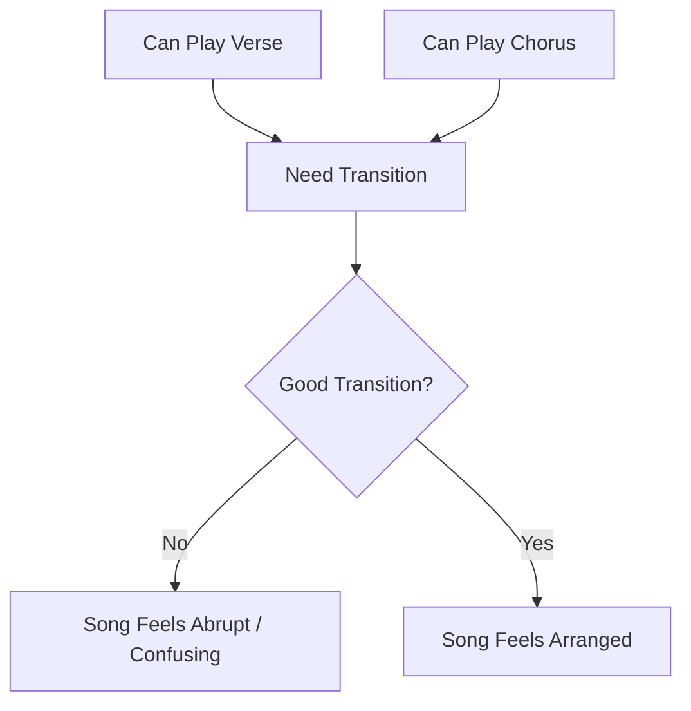
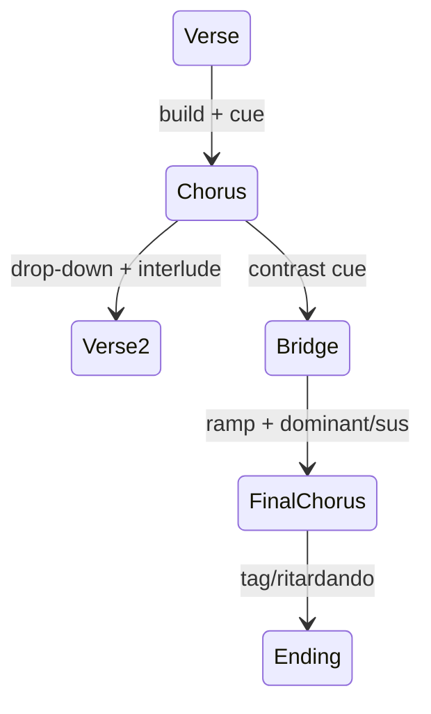
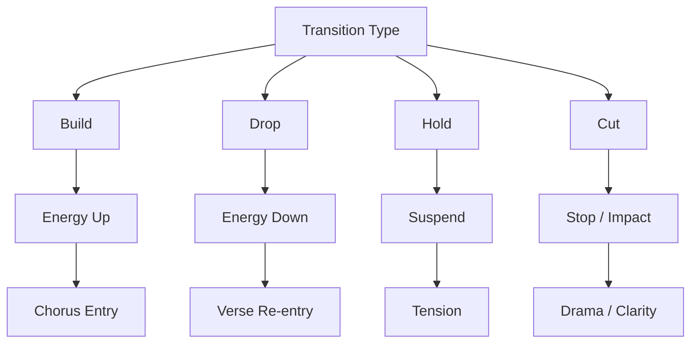
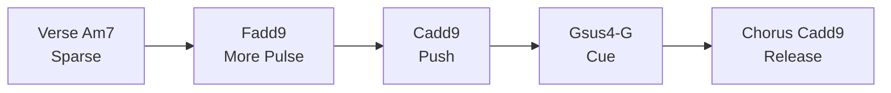
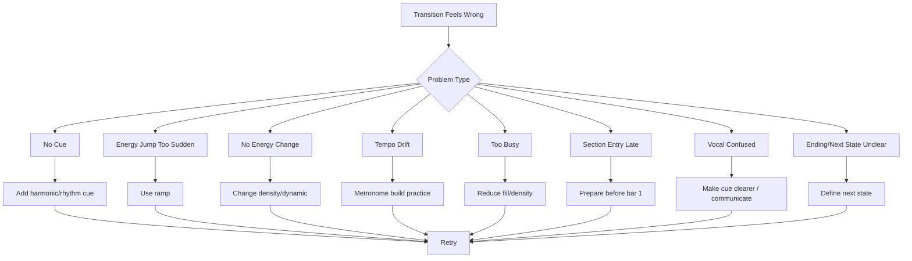
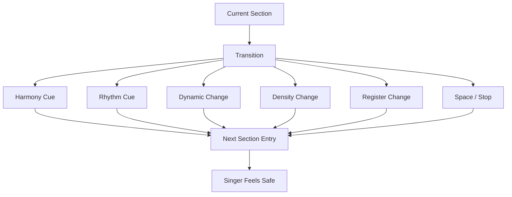

# learn-piano-accompaniment-part-018.md

# Part 018 — Transisi antar Section: Verse ke Chorus, Chorus ke Bridge, Bridge ke Final Chorus

> Seri: **Learn Piano Accompaniment for Singer Performance**  
> Fokus: **belajar piano untuk mengiringi penyanyi**  
> Framework utama: **The First 20 Hours — Josh Kaufman**  
> Tahap: **Phase E — Struktur Lagu & Aransemen**

---

## Status Seri

| Item | Status |
|---|---|
| Part | 018 |
| Nama file | `learn-piano-accompaniment-part-018.md` |
| Fokus | Transisi antar section lagu: build-up, drop-down, cue, fill, sus/dominant, dan energy ramp |
| Prasyarat | Part 000–017 |
| Output praktis | Bisa membuat perpindahan section yang jelas, musikal, dan aman untuk penyanyi |
| Status seri | Belum selesai |

---

## Daftar Isi

- [1. Tujuan Part Ini](#1-tujuan-part-ini)
- [2. Posisi Part Ini dalam Framework Kaufman](#2-posisi-part-ini-dalam-framework-kaufman)
- [3. Masalah Utama: Section Berubah, Piano Tidak Memberi Sinyal](#3-masalah-utama-section-berubah-piano-tidak-memberi-sinyal)
- [4. Mental Model: Transition sebagai Edge dalam State Machine](#4-mental-model-transition-sebagai-edge-dalam-state-machine)
- [5. Apa Itu Transisi antar Section?](#5-apa-itu-transisi-antar-section)
- [6. Empat Tipe Transisi: Build, Drop, Hold, Cut](#6-empat-tipe-transisi-build-drop-hold-cut)
- [7. Transition Parameter: Harmony, Rhythm, Density, Register, Dynamic, Space](#7-transition-parameter-harmony-rhythm-density-register-dynamic-space)
- [8. Cue Harmoni: Dominant, Sus, dan Cadence](#8-cue-harmoni-dominant-sus-dan-cadence)
- [9. Cue Ritme: Pickup, Stop, Push, dan Fill](#9-cue-ritme-pickup-stop-push-dan-fill)
- [10. Cue Dynamic: Crescendo, Diminuendo, dan Drop](#10-cue-dynamic-crescendo-diminuendo-dan-drop)
- [11. Cue Register: Naik, Turun, dan Melebar](#11-cue-register-naik-turun-dan-melebar)
- [12. Transition 1: Intro ke Verse](#12-transition-1-intro-ke-verse)
- [13. Transition 2: Verse ke Pre-Chorus](#13-transition-2-verse-ke-pre-chorus)
- [14. Transition 3: Verse Langsung ke Chorus](#14-transition-3-verse-langsung-ke-chorus)
- [15. Transition 4: Pre-Chorus ke Chorus](#15-transition-4-pre-chorus-ke-chorus)
- [16. Transition 5: Chorus ke Verse 2](#16-transition-5-chorus-ke-verse-2)
- [17. Transition 6: Chorus ke Interlude](#17-transition-6-chorus-ke-interlude)
- [18. Transition 7: Chorus ke Bridge](#18-transition-7-chorus-ke-bridge)
- [19. Transition 8: Bridge ke Final Chorus](#19-transition-8-bridge-ke-final-chorus)
- [20. Transition 9: Final Chorus ke Ending](#20-transition-9-final-chorus-ke-ending)
- [21. Build-Up: Menaikkan Energi Tanpa Menaikkan Tempo](#21-build-up-menaikkan-energi-tanpa-menaikkan-tempo)
- [22. Drop-Down: Menurunkan Energi agar Section Berikutnya Bernapas](#22-drop-down-menurunkan-energi-agar-section-berikutnya-bernapas)
- [23. Stop-Time: Diam yang Menjadi Sinyal](#23-stop-time-diam-yang-menjadi-sinyal)
- [24. Fill Sederhana sebagai Transition](#24-fill-sederhana-sebagai-transition)
- [25. Sus Chord sebagai Transition Tool](#25-sus-chord-sebagai-transition-tool)
- [26. Dominant sebagai Transition Tool](#26-dominant-sebagai-transition-tool)
- [27. Common Tone Transition](#27-common-tone-transition)
- [28. Bass Movement sebagai Sinyal](#28-bass-movement-sebagai-sinyal)
- [29. Transisi dalam 4/4 Pop Ballad](#29-transisi-dalam-44-pop-ballad)
- [30. Transisi dalam 6/8 Cinematic Ballad](#30-transisi-dalam-68-cinematic-ballad)
- [31. Mini Case Study 1: Verse ke Chorus `Am–F–C–G -> C–G–Am–F`](#31-mini-case-study-1-verse-ke-chorus-amfcg---cgamf)
- [32. Mini Case Study 2: Bridge ke Final Chorus](#32-mini-case-study-2-bridge-ke-final-chorus)
- [33. Mini Case Study 3: Final Chorus ke Soft Ending](#33-mini-case-study-3-final-chorus-ke-soft-ending)
- [34. Latihan 1: Satu Progression, Tiga Transition](#34-latihan-1-satu-progression-tiga-transition)
- [35. Latihan 2: Build-Up 4 Bar](#35-latihan-2-build-up-4-bar)
- [36. Latihan 3: Drop-Down Setelah Chorus](#36-latihan-3-drop-down-setelah-chorus)
- [37. Latihan 4: Gsus4–G sebagai Cue](#37-latihan-4-gsus4g-sebagai-cue)
- [38. Latihan 5: Bridge ke Final Chorus](#38-latihan-5-bridge-ke-final-chorus)
- [39. Latihan 6: Transisi dengan Vokal](#39-latihan-6-transisi-dengan-vokal)
- [40. Debugging Transisi](#40-debugging-transisi)
- [41. Failure Mode Pemula](#41-failure-mode-pemula)
- [42. Practice Protocol 45 Menit](#42-practice-protocol-45-menit)
- [43. Checklist Kelulusan Part 018](#43-checklist-kelulusan-part-018)
- [44. Ringkasan Mental Model](#44-ringkasan-mental-model)
- [45. Persiapan ke Part 019](#45-persiapan-ke-part-019)

---

# 1. Tujuan Part Ini

Pada Part 016, kita melihat lagu sebagai state machine.

Pada Part 017, kita memperdalam intro, interlude, dan ending.

Sekarang kita fokus pada bagian yang menghubungkan state-state tersebut:

```text
transition antar section
```

Contoh:

```text
Verse -> Chorus
Chorus -> Verse 2
Chorus -> Bridge
Bridge -> Final Chorus
Final Chorus -> Ending
```

Dalam performance, transisi sering lebih sulit daripada section itu sendiri.

Kenapa?

Karena transisi membutuhkan perubahan beberapa hal sekaligus:

- chord;
- rhythm;
- dynamic;
- density;
- register;
- pattern;
- cue;
- perhatian ke penyanyi.

Target part ini:

> Anda mampu membuat transisi antar section yang jelas, musikal, tidak mendadak secara buruk, dan aman untuk penyanyi.

Setelah part ini, Anda harus bisa membuat:

- verse naik ke chorus;
- chorus turun ke verse 2;
- chorus masuk ke bridge;
- bridge build ke final chorus;
- final chorus turun ke ending;
- transition dengan `Gsus4 -> G -> C`;
- build-up tanpa tempo naik;
- drop-down tanpa kehilangan pulse;
- stop-time sederhana;
- fill pendek yang memberi cue, bukan mengganggu.

---

# 2. Posisi Part Ini dalam Framework Kaufman

Dalam framework *The First 20 Hours*, kita terus mencari bottleneck nyata dalam performa.

Setelah bisa memainkan chord, pattern, voicing, dan struktur, bottleneck berikutnya adalah:

```text
perpindahan antar section
```

Banyak pemain pemula bisa memainkan verse sendiri dan chorus sendiri, tetapi gagal ketika harus berpindah dari verse ke chorus.

Diagram:



Transisi yang baik membuat lagu terasa seperti satu perjalanan, bukan potongan-potongan chord yang ditempel.

Dalam software analogy:

```text
section = state
transition = edge
cue = event
build/drop = state-change animation
```

Jika state berubah tanpa transition yang jelas, user/pengguna merasa tersesat.

Dalam musik, “user”-nya adalah:

```text
penyanyi dan pendengar
```

---

# 3. Masalah Utama: Section Berubah, Piano Tidak Memberi Sinyal

Pemula sering memainkan:

```text
Verse:  Am - F - C - G
Chorus: C - G - Am - F
```

tetapi transisinya datar:

```text
... G | C ...
```

Tanpa dynamic, tanpa cue, tanpa build, tanpa perubahan texture.

Akibatnya chorus tidak terasa masuk sebagai chorus.

Atau sebaliknya, pemula langsung menghantam chorus terlalu keras sehingga terasa mendadak dan kasar.

## 3.1 Gejala Transisi Buruk

- penyanyi ragu masuk chorus;
- chorus terasa tidak naik;
- piano masuk chorus terlalu keras;
- tempo naik saat build-up;
- bridge terasa muncul tiba-tiba;
- final chorus tidak terasa klimaks;
- ending terasa mendadak;
- interlude tidak jelas arahnya;
- penyanyi dan piano tidak sepakat kapan pindah.

## 3.2 Kenapa Transisi Sulit?

Karena transisi berada di antara dua tugas:

```text
menyelesaikan section lama
dan
menyiapkan section baru
```

Jika terlalu fokus pada section lama, masuk section baru terlambat.

Jika terlalu fokus pada section baru, section lama terasa belum selesai.

## 3.3 Prinsip

```text
Transisi yang baik menutup pintu lama sambil membuka pintu baru.
```

---

# 4. Mental Model: Transition sebagai Edge dalam State Machine

Dalam state machine:

```text
State A --event/transition--> State B
```

Dalam lagu:

```text
Verse --cue/build--> Chorus
```

Diagram:



Transition bukan sekadar “pindah chord”.

Transition punya properti:

```text
from_state
to_state
trigger_event
energy_change
texture_change
cue_type
bar_length
```

Contoh:

```text
Transition: Verse -> Chorus
from_energy: 2
to_energy: 3.5
trigger: bar 8 + lyric end
cue: Gsus4 -> G
texture_change: sparse -> fuller comping
```

Dengan model ini, transisi menjadi sesuatu yang bisa didesain dan dilatih, bukan hanya feeling.

---

# 5. Apa Itu Transisi antar Section?

Transisi antar section adalah momen yang menghubungkan dua bagian lagu.

Contoh:

```text
akhir verse menuju chorus
akhir chorus menuju verse 2
akhir bridge menuju final chorus
akhir final chorus menuju ending
```

Transisi biasanya terjadi di:

- bar terakhir section;
- dua bar terakhir section;
- satu phrase sebelum section baru;
- interlude pendek;
- stop/pause;
- fill;
- dominant chord;
- sus resolution;
- dynamic ramp.

## 5.1 Transisi Bisa Sangat Kecil

Contoh kecil:

```text
bar terakhir verse: Gsus4 -> G
lalu chorus: C
```

## 5.2 Transisi Bisa Lebih Panjang

Contoh 4 bar build:

```text
Am - F - C - G
```

dengan density naik setiap bar.

## 5.3 Transisi Bisa Berupa Diam

Kadang transition terbaik adalah stop:

```text
piano berhenti setengah bar
vokal masuk chorus
```

Diam bisa sangat kuat jika disengaja.

---

# 6. Empat Tipe Transisi: Build, Drop, Hold, Cut

Kita sederhanakan transisi menjadi empat tipe utama.

## 6.1 Build

Energi naik.

Cocok untuk:

```text
Verse -> Chorus
Pre-Chorus -> Chorus
Bridge -> Final Chorus
```

Parameter naik:

- dynamic;
- density;
- register;
- chord tension;
- rhythmic activity.

## 6.2 Drop

Energi turun.

Cocok untuk:

```text
Chorus -> Verse 2
Chorus -> Breakdown Bridge
Final Chorus -> Soft Ending
```

Parameter turun:

- density;
- dynamic;
- register;
- pedal intensity;
- chord fullness.

## 6.3 Hold

Energi ditahan.

Cocok untuk:

- suspense sebelum chorus;
- cue masuk vokal;
- dramatic pause;
- ending sebelum final chord.

Contoh:

```text
hold Gsus4
resolve to G
then C
```

## 6.4 Cut

Energi dipotong/dihentikan.

Cocok untuk:

- stop-time;
- dramatic chorus entry;
- lyric emphasis;
- ending final hit.

Contoh:

```text
bar terakhir: stop di beat 4
chorus masuk beat 1
```

## 6.5 Diagram



---

# 7. Transition Parameter: Harmony, Rhythm, Density, Register, Dynamic, Space

Transisi bisa dibuat dengan mengubah satu atau beberapa parameter.

## 7.1 Harmony

Gunakan chord yang memberi arah:

```text
G -> C
Gsus4 -> G -> C
Dm7 -> G7 -> C
F -> G -> C
```

## 7.2 Rhythm

Tambahkan:

- pickup;
- push;
- stop;
- fill;
- denser pulse;
- syncopation ringan.

## 7.3 Density

Naikkan atau turunkan jumlah event/nada.

```text
sparse -> medium -> full
```

atau:

```text
full -> sparse
```

## 7.4 Register

Naik sedikit untuk chorus, turun untuk verse/breakdown.

## 7.5 Dynamic

Crescendo untuk build, diminuendo untuk drop.

## 7.6 Space

Diam memberi sinyal kuat.

## 7.7 Rule Penting

Jangan mengubah semua parameter sekaligus kecuali memang sudah sangat terlatih.

Untuk 20 jam pertama:

```text
ubah 1–2 parameter utama saja
```

Contoh:

```text
dynamic naik + density naik
```

atau:

```text
density turun + register turun
```

---

# 8. Cue Harmoni: Dominant, Sus, dan Cadence

Harmony adalah alat transisi paling jelas.

Dalam key C, chord paling kuat untuk menuju C adalah:

```text
G
G7
Gsus4 -> G
Dm7 -> G7
F -> G
```

## 8.1 Dominant Cue

```text
G -> C
```

Rasa:

```text
tegang -> pulang
```

Cocok untuk masuk chorus jika chorus mulai C.

## 8.2 Sus Cue

```text
Gsus4 -> G -> C
```

Rasa:

```text
tertahan -> jelas -> pulang
```

Sangat cocok untuk penyanyi karena memberi sinyal kuat.

## 8.3 Cadence Cue

```text
F -> G -> C
```

Rasa:

```text
naik menuju resolusi
```

Cocok untuk ending dan chorus entry.

## 8.4 ii–V–I Cue

```text
Dm7 -> G7 -> C
```

Rasa:

```text
lebih smooth dan dewasa
```

Gunakan jika cocok dengan style.

## 8.5 Jangan Berlebihan

Jika semua transisi memakai dominant/sus yang besar, lagu bisa terdengar formulaic.

Gunakan sesuai kebutuhan.

---

# 9. Cue Ritme: Pickup, Stop, Push, dan Fill

Ritme memberi sinyal waktu.

## 9.1 Pickup

Pickup adalah gerakan kecil sebelum section baru.

Contoh:

```text
beat 4& sebelum chorus
```

Pattern:

```text
1 & 2 & 3 & 4 &
- - - - - - - X
```

## 9.2 Stop

Stop berarti berhenti sebentar.

Contoh:

```text
bar terakhir verse beat 4 diam
chorus masuk beat 1
```

## 9.3 Push

Push adalah chord dimainkan sedikit sebelum beat utama.

Contoh:

```text
4& menuju chorus
```

Memberi rasa maju.

## 9.4 Fill

Fill adalah isian singkat.

Untuk pemula:

```text
1–3 nada cukup
```

Gunakan chord tone.

## 9.5 Rule

Cue rhythm harus memperjelas time, bukan membuat time kabur.

Jika pickup/fill membuat Anda kehilangan beat 1, jangan gunakan dulu.

---

# 10. Cue Dynamic: Crescendo, Diminuendo, dan Drop

Dynamic adalah sinyal emosional.

## 10.1 Crescendo

Crescendo berarti makin keras.

Cocok untuk build ke chorus/final chorus.

Namun hati-hati:

```text
crescendo bukan mempercepat tempo
```

## 10.2 Diminuendo

Diminuendo berarti makin lembut.

Cocok untuk:

- chorus ke verse;
- final chorus ke soft ending;
- bridge breakdown.

## 10.3 Drop

Drop berarti energy tiba-tiba turun.

Contoh:

```text
chorus besar -> verse 2 sangat lembut
```

Ini memberi kontras kuat.

## 10.4 Dynamic Level

Gunakan skala:

```text
Verse: 2
Pre-Chorus: 2.5 -> 3
Chorus: 3.5
Bridge: 1.5 or 3
Final Chorus: 4
Ending: 1 or 4
```

---

# 11. Cue Register: Naik, Turun, dan Melebar

Register change memberi sinyal section.

## 11.1 Naik ke Chorus

Chorus bisa terasa naik jika RH sedikit lebih tinggi atau lebih lebar.

Jangan terlalu tinggi sampai menabrak vokal.

## 11.2 Turun ke Verse

Setelah chorus, turunkan register/density untuk membuat verse 2 terasa lebih intimate.

## 11.3 Melebar ke Final Chorus

Final chorus bisa memakai voicing lebih open:

```text
LH root lebih jelas
RH add9/open voicing
```

## 11.4 Register sebagai Sinyal, Bukan Atraksi

Jangan pindah register ekstrem hanya agar terdengar “keren”.

Tujuan register shift:

```text
mengarahkan pendengar dan penyanyi ke section baru
```

---

# 12. Transition 1: Intro ke Verse

Intro ke verse harus membuat penyanyi masuk dengan aman.

## 12.1 Tujuan

- key jelas;
- tempo jelas;
- entry point jelas;
- mood sesuai verse;
- piano tidak menutup masuk vokal.

## 12.2 Pola Aman

Intro:

```text
C - G - Am - F
```

Verse:

```text
Am - F - C - G
```

Bar terakhir intro:

```text
F hold / small fill / G pickup
```

## 12.3 Cue Harmoni

Jika verse mulai Am, chord G sebelum Am bisa memberi arah:

```text
G -> Am
```

Jika intro berakhir F dan verse mulai Am, beri cue rhythmic/space agar entry tetap jelas.

## 12.4 Cue Space

Bar terakhir intro:

```text
beat 4 lebih ringan
atau diam sebentar
```

Vokal masuk beat 1.

## 12.5 Jangan Terlalu Ramai

Saat vokal pertama masuk, turunkan density.

---

# 13. Transition 2: Verse ke Pre-Chorus

Verse ke pre-chorus biasanya build kecil.

## 13.1 Tujuan

- menaikkan energy sedikit;
- menandai cerita bergerak;
- belum sebesar chorus;
- menyiapkan tension.

## 13.2 Parameter

Naikkan:

- dynamic sedikit;
- horizontal density sedikit;
- rhythm lebih aktif;
- chord tension;
- register sedikit lebih terbuka.

## 13.3 Contoh

Verse:

```text
Am - F - C - G
```

Pre-Chorus:

```text
Dm - F - Gsus4 - G
```

Bar terakhir verse:

```text
G hold atau G push
```

Pre-chorus mulai Dm dengan energy 2.5.

## 13.4 Jangan Langsung Full Chorus

Pre-chorus adalah build, bukan peak.

---

# 14. Transition 3: Verse Langsung ke Chorus

Banyak lagu tidak punya pre-chorus.

Verse langsung masuk chorus.

## 14.1 Tantangan

Karena tidak ada pre-chorus, transisi harus cukup jelas.

## 14.2 Progression

Verse:

```text
Am - F - C - G
```

Chorus:

```text
C - G - Am - F
```

Akhir verse:

```text
G -> C
```

Ini sangat natural.

## 14.3 Build 2 Bar

Di dua bar terakhir verse:

```text
C - G
```

Naikkan density:

```text
C: X - x -
G: X - - x X - - x
```

Lalu chorus C masuk lebih jelas.

## 14.4 Sus Cue

Bar terakhir verse:

```text
Gsus4 -> G
```

Lalu chorus:

```text
C
```

## 14.5 Dynamic

Verse energy 2.

Last bar build to 3.

Chorus masuk 3.5.

---

# 15. Transition 4: Pre-Chorus ke Chorus

Ini salah satu transisi paling penting.

## 15.1 Tujuan

```text
membuat chorus terasa seperti release
```

Pre-chorus harus menimbun tension.

Chorus harus melepas tension.

## 15.2 Harmoni Umum

Dalam key C:

```text
Dm - F - Gsus4 - G -> C
```

atau:

```text
F - G - Am - G -> C
```

atau:

```text
Dm7 - G7 -> C
```

## 15.3 Build Parameter

- dynamic naik;
- density naik;
- RH register sedikit naik;
- LH lebih jelas;
- rhythm lebih aktif;
- gunakan sus/dominant;
- mungkin stop sebentar sebelum chorus.

## 15.4 Stop-Time Chorus Entry

Contoh:

```text
Pre-chorus last bar:
Gsus4 - G - [stop]
Chorus:
C on beat 1
```

Ini sangat jelas.

## 15.5 Jangan Tempo Naik

Pre-chorus build sering membuat tempo lari.

Latih dengan metronome.

---

# 16. Transition 5: Chorus ke Verse 2

Setelah chorus, sering masuk verse 2.

Ini membutuhkan drop-down.

## 16.1 Tujuan

- menurunkan energy;
- memberi napas;
- tidak membuat verse 2 terasa terlalu kecil secara buruk;
- tetap menjaga momentum.

## 16.2 Cara

Setelah chorus:

```text
C - G - Am - F
```

Interlude 2/4 bar atau langsung verse.

Jika langsung verse:

```text
kurangi density di bar terakhir chorus
```

atau gunakan interlude pendek.

## 16.3 Drop Parameter

Turunkan:

- dynamic;
- vertical density;
- RH register;
- pedal intensity;
- rhythm activity.

## 16.4 Contoh

Chorus ending:

```text
Fadd9
```

Tahan lebih lembut.

Verse 2 mulai:

```text
Am7
```

dengan sparse pattern.

## 16.5 Jangan Berhenti Mendadak tanpa Cue

Drop harus terasa disengaja, bukan seperti energi jatuh karena lupa.

---

# 17. Transition 6: Chorus ke Interlude

Interlude setelah chorus bisa menjadi napas.

## 17.1 Tujuan

- memberi ruang;
- mempertahankan motif;
- menyiapkan verse/bridge berikutnya;
- tidak membuat lagu kehilangan arah.

## 17.2 Cara Aman

Gunakan progression intro:

```text
C - G - Am - F
```

tetapi texture lebih ringan.

## 17.3 Energy

Jika chorus energy 3.5, interlude bisa:

```text
2
```

atau jika menuju bridge yang besar:

```text
3
```

## 17.4 Cue Keluar Interlude

Bar terakhir interlude harus memberi cue section berikutnya.

Misalnya:

```text
Gsus4 -> G
```

atau fill pendek.

---

# 18. Transition 7: Chorus ke Bridge

Chorus ke bridge sering butuh contrast.

## 18.1 Tujuan

Bridge harus terasa berbeda.

Transisi bisa:

- drop;
- hold;
- cut;
- change register;
- change texture;
- use new chord.

## 18.2 Cara Aman

Akhir chorus:

```text
F
```

Bridge mulai:

```text
F - G - Am - G
```

Karena F sama, bisa masuk bridge dengan common tone/continuity.

## 18.3 Drop to Bridge

Setelah chorus besar, bridge bisa mulai kecil:

```text
Final bar chorus: reduce density
Bridge bar 1: sparse Fadd9
```

## 18.4 Cut to Bridge

Dramatic:

```text
chorus final hit
short silence
bridge starts soft
```

## 18.5 Jangan Bridge Terasa Chorus Lanjutan

Ubah texture.

Contoh:

```text
Chorus: pop comping
Bridge: open broken chord / sparse
```

---

# 19. Transition 8: Bridge ke Final Chorus

Ini biasanya transition paling besar.

## 19.1 Tujuan

```text
membawa lagu ke klimaks
```

Bridge bisa mulai kecil lalu build ke final chorus.

## 19.2 Build 4 Bar

Progression bridge:

```text
F - G - Am - G
```

Energy:

```text
F  = level 2
G  = level 2.5
Am = level 3
G  = level 3.5
Final Chorus C = level 4
```

## 19.3 Sus Cue

Bar terakhir bridge:

```text
Gsus4 -> G
```

Final chorus:

```text
Cadd9
```

## 19.4 Density Ramp

```text
bar 1: sparse
bar 2: half note pulse
bar 3: pop comping
bar 4: build/fill/sus
```

## 19.5 Register Ramp

RH bisa sedikit naik atau voicing melebar.

Tetap jangan menutup vokal.

---

# 20. Transition 9: Final Chorus ke Ending

Final chorus ke ending harus menutup lagu dengan jelas.

## 20.1 Pilihan

- soft landing;
- big ending;
- tag ending;
- ritardando;
- final chord hold.

## 20.2 Soft Landing

Kurangi:

- dynamic;
- density;
- register;
- LH weight.

Ending:

```text
Fadd9 - Gsus4/G - Cadd9
```

## 20.3 Big Ending

Naikkan:

- dynamic;
- chord fullness;
- LH clarity;
- final chord hit.

Ending:

```text
Dm7 - G7 - C
```

atau:

```text
F - G - C
```

## 20.4 Tag

Jika final lyric diulang:

```text
Tag x2
```

Pastikan count jelas.

## 20.5 Terminal Cue

Sebelum final chord, beri sinyal:

- ritardando;
- hold dominant;
- eye contact;
- small fill;
- breath together.

---

# 21. Build-Up: Menaikkan Energi Tanpa Menaikkan Tempo

Build-up adalah transisi naik energi.

Namun kesalahan paling umum:

```text
tempo ikut naik
```

## 21.1 Parameter Build yang Aman

Naikkan:

- dynamic;
- density;
- register;
- chord tension;
- LH emphasis;
- pedal fullness.

Jangan menaikkan BPM.

## 21.2 Build 4 Bar Template

```text
Bar 1: sparse
Bar 2: half note pulse
Bar 3: pop comping
Bar 4: sus/dominant + fill
```

## 21.3 Contoh

```text
| Am | F | C | Gsus4 G |
```

Texture:

```text
Am: X - - -
F : X - x -
C : X - - x X - - x
G : build + sus resolve
```

## 21.4 Metronome Check

Latih build dengan metronome.

Jika tempo naik, kurangi dynamic dan density.

---

# 22. Drop-Down: Menurunkan Energi agar Section Berikutnya Bernapas

Drop-down menurunkan energy.

Cocok untuk:

```text
Chorus -> Verse
Chorus -> Bridge breakdown
Final Chorus -> soft ending
```

## 22.1 Parameter Drop

Kurangi:

- dynamic;
- vertical density;
- horizontal density;
- register height;
- pedal thickness;
- LH octave/fifth.

## 22.2 Contoh

Chorus:

```text
Cadd9 - G - Am7 - Fadd9
fuller comping
```

Verse 2:

```text
Am7 - Fadd9 - Cadd9 - G
partial sparse
```

Transition:

```text
last Fadd9 hold
reduce pedal
enter Am7 softly
```

## 22.3 Drop Bukan Kehilangan Pulse

Walau energy turun, pulse tetap ada.

Penyanyi masih butuh timing.

## 22.4 Drop yang Baik

Terasa seperti:

```text
mood berubah
```

Bukan:

```text
pemain kehabisan tenaga
```

---

# 23. Stop-Time: Diam yang Menjadi Sinyal

Stop-time adalah momen ketika accompaniment berhenti sebentar untuk memberi impact.

## 23.1 Contoh

Pre-chorus terakhir:

```text
Gsus4 - G - stop
```

Chorus:

```text
C on beat 1
```

## 23.2 Fungsi

- memberi drama;
- memperjelas chorus entry;
- memberi ruang vokal;
- membuat pendengar menunggu;
- memberi cue sangat kuat.

## 23.3 Risiko

Jika timing tidak kuat, stop-time membuat semua orang ragu.

## 23.4 Cara Aman

Gunakan stop pendek:

```text
setengah beat
satu beat
akhir bar
```

Jangan stop terlalu panjang kecuali disepakati.

## 23.5 Latihan

Hitung:

```text
1 2 3 4
```

Stop di 4.

Chorus masuk di 1.

---

# 24. Fill Sederhana sebagai Transition

Fill adalah isian pendek.

Untuk transisi, fill harus memberi arah.

## 24.1 Fill dari Chord Tone

Jika chord G menuju C:

```text
G chord tones: G B D
```

Fill:

```text
D - B - G
```

atau menuju C:

```text
D - E - G
```

## 24.2 Fill dari Scale Step

Dalam C major:

```text
G A B C
```

bisa menjadi pickup menuju C.

## 24.3 Fill Maksimal 1–3 Nada untuk Pemula

Jangan membuat fill panjang.

## 24.4 Fill Harus Berakhir Sebelum Vokal Masuk

Jika fill masih berjalan saat vokal masuk, Anda mengganggu entry.

## 24.5 Fill Bukan Solo

Fill adalah sinyal, bukan pamer.

---

# 25. Sus Chord sebagai Transition Tool

Sus chord sangat berguna untuk transition.

## 25.1 Gsus4 ke G ke C

```text
Gsus4 = G C D
G     = G B D
C     = C E G
```

Gerakan:

```text
C -> B -> C/E context
```

## 25.2 Fungsi

- menahan tension;
- memberi cue;
- menghindari dominant yang terlalu tajam;
- cocok untuk pop/worship/ballad.

## 25.3 Aplikasi

Pre-chorus ke chorus:

```text
| Dm | F | Gsus4 G | C |
```

Bridge ke final chorus:

```text
| F | G | Am | Gsus4 G |
Final Chorus: C
```

Ending:

```text
| F | Gsus4 G | C |
```

## 25.4 Dynamic

Sus bisa sedikit lebih kuat, resolve lebih jelas.

Tetapi jangan over-hit.

---

# 26. Dominant sebagai Transition Tool

Dominant memberi arah pulang.

Dalam key C:

```text
G -> C
G7 -> C
```

## 26.1 G ke C

Sederhana dan kuat.

## 26.2 G7 ke C

Lebih tegang.

```text
G7: G B D F
C : C E G
```

Resolution:

```text
B -> C
F -> E
```

## 26.3 Dm7-G7-C

Lebih smooth:

```text
Dm7 -> G7 -> C
```

Cocok untuk ending atau transition yang lebih dewasa.

## 26.4 Kapan Dominant Cocok?

- sebelum chorus mulai C;
- sebelum ending C;
- sebelum final chorus;
- saat butuh tension jelas.

## 26.5 Kapan Dominant Terlalu Banyak?

Jika setiap transition memakai G7, lagu bisa terlalu predictable atau jazzy.

Gunakan variasi.

---

# 27. Common Tone Transition

Common tone adalah nada yang sama antara dua chord.

Gunakan common tone untuk transition yang smooth.

## 27.1 Contoh F ke C

```text
F = F A C
C = C E G
```

Common tone:

```text
C
```

Bisa pertahankan C di RH.

## 27.2 Contoh Am ke F

```text
Am = A C E
F  = F A C
```

Common tones:

```text
A dan C
```

Transisi sangat smooth.

## 27.3 Contoh G ke C

```text
G = G B D
C = C E G
```

Common tone:

```text
G
```

Pertahankan G.

## 27.4 Fungsi

Common tone membuat transition tidak kasar.

Cocok untuk:

- verse lembut;
- bridge breakdown;
- interlude;
- slow ballad.

## 27.5 Prinsip

```text
Untuk transisi smooth, pertahankan nada yang bisa dipertahankan.
Untuk transisi dramatic, ubah texture/dynamic dengan jelas.
```

---

# 28. Bass Movement sebagai Sinyal

Tangan kiri bisa memberi arah transisi.

## 28.1 Root Movement

Contoh:

```text
F -> G -> C
```

Bass bergerak naik lalu resolve ke C.

Sangat jelas.

## 28.2 Stepwise Bass

Dalam C major:

```text
A -> G -> F -> G -> C
```

bisa menjadi line yang mengarahkan.

## 28.3 Bass Jangan Terlalu Sibuk

Untuk pemula, cukup root movement.

Jangan terlalu banyak passing bass jika rhythm belum stabil.

## 28.4 Bass sebagai Cue

Bass yang jelas di beat 1 section baru membantu penyanyi.

Contoh chorus mulai C:

```text
LH C jelas di beat 1
```

Ini memberi landing yang aman.

---

# 29. Transisi dalam 4/4 Pop Ballad

Dalam 4/4, transisi sering memakai:

- half note pulse;
- push di `4&`;
- fill pendek;
- Gsus4-G;
- stop di beat 4;
- dynamic ramp.

## 29.1 Verse ke Chorus 4/4

Verse last bar:

```text
G
```

Pattern:

```text
1 & 2 & 3 & 4 &
X - - x X - - x
```

Chorus:

```text
C on beat 1
```

## 29.2 Stop-Time

```text
1 2 3 4
G - - stop
C chorus
```

## 29.3 Build 4 Bar

```text
Am - F - C - G
```

Energy naik setiap bar.

## 29.4 Drop Setelah Chorus

Chorus selesai di F.

Tahan F, kurangi density, masuk verse Am softly.

---

# 30. Transisi dalam 6/8 Cinematic Ballad

Dalam 6/8, transisi harus menjaga gelombang:

```text
ONE two three FOUR five six
```

## 30.1 Build 6/8

Progression:

```text
Am - F - C - Gsus4/G
```

Density:

```text
bar 1 sparse
bar 2 rolling light
bar 3 rolling fuller
bar 4 sus build
```

## 30.2 Chorus Entry

Final count:

```text
ONE two three FOUR five six
```

Chorus C masuk di `ONE`.

## 30.3 Drop 6/8

Setelah chorus, kurangi rolling arpeggio menjadi:

```text
X - - x - -
```

## 30.4 Stop 6/8

Stop bisa dilakukan di count 6, lalu section baru masuk count 1.

Hati-hati agar penyanyi tetap tahu pulse.

---

# 31. Mini Case Study 1: Verse ke Chorus `Am–F–C–G -> C–G–Am–F`

## 31.1 Struktur

Verse:

```text
Am - F - C - G
```

Chorus:

```text
C - G - Am - F
```

## 31.2 Masalah

Jika verse dimainkan datar lalu chorus masuk datar, chorus tidak terasa naik.

## 31.3 Solusi Build 4 Bar

Verse terakhir:

```text
Am: sparse
F : half note
C : pop push
G : Gsus4 -> G build
```

Chorus:

```text
C: fuller voicing
```

## 31.4 Map

```text
Am7   level 2   X - - -
Fadd9 level 2.5 X - x -
Cadd9 level 3   X - - x X - - x
Gsus4/G level 3.5 hold/build
Cadd9 chorus level 4
```

## 31.5 Mermaid



---

# 32. Mini Case Study 2: Bridge ke Final Chorus

## 32.1 Struktur

Bridge:

```text
F - G - Am - G
```

Final chorus:

```text
C - G - Am - F
```

## 32.2 Target

Final chorus harus terasa sebagai klimaks.

## 32.3 Build Plan

```text
F: breakdown, partial voicing
G: add pulse
Am: wider voicing
G: Gsus4-G + fill
C: final chorus full
```

## 32.4 Dynamic

```text
F  level 2
G  level 2.5
Am level 3
G  level 3.5
C  level 4
```

## 32.5 Avoid

Jangan langsung level 4 di awal bridge jika bridge ingin build.

## 32.6 Cue

Bar terakhir:

```text
Gsus4 -> G
```

atau stop-time sebelum C.

---

# 33. Mini Case Study 3: Final Chorus ke Soft Ending

## 33.1 Struktur

Final chorus:

```text
C - G - Am - F
```

Ending:

```text
F - G - C
```

## 33.2 Target

Turun dari klimaks ke soft landing.

## 33.3 Plan

Final chorus terakhir:

```text
C - G - Am - F
```

Di F terakhir:

- kurangi density;
- turunkan dynamic;
- tahan Fadd9;
- masuk ending F-G-C lembut.

## 33.4 Ending

```text
Fadd9 - Gsus4/G - Cadd9
```

Ritardando ringan.

## 33.5 Cue

Eye contact atau breath sebelum final C.

---

# 34. Latihan 1: Satu Progression, Tiga Transition

Gunakan progression:

```text
C - G - Am - F
```

Buat tiga versi transition ke C berikutnya.

## 34.1 Version A: Simple Loop

```text
F -> C
```

Tanpa fill.

## 34.2 Version B: Sus Cue

```text
F -> Gsus4 -> G -> C
```

## 34.3 Version C: Stop-Time

```text
F hold
stop beat 4
C masuk beat 1
```

## 34.4 Evaluasi

- mana paling aman?
- mana paling dramatic?
- mana paling jelas untuk vokal?
- mana paling sulit timing?
- mana paling cocok untuk chorus?

---

# 35. Latihan 2: Build-Up 4 Bar

Progression:

```text
Am - F - C - G
```

## 35.1 Density Plan

```text
Am: X - - -
F : X - x -
C : X - - x X - - x
G : Gsus4-G + fill
```

## 35.2 Dynamic Plan

```text
2 -> 2.5 -> 3 -> 3.5
```

## 35.3 Target

Masuk chorus:

```text
Cadd9
```

dengan energy 4.

## 35.4 Rule

Gunakan metronome.

Jika tempo naik, ulang lebih pelan.

---

# 36. Latihan 3: Drop-Down Setelah Chorus

Chorus:

```text
C - G - Am - F
```

Verse 2:

```text
Am - F - C - G
```

## 36.1 Chorus

Mainkan dengan fuller comping.

## 36.2 Last Bar F

Kurangi density:

```text
Fadd9 hold
```

## 36.3 Verse 2 Entry

Masuk:

```text
Am7
```

dengan partial sparse.

## 36.4 Evaluasi

- apakah drop terasa disengaja?
- apakah pulse tetap jelas?
- apakah verse 2 masuk aman?
- apakah piano tiba-tiba hilang terlalu ekstrem?

---

# 37. Latihan 4: Gsus4–G sebagai Cue

Latih:

```text
Gsus4 -> G -> C
```

## 37.1 Voicing

```text
Gsus4: LH G, RH C-D-G
G    : LH G, RH B-D-G
Cadd9: LH C, RH E-G-D
```

## 37.2 Rhythm 4/4

```text
| Gsus4  G | C |
```

## 37.3 Rhythm 6/8

```text
Gsus4: count 1-2-3
G    : count 4-5-6
C    : next bar count 1
```

## 37.4 Use Cases

- intro to verse;
- verse/pre-chorus to chorus;
- bridge to final chorus;
- ending.

## 37.5 Goal

Penyanyi harus merasakan:

```text
setelah ini masuk
```

---

# 38. Latihan 5: Bridge ke Final Chorus

Bridge:

```text
F - G - Am - G
```

Final chorus:

```text
C - G - Am - F
```

## 38.1 Round 1: Simple

Mainkan bridge satu level, masuk chorus.

## 38.2 Round 2: Build

Tambah dynamic dan density per bar.

## 38.3 Round 3: Build + Sus

Bar terakhir:

```text
Gsus4 -> G
```

Final chorus:

```text
Cadd9
```

## 38.4 Evaluasi

- apakah final chorus terasa klimaks?
- apakah tempo tetap?
- apakah cue jelas?
- apakah bridge punya arah?
- apakah terlalu ramai?

---

# 39. Latihan 6: Transisi dengan Vokal

Gunakan kalimat sederhana untuk verse:

```text
Aku masih menunggu
```

Chorus:

```text
Pulanglah kepadaku
```

## 39.1 Verse

Progression:

```text
Am - F - C - G
```

Density rendah.

## 39.2 Build

Di bar terakhir G:

```text
Gsus4 -> G
```

atau fill pendek.

## 39.3 Chorus

Progression:

```text
C - G - Am - F
```

Density lebih tinggi.

## 39.4 Rekam

Dengarkan:

- apakah vokal masuk chorus aman?
- apakah piano menutup kata pertama chorus?
- apakah build membuat tempo naik?
- apakah cue jelas?
- apakah transition terasa natural?

---

# 40. Debugging Transisi

Jika transisi terasa buruk, debug layer.



## 40.1 No Cue

Solusi:

- tambah Gsus4-G;
- tambah fill pendek;
- tambah stop;
- beri eye contact;
- buat bar terakhir lebih jelas.

## 40.2 Energy Jump Terlalu Mendadak

Solusi:

- build 2–4 bar;
- naikkan density bertahap;
- jangan langsung full.

## 40.3 No Energy Change

Solusi:

- ubah dynamic;
- ubah texture;
- ubah register;
- chorus harus terasa beda dari verse.

## 40.4 Tempo Drift

Solusi:

- metronome;
- kurangi density;
- jangan crescendo terlalu agresif;
- count keras.

## 40.5 Too Busy

Solusi:

- fill 1–3 nada;
- kurangi RH;
- prioritaskan vokal.

## 40.6 Section Entry Late

Solusi:

- siap di chord section berikutnya sebelum beat 1;
- jangan fill terlalu panjang;
- lihat bar count.

## 40.7 Vocal Confused

Solusi:

- sepakati cue;
- buat intro/transition lebih sederhana;
- gunakan cue yang konsisten.

---

# 41. Failure Mode Pemula

## 41.1 Build-Up dengan Tempo Naik

Ini bug paling sering.

Energi naik bukan BPM naik.

## 41.2 Fill Terlalu Panjang

Fill panjang membuat beat 1 section baru hilang.

## 41.3 Tidak Memberi Cue

Penyanyi tidak tahu kapan masuk.

## 41.4 Semua Section Masuk Datar

Chorus tidak terasa chorus.

Bridge tidak terasa bridge.

## 41.5 Drop Terlalu Ekstrem

Chorus ke verse tiba-tiba kosong dan pulse hilang.

## 41.6 Terlalu Banyak Sus/Dominant

Semua transition terdengar sama.

## 41.7 Tidak Menghitung Bar

Transisi masuk terlalu cepat/lambat.

## 41.8 Menaikkan Semua Parameter Sekaligus

Dynamic, density, register, pedal, LH octave semua naik bersamaan.

Hasilnya ramai.

## 41.9 Tidak Komunikasi dengan Penyanyi

Cue yang hanya ada di kepala pianis tidak cukup.

## 41.10 Panik Saat Penyanyi Mengubah Struktur

Gunakan safe loop, dengarkan vokal, kembali di phrase boundary.

---

# 42. Practice Protocol 45 Menit

Gunakan sesi ini untuk Part 018.

## 42.1 Menit 0–5: Gsus4-G-C

Latih:

```text
Gsus4 -> G -> C
```

Dalam 4/4 dan 6/8.

## 42.2 Menit 5–10: Simple Verse to Chorus

Verse:

```text
Am - F - C - G
```

Chorus:

```text
C - G - Am - F
```

Tanpa fill dulu.

## 42.3 Menit 10–15: Add Build

Tambahkan density ramp di 4 bar verse terakhir.

## 42.4 Menit 15–20: Add Cue

Tambahkan:

```text
Gsus4 -> G
```

di bar terakhir sebelum chorus.

## 42.5 Menit 20–25: Chorus to Verse Drop

Mainkan chorus fuller.

Turunkan energy ke verse 2.

## 42.6 Menit 25–30: Chorus to Bridge Contrast

Mainkan chorus lalu masuk bridge dengan drop atau cut.

## 42.7 Menit 30–35: Bridge to Final Chorus Build

Bridge:

```text
F - G - Am - G
```

Build ke final chorus C.

## 42.8 Menit 35–40: Final Chorus to Ending

Latih:

```text
C - G - Am - F
F - G - C
```

Soft landing dan big ending.

## 42.9 Menit 40–45: Record and Review

Rekam mini structure:

```text
Verse -> Chorus -> Bridge -> Final Chorus -> Ending
```

Jawab:

- apakah cue jelas?
- apakah chorus terasa naik?
- apakah drop terasa disengaja?
- apakah tempo stabil?
- apakah fill terlalu ramai?
- apakah vokal akan aman?
- apakah ending jelas?

---

# 43. Checklist Kelulusan Part 018

Anda boleh lanjut ke Part 019 jika sebagian besar checklist ini terpenuhi.

## 43.1 Pemahaman

- [ ] Saya tahu transition adalah edge antar-state lagu.
- [ ] Saya tahu empat tipe transisi: build, drop, hold, cut.
- [ ] Saya tahu transisi bisa dibuat lewat harmony, rhythm, density, register, dynamic, dan space.
- [ ] Saya tahu `Gsus4-G-C` adalah cue kuat menuju C.
- [ ] Saya tahu dominant `G` atau `G7` memberi arah ke C.
- [ ] Saya tahu build-up bukan berarti tempo naik.
- [ ] Saya tahu drop-down bukan berarti pulse hilang.
- [ ] Saya tahu fill harus memberi cue, bukan menjadi solo.
- [ ] Saya tahu bridge ke final chorus biasanya butuh build.
- [ ] Saya tahu final chorus ke ending butuh terminal cue.

## 43.2 Praktik

- [ ] Saya bisa memainkan transition intro ke verse.
- [ ] Saya bisa memainkan verse ke chorus dengan build.
- [ ] Saya bisa memainkan pre-chorus/bridge ke chorus dengan `Gsus4-G`.
- [ ] Saya bisa memainkan chorus ke verse dengan drop.
- [ ] Saya bisa memainkan chorus ke bridge dengan contrast.
- [ ] Saya bisa memainkan bridge ke final chorus dengan dynamic ramp.
- [ ] Saya bisa memainkan final chorus ke ending.
- [ ] Saya bisa membuat stop-time sederhana.
- [ ] Saya bisa membuat fill 1–3 nada sebagai cue.
- [ ] Saya bisa menjaga tempo saat build-up.

## 43.3 Self-Correction

- [ ] Saya bisa mendeteksi jika transisi tidak punya cue.
- [ ] Saya bisa mendeteksi jika energy jump terlalu mendadak.
- [ ] Saya bisa mendeteksi jika chorus tidak terasa naik.
- [ ] Saya bisa mendeteksi jika tempo naik saat build.
- [ ] Saya bisa mengurangi fill yang terlalu ramai.
- [ ] Saya bisa menyederhanakan transition jika penyanyi bingung.
- [ ] Saya bisa memilih build, drop, hold, atau cut sesuai kebutuhan section.

---

# 44. Ringkasan Mental Model

Transisi adalah penghubung antar section.

```text
section = state
transition = edge
cue = event
build/drop/hold/cut = transition type
```

Transisi yang baik:

- menutup section lama;
- membuka section baru;
- memberi cue;
- menjaga tempo;
- mengatur energy;
- tidak menutup vokal;
- terasa disengaja.

Diagram akhir:



Kalimat kunci:

```text
Transisi bukan sekadar pindah chord.
Transisi adalah cara memberi tahu penyanyi dan pendengar bahwa lagu sedang bergerak ke state berikutnya.
```

---

# 45. Persiapan ke Part 019

Part berikutnya adalah:

```text
learn-piano-accompaniment-part-019.md
```

Judul:

```text
Mendengar dan Mengikuti Penyanyi
```

Sampai Part 018, kita sudah membangun banyak aspek piano dan struktur.

Namun accompaniment sejati bukan hanya mengeksekusi chart.

Pengiring harus mendengar penyanyi secara real-time.

Part 019 akan membahas:

- vocal-first listening;
- breathing cue;
- phrasing;
- kapan mengikuti penyanyi;
- kapan menjaga pulse;
- rubato dengan aman;
- menyesuaikan dynamic dengan vokal;
- menghindari menutup lirik;
- memberi ruang untuk napas;
- recovery jika penyanyi masuk lebih cepat/lambat;
- cara rehearsal dengan penyanyi;
- komunikasi non-verbal;
- mendengar pitch center;
- support saat penyanyi ragu.

Part 019 akan membawa kita ke Phase F: **Interaksi Real-Time dengan Penyanyi**.

---

## Status Akhir Part 018

```text
Part 018 selesai.
Seri belum selesai.
Lanjut ke Part 019.
```
