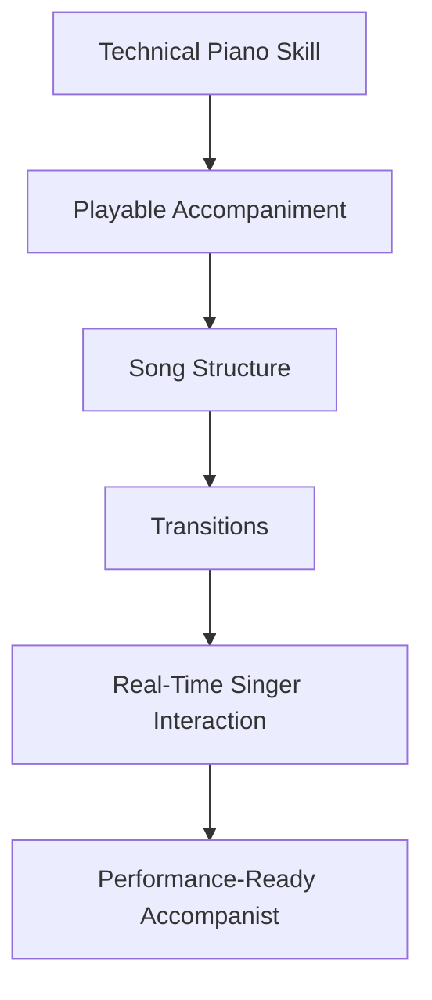
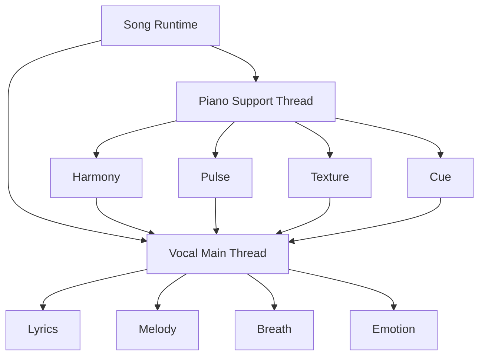
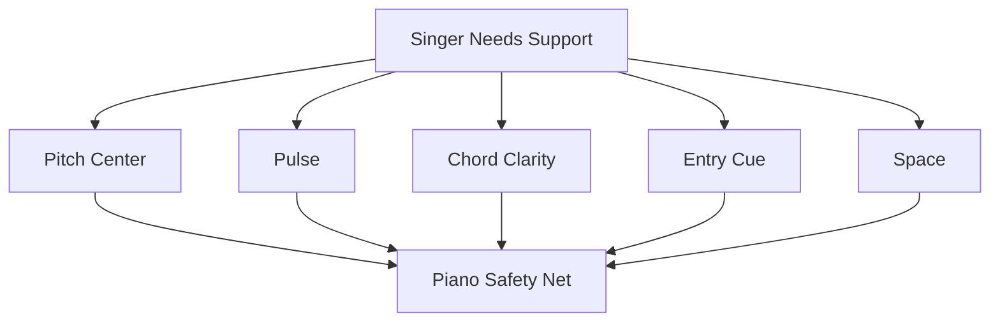
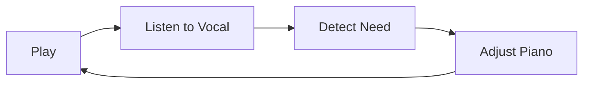
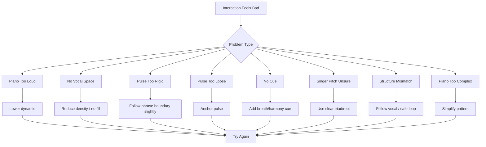
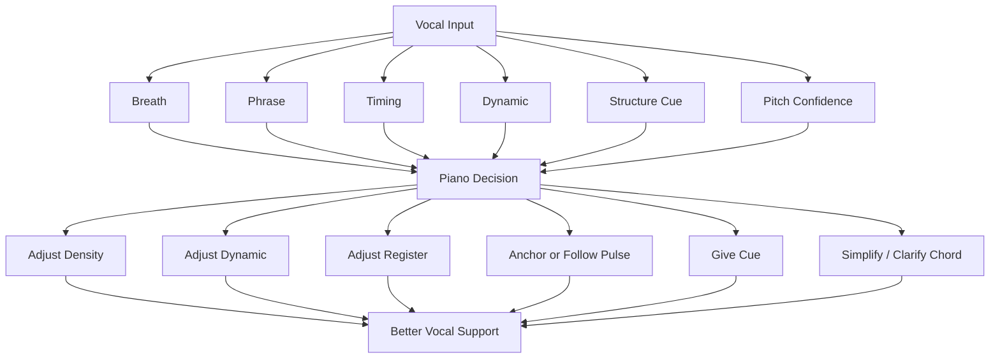

# learn-piano-accompaniment-part-019.md

# Part 019 — Mendengar dan Mengikuti Penyanyi

> Seri: **Learn Piano Accompaniment for Singer Performance**  
> Fokus: **belajar piano untuk mengiringi penyanyi**  
> Framework utama: **The First 20 Hours — Josh Kaufman**  
> Tahap: **Phase F — Interaksi Real-Time dengan Penyanyi**

---

## Status Seri

| Item | Status |
|---|---|
| Part | 019 |
| Nama file | `learn-piano-accompaniment-part-019.md` |
| Fokus | Mendengar, mengikuti, dan mendukung penyanyi secara real-time |
| Prasyarat | Part 000–018 |
| Output praktis | Bisa menjaga vokal sebagai pusat, membaca napas/frase/cue, menyesuaikan piano, dan recovery saat penyanyi berubah timing |
| Status seri | Belum selesai |

---

## Daftar Isi

- [1. Tujuan Part Ini](#1-tujuan-part-ini)
- [2. Posisi Part Ini dalam Framework Kaufman](#2-posisi-part-ini-dalam-framework-kaufman)
- [3. Masalah Utama: Pianis Main Benar, tetapi Tidak Mendengar Penyanyi](#3-masalah-utama-pianis-main-benar-tetapi-tidak-mendengar-penyanyi)
- [4. Mental Model: Vokal sebagai Main Thread](#4-mental-model-vokal-sebagai-main-thread)
- [5. Vocal-First Listening](#5-vocal-first-listening)
- [6. Apa yang Harus Didengar dari Penyanyi?](#6-apa-yang-harus-didengar-dari-penyanyi)
- [7. Napas sebagai Cue](#7-napas-sebagai-cue)
- [8. Frase Vokal sebagai Unit Musik](#8-frase-vokal-sebagai-unit-musik)
- [9. Lirik sebagai Navigasi Struktur](#9-lirik-sebagai-navigasi-struktur)
- [10. Timing Penyanyi: Ahead, On, Behind](#10-timing-penyanyi-ahead-on-behind)
- [11. Kapan Mengikuti Penyanyi?](#11-kapan-mengikuti-penyanyi)
- [12. Kapan Menjaga Pulse?](#12-kapan-menjaga-pulse)
- [13. Rubato yang Aman](#13-rubato-yang-aman)
- [14. Tempo Drift vs Expressive Timing](#14-tempo-drift-vs-expressive-timing)
- [15. Dynamic Matching: Piano Menyesuaikan Vokal](#15-dynamic-matching-piano-menyesuaikan-vokal)
- [16. Register Matching: Jangan Menabrak Range Vokal](#16-register-matching-jangan-menabrak-range-vokal)
- [17. Density Matching: Kurangi saat Vokal Padat](#17-density-matching-kurangi-saat-vokal-padat)
- [18. Space Matching: Beri Ruang Napas](#18-space-matching-beri-ruang-napas)
- [19. Support saat Penyanyi Ragu](#19-support-saat-penyanyi-ragu)
- [20. Support saat Penyanyi Terlalu Cepat](#20-support-saat-penyanyi-terlalu-cepat)
- [21. Support saat Penyanyi Terlambat](#21-support-saat-penyanyi-terlambat)
- [22. Support saat Penyanyi Salah Masuk Chord/Section](#22-support-saat-penyanyi-salah-masuk-chordsection)
- [23. Support saat Penyanyi Salah Pitch](#23-support-saat-penyanyi-salah-pitch)
- [24. Cue Non-Verbal](#24-cue-non-verbal)
- [25. Komunikasi Verbal saat Rehearsal](#25-komunikasi-verbal-saat-rehearsal)
- [26. Piano sebagai Safety Net](#26-piano-sebagai-safety-net)
- [27. Cara Menyederhanakan Piano Saat Harus Mendengar Lebih Banyak](#27-cara-menyederhanakan-piano-saat-harus-mendengar-lebih-banyak)
- [28. Prioritas Real-Time: Pulse, Chord, Vokal, Struktur](#28-prioritas-real-time-pulse-chord-vokal-struktur)
- [29. Listening Loop: Play, Listen, Adjust](#29-listening-loop-play-listen-adjust)
- [30. Rehearsal Protocol dengan Penyanyi](#30-rehearsal-protocol-dengan-penyanyi)
- [31. Mini Case Study 1: Penyanyi Menahan Frase di Verse](#31-mini-case-study-1-penyanyi-menahan-frase-di-verse)
- [32. Mini Case Study 2: Penyanyi Masuk Chorus Terlalu Cepat](#32-mini-case-study-2-penyanyi-masuk-chorus-terlalu-cepat)
- [33. Mini Case Study 3: Penyanyi Lupa Lirik / Mengulang Frase](#33-mini-case-study-3-penyanyi-lupa-lirik--mengulang-frase)
- [34. Mini Case Study 4: Penyanyi Naik Dinamika Tiba-Tiba](#34-mini-case-study-4-penyanyi-naik-dinamika-tiba-tiba)
- [35. Latihan 1: Mengiringi Humming Sendiri](#35-latihan-1-mengiringi-humming-sendiri)
- [36. Latihan 2: Breathing Cue](#36-latihan-2-breathing-cue)
- [37. Latihan 3: Vokal Padat vs Vokal Sustain](#37-latihan-3-vokal-padat-vs-vokal-sustain)
- [38. Latihan 4: Follow vs Hold Pulse](#38-latihan-4-follow-vs-hold-pulse)
- [39. Latihan 5: Simulasi Penyanyi Salah Timing](#39-latihan-5-simulasi-penyanyi-salah-timing)
- [40. Latihan 6: Rehearsal Mini dengan Penyanyi](#40-latihan-6-rehearsal-mini-dengan-penyanyi)
- [41. Debugging Interaction](#41-debugging-interaction)
- [42. Failure Mode Pemula](#42-failure-mode-pemula)
- [43. Practice Protocol 45 Menit](#43-practice-protocol-45-menit)
- [44. Checklist Kelulusan Part 019](#44-checklist-kelulusan-part-019)
- [45. Ringkasan Mental Model](#45-ringkasan-mental-model)
- [46. Persiapan ke Part 020](#46-persiapan-ke-part-020)

---

# 1. Tujuan Part Ini

Sampai Part 018, kita sudah membangun kemampuan teknis dan struktural:

- chord;
- progression;
- rhythm;
- pattern;
- voicing;
- density;
- intro;
- interlude;
- ending;
- transition antar section.

Namun accompaniment sejati bukan hanya memainkan chart.

Accompaniment sejati adalah:

```text
mendukung manusia yang sedang bernyanyi secara real-time
```

Penyanyi bukan metronome. Penyanyi bernapas, menahan kata, masuk sedikit terlambat, mempercepat frase karena emosi, mengubah dynamic, lupa lirik, mengulang kalimat, atau tiba-tiba memberi cue untuk chorus.

Jika pianis hanya mengeksekusi pattern tanpa mendengar, hasilnya bisa terasa kaku.

Target part ini:

> Anda mampu mendengar penyanyi sebagai pusat lagu, membaca napas dan frase, memutuskan kapan mengikuti dan kapan menjaga pulse, menyesuaikan dynamic/register/density, serta recovery saat penyanyi berubah timing atau struktur.

Part ini sangat penting karena tujuan seri ini adalah:

```text
tampil mengiringi penyanyi
```

Bukan sekadar:

```text
main piano sendiri dengan chord benar
```

---

# 2. Posisi Part Ini dalam Framework Kaufman

Dalam *The First 20 Hours*, setelah sub-skill dasar cukup, kita harus melatih kondisi nyata.

Kondisi nyata mengiringi penyanyi memiliki variabel tambahan:

- penyanyi bisa berbeda-beda;
- tempo bisa sedikit berubah;
- frase vokal bisa melayang;
- lirik menentukan timing;
- emosi mengubah dynamic;
- cue bisa verbal/non-verbal;
- chart bisa berubah saat live.

Diagram:



Part ini menggeser fokus dari:

```text
apa yang tangan saya mainkan?
```

ke:

```text
apa yang penyanyi butuhkan sekarang?
```

Ini adalah perubahan mental besar.

Untuk software engineer, analoginya:

```text
sebelumnya: deterministic batch execution
sekarang: event-driven adaptive system
```

Penyanyi mengirim event melalui napas, frase, dynamic, dan gesture.

Pianis harus listen, process, adjust.

---

# 3. Masalah Utama: Pianis Main Benar, tetapi Tidak Mendengar Penyanyi

Banyak pemain pemula merasa:

```text
Saya sudah main chord benar.
Saya sudah ikut metronome.
Saya sudah pakai pattern benar.
Kenapa masih terasa tidak nyaman?
```

Jawabannya sering:

```text
karena piano tidak merespons vokal
```

## 3.1 Gejala Tidak Mendengar Penyanyi

- piano menutup kata-kata penting;
- penyanyi mengambil napas, piano tetap terlalu ramai;
- penyanyi menahan frase, piano sudah pindah section;
- penyanyi masuk sedikit telat, piano tidak memberi ruang;
- penyanyi ragu pitch, piano tidak memberi root/chord yang jelas;
- penyanyi naik dynamic, piano tidak ikut mendukung;
- penyanyi turun lembut, piano tetap keras;
- penyanyi mengulang phrase, piano sudah ending;
- piano fill saat vokal sedang aktif;
- accompaniment terasa seperti backing track kaku.

## 3.2 Chord Benar Tidak Cukup

Chord benar adalah syarat dasar.

Namun accompaniment membutuhkan:

```text
timing empathy
dynamic empathy
space awareness
structure awareness
```

## 3.3 Prinsip

```text
Pianis pengiring yang baik bukan yang paling banyak main.
Pianis pengiring yang baik adalah yang paling sadar terhadap vokal.
```

---

# 4. Mental Model: Vokal sebagai Main Thread

Anggap lagu sebagai program concurrent.

```text
vocal = main thread
piano = support thread
```

Main thread menentukan narrative dan emotional focus.

Support thread harus:

- tidak block main thread;
- tidak overload resource;
- memberi data saat diperlukan;
- menjaga timing;
- recovery saat main thread berubah;
- tidak deadlock.

Diagram:



Jika support thread terlalu noisy, main thread terganggu.

Jika support thread terlalu lemah, main thread tidak punya fondasi.

Jadi tugas piano adalah:

```text
cukup hadir untuk menopang
cukup diam untuk memberi ruang
cukup adaptif untuk mengikuti manusia
```

---

# 5. Vocal-First Listening

Vocal-first listening berarti selama bermain, telinga utama Anda diarahkan ke vokal.

Bukan ke tangan kanan.

Bukan ke pattern.

Bukan ke suara piano sendiri.

Urutan perhatian:

```text
1. vokal
2. pulse
3. chord/structure
4. piano texture
```

## 5.1 Kenapa Sulit?

Karena pemula masih sibuk dengan:

- mencari chord;
- menjaga tangan;
- membaca chart;
- menghitung bar;
- mengingat pattern.

Solusinya bukan langsung “dengar lebih baik”.

Solusinya:

```text
sederhanakan piano agar otak punya bandwidth untuk mendengar vokal
```

## 5.2 Tanda Anda Belum Vocal-First

- Anda tidak tahu penyanyi sedang bernapas atau tidak;
- Anda tidak sadar kata mana yang sedang dinyanyikan;
- Anda tidak tahu penyanyi masuk chorus lebih cepat;
- Anda tidak sadar piano terlalu keras;
- Anda tidak bisa mengulang bagian yang sama jika penyanyi mengulang;
- Anda hanya melihat tangan.

## 5.3 Tanda Anda Mulai Vocal-First

- Anda tahu kapan penyanyi mengambil napas;
- Anda bisa mengurangi piano saat lirik padat;
- Anda bisa memberi cue masuk;
- Anda bisa menjaga pulse saat penyanyi ragu;
- Anda bisa mengikuti rubato ringan;
- Anda bisa recovery tanpa berhenti.

---

# 6. Apa yang Harus Didengar dari Penyanyi?

Dengar bukan hanya pitch.

Dengar beberapa layer.

## 6.1 Napas

Napas menunjukkan:

- kapan frase dimulai;
- kapan penyanyi butuh ruang;
- kapan masuk berikutnya;
- apakah penyanyi siap;
- apakah penyanyi panik.

## 6.2 Frase

Frase adalah unit musikal.

Dengarkan:

- frase panjang atau pendek;
- phrase ending;
- kata penting;
- sustain;
- pickup;
- pause.

## 6.3 Timing

Apakah penyanyi:

- on beat;
- sedikit ahead;
- sedikit behind;
- rubato;
- rushing;
- dragging.

## 6.4 Dynamic

Apakah penyanyi:

- lembut;
- membesar;
- menahan;
- menurun;
- tiba-tiba intens.

## 6.5 Pitch Confidence

Apakah penyanyi:

- yakin pitch;
- mencari nada;
- butuh chord lebih jelas;
- butuh root;
- tertarik oleh top note piano yang salah konteks.

## 6.6 Structure Cue

Dengarkan lirik:

- akhir verse;
- masuk chorus;
- ulang phrase;
- bridge;
- ending.

---

# 7. Napas sebagai Cue

Napas adalah cue paling manusiawi.

Penyanyi hampir selalu bernapas sebelum frase.

Jika Anda mendengar napas, Anda bisa mengantisipasi entry.

## 7.1 Napas Sebelum Masuk

Saat penyanyi menarik napas:

```text
piano harus memberi ruang
```

Jangan isi dengan fill panjang tepat saat penyanyi mau masuk.

## 7.2 Napas di Tengah Frase

Jika penyanyi butuh napas lebih panjang, jangan langsung memaksa chord/pulse terlalu agresif.

Tetap jaga pulse, tetapi beri ruang.

## 7.3 Napas sebelum Chorus

Napas besar sebelum chorus sering berarti energy akan naik.

Piano bisa:

- sedikit build;
- memberi chord cue;
- masuk chorus lebih jelas.

## 7.4 Latihan Mendengar Napas

Saat mendengar rekaman penyanyi:

- tandai kapan penyanyi bernapas;
- lihat apakah piano/fill menabrak napas;
- perhatikan apakah napas menuju phrase berikutnya.

## 7.5 Prinsip

```text
Jangan bermain di atas napas penting.
Napas adalah pintu masuk frase.
```

---

# 8. Frase Vokal sebagai Unit Musik

Frase adalah kalimat musikal.

Dalam lirik, frase sering sama dengan satu potongan kalimat.

Contoh:

```text
Aku masih menunggu
di ujung malam ini
```

Bisa dianggap dua frase.

## 8.1 Piano Harus Mengikuti Frase

Saat frase aktif:

```text
piano support
```

Saat frase selesai:

```text
piano boleh menjawab
```

## 8.2 Jangan Fill di Tengah Frase

Pemula sering memainkan fill karena ada ruang kecil antar kata, padahal frase belum selesai.

Hati-hati.

Jika lirik masih berjalan, jangan terlalu banyak bicara.

## 8.3 Phrase Ending

Akhir frase adalah tempat aman untuk:

- fill kecil;
- chord response;
- dynamic change;
- breath cue;
- transition.

## 8.4 Frase sebagai Boundary

Dalam software analogy:

```text
phrase boundary = safe synchronization point
```

Saat salah, recovery terbaik sering terjadi di phrase boundary.

Bukan di tengah kata.

---

# 9. Lirik sebagai Navigasi Struktur

Lirik membantu Anda tahu state lagu.

Jika Anda hanya membaca chord, Anda bisa tersesat.

Jika Anda mengenal lirik, Anda tahu:

- verse sudah bar ke berapa;
- chorus akan masuk;
- bridge sudah hampir selesai;
- tag sedang diulang;
- final line datang.

## 9.1 Minimal Lirik yang Perlu Diketahui

Anda tidak harus hafal seluruh lirik, tetapi minimal tahu:

- kalimat awal verse;
- kalimat awal chorus;
- kalimat terakhir chorus;
- lyric cue bridge;
- final line;
- tag line.

## 9.2 Lirik sebagai Event

Contoh:

```text
lyric "pulanglah..." = chorus entry
lyric "untuk terakhir kali..." = final chorus
last line repeated = tag
```

## 9.3 Annotasi Chart

Tambahkan lyric cue:

```text
[Verse]
Am F C G
cue lyric: "Aku masih..."

[Chorus]
C G Am F
cue lyric: "Pulanglah..."

[Ending]
F G C
last line: "kepadamu"
```

## 9.4 Prinsip

```text
Chord chart memberi harmony.
Lirik memberi navigation.
```

---

# 10. Timing Penyanyi: Ahead, On, Behind

Penyanyi bisa bernyanyi:

```text
ahead of beat
on the beat
behind the beat
```

## 10.1 On the Beat

Penyanyi masuk tepat pada pulse.

Paling mudah diiringi.

## 10.2 Ahead

Penyanyi sedikit mendahului beat.

Bisa memberi energy dan urgency.

Namun jika terlalu banyak, terasa rushing.

## 10.3 Behind

Penyanyi sedikit di belakang beat.

Bisa terasa laid-back, emosional, atau berat.

Namun jika terlalu banyak, terasa dragging.

## 10.4 Tugas Piano

Piano harus membedakan:

```text
expressive timing
vs
unintentional timing problem
```

Jika expressive dan masih stabil, support.

Jika penyanyi kehilangan pulse, piano harus menjadi anchor.

## 10.5 Rule Awal

Untuk 20 jam pertama:

```text
jangan terlalu cepat mengikuti setiap micro-shift.
jaga pulse lembut, lalu adaptasi di phrase boundary.
```

---

# 11. Kapan Mengikuti Penyanyi?

Ikuti penyanyi saat perubahan timing tampak musikal dan disengaja.

## 11.1 Ikuti saat Rubato Intro

Jika intro/verse awal disepakati rubato, ikuti napas penyanyi.

## 11.2 Ikuti saat Penyanyi Menahan Kata Penting

Contoh:

```text
kata terakhir sebelum chorus ditahan lebih lama
```

Piano bisa menahan chord sedikit dan masuk bersama.

## 11.3 Ikuti saat Ending

Ending sering melambat.

Ikuti napas dan gesture penyanyi.

## 11.4 Ikuti saat Solo Piano + Vokal Intimate

Dalam format hanya piano dan vokal, Anda punya lebih banyak ruang untuk mengikuti.

## 11.5 Ikuti jika Anda Tetap Tahu Pulse

Mengikuti bukan berarti kehilangan time.

Anda harus tetap tahu:

```text
di mana beat 1 berikutnya
di mana chord berikutnya
di mana section berikutnya
```

---

# 12. Kapan Menjaga Pulse?

Jaga pulse saat penyanyi membutuhkan fondasi.

## 12.1 Chorus

Chorus biasanya butuh drive dan stability.

Jika penyanyi sedikit goyah, piano menjaga pulse.

## 12.2 Band Context

Jika ada band, piano tidak bisa rubato sendiri.

Pulse harus sinkron.

## 12.3 Penyanyi Ragu

Jika penyanyi tampak ragu, jangan ikut ragu.

Mainkan root/chord/pulse jelas.

## 12.4 Tempo Cepat/Medium

Pada tempo yang lebih steady, jangan terlalu rubato.

## 12.5 Saat Struktur Rentan

Menjelang transition, pulse harus jelas agar entry aman.

## 12.6 Rule

```text
Jika penyanyi expressive, follow carefully.
Jika penyanyi lost, anchor gently.
```

---

# 13. Rubato yang Aman

Rubato adalah fleksibilitas tempo yang disengaja.

## 13.1 Area Aman untuk Rubato

- intro;
- awal verse;
- akhir frase;
- bridge breakdown;
- ending;
- solo piano + vocal moment.

## 13.2 Area Risiko Rubato

- chorus;
- build-up;
- section dengan rhythm aktif;
- performance dengan band;
- bagian yang perlu cue jelas;
- lagu yang belum dilatih bersama.

## 13.3 Cara Rubato Aman

Gunakan prinsip:

```text
stretch, then return
```

Contoh:

- tahan sedikit akhir phrase;
- kembali ke pulse di bar berikutnya;
- jangan terus-menerus drift.

## 13.4 Rubato dan Pedal

Saat rubato, pedal bisa membantu sustain.

Tetapi tetap ganti pedal saat chord berubah.

## 13.5 Rubato Harus Disepakati

Jika penyanyi ingin bebas, komunikasikan:

```text
bagian verse pertama bisa lebih rubato, chorus kita masuk tempo.
```

---

# 14. Tempo Drift vs Expressive Timing

Ini perbedaan penting.

## 14.1 Expressive Timing

Ciri:

- disengaja;
- terjadi di phrase boundary;
- tetap ada sense of pulse;
- kembali stabil;
- mendukung lirik;
- penyanyi dan piano bersama.

## 14.2 Tempo Drift

Ciri:

- tidak disengaja;
- terjadi karena panik;
- terjadi pada chord sulit;
- chorus makin cepat tanpa sadar;
- ending melambat karena tidak yakin;
- piano dan vokal tidak sinkron.

## 14.3 Debug

Jika tempo berubah saat chord sulit:

```text
itu bukan rubato
itu technical bottleneck
```

Solusi:

- perlambat;
- sederhanakan chord;
- pakai root + partial;
- latih transition;
- gunakan metronome.

## 14.4 Rule

```text
Rubato adalah pilihan musikal.
Drift adalah bug timing.
```

---

# 15. Dynamic Matching: Piano Menyesuaikan Vokal

Piano harus menyesuaikan dynamic vokal.

## 15.1 Jika Vokal Lembut

Piano:

- lebih lembut;
- density rendah;
- chord ringan;
- pedal bersih;
- fill minim.

## 15.2 Jika Vokal Meningkat

Piano boleh:

- tambah density;
- tambah dynamic sedikit;
- register lebih luas;
- LH lebih jelas.

## 15.3 Jika Vokal Menurun

Piano juga turun.

Jangan tetap chorus-level saat vokal sudah intimate.

## 15.4 Jika Vokal Klimaks

Piano mendukung klimaks, tetapi jangan menutup high note.

Sering lebih baik:

```text
support dengan chord kuat di bawah
bukan fill tinggi di atas
```

## 15.5 Rule

```text
Piano follows vocal energy, but vocal stays in front.
```

---

# 16. Register Matching: Jangan Menabrak Range Vokal

Register piano harus disesuaikan dengan range vokal.

## 16.1 Jika Vokal Rendah

Jangan RH terlalu rendah dan padat.

Gunakan partial chord.

## 16.2 Jika Vokal Tengah

Hati-hati dengan RH middle register.

Main lebih lembut atau lebih sparse.

## 16.3 Jika Vokal Tinggi

Hindari fill tinggi yang bersaing.

Support dari register tengah/bawah dengan chord yang stabil.

## 16.4 Top Note Awareness

Jika top note piano mendekati melodi vokal, bisa:

- mendukung;
- atau menabrak.

Jika ragu, turunkan volume atau pilih inversion lain.

## 16.5 Rule

```text
Saat vokal naik, piano tidak harus ikut naik.
Kadang piano justru memberi fondasi di bawah.
```

---

# 17. Density Matching: Kurangi saat Vokal Padat

Vokal padat berarti banyak kata/nada dalam waktu singkat.

Saat vokal padat:

```text
piano harus lebih sparse
```

## 17.1 Vokal Padat

Contoh:

```text
banyak suku kata cepat
```

Piano:

- root + partial chord;
- whole/half note;
- no fill;
- low density.

## 17.2 Vokal Sustain

Jika vokal menahan nada panjang:

```text
piano boleh mengisi sedikit
```

Misalnya:

- broken chord lembut;
- fill kecil;
- arpeggio ringan.

## 17.3 Vokal Diam

Piano boleh menjawab.

Tetapi tetap singkat.

## 17.4 Rule

```text
Saat vokal banyak bicara, piano mendengar.
Saat vokal diam, piano boleh menjawab.
```

---

# 18. Space Matching: Beri Ruang Napas

Space adalah ruang yang sengaja diberikan.

## 18.1 Space Sebelum Frase

Sebelum penyanyi masuk, jangan isi terlalu banyak.

## 18.2 Space Setelah Frase

Setelah frase selesai, beri sedikit ruang sebelum fill.

Jangan langsung menabrak akhir kata.

## 18.3 Space di Lirik Penting

Jika lirik sangat penting, piano bisa sangat minimal.

## 18.4 Space sebagai Emosi

Diam bisa membuat lirik lebih berat.

Contoh:

```text
piano stop sebentar sebelum kata penting
```

## 18.5 Rule

```text
Space is not absence.
Space is support.
```

---

# 19. Support saat Penyanyi Ragu

Penyanyi bisa ragu karena:

- tidak yakin pitch;
- lupa lirik;
- tidak yakin entry;
- monitor buruk;
- nervous;
- tempo tidak terasa;
- chord piano kurang jelas.

## 19.1 Tanda Penyanyi Ragu

- masuk telat;
- volume turun;
- mata mencari cue;
- napas tidak yakin;
- melodi goyah;
- lirik berhenti;
- tempo tidak stabil.

## 19.2 Apa yang Piano Lakukan?

Sederhanakan.

Berikan:

- root jelas;
- chord jelas;
- pulse stabil;
- cue lembut;
- dynamic tidak mengintimidasi.

## 19.3 Jangan Overplay

Saat penyanyi ragu, fill rumit memperburuk.

Gunakan:

```text
LH root + RH chord sederhana
```

## 19.4 Jika Penyanyi Lupa Lirik

Jaga loop progression.

Kurangi density.

Tunggu penyanyi masuk lagi.

## 19.5 Rule

```text
Saat penyanyi ragu, piano menjadi lantai yang stabil.
```

---

# 20. Support saat Penyanyi Terlalu Cepat

Jika penyanyi rushing, jangan langsung ikut mempercepat.

## 20.1 Jika Rushing Kecil

Jaga pulse lembut.

Biarkan penyanyi kembali.

## 20.2 Jika Rushing Besar

Anda punya pilihan:

- tetap anchor jika bisa;
- adaptasi di phrase boundary;
- jangan membuat benturan keras;
- gunakan chord/pulse yang jelas.

## 20.3 Jangan Melawan Terlalu Keras

Jika piano terlalu rigid, terasa seperti bertengkar.

Jaga pulse, tetapi musikal.

## 20.4 Cara Mengembalikan

- beat 1 jelas;
- LH root stabil;
- RH tidak terlalu ramai;
- cue bar berikutnya;
- jangan fill padat.

## 20.5 Rule

```text
Anchor gently, not aggressively.
```

---

# 21. Support saat Penyanyi Terlambat

Jika penyanyi behind beat, bisa expressive atau bisa dragging.

## 21.1 Jika Expressive Behind

Jika tetap musikal, beri ruang.

Jangan memaksa terlalu cepat.

## 21.2 Jika Dragging

Jaga pulse.

Kurangi density.

Jangan ikut melambat terus.

## 21.3 Cara Support

- jangan fill di depan vokal;
- tahan chord secukupnya;
- masuk chord berikutnya jelas;
- beri cue phrase boundary.

## 21.4 Kapan Mengikuti?

Ikuti jika:

- ending;
- rubato section;
- solo piano + vocal;
- penyanyi sengaja menahan kata penting.

Jaga pulse jika:

- chorus;
- tempo steady;
- penyanyi tampak kehilangan time.

---

# 22. Support saat Penyanyi Salah Masuk Chord/Section

Dalam live, penyanyi bisa masuk chorus lebih cepat, mengulang verse, atau lompat bridge.

## 22.1 Prinsip Utama

```text
ikuti penyanyi jika sudah jelas mereka masuk section lain
```

Pendengar lebih mengikuti vokal daripada chart.

Jika piano keras kepala tetap di chart, konflik terdengar jelas.

## 22.2 Cara Recovery

- kurangi texture;
- dengarkan lirik;
- cari chord section yang benar;
- masuk di phrase boundary;
- gunakan safe root/chord;
- jangan panik.

## 22.3 Jika Penyanyi Masuk Chorus Lebih Cepat

Misal seharusnya verse 8 bar, penyanyi masuk chorus di bar 5.

Jika jelas, masuk chorus secepat mungkin secara musikal.

Gunakan chord C di next strong beat.

## 22.4 Jika Penyanyi Mengulang Phrase

Loop progression atau vamp sederhana.

Jangan langsung ending.

## 22.5 Rule

```text
Chart is plan.
Vocal is runtime truth.
```

---

# 23. Support saat Penyanyi Salah Pitch

Penyanyi bisa salah pitch karena:

- tidak mendengar key;
- chord terlalu ambiguous;
- intro tidak jelas;
- monitor buruk;
- nervous;
- piano top note mengganggu.

## 23.1 Jangan Mempermalukan

Piano jangan tiba-tiba keras seperti “mengoreksi”.

Support dengan halus.

## 23.2 Beri Harmoni Lebih Jelas

Gunakan:

```text
LH root
RH simple triad/partial
```

Hindari color terlalu ambiguous.

## 23.3 Kurangi Add9/Sus Jika Membingungkan

Jika penyanyi butuh pitch center, pakai triad jelas.

## 23.4 Beri Root di Entry

Sebelum vokal masuk, pastikan tonal center jelas.

## 23.5 Rule

```text
Saat pitch penyanyi ragu, clarity lebih penting daripada color.
```

---

# 24. Cue Non-Verbal

Cue non-verbal sangat penting.

## 24.1 Eye Contact

Sebelum entry, lihat penyanyi.

## 24.2 Breath Together

Ambil napas bersama sebelum masuk.

Ini sangat efektif untuk tempo dan phrase.

## 24.3 Head Nod

Anggukan kecil untuk beat 1 atau entry.

## 24.4 Body Motion

Gerakan tubuh bisa menunjukkan pulse.

## 24.5 Hand Gesture

Jika memungkinkan, tangan/bahu bisa memberi cue ending atau tag.

## 24.6 Jangan Berlebihan

Cue harus natural.

Jangan membuat gesture yang mengganggu performance.

---

# 25. Komunikasi Verbal saat Rehearsal

Banyak masalah live bisa diselesaikan sebelum tampil.

## 25.1 Pertanyaan Penting

Sebelum rehearsal:

```text
Intro berapa bar?
Kamu masuk setelah chord apa?
Verse rubato atau tempo?
Chorus diulang berapa kali?
Bridge breakdown atau build?
Ending tag berapa kali?
Ritardando atau straight?
Siapa memberi cue ending?
```

## 25.2 Bahasa Sederhana

Gunakan bahasa praktis:

```text
Aku intro 4 bar, kamu masuk setelah F.
Akhir verse aku kasih Gsus4-G, lalu chorus.
Ending kita F-G-C, tag dua kali, lalu tahan C.
```

## 25.3 Rehearsal Fokus Cue

Jangan hanya main seluruh lagu berkali-kali.

Latih bagian rawan:

- intro entry;
- verse to chorus;
- bridge to final chorus;
- ending/tag.

## 25.4 Setelah Take

Tanyakan:

```text
Cue masuknya jelas?
Piano terlalu ramai?
Ending enak?
Ada bagian kamu butuh lebih banyak ruang?
```

---

# 26. Piano sebagai Safety Net

Piano adalah safety net untuk penyanyi.

Safety net berarti:

- memberi pitch center;
- memberi pulse;
- memberi chord;
- memberi cue;
- memberi ruang;
- membantu recovery.

## 26.1 Saat Aman

Piano bisa lebih musikal/berwarna.

## 26.2 Saat Tidak Aman

Piano harus lebih sederhana.

Contoh:

```text
LH root + RH triad/partial
```

## 26.3 Jangan Menjadi Beban

Jika piano terlalu rumit, penyanyi justru kehilangan safety net.

## 26.4 Safety Net Layer



---

# 27. Cara Menyederhanakan Piano Saat Harus Mendengar Lebih Banyak

Jika Anda perlu fokus mendengar penyanyi, kurangi kompleksitas tangan.

## 27.1 Level 1: LH Root Only

```text
LH root on beat 1
RH silent or very light
```

## 27.2 Level 2: LH Root + RH Partial

```text
LH root
RH two notes
```

## 27.3 Level 3: Block Chord Sparse

```text
X - - -
```

## 27.4 Level 4: Half Note Pulse

```text
X - x -
```

## 27.5 Hindari Saat Fokus Mendengar

- arpeggio cepat;
- fill panjang;
- voicing sulit;
- syncopation rumit;
- pedal tebal;
- register ekstrem.

## 27.6 Rule

```text
Jika telinga tidak bisa mendengar vokal,
tangan sedang bermain terlalu banyak.
```

---

# 28. Prioritas Real-Time: Pulse, Chord, Vokal, Struktur

Saat live, banyak hal terjadi.

Gunakan prioritas.

## 28.1 Jika Panik

Prioritas:

```text
1. jaga pulse
2. jaga chord/root
3. dengar vokal
4. tahu section
5. baru texture/fill
```

## 28.2 Jika Vokal Ragu

Prioritas:

```text
1. vokal
2. pulse
3. chord clarity
4. space
5. color
```

## 28.3 Jika Transition

Prioritas:

```text
1. bar count
2. cue
3. next chord
4. dynamic change
5. fill
```

## 28.4 Jika Ending

Prioritas:

```text
1. final lyric
2. tag count
3. ritardando
4. final chord
5. pedal clean
```

## 28.5 Principle

```text
Fill and fancy voicing are lowest priority under pressure.
```

---

# 29. Listening Loop: Play, Listen, Adjust

Real-time accompaniment adalah feedback loop.



## 29.1 Play

Mainkan pattern sederhana dan stabil.

## 29.2 Listen

Dengar vokal:

- timing;
- breath;
- dynamic;
- lyric;
- confidence.

## 29.3 Detect

Tanya cepat:

```text
apakah vokal butuh ruang?
apakah butuh pulse?
apakah butuh chord jelas?
apakah energy naik?
apakah section berubah?
```

## 29.4 Adjust

Sesuaikan:

- dynamic;
- density;
- register;
- chord clarity;
- pedal;
- pattern.

## 29.5 Latency

Jangan adjust terlalu reaktif untuk setiap micro-change.

Adaptasi paling aman di:

- phrase boundary;
- bar boundary;
- section boundary.

---

# 30. Rehearsal Protocol dengan Penyanyi

Gunakan rehearsal sebagai debugging session.

## 30.1 Pass 1: Struktur

Mainkan lagu dengan sangat sederhana.

Fokus:

- intro;
- section order;
- repeat;
- ending.

## 30.2 Pass 2: Cue

Latih:

- cue masuk vokal;
- verse to chorus;
- bridge to final chorus;
- ending/tag.

## 30.3 Pass 3: Dynamic

Tentukan:

- verse seberapa lembut;
- chorus seberapa besar;
- bridge turun atau build;
- final chorus peak atau tidak.

## 30.4 Pass 4: Problem Spots

Jangan ulang seluruh lagu terus.

Latih bagian bermasalah 5–10 kali.

## 30.5 Pass 5: Full Run

Setelah problem spots aman, full run.

## 30.6 Feedback Questions

Tanya penyanyi:

```text
Intro cukup jelas?
Kamu nyaman masuk?
Piano terlalu ramai?
Kamu butuh lebih banyak pulse di verse?
Ending sudah jelas?
Ada bagian yang ingin lebih bebas?
```

---

# 31. Mini Case Study 1: Penyanyi Menahan Frase di Verse

## 31.1 Situasi

Verse progression:

```text
Am - F - C - G
```

Penyanyi menahan kata terakhir di bar G lebih lama.

## 31.2 Pianis Pemula Salah

Pianis langsung masuk chorus C sesuai chart.

Akibatnya vokal dan piano bertabrakan.

## 31.3 Solusi

Jika format solo piano + vokal dan rubato wajar:

- tahan G;
- kurangi density;
- dengar napas;
- masuk C bersama penyanyi.

Jika harus tempo steady:

- jaga pulse lembut;
- beri ruang;
- masuk C di beat berikutnya yang jelas.

## 31.4 Prinsip

```text
Jika phrase belum selesai, jangan memaksa section baru kecuali struktur menuntut.
```

---

# 32. Mini Case Study 2: Penyanyi Masuk Chorus Terlalu Cepat

## 32.1 Situasi

Seharusnya verse 8 bar.

Penyanyi masuk chorus di bar 5.

## 32.2 Pianis Pemula Salah

Pianis tetap memainkan verse sampai 8 bar.

Akibatnya:

```text
vokal chorus + piano verse
```

kacau.

## 32.3 Solusi

Jika penyanyi sudah jelas masuk chorus:

- ikuti chorus;
- masuk chord C di strong beat terdekat;
- sederhanakan texture;
- jangan menunjukkan panik.

## 32.4 Setelah Performance

Saat rehearsal berikutnya, sepakati struktur.

## 32.5 Rule

```text
Saat live, vokal adalah runtime truth.
```

---

# 33. Mini Case Study 3: Penyanyi Lupa Lirik / Mengulang Frase

## 33.1 Situasi

Penyanyi lupa lirik di verse dan mengulang frase sebelumnya.

## 33.2 Solusi

Jangan berhenti.

Gunakan safe loop:

```text
Am - F - C - G
```

dengan sparse pattern.

Dengar kapan penyanyi siap lanjut.

## 33.3 Jangan Overplay

Saat penyanyi lupa, piano harus tenang.

Fill panjang membuat situasi lebih panik.

## 33.4 Recovery

Masuk transition ke chorus setelah penyanyi menyelesaikan lyric cue.

## 33.5 Rule

```text
When vocalist loops, pianist supports the loop.
```

---

# 34. Mini Case Study 4: Penyanyi Naik Dinamika Tiba-Tiba

## 34.1 Situasi

Penyanyi tiba-tiba menyanyikan chorus lebih kuat dari rehearsal.

## 34.2 Solusi

Piano boleh naik, tetapi tidak langsung menghantam.

Naikkan:

- dynamic sedikit;
- density sedikit;
- LH lebih jelas;
- RH lebih fuller.

## 34.3 Jangan Ikut Bersaing

Jika penyanyi high note, jangan fill tinggi.

Support dari bawah.

## 34.4 Setelah Klimaks

Jika penyanyi turun lembut, piano juga turun.

## 34.5 Rule

```text
Match energy, not volume competition.
```

---

# 35. Latihan 1: Mengiringi Humming Sendiri

Tujuan:

> melatih otak mendengar vokal sambil bermain piano.

## 35.1 Progression

```text
C - G - Am - F
```

## 35.2 Piano

Gunakan pattern sederhana:

```text
LH root
RH partial chord
X - - -
```

## 35.3 Humming

Humming bebas:

```text
hmm...
```

Tidak perlu melody bagus.

## 35.4 Fokus

Dengarkan humming sebagai vokal utama.

Piano harus lebih lembut.

## 35.5 Evaluasi

Rekam.

Tanya:

- apakah humming terdengar jelas?
- apakah piano terlalu keras?
- apakah Anda kehilangan chord saat humming?
- apakah Anda bisa memberi ruang napas?

---

# 36. Latihan 2: Breathing Cue

Tujuan:

> melatih piano memberi ruang sebelum vokal masuk.

## 36.1 Setup

Intro:

```text
C - G - Am - F
```

Verse:

```text
Am - F - C - G
```

## 36.2 Latihan

Sebelum humming masuk, ambil napas besar.

Saat napas:

```text
piano tidak fill panjang
```

Beri cue sederhana.

## 36.3 Repeat

Ulang 10 kali:

```text
intro 4 bar -> breath -> vocal entry
```

## 36.4 Evaluasi

- apakah napas punya ruang?
- apakah entry terasa aman?
- apakah piano cue jelas?
- apakah terlalu banyak nada sebelum entry?

---

# 37. Latihan 3: Vokal Padat vs Vokal Sustain

Tujuan:

> menyesuaikan density piano berdasarkan aktivitas vokal.

## 37.1 Vokal Padat

Nyanyikan/humming rhythm cepat.

Piano:

```text
sparse
LH root + RH partial
```

## 37.2 Vokal Sustain

Tahan nada panjang.

Piano:

```text
boleh broken chord lembut
```

## 37.3 Vokal Diam

Berhenti satu bar.

Piano:

```text
fill 1–2 nada
```

## 37.4 Evaluasi

- apakah piano berkurang saat vokal padat?
- apakah piano mengisi saat vokal sustain?
- apakah fill hanya muncul saat ruang aman?
- apakah vokal tetap foreground?

---

# 38. Latihan 4: Follow vs Hold Pulse

Tujuan:

> membedakan kapan mengikuti dan kapan menjaga pulse.

## 38.1 Mode A: Hold Pulse

Metronome 60 BPM.

Main progression:

```text
C - G - Am - F
```

Humming sedikit telat/cepat.

Piano tetap menjaga pulse.

## 38.2 Mode B: Follow Breath

Matikan metronome.

Humming dengan rubato ringan.

Piano mengikuti napas di phrase boundary.

## 38.3 Bandingkan

Tanya:

- mana cocok untuk chorus?
- mana cocok untuk intro/ending?
- kapan terasa terlalu bebas?
- kapan terasa terlalu kaku?

## 38.4 Rule

```text
Pulse-led for stability.
Breath-led for intimacy.
```

---

# 39. Latihan 5: Simulasi Penyanyi Salah Timing

Tujuan:

> melatih recovery.

## 39.1 Simulasi Rushing

Humming masuk sedikit lebih cepat.

Piano:

- jangan langsung panik;
- jaga pulse;
- adaptasi di bar berikutnya jika perlu.

## 39.2 Simulasi Dragging

Humming masuk telat.

Piano:

- beri ruang;
- jaga pulse lembut;
- jangan fill menabrak.

## 39.3 Simulasi Loncat Chorus

Saat verse, tiba-tiba humming chorus.

Piano:

- masuk chorus secepat mungkin secara musikal;
- gunakan chord C di strong beat terdekat.

## 39.4 Evaluasi

- apakah Anda berhenti?
- apakah pulse hilang?
- apakah recovery terdengar natural?
- apakah piano terlalu banyak main saat panik?

---

# 40. Latihan 6: Rehearsal Mini dengan Penyanyi

Jika ada teman penyanyi, lakukan latihan ini.

## 40.1 Pilih Lagu Sederhana

Gunakan 4 chord:

```text
C - G - Am - F
```

atau lagu yang sudah familiar.

## 40.2 Sepakati

```text
intro 4 bar
verse 8 bar
chorus 8 bar
ending F-G-C
```

## 40.3 Run 1: Simple

Piano sangat sederhana.

Fokus mendengar vokal.

## 40.4 Run 2: Cue

Latih intro entry dan chorus entry.

## 40.5 Run 3: Dynamic

Coba verse lembut, chorus lebih besar.

## 40.6 Feedback

Tanya penyanyi:

```text
Kamu merasa aman masuk?
Piano terlalu ramai?
Cue chorus jelas?
Ending jelas?
Ada bagian perlu lebih banyak ruang?
```

## 40.7 Catat

Tulis hasil:

```text
Intro cue:
Verse density:
Chorus dynamic:
Ending:
Problem spots:
```

---

# 41. Debugging Interaction

Jika interaksi dengan penyanyi terasa buruk, debug layer.



## 41.1 Piano Too Loud

Solusi:

- kurangi dynamic;
- RH lebih lembut;
- LH jangan berat;
- gunakan partial chord.

## 41.2 No Vocal Space

Solusi:

- jangan fill saat vokal aktif;
- kurangi horizontal density;
- beri napas sebelum phrase.

## 41.3 Pulse Too Rigid

Solusi:

- dengar phrase;
- beri sedikit ruang di ending phrase;
- jangan seperti backing track kaku.

## 41.4 Pulse Too Loose

Solusi:

- kembali ke metronome;
- LH root jelas;
- beat 1 jelas;
- kurangi rubato.

## 41.5 No Cue

Solusi:

- intro lebih jelas;
- Gsus4-G;
- fill pendek;
- stop;
- eye contact.

## 41.6 Singer Pitch Unsure

Solusi:

- kurangi color ambiguous;
- root jelas;
- triad jelas;
- jangan top note mengganggu.

## 41.7 Structure Mismatch

Solusi:

- follow vocal if live;
- mark chart;
- rehearse transitions;
- define repeat/tag.

## 41.8 Piano Too Complex

Solusi:

```text
reduce to LH root + RH partial
```

---

# 42. Failure Mode Pemula

## 42.1 Fokus pada Tangan, Bukan Vokal

Ini paling umum.

Solusi:

```text
sederhanakan tangan
```

## 42.2 Menganggap Penyanyi Harus Ikut Piano

Dalam accompaniment, piano mendukung penyanyi.

Bukan berarti penyanyi bebas kacau, tetapi piano harus adaptif.

## 42.3 Mengikuti Semua Micro-Timing

Jika mengikuti setiap geseran kecil, pulse hilang.

Ikuti di phrase boundary.

## 42.4 Terlalu Rigid

Jika seperti metronome tanpa napas, ballad terasa kaku.

## 42.5 Fill di Atas Napas

Napas adalah cue masuk. Jangan tutupi.

## 42.6 Color Chord Saat Penyanyi Butuh Pitch Jelas

Jika penyanyi ragu, gunakan triad/root jelas.

## 42.7 Tidak Komunikasi Ending

Ending harus disepakati.

## 42.8 Panik Saat Penyanyi Salah

Jaga pulse, sederhanakan, dengar lirik.

## 42.9 Piano Bersaing saat Vokal Klimaks

Support high note dari bawah, jangan fill tinggi.

## 42.10 Tidak Merekam

Sulit menilai balance saat sedang bermain.

Rekaman adalah feedback loop.

---

# 43. Practice Protocol 45 Menit

Gunakan sesi ini untuk Part 019.

## 43.1 Menit 0–5: Simple Accompaniment + Listening

Progression:

```text
C - G - Am - F
```

Piano:

```text
LH root + RH partial
```

Main sangat lembut sambil humming.

## 43.2 Menit 5–10: Breath Cue

Intro 4 bar.

Ambil napas sebelum humming masuk.

Piano beri ruang dan cue.

## 43.3 Menit 10–15: Vokal Aktif vs Diam

Humming phrase aktif.

Saat vokal aktif, piano sparse.

Saat diam, fill 1–2 nada.

## 43.4 Menit 15–20: Dynamic Matching

Humming:

- lembut;
- medium;
- kuat;
- lembut lagi.

Piano menyesuaikan.

## 43.5 Menit 20–25: Follow vs Pulse

Mode A:

```text
metronome on, piano steady
```

Mode B:

```text
metronome off, follow breath lightly
```

## 43.6 Menit 25–30: Rushing/Dragging Simulation

Sengaja humming lebih cepat/lambat.

Piano belajar anchor atau follow.

## 43.7 Menit 30–35: Section Jump Simulation

Verse:

```text
Am - F - C - G
```

Tiba-tiba humming chorus.

Piano recovery ke:

```text
C - G - Am - F
```

## 43.8 Menit 35–40: Ending with Vocal

Latih:

```text
F - G - C
Gsus4 - G - C
```

dengan humming final lyric.

## 43.9 Menit 40–45: Record and Review

Rekam 1 menit.

Jawab:

- apakah vokal terdengar foreground?
- apakah piano memberi napas?
- apakah cue jelas?
- apakah piano terlalu ramai?
- apakah pulse terlalu kaku atau terlalu longgar?
- apakah recovery saat timing berubah cukup natural?
- apakah ending jelas?

---

# 44. Checklist Kelulusan Part 019

Anda boleh lanjut ke Part 020 jika sebagian besar checklist ini terpenuhi.

## 44.1 Pemahaman

- [ ] Saya tahu vokal adalah main thread.
- [ ] Saya tahu piano adalah support thread.
- [ ] Saya tahu vocal-first listening berarti telinga utama ke penyanyi.
- [ ] Saya tahu napas adalah cue.
- [ ] Saya tahu phrase boundary adalah titik aman untuk adaptasi.
- [ ] Saya tahu kapan mengikuti penyanyi dan kapan menjaga pulse.
- [ ] Saya tahu rubato berbeda dari tempo drift.
- [ ] Saya tahu dynamic piano harus menyesuaikan vocal energy.
- [ ] Saya tahu density harus turun saat vokal padat.
- [ ] Saya tahu saat penyanyi ragu, piano harus menjadi safety net.

## 44.2 Praktik

- [ ] Saya bisa bermain sederhana sambil humming.
- [ ] Saya bisa memberi ruang sebelum vokal masuk.
- [ ] Saya bisa mengurangi piano saat vokal aktif.
- [ ] Saya bisa memberi fill kecil saat vokal diam.
- [ ] Saya bisa menjaga pulse saat vokal sedikit rushing.
- [ ] Saya bisa memberi ruang saat vokal sedikit behind.
- [ ] Saya bisa mengikuti rubato ringan di intro/ending.
- [ ] Saya bisa memberi chord/root jelas saat pitch terasa ragu.
- [ ] Saya bisa recovery jika vokal masuk chorus lebih cepat.
- [ ] Saya bisa melakukan ending sederhana bersama vokal.

## 44.3 Self-Correction

- [ ] Saya bisa mendeteksi piano terlalu keras.
- [ ] Saya bisa mendeteksi fill menabrak vokal.
- [ ] Saya bisa mendeteksi pulse terlalu rigid.
- [ ] Saya bisa mendeteksi pulse terlalu loose.
- [ ] Saya bisa menyederhanakan piano saat perlu mendengar lebih banyak.
- [ ] Saya bisa membedakan expressive timing dan timing bug.
- [ ] Saya bisa bertanya ke penyanyi apakah cue sudah jelas.

---

# 45. Ringkasan Mental Model

Accompaniment sejati adalah interaksi real-time.

```text
vokal = main thread
piano = support thread
```

Piano harus mendengar:

```text
napas
frase
lirik
timing
dynamic
pitch confidence
structure cue
```

Piano harus menyesuaikan:

```text
dynamic
density
register
space
chord clarity
pulse
cue
```

Diagram akhir:



Kalimat kunci:

```text
Jika harus memilih antara pattern bagus dan vokal nyaman,
pilih vokal nyaman.
```

Dan:

```text
Chart adalah rencana.
Vokal adalah realita runtime.
Pianis pengiring harus bisa membaca keduanya.
```

---

# 46. Persiapan ke Part 020

Part berikutnya adalah:

```text
learn-piano-accompaniment-part-020.md
```

Judul:

```text
Mengiringi Lagu dengan Chord Chart
```

Sampai Part 019, kita sudah membahas:

- chord;
- voicing;
- rhythm;
- struktur;
- transition;
- intro/interlude/ending;
- interaksi dengan penyanyi.

Part 020 akan fokus pada skill praktis yang sangat penting:

```text
membaca dan mengeksekusi chord chart
```

Kita akan membahas:

- format chord chart;
- slash chord;
- repeat symbol;
- section marking;
- bar line;
- chord per bar;
- dua chord per bar;
- anticipations;
- cara menandai cue;
- cara membuat chart performable;
- cara menyederhanakan chart sulit;
- cara transpose chart sederhana;
- cara latihan dari chart ke performance;
- checklist sebelum tampil.

Part 020 akan menjadi jembatan dari latihan konsep ke penggunaan lagu nyata.

---

## Status Akhir Part 019

```text
Part 019 selesai.
Seri belum selesai.
Lanjut ke Part 020.
```
