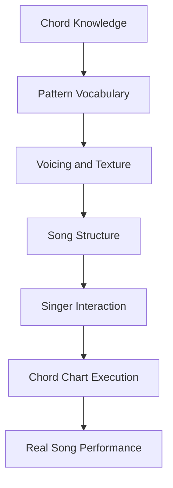
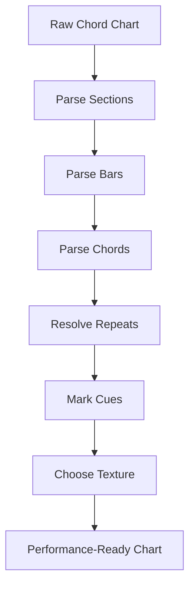
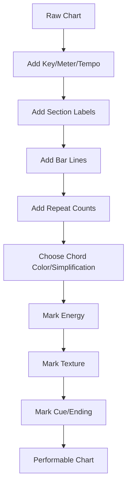
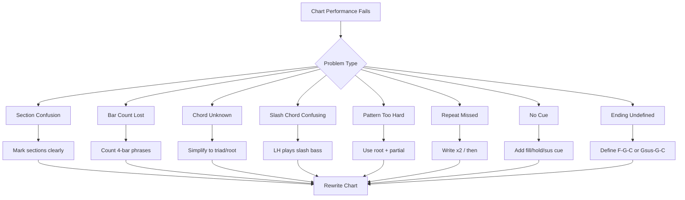
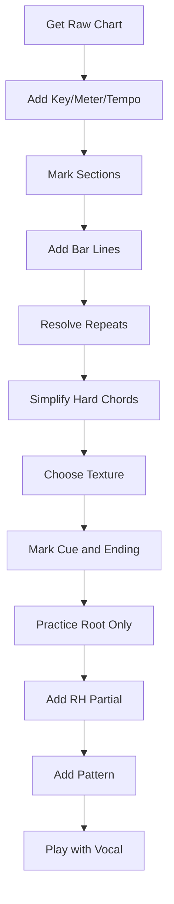

# learn-piano-accompaniment-part-020.md

# Part 020 — Mengiringi Lagu dengan Chord Chart

> Seri: **Learn Piano Accompaniment for Singer Performance**  
> Fokus: **belajar piano untuk mengiringi penyanyi**  
> Framework utama: **The First 20 Hours — Josh Kaufman**  
> Tahap: **Phase G — Dari Latihan ke Lagu Nyata**

---

## Status Seri

| Item | Status |
|---|---|
| Part | 020 |
| Nama file | `learn-piano-accompaniment-part-020.md` |
| Fokus | Membaca, menandai, menyederhanakan, dan memainkan chord chart untuk mengiringi penyanyi |
| Prasyarat | Part 000–019 |
| Output praktis | Bisa mengubah chord chart mentah menjadi chart performable dan memainkannya sebagai iringan |
| Status seri | Belum selesai |

---

## Daftar Isi

- [1. Tujuan Part Ini](#1-tujuan-part-ini)
- [2. Posisi Part Ini dalam Framework Kaufman](#2-posisi-part-ini-dalam-framework-kaufman)
- [3. Masalah Utama: Bisa Chord, tetapi Bingung Membaca Chart](#3-masalah-utama-bisa-chord-tetapi-bingung-membaca-chart)
- [4. Mental Model: Chord Chart sebagai Source Code Performa](#4-mental-model-chord-chart-sebagai-source-code-performa)
- [5. Apa Itu Chord Chart?](#5-apa-itu-chord-chart)
- [6. Chord Chart Bukan Sheet Music Lengkap](#6-chord-chart-bukan-sheet-music-lengkap)
- [7. Informasi yang Harus Ada dalam Chart Siap Tampil](#7-informasi-yang-harus-ada-dalam-chart-siap-tampil)
- [8. Membaca Section Marking](#8-membaca-section-marking)
- [9. Membaca Bar Line](#9-membaca-bar-line)
- [10. Satu Chord per Bar](#10-satu-chord-per-bar)
- [11. Dua Chord per Bar](#11-dua-chord-per-bar)
- [12. Chord Ditahan Lebih dari Satu Bar](#12-chord-ditahan-lebih-dari-satu-bar)
- [13. Membaca Repeat dan Loop](#13-membaca-repeat-dan-loop)
- [14. Membaca Tag, Outro, dan Ending](#14-membaca-tag-outro-dan-ending)
- [15. Membaca Slash Chord](#15-membaca-slash-chord)
- [16. Slash Chord yang Paling Berguna untuk Pemula](#16-slash-chord-yang-paling-berguna-untuk-pemula)
- [17. Membaca Chord Color di Chart](#17-membaca-chord-color-di-chart)
- [18. Membaca Sus, Add9, dan Seventh di Chart](#18-membaca-sus-add9-dan-seventh-di-chart)
- [19. Membaca Chord yang Tidak Dikenal](#19-membaca-chord-yang-tidak-dikenal)
- [20. Cara Menyederhanakan Chart Sulit](#20-cara-menyederhanakan-chart-sulit)
- [21. Cara Membuat Chart Mentah Menjadi Performable](#21-cara-membuat-chart-mentah-menjadi-performable)
- [22. Marking Energy, Texture, dan Cue](#22-marking-energy-texture-dan-cue)
- [23. Marking Vokal dan Lirik sebagai Navigasi](#23-marking-vokal-dan-lirik-sebagai-navigasi)
- [24. Membaca Chord Chart dengan Angka Roman](#24-membaca-chord-chart-dengan-angka-roman)
- [25. Transpose Chart Sederhana](#25-transpose-chart-sederhana)
- [26. Nashville Number System Versi Minimal](#26-nashville-number-system-versi-minimal)
- [27. Chart Preparation Workflow](#27-chart-preparation-workflow)
- [28. Eksekusi Chart: Dari Mata ke Tangan](#28-eksekusi-chart-dari-mata-ke-tangan)
- [29. Memilih Pattern Berdasarkan Chart](#29-memilih-pattern-berdasarkan-chart)
- [30. Membaca Chart 4/4 Pop Ballad](#30-membaca-chart-44-pop-ballad)
- [31. Membaca Chart 6/8 Cinematic Ballad](#31-membaca-chart-68-cinematic-ballad)
- [32. Mini Case Study 1: Chart Mentah `C–G–Am–F`](#32-mini-case-study-1-chart-mentah-cgamf)
- [33. Mini Case Study 2: Chart dengan Slash Chord](#33-mini-case-study-2-chart-dengan-slash-chord)
- [34. Mini Case Study 3: Chart Sulit yang Disederhanakan](#34-mini-case-study-3-chart-sulit-yang-disederhanakan)
- [35. Latihan 1: Baca Chart Tanpa Piano](#35-latihan-1-baca-chart-tanpa-piano)
- [36. Latihan 2: Root Only dari Chart](#36-latihan-2-root-only-dari-chart)
- [37. Latihan 3: Root + Partial Chord dari Chart](#37-latihan-3-root--partial-chord-dari-chart)
- [38. Latihan 4: Tambah Pattern dan Dynamic](#38-latihan-4-tambah-pattern-dan-dynamic)
- [39. Latihan 5: Chart + Vokal/Humming](#39-latihan-5-chart--vokalhumming)
- [40. Latihan 6: Simulasi Chart Salah / Tidak Lengkap](#40-latihan-6-simulasi-chart-salah--tidak-lengkap)
- [41. Debugging Chord Chart Performance](#41-debugging-chord-chart-performance)
- [42. Failure Mode Pemula](#42-failure-mode-pemula)
- [43. Practice Protocol 45 Menit](#43-practice-protocol-45-menit)
- [44. Checklist Kelulusan Part 020](#44-checklist-kelulusan-part-020)
- [45. Ringkasan Mental Model](#45-ringkasan-mental-model)
- [46. Persiapan ke Part 021](#46-persiapan-ke-part-021)

---

# 1. Tujuan Part Ini

Sampai Part 019, kita sudah membangun banyak kemampuan:

- chord dasar;
- progression;
- rhythm;
- broken chord;
- comping;
- 6/8 feel;
- inversion;
- voice leading;
- register;
- density;
- chord color;
- voicing modern;
- struktur lagu;
- intro/interlude/ending;
- transisi antar section;
- mendengar dan mengikuti penyanyi.

Namun ada skill praktis yang sangat menentukan saat Anda mulai memainkan lagu nyata:

```text
membaca chord chart
```

Banyak orang bisa memainkan chord secara terpisah, tetapi ketika melihat chart seperti ini:

```text
[Verse]
| Am | F | C | G |
| Am | F | C | G |

[Chorus]
| C | G/B | Am | F |
| C | G | F | G |
```

mereka bingung:

- chord berapa lama ditahan?
- apa itu `G/B`?
- kapan chorus diulang?
- apakah `Fadd9` harus dimainkan penuh?
- bagaimana kalau chord terlalu sulit?
- pattern apa yang dipakai?
- di mana vokal masuk?
- kapan harus build?
- kapan ending?
- apakah chart ini lengkap?
- bagaimana jika chart dari internet tidak rapi?

Target part ini:

> Anda mampu membaca chord chart, menandai struktur, menyederhanakan chord yang sulit, memilih pattern, dan mengubah chart mentah menjadi chart performable untuk mengiringi penyanyi.

Part ini adalah jembatan dari:

```text
latihan konsep
```

ke:

```text
memainkan lagu nyata
```

---

# 2. Posisi Part Ini dalam Framework Kaufman

Dalam *The First 20 Hours*, kita berusaha mencapai performa fungsional secepat mungkin.

Untuk piano accompaniment, performa fungsional berarti:

```text
diberi chord chart sederhana,
Anda bisa mengiringi penyanyi dengan stabil dan musikal
```

Diagram:



Chord chart adalah interface antara lagu dan pengiring.

Kalau Anda bisa membaca chart dengan baik, Anda bisa belajar banyak lagu tanpa harus membaca notasi lengkap.

Secara Kaufman-style, kita tidak akan mengejar kemampuan sight-reading klasik penuh. Kita fokus pada:

```text
membaca chord chart cukup cepat
untuk membuat iringan yang bisa dipakai tampil
```

---

# 3. Masalah Utama: Bisa Chord, tetapi Bingung Membaca Chart

Ada perbedaan antara:

```text
tahu chord C, G, Am, F
```

dan:

```text
bisa memainkan lagu dari chord chart
```

Chord chart membawa informasi tambahan:

- urutan section;
- durasi chord;
- repeat;
- ending;
- slash chord;
- chord color;
- cue;
- bar count;
- lyrics;
- sometimes ambiguous formatting.

## 3.1 Gejala Bingung Membaca Chart

- chord change terlambat;
- salah jumlah bar;
- salah repeat;
- tidak tahu slash chord;
- semua chord dimainkan root position;
- tidak tahu kapan vokal masuk;
- tidak tahu kapan ending;
- chart terlihat penuh dan membuat panik;
- pattern tidak cocok dengan meter;
- terlalu fokus membaca sampai tidak mendengar penyanyi.

## 3.2 Penyebab

- belum paham bar line;
- belum paham chord duration;
- belum menandai section;
- belum punya simplification strategy;
- belum tahu prioritas;
- belum memisahkan chart reading dan performance decision.

## 3.3 Prinsip

```text
Chord chart mentah bukan performance.
Chord chart harus diproses menjadi arrangement plan.
```

---

# 4. Mental Model: Chord Chart sebagai Source Code Performa

Chord chart seperti source code yang belum tentu lengkap.

Contoh raw source:

```text
Verse: Am F C G
Chorus: C G Am F
```

Ini seperti kode tanpa komentar, tanpa error handling, tanpa deployment notes.

Chart performable harus menambahkan:

```text
section length
repeat
texture
energy
cue
ending
```

Analogi software:

```text
chord symbol = instruction
bar line = execution boundary
section = function/block
repeat = loop
slash chord = explicit bass dependency
cue = event signal
ending = return / terminal state
arrangement marking = comments + runtime config
```

Diagram:



---

# 5. Apa Itu Chord Chart?

Chord chart adalah representasi lagu yang menunjukkan chord dan struktur dasar.

Ia biasanya berisi:

- nama section;
- bar;
- chord symbols;
- repeat;
- kadang lirik;
- kadang tempo/key;
- kadang instruction seperti `rit.`, `hold`, `tag`.

Contoh sederhana:

```text
Key: C
Tempo: 72 BPM
Meter: 4/4

[Intro]
| C | G | Am | F |

[Verse]
| Am | F | C | G | x2

[Chorus]
| C | G | Am | F | x2

[Ending]
| F | G | C |
```

## 5.1 Fungsi Chord Chart

Chord chart memberi kerangka harmoni dan struktur.

Namun ia tidak otomatis memberi:

- voicing;
- pattern;
- dynamic;
- register;
- exact melody;
- pedaling;
- vocal cue;
- expression.

Itu tugas arranger/pengiring.

## 5.2 Chord Chart untuk Pengiring

Untuk pengiring, chart adalah starting point.

Anda harus mengubahnya menjadi:

```text
apa yang akan dimainkan tangan kiri?
apa yang akan dimainkan tangan kanan?
seberapa padat?
seberapa keras?
kapan memberi cue?
kapan diam?
```

---

# 6. Chord Chart Bukan Sheet Music Lengkap

Sheet music lengkap biasanya menunjukkan:

- notasi melody;
- rhythm detail;
- accompaniment detail;
- dynamic marking;
- articulation;
- exact notes.

Chord chart hanya memberi chord dan struktur.

## 6.1 Keuntungan Chord Chart

- lebih cepat dibaca;
- fleksibel;
- cocok untuk pop/acoustic;
- mudah transpose;
- mudah disederhanakan;
- cocok untuk improvisational accompaniment.

## 6.2 Keterbatasan Chord Chart

- tidak memberi melody lengkap;
- tidak memberi exact rhythm;
- tidak selalu lengkap;
- bisa salah dari sumber internet;
- membutuhkan judgment;
- membutuhkan kemampuan listening.

## 6.3 Konsekuensi

Anda tidak boleh berharap chart menjawab semua hal.

Chart menjawab:

```text
harmoni apa dan kapan
```

Anda menjawab:

```text
bagaimana memainkannya agar cocok dengan penyanyi
```

---

# 7. Informasi yang Harus Ada dalam Chart Siap Tampil

Chart siap tampil minimal punya:

| Informasi | Kenapa Penting |
|---|---|
| Key | menentukan chord dan vocal range |
| Meter | 4/4, 6/8, 3/4, dll |
| Tempo | pulse dasar |
| Section | intro, verse, chorus, bridge |
| Bar line | durasi chord |
| Repeat | tidak tersesat |
| Ending | terminal state |
| Cue vocal | penyanyi aman masuk |
| Energy | aransemen punya arc |
| Texture | pattern per section |
| Notes | rubato, tag, ritardando |

## 7.1 Template Minimal

```text
Title:
Key:
Meter:
Tempo:

[Intro] 4 bars, E1, broken chord
| C | G | Am | F |
cue vocal

[Verse] 8 bars, E2, sparse
| Am | F | C | G | x2

[Chorus] 8 bars, E3, pop comping
| C | G | Am | F | x2

[Bridge] 8 bars, E2->E4, build
| F | G | Am | G | x2

[Ending] soft, rit.
| F | G | C |
hold C
```

## 7.2 Jika Chart Tidak Lengkap

Tambahkan sendiri sebelum rehearsal.

Jangan menunggu bingung saat bermain.

---

# 8. Membaca Section Marking

Section marking adalah label bagian lagu.

Contoh:

```text
[Intro]
[Verse]
[Pre-Chorus]
[Chorus]
[Bridge]
[Outro]
```

## 8.1 Kenapa Section Marking Penting?

Karena setiap section punya:

- energy;
- texture;
- density;
- register;
- vocal behavior;
- transition.

Tanpa section marking, Anda hanya melihat chord berderet.

## 8.2 Section Marking yang Baik

Tulis jelas:

```text
[Verse 1]
[Chorus 1]
[Verse 2]
[Chorus 2]
[Bridge]
[Final Chorus]
[Outro]
```

## 8.3 Section Bisa Sama Chord, Beda Texture

Contoh:

```text
Verse: C-G-Am-F
Chorus: C-G-Am-F
```

Chord sama, tetapi texture beda.

Verse:

```text
sparse
```

Chorus:

```text
fuller
```

Jangan tertipu oleh chord yang sama. Section tetap berbeda.

---

# 9. Membaca Bar Line

Bar line biasanya ditulis dengan simbol:

```text
|
```

Contoh:

```text
| C | G | Am | F |
```

Artinya:

```text
bar 1 = C
bar 2 = G
bar 3 = Am
bar 4 = F
```

Jika meter 4/4, setiap bar punya:

```text
1 2 3 4
```

Jika meter 6/8, setiap bar punya:

```text
1 2 3 4 5 6
```

## 9.1 Bar Line adalah Boundary

Bar line menunjukkan kapan chord biasanya berubah.

Dalam software analogy:

```text
bar line = execution boundary / time window
```

## 9.2 Jangan Abaikan Bar Line

Jika chart:

```text
| C | G | Am | F |
```

jangan memainkan semua chord terlalu cepat.

Setiap chord punya durasi satu bar.

## 9.3 Jika Tidak Ada Bar Line

Chart internet kadang menulis:

```text
C G Am F
```

Anda harus menebak berdasarkan lagu atau lirik.

Untuk pemula, tulis ulang dengan bar line sebelum latihan.

---

# 10. Satu Chord per Bar

Format paling umum:

```text
| C | G | Am | F |
```

Dalam 4/4:

```text
C  = 4 beat
G  = 4 beat
Am = 4 beat
F  = 4 beat
```

## 10.1 Cara Main Level 1

```text
Beat 1: LH root + RH chord
Beat 2-4: hold
```

Pattern:

```text
X - - -
```

## 10.2 Cara Main Level 2

```text
Beat 1: chord
Beat 3: chord light
```

Pattern:

```text
X - x -
```

## 10.3 Cara Main Level 3

Pop ballad:

```text
1 & 2 & 3 & 4 &
X - - x X - - x
```

## 10.4 Rule

Jika chord change belum stabil, pakai Level 1 dulu.

Chart execution lebih penting daripada pattern keren.

---

# 11. Dua Chord per Bar

Chart bisa menulis dua chord dalam satu bar.

Contoh:

```text
| C  G | Am  F |
```

Dalam 4/4, biasanya:

```text
C = beat 1-2
G = beat 3-4
Am = beat 1-2
F = beat 3-4
```

## 11.1 Cara Membaca

```text
| C  G |
```

Artinya:

```text
beat 1: C
beat 3: G
```

Jika tidak ada instruksi lain.

## 11.2 Pattern Sederhana

```text
1 2 3 4
C - G -
```

## 11.3 Risiko

Dua chord per bar membuat tangan lebih sibuk.

Jika sulit:

- main LH root saja;
- RH partial;
- kurangi pattern;
- jangan pakai arpeggio rumit.

## 11.4 Dalam 6/8

Jika dua chord per bar dalam 6/8:

```text
| C  G |
```

Biasanya:

```text
C = count 1-2-3
G = count 4-5-6
```

## 11.5 Rule

```text
Semakin cepat chord berubah, semakin sederhana pattern.
```

---

# 12. Chord Ditahan Lebih dari Satu Bar

Kadang chart:

```text
| C | C | G | G |
```

Artinya C ditahan dua bar, G ditahan dua bar.

Kadang ditulis:

```text
| C | % | G | % |
```

Simbol `%` berarti ulang chord sebelumnya.

## 12.1 Cara Main

Jika chord ditahan lama, Anda bisa:

- main lebih sparse;
- gunakan broken chord;
- tambah small fill di bar kedua;
- jangan terlalu ramai.

## 12.2 Contoh

```text
| C | C |
```

Bar 1:

```text
C block chord
```

Bar 2:

```text
C broken chord / fill kecil
```

## 12.3 Jangan Bosan Lalu Overplay

Chord panjang memberi ruang vokal.

Jangan isi semua ruang hanya karena chord tidak berubah.

---

# 13. Membaca Repeat dan Loop

Repeat bisa ditulis:

```text
x2
repeat
:|| 
||:
D.C.
D.S.
```

Untuk tahap awal, gunakan marking sederhana.

## 13.1 x2

```text
[Verse]
| Am | F | C | G | x2
```

Artinya progression dimainkan dua kali.

Total:

```text
8 bar jika progression 4 bar
```

## 13.2 Repeat Then

Tulis:

```text
Chorus x2, then Bridge
```

Ini lebih jelas daripada hanya simbol.

## 13.3 D.C. dan D.S.

Dalam chart lebih formal:

- `D.C.` = Da Capo, kembali ke awal.
- `D.S.` = Dal Segno, kembali ke tanda segno.
- `Coda` = bagian ending khusus.

Untuk 20 jam pertama, jika chart punya simbol ini dan membingungkan, tulis ulang menjadi struktur linear.

## 13.4 Linearize Chart

Dari:

```text
Verse
Chorus
D.S. al Coda
```

Tulis ulang:

```text
Intro
Verse 1
Chorus 1
Verse 2
Chorus 2
Bridge
Final Chorus
Coda
```

Lebih aman untuk latihan.

---

# 14. Membaca Tag, Outro, dan Ending

## 14.1 Tag

Tag adalah pengulangan phrase pendek di akhir.

```text
Tag x2:
| F | G | C |
```

## 14.2 Outro

Outro adalah bagian akhir instrumental/vokal.

```text
[Outro]
| F | G | C | C |
```

## 14.3 Ending

Ending harus jelas.

Marking:

```text
hold C
rit.
soft ending
big ending
tag x2
```

## 14.4 Jika Chart Tidak Menulis Ending

Tambahkan sendiri.

Ending aman dalam key C:

```text
| F | G | C |
```

atau:

```text
| Gsus4 G | C |
```

## 14.5 Rule

```text
Jangan tampil dengan ending yang undefined.
```

---

# 15. Membaca Slash Chord

Slash chord ditulis:

```text
G/B
C/E
F/A
D/F#
```

Format:

```text
Chord / Bass note
```

Contoh:

```text
G/B
```

Artinya:

```text
Chord = G
Bass = B
```

Bukan chord B.

## 15.1 G/B

Chord G:

```text
G B D
```

Bass note:

```text
B
```

Jadi:

```text
LH: B
RH: G chord notes
```

## 15.2 C/E

Chord C:

```text
C E G
```

Bass note:

```text
E
```

Jadi:

```text
LH: E
RH: C chord notes
```

## 15.3 Kenapa Slash Chord Dipakai?

Biasanya untuk membuat bass line lebih halus.

Contoh:

```text
C - G/B - Am
```

Bass:

```text
C - B - A
```

Turun stepwise.

## 15.4 Cara Aman Memainkan Slash Chord

Untuk pemula:

```text
LH main nada setelah slash
RH main chord sebelum slash
```

Contoh:

```text
G/B:
LH B
RH G-B-D atau B-D-G
```

## 15.5 Jika Terlalu Sulit

Boleh sementara sederhanakan:

```text
G/B -> G
```

Tetapi pahami bahwa bass movement hilang.

---

# 16. Slash Chord yang Paling Berguna untuk Pemula

Dalam key C, slash chord umum:

| Slash Chord | Arti | Fungsi |
|---|---|---|
| G/B | G chord dengan B di bass | bass turun C-B-A |
| C/E | C chord dengan E di bass | bass naik/halus ke F |
| F/A | F chord dengan A di bass | bass naik/halus |
| Am/G | Am dengan G di bass | turun menuju F |
| D/F# | D dengan F# di bass | menuju G |
| G/D | G dengan D di bass | inversion / stability |

## 16.1 C - G/B - Am

Bass:

```text
C - B - A
```

Sangat umum.

## 16.2 C/E - F

Bass:

```text
E - F
```

Memberi gerakan naik halus.

## 16.3 F/A - G/B - C

Bass:

```text
A - B - C
```

Build menuju C.

## 16.4 Cara Latihan

Main LH saja:

```text
C - B - A - F
```

Lalu tambahkan RH chord.

## 16.5 Rule

```text
Slash chord sering lebih penting di LH daripada RH.
```

Jangan panik. Baca setelah slash sebagai bass.

---

# 17. Membaca Chord Color di Chart

Chord chart bisa memuat:

```text
Cmaj7
Am7
Fadd9
Gsus4
G7
Dm7
Em7
```

Jangan panik.

Pilih voicing sesuai level.

## 17.1 Jika Chart Menulis Cmaj7

Minimal:

```text
LH C
RH E-B
```

atau:

```text
LH C
RH E-G-B
```

## 17.2 Jika Chart Menulis Am7

Minimal:

```text
LH A
RH C-G
```

atau:

```text
LH A
RH C-E-G
```

## 17.3 Jika Chart Menulis Fadd9

Minimal:

```text
LH F
RH A-G
```

atau:

```text
LH F
RH A-C-G
```

## 17.4 Jika Chart Menulis Gsus4

Minimal:

```text
LH G
RH C-D
```

atau:

```text
LH G
RH C-D-G
```

## 17.5 Jika Chart Menulis G7

Minimal:

```text
LH G
RH B-F
```

atau:

```text
LH G
RH B-D-F
```

## 17.6 Rule

```text
Chord color boleh disederhanakan selama fungsi utamanya tetap terdengar.
```

---

# 18. Membaca Sus, Add9, dan Seventh di Chart

## 18.1 sus2

Contoh:

```text
Csus2 = C D G
```

Jika sulit, main:

```text
LH C
RH D-G
```

## 18.2 sus4

Contoh:

```text
Gsus4 = G C D
```

Jika chart:

```text
Gsus4 G
```

main:

```text
C -> B
```

di RH.

## 18.3 add9

Contoh:

```text
Cadd9 = C E G D
```

Minimal:

```text
LH C
RH E-D
```

## 18.4 maj7

Contoh:

```text
Cmaj7 = C E G B
```

Minimal:

```text
LH C
RH E-B
```

## 18.5 m7

Contoh:

```text
Am7 = A C E G
```

Minimal:

```text
LH A
RH C-G
```

## 18.6 7 / dominant7

Contoh:

```text
G7 = G B D F
```

Minimal:

```text
LH G
RH B-F
```

## 18.7 Rule

Jika chart terlalu banyak color:

```text
main root + third + color note
```

Tidak harus semua nada.

---

# 19. Membaca Chord yang Tidak Dikenal

Chart nyata bisa punya chord seperti:

```text
Bb
Eb
D/F#
B7
E7
C#m
F#m7
Aadd9
```

Jangan panik.

## 19.1 Langkah 1: Identifikasi Root

Chord root adalah huruf awal:

```text
Bb = root Bb
D/F# = chord D, bass F#
C#m = root C#
```

## 19.2 Langkah 2: Identifikasi Quality

- `m` = minor;
- `maj7` = major 7;
- `7` = dominant 7;
- `sus` = suspended;
- `add9` = tambah 9;
- `dim` = diminished.

## 19.3 Langkah 3: Sederhanakan Jika Perlu

Contoh:

```text
C#m7 -> C#m
F#m7 -> F#m
Aadd9 -> A
B7 -> B
```

Sementara boleh untuk survival.

## 19.4 Langkah 4: Main Root Dulu

Jika chord unknown:

```text
LH root only
```

lebih baik daripada berhenti.

## 19.5 Langkah 5: Cari Triad Basic

Jika tahu formula, bangun triad.

Contoh:

```text
Bb major = Bb D F
Eb major = Eb G Bb
F#m = F# A C#
```

## 19.6 Rule

```text
Saat live, jangan berhenti karena satu chord asing.
Main root, dengar, lanjut.
```

---

# 20. Cara Menyederhanakan Chart Sulit

Chart sulit harus disederhanakan agar performable.

## 20.1 Simplification Priority

1. pertahankan root movement;
2. pertahankan major/minor quality;
3. pertahankan dominant/sus penting;
4. kurangi extension;
5. kurangi slash chord jika terlalu sulit;
6. kurangi rhythm complexity.

## 20.2 Contoh

Chart:

```text
Cmaj9 - G13sus/B - Am11 - Fmaj9
```

Sederhanakan:

```text
Cadd9 - G/B - Am7 - Fadd9
```

Lebih sederhana lagi:

```text
C - G/B - Am - F
```

Jika live sangat sulit:

```text
C - G - Am - F
```

## 20.3 Jangan Hilangkan Semua Fungsi

Jika chord `G7` menuju `C`, jangan selalu ubah ke chord yang kehilangan tension jika lagu butuh resolusi.

Tetapi jika terlalu sulit, `G` masih aman.

## 20.4 Rule

```text
Chart yang bisa dimainkan stabil lebih baik daripada chart lengkap yang membuat Anda tersesat.
```

---

# 21. Cara Membuat Chart Mentah Menjadi Performable

Raw chart:

```text
Intro C G Am F
Verse Am F C G
Chorus C G Am F
Bridge F G Am G
Ending F G C
```

Chart performable:

```text
Key: C
Meter: 4/4
Tempo: 72 BPM

[Intro] 4 bars | E1 | broken chord
| Cadd9 | G | Am7 | Fadd9 |
Cue vocal: small fill on bar 4

[Verse 1] 8 bars | E2 | sparse partial
| Am7 | Fadd9 | Cadd9 | G | x2

[Chorus 1] 8 bars | E3 | pop ballad comping
| Cadd9 | G | Am7 | Fadd9 | x2

[Interlude] 4 bars | E2 | broken chord
| Cadd9 | G | Am7 | Fadd9 |

[Bridge] 8 bars | E2->E4 | build
| Fadd9 | G | Am7 | Gsus4 G | x2

[Final Chorus] 16 bars | E4 | fuller
| Cadd9 | G | Am7 | Fadd9 | x4

[Ending] soft rit.
| Fadd9 | Gsus4 G | Cadd9 |
Hold C
```

## 21.1 Parsing Steps



## 21.2 Rule

```text
Jangan latihan dari chart mentah jika chart membuat Anda bingung.
Tulis ulang chart sampai eksekusinya jelas.
```

---

# 22. Marking Energy, Texture, dan Cue

Tambahkan marking sederhana.

## 22.1 Energy

```text
E1 = sangat lembut
E2 = verse
E3 = chorus
E4 = final chorus/peak
```

## 22.2 Texture

```text
SP = sparse
BC = broken chord
PB = pop ballad comping
6/8 = rolling
FULL = fuller
STOP = stop-time
```

## 22.3 Cue

```text
cue vocal
build
drop
hold
fill
Gsus4-G
rit.
tag x2
```

## 22.4 Contoh

```text
[Pre-Chorus] E2->E3 BUILD
| Dm7 | Fadd9 | Gsus4 G | G |
cue: stop beat 4 -> Chorus
```

## 22.5 Kenapa Marking Penting?

Karena saat bermain, Anda tidak mau berpikir:

```text
bagian ini harus pattern apa ya?
```

Marking membuat keputusan sudah diambil sebelum performa.

---

# 23. Marking Vokal dan Lirik sebagai Navigasi

Tambahkan lyric cue.

## 23.1 Contoh

```text
[Verse]
| Am7 | Fadd9 | Cadd9 | G |
lyric cue: "Aku masih..."

[Chorus]
| Cadd9 | G | Am7 | Fadd9 |
lyric cue: "Pulanglah..."
```

## 23.2 Marking Entry

```text
vocal in
```

## 23.3 Marking Important Line

```text
leave space: "kata penting..."
```

## 23.4 Marking Tag

```text
repeat last line x2
```

## 23.5 Rule

```text
Chord chart memberi harmoni.
Lyric cue memberi navigasi manusia.
```

---

# 24. Membaca Chord Chart dengan Angka Roman

Roman numeral membantu transpose dan memahami fungsi.

Dalam key C:

| Roman | Chord |
|---|---|
| I | C |
| ii | Dm |
| iii | Em |
| IV | F |
| V | G |
| vi | Am |
| vii° | Bdim |

Progression:

```text
C - G - Am - F
```

Roman:

```text
I - V - vi - IV
```

## 24.1 Kenapa Berguna?

Karena jika lagu pindah key, pola sama bisa dipindahkan.

Dalam key G:

```text
I - V - vi - IV
= G - D - Em - C
```

## 24.2 Untuk Pemula

Tidak perlu roman untuk semua lagu, tetapi pahami progression umum:

```text
I - V - vi - IV
vi - IV - I - V
I - vi - IV - V
ii - V - I
```

## 24.3 Rule

```text
Chord symbol membantu bermain sekarang.
Roman numeral membantu memahami dan transpose.
```

---

# 25. Transpose Chart Sederhana

Transpose berarti memindahkan lagu ke key lain.

Alasan transpose:

- penyanyi terlalu tinggi;
- penyanyi terlalu rendah;
- key lebih mudah dimainkan;
- instrument/band requirement.

## 25.1 Contoh C ke G

Progression:

```text
C - G - Am - F
```

Roman:

```text
I - V - vi - IV
```

Di key G:

```text
G - D - Em - C
```

## 25.2 C ke D

Di key D:

```text
I = D
V = A
vi = Bm
IV = G
```

Jadi:

```text
D - A - Bm - G
```

## 25.3 Cara Aman

1. ubah progression ke angka roman;
2. pilih key baru;
3. mapping angka ke chord baru;
4. tulis chart baru;
5. latihan chord baru perlahan.

## 25.4 Jangan Transpose Saat Live Jika Belum Siap

Jika penyanyi minta transpose spontan dan Anda belum mampu, lebih baik jujur saat rehearsal.

Namun untuk persiapan, latihan transpose progression umum sangat berguna.

---

# 26. Nashville Number System Versi Minimal

Nashville Number System memakai angka:

```text
1 5 6m 4
```

Untuk key C:

```text
1 = C
5 = G
6m = Am
4 = F
```

Untuk key G:

```text
1 = G
5 = D
6m = Em
4 = C
```

## 26.1 Kenapa Berguna?

Karena angka lebih mudah dipindah key.

## 26.2 Versi Minimal untuk Kita

Gunakan:

```text
1 = I
2m = ii
3m = iii
4 = IV
5 = V
6m = vi
```

Dalam C:

```text
1 5 6m 4 = C G Am F
```

## 26.3 Dengan Slash

```text
5/7
```

Dalam key C berarti:

```text
G/B
```

Karena 5 = G, 7 = B sebagai bass.

## 26.4 Jangan Overload

Untuk 20 jam pertama, cukup tahu konsepnya.

Fokus tetap chord chart biasa.

---

# 27. Chart Preparation Workflow

Sebelum memainkan lagu dari chart, lakukan workflow ini.

## 27.1 Step 1: Tentukan Key

```text
Key: C
```

Jika tidak tahu, cari chord terakhir atau chord home.

## 27.2 Step 2: Tentukan Meter

```text
4/4
6/8
3/4
```

## 27.3 Step 3: Tulis Section

```text
Intro
Verse
Chorus
Bridge
Ending
```

## 27.4 Step 4: Tulis Bar Line

```text
| C | G | Am | F |
```

## 27.5 Step 5: Tandai Repeat

```text
x2
x4
then bridge
```

## 27.6 Step 6: Sederhanakan Chord Sulit

Contoh:

```text
Cmaj9 -> Cadd9 / Cmaj7 / C
```

## 27.7 Step 7: Pilih Texture

```text
Verse sparse
Chorus fuller
Bridge build
```

## 27.8 Step 8: Mark Cue

```text
cue vocal
Gsus4-G
stop
rit.
```

## 27.9 Step 9: Run Without Vocal

Main chart sederhana.

## 27.10 Step 10: Run With Vocal/Humming

Baru tambahkan interaksi vokal.

---

# 28. Eksekusi Chart: Dari Mata ke Tangan

Saat membaca chart, jangan membaca chord satu per satu terlalu lambat.

Gunakan chunk.

## 28.1 Chunk 4 Bar

Contoh:

```text
| C | G | Am | F |
```

Jangan baca:

```text
C lalu lupa G lalu cari Am
```

Baca sebagai unit:

```text
I-V-vi-IV pattern
```

## 28.2 Lihat Chord Berikutnya Lebih Awal

Saat sedang memainkan C, mata sudah melihat G.

Saat memainkan G, mata sudah melihat Am.

## 28.3 Jangan Menunggu Beat 1 untuk Mencari Chord

Chord berikutnya harus siap sebelum beat 1.

## 28.4 Jika Terlambat

Sederhanakan:

```text
LH root only
```

lalu tambahkan RH di beat berikutnya.

## 28.5 Rule

```text
Mata membaca depan.
Tangan memainkan sekarang.
Telinga mendengar vokal.
```

---

# 29. Memilih Pattern Berdasarkan Chart

Pattern dipilih berdasarkan meter, tempo, section, dan density.

## 29.1 4/4 Slow Verse

```text
X - - -
```

atau:

```text
X - x -
```

## 29.2 4/4 Chorus

```text
X - x -
```

atau:

```text
1 & 2 & 3 & 4 &
X - - x X - - x
```

## 29.3 6/8 Verse

```text
1 2 3 4 5 6
X - - x - -
```

## 29.4 6/8 Chorus

```text
1-5-8-5-3-5
```

## 29.5 Dua Chord per Bar

Gunakan pattern sederhana:

```text
1 2 3 4
C - G -
```

Jangan arpeggio panjang.

## 29.6 Slash Chord

LH ikuti bass slash.

RH chord tetap sederhana.

## 29.7 Rule

```text
Chart complexity naik -> pattern complexity turun.
```

---

# 30. Membaca Chart 4/4 Pop Ballad

Contoh chart:

```text
Key: C
Meter: 4/4
Tempo: 72

[Intro]
| Cadd9 | G | Am7 | Fadd9 |

[Verse]
| Am7 | Fadd9 | Cadd9 | G |
| Am7 | Fadd9 | Cadd9 | G |

[Chorus]
| Cadd9 | G | Am7 | Fadd9 |
| Cadd9 | G | Fadd9 | G |
```

## 30.1 Parse

Intro:

```text
4 bar
```

Verse:

```text
8 bar
```

Chorus:

```text
8 bar
```

## 30.2 Texture

Intro:

```text
broken chord
```

Verse:

```text
sparse partial
```

Chorus:

```text
pop ballad comping
```

## 30.3 Cue

Verse to chorus:

```text
last G -> Cadd9
```

Bisa tambahkan:

```text
Gsus4 -> G
```

## 30.4 Ending

Tambahkan jika belum ada:

```text
[Ending]
| Fadd9 | Gsus4 G | Cadd9 |
hold C
```

---

# 31. Membaca Chart 6/8 Cinematic Ballad

Contoh:

```text
Key: C
Meter: 6/8
Tempo: 54

[Intro]
| Cadd9 | Gsus4 G | Am7 | Fadd9 |

[Verse]
| Am7 | Fadd9 | Cadd9 | G |
| Am7 | Fadd9 | Cadd9 | G |

[Chorus]
| Cadd9 | G | Am7 | Fadd9 |
| Cadd9 | G | Fadd9 | G |
```

## 31.1 Count

Setiap bar:

```text
ONE two three FOUR five six
```

## 31.2 Jika Ada Dua Chord per Bar

```text
| Gsus4 G |
```

Biasanya:

```text
Gsus4 = count 1-2-3
G = count 4-5-6
```

## 31.3 Texture

Intro:

```text
rolling 6/8
```

Verse:

```text
sparse 6/8
```

Chorus:

```text
fuller rolling
```

## 31.4 Cue

Bar terakhir intro harus memberi ruang vokal.

Jangan rolling terlalu ramai sampai entry tertutup.

---

# 32. Mini Case Study 1: Chart Mentah `C–G–Am–F`

Raw chart:

```text
C G Am F
```

## 32.1 Problem

Tidak ada:

- key;
- meter;
- bar line;
- section;
- repeat;
- pattern;
- ending.

## 32.2 Jadikan Chart

```text
Key: C
Meter: 4/4
Tempo: 72

[Intro] 4 bars | E1 | broken chord
| C | G | Am | F |
cue vocal

[Verse] 8 bars | E2 | sparse
| C | G | Am | F | x2

[Chorus] 8 bars | E3 | fuller
| C | G | Am | F | x2

[Ending]
| F | G | C |
hold C
```

## 32.3 Modernize

```text
Cadd9 - G - Am7 - Fadd9
```

## 32.4 Performance Plan

Verse:

```text
LH root + RH partial
```

Chorus:

```text
RH fuller
```

Ending:

```text
Fadd9 - Gsus4/G - Cadd9
```

---

# 33. Mini Case Study 2: Chart dengan Slash Chord

Chart:

```text
[Verse]
| C | G/B | Am | F |
```

## 33.1 Parse

Chord:

```text
C
G with B bass
Am
F
```

Bass movement:

```text
C - B - A - F
```

## 33.2 LH

```text
C -> B -> A -> F
```

## 33.3 RH

```text
C: E-G
G/B: B-D or B-D-G
Am: C-E
F: A-C
```

## 33.4 Kenapa Bagus?

Bass turun:

```text
C-B-A
```

lebih smooth daripada:

```text
C-G-A
```

## 33.5 Jika Sulit

Sederhanakan:

```text
G/B -> G
```

Tetapi coba latih LH B karena sangat berguna.

---

# 34. Mini Case Study 3: Chart Sulit yang Disederhanakan

Raw chart:

```text
[Chorus]
| Cmaj9 | G13sus/B | Am11 | Fmaj9 |
```

## 34.1 Masalah

Chord terlalu advanced untuk tahap awal.

## 34.2 Simplification Level 1

```text
Cadd9 | G/B | Am7 | Fadd9
```

## 34.3 Simplification Level 2

```text
C | G/B | Am | F
```

## 34.4 Simplification Level 3

```text
C | G | Am | F
```

## 34.5 Pilihan

Jika sedang latihan:

```text
Level 1
```

Jika live dan panik:

```text
Level 2 atau 3
```

## 34.6 Prinsip

```text
Lebih baik memainkan versi sederhana dengan timing stabil
daripada versi kompleks yang runtuh.
```

---

# 35. Latihan 1: Baca Chart Tanpa Piano

Ambil chart:

```text
[Intro]
| C | G | Am | F |

[Verse]
| Am | F | C | G | x2

[Chorus]
| C | G | Am | F | x2

[Ending]
| F | G | C |
```

## 35.1 Tugas

Tanpa piano, ucapkan:

```text
Intro 4 bar.
Verse 8 bar.
Chorus 8 bar.
Ending 3 bar.
```

## 35.2 Count

Tepuk tangan tiap bar.

Ucapkan chord.

## 35.3 Tujuan

Membaca struktur sebelum tangan terlibat.

## 35.4 Checklist

- [ ] tahu section;
- [ ] tahu repeat;
- [ ] tahu jumlah bar;
- [ ] tahu ending.

---

# 36. Latihan 2: Root Only dari Chart

Gunakan chart sama.

## 36.1 Tugas

LH main root saja.

```text
C - G - A - F
```

untuk `C-G-Am-F`.

## 36.2 Kenapa?

Root only melatih:

- bar count;
- chord change;
- reading ahead;
- structure navigation.

## 36.3 Jangan Tambah RH Dulu

Jika root saja belum stabil, RH akan membuat kacau.

## 36.4 Evaluasi

- apakah chord change tepat?
- apakah repeat benar?
- apakah ending jelas?
- apakah tempo stabil?

---

# 37. Latihan 3: Root + Partial Chord dari Chart

Tambahkan RH partial.

Progression:

```text
C - G - Am - F
```

Main:

```text
LH C, RH E-G
LH G, RH B-D
LH A, RH C-E
LH F, RH A-C
```

## 37.1 Pattern

```text
X - - -
```

## 37.2 Tujuan

Membaca chart sambil memberi harmony lengkap.

## 37.3 Jika Terlambat

RH boleh masuk beat 3.

Yang penting LH root di beat 1.

## 37.4 Evaluasi

- apakah RH chord benar?
- apakah LH root tepat?
- apakah chord change tidak terlambat?
- apakah section tetap terbaca?

---

# 38. Latihan 4: Tambah Pattern dan Dynamic

Setelah root + partial stabil, tambah texture.

## 38.1 Verse

```text
X - - -
```

Energy 2.

## 38.2 Chorus

```text
X - x -
```

atau pop ballad comping.

Energy 3.

## 38.3 Bridge

Build.

## 38.4 Ending

Soft.

## 38.5 Tujuan

Mengubah chart menjadi aransemen sederhana.

## 38.6 Rule

Jangan tambah pattern sebelum chart navigation stabil.

---

# 39. Latihan 5: Chart + Vokal/Humming

Gunakan chart dan humming sederhana.

## 39.1 Piano

Sederhanakan:

```text
LH root + RH partial
```

## 39.2 Vokal

Humming phrase untuk verse dan chorus.

## 39.3 Fokus

- tetap baca chart;
- dengar vokal;
- cue chorus;
- ending jelas.

## 39.4 Evaluasi

Rekam.

Tanya:

- apakah vokal foreground?
- apakah chart membuat Anda lupa mendengar?
- apakah cue jelas?
- apakah ending jelas?
- apakah chord change tepat?

---

# 40. Latihan 6: Simulasi Chart Salah / Tidak Lengkap

Ambil chart mentah:

```text
C G Am F
Am F C G
C G Am F
```

## 40.1 Tugas

Tulis ulang menjadi chart performable.

Tambahkan:

- key;
- meter;
- section;
- bar line;
- repeat;
- energy;
- texture;
- ending.

## 40.2 Contoh Jawaban

```text
Key: C
Meter: 4/4

[Intro]
| C | G | Am | F |

[Verse]
| Am | F | C | G | x2

[Chorus]
| C | G | Am | F | x2

[Ending]
| F | G | C |
```

## 40.3 Tujuan

Melatih Anda tidak bergantung pada chart sempurna.

---

# 41. Debugging Chord Chart Performance

Jika bermain dari chart terasa kacau, debug layer.



## 41.1 Section Confusion

Solusi:

```text
tulis section label lebih besar
```

## 41.2 Bar Count Lost

Solusi:

```text
hitung phrase 4 bar
```

## 41.3 Chord Unknown

Solusi:

```text
root only
triad simplification
```

## 41.4 Slash Chord Confusing

Solusi:

```text
LH = note after slash
RH = chord before slash
```

## 41.5 Pattern Too Hard

Solusi:

```text
X - - -
```

atau root only.

## 41.6 Repeat Missed

Solusi:

```text
linearize chart
```

## 41.7 Ending Undefined

Solusi:

```text
write ending before playing
```

---

# 42. Failure Mode Pemula

## 42.1 Membaca Chord Satu per Satu

Baca chunk 4 bar.

## 42.2 Tidak Menulis Bar Line

Chart tanpa bar line membuat durasi chord kabur.

## 42.3 Tidak Menandai Repeat

Repeat missed = struktur runtuh.

## 42.4 Panik pada Slash Chord

Ingat:

```text
left hand = bass after slash
right hand = chord before slash
```

## 42.5 Memaksakan Semua Extension

Jika chart punya chord rumit, sederhanakan.

## 42.6 Pattern Terlalu Kompleks

Saat membaca chart baru, pattern harus sederhana.

## 42.7 Tidak Menyiapkan Ending

Ending undefined membuat performa jatuh di momen terakhir.

## 42.8 Tidak Mendengar Vokal karena Terlalu Sibuk Membaca

Sederhanakan piano sampai telinga bisa mendengar.

## 42.9 Tidak Rewriting Chart

Chart internet sering tidak performable.

Tulis ulang.

## 42.10 Tidak Menandai Cue

Penyanyi butuh entry cue.

---

# 43. Practice Protocol 45 Menit

Gunakan sesi ini untuk Part 020.

## 43.1 Menit 0–5: Parse Chart Tanpa Piano

Baca chart.

Tandai:

- key;
- meter;
- section;
- repeat;
- ending.

## 43.2 Menit 5–10: Root Only

Mainkan LH root dari seluruh chart.

Fokus bar count.

## 43.3 Menit 10–15: Root + Partial

Tambahkan RH dua nada.

Pattern:

```text
X - - -
```

## 43.4 Menit 15–20: Section Texture

Verse sparse.

Chorus fuller.

Bridge build.

## 43.5 Menit 20–25: Slash Chord Drill

Latih:

```text
C - G/B - Am - F
C/E - F - G - C
F/A - G/B - C
```

## 43.6 Menit 25–30: Chord Color Simplification

Latih:

```text
Cmaj7 -> C or Cmaj7 partial
Am7 -> Am or Am7 partial
Fadd9 -> F or Fadd9 partial
G7 -> G or G7 shell
```

## 43.7 Menit 30–35: Performable Chart Rewrite

Ambil raw chart.

Tulis ulang dengan:

- bar line;
- repeat;
- cue;
- energy;
- ending.

## 43.8 Menit 35–40: Chart + Humming

Main sambil humming.

Fokus vokal tetap foreground.

## 43.9 Menit 40–45: Record and Review

Rekam 1 menit.

Jawab:

- apakah chart terbaca?
- apakah chord change tepat?
- apakah repeat benar?
- apakah slash chord benar?
- apakah pattern terlalu sulit?
- apakah vokal tetap terdengar?
- apakah ending jelas?

---

# 44. Checklist Kelulusan Part 020

Anda boleh lanjut ke Part 021 jika sebagian besar checklist ini terpenuhi.

## 44.1 Pemahaman

- [ ] Saya tahu chord chart adalah kerangka harmoni dan struktur, bukan sheet music lengkap.
- [ ] Saya tahu section marking penting.
- [ ] Saya tahu bar line menunjukkan durasi chord.
- [ ] Saya tahu satu chord per bar berarti chord ditahan satu bar.
- [ ] Saya tahu dua chord per bar biasanya dibagi beat 1 dan 3 dalam 4/4.
- [ ] Saya tahu `x2` berarti repeat dua kali.
- [ ] Saya tahu slash chord berarti chord/bass note.
- [ ] Saya tahu `G/B` berarti G chord dengan B di bass.
- [ ] Saya tahu chord color bisa disederhanakan.
- [ ] Saya tahu chart mentah harus diubah menjadi chart performable.

## 44.2 Praktik

- [ ] Saya bisa membaca chart sederhana 4/4.
- [ ] Saya bisa membaca chart sederhana 6/8.
- [ ] Saya bisa memainkan root only dari chart.
- [ ] Saya bisa memainkan root + partial chord dari chart.
- [ ] Saya bisa membaca `C - G/B - Am - F`.
- [ ] Saya bisa menyederhanakan chord sulit menjadi triad/partial.
- [ ] Saya bisa menandai repeat.
- [ ] Saya bisa menandai cue vokal.
- [ ] Saya bisa membuat ending jika chart belum punya ending.
- [ ] Saya bisa memainkan chart sambil humming sederhana.

## 44.3 Self-Correction

- [ ] Saya bisa mendeteksi jika saya kehilangan bar count.
- [ ] Saya bisa mendeteksi jika pattern terlalu sulit untuk chart baru.
- [ ] Saya bisa menyederhanakan chord unknown menjadi root/triad.
- [ ] Saya bisa mengubah slash chord menjadi LH bass + RH chord.
- [ ] Saya bisa menulis ulang chart internet yang tidak rapi.
- [ ] Saya bisa linearize chart yang repeat-nya membingungkan.
- [ ] Saya bisa memastikan ending tidak undefined.

---

# 45. Ringkasan Mental Model

Chord chart adalah source code performa.

```text
section = block/function
bar line = time boundary
chord symbol = harmonic instruction
repeat = loop
slash chord = explicit bass
cue = event signal
ending = terminal state
marking = comments/runtime config
```

Workflow utama:



Kalimat kunci:

```text
Jangan langsung memainkan chart mentah.
Parse, simplify, mark, then perform.
```

Dan:

```text
Lebih baik chart sederhana yang dimainkan stabil
daripada chart kompleks yang membuat Anda tidak mendengar penyanyi.
```

---

# 46. Persiapan ke Part 021

Part berikutnya adalah:

```text
learn-piano-accompaniment-part-021.md
```

Judul:

```text
Transposition Dasar untuk Menyesuaikan Range Penyanyi
```

Sampai Part 020, kita sudah bisa membaca chord chart.

Namun dalam situasi nyata, penyanyi sering berkata:

```text
lagunya terlalu tinggi
bisa turunin?
```

atau:

```text
bisa naikin satu nada?
```

Part 021 akan membahas:

- kenapa transposition penting;
- vocal range dan comfortable key;
- transpose naik/turun;
- interval transpose;
- mapping key;
- circle of fifths versi praktis;
- transpose progression umum;
- transpose chord chart;
- capo analogy untuk gitar tetapi diterapkan ke piano;
- cara memilih key yang lebih nyaman;
- latihan C ke D, C ke G, C ke A;
- cara tidak panik saat key berubah;
- strategi jika belum mampu transpose cepat.

Part 021 akan membuat Anda lebih siap mengiringi penyanyi nyata, karena key lagu hampir selalu harus menyesuaikan suara manusia, bukan ego pianis.

---

## Status Akhir Part 020

```text
Part 020 selesai.
Seri belum selesai.
Lanjut ke Part 021.
```
