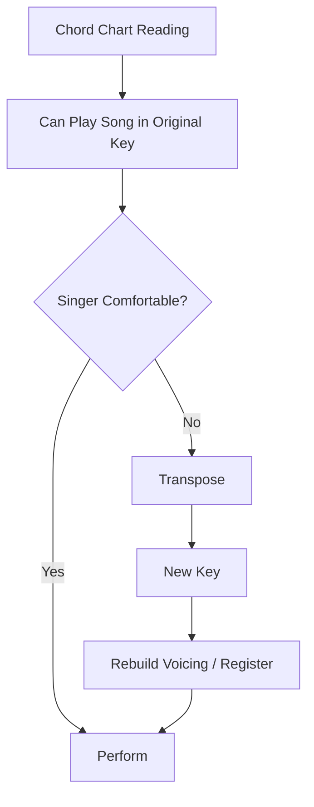
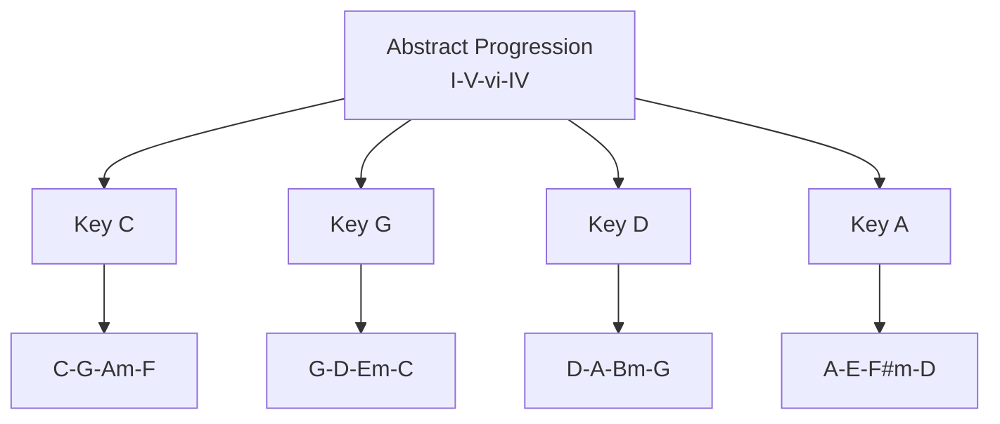
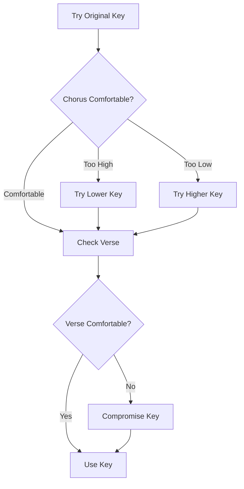
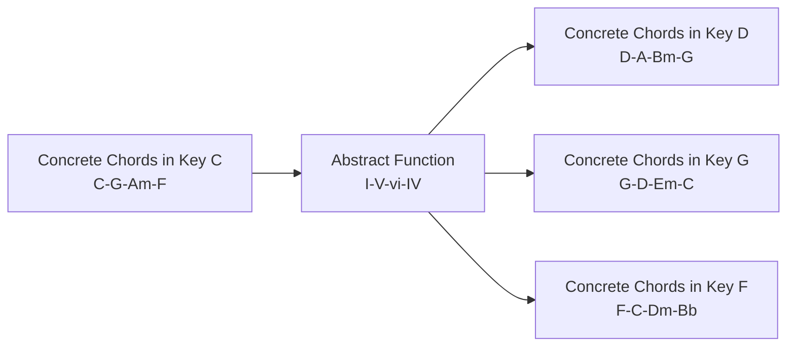
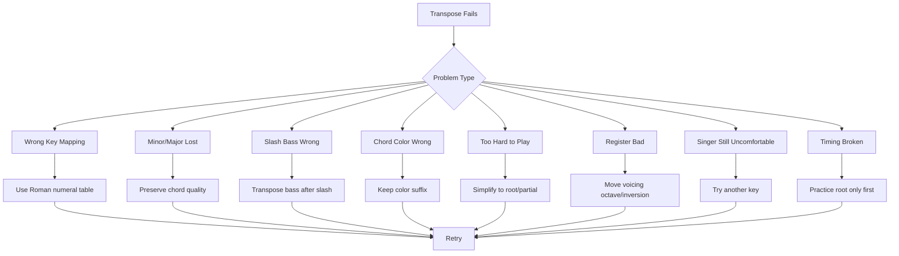
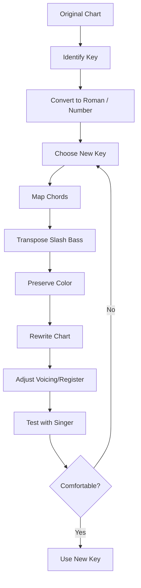

# learn-piano-accompaniment-part-021.md

# Part 021 — Transposition Dasar untuk Menyesuaikan Range Penyanyi

> Seri: **Learn Piano Accompaniment for Singer Performance**  
> Fokus: **belajar piano untuk mengiringi penyanyi**  
> Framework utama: **The First 20 Hours — Josh Kaufman**  
> Tahap: **Phase G — Dari Latihan ke Lagu Nyata**

---

## Status Seri

| Item | Status |
|---|---|
| Part | 021 |
| Nama file | `learn-piano-accompaniment-part-021.md` |
| Fokus | Transposition dasar, memindahkan chord chart ke key yang nyaman untuk penyanyi |
| Prasyarat | Part 000–020 |
| Output praktis | Bisa transpose progression dan chord chart sederhana naik/turun key untuk menyesuaikan range penyanyi |
| Status seri | Belum selesai |

---

## Daftar Isi

- [1. Tujuan Part Ini](#1-tujuan-part-ini)
- [2. Posisi Part Ini dalam Framework Kaufman](#2-posisi-part-ini-dalam-framework-kaufman)
- [3. Masalah Utama: Lagu Terlalu Tinggi atau Terlalu Rendah](#3-masalah-utama-lagu-terlalu-tinggi-atau-terlalu-rendah)
- [4. Mental Model: Transpose sebagai Mapping Namespace](#4-mental-model-transpose-sebagai-mapping-namespace)
- [5. Apa Itu Transposition?](#5-apa-itu-transposition)
- [6. Kenapa Transposition Penting untuk Pengiring Penyanyi?](#6-kenapa-transposition-penting-untuk-pengiring-penyanyi)
- [7. Key, Tonal Center, dan Vocal Comfort](#7-key-tonal-center-dan-vocal-comfort)
- [8. Naik Key vs Turun Key](#8-naik-key-vs-turun-key)
- [9. Semitone dan Whole Tone](#9-semitone-dan-whole-tone)
- [10. Chromatic Note Map](#10-chromatic-note-map)
- [11. Cara Transpose dengan Interval](#11-cara-transpose-dengan-interval)
- [12. Cara Transpose dengan Roman Numeral](#12-cara-transpose-dengan-roman-numeral)
- [13. Cara Transpose dengan Number System](#13-cara-transpose-dengan-number-system)
- [14. Mapping Diatonic Chords dalam Key C](#14-mapping-diatonic-chords-dalam-key-c)
- [15. Mapping Diatonic Chords dalam Key G](#15-mapping-diatonic-chords-dalam-key-g)
- [16. Mapping Diatonic Chords dalam Key D](#16-mapping-diatonic-chords-dalam-key-d)
- [17. Mapping Diatonic Chords dalam Key A](#17-mapping-diatonic-chords-dalam-key-a)
- [18. Mapping Diatonic Chords dalam Key F](#18-mapping-diatonic-chords-dalam-key-f)
- [19. Progression Umum dan Transpose](#19-progression-umum-dan-transpose)
- [20. Transpose `C–G–Am–F` ke Key Lain](#20-transpose-cgamf-ke-key-lain)
- [21. Transpose `Am–F–C–G` ke Key Lain](#21-transpose-amfcg-ke-key-lain)
- [22. Transpose `C–Am–F–G` ke Key Lain](#22-transpose-camfg-ke-key-lain)
- [23. Transpose `Dm–G–C` / `ii–V–I`](#23-transpose-dmgc--iiv-i)
- [24. Slash Chord Saat Transpose](#24-slash-chord-saat-transpose)
- [25. Chord Color Saat Transpose](#25-chord-color-saat-transpose)
- [26. Sus dan Add9 Saat Transpose](#26-sus-dan-add9-saat-transpose)
- [27. Cara Memilih Key yang Nyaman untuk Penyanyi](#27-cara-memilih-key-yang-nyaman-untuk-penyanyi)
- [28. Trial-and-Error Key Finding](#28-trial-and-error-key-finding)
- [29. Strategi Jika Penyanyi Minta Turun 1 Nada](#29-strategi-jika-penyanyi-minta-turun-1-nada)
- [30. Strategi Jika Penyanyi Minta Naik 1 Nada](#30-strategi-jika-penyanyi-minta-naik-1-nada)
- [31. Strategi Jika Tidak Bisa Transpose Cepat](#31-strategi-jika-tidak-bisa-transpose-cepat)
- [32. Menggunakan Roman Numeral sebagai Intermediate Representation](#32-menggunakan-roman-numeral-sebagai-intermediate-representation)
- [33. Membuat Transpose Table Sendiri](#33-membuat-transpose-table-sendiri)
- [34. Keyboard Geography untuk Transpose](#34-keyboard-geography-untuk-transpose)
- [35. Fingering dan Muscle Memory Setelah Transpose](#35-fingering-dan-muscle-memory-setelah-transpose)
- [36. Voicing Setelah Transpose](#36-voicing-setelah-transpose)
- [37. Register Setelah Transpose](#37-register-setelah-transpose)
- [38. Transpose dan Chord Chart Preparation](#38-transpose-dan-chord-chart-preparation)
- [39. Mini Case Study 1: Lagu Terlalu Tinggi, Turun dari C ke A](#39-mini-case-study-1-lagu-terlalu-tinggi-turun-dari-c-ke-a)
- [40. Mini Case Study 2: Lagu Terlalu Rendah, Naik dari C ke D](#40-mini-case-study-2-lagu-terlalu-rendah-naik-dari-c-ke-d)
- [41. Mini Case Study 3: Chart dengan Slash Chord dari C ke G](#41-mini-case-study-3-chart-dengan-slash-chord-dari-c-ke-g)
- [42. Latihan 1: Transpose Progression dengan Roman Numeral](#42-latihan-1-transpose-progression-dengan-roman-numeral)
- [43. Latihan 2: Transpose C ke G](#43-latihan-2-transpose-c-ke-g)
- [44. Latihan 3: Transpose C ke D](#44-latihan-3-transpose-c-ke-d)
- [45. Latihan 4: Transpose C ke A](#45-latihan-4-transpose-c-ke-a)
- [46. Latihan 5: Transpose Slash Chord](#46-latihan-5-transpose-slash-chord)
- [47. Latihan 6: Cari Key Nyaman dengan Penyanyi](#47-latihan-6-cari-key-nyaman-dengan-penyanyi)
- [48. Debugging Transposition](#48-debugging-transposition)
- [49. Failure Mode Pemula](#49-failure-mode-pemula)
- [50. Practice Protocol 45 Menit](#50-practice-protocol-45-menit)
- [51. Checklist Kelulusan Part 021](#51-checklist-kelulusan-part-021)
- [52. Ringkasan Mental Model](#52-ringkasan-mental-model)
- [53. Persiapan ke Part 022](#53-persiapan-ke-part-022)

---

# 1. Tujuan Part Ini

Pada Part 020, kita belajar membaca chord chart dan mengubah chart mentah menjadi chart performable.

Namun dalam situasi nyata, chord chart sering belum cukup karena penyanyi bisa berkata:

```text
Lagunya terlalu tinggi.
Bisa turunin?
```

atau:

```text
Ini terlalu rendah.
Bisa naikin satu nada?
```

Di sinilah kita butuh:

```text
transposition
```

Transposition adalah memindahkan lagu dari satu key ke key lain tanpa mengubah hubungan antar chord.

Target part ini:

> Anda mampu transpose progression dan chord chart sederhana ke key lain agar lebih sesuai dengan range penyanyi, sambil tetap menjaga fungsi chord, struktur lagu, pattern, dan support vokal.

Setelah part ini, Anda harus bisa:

- memahami konsep key;
- memahami naik/turun semitone;
- transpose progression `C-G-Am-F`;
- transpose progression `Am-F-C-G`;
- transpose chart dari C ke G, D, A, F;
- memahami slash chord saat transpose;
- memahami chord color saat transpose;
- memakai Roman numeral sebagai intermediate representation;
- memilih key yang lebih nyaman untuk penyanyi;
- membuat transpose table sederhana;
- punya strategi jika belum bisa transpose cepat saat live.

---

# 2. Posisi Part Ini dalam Framework Kaufman

Dalam *The First 20 Hours*, kita memprioritaskan sub-skill yang paling sering muncul dalam performa nyata.

Transposition sangat penting karena:

- penyanyi punya range berbeda;
- original key belum tentu nyaman;
- lagu pria sering terlalu rendah/tinggi untuk wanita, dan sebaliknya;
- acoustic performance sering butuh key adjustment;
- chart dari internet sering bukan key yang dipakai penyanyi;
- key yang nyaman membuat penyanyi lebih ekspresif;
- key yang salah membuat penyanyi tegang, fals, atau kelelahan.

Diagram posisi:



Dalam konteks Kaufman, kita tidak harus langsung menguasai semua key dengan sempurna.

Target 20 jam pertama:

```text
bisa transpose progression umum ke beberapa key praktis
dan tahu cara berpikirnya
```

Bukan:

```text
instant transpose semua lagu kompleks ke 12 key
```

---

# 3. Masalah Utama: Lagu Terlalu Tinggi atau Terlalu Rendah

Penyanyi bukan instrumen dengan range tak terbatas.

Setiap penyanyi punya:

- range bawah;
- range atas;
- comfortable range;
- warna suara terbaik;
- stamina;
- area klimaks;
- area lirik jelas;
- area rawan tegang.

## 3.1 Jika Lagu Terlalu Tinggi

Gejala:

- penyanyi memaksa high note;
- suara menegang;
- pitch naik/turun tidak stabil;
- lirik menjadi kurang jelas;
- penyanyi cepat lelah;
- chorus terdengar teriak;
- emosi hilang karena fokus bertahan.

Solusi umum:

```text
turunkan key
```

## 3.2 Jika Lagu Terlalu Rendah

Gejala:

- suara tidak keluar;
- nada bawah tidak terdengar;
- energi lagu hilang;
- verse terlalu gelap;
- pitch bawah goyah;
- penyanyi kehilangan projection.

Solusi umum:

```text
naikkan key
```

## 3.3 Key Nyaman Lebih Penting daripada Key Original

Original key bukan hukum.

Untuk accompaniment, key harus melayani penyanyi.

Prinsip:

```text
Key terbaik adalah key yang membuat penyanyi terdengar paling jujur, stabil, dan ekspresif.
```

---

# 4. Mental Model: Transpose sebagai Mapping Namespace

Untuk software engineer, transpose bisa dianggap sebagai mapping antar namespace.

Dalam key C:

```text
I = C
V = G
vi = Am
IV = F
```

Dalam key G:

```text
I = G
V = D
vi = Em
IV = C
```

Progression:

```text
I - V - vi - IV
```

tetap sama.

Yang berubah hanya nama chord berdasarkan namespace/key.

Analogi:

```text
Roman numeral = abstract interface
Chord symbol = concrete implementation per key
```

Diagram:



Ini adalah cara paling aman untuk transpose.

Daripada memindahkan chord satu per satu secara buta, ubah dulu ke fungsi:

```text
C-G-Am-F = I-V-vi-IV
```

Lalu mapping ke key baru.

---

# 5. Apa Itu Transposition?

Transposition adalah memindahkan semua nada/chord dalam lagu dengan jarak yang sama.

Jika lagu di C dinaikkan 2 semitone, maka:

```text
C -> D
G -> A
Am -> Bm
F -> G
```

Progression:

```text
C - G - Am - F
```

menjadi:

```text
D - A - Bm - G
```

Hubungan antar chord tetap sama.

## 5.1 Yang Berubah

- nama chord;
- posisi tangan;
- register;
- kemungkinan voicing;
- kenyamanan penyanyi;
- warna key;
- tingkat kesulitan piano.

## 5.2 Yang Tidak Berubah

- struktur lagu;
- fungsi progression;
- hubungan chord;
- rhythm;
- section map;
- pattern dasar;
- lyric;
- emotional arc.

## 5.3 Transpose Bukan Reharmonization

Transpose:

```text
semua chord dipindah dengan jarak sama
```

Reharmonization:

```text
chord diganti dengan fungsi/warna baru
```

Part ini hanya membahas transpose dasar.

---

# 6. Kenapa Transposition Penting untuk Pengiring Penyanyi?

Karena accompaniment harus melayani suara manusia.

## 6.1 Penyanyi Berbeda Range

Satu lagu bisa nyaman untuk satu penyanyi tetapi terlalu tinggi untuk penyanyi lain.

## 6.2 Gender Bukan Aturan Mutlak

Jangan asumsi:

```text
lagu pria selalu harus diturunkan untuk wanita
```

atau sebaliknya.

Yang penting adalah range individu.

## 6.3 Chorus Biasanya Menentukan Key

Bagian yang paling menentukan biasanya:

```text
highest note di chorus
```

Jika chorus terlalu tinggi, key harus turun.

Jika chorus kurang bertenaga karena terlalu rendah, key bisa naik.

## 6.4 Verse Juga Penting

Jangan hanya cek high note.

Jika key diturunkan terlalu banyak, verse bisa menjadi terlalu rendah.

## 6.5 Tujuan

Cari key di mana:

- verse tetap terdengar;
- chorus bisa naik tanpa memaksa;
- high note aman;
- low note tidak hilang;
- emosi natural;
- penyanyi tidak tegang.

---

# 7. Key, Tonal Center, dan Vocal Comfort

Key adalah pusat tonal lagu.

Dalam key C, chord C biasanya terasa seperti home.

Dalam key G, chord G terasa seperti home.

## 7.1 Tonal Center

Tonal center adalah rasa “pulang”.

Progression:

```text
C - G - Am - F
```

di key C terasa pulang ke C.

Jika transpose ke G:

```text
G - D - Em - C
```

terasa pulang ke G.

## 7.2 Vocal Comfort

Vocal comfort adalah area nada yang nyaman untuk penyanyi.

Penyanyi biasanya punya:

```text
low comfortable note
high comfortable note
best emotional zone
```

## 7.3 Key Terlalu Tinggi

High note di chorus berada di luar comfortable range.

## 7.4 Key Terlalu Rendah

Verse atau low phrase terlalu rendah dan tidak terdengar.

## 7.5 Practical Rule

Saat mencari key, fokus pada:

```text
chorus peak
verse low note
final chorus stamina
```

---

# 8. Naik Key vs Turun Key

## 8.1 Naik Key

Semua chord/nada naik.

Contoh dari C naik 2 semitone:

```text
C -> D
G -> A
Am -> Bm
F -> G
```

Efek untuk penyanyi:

```text
semua melodi naik
```

Cocok jika lagu terlalu rendah.

## 8.2 Turun Key

Semua chord/nada turun.

Contoh dari C turun 3 semitone:

```text
C -> A
G -> E
Am -> F#m
F -> D
```

Efek untuk penyanyi:

```text
semua melodi turun
```

Cocok jika lagu terlalu tinggi.

## 8.3 Jangan Turun/Naik Terlalu Jauh Tanpa Cek Verse

Jika turun banyak, chorus aman tetapi verse bisa terlalu rendah.

Jika naik banyak, verse enak tetapi chorus bisa terlalu tinggi.

## 8.4 Key Change Harus Dicoba

Secara teori bisa dihitung, tetapi final decision harus didengar.

---

# 9. Semitone dan Whole Tone

Semitone adalah jarak terkecil di piano antara dua tuts bersebelahan.

Contoh:

```text
C -> C#
E -> F
B -> C
```

Whole tone = 2 semitone.

Contoh:

```text
C -> D
G -> A
A -> B
```

## 9.1 Naik 1 Semitone

```text
C -> C#
G -> G#
Am -> A#m/Bbm
F -> F#
```

## 9.2 Naik 2 Semitone

```text
C -> D
G -> A
Am -> Bm
F -> G
```

## 9.3 Turun 1 Semitone

```text
C -> B
G -> F#
Am -> G#m
F -> E
```

## 9.4 Turun 2 Semitone

```text
C -> Bb
G -> F
Am -> Gm
F -> Eb
```

## 9.5 Practical Note

Transpose 1 semitone sering menghasilkan banyak sharp/flat.

Untuk pemula, transpose ke key yang lebih mudah seperti G, D, A, F, Bb secara bertahap.

---

# 10. Chromatic Note Map

Ada 12 nada dalam satu octave.

Dengan sharp:

```text
C  C#  D  D#  E  F  F#  G  G#  A  A#  B
```

Dengan flat:

```text
C  Db  D  Eb  E  F  Gb  G  Ab  A  Bb  B
```

## 10.1 Sharp dan Flat Bisa Enharmonic

```text
C# = Db
D# = Eb
F# = Gb
G# = Ab
A# = Bb
```

Nada sama secara tuts, nama berbeda tergantung konteks.

## 10.2 Untuk Pemula

Gunakan nama yang paling umum dalam key.

Contoh:

- Key F memakai `Bb`, bukan `A#`.
- Key D memakai `F#` dan `C#`.
- Key G memakai `F#`.
- Key Bb memakai `Bb` dan `Eb`.

## 10.3 Chromatic Transpose

Jika naik/turun semitone, pindahkan semua root chord di map chromatic.

Namun hati-hati quality chord tetap sama.

Contoh:

```text
Am naik 2 semitone = Bm
Fadd9 naik 2 semitone = Gadd9
G7 naik 2 semitone = A7
```

Quality:

```text
minor tetap minor
add9 tetap add9
7 tetap 7
```

---

# 11. Cara Transpose dengan Interval

Metode interval:

1. tentukan jarak transpose;
2. pindahkan setiap chord root dengan jarak itu;
3. pertahankan chord quality;
4. pindahkan bass slash juga;
5. cek enharmonic naming.

## 11.1 Contoh Naik 2 Semitone

Original:

```text
C - G - Am - F
```

Naik 2 semitone:

```text
C -> D
G -> A
A -> B
F -> G
```

Quality:

```text
Am -> Bm
```

Hasil:

```text
D - A - Bm - G
```

## 11.2 Contoh Turun 2 Semitone

Original:

```text
C - G - Am - F
```

Turun 2 semitone:

```text
C -> Bb
G -> F
A -> G
F -> Eb
```

Quality:

```text
Am -> Gm
```

Hasil:

```text
Bb - F - Gm - Eb
```

## 11.3 Slash Chord

Original:

```text
G/B
```

Naik 2 semitone:

```text
G -> A
B -> C#
```

Hasil:

```text
A/C#
```

## 11.4 Chord Color

Original:

```text
Fadd9
```

Naik 2 semitone:

```text
Gadd9
```

Color tetap.

## 11.5 Kelebihan

Metode interval cepat jika Anda familiar dengan chromatic map.

## 11.6 Kekurangan

Mudah salah enharmonic dan quality jika belum terbiasa.

---

# 12. Cara Transpose dengan Roman Numeral

Metode ini lebih musikal dan aman.

Langkah:

1. ubah chord ke Roman numeral dalam key asal;
2. pilih key baru;
3. mapping Roman numeral ke chord di key baru.

## 12.1 Contoh

Original key C:

```text
C - G - Am - F
```

Roman:

```text
I - V - vi - IV
```

Key baru D:

```text
I = D
V = A
vi = Bm
IV = G
```

Hasil:

```text
D - A - Bm - G
```

## 12.2 Kelebihan

- menjaga fungsi chord;
- mudah untuk progression umum;
- berguna untuk semua key;
- membantu memahami lagu.

## 12.3 Kekurangan

- harus tahu diatonic chords per key;
- chord non-diatonic butuh perhatian ekstra;
- slash chord/color tetap harus diproses.

## 12.4 Untuk Pemula

Gunakan Roman numeral untuk progression umum:

```text
I - V - vi - IV
vi - IV - I - V
I - vi - IV - V
ii - V - I
```

---

# 13. Cara Transpose dengan Number System

Number system mirip Roman numeral.

Dalam key C:

```text
1 = C
2m = Dm
3m = Em
4 = F
5 = G
6m = Am
```

Progression:

```text
C - G - Am - F
```

Menjadi:

```text
1 - 5 - 6m - 4
```

Di key G:

```text
1 = G
5 = D
6m = Em
4 = C
```

Hasil:

```text
G - D - Em - C
```

## 13.1 Kenapa Berguna?

Cepat dibaca dan mudah transpose.

## 13.2 Minimal Number Map

| Roman | Number |
|---|---|
| I | 1 |
| ii | 2m |
| iii | 3m |
| IV | 4 |
| V | 5 |
| vi | 6m |

## 13.3 Slash Chord dengan Number

`G/B` dalam key C:

```text
G = 5
B = 7
```

Bisa ditulis:

```text
5/7
```

Di key G:

```text
5 = D
7 = F#
```

Jadi:

```text
D/F#
```

---

# 14. Mapping Diatonic Chords dalam Key C

Key C:

```text
C D E F G A B
```

Diatonic chords:

| Degree | Roman | Chord |
|---:|---|---|
| 1 | I | C |
| 2 | ii | Dm |
| 3 | iii | Em |
| 4 | IV | F |
| 5 | V | G |
| 6 | vi | Am |
| 7 | vii° | Bdim |

Progression umum:

```text
I - V - vi - IV = C - G - Am - F
vi - IV - I - V = Am - F - C - G
I - vi - IV - V = C - Am - F - G
ii - V - I = Dm - G - C
```

Key C adalah key utama latihan karena tidak ada sharp/flat.

---

# 15. Mapping Diatonic Chords dalam Key G

Key G:

```text
G A B C D E F#
```

Diatonic chords:

| Degree | Roman | Chord |
|---:|---|---|
| 1 | I | G |
| 2 | ii | Am |
| 3 | iii | Bm |
| 4 | IV | C |
| 5 | V | D |
| 6 | vi | Em |
| 7 | vii° | F#dim |

Progression:

```text
I - V - vi - IV = G - D - Em - C
vi - IV - I - V = Em - C - G - D
I - vi - IV - V = G - Em - C - D
ii - V - I = Am - D - G
```

Key G relatif nyaman untuk piano karena hanya F#.

---

# 16. Mapping Diatonic Chords dalam Key D

Key D:

```text
D E F# G A B C#
```

Diatonic chords:

| Degree | Roman | Chord |
|---:|---|---|
| 1 | I | D |
| 2 | ii | Em |
| 3 | iii | F#m |
| 4 | IV | G |
| 5 | V | A |
| 6 | vi | Bm |
| 7 | vii° | C#dim |

Progression:

```text
I - V - vi - IV = D - A - Bm - G
vi - IV - I - V = Bm - G - D - A
I - vi - IV - V = D - Bm - G - A
ii - V - I = Em - A - D
```

Key D sering berguna untuk menaikkan lagu dari C satu whole tone.

---

# 17. Mapping Diatonic Chords dalam Key A

Key A:

```text
A B C# D E F# G#
```

Diatonic chords:

| Degree | Roman | Chord |
|---:|---|---|
| 1 | I | A |
| 2 | ii | Bm |
| 3 | iii | C#m |
| 4 | IV | D |
| 5 | V | E |
| 6 | vi | F#m |
| 7 | vii° | G#dim |

Progression:

```text
I - V - vi - IV = A - E - F#m - D
vi - IV - I - V = F#m - D - A - E
I - vi - IV - V = A - F#m - D - E
ii - V - I = Bm - E - A
```

Key A berguna tetapi punya lebih banyak sharp. Latih perlahan.

---

# 18. Mapping Diatonic Chords dalam Key F

Key F:

```text
F G A Bb C D E
```

Diatonic chords:

| Degree | Roman | Chord |
|---:|---|---|
| 1 | I | F |
| 2 | ii | Gm |
| 3 | iii | Am |
| 4 | IV | Bb |
| 5 | V | C |
| 6 | vi | Dm |
| 7 | vii° | Edim |

Progression:

```text
I - V - vi - IV = F - C - Dm - Bb
vi - IV - I - V = Dm - Bb - F - C
I - vi - IV - V = F - Dm - Bb - C
ii - V - I = Gm - C - F
```

Key F berguna untuk menurunkan/menaikkan lagu ke area yang lebih nyaman dan mulai melatih flat.

---

# 19. Progression Umum dan Transpose

Kuasai beberapa progression sebagai pattern abstrak.

## 19.1 I–V–vi–IV

C:

```text
C - G - Am - F
```

G:

```text
G - D - Em - C
```

D:

```text
D - A - Bm - G
```

A:

```text
A - E - F#m - D
```

F:

```text
F - C - Dm - Bb
```

## 19.2 vi–IV–I–V

C:

```text
Am - F - C - G
```

G:

```text
Em - C - G - D
```

D:

```text
Bm - G - D - A
```

A:

```text
F#m - D - A - E
```

F:

```text
Dm - Bb - F - C
```

## 19.3 I–vi–IV–V

C:

```text
C - Am - F - G
```

G:

```text
G - Em - C - D
```

D:

```text
D - Bm - G - A
```

A:

```text
A - F#m - D - E
```

F:

```text
F - Dm - Bb - C
```

## 19.4 ii–V–I

C:

```text
Dm - G - C
```

G:

```text
Am - D - G
```

D:

```text
Em - A - D
```

A:

```text
Bm - E - A
```

F:

```text
Gm - C - F
```

---

# 20. Transpose `C–G–Am–F` ke Key Lain

Original key C:

```text
C - G - Am - F
```

Function:

```text
I - V - vi - IV
```

## 20.1 Ke G

```text
G - D - Em - C
```

## 20.2 Ke D

```text
D - A - Bm - G
```

## 20.3 Ke A

```text
A - E - F#m - D
```

## 20.4 Ke F

```text
F - C - Dm - Bb
```

## 20.5 Ke Bb

Key Bb:

```text
Bb - F - Gm - Eb
```

## 20.6 Practice Note

Jangan hanya tulis. Mainkan.

Mulai dengan:

```text
LH root only
```

Lalu:

```text
LH root + RH partial
```

---

# 21. Transpose `Am–F–C–G` ke Key Lain

Original key C:

```text
Am - F - C - G
```

Function:

```text
vi - IV - I - V
```

## 21.1 Ke G

```text
Em - C - G - D
```

## 21.2 Ke D

```text
Bm - G - D - A
```

## 21.3 Ke A

```text
F#m - D - A - E
```

## 21.4 Ke F

```text
Dm - Bb - F - C
```

## 21.5 Rasa

Progression ini sering dipakai untuk verse emosional.

Saat transpose, rasa progression tetap sama jika hubungan fungsi tetap sama.

---

# 22. Transpose `C–Am–F–G` ke Key Lain

Original key C:

```text
C - Am - F - G
```

Function:

```text
I - vi - IV - V
```

## 22.1 Ke G

```text
G - Em - C - D
```

## 22.2 Ke D

```text
D - Bm - G - A
```

## 22.3 Ke A

```text
A - F#m - D - E
```

## 22.4 Ke F

```text
F - Dm - Bb - C
```

## 22.5 Kegunaan

Progression ini cocok untuk ballad klasik, intro, atau lagu sederhana.

---

# 23. Transpose `Dm–G–C` / `ii–V–I`

Original key C:

```text
Dm - G - C
```

Function:

```text
ii - V - I
```

## 23.1 Ke G

```text
Am - D - G
```

## 23.2 Ke D

```text
Em - A - D
```

## 23.3 Ke A

```text
Bm - E - A
```

## 23.4 Ke F

```text
Gm - C - F
```

## 23.5 Dengan Seventh

C:

```text
Dm7 - G7 - Cmaj7
```

G:

```text
Am7 - D7 - Gmaj7
```

D:

```text
Em7 - A7 - Dmaj7
```

A:

```text
Bm7 - E7 - Amaj7
```

F:

```text
Gm7 - C7 - Fmaj7
```

---

# 24. Slash Chord Saat Transpose

Slash chord punya dua bagian:

```text
Chord / Bass
```

Saat transpose, keduanya harus dipindahkan.

## 24.1 Contoh C ke G

Original:

```text
C - G/B - Am - F
```

Function:

```text
I - V/7 - vi - IV
```

Di key G:

```text
G - D/F# - Em - C
```

Kenapa?

```text
G/B:
G chord = V dalam C
B bass = scale degree 7 dalam C
```

Dalam key G:

```text
V = D
7 = F#
```

Jadi:

```text
D/F#
```

## 24.2 Contoh C/E ke F

Original:

```text
C/E - F - G - C
```

Dalam key G:

```text
G/B - C - D - G
```

## 24.3 Aturan Praktis

Jika pakai interval:

```text
transpose chord root
transpose bass note
quality tetap
```

Contoh naik 2 semitone:

```text
G/B -> A/C#
C/E -> D/F#
F/A -> G/B
```

## 24.4 Jika Bingung

Sederhanakan slash chord menjadi chord biasa.

Contoh:

```text
G/B -> G
```

Tetapi jika bass line penting, latih perlahan.

---

# 25. Chord Color Saat Transpose

Chord color tetap dipertahankan.

## 25.1 Major7

```text
Cmaj7 -> Dmaj7
```

jika naik 2 semitone.

## 25.2 Minor7

```text
Am7 -> Bm7
```

jika naik 2 semitone.

## 25.3 Dominant7

```text
G7 -> A7
```

jika naik 2 semitone.

## 25.4 Add9

```text
Fadd9 -> Gadd9
```

jika naik 2 semitone.

## 25.5 Sus4

```text
Gsus4 -> Asus4
```

jika naik 2 semitone.

## 25.6 Rule

```text
Root berubah.
Quality/color tetap.
```

Contoh:

```text
Fmaj7 turun 2 semitone = Ebmaj7
Am7 turun 2 semitone = Gm7
Cadd9 turun 2 semitone = Bbadd9
```

---

# 26. Sus dan Add9 Saat Transpose

## 26.1 Sus

Original:

```text
Gsus4 - G - C
```

Naik ke key D dari key C, progression function:

```text
Vsus4 - V - I
```

Dalam key D:

```text
Asus4 - A - D
```

## 26.2 Add9

Original:

```text
Cadd9 - G - Am7 - Fadd9
```

Key G:

```text
Gadd9 - D - Em7 - Cadd9
```

Key D:

```text
Dadd9 - A - Bm7 - Gadd9
```

## 26.3 Shell Voicing Setelah Transpose

Cadd9:

```text
LH C, RH E-D
```

Dadd9:

```text
LH D, RH F#-E
```

Gadd9:

```text
LH G, RH B-A
```

## 26.4 Prinsip

Setelah transpose, jangan hanya tahu nama chord.

Cari lagi voicing yang nyaman.

---

# 27. Cara Memilih Key yang Nyaman untuk Penyanyi

Memilih key tidak hanya berdasarkan “naik/turun berapa”.

Dengarkan penyanyi.

## 27.1 Cek Chorus Peak

Nyanyikan chorus.

Tanya:

```text
apakah high note terasa dipaksa?
```

Jika ya, turunkan.

## 27.2 Cek Verse Low Note

Nyanyikan verse.

Tanya:

```text
apakah low note masih terdengar jelas?
```

Jika tidak, naikkan.

## 27.3 Cek Final Chorus

Penyanyi mungkin bisa high note sekali, tetapi tidak kuat saat final chorus.

Cek stamina.

## 27.4 Cek Emosi

Key yang nyaman bukan hanya key yang “bisa”.

Key terbaik membuat emosi keluar natural.

## 27.5 Tanya Penyanyi

Pertanyaan sederhana:

```text
Yang ini terasa terlalu tinggi?
Kalau turun satu nada lebih nyaman?
Verse-nya masih enak kalau diturunkan?
Chorus-nya masih punya tenaga?
```

## 27.6 Rule

```text
Pilih key berdasarkan keseluruhan lagu, bukan satu nada saja.
```

---

# 28. Trial-and-Error Key Finding

Cara praktis menemukan key.

## 28.1 Mulai dari Chart Original

Main chorus dalam key original.

Penyanyi coba.

## 28.2 Jika Terlalu Tinggi

Turun:

```text
1 semitone
2 semitone
3 semitone
```

Coba chorus lagi.

## 28.3 Jika Terlalu Rendah

Naik:

```text
1 semitone
2 semitone
```

Coba chorus.

## 28.4 Cek Verse

Setelah chorus nyaman, cek verse.

## 28.5 Cek Transition

Pastikan transition dan ending tetap nyaman.

## 28.6 Jangan Terlalu Lama

Dalam rehearsal, pilih 2–3 opsi key.

Jangan mencoba semua key tanpa arah.

## 28.7 Practical Workflow



---

# 29. Strategi Jika Penyanyi Minta Turun 1 Nada

Dalam bahasa sehari-hari Indonesia, “turun satu nada” bisa ambigu.

Bisa berarti:

```text
turun 1 semitone
```

atau:

```text
turun 1 whole tone / 2 semitone
```

## 29.1 Klarifikasi

Tanyakan saat rehearsal:

```text
Maksudnya turun setengah nada atau satu nada penuh?
```

Namun jika konteks cepat, coba turunkan 1 whole tone dulu jika mereka bilang “satu nada”.

## 29.2 Contoh Turun 1 Whole Tone dari C

```text
C - G - Am - F
```

menjadi:

```text
Bb - F - Gm - Eb
```

## 29.3 Contoh Turun 1 Semitone dari C

```text
B - F# - G#m - E
```

Ini lebih sulit untuk pemula.

## 29.4 Practical Strategy

Jika turun 1 semitone terlalu sulit, cari key yang lebih mudah dan tetap nyaman:

- C turun ke Bb;
- C turun ke A;
- G turun ke F;
- D turun ke C.

## 29.5 Rule

```text
Di rehearsal, cari key yang nyaman dan playable.
Di live, jangan ambil transpose yang membuat Anda runtuh.
```

---

# 30. Strategi Jika Penyanyi Minta Naik 1 Nada

Sama seperti turun, “naik satu nada” bisa berarti 1 semitone atau 1 whole tone.

## 30.1 Naik 1 Whole Tone dari C

```text
C - G - Am - F
```

menjadi:

```text
D - A - Bm - G
```

Ini cukup playable.

## 30.2 Naik 1 Semitone dari C

```text
Db - Ab - Bbm - Gb
```

atau:

```text
C# - G# - A#m - F#
```

Lebih sulit untuk pemula.

## 30.3 Practical Key

Jika original C dan butuh naik sedikit, D sering lebih praktis daripada Db.

Namun suara penyanyi menentukan.

## 30.4 Jika Harus Naik Semitone

Strategi survival:

- pakai root only dulu;
- RH partial;
- sederhanakan color;
- latihan chart baru;
- jangan memakai voicing rumit.

---

# 31. Strategi Jika Tidak Bisa Transpose Cepat

Ini realistis.

Tidak semua pengiring pemula bisa transpose spontan.

## 31.1 Jangan Berbohong

Jika rehearsal:

```text
Aku bisa coba, tapi perlu tulis ulang chart sebentar.
```

Ini lebih baik daripada memaksa lalu kacau.

## 31.2 Gunakan Roman Numeral

Ubah cepat:

```text
C-G-Am-F = I-V-vi-IV
```

Lalu mapping ke key baru.

## 31.3 Pakai Key yang Sudah Dilatih

Latih key prioritas:

```text
C
G
D
A
F
Bb
```

## 31.4 Root Only First

Jika mendadak harus transpose:

```text
LH root only
```

lebih aman.

## 31.5 Simplify Chord

Hilangkan:

- maj7;
- add9;
- sus yang tidak wajib;
- slash chord sulit.

Sementara pakai triad/root.

## 31.6 Rewrite Chart

Jika ada waktu, tulis chart baru.

Jangan transpose di kepala jika belum stabil.

---

# 32. Menggunakan Roman Numeral sebagai Intermediate Representation

Ini metode paling rapi.

Raw chord:

```text
C - G - Am - F
```

Step 1:

```text
I - V - vi - IV
```

Step 2, key D:

```text
D - A - Bm - G
```

## 32.1 Diagram



## 32.2 Manfaat

- mengurangi kesalahan;
- membantu memahami lagu;
- memudahkan transpose;
- membuat pattern progression dikenali.

## 32.3 Kapan Sulit?

Jika lagu banyak chord non-diatonic:

```text
E7
Bb
bVII
secondary dominant
borrowed chord
```

Tetap bisa, tetapi butuh teori lebih lanjut.

Untuk sekarang, fokus lagu diatonic/pop umum.

---

# 33. Membuat Transpose Table Sendiri

Buat tabel untuk key yang sering dipakai.

## 33.1 Template

| Degree | C | G | D | A | F |
|---|---|---|---|---|---|
| I | C | G | D | A | F |
| ii | Dm | Am | Em | Bm | Gm |
| iii | Em | Bm | F#m | C#m | Am |
| IV | F | C | G | D | Bb |
| V | G | D | A | E | C |
| vi | Am | Em | Bm | F#m | Dm |

## 33.2 Gunakan untuk Progression

Jika progression:

```text
vi - IV - I - V
```

Lihat row:

```text
vi, IV, I, V
```

Untuk key D:

```text
Bm - G - D - A
```

## 33.3 Print atau Simpan

Buat cheat sheet.

Untuk tahap awal, cheat sheet bukan curang. Ini training tool.

## 33.4 Target Akhir

Lama-lama Anda tidak perlu melihat tabel karena pattern internalized.

---

# 34. Keyboard Geography untuk Transpose

Transpose mengubah bentuk tangan.

Chord C:

```text
C E G
```

Chord D:

```text
D F# A
```

Chord G:

```text
G B D
```

Chord A:

```text
A C# E
```

## 34.1 Jangan Hanya Tulis, Harus Rasakan

Setiap key punya geography berbeda.

Latih:

```text
LH root
RH partial
RH triad
inversion
```

## 34.2 Key dengan Sharp

D, A, E memakai black keys.

Jangan takut black keys.

Black keys bisa membantu fingering karena bentuknya terasa jelas.

## 34.3 Key dengan Flat

F, Bb, Eb memakai flat.

Biasakan membaca `Bb`, bukan berpikir `A#` terus.

## 34.4 Practice

Main I-V-vi-IV di beberapa key.

Tidak perlu cepat.

Fokus:

- root benar;
- chord quality benar;
- timing stabil;
- tangan rileks.

---

# 35. Fingering dan Muscle Memory Setelah Transpose

Saat transpose, muscle memory lama tidak berlaku persis.

Progression C:

```text
C - G - Am - F
```

sangat familiar.

Transpose ke D:

```text
D - A - Bm - G
```

Tangan harus belajar bentuk baru.

## 35.1 Jangan Ekspektasi Langsung Lancar

Transpose membutuhkan latihan ulang.

## 35.2 Mulai dengan Root Only

```text
LH: D - A - B - G
```

## 35.3 Tambahkan RH Partial

```text
D: F#-A
A: C#-E
Bm: D-F#
G: B-D
```

## 35.4 Tambahkan Pattern

Baru setelah chord change stabil.

## 35.5 Rule

```text
Transpose chart dulu.
Latih root.
Latih chord.
Baru latih pattern.
```

---

# 36. Voicing Setelah Transpose

Voicing tidak selalu bisa dipindah secara mekanis tanpa dipikir.

Cadd9:

```text
LH C
RH E-G-D
```

Naik ke Dadd9:

```text
LH D
RH F#-A-E
```

Secara teori benar.

Tetapi register dan fingering harus dicek.

## 36.1 Partial Voicing

Gunakan:

```text
Dadd9: LH D, RH F#-E
```

Jika full terlalu sulit.

## 36.2 Inversion

Pilih inversion yang dekat dalam key baru.

Jangan selalu copy exact shape dari key lama.

## 36.3 Top Note

Top note berubah setelah transpose.

Pastikan tidak menabrak vokal.

## 36.4 Register

Jika transpose naik, RH bisa menjadi terlalu tinggi.

Jika transpose turun, RH bisa menjadi terlalu rendah/muddy.

Atur ulang register.

---

# 37. Register Setelah Transpose

Transpose memengaruhi register.

## 37.1 Jika Lagu Dinaikkan

Semua chord naik.

Risiko:

- RH terlalu tinggi;
- top note menabrak vokal;
- sound terlalu bright.

Solusi:

- pakai inversion lebih rendah;
- RH partial;
- jangan fill tinggi.

## 37.2 Jika Lagu Diturunkan

Semua chord turun.

Risiko:

- LH terlalu rendah;
- pedal muddy;
- RH terlalu gelap;
- verse kurang jelas.

Solusi:

- LH naik octave;
- RH middle register;
- kurangi pedal;
- pakai voicing lebih terbuka tapi bersih.

## 37.3 Rule

```text
Transpose key, bukan berarti semua voicing harus pindah ke register ekstrem.
Atur ulang register agar tetap vokal-friendly.
```

---

# 38. Transpose dan Chord Chart Preparation

Setelah memilih key baru, tulis chart baru.

Jangan hanya coret-coret di kepala jika belum terbiasa.

## 38.1 Workflow

```text
1. Original chart
2. Identify key
3. Convert progression to Roman/number
4. Choose new key
5. Map chords
6. Rewrite chart
7. Simplify if needed
8. Mark voicing/pattern/cue
9. Practice root only
10. Practice with vocal
```

## 38.2 Example

Original:

```text
Key C
[Chorus]
| Cadd9 | G | Am7 | Fadd9 |
```

Transpose ke D:

```text
Key D
[Chorus]
| Dadd9 | A | Bm7 | Gadd9 |
```

## 38.3 Slash Example

Original:

```text
| C | G/B | Am | F |
```

Transpose ke D:

```text
| D | A/C# | Bm | G |
```

## 38.4 Mark Key Baru

Jangan lupa:

```text
Key: D
```

di atas chart.

---

# 39. Mini Case Study 1: Lagu Terlalu Tinggi, Turun dari C ke A

## 39.1 Original

```text
Key: C

[Verse]
| Am | F | C | G | x2

[Chorus]
| C | G | Am | F | x2
```

Penyanyi merasa chorus terlalu tinggi.

Coba turun ke A.

## 39.2 Mapping

Key C to A berarti original function tetap.

Verse:

```text
vi - IV - I - V
```

Dalam key A:

```text
F#m - D - A - E
```

Chorus:

```text
I - V - vi - IV
```

Dalam key A:

```text
A - E - F#m - D
```

## 39.3 New Chart

```text
Key: A

[Verse]
| F#m | D | A | E | x2

[Chorus]
| A | E | F#m | D | x2
```

## 39.4 Piano Strategy

Jika F#m sulit:

- LH F#;
- RH A-C#;
- atau root only dulu.

Voicing:

```text
Aadd9: LH A, RH C#-E-B
E: LH E, RH G#-B
F#m7: LH F#, RH A-E
Dadd9: LH D, RH F#-A-E
```

## 39.5 Cek Verse

Pastikan verse tidak terlalu rendah setelah turun.

---

# 40. Mini Case Study 2: Lagu Terlalu Rendah, Naik dari C ke D

## 40.1 Original

```text
Key: C
[Chorus]
| C | G | Am | F |
```

Penyanyi merasa terlalu rendah.

Naik 1 whole tone ke D.

## 40.2 Mapping

```text
I - V - vi - IV
```

Dalam D:

```text
D - A - Bm - G
```

## 40.3 New Chart

```text
Key: D
[Chorus]
| D | A | Bm | G |
```

## 40.4 With Color

Original:

```text
Cadd9 - G - Am7 - Fadd9
```

Transpose:

```text
Dadd9 - A - Bm7 - Gadd9
```

## 40.5 Piano Strategy

Use partial:

```text
Dadd9: LH D, RH F#-E
A: LH A, RH C#-E
Bm7: LH B, RH D-A
Gadd9: LH G, RH B-A
```

## 40.6 Cek Chorus Peak

Pastikan naik ke D tidak membuat chorus terlalu tinggi.

---

# 41. Mini Case Study 3: Chart dengan Slash Chord dari C ke G

## 41.1 Original

```text
Key: C

[Verse]
| C | G/B | Am | F |
```

## 41.2 Function

```text
I - V/7 - vi - IV
```

Bass:

```text
1 - 7 - 6 - 4
```

## 41.3 Key G Mapping

```text
I = G
V = D
7 = F#
vi = Em
IV = C
```

Hasil:

```text
| G | D/F# | Em | C |
```

## 41.4 LH

```text
G - F# - E - C
```

## 41.5 RH

```text
G: B-D
D/F#: A-D or F#-A-D
Em: G-B
C: E-G
```

## 41.6 Jika Sulit

Sederhanakan sementara:

```text
G - D - Em - C
```

Tetapi latih `D/F#` karena bass `G-F#-E` sangat smooth.

---

# 42. Latihan 1: Transpose Progression dengan Roman Numeral

Tulis progression berikut ke Roman numeral.

## 42.1 Progression A

```text
C - G - Am - F
```

Jawaban:

```text
I - V - vi - IV
```

## 42.2 Progression B

```text
Am - F - C - G
```

Jawaban:

```text
vi - IV - I - V
```

## 42.3 Progression C

```text
C - Am - F - G
```

Jawaban:

```text
I - vi - IV - V
```

## 42.4 Progression D

```text
Dm - G - C
```

Jawaban:

```text
ii - V - I
```

## 42.5 Tugas

Transpose masing-masing ke key G, D, F.

---

# 43. Latihan 2: Transpose C ke G

Transpose chart:

```text
Key: C

[Verse]
| Am | F | C | G | x2

[Chorus]
| C | G | Am | F | x2

[Ending]
| F | G | C |
```

Ke key G.

## 43.1 Jawaban

```text
Key: G

[Verse]
| Em | C | G | D | x2

[Chorus]
| G | D | Em | C | x2

[Ending]
| C | D | G |
```

## 43.2 Mainkan

Step:

1. LH root only.
2. RH partial.
3. pattern verse sparse.
4. chorus fuller.
5. ending.

## 43.3 Evaluasi

- apakah F# muncul di chord D?
- apakah Em terasa minor?
- apakah ending C-D-G jelas?

---

# 44. Latihan 3: Transpose C ke D

Chart sama, transpose ke D.

## 44.1 Jawaban

```text
Key: D

[Verse]
| Bm | G | D | A | x2

[Chorus]
| D | A | Bm | G | x2

[Ending]
| G | A | D |
```

## 44.2 With Color

```text
Bm7 - Gadd9 - Dadd9 - A
Dadd9 - A - Bm7 - Gadd9
Gadd9 - Asus4 A - Dadd9
```

## 44.3 Mainkan

Mulai simple.

Chord Bm:

```text
LH B
RH D-F#
```

Chord A:

```text
LH A
RH C#-E
```

## 44.4 Evaluasi

- apakah C# dan F# benar?
- apakah Bm tidak tertukar B major?
- apakah voicing tetap nyaman?

---

# 45. Latihan 4: Transpose C ke A

Chart sama, transpose ke A.

## 45.1 Jawaban

```text
Key: A

[Verse]
| F#m | D | A | E | x2

[Chorus]
| A | E | F#m | D | x2

[Ending]
| D | E | A |
```

## 45.2 Chord Notes

```text
A = A C# E
E = E G# B
F#m = F# A C#
D = D F# A
```

## 45.3 Mainkan

Step:

1. LH root.
2. RH partial.
3. block chord.
4. pattern.

## 45.4 Evaluasi

- apakah F#m benar?
- apakah G# di E benar?
- apakah key A terlalu banyak black keys untuk tempo Anda?
- apakah penyanyi nyaman?

---

# 46. Latihan 5: Transpose Slash Chord

Transpose:

```text
C - G/B - Am - F
```

## 46.1 Ke G

```text
G - D/F# - Em - C
```

## 46.2 Ke D

```text
D - A/C# - Bm - G
```

## 46.3 Ke A

```text
A - E/G# - F#m - D
```

## 46.4 Ke F

```text
F - C/E - Dm - Bb
```

## 46.5 Latihan LH

Main bass saja:

C key:

```text
C - B - A - F
```

G key:

```text
G - F# - E - C
```

D key:

```text
D - C# - B - G
```

A key:

```text
A - G# - F# - D
```

F key:

```text
F - E - D - Bb
```

## 46.6 Tujuan

Mendengar bass movement saat transpose.

---

# 47. Latihan 6: Cari Key Nyaman dengan Penyanyi

Jika ada penyanyi, lakukan latihan ini.

## 47.1 Pilih Lagu Sederhana

Gunakan chorus dengan progression:

```text
C - G - Am - F
```

## 47.2 Coba Key C

Penyanyi nyanyikan chorus.

Tanya:

```text
terlalu tinggi/rendah?
```

## 47.3 Coba Key D

```text
D - A - Bm - G
```

## 47.4 Coba Key Bb atau A jika Perlu Turun

Bb:

```text
Bb - F - Gm - Eb
```

A:

```text
A - E - F#m - D
```

## 47.5 Cek Verse

Setelah chorus nyaman, cek verse.

## 47.6 Catat

```text
Song:
Original key:
Tried keys:
Best key:
Reason:
Problem notes:
```

## 47.7 Tujuan

Melatih transpose sebagai service untuk penyanyi, bukan teori abstrak.

---

# 48. Debugging Transposition

Jika transpose kacau, debug layer.



## 48.1 Wrong Key Mapping

Solusi:

```text
ubah ke Roman numeral dulu
```

## 48.2 Minor/Major Hilang

Contoh salah:

```text
Am -> B
```

Padahal naik 2 semitone:

```text
Am -> Bm
```

Quality harus tetap.

## 48.3 Slash Bass Salah

`G/B` naik ke D key bukan hanya `A`.

Harus:

```text
A/C#
```

## 48.4 Chord Color Salah

`Fadd9` naik ke D key dari C menjadi:

```text
Gadd9
```

Bukan hanya G polos jika ingin mempertahankan color.

## 48.5 Terlalu Sulit

Sederhanakan.

Root + partial dulu.

## 48.6 Register Buruk

Atur octave dan inversion.

Transpose turun bisa muddy. Transpose naik bisa terlalu bright.

## 48.7 Penyanyi Masih Tidak Nyaman

Coba key lain. Jangan memaksakan key karena pianis nyaman.

---

# 49. Failure Mode Pemula

## 49.1 Mengubah Root tetapi Lupa Quality

```text
Am -> B
```

Salah jika seharusnya:

```text
Am -> Bm
```

## 49.2 Lupa Transpose Slash Bass

```text
G/B -> A/B
```

Salah untuk naik 2 semitone.

Yang benar:

```text
A/C#
```

## 49.3 Terlalu Bergantung pada Bentuk Tangan Key C

Saat pindah key, bentuk chord berubah.

Latih key baru perlahan.

## 49.4 Menolak Transpose karena Original Key

Penyanyi lebih penting daripada original key.

## 49.5 Menganggap Key Nyaman hanya Berdasarkan Chorus

Verse juga harus dicek.

## 49.6 Transpose di Kepala Saat Belum Siap

Tulis chart baru.

## 49.7 Memaksakan Chord Color di Key Baru

Jika color membuat sulit, pakai triad dulu.

## 49.8 Register Tidak Disesuaikan

Transpose bukan hanya nama chord. Voicing/register harus diatur ulang.

## 49.9 Tidak Punya Cheat Sheet

Untuk pemula, transpose table sangat membantu.

## 49.10 Panik dengan Black Keys

Black keys bukan musuh. Mereka bagian dari geography piano.

---

# 50. Practice Protocol 45 Menit

Gunakan sesi ini untuk Part 021.

## 50.1 Menit 0–5: Roman Numeral Review

Ubah progression:

```text
C-G-Am-F
Am-F-C-G
C-Am-F-G
Dm-G-C
```

ke Roman numeral.

## 50.2 Menit 5–10: Key Mapping Drill

Baca tabel key:

```text
C, G, D, A, F
```

Untuk degree:

```text
I, IV, V, vi, ii
```

## 50.3 Menit 10–15: Transpose C-G-Am-F

Mainkan dalam:

```text
C
G
D
F
```

LH root only.

## 50.4 Menit 15–20: Add RH Partial

Mainkan progression yang sama dengan RH partial.

## 50.5 Menit 20–25: Transpose Verse Progression

Mainkan:

```text
Am-F-C-G
```

ke:

```text
Em-C-G-D
Bm-G-D-A
Dm-Bb-F-C
```

## 50.6 Menit 25–30: Slash Chord Drill

Mainkan:

```text
C - G/B - Am - F
G - D/F# - Em - C
D - A/C# - Bm - G
```

LH root/bass dulu.

## 50.7 Menit 30–35: Chord Color Drill

Transpose:

```text
Cadd9 - G - Am7 - Fadd9
```

ke:

```text
Gadd9 - D - Em7 - Cadd9
Dadd9 - A - Bm7 - Gadd9
```

## 50.8 Menit 35–40: Rewrite Chart

Ambil chart key C.

Tulis ulang ke key D atau G.

Tambahkan:

- key;
- section;
- cue;
- ending.

## 50.9 Menit 40–45: Record and Review

Mainkan chart transposed sambil humming.

Jawab:

- apakah chord benar?
- apakah minor/major quality benar?
- apakah slash bass benar?
- apakah timing stabil?
- apakah key terasa lebih tinggi/rendah?
- apakah voicing/register masih nyaman?
- apakah penyanyi hipotetis akan nyaman?

---

# 51. Checklist Kelulusan Part 021

Anda boleh lanjut ke Part 022 jika sebagian besar checklist ini terpenuhi.

## 51.1 Pemahaman

- [ ] Saya tahu transposition berarti memindahkan lagu ke key lain dengan hubungan chord tetap sama.
- [ ] Saya tahu key harus melayani range penyanyi.
- [ ] Saya tahu semitone dan whole tone.
- [ ] Saya tahu chord quality harus tetap saat transpose.
- [ ] Saya tahu `C-G-Am-F` adalah `I-V-vi-IV`.
- [ ] Saya tahu `Am-F-C-G` adalah `vi-IV-I-V`.
- [ ] Saya tahu `C-Am-F-G` adalah `I-vi-IV-V`.
- [ ] Saya tahu `Dm-G-C` adalah `ii-V-I`.
- [ ] Saya tahu slash chord harus transpose chord dan bass-nya.
- [ ] Saya tahu chord color seperti add9, maj7, m7, sus tetap dipertahankan sebagai suffix.

## 51.2 Praktik

- [ ] Saya bisa transpose `C-G-Am-F` ke G.
- [ ] Saya bisa transpose `C-G-Am-F` ke D.
- [ ] Saya bisa transpose `C-G-Am-F` ke A.
- [ ] Saya bisa transpose `C-G-Am-F` ke F.
- [ ] Saya bisa transpose `Am-F-C-G` ke G.
- [ ] Saya bisa transpose `Am-F-C-G` ke D.
- [ ] Saya bisa transpose `Dm-G-C` ke G dan D.
- [ ] Saya bisa membaca `G/B` sebagai G chord dengan B bass.
- [ ] Saya bisa transpose `C-G/B-Am-F` ke `G-D/F#-Em-C`.
- [ ] Saya bisa menulis ulang chart sederhana ke key baru.

## 51.3 Self-Correction

- [ ] Saya bisa mendeteksi jika minor berubah menjadi major secara salah.
- [ ] Saya bisa mendeteksi jika slash bass belum ditranspose.
- [ ] Saya bisa menyederhanakan chord color saat key baru terlalu sulit.
- [ ] Saya bisa memakai Roman numeral sebagai intermediate representation.
- [ ] Saya bisa membuat transpose table sendiri.
- [ ] Saya bisa mengecek apakah key baru membuat verse terlalu rendah.
- [ ] Saya bisa mengecek apakah key baru membuat chorus terlalu tinggi.
- [ ] Saya bisa mengatur ulang voicing/register setelah transpose.

---

# 52. Ringkasan Mental Model

Transposition adalah mapping dari satu key ke key lain.

```text
progression function tetap
chord concrete berubah
```

Gunakan Roman numeral sebagai intermediate representation:

```text
C-G-Am-F
= I-V-vi-IV
= D-A-Bm-G di key D
= G-D-Em-C di key G
= F-C-Dm-Bb di key F
```

Prinsip utama:

```text
Root berubah.
Quality tetap.
Color tetap.
Slash bass ikut berubah.
Register dicek ulang.
Singer comfort menentukan key.
```

Diagram akhir:



Kalimat kunci:

```text
Transpose bukan sekadar mengganti nama chord.
Transpose adalah menyesuaikan lagu agar manusia yang bernyanyi bisa terdengar paling natural.
```

---

# 53. Persiapan ke Part 022

Part berikutnya adalah:

```text
learn-piano-accompaniment-part-022.md
```

Judul:

```text
Latihan Repertoar: Membangun 5 Lagu Siap Tampil
```

Sampai Part 021, kita sudah punya skill besar:

- chord dasar;
- progression;
- rhythm;
- voicing;
- chord color;
- struktur;
- intro/interlude/ending;
- transisi;
- mengikuti penyanyi;
- chord chart;
- transposition.

Sekarang kita perlu mengubah skill menjadi repertoire.

Part 022 akan membahas:

- kenapa repertoire penting;
- memilih 5 lagu pertama;
- kriteria lagu cocok untuk pemula;
- mapping chord;
- membuat chart performable;
- menentukan key penyanyi;
- membuat intro/interlude/ending;
- menentukan texture per section;
- latihan per lagu;
- rehearsal checklist;
- performance checklist;
- membuat songbook kecil;
- cara mengukur apakah lagu sudah siap tampil.

Part 022 mulai menggabungkan semua skill menjadi output nyata:

```text
5 lagu yang bisa Anda iringi dengan percaya diri.
```

---

## Status Akhir Part 021

```text
Part 021 selesai.
Seri belum selesai.
Lanjut ke Part 022.
```
