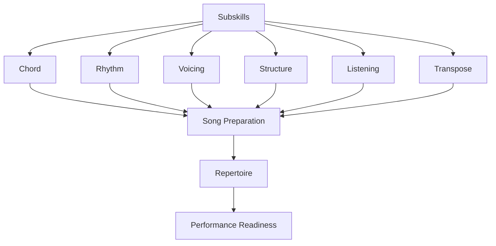
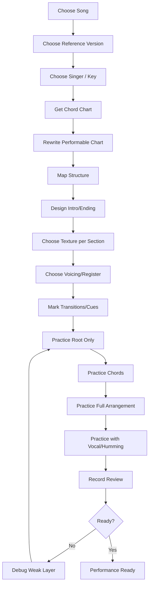
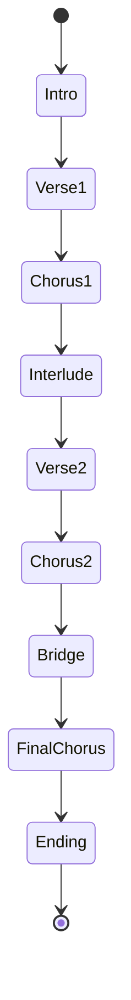
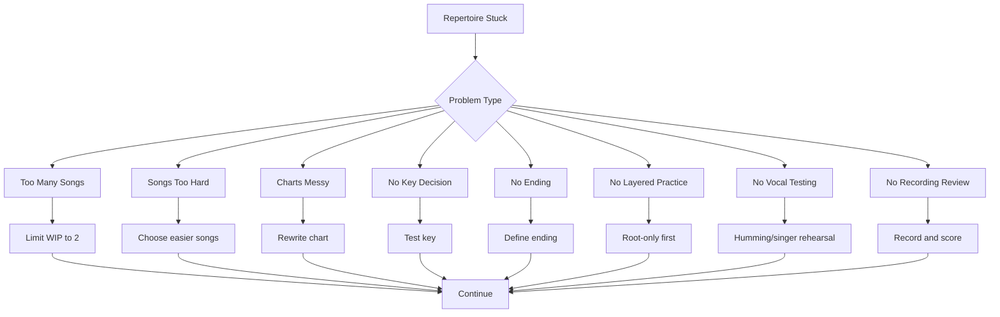
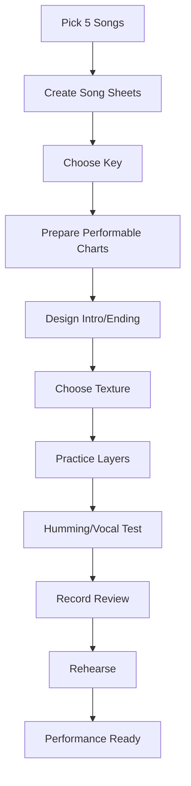

# learn-piano-accompaniment-part-022.md

# Part 022 — Latihan Repertoar: Membangun 5 Lagu Siap Tampil

> Seri: **Learn Piano Accompaniment for Singer Performance**  
> Fokus: **belajar piano untuk mengiringi penyanyi**  
> Framework utama: **The First 20 Hours — Josh Kaufman**  
> Tahap: **Phase G — Dari Latihan ke Lagu Nyata**

---

## Status Seri

| Item | Status |
|---|---|
| Part | 022 |
| Nama file | `learn-piano-accompaniment-part-022.md` |
| Fokus | Membangun repertoire 5 lagu siap tampil dari chord chart, key, pattern, voicing, dan struktur |
| Prasyarat | Part 000–021 |
| Output praktis | Memiliki workflow untuk menyiapkan 5 lagu yang bisa diiringi dengan percaya diri |
| Status seri | Belum selesai |

---

## Daftar Isi

- [1. Tujuan Part Ini](#1-tujuan-part-ini)
- [2. Posisi Part Ini dalam Framework Kaufman](#2-posisi-part-ini-dalam-framework-kaufman)
- [3. Masalah Utama: Banyak Latihan, tetapi Tidak Ada Lagu Siap Tampil](#3-masalah-utama-banyak-latihan-tetapi-tidak-ada-lagu-siap-tampil)
- [4. Mental Model: Repertoire sebagai Product Release](#4-mental-model-repertoire-sebagai-product-release)
- [5. Apa Itu Repertoire?](#5-apa-itu-repertoire)
- [6. Kenapa Target 5 Lagu?](#6-kenapa-target-5-lagu)
- [7. Kriteria Lagu Pertama yang Baik](#7-kriteria-lagu-pertama-yang-baik)
- [8. Kriteria Lagu yang Sebaiknya Dihindari Dulu](#8-kriteria-lagu-yang-sebaiknya-dihindari-dulu)
- [9. Komposisi 5 Lagu Pertama](#9-komposisi-5-lagu-pertama)
- [10. Skill Matrix untuk Setiap Lagu](#10-skill-matrix-untuk-setiap-lagu)
- [11. Workflow Menyiapkan Satu Lagu](#11-workflow-menyiapkan-satu-lagu)
- [12. Step 1 — Pilih Lagu dan Versi Referensi](#12-step-1--pilih-lagu-dan-versi-referensi)
- [13. Step 2 — Tentukan Penyanyi dan Key](#13-step-2--tentukan-penyanyi-dan-key)
- [14. Step 3 — Ambil atau Buat Chord Chart](#14-step-3--ambil-atau-buat-chord-chart)
- [15. Step 4 — Ubah Chart Mentah menjadi Chart Performable](#15-step-4--ubah-chart-mentah-menjadi-chart-performable)
- [16. Step 5 — Tentukan Struktur Lagu](#16-step-5--tentukan-struktur-lagu)
- [17. Step 6 — Tentukan Intro, Interlude, dan Ending](#17-step-6--tentukan-intro-interlude-dan-ending)
- [18. Step 7 — Tentukan Texture per Section](#18-step-7--tentukan-texture-per-section)
- [19. Step 8 — Tentukan Voicing dan Register](#19-step-8--tentukan-voicing-dan-register)
- [20. Step 9 — Tentukan Transition dan Cue](#20-step-9--tentukan-transition-dan-cue)
- [21. Step 10 — Latihan Layer-by-Layer](#21-step-10--latihan-layer-by-layer)
- [22. Step 11 — Latihan dengan Vokal/Humming](#22-step-11--latihan-dengan-vokalhumming)
- [23. Step 12 — Rekam dan Review](#23-step-12--rekam-dan-review)
- [24. Definition of Ready vs Definition of Done](#24-definition-of-ready-vs-definition-of-done)
- [25. Template Song Sheet](#25-template-song-sheet)
- [26. Template Practice Log per Lagu](#26-template-practice-log-per-lagu)
- [27. Song 1 — Lagu 4 Chord Paling Aman](#27-song-1--lagu-4-chord-paling-aman)
- [28. Song 2 — Lagu Verse Minor, Chorus Major](#28-song-2--lagu-verse-minor-chorus-major)
- [29. Song 3 — Lagu 6/8 Slow Ballad](#29-song-3--lagu-68-slow-ballad)
- [30. Song 4 — Lagu dengan Slash Chord Sederhana](#30-song-4--lagu-dengan-slash-chord-sederhana)
- [31. Song 5 — Lagu dengan Chord Color dan Dynamic Arc](#31-song-5--lagu-dengan-chord-color-dan-dynamic-arc)
- [32. Repertoire Board](#32-repertoire-board)
- [33. Prioritas Latihan Mingguan](#33-prioritas-latihan-mingguan)
- [34. Cara Mengukur Lagu Sudah Siap Tampil](#34-cara-mengukur-lagu-sudah-siap-tampil)
- [35. Checklist Rehearsal dengan Penyanyi](#35-checklist-rehearsal-dengan-penyanyi)
- [36. Checklist Performance](#36-checklist-performance)
- [37. Recovery Plan Saat Tampil](#37-recovery-plan-saat-tampil)
- [38. Mini Case Study 1 — Dari Chart Mentah ke Lagu Siap Tampil](#38-mini-case-study-1--dari-chart-mentah-ke-lagu-siap-tampil)
- [39. Mini Case Study 2 — Menyesuaikan Key untuk Penyanyi](#39-mini-case-study-2--menyesuaikan-key-untuk-penyanyi)
- [40. Mini Case Study 3 — Lagu 6/8 dengan Ending Lembut](#40-mini-case-study-3--lagu-68-dengan-ending-lembut)
- [41. Latihan 1 — Pilih 5 Lagu](#41-latihan-1--pilih-5-lagu)
- [42. Latihan 2 — Buat Song Sheet untuk Lagu 1](#42-latihan-2--buat-song-sheet-untuk-lagu-1)
- [43. Latihan 3 — Root Only Run](#43-latihan-3--root-only-run)
- [44. Latihan 4 — Add Texture Run](#44-latihan-4--add-texture-run)
- [45. Latihan 5 — Vocal Simulation Run](#45-latihan-5--vocal-simulation-run)
- [46. Latihan 6 — Full Repertoire Run](#46-latihan-6--full-repertoire-run)
- [47. Debugging Repertoire](#47-debugging-repertoire)
- [48. Failure Mode Pemula](#48-failure-mode-pemula)
- [49. Practice Protocol 7 Hari](#49-practice-protocol-7-hari)
- [50. Practice Protocol 45 Menit](#50-practice-protocol-45-menit)
- [51. Checklist Kelulusan Part 022](#51-checklist-kelulusan-part-022)
- [52. Ringkasan Mental Model](#52-ringkasan-mental-model)
- [53. Persiapan ke Part 023](#53-persiapan-ke-part-023)

---

# 1. Tujuan Part Ini

Sampai Part 021, kita sudah belajar banyak komponen:

- chord dasar;
- progression;
- rhythm;
- block chord;
- broken chord;
- pop ballad comping;
- 6/8 feel;
- inversion;
- voice leading;
- register;
- density;
- chord color;
- voicing modern;
- struktur lagu sebagai state machine;
- intro, interlude, ending;
- transisi antar section;
- mendengar dan mengikuti penyanyi;
- membaca chord chart;
- transposition.

Namun skill-skill itu belum otomatis menjadi performa.

Ada gap besar antara:

```text
saya paham konsep
```

dan:

```text
saya punya 5 lagu yang bisa saya iringi dengan percaya diri
```

Part ini fokus pada gap tersebut.

Target part ini:

> Anda membangun sistem latihan repertoire: memilih 5 lagu pertama, membuat chart performable untuk masing-masing, menentukan key, texture, intro, ending, transition, dan latihan sampai lagu benar-benar siap tampil.

Output akhir yang diinginkan:

```text
5 song sheets
5 arrangement maps
5 key decisions
5 intro/interlude/ending plans
5 practice logs
5 songs ready for rehearsal/performance
```

---

# 2. Posisi Part Ini dalam Framework Kaufman

Dalam *The First 20 Hours*, salah satu prinsip penting adalah:

```text
practice what you actually want to do
```

Jika tujuan Anda adalah mengiringi penyanyi, maka latihan tidak boleh berhenti di:

- memainkan scale;
- memainkan chord terpisah;
- menghafal teori;
- pattern loop tanpa konteks.

Anda harus latihan lagu nyata.

Diagram:



Repertoire adalah tahap integrasi.

Dalam software analogy:

```text
Subskills = libraries/modules
Song = feature
Repertoire = release bundle
Performance = production deployment
```

---

# 3. Masalah Utama: Banyak Latihan, tetapi Tidak Ada Lagu Siap Tampil

Banyak pemula belajar banyak hal tetapi tetap berkata:

```text
Saya belum bisa main lagu.
```

Penyebabnya sering bukan kurang teori, tetapi tidak punya pipeline untuk menyiapkan lagu.

## 3.1 Gejala

- bisa memainkan chord C, G, Am, F tetapi tidak bisa mengiringi satu lagu penuh;
- tahu banyak progression tetapi tidak tahu intro/ending;
- bisa chorus tetapi tersesat di bridge;
- bisa main sendiri tetapi gagal saat ada penyanyi;
- chart dari internet dibaca mentah dan membingungkan;
- latihan berpindah-pindah lagu tanpa ada yang selesai;
- selalu mencari tutorial baru, tetapi tidak punya repertoire.

## 3.2 Root Cause

Masalahnya adalah tidak ada Definition of Done.

Pemula sering menganggap lagu “sudah dipelajari” jika:

```text
sudah bisa chord progression-nya
```

Padahal lagu siap tampil butuh:

- key cocok;
- chart jelas;
- struktur jelas;
- intro jelas;
- ending jelas;
- cue jelas;
- texture jelas;
- transition aman;
- bisa dimainkan full tanpa berhenti;
- bisa dimainkan dengan vokal;
- bisa recovery saat ada error.

## 3.3 Prinsip

```text
Lagu belum siap hanya karena chord-nya sudah bisa.
Lagu siap jika bisa dimainkan full, stabil, mendukung vokal, dan punya ending jelas.
```

---

# 4. Mental Model: Repertoire sebagai Product Release

Sebagai software engineer, anggap setiap lagu sebagai product feature.

Satu lagu siap tampil bukan hanya “kode jalan di local”.

Ia harus melewati pipeline:

```text
select -> parse -> arrange -> practice -> rehearse -> review -> release
```

Diagram:


## 4.1 Song as Feature

Setiap lagu punya:

- requirement;
- constraints;
- user;
- acceptance criteria;
- testing;
- release state.

User utama:

```text
penyanyi
```

User kedua:

```text
pendengar
```

Acceptance criteria:

```text
penyanyi merasa aman
lagu berjalan full
ending jelas
vokal terdengar baik
```

## 4.2 Repertoire Board

Gunakan status:

```text
Backlog
Selected
Chart Ready
Arrangement Ready
Practice
Rehearsal
Performance Ready
```

Ini membuat latihan lebih terarah.

---

# 5. Apa Itu Repertoire?

Repertoire adalah daftar lagu yang bisa Anda mainkan dengan cukup siap.

Bukan lagu yang:

```text
pernah dicoba
```

Tetapi lagu yang:

```text
bisa dimainkan dari awal sampai akhir
dengan structure, key, intro, ending, dan vocal support yang jelas
```

## 5.1 Repertoire Pemula

Untuk tahap ini, repertoire tidak harus sempurna.

Repertoire pemula berarti:

- chord benar mayoritas waktu;
- pulse stabil;
- section tidak tersesat;
- intro memberi cue;
- ending jelas;
- bisa menyesuaikan vokal dasar;
- tidak overplay.

## 5.2 Repertoire Bukan Hafalan Buta

Anda boleh memakai chord chart.

Yang penting chart sudah performable.

## 5.3 Repertoire Membentuk Confidence

Semakin banyak lagu siap, semakin Anda paham pola umum.

Setelah 5 lagu, Anda akan mulai melihat:

```text
oh, banyak lagu pakai struktur dan chord mirip
```

Itu mempercepat pembelajaran lagu berikutnya.

---

# 6. Kenapa Target 5 Lagu?

Satu lagu belum cukup untuk generalisasi.

Dua lagu masih terlalu sempit.

Lima lagu adalah jumlah awal yang bagus karena:

- cukup banyak untuk melihat pattern;
- tidak terlalu banyak sehingga overwhelm;
- bisa mencakup 4/4, 6/8, verse minor, slash chord, chord color;
- memberi bahan rehearsal;
- memberi confidence nyata;
- bisa menjadi mini-set.

## 6.1 Lima Lagu sebagai Mini Portfolio

Dengan 5 lagu, Anda bisa membangun:

| Lagu | Fokus |
|---|---|
| Lagu 1 | 4 chord paling aman |
| Lagu 2 | verse minor, chorus major |
| Lagu 3 | 6/8 ballad |
| Lagu 4 | slash chord sederhana |
| Lagu 5 | chord color dan dynamic arc |

## 6.2 Jangan Pilih 5 Lagu Sulit

Targetnya bukan menunjukkan selera kompleks.

Targetnya membangun performa stabil.

## 6.3 Setelah 5 Lagu

Setelah 5 lagu siap, menambah lagu ke-6, ke-7, dan seterusnya akan jauh lebih cepat karena pipeline sudah ada.

---

# 7. Kriteria Lagu Pertama yang Baik

Pilih lagu dengan kriteria berikut.

## 7.1 Chord Tidak Terlalu Banyak

Ideal:

```text
4 sampai 6 chord utama
```

Contoh chord family key C:

```text
C, G, Am, F, Dm, Em
```

## 7.2 Struktur Jelas

Ada section umum:

```text
intro
verse
chorus
bridge
ending
```

Tidak terlalu banyak modulasi atau section aneh.

## 7.3 Tempo Sedang atau Lambat

Tempo yang lebih lambat memberi waktu berpikir.

Namun jangan terlalu lambat sampai pulse sulit.

## 7.4 Meter Familiar

Mulai dari:

```text
4/4
```

Lalu tambahkan:

```text
6/8
```

## 7.5 Vokal Tidak Terlalu Ekstrem

Range penyanyi harus nyaman.

Jika lagu punya high note ekstrem, pilih lagu lain dulu.

## 7.6 Chord Chart Mudah Didapat dan Diverifikasi

Chart internet sering salah. Pilih lagu yang chart-nya relatif mudah dicek dengan telinga.

## 7.7 Mood Cocok untuk Piano

Ballad, pop, worship, acoustic, cinematic slow song biasanya cocok.

---

# 8. Kriteria Lagu yang Sebaiknya Dihindari Dulu

Hindari dulu lagu dengan:

- modulasi banyak;
- chord jazz kompleks;
- tempo cepat;
- rhythm syncopation ekstrem;
- meter berubah-ubah;
- key sangat banyak sharp/flat;
- piano riff ikonik yang harus exact;
- intro instrumental rumit;
- bridge harmonically complex;
- vocal range terlalu ekstrem;
- terlalu banyak stop/break yang belum dikuasai.

## 8.1 Contoh Masalah

Jika lagu punya chord seperti:

```text
F#m7b5 - B7alt - Em9 - A13
```

itu mungkin belum ideal untuk repertoire pertama.

## 8.2 Prinsip

```text
Pilih lagu yang memungkinkan Anda melatih accompaniment,
bukan lagu yang membuat seluruh energi habis untuk bertahan hidup.
```

## 8.3 Bukan Berarti Tidak Boleh Selamanya

Lagu sulit bisa masuk backlog.

Tetapi repertoire pertama harus memberi kemenangan cepat dan fondasi.

---

# 9. Komposisi 5 Lagu Pertama

Gunakan desain berikut.

## 9.1 Lagu 1 — 4 Chord Aman

Fokus:

```text
C - G - Am - F
```

Skill:

- chord chart;
- intro 4 bar;
- verse/chorus;
- ending F-G-C;
- basic comping.

## 9.2 Lagu 2 — Verse Minor, Chorus Major

Fokus:

```text
Verse: Am - F - C - G
Chorus: C - G - Am - F
```

Skill:

- energy contrast;
- verse lebih intimate;
- chorus lebih besar;
- transition Gsus4-G-C.

## 9.3 Lagu 3 — 6/8 Slow Ballad

Fokus:

```text
6/8 rolling pattern
```

Skill:

- feel 6/8;
- cinematic intro;
- soft ending;
- pedal bersih.

## 9.4 Lagu 4 — Slash Chord Sederhana

Fokus:

```text
C - G/B - Am - F
```

Skill:

- LH bass movement;
- smoother verse;
- chart reading.

## 9.5 Lagu 5 — Chord Color dan Dynamic Arc

Fokus:

```text
Cadd9 - G - Am7 - Fadd9
Dm7 - G7 - C
Gsus4 - G - C
```

Skill:

- color chord;
- open voicing;
- dynamic arc;
- more polished arrangement.

---

# 10. Skill Matrix untuk Setiap Lagu

Buat tabel seperti ini.

| Skill | Lagu 1 | Lagu 2 | Lagu 3 | Lagu 4 | Lagu 5 |
|---|---:|---:|---:|---:|---:|
| Chord basic | ✅ | ✅ | ✅ | ✅ | ✅ |
| Chart reading | ✅ | ✅ | ✅ | ✅ | ✅ |
| Intro | ✅ | ✅ | ✅ | ✅ | ✅ |
| Ending | ✅ | ✅ | ✅ | ✅ | ✅ |
| Verse/chorus contrast | ⬜ | ✅ | ✅ | ✅ | ✅ |
| 6/8 feel | ⬜ | ⬜ | ✅ | ⬜ | optional |
| Slash chord | ⬜ | optional | ⬜ | ✅ | optional |
| Chord color | optional | optional | ✅ | optional | ✅ |
| Transpose | optional | ✅ | optional | ✅ | ✅ |
| Vocal interaction | ✅ | ✅ | ✅ | ✅ | ✅ |

## 10.1 Kenapa Matrix Berguna?

Agar setiap lagu punya fokus skill.

Jangan semua lagu melatih hal yang sama.

## 10.2 Repertoire sebagai Curriculum

5 lagu pertama adalah kurikulum mini.

Setiap lagu mengajarkan satu tantangan baru tanpa overload.

---

# 11. Workflow Menyiapkan Satu Lagu

Workflow lengkap:



## 11.1 Jangan Lewati Step

Pemula sering langsung dari:

```text
get chart -> play full pattern
```

Ini sering gagal.

Urutan aman:

```text
chart -> root -> chord -> structure -> texture -> vocal
```

## 11.2 Satu Lagu Selesai Lebih Baik daripada Sepuluh Lagu Setengah Jadi

Repertoire dibangun dengan finishing.

---

# 12. Step 1 — Pilih Lagu dan Versi Referensi

Satu lagu bisa punya banyak versi:

- original studio;
- live acoustic;
- piano cover;
- worship version;
- lower key version;
- duet version;
- slowed version.

## 12.1 Pilih Satu Referensi

Tentukan:

```text
kita mengikuti versi yang mana?
```

Jika tidak, struktur dan ending bisa membingungkan.

## 12.2 Catat Informasi

```text
Title:
Artist/version:
Reference tempo:
Reference key:
Meter:
Mood:
```

## 12.3 Jangan Terlalu Terikat pada Original

Anda tidak harus meniru piano original.

Tujuan Anda adalah mengiringi penyanyi.

## 12.4 Pilih Versi yang Realistis

Jika original punya produksi penuh, buat versi piano-vocal yang sederhana.

---

# 13. Step 2 — Tentukan Penyanyi dan Key

Key harus cocok dengan penyanyi.

## 13.1 Jika Penyanyi Sudah Ada

Coba chorus di key original.

Tanya:

```text
terlalu tinggi?
terlalu rendah?
verse masih nyaman?
final chorus kuat?
```

## 13.2 Jika Belum Ada Penyanyi

Pilih key yang nyaman untuk latihan piano dulu, misalnya:

```text
C, G, D, F
```

Nanti transpose jika ada penyanyi.

## 13.3 Catat Key Decision

```text
Original key:
Chosen key:
Reason:
Highest chorus note:
Lowest verse note:
```

## 13.4 Jangan Malas Transpose

Jika key tidak nyaman, penyanyi akan kesulitan dan performance turun.

---

# 14. Step 3 — Ambil atau Buat Chord Chart

Sumber chart bisa:

- chord website;
- video tutorial;
- telinga sendiri;
- chart dari teman;
- AI/chord recognition sebagai draft;
- transkrip manual.

## 14.1 Chart Internet Bisa Salah

Selalu verifikasi dengan telinga.

Minimal cek:

- chord home;
- chorus progression;
- ending chord;
- slash chord mencurigakan;
- chord color berlebihan.

## 14.2 Jika Chart Terlalu Rumit

Sederhanakan.

## 14.3 Jika Chart Terlalu Polos

Tambahkan color seperlunya.

Contoh:

```text
C -> Cadd9
Am -> Am7
F -> Fadd9
G -> Gsus4/G
```

## 14.4 Tulis Ulang

Jangan hanya screenshot chart berantakan.

Buat versi sendiri.

---

# 15. Step 4 — Ubah Chart Mentah menjadi Chart Performable

Chart mentah:

```text
C G Am F
Am F C G
C G Am F
```

Chart performable:

```text
Key: C
Meter: 4/4
Tempo: 72

[Intro] 4 bars | E1 | broken chord
| Cadd9 | G | Am7 | Fadd9 |
cue vocal

[Verse] 8 bars | E2 | sparse
| Am7 | Fadd9 | Cadd9 | G | x2

[Chorus] 8 bars | E3 | pop comping
| Cadd9 | G | Am7 | Fadd9 | x2

[Ending] soft
| Fadd9 | Gsus4 G | Cadd9 |
hold C
```

## 15.1 Chart Performable Harus Menjawab

- mulai dari mana?
- vokal masuk kapan?
- section apa saja?
- repeat berapa kali?
- pattern apa?
- energy berapa?
- ending bagaimana?

## 15.2 Jika Chart Tidak Menjawab, Tambahkan

Jangan biarkan pertanyaan itu muncul saat performance.

---

# 16. Step 5 — Tentukan Struktur Lagu

Buat arrangement map.

Contoh:

```text
Intro 4
Verse 1 8
Chorus 1 8
Interlude 4
Verse 2 8
Chorus 2 8
Bridge 8
Final Chorus 16
Ending 4
```

## 16.1 State Machine



## 16.2 Tandai Repeat

```text
Chorus x2
Final chorus x4
Tag x2
```

## 16.3 Jangan Mengandalkan Ingatan Saja

Tulis struktur.

Terutama jika ada penyanyi.

---

# 17. Step 6 — Tentukan Intro, Interlude, dan Ending

## 17.1 Intro

Pilih:

- progression chorus;
- progression verse;
- last line;
- cadence;
- 6/8 rolling intro.

Default aman:

```text
Intro 4 bar
```

## 17.2 Interlude

Pilih:

- same as intro;
- chorus progression light;
- motif pendek;
- breakdown.

## 17.3 Ending

Pilih:

```text
F - G - C
Dm7 - G7 - C
Gsus4 - G - C
Tag x2
Soft ritardando
Big final chord
```

## 17.4 Catat Cue

```text
Intro bar 4: cue vocal
Bridge bar 8: Gsus4-G
Ending: tag x2, hold C
```

---

# 18. Step 7 — Tentukan Texture per Section

Texture adalah pattern/feel.

## 18.1 Template

| Section | Texture |
|---|---|
| Intro | broken chord soft |
| Verse | sparse/root + partial |
| Pre-Chorus | build comping |
| Chorus | pop ballad comping |
| Interlude | motif/broken |
| Bridge | breakdown/build |
| Final Chorus | fuller |
| Ending | soft landing/big |

## 18.2 Jangan Semua Section Sama

Jika semua section sama, lagu datar.

## 18.3 Jangan Terlalu Banyak Texture

Untuk pemula, cukup 2–3 texture utama per lagu:

```text
verse sparse
chorus fuller
bridge build
```

## 18.4 Marking

Gunakan singkatan:

```text
SP
BC
PB
6/8
FULL
```

---

# 19. Step 8 — Tentukan Voicing dan Register

Voicing harus mendukung vokal.

## 19.1 Verse

Gunakan:

```text
LH root
RH partial
middle register
density rendah
```

## 19.2 Chorus

Gunakan:

```text
RH fuller
add9/triad
register sedikit lebih luas
```

## 19.3 Bridge

Gunakan:

```text
open voicing
breakdown atau build
```

## 19.4 Ending

Gunakan:

```text
clean final chord
pedal bersih
```

## 19.5 Catat Voicing Kunci

Contoh:

```text
Cadd9: LH C, RH E-G-D
Am7: LH A, RH C-E-G
Fadd9: LH F, RH A-C-G
Gsus4: LH G, RH C-D-G
```

---

# 20. Step 9 — Tentukan Transition dan Cue

Transition paling penting:

- intro ke verse;
- verse ke chorus;
- chorus ke verse/interlude;
- bridge ke final chorus;
- final chorus ke ending.

## 20.1 Cue Harmoni

Gunakan:

```text
Gsus4 -> G -> C
F -> G -> C
Dm7 -> G7 -> C
```

## 20.2 Cue Ritme

Gunakan:

- fill pendek;
- stop beat 4;
- pickup;
- hold chord.

## 20.3 Cue Dynamic

Gunakan:

- build;
- drop;
- crescendo;
- diminuendo.

## 20.4 Catat di Chart

Contoh:

```text
[Bridge] bar 8: Gsus4-G + stop -> Final Chorus
```

---

# 21. Step 10 — Latihan Layer-by-Layer

Jangan langsung full.

Gunakan layer.

## 21.1 Layer 1: Root Only

LH root seluruh lagu.

Tujuan:

- struktur;
- bar count;
- chord change;
- repeat;
- ending.

## 21.2 Layer 2: Root + RH Partial

Tambahkan chord ringan.

## 21.3 Layer 3: Texture per Section

Verse sparse, chorus fuller.

## 21.4 Layer 4: Intro/Ending

Latih awal dan akhir berkali-kali.

## 21.5 Layer 5: Transition

Latih section boundary.

## 21.6 Layer 6: Vocal Simulation

Tambahkan humming/vokal.

## 21.7 Prinsip

```text
Jika full arrangement gagal, turunkan layer.
```

---

# 22. Step 11 — Latihan dengan Vokal/Humming

Tanpa vokal, Anda belum tahu apakah accompaniment bekerja.

## 22.1 Jika Ada Penyanyi

Latih:

- intro entry;
- verse;
- chorus entry;
- bridge;
- ending.

## 22.2 Jika Belum Ada Penyanyi

Humming sendiri.

Tujuannya bukan kualitas vokal, tetapi:

- mendengar ruang;
- merasakan entry;
- menguji density;
- menguji cue.

## 22.3 Fokus

Saat vokal aktif:

```text
piano support
```

Saat vokal diam:

```text
piano boleh fill kecil
```

## 22.4 Rekam

Rekaman akan menunjukkan apakah piano menutup vokal.

---

# 23. Step 12 — Rekam dan Review

Rekaman adalah QA.

## 23.1 Apa yang Dicek?

- chord benar?
- tempo stabil?
- struktur benar?
- intro jelas?
- cue vocal jelas?
- verse/chorus contrast?
- transition smooth?
- ending jelas?
- vokal foreground?
- piano terlalu ramai?
- pedal bersih?

## 23.2 Review dengan Checklist

Jangan hanya bilang:

```text
kayaknya jelek
```

Gunakan checklist.

## 23.3 Debug Satu Layer

Jika masalahnya ending, latih ending.

Jika masalahnya transition, latih transition.

Jangan ulang seluruh lagu tanpa diagnosis.

## 23.4 Versioning

Simpan rekaman:

```text
song1_take1
song1_take2
song1_ready
```

Agar progress terlihat.

---

# 24. Definition of Ready vs Definition of Done

## 24.1 Definition of Ready

Lagu siap masuk latihan jika:

- lagu dipilih;
- key sementara ditentukan;
- chart ada;
- section jelas;
- chord utama bisa dimainkan;
- tempo/meter diketahui.

## 24.2 Definition of Done

Lagu siap tampil jika:

- chart performable;
- key nyaman untuk penyanyi;
- intro jelas;
- ending jelas;
- transition utama aman;
- verse/chorus contrast terdengar;
- bisa dimainkan full tanpa berhenti;
- bisa dimainkan dengan vokal/humming;
- rekaman review lolos checklist;
- recovery plan diketahui.

## 24.3 Jangan Campur

Lagu yang baru Ready belum Done.

Banyak pemula berhenti di Ready.

Repertoire butuh Done.

---

# 25. Template Song Sheet

Gunakan template ini untuk setiap lagu.

```text
Title:
Reference version:
Singer:
Original key:
Chosen key:
Meter:
Tempo:
Mood:

Structure:
Intro:
Verse 1:
Chorus 1:
Interlude:
Verse 2:
Chorus 2:
Bridge:
Final Chorus:
Ending:

Chord Chart:
[Intro]
...

Texture Map:
Intro:
Verse:
Chorus:
Bridge:
Ending:

Voicing Notes:
C:
G:
Am:
F:

Cue Map:
Vocal entry:
Verse -> Chorus:
Bridge -> Final Chorus:
Ending:

Performance Notes:
- 
- 

Status:
Backlog / Chart Ready / Practice / Rehearsal / Performance Ready
```

## 25.1 Simpan Semua Song Sheet

Buat folder:

```text
repertoire/
  song-01.md
  song-02.md
  song-03.md
  song-04.md
  song-05.md
```

## 25.2 Satu Song Sheet = Satu Source of Truth

Jangan informasi tersebar di chat, kertas, screenshot, dan ingatan.

---

# 26. Template Practice Log per Lagu

```text
Song:
Date:
Duration:
Focus:
Tempo:
Key:
What improved:
Problems:
Next action:
Ready score 1-5:
```

## 26.1 Ready Score

| Score | Arti |
|---:|---|
| 1 | baru mulai |
| 2 | chord/struktur belum stabil |
| 3 | bisa full run tapi banyak error |
| 4 | bisa dengan vokal/humming, minor issue |
| 5 | performance ready |

## 26.2 Contoh

```text
Song: Song 1
Date: 2026-06-25
Duration: 30 min
Focus: Intro + Verse to Chorus
Tempo: 72
Key: C
What improved: chorus entry lebih jelas
Problems: ending masih ragu
Next action: latih F-G-C ending 10x
Ready score: 3
```

## 26.3 Kenapa Log Penting?

Agar latihan tidak random.

---

# 27. Song 1 — Lagu 4 Chord Paling Aman

## 27.1 Tujuan

Membuat satu lagu paling sederhana yang benar-benar selesai.

## 27.2 Progression

```text
C - G - Am - F
```

## 27.3 Struktur

```text
Intro 4
Verse 8
Chorus 8
Verse 8
Chorus 8
Ending 4
```

## 27.4 Texture

```text
Intro: broken chord
Verse: sparse
Chorus: fuller
Ending: soft
```

## 27.5 Ending

```text
F - G - C
```

## 27.6 Acceptance Criteria

- bisa full run;
- tidak tersesat repeat;
- intro memberi cue;
- ending jelas;
- vokal/humming terdengar.

---

# 28. Song 2 — Lagu Verse Minor, Chorus Major

## 28.1 Tujuan

Melatih contrast.

## 28.2 Progression

Verse:

```text
Am - F - C - G
```

Chorus:

```text
C - G - Am - F
```

## 28.3 Texture

Verse:

```text
partial, low density
```

Chorus:

```text
fuller, pop ballad comping
```

## 28.4 Transition

Verse last bar:

```text
Gsus4 -> G -> C
```

## 28.5 Acceptance Criteria

- verse terasa lebih intimate;
- chorus terasa naik;
- transition jelas;
- tempo tidak naik saat build;
- vokal aman masuk chorus.

---

# 29. Song 3 — Lagu 6/8 Slow Ballad

## 29.1 Tujuan

Melatih feel 6/8.

## 29.2 Count

```text
ONE two three FOUR five six
```

## 29.3 Progression

```text
Cadd9 - G - Am7 - Fadd9
```

atau:

```text
Am7 - Fadd9 - Cadd9 - G
```

## 29.4 Texture

Verse:

```text
sparse 6/8
```

Chorus:

```text
rolling 6/8
```

## 29.5 Ending

```text
Fadd9 - Gsus4/G - Cadd9
```

with soft ritardando.

## 29.6 Acceptance Criteria

- 6/8 tidak berubah menjadi 3/4;
- beat 1 dan 4 terasa;
- pedal bersih;
- ending lembut jelas.

---

# 30. Song 4 — Lagu dengan Slash Chord Sederhana

## 30.1 Tujuan

Melatih LH bass movement.

## 30.2 Progression

```text
C - G/B - Am - F
```

## 30.3 Bass

```text
C - B - A - F
```

## 30.4 Texture

Verse:

```text
LH bass clear
RH partial
```

Chorus:

```text
fuller but still bass-aware
```

## 30.5 Transpose Option

Ke G:

```text
G - D/F# - Em - C
```

## 30.6 Acceptance Criteria

- slash bass benar;
- LH tidak panik;
- RH tetap sederhana;
- bass line terdengar smooth.

---

# 31. Song 5 — Lagu dengan Chord Color dan Dynamic Arc

## 31.1 Tujuan

Membuat lagu lebih polished.

## 31.2 Progression

```text
Cadd9 - G - Am7 - Fadd9
```

Bridge/ending:

```text
Dm7 - G7 - Cadd9
```

or:

```text
Gsus4 - G - Cadd9
```

## 31.3 Texture

Intro:

```text
open voicing
```

Verse:

```text
partial color
```

Chorus:

```text
fuller add9
```

Bridge:

```text
breakdown -> build
```

Ending:

```text
soft landing or big ending
```

## 31.4 Dynamic Arc

```text
Intro E1
Verse E2
Chorus E3
Bridge E1.5->E4
Final Chorus E4
Ending E1 or E4
```

## 31.5 Acceptance Criteria

- color tidak menutup vokal;
- dynamic arc terasa;
- bridge punya contrast;
- final chorus terasa peak;
- ending sesuai mood.

---

# 32. Repertoire Board

Gunakan board sederhana.

```text
Backlog:
- Song A
- Song B

Selected:
- Song 1

Chart Ready:
- Song 2

Arrangement Ready:
- Song 3

Practice:
- Song 4

Rehearsal:
- Song 5

Performance Ready:
-
```

## 32.1 Status Definition

| Status | Arti |
|---|---|
| Backlog | kandidat lagu |
| Selected | dipilih untuk dikerjakan |
| Chart Ready | chart sudah rapi |
| Arrangement Ready | texture/key/ending sudah diputuskan |
| Practice | sedang dilatih |
| Rehearsal | sudah dicoba dengan vokal |
| Performance Ready | siap tampil |

## 32.2 Batasi Work in Progress

Jangan kerjakan terlalu banyak lagu sekaligus.

Rekomendasi:

```text
maksimal 2 lagu di Practice
```

## 32.3 Move to Done

Jangan takut menandai Done jika acceptance criteria sudah cukup.

Done bukan sempurna. Done berarti siap untuk konteks target Anda.

---

# 33. Prioritas Latihan Mingguan

## 33.1 Hari 1

Pilih 5 lagu dan buat board.

## 33.2 Hari 2

Buat song sheet Lagu 1 dan 2.

## 33.3 Hari 3

Latih Lagu 1 layer-by-layer.

## 33.4 Hari 4

Latih Lagu 2 dan transition verse-chorus.

## 33.5 Hari 5

Latih Lagu 3 6/8.

## 33.6 Hari 6

Latih Lagu 4 slash chord dan Lagu 5 chord color.

## 33.7 Hari 7

Full repertoire run + recording review.

## 33.8 Prinsip Mingguan

```text
Setiap minggu harus ada minimal satu lagu yang naik status.
```

---

# 34. Cara Mengukur Lagu Sudah Siap Tampil

Gunakan skor 1–5.

## 34.1 Chord Accuracy

| Score | Kriteria |
|---:|---|
| 1 | sering salah chord |
| 2 | chord dasar tahu, banyak terlambat |
| 3 | mayoritas benar |
| 4 | benar dan stabil |
| 5 | benar sambil mendengar vokal |

## 34.2 Structure Accuracy

| Score | Kriteria |
|---:|---|
| 1 | sering tersesat |
| 2 | tahu section tapi repeat salah |
| 3 | bisa full dengan chart |
| 4 | transisi aman |
| 5 | bisa recovery saat penyanyi berubah |

## 34.3 Vocal Support

| Score | Kriteria |
|---:|---|
| 1 | piano menutup vokal |
| 2 | kadang memberi ruang |
| 3 | vokal cukup jelas |
| 4 | cue dan dynamic baik |
| 5 | penyanyi terasa sangat didukung |

## 34.4 Readiness

Lagu siap tampil jika:

```text
Chord >= 4
Structure >= 4
Vocal Support >= 4
Ending >= 4
```

---

# 35. Checklist Rehearsal dengan Penyanyi

Sebelum rehearsal:

- [ ] key sudah dicoba;
- [ ] chart sudah rapi;
- [ ] intro length jelas;
- [ ] vocal entry jelas;
- [ ] ending disepakati;
- [ ] repeat/tag disepakati;
- [ ] tempo/meter jelas;
- [ ] bagian rubato/straight jelas.

Saat rehearsal:

- [ ] cek intro entry;
- [ ] cek verse to chorus;
- [ ] cek bridge to final chorus;
- [ ] cek ending/tag;
- [ ] tanya apakah piano terlalu ramai;
- [ ] tanya apakah cue jelas;
- [ ] rekam minimal satu run.

Setelah rehearsal:

- [ ] catat problem spot;
- [ ] update song sheet;
- [ ] update practice log;
- [ ] tentukan next action.

---

# 36. Checklist Performance

Sebelum tampil:

- [ ] song sheet siap;
- [ ] key final jelas;
- [ ] intro jelas;
- [ ] first chord jelas;
- [ ] ending jelas;
- [ ] tag count jelas;
- [ ] cue dengan penyanyi jelas;
- [ ] tempo internal siap;
- [ ] pedal/keyboard setting siap;
- [ ] volume piano tidak menutup vokal.

Saat tampil:

- [ ] dengar vokal;
- [ ] jaga pulse;
- [ ] jangan overplay;
- [ ] beri cue;
- [ ] gunakan recovery jika salah;
- [ ] ending bersih.

Setelah tampil:

- [ ] catat apa yang berhasil;
- [ ] catat bagian rawan;
- [ ] update repertoire board.

---

# 37. Recovery Plan Saat Tampil

Setiap lagu harus punya recovery plan.

## 37.1 Jika Salah Chord

```text
jaga pulse
pindah ke chord berikutnya
jangan berhenti
```

## 37.2 Jika Lupa Section

```text
dengar lirik
gunakan safe loop
lihat penyanyi
masuk di phrase boundary
```

## 37.3 Jika Penyanyi Ulang Phrase

```text
loop progression
kurangi density
tunggu cue
```

## 37.4 Jika Ending Tidak Jelas

Gunakan ending aman:

```text
F - G - C
```

atau:

```text
Gsus4 - G - C
```

## 37.5 Jika Panik

Turunkan ke:

```text
LH root + RH partial
```

Pattern:

```text
X - - -
```

## 37.6 Prinsip

```text
Recovery terbaik adalah sederhana, stabil, dan tidak menarik perhatian.
```

---

# 38. Mini Case Study 1 — Dari Chart Mentah ke Lagu Siap Tampil

## 38.1 Chart Mentah

```text
C G Am F
Am F C G
C G Am F
F G C
```

## 38.2 Parse

Kemungkinan:

```text
Intro/Chorus: C-G-Am-F
Verse: Am-F-C-G
Ending: F-G-C
```

## 38.3 Chart Performable

```text
Key: C
Meter: 4/4
Tempo: 72

[Intro] E1 BC
| Cadd9 | G | Am7 | Fadd9 |
cue vocal

[Verse] E2 SP x2
| Am7 | Fadd9 | Cadd9 | G |

[Chorus] E3 PB x2
| Cadd9 | G | Am7 | Fadd9 |

[Ending] soft rit.
| Fadd9 | Gsus4 G | Cadd9 |
hold C
```

## 38.4 Practice Layers

1. LH root.
2. RH partial.
3. verse sparse.
4. chorus fuller.
5. ending.
6. humming.

## 38.5 Acceptance Criteria

- full run without stop;
- intro cue clear;
- verse/chorus contrast;
- ending clean.

---

# 39. Mini Case Study 2 — Menyesuaikan Key untuk Penyanyi

## 39.1 Situasi

Song 1 di key C terlalu tinggi untuk penyanyi.

Coba turun ke A.

## 39.2 Original

```text
C - G - Am - F
```

Function:

```text
I - V - vi - IV
```

Key A:

```text
A - E - F#m - D
```

## 39.3 New Song Sheet

```text
Key: A

[Intro]
| Aadd9 | E | F#m7 | Dadd9 |

[Verse]
| F#m7 | Dadd9 | Aadd9 | E | x2

[Chorus]
| Aadd9 | E | F#m7 | Dadd9 | x2

[Ending]
| Dadd9 | Esus4 E | Aadd9 |
```

## 39.4 Simplification

If F#m7 hard:

```text
F#m
```

or:

```text
LH F#, RH A-C#
```

## 39.5 Rehearsal Check

- chorus now comfortable?
- verse too low?
- piano key playable?
- voicing/register adjusted?

---

# 40. Mini Case Study 3 — Lagu 6/8 dengan Ending Lembut

## 40.1 Structure

```text
Intro 4
Verse 8
Chorus 8
Bridge 8
Final Chorus 8
Ending 4
```

## 40.2 Chart

```text
Key: C
Meter: 6/8
Tempo: 54

[Intro] E1 6/8 rolling
| Cadd9 | G | Am7 | Fadd9 |

[Verse] E2 sparse 6/8
| Am7 | Fadd9 | Cadd9 | G | x2

[Chorus] E3 fuller 6/8
| Cadd9 | G | Am7 | Fadd9 | x2

[Bridge] E1.5->E4 build
| Fadd9 | G | Am7 | Gsus4 G | x2

[Ending] soft rit.
| Fadd9 | Gsus4 G | Cadd9 |
hold C
```

## 40.3 Key Points

- count `ONE two three FOUR five six`;
- verse not too dense;
- bridge build without tempo rise;
- final C pedal clean.

## 40.4 Acceptance Criteria

- 6/8 wave stable;
- vocal entry safe;
- final ending soft and clear.

---

# 41. Latihan 1 — Pilih 5 Lagu

Buat daftar 10 kandidat.

Untuk setiap kandidat, beri skor 1–5:

| Kriteria | Score |
|---|---:|
| chord mudah | |
| struktur jelas | |
| cocok untuk piano | |
| range vokal aman | |
| chart tersedia | |
| mood disukai | |

Pilih 5 dengan skor terbaik.

## 41.1 Output

```text
Song 1:
Song 2:
Song 3:
Song 4:
Song 5:
```

## 41.2 Catat Fokus Skill

```text
Song 1: 4 chord
Song 2: verse minor
Song 3: 6/8
Song 4: slash chord
Song 5: chord color
```

---

# 42. Latihan 2 — Buat Song Sheet untuk Lagu 1

Gunakan template Song Sheet.

Minimal isi:

- title;
- key;
- meter;
- tempo;
- structure;
- chord chart;
- intro;
- ending;
- texture map;
- cue map.

## 42.1 Jangan Main Dulu

Tulis dulu.

Ini melatih preparation.

## 42.2 Review

Pastikan chart menjawab:

- vokal masuk kapan?
- repeat berapa?
- ending bagaimana?

---

# 43. Latihan 3 — Root Only Run

Mainkan Lagu 1 hanya LH root.

## 43.1 Fokus

- bar count;
- section;
- repeat;
- transition;
- ending.

## 43.2 Jangan Tambah RH

Jika root-only belum stabil, jangan naik layer.

## 43.3 Target

Full run tanpa berhenti.

---

# 44. Latihan 4 — Add Texture Run

Tambahkan RH partial dan texture.

## 44.1 Verse

```text
sparse
```

## 44.2 Chorus

```text
fuller
```

## 44.3 Ending

```text
clean final chord
```

## 44.4 Evaluasi

- apakah texture berubah sesuai section?
- apakah tempo stabil?
- apakah ending jelas?

---

# 45. Latihan 5 — Vocal Simulation Run

Mainkan Lagu 1 sambil humming.

## 45.1 Fokus

- vocal-first listening;
- ruang vokal;
- cue masuk;
- dynamic matching;
- ending dengan vokal.

## 45.2 Rekam

Dengarkan apakah humming tertutup piano.

## 45.3 Debug

Jika vokal tertutup:

- kurangi RH;
- kurangi density;
- turunkan dynamic;
- gunakan partial chord.

---

# 46. Latihan 6 — Full Repertoire Run

Setelah 5 lagu punya song sheet, lakukan full run.

## 46.1 Format

```text
Song 1
Song 2
Song 3
Song 4
Song 5
```

## 46.2 Aturan

- jangan berhenti saat error;
- gunakan recovery;
- catat problem setelah selesai;
- jangan debug di tengah run.

## 46.3 Tujuan

Melatih endurance dan flow.

## 46.4 Review

Beri score tiap lagu:

```text
Chord:
Structure:
Vocal Support:
Ending:
Overall:
```

---

# 47. Debugging Repertoire

Jika repertoire tidak berkembang, debug.



## 47.1 Too Many Songs

Solusi:

```text
pilih 5, kerjakan maksimal 2 sekaligus
```

## 47.2 Songs Too Hard

Turunkan kesulitan.

## 47.3 Charts Messy

Tulis ulang.

## 47.4 No Key Decision

Tentukan key sebelum latihan serius.

## 47.5 No Ending

Ending harus selalu defined.

## 47.6 No Vocal Testing

Lagu accompaniment belum valid tanpa vokal/humming.

---

# 48. Failure Mode Pemula

## 48.1 Mengumpulkan Banyak Chart tetapi Tidak Menyelesaikan Lagu

Chart collection bukan repertoire.

## 48.2 Memilih Lagu Terlalu Sulit karena Suka

Suka itu penting, tetapi repertoire pertama butuh realistic difficulty.

## 48.3 Tidak Membuat Song Sheet

Akibatnya informasi tersebar dan lupa.

## 48.4 Tidak Menentukan Key

Akhirnya penyanyi tidak nyaman.

## 48.5 Tidak Menentukan Ending

Lagu runtuh di akhir.

## 48.6 Langsung Full Pattern

Harus root-only dulu.

## 48.7 Tidak Latihan dengan Vokal

Piano bisa terdengar bagus sendiri tetapi gagal mengiringi.

## 48.8 Tidak Rekam

Tanpa rekaman, Anda sulit tahu apakah vokal tertutup.

## 48.9 Semua Lagu Dilatih Sama

Setiap lagu harus punya fokus skill berbeda.

## 48.10 Tidak Ada Status/Board

Tanpa status, Anda tidak tahu lagu mana yang hampir siap.

---

# 49. Practice Protocol 7 Hari

## Hari 1 — Selection

- pilih 10 kandidat;
- scoring;
- pilih 5 lagu;
- buat repertoire board.

## Hari 2 — Song Sheet 1

- chart Lagu 1;
- key;
- structure;
- intro/ending;
- root-only run.

## Hari 3 — Song Sheet 2

- chart Lagu 2;
- verse/chorus contrast;
- transition;
- root + partial.

## Hari 4 — Song Sheet 3

- 6/8 chart;
- rolling pattern;
- soft ending.

## Hari 5 — Song Sheet 4

- slash chord;
- LH bass movement;
- transpose optional.

## Hari 6 — Song Sheet 5

- chord color;
- dynamic arc;
- bridge build.

## Hari 7 — Full Repertoire Review

- full run 5 lagu;
- record;
- score;
- update board.

## Prinsip

```text
Tujuan minggu ini bukan sempurna.
Tujuan minggu ini adalah 5 lagu punya shape yang jelas.
```

---

# 50. Practice Protocol 45 Menit

Gunakan untuk satu lagu.

## 50.1 Menit 0–5: Read Song Sheet

Baca:

- key;
- structure;
- chord;
- texture;
- ending.

## 50.2 Menit 5–10: Root Only

LH root seluruh lagu.

## 50.3 Menit 10–15: Root + Partial

Tambahkan RH.

## 50.4 Menit 15–20: Intro/Ending

Latih intro 5x.

Latih ending 5x.

## 50.5 Menit 20–25: Verse/Chorus Contrast

Verse sparse.

Chorus fuller.

## 50.6 Menit 25–30: Transitions

Latih:

- verse to chorus;
- bridge to final chorus;
- final chorus to ending.

## 50.7 Menit 30–35: Vocal/Humming

Main sambil humming.

## 50.8 Menit 35–40: Full Run

Main dari awal sampai akhir tanpa berhenti.

## 50.9 Menit 40–45: Record Review and Log

Rekam.

Isi practice log:

```text
What improved:
Problems:
Next action:
Ready score:
```

---

# 51. Checklist Kelulusan Part 022

Anda boleh lanjut ke Part 023 jika sebagian besar checklist ini terpenuhi.

## 51.1 Pemahaman

- [ ] Saya tahu repertoire adalah daftar lagu yang benar-benar siap dimainkan, bukan sekadar pernah dicoba.
- [ ] Saya tahu 5 lagu pertama harus dipilih strategis.
- [ ] Saya tahu lagu siap tampil butuh key, chart, structure, intro, ending, texture, transition, dan vocal support.
- [ ] Saya tahu chord bisa sudah benar tetapi lagu belum siap.
- [ ] Saya tahu Definition of Ready berbeda dari Definition of Done.
- [ ] Saya tahu song sheet adalah source of truth per lagu.
- [ ] Saya tahu latihan repertoire harus layer-by-layer.
- [ ] Saya tahu rekaman adalah QA.
- [ ] Saya tahu rehearsal dengan penyanyi memvalidasi accompaniment.
- [ ] Saya tahu repertoire board membantu progress.

## 51.2 Praktik

- [ ] Saya sudah memilih 5 kandidat lagu.
- [ ] Saya sudah menentukan fokus skill untuk masing-masing lagu.
- [ ] Saya bisa membuat song sheet minimal untuk satu lagu.
- [ ] Saya bisa membuat chart performable dari chart mentah.
- [ ] Saya bisa menentukan intro 4 bar.
- [ ] Saya bisa menentukan ending aman.
- [ ] Saya bisa memainkan root-only run satu lagu penuh.
- [ ] Saya bisa memainkan root + partial satu lagu penuh.
- [ ] Saya bisa memainkan verse lebih sparse dan chorus lebih fuller.
- [ ] Saya bisa melakukan vocal/humming simulation.

## 51.3 Self-Correction

- [ ] Saya bisa mendeteksi jika lagu terlalu sulit untuk repertoire awal.
- [ ] Saya bisa mendeteksi jika chart belum performable.
- [ ] Saya bisa mendeteksi jika ending belum jelas.
- [ ] Saya bisa mendeteksi jika key belum nyaman untuk penyanyi.
- [ ] Saya bisa menurunkan layer latihan saat full arrangement gagal.
- [ ] Saya bisa memberi ready score untuk satu lagu.
- [ ] Saya bisa menentukan next action spesifik, bukan sekadar “latihan lagi”.
- [ ] Saya bisa memindahkan lagu di repertoire board berdasarkan status nyata.

---

# 52. Ringkasan Mental Model

Repertoire adalah product release.

```text
subskill = module
song = feature
song sheet = source of truth
practice log = telemetry
recording = QA
rehearsal = integration test
performance = production
```

Workflow utama:



Kalimat kunci:

```text
Jangan belajar piano accompaniment hanya sebagai kumpulan teknik.
Bangun repertoire.
```

Dan:

```text
Satu lagu selesai lebih berharga daripada sepuluh lagu yang hanya pernah dicoba.
```

---

# 53. Persiapan ke Part 023

Part berikutnya adalah:

```text
learn-piano-accompaniment-part-023.md
```

Judul:

```text
Practice System: Deliberate Practice, Recording Review, dan Feedback Loop
```

Sampai Part 022, kita sudah mulai mengubah skill menjadi repertoire.

Namun agar progress tidak stagnan, kita butuh sistem latihan yang benar.

Part 023 akan membahas:

- deliberate practice untuk piano accompaniment;
- latihan dengan constraint;
- recording review;
- error log;
- problem spot isolation;
- slow practice;
- metronome practice;
- loop kecil 2 bar;
- interleaving;
- practice schedule;
- objective metrics;
- subjective metrics;
- weekly review;
- bagaimana tahu skill meningkat;
- bagaimana tidak hanya mengulang error yang sama.

Part 023 akan membuat latihan Anda lebih efisien, terukur, dan sesuai dengan prinsip *The First 20 Hours*.

---

## Status Akhir Part 022

```text
Part 022 selesai.
Seri belum selesai.
Lanjut ke Part 023.
```
