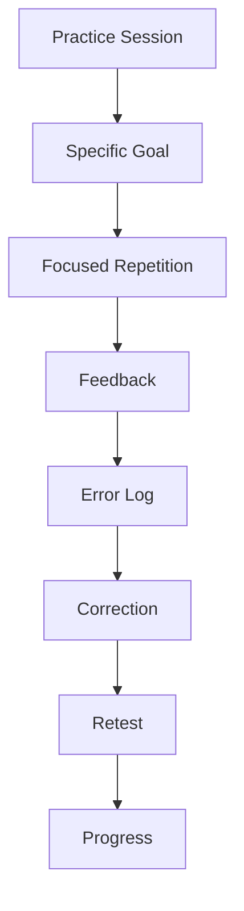
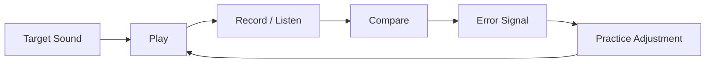
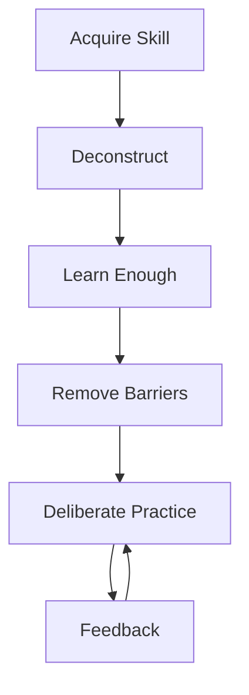
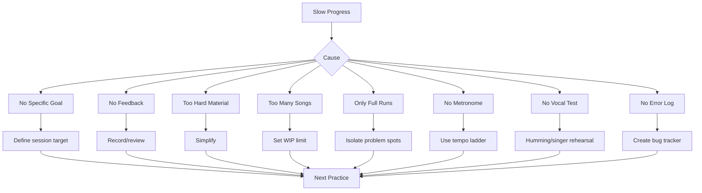
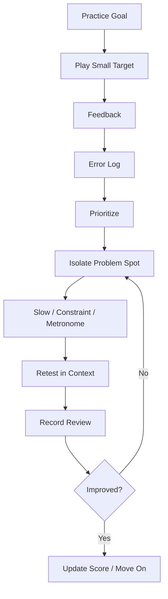

# learn-piano-accompaniment-part-023.md

# Part 023 — Practice System: Deliberate Practice, Recording Review, dan Feedback Loop

> Seri: **Learn Piano Accompaniment for Singer Performance**  
> Fokus: **belajar piano untuk mengiringi penyanyi**  
> Framework utama: **The First 20 Hours — Josh Kaufman**  
> Tahap: **Phase H — Sistem Latihan, Feedback, dan Peningkatan Terukur**

---

## Status Seri

| Item | Status |
|---|---|
| Part | 023 |
| Nama file | `learn-piano-accompaniment-part-023.md` |
| Fokus | Sistem latihan deliberate practice untuk piano accompaniment |
| Prasyarat | Part 000–022 |
| Output praktis | Bisa membuat latihan harian/mingguan yang terukur, tidak random, dan fokus memperbaiki bottleneck nyata |
| Status seri | Belum selesai |

---

## Daftar Isi

- [1. Tujuan Part Ini](#1-tujuan-part-ini)
- [2. Posisi Part Ini dalam Framework Kaufman](#2-posisi-part-ini-dalam-framework-kaufman)
- [3. Masalah Utama: Latihan Banyak, tetapi Progress Tidak Jelas](#3-masalah-utama-latihan-banyak-tetapi-progress-tidak-jelas)
- [4. Mental Model: Practice sebagai Feedback-Control System](#4-mental-model-practice-sebagai-feedback-control-system)
- [5. Deliberate Practice vs Sekadar Mengulang Lagu](#5-deliberate-practice-vs-sekadar-mengulang-lagu)
- [6. Prinsip Kaufman: Deconstruct, Learn Enough, Remove Barriers, Practice Deliberately](#6-prinsip-kaufman-deconstruct-learn-enough-remove-barriers-practice-deliberately)
- [7. Apa yang Diukur dalam Piano Accompaniment?](#7-apa-yang-diukur-dalam-piano-accompaniment)
- [8. Objective Metrics vs Subjective Metrics](#8-objective-metrics-vs-subjective-metrics)
- [9. Error Log: Bug Tracker untuk Latihan Musik](#9-error-log-bug-tracker-untuk-latihan-musik)
- [10. Problem Spot Isolation](#10-problem-spot-isolation)
- [11. Loop Kecil 2 Bar](#11-loop-kecil-2-bar)
- [12. Slow Practice: Menurunkan Tempo Tanpa Menurunkan Fokus](#12-slow-practice-menurunkan-tempo-tanpa-menurunkan-fokus)
- [13. Metronome Practice](#13-metronome-practice)
- [14. Counting Practice: Beat, Bar, dan Phrase](#14-counting-practice-beat-bar-dan-phrase)
- [15. Recording Review sebagai QA](#15-recording-review-sebagai-qa)
- [16. Cara Mendengarkan Rekaman secara Sistematis](#16-cara-mendengarkan-rekaman-secara-sistematis)
- [17. Take Notes: Jangan Mengandalkan Perasaan](#17-take-notes-jangan-mengandalkan-perasaan)
- [18. Practice Constraints](#18-practice-constraints)
- [19. Layered Practice](#19-layered-practice)
- [20. Interleaving: Tidak Latihan Satu Hal Terlalu Lama](#20-interleaving-tidak-latihan-satu-hal-terlalu-lama)
- [21. Block Practice vs Random Practice](#21-block-practice-vs-random-practice)
- [22. Tempo Ladder](#22-tempo-ladder)
- [23. Dynamic Ladder](#23-dynamic-ladder)
- [24. Density Ladder](#24-density-ladder)
- [25. Section-Focused Practice](#25-section-focused-practice)
- [26. Transition-Focused Practice](#26-transition-focused-practice)
- [27. Vocal-Simulation Practice](#27-vocal-simulation-practice)
- [28. Rehearsal Practice vs Solo Practice](#28-rehearsal-practice-vs-solo-practice)
- [29. Designing a 20-Hour Practice Sprint](#29-designing-a-20-hour-practice-sprint)
- [30. Daily Practice Template 30 Menit](#30-daily-practice-template-30-menit)
- [31. Daily Practice Template 45 Menit](#31-daily-practice-template-45-menit)
- [32. Daily Practice Template 60 Menit](#32-daily-practice-template-60-menit)
- [33. Weekly Review System](#33-weekly-review-system)
- [34. Readiness Score per Lagu](#34-readiness-score-per-lagu)
- [35. Skill Scorecard](#35-skill-scorecard)
- [36. Practice Backlog](#36-practice-backlog)
- [37. WIP Limit: Jangan Melatih Terlalu Banyak Sekaligus](#37-wip-limit-jangan-melatih-terlalu-banyak-sekaligus)
- [38. Debugging Lambatnya Progress](#38-debugging-lambatnya-progress)
- [39. Mini Case Study 1: Selalu Salah di Verse ke Chorus](#39-mini-case-study-1-selalu-salah-di-verse-ke-chorus)
- [40. Mini Case Study 2: Tempo Naik saat Chorus](#40-mini-case-study-2-tempo-naik-saat-chorus)
- [41. Mini Case Study 3: Piano Menutup Vokal](#41-mini-case-study-3-piano-menutup-vokal)
- [42. Mini Case Study 4: Ending Selalu Ragu](#42-mini-case-study-4-ending-selalu-ragu)
- [43. Latihan 1: Membuat Error Log](#43-latihan-1-membuat-error-log)
- [44. Latihan 2: Loop 2 Bar](#44-latihan-2-loop-2-bar)
- [45. Latihan 3: Recording Review 3 Pass](#45-latihan-3-recording-review-3-pass)
- [46. Latihan 4: Tempo Ladder](#46-latihan-4-tempo-ladder)
- [47. Latihan 5: Dynamic/Density Constraint](#47-latihan-5-dynamicdensity-constraint)
- [48. Latihan 6: Weekly Review](#48-latihan-6-weekly-review)
- [49. Failure Mode Pemula](#49-failure-mode-pemula)
- [50. Practice Protocol 7 Hari](#50-practice-protocol-7-hari)
- [51. Practice Protocol 45 Menit](#51-practice-protocol-45-menit)
- [52. Checklist Kelulusan Part 023](#52-checklist-kelulusan-part-023)
- [53. Ringkasan Mental Model](#53-ringkasan-mental-model)
- [54. Persiapan ke Part 024](#54-persiapan-ke-part-024)

---

# 1. Tujuan Part Ini

Sampai Part 022, kita sudah mulai membangun repertoire.

Namun setelah seseorang punya beberapa lagu latihan, masalah baru muncul:

```text
saya latihan terus, tetapi rasanya tidak banyak membaik
```

atau:

```text
saya ulang lagu dari awal sampai akhir berkali-kali, tetapi error yang sama tetap muncul
```

Part ini membahas sistem latihan.

Target part ini:

> Anda mampu membuat sistem latihan yang terukur, fokus pada bottleneck, memakai recording review sebagai feedback, dan mengubah error menjadi action item yang spesifik.

Setelah part ini, latihan Anda tidak lagi berbentuk:

```text
main lagu beberapa kali sampai capek
```

Tetapi menjadi:

```text
identifikasi bug
isolasi 2 bar
latih pelan
ukur tempo
rekam
review
update error log
ulang dengan constraint
```

Ini sangat cocok dengan cara berpikir software engineer.

---

# 2. Posisi Part Ini dalam Framework Kaufman

Josh Kaufman menekankan bahwa 20 jam pertama harus berisi latihan yang disengaja, bukan sekadar paparan pasif.

Dalam konteks piano accompaniment, “latihan” bukan hanya:

- menonton tutorial;
- membaca teori;
- memainkan lagu dari awal;
- mencoba chord baru;
- improvisasi tanpa review.

Latihan yang efektif harus punya:

- target kecil;
- feedback cepat;
- error correction;
- repetition yang sadar;
- progress metric.

Diagram:



Part ini adalah sistem operasi latihan untuk semua part sebelumnya.

---

# 3. Masalah Utama: Latihan Banyak, tetapi Progress Tidak Jelas

Banyak pemula menghabiskan waktu latihan tetapi tidak tahu apa yang membaik.

## 3.1 Gejala

- error yang sama muncul setiap hari;
- tempo masih goyah;
- ending tetap ragu;
- chord transition lambat;
- tangan tegang;
- piano masih menutup vokal;
- tidak tahu lagu mana yang paling siap;
- setiap latihan mulai dari awal lagu;
- tidak pernah merekam;
- tidak punya catatan problem;
- merasa “sudah latihan” tetapi tidak punya evidence.

## 3.2 Root Cause

Biasanya karena latihan tidak punya loop feedback.

Latihan hanya:

```text
play -> feel bad -> repeat
```

Seharusnya:

```text
play -> observe -> diagnose -> isolate -> fix -> retest
```

## 3.3 Prinsip

```text
Practice tanpa feedback hanya memperkuat kebiasaan lama.
```

Jika Anda mengulang error 20 kali, Anda sedang melatih error itu.

---

# 4. Mental Model: Practice sebagai Feedback-Control System

Dalam engineering, sistem kontrol punya:

- target;
- sensor;
- error signal;
- controller;
- correction;
- output.

Latihan musik juga bisa begitu.



## 4.1 Target Sound

Anda harus tahu target:

```text
verse lebih sparse
chorus lebih besar
tempo stabil
ending jelas
vokal foreground
```

## 4.2 Sensor

Sensor adalah:

- telinga saat bermain;
- rekaman;
- metronome;
- feedback penyanyi;
- practice log;
- video tangan.

## 4.3 Error Signal

Contoh:

```text
tempo naik di chorus
RH terlalu ramai saat vokal
bar 8 verse ke chorus telat
ending pedal muddy
```

## 4.4 Controller

Controller adalah keputusan latihan:

```text
latih 2 bar transisi
turunkan tempo
pakai root-only
kurangi density
metronome on
```

## 4.5 Output

Output adalah take berikutnya yang lebih baik.

---

# 5. Deliberate Practice vs Sekadar Mengulang Lagu

## 5.1 Sekadar Mengulang Lagu

Ciri:

- main dari awal sampai akhir;
- jika salah, terus main;
- setelah selesai, ulang lagi dari awal;
- tidak tahu error utama;
- tidak isolasi bagian sulit;
- tidak mengukur tempo;
- tidak rekam;
- berharap membaik otomatis.

Ini boleh untuk warm-up atau full-run test, tetapi bukan inti latihan.

## 5.2 Deliberate Practice

Ciri:

- target spesifik;
- bagian kecil;
- feedback cepat;
- error jelas;
- repetition berkualitas;
- difficulty tepat;
- ada catatan;
- ada retest.

Contoh:

```text
Target: verse bar 7-8 ke chorus bar 1.
Masalah: telat masuk C chorus.
Latihan: loop Gsus4-G-C 20x di 60 BPM.
Constraint: RH hanya partial chord.
Retest: full verse ke chorus.
```

## 5.3 Perbedaan

| Sekadar Mengulang | Deliberate Practice |
|---|---|
| luas | sempit |
| kabur | spesifik |
| feeling-based | evidence-based |
| error berulang | error diisolasi |
| full song terus | problem spot |
| tanpa catatan | error log |
| progress lambat | progress terarah |

## 5.4 Prinsip

```text
Full run menguji.
Deliberate practice memperbaiki.
```

---

# 6. Prinsip Kaufman: Deconstruct, Learn Enough, Remove Barriers, Practice Deliberately

Kita terapkan ke piano accompaniment.

## 6.1 Deconstruct

Pecah skill:

- chord;
- rhythm;
- voicing;
- structure;
- transition;
- vocal support;
- transpose;
- repertoire.

## 6.2 Learn Enough

Belajar teori secukupnya untuk self-correction.

Contoh:

- tahu chord tones;
- tahu bar count;
- tahu Roman numeral;
- tahu sus/dominant cue.

Tidak perlu semua teori harmony advanced di awal.

## 6.3 Remove Barriers

Hilangkan hambatan latihan:

- keyboard siap;
- metronome siap;
- chart rapi;
- recording app siap;
- practice log template siap;
- lagu tidak terlalu sulit;
- waktu latihan jelas.

## 6.4 Practice Deliberately

Latih dengan:

- target;
- timer;
- loop kecil;
- recording;
- review;
- metrics.

## 6.5 Diagram



---

# 7. Apa yang Diukur dalam Piano Accompaniment?

Yang diukur bukan hanya “bisa main”.

Kita ukur beberapa dimensi.

## 7.1 Timing

- tempo stabil;
- chord change tepat;
- tidak rushing di chorus;
- transition tepat;
- ending tidak ragu.

## 7.2 Harmony

- chord benar;
- bass benar;
- slash chord benar;
- chord color tidak salah;
- voicing tidak muddy.

## 7.3 Structure

- section benar;
- repeat benar;
- intro length benar;
- ending jelas;
- bridge/final chorus tidak terlewat.

## 7.4 Texture

- verse sparse;
- chorus fuller;
- bridge contrast;
- density terkendali;
- pattern cocok meter.

## 7.5 Vocal Support

- vokal foreground;
- piano tidak menutup lirik;
- cue jelas;
- napas diberi ruang;
- dynamic matching.

## 7.6 Recovery

- tidak berhenti saat salah;
- bisa root-only fallback;
- bisa safe loop;
- bisa masuk kembali di phrase boundary.

---

# 8. Objective Metrics vs Subjective Metrics

## 8.1 Objective Metrics

Hal yang bisa dihitung:

- tempo BPM;
- jumlah error chord;
- jumlah berhenti;
- jumlah repeat salah;
- durasi latihan;
- jumlah take;
- jumlah loop benar berturut-turut;
- ready score;
- bar/section yang bermasalah.

Contoh:

```text
Verse to chorus transition: 8/10 berhasil di 70 BPM.
```

## 8.2 Subjective Metrics

Hal yang didengar/dirasakan:

- vokal terasa aman;
- chorus terasa naik;
- ending terasa natural;
- piano terlalu ramai;
- dynamic arc terasa;
- mood cocok;
- penyanyi nyaman.

## 8.3 Keduanya Penting

Musik tidak bisa sepenuhnya diukur angka.

Namun angka membantu menghindari latihan kabur.

## 8.4 Template Metric

```text
Timing: 1-5
Chord Accuracy: 1-5
Structure: 1-5
Vocal Support: 1-5
Ending: 1-5
Overall Readiness: 1-5
```

---

# 9. Error Log: Bug Tracker untuk Latihan Musik

Error log adalah daftar bug latihan.

## 9.1 Template

```text
Date:
Song:
Section:
Problem:
Likely Cause:
Fix Strategy:
Retest Criteria:
Status:
```

## 9.2 Contoh

```text
Date: 2026-06-25
Song: Song 2
Section: Verse bar 8 -> Chorus bar 1
Problem: telat masuk C chorus
Likely Cause: Gsus4-G voicing belum otomatis
Fix Strategy: loop Gsus4-G-C 20x di 60 BPM
Retest Criteria: 10x benar berturut-turut di 72 BPM
Status: open
```

## 9.3 Kenapa Error Log Penting?

Karena tanpa error log, Anda mengandalkan memori dan perasaan.

Dengan error log, latihan punya backlog.

## 9.4 Bug Severity

| Severity | Arti |
|---|---|
| S1 | membuat lagu berhenti |
| S2 | membuat penyanyi bingung |
| S3 | terdengar buruk tetapi lagu jalan |
| S4 | polish/detail |

Prioritaskan S1 dan S2.

---

# 10. Problem Spot Isolation

Problem spot adalah bagian kecil yang menyebabkan error.

Contoh:

```text
bukan "lagu ini susah"
tetapi "bar 8 verse ke bar 1 chorus telat"
```

## 10.1 Cara Mengisolasi

Tanyakan:

- error terjadi di chord apa?
- bar berapa?
- tangan mana?
- transition mana?
- beat mana?
- section mana?
- sebelum error ada apa?

## 10.2 Potong Kecil

Jika error di transition:

```text
bar sebelum transition + bar setelah transition
```

Contoh:

```text
G -> C
```

atau:

```text
Gsus4-G -> C
```

## 10.3 Latihan Problem Spot

Jangan mulai dari awal lagu.

Mulai tepat sebelum error.

## 10.4 Retest

Setelah problem spot membaik, tes dalam konteks:

```text
4 bar sebelum -> 4 bar setelah
```

Lalu full run.

---

# 11. Loop Kecil 2 Bar

Loop kecil 2 bar sangat efektif.

## 11.1 Contoh

Masalah:

```text
G ke C chorus telat
```

Loop:

```text
| Gsus4 G | C |
```

Latih 20 kali.

## 11.2 Kenapa 2 Bar?

Karena cukup kecil untuk fokus, cukup besar untuk konteks.

## 11.3 Cara Latihan

1. tempo pelan;
2. pattern sederhana;
3. ulang 10x;
4. naikkan sedikit;
5. tambahkan pattern;
6. retest dalam lagu.

## 11.4 Jangan Loop Terlalu Panjang

Jika loop 8 bar, fokus hilang.

Untuk bug spesifik, 1–2 bar cukup.

## 11.5 Rule

```text
Masalah kecil butuh loop kecil.
```

---

# 12. Slow Practice: Menurunkan Tempo Tanpa Menurunkan Fokus

Slow practice bukan berarti main malas.

Slow practice berarti memberi otak waktu untuk memproses.

## 12.1 Kapan Slow Practice?

- chord transition sulit;
- rhythm tidak stabil;
- voicing baru;
- slash chord;
- 6/8 pattern;
- ending;
- transposition key baru.

## 12.2 Cara

Jika target tempo 72 BPM, mulai:

```text
50 BPM
```

Atau tanpa metronome tetapi pulse jelas.

## 12.3 Aturan

Main pelan dengan:

- rhythm benar;
- fingering rileks;
- chord benar;
- dynamic tetap diperhatikan;
- pedal bersih.

## 12.4 Jangan Main Pelan dengan Timing Kabur

Slow practice harus tetap terhitung.

## 12.5 Rule

```text
Tempo lambat memperlihatkan bug yang tempo cepat sembunyikan.
```

---

# 13. Metronome Practice

Metronome adalah alat feedback timing.

## 13.1 Kapan Pakai Metronome?

- tempo drift;
- build-up rushing;
- chorus terlalu cepat;
- 6/8 tidak stabil;
- transition telat;
- syncopation ringan;
- full run tempo test.

## 13.2 Kapan Tidak Harus Pakai Metronome?

- rubato intro;
- ending ekspresif;
- latihan mendengar napas;
- rehearsal vocal phrasing.

Namun bahkan rubato harus punya internal pulse.

## 13.3 Metronome Level 1

Klik setiap beat.

4/4:

```text
1 2 3 4
click click click click
```

## 13.4 Metronome Level 2

Klik hanya beat 1 dan 3.

Melatih internal time.

## 13.5 Metronome Level 3

Klik hanya beat 1 setiap bar.

Lebih sulit.

## 13.6 Rule

```text
Metronome bukan musuh feel.
Metronome adalah diagnostic tool untuk time.
```

---

# 14. Counting Practice: Beat, Bar, dan Phrase

Counting harus dilatih.

## 14.1 Beat Count

4/4:

```text
1 2 3 4
```

6/8:

```text
ONE two three FOUR five six
```

## 14.2 Bar Count

Verse 8 bar:

```text
bar 1
bar 2
...
bar 8
```

## 14.3 Phrase Count

Lebih praktis:

```text
phrase 1 = 4 bar
phrase 2 = 4 bar
```

## 14.4 Counting While Playing

Latih mengucapkan dalam kepala:

```text
Verse phrase 1
Verse phrase 2
Chorus next
```

## 14.5 Counting While Humming

Ini lebih sulit tetapi lebih realistis.

## 14.6 Rule

```text
Jika Anda tidak tahu bar ke berapa, Anda rentan tersesat.
```

---

# 15. Recording Review sebagai QA

Saat bermain, telinga Anda sibuk.

Rekaman memberi perspektif objektif.

## 15.1 Rekam Apa?

- full run;
- problem spot;
- intro entry;
- verse to chorus;
- bridge to final chorus;
- ending;
- piano + humming;
- rehearsal dengan penyanyi.

## 15.2 Jangan Rekam Terlalu Panjang Setiap Kali

Untuk debug, rekam 30–60 detik cukup.

## 15.3 Dengarkan Setelahnya

Jangan hanya menyimpan rekaman.

Review dengan checklist.

## 15.4 Naming

Gunakan nama file/log:

```text
song1_verse_to_chorus_take03
song3_6-8_ending_take02
song5_full_run_ready_candidate
```

## 15.5 Rule

```text
Recording is your mirror.
Do not argue with the mirror.
```

---

# 16. Cara Mendengarkan Rekaman secara Sistematis

Dengarkan satu pass untuk satu dimensi.

## 16.1 Pass 1: Timing

Tanya:

- tempo stabil?
- chorus rushing?
- transition telat?
- ending ragu?
- 6/8 wave stabil?

## 16.2 Pass 2: Harmony

Tanya:

- chord benar?
- bass benar?
- slash chord benar?
- voicing muddy?
- pedal kotor?

## 16.3 Pass 3: Vocal Support

Tanya:

- vokal/humming foreground?
- piano terlalu ramai?
- fill menabrak frase?
- napas punya ruang?
- cue jelas?

## 16.4 Pass 4: Structure

Tanya:

- section benar?
- repeat benar?
- bridge masuk tepat?
- ending jelas?

## 16.5 Catat 1–3 Masalah Saja

Jangan tulis 20 masalah.

Pilih yang paling berdampak.

---

# 17. Take Notes: Jangan Mengandalkan Perasaan

Setelah review, tulis.

## 17.1 Format Cepat

```text
Take:
Good:
Problem:
Fix:
Next:
```

## 17.2 Contoh

```text
Take: Song 1 full run 03
Good: verse/chorus contrast sudah terdengar
Problem: ending Gsus4-G-C pedal muddy
Fix: latihan pedal change di final C 10x
Next: record ending only
```

## 17.3 Kenapa Catatan Penting?

Karena setelah latihan selesai, perasaan cepat hilang.

Catatan membuat progress berkelanjutan.

## 17.4 Jangan Terlalu Panjang

Log harus mudah diisi.

Jika terlalu rumit, Anda tidak akan konsisten.

---

# 18. Practice Constraints

Constraint membuat latihan lebih fokus.

## 18.1 Contoh Constraint

- RH hanya 2 nada;
- LH root only;
- tidak boleh pedal;
- metronome 60 BPM;
- hanya verse to chorus;
- hanya dynamic level 2;
- tidak boleh fill;
- hanya beat 1 chord;
- hanya 6/8 count.

## 18.2 Kenapa Constraint Berguna?

Karena mengurangi variable.

Jika semua variable berubah, sulit tahu penyebab error.

## 18.3 Constraint untuk Vocal Support

Latihan:

```text
piano tidak boleh fill saat humming aktif
```

Ini melatih space.

## 18.4 Constraint untuk Timing

Latihan:

```text
metronome on, tidak boleh tempo drift
```

## 18.5 Rule

```text
Constraint is not limitation.
Constraint is focus.
```

---

# 19. Layered Practice

Layered practice berarti membangun dari layer sederhana ke kompleks.

## 19.1 Layer 1: Structure

Tepuk/hitung section.

## 19.2 Layer 2: LH Root

Main root di beat 1.

## 19.3 Layer 3: RH Partial

Tambahkan 2 nada.

## 19.4 Layer 4: Pattern

Tambah rhythm.

## 19.5 Layer 5: Voicing/Color

Tambah add9, sus, seventh.

## 19.6 Layer 6: Dynamics

Verse/chorus contrast.

## 19.7 Layer 7: Vocal Simulation

Humming.

## 19.8 Layer 8: Performance Run

Full run.

## 19.9 Prinsip

```text
Jika layer 7 gagal, jangan langsung ulang layer 7.
Turun ke layer yang stabil.
```

---

# 20. Interleaving: Tidak Latihan Satu Hal Terlalu Lama

Interleaving berarti mencampur beberapa skill secara terencana.

Contoh:

```text
10 menit transition
10 menit ending
10 menit vocal support
10 menit full run
```

## 20.1 Kenapa Berguna?

Karena performance nyata menuntut switching.

Namun jangan terlalu random.

## 20.2 Kapan Block Practice?

Saat skill baru atau problem berat.

Contoh:

```text
latih Gsus4-G-C 15 menit
```

## 20.3 Kapan Interleaving?

Saat skill sudah mulai bisa dan perlu diterapkan dalam konteks.

## 20.4 Contoh Interleaving

```text
Song 1 ending
Song 2 verse->chorus
Song 3 6/8
Song 1 full run
```

## 20.5 Rule

```text
Block to learn.
Interleave to retain and transfer.
```

---

# 21. Block Practice vs Random Practice

## 21.1 Block Practice

Latihan satu hal berulang.

Cocok untuk:

- chord baru;
- transition sulit;
- voicing baru;
- ending;
- slash chord.

## 21.2 Random Practice

Latihan beberapa hal bergantian.

Cocok untuk:

- readiness test;
- repertoire run;
- performance simulation.

## 21.3 Contoh

Block:

```text
20x Gsus4-G-C
```

Random:

```text
Song 1 ending
Song 3 intro
Song 2 transition
Song 5 bridge
```

## 21.4 Prinsip

Awal belajar:

```text
lebih banyak block
```

Menjelang performance:

```text
lebih banyak random/full run
```

---

# 22. Tempo Ladder

Tempo ladder adalah latihan bertahap menaikkan tempo.

## 22.1 Contoh

Target 72 BPM.

Mulai:

```text
50 -> 55 -> 60 -> 65 -> 70 -> 72
```

## 22.2 Rule Naik Tempo

Naik jika:

```text
3 kali benar berturut-turut
```

atau:

```text
10x loop tanpa error besar
```

## 22.3 Jika Error

Turun satu step.

Jangan memaksa.

## 22.4 Apa yang Dilatih?

- chord change;
- rhythm;
- transition;
- 6/8 pattern;
- slash chord;
- full run.

## 22.5 Template

```text
Exercise:
Target tempo:
Current tempo:
Pass criteria:
Next tempo:
```

---

# 23. Dynamic Ladder

Dynamic juga bisa dilatih bertahap.

## 23.1 Level

```text
1 = sangat lembut
2 = verse
3 = chorus
4 = final chorus
5 = peak besar
```

## 23.2 Latihan

Main progression yang sama di level berbeda.

```text
C-G-Am-F at E1
C-G-Am-F at E2
C-G-Am-F at E3
```

## 23.3 Tujuan

Agar dynamic bukan hanya keras/pelan, tetapi punya kontrol.

## 23.4 Dynamic Matching

Humming lembut -> piano E1-2.

Humming kuat -> piano E3, bukan E5.

## 23.5 Rule

```text
Dynamic control adalah skill, bukan feeling spontan.
```

---

# 24. Density Ladder

Density ladder melatih jumlah event/nada.

## 24.1 Level

```text
D1 = LH root only
D2 = LH root + RH partial
D3 = sparse block chord
D4 = broken chord
D5 = fuller comping
```

## 24.2 Latihan

Progression:

```text
C - G - Am - F
```

Main di D1 sampai D5.

## 24.3 Tujuan

Agar Anda bisa menaikkan/menurunkan density sesuai section.

## 24.4 Vocal Constraint

Saat humming aktif, maksimal D2-D3.

Saat humming diam, boleh D4-D5 sebentar.

## 24.5 Rule

```text
Density adalah fader, bukan switch.
```

---

# 25. Section-Focused Practice

Latih section tertentu.

## 25.1 Verse Practice

Fokus:

- sparse;
- vocal space;
- low dynamic;
- chord clarity.

## 25.2 Chorus Practice

Fokus:

- energy naik;
- pulse stabil;
- tidak overplay;
- voicing luas.

## 25.3 Bridge Practice

Fokus:

- contrast;
- build/drop;
- transition final chorus.

## 25.4 Ending Practice

Fokus:

- cue;
- ritardando;
- final chord;
- pedal clean.

## 25.5 Rule

```text
Latih section sesuai fungsinya, bukan hanya chord-nya.
```

---

# 26. Transition-Focused Practice

Transition sering menjadi titik failure.

## 26.1 Latih Transition Terpisah

Contoh:

```text
Verse bar 7-8 -> Chorus bar 1-2
```

## 26.2 Transition Types

Latih:

- build;
- drop;
- hold;
- cut.

## 26.3 Cue

Latih cue:

```text
Gsus4-G
stop beat 4
fill 2 notes
```

## 26.4 Retest

Setelah transition bisa, masukkan ke full section.

## 26.5 Rule

```text
Jika section A dan B bisa, tetapi A->B gagal, masalahnya transition.
Latih edge, bukan node.
```

---

# 27. Vocal-Simulation Practice

Jika tidak ada penyanyi, gunakan humming.

## 27.1 Tujuan

- melatih vocal-first listening;
- menguji density;
- memberi cue;
- menguji entry;
- menguji ending.

## 27.2 Cara

Humming sederhana.

Tidak perlu indah.

## 27.3 Constraint

Saat humming aktif:

```text
piano tidak boleh fill panjang
```

## 27.4 Rekam

Dengarkan balance.

## 27.5 Rule

```text
Accompaniment tidak valid sampai diuji dengan vokal, minimal humming.
```

---

# 28. Rehearsal Practice vs Solo Practice

## 28.1 Solo Practice

Fokus:

- chord;
- pattern;
- structure;
- transition;
- technical control.

## 28.2 Rehearsal Practice

Fokus:

- key;
- vocal cue;
- breathing;
- phrasing;
- dynamic matching;
- repeat/tag;
- ending;
- communication.

## 28.3 Jangan Campur Target

Saat rehearsal dengan penyanyi, jangan terlalu banyak eksperimen voicing baru.

Datang dengan arrangement yang cukup stabil.

## 28.4 Rehearsal Is Integration Test

Solo practice seperti unit test.

Rehearsal seperti integration test.

Performance seperti production.

## 28.5 Rule

```text
Jangan menjadikan penyanyi sebagai tempat debug chord dasar Anda.
```

---

# 29. Designing a 20-Hour Practice Sprint

Berdasarkan spirit *The First 20 Hours*, buat sprint 20 jam.

## 29.1 Goal Sprint

Contoh:

```text
Dalam 20 jam, saya bisa mengiringi 5 lagu sederhana dengan chart, intro, ending, dan vocal support dasar.
```

## 29.2 Breakdown

| Jam | Fokus |
|---:|---|
| 1–2 | review chord + progression |
| 3–4 | rhythm + metronome |
| 5–6 | voicing + density |
| 7–8 | structure + chart |
| 9–10 | intro/ending |
| 11–12 | transition |
| 13–14 | vocal simulation |
| 15–16 | repertoire song 1–2 |
| 17–18 | repertoire song 3–5 |
| 19 | full run + recording |
| 20 | review + polish |

## 29.3 Sprint Board

```text
Goal:
Songs:
Skills:
Daily time:
Metric:
Review date:
```

## 29.4 Jangan Ubah Goal Tiap Hari

Konsistensi penting.

## 29.5 End of Sprint

Di akhir 20 jam, lakukan:

- recording full run;
- scorecard;
- list next improvements.

---

# 30. Daily Practice Template 30 Menit

Jika waktu pendek.

## 30.1 Struktur

```text
5 min  warm-up chord/progression
10 min problem spot
5 min  transition/ending
5 min  vocal simulation
5 min  record/review/log
```

## 30.2 Kapan Cocok?

- hari sibuk;
- maintenance;
- problem spot spesifik.

## 30.3 Rule

Dalam 30 menit, jangan mencoba 10 hal.

Pilih satu target utama.

---

# 31. Daily Practice Template 45 Menit

Default ideal.

## 31.1 Struktur

```text
5 min  setup + goal
10 min technical/problem spot
10 min section/transition
10 min repertoire run
5 min  vocal simulation
5 min  record/review/log
5 min  next action
```

Jika ingin tepat 45 menit, gabungkan setup dan next action dalam review:

```text
5 setup
10 problem
10 transition
10 repertoire
5 vocal
5 review
```

## 31.2 Kapan Cocok?

- latihan utama harian;
- membangun repertoire;
- menjaga fokus tanpa terlalu lelah.

## 31.3 Rule

Harus ada review.

Tanpa review, session incomplete.

---

# 32. Daily Practice Template 60 Menit

Jika punya waktu lebih.

## 32.1 Struktur

```text
10 min warm-up + chord map
15 min problem spot
10 min metronome/tempo ladder
10 min repertoire song
10 min vocal simulation/rehearsal
5 min recording review/log
```

## 32.2 Jangan 60 Menit Full Run Saja

Full run terus-menerus tidak efisien.

## 32.3 Gunakan Break Pendek

Jika fokus turun, berhenti 1–2 menit.

## 32.4 Rule

Lebih lama tidak selalu lebih baik.

Lebih fokus lebih baik.

---

# 33. Weekly Review System

Setiap minggu, review progress.

## 33.1 Pertanyaan Mingguan

```text
Lagu mana yang naik status?
Skill apa yang paling membaik?
Error apa yang paling sering muncul?
Bagian mana yang masih S1/S2?
Apakah latihan minggu ini terlalu random?
Apakah ada rekaman evidence?
Apa fokus minggu depan?
```

## 33.2 Update Repertoire Board

Pindahkan lagu:

```text
Practice -> Rehearsal
Rehearsal -> Performance Ready
```

jika criteria terpenuhi.

## 33.3 Update Practice Backlog

Tambahkan bug:

```text
Song 3 6/8 rushing
Song 1 ending pedal
Song 2 verse->chorus cue
```

## 33.4 Pilih Top 3 Focus

Minggu depan fokus maksimal 3 hal.

## 33.5 Rule

```text
Weekly review mencegah latihan berubah menjadi random walk.
```

---

# 34. Readiness Score per Lagu

Gunakan score 1–5.

## 34.1 Categories

```text
Chord Accuracy
Timing
Structure
Texture/Dynamics
Vocal Support
Intro
Ending
Recovery
```

## 34.2 Template

```text
Song:
Chord Accuracy:
Timing:
Structure:
Texture:
Vocal Support:
Intro:
Ending:
Recovery:
Overall:
Next Action:
```

## 34.3 Score Meaning

| Score | Arti |
|---:|---|
| 1 | belum bisa |
| 2 | bisa sebagian, banyak error |
| 3 | bisa full tetapi belum stabil |
| 4 | cukup siap rehearsal/performance kecil |
| 5 | sangat siap untuk konteks target |

## 34.4 Rule

Lagu Performance Ready minimal:

```text
Overall 4
Ending 4
Structure 4
Vocal Support 4
```

---

# 35. Skill Scorecard

Selain per lagu, ukur skill umum.

## 35.1 Template

| Skill | Score 1–5 | Evidence | Next Action |
|---|---:|---|---|
| Chord change | | | |
| Rhythm 4/4 | | | |
| 6/8 feel | | | |
| Inversion | | | |
| Voicing | | | |
| Chord chart | | | |
| Transpose | | | |
| Intro/ending | | | |
| Transition | | | |
| Vocal support | | | |

## 35.2 Evidence

Jangan hanya skor feeling.

Evidence:

```text
recording date
tempo achieved
song ready score
feedback singer
```

## 35.3 Update Mingguan

Tidak perlu setiap hari.

## 35.4 Rule

```text
What gets measured gets improved,
but only if measurement leads to action.
```

---

# 36. Practice Backlog

Practice backlog adalah daftar hal yang harus dilatih.

## 36.1 Format

```text
Priority:
Item:
Song/Skill:
Problem:
Action:
Status:
```

## 36.2 Contoh

```text
P1 - Song 2 verse->chorus transition telat
Action: loop Gsus4-G-C 20x at 60-72 BPM

P1 - Song 3 6/8 rushing
Action: metronome 54 BPM, count aloud

P2 - Song 1 ending pedal muddy
Action: final C pedal change 15x

P3 - Fadd9 voicing too low
Action: move RH up octave/inversion
```

## 36.3 Prioritas

P1:

```text
menghentikan lagu / membuat penyanyi bingung
```

P2:

```text
terdengar buruk
```

P3:

```text
polish
```

## 36.4 Rule

Latihan harian ambil dari backlog, bukan dari mood saja.

---

# 37. WIP Limit: Jangan Melatih Terlalu Banyak Sekaligus

WIP = Work In Progress.

Jika Anda melatih terlalu banyak lagu/skill sekaligus, tidak ada yang selesai.

## 37.1 WIP Limit Rekomendasi

```text
2 lagu aktif
3 problem spot aktif
1 skill utama per minggu
```

## 37.2 Kenapa?

Karena attention terbatas.

## 37.3 Backlog Bukan WIP

Boleh punya banyak kandidat lagu di backlog.

Tetapi yang aktif harus sedikit.

## 37.4 Rule

```text
Focus creates finish.
Too much WIP creates guilt.
```

---

# 38. Debugging Lambatnya Progress

Jika progress lambat, cari penyebab.



## 38.1 No Specific Goal

Solusi:

```text
hari ini hanya fixing ending Song 1
```

## 38.2 No Feedback

Solusi:

```text
record 60 seconds
```

## 38.3 Too Hard Material

Solusi:

```text
pilih lagu lebih mudah atau simplify chart
```

## 38.4 Only Full Runs

Solusi:

```text
80% problem spot, 20% full run
```

## 38.5 No Vocal Test

Solusi:

```text
humming minimum
```

---

# 39. Mini Case Study 1: Selalu Salah di Verse ke Chorus

## 39.1 Problem

Song 2:

```text
Verse: Am - F - C - G
Chorus: C - G - Am - F
```

Error:

```text
telat masuk C chorus
```

## 39.2 Bad Practice

Main seluruh lagu dari awal 10 kali.

Error tetap muncul.

## 39.3 Deliberate Practice

Error log:

```text
Problem: G -> C chorus telat
Cause: transition cue belum otomatis
Fix: loop | Gsus4 G | C |
```

## 39.4 Drill

```text
60 BPM: 10x
66 BPM: 10x
72 BPM: 10x
```

Constraint:

```text
LH root + RH partial only
```

## 39.5 Retest

Main:

```text
Verse last 4 bar -> Chorus first 4 bar
```

Lalu full run.

---

# 40. Mini Case Study 2: Tempo Naik saat Chorus

## 40.1 Problem

Verse stabil di 72 BPM.

Chorus naik jadi 78 BPM.

## 40.2 Cause

- dynamic naik terlalu agresif;
- RH pattern terlalu padat;
- adrenaline;
- tidak ada metronome practice;
- LH terlalu kuat.

## 40.3 Fix

Tempo ladder:

```text
60 -> 64 -> 68 -> 72
```

Metronome on.

Constraint:

```text
chorus dynamic naik, tetapi BPM tetap
```

## 40.4 Recording Review

Dengarkan apakah chorus rushing.

## 40.5 Retest

Full run dengan metronome, lalu tanpa metronome.

---

# 41. Mini Case Study 3: Piano Menutup Vokal

## 41.1 Problem

Rekaman humming menunjukkan vokal tenggelam.

## 41.2 Cause

- RH terlalu padat;
- register menabrak vokal;
- fill saat lirik aktif;
- dynamic chorus terlalu besar;
- pedal terlalu tebal.

## 41.3 Fix

Density ladder turun:

```text
D5 -> D3 -> D2
```

Verse:

```text
LH root + RH partial
```

No fill during vocal.

## 41.4 Retest

Rekam dengan humming.

Pass review:

```text
apakah humming foreground?
```

## 41.5 Rule

```text
Jika vokal tidak terdengar, accompaniment gagal walau chord benar.
```

---

# 42. Mini Case Study 4: Ending Selalu Ragu

## 42.1 Problem

Ending `F-G-C` selalu terasa tidak yakin.

## 42.2 Cause

- tag count tidak jelas;
- pedal kotor;
- final chord voicing belum dipilih;
- ritardando tidak dilatih;
- tidak ada terminal cue.

## 42.3 Fix

Define ending:

```text
Tag x2
| Fadd9 | Gsus4 G | Cadd9 |
rit. on G
hold C 4 beats
```

## 42.4 Drill

Latih ending saja 20x.

Metronome first, then expressive.

## 42.5 Retest

Main final chorus last 4 bar -> ending.

---

# 43. Latihan 1: Membuat Error Log

Ambil satu lagu yang sedang dilatih.

Isi 5 bug.

## 43.1 Template

```text
Bug 1:
Song:
Section:
Problem:
Cause:
Fix:
Retest:
Severity:
```

## 43.2 Contoh Severity

```text
S1 = lagu berhenti
S2 = penyanyi bingung
S3 = terdengar buruk
S4 = polish
```

## 43.3 Output

Pilih 1 bug S1/S2 untuk latihan hari ini.

---

# 44. Latihan 2: Loop 2 Bar

Pilih satu transition bermasalah.

Contoh:

```text
| Gsus4 G | C |
```

## 44.1 Drill

- 10x root only;
- 10x root + partial;
- 10x dengan pattern;
- 5x dengan humming entry.

## 44.2 Retest

Main 4 bar sebelum dan 4 bar sesudah.

## 44.3 Log

Catat:

```text
BPM:
Success rate:
Remaining problem:
```

---

# 45. Latihan 3: Recording Review 3 Pass

Rekam 60 detik.

## 45.1 Pass 1: Timing

Catat satu masalah timing.

## 45.2 Pass 2: Harmony/Texture

Catat satu masalah chord/voicing/density.

## 45.3 Pass 3: Vocal Support

Catat satu masalah vocal space/dynamic/cue.

## 45.4 Next Action

Pilih satu yang paling penting.

Jangan memperbaiki semuanya sekaligus.

---

# 46. Latihan 4: Tempo Ladder

Pilih progression atau transition.

Target:

```text
72 BPM
```

## 46.1 Ladder

```text
54
60
66
72
```

## 46.2 Rule

Naik jika 3x benar berturut-turut.

Turun jika error berulang.

## 46.3 Constraint

Dynamic tetap.

Jangan makin keras saat tempo naik.

## 46.4 Log

```text
Highest clean tempo:
Error at:
Next:
```

---

# 47. Latihan 5: Dynamic/Density Constraint

Progression:

```text
C - G - Am - F
```

## 47.1 Round 1

Dynamic E1, density D1.

## 47.2 Round 2

Dynamic E2, density D2.

## 47.3 Round 3

Dynamic E3, density D3.

## 47.4 Round 4

Dynamic E4, density D4.

## 47.5 Vocal Test

Humming di atas E3/D3.

Pastikan vokal tidak tertutup.

## 47.6 Tujuan

Mengontrol energy tanpa kehilangan vocal space.

---

# 48. Latihan 6: Weekly Review

Setiap akhir minggu, isi:

```text
Songs practiced:
Total practice time:
Recordings made:
Top 3 improvements:
Top 3 recurring errors:
Songs moved status:
Skill score changes:
Next week focus:
```

## 48.1 Jangan Menghakimi

Review bukan untuk menyalahkan diri.

Review untuk membuat next action jelas.

## 48.2 Pilih Fokus

Maksimal 3 fokus minggu depan.

Contoh:

```text
1. 6/8 tempo stability
2. Song 2 verse->chorus cue
3. Song 1 ending pedal
```

---

# 49. Failure Mode Pemula

## 49.1 Main Full Song Terus

Full run menguji, bukan memperbaiki.

## 49.2 Tidak Merekam

Tanpa rekaman, banyak bug tidak terlihat.

## 49.3 Error Sama Diulang

Jika error sama muncul 3 kali, isolasi.

## 49.4 Latihan Terlalu Cepat

Tempo cepat menyembunyikan ketidakpastian.

## 49.5 Terlalu Banyak Target

Satu sesi harus punya target utama.

## 49.6 Tidak Ada Log

Tanpa log, progress kabur.

## 49.7 Tidak Ada Vocal Simulation

Piano accompaniment harus diuji dengan vokal.

## 49.8 Menganggap Metronome Membunuh Feel

Metronome adalah diagnostic tool, bukan style.

## 49.9 Tidak Turun Layer saat Gagal

Jika full arrangement gagal, turun ke root/partial.

## 49.10 Terlalu Perfeksionis

Goal 20 jam pertama bukan sempurna.

Goal:

```text
functional, stable, musical enough, and improving.
```

---

# 50. Practice Protocol 7 Hari

## Hari 1 — Baseline Recording

- pilih satu lagu;
- rekam full run;
- score readiness;
- buat error log.

## Hari 2 — Timing

- metronome;
- tempo ladder;
- fix rushing/dragging.

## Hari 3 — Chord/Voicing

- root-only;
- RH partial;
- voicing cleanup;
- pedal check.

## Hari 4 — Structure/Transition

- section map;
- loop transition;
- intro/ending.

## Hari 5 — Vocal Support

- humming;
- density control;
- no fill during vocal;
- dynamic matching.

## Hari 6 — Repertoire Run

- full run 2–3 lagu;
- no stopping;
- record.

## Hari 7 — Weekly Review

- listen;
- score;
- update backlog;
- choose next week focus.

## Prinsip

```text
Setiap hari harus punya feedback.
Setiap minggu harus punya evidence.
```

---

# 51. Practice Protocol 45 Menit

Gunakan format ini sebagai default.

## 51.1 Menit 0–5: Define Target

Tulis:

```text
Hari ini saya memperbaiki:
Song:
Section:
Success criteria:
```

## 51.2 Menit 5–10: Warm-Up Relevan

Bukan warm-up random.

Jika target transition Gsus4-G-C, warm-up chord itu.

## 51.3 Menit 10–20: Problem Spot Isolation

Loop 1–2 bar.

Tempo pelan.

Constraint jelas.

## 51.4 Menit 20–30: Context Retest

Main 4 bar sebelum dan sesudah problem spot.

## 51.5 Menit 30–35: Vocal Simulation

Humming atau nyanyi ringan.

Cek space.

## 51.6 Menit 35–40: Record

Rekam 30–60 detik.

## 51.7 Menit 40–45: Review and Log

Isi:

```text
What improved:
Still broken:
Next action:
Score:
```

## 51.8 Rule

Jika tidak ada log, session belum selesai.

---

# 52. Checklist Kelulusan Part 023

Anda boleh lanjut ke Part 024 jika sebagian besar checklist ini terpenuhi.

## 52.1 Pemahaman

- [ ] Saya tahu perbedaan deliberate practice dan sekadar mengulang lagu.
- [ ] Saya tahu full run menguji, sedangkan problem isolation memperbaiki.
- [ ] Saya tahu recording review adalah QA.
- [ ] Saya tahu error log adalah bug tracker latihan.
- [ ] Saya tahu loop kecil 2 bar efektif untuk transition.
- [ ] Saya tahu slow practice harus tetap terhitung.
- [ ] Saya tahu metronome adalah diagnostic tool.
- [ ] Saya tahu objective dan subjective metrics sama-sama penting.
- [ ] Saya tahu layered practice membantu menghindari overload.
- [ ] Saya tahu weekly review mencegah latihan random.

## 52.2 Praktik

- [ ] Saya bisa membuat error log untuk satu lagu.
- [ ] Saya bisa mengisolasi satu problem spot.
- [ ] Saya bisa melatih loop 2 bar.
- [ ] Saya bisa memakai tempo ladder.
- [ ] Saya bisa merekam 30–60 detik latihan.
- [ ] Saya bisa review rekaman dalam 3 pass.
- [ ] Saya bisa membuat practice backlog.
- [ ] Saya bisa memberi readiness score per lagu.
- [ ] Saya bisa membuat target latihan 45 menit.
- [ ] Saya bisa menulis next action spesifik.

## 52.3 Self-Correction

- [ ] Saya bisa mendeteksi jika latihan saya terlalu random.
- [ ] Saya bisa mendeteksi jika saya hanya full run tanpa memperbaiki.
- [ ] Saya bisa turun layer saat arrangement terlalu sulit.
- [ ] Saya bisa memilih satu bug prioritas.
- [ ] Saya bisa membedakan error S1/S2/S3/S4.
- [ ] Saya bisa mengukur tempo clean tertinggi.
- [ ] Saya bisa menggunakan rekaman untuk mengoreksi piano yang menutup vokal.
- [ ] Saya bisa membuat fokus mingguan maksimal 3 item.

---

# 53. Ringkasan Mental Model

Latihan yang baik adalah feedback-control system.

```text
target -> play -> record/listen -> detect error -> isolate -> fix -> retest -> log
```

Jangan hanya:

```text
play -> repeat -> hope
```

Diagram akhir:



Kalimat kunci:

```text
Practice bukan jumlah jam di depan piano.
Practice adalah jumlah feedback loop berkualitas.
```

Dan:

```text
Jangan melatih lagu.
Latih bug yang membuat lagu belum siap.
```

---

# 54. Persiapan ke Part 024

Part berikutnya adalah:

```text
learn-piano-accompaniment-part-024.md
```

Judul:

```text
Performance Readiness: Simulasi Tampil, Nerve Control, dan Recovery
```

Sampai Part 023, kita sudah punya sistem latihan.

Namun tampil berbeda dari latihan.

Part 024 akan membahas:

- bedanya practice mode dan performance mode;
- simulasi tampil;
- no-stop run;
- anxiety/nervous management;
- pre-performance checklist;
- keyboard/sound check;
- mental rehearsal;
- cue dengan penyanyi;
- recovery saat salah;
- fallback pattern;
- root-only emergency mode;
- bagaimana tetap mendukung vokal saat panik;
- post-performance review.

Part 024 akan membuat Anda lebih siap membawa lagu dari practice room ke panggung kecil, rehearsal, ibadah, acara keluarga, recording simple, atau sesi live acoustic.

---

## Status Akhir Part 023

```text
Part 023 selesai.
Seri belum selesai.
Lanjut ke Part 024.
```
