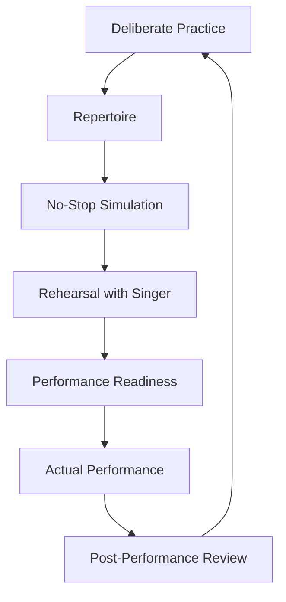
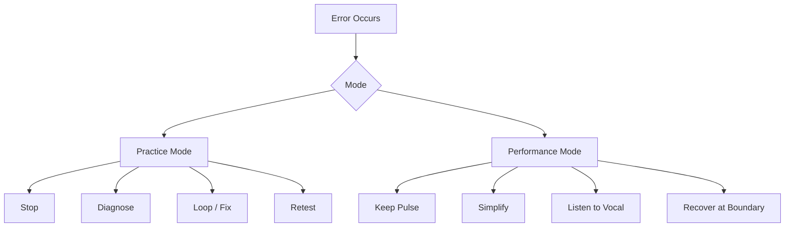
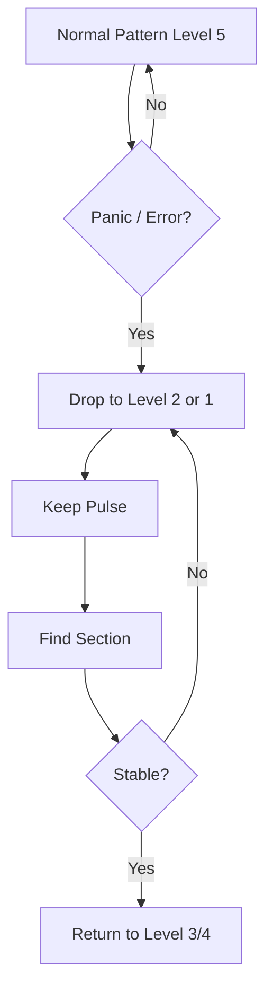
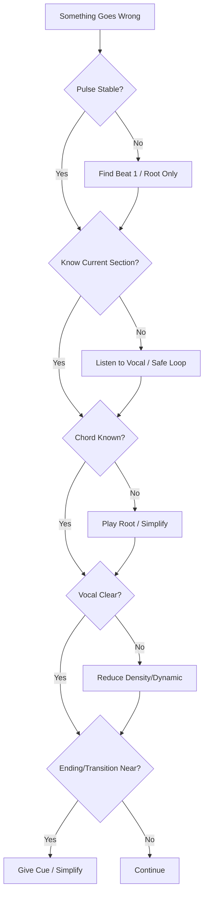
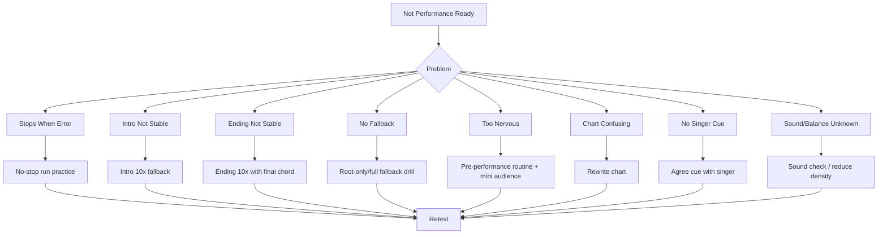
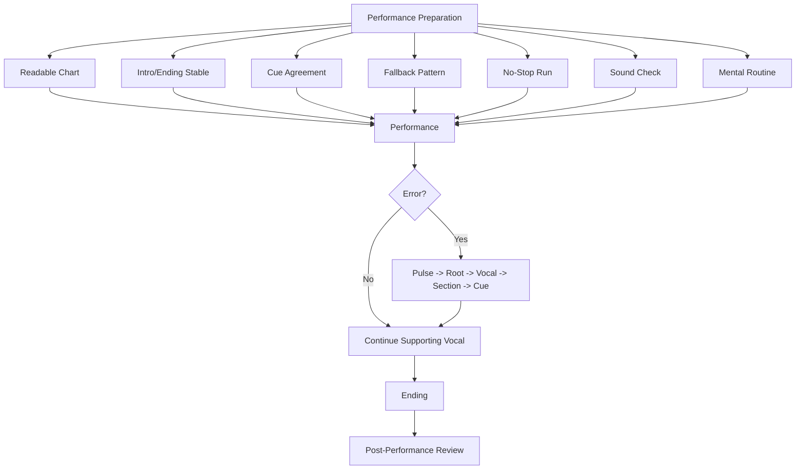

# learn-piano-accompaniment-part-024.md

# Part 024 — Performance Readiness: Simulasi Tampil, Nerve Control, dan Recovery

> Seri: **Learn Piano Accompaniment for Singer Performance**  
> Fokus: **belajar piano untuk mengiringi penyanyi**  
> Framework utama: **The First 20 Hours — Josh Kaufman**  
> Tahap: **Phase I — Dari Practice Room ke Performance**

---

## Status Seri

| Item | Status |
|---|---|
| Part | 024 |
| Nama file | `learn-piano-accompaniment-part-024.md` |
| Fokus | Simulasi tampil, kontrol gugup, fallback pattern, recovery, dan checklist performance |
| Prasyarat | Part 000–023 |
| Output praktis | Bisa menyiapkan diri untuk tampil mengiringi penyanyi dengan no-stop run, cue jelas, dan recovery plan |
| Status seri | Belum selesai |

---

## Daftar Isi

- [1. Tujuan Part Ini](#1-tujuan-part-ini)
- [2. Posisi Part Ini dalam Framework Kaufman](#2-posisi-part-ini-dalam-framework-kaufman)
- [3. Masalah Utama: Bisa di Latihan, Goyah saat Tampil](#3-masalah-utama-bisa-di-latihan-goyah-saat-tampil)
- [4. Mental Model: Practice Mode vs Performance Mode](#4-mental-model-practice-mode-vs-performance-mode)
- [5. Apa Itu Performance Readiness?](#5-apa-itu-performance-readiness)
- [6. Definition of Ready untuk Tampil](#6-definition-of-ready-untuk-tampil)
- [7. Simulasi Tampil: No-Stop Run](#7-simulasi-tampil-no-stop-run)
- [8. Kenapa No-Stop Run Berbeda dari Latihan Biasa](#8-kenapa-no-stop-run-berbeda-dari-latihan-biasa)
- [9. Performance Anxiety: Kenapa Tangan Mendadak Bodoh?](#9-performance-anxiety-kenapa-tangan-mendadak-bodoh)
- [10. Nerve Control: Mengelola Gugup Tanpa Menunggu Hilang](#10-nerve-control-mengelola-gugup-tanpa-menunggu-hilang)
- [11. Pre-Performance Routine](#11-pre-performance-routine)
- [12. Mental Rehearsal](#12-mental-rehearsal)
- [13. Physical Warm-Up yang Relevan](#13-physical-warm-up-yang-relevan)
- [14. Chart Preparation untuk Tampil](#14-chart-preparation-untuk-tampil)
- [15. Sound Check dan Keyboard Setup](#15-sound-check-dan-keyboard-setup)
- [16. Volume Balance: Piano vs Vokal](#16-volume-balance-piano-vs-vokal)
- [17. Pedal, Sustain, dan Risiko Sound Live](#17-pedal-sustain-dan-risiko-sound-live)
- [18. Cue Agreement dengan Penyanyi](#18-cue-agreement-dengan-penyanyi)
- [19. Emergency Mode: Root-Only Fallback](#19-emergency-mode-root-only-fallback)
- [20. Fallback Pattern Level 1–5](#20-fallback-pattern-level-15)
- [21. Recovery saat Salah Chord](#21-recovery-saat-salah-chord)
- [22. Recovery saat Salah Rhythm](#22-recovery-saat-salah-rhythm)
- [23. Recovery saat Lupa Section](#23-recovery-saat-lupa-section)
- [24. Recovery saat Penyanyi Masuk Lebih Cepat/Lambat](#24-recovery-saat-penyanyi-masuk-lebih-cepatlambat)
- [25. Recovery saat Ending Tidak Kompak](#25-recovery-saat-ending-tidak-kompak)
- [26. Recovery saat Pedal atau Sound Bermasalah](#26-recovery-saat-pedal-atau-sound-bermasalah)
- [27. Recovery saat Blank/Panik Total](#27-recovery-saat-blankpanik-total)
- [28. Cara Tetap Mendukung Vokal saat Panik](#28-cara-tetap-mendukung-vokal-saat-panik)
- [29. Performance Decision Tree](#29-performance-decision-tree)
- [30. Simulasi Gangguan](#30-simulasi-gangguan)
- [31. Simulasi dengan Penyanyi](#31-simulasi-dengan-penyanyi)
- [32. Simulasi Mini-Audience](#32-simulasi-mini-audience)
- [33. Rehearsal Terakhir sebelum Tampil](#33-rehearsal-terakhir-sebelum-tampil)
- [34. Hari-H Performance Checklist](#34-hari-h-performance-checklist)
- [35. Saat Lagu Berjalan: Prioritas Real-Time](#35-saat-lagu-berjalan-prioritas-real-time)
- [36. Setelah Tampil: Post-Performance Review](#36-setelah-tampil-post-performance-review)
- [37. Mini Case Study 1: Tangan Gemetar di Intro](#37-mini-case-study-1-tangan-gemetar-di-intro)
- [38. Mini Case Study 2: Salah Chord di Chorus](#38-mini-case-study-2-salah-chord-di-chorus)
- [39. Mini Case Study 3: Penyanyi Mengulang Tag Tanpa Rencana](#39-mini-case-study-3-penyanyi-mengulang-tag-tanpa-rencana)
- [40. Mini Case Study 4: Piano Terlalu Keras di Venue](#40-mini-case-study-4-piano-terlalu-keras-di-venue)
- [41. Latihan 1: No-Stop Run](#41-latihan-1-no-stop-run)
- [42. Latihan 2: Emergency Root-Only](#42-latihan-2-emergency-root-only)
- [43. Latihan 3: Simulasi Salah Chord](#43-latihan-3-simulasi-salah-chord)
- [44. Latihan 4: Simulasi Blank 1 Bar](#44-latihan-4-simulasi-blank-1-bar)
- [45. Latihan 5: Cue dan Ending dengan Penyanyi](#45-latihan-5-cue-dan-ending-dengan-penyanyi)
- [46. Latihan 6: Mini Performance Recording](#46-latihan-6-mini-performance-recording)
- [47. Debugging Performance Readiness](#47-debugging-performance-readiness)
- [48. Failure Mode Pemula](#48-failure-mode-pemula)
- [49. Practice Protocol 7 Hari Menuju Tampil](#49-practice-protocol-7-hari-menuju-tampil)
- [50. Practice Protocol 45 Menit](#50-practice-protocol-45-menit)
- [51. Checklist Kelulusan Part 024](#51-checklist-kelulusan-part-024)
- [52. Ringkasan Mental Model](#52-ringkasan-mental-model)
- [53. Persiapan ke Part 025](#53-persiapan-ke-part-025)

---

# 1. Tujuan Part Ini

Sampai Part 023, kita sudah punya sistem latihan:

- deliberate practice;
- error log;
- problem spot isolation;
- loop 2 bar;
- recording review;
- tempo ladder;
- dynamic/density ladder;
- weekly review;
- repertoire readiness score.

Namun tampil bukan latihan.

Saat tampil, Anda tidak bisa terus berhenti dan mengulang.

Saat tampil, Anda harus:

```text
jalan terus
```

walaupun:

- ada chord salah;
- tangan gemetar;
- penyanyi masuk terlambat;
- sound piano terlalu keras;
- pedal terasa aneh;
- chart hampir jatuh;
- Anda lupa section;
- ending berubah;
- audience melihat;
- adrenaline naik.

Part ini membahas performance readiness.

Target part ini:

> Anda mampu mensimulasikan kondisi tampil, membuat fallback plan, menjaga prioritas saat panik, dan recovery dari error tanpa merusak dukungan terhadap penyanyi.

Part ini bukan tentang “tidak boleh salah”.

Part ini tentang:

```text
bagaimana tetap musikal ketika sesuatu salah
```

Karena di performance nyata, error kecil hampir pasti terjadi.

Yang membedakan pengiring matang dan pemula bukan apakah mereka pernah salah, tetapi:

```text
apakah mereka bisa recovery tanpa menarik perhatian
```

---

# 2. Posisi Part Ini dalam Framework Kaufman

Dalam *The First 20 Hours*, setelah skill dasar mulai fungsional, latihan harus semakin mirip kondisi nyata.

Jika tujuan Anda adalah tampil mengiringi penyanyi, Anda harus melatih:

- no-stop performance;
- cue dengan penyanyi;
- recovery;
- anxiety;
- sound balance;
- ending;
- communication;
- post-performance review.

Diagram:



Part ini adalah jembatan dari:

```text
latihan terkontrol
```

ke:

```text
situasi real-time yang tidak sepenuhnya bisa dikontrol
```

Dalam software analogy:

```text
practice = local development
rehearsal = staging
performance = production
recovery = incident handling
post-review = postmortem
```

---

# 3. Masalah Utama: Bisa di Latihan, Goyah saat Tampil

Banyak orang mengalami:

```text
di rumah bisa
pas tampil berantakan
```

Ini normal.

Bukan berarti Anda tidak berbakat.

Itu berarti practice mode dan performance mode belum dijembatani.

## 3.1 Gejala

- intro yang biasanya lancar mendadak ragu;
- tangan kaku;
- tempo naik;
- pedal berlebihan;
- lupa chord sederhana;
- terlalu keras karena nervous;
- fill terlalu banyak;
- tidak mendengar penyanyi;
- ending tidak kompak;
- salah chord kecil membuat panik besar;
- sulit melihat chart;
- tidak tahu harus recovery bagaimana.

## 3.2 Penyebab

- belum pernah latihan no-stop;
- selalu berhenti saat salah;
- tidak punya fallback pattern;
- terlalu bergantung pada pattern kompleks;
- chart belum performable;
- intro/ending belum otomatis;
- belum latihan dengan vokal;
- belum latihan dalam kondisi sedikit stress;
- tidak ada pre-performance routine;
- tidak tahu prioritas saat panik.

## 3.3 Prinsip

```text
Skill yang hanya bisa muncul dalam kondisi nyaman belum performance-ready.
```

---

# 4. Mental Model: Practice Mode vs Performance Mode

Ada dua mode.

## 4.1 Practice Mode

Tujuan:

```text
memperbaiki error
```

Boleh:

- berhenti;
- mengulang;
- memperlambat;
- isolasi 2 bar;
- eksperimen voicing;
- catat bug;
- memakai metronome;
- debug detail.

## 4.2 Performance Mode

Tujuan:

```text
menjaga lagu tetap berjalan dan mendukung vokal
```

Tidak boleh:

- berhenti karena error kecil;
- mengulang bar sembarangan;
- debug di tengah lagu;
- mencoba voicing baru yang belum aman;
- panik karena chord salah;
- mengorbankan vokal demi pattern.

## 4.3 Mode Switch

Pemula sering membawa practice mode ke performance.

Contoh:

```text
salah chord -> berhenti -> ulang
```

Di performance, ini fatal.

Performance response:

```text
salah chord -> jaga pulse -> lanjut ke chord berikutnya -> recovery
```

## 4.4 Diagram



## 4.5 Prinsip

```text
Practice mode fixes.
Performance mode survives and supports.
```

---

# 5. Apa Itu Performance Readiness?

Performance readiness adalah kemampuan memainkan lagu dalam kondisi nyata dengan risiko terkendali.

Bukan berarti sempurna.

Performance-ready berarti:

- struktur lagu jelas;
- intro aman;
- ending jelas;
- key cocok;
- chart siap;
- pattern cukup otomatis;
- cue disepakati;
- fallback tersedia;
- bisa recovery;
- vokal tetap didukung;
- Anda tidak berhenti total saat error kecil.

## 5.1 Readiness Bukan Confidence Saja

Kadang orang merasa percaya diri tetapi belum siap.

Kadang orang gugup tetapi sebenarnya siap.

Readiness harus dibuktikan dengan:

- no-stop run;
- recording;
- rehearsal;
- checklist;
- fallback plan.

## 5.2 Readiness Level

| Level | Kondisi |
|---:|---|
| 1 | baru bisa chord terpisah |
| 2 | bisa section, sering berhenti |
| 3 | bisa full run sendiri dengan error |
| 4 | bisa no-stop run dan vocal/humming support |
| 5 | bisa rehearsal/performance kecil dengan recovery |

Target awal:

```text
level 4
```

Lalu naik ke level 5.

---

# 6. Definition of Ready untuk Tampil

Sebelum tampil, lagu minimal memenuhi ini.

## 6.1 Chart

- [ ] key final jelas;
- [ ] chord chart rapi;
- [ ] section jelas;
- [ ] repeat/tag jelas;
- [ ] ending jelas;
- [ ] cue marking ada.

## 6.2 Piano

- [ ] intro bisa 5x tanpa ragu;
- [ ] verse/chorus bisa dibedakan;
- [ ] transition utama aman;
- [ ] ending bisa 5x tanpa ragu;
- [ ] fallback pattern tersedia;
- [ ] root-only emergency bisa dimainkan.

## 6.3 Penyanyi

- [ ] key nyaman;
- [ ] intro entry disepakati;
- [ ] chorus entry disepakati;
- [ ] bridge/final chorus disepakati;
- [ ] ending/tag disepakati;
- [ ] cue non-verbal jelas.

## 6.4 Performance

- [ ] no-stop run berhasil;
- [ ] rekaman sudah direview;
- [ ] volume balance dipikirkan;
- [ ] recovery plan diketahui;
- [ ] pre-performance routine siap.

## 6.5 Rule

```text
Jangan tampil dengan intro atau ending yang belum jelas.
Awal dan akhir adalah bagian paling terlihat.
```

---

# 7. Simulasi Tampil: No-Stop Run

No-stop run adalah memainkan lagu dari awal sampai akhir tanpa berhenti, apa pun yang terjadi.

Jika salah:

```text
lanjut
```

Jika lupa:

```text
fallback
```

Jika chord salah:

```text
jaga pulse
```

## 7.1 Tujuan

Melatih performance mode.

## 7.2 Aturan

- tidak berhenti;
- tidak mengulang section;
- tidak mengomentari error;
- tidak memperbaiki di tengah lagu;
- tetap dengar vokal/humming;
- ending harus sampai selesai.

## 7.3 Setelah Selesai

Baru review.

Catat:

- error apa;
- di section mana;
- apakah recovery berhasil;
- apakah ending jelas;
- apakah vokal tetap aman.

## 7.4 Jangan Terlalu Cepat Masuk No-Stop Run

No-stop run berguna jika lagu sudah minimal cukup dipelajari.

Jika chord masih belum tahu, kembali ke practice mode.

## 7.5 Prinsip

```text
Practice mode membangun skill.
No-stop run membangun daya tahan performance.
```

---

# 8. Kenapa No-Stop Run Berbeda dari Latihan Biasa

Saat latihan biasa, Anda punya opsi:

```text
berhenti dan memperbaiki
```

Saat performance, opsi itu hilang.

Maka otak perlu dilatih untuk tetap jalan.

## 8.1 Error Handling

Practice:

```text
throw error -> debug
```

Performance:

```text
catch error -> degrade gracefully -> continue
```

## 8.2 Degrade Gracefully

Dalam piano accompaniment:

```text
voicing rumit -> partial chord
partial chord -> root only
pattern aktif -> block chord
fill -> no fill
```

## 8.3 Performance Memory

No-stop run melatih memori performa:

- lanjut setelah salah;
- tidak panik;
- tahu safe landing;
- tahu ending;
- tetap menjaga pulse.

## 8.4 Rule

```text
Jika Anda selalu berhenti saat latihan, Anda melatih diri untuk berhenti saat tampil.
```

---

# 9. Performance Anxiety: Kenapa Tangan Mendadak Bodoh?

Gugup adalah respons tubuh.

Saat stress:

- detak jantung naik;
- napas pendek;
- tangan dingin/berkeringat;
- otot tegang;
- fokus menyempit;
- working memory turun;
- timing terganggu;
- Anda cenderung main lebih cepat/keras.

Ini normal.

## 9.1 Efek pada Piano

- chord sederhana terasa asing;
- jari kaku;
- pedal berlebihan;
- dynamic tidak terkontrol;
- tempo naik;
- sulit membaca chart;
- sulit mendengar vokal.

## 9.2 Solusi Bukan Menunggu Gugup Hilang

Tujuan realistis:

```text
tetap bisa bermain walau gugup
```

Bukan:

```text
tidak gugup sama sekali
```

## 9.3 Skill Anti-Panic

Skill anti-panic adalah:

- pre-performance routine;
- fallback pattern;
- root-only mode;
- no-stop simulation;
- breathing;
- mental rehearsal;
- chart clarity;
- cue agreement.

## 9.4 Prinsip

```text
Gugup tidak harus hilang.
Sistem Anda harus tetap berjalan saat gugup ada.
```

---

# 10. Nerve Control: Mengelola Gugup Tanpa Menunggu Hilang

Nerve control adalah mengatur tubuh dan perhatian.

## 10.1 Napas

Sebelum mulai:

```text
tarik napas 4 hitungan
tahan 1–2 hitungan
buang napas 6 hitungan
```

Ulang 2–3 kali.

## 10.2 Grounding

Fokus pada hal konkret:

- tuts pertama;
- chord pertama;
- tempo;
- cue penyanyi;
- beat 1.

## 10.3 Simplification

Jika gugup tinggi, jangan mulai dengan intro terlalu rumit.

Gunakan intro aman.

## 10.4 Internal Count

Sebelum mulai:

```text
1 2 3 4
```

atau untuk 6/8:

```text
ONE two three FOUR five six
```

## 10.5 Attention Shift

Alihkan fokus dari:

```text
jangan salah
```

ke:

```text
dukung penyanyi
```

Ini mengurangi self-monitoring berlebihan.

## 10.6 Rule

```text
Nerve control bukan menghapus gugup.
Nerve control adalah mengarahkan energi gugup menjadi pulse, cue, dan fokus.
```

---

# 11. Pre-Performance Routine

Routine membantu otak masuk mode performance.

## 11.1 10 Menit Sebelum

- cek chart;
- cek key;
- cek intro;
- cek ending;
- cek cue dengan penyanyi;
- minum air;
- tarik napas;
- jangan latihan bagian baru.

## 11.2 5 Menit Sebelum

- main chord pertama pelan;
- main ending sekali;
- cek volume;
- cek pedal;
- lihat penyanyi;
- ingat tempo.

## 11.3 1 Menit Sebelum

Pikirkan:

```text
First chord:
Tempo:
Singer entry:
Ending:
Fallback:
```

## 11.4 Jangan

- mencoba voicing baru;
- mengganti key mendadak tanpa perlu;
- membaca chat/hal distraktif;
- latihan cepat sampai tangan tegang;
- panic-scroll chart.

## 11.5 Routine Minimal

```text
Key -> first chord -> tempo -> cue -> ending -> breathe
```

---

# 12. Mental Rehearsal

Mental rehearsal adalah membayangkan performance sebelum bermain.

## 12.1 Apa yang Dibayangkan?

- duduk di piano;
- melihat chart;
- memainkan intro;
- penyanyi masuk;
- verse berjalan;
- chorus naik;
- bridge;
- ending;
- final chord;
- jika salah, Anda recovery.

## 12.2 Mental Rehearsal Error

Jangan hanya membayangkan sempurna.

Bayangkan:

```text
jika salah chord, saya tetap jaga pulse
jika lupa section, saya root-only
jika ending berubah, saya lihat penyanyi
```

## 12.3 Kenapa Berguna?

Karena otak sudah punya script.

Saat stress, script sederhana lebih mudah dieksekusi.

## 12.4 Durasi

2–3 menit cukup.

## 12.5 Rule

```text
Visualize not only success.
Visualize recovery.
```

---

# 13. Physical Warm-Up yang Relevan

Warm-up harus relevan dengan lagu.

## 13.1 Jangan Warm-Up Random Terlalu Lama

Jika lagu butuh `C-G-Am-F`, warm-up dengan progression itu.

## 13.2 Warm-Up Chord Utama

Main:

```text
C - G - Am - F
Am - F - C - G
F - G - C
Gsus4 - G - C
```

## 13.3 Warm-Up Pattern

Main pattern utama:

- verse sparse;
- chorus fuller;
- 6/8 rolling jika perlu.

## 13.4 Warm-Up Ending

Ending wajib dicoba.

Banyak performance gagal di ending.

## 13.5 Warm-Up Tubuh

- lemaskan bahu;
- lemaskan pergelangan;
- jangan angkat bahu;
- napas panjang;
- duduk stabil.

## 13.6 Rule

```text
Warm-up bukan pamer teknik.
Warm-up adalah menyalakan jalur yang akan dipakai tampil.
```

---

# 14. Chart Preparation untuk Tampil

Chart tampil harus terbaca cepat.

## 14.1 Font/Ukuran

Jika print atau tablet:

- cukup besar;
- section bold;
- ending terlihat;
- repeat jelas;
- jangan terlalu padat.

## 14.2 Highlight

Tandai:

- key;
- intro;
- vocal entry;
- repeat;
- bridge;
- final chorus;
- ending;
- tag count;
- ritardando.

## 14.3 Page Turn

Jika chart lebih dari satu halaman, pastikan page turn tidak terjadi di bagian sulit.

Untuk pemula, lebih baik chart ringkas satu halaman jika memungkinkan.

## 14.4 Emergency Notes

Tambahkan:

```text
Fallback: LH root + RH partial
Ending: F-G-C hold
```

## 14.5 Rule

```text
Chart performance harus mengurangi cognitive load, bukan menambah.
```

---

# 15. Sound Check dan Keyboard Setup

Sound yang buruk bisa menghancurkan performance walau chord benar.

## 15.1 Cek Suara Piano

Jika digital keyboard:

- pilih sound piano yang bersih;
- hindari layer pad terlalu tebal jika vokal harus jelas;
- cek sustain;
- cek volume;
- cek output/monitor.

## 15.2 Cek Posisi

Pastikan:

- kursi nyaman;
- pedal tidak bergeser;
- chart terlihat;
- tangan bebas;
- kabel aman;
- monitor cukup terdengar.

## 15.3 Cek Monitor

Jika Anda tidak mendengar penyanyi, accompaniment sulit.

Minta vokal cukup terdengar di monitor.

## 15.4 Cek Venue

Ruangan besar/reverb membuat pedal lebih muddy.

Kurangi sustain/density jika sound terlalu bergema.

## 15.5 Rule

```text
Live sound mengubah cara piano terdengar.
Mainkan sesuai ruangan, bukan hanya sesuai latihan di rumah.
```

---

# 16. Volume Balance: Piano vs Vokal

Vokal harus foreground.

## 16.1 Saat Sound Check

Minta seseorang mendengar dari depan jika bisa.

Tanya:

```text
Vokal jelas?
Piano terlalu keras?
Piano terlalu tipis?
Bass muddy?
```

## 16.2 Saat Tampil

Jika vokal tidak terdengar, kurangi:

- dynamic;
- RH density;
- register tinggi;
- pedal;
- LH heaviness.

## 16.3 Jangan Mengandalkan Feeling dari Posisi Anda

Di posisi pianis, balance bisa berbeda dari audience.

## 16.4 Rule

```text
Jika ragu, accompaniment sedikit lebih lembut lebih aman daripada terlalu keras.
```

## 16.5 Exception

Jika penyanyi ragu pitch, piano bisa memberi chord lebih jelas, tetapi tetap tidak menghantam.

---

# 17. Pedal, Sustain, dan Risiko Sound Live

Pedal yang terdengar bersih di rumah bisa muddy di venue.

## 17.1 Reverb Ruangan

Ruangan bergema membuat sustain lebih panjang.

Solusi:

- pedal lebih sedikit;
- ganti pedal lebih sering;
- kurangi LH rendah;
- kurangi chord padat.

## 17.2 Digital Sustain

Beberapa pedal terasa berbeda.

Cek sebelum tampil.

## 17.3 Pedal Error

Jika pedal bermasalah:

```text
main lebih legato dengan jari
kurangi arpeggio cepat
gunakan chord hold sederhana
```

## 17.4 Final Chord

Pastikan final chord pedal bersih.

Ending yang muddy sangat terdengar.

## 17.5 Rule

```text
Pedal adalah glue.
Saat live, terlalu banyak glue menjadi lumpur.
```

---

# 18. Cue Agreement dengan Penyanyi

Sebelum tampil, sepakati cue.

## 18.1 Cue Masuk

```text
Aku intro 4 bar.
Kamu masuk setelah F.
Aku akan tahan sedikit di bar 4.
```

## 18.2 Cue Chorus

```text
Akhir verse aku kasih Gsus4-G lalu masuk chorus.
```

## 18.3 Cue Bridge

```text
Setelah chorus kedua, kita masuk bridge langsung.
```

## 18.4 Cue Ending

```text
Tag dua kali.
Aku lihat kamu sebelum final C.
Kita ritardando sedikit di G.
```

## 18.5 Jika Ada Perubahan Live

Sepakati gesture:

- eye contact;
- anggukan;
- tangan kecil;
- ulang line;
- final cue.

## 18.6 Rule

```text
Cue yang tidak disepakati hanya asumsi.
```

---

# 19. Emergency Mode: Root-Only Fallback

Root-only fallback adalah mode darurat.

Jika panik:

```text
LH root di beat 1
RH optional
jaga pulse
dengar vokal
```

## 19.1 Kenapa Root-Only Berguna?

Karena root memberi:

- chord identity dasar;
- bass anchor;
- timing;
- tempat untuk recovery;
- safety net untuk penyanyi.

## 19.2 Kapan Dipakai?

- lupa voicing;
- chord terlalu cepat;
- penyanyi loncat section;
- chart tidak terbaca;
- tangan kanan error;
- panik;
- sound terlalu penuh.

## 19.3 Contoh

Progression:

```text
C - G - Am - F
```

Root-only:

```text
LH: C - G - A - F
```

## 19.4 Tambah RH Setelah Stabil

Jika sudah aman:

```text
RH partial di beat 1 atau 3
```

## 19.5 Rule

```text
Root-only yang stabil lebih baik daripada voicing lengkap yang membuat lagu berhenti.
```

---

# 20. Fallback Pattern Level 1–5

Buat fallback ladder.

## 20.1 Level 1: Root Only

```text
LH root on beat 1
```

## 20.2 Level 2: Root + RH Partial

```text
LH root
RH 2 notes
```

## 20.3 Level 3: Sparse Block

```text
X - - -
```

## 20.4 Level 4: Half Pulse

```text
X - x -
```

## 20.5 Level 5: Full Pattern

```text
pop ballad comping / 6/8 rolling
```

## 20.6 Performance Rule

Saat panik, turun level.

Saat stabil, boleh naik lagi.

Diagram:



---

# 21. Recovery saat Salah Chord

Salah chord kecil tidak harus fatal.

## 21.1 Jangan Berhenti

Hal terburuk biasanya bukan chord salah, tetapi berhenti.

## 21.2 Jaga Rhythm

Jika chord salah tetapi rhythm stabil, pendengar sering tidak terlalu sadar.

## 21.3 Pindah ke Chord Berikutnya

Jangan mencoba memperbaiki chord salah dengan mengulang bar.

Lanjut.

## 21.4 Simplify

Setelah salah:

```text
turun ke root + partial
```

sementara.

## 21.5 Jangan Wajah Panik

Ekspresi panik memberi tahu semua orang ada error.

Tetap tenang.

## 21.6 Rule

```text
Chord salah satu beat lebih kecil daripada pulse yang berhenti satu bar.
```

---

# 22. Recovery saat Salah Rhythm

Salah rhythm bisa lebih terasa daripada salah chord.

## 22.1 Cari Beat 1

Jika rhythm kacau, cari beat 1 berikutnya.

## 22.2 Kurangi Pattern

Turun ke:

```text
X - - -
```

atau root only.

## 22.3 Dengarkan Vokal

Vokal bisa membantu menemukan phrase.

## 22.4 Jangan Fill

Saat rhythm kacau, fill memperburuk.

## 22.5 Metode Recovery

```text
stop RH
LH root on next beat 1
re-enter sparse
```

## 22.6 Rule

```text
Saat rhythm hilang, jangan tambah notes.
Kurangi notes dan temukan pulse.
```

---

# 23. Recovery saat Lupa Section

Jika lupa section, jangan panik.

## 23.1 Dengar Lirik

Lirik memberi tahu state.

Apakah penyanyi di verse, chorus, bridge, atau ending?

## 23.2 Gunakan Safe Loop

Jika tidak tahu, gunakan progression yang sedang berjalan atau chord root sederhana.

## 23.3 Lihat Penyanyi

Cari cue.

## 23.4 Masuk di Phrase Boundary

Jangan memaksakan pindah di tengah frase.

## 23.5 Turun Texture

Saat mencari section:

```text
LH root + RH partial
```

## 23.6 Rule

```text
Jika lost, jadilah sederhana dan dengarkan vokal.
```

---

# 24. Recovery saat Penyanyi Masuk Lebih Cepat/Lambat

Penyanyi adalah runtime truth.

## 24.1 Masuk Lebih Cepat

Jika penyanyi jelas masuk chorus lebih cepat:

- ikuti ke chorus;
- cari chord C/I di strong beat;
- jangan tetap memaksakan verse;
- kurangi texture.

## 24.2 Masuk Terlambat

Jika penyanyi terlambat entry:

- tahan pulse;
- gunakan sparse pattern;
- beri ruang;
- jangan fill panjang di atas napas.

## 24.3 Penyanyi Mengulang Phrase

Loop progression.

Tunggu cue.

## 24.4 Penyanyi Lupa Lirik

Jaga safe loop, turunkan density.

## 24.5 Rule

```text
Chart is plan.
Singer is runtime.
```

---

# 25. Recovery saat Ending Tidak Kompak

Ending rawan.

## 25.1 Jika Penyanyi Masih Lanjut

Jangan berhenti.

Ikuti dengan tag/loop pendek.

## 25.2 Jika Penyanyi Berhenti Lebih Cepat

Cari cadence ke tonic.

Dalam key C:

```text
G -> C
F -> G -> C
Gsus4 -> G -> C
```

## 25.3 Jika Tag Count Berbeda

Ikuti vocal line.

Gunakan safe tag progression:

```text
F - G - C
```

## 25.4 Jika Ritardando Tidak Sinkron

Kurangi complexity.

Ikuti napas penyanyi.

## 25.5 Final Chord

Saat final jelas, tahan chord dengan pedal bersih.

## 25.6 Rule

```text
Ending harus mengikuti manusia, bukan hanya chart.
```

---

# 26. Recovery saat Pedal atau Sound Bermasalah

## 26.1 Pedal Tidak Berfungsi

Main lebih sederhana:

- block chord;
- legato finger;
- less arpeggio;
- fewer sustained textures.

## 26.2 Pedal Terlalu Sensitif

Gunakan pedal lebih sedikit.

## 26.3 Piano Terlalu Keras

Kurangi touch.

Jika bisa, turunkan volume.

Kurangi LH.

## 26.4 Piano Tidak Terdengar

Main beat 1 lebih jelas.

Tapi jangan memukul berlebihan.

## 26.5 Monitor Buruk

Jika tidak dengar vokal:

- lihat penyanyi;
- main lebih sederhana;
- jaga pulse;
- hindari fill.

## 26.6 Rule

```text
Saat sound bermasalah, simplicity adalah teman.
```

---

# 27. Recovery saat Blank/Panik Total

Blank bisa terjadi.

## 27.1 Stop Internal Spiral

Jangan berpikir:

```text
saya gagal
```

Pikirkan:

```text
root berikutnya apa?
beat 1 mana?
vokal sedang di mana?
```

## 27.2 Emergency Steps

```text
1. breathe
2. find pulse
3. play root on beat 1
4. listen to vocal
5. add RH partial
6. rejoin section
```

## 27.3 Jika Tidak Tahu Chord

Main tonic atau root yang terdengar aman, lalu dengar.

Dalam key C, safe chord sering:

```text
C
G
Am
F
```

## 27.4 Jika Harus Diam

Diam sebentar lebih baik daripada random notes.

Tetapi tetap tahu kapan masuk lagi.

## 27.5 Rule

```text
Saat blank, jangan cari semua jawaban.
Cari satu hal: pulse atau root.
```

---

# 28. Cara Tetap Mendukung Vokal saat Panik

Saat panik, jangan menjadikan piano pusat.

## 28.1 Prioritas

```text
vokal
pulse
root/chord
space
ending
```

## 28.2 Jangan

- fill;
- chord color rumit;
- RH tinggi;
- pedal tebal;
- dynamic besar;
- eksperimen.

## 28.3 Lakukan

- root jelas;
- RH partial;
- dynamic turun;
- dengar napas;
- beri cue sederhana;
- ikuti phrase.

## 28.4 Jika Penyanyi Kuat

Biarkan vokal membawa lagu.

Piano cukup menjadi fondasi.

## 28.5 Rule

```text
Saat pianis panik, tugasnya bukan terdengar hebat.
Tugasnya tidak mengganggu vokal.
```

---

# 29. Performance Decision Tree

Gunakan decision tree mental.



## 29.1 Sederhana

Dalam kepala, cukup ingat:

```text
Pulse -> Section -> Root -> Vocal -> Cue
```

## 29.2 Rule

Jika tidak tahu harus apa:

```text
jaga pulse dan kurangi notes
```

---

# 30. Simulasi Gangguan

Performance readiness butuh latihan gangguan.

## 30.1 Simulasi Salah Chord

Sengaja main chord salah, lalu recovery.

## 30.2 Simulasi Lupa Section

Tutup bagian chart sebentar, lalu cari kembali.

## 30.3 Simulasi Pedal Tanpa Sustain

Main lagu tanpa pedal.

## 30.4 Simulasi Tempo Drift

Minta metronome off, lalu rekam apakah tempo stabil.

## 30.5 Simulasi Vokal Masuk Cepat

Humming chorus lebih cepat dari rencana.

## 30.6 Simulasi Audience

Rekam video dan bayangkan sedang ditonton.

## 30.7 Rule

```text
Simulasi kecil membuat kejutan nyata tidak terlalu mengejutkan.
```

---

# 31. Simulasi dengan Penyanyi

Jika ada penyanyi, lakukan performance simulation.

## 31.1 Aturan

- mulai seperti tampil;
- tidak berhenti;
- gunakan cue;
- ending sampai selesai;
- review setelah selesai.

## 31.2 Simulasi 1

Normal run.

## 31.3 Simulasi 2

Penyanyi sengaja menahan frase.

Piano harus adaptasi.

## 31.4 Simulasi 3

Penyanyi sengaja mengulang tag.

Piano harus follow.

## 31.5 Simulasi 4

Penyanyi masuk chorus sedikit lebih cepat.

Piano recovery.

## 31.6 Review

Tanya penyanyi:

```text
Cue jelas?
Piano terlalu ramai?
Kamu merasa aman?
Ending enak?
Ada bagian yang membuat ragu?
```

---

# 32. Simulasi Mini-Audience

Tampil di depan satu orang atau kamera.

## 32.1 Kenapa?

Karena presence of observer mengubah tubuh.

Latihan sendiri tidak sama.

## 32.2 Level

Level 1:

```text
rekam audio
```

Level 2:

```text
rekam video
```

Level 3:

```text
main di depan satu teman
```

Level 4:

```text
main di depan 2–3 orang
```

Level 5:

```text
small live performance
```

## 32.3 Rule

Naik level bertahap.

## 32.4 Fokus

Tujuan mini-audience bukan validasi ego.

Tujuannya melatih nervous system.

---

# 33. Rehearsal Terakhir sebelum Tampil

Rehearsal terakhir bukan tempat overhaul.

## 33.1 Jangan Mengubah Banyak Hal

Hindari:

- key baru mendadak;
- intro baru;
- ending baru;
- voicing rumit baru;
- pattern baru.

## 33.2 Fokus

- cue;
- ending;
- tempo;
- balance;
- repeat/tag;
- first chord;
- last chord.

## 33.3 Run

Lakukan 1–2 full run.

Jangan terlalu banyak sampai lelah.

## 33.4 Catat Final Agreement

```text
Intro 4 bar
Verse x2
Chorus x2
Bridge
Final chorus x2
Tag x2
Ending F-G-C hold
```

## 33.5 Rule

```text
Rehearsal terakhir menstabilkan, bukan mengeksperimen.
```

---

# 34. Hari-H Performance Checklist

## 34.1 Sebelum Berangkat

- [ ] chart ada;
- [ ] charger/tablet jika perlu;
- [ ] pedal jika membawa sendiri;
- [ ] adaptor/kabel jika perlu;
- [ ] key final dicatat;
- [ ] song order jelas.

## 34.2 Di Venue

- [ ] cek keyboard/piano;
- [ ] cek pedal;
- [ ] cek volume;
- [ ] cek monitor vokal;
- [ ] cek posisi chart;
- [ ] cek kursi;
- [ ] cek lighting/chart visibility.

## 34.3 Dengan Penyanyi

- [ ] intro cue;
- [ ] entry vocal;
- [ ] repeat/tag;
- [ ] ending cue;
- [ ] emergency gesture.

## 34.4 Sebelum Mulai

- [ ] napas;
- [ ] tempo internal;
- [ ] first chord;
- [ ] first section;
- [ ] ending memory;
- [ ] fallback mode.

## 34.5 Setelah Selesai

- [ ] tahan final chord cukup;
- [ ] jangan langsung panik komentar;
- [ ] lepaskan pedal natural;
- [ ] acknowledge penyanyi/audience.

---

# 35. Saat Lagu Berjalan: Prioritas Real-Time

Saat performance, prioritas harus jelas.

## 35.1 Normal Condition

```text
1. dengar vokal
2. jaga pulse
3. main chord/texture
4. cue section
5. shape dynamic
```

## 35.2 Error Condition

```text
1. jaga pulse
2. root/chord sederhana
3. dengar vokal
4. cari section
5. recovery di boundary
```

## 35.3 Transition Condition

```text
1. bar count
2. cue
3. next chord beat 1
4. dynamic shift
5. minimal fill
```

## 35.4 Ending Condition

```text
1. final lyric
2. tag count
3. cue visual/audio
4. cadence
5. final chord clean
```

## 35.5 Rule

```text
Dalam performance, prioritas rendah seperti fill/voicing fancy harus rela dibuang.
```

---

# 36. Setelah Tampil: Post-Performance Review

Setelah tampil, jangan hanya merasa:

```text
jelek / bagus
```

Lakukan review.

## 36.1 Pertanyaan

```text
Apa yang berjalan baik?
Bagian mana yang hampir gagal?
Apakah cue jelas?
Apakah ending jelas?
Apakah vokal merasa aman?
Apakah tempo stabil?
Apakah piano terlalu ramai?
Apa satu hal yang diperbaiki untuk next performance?
```

## 36.2 Jangan Over-Criticize

Performance review bukan self-attack.

Ini postmortem.

## 36.3 Catat Action Item

Contoh:

```text
Song 2: ending tag harus disepakati lagi.
Song 3: pedal terlalu banyak di venue.
Song 1: intro cue sudah bagus.
```

## 36.4 Update Repertoire

Jika lagu berhasil, status naik.

Jika ada bug, masuk practice backlog.

## 36.5 Rule

```text
Setiap performance adalah feedback loop.
```

---

# 37. Mini Case Study 1: Tangan Gemetar di Intro

## 37.1 Situasi

Anda akan mulai lagu.

Tangan gemetar.

Intro seharusnya broken chord.

## 37.2 Risiko

Broken chord menjadi tidak stabil.

Penyanyi ragu masuk.

## 37.3 Solusi

Turunkan intro ke fallback:

```text
LH root + RH block chord sparse
```

Pattern:

```text
X - - -
```

Bar terakhir beri cue jelas.

## 37.4 Setelah Stabil

Di verse, tetap sparse sampai tangan lebih tenang.

## 37.5 Prinsip

```text
Intro sederhana dan jelas lebih baik daripada intro indah tapi goyah.
```

---

# 38. Mini Case Study 2: Salah Chord di Chorus

## 38.1 Situasi

Chorus:

```text
C - G - Am - F
```

Anda salah memainkan Em di bar Am.

## 38.2 Jangan

- berhenti;
- meringis;
- ulang bar;
- langsung fill panik.

## 38.3 Lakukan

- jaga rhythm;
- pindah ke F berikutnya;
- lanjut;
- turunkan density sejenak jika perlu.

## 38.4 Jika Penyanyi Aman

Pendengar kemungkinan tidak terlalu sadar.

## 38.5 Catat Setelah Tampil

Bug:

```text
Chorus bar 3 Am sering tertukar Em
```

Latih kemudian.

---

# 39. Mini Case Study 3: Penyanyi Mengulang Tag Tanpa Rencana

## 39.1 Situasi

Ending disepakati tag x2.

Penyanyi mengulang tag x3 karena emosi.

## 39.2 Solusi

Ikuti penyanyi.

Loop:

```text
F - G - C
```

Tetap soft.

Cari eye contact untuk final.

## 39.3 Jangan

Berhenti setelah tag x2 jika penyanyi jelas lanjut.

## 39.4 Ending

Saat penyanyi memberi final cue, gunakan:

```text
Gsus4 - G - C
```

atau final C hold.

## 39.5 Prinsip

```text
Tag live mengikuti vokal dan cue, bukan angka di chart saja.
```

---

# 40. Mini Case Study 4: Piano Terlalu Keras di Venue

## 40.1 Situasi

Di latihan balance enak.

Di venue, piano terasa terlalu besar dan menutup vokal.

## 40.2 Solusi

- turunkan volume jika bisa;
- kurangi LH;
- kurangi RH density;
- main lebih lembut;
- kurangi pedal;
- hindari register tinggi;
- gunakan partial chord.

## 40.3 Jangan

Menaikkan vocal support dengan cara piano makin ramai.

## 40.4 Setelah Tampil

Catat:

```text
Venue reverb tinggi, next time reduce pedal/density.
```

## 40.5 Prinsip

```text
Performance arrangement harus adaptif terhadap ruangan.
```

---

# 41. Latihan 1: No-Stop Run

Pilih satu lagu repertoire.

## 41.1 Aturan

- main dari intro sampai ending;
- tidak berhenti;
- jika salah, lanjut;
- rekam;
- review setelah selesai.

## 41.2 Score

Beri skor 1–5:

```text
Chord:
Timing:
Structure:
Vocal Support:
Ending:
Recovery:
```

## 41.3 Repeat

Lakukan maksimal 2–3 take.

Jangan 10 take tanpa review.

## 41.4 Tujuan

Melatih performance mode.

---

# 42. Latihan 2: Emergency Root-Only

Pilih lagu.

Main full song dengan:

```text
LH root only
```

atau:

```text
LH root + RH partial
```

## 42.1 Tujuan

Agar fallback benar-benar bisa dipakai.

## 42.2 Variasi

Di tengah lagu, sengaja turun ke root-only selama 4 bar, lalu naik lagi ke pattern normal.

## 42.3 Evaluasi

- apakah lagu tetap jalan?
- apakah vokal/humming masih bisa masuk?
- apakah section tetap jelas?
- apakah root cukup stabil?

## 42.4 Rule

Fallback harus dilatih, bukan hanya diketahui.

---

# 43. Latihan 3: Simulasi Salah Chord

Pilih progression:

```text
C - G - Am - F
```

## 43.1 Tugas

Sengaja main chord salah di bar 3.

Lalu recovery tanpa berhenti.

## 43.2 Level

Level 1:

```text
salah chord, lanjut ke chord berikutnya
```

Level 2:

```text
salah chord saat humming
```

Level 3:

```text
salah chord di transition
```

## 43.3 Evaluasi

- apakah pulse tetap?
- apakah wajah/tubuh panik?
- apakah Anda menambah fill panik?
- apakah recovery di bar berikutnya?

---

# 44. Latihan 4: Simulasi Blank 1 Bar

Ini latihan mental.

## 44.1 Cara

Saat bermain full run, sengaja “blank” satu bar:

- RH berhenti;
- LH root only;
- dengar vokal/humming;
- lanjut bar berikutnya.

## 44.2 Tujuan

Membuktikan bahwa lagu tidak harus mati saat Anda mengurangi notes.

## 44.3 Variasi

Blank di:

- verse;
- chorus;
- bridge;
- ending preparation.

## 44.4 Rule

```text
Saat blank, root dan pulse cukup untuk bertahan.
```

---

# 45. Latihan 5: Cue dan Ending dengan Penyanyi

Jika ada penyanyi, latih hanya cue/ending.

## 45.1 Intro Entry

Ulang 5x:

```text
intro 4 bar -> vocal entry
```

## 45.2 Verse to Chorus

Ulang 5x:

```text
last 2 bar verse -> chorus entry
```

## 45.3 Bridge to Final Chorus

Ulang 5x.

## 45.4 Ending

Ulang 5x:

```text
tag x2 -> final chord
```

## 45.5 Evaluasi

Tanya:

```text
cue jelas?
terlalu cepat?
terlalu lama?
ending nyaman?
```

---

# 46. Latihan 6: Mini Performance Recording

Buat simulasi 1–2 lagu.

## 46.1 Setup

- rekam video;
- gunakan chart seperti tampil;
- mulai dengan napas;
- tidak berhenti.

## 46.2 Setelah Selesai

Jangan langsung ulang.

Review:

- timing;
- chord;
- vocal support;
- body tension;
- recovery;
- ending.

## 46.3 Catat

```text
Performance simulation take:
What went well:
Near failure:
Recovery:
Next fix:
```

## 46.4 Tujuan

Membiasakan tubuh dengan rasa “sedang dinilai”.

---

# 47. Debugging Performance Readiness

Jika belum siap tampil, debug.



## 47.1 Stops When Error

Latih no-stop.

## 47.2 Intro Not Stable

Sederhanakan intro.

## 47.3 Ending Not Stable

Latih ending lebih banyak daripada bagian tengah.

## 47.4 No Fallback

Latih root-only.

## 47.5 Too Nervous

Simulasi audience bertahap.

## 47.6 Chart Confusing

Chart harus diperbaiki, bukan dipaksa.

## 47.7 No Singer Cue

Komunikasikan.

## 47.8 Sound Unknown

Sound check dan adaptasi.

---

# 48. Failure Mode Pemula

## 48.1 Menganggap Performance Harus Sempurna

Perfeksionisme membuat panik.

Target awal:

```text
stable and supportive
```

## 48.2 Tidak Pernah No-Stop Run

Akhirnya saat tampil, error kecil membuat berhenti.

## 48.3 Intro Terlalu Rumit

Intro adalah entry, bukan pamer.

## 48.4 Ending Tidak Dilatih

Ending sering lebih penting dari bagian tengah.

## 48.5 Tidak Punya Fallback

Saat panik, tidak tahu harus turun ke mana.

## 48.6 Tidak Sepakat Cue

Penyanyi dan pianis punya asumsi berbeda.

## 48.7 Chart Terlalu Padat

Saat gugup, chart padat sulit dibaca.

## 48.8 Overplay karena Nervous

Gugup sering membuat pianis main terlalu banyak.

## 48.9 Tidak Mendengar Vokal

Saat panik, fokus ke tangan. Ini membuat accompaniment gagal.

## 48.10 Tidak Review Setelah Tampil

Setiap performance harus menjadi feedback loop.

---

# 49. Practice Protocol 7 Hari Menuju Tampil

## Hari 1 — Stabilkan Chart

- final key;
- final structure;
- final ending;
- cue marking;
- chart readable.

## Hari 2 — Intro dan Ending

- intro 10x;
- ending 10x;
- final chord hold;
- pedal clean.

## Hari 3 — Transitions

- verse to chorus;
- chorus to bridge;
- bridge to final chorus;
- final chorus to ending.

## Hari 4 — No-Stop Run

- full run;
- no stopping;
- record;
- error log.

## Hari 5 — Vocal/Rehearsal

- dengan penyanyi atau humming;
- cue;
- dynamic balance;
- ending.

## Hari 6 — Mini Performance

- video recording;
- mini audience jika bisa;
- no-stop;
- review.

## Hari 7 — Light Review

- jangan overhaul;
- warm-up relevant;
- mental rehearsal;
- rest cukup;
- final checklist.

## Prinsip

```text
Semakin dekat ke performance, semakin sedikit eksperimen.
```

---

# 50. Practice Protocol 45 Menit

Gunakan untuk performance readiness.

## 50.1 Menit 0–5: Performance Goal

Tulis:

```text
Song:
Performance risk:
Fallback:
Ending:
```

## 50.2 Menit 5–10: Intro/Ending Drill

Intro 3x.

Ending 3x.

## 50.3 Menit 10–20: Transition Drill

Latih transition rawan.

## 50.4 Menit 20–25: Emergency Fallback

Main section dengan root-only/partial.

## 50.5 Menit 25–35: No-Stop Run

Main full lagu tanpa berhenti.

## 50.6 Menit 35–40: Record Review

Dengarkan bagian rawan.

## 50.7 Menit 40–45: Update Plan

Catat:

```text
Ready score:
Main risk:
Next fix:
Performance note:
```

---

# 51. Checklist Kelulusan Part 024

Anda boleh lanjut ke Part 025 jika sebagian besar checklist ini terpenuhi.

## 51.1 Pemahaman

- [ ] Saya tahu practice mode berbeda dari performance mode.
- [ ] Saya tahu no-stop run melatih performance mode.
- [ ] Saya tahu performance-ready bukan berarti sempurna.
- [ ] Saya tahu gugup tidak harus hilang agar bisa tampil.
- [ ] Saya tahu pre-performance routine membantu stabilitas.
- [ ] Saya tahu chart tampil harus mengurangi cognitive load.
- [ ] Saya tahu cue dengan penyanyi harus disepakati.
- [ ] Saya tahu root-only fallback adalah emergency mode.
- [ ] Saya tahu recovery lebih penting daripada tidak pernah salah.
- [ ] Saya tahu post-performance review adalah feedback loop.

## 51.2 Praktik

- [ ] Saya bisa melakukan no-stop run satu lagu.
- [ ] Saya bisa memainkan root-only fallback untuk satu lagu.
- [ ] Saya bisa memainkan intro sederhana jika tangan gemetar.
- [ ] Saya bisa recovery dari salah chord tanpa berhenti.
- [ ] Saya bisa recovery dari salah rhythm dengan mencari beat 1.
- [ ] Saya bisa menggunakan safe loop jika lupa section.
- [ ] Saya bisa menyepakati cue intro/ending dengan penyanyi.
- [ ] Saya bisa melakukan mini performance recording.
- [ ] Saya bisa membuat Hari-H performance checklist.
- [ ] Saya bisa melakukan post-performance review.

## 51.3 Self-Correction

- [ ] Saya bisa mendeteksi jika intro terlalu rumit untuk tampil.
- [ ] Saya bisa mendeteksi jika ending belum performance-ready.
- [ ] Saya bisa menurunkan fallback level saat panik.
- [ ] Saya bisa mengurangi density jika piano menutup vokal.
- [ ] Saya bisa menyesuaikan pedal jika ruangan terlalu bergema.
- [ ] Saya bisa membedakan error kecil dan error struktural.
- [ ] Saya bisa membuat recovery plan untuk lagu repertoire.
- [ ] Saya bisa mencatat action item setelah simulasi/performance.

---

# 52. Ringkasan Mental Model

Performance readiness adalah kemampuan menjalankan lagu dalam kondisi tidak sempurna.

```text
practice mode = fix bugs
performance mode = continue, support, recover
```

Saat error:

```text
jaga pulse
turun ke fallback
dengar vokal
cari section
recovery di boundary
```

Diagram akhir:



Kalimat kunci:

```text
Performance bukan tempat mencari kesempurnaan.
Performance adalah tempat menjaga lagu tetap hidup dan penyanyi tetap aman.
```

Dan:

```text
Saat panik, jangan main lebih banyak.
Main lebih sedikit, lebih jelas, dan lebih mendengar.
```

---

# 53. Persiapan ke Part 025

Part berikutnya adalah:

```text
learn-piano-accompaniment-part-025.md
```

Judul:

```text
Sound, Gear, dan Setup untuk Piano Accompaniment
```

Sampai Part 024, kita sudah membahas kesiapan tampil secara musikal dan mental.

Namun performance nyata juga dipengaruhi setup fisik dan teknis:

- keyboard/piano;
- pedal;
- stand;
- sustain;
- sound piano;
- speaker;
- monitor;
- volume balance;
- EQ basic;
- reverb;
- transpose button;
- split/layer;
- tablet/chart;
- cable/adaptor;
- latency;
- rehearsal/sound check;
- backup plan.

Part 025 akan membahas setup praktis agar permainan yang sudah dilatih bisa terdengar baik di ruangan nyata.

---

## Status Akhir Part 024

```text
Part 024 selesai.
Seri belum selesai.
Lanjut ke Part 025.
```
