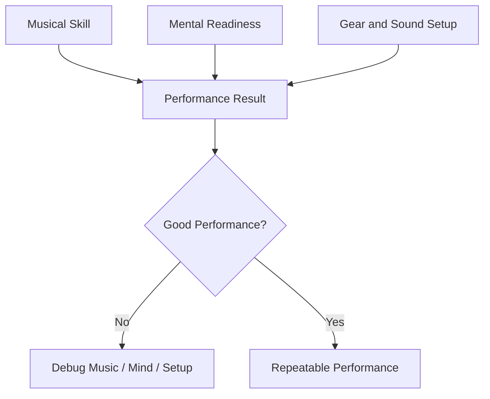
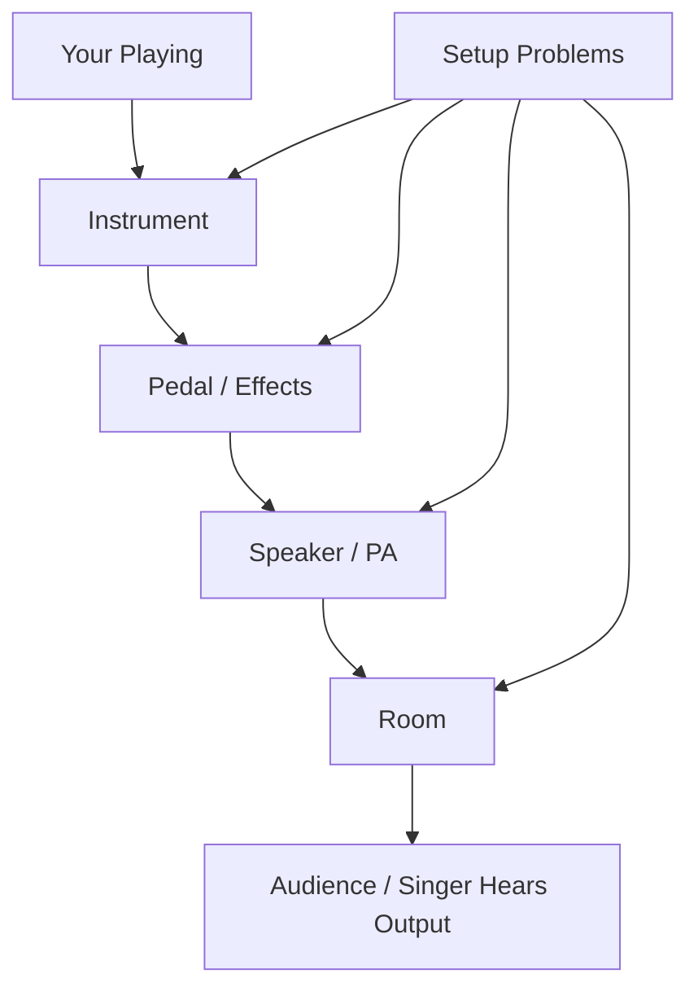
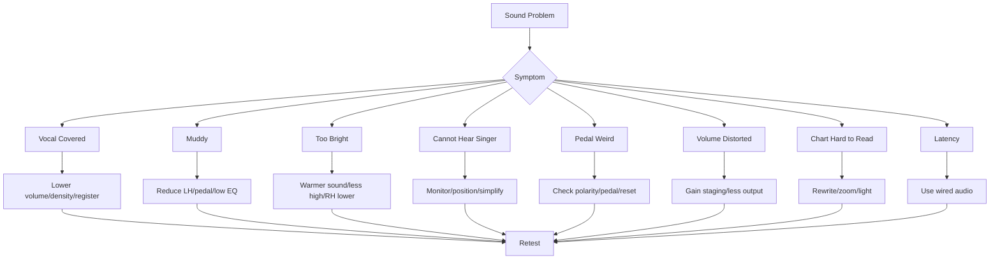
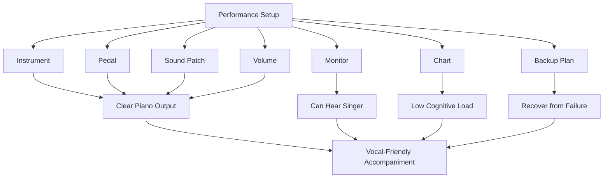

# learn-piano-accompaniment-part-025.md

# Part 025 — Sound, Gear, dan Setup untuk Piano Accompaniment

> Seri: **Learn Piano Accompaniment for Singer Performance**  
> Fokus: **belajar piano untuk mengiringi penyanyi**  
> Framework utama: **The First 20 Hours — Josh Kaufman**  
> Tahap: **Phase I — Dari Practice Room ke Performance**

---

## Status Seri

| Item | Status |
|---|---|
| Part | 025 |
| Nama file | `learn-piano-accompaniment-part-025.md` |
| Fokus | Setup praktis keyboard/piano, pedal, volume, monitor, EQ, reverb, chart, kabel, dan sound check untuk mengiringi penyanyi |
| Prasyarat | Part 000–024 |
| Output praktis | Bisa menyiapkan setup piano accompaniment yang stabil, terdengar jelas, tidak menutup vokal, dan punya backup plan |
| Status seri | Belum selesai |

---

## Daftar Isi

- [1. Tujuan Part Ini](#1-tujuan-part-ini)
- [2. Posisi Part Ini dalam Framework Kaufman](#2-posisi-part-ini-dalam-framework-kaufman)
- [3. Masalah Utama: Mainnya Benar, Sound-nya Merusak](#3-masalah-utama-mainnya-benar-sound-nya-merusak)
- [4. Mental Model: Gear sebagai Runtime Environment](#4-mental-model-gear-sebagai-runtime-environment)
- [5. Prinsip Utama Setup Piano Pengiring](#5-prinsip-utama-setup-piano-pengiring)
- [6. Piano Akustik vs Digital Keyboard vs Stage Piano](#6-piano-akustik-vs-digital-keyboard-vs-stage-piano)
- [7. Keyboard Action: Weighted, Semi-Weighted, Synth Action](#7-keyboard-action-weighted-semi-weighted-synth-action)
- [8. Jumlah Tuts: 61, 73, 76, 88](#8-jumlah-tuts-61-73-76-88)
- [9. Sound Piano: Bright, Warm, Dark, Layered](#9-sound-piano-bright-warm-dark-layered)
- [10. Memilih Sound untuk Mengiringi Vokal](#10-memilih-sound-untuk-mengiringi-vokal)
- [11. Layer Pad/String: Kapan Berguna, Kapan Berbahaya](#11-layer-padstring-kapan-berguna-kapan-berbahaya)
- [12. Sustain Pedal: Fungsi, Risiko, dan Setup](#12-sustain-pedal-fungsi-risiko-dan-setup)
- [13. Pedal Polarity dan Masalah Pedal Terbalik](#13-pedal-polarity-dan-masalah-pedal-terbalik)
- [14. Stand, Bench, dan Ergonomi](#14-stand-bench-dan-ergonomi)
- [15. Speaker, Amplifier, PA, dan Monitor](#15-speaker-amplifier-pa-dan-monitor)
- [16. Monitor untuk Mendengar Penyanyi](#16-monitor-untuk-mendengar-penyanyi)
- [17. Volume Balance: Piano Harus Mendukung, Bukan Menutup](#17-volume-balance-piano-harus-mendukung-bukan-menutup)
- [18. Gain Staging Versi Praktis](#18-gain-staging-versi-praktis)
- [19. EQ Basic untuk Piano Pengiring](#19-eq-basic-untuk-piano-pengiring)
- [20. Low-End Mud: Kenapa Bass Piano Bisa Keruh](#20-low-end-mud-kenapa-bass-piano-bisa-keruh)
- [21. Midrange: Area Benturan Piano dan Vokal](#21-midrange-area-benturan-piano-dan-vokal)
- [22. High-End: Sparkle vs Tajam](#22-high-end-sparkle-vs-tajam)
- [23. Reverb: Ruang, Bukan Kabut](#23-reverb-ruang-bukan-kabut)
- [24. Delay dan Effect Lain: Pakai Minimal](#24-delay-dan-effect-lain-pakai-minimal)
- [25. Transpose Button: Berguna tetapi Berbahaya](#25-transpose-button-berguna-tetapi-berbahaya)
- [26. Split dan Layer: Kapan Perlu](#26-split-dan-layer-kapan-perlu)
- [27. Metronome/Click: Latihan vs Performance](#27-metronomeclick-latihan-vs-performance)
- [28. Chart Setup: Kertas, Tablet, dan Page Turn](#28-chart-setup-kertas-tablet-dan-page-turn)
- [29. Lighting, Visibility, dan Cognitive Load](#29-lighting-visibility-dan-cognitive-load)
- [30. Kabel, Adaptor, Power, dan Failure Point](#30-kabel-adaptor-power-dan-failure-point)
- [31. Latency dan Bluetooth: Jangan Ambil Risiko](#31-latency-dan-bluetooth-jangan-ambil-risiko)
- [32. Recording Setup Sederhana untuk Review](#32-recording-setup-sederhana-untuk-review)
- [33. Sound Check Workflow](#33-sound-check-workflow)
- [34. Rehearsal Setup Checklist](#34-rehearsal-setup-checklist)
- [35. Performance Setup Checklist](#35-performance-setup-checklist)
- [36. Backup Plan: Jika Pedal, Sound, atau Chart Bermasalah](#36-backup-plan-jika-pedal-sound-atau-chart-bermasalah)
- [37. Setup untuk Rumah](#37-setup-untuk-rumah)
- [38. Setup untuk Rehearsal Kecil](#38-setup-untuk-rehearsal-kecil)
- [39. Setup untuk Cafe/Acoustic Live](#39-setup-untuk-cafeacoustic-live)
- [40. Setup untuk Gereja/Ibadah/Komunitas](#40-setup-untuk-gerejaibadahkomunitas)
- [41. Setup untuk Recording Demo](#41-setup-untuk-recording-demo)
- [42. Mini Case Study 1: Piano Terlalu Bright Menutup Vokal](#42-mini-case-study-1-piano-terlalu-bright-menutup-vokal)
- [43. Mini Case Study 2: Pedal Terlalu Banyak di Ruangan Bergema](#43-mini-case-study-2-pedal-terlalu-banyak-di-ruangan-bergema)
- [44. Mini Case Study 3: Tidak Bisa Mendengar Penyanyi](#44-mini-case-study-3-tidak-bisa-mendengar-penyanyi)
- [45. Mini Case Study 4: Transpose Button Membuat Bingung](#45-mini-case-study-4-transpose-button-membuat-bingung)
- [46. Latihan 1: Sound Comparison](#46-latihan-1-sound-comparison)
- [47. Latihan 2: Pedal Clean Test](#47-latihan-2-pedal-clean-test)
- [48. Latihan 3: Volume Balance dengan Humming](#48-latihan-3-volume-balance-dengan-humming)
- [49. Latihan 4: EQ Awareness](#49-latihan-4-eq-awareness)
- [50. Latihan 5: Sound Check Simulation](#50-latihan-5-sound-check-simulation)
- [51. Latihan 6: Backup Mode Tanpa Pedal](#51-latihan-6-backup-mode-tanpa-pedal)
- [52. Debugging Sound dan Setup](#52-debugging-sound-dan-setup)
- [53. Failure Mode Pemula](#53-failure-mode-pemula)
- [54. Practice Protocol 45 Menit](#54-practice-protocol-45-menit)
- [55. Checklist Kelulusan Part 025](#55-checklist-kelulusan-part-025)
- [56. Ringkasan Mental Model](#56-ringkasan-mental-model)
- [57. Persiapan ke Part 026](#57-persiapan-ke-part-026)

---

# 1. Tujuan Part Ini

Sampai Part 024, kita sudah membahas banyak hal musikal dan mental:

- chord;
- rhythm;
- voicing;
- struktur;
- intro;
- ending;
- transisi;
- chord chart;
- transposition;
- repertoire;
- deliberate practice;
- no-stop run;
- recovery saat tampil.

Namun ada satu aspek yang sering diremehkan:

```text
sound dan setup
```

Anda bisa memainkan chord yang benar, pattern yang tepat, dan ending yang jelas, tetapi performance tetap terasa buruk jika:

- piano terlalu keras;
- sound terlalu bright;
- low-end muddy;
- pedal terlalu tebal;
- vokal tidak terdengar;
- monitor buruk;
- chart tidak terlihat;
- pedal terbalik;
- kabel bermasalah;
- transpose button membuat bingung;
- reverb ruangan membuat semua blur;
- keyboard terlalu tinggi/rendah;
- Anda tidak bisa mendengar penyanyi.

Target part ini:

> Anda mampu menyiapkan setup piano accompaniment yang praktis, stabil, vokal-friendly, dan punya backup plan jika terjadi masalah teknis.

Part ini bukan untuk membuat Anda menjadi sound engineer profesional.

Targetnya lebih praktis:

```text
cukup paham agar permainan piano tidak rusak oleh setup yang buruk
```

---

# 2. Posisi Part Ini dalam Framework Kaufman

Dalam *The First 20 Hours*, salah satu prinsip penting adalah menghilangkan hambatan latihan dan performa.

Gear yang buruk, pedal bermasalah, chart tidak terbaca, atau sound terlalu keras adalah hambatan nyata.

Diagram:



Jika hanya melatih musik tetapi tidak menyiapkan setup, performance bisa gagal karena layer non-musikal.

Dalam software analogy:

```text
skill musikal = application logic
gear/setup = runtime environment
sound check = deployment verification
backup plan = incident response
```

Aplikasi bagus tetap bisa gagal jika environment buruk.

---

# 3. Masalah Utama: Mainnya Benar, Sound-nya Merusak

Banyak pemula berpikir:

```text
yang penting mainnya benar
```

Padahal dalam performance, yang didengar audience adalah output akhir.

Output akhir dipengaruhi:

- sentuhan jari;
- voicing;
- pedal;
- sound piano;
- speaker;
- ruangan;
- volume;
- EQ;
- reverb;
- balance dengan vokal.

## 3.1 Gejala Sound Bermasalah

- vokal tenggelam;
- piano terdengar menusuk;
- bass piano muddy;
- chord terdengar blur;
- pedal seperti kabut;
- piano tidak terdengar di monitor;
- Anda bermain terlalu keras karena tidak mendengar diri;
- penyanyi sulit pitch karena piano tidak jelas;
- dynamic yang dilatih tidak keluar;
- ending final chord keruh.

## 3.2 Kenapa Ini Berbahaya?

Karena pemula sering mengira masalahnya adalah skill tangan.

Padahal mungkin:

```text
setup terlalu keras
sound terlalu bright
pedal terlalu banyak untuk ruangan
monitor buruk
```

Jika diagnosis salah, latihan salah.

## 3.3 Prinsip

```text
Accompaniment yang baik bukan hanya dimainkan dengan benar.
Accompaniment harus terdengar mendukung vokal di ruangan nyata.
```

---

# 4. Mental Model: Gear sebagai Runtime Environment

Anggap performance sebagai aplikasi yang berjalan di environment tertentu.

```text
piano skill = code
song arrangement = configuration
gear = runtime
room = infrastructure
sound check = health check
backup plan = fallback mechanism
```

Diagram:



Jika output buruk, debug pipeline.

Jangan langsung menyalahkan tangan.

## 4.1 Runtime Bug Contoh

| Gejala | Kemungkinan Layer |
|---|---|
| chord blur | pedal / reverb / low register |
| vokal tenggelam | volume / density / EQ |
| piano tajam | sound patch / high EQ / register |
| tidak dengar vokal | monitor / posisi |
| ending muddy | pedal / low voicing / room |
| tempo kacau | monitor / nervous / setup discomfort |

## 4.2 Prinsip

```text
Musisi yang siap tampil tidak hanya tahu lagu.
Ia tahu bagaimana membuat lagu terdengar baik di environment yang ada.
```

---

# 5. Prinsip Utama Setup Piano Pengiring

Untuk accompaniment, semua keputusan setup tunduk pada satu prinsip:

```text
vokal harus jelas dan aman
```

## 5.1 Piano Harus Mendukung

Piano memberi:

- harmony;
- pulse;
- mood;
- cue;
- texture;
- emotional bed.

Piano bukan pusat sepanjang waktu.

## 5.2 Clarity Lebih Penting daripada Besar

Sound piano besar belum tentu baik.

Untuk mengiringi, sound harus:

- jelas;
- tidak muddy;
- tidak tajam;
- tidak menutup vokal;
- cukup hangat;
- cukup responsif.

## 5.3 Simplicity Wins

Setup sederhana yang stabil lebih baik daripada setup kompleks yang rawan error.

## 5.4 Backup Harus Ada

Minimal tahu:

```text
jika pedal mati -> main lebih legato dan sparse
jika sound terlalu keras -> kurangi density
jika chart hilang -> root progression
jika transpose button aktif salah -> reset/manual
```

## 5.5 Sound Harus Dites

Jangan mengasumsikan sound rumah sama dengan venue.

---

# 6. Piano Akustik vs Digital Keyboard vs Stage Piano

## 6.1 Piano Akustik

Kelebihan:

- natural;
- dynamic expressive;
- tidak perlu listrik/speaker;
- feel bagus;
- sustain alami.

Kekurangan:

- tuning bisa bermasalah;
- volume tidak bisa diputar tombol;
- bisa terlalu keras untuk vokal;
- pedal/ruangan sangat mempengaruhi;
- tidak bisa transpose button;
- tidak selalu tersedia.

## 6.2 Digital Keyboard

Kelebihan:

- portable;
- volume bisa diatur;
- banyak sound;
- bisa headphone;
- bisa transpose;
- bisa langsung ke PA.

Kekurangan:

- action sering kurang natural;
- speaker internal bisa kecil;
- sound bisa artificial;
- pedal bisa bermasalah;
- butuh listrik/kabel;
- menu/setting bisa membingungkan.

## 6.3 Stage Piano

Kelebihan:

- sound piano biasanya lebih baik;
- action lebih nyaman;
- output profesional;
- cocok live;
- lebih stabil untuk performance.

Kekurangan:

- lebih mahal;
- berat;
- butuh speaker/PA;
- setting lebih banyak.

## 6.4 Untuk Pemula

Tidak perlu gear mahal dulu.

Yang penting:

- tuts cukup nyaman;
- sound piano bersih;
- sustain pedal bekerja;
- volume bisa dikontrol;
- bisa latihan konsisten.

## 6.5 Rule

```text
Gear terbaik untuk tahap awal adalah gear yang membuat Anda latihan lebih sering dan tampil lebih stabil.
```

---

# 7. Keyboard Action: Weighted, Semi-Weighted, Synth Action

Keyboard action memengaruhi feel.

## 7.1 Weighted Action

Mirip piano.

Kelebihan:

- dynamic control lebih baik;
- cocok piano accompaniment;
- melatih kekuatan jari;
- lebih natural.

Kekurangan:

- berat;
- lebih mahal;
- butuh adaptasi jika belum biasa.

## 7.2 Semi-Weighted

Tengah-tengah.

Kelebihan:

- lebih ringan;
- portable;
- cukup untuk accompaniment;
- tidak seberat weighted.

Kekurangan:

- dynamic control bisa kurang detail.

## 7.3 Synth Action

Tuts ringan.

Kelebihan:

- mudah ditekan;
- ringan;
- cocok sound synth/organ.

Kekurangan:

- kurang ideal untuk piano expression;
- dynamic nuance lebih sulit;
- bisa membuat touch terlalu kasar saat pindah ke piano akustik.

## 7.4 Untuk Accompaniment

Ideal:

```text
weighted atau semi-weighted yang responsif
```

Tetapi jika hanya punya synth action, tetap bisa belajar.

Fokus pada:

- chord;
- rhythm;
- structure;
- vocal support.

## 7.5 Rule

```text
Jangan menunda belajar karena belum punya gear ideal.
Namun pahami keterbatasan action yang Anda pakai.
```

---

# 8. Jumlah Tuts: 61, 73, 76, 88

## 8.1 61 Tuts

Kelebihan:

- portable;
- murah;
- cukup untuk chord dasar;
- mudah dibawa.

Kekurangan:

- register terbatas;
- LH/RH bisa terasa sempit;
- open voicing terbatas;
- beberapa lagu/arrangement perlu octave shift.

## 8.2 73/76 Tuts

Kompromi bagus:

- lebih luas dari 61;
- lebih portable dari 88;
- cukup untuk banyak live setup.

## 8.3 88 Tuts

Ideal untuk piano:

- register lengkap;
- voicing lebih bebas;
- dynamic lebih natural jika weighted.

Kekurangan:

- berat;
- mahal;
- butuh ruang.

## 8.4 Untuk Seri Ini

Semua materi bisa dilatih dengan 61 tuts, tetapi:

- hindari voicing terlalu lebar;
- gunakan inversion;
- LH jangan terlalu rendah;
- RH tetap vocal-friendly.

## 8.5 Rule

```text
Lebih penting tahu register yang aman daripada punya 88 tuts tetapi bermain terlalu muddy.
```

---

# 9. Sound Piano: Bright, Warm, Dark, Layered

Sound piano punya karakter.

## 9.1 Bright Piano

Ciri:

- tajam;
- jelas;
- cutting;
- banyak high frequency.

Cocok:

- band ramai;
- butuh piano menembus mix;
- upbeat pop.

Risiko:

- menutup vokal;
- terasa menusuk;
- fill tinggi terlalu dominan.

## 9.2 Warm Piano

Ciri:

- lembut;
- rounded;
- tidak terlalu tajam;
- cocok ballad/acoustic.

Cocok:

- piano-vocal;
- ballad;
- intimate accompaniment.

Risiko:

- bisa tenggelam jika band ramai;
- low-mid bisa muddy jika terlalu tebal.

## 9.3 Dark Piano

Ciri:

- low/mid kuat;
- high lebih redup;
- cinematic.

Cocok:

- dramatic ballad;
- slow emotional song.

Risiko:

- lirik kurang jelas jika terlalu low-mid;
- chord bisa blur.

## 9.4 Layered Piano

Piano + pad/string.

Cocok:

- atmosphere;
- worship;
- cinematic intro;
- slow build.

Risiko:

- sustain terlalu panjang;
- chord change blur;
- vokal tenggelam.

## 9.5 Rule

```text
Untuk mengiringi vokal, pilih sound yang cukup hangat, cukup jelas, dan tidak terlalu agresif.
```

---

# 10. Memilih Sound untuk Mengiringi Vokal

## 10.1 Default Aman

Pilih:

```text
clean acoustic piano
warm piano
soft grand
mellow piano
```

Hindari dulu:

```text
super bright piano
honky-tonk
heavy layer pad
wide chorus effect
massive reverb
```

## 10.2 Untuk Verse

Sound lebih lembut cocok.

Jika keyboard punya touch sensitivity, main lebih ringan.

## 10.3 Untuk Chorus

Tidak harus ganti sound.

Bisa naikkan energy dengan:

- density;
- register;
- dynamic;
- voicing.

## 10.4 Jangan Terlalu Banyak Ganti Sound

Pemula sebaiknya pakai satu sound piano utama.

Ganti sound terlalu sering menambah cognitive load.

## 10.5 Sound Check dengan Vokal

Sound yang bagus sendiri belum tentu bagus dengan vokal.

Tes bersama penyanyi.

---

# 11. Layer Pad/String: Kapan Berguna, Kapan Berbahaya

Layer adalah menumpuk sound.

Contoh:

```text
piano + pad
piano + strings
piano + warm synth
```

## 11.1 Kapan Berguna?

- intro cinematic;
- bridge breakdown;
- slow worship;
- final chorus atmospheric;
- lagu butuh sustain panjang.

## 11.2 Kapan Berbahaya?

- chord berubah cepat;
- lirik padat;
- ruangan bergema;
- penyanyi lembut;
- ending butuh clarity;
- Anda belum mengontrol pedal.

## 11.3 Masalah Layer

Layer menambah density walau jari tidak menambah notes.

Artinya:

```text
sound density naik tanpa terasa dari tangan
```

## 11.4 Rule untuk Pemula

Gunakan layer hanya jika:

- volume layer rendah;
- chord change lambat;
- vokal tetap jelas;
- Anda sudah sound check.

## 11.5 Default

Untuk 20 jam pertama:

```text
single piano sound lebih aman
```

---

# 12. Sustain Pedal: Fungsi, Risiko, dan Setup

Sustain pedal membuat nada bertahan setelah jari dilepas.

## 12.1 Fungsi

- menyambung chord;
- membuat legato;
- memberi atmosphere;
- membantu broken chord;
- membuat ending lebih panjang.

## 12.2 Risiko

- chord blur;
- bass muddy;
- vokal tertutup;
- harmonic change tidak jelas;
- final chord kotor;
- rhythm terasa kabur.

## 12.3 Pedal dalam Accompaniment

Pedal harus mengikuti chord change.

Prinsip:

```text
ganti pedal saat chord berubah
```

## 12.4 Di Ruangan Bergema

Gunakan pedal lebih sedikit.

Reverb ruangan sudah menambah sustain.

## 12.5 Pedal dan Verse

Verse sering butuh pedal ringan.

## 12.6 Pedal dan Chorus

Chorus boleh lebih penuh, tetapi tetap bersih.

## 12.7 Pedal dan Ending

Final chord harus pakai pedal bersih.

Jangan membawa chord sebelumnya ke final chord.

---

# 13. Pedal Polarity dan Masalah Pedal Terbalik

Pada digital keyboard, pedal bisa terbalik.

Gejala:

```text
nada sustain saat pedal dilepas
nada berhenti saat pedal ditekan
```

## 13.1 Penyebab

Pedal polarity tidak cocok atau keyboard dinyalakan saat pedal sudah ditekan.

## 13.2 Solusi Umum

- cabut pedal;
- matikan keyboard;
- pastikan pedal tidak ditekan;
- colok pedal;
- nyalakan keyboard;
- tes lagi.

Beberapa keyboard punya setting polarity.

## 13.3 Cek sebelum Tampil

Selalu cek pedal.

Jangan baru sadar saat intro.

## 13.4 Backup Jika Pedal Bermasalah

- main lebih sparse;
- gunakan block chord;
- tahan chord dengan jari;
- kurangi arpeggio;
- jangan panik.

## 13.5 Rule

```text
Pedal adalah single point of failure.
Cek sebelum performance.
```

---

# 14. Stand, Bench, dan Ergonomi

Setup fisik memengaruhi performa.

## 14.1 Tinggi Keyboard

Jika terlalu tinggi:

- bahu naik;
- pergelangan tegang;
- jari kaku.

Jika terlalu rendah:

- tangan jatuh;
- kontrol dynamic sulit;
- punggung tidak nyaman.

## 14.2 Posisi Duduk

Ideal:

- siku kira-kira nyaman sejajar/lebih sedikit di atas tuts;
- bahu rileks;
- punggung tidak membungkuk ekstrem;
- kaki mencapai pedal nyaman.

## 14.3 Bench/Kursi

Kursi terlalu rendah/tinggi mengganggu.

Jika tidak ada bench, cari kursi paling stabil.

## 14.4 Stand Goyang

Stand goyang membuat nervous naik.

Pastikan stand stabil.

## 14.5 Chart Position

Chart harus terlihat tanpa menunduk berlebihan.

## 14.6 Rule

```text
Ergonomi buruk membuat lagu mudah terasa lebih sulit daripada sebenarnya.
```

---

# 15. Speaker, Amplifier, PA, dan Monitor

## 15.1 Speaker Internal

Banyak keyboard punya speaker internal.

Cukup untuk rumah, tetapi sering tidak cukup untuk venue.

## 15.2 Amplifier Keyboard

Speaker khusus keyboard bisa dipakai untuk rehearsal kecil.

## 15.3 PA System

Untuk performance, keyboard sering masuk ke mixer/PA.

Output bisa lewat:

- line out;
- headphone out;
- DI box;
- audio interface;
- mixer.

## 15.4 Monitor

Monitor adalah speaker yang membantu performer mendengar.

Anda perlu mendengar:

- diri sendiri;
- penyanyi;
- beat/pulse jika ada.

## 15.5 Risiko

Jika hanya audience yang mendengar piano tetapi Anda tidak, Anda bisa main terlalu keras atau terlalu banyak.

Jika Anda tidak mendengar vokal, Anda gagal vocal-first listening.

## 15.6 Rule

```text
Anda tidak bisa mendukung penyanyi yang tidak Anda dengar.
```

---

# 16. Monitor untuk Mendengar Penyanyi

Monitor vocal sangat penting.

## 16.1 Jika Monitor Ada

Minta:

```text
vokal cukup jelas
piano cukup untuk timing
tidak terlalu keras
```

## 16.2 Jika Monitor Tidak Ada

Atur posisi agar bisa mendengar penyanyi secara akustik.

Main lebih sederhana.

Kurangi fill.

## 16.3 Jika Penyanyi Terlalu Pelan di Monitor

Jangan kompensasi dengan piano lebih ramai.

Minta vocal monitor naik jika memungkinkan.

## 16.4 Jika Piano Terlalu Keras di Monitor

Anda bisa bermain terlalu pelan dan output depan kurang, atau justru panik.

Cari balance.

## 16.5 Rule

```text
Monitor mix adalah bagian dari kemampuan accompaniment.
```

---

# 17. Volume Balance: Piano Harus Mendukung, Bukan Menutup

Balance adalah hal paling penting.

## 17.1 Vokal Foreground

Penyanyi membawa lirik dan melodi utama.

Piano harus di bawah vokal saat vocal aktif.

## 17.2 Saat Intro/Interlude/Outro

Piano boleh lebih foreground.

Tetapi saat vokal masuk, piano turun.

## 17.3 Jika Piano Terlalu Keras

Kurangi:

- volume;
- touch;
- RH density;
- LH bass;
- pedal;
- high register;
- layer.

## 17.4 Jika Piano Terlalu Pelan

Perjelas:

- beat 1;
- LH root;
- chord on section entry;
- volume output jika perlu.

## 17.5 Balance Check

Minta feedback:

```text
apakah lirik terdengar jelas?
apakah piano terlalu dominan?
apakah chord cukup membantu?
```

## 17.6 Rule

```text
Piano yang terlalu keras membuat penyanyi bekerja lebih berat.
Piano yang terlalu lemah membuat penyanyi kehilangan fondasi.
```

---

# 18. Gain Staging Versi Praktis

Gain staging adalah mengatur level dari sumber sampai speaker agar tidak clip atau terlalu kecil.

Untuk pemula, cukup pahami:

```text
keyboard volume -> mixer/input -> speaker/PA -> room
```

## 18.1 Keyboard Volume

Jangan selalu 100%.

Biasanya mulai sekitar:

```text
50–75%
```

lalu sesuaikan.

## 18.2 Mixer/Input

Jika sinyal terlalu besar, bisa distortion/clip.

Jika terlalu kecil, noise bisa naik.

## 18.3 Speaker/PA

Volume akhir harus balance dengan vocal.

## 18.4 Tanda Clipping

- suara pecah;
- harsh;
- distorsi saat chord keras.

## 18.5 Tanda Level Terlalu Kecil

- piano tidak terdengar;
- harus menekan terlalu keras;
- dynamic hilang.

## 18.6 Rule

```text
Jangan memperbaiki semua masalah volume hanya dengan memukul tuts lebih keras.
Atur level.
```

---

# 19. EQ Basic untuk Piano Pengiring

EQ mengatur area frequency.

Anda tidak perlu menjadi engineer, tetapi perlu tahu area umum.

## 19.1 Low

Area rendah.

Terlalu banyak:

```text
muddy
berat
menutup bass/vokal rendah
```

## 19.2 Low-Mid

Area body piano.

Terlalu banyak:

```text
boxy
tebal
keruh
```

## 19.3 Mid

Area kejelasan chord dan vokal.

Bisa bentrok dengan vokal.

## 19.4 High

Area brightness dan attack.

Terlalu banyak:

```text
tajam
menusuk
fatiguing
```

## 19.5 Practical Rule

Jika piano menutup vokal:

- kurangi volume/density dulu;
- baru pikir EQ.

EQ bukan pengganti aransemen yang terlalu ramai.

---

# 20. Low-End Mud: Kenapa Bass Piano Bisa Keruh

Low-end mud terjadi saat area rendah terlalu penuh.

## 20.1 Penyebab

- LH terlalu rendah;
- chord penuh di register rendah;
- pedal terlalu banyak;
- reverb ruangan;
- keyboard sound terlalu dark;
- speaker bass-heavy.

## 20.2 Solusi Musikal

- LH naik octave;
- main root saja;
- hindari low block chord;
- kurangi pedal;
- gunakan RH di middle register;
- jangan main banyak nada rendah.

## 20.3 Solusi Setup

- kurangi low EQ jika ada;
- turunkan layer/pad;
- speaker jangan terlalu dekat sudut ruangan jika menyebabkan bass boom.

## 20.4 Rule

```text
Muddy sound sering bukan masalah EQ saja.
Sering masalah voicing dan pedal.
```

---

# 21. Midrange: Area Benturan Piano dan Vokal

Vokal banyak berada di area midrange.

Piano RH juga sering berada di area yang sama.

## 21.1 Gejala Benturan

- lirik tidak jelas;
- piano terdengar “ramai”;
- penyanyi seperti melawan piano;
- top note piano mengganggu melodi.

## 21.2 Solusi

- kurangi RH density;
- pilih partial voicing;
- turunkan dynamic;
- hindari fill saat vokal aktif;
- pilih inversion dengan top note tidak bersaing;
- gunakan register sedikit di bawah/sekitar vokal dengan lembut.

## 21.3 Jangan Selalu Pindah ke High Register

Pindah terlalu tinggi bisa membuat piano tajam dan tetap bersaing.

## 21.4 Rule

```text
Jika lirik tidak jelas, kurangi aktivitas piano di area vokal.
```

---

# 22. High-End: Sparkle vs Tajam

High-end memberi clarity dan sparkle.

Tetapi terlalu banyak high-end membuat piano menusuk.

## 22.1 Kapan High Register Berguna?

- intro;
- interlude;
- fill kecil;
- final chorus color;
- cinematic sparkle.

## 22.2 Kapan Berbahaya?

- vokal tinggi;
- penyanyi lembut;
- speaker bright;
- ruangan keras;
- chorus sudah padat.

## 22.3 Solusi

- main lebih lembut;
- kurangi fill tinggi;
- pilih sound piano lebih warm;
- kurangi treble/EQ jika memungkinkan;
- gunakan voicing lebih rendah.

## 22.4 Rule

```text
Sparkle hanya indah jika tidak menusuk vokal.
```

---

# 23. Reverb: Ruang, Bukan Kabut

Reverb memberi rasa ruang.

## 23.1 Fungsi

- membuat piano lebih luas;
- membuat ballad lebih atmospheric;
- membantu sustain;
- memperhalus sound.

## 23.2 Risiko

- chord blur;
- rhythm kabur;
- vokal tenggelam;
- ending muddy;
- pedal makin berat.

## 23.3 Jika Ruangan Sudah Bergema

Kurangi reverb digital.

## 23.4 Jika Ruangan Kering

Sedikit reverb bisa membantu.

## 23.5 Practical Rule

Untuk accompaniment:

```text
lebih baik reverb sedikit daripada terlalu banyak
```

## 23.6 Reverb + Pedal

Pedal dan reverb sama-sama menambah sustain.

Jika dua-duanya banyak, sound bisa menjadi kabut.

---

# 24. Delay dan Effect Lain: Pakai Minimal

Delay, chorus, modulation, shimmer, dan effect lain bisa menarik, tetapi berisiko.

## 24.1 Delay

Delay membuat echo.

Risiko:

- rhythm kacau;
- chord change blur;
- vocal entry terganggu.

## 24.2 Chorus/Modulation

Bisa membuat piano lebar, tetapi kurang natural.

## 24.3 Shimmer/Pad Effect

Atmospheric, tetapi bisa menutup vokal.

## 24.4 Rule untuk Pemula

```text
Gunakan clean piano dulu.
Tambahkan effect hanya jika benar-benar mendukung lagu.
```

## 24.5 Jika Pakai Effect

Pastikan:

- level rendah;
- tidak mengganggu chord change;
- tidak menutup vokal;
- sudah dites di sound check.

---

# 25. Transpose Button: Berguna tetapi Berbahaya

Digital keyboard sering punya transpose button.

## 25.1 Kegunaan

Jika penyanyi butuh key lain, Anda bisa memainkan fingering lama tetapi output berubah.

Contoh:

```text
Anda memainkan C
keyboard terdengar D
```

## 25.2 Bahaya

- Anda lupa transpose aktif;
- chart tidak sama dengan yang terdengar;
- bingung saat berkomunikasi dengan band/penyanyi;
- latihan ear-harmony terganggu;
- salah key saat lagu berikutnya;
- sulit recovery jika tidak sadar.

## 25.3 Kapan Boleh Dipakai?

- performance mendadak;
- Anda belum bisa key baru;
- solo piano-vocal;
- tidak ada band lain yang bergantung pada chord visual Anda;
- Anda sangat sadar setting.

## 25.4 Kapan Hindari?

- bermain dengan band;
- perlu komunikasi chord real-time;
- latihan ear training;
- setlist banyak key;
- Anda mudah lupa reset.

## 25.5 Rule

```text
Transpose button adalah emergency tool, bukan pengganti belajar transpose.
```

## 25.6 Checklist Jika Pakai

- tulis `TRANSPOSE +2` di chart;
- cek first chord sound;
- reset setelah lagu;
- jangan lupa key output sebenarnya.

---

# 26. Split dan Layer: Kapan Perlu

## 26.1 Split

Split membagi keyboard menjadi dua sound.

Contoh:

```text
LH bass
RH piano
```

Untuk accompaniment pemula, jarang perlu.

Risiko:

- salah register;
- sound bass terlalu besar;
- cognitive load tinggi.

## 26.2 Layer

Piano + pad/string.

Sudah dibahas: pakai hati-hati.

## 26.3 Kapan Split Berguna?

- solo performance tanpa bassist;
- butuh pad di LH/RH;
- arrangement khusus.

## 26.4 Kapan Tidak Perlu?

Untuk sebagian besar piano-vocal awal:

```text
clean piano cukup
```

## 26.5 Rule

```text
Setiap fitur tambahan adalah potensi failure tambahan.
Gunakan hanya jika manfaatnya jelas.
```

---

# 27. Metronome/Click: Latihan vs Performance

## 27.1 Saat Latihan

Metronome sangat berguna.

## 27.2 Saat Performance Solo Piano-Vocal

Biasanya tidak pakai click.

Piano dan penyanyi saling mendengar.

## 27.3 Saat Band/Track

Click bisa dipakai jika ada backing track atau band dengan in-ear.

Ini lebih advanced.

## 27.4 Jangan Pakai Click Live tanpa Latihan

Jika penyanyi tidak biasa, click bisa membuat kaku.

## 27.5 Rule

```text
Metronome adalah alat latihan utama.
Click live adalah sistem performance yang harus dilatih bersama.
```

---

# 28. Chart Setup: Kertas, Tablet, dan Page Turn

Chart yang sulit dibaca meningkatkan error.

## 28.1 Kertas

Kelebihan:

- tidak perlu baterai;
- mudah ditandai;
- murah.

Kekurangan:

- bisa jatuh;
- page turn;
- butuh lampu;
- bisa berantakan.

## 28.2 Tablet

Kelebihan:

- banyak chart;
- mudah zoom;
- bisa pakai foot pedal page turn;
- rapi.

Kekurangan:

- baterai;
- glare;
- notifikasi;
- crash;
- page turn error.

## 28.3 Rule Chart

- section besar;
- ending jelas;
- repeat jelas;
- tidak terlalu kecil;
- key terlihat;
- cue terlihat.

## 28.4 Page Turn

Hindari page turn di:

- transition;
- bridge;
- ending;
- bagian chord sulit.

## 28.5 Backup

Jika tablet, siapkan:

- baterai cukup;
- mode do not disturb;
- brightness;
- backup screenshot/pdf;
- kalau penting, print backup.

---

# 29. Lighting, Visibility, dan Cognitive Load

Jika chart tidak terlihat, cognitive load naik.

## 29.1 Lighting Buruk

Risiko:

- salah baca chord;
- tidak lihat repeat;
- panik;
- kehilangan section.

## 29.2 Solusi

- gunakan font besar;
- tablet brightness cukup;
- lampu kecil jika perlu;
- chart satu halaman;
- highlight section.

## 29.3 Jangan Chart Terlalu Padat

Chart padat membuat mata mencari terlalu lama.

## 29.4 Rule

```text
Performance chart harus bisa dibaca dalam sepersekian detik.
```

---

# 30. Kabel, Adaptor, Power, dan Failure Point

Setup digital punya banyak titik gagal.

## 30.1 Kabel Audio

Pastikan:

- kabel sesuai output;
- tidak longgar;
- tidak crackle;
- panjang cukup;
- tidak menghalangi kaki/pedal.

## 30.2 Power

Pastikan:

- adaptor benar;
- stop kontak tersedia;
- kabel power aman;
- tidak mudah tercabut.

## 30.3 Pedal Cable

Pedal sering jatuh/geser.

Pastikan posisinya aman.

## 30.4 Backup Minimal

Jika sering tampil, siapkan:

- kabel audio cadangan;
- adaptor/extension jika perlu;
- pedal cadangan jika mungkin;
- tape/velcro kecil;
- chart backup.

## 30.5 Rule

```text
Failure teknis kecil bisa merusak fokus besar.
Cek sebelum mulai.
```

---

# 31. Latency dan Bluetooth: Jangan Ambil Risiko

Bluetooth audio bisa punya latency.

## 31.1 Apa Itu Latency?

Latency adalah delay antara Anda bermain dan suara terdengar.

## 31.2 Kenapa Berbahaya?

Untuk piano:

- timing terasa aneh;
- rhythm kacau;
- Anda bisa mempercepat/melambat;
- accompaniment tidak tight.

## 31.3 Hindari Bluetooth Speaker untuk Performance

Gunakan koneksi kabel.

## 31.4 Bluetooth Page Turner

Ini berbeda. Page turn bluetooth biasanya tidak memengaruhi audio, tetapi tetap harus dites.

## 31.5 Rule

```text
Audio performance harus wired jika memungkinkan.
```

---

# 32. Recording Setup Sederhana untuk Review

Anda butuh rekaman untuk feedback.

## 32.1 Level 1: HP di Ruangan

Cukup untuk review balance umum.

Letakkan agak jauh agar menangkap piano dan vokal.

## 32.2 Level 2: HP dekat Audience Position

Lebih baik untuk menilai output yang didengar pendengar.

## 32.3 Level 3: Audio Interface

Jika ada, bisa rekam keyboard line dan vocal mic.

Tapi tidak wajib.

## 32.4 Jangan Terlalu Sibuk Gear Recording

Tujuan rekaman:

```text
feedback
```

bukan produksi final.

## 32.5 Review Focus

- vokal jelas?
- piano terlalu keras?
- chord blur?
- tempo stabil?
- ending bersih?

---

# 33. Sound Check Workflow

Sound check bukan hanya “apakah suara keluar”.

## 33.1 Step 1: Cek Piano Sendiri

Main:

```text
low note
middle chord
high chord
full chorus chord
soft verse chord
ending with pedal
```

## 33.2 Step 2: Cek Pedal

- sustain bekerja?
- polarity benar?
- pedal tidak geser?
- final chord bersih?

## 33.3 Step 3: Cek Vokal + Piano

Minta penyanyi nyanyi verse dan chorus.

Cek balance.

## 33.4 Step 4: Cek Transition

Main verse to chorus.

Pastikan piano tidak menutup entry chorus.

## 33.5 Step 5: Cek Ending

Ending sering punya sustain/reverb panjang.

Cek final chord.

## 33.6 Step 6: Cek Monitor

Anda mendengar penyanyi?

Penyanyi mendengar piano?

## 33.7 Sound Check Script

```text
Aku cek verse lembut dulu.
Sekarang chorus lebih besar.
Sekarang ending dengan pedal.
Vokal jelas dari depan?
Piano terlalu keras?
Aku bisa minta vokal sedikit lebih jelas di monitor?
```

---

# 34. Rehearsal Setup Checklist

Sebelum rehearsal:

- [ ] keyboard/piano siap;
- [ ] pedal berfungsi;
- [ ] chart terbaca;
- [ ] key tertulis;
- [ ] volume awal aman;
- [ ] metronome jika latihan;
- [ ] recording device siap;
- [ ] penyanyi bisa terdengar;
- [ ] ending disepakati.

Saat rehearsal:

- [ ] cek intro;
- [ ] cek verse dynamic;
- [ ] cek chorus balance;
- [ ] cek transition;
- [ ] cek ending;
- [ ] rekam satu take;
- [ ] catat setup issue.

Setelah rehearsal:

- [ ] update chart;
- [ ] update key;
- [ ] catat sound note;
- [ ] catat gear issue;
- [ ] tentukan next action.

---

# 35. Performance Setup Checklist

## 35.1 Gear

- [ ] keyboard/piano tersedia;
- [ ] stand stabil;
- [ ] kursi/bench nyaman;
- [ ] pedal bekerja;
- [ ] power aman;
- [ ] kabel audio aman;
- [ ] chart/tablet siap;
- [ ] backup chart ada jika perlu.

## 35.2 Sound

- [ ] piano sound dipilih;
- [ ] volume awal aman;
- [ ] layer/effect sesuai;
- [ ] reverb tidak berlebihan;
- [ ] low register tidak muddy;
- [ ] vokal foreground;
- [ ] monitor cukup.

## 35.3 Music

- [ ] key final;
- [ ] intro;
- [ ] cue vocal;
- [ ] repeat/tag;
- [ ] ending;
- [ ] fallback mode.

## 35.4 Mental

- [ ] first chord;
- [ ] tempo;
- [ ] singer cue;
- [ ] recovery plan;
- [ ] napas.

---

# 36. Backup Plan: Jika Pedal, Sound, atau Chart Bermasalah

## 36.1 Pedal Mati

Fallback:

- block chord;
- less arpeggio;
- finger legato;
- slower chord release;
- sparse texture.

## 36.2 Sound Terlalu Bright

Fallback:

- pilih sound warmer;
- main lebih lembut;
- kurangi RH high;
- kurangi velocity;
- kurangi treble jika bisa.

## 36.3 Sound Terlalu Muddy

Fallback:

- LH naik octave;
- root only;
- kurangi pedal;
- kurangi low notes;
- pilih sound lebih clear.

## 36.4 Chart Hilang/Tablet Mati

Fallback:

- main lagu paling sederhana dari memori;
- root progression;
- safe loop;
- lihat penyanyi;
- gunakan structure minimal.

## 36.5 Transpose Setting Salah

Fallback:

- stop sebelum lagu jika belum mulai;
- reset transpose;
- cek first chord;
- jika sudah berjalan dan masih bisa, continue; jika tidak, simplify.

## 36.6 Rule

```text
Backup plan harus sederhana dan sudah pernah dilatih.
```

---

# 37. Setup untuk Rumah

Tujuan setup rumah:

```text
latihan konsisten dan feedback jelas
```

## 37.1 Minimal

- keyboard/piano;
- sustain pedal;
- kursi nyaman;
- metronome;
- recording device;
- chart visible.

## 37.2 Headphone

Headphone berguna untuk latihan malam.

Namun sesekali latihan dengan speaker agar tahu sound di ruangan.

## 37.3 Recording

HP cukup.

Letakkan di posisi yang menangkap piano dan humming.

## 37.4 Ruangan

Jika ruangan kecil, pedal bisa terasa lebih besar.

Tetap latihan pedal bersih.

## 37.5 Rule

```text
Setup rumah harus membuat latihan mudah dimulai.
```

---

# 38. Setup untuk Rehearsal Kecil

Tujuan rehearsal:

```text
menguji interaksi dengan penyanyi
```

## 38.1 Prioritas

- dengar penyanyi;
- penyanyi dengar piano;
- chart jelas;
- volume tidak berlebihan;
- rekam.

## 38.2 Tidak Perlu Sound Sempurna

Rehearsal bukan konser.

Tetapi harus cukup jelas untuk cue dan balance.

## 38.3 Posisi

Duduk agar bisa melihat penyanyi.

Eye contact penting.

## 38.4 Rule

```text
Rehearsal setup harus mendukung komunikasi, bukan hanya suara piano.
```

---

# 39. Setup untuk Cafe/Acoustic Live

Cafe/acoustic live sering punya:

- ruangan kecil;
- noise audience;
- speaker terbatas;
- vocal mic;
- keyboard ke PA;
- sedikit sound check.

## 39.1 Prioritas

- piano jangan terlalu keras;
- vocal jelas;
- pedal tidak muddy;
- chart aman;
- kabel tidak mengganggu;
- ending jelas.

## 39.2 Sound

Gunakan clean warm piano.

Kurangi layer.

## 39.3 Register

Hindari LH terlalu rendah.

## 39.4 Reverb

Ruangan cafe bisa sudah punya ambience.

Jangan reverb berlebihan.

## 39.5 Rule

```text
Acoustic live membutuhkan clarity lebih dari grandeur.
```

---

# 40. Setup untuk Gereja/Ibadah/Komunitas

Dalam konteks ibadah/komunitas, piano sering bagian dari band atau worship team.

## 40.1 Jika Solo Piano + Vokal

Fokus seperti piano-vocal biasa.

## 40.2 Jika Ada Band

Perhatikan:

- bassist mengambil low end;
- guitar mengisi midrange;
- pad/strings mungkin sudah ada;
- drums menjaga pulse.

Piano harus mengurangi density.

## 40.3 Monitor

In-ear/monitor bisa berbeda.

Pastikan dengar leader/vocal.

## 40.4 Chord Chart

Worship chart sering punya repeat/tag spontan.

Siap safe loop.

## 40.5 Rule

```text
Dalam band, piano bukan satu-satunya pengisi ruang.
Main lebih sedikit bisa lebih benar.
```

---

# 41. Setup untuk Recording Demo

Recording demo membutuhkan sound yang lebih bersih.

## 41.1 Minimal

- keyboard line out atau HP recording;
- vocal cukup jelas;
- ruangan tidak terlalu bising;
- pedal bersih;
- volume balance.

## 41.2 Jika Recording dengan HP

Letakkan HP tidak terlalu dekat piano.

Cek take pendek dulu.

## 41.3 Jika Line Recording

Piano line bisa terlalu bersih dan besar dibanding vocal HP.

Hati-hati balance.

## 41.4 Reverb

Lebih baik rekam lebih kering daripada terlalu basah.

Reverb bisa ditambah nanti jika mixing.

## 41.5 Rule

```text
Demo accompaniment harus jelas dulu, indah kemudian.
```

---

# 42. Mini Case Study 1: Piano Terlalu Bright Menutup Vokal

## 42.1 Situasi

Anda memakai sound bright grand.

Saat chorus, vokal tinggi tenggelam.

## 42.2 Diagnosis

Kemungkinan:

- piano high-end terlalu tajam;
- RH terlalu tinggi;
- fill menabrak vokal;
- volume terlalu besar.

## 42.3 Fix

- pilih warm piano;
- turunkan RH register sedikit;
- kurangi fill tinggi;
- kurangi dynamic;
- gunakan partial voicing;
- minta feedback dari depan.

## 42.4 Rule

```text
Jika vokal tinggi, piano tidak harus ikut tinggi.
```

---

# 43. Mini Case Study 2: Pedal Terlalu Banyak di Ruangan Bergema

## 43.1 Situasi

Di rumah pedal terdengar bagus.

Di venue, semua chord blur.

## 43.2 Diagnosis

Ruangan menambah reverb.

Pedal yang sama menjadi terlalu banyak.

## 43.3 Fix

- pedal lebih pendek;
- ganti pedal tiap chord;
- kurangi LH rendah;
- gunakan block chord lebih sparse;
- kurangi reverb digital.

## 43.4 Ending

Pastikan final chord pedal bersih.

## 43.5 Rule

```text
Pedal harus disesuaikan dengan ruangan.
```

---

# 44. Mini Case Study 3: Tidak Bisa Mendengar Penyanyi

## 44.1 Situasi

Saat rehearsal, piano terdengar jelas tetapi vokal tidak terdengar dari posisi Anda.

## 44.2 Risiko

- cue terlewat;
- dynamic tidak match;
- penyanyi masuk cepat/lambat tidak terdeteksi;
- Anda overplay.

## 44.3 Fix

- minta vocal monitor naik;
- atur posisi lebih dekat/terlihat;
- main lebih sederhana;
- kurangi fill;
- gunakan eye contact;
- gunakan cue yang disepakati.

## 44.4 Rule

```text
Jika tidak bisa mendengar vokal, accompaniment harus dibuat lebih sederhana.
```

---

# 45. Mini Case Study 4: Transpose Button Membuat Bingung

## 45.1 Situasi

Penyanyi minta naik 1 nada.

Anda pakai transpose +2.

Chart masih C, output D.

Setelah lagu selesai, lupa reset.

Lagu berikutnya salah key.

## 45.2 Fix

- tulis besar `TRANSPOSE +2`;
- cek first chord output;
- reset setelah lagu;
- jika setlist banyak lagu, hindari transpose button jika belum disiplin.

## 45.3 Long-Term Fix

Belajar transpose manual ke key D.

## 45.4 Rule

```text
Transpose button harus dilacak seperti global mutable state.
```

---

# 46. Latihan 1: Sound Comparison

Pilih satu progression:

```text
C - G - Am - F
```

Mainkan dengan beberapa sound:

- bright piano;
- warm piano;
- dark piano;
- piano + pad jika ada.

## 46.1 Rekam

Rekam masing-masing 20–30 detik.

## 46.2 Dengarkan

Tanya:

- mana paling mendukung vokal?
- mana terlalu tajam?
- mana terlalu muddy?
- mana cocok untuk verse?
- mana cocok untuk chorus?

## 46.3 Humming Test

Humming di atas sound tersebut.

Pilih yang vokal paling jelas.

---

# 47. Latihan 2: Pedal Clean Test

Progression:

```text
C - G - Am - F
```

## 47.1 Round 1

Tanpa pedal.

## 47.2 Round 2

Pedal setiap chord.

## 47.3 Round 3

Pedal terlalu banyak dengan sengaja.

## 47.4 Rekam

Dengarkan perbedaan.

## 47.5 Target

Anda bisa mendengar kapan pedal membuat chord blur.

## 47.6 Ending Test

Latih:

```text
F - G - C
```

Final C harus bersih.

---

# 48. Latihan 3: Volume Balance dengan Humming

Main progression sambil humming.

## 48.1 Round 1

Piano normal.

## 48.2 Round 2

Piano sengaja terlalu keras.

## 48.3 Round 3

Piano sengaja terlalu lembut.

## 48.4 Round 4

Cari balance ideal.

## 48.5 Rekam

Dengarkan:

- apakah humming jelas?
- apakah piano cukup menopang?
- apakah chord terdengar?
- apakah piano mengganggu lirik?

## 48.6 Rule

```text
Balance harus dilatih, bukan diasumsikan.
```

---

# 49. Latihan 4: EQ Awareness

Jika keyboard/speaker punya EQ sederhana, coba.

## 49.1 Low

Naikkan low sedikit, lalu turunkan.

Dengar mud.

## 49.2 Mid

Naik/turunkan mid jika ada.

Dengar body dan benturan.

## 49.3 High

Naik/turunkan high.

Dengar sparkle vs tajam.

## 49.4 Jangan Berlebihan

Tujuan bukan menemukan setting final, tetapi melatih telinga.

## 49.5 Rule

```text
EQ kecil bisa membantu, tetapi arrangement dan touch tetap utama.
```

---

# 50. Latihan 5: Sound Check Simulation

Simulasikan sound check.

## 50.1 Script

Main:

1. verse lembut;
2. chorus lebih besar;
3. transition;
4. ending dengan pedal;
5. humming/vokal.

## 50.2 Checklist

- piano sound cocok?
- volume aman?
- pedal bersih?
- vokal jelas?
- low muddy?
- high tajam?
- ending bersih?

## 50.3 Catat Setting

```text
Sound:
Volume:
Reverb:
Pedal note:
Balance note:
```

---

# 51. Latihan 6: Backup Mode Tanpa Pedal

Pilih satu lagu.

Main tanpa pedal.

## 51.1 Tujuan

Siap jika pedal bermasalah.

## 51.2 Strategy

- block chord;
- partial voicing;
- chord hold dengan jari;
- less arpeggio;
- slower release;
- phrase lebih sederhana.

## 51.3 Rekam

Dengar apakah lagu tetap berjalan.

## 51.4 Rule

```text
Jika Anda bisa main tanpa pedal, pedal menjadi enhancement, bukan crutch.
```

---

# 52. Debugging Sound dan Setup

Jika sound buruk, debug pipeline.



## 52.1 Debug Order

1. performance technique;
2. density/register;
3. pedal;
4. sound patch;
5. volume;
6. EQ;
7. room/monitor.

Jangan langsung EQ jika Anda bermain terlalu padat.

## 52.2 Rule

```text
Fix the simplest layer first.
```

---

# 53. Failure Mode Pemula

## 53.1 Terlalu Fokus Beli Gear

Gear tidak menggantikan latihan.

## 53.2 Mengabaikan Sound Check

Sound check bukan formalitas.

## 53.3 Piano Terlalu Keras

Ini failure paling umum dalam accompaniment.

## 53.4 Pedal sebagai Selimut

Pedal dipakai untuk menutup chord change yang belum bersih.

Akhirnya sound blur.

## 53.5 Layer Terlalu Tebal

Piano + pad besar membuat vokal tenggelam.

## 53.6 Transpose Button Lupa Reset

Global mutable state bug.

## 53.7 Chart Tidak Terlihat

Chart kecil/gelap membuat error.

## 53.8 Tidak Bisa Dengar Penyanyi

Vocal-first listening mustahil jika monitor buruk.

## 53.9 Bluetooth Audio

Latency merusak timing.

## 53.10 Tidak Punya Backup

Masalah kecil menjadi panik besar.

---

# 54. Practice Protocol 45 Menit

Gunakan sesi ini untuk setup awareness.

## 54.1 Menit 0–5: Setup Check

- sound piano;
- pedal;
- chart;
- seat;
- volume.

## 54.2 Menit 5–10: Sound Comparison

Main progression dengan 2–3 sound.

Pilih sound paling vocal-friendly.

## 54.3 Menit 10–15: Pedal Clean

Latih chord change dan ending dengan pedal bersih.

## 54.4 Menit 15–20: Volume/Humming Balance

Main sambil humming.

Cari dynamic ideal.

## 54.5 Menit 20–25: Register/Mud Test

Main LH rendah vs lebih tinggi.

Dengar perbedaan.

## 54.6 Menit 25–30: No Pedal Backup

Main verse/chorus tanpa pedal.

## 54.7 Menit 30–35: Sound Check Simulation

Verse, chorus, ending.

## 54.8 Menit 35–40: Record Review

Dengarkan:

- vocal clarity;
- muddy;
- brightness;
- pedal.

## 54.9 Menit 40–45: Setup Notes

Tulis:

```text
Best sound:
Volume:
Pedal note:
Register note:
Backup:
Next adjustment:
```

---

# 55. Checklist Kelulusan Part 025

Anda boleh lanjut ke Part 026 jika sebagian besar checklist ini terpenuhi.

## 55.1 Pemahaman

- [ ] Saya tahu sound/setup adalah runtime environment performance.
- [ ] Saya tahu vokal harus foreground.
- [ ] Saya tahu piano terlalu keras adalah risiko besar.
- [ ] Saya tahu pedal harus disesuaikan dengan chord dan ruangan.
- [ ] Saya tahu layer pad/string bisa menambah density tanpa terasa.
- [ ] Saya tahu transpose button berguna tetapi berisiko.
- [ ] Saya tahu monitor vokal penting untuk accompaniment.
- [ ] Saya tahu EQ tidak menggantikan arrangement yang bersih.
- [ ] Saya tahu chart harus mengurangi cognitive load.
- [ ] Saya tahu backup plan teknis harus disiapkan.

## 55.2 Praktik

- [ ] Saya bisa memilih sound piano yang vocal-friendly.
- [ ] Saya bisa mengecek pedal polarity.
- [ ] Saya bisa memainkan ending dengan pedal bersih.
- [ ] Saya bisa mengurangi density jika vokal tertutup.
- [ ] Saya bisa melakukan sound check sederhana.
- [ ] Saya bisa membuat chart tampil yang terbaca.
- [ ] Saya bisa latihan tanpa pedal sebagai backup.
- [ ] Saya bisa mencatat setup notes.
- [ ] Saya bisa menghindari Bluetooth audio untuk performance.
- [ ] Saya bisa membuat performance setup checklist.

## 55.3 Self-Correction

- [ ] Saya bisa mendeteksi piano terlalu bright.
- [ ] Saya bisa mendeteksi low-end muddy.
- [ ] Saya bisa mendeteksi pedal terlalu banyak.
- [ ] Saya bisa mendeteksi layer terlalu tebal.
- [ ] Saya bisa mendeteksi jika monitor vokal tidak cukup.
- [ ] Saya bisa menyesuaikan register jika sound ruangan berubah.
- [ ] Saya bisa memakai fallback jika pedal/sound bermasalah.
- [ ] Saya bisa membedakan masalah setup dan masalah skill tangan.

---

# 56. Ringkasan Mental Model

Sound dan gear adalah runtime environment untuk accompaniment.

```text
playing -> instrument -> pedal/effects -> speaker/PA -> room -> singer/audience
```

Jika output buruk, debug pipeline.

Prinsip utama:

```text
vokal foreground
piano supportive
pedal clean
sound warm/clear
volume balanced
chart readable
monitor usable
backup ready
```

Diagram akhir:



Kalimat kunci:

```text
Gear terbaik bukan yang paling mahal.
Gear terbaik adalah setup yang membuat vokal jelas, piano stabil, dan performer tidak panik.
```

Dan:

```text
Jika sound buruk, jangan langsung menyalahkan skill.
Debug environment.
```

---

# 57. Persiapan ke Part 026

Part berikutnya adalah:

```text
learn-piano-accompaniment-part-026.md
```

Judul:

```text
Basic Ear Training untuk Pengiring: Mendengar Chord, Bass, dan Cadence
```

Sampai Part 025, kita sudah membahas setup nyata.

Part 026 akan masuk ke telinga musikal:

- mendengar tonic/home;
- membedakan major/minor;
- mendengar bass movement;
- mengenali I, IV, V, vi;
- mendengar cadence `V-I`, `IV-V-I`, `ii-V-I`;
- mendengar slash chord sederhana;
- mencari chord lagu dengan telinga;
- mendeteksi chord chart salah;
- mendengar kapan penyanyi butuh root/chord jelas;
- latihan call-and-response;
- ear training praktis tanpa menjadi teori berat.

Part 026 penting karena pengiring yang baik tidak hanya membaca chart, tetapi juga mendengar ketika chart, penyanyi, atau realitas live berbeda dari rencana.

---

## Status Akhir Part 025

```text
Part 025 selesai.
Seri belum selesai.
Lanjut ke Part 026.
```
