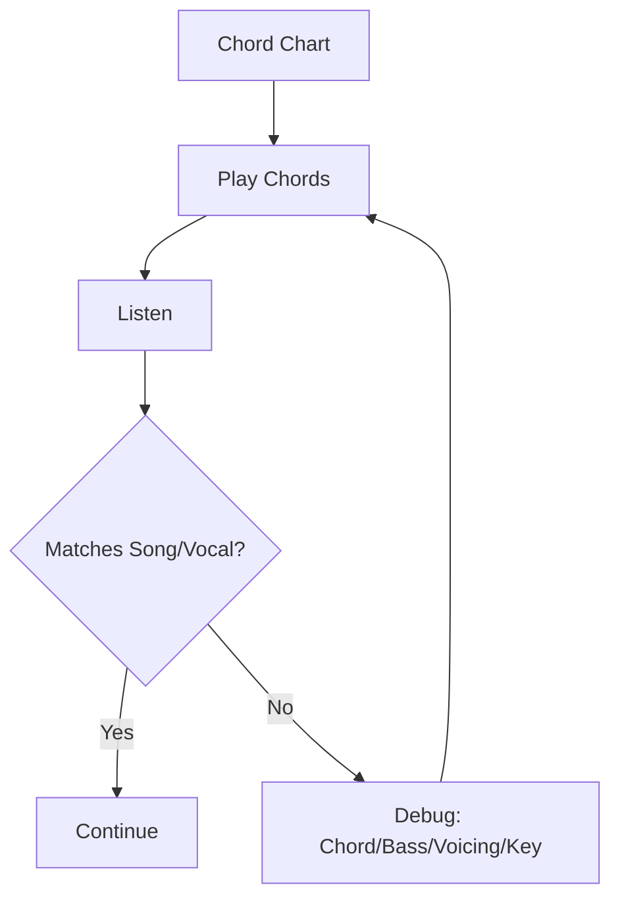
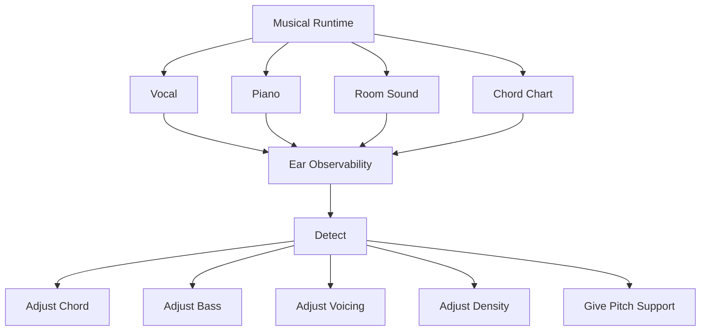
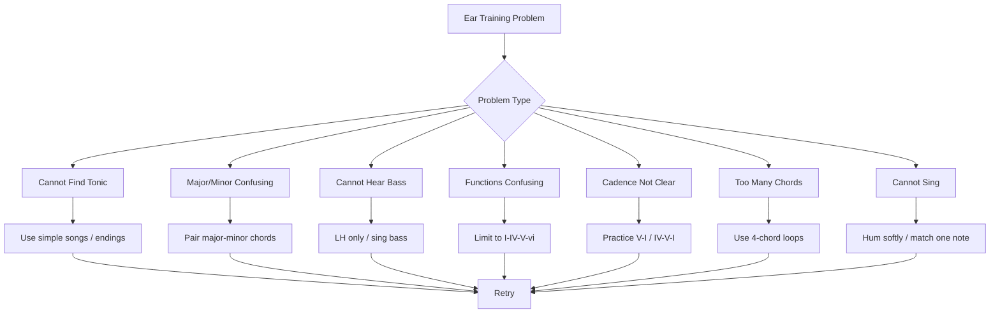
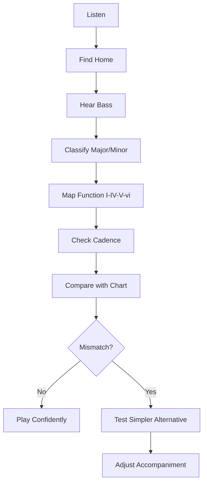

# learn-piano-accompaniment-part-026.md

# Part 026 — Basic Ear Training untuk Pengiring: Mendengar Chord, Bass, dan Cadence

> Seri: **Learn Piano Accompaniment for Singer Performance**  
> Fokus: **belajar piano untuk mengiringi penyanyi**  
> Framework utama: **The First 20 Hours — Josh Kaufman**  
> Tahap: **Phase J — Telinga Musikal Praktis untuk Accompaniment**

---

## Status Seri

| Item | Status |
|---|---|
| Part | 026 |
| Nama file | `learn-piano-accompaniment-part-026.md` |
| Fokus | Ear training praktis untuk pengiring: tonic, major/minor, bass, I-IV-V-vi, cadence, dan koreksi chord chart |
| Prasyarat | Part 000–025 |
| Output praktis | Bisa mulai mendengar fungsi chord, bass movement, cadence, dan mendeteksi chart/iringan yang tidak cocok |
| Status seri | Belum selesai |

---

## Daftar Isi

- [1. Tujuan Part Ini](#1-tujuan-part-ini)
- [2. Posisi Part Ini dalam Framework Kaufman](#2-posisi-part-ini-dalam-framework-kaufman)
- [3. Masalah Utama: Bisa Baca Chart, tetapi Telinga Tidak Ikut Bekerja](#3-masalah-utama-bisa-baca-chart-tetapi-telinga-tidak-ikut-bekerja)
- [4. Mental Model: Ear Training sebagai Runtime Observability](#4-mental-model-ear-training-sebagai-runtime-observability)
- [5. Ear Training untuk Pengiring Bukan Ear Training Akademis](#5-ear-training-untuk-pengiring-bukan-ear-training-akademis)
- [6. Apa yang Harus Didengar oleh Pengiring?](#6-apa-yang-harus-didengar-oleh-pengiring)
- [7. Tonic/Home: Mendengar “Rumah” Lagu](#7-tonichome-mendengar-rumah-lagu)
- [8. Latihan Mendengar Tonic](#8-latihan-mendengar-tonic)
- [9. Major vs Minor: Warna Dasar Chord](#9-major-vs-minor-warna-dasar-chord)
- [10. Latihan Major vs Minor](#10-latihan-major-vs-minor)
- [11. Bass Note: Fondasi yang Paling Mudah Didengar](#11-bass-note-fondasi-yang-paling-mudah-didengar)
- [12. Latihan Mendengar Bass Movement](#12-latihan-mendengar-bass-movement)
- [13. Chord Function: I, IV, V, vi sebagai Vocabulary Awal](#13-chord-function-i-iv-v-vi-sebagai-vocabulary-awal)
- [14. Mendengar I: Rasa Pulang](#14-mendengar-i-rasa-pulang)
- [15. Mendengar V: Rasa Tension yang Ingin Pulang](#15-mendengar-v-rasa-tension-yang-ingin-pulang)
- [16. Mendengar IV: Rasa Terbuka / Bergerak Keluar](#16-mendengar-iv-rasa-terbuka--bergerak-keluar)
- [17. Mendengar vi: Rasa Minor Relatif / Emosional](#17-mendengar-vi-rasa-minor-relatif--emosional)
- [18. Progression Ear: I–V–vi–IV](#18-progression-ear-ivviiv)
- [19. Progression Ear: vi–IV–I–V](#19-progression-ear-viiviiv)
- [20. Progression Ear: I–vi–IV–V](#20-progression-ear-iviivv)
- [21. Cadence: V–I, IV–V–I, ii–V–I](#21-cadence-vi-ivvi-iivi)
- [22. Sus Resolution: Gsus4–G–C sebagai Cue Telinga](#22-sus-resolution-gsus4gc-sebagai-cue-telinga)
- [23. Slash Chord: Mendengar Bass Line di Bawah Chord](#23-slash-chord-mendengar-bass-line-di-bawah-chord)
- [24. Chord Chart Salah: Bagaimana Telinga Membantu Debug](#24-chord-chart-salah-bagaimana-telinga-membantu-debug)
- [25. Mendengar Saat Penyanyi Butuh Root/Chord Jelas](#25-mendengar-saat-penyanyi-butuh-rootchord-jelas)
- [26. Call-and-Response Ear Training](#26-call-and-response-ear-training)
- [27. Singing What You Play: Mengapa Pengiring Perlu Bersuara](#27-singing-what-you-play-mengapa-pengiring-perlu-bersuara)
- [28. Ear Training dengan Drone Tonic](#28-ear-training-dengan-drone-tonic)
- [29. Ear Training dengan 4-Chord Loop](#29-ear-training-dengan-4-chord-loop)
- [30. Ear Training dengan Lagu Nyata](#30-ear-training-dengan-lagu-nyata)
- [31. Menebak Chord Lagu Secara Praktis](#31-menebak-chord-lagu-secara-praktis)
- [32. Menentukan Key dengan Telinga](#32-menentukan-key-dengan-telinga)
- [33. Mendengar Wrong Note vs Wrong Chord](#33-mendengar-wrong-note-vs-wrong-chord)
- [34. Mendengar Voicing yang Terlalu Muddy atau Terlalu Tajam](#34-mendengar-voicing-yang-terlalu-muddy-atau-terlalu-tajam)
- [35. Ear Training dan Transposition](#35-ear-training-dan-transposition)
- [36. Ear Training saat Live: Quick Diagnostic](#36-ear-training-saat-live-quick-diagnostic)
- [37. Mini Case Study 1: Chart Menulis C, tetapi Telinga Mendengar Am](#37-mini-case-study-1-chart-menulis-c-tetapi-telinga-mendengar-am)
- [38. Mini Case Study 2: Penyanyi Salah Pitch karena Intro Ambiguous](#38-mini-case-study-2-penyanyi-salah-pitch-karena-intro-ambiguous)
- [39. Mini Case Study 3: Bass Slash Chord Membuat Progression Lebih Smooth](#39-mini-case-study-3-bass-slash-chord-membuat-progression-lebih-smooth)
- [40. Mini Case Study 4: Ending Tidak Terasa Pulang](#40-mini-case-study-4-ending-tidak-terasa-pulang)
- [41. Latihan 1: Home Note Hunt](#41-latihan-1-home-note-hunt)
- [42. Latihan 2: Major/Minor Blind Test](#42-latihan-2-majorminor-blind-test)
- [43. Latihan 3: Bass Line Singing](#43-latihan-3-bass-line-singing)
- [44. Latihan 4: I–IV–V–vi Recognition](#44-latihan-4-iivvvi-recognition)
- [45. Latihan 5: Cadence Recognition](#45-latihan-5-cadence-recognition)
- [46. Latihan 6: Chart Verification](#46-latihan-6-chart-verification)
- [47. Latihan 7: Ear + Humming Accompaniment](#47-latihan-7-ear--humming-accompaniment)
- [48. Debugging Ear Training](#48-debugging-ear-training)
- [49. Failure Mode Pemula](#49-failure-mode-pemula)
- [50. Practice Protocol 7 Hari](#50-practice-protocol-7-hari)
- [51. Practice Protocol 45 Menit](#51-practice-protocol-45-menit)
- [52. Checklist Kelulusan Part 026](#52-checklist-kelulusan-part-026)
- [53. Ringkasan Mental Model](#53-ringkasan-mental-model)
- [54. Persiapan ke Part 027](#54-persiapan-ke-part-027)

---

# 1. Tujuan Part Ini

Sampai Part 025, kita sudah membahas banyak hal yang bisa dilihat, disentuh, atau ditulis:

- chord chart;
- voicing;
- register;
- pattern;
- structure;
- key;
- gear;
- pedal;
- setup;
- sound check.

Namun pengiring yang baik tidak hanya membaca dan menekan tuts.

Pengiring yang baik juga mendengar.

Part ini membahas ear training praktis untuk piano accompaniment.

Targetnya bukan menjadi ahli solfège, bukan menebak interval rumit, bukan menulis notasi lengkap dari telinga.

Targetnya lebih langsung:

> Anda mulai bisa mendengar home/tonic, major/minor, bass movement, fungsi chord umum, cadence, dan mendeteksi ketika chart atau permainan tidak cocok dengan lagu/penyanyi.

Setelah part ini, Anda harus mulai bisa:

- mendengar rasa “pulang” ke tonic;
- membedakan major dan minor;
- mengikuti bass movement sederhana;
- mengenali rasa I, IV, V, vi;
- mengenali cadence `V-I`, `IV-V-I`, `ii-V-I`;
- mendengar `Gsus4-G-C` sebagai cue resolution;
- memahami kenapa slash chord seperti `G/B` terdengar smooth;
- mendeteksi chord chart yang terasa salah;
- memberi chord/root lebih jelas saat penyanyi ragu pitch;
- memakai telinga sebagai feedback loop saat live.

---

# 2. Posisi Part Ini dalam Framework Kaufman

Dalam *The First 20 Hours*, kita tidak menunggu sampai “menguasai semua teori” baru mulai praktik.

Kita belajar cukup teori dan cukup telinga untuk self-correction.

Ear training dalam seri ini adalah alat self-correction.

Diagram:



Tanpa telinga, Anda hanya percaya chart.

Dengan telinga, Anda bisa berkata:

```text
chart ini mungkin salah
bass-nya kurang smooth
ending belum pulang
penyanyi butuh root lebih jelas
piano saya terlalu muddy
```

Ini menaikkan level Anda dari “pemain chord” menjadi “pengiring yang sadar”.

---

# 3. Masalah Utama: Bisa Baca Chart, tetapi Telinga Tidak Ikut Bekerja

Banyak pemula berpikir:

```text
kalau chart menulis C, saya main C
```

Itu awal yang baik.

Tetapi chart bisa salah, incomplete, ambiguous, atau tidak cocok dengan versi lagu yang sedang dinyanyikan.

## 3.1 Gejala Telinga Belum Aktif

- tidak sadar chord chart salah;
- tidak sadar bass note membuat lagu lebih smooth;
- tidak sadar ending belum resolve;
- tidak sadar intro tidak menunjukkan key;
- tidak sadar piano terlalu muddy;
- tidak sadar penyanyi salah pitch karena chord ambiguous;
- tidak bisa menemukan key lagu;
- tidak bisa recovery jika chart hilang;
- tidak bisa membantu penyanyi yang ragu nada;
- tidak tahu apakah progression “pulang” atau belum.

## 3.2 Root Cause

Pemula terlalu visual:

```text
lihat chord -> main chord
```

Belum cukup auditory:

```text
main chord -> dengar fungsi -> cocokkan dengan vokal
```

## 3.3 Prinsip

```text
Chart adalah peta.
Telinga adalah GPS real-time.
```

Peta bisa salah atau tidak update.

GPS membantu mendeteksi kenyataan.

---

# 4. Mental Model: Ear Training sebagai Runtime Observability

Sebagai software engineer, anggap ear training sebagai observability.

Dalam sistem produksi, Anda butuh:

- logs;
- metrics;
- traces;
- alerts.

Dalam accompaniment, telinga memberi observability:

- harmony cocok atau tidak;
- bass movement jelas atau tidak;
- vocal pitch aman atau tidak;
- cadence resolve atau tidak;
- balance terlalu padat atau tidak;
- section terasa pulang atau menggantung.

Diagram:



Tanpa observability, Anda mengeksekusi chart secara buta.

Dengan observability, Anda bisa adaptif.

---

# 5. Ear Training untuk Pengiring Bukan Ear Training Akademis

Ear training akademis bisa mencakup:

- interval recognition;
- melodic dictation;
- harmonic dictation;
- sight singing;
- solfège;
- modulation analysis;
- complex chord quality.

Itu berguna, tetapi bukan prioritas pertama kita.

## 5.1 Prioritas Ear Training Pengiring

Untuk accompaniment, prioritas awal:

1. tonic/home;
2. major/minor chord quality;
3. bass note;
4. I, IV, V, vi;
5. cadence;
6. slash chord movement;
7. chord chart verification;
8. vocal pitch support;
9. balance/density listening.

## 5.2 Kenapa?

Karena ini langsung berguna saat mengiringi penyanyi.

Anda tidak perlu langsung bisa menebak semua extension chord.

Anda perlu tahu:

```text
apakah lagu sedang pulang?
apakah ini minor atau major?
apakah bass harus turun?
apakah penyanyi butuh chord jelas?
apakah ending sudah selesai?
```

## 5.3 Prinsip

```text
Ear training terbaik untuk tahap awal adalah ear training yang langsung memperbaiki accompaniment.
```

---

# 6. Apa yang Harus Didengar oleh Pengiring?

Pengiring harus mendengar beberapa layer.

## 6.1 Tonic

Nada/chord rumah.

Pertanyaan:

```text
lagu ini pulang ke mana?
```

## 6.2 Chord Quality

Major atau minor?

```text
terang/stabil atau gelap/emosional?
```

## 6.3 Bass

Apa nada paling bawah yang mengarahkan harmony?

```text
C - B - A - F
```

## 6.4 Chord Function

Apakah chord ini terasa:

- pulang?
- menjauh?
- menegangkan?
- emosional?
- menyiapkan chorus?

## 6.5 Cadence

Apakah progression sudah resolve?

```text
G -> C
F -> G -> C
Dm -> G -> C
```

## 6.6 Vocal Needs

Apakah penyanyi:

- ragu pitch?
- butuh root?
- masuk telat?
- terlalu rendah/tinggi?
- membutuhkan ruang?

## 6.7 Sound Quality

Apakah piano:

- muddy?
- terlalu tajam?
- terlalu padat?
- menutup vokal?
- terlalu tipis?

---

# 7. Tonic/Home: Mendengar “Rumah” Lagu

Tonic adalah pusat tonal.

Dalam key C, tonic adalah C.

Chord C terasa seperti:

```text
home
selesai
pulang
stabil
```

## 7.1 Mengapa Tonic Penting?

Jika Anda tahu home, Anda bisa:

- memahami key;
- memahami fungsi chord;
- memilih ending;
- membantu penyanyi pitch;
- transpose;
- mendeteksi chart salah.

## 7.2 Tonic Tidak Selalu Chord Pertama

Lagu bisa mulai dari vi.

Contoh:

```text
Am - F - C - G
```

Meski mulai Am, lagu bisa tetap key C.

Home-nya C.

## 7.3 Tonic Sering Ada di Ending

Banyak lagu berakhir di tonic.

Jika lagu berakhir di C dan terasa selesai, kemungkinan key C.

## 7.4 Rasa Tonic

Tonic seperti:

```text
landing
period
return
resolved state
```

Dalam state machine:

```text
Tonic = stable state
Dominant = pending state
```

## 7.5 Prinsip

```text
Sebelum menebak chord detail, cari dulu rumahnya.
```

---

# 8. Latihan Mendengar Tonic

## 8.1 Latihan 1: Main Progression dan Nyanyi Home

Main:

```text
C - G - Am - F
```

Setelah selesai, nyanyikan nada:

```text
C
```

Dengar apakah terasa pulang.

## 8.2 Latihan 2: Progression Berakhir Menggantung

Main:

```text
C - F - G
```

Berhenti di G.

Rasakan:

```text
belum selesai
ingin ke C
```

Lalu main C.

## 8.3 Latihan 3: Mulai dari vi

Main:

```text
Am - F - C - G
```

Lalu main C.

Dengar apakah C terasa home walau progression mulai dari Am.

## 8.4 Latihan 4: Cari Home dari Lagu

Putar lagu sederhana.

Pause setelah chorus.

Coba nyanyikan nada yang terasa “rumah”.

Cari di piano.

## 8.5 Output

Tulis:

```text
Song:
Possible tonic:
Why:
Ending chord:
Chorus home:
```

---

# 9. Major vs Minor: Warna Dasar Chord

Chord major dan minor adalah warna dasar.

## 9.1 Major

Contoh:

```text
C = C E G
```

Rasa umum:

- terang;
- stabil;
- terbuka;
- selesai;
- positif;
- jelas.

## 9.2 Minor

Contoh:

```text
Am = A C E
```

Rasa umum:

- gelap;
- sendu;
- emosional;
- introspektif;
- unresolved;
- lembut/pedih.

## 9.3 Perbedaan Struktur

Major third:

```text
root ke third = 4 semitone
```

Minor third:

```text
root ke third = 3 semitone
```

Namun untuk telinga, fokus pada rasa dulu.

## 9.4 Kenapa Penting?

Jika chart menulis C tetapi seharusnya Am, rasa akan sangat berbeda.

Jika penyanyi berada di frase emosional, minor chord sering lebih cocok.

## 9.5 Prinsip

```text
Major/minor adalah binary classification pertama dalam chord hearing.
```

---

# 10. Latihan Major vs Minor

## 10.1 Latihan Blind

Main dua chord tanpa melihat:

```text
C
Cm
G
Gm
F
Fm
A
Am
```

Dengar:

```text
major atau minor?
```

## 10.2 Latihan Pair

Main:

```text
C -> Cm
F -> Fm
G -> Gm
A -> Am
```

Dengar perubahan third.

## 10.3 Latihan dengan Lagu

Ambil progression:

```text
C - G - Am - F
```

Dengar chord mana minor.

Jawaban:

```text
Am
```

## 10.4 Latihan Singing Third

Untuk C major:

```text
C - E
```

Untuk C minor:

```text
C - Eb
```

Nyanyikan selisih rasanya.

## 10.5 Goal

Bukan harus 100% akurat langsung.

Target awal:

```text
bisa membedakan major/minor chord dasar dengan semakin konsisten
```

---

# 11. Bass Note: Fondasi yang Paling Mudah Didengar

Dalam accompaniment, bass note sangat penting.

Bass note sering menentukan arah harmony lebih kuat daripada voicing RH.

## 11.1 Kenapa Bass Mudah Didengar?

Karena bass adalah fondasi bawah.

Jika bass bergerak:

```text
C - B - A
```

telinga merasakan arah turun.

## 11.2 Bass vs Chord

Chord:

```text
G/B
```

Artinya chord G tetapi bass B.

Telinga bisa merasakan B sebagai arah bass, walau harmony G.

## 11.3 Bass Movement Umum

Turun:

```text
C - B - A - G - F
```

Naik:

```text
F - G - A - B - C
```

Cadence:

```text
F - G - C
```

## 11.4 Kenapa Pengiring Harus Mendengar Bass?

Karena bass membantu:

- smooth voice leading;
- chord function;
- slash chord;
- transition;
- stability;
- pitch support.

## 11.5 Prinsip

```text
Jika chord terasa salah, cek bass dulu.
```

---

# 12. Latihan Mendengar Bass Movement

## 12.1 Latihan 1: LH Only

Main LH:

```text
C - B - A - F
```

Nyanyikan bersama.

Lalu tambahkan RH:

```text
C - G/B - Am - F
```

## 12.2 Latihan 2: Root Movement

Main:

```text
C - G - Am - F
```

Nyanyikan bass:

```text
C - G - A - F
```

## 12.3 Latihan 3: Slash Smooth

Bandingkan:

```text
C - G - Am
```

dengan:

```text
C - G/B - Am
```

Dengar bedanya.

`G/B` membuat bass turun:

```text
C - B - A
```

lebih smooth.

## 12.4 Latihan 4: Cadence Bass

Main:

```text
F - G - C
```

Nyanyikan bass.

Dengar rasa menuju home.

## 12.5 Output

Tulis:

```text
Progression:
Bass line:
Feels smooth / jumpy:
Notes:
```

---

# 13. Chord Function: I, IV, V, vi sebagai Vocabulary Awal

Chord function adalah peran chord dalam key.

Dalam key C:

```text
I  = C
IV = F
V  = G
vi = Am
```

Empat fungsi ini sangat umum di pop.

## 13.1 Kenapa Function Penting?

Karena chord bisa berubah nama saat transpose, tetapi fungsi tetap.

```text
C - G - Am - F
= I - V - vi - IV
```

Di key G:

```text
G - D - Em - C
= I - V - vi - IV
```

Rasanya mirip karena fungsi sama.

## 13.2 Ear Training Function

Tujuan bukan hanya tahu nama chord.

Tujuan:

```text
mendengar rasa I, IV, V, vi
```

## 13.3 Function sebagai State

- I = home/stable;
- V = tension/wants home;
- IV = open/away/subdominant;
- vi = minor relative/emotional.

## 13.4 Prinsip

```text
Belajar mendengar fungsi lebih reusable daripada hanya menghafal nama chord.
```

---

# 14. Mendengar I: Rasa Pulang

I adalah tonic chord.

Dalam key C:

```text
I = C
```

## 14.1 Rasa I

- pulang;
- stabil;
- selesai;
- home;
- landing;
- titik aman.

## 14.2 Dalam Lagu

Chorus sering mulai di I.

Ending sering berakhir di I.

## 14.3 Latihan

Main:

```text
G -> C
```

Dengar C sebagai pulang.

Main:

```text
F -> G -> C
```

Dengar C sebagai final.

## 14.4 Jika I Tidak Terasa Home

Mungkin:

- key bukan C;
- voicing terlalu ambiguous;
- chord sebelumnya tidak menyiapkan;
- lagu modal/non-diatonic;
- telinga belum terbiasa.

Untuk tahap awal, gunakan lagu/progression sederhana.

## 14.5 Prinsip

```text
I adalah safe landing.
Saat live panik, I sering menjadi anchor.
```

---

# 15. Mendengar V: Rasa Tension yang Ingin Pulang

V adalah dominant.

Dalam key C:

```text
V = G
```

## 15.1 Rasa V

- tegang;
- belum selesai;
- ingin pulang;
- cue menuju I;
- seperti koma sebelum titik.

## 15.2 V ke I

```text
G -> C
```

Ini resolution paling dasar.

## 15.3 V7 ke I

```text
G7 -> C
```

Lebih kuat karena ada tension tambahan.

## 15.4 Latihan

Main:

```text
C - G
```

Berhenti di G.

Rasakan menggantung.

Lalu main C.

## 15.5 Dalam Accompaniment

V sangat berguna untuk:

- cue chorus;
- cue vocal entry;
- ending;
- transition;
- recovery ke home.

## 15.6 Prinsip

```text
Jika ingin memberi sinyal “sebentar lagi pulang”, gunakan V atau sus/V.
```

---

# 16. Mendengar IV: Rasa Terbuka / Bergerak Keluar

IV dalam key C:

```text
IV = F
```

## 16.1 Rasa IV

- terbuka;
- bergerak keluar dari home;
- hangat;
- luas;
- belum setegang V;
- sering terasa uplifting.

## 16.2 IV ke V ke I

```text
F -> G -> C
```

Ini cadence sangat jelas.

## 16.3 IV dalam Progression Pop

```text
C - G - Am - F
```

F di akhir membuat loop bisa kembali ke C.

## 16.4 IV vs V

IV tidak se-tegang V.

V lebih kuat menarik ke I.

IV lebih seperti membuka pintu.

## 16.5 Latihan

Main:

```text
C -> F -> C
```

Dengar keluar dan pulang.

Lalu:

```text
C -> G -> C
```

Bandingkan tension.

## 16.6 Prinsip

```text
IV memberi gerak keluar yang aman dan emosional.
```

---

# 17. Mendengar vi: Rasa Minor Relatif / Emosional

vi dalam key C:

```text
vi = Am
```

## 17.1 Rasa vi

- minor;
- emosional;
- mellow;
- sedih tapi masih dalam keluarga key;
- sering dipakai verse.

## 17.2 vi Bukan Home Utama Jika Key C

Progression bisa mulai di Am, tetapi home tetap C.

Contoh:

```text
Am - F - C - G
```

Rasa minor di awal, tetapi C tetap home.

## 17.3 vi dalam Pop

Sangat umum untuk:

- verse reflektif;
- chorus emosional;
- bridge;
- mood minor tanpa pindah key.

## 17.4 Latihan

Main:

```text
C -> Am
```

Dengar major ke relative minor.

Main:

```text
Am -> F -> C -> G
```

Dengar journey dari minor ke home/tension.

## 17.5 Prinsip

```text
vi memberi warna emosional tanpa meninggalkan key utama.
```

---

# 18. Progression Ear: I–V–vi–IV

Dalam key C:

```text
C - G - Am - F
```

Function:

```text
I - V - vi - IV
```

## 18.1 Rasa Umum

- mulai home;
- tension;
- emotional minor;
- open/return-ready.

## 18.2 Banyak Lagu Pop

Progression ini sangat umum karena emotional arc-nya kuat.

## 18.3 Latihan Mendengar

Main loop 4 kali.

Sambil main, ucapkan:

```text
home
tension
minor
open
```

Atau:

```text
I
V
vi
IV
```

## 18.4 Transpose

Key G:

```text
G - D - Em - C
```

Dengarkan apakah rasanya tetap sama.

## 18.5 Prinsip

```text
Progression ear terbentuk dari fungsi, bukan dari nama chord saja.
```

---

# 19. Progression Ear: vi–IV–I–V

Dalam key C:

```text
Am - F - C - G
```

Function:

```text
vi - IV - I - V
```

## 19.1 Rasa Umum

- mulai emosional/minor;
- terbuka;
- pulang;
- tension lagi.

## 19.2 Cocok untuk Verse

Karena mulai di vi, progression ini sering terasa lebih naratif dan reflektif.

## 19.3 Latihan

Main:

```text
Am - F - C - G
```

Ucapkan:

```text
minor
open
home
tension
```

## 19.4 Dengar G di Akhir

G membuat loop ingin kembali ke Am atau masuk ke C chorus.

## 19.5 Prinsip

```text
vi-IV-I-V sering membuat verse terasa emosional tetapi tetap bergerak.
```

---

# 20. Progression Ear: I–vi–IV–V

Dalam key C:

```text
C - Am - F - G
```

Function:

```text
I - vi - IV - V
```

## 20.1 Rasa Umum

- home;
- emotional dip;
- open;
- tension.

## 20.2 Classic Ballad Feel

Progression ini terasa classic, familiar, dan mudah untuk ending/intro.

## 20.3 Latihan

Main:

```text
C - Am - F - G
```

Lalu resolve:

```text
C
```

Dengar V ke I.

## 20.4 Gunakan untuk Ear

Progression ini bagus karena fungsi sangat jelas.

## 20.5 Prinsip

```text
I-vi-IV-V mengajarkan home -> minor -> open -> tension -> home.
```

---

# 21. Cadence: V–I, IV–V–I, ii–V–I

Cadence adalah gesture harmoni yang memberi rasa selesai atau menuju selesai.

## 21.1 V–I

Dalam C:

```text
G -> C
```

Rasa:

```text
tension -> home
```

## 21.2 IV–V–I

Dalam C:

```text
F -> G -> C
```

Rasa:

```text
open -> tension -> home
```

## 21.3 ii–V–I

Dalam C:

```text
Dm -> G -> C
```

atau:

```text
Dm7 -> G7 -> Cmaj7
```

Rasa:

```text
prepare -> tension -> home
```

## 21.4 Kenapa Cadence Penting?

Cadence membantu:

- ending;
- intro;
- transition;
- cue vocal;
- finding key;
- chart verification.

## 21.5 Latihan

Main masing-masing cadence dalam C, G, D, F.

Dengarkan rasa pulang.

## 21.6 Prinsip

```text
Jika ending tidak terasa selesai, cek cadence.
```

---

# 22. Sus Resolution: Gsus4–G–C sebagai Cue Telinga

Sus chord menunda resolusi.

Dalam key C:

```text
Gsus4 = G C D
G     = G B D
C     = C E G
```

Gerakan penting:

```text
C -> B
```

pada Gsus4 ke G.

Lalu:

```text
G -> C
```

## 22.1 Rasa

```text
tertahan -> jelas -> pulang
```

## 22.2 Kenapa Berguna untuk Penyanyi?

Karena memberi cue kuat:

```text
setelah ini masuk / resolve
```

## 22.3 Latihan

Main:

```text
Gsus4 - G - C
```

Ulang 10 kali.

Nyanyikan top movement:

```text
C - B - C/E context
```

## 22.4 Dalam 6/8

```text
Gsus4: count 1-2-3
G: count 4-5-6
C: next ONE
```

## 22.5 Prinsip

```text
Sus resolution adalah lampu sein musikal.
```

---

# 23. Slash Chord: Mendengar Bass Line di Bawah Chord

Slash chord sering membuat bass lebih smooth.

## 23.1 Contoh

```text
C - G/B - Am - F
```

Bass:

```text
C - B - A - F
```

## 23.2 Tanpa Slash

```text
C - G - Am - F
```

Bass:

```text
C - G - A - F
```

Lebih lompat.

## 23.3 Rasa Slash

Slash chord sering terdengar:

- lebih smooth;
- lebih arranged;
- lebih connected;
- lebih professional.

## 23.4 Latihan Bandingkan

Main:

```text
C - G - Am
```

lalu:

```text
C - G/B - Am
```

Dengar bass turun.

## 23.5 Prinsip

```text
Slash chord sering bukan tentang chord fancy.
Ia tentang bass line yang lebih musikal.
```

---

# 24. Chord Chart Salah: Bagaimana Telinga Membantu Debug

Chord chart dari internet bisa salah.

## 24.1 Tanda Chart Salah

- chord terasa tidak cocok dengan melodi;
- bass terasa aneh;
- ending tidak resolve;
- chord major/minor terasa terbalik;
- section terdengar terlalu bright/dark;
- penyanyi sulit pitch pada chord tertentu;
- progression tidak seperti referensi.

## 24.2 Cara Debug

1. cek bass note;
2. cek major/minor;
3. cek apakah chord harus I/IV/V/vi;
4. cek melodi vokal;
5. cek cadence;
6. bandingkan dengan audio referensi.

## 24.3 Jangan Langsung Percaya Extension

Chart bisa menulis:

```text
Cmaj7
```

padahal versi sederhana cukup C.

Atau menulis:

```text
F
```

padahal bass sebenarnya `C/E` menuju F.

## 24.4 Survival

Jika tidak yakin, gunakan chord sederhana yang fungsi-nya masuk.

## 24.5 Prinsip

```text
Telinga adalah test suite untuk chord chart.
```

---

# 25. Mendengar Saat Penyanyi Butuh Root/Chord Jelas

Penyanyi kadang ragu pitch.

Telinga pengiring harus mengenali tanda itu.

## 25.1 Tanda Penyanyi Butuh Support

- pitch masuk meleset;
- entry ragu;
- volume turun;
- mencari nada;
- melihat pianis;
- melodi goyah di awal phrase;
- sulit masuk setelah intro ambiguous.

## 25.2 Apa yang Piano Lakukan?

Berikan clarity:

```text
LH root jelas
RH triad/partial jelas
kurangi add9/sus ambiguous
kurangi fill
kurangi pedal
```

## 25.3 Jangan Over-Correct

Jangan memukul chord keras seperti menyalahkan.

Support lembut tapi jelas.

## 25.4 Tonic Support

Sebelum entry, pastikan key jelas.

Jika lagu di C, intro sebaiknya membuat C terasa home.

## 25.5 Prinsip

```text
Saat penyanyi ragu pitch, clarity lebih penting daripada color.
```

---

# 26. Call-and-Response Ear Training

Call-and-response melatih mendengar lalu membalas.

## 26.1 Dengan Piano Sendiri

Main chord atau motif.

Nyanyikan kembali.

Contoh:

```text
play: C-E-G
sing: C-E-G
```

## 26.2 Dengan Bass

Main bass:

```text
C - B - A - F
```

Nyanyikan.

## 26.3 Dengan Cadence

Main:

```text
G - C
```

Nyanyikan rasa pulang.

## 26.4 Dengan Penyanyi

Penyanyi menyanyikan frase.

Piano menjawab di ruang setelah frase.

## 26.5 Tujuan

Melatih telinga-tangan-suara terhubung.

## 26.6 Prinsip

```text
Jika Anda bisa menyanyikan, Anda biasanya lebih bisa mendengar.
```

---

# 27. Singing What You Play: Mengapa Pengiring Perlu Bersuara

Anda tidak harus menjadi penyanyi hebat.

Tetapi bersuara membantu telinga.

## 27.1 Kenapa?

Karena suara tubuh menghubungkan:

- pitch;
- phrase;
- napas;
- timing;
- chord function.

## 27.2 Latihan Sederhana

Saat memainkan C, nyanyikan:

```text
C
```

Saat memainkan G, nyanyikan:

```text
G
```

Saat progression:

```text
C - G - Am - F
```

nyanyikan bass:

```text
C - G - A - F
```

## 27.3 Singing Chord Tone

Untuk C:

```text
C E G
```

Untuk Am:

```text
A C E
```

## 27.4 Singing Function

Nyanyikan tonic setelah progression.

## 27.5 Prinsip

```text
Suara Anda adalah ear training device yang selalu tersedia.
```

---

# 28. Ear Training dengan Drone Tonic

Drone adalah nada panjang yang terus berbunyi.

## 28.1 Fungsi Drone

Drone tonic membantu telinga merasakan semua chord relatif terhadap home.

## 28.2 Contoh

Tahan atau mainkan C berulang.

Lalu main:

```text
C
F
G
Am
```

Dengar semuanya relatif ke C.

## 28.3 Latihan

1. main C rendah sebagai drone;
2. main chord C, F, G, Am di RH;
3. dengar fungsi;
4. nyanyikan C sebagai home.

## 28.4 Manfaat

- memperkuat tonic sense;
- membantu pitch center;
- membantu penyanyi;
- membantu transpose.

## 28.5 Prinsip

```text
Drone mengajarkan telinga bahwa chord bergerak, tetapi home tetap ada.
```

---

# 29. Ear Training dengan 4-Chord Loop

Gunakan loop sederhana.

## 29.1 Loop A

```text
C - G - Am - F
```

Dengar:

```text
I - V - vi - IV
```

## 29.2 Loop B

```text
Am - F - C - G
```

Dengar:

```text
vi - IV - I - V
```

## 29.3 Loop C

```text
C - Am - F - G
```

Dengar:

```text
I - vi - IV - V
```

## 29.4 Cara Latihan

- main loop 4 kali;
- ucapkan function;
- nyanyikan bass;
- nyanyikan home setelah loop;
- ganti key.

## 29.5 Prinsip

```text
Loop sederhana yang didengar dalam-dalam lebih berguna daripada banyak chord yang hanya dilewati.
```

---

# 30. Ear Training dengan Lagu Nyata

Lagu nyata memberi konteks.

## 30.1 Pilih Lagu Sederhana

Mulai dengan lagu yang:

- chord tidak banyak;
- structure jelas;
- tempo sedang;
- vocal melody jelas.

## 30.2 Dengarkan Bass

Putar lagu.

Coba dengar nada bawah.

Jika sulit, dengar saat chord change.

## 30.3 Dengarkan Home

Pause di ending/chorus.

Nyanyikan home.

Cari di piano.

## 30.4 Dengarkan Major/Minor

Di tiap chord utama, tanya:

```text
terasa major atau minor?
```

## 30.5 Bandingkan Chart

Lihat chart setelah mencoba mendengar.

Jangan langsung lihat chart dulu setiap kali.

## 30.6 Prinsip

```text
Lagu nyata adalah integration test untuk telinga.
```

---

# 31. Menebak Chord Lagu Secara Praktis

Untuk tahap awal, gunakan strategi sederhana.

## 31.1 Step 1: Cari Key/Home

Cari chord/nada yang terasa selesai.

## 31.2 Step 2: Cari Bass

Dengarkan bass pada chord change.

## 31.3 Step 3: Coba I, IV, V, vi

Dalam key C, coba:

```text
C
F
G
Am
```

Banyak lagu pop menggunakan ini.

## 31.4 Step 4: Cek Major/Minor

Jika bass A dan rasanya minor, kemungkinan Am.

Jika bass F dan rasanya major, kemungkinan F.

## 31.5 Step 5: Cek Cadence

Jika menuju C, coba:

```text
G -> C
F -> G -> C
```

## 31.6 Step 6: Tulis Chart Draft

Jangan berharap langsung sempurna.

Tulis:

```text
maybe C
maybe Am
```

## 31.7 Prinsip

```text
Menebak chord adalah debugging iteratif, bukan ujian sekali benar.
```

---

# 32. Menentukan Key dengan Telinga

## 32.1 Ending Method

Dengar chord akhir.

Jika terasa selesai, itu sering tonic.

## 32.2 Chorus Home Method

Dengar chord pertama/akhir chorus.

Sering memberi tonic.

## 32.3 Sing Home Method

Setelah lagu berhenti, nyanyikan nada home.

Cari di piano.

## 32.4 Bass Anchor Method

Dengar bass yang paling sering terasa pulang.

## 32.5 Caution

Tidak semua lagu berakhir di tonic, tetapi banyak lagu pop sederhana iya.

Untuk tahap awal, metode ini cukup berguna.

## 32.6 Prinsip

```text
Menentukan key dimulai dari rasa pulang, bukan dari chord pertama.
```

---

# 33. Mendengar Wrong Note vs Wrong Chord

Kadang yang salah bukan seluruh chord, tetapi satu note/voicing.

## 33.1 Wrong Chord

Gejala:

- fungsi terasa salah;
- bass tidak cocok;
- melodi bertabrakan besar;
- section terasa berubah aneh.

## 33.2 Wrong Note dalam Voicing

Gejala:

- chord dasar terasa benar;
- tetapi ada satu nada “mengganjal”;
- add9/maj7/sus mungkin tidak cocok dengan melodi;
- top note piano menabrak vokal.

## 33.3 Debug

Jika chord terasa hampir benar:

- coba triad polos;
- hilangkan extension;
- ubah inversion;
- cek top note;
- cek bass.

## 33.4 Contoh

Chart:

```text
Cadd9
```

Melodi vokal sedang di C/E area.

Top note D pada Cadd9 mungkin terasa mengganggu jika terlalu keras.

Solusi:

```text
main C triad/partial lebih sederhana
```

## 33.5 Prinsip

```text
Jika ragu, strip chord ke root + third/fifth.
Lalu tambahkan color kembali jika cocok.
```

---

# 34. Mendengar Voicing yang Terlalu Muddy atau Terlalu Tajam

Ear training bukan hanya chord name.

Anda juga harus mendengar kualitas sound.

## 34.1 Muddy

Gejala:

- chord blur;
- bass tidak jelas;
- pedal keruh;
- vocal low/mid tertutup;
- harmony seperti kabut.

Penyebab:

- LH terlalu rendah;
- terlalu banyak notes bawah;
- pedal/reverb berlebihan.

## 34.2 Terlalu Tajam

Gejala:

- piano menusuk;
- high note mengganggu vokal;
- attack terlalu keras;
- lirik terasa kalah.

Penyebab:

- RH terlalu tinggi;
- bright piano sound;
- velocity terlalu keras;
- fill terlalu banyak.

## 34.3 Latihan

Main chord C di register berbeda:

- sangat rendah;
- tengah;
- tinggi.

Dengar bedanya.

## 34.4 Prinsip

```text
Telinga pengiring harus mendengar bukan hanya chord benar, tetapi apakah chord itu berada di tempat yang benar.
```

---

# 35. Ear Training dan Transposition

Transposition bukan hanya mengganti nama chord.

Telinga harus mengenali fungsi yang sama di key lain.

## 35.1 Contoh

Key C:

```text
C - G - Am - F
```

Key G:

```text
G - D - Em - C
```

Function sama:

```text
I - V - vi - IV
```

## 35.2 Latihan

Main progression di C, lalu G, lalu D.

Dengar rasa yang sama walau pitch berubah.

## 35.3 Manfaat

Saat penyanyi minta key baru, telinga membantu memastikan progression masih benar.

## 35.4 Problem

Jika transpose salah, telinga sering merasa:

```text
ada chord yang aneh
```

Gunakan rasa function untuk debug.

## 35.5 Prinsip

```text
Transpose yang benar mempertahankan rasa fungsi.
```

---

# 36. Ear Training saat Live: Quick Diagnostic

Saat live, Anda tidak punya waktu analisis panjang.

Gunakan quick diagnostic.

## 36.1 Jika Penyanyi Ragu Pitch

Tanya dalam kepala:

```text
apakah key/chord jelas?
```

Action:

```text
root + triad jelas
```

## 36.2 Jika Chord Terasa Salah

Tanya:

```text
bass salah?
major/minor salah?
section salah?
```

Action:

```text
simplify dan dengar vokal
```

## 36.3 Jika Ending Menggantung

Tanya:

```text
sudah ke I?
butuh V-I?
```

Action:

```text
G -> C
```

dalam key C.

## 36.4 Jika Sound Keruh

Tanya:

```text
LH terlalu rendah?
pedal terlalu banyak?
```

Action:

```text
kurangi low/pedal
```

## 36.5 Jika Vokal Tertutup

Action:

```text
kurangi density/dynamic/register
```

## 36.6 Prinsip

```text
Saat live, ear training harus menghasilkan tindakan sederhana.
```

---

# 37. Mini Case Study 1: Chart Menulis C, tetapi Telinga Mendengar Am

## 37.1 Situasi

Chart verse menulis:

```text
| C | F | C | G |
```

Tetapi saat mendengar lagu, verse terasa lebih minor.

Vokal juga lebih cocok saat Anda coba Am di bar pertama.

## 37.2 Diagnosis

Mungkin chord pertama seharusnya:

```text
Am
```

Progression mungkin:

```text
Am - F - C - G
```

bukan:

```text
C - F - C - G
```

## 37.3 Cara Cek

- dengar bass bar pertama;
- coba C vs Am;
- nyanyikan melodi di atas keduanya;
- lihat mana yang mendukung vokal;
- cek apakah bar ke-3 terasa home C.

## 37.4 Prinsip

```text
Jika chart dan telinga konflik, jangan langsung percaya chart.
Test chord alternatif sederhana.
```

---

# 38. Mini Case Study 2: Penyanyi Salah Pitch karena Intro Ambiguous

## 38.1 Situasi

Intro memakai:

```text
Am - F - Dm - Gsus
```

tanpa pernah memberi C jelas.

Penyanyi masuk ragu di verse.

## 38.2 Diagnosis

Intro tidak cukup menunjukkan tonic/home.

Penyanyi butuh pitch center.

## 38.3 Fix

Tambahkan C jelas:

```text
C - G - Am - F
```

atau ending intro:

```text
F - G - C
```

lalu cue vokal.

## 38.4 Jika Ingin Tetap Minor Mood

Bisa:

```text
Am - F - C - G
```

Tetap ada C.

## 38.5 Prinsip

```text
Intro boleh atmospheric, tetapi penyanyi tetap butuh key center.
```

---

# 39. Mini Case Study 3: Bass Slash Chord Membuat Progression Lebih Smooth

## 39.1 Situasi

Progression:

```text
C - G - Am - F
```

terdengar agak lompat di bass.

## 39.2 Alternatif

```text
C - G/B - Am - F
```

Bass:

```text
C - B - A - F
```

## 39.3 Telinga Mendengar

Versi slash:

- lebih connected;
- lebih smooth;
- lebih arranged;
- lebih natural untuk verse.

## 39.4 Piano Strategy

LH:

```text
C - B - A - F
```

RH:

```text
C chord
G chord
Am chord
F chord
```

## 39.5 Prinsip

```text
Kadang improvement terbesar bukan chord baru, tetapi bass note yang lebih baik.
```

---

# 40. Mini Case Study 4: Ending Tidak Terasa Pulang

## 40.1 Situasi

Lagu berakhir:

```text
F
```

Tetapi terasa menggantung.

## 40.2 Diagnosis

Jika key C, F adalah IV, bukan I.

Ending di IV bisa sengaja, tetapi jika ingin selesai, butuh cadence.

## 40.3 Fix

Tambahkan:

```text
F - G - C
```

atau:

```text
Gsus4 - G - C
```

## 40.4 Telinga

Dengar perbedaan:

```text
berakhir di F = open
berakhir di C = home
```

## 40.5 Prinsip

```text
Ending yang baik biasanya membuat telinga berhenti mencari home.
```

---

# 41. Latihan 1: Home Note Hunt

Pilih 3 lagu sederhana.

## 41.1 Tugas

Untuk setiap lagu:

1. dengar chorus;
2. pause setelah phrase;
3. nyanyikan home;
4. cari di piano;
5. cek dengan chord ending.

## 41.2 Template

```text
Song:
Home note guess:
Piano note:
Ending chord:
Confidence 1-5:
```

## 41.3 Jangan Lihat Chart Dulu

Gunakan telinga.

Baru cek chart setelah menebak.

## 41.4 Goal

Meningkatkan sense of tonic.

---

# 42. Latihan 2: Major/Minor Blind Test

## 42.1 Setup

Tutup mata atau jangan lihat tangan.

Main random chord dari:

```text
C, Cm, F, Fm, G, Gm, A, Am, D, Dm
```

Jika sendiri, rekam chord random dulu, lalu tebak saat playback.

## 42.2 Tugas

Tebak:

```text
major atau minor
```

## 42.3 Score

```text
10 trials
score:
wrong:
```

## 42.4 Goal

Awal target:

```text
7/10 konsisten
```

Lalu naik.

---

# 43. Latihan 3: Bass Line Singing

## 43.1 Progression A

```text
C - G - Am - F
```

Nyanyikan bass:

```text
C - G - A - F
```

## 43.2 Progression B

```text
C - G/B - Am - F
```

Nyanyikan bass:

```text
C - B - A - F
```

## 43.3 Progression C

```text
F - G - C
```

Nyanyikan bass:

```text
F - G - C
```

## 43.4 Goal

Mendengar foundation harmony.

## 43.5 Jangan Peduli Suara Bagus

Yang penting pitch direction.

---

# 44. Latihan 4: I–IV–V–vi Recognition

## 44.1 Setup Key C

Main chord acak dari:

```text
C, F, G, Am
```

## 44.2 Tugas

Sebut function:

```text
I, IV, V, vi
```

## 44.3 Step

Mulai dengan melihat.

Lalu tanpa melihat.

## 44.4 Key G

Ulang dengan:

```text
G, C, D, Em
```

## 44.5 Goal

Dengar fungsi, bukan hanya nama chord.

---

# 45. Latihan 5: Cadence Recognition

## 45.1 Main Cadence

Dalam C:

```text
G - C
F - G - C
Dm - G - C
Gsus4 - G - C
```

## 45.2 Tugas

Dengar dan sebut:

- V-I;
- IV-V-I;
- ii-V-I;
- sus-V-I.

## 45.3 Transpose

Ulang di G:

```text
D - G
C - D - G
Am - D - G
Dsus4 - D - G
```

## 45.4 Goal

Mendengar ending/transition yang resolve.

---

# 46. Latihan 6: Chart Verification

Pilih satu chord chart lagu sederhana.

## 46.1 Tugas

Dengarkan audio sambil melihat chart.

Tandai:

```text
OK
maybe wrong
bass different
minor/major questionable
ending unclear
```

## 46.2 Jangan Langsung Perbaiki Semua

Pilih satu bagian yang paling mencurigakan.

## 46.3 Test

Coba chord alternatif.

Contoh:

```text
C vs Am
G vs G/B
F vs Dm
```

## 46.4 Output

```text
Chart issue:
Original chord:
Alternative:
Reason:
Confidence:
```

---

# 47. Latihan 7: Ear + Humming Accompaniment

Main progression:

```text
C - G - Am - F
```

Sambil humming bebas.

## 47.1 Tugas

Jika humming terasa ragu, beri root/chord lebih jelas.

Jika humming aktif, kurangi fill.

Jika humming selesai phrase, jawab dengan fill kecil.

## 47.2 Goal

Menghubungkan telinga dengan accompaniment decision.

## 47.3 Rekam

Review:

- apakah vocal/humming aman?
- apakah chord clarity cukup?
- apakah piano terlalu banyak?
- apakah cadence jelas?

## 47.4 Prinsip

```text
Ear training harus berujung pada keputusan bermain.
```

---

# 48. Debugging Ear Training

Jika ear training terasa sulit, debug.



## 48.1 Cannot Find Tonic

Gunakan lagu sederhana dan dengarkan ending.

## 48.2 Major/Minor Confusing

Latih pair:

```text
C vs Cm
G vs Gm
```

## 48.3 Cannot Hear Bass

Main LH only.

Nyanyikan bass.

## 48.4 Functions Confusing

Batasi ke:

```text
I, IV, V, vi
```

## 48.5 Too Many Chords

Jangan mulai dari lagu jazz/complex.

## 48.6 Cannot Sing

Hum saja.

Tidak perlu suara bagus.

---

# 49. Failure Mode Pemula

## 49.1 Ingin Langsung Menebak Semua Chord

Mulai dari tonic, bass, major/minor.

## 49.2 Terlalu Visual

Selalu lihat chart sebelum mendengar.

Coba dengar dulu.

## 49.3 Takut Bersuara

Ear training lebih cepat jika Anda hum/sing.

## 49.4 Menganggap Salah Tebak sebagai Gagal

Salah tebak adalah feedback.

## 49.5 Terlalu Banyak Chord Color

Fokus triad dan fungsi dulu.

## 49.6 Tidak Mendengar Bass

Bass sering kunci chord.

## 49.7 Mengabaikan Cadence

Cadence membantu key dan ending.

## 49.8 Memakai Lagu Terlalu Sulit

Pilih lagu sederhana.

## 49.9 Tidak Menghubungkan Ear ke Piano Decision

Ear training harus mengubah cara bermain.

## 49.10 Menganggap Ear Training Terpisah dari Accompaniment

Telinga dipakai saat intro, chord, voicing, vocal support, ending, dan recovery.

---

# 50. Practice Protocol 7 Hari

## Hari 1 — Tonic/Home

- home note hunt 3 lagu;
- main `G-C`, `F-G-C`;
- nyanyikan tonic.

## Hari 2 — Major/Minor

- blind test 10 chord;
- C vs Cm, G vs Gm, F vs Fm;
- catat score.

## Hari 3 — Bass Movement

- LH only `C-G-Am-F`;
- `C-G/B-Am-F`;
- sing bass line.

## Hari 4 — I/IV/V/vi

- key C: C/F/G/Am;
- key G: G/C/D/Em;
- sebut function.

## Hari 5 — Cadence

- V-I;
- IV-V-I;
- ii-V-I;
- sus-V-I;
- dalam C dan G.

## Hari 6 — Chart Verification

- pilih satu lagu;
- dengar audio;
- cek chart;
- tandai satu chord mencurigakan.

## Hari 7 — Integration

- main lagu sambil humming;
- gunakan telinga untuk adjust clarity/density;
- rekam dan review.

## Prinsip

```text
Sedikit setiap hari lebih baik daripada ear training panjang tetapi jarang.
```

---

# 51. Practice Protocol 45 Menit

Gunakan sesi ini untuk Part 026.

## 51.1 Menit 0–5: Tonic Warm-Up

Main:

```text
G - C
F - G - C
```

Nyanyikan C sebagai home.

## 51.2 Menit 5–10: Major/Minor

Blind atau semi-blind test 10 chord.

Catat score.

## 51.3 Menit 10–15: Bass Singing

Main:

```text
C - G/B - Am - F
```

Nyanyikan bass.

## 51.4 Menit 15–20: Function Loop

Main:

```text
C - G - Am - F
```

Ucapkan:

```text
I - V - vi - IV
```

Lalu transpose ke G:

```text
G - D - Em - C
```

## 51.5 Menit 20–25: Cadence

Latih:

```text
G - C
F - G - C
Dm - G - C
Gsus4 - G - C
```

## 51.6 Menit 25–30: Slash Comparison

Bandingkan:

```text
C - G - Am
```

dan:

```text
C - G/B - Am
```

## 51.7 Menit 30–35: Chart Verification

Ambil satu chart.

Dengar satu section.

Cek apakah chord terasa cocok.

## 51.8 Menit 35–40: Humming Accompaniment

Main progression sambil humming.

Adjust chord clarity/density.

## 51.9 Menit 40–45: Log

Tulis:

```text
Tonic practice:
Major/minor score:
Bass line:
Cadence:
Chart issue:
Next action:
```

---

# 52. Checklist Kelulusan Part 026

Anda boleh lanjut ke Part 027 jika sebagian besar checklist ini terpenuhi.

## 52.1 Pemahaman

- [ ] Saya tahu tonic/home adalah pusat tonal lagu.
- [ ] Saya tahu tonic tidak selalu chord pertama.
- [ ] Saya tahu major/minor adalah warna dasar chord.
- [ ] Saya tahu bass note sangat penting untuk harmony direction.
- [ ] Saya tahu I terasa pulang/home.
- [ ] Saya tahu V terasa tension yang ingin pulang.
- [ ] Saya tahu IV terasa terbuka/bergerak keluar.
- [ ] Saya tahu vi memberi warna minor relatif.
- [ ] Saya tahu cadence membantu ending dan transition.
- [ ] Saya tahu telinga bisa mendeteksi chord chart salah.

## 52.2 Praktik

- [ ] Saya bisa mencari home note dari lagu sederhana.
- [ ] Saya bisa membedakan major/minor chord dasar sebagian besar waktu.
- [ ] Saya bisa menyanyikan bass line `C-G-A-F`.
- [ ] Saya bisa menyanyikan bass line `C-B-A-F`.
- [ ] Saya bisa memainkan dan mendengar `G-C` sebagai V-I di C.
- [ ] Saya bisa memainkan dan mendengar `F-G-C` sebagai IV-V-I di C.
- [ ] Saya bisa memainkan dan mendengar `Gsus4-G-C` sebagai cue resolution.
- [ ] Saya bisa membandingkan `C-G-Am` dan `C-G/B-Am`.
- [ ] Saya bisa mengecek satu chord chart dengan telinga.
- [ ] Saya bisa memberi root/chord lebih jelas saat humming/vokal terasa ragu.

## 52.3 Self-Correction

- [ ] Saya bisa mendeteksi jika ending belum terasa pulang.
- [ ] Saya bisa mendeteksi jika chord major/minor terasa salah.
- [ ] Saya bisa mendeteksi jika bass movement lebih smooth dengan slash chord.
- [ ] Saya bisa menyederhanakan chord ke triad jika extension mengganggu vokal.
- [ ] Saya bisa mengurangi density jika telinga mendengar vokal tertutup.
- [ ] Saya bisa memakai cadence untuk recovery ending.
- [ ] Saya bisa menggunakan telinga sebagai feedback, bukan hanya chart.

---

# 53. Ringkasan Mental Model

Ear training untuk pengiring adalah observability.

Telinga membantu mendeteksi:

```text
home/tonic
major/minor
bass movement
I-IV-V-vi function
cadence
slash chord
chart mismatch
vocal pitch need
voicing/register issue
```

Workflow praktis:



Kalimat kunci:

```text
Chart adalah peta.
Telinga adalah observability.
Piano adalah tindakan.
```

Dan:

```text
Pengiring yang baik tidak hanya tahu chord apa yang tertulis.
Ia mendengar apakah chord itu benar-benar mendukung vokal.
```

---

# 54. Persiapan ke Part 027

Part berikutnya adalah:

```text
learn-piano-accompaniment-part-027.md
```

Judul:

```text
Basic Improvisation dan Fill untuk Pengiring
```

Sampai Part 026, kita sudah mulai melatih telinga.

Part 027 akan membahas cara mengisi ruang secara musikal tanpa mengganggu vokal:

- apa itu fill;
- kapan boleh fill;
- kapan harus diam;
- fill dari chord tones;
- fill dari scale step;
- motif 2–3 nada;
- call-and-response dengan vokal;
- fill di akhir frase;
- fill untuk intro/interlude/ending;
- fill dalam 4/4;
- fill dalam 6/8;
- avoiding overplaying;
- register fill yang aman;
- dynamic fill;
- debugging fill yang terlalu ramai.

Part 027 penting karena setelah bisa mengiringi stabil, Anda perlu sedikit “berbicara” di antara vokal — tetapi tetap sebagai pengiring, bukan solois yang mengambil alih lagu.

---

## Status Akhir Part 026

```text
Part 026 selesai.
Seri belum selesai.
Lanjut ke Part 027.
```
