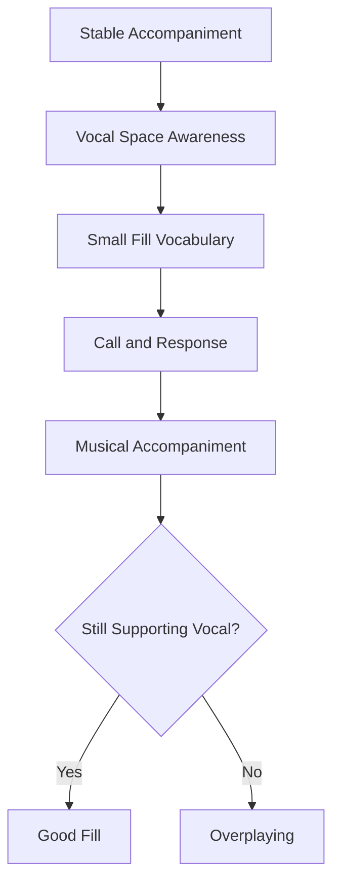
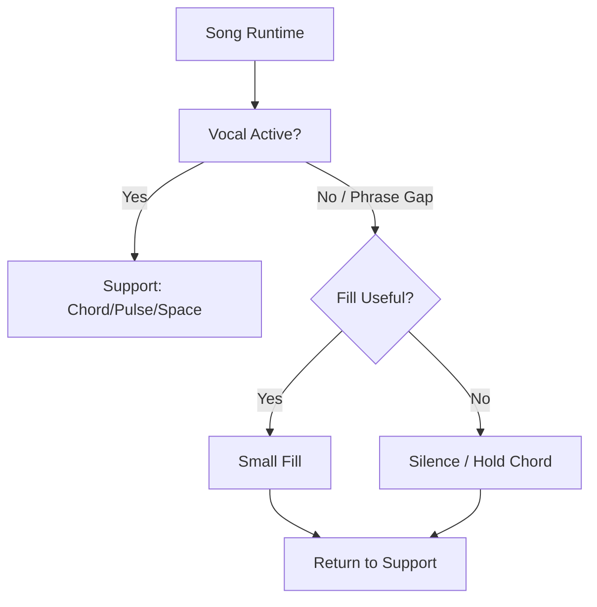
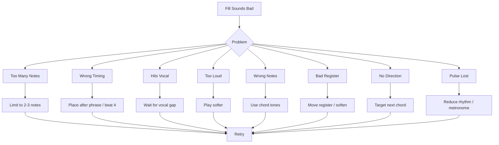
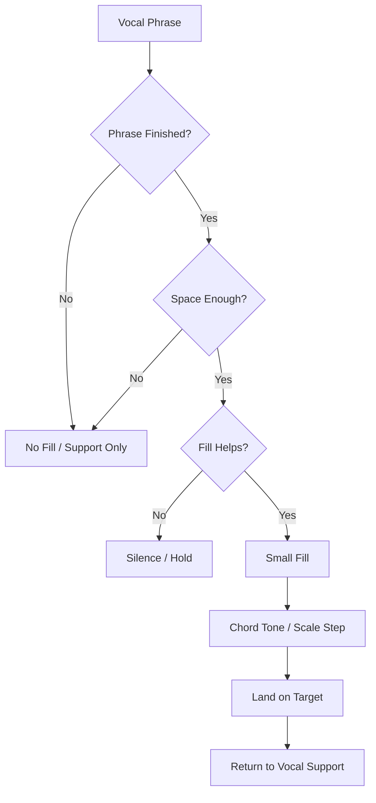

# learn-piano-accompaniment-part-027.md

# Part 027 — Basic Improvisation dan Fill untuk Pengiring

> Seri: **Learn Piano Accompaniment for Singer Performance**  
> Fokus: **belajar piano untuk mengiringi penyanyi**  
> Framework utama: **The First 20 Hours — Josh Kaufman**  
> Tahap: **Phase K — Ekspresi, Fill, dan Respons Musikal**

---

## Status Seri

| Item | Status |
|---|---|
| Part | 027 |
| Nama file | `learn-piano-accompaniment-part-027.md` |
| Fokus | Fill dan improvisasi dasar untuk piano pengiring tanpa mengganggu vokal |
| Prasyarat | Part 000–026 |
| Output praktis | Bisa membuat fill kecil, aman, musikal, berbasis chord tones/scale step, dan muncul hanya di ruang yang tepat |
| Status seri | Belum selesai |

---

## Daftar Isi

- [1. Tujuan Part Ini](#1-tujuan-part-ini)
- [2. Posisi Part Ini dalam Framework Kaufman](#2-posisi-part-ini-dalam-framework-kaufman)
- [3. Masalah Utama: Fill Terlalu Banyak atau Tidak Ada Sama Sekali](#3-masalah-utama-fill-terlalu-banyak-atau-tidak-ada-sama-sekali)
- [4. Mental Model: Fill sebagai Event Handler, Bukan Main Process](#4-mental-model-fill-sebagai-event-handler-bukan-main-process)
- [5. Apa Itu Fill?](#5-apa-itu-fill)
- [6. Fill vs Melody vs Solo](#6-fill-vs-melody-vs-solo)
- [7. Prinsip Utama: Vokal Tetap Foreground](#7-prinsip-utama-vokal-tetap-foreground)
- [8. Kapan Boleh Fill?](#8-kapan-boleh-fill)
- [9. Kapan Harus Diam?](#9-kapan-harus-diam)
- [10. Ruang Vokal: Phrase Ending, Breath, dan Gap](#10-ruang-vokal-phrase-ending-breath-dan-gap)
- [11. Fill dari Chord Tones](#11-fill-dari-chord-tones)
- [12. Fill dari Scale Step](#12-fill-dari-scale-step)
- [13. Fill dari Neighbor Note](#13-fill-dari-neighbor-note)
- [14. Fill dari Passing Note](#14-fill-dari-passing-note)
- [15. Motif 2–3 Nada](#15-motif-23-nada)
- [16. Call-and-Response dengan Vokal](#16-call-and-response-dengan-vokal)
- [17. Rhythmic Fill: Kadang Ritme Lebih Penting daripada Nada](#17-rhythmic-fill-kadang-ritme-lebih-penting-daripada-nada)
- [18. Register Fill yang Aman](#18-register-fill-yang-aman)
- [19. Dynamic Fill: Fill Tidak Harus Keras](#19-dynamic-fill-fill-tidak-harus-keras)
- [20. Fill dalam 4/4 Pop Ballad](#20-fill-dalam-44-pop-ballad)
- [21. Fill dalam 6/8 Slow Cinematic Ballad](#21-fill-dalam-68-slow-cinematic-ballad)
- [22. Fill untuk Intro](#22-fill-untuk-intro)
- [23. Fill untuk Interlude](#23-fill-untuk-interlude)
- [24. Fill untuk Ending](#24-fill-untuk-ending)
- [25. Fill untuk Transition](#25-fill-untuk-transition)
- [26. Fill dan Chord Color](#26-fill-dan-chord-color)
- [27. Fill dan Sus Resolution](#27-fill-dan-sus-resolution)
- [28. Fill dan Bass: Jangan Mengacaukan Fondasi](#28-fill-dan-bass-jangan-mengacaukan-fondasi)
- [29. Right-Hand Fill dengan Left-Hand Stability](#29-right-hand-fill-dengan-left-hand-stability)
- [30. Left-Hand Fill: Pakai Sangat Hati-Hati](#30-left-hand-fill-pakai-sangat-hati-hati)
- [31. Space Budget: Jatah Fill per Section](#31-space-budget-jatah-fill-per-section)
- [32. Fill Vocabulary Library](#32-fill-vocabulary-library)
- [33. Mini Case Study 1: Fill di Akhir Verse Menuju Chorus](#33-mini-case-study-1-fill-di-akhir-verse-menuju-chorus)
- [34. Mini Case Study 2: Fill yang Menabrak Vokal](#34-mini-case-study-2-fill-yang-menabrak-vokal)
- [35. Mini Case Study 3: 6/8 Fill yang Terlalu Ramai](#35-mini-case-study-3-68-fill-yang-terlalu-ramai)
- [36. Mini Case Study 4: Interlude dari Motif Vokal](#36-mini-case-study-4-interlude-dari-motif-vokal)
- [37. Latihan 1: Fill Chord Tone 2 Nada](#37-latihan-1-fill-chord-tone-2-nada)
- [38. Latihan 2: Fill Scale Step](#38-latihan-2-fill-scale-step)
- [39. Latihan 3: Question-Answer dengan Humming](#39-latihan-3-question-answer-dengan-humming)
- [40. Latihan 4: No-Fill Constraint](#40-latihan-4-no-fill-constraint)
- [41. Latihan 5: One-Fill-per-Phrase](#41-latihan-5-one-fill-per-phrase)
- [42. Latihan 6: Fill dalam 6/8](#42-latihan-6-fill-dalam-68)
- [43. Latihan 7: Record and Audit Fill](#43-latihan-7-record-and-audit-fill)
- [44. Debugging Fill](#44-debugging-fill)
- [45. Failure Mode Pemula](#45-failure-mode-pemula)
- [46. Practice Protocol 7 Hari](#46-practice-protocol-7-hari)
- [47. Practice Protocol 45 Menit](#47-practice-protocol-45-menit)
- [48. Checklist Kelulusan Part 027](#48-checklist-kelulusan-part-027)
- [49. Ringkasan Mental Model](#49-ringkasan-mental-model)
- [50. Persiapan ke Part 028](#50-persiapan-ke-part-028)

---

# 1. Tujuan Part Ini

Sampai Part 026, kita sudah mulai mengaktifkan telinga:

- mendengar tonic/home;
- membedakan major/minor;
- mendengar bass movement;
- mengenali I, IV, V, vi;
- mendengar cadence;
- mendeteksi chart yang terasa salah;
- memberi chord/root jelas saat penyanyi ragu.

Sekarang kita mulai membahas ekspresi kecil dalam accompaniment:

```text
fill
```

Fill adalah isian pendek yang muncul di ruang yang tepat.

Fill bisa membuat iringan terasa hidup.

Namun fill juga bisa merusak lagu jika:

- terlalu banyak;
- terlalu keras;
- terlalu panjang;
- muncul saat vokal aktif;
- register menabrak vokal;
- rhythm membuat beat kabur;
- dipakai untuk pamer;
- tidak punya hubungan dengan chord atau melodi.

Target part ini:

> Anda mampu membuat fill dasar 1–3 nada yang aman, berbasis chord tones/scale step, muncul di ruang vokal yang tepat, dan mendukung lagu tanpa mengambil alih peran penyanyi.

Part ini bukan tentang improvisasi jazz kompleks.

Part ini adalah improvisasi fungsional untuk pengiring.

---

# 2. Posisi Part Ini dalam Framework Kaufman

Dalam *The First 20 Hours*, kita tidak mengejar improvisasi luas tanpa batas.

Kita membangun vocabulary kecil yang high-leverage.

Untuk piano accompaniment, fill dasar yang cukup bisa memberi banyak manfaat:

- mengisi ruang antar frase;
- memberi cue transition;
- membuat intro/interlude lebih hidup;
- menjawab vokal;
- menambah identitas lagu;
- memberi rasa manusiawi;
- menghindari iringan terlalu kaku.

Namun karena tujuan kita mengiringi penyanyi, improvisasi harus dibatasi.

Diagram:



Prinsip Kaufman untuk part ini:

```text
kuasai sedikit fill yang aman
daripada banyak licks yang tidak tahu kapan dipakai
```

---

# 3. Masalah Utama: Fill Terlalu Banyak atau Tidak Ada Sama Sekali

Pemula biasanya jatuh ke dua ekstrem.

## 3.1 Ekstrem 1: Tidak Ada Fill Sama Sekali

Iringan menjadi:

```text
chord chord chord chord
```

Hasilnya:

- aman;
- tetapi bisa kaku;
- interlude kosong;
- phrase ending tidak dijawab;
- lagu terasa kurang hidup.

Ini tidak selalu buruk. Untuk tahap awal, bermain simple lebih baik daripada overplay.

Namun setelah stabil, Anda butuh sedikit respons musikal.

## 3.2 Ekstrem 2: Fill Terlalu Banyak

Pemain mulai mengisi setiap ruang.

Hasilnya:

- vokal terganggu;
- lirik tertutup;
- rhythm kabur;
- piano terdengar egois;
- lagu terasa ramai;
- penyanyi tidak punya ruang napas.

## 3.3 Target Tengah

Kita ingin:

```text
fill sedikit
di tempat tepat
dengan nada aman
volume lembut
durasi pendek
```

## 3.4 Prinsip

```text
Fill yang baik sering terasa seperti napas musik.
Fill yang buruk terasa seperti interupsi.
```

---

# 4. Mental Model: Fill sebagai Event Handler, Bukan Main Process

Untuk software engineer, anggap vokal sebagai main process.

Piano accompaniment adalah support service.

Fill adalah event handler yang dipanggil hanya saat event tertentu terjadi.

Event fill:

- vokal selesai frase;
- ada gap antar line;
- transition butuh cue;
- intro/interlude butuh motif;
- ending butuh gesture;
- chorus butuh lift.

Fill bukan loop utama.

Diagram:



Jika fill berjalan terus, ia berubah dari event handler menjadi process yang mengambil CPU utama.

Dalam musik:

```text
CPU utama = perhatian pendengar
```

Perhatian pendengar harus tetap ke vokal.

---

# 5. Apa Itu Fill?

Fill adalah isian pendek yang mengisi ruang antar elemen utama lagu.

Dalam accompaniment, fill biasanya:

- 1–5 nada;
- pendek;
- muncul di akhir frase vokal;
- memakai chord tones atau scale notes;
- tidak menabrak vokal;
- memberi arah ke chord/section berikutnya;
- volume lebih kecil dari vokal;
- terasa seperti respons.

Contoh sederhana dalam C:

```text
E - G
```

di chord C.

Atau menuju C:

```text
G - A - B - C
```

Atau dari Gsus4 ke G:

```text
C - B
```

## 5.1 Fill Bisa Melodi

Fill bisa berupa motif kecil.

## 5.2 Fill Bisa Ritme

Kadang cukup memainkan chord dengan rhythm sedikit berbeda.

## 5.3 Fill Bisa Silence

Kadang “tidak fill” adalah pilihan terbaik.

## 5.4 Fill dalam Accompaniment

Fill harus menjawab pertanyaan:

```text
apakah ruang ini perlu diisi?
apakah fill ini membantu vokal/struktur?
```

Jika tidak, diam.

---

# 6. Fill vs Melody vs Solo

## 6.1 Melody

Melody utama biasanya dinyanyikan oleh penyanyi.

Piano tidak boleh mengambil alih melody utama saat vokal aktif.

## 6.2 Fill

Fill adalah respons pendek di ruang kosong.

Ia bukan pusat.

## 6.3 Solo

Solo adalah bagian di mana instrumen menjadi foreground.

Dalam konteks pengiring pemula, solo jarang diperlukan.

Interlude bisa punya motif, tetapi tetap singkat dan mendukung lagu.

## 6.4 Perbedaan

| Elemen | Durasi | Fokus | Kapan |
|---|---:|---|---|
| Melody | panjang | vokal utama | saat lirik |
| Fill | pendek | respons | gap/frase ending |
| Solo | lebih panjang | instrumen foreground | interlude/solo section |

## 6.5 Rule

```text
Jika penyanyi sedang bernyanyi, piano bukan solois.
```

---

# 7. Prinsip Utama: Vokal Tetap Foreground

Semua fill tunduk pada prinsip ini.

## 7.1 Fill Tidak Boleh Mengganggu Kata

Jika fill muncul saat lirik penting, lirik kalah.

## 7.2 Fill Tidak Boleh Menabrak Napas

Napas sebelum phrase adalah pintu masuk vokal.

Jangan isi dengan lick panjang.

## 7.3 Fill Tidak Boleh Mengambil Register Vokal

Fill tinggi bisa bersaing dengan melodi vokal.

## 7.4 Fill Tidak Boleh Lebih Keras dari Vokal

Fill harus lebih lembut atau setara dengan background.

## 7.5 Fill Harus Berakhir Sebelum Vokal Masuk Lagi

Jika fill masih berlangsung saat vokal masuk, Anda terlambat berhenti.

## 7.6 Prinsip

```text
Fill yang baik tahu kapan berhenti.
```

---

# 8. Kapan Boleh Fill?

Fill paling aman muncul di ruang berikut.

## 8.1 Setelah Frase Vokal Selesai

Contoh:

```text
Vokal: "aku masih menunggu..."
[gap]
Piano: fill kecil
```

## 8.2 Antara Bar Section

Misalnya akhir verse menuju chorus.

Fill bisa memberi cue.

## 8.3 Intro

Sebelum vokal masuk, piano boleh memberi motif.

Namun tetap beri entry cue.

## 8.4 Interlude

Interlude adalah tempat fill/motif lebih leluasa.

## 8.5 Ending

Fill bisa menjadi final gesture sebelum chord akhir.

## 8.6 Saat Vokal Sustain Panjang

Jika penyanyi menahan nada panjang, piano bisa memberi gerakan kecil di bawah, tetapi hati-hati.

## 8.7 Saat Vokal Diam

Jika ada 1 bar kosong, fill boleh muncul.

## 8.8 Rule

```text
Fill boleh muncul saat ada ruang.
Ruang bukan hanya diam total, tetapi area yang tidak mengganggu pesan vokal.
```

---

# 9. Kapan Harus Diam?

Diam adalah bagian dari accompaniment.

## 9.1 Saat Lirik Padat

Jika banyak suku kata, jangan fill.

## 9.2 Saat Kata Penting

Jika lirik emosional/penting, piano minimal.

## 9.3 Saat Penyanyi Mengambil Napas

Jangan menutup napas.

## 9.4 Saat Penyanyi Ragu

Berikan chord jelas, bukan fill.

## 9.5 Saat Transition Rentan

Jika penyanyi butuh cue timing, jangan fill rumit.

## 9.6 Saat Anda Tidak Yakin Beat

Jika rhythm Anda belum stabil, jangan fill.

## 9.7 Saat Sound Sudah Padat

Jika ruangan/reverb/layer sudah penuh, diam lebih baik.

## 9.8 Rule

```text
Jika ragu, jangan fill.
```

Ini bukan pengecut. Ini professional restraint.

---

# 10. Ruang Vokal: Phrase Ending, Breath, dan Gap

Fill terbaik muncul dari pemahaman phrase.

## 10.1 Phrase Ending

Akhir phrase adalah tempat paling aman.

Contoh:

```text
Vokal selesai di beat 2
Piano fill di beat 3-4
Vokal masuk lagi next bar
```

## 10.2 Breath

Napas adalah cue bahwa phrase baru akan mulai.

Fill sebelum napas harus sangat pendek atau tidak ada.

## 10.3 Gap

Gap adalah ruang antar frase.

Panjang gap menentukan fill.

| Gap | Fill Aman |
|---:|---|
| < 1 beat | tidak fill |
| 1 beat | 1–2 nada |
| 2 beat | 2–3 nada |
| 1 bar | motif pendek |
| > 1 bar | interlude/motif |

## 10.4 Jangan Salah Membaca Gap

Kadang penyanyi hanya berhenti sebentar tetapi phrase belum selesai.

Dengarkan lirik dan napas.

## 10.5 Prinsip

```text
Fill harus masuk ke ruang yang benar-benar tersedia, bukan ruang yang Anda paksa ada.
```

---

# 11. Fill dari Chord Tones

Chord tones adalah nada pembentuk chord.

Untuk C:

```text
C E G
```

Untuk G:

```text
G B D
```

Untuk Am:

```text
A C E
```

Untuk F:

```text
F A C
```

## 11.1 Kenapa Chord Tones Aman?

Karena chord tones cocok dengan harmony saat itu.

Jika chord C sedang berbunyi, nada C/E/G cenderung aman.

## 11.2 Fill 2 Nada

C chord:

```text
E - G
G - E
C - E
```

Am chord:

```text
C - E
E - C
A - C
```

F chord:

```text
A - C
C - A
F - A
```

G chord:

```text
B - D
D - B
G - B
```

## 11.3 Fill 3 Nada

C:

```text
C - E - G
G - E - C
E - G - C
```

Am:

```text
A - C - E
E - C - A
C - E - A
```

## 11.4 Rule

Untuk tahap awal:

```text
fill dari chord tones dulu
```

Karena risiko salah kecil.

---

# 12. Fill dari Scale Step

Scale step memakai nada dari scale.

Dalam C major:

```text
C D E F G A B
```

## 12.1 Stepwise Fill

Menuju C:

```text
G - A - B - C
```

Menuju G:

```text
D - E - F - G
```

Menuju Am:

```text
E - G - A
```

Menuju F:

```text
C - D - E - F
```

## 12.2 Kenapa Stepwise Fill Enak?

Karena gerak stepwise mudah didengar dan natural.

## 12.3 Risiko

Jika terlalu banyak scale run, terdengar seperti latihan scale.

Gunakan pendek.

## 12.4 Fill 2–3 Nada

Lebih aman:

```text
B - C
A - B - C
E - F
D - E - F
```

## 12.5 Rule

```text
Scale step dipakai untuk mengarah, bukan untuk pamer scale.
```

---

# 13. Fill dari Neighbor Note

Neighbor note adalah nada tetangga dari chord tone.

Contoh chord tone E di C chord.

Neighbor atas:

```text
F
```

Neighbor bawah:

```text
D
```

Gerak:

```text
E - F - E
```

atau:

```text
E - D - E
```

## 13.1 Fungsi

Memberi sedikit gerakan tanpa meninggalkan chord terlalu jauh.

## 13.2 Contoh C Chord

```text
E - F - E
G - A - G
C - D - C
```

## 13.3 Contoh Am Chord

Chord tone:

```text
A C E
```

Neighbor:

```text
C - D - C
E - F - E
A - B - A
```

## 13.4 Risiko

Neighbor note bisa bertabrakan jika terlalu keras.

Main lembut.

## 13.5 Rule

```text
Neighbor note adalah bumbu kecil, bukan bahan utama.
```

---

# 14. Fill dari Passing Note

Passing note menghubungkan dua chord tone atau dua target note.

Contoh:

```text
C - D - E
```

D adalah passing note antara C dan E.

## 14.1 Contoh Menuju C

```text
A - B - C
```

B adalah passing tone.

## 14.2 Contoh Menuju F

```text
D - E - F
```

## 14.3 Contoh Descending

```text
G - F - E
```

## 14.4 Fungsi

Membuat fill terasa mengalir.

## 14.5 Rule

Passing note harus bergerak ke target.

Jangan berhenti lama di passing note jika terdengar tension.

---

# 15. Motif 2–3 Nada

Motif adalah ide kecil yang bisa diulang.

Untuk pemula, motif 2–3 nada sangat cukup.

## 15.1 Contoh Motif

Dalam C:

```text
E - G
G - E
D - E - G
G - A - G
E - D - C
```

## 15.2 Kenapa Motif Berguna?

Motif memberi identitas.

Interlude bisa terasa connected jika memakai motif yang sama.

## 15.3 Motif dari Vokal

Ambil potongan rhythm/melodi vokal, lalu jawab dengan piano.

Jika vokal:

```text
naik dua nada
```

piano bisa menjawab turun dua nada.

## 15.4 Jangan Terlalu Panjang

Motif panjang mudah mengganggu.

## 15.5 Rule

```text
Satu motif kecil yang tepat lebih baik daripada banyak nada acak.
```

---

# 16. Call-and-Response dengan Vokal

Call-and-response berarti vokal “bertanya”, piano “menjawab”.

## 16.1 Vokal sebagai Call

Penyanyi menyanyikan phrase.

## 16.2 Piano sebagai Response

Piano memberi fill pendek setelah phrase.

## 16.3 Contoh

Vokal:

```text
Aku masih menunggu
```

Gap.

Piano:

```text
E - G - E
```

## 16.4 Response Harus Lebih Pendek

Jika vokal phrase 2 bar, piano response mungkin hanya 1 beat atau 2 beat.

## 16.5 Response Harus Tidak Mengubah Fokus

Piano response seperti komentar singkat.

Bukan pidato.

## 16.6 Rule

```text
Call-and-response yang baik membuat vokal terasa didengar.
```

---

# 17. Rhythmic Fill: Kadang Ritme Lebih Penting daripada Nada

Fill tidak selalu harus banyak nada.

Kadang cukup rhythm kecil pada chord.

## 17.1 Contoh

Pada chord C:

```text
beat 1: chord
beat 4&: chord light
```

Ini memberi push ke bar berikutnya.

## 17.2 Chord Re-Strike

Daripada melody fill, ulang chord dengan rhythm lembut.

## 17.3 Anticipation

Main chord berikutnya sedikit sebelum beat 1, misalnya di `4&`.

Hati-hati agar tidak membingungkan penyanyi.

## 17.4 Stop Fill

Kadang fill terbaik adalah stop sebelum chorus.

## 17.5 Rule

```text
Fill yang rhythmic dan sederhana sering lebih aman daripada fill melodic panjang.
```

---

# 18. Register Fill yang Aman

Register menentukan apakah fill mengganggu vokal.

## 18.1 Terlalu Rendah

Fill rendah bisa muddy.

Hindari banyak nada cepat di LH rendah.

## 18.2 Middle Register

Middle register bisa menabrak vokal.

Gunakan lembut dan pendek.

## 18.3 High Register

High fill terdengar jelas, tetapi bisa bersaing dengan vokal tinggi.

Gunakan saat vokal diam atau interlude.

## 18.4 Register Aman Awal

Untuk fill sederhana:

```text
middle-upper register lembut
tidak terlalu tinggi
tidak terlalu rendah
```

## 18.5 Rule

```text
Semakin dekat fill dengan register vokal, semakin lembut dan pendek fill harus dimainkan.
```

---

# 19. Dynamic Fill: Fill Tidak Harus Keras

Pemula sering memainkan fill lebih keras karena fokus.

Padahal fill biasanya harus lebih lembut daripada melody vokal.

## 19.1 Fill Level

Jika vokal level 4, fill bisa level 2–3.

Jika verse lembut level 2, fill level 1–1.5.

## 19.2 Fill sebagai Shadow

Bayangkan fill seperti bayangan kecil, bukan lampu utama.

## 19.3 Accent

Boleh ada accent kecil untuk cue, tetapi jangan over-hit.

## 19.4 Latihan

Main fill yang sama dalam 3 dynamic:

```text
keras
sedang
lembut
```

Pilih yang paling mendukung vokal.

## 19.5 Rule

```text
Fill yang terlalu keras berubah menjadi interupsi.
```

---

# 20. Fill dalam 4/4 Pop Ballad

Dalam 4/4, ruang fill umum ada di beat 3–4 atau 4& sebelum bar baru.

## 20.1 Basic Layout

```text
1 & 2 & 3 & 4 &
Vocal active ---- gap fill
```

## 20.2 Fill 1 Beat

Di beat 4:

```text
E - G
```

## 20.3 Fill 2 Beat

Beat 3–4:

```text
E - G - A - G
```

## 20.4 Fill Menuju Chorus

Bar terakhir G:

```text
B - D - G
```

atau:

```text
A - B - C
```

menuju C.

## 20.5 Stop-Time Alternative

Daripada fill, diam di beat 4 untuk chorus impact.

## 20.6 Rule

```text
Dalam 4/4 pop ballad, fill harus tahu di mana beat 1 berikutnya.
```

---

# 21. Fill dalam 6/8 Slow Cinematic Ballad

Dalam 6/8, fill mengikuti gelombang:

```text
ONE two three FOUR five six
```

## 21.1 Ruang Fill

Biasanya di:

```text
count 4-5-6
```

atau akhir bar.

## 21.2 Fill Pendek

Contoh menuju C:

```text
A - B - C
```

di count 4-5-6.

## 21.3 Rolling Fill

Gunakan chord tones:

```text
E - G - C
```

atau:

```text
G - E - C
```

## 21.4 Jangan Membuat 6/8 Jadi Sibuk

6/8 sudah punya gerakan rolling.

Fill terlalu banyak membuat kabut.

## 21.5 Rule

```text
Dalam 6/8, fill harus mengalir seperti napas, bukan seperti scale run cepat.
```

---

# 22. Fill untuk Intro

Intro bisa memakai motif untuk memberi identitas.

## 22.1 Intro Fill Harus Memberi Key

Jangan terlalu ambiguous jika penyanyi butuh pitch.

## 22.2 Intro 4 Bar

Progression:

```text
C - G - Am - F
```

Fill kecil di bar 4:

```text
A - B - C
```

jika verse/chorus masuk C.

Atau:

```text
E - G
```

untuk cue.

## 22.3 Jangan Terlalu Panjang Sebelum Vokal

Bar terakhir intro harus memberi ruang vocal entry.

## 22.4 Motif Intro

Buat motif 2–3 nada dan ulang.

Contoh:

```text
E - G - E
```

## 22.5 Rule

```text
Intro fill harus membawa penyanyi masuk, bukan membuat penyanyi menunggu bingung.
```

---

# 23. Fill untuk Interlude

Interlude adalah tempat fill lebih bebas.

Namun tetap harus punya arah.

## 23.1 Interlude dari Motif Intro

Jika intro punya motif:

```text
E - G - E
```

pakai lagi di interlude.

## 23.2 Interlude dari Melodi Vokal

Ambil potongan phrase vokal.

Piano menjawab/menyederhanakan.

## 23.3 Interlude 4 Bar

Progression:

```text
C - G - Am - F
```

Bar 1–2: motif.

Bar 3–4: cue kembali ke verse/chorus.

## 23.4 Jangan Over-Solo

Interlude untuk piano-vocal sederhana biasanya pendek.

## 23.5 Rule

```text
Interlude fill harus menghubungkan section, bukan memamerkan skill terpisah.
```

---

# 24. Fill untuk Ending

Ending fill harus mengarah ke final chord.

## 24.1 Cadence Fill

Dalam C:

```text
F - G - C
```

Fill menuju C:

```text
A - B - C
```

atau:

```text
D - B - C
```

## 24.2 Sus Resolution

```text
Gsus4 - G - C
```

Gerak:

```text
C - B
```

## 24.3 Final Gesture

Sebelum final C, bisa:

```text
G - E - C
```

atau chord roll pelan.

## 24.4 Jangan Terlalu Banyak di Ending

Ending harus jelas.

Fill panjang bisa membuat ending tidak pasti.

## 24.5 Rule

```text
Ending fill harus membuat telinga berhenti mencari, bukan membuka pertanyaan baru.
```

---

# 25. Fill untuk Transition

Fill bisa menjadi cue transition.

## 25.1 Verse ke Chorus

Bar terakhir verse:

```text
G
```

Fill:

```text
A - B - C
```

menuju chorus C.

## 25.2 Pre-Chorus ke Chorus

Gunakan:

```text
Gsus4 - G
```

sebagai harmonic fill/cue.

## 25.3 Chorus ke Verse

Gunakan drop-down fill yang lebih lembut.

Contoh:

```text
G - E
```

lalu masuk Am verse.

## 25.4 Bridge ke Final Chorus

Fill bisa sedikit lebih besar, tetapi tetap jelas.

Contoh:

```text
D - E - G - A - B - C
```

jika ada ruang cukup.

## 25.5 Rule

```text
Transition fill harus menunjukkan arah section berikutnya.
```

---

# 26. Fill dan Chord Color

Chord color bisa menjadi bahan fill.

## 26.1 Add9

Cadd9 punya D.

Fill:

```text
E - D - C
```

atau:

```text
D - E - G
```

## 26.2 Major7

Cmaj7 punya B.

Fill:

```text
B - C
```

sangat kuat menuju home.

## 26.3 Minor7

Am7 punya G.

Fill:

```text
G - E - C
```

## 26.4 Sus4

Gsus4 punya C.

Fill/resolution:

```text
C - B
```

## 26.5 Hati-Hati

Color note bisa menabrak melodi.

Jika vokal aktif, main lembut atau hindari.

## 26.6 Rule

```text
Color note dalam fill harus memperkaya emosi, bukan membuat pitch penyanyi bingung.
```

---

# 27. Fill dan Sus Resolution

Sus resolution adalah fill/harmony yang sangat berguna.

## 27.1 Gsus4-G-C

Dalam key C:

```text
Gsus4: G C D
G:     G B D
C:     C E G
```

Fill utama:

```text
C -> B
```

## 27.2 Cara Main

LH:

```text
G -> G -> C
```

RH:

```text
C-D-G -> B-D-G -> E-G-C
```

## 27.3 Kapan Dipakai?

- intro to verse;
- verse to chorus;
- bridge to final chorus;
- ending.

## 27.4 Kenapa Aman?

Karena sus resolution terdengar seperti cue yang jelas.

## 27.5 Rule

```text
Jika tidak tahu fill apa untuk transition ke C, gunakan Gsus4-G-C.
```

---

# 28. Fill dan Bass: Jangan Mengacaukan Fondasi

Fill biasanya di RH.

LH harus tetap menjaga fondasi.

## 28.1 Jangan Membuat Bass Sibuk Saat Vokal Butuh Stabilitas

Bass terlalu banyak bisa membuat harmony kabur.

## 28.2 Bass Fill Boleh?

Boleh, tetapi hati-hati.

Contoh:

```text
C - B - A
```

sebagai slash bass movement.

## 28.3 Bass Passing Note

Menuju C:

```text
F - G - C
```

atau:

```text
A - G - F
```

jika progression mendukung.

## 28.4 Untuk Pemula

Biarkan LH sederhana.

Isi fill di RH.

## 28.5 Rule

```text
Jika RH sedang fill, LH harus semakin stabil.
```

---

# 29. Right-Hand Fill dengan Left-Hand Stability

Pattern aman:

```text
LH root/chord stable
RH fill short
```

## 29.1 Contoh

Chord C satu bar.

LH:

```text
C hold
```

RH fill:

```text
E - G - E
```

## 29.2 Chord G menuju C

LH:

```text
G -> C
```

RH fill:

```text
A - B - C
```

## 29.3 Jangan Tangan Dua-duanya Sibuk

Jika LH dan RH sama-sama bergerak cepat, risiko timing naik.

## 29.4 Rule

```text
Saat belajar fill, satu tangan bergerak, satu tangan menjadi anchor.
```

---

# 30. Left-Hand Fill: Pakai Sangat Hati-Hati

LH fill bisa terdengar kuat karena bass register.

## 30.1 Kapan Berguna?

- walking bass sederhana;
- slash chord;
- transition bass;
- ending cadence.

## 30.2 Risiko

- muddy;
- timing berat;
- harmony kabur;
- vocal support hilang;
- tangan kiri kehilangan root.

## 30.3 Contoh Aman

Bass menuju C:

```text
F - G - C
```

atau:

```text
C - B - A
```

dalam `C-G/B-Am`.

## 30.4 Jangan Bass Run Panjang

Untuk tahap awal, hindari bass run cepat.

## 30.5 Rule

```text
LH fill harus memperjelas arah bass, bukan membuat low-end ramai.
```

---

# 31. Space Budget: Jatah Fill per Section

Agar tidak overplay, buat budget.

## 31.1 Verse

```text
fill sangat sedikit
1 fill per 2 phrase
```

## 31.2 Chorus

```text
fill pendek di akhir phrase
jangan menabrak hook
```

## 31.3 Bridge

Tergantung mood:

- breakdown: sedikit;
- build: fill/cue lebih jelas.

## 31.4 Interlude

Fill/motif lebih banyak boleh.

## 31.5 Ending

Fill fokus ke cadence.

## 31.6 Budget Table

| Section | Fill Budget |
|---|---|
| Intro | motif kecil, cue entry |
| Verse | minimal |
| Pre-Chorus | cue/build |
| Chorus | akhir phrase saja |
| Interlude | motif lebih bebas |
| Bridge | sesuai arc |
| Ending | cadence/final gesture |

## 31.7 Rule

```text
Jika semua ruang diisi, tidak ada ruang yang terasa spesial.
```

---

# 32. Fill Vocabulary Library

Bangun library kecil.

## 32.1 Chord Tone Fill

C:

```text
E-G
G-E
C-E-G
G-E-C
```

Am:

```text
C-E
E-C
A-C-E
E-C-A
```

F:

```text
A-C
C-A
F-A-C
C-A-F
```

G:

```text
B-D
D-B
G-B-D
D-B-G
```

## 32.2 Scale Step Fill

Menuju C:

```text
A-B-C
G-A-B-C
B-C
```

Menuju F:

```text
D-E-F
E-F
```

Menuju G:

```text
E-F-G
F-G
```

## 32.3 Sus Fill

```text
C-B
C-D-B
D-C-B
```

di atas Gsus4-G.

## 32.4 Descending Fill

```text
G-E-C
E-D-C
C-B-A
```

## 32.5 Rule

```text
Mulai dengan 10 fill kecil yang benar-benar Anda kuasai.
```

---

# 33. Mini Case Study 1: Fill di Akhir Verse Menuju Chorus

## 33.1 Struktur

Verse:

```text
Am - F - C - G
```

Chorus:

```text
C - G - Am - F
```

## 33.2 Masalah

Chorus masuk kurang jelas.

## 33.3 Solusi Fill

Bar terakhir G:

```text
A - B - C
```

menuju C chorus.

Atau:

```text
Gsus4 - G - C
```

## 33.4 Pattern

LH:

```text
G hold
```

RH:

```text
A-B-C
```

di beat 3-4 atau 4& sesuai ruang.

## 33.5 Rule

```text
Fill transition harus mendarat di chord tujuan.
```

---

# 34. Mini Case Study 2: Fill yang Menabrak Vokal

## 34.1 Situasi

Penyanyi menyanyikan phrase padat.

Piano mengisi dengan fill scale run.

## 34.2 Gejala

- lirik tidak jelas;
- penyanyi terdengar kalah;
- piano seperti bicara bersamaan;
- rhythm terasa crowded.

## 34.3 Fix

- hilangkan fill;
- main chord sparse;
- tunggu phrase ending;
- gunakan fill 2 nada saja;
- dynamic lebih lembut.

## 34.4 Alternative

Saat phrase aktif:

```text
LH root + RH partial
```

Setelah phrase selesai:

```text
E-G
```

## 34.5 Rule

```text
Jangan menjawab sebelum penyanyi selesai bertanya.
```

---

# 35. Mini Case Study 3: 6/8 Fill yang Terlalu Ramai

## 35.1 Situasi

Lagu 6/8 slow.

Piano memakai rolling pattern terus ditambah fill cepat.

## 35.2 Masalah

6/8 menjadi kabut.

Pulse 1 dan 4 hilang.

Vokal tenggelam.

## 35.3 Fix

- kurangi fill;
- jaga count 1 dan 4;
- gunakan fill count 4-5-6 pendek;
- pakai chord tones;
- kurangi pedal.

## 35.4 Contoh Fill Aman

Menuju C:

```text
A - B - C
```

di count 4-5-6.

## 35.5 Rule

```text
Dalam 6/8, flow sudah banyak. Fill harus lebih sedikit.
```

---

# 36. Mini Case Study 4: Interlude dari Motif Vokal

## 36.1 Situasi

Chorus punya motif vokal:

```text
naik dua nada lalu turun
```

## 36.2 Piano Interlude

Ambil rhythm/motif itu.

Contoh:

```text
E - G - E
```

lalu ulang di chord berikutnya.

## 36.3 Kenapa Bagus?

Interlude terdengar connected dengan lagu.

Tidak terasa seperti lick asing.

## 36.4 Jangan Copy Terlalu Banyak

Ambil essence, bukan seluruh melody.

## 36.5 Rule

```text
Motif terbaik sering berasal dari lagu itu sendiri.
```

---

# 37. Latihan 1: Fill Chord Tone 2 Nada

## 37.1 Progression

```text
C - G - Am - F
```

## 37.2 Tugas

Di setiap chord, buat fill 2 nada dari chord tones.

C:

```text
E-G
```

G:

```text
B-D
```

Am:

```text
C-E
```

F:

```text
A-C
```

## 37.3 Pattern

Main chord di beat 1.

Fill di beat 4.

## 37.4 Goal

Nada aman, timing aman.

## 37.5 Constraint

Tidak boleh lebih dari 2 nada.

---

# 38. Latihan 2: Fill Scale Step

## 38.1 Target

Latih fill menuju chord berikutnya.

## 38.2 Menuju C

```text
A - B - C
```

## 38.3 Menuju F

```text
D - E - F
```

## 38.4 Menuju G

```text
E - F - G
```

## 38.5 Menuju Am

```text
G - A
```

atau:

```text
E - G - A
```

## 38.6 Rule

Fill harus mendarat di target chord/beat yang jelas.

---

# 39. Latihan 3: Question-Answer dengan Humming

## 39.1 Setup

Main progression:

```text
C - G - Am - F
```

Humming phrase 1 bar.

## 39.2 Tugas

Setelah humming berhenti, jawab dengan fill 2–3 nada.

## 39.3 Constraint

- tidak fill saat humming aktif;
- fill maksimal 3 nada;
- fill lebih lembut dari humming;
- kembali ke chord/pulse.

## 39.4 Review

Rekam.

Dengar apakah piano menjawab atau mengganggu.

---

# 40. Latihan 4: No-Fill Constraint

Ini penting.

Main satu lagu tanpa fill sama sekali.

## 40.1 Tujuan

Melatih restraint.

## 40.2 Fokus

- chord clarity;
- rhythm;
- vocal space;
- dynamic;
- transition tanpa fill.

## 40.3 Setelah Itu

Tambahkan hanya 3 fill di seluruh lagu.

## 40.4 Rule

```text
Anda harus bisa tidak fill sebelum layak fill.
```

---

# 41. Latihan 5: One-Fill-per-Phrase

## 41.1 Setup

Pilih verse 8 bar.

## 41.2 Tugas

Maksimal satu fill per 4-bar phrase.

## 41.3 Pilih Tempat

Biasanya akhir phrase.

## 41.4 Evaluasi

- apakah fill terasa cukup?
- apakah masih terlalu banyak?
- apakah vocal space lebih baik?
- apakah fill punya tujuan?

## 41.5 Goal

Membangun fill budget.

---

# 42. Latihan 6: Fill dalam 6/8

## 42.1 Count

```text
ONE two three FOUR five six
```

## 42.2 Progression

```text
C - G - Am - F
```

## 42.3 Tugas

Fill hanya di count 4-5-6 pada bar tertentu.

Contoh menuju C:

```text
A - B - C
```

## 42.4 Constraint

- tidak lebih dari 3 nada;
- count 1 tetap jelas;
- pedal bersih;
- vokal/humming tidak tertutup.

## 42.5 Goal

Fill 6/8 yang mengalir, bukan ramai.

---

# 43. Latihan 7: Record and Audit Fill

## 43.1 Rekam

Main satu lagu/section dengan fill.

## 43.2 Audit

Untuk setiap fill, tanya:

```text
Apakah ada ruang?
Apakah fill terlalu panjang?
Apakah fill terlalu keras?
Apakah fill menabrak vokal?
Apakah fill mendarat jelas?
Apakah lagu lebih baik dengan fill ini?
```

## 43.3 Delete Fill

Pilih satu fill yang tidak perlu.

Latih versi tanpa fill itu.

## 43.4 Goal

Belajar menghapus, bukan hanya menambah.

---

# 44. Debugging Fill

Jika fill buruk, debug.



## 44.1 Too Many Notes

Solusi:

```text
2 nada saja
```

## 44.2 Wrong Timing

Solusi:

```text
fill di akhir phrase, bukan saat vokal aktif
```

## 44.3 Wrong Notes

Solusi:

```text
pakai chord tones
```

## 44.4 No Direction

Solusi:

```text
mendarat ke chord berikutnya
```

## 44.5 Pulse Lost

Solusi:

```text
jangan fill dulu, jaga rhythm
```

---

# 45. Failure Mode Pemula

## 45.1 Fill Setiap Ada Diam

Tidak semua diam harus diisi.

## 45.2 Fill Saat Vokal Aktif

Ini membuat piano bertabrakan dengan lirik.

## 45.3 Fill Terlalu Panjang

Penyanyi masuk lagi, piano belum selesai.

## 45.4 Fill Terlalu Keras

Fill berubah jadi solo.

## 45.5 Fill Scale Run

Terdengar seperti latihan scale, bukan musik.

## 45.6 Fill Tanpa Mendarat

Nada berjalan tetapi tidak menuju apa pun.

## 45.7 LH dan RH Sama-sama Sibuk

Fondasi hilang.

## 45.8 Fill untuk Menutupi Gugup

Saat gugup, pemula sering main lebih banyak.

Harusnya main lebih sedikit.

## 45.9 Fill Tidak Direkam

Tanpa rekaman, Anda tidak tahu fill mengganggu.

## 45.10 Tidak Pernah Berlatih Diam

Diam adalah skill.

---

# 46. Practice Protocol 7 Hari

## Hari 1 — Chord Tone Fill

- C, G, Am, F;
- fill 2 nada;
- beat 4 only.

## Hari 2 — Scale Step Fill

- menuju C, F, G, Am;
- mendarat di target chord.

## Hari 3 — No-Fill Constraint

- main lagu tanpa fill;
- lalu tambah maksimal 3 fill.

## Hari 4 — Call-and-Response

- humming phrase;
- piano jawab 2–3 nada.

## Hari 5 — 6/8 Fill

- count 4-5-6;
- fill pendek;
- pedal bersih.

## Hari 6 — Transition Fill

- verse to chorus;
- Gsus4-G-C;
- A-B-C menuju C.

## Hari 7 — Record Audit

- rekam lagu;
- audit semua fill;
- hapus fill yang tidak perlu.

## Prinsip

```text
Minggu ini targetnya bukan banyak fill.
Targetnya fill yang tepat.
```

---

# 47. Practice Protocol 45 Menit

## 47.1 Menit 0–5: No-Fill Warm-Up

Main progression tanpa fill.

Fokus pulse dan space.

## 47.2 Menit 5–10: Chord Tone Fill

C, G, Am, F.

Fill 2 nada.

## 47.3 Menit 10–15: Scale Step Fill

Latih fill menuju chord target.

## 47.4 Menit 15–20: Call-and-Response

Humming + fill pendek.

## 47.5 Menit 20–25: Transition Fill

Latih:

```text
Gsus4 - G - C
A - B - C
```

## 47.6 Menit 25–30: 6/8 Fill

Fill count 4-5-6.

## 47.7 Menit 30–35: One-Fill-per-Phrase

Verse 8 bar.

Maksimal dua fill.

## 47.8 Menit 35–40: Record

Rekam section dengan vokal/humming.

## 47.9 Menit 40–45: Audit

Tulis:

```text
Fill kept:
Fill removed:
Problem:
Next action:
```

---

# 48. Checklist Kelulusan Part 027

Anda boleh lanjut ke Part 028 jika sebagian besar checklist ini terpenuhi.

## 48.1 Pemahaman

- [ ] Saya tahu fill adalah isian pendek, bukan solo.
- [ ] Saya tahu vokal tetap foreground.
- [ ] Saya tahu kapan boleh fill.
- [ ] Saya tahu kapan harus diam.
- [ ] Saya tahu phrase ending adalah tempat fill paling aman.
- [ ] Saya tahu chord tones adalah sumber fill paling aman.
- [ ] Saya tahu scale step bisa mengarah ke chord berikutnya.
- [ ] Saya tahu fill harus punya target/arah.
- [ ] Saya tahu register dan dynamic fill harus dikontrol.
- [ ] Saya tahu terlalu banyak fill adalah overplaying.

## 48.2 Praktik

- [ ] Saya bisa membuat fill 2 nada dari chord C.
- [ ] Saya bisa membuat fill 2 nada dari chord G.
- [ ] Saya bisa membuat fill 2 nada dari chord Am.
- [ ] Saya bisa membuat fill 2 nada dari chord F.
- [ ] Saya bisa memainkan `A-B-C` menuju C.
- [ ] Saya bisa memainkan `Gsus4-G-C` sebagai cue/fill.
- [ ] Saya bisa main satu verse tanpa fill.
- [ ] Saya bisa menambahkan maksimal satu fill per phrase.
- [ ] Saya bisa membuat fill 6/8 pendek di count 4-5-6.
- [ ] Saya bisa record dan audit fill.

## 48.3 Self-Correction

- [ ] Saya bisa mendeteksi fill terlalu panjang.
- [ ] Saya bisa mendeteksi fill terlalu keras.
- [ ] Saya bisa mendeteksi fill menabrak vokal.
- [ ] Saya bisa menghapus fill yang tidak perlu.
- [ ] Saya bisa menurunkan fill menjadi 2–3 nada.
- [ ] Saya bisa memilih diam jika ragu.
- [ ] Saya bisa menjaga LH stabil saat RH fill.
- [ ] Saya bisa membedakan fill yang memberi arah dan fill yang hanya ramai.

---

# 49. Ringkasan Mental Model

Fill adalah event handler, bukan main process.

```text
vokal aktif -> support
vokal selesai phrase -> mungkin fill
tidak ada ruang -> diam
transition butuh cue -> fill/cadence kecil
ending -> fill menuju home
```

Diagram akhir:



Kalimat kunci:

```text
Fill yang baik bukan fill yang paling pintar.
Fill yang baik adalah fill yang muncul di waktu tepat, pendek, lembut, dan membuat vokal terasa lebih hidup.
```

Dan:

```text
Jika ragu, diam.
Diam yang musikal lebih baik daripada fill yang mengganggu.
```

---

# 50. Persiapan ke Part 028

Part berikutnya adalah:

```text
learn-piano-accompaniment-part-028.md
```

Judul:

```text
Arranging for Piano-Vocal: Membuat Versi Piano dari Lagu Utuh
```

Sampai Part 027, kita sudah punya:

- chord;
- rhythm;
- voicing;
- structure;
- chart;
- transposition;
- repertoire;
- performance readiness;
- sound setup;
- ear training;
- fill dasar.

Part 028 akan mulai menggabungkan semuanya menjadi aransemen piano-vocal utuh.

Kita akan membahas:

- apa itu arranging;
- memilih emotional arc;
- menentukan texture map;
- membuat intro dari chorus/verse;
- membuat verse sparse;
- membuat chorus fuller;
- membuat bridge contrast;
- memilih chord color;
- menentukan fill budget;
- membuat ending sesuai mood;
- membuat arrangement sheet;
- mengadaptasi lagu full-band menjadi piano-vocal;
- menjaga energi tanpa drum/bass;
- membuat versi sederhana dan versi polished.

Part 028 akan membuat Anda bukan hanya memainkan chart, tetapi membuat versi piano-vocal yang masuk akal untuk penyanyi.

---

## Status Akhir Part 027

```text
Part 027 selesai.
Seri belum selesai.
Lanjut ke Part 028.
```
