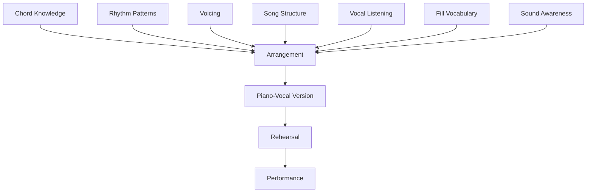
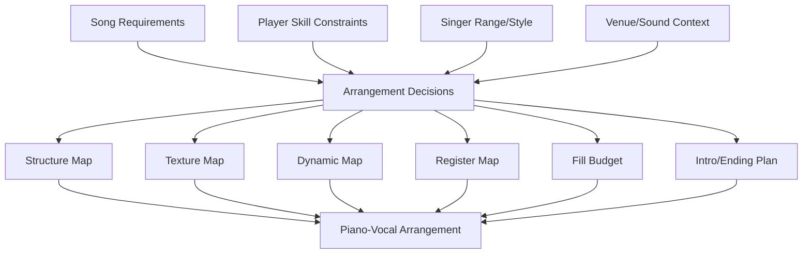
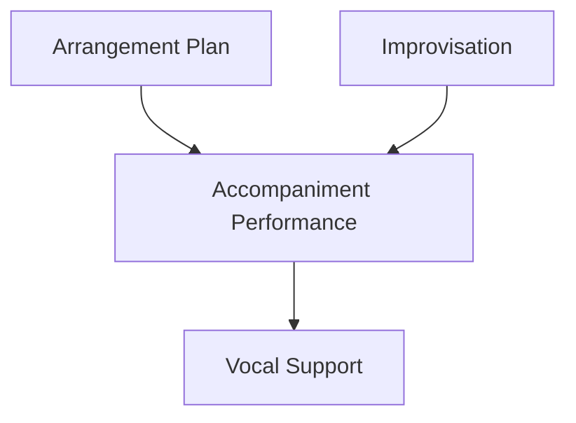
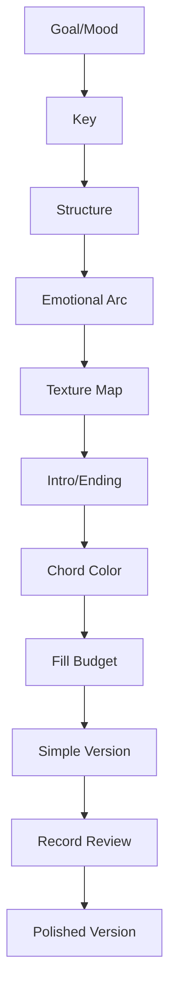
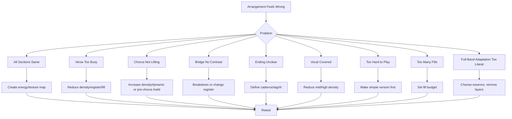
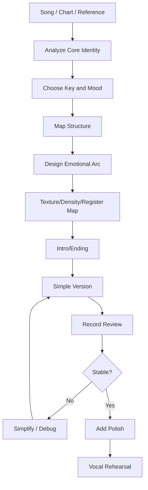

# learn-piano-accompaniment-part-028.md

# Part 028 — Arranging for Piano-Vocal: Membuat Versi Piano dari Lagu Utuh

> Seri: **Learn Piano Accompaniment for Singer Performance**  
> Fokus: **belajar piano untuk mengiringi penyanyi**  
> Framework utama: **The First 20 Hours — Josh Kaufman**  
> Tahap: **Phase L — Aransemen Piano-Vokal Utuh**

---

## Status Seri

| Item | Status |
|---|---|
| Part | 028 |
| Nama file | `learn-piano-accompaniment-part-028.md` |
| Fokus | Membuat aransemen piano-vokal utuh dari lagu/chord chart |
| Prasyarat | Part 000–027 |
| Output praktis | Bisa mengubah chord chart atau lagu full-band menjadi versi piano-vokal yang masuk akal, terstruktur, dinamis, dan mendukung penyanyi |
| Status seri | Belum selesai |

---

## Daftar Isi

- [1. Tujuan Part Ini](#1-tujuan-part-ini)
- [2. Posisi Part Ini dalam Framework Kaufman](#2-posisi-part-ini-dalam-framework-kaufman)
- [3. Masalah Utama: Bisa Main Chord, tetapi Belum Bisa “Membuat Versi”](#3-masalah-utama-bisa-main-chord-tetapi-belum-bisa-membuat-versi)
- [4. Mental Model: Arranging sebagai System Design](#4-mental-model-arranging-sebagai-system-design)
- [5. Apa Itu Arranging untuk Piano-Vocal?](#5-apa-itu-arranging-untuk-piano-vocal)
- [6. Arrangement vs Accompaniment vs Improvisation](#6-arrangement-vs-accompaniment-vs-improvisation)
- [7. Prinsip Utama: Lagu Harus Tetap Menjadi Lagu](#7-prinsip-utama-lagu-harus-tetap-menjadi-lagu)
- [8. Input Aransemen: Apa yang Harus Dikumpulkan?](#8-input-aransemen-apa-yang-harus-dikumpulkan)
- [9. Output Aransemen: Apa yang Harus Dihasilkan?](#9-output-aransemen-apa-yang-harus-dihasilkan)
- [10. Emotional Arc: Peta Energi Lagu](#10-emotional-arc-peta-energi-lagu)
- [11. Texture Map: Pattern per Section](#11-texture-map-pattern-per-section)
- [12. Density Map: Seberapa Banyak Nada per Section](#12-density-map-seberapa-banyak-nada-per-section)
- [13. Register Map: Di Mana Piano Berbicara](#13-register-map-di-mana-piano-berbicara)
- [14. Dynamic Map: Seberapa Keras/Lembut](#14-dynamic-map-seberapa-keraslembut)
- [15. Fill Budget: Berapa Banyak Piano Boleh Menjawab](#15-fill-budget-berapa-banyak-piano-boleh-menjawab)
- [16. Chord Color Map: Kapan Memakai Add9, Sus, Seventh](#16-chord-color-map-kapan-memakai-add9-sus-seventh)
- [17. Intro Design](#17-intro-design)
- [18. Verse Design](#18-verse-design)
- [19. Pre-Chorus Design](#19-pre-chorus-design)
- [20. Chorus Design](#20-chorus-design)
- [21. Interlude Design](#21-interlude-design)
- [22. Bridge Design](#22-bridge-design)
- [23. Final Chorus Design](#23-final-chorus-design)
- [24. Ending Design](#24-ending-design)
- [25. Mengadaptasi Lagu Full-Band ke Piano-Vocal](#25-mengadaptasi-lagu-full-band-ke-piano-vocal)
- [26. Mengganti Fungsi Drum dengan Rhythm Piano](#26-mengganti-fungsi-drum-dengan-rhythm-piano)
- [27. Mengganti Fungsi Bass dengan Left Hand](#27-mengganti-fungsi-bass-dengan-left-hand)
- [28. Mengganti Fungsi Guitar/Pad dengan Right Hand](#28-mengganti-fungsi-guitarpad-dengan-right-hand)
- [29. Menjaga Hook Lagu tanpa Meniru Semua Instrumen](#29-menjaga-hook-lagu-tanpa-meniru-semua-instrumen)
- [30. Versi Simple vs Versi Polished](#30-versi-simple-vs-versi-polished)
- [31. Arrangement Sheet Template](#31-arrangement-sheet-template)
- [32. Workflow Membuat Aransemen dari Nol](#32-workflow-membuat-aransemen-dari-nol)
- [33. Workflow Mengaransemen dari Chord Chart Mentah](#33-workflow-mengaransemen-dari-chord-chart-mentah)
- [34. Workflow Mengaransemen dari Lagu Full-Band](#34-workflow-mengaransemen-dari-lagu-full-band)
- [35. Mini Arrangement Pattern 1: Sparse to Full](#35-mini-arrangement-pattern-1-sparse-to-full)
- [36. Mini Arrangement Pattern 2: Minor Verse to Major Chorus](#36-mini-arrangement-pattern-2-minor-verse-to-major-chorus)
- [37. Mini Arrangement Pattern 3: 6/8 Cinematic Build](#37-mini-arrangement-pattern-3-68-cinematic-build)
- [38. Mini Arrangement Pattern 4: Breakdown Bridge](#38-mini-arrangement-pattern-4-breakdown-bridge)
- [39. Mini Arrangement Pattern 5: Tag Ending](#39-mini-arrangement-pattern-5-tag-ending)
- [40. Mini Case Study 1: 4-Chord Pop Song menjadi Piano-Vocal](#40-mini-case-study-1-4-chord-pop-song-menjadi-piano-vocal)
- [41. Mini Case Study 2: Full-Band Chorus menjadi Piano Chorus](#41-mini-case-study-2-full-band-chorus-menjadi-piano-chorus)
- [42. Mini Case Study 3: Lagu Terlalu Ramai Dibuat Intimate](#42-mini-case-study-3-lagu-terlalu-ramai-dibuat-intimate)
- [43. Mini Case Study 4: Bridge Dibuat Turun agar Final Chorus Naik](#43-mini-case-study-4-bridge-dibuat-turun-agar-final-chorus-naik)
- [44. Latihan 1: Buat Emotional Arc](#44-latihan-1-buat-emotional-arc)
- [45. Latihan 2: Buat Texture Map](#45-latihan-2-buat-texture-map)
- [46. Latihan 3: Buat Intro dan Ending](#46-latihan-3-buat-intro-dan-ending)
- [47. Latihan 4: Buat Versi Simple](#47-latihan-4-buat-versi-simple)
- [48. Latihan 5: Tambah Versi Polished](#48-latihan-5-tambah-versi-polished)
- [49. Latihan 6: Record Arrangement Demo](#49-latihan-6-record-arrangement-demo)
- [50. Debugging Aransemen](#50-debugging-aransemen)
- [51. Failure Mode Pemula](#51-failure-mode-pemula)
- [52. Practice Protocol 7 Hari](#52-practice-protocol-7-hari)
- [53. Practice Protocol 45 Menit](#53-practice-protocol-45-menit)
- [54. Checklist Kelulusan Part 028](#54-checklist-kelulusan-part-028)
- [55. Ringkasan Mental Model](#55-ringkasan-mental-model)
- [56. Persiapan ke Part 029](#56-persiapan-ke-part-029)

---

# 1. Tujuan Part Ini

Sampai Part 027, kita sudah belajar banyak komponen:

- chord;
- progression;
- rhythm;
- pattern;
- voicing;
- inversion;
- density;
- register;
- chord color;
- structure;
- intro;
- ending;
- transition;
- chord chart;
- transpose;
- repertoire;
- deliberate practice;
- performance readiness;
- sound setup;
- ear training;
- fill dasar.

Sekarang kita mulai menggabungkan semuanya menjadi satu skill yang lebih besar:

```text
arranging for piano-vocal
```

Artinya:

> mengambil sebuah lagu atau chord chart, lalu membuat versi piano-vokal yang utuh, punya struktur, punya energy arc, punya texture per section, punya intro, punya ending, dan mendukung penyanyi dari awal sampai akhir.

Target part ini:

> Anda mampu membuat aransemen piano-vokal sederhana dan polished dari lagu utuh, bukan hanya memainkan chord chart mentah.

Setelah part ini, Anda harus bisa menjawab:

- intro-nya bagaimana?
- verse harus seberapa sparse?
- chorus harus naik dengan cara apa?
- bridge harus turun atau build?
- final chorus harus beda dari chorus pertama?
- ending harus soft atau big?
- chord color dipakai di mana?
- fill budget berapa?
- bagaimana mengadaptasi lagu full-band ke piano saja?
- bagaimana menjaga energi tanpa drum dan bass?
- bagaimana membuat arrangement sheet yang bisa dilatih?

---

# 2. Posisi Part Ini dalam Framework Kaufman

Dalam *The First 20 Hours*, setelah sub-skill dasar dipelajari, kita perlu mengintegrasikan sub-skill menjadi performa nyata.

Aransemen adalah integrasi.

Diagram:



Jika part sebelumnya seperti belajar module, part ini seperti system design.

Anda tidak hanya bertanya:

```text
chord apa?
```

Tetapi:

```text
bagaimana seluruh lagu bergerak secara emosional?
```

---

# 3. Masalah Utama: Bisa Main Chord, tetapi Belum Bisa “Membuat Versi”

Banyak pemula bisa melihat chord chart:

```text
C - G - Am - F
```

lalu memainkan chord itu dari awal sampai akhir.

Namun ketika harus membuat versi piano-vokal, muncul masalah:

- semua section terdengar sama;
- verse terlalu ramai;
- chorus tidak terasa naik;
- bridge tidak punya contrast;
- ending tidak jelas;
- intro tidak memberi cue;
- fill muncul random;
- chord color dipakai berlebihan;
- piano meniru full-band terlalu literal;
- energi lagu datar;
- penyanyi tidak punya ruang;
- piano terdengar seperti latihan chord, bukan aransemen.

## 3.1 Root Cause

Karena chord chart hanya memberi harmony.

Aransemen membutuhkan keputusan tentang:

- energy;
- texture;
- density;
- register;
- dynamic;
- fill;
- cue;
- structure;
- sound;
- vocal space.

## 3.2 Prinsip

```text
Chord chart memberi “apa”.
Aransemen menentukan “bagaimana”.
```

---

# 4. Mental Model: Arranging sebagai System Design

Sebagai software engineer, anggap arrangement seperti system design.

Anda punya requirement:

```text
mengiringi penyanyi
membawa emosi lagu
membuat section berbeda
tidak menutup vokal
bisa dimainkan stabil
```

Anda punya constraints:

```text
skill saat ini
jumlah tuts
tempo
key penyanyi
sound setup
rehearsal time
venue
```

Anda punya components:

```text
LH root/bass
RH chord/voicing
pattern
fill
pedal
dynamic
register
intro/ending
```

Anda mendesain system:

```text
section by section
```

Diagram:



## 4.1 Aransemen adalah Keputusan

Jika Anda tidak memutuskan, tangan akan memilih secara random saat bermain.

Random bisa berhasil sesekali, tetapi tidak reliable.

## 4.2 Aransemen Bukan Kaku

Membuat arrangement plan bukan berarti tidak boleh adaptasi.

Plan membuat Anda punya baseline.

Saat live, Anda bisa adaptasi dari baseline.

---

# 5. Apa Itu Arranging untuk Piano-Vocal?

Arranging untuk piano-vocal adalah proses mengubah lagu menjadi bentuk yang cocok untuk:

```text
satu piano + satu penyanyi
```

atau:

```text
piano sebagai pengiring utama vokal
```

## 5.1 Yang Dilakukan Arranger

Arranger memutuskan:

- key;
- tempo feel;
- structure;
- intro;
- interlude;
- ending;
- pattern;
- voicing;
- dynamic arc;
- fill;
- chord color;
- simplification;
- adaptation dari full-band.

## 5.2 Yang Tidak Harus Dilakukan

Anda tidak harus:

- menulis notasi lengkap;
- meniru semua instrument original;
- membuat reharmonization kompleks;
- memainkan melody vocal sepanjang waktu;
- membuat solo panjang;
- mengganti semua chord.

## 5.3 Output

Output aransemen bisa berupa:

```text
arrangement sheet
chord chart performable
texture map
practice recording
```

## 5.4 Prinsip

```text
Aransemen piano-vokal yang baik membuat lagu terasa utuh walau instrumennya sedikit.
```

---

# 6. Arrangement vs Accompaniment vs Improvisation

## 6.1 Accompaniment

Aktivitas mengiringi penyanyi secara real-time.

## 6.2 Arrangement

Rencana/versi lagu yang sudah diputuskan sebelumnya.

## 6.3 Improvisation

Keputusan spontan di dalam kerangka aransemen.

## 6.4 Hubungan



## 6.5 Contoh

Arrangement:

```text
Verse sparse, chorus fuller, bridge breakdown, ending soft.
```

Improvisation:

```text
fill kecil di akhir phrase karena penyanyi memberi ruang.
```

Accompaniment:

```text
mengeksekusi semuanya sambil mendengar penyanyi.
```

## 6.6 Rule

```text
Arrangement memberi struktur.
Improvisation memberi respons.
Accompaniment memberi dukungan.
```

---

# 7. Prinsip Utama: Lagu Harus Tetap Menjadi Lagu

Saat mengaransemen, jangan sampai lagu kehilangan identitas.

## 7.1 Identitas Lagu Bisa Berasal dari

- melody vocal;
- lyric rhythm;
- hook;
- chord progression;
- bass line;
- groove;
- dynamic arc;
- motif intro;
- cadence;
- mood.

## 7.2 Jangan Mengubah Terlalu Banyak

Jika Anda mengganti terlalu banyak, lagu bisa tidak dikenali.

Untuk tahap awal, pertahankan:

- chord utama;
- melody vocal;
- structure utama;
- emotional arc.

## 7.3 Boleh Mengubah

- texture;
- density;
- key;
- intro;
- ending;
- chord color ringan;
- tempo feel sedikit;
- instrumentation adaptation.

## 7.4 Rule

```text
Aransemen yang baik bukan memamerkan arranger.
Aransemen yang baik membuat lagu dan penyanyi terdengar lebih kuat.
```

---

# 8. Input Aransemen: Apa yang Harus Dikumpulkan?

Sebelum membuat aransemen, kumpulkan input.

## 8.1 Lagu/Versi Referensi

Tentukan versi mana:

```text
original
acoustic version
live version
cover version
```

## 8.2 Chord Chart

Ambil chart, lalu verifikasi.

## 8.3 Key Penyanyi

Original key belum tentu cocok.

## 8.4 Struktur

Catat:

```text
Intro
Verse
Pre-Chorus
Chorus
Interlude
Bridge
Final Chorus
Ending
```

## 8.5 Mood

Contoh:

```text
intimate
cinematic
dark
hopeful
worshipful
romantic
tragic
```

## 8.6 Performance Context

- rehearsal?
- recording demo?
- live cafe?
- ibadah?
- acara kecil?
- solo piano-vocal?
- band?

## 8.7 Skill Constraint

Aransemen harus bisa dimainkan.

Jangan membuat arrangement yang hanya bagus di atas kertas.

---

# 9. Output Aransemen: Apa yang Harus Dihasilkan?

Output minimal:

## 9.1 Arrangement Sheet

Berisi:

- key;
- tempo;
- meter;
- structure;
- chart;
- texture map;
- dynamic map;
- intro;
- ending;
- cue;
- fill budget;
- voicing notes.

## 9.2 Practice Plan

Bagian mana yang harus dilatih:

- intro;
- transition;
- bridge;
- ending;
- slash chord;
- 6/8;
- fill.

## 9.3 Demo Recording

Rekam versi kasar.

Tidak harus perfect.

Tujuannya mendengar apakah aransemen masuk akal.

## 9.4 Rehearsal Notes

Setelah dicoba dengan penyanyi, catat perubahan.

## 9.5 Rule

```text
Aransemen yang tidak tertulis sulit direplikasi dan sulit diperbaiki.
```

---

# 10. Emotional Arc: Peta Energi Lagu

Emotional arc adalah perjalanan energi.

Contoh umum:

```text
Intro kecil
Verse intimate
Chorus naik
Verse 2 sedikit lebih hidup
Chorus 2 lebih kuat
Bridge turun
Final chorus peak
Ending lembut
```

## 10.1 Energy Level

Gunakan skala:

```text
E1 = sangat lembut
E2 = verse
E3 = chorus normal
E4 = final chorus/peak
E5 = sangat besar
```

## 10.2 Contoh Map

| Section | Energy |
|---|---:|
| Intro | E1 |
| Verse 1 | E2 |
| Chorus 1 | E3 |
| Interlude | E2 |
| Verse 2 | E2.5 |
| Chorus 2 | E3 |
| Bridge | E1.5 -> E4 |
| Final Chorus | E4 |
| Ending | E1 |

## 10.3 Kenapa Penting?

Tanpa emotional arc, semua section terdengar sama.

## 10.4 Rule

```text
Energi lagu harus bergerak, bukan datar.
```

---

# 11. Texture Map: Pattern per Section

Texture map menentukan pattern.

## 11.1 Texture Vocabulary

Dari part sebelumnya:

- block chord;
- LH root + RH chord;
- broken chord;
- pop ballad comping;
- 6/8 rolling;
- sparse partial;
- fuller chorus;
- stop-time;
- hold chord.

## 11.2 Contoh

| Section | Texture |
|---|---|
| Intro | broken chord motif |
| Verse 1 | sparse root + partial |
| Chorus 1 | pop ballad comping |
| Verse 2 | sparse + sedikit motion |
| Bridge | hold chord / breakdown |
| Final Chorus | fuller comping |
| Ending | cadence + hold |

## 11.3 Jangan Terlalu Banyak Texture

Untuk satu lagu, 2–4 texture cukup.

## 11.4 Texture Change Harus Punya Alasan

Misalnya:

```text
chorus butuh naik
bridge butuh turun
ending butuh resolve
```

## 11.5 Rule

```text
Texture map adalah cara piano menceritakan section.
```

---

# 12. Density Map: Seberapa Banyak Nada per Section

Density adalah seberapa ramai piano.

## 12.1 Density Level

```text
D1 = root only
D2 = root + partial
D3 = block sparse
D4 = broken chord
D5 = fuller comping
```

## 12.2 Contoh

| Section | Density |
|---|---:|
| Intro | D2 |
| Verse 1 | D2 |
| Chorus 1 | D4 |
| Verse 2 | D3 |
| Bridge | D1 -> D4 |
| Final Chorus | D5 |
| Ending | D2 |

## 12.3 Density dan Vokal

Jika vokal padat, density turun.

Jika vokal sustain atau diam, density boleh naik sedikit.

## 12.4 Rule

```text
Density harus mengikuti ruang vokal, bukan keinginan tangan.
```

---

# 13. Register Map: Di Mana Piano Berbicara

Register map menentukan area keyboard.

## 13.1 Low Register

Gunakan hati-hati.

Cocok untuk:

- bass/root;
- dramatic hit;
- final low support.

Risiko:

- muddy.

## 13.2 Middle Register

Area utama accompaniment.

Risiko:

- bentrok vocal.

## 13.3 Upper Register

Cocok untuk:

- sparkle;
- fill;
- intro motif;
- interlude.

Risiko:

- menabrak vocal high note.

## 13.4 Contoh Map

| Section | Register |
|---|---|
| Verse | mid-low, sparse |
| Chorus | mid, wider |
| Bridge breakdown | mid-high sparse |
| Final chorus | wider but vocal-safe |
| Ending | mid, clean |

## 13.5 Rule

```text
Register bukan hanya masalah tangan nyaman.
Register adalah ruang untuk vokal.
```

---

# 14. Dynamic Map: Seberapa Keras/Lembut

Dynamic map menentukan volume/touch.

## 14.1 Dynamic Level

```text
P = lembut
MP = medium lembut
MF = medium
F = kuat
```

Atau versi kita:

```text
E1-E5
```

## 14.2 Dynamic Tidak Sama dengan Density

Chorus bisa lebih padat tetapi tetap tidak keras berlebihan.

## 14.3 Contoh

| Section | Dynamic |
|---|---|
| Intro | E1 |
| Verse | E2 |
| Pre-Chorus | E2 -> E3 |
| Chorus | E3 |
| Bridge | E1.5 -> E4 |
| Final Chorus | E4 |
| Ending | E1 atau E4 tergantung mood |

## 14.4 Rule

```text
Dynamic harus membantu lyric arc.
Jangan hanya otomatis makin keras setiap chorus.
```

---

# 15. Fill Budget: Berapa Banyak Piano Boleh Menjawab

Fill budget mencegah overplaying.

## 15.1 Contoh Budget

| Section | Fill Budget |
|---|---|
| Intro | motif kecil |
| Verse 1 | sangat sedikit |
| Chorus 1 | akhir phrase saja |
| Interlude | lebih bebas |
| Verse 2 | sedikit lebih banyak dari verse 1 |
| Bridge | tergantung mood |
| Final Chorus | fill cue, jangan menutup hook |
| Ending | cadence fill |

## 15.2 Fill Budget Harus Disengaja

Jika tidak ditentukan, tangan cenderung mengisi terlalu banyak.

## 15.3 Rule

```text
Fill budget adalah mekanisme anti-overplaying.
```

---

# 16. Chord Color Map: Kapan Memakai Add9, Sus, Seventh

Chord color memberi emosi.

Namun tidak semua chord harus diberi color.

## 16.1 Safe Color

Dalam key C:

```text
C -> Cadd9
Am -> Am7
F -> Fadd9/Fmaj7
G -> Gsus4/G7
Dm -> Dm7
```

## 16.2 Verse

Gunakan color lembut:

```text
Am7
Fadd9
Cadd9
```

## 16.3 Chorus

Boleh sedikit lebih penuh:

```text
Cadd9
G
Am7
Fadd9
```

## 16.4 Transition

Gunakan sus/dominant:

```text
Gsus4 - G - C
Dm7 - G7 - C
```

## 16.5 Ending

Gunakan color sesuai mood:

- soft: `Cadd9`, `Cmaj7`;
- clear: `C`;
- dramatic: low C octave + full chord.

## 16.6 Rule

```text
Chord color harus ditempatkan, bukan disebar tanpa tujuan.
```

---

# 17. Intro Design

Intro punya fungsi:

- establish key;
- establish tempo;
- establish mood;
- establish texture;
- cue vocal entry.

## 17.1 Intro Aman

```text
4 bars
chorus progression
```

Contoh:

```text
| Cadd9 | G | Am7 | Fadd9 |
```

## 17.2 Intro dari Last Line

Untuk lagu ballad:

```text
| Fadd9 | Gsus4 G | Cadd9 | Cadd9 |
```

## 17.3 Intro 6/8

```text
| Cadd9 | Gsus4 G | Am7 | Fadd9 |
```

dengan rolling pattern.

## 17.4 Intro Harus Punya Cue

Bar terakhir harus memberi ruang penyanyi.

## 17.5 Rule

```text
Intro bukan hanya pembukaan.
Intro adalah onboarding penyanyi ke key, tempo, dan mood.
```

---

# 18. Verse Design

Verse biasanya membawa cerita.

## 18.1 Verse 1

Biasanya lebih sparse.

Gunakan:

- LH root;
- RH partial;
- dynamic E1-E2;
- fill minimal;
- pedal ringan;
- register vocal-safe.

## 18.2 Verse 2

Boleh sedikit lebih berkembang.

Tambah:

- broken chord ringan;
- RH motion sedikit;
- chord color;
- fill kecil di akhir phrase.

## 18.3 Jangan Verse Terlalu Besar

Jika verse sudah besar, chorus sulit naik.

## 18.4 Verse dan Lirik

Jika lirik padat, piano sparse.

## 18.5 Rule

```text
Verse memberi ruang agar cerita terdengar.
```

---

# 19. Pre-Chorus Design

Pre-chorus jika ada berfungsi membangun menuju chorus.

## 19.1 Fungsi

- menaikkan tension;
- mempercepat expectation;
- menyiapkan chorus;
- memberi lift.

## 19.2 Texture

Bisa dari sparse ke lebih aktif.

## 19.3 Harmony Cue

Gunakan V/sus:

```text
Gsus4 - G
```

atau:

```text
Dm7 - G
```

## 19.4 Dynamic

Gradual build.

Jangan tiba-tiba terlalu keras kecuali efeknya diinginkan.

## 19.5 Rule

```text
Pre-chorus adalah jembatan energi, bukan chorus kecil yang terlalu cepat peak.
```

---

# 20. Chorus Design

Chorus biasanya hook utama.

## 20.1 Fungsi

- emotional release;
- hook;
- lebih singable;
- energi lebih besar.

## 20.2 Piano

Gunakan:

- density lebih tinggi;
- voicing lebih penuh;
- LH lebih jelas;
- pattern lebih aktif;
- dynamic naik;
- tetapi vokal tetap foreground.

## 20.3 Jangan Overplay Hook

Jika hook vokal kuat, piano jangan fill di atasnya.

## 20.4 Chorus 1 vs Final Chorus

Chorus 1 tidak harus peak maksimum.

Simpan ruang untuk final chorus.

## 20.5 Rule

```text
Chorus harus terasa naik, tetapi tidak boleh menenggelamkan hook vokal.
```

---

# 21. Interlude Design

Interlude menghubungkan section.

## 21.1 Fungsi

- memberi napas;
- reset energy;
- mengulang motif;
- menyiapkan verse/bridge;
- memberi waktu penyanyi.

## 21.2 Texture

Bisa pakai motif intro.

## 21.3 Interlude Setelah Chorus

Sering lebih turun daripada chorus agar verse 2 bisa masuk.

## 21.4 Interlude Sebelum Bridge

Bisa menahan atau menurunkan energi.

## 21.5 Rule

```text
Interlude bukan ruang kosong acak.
Interlude adalah transisi emosional.
```

---

# 22. Bridge Design

Bridge harus memberi contrast.

## 22.1 Contrast Bisa Berupa

- dynamic turun;
- chord berbeda;
- register berubah;
- rhythm lebih sparse;
- tension build;
- pedal lebih atmospheric;
- silence.

## 22.2 Breakdown Bridge

Turunkan:

```text
D1-D2
E1-E2
```

Lalu build ke final chorus.

## 22.3 Build Bridge

Jika bridge lyric makin intens, piano bisa gradual build.

## 22.4 Jangan Bridge Sama seperti Verse/Chorus

Bridge harus memberi alasan untuk final chorus terasa baru.

## 22.5 Rule

```text
Bridge adalah tempat lagu mengambil napas besar sebelum klimaks.
```

---

# 23. Final Chorus Design

Final chorus sering menjadi peak.

## 23.1 Cara Membuat Lebih Besar

- density naik;
- LH octave/root lebih jelas;
- RH fuller;
- register lebih lebar;
- dynamic E4;
- chord color lebih rich;
- fill cue antar phrase.

## 23.2 Jangan Menutup High Note

Saat vokal klimaks, piano mendukung dari bawah/tengah.

## 23.3 Bisa Drop Before Final Chorus

Bridge turun, lalu final chorus masuk besar.

## 23.4 Bisa First Half Soft, Second Half Big

Ini sangat efektif.

Contoh:

```text
Final Chorus A: breakdown soft
Final Chorus B: full
```

## 23.5 Rule

```text
Final chorus harus terasa earned, bukan hanya lebih keras.
```

---

# 24. Ending Design

Ending menentukan aftertaste.

## 24.1 Ending Soft

Cocok untuk:

- intimate ballad;
- reflective song;
- tragic mood;
- prayerful/worship;
- acoustic performance.

Pattern:

```text
Fadd9 - Gsus4 G - Cadd9
hold
```

## 24.2 Ending Big

Cocok untuk:

- anthem;
- final chorus peak;
- dramatic close.

Pattern:

```text
F - G - C
```

dengan full chord/octave.

## 24.3 Tag Ending

Ulang last line.

```text
Tag x2
F - G - C
```

## 24.4 Ritardando

Gunakan ringan.

Jangan melambat terlalu awal.

## 24.5 Rule

```text
Ending harus sesuai mood lagu, bukan selalu besar.
```

---

# 25. Mengadaptasi Lagu Full-Band ke Piano-Vocal

Lagu full-band punya banyak layer:

- drums;
- bass;
- guitar;
- pad;
- strings;
- synth;
- backing vocal;
- percussion;
- piano.

Dalam piano-vocal, piano harus memilih layer mana yang paling penting.

## 25.1 Jangan Meniru Semua

Jika mencoba meniru semua instrumen, piano jadi terlalu ramai.

## 25.2 Pilih Essence

Tanya:

```text
apa yang membuat lagu ini dikenali?
```

Mungkin:

- chord progression;
- vocal hook;
- bass line;
- rhythm groove;
- intro motif;
- dynamic drop;
- cadence.

## 25.3 Kompresi Arrangement

Piano menggabungkan:

```text
bass + harmony + rhythm + mood
```

Namun harus tetap playable.

## 25.4 Rule

```text
Adaptasi full-band ke piano adalah proses memilih, bukan menyalin.
```

---

# 26. Mengganti Fungsi Drum dengan Rhythm Piano

Tanpa drum, piano harus memberi pulse.

## 26.1 Drum Function

- pulse;
- groove;
- energy;
- build;
- section change.

## 26.2 Piano Replacement

Gunakan:

- LH beat 1;
- RH comping;
- repeated chord;
- rhythmic anticipation;
- stop-time;
- dynamic accent.

## 26.3 Jangan Terlalu Percussive

Piano bukan drum.

Rhythm cukup jelas tanpa menghantam.

## 26.4 Chorus

Pattern bisa lebih aktif.

## 26.5 Rule

```text
Dalam piano-vocal, rhythm piano menggantikan sebagian fungsi drum, tetapi tetap harus musikal.
```

---

# 27. Mengganti Fungsi Bass dengan Left Hand

LH mengambil fungsi bass.

## 27.1 Bass Function

- root;
- harmonic direction;
- groove;
- transition;
- cadence.

## 27.2 LH Strategy

- root on beat 1;
- octave root jika perlu;
- root-fifth;
- slash bass;
- simple passing bass.

## 27.3 Jangan LH Terlalu Sibuk

Jika LH terlalu ramai, vocal support hilang.

## 27.4 Bass Line Penting

Jika original punya bass line iconic, ambil versi sederhana.

Contoh:

```text
C - B - A
```

dari `C-G/B-Am`.

## 27.5 Rule

```text
LH harus cukup jelas untuk fondasi, cukup sederhana agar tidak muddy.
```

---

# 28. Mengganti Fungsi Guitar/Pad dengan Right Hand

RH bisa mengambil fungsi:

- chord strum;
- pad sustain;
- arpeggio;
- color;
- fill;
- motif.

## 28.1 Guitar Strum ke Piano

Ganti dengan comping rhythm.

## 28.2 Pad ke Piano

Ganti dengan sustained voicing dan pedal ringan.

## 28.3 Guitar Picking ke Broken Chord

Arpeggio piano bisa mengganti picking pattern.

## 28.4 Jangan Semua Sekaligus

RH tidak bisa menjadi guitar, pad, strings, dan solo bersamaan.

Pilih satu fungsi utama per section.

## 28.5 Rule

```text
RH function harus jelas: chord, motion, color, atau fill.
Jangan semuanya sekaligus.
```

---

# 29. Menjaga Hook Lagu tanpa Meniru Semua Instrumen

Hook adalah bagian yang paling dikenali.

## 29.1 Jenis Hook

- vocal hook;
- rhythm hook;
- bass hook;
- chord hook;
- intro motif;
- lyric phrase;
- melodic riff.

## 29.2 Jika Hook Vocal

Jangan piano menabrak.

Support saja.

## 29.3 Jika Hook Instrumental

Ambil versi sederhana.

Contoh:

- motif 2–3 nada;
- rhythm chord;
- bass movement.

## 29.4 Jika Hook Terlalu Sulit

Jangan memaksakan exact riff.

Ambil contour atau rhythm essence.

## 29.5 Rule

```text
Hook harus dikenali, tetapi tidak harus disalin 100%.
```

---

# 30. Versi Simple vs Versi Polished

Setiap aransemen sebaiknya punya dua level.

## 30.1 Versi Simple

Tujuan:

```text
stabil, playable, vocal-safe
```

Ciri:

- chord triad/partial;
- pattern sederhana;
- fill minimal;
- intro/ending jelas;
- no fancy voicing.

## 30.2 Versi Polished

Tujuan:

```text
lebih indah, lebih expressive
```

Tambahan:

- add9;
- sus;
- seventh;
- smoother voice leading;
- motif intro;
- dynamic arc detail;
- fill kecil;
- slash chord.

## 30.3 Workflow

Selalu buat simple version dulu.

Setelah stabil, tambah polish.

## 30.4 Rule

```text
Polish tanpa stable simple version adalah risiko.
```

---

# 31. Arrangement Sheet Template

Gunakan template ini.

```text
Title:
Reference:
Singer:
Key:
Meter:
Tempo:
Mood:

Core Identity:
- hook:
- lyric/mood:
- original groove:
- must-keep element:

Structure:
Intro:
Verse 1:
Chorus 1:
Interlude:
Verse 2:
Chorus 2:
Bridge:
Final Chorus:
Ending:

Emotional Arc:
Intro E_
Verse E_
Chorus E_
Bridge E_
Final Chorus E_
Ending E_

Texture Map:
Intro:
Verse:
Chorus:
Bridge:
Ending:

Density Map:
Intro:
Verse:
Chorus:
Bridge:
Ending:

Register Map:
Intro:
Verse:
Chorus:
Bridge:
Ending:

Chord Color Map:
C:
G:
Am:
F:
Other:

Fill Budget:
Verse:
Chorus:
Bridge:
Interlude:
Ending:

Cue Map:
Vocal entry:
Verse -> Chorus:
Bridge -> Final Chorus:
Ending:

Simple Version:
- 

Polished Version:
- 

Risks:
- 

Practice Focus:
- 
```

## 31.1 Satu Lagu Satu Sheet

Ini membuat aransemen reproducible.

## 31.2 Jangan Terlalu Rumit

Template boleh disederhanakan.

Yang penting keputusan utama tertulis.

---

# 32. Workflow Membuat Aransemen dari Nol

## 32.1 Step 1: Tentukan Goal

```text
versi intimate?
versi cinematic?
versi worship?
versi cafe acoustic?
```

## 32.2 Step 2: Pilih Key

Cocok untuk penyanyi.

## 32.3 Step 3: Tulis Structure

Linearize lagu.

## 32.4 Step 4: Buat Emotional Arc

Energy per section.

## 32.5 Step 5: Pilih Texture

Pattern per section.

## 32.6 Step 6: Pilih Intro/Ending

Jangan ditunda.

## 32.7 Step 7: Pilih Chord Color

Hanya yang perlu.

## 32.8 Step 8: Fill Budget

Tentukan ruang fill.

## 32.9 Step 9: Buat Simple Version

Mainkan full.

## 32.10 Step 10: Tambah Polish

Setelah simple stabil.

Diagram:



---

# 33. Workflow Mengaransemen dari Chord Chart Mentah

Raw chart:

```text
C G Am F
Am F C G
C G Am F
```

## 33.1 Step 1: Tambahkan Bar Line

```text
| C | G | Am | F |
```

## 33.2 Step 2: Tentukan Section

```text
Intro/Chorus
Verse
Chorus
```

## 33.3 Step 3: Tentukan Energy

Verse E2, Chorus E3.

## 33.4 Step 4: Texture

Verse sparse, chorus fuller.

## 33.5 Step 5: Intro/Ending

Intro 4 bar.

Ending:

```text
F - G - C
```

## 33.6 Step 6: Color

```text
Cadd9
Am7
Fadd9
Gsus4
```

## 33.7 Step 7: Fill Budget

Minimal verse, chorus phrase end only.

## 33.8 Output

Chart performable + arrangement map.

---

# 34. Workflow Mengaransemen dari Lagu Full-Band

## 34.1 Step 1: Dengarkan Original

Catat:

- groove;
- bass;
- hook;
- dynamic arc;
- section;
- intro;
- ending.

## 34.2 Step 2: Pilih Elemen Wajib

Contoh:

```text
vocal hook
bass descent
chorus rhythm
bridge breakdown
```

## 34.3 Step 3: Buang Elemen Non-Essential

Tidak semua guitar lick harus dibawa.

## 34.4 Step 4: Tentukan Piano Function

Per section:

- bass + chord;
- arpeggio;
- pad-like sustain;
- rhythmic comping;
- motif.

## 34.5 Step 5: Test dengan Vokal

Jika vokal tertutup, simplify.

## 34.6 Rule

```text
Piano-vocal adaptation adalah reduction with intention.
```

---

# 35. Mini Arrangement Pattern 1: Sparse to Full

## 35.1 Use Case

Lagu pop ballad 4/4.

## 35.2 Structure

```text
Intro sparse
Verse sparse
Chorus fuller
Verse 2 slightly fuller
Final chorus full
Ending soft
```

## 35.3 Texture

Verse:

```text
LH root + RH partial
```

Chorus:

```text
pop ballad comping
```

Final:

```text
fuller RH + LH stronger
```

## 35.4 Rule

```text
Jika bingung, sparse-to-full adalah aransemen default yang aman.
```

---

# 36. Mini Arrangement Pattern 2: Minor Verse to Major Chorus

## 36.1 Progression

Verse:

```text
Am - F - C - G
```

Chorus:

```text
C - G - Am - F
```

## 36.2 Verse

Minor mood, sparse, intimate.

## 36.3 Chorus

Major home, lebih terbuka.

## 36.4 Transition

```text
Gsus4 - G - C
```

## 36.5 Rule

```text
Minor verse ke major chorus memberi emotional lift yang natural.
```

---

# 37. Mini Arrangement Pattern 3: 6/8 Cinematic Build

## 37.1 Use Case

Slow dramatic song.

## 37.2 Count

```text
ONE two three FOUR five six
```

## 37.3 Texture

Intro:

```text
rolling arpeggio soft
```

Verse:

```text
sparse 6/8
```

Chorus:

```text
fuller rolling
```

Bridge:

```text
breakdown then build
```

Ending:

```text
soft ritardando
```

## 37.4 Rule

```text
6/8 already has motion; do not overfill.
```

---

# 38. Mini Arrangement Pattern 4: Breakdown Bridge

## 38.1 Use Case

Lagu butuh final chorus terasa besar.

## 38.2 Bridge

Turunkan:

- density;
- dynamic;
- register;
- pedal;
- fill.

## 38.3 Build

Tambahkan:

- LH root lebih jelas;
- sus/dominant;
- crescendo;
- rhythm sedikit meningkat.

## 38.4 Final Chorus

Masuk lebih besar.

## 38.5 Rule

```text
Kadang cara membuat final chorus besar adalah membuat bridge kecil dulu.
```

---

# 39. Mini Arrangement Pattern 5: Tag Ending

## 39.1 Use Case

Lagu dengan last line kuat.

## 39.2 Pattern

```text
repeat last line x2
F - G - C
```

## 39.3 Dynamic Options

Soft tag:

```text
turun tiap repeat
```

Big tag:

```text
naik ke final chord
```

## 39.4 Cue

Eye contact dengan penyanyi.

## 39.5 Rule

```text
Tag ending harus disepakati dan diarahkan, bukan diulang sampai bingung.
```

---

# 40. Mini Case Study 1: 4-Chord Pop Song menjadi Piano-Vocal

## 40.1 Raw Material

```text
Key: C
Progression: C - G - Am - F
Meter: 4/4
```

## 40.2 Structure

```text
Intro 4
Verse 8
Chorus 8
Interlude 4
Verse 2 8
Chorus 8
Bridge 8
Final Chorus 16
Ending 4
```

## 40.3 Arrangement

Intro:

```text
Cadd9 - G - Am7 - Fadd9
broken chord, E1
```

Verse:

```text
LH root + RH partial, E2
```

Chorus:

```text
pop ballad comping, E3
```

Bridge:

```text
F - G - Am - G
breakdown -> build
```

Final chorus:

```text
fuller, E4
```

Ending:

```text
Fadd9 - Gsus4 G - Cadd9
soft hold
```

## 40.4 Fill Budget

Verse: almost none.

Chorus: phrase ending.

Interlude: motif.

Ending: cadence fill.

---

# 41. Mini Case Study 2: Full-Band Chorus menjadi Piano Chorus

## 41.1 Original Full-Band

Chorus punya:

- drums besar;
- bass driving;
- guitar strum;
- pad;
- vocal hook.

## 41.2 Piano Adaptation

LH:

```text
root on beat 1 + maybe beat 3
```

RH:

```text
fuller chord comping
```

Pedal:

```text
controlled, chord changes clean
```

Dynamic:

```text
E3/E4
```

## 41.3 Jangan

- meniru drum fill;
- meniru guitar strum terlalu padat;
- memainkan melody vocal;
- fill di atas hook.

## 41.4 Rule

```text
Untuk chorus full-band, piano mengambil energy, bukan semua detail.
```

---

# 42. Mini Case Study 3: Lagu Terlalu Ramai Dibuat Intimate

## 42.1 Situasi

Original upbeat/full production.

Anda ingin versi piano-vocal intimate.

## 42.2 Strategy

- tempo sedikit lebih lambat jika cocok;
- chord simplified;
- verse very sparse;
- chorus medium, bukan big;
- use warm piano;
- fill minimal;
- ending soft.

## 42.3 Preserve

- lyric;
- melody;
- hook rhythm;
- key comfortable.

## 42.4 Jangan

Membawa semua layer original.

## 42.5 Rule

```text
Intimate version bukan versi kurang lengkap.
Intimate version adalah versi dengan fokus lebih tajam pada vokal dan lirik.
```

---

# 43. Mini Case Study 4: Bridge Dibuat Turun agar Final Chorus Naik

## 43.1 Problem

Chorus 1 dan final chorus terdengar sama.

## 43.2 Arrangement Fix

Bridge:

```text
drop to E1.5
LH root only
RH partial
less pedal
```

Bar terakhir bridge:

```text
Gsus4 - G
build
```

Final chorus:

```text
E4
fuller chord
LH stronger
```

## 43.3 Result

Final chorus terasa lebih besar karena contrast.

## 43.4 Rule

```text
Contrast creates impact.
```

---

# 44. Latihan 1: Buat Emotional Arc

Pilih satu lagu.

Isi:

```text
Intro:
Verse 1:
Chorus 1:
Interlude:
Verse 2:
Chorus 2:
Bridge:
Final Chorus:
Ending:
```

Beri energy:

```text
E1-E5
```

## 44.1 Pertanyaan

- section mana paling kecil?
- section mana peak?
- apakah chorus 1 dan final chorus berbeda?
- apakah ending soft atau big?

## 44.2 Output

Emotional arc table.

---

# 45. Latihan 2: Buat Texture Map

Untuk lagu yang sama, tentukan texture.

## 45.1 Template

```text
Intro:
Verse:
Chorus:
Interlude:
Bridge:
Final Chorus:
Ending:
```

## 45.2 Gunakan Vocabulary

- sparse;
- block chord;
- broken chord;
- pop ballad comping;
- 6/8 rolling;
- hold chord;
- stop-time.

## 45.3 Constraint

Maksimal 4 texture berbeda.

## 45.4 Goal

Texture map yang sederhana dan executable.

---

# 46. Latihan 3: Buat Intro dan Ending

## 46.1 Intro

Buat 2 opsi intro:

- intro dari chorus progression;
- intro dari cadence/last line.

## 46.2 Ending

Buat 2 opsi ending:

- soft ending;
- big ending atau tag.

## 46.3 Test

Main masing-masing.

Pilih yang paling mendukung mood dan penyanyi.

## 46.4 Output

```text
Chosen intro:
Chosen ending:
Reason:
```

---

# 47. Latihan 4: Buat Versi Simple

Ambil lagu.

Buat versi simple:

- triad/partial chord;
- no complex fill;
- verse sparse;
- chorus fuller;
- intro/ending jelas;
- no risky voicing.

## 47.1 Record

Rekam full run.

## 47.2 Review

Apakah lagu sudah berjalan utuh?

Jika belum, jangan polish dulu.

## 47.3 Rule

```text
Simple version harus bisa berdiri sendiri.
```

---

# 48. Latihan 5: Tambah Versi Polished

Setelah simple stabil, tambahkan polish.

## 48.1 Tambahan yang Boleh

- add9;
- sus;
- Am7/Fadd9;
- slash chord;
- fill 2–3 nada;
- smoother voice leading;
- dynamic detail;
- bridge breakdown.

## 48.2 Jangan Tambah Semua

Pilih 2–3 polish element.

## 48.3 Record A/B

Rekam simple version dan polished version.

Bandingkan.

## 48.4 Pertanyaan

```text
apakah polished version benar-benar lebih baik?
atau hanya lebih ramai?
```

---

# 49. Latihan 6: Record Arrangement Demo

Rekam aransemen full.

## 49.1 Minimal

Piano + humming.

## 49.2 Review Pass

Pass 1: structure.

Pass 2: energy arc.

Pass 3: vocal support.

Pass 4: intro/ending.

Pass 5: overplaying.

## 49.3 Catat

```text
works:
does not work:
needs simplify:
needs polish:
```

## 49.4 Goal

Menguji aransemen sebagai lagu utuh.

---

# 50. Debugging Aransemen

Jika aransemen terasa buruk, debug.



## 50.1 All Sections Same

Fix:

```text
change texture/density/dynamic
```

## 50.2 Chorus Not Lifting

Fix:

```text
increase rhythm/density, or make verse smaller
```

## 50.3 Too Hard to Play

Fix:

```text
simple version
```

## 50.4 Vocal Covered

Fix:

```text
reduce density/register/fill
```

---

# 51. Failure Mode Pemula

## 51.1 Menganggap Aransemen = Main Lebih Banyak

Aransemen bukan menambah notes.

Aransemen adalah membuat keputusan.

## 51.2 Semua Section Sama

Chord boleh sama, tetapi texture/dynamic harus bercerita.

## 51.3 Verse Terlalu Besar

Chorus kehilangan impact.

## 51.4 Final Chorus Tidak Berbeda

Peak tidak terasa.

## 51.5 Bridge Tidak Punya Fungsi

Bridge harus memberi contrast atau build.

## 51.6 Meniru Full-Band Terlalu Literal

Piano menjadi ramai dan tidak playable.

## 51.7 Chord Color Berlebihan

Color tanpa tujuan membuat harmony blur.

## 51.8 Fill Tanpa Budget

Overplaying.

## 51.9 Tidak Ada Simple Version

Langsung polished, lalu tidak stabil.

## 51.10 Tidak Rekam

Aransemen harus didengar sebagai whole song.

---

# 52. Practice Protocol 7 Hari

## Hari 1 — Song Analysis

- pilih lagu;
- tentukan reference;
- tulis structure;
- cari core identity.

## Hari 2 — Emotional Arc

- buat energy map;
- tentukan peak;
- tentukan ending mood.

## Hari 3 — Texture Map

- pilih pattern per section;
- buat density/register map.

## Hari 4 — Intro/Ending

- buat 2 intro;
- buat 2 ending;
- pilih.

## Hari 5 — Simple Version

- main full simple arrangement;
- rekam;
- review.

## Hari 6 — Polish

- tambah chord color/fill/slash secukupnya;
- rekam A/B.

## Hari 7 — Arrangement Demo

- full run dengan humming/vokal;
- review;
- update arrangement sheet.

## Prinsip

```text
Aransemen dibuat bertahap: structure -> simple -> polish.
```

---

# 53. Practice Protocol 45 Menit

## 53.1 Menit 0–5: Define Song Goal

Tulis:

```text
Song:
Mood:
Key:
Target version:
```

## 53.2 Menit 5–10: Structure and Energy

Tulis section dan energy E1-E5.

## 53.3 Menit 10–15: Texture Map

Pilih texture tiap section.

## 53.4 Menit 15–20: Intro/Ending

Latih intro dan ending.

## 53.5 Menit 20–30: Simple Full Run

Main versi simple.

## 53.6 Menit 30–35: Add One Polish Element

Tambahkan satu hal:

- add9;
- sus;
- slash;
- fill;
- dynamic.

## 53.7 Menit 35–40: Record Demo

Rekam 60–120 detik atau full jika singkat.

## 53.8 Menit 40–45: Review

Tulis:

```text
Energy works?
Vocal space?
Too busy?
Ending?
Next action:
```

---

# 54. Checklist Kelulusan Part 028

Anda boleh lanjut ke Part 029 jika sebagian besar checklist ini terpenuhi.

## 54.1 Pemahaman

- [ ] Saya tahu arrangement adalah keputusan “bagaimana” lagu dimainkan.
- [ ] Saya tahu chord chart bukan aransemen lengkap.
- [ ] Saya tahu emotional arc penting.
- [ ] Saya tahu texture map membuat section berbeda.
- [ ] Saya tahu density/register/dynamic harus dirancang.
- [ ] Saya tahu fill budget mencegah overplaying.
- [ ] Saya tahu chord color harus ditempatkan dengan tujuan.
- [ ] Saya tahu full-band adaptation adalah proses memilih essence.
- [ ] Saya tahu simple version harus dibuat sebelum polished version.
- [ ] Saya tahu aransemen harus diuji dengan rekaman/vokal.

## 54.2 Praktik

- [ ] Saya bisa membuat emotional arc satu lagu.
- [ ] Saya bisa membuat texture map satu lagu.
- [ ] Saya bisa membuat density map sederhana.
- [ ] Saya bisa memilih intro untuk satu lagu.
- [ ] Saya bisa memilih ending untuk satu lagu.
- [ ] Saya bisa menentukan fill budget per section.
- [ ] Saya bisa membuat versi simple dari chord chart.
- [ ] Saya bisa menambahkan 2–3 polish element.
- [ ] Saya bisa merekam arrangement demo.
- [ ] Saya bisa menulis arrangement sheet.

## 54.3 Self-Correction

- [ ] Saya bisa mendeteksi jika semua section terdengar sama.
- [ ] Saya bisa mendeteksi jika verse terlalu ramai.
- [ ] Saya bisa mendeteksi jika chorus tidak terasa naik.
- [ ] Saya bisa mendeteksi jika bridge tidak punya contrast.
- [ ] Saya bisa mendeteksi jika ending tidak sesuai mood.
- [ ] Saya bisa mendeteksi jika aransemen terlalu sulit dimainkan.
- [ ] Saya bisa mengurangi layer yang tidak perlu.
- [ ] Saya bisa membedakan polish yang membantu dan polish yang hanya membuat ramai.

---

# 55. Ringkasan Mental Model

Arranging adalah system design untuk lagu.

Input:

```text
song
singer
key
chart
mood
context
skill constraint
```

Keputusan:

```text
emotional arc
texture map
density map
register map
dynamic map
fill budget
chord color
intro
ending
```

Output:

```text
piano-vocal arrangement
```

Diagram akhir:



Kalimat kunci:

```text
Aransemen bukan menambah notes.
Aransemen adalah membuat lagu berjalan dengan bentuk, arah, dan ruang.
```

Dan:

```text
Versi simple yang stabil adalah fondasi.
Versi polished hanya boleh lahir setelah fondasi itu kuat.
```

---

# 56. Persiapan ke Part 029

Part berikutnya adalah:

```text
learn-piano-accompaniment-part-029.md
```

Judul:

```text
Bermain dengan Penyanyi: Rehearsal, Communication, dan Real-Time Adaptation
```

Sampai Part 028, kita sudah bisa membuat aransemen piano-vokal.

Part 029 akan fokus pada interaksi rehearsal dan kolaborasi:

- bagaimana memimpin rehearsal kecil;
- pertanyaan yang harus ditanyakan ke penyanyi;
- menentukan key bersama;
- menyepakati intro/ending/tag;
- memberi dan menerima feedback;
- mengatur bahasa komunikasi agar tidak menyakiti penyanyi;
- mengulang problem spot;
- mengikuti phrasing;
- adaptasi jika penyanyi mengubah interpretasi;
- rehearsal run vs debug run;
- membuat final arrangement agreement;
- membangun trust antara pianis dan penyanyi.

Part 029 akan membawa aransemen dari kertas ke manusia nyata.

---

## Status Akhir Part 028

```text
Part 028 selesai.
Seri belum selesai.
Lanjut ke Part 029.
```
