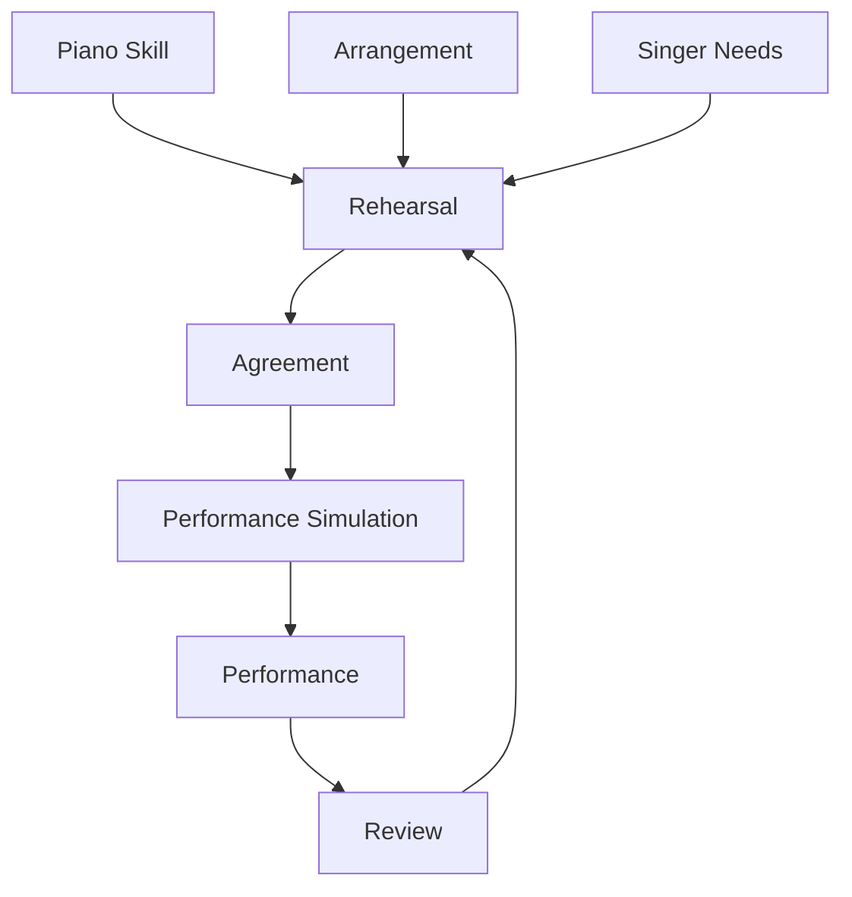
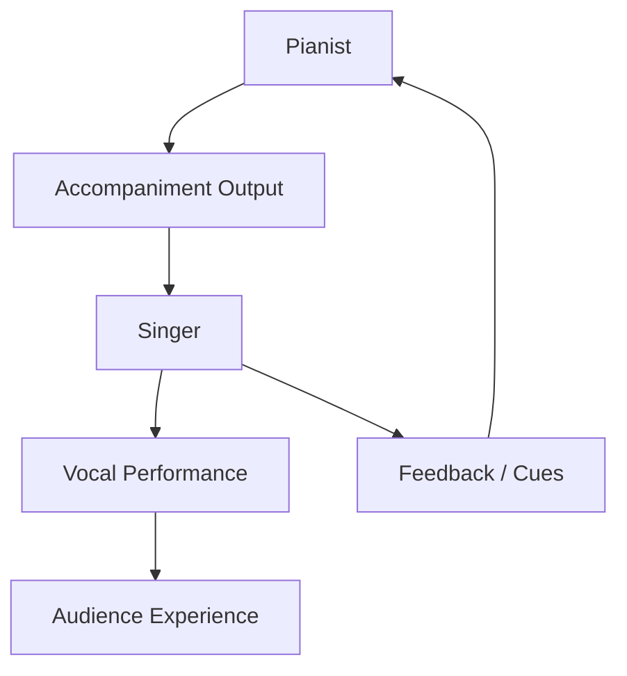
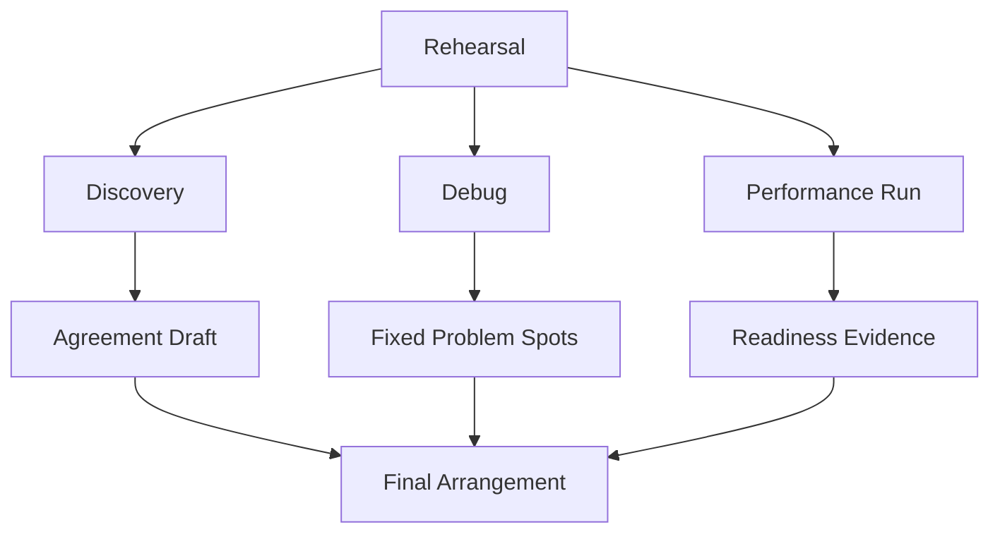
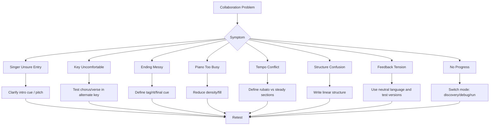
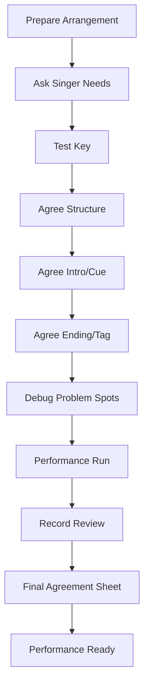

# learn-piano-accompaniment-part-029.md

# Part 029 — Bermain dengan Penyanyi: Rehearsal, Communication, dan Real-Time Adaptation

> Seri: **Learn Piano Accompaniment for Singer Performance**  
> Fokus: **belajar piano untuk mengiringi penyanyi**  
> Framework utama: **The First 20 Hours — Josh Kaufman**  
> Tahap: **Phase M — Kolaborasi Nyata dengan Penyanyi**

---

## Status Seri

| Item | Status |
|---|---|
| Part | 029 |
| Nama file | `learn-piano-accompaniment-part-029.md` |
| Fokus | Rehearsal, komunikasi, cue, feedback, trust, dan adaptasi real-time saat bermain dengan penyanyi |
| Prasyarat | Part 000–028 |
| Output praktis | Bisa menjalankan rehearsal kecil dengan penyanyi, menyepakati aransemen, memberi support musikal, dan beradaptasi saat interpretasi berubah |
| Status seri | Belum selesai |

---

## Daftar Isi

- [1. Tujuan Part Ini](#1-tujuan-part-ini)
- [2. Posisi Part Ini dalam Framework Kaufman](#2-posisi-part-ini-dalam-framework-kaufman)
- [3. Masalah Utama: Pianis Siap, tetapi Kolaborasi Belum Siap](#3-masalah-utama-pianis-siap-tetapi-kolaborasi-belum-siap)
- [4. Mental Model: Penyanyi sebagai Primary User](#4-mental-model-penyanyi-sebagai-primary-user)
- [5. Apa Peran Pianis Pengiring dalam Rehearsal?](#5-apa-peran-pianis-pengiring-dalam-rehearsal)
- [6. Rehearsal Bukan Sekadar Main dari Awal sampai Akhir](#6-rehearsal-bukan-sekadar-main-dari-awal-sampai-akhir)
- [7. Tiga Mode Rehearsal: Discovery, Debug, dan Performance Run](#7-tiga-mode-rehearsal-discovery-debug-dan-performance-run)
- [8. Sebelum Rehearsal: Persiapan Pianis](#8-sebelum-rehearsal-persiapan-pianis)
- [9. Sebelum Rehearsal: Pertanyaan untuk Penyanyi](#9-sebelum-rehearsal-pertanyaan-untuk-penyanyi)
- [10. Menentukan Key Bersama](#10-menentukan-key-bersama)
- [11. Bahasa yang Aman Saat Membahas Range dan Pitch](#11-bahasa-yang-aman-saat-membahas-range-dan-pitch)
- [12. Menyepakati Versi Lagu](#12-menyepakati-versi-lagu)
- [13. Menyepakati Struktur Lagu](#13-menyepakati-struktur-lagu)
- [14. Menyepakati Intro](#14-menyepakati-intro)
- [15. Menyepakati Vocal Entry](#15-menyepakati-vocal-entry)
- [16. Menyepakati Interlude](#16-menyepakati-interlude)
- [17. Menyepakati Bridge dan Final Chorus](#17-menyepakati-bridge-dan-final-chorus)
- [18. Menyepakati Ending, Tag, dan Ritardando](#18-menyepakati-ending-tag-dan-ritardando)
- [19. Cue System: Audio, Visual, dan Harmonic Cue](#19-cue-system-audio-visual-dan-harmonic-cue)
- [20. Eye Contact dan Body Language](#20-eye-contact-dan-body-language)
- [21. Mendengar Napas Penyanyi](#21-mendengar-napas-penyanyi)
- [22. Mengikuti Phrasing Penyanyi](#22-mengikuti-phrasing-penyanyi)
- [23. Rubato: Siapa yang Memimpin?](#23-rubato-siapa-yang-memimpin)
- [24. Ketika Pianis Harus Menjaga Pulse](#24-ketika-pianis-harus-menjaga-pulse)
- [25. Ketika Pianis Harus Mengikuti Penyanyi](#25-ketika-pianis-harus-mengikuti-penyanyi)
- [26. Feedback dari Penyanyi: Cara Menerima dan Menerjemahkan](#26-feedback-dari-penyanyi-cara-menerima-dan-menerjemahkan)
- [27. Feedback untuk Penyanyi: Cara Memberi tanpa Melukai](#27-feedback-untuk-penyanyi-cara-memberi-tanpa-melukai)
- [28. Bahasa Rehearsal yang Profesional dan Tidak Defensif](#28-bahasa-rehearsal-yang-profesional-dan-tidak-defensif)
- [29. Menangani Ketidaksepakatan Musikal](#29-menangani-ketidaksepakatan-musikal)
- [30. Rehearsal Workflow 60 Menit](#30-rehearsal-workflow-60-menit)
- [31. Rehearsal Workflow 30 Menit](#31-rehearsal-workflow-30-menit)
- [32. Debugging Problem Spot Bersama Penyanyi](#32-debugging-problem-spot-bersama-penyanyi)
- [33. Full Run vs Stop-and-Fix](#33-full-run-vs-stop-and-fix)
- [34. Recording Rehearsal](#34-recording-rehearsal)
- [35. Membuat Final Agreement Sheet](#35-membuat-final-agreement-sheet)
- [36. Adaptasi Real-Time Saat Penyanyi Mengubah Interpretasi](#36-adaptasi-real-time-saat-penyanyi-mengubah-interpretasi)
- [37. Adaptasi Jika Penyanyi Masuk Terlambat atau Terlalu Cepat](#37-adaptasi-jika-penyanyi-masuk-terlambat-atau-terlalu-cepat)
- [38. Adaptasi Jika Penyanyi Mengulang Line atau Tag](#38-adaptasi-jika-penyanyi-mengulang-line-atau-tag)
- [39. Adaptasi Jika Penyanyi Lupa Lirik](#39-adaptasi-jika-penyanyi-lupa-lirik)
- [40. Adaptasi Jika Penyanyi Salah Pitch](#40-adaptasi-jika-penyanyi-salah-pitch)
- [41. Adaptasi Jika Emosi Penyanyi Berubah](#41-adaptasi-jika-emosi-penyanyi-berubah)
- [42. Trust: Fondasi Kolaborasi Piano-Vocal](#42-trust-fondasi-kolaborasi-piano-vocal)
- [43. Mini Case Study 1: Key Terlalu Tinggi, Penyanyi Tidak Enak Mengakuinya](#43-mini-case-study-1-key-terlalu-tinggi-penyanyi-tidak-enak-mengakuinya)
- [44. Mini Case Study 2: Penyanyi Masuk Sebelum Intro Selesai](#44-mini-case-study-2-penyanyi-masuk-sebelum-intro-selesai)
- [45. Mini Case Study 3: Pianis Terlalu Banyak Fill, Penyanyi Kehilangan Ruang](#45-mini-case-study-3-pianis-terlalu-banyak-fill-penyanyi-kehilangan-ruang)
- [46. Mini Case Study 4: Ending Tag Tidak Disepakati](#46-mini-case-study-4-ending-tag-tidak-disepakati)
- [47. Mini Case Study 5: Penyanyi Ingin Lebih Bebas, Pianis Terlalu Kaku](#47-mini-case-study-5-penyanyi-ingin-lebih-bebas-pianis-terlalu-kaku)
- [48. Latihan 1: Simulasi Komunikasi Key](#48-latihan-1-simulasi-komunikasi-key)
- [49. Latihan 2: Cue Intro 4 Bar](#49-latihan-2-cue-intro-4-bar)
- [50. Latihan 3: Stop-and-Fix 2 Bar](#50-latihan-3-stop-and-fix-2-bar)
- [51. Latihan 4: Follow the Breath](#51-latihan-4-follow-the-breath)
- [52. Latihan 5: Tag Ending Agreement](#52-latihan-5-tag-ending-agreement)
- [53. Latihan 6: Rehearsal Recording Review](#53-latihan-6-rehearsal-recording-review)
- [54. Debugging Kolaborasi](#54-debugging-kolaborasi)
- [55. Failure Mode Pemula](#55-failure-mode-pemula)
- [56. Practice Protocol 7 Hari](#56-practice-protocol-7-hari)
- [57. Practice Protocol 45 Menit](#57-practice-protocol-45-menit)
- [58. Checklist Kelulusan Part 029](#58-checklist-kelulusan-part-029)
- [59. Ringkasan Mental Model](#59-ringkasan-mental-model)
- [60. Persiapan ke Part 030](#60-persiapan-ke-part-030)

---

# 1. Tujuan Part Ini

Sampai Part 028, kita sudah membahas bagaimana membuat aransemen piano-vokal:

- emotional arc;
- texture map;
- density map;
- dynamic map;
- register map;
- fill budget;
- intro;
- verse;
- chorus;
- bridge;
- final chorus;
- ending;
- adaptasi full-band ke piano-vocal.

Namun aransemen yang bagus di kertas belum tentu berhasil saat bertemu penyanyi nyata.

Penyanyi punya:

- range unik;
- cara phrasing unik;
- kebiasaan napas;
- timing;
- interpretasi lirik;
- rasa nyaman/tidak nyaman terhadap key;
- preferensi intro/ending;
- kebutuhan pitch support;
- sensitivitas terhadap piano yang terlalu ramai.

Part ini membahas kolaborasi.

Target part ini:

> Anda mampu menjalankan rehearsal kecil dengan penyanyi, menentukan key, menyepakati struktur, intro, ending, tag, cue, memberi dan menerima feedback dengan baik, serta beradaptasi real-time saat penyanyi berubah dari rencana.

Skill ini sangat penting karena tujuan Anda bukan hanya:

```text
bisa main piano
```

tetapi:

```text
bisa mengiringi manusia yang sedang bernyanyi
```

---

# 2. Posisi Part Ini dalam Framework Kaufman

Dalam *The First 20 Hours*, latihan harus mendekati kondisi nyata.

Jika targetnya adalah tampil mengiringi penyanyi, maka:

```text
latihan solo tidak cukup
```

Anda harus melatih interface dengan penyanyi.

Diagram:



Part ini memindahkan fokus dari:

```text
apa yang saya mainkan?
```

ke:

```text
apa yang penyanyi butuhkan dari saya?
```

Ini adalah shift mental yang besar.

---

# 3. Masalah Utama: Pianis Siap, tetapi Kolaborasi Belum Siap

Banyak pianist pemula merasa sudah siap karena:

- chord sudah bisa;
- intro sudah dibuat;
- ending sudah dipilih;
- chart sudah rapi;
- pattern sudah dilatih.

Namun rehearsal tetap kacau karena:

- key ternyata tidak nyaman;
- penyanyi masuk di tempat berbeda;
- intro terlalu panjang;
- cue tidak jelas;
- ending tidak disepakati;
- pianist terlalu kaku mengikuti chart;
- singer terlalu bebas dan pianist bingung;
- feedback disampaikan dengan canggung;
- rehearsal hanya full run tanpa debug;
- tidak ada final agreement.

## 3.1 Gejala

- penyanyi bertanya “masuknya kapan?”;
- pianist berkata “harusnya kamu masuk tadi”;
- ending berhenti tidak bareng;
- chorus diulang berbeda dari rencana;
- penyanyi merasa piano terlalu ramai;
- pianist merasa penyanyi “tidak ikut tempo”;
- key berubah mendadak;
- rehearsal habis waktu untuk hal dasar;
- dua pihak sama-sama merasa tidak didengar.

## 3.2 Root Cause

Bukan hanya skill musik, tetapi skill koordinasi.

## 3.3 Prinsip

```text
Piano-vocal performance adalah sistem dua manusia.
Chord benar saja tidak cukup.
```

---

# 4. Mental Model: Penyanyi sebagai Primary User

Sebagai software engineer, anggap penyanyi sebagai primary user.

Audience juga penting, tetapi dalam runtime performance, penyanyi adalah user yang langsung berinteraksi dengan sistem Anda.

Piano accompaniment harus memberi:

- key yang nyaman;
- pitch reference;
- pulse;
- cue;
- ruang napas;
- emotional support;
- safe recovery;
- dynamic support.

Diagram:



Jika penyanyi tidak nyaman, audience akan merasakannya.

## 4.1 User-Centered Accompaniment

Tanyakan:

```text
Apakah penyanyi merasa aman masuk?
Apakah key nyaman?
Apakah piano terlalu ramai?
Apakah cue jelas?
Apakah ending disepakati?
```

## 4.2 Jangan Pianist-Centered

Pertanyaan yang salah:

```text
Apakah voicing saya keren?
Apakah fill saya terdengar hebat?
Apakah pattern saya kompleks?
```

Pertanyaan yang benar:

```text
Apakah penyanyi terdengar lebih baik karena saya?
```

## 4.3 Prinsip

```text
Pianis pengiring sukses ketika penyanyi merasa didukung, bukan ketika pianis terlihat sibuk.
```

---

# 5. Apa Peran Pianis Pengiring dalam Rehearsal?

Dalam rehearsal kecil, pianis punya beberapa peran.

## 5.1 Harmonic Anchor

Memberi chord dan key center.

## 5.2 Time Anchor

Menjaga pulse saat lagu butuh stabil.

## 5.3 Emotional Bed

Membentuk mood lagu.

## 5.4 Cue Provider

Memberi sinyal masuk, transisi, ending.

## 5.5 Listener

Mendengar napas, phrasing, range, kenyamanan.

## 5.6 Collaborator

Bukan boss, bukan backing track.

Pianis dan penyanyi membuat versi bersama.

## 5.7 Safety Net

Saat penyanyi ragu, pianis membantu tanpa mempermalukan.

## 5.8 Prinsip

```text
Pianis pengiring bukan hanya pemain chord.
Ia adalah partner musikal yang membuat penyanyi merasa aman.
```

---

# 6. Rehearsal Bukan Sekadar Main dari Awal sampai Akhir

Banyak rehearsal gagal karena formatnya hanya:

```text
main lagu full
salah
ulang dari awal
salah lagi
capek
```

Ini tidak efisien.

## 6.1 Rehearsal Harus Punya Mode

Ada waktu untuk:

- discovery;
- debug;
- performance run.

Jika semua dicampur, rehearsal kacau.

## 6.2 Full Run Tidak Memperbaiki Semua

Full run menunjukkan masalah.

Debug memperbaiki masalah.

## 6.3 Jangan Menghabiskan Waktu di Bagian yang Sudah Bisa

Jika masalah ada di ending, latih ending.

Jika masalah ada di entry, latih entry.

## 6.4 Prinsip

```text
Rehearsal yang baik bukan rehearsal yang memainkan lagu paling banyak.
Rehearsal yang baik menghasilkan agreement dan memperbaiki bottleneck.
```

---

# 7. Tiga Mode Rehearsal: Discovery, Debug, dan Performance Run

## 7.1 Discovery Mode

Tujuan:

```text
mencari key, versi, feel, struktur
```

Boleh berhenti sering.

Pertanyaan:

- key nyaman?
- tempo cocok?
- mood seperti apa?
- versi mana?
- intro berapa bar?
- ending bagaimana?

## 7.2 Debug Mode

Tujuan:

```text
memperbaiki problem spot
```

Fokus sempit:

- vocal entry;
- verse to chorus;
- bridge to final chorus;
- ending tag;
- high note;
- transition.

## 7.3 Performance Run Mode

Tujuan:

```text
simulasi tampil
```

Aturan:

- no stop;
- lanjut walau salah;
- review setelah selesai.

## 7.4 Jangan Campur Mode

Jika sedang performance run, jangan berhenti untuk debug.

Jika sedang debug, jangan memaksakan full run.

Diagram:



## 7.5 Prinsip

```text
Mode yang jelas membuat rehearsal efisien dan emosi lebih aman.
```

---

# 8. Sebelum Rehearsal: Persiapan Pianis

Sebelum bertemu penyanyi, pianis harus menyiapkan baseline.

## 8.1 Minimal Preparation

- chord chart rapi;
- key original diketahui;
- 1–2 key alternatif;
- intro opsi;
- ending opsi;
- tempo/meter;
- struktur;
- texture basic;
- fallback pattern.

## 8.2 Jangan Datang Kosong

Jika Anda datang tanpa baseline, rehearsal berubah menjadi trial-and-error total.

## 8.3 Namun Jangan Terlalu Kaku

Baseline bukan final.

Penyanyi bisa mengubah key, feel, atau phrasing.

## 8.4 Siapkan Pertanyaan

Contoh:

```text
Kamu nyaman di key original?
Mau versi lebih intimate atau lebih besar?
Intro 4 bar cukup?
Ending mau soft atau tag?
```

## 8.5 Siapkan Ego

Rehearsal bukan pembuktian pianist.

Rehearsal adalah pencarian versi terbaik untuk vokal.

## 8.6 Checklist

- [ ] chart;
- [ ] key alternatives;
- [ ] intro option;
- [ ] ending option;
- [ ] transition cue;
- [ ] recording device;
- [ ] pencil/notes;
- [ ] open mindset.

---

# 9. Sebelum Rehearsal: Pertanyaan untuk Penyanyi

Pertanyaan yang baik menghemat banyak waktu.

## 9.1 Tentang Versi

```text
Kita mau ikut versi original, acoustic, atau bikin versi sendiri?
```

## 9.2 Tentang Key

```text
Key original nyaman?
Bagian chorus terlalu tinggi atau terlalu rendah?
Verse masih keluar jelas?
```

## 9.3 Tentang Feel

```text
Mau lebih intimate, cinematic, simple, atau lebih besar?
```

## 9.4 Tentang Tempo

```text
Tempo original nyaman?
Mau sedikit lebih lambat/cepat?
```

## 9.5 Tentang Structure

```text
Chorus terakhir mau ulang?
Bridge tetap?
Ada tag ending?
```

## 9.6 Tentang Ending

```text
Mau ending soft, big, atau fade/tag?
```

## 9.7 Tentang Support

```text
Ada bagian yang kamu butuh piano lebih jelas untuk pitch?
Ada bagian yang kamu ingin piano lebih kosong?
```

## 9.8 Prinsip

```text
Pertanyaan rehearsal yang baik membuat asumsi menjadi agreement.
```

---

# 10. Menentukan Key Bersama

Key adalah keputusan paling penting untuk penyanyi.

## 10.1 Mulai dari Chorus

Chorus sering punya high note.

Coba chorus di key original.

## 10.2 Tanyakan Sensasi, Bukan Menghakimi Pitch

Jangan langsung bilang:

```text
itu ketinggian
```

Lebih aman:

```text
Bagian chorus ini terasa nyaman atau agak narik?
Kalau kita turunin sedikit, apakah lebih enak?
```

## 10.3 Cek Verse Setelah Key Turun

Jika turun untuk chorus, verse mungkin terlalu rendah.

## 10.4 Cek Final Chorus

Penyanyi bisa high note sekali, tetapi final chorus butuh stamina.

## 10.5 Coba 2–3 Key

Jangan mencoba semua key tanpa arah.

Contoh:

```text
original C
coba Bb
coba A
```

## 10.6 Catat Final Key

Setelah setuju:

```text
Final key: A
Reason: chorus lebih nyaman, verse masih jelas
```

## 10.7 Prinsip

```text
Key terbaik adalah key yang membuat penyanyi terdengar paling natural, bukan key yang paling mudah untuk pianis.
```

---

# 11. Bahasa yang Aman Saat Membahas Range dan Pitch

Membahas pitch bisa sensitif.

Penyanyi bisa merasa dinilai.

## 11.1 Hindari Bahasa Menghakimi

Hindari:

```text
kamu fals
kamu tidak sampai
suaramu kurang kuat
```

## 11.2 Gunakan Bahasa Fungsional

Gunakan:

```text
Key ini agak tinggi untuk bagian chorus.
Kalau turun satu nada, frase-nya mungkin lebih natural.
Bagian verse di key ini masih terdengar jelas?
Aku ingin cari key yang paling nyaman buat kamu.
```

## 11.3 Fokus ke Lagu, Bukan Orang

Daripada:

```text
kamu tidak bisa nyanyi tinggi
```

katakan:

```text
bagian ini memang duduknya cukup tinggi di key ini
```

## 11.4 Validasi

```text
Secara emosi tadi sudah dapat, tinggal cari posisi key yang paling enak.
```

## 11.5 Prinsip

```text
Tujuan feedback range adalah membuat penyanyi aman, bukan membuktikan dia salah.
```

---

# 12. Menyepakati Versi Lagu

Satu lagu bisa punya banyak versi.

## 12.1 Masalah Jika Tidak Sepakat

Penyanyi mengikuti live version.

Pianis mengikuti studio version.

Akhirnya:

- struktur beda;
- ending beda;
- bridge beda;
- tempo beda;
- tag beda.

## 12.2 Tentukan Reference

```text
Kita pakai original sebagai struktur, tapi feel lebih acoustic.
```

atau:

```text
Kita pakai versi live untuk ending tag.
```

## 12.3 Jika Bikin Versi Sendiri

Tuliskan final structure.

## 12.4 Jangan Asumsi

Kata “lagunya yang biasa” bisa berarti beda versi bagi dua orang.

## 12.5 Prinsip

```text
Versi lagu harus eksplisit.
```

---

# 13. Menyepakati Struktur Lagu

Struktur harus jelas.

## 13.1 Template

```text
Intro 4
Verse 1
Chorus 1
Interlude 2/4
Verse 2
Chorus 2
Bridge
Final Chorus x2
Tag x2
Ending
```

## 13.2 Tulis Linear

Jangan hanya:

```text
repeat chorus
```

Jika mudah membingungkan, tulis:

```text
Chorus 1
Chorus 2
Final Chorus
```

## 13.3 Sepakati Cut

Kadang live version memotong:

- verse 2;
- bridge;
- interlude;
- repeat chorus.

## 13.4 Sepakati Repeat

```text
Chorus terakhir x2 atau x3?
```

## 13.5 Prinsip

```text
Struktur yang tidak tertulis akan diuji oleh kepanikan saat tampil.
```

---

# 14. Menyepakati Intro

Intro adalah pintu masuk penyanyi.

## 14.1 Pertanyaan

```text
Intro 4 bar cukup?
Kamu masuk setelah chord apa?
Mau aku kasih cue fill?
```

## 14.2 Intro Terlalu Panjang

Penyanyi bisa bingung.

## 14.3 Intro Terlalu Pendek

Penyanyi belum siap masuk.

## 14.4 Cue Intro

Gunakan:

- cadence;
- Gsus4-G;
- fill pendek;
- hold chord;
- eye contact;
- breath together.

## 14.5 Latih Entry

Jangan hanya diskusi.

Ulang:

```text
intro -> vocal entry
```

minimal 3–5 kali.

## 14.6 Prinsip

```text
Intro yang baik membuat penyanyi tahu kapan, di nada apa, dan dengan mood apa harus masuk.
```

---

# 15. Menyepakati Vocal Entry

Vocal entry adalah momen kritis.

## 15.1 Entry Information

Penyanyi butuh:

- tempo;
- key;
- starting pitch;
- beat masuk;
- mood;
- cue.

## 15.2 Jika Entry Ragu

Perjelas chord sebelum entry.

Jangan pakai voicing terlalu ambiguous.

## 15.3 Count-In

Kadang perlu count-in:

```text
1, 2, 3, 4
```

atau silent internal count.

## 15.4 Breath Cue

Pianis bisa ikut mengambil napas kecil sebelum entry.

Ini membantu sinkron.

## 15.5 Prinsip

```text
Entry yang aman lebih penting daripada intro yang indah.
```

---

# 16. Menyepakati Interlude

Interlude sering membingungkan karena tidak ada vokal.

## 16.1 Pertanyaan

```text
Interlude setelah chorus berapa bar?
Kamu masuk verse berikutnya setelah progression penuh atau setengah?
```

## 16.2 Interlude Fungsi

- napas;
- reset energy;
- transition;
- motif;
- cue masuk lagi.

## 16.3 Marking

```text
Interlude 4 bar, same as intro
```

atau:

```text
Interlude 2 bar only
```

## 16.4 Latih

Ulang:

```text
chorus last line -> interlude -> verse 2 entry
```

## 16.5 Prinsip

```text
Interlude tanpa agreement adalah tempat umum tersesat.
```

---

# 17. Menyepakati Bridge dan Final Chorus

Bridge sering menjadi titik interpretasi.

## 17.1 Pertanyaan

```text
Bridge mau turun dulu atau langsung build?
Final chorus mau masuk besar atau soft dulu?
```

## 17.2 Bridge to Final Chorus

Latih transition.

Biasanya:

```text
bridge last 2 bars -> final chorus
```

## 17.3 Final Chorus Variasi

Opsi:

- full langsung;
- first half soft, second half full;
- key change/modulasi jika advanced;
- repeat last chorus.

Untuk tahap ini, hindari modulasi rumit jika belum siap.

## 17.4 Prinsip

```text
Bridge menentukan seberapa kuat final chorus terasa.
```

---

# 18. Menyepakati Ending, Tag, dan Ritardando

Ending adalah momen paling terlihat.

## 18.1 Pertanyaan Ending

```text
Mau ending soft atau big?
Tag berapa kali?
Mau ritardando?
Final chord di mana?
Kamu mau tahan last note?
```

## 18.2 Tag

Jika tag:

```text
last line x2
```

tulis jelas.

## 18.3 Ritardando

Sepakati siapa memimpin.

Biasanya penyanyi memimpin phrasing akhir, pianis mengikuti.

## 18.4 Final Cue

Gunakan:

- eye contact;
- breath;
- nod;
- final word;
- harmonic cadence.

## 18.5 Latih Ending Terpisah

Jangan hanya full run.

Latih:

```text
final chorus last 4 bars -> ending
```

## 18.6 Prinsip

```text
Ending tidak boleh bergantung pada telepati.
```

---

# 19. Cue System: Audio, Visual, dan Harmonic Cue

Cue adalah sinyal.

## 19.1 Audio Cue

- fill pendek;
- hold chord;
- stop rhythm;
- crescendo;
- chord hit;
- sus resolution.

## 19.2 Visual Cue

- eye contact;
- anggukan;
- napas;
- gerak tangan kecil;
- body lean.

## 19.3 Harmonic Cue

- V-I;
- Gsus4-G-C;
- F-G-C;
- Dm7-G7-C.

## 19.4 Cue yang Baik

Cue harus:

- sederhana;
- konsisten;
- disepakati;
- tidak mengganggu vokal.

## 19.5 Prinsip

```text
Cue adalah API contract antar performer.
```

Jika contract tidak jelas, runtime error terjadi.

---

# 20. Eye Contact dan Body Language

Piano-vocal bukan hanya suara.

## 20.1 Eye Contact

Gunakan di:

- sebelum vocal entry;
- sebelum chorus;
- sebelum bridge;
- sebelum ending;
- jika terjadi error.

## 20.2 Jangan Menatap Terus

Terlalu banyak menatap bisa mengganggu.

Gunakan saat penting.

## 20.3 Body Language

Tubuh pianis bisa memberi pulse.

Sedikit gerak napas/torso membantu.

## 20.4 Wajah Tenang

Jika salah, jangan wajah panik.

Wajah panik membuat penyanyi ikut panik.

## 20.5 Prinsip

```text
Penyanyi tidak hanya mendengar Anda.
Ia juga membaca tubuh Anda.
```

---

# 21. Mendengar Napas Penyanyi

Napas adalah sinyal penting.

## 21.1 Napas Sebelum Entry

Penyanyi sering mengambil napas sebelum masuk.

Pianis harus memberi ruang.

## 21.2 Napas sebagai Tempo Cue

Dalam ballad/rubato, napas menunjukkan timing.

## 21.3 Jangan Fill di Atas Napas

Jika piano mengisi napas, entry bisa terganggu.

## 21.4 Latihan

Minta penyanyi hanya mengambil napas dan masuk phrase.

Pianis latih mengikuti.

## 21.5 Prinsip

```text
Napas penyanyi adalah count-in yang lebih manusiawi daripada angka.
```

---

# 22. Mengikuti Phrasing Penyanyi

Phrasing adalah cara penyanyi membentuk kalimat.

## 22.1 Penyanyi Bisa

- sedikit menunda kata;
- mempercepat phrase;
- menahan note;
- memotong phrase;
- menambah breath;
- memberi emphasis lirik.

## 22.2 Pianis Harus Mendengar

Jangan hanya memainkan grid.

## 22.3 Namun Jangan Kehilangan Struktur

Mengikuti phrasing bukan berarti tempo hancur.

Bedakan:

- expressive delay;
- lost timing.

## 22.4 Cara Support

- kurangi pattern saat phrasing bebas;
- pakai hold chord;
- follow breath;
- kembali ke pulse di section berikutnya.

## 22.5 Prinsip

```text
Phrasing adalah tempat piano belajar menjadi manusia, bukan metronome kaku.
```

---

# 23. Rubato: Siapa yang Memimpin?

Rubato adalah fleksibilitas tempo ekspresif.

## 23.1 Dalam Piano-Vocal

Rubato biasanya dipimpin oleh penyanyi, terutama di:

- intro vocal pickup;
- verse intimate;
- bridge emotional;
- ending.

## 23.2 Pianis Bisa Memimpin

Pianis bisa memimpin jika:

- intro instrumental;
- transition;
- ending cadence;
- penyanyi meminta cue kuat.

## 23.3 Jangan Dua-duanya Memimpin Berbeda

Jika penyanyi menahan tetapi pianis mendorong, konflik.

Jika pianis menahan tetapi penyanyi ingin lanjut, konflik.

## 23.4 Sepakati

```text
Di ending, kamu tahan lyric, aku ikuti.
Setelah itu aku kasih Gsus4-G-C.
```

## 23.5 Prinsip

```text
Rubato harus punya leader dan follower pada momen tertentu.
```

---

# 24. Ketika Pianis Harus Menjaga Pulse

Tidak semua hal harus mengikuti penyanyi.

Kadang pianis harus menjaga stabilitas.

## 24.1 Kapan?

- lagu groove-based;
- penyanyi cenderung rushing;
- band/track ada;
- chorus butuh drive;
- penyanyi kehilangan tempo;
- section transition harus tepat.

## 24.2 Cara Menjaga Pulse Tanpa Kaku

- LH root stabil;
- RH sederhana;
- dynamic tidak menghantam;
- body pulse;
- jangan mempercepat saat penyanyi excited.

## 24.3 Bahasa Rehearsal

```text
Aku coba tahan pulse di chorus supaya feel-nya tetap stabil.
Kalau kamu mau lebih rubato, kita bisa sepakati di bagian tertentu.
```

## 24.4 Prinsip

```text
Mengiringi bukan selalu mengikuti. Kadang support berarti menjadi anchor.
```

---

# 25. Ketika Pianis Harus Mengikuti Penyanyi

Ada momen penyanyi harus diprioritaskan.

## 25.1 Kapan?

- rubato intro;
- emotional line;
- ending;
- breath-heavy ballad;
- last note;
- phrase yang sengaja ditahan;
- penyanyi mengulang tag secara musikal.

## 25.2 Cara Mengikuti

- kurangi pattern;
- hold chord;
- dengar napas;
- lihat body cue;
- masuk di phrase boundary;
- gunakan cadence saat singer siap.

## 25.3 Jangan Terlambat Terus

Following bukan selalu reaktif lambat.

Anda harus antisipasi.

## 25.4 Prinsip

```text
Ikuti penyanyi pada ekspresi, jaga penyanyi pada struktur.
```

---

# 26. Feedback dari Penyanyi: Cara Menerima dan Menerjemahkan

Penyanyi mungkin memberi feedback non-teknis.

## 26.1 Contoh Feedback

```text
Pianonya terlalu penuh.
Aku susah masuk.
Bisa dibuat lebih sedih?
Chorus-nya kurang naik.
Aku butuh chord lebih jelas sebelum masuk.
Bagian itu rasanya terlalu cepat.
Ending-nya kurang enak.
```

## 26.2 Terjemahkan ke Parameter Piano

| Feedback Penyanyi | Kemungkinan Terjemahan |
|---|---|
| terlalu penuh | kurangi density/fill/pedal |
| susah masuk | cue kurang jelas / intro ambiguous |
| lebih sedih | minor color, slower, softer, lower density |
| chorus kurang naik | energy/density/dynamic kurang |
| chord lebih jelas | root + triad, kurang extension |
| terlalu cepat | pulse/rubato/tempo issue |
| ending kurang enak | cadence/tag/rit unclear |

## 26.3 Jangan Defensif

Jawaban baik:

```text
Oke, aku coba kurangin fill dan bikin chord entry lebih jelas.
```

Bukan:

```text
Tapi itu memang pattern-nya.
```

## 26.4 Prinsip

```text
Feedback penyanyi adalah data dari primary user.
```

---

# 27. Feedback untuk Penyanyi: Cara Memberi tanpa Melukai

Kadang pianis perlu memberi feedback.

## 27.1 Fokus ke Kerja Sama

Bukan:

```text
kamu salah masuk
```

Lebih baik:

```text
Entry tadi agak belum bareng. Kita coba aku kasih cue lebih jelas di bar terakhir.
```

## 27.2 Fokus ke Bagian, Bukan Identitas

Bukan:

```text
kamu fals
```

Lebih baik:

```text
Bagian high note ini mungkin lebih nyaman kalau key turun sedikit.
```

## 27.3 Beri Solusi

Feedback tanpa solusi membuat defensif.

Contoh:

```text
Aku bisa main root lebih jelas sebelum kamu masuk.
```

## 27.4 Tanya, Jangan Menghakimi

```text
Kamu merasa bagian itu terlalu tinggi?
```

## 27.5 Prinsip

```text
Feedback yang baik membuat penyanyi lebih aman, bukan lebih malu.
```

---

# 28. Bahasa Rehearsal yang Profesional dan Tidak Defensif

## 28.1 Kalimat Berguna

```text
Kita coba opsi lain.
Aku simplify dulu supaya vocal entry lebih jelas.
Bagian ini kita loop 3 kali ya.
Aku catat ending-nya tag dua kali.
Kamu mau aku ikut phrasing kamu di sini atau aku jaga pulse?
```

## 28.2 Kalimat yang Sebaiknya Dihindari

```text
Harusnya kamu masuk tadi.
Aku sudah benar kok.
Di chart-nya begitu.
Kamu ngikutin tempo dong.
Ini memang susah buat kamu.
```

## 28.3 Jika Ada Kesalahan

Gunakan:

```text
Tadi belum bareng.
Kita ulang dari 2 bar sebelum chorus.
```

Bukan mencari siapa salah.

## 28.4 Prinsip

```text
Bahasa rehearsal harus mengarah ke next action.
```

---

# 29. Menangani Ketidaksepakatan Musikal

Kadang penyanyi dan pianis berbeda selera.

## 29.1 Contoh

Penyanyi ingin lebih rubato.

Pianis ingin lebih steady.

## 29.2 Cara Menyelesaikan

Coba dua versi.

Rekam.

Dengar bersama.

Tanya:

```text
Mana yang lebih mendukung lirik?
Mana yang lebih stabil?
Mana yang lebih nyaman untuk kamu?
```

## 29.3 Jangan Berdebat Abstrak

Musik harus diuji dengan suara.

## 29.4 Gunakan Kriteria

- vocal clarity;
- emotional impact;
- stability;
- performance risk;
- audience experience.

## 29.5 Prinsip

```text
Jika berbeda pendapat, test version, not ego.
```

---

# 30. Rehearsal Workflow 60 Menit

## 30.1 Menit 0–5: Goal dan Setup

- cek lagu;
- cek key;
- cek versi;
- cek output yang diinginkan.

## 30.2 Menit 5–15: Key dan Chorus

Coba chorus di key final/alternatif.

Pilih key.

## 30.3 Menit 15–25: Structure dan Intro

- sepakati structure;
- latih intro -> entry;
- catat cue.

## 30.4 Menit 25–35: Verse/Chorus Transition

Loop problem spot.

## 30.5 Menit 35–45: Bridge dan Ending

Latih:

- bridge to final chorus;
- tag;
- ritardando;
- final chord.

## 30.6 Menit 45–55: Full Performance Run

No stop.

Rekam.

## 30.7 Menit 55–60: Review dan Agreement

Catat:

- final key;
- structure;
- intro;
- ending;
- problem spots;
- next action.

## 30.8 Prinsip

```text
Rehearsal harus berakhir dengan agreement yang lebih jelas daripada saat mulai.
```

---

# 31. Rehearsal Workflow 30 Menit

Jika waktu pendek.

## 31.1 Menit 0–5: Key dan Goal

Langsung tentukan key/versi.

## 31.2 Menit 5–10: Intro dan Entry

Latih entry.

## 31.3 Menit 10–15: Chorus dan High Point

Cek chorus.

## 31.4 Menit 15–20: Ending

Latih ending/tag.

## 31.5 Menit 20–27: Full Run

No stop.

## 31.6 Menit 27–30: Final Notes

Catat agreement.

## 31.7 Rule

Dalam 30 menit, jangan debug semua hal.

Prioritas:

```text
key, entry, ending, full run
```

---

# 32. Debugging Problem Spot Bersama Penyanyi

Jika ada masalah, isolasi.

## 32.1 Jangan Ulang dari Awal

Jika error di chorus entry, mulai 2 bar sebelumnya.

## 32.2 Format

```text
Kita ulang dari "line sebelum chorus", 3 kali.
Aku kasih cue lebih jelas.
Kamu masuk setelah G.
```

## 32.3 Loop Kecil

- intro -> entry;
- last verse line -> chorus;
- bridge -> final chorus;
- tag -> ending.

## 32.4 Setelah Berhasil

Masukkan ke konteks lebih panjang.

## 32.5 Prinsip

```text
Debug rehearsal sama seperti debug code: isolate failing boundary.
```

---

# 33. Full Run vs Stop-and-Fix

## 33.1 Full Run

Tujuan:

- simulasi performance;
- endurance;
- melihat flow;
- menguji recovery.

Aturan:

```text
no stop
```

## 33.2 Stop-and-Fix

Tujuan:

- memperbaiki error;
- menyepakati cue;
- mengulang detail.

Aturan:

```text
boleh berhenti
```

## 33.3 Jangan Campur

Jika full run, jangan stop.

Jika stop-and-fix, jangan memaksakan lanjut.

## 33.4 Rehearsal Sequence

Biasanya:

```text
debug -> full run -> review
```

## 33.5 Prinsip

```text
Full run tells the truth.
Stop-and-fix changes the truth.
```

---

# 34. Recording Rehearsal

Rekam rehearsal minimal satu take.

## 34.1 Kenapa?

Karena saat bermain, Anda dan penyanyi sibuk.

Rekaman menunjukkan:

- piano terlalu ramai;
- vocal entry ragu;
- tempo drift;
- ending tidak bareng;
- key kurang nyaman;
- cue tidak jelas.

## 34.2 Jangan Rekam untuk Menghakimi

Rekam untuk feedback.

## 34.3 Review Cepat

Dengarkan bagian:

- entry;
- chorus;
- bridge;
- ending.

## 34.4 Tanya Penyanyi

```text
Dari rekaman, kamu merasa piano terlalu penuh di mana?
```

## 34.5 Prinsip

```text
Recording rehearsal adalah integration test evidence.
```

---

# 35. Membuat Final Agreement Sheet

Setelah rehearsal, tulis kesepakatan.

## 35.1 Template

```text
Song:
Singer:
Key:
Tempo:
Meter:
Version:
Mood:

Structure:
Intro:
Verse:
Chorus:
Bridge:
Final Chorus:
Ending:

Cue:
Vocal entry:
Verse -> Chorus:
Bridge -> Final:
Ending:

Tag:
Ritardando:
Special notes:

Piano texture:
Verse:
Chorus:
Bridge:
Ending:

Singer notes:
Piano notes:
Next rehearsal focus:
```

## 35.2 Kenapa Penting?

Karena memory rehearsal bisa berbeda antar orang.

## 35.3 Share

Jika perlu, kirim ringkasan ke penyanyi.

## 35.4 Prinsip

```text
Agreement yang tertulis mengurangi konflik saat rehearsal berikutnya.
```

---

# 36. Adaptasi Real-Time Saat Penyanyi Mengubah Interpretasi

Saat performance/rehearsal, penyanyi bisa berubah.

## 36.1 Contoh Perubahan

- menahan phrase lebih lama;
- masuk lebih pelan;
- mengulang line;
- drop dynamic;
- chorus lebih kuat;
- ending lebih panjang;
- lupa structure;
- terpengaruh emosi.

## 36.2 Cara Pianis Adaptasi

- dengar vocal first;
- kurangi density;
- jaga root/pulse;
- ikuti phrase boundary;
- gunakan eye contact;
- jangan panik;
- fallback ke pattern sederhana.

## 36.3 Jangan Memaksa Chart

Chart adalah plan.

Penyanyi adalah runtime.

## 36.4 Prinsip

```text
Adaptasi real-time adalah kemampuan menjaga agreement sambil menghormati momen.
```

---

# 37. Adaptasi Jika Penyanyi Masuk Terlambat atau Terlalu Cepat

## 37.1 Masuk Terlambat

Jika penyanyi belum masuk:

- lanjutkan intro/hold;
- jangan fill terlalu ramai;
- beri cue lagi;
- lihat penyanyi;
- loop bar terakhir jika perlu.

## 37.2 Masuk Terlalu Cepat

Jika penyanyi masuk sebelum intro selesai:

- ikuti jika jelas;
- drop intro sisa;
- masuk support chord;
- jangan memaksa menyelesaikan motif.

## 37.3 Jika Entry Salah Beat

Jaga pulse, sesuaikan di phrase boundary.

## 37.4 Rehearsal Fix

Latih entry dengan cue lebih jelas.

## 37.5 Prinsip

```text
Saat entry berubah, tugas piano adalah membuat perubahan terdengar intentional.
```

---

# 38. Adaptasi Jika Penyanyi Mengulang Line atau Tag

## 38.1 Tanda

Penyanyi mengulang lyric karena emosi atau lupa ending.

## 38.2 Piano Response

- loop progression;
- kurangi density;
- dengar apakah mau final;
- cari eye contact;
- gunakan cadence saat final cue.

## 38.3 Tag Aman

Dalam key C:

```text
F - G - C
```

atau:

```text
Gsus4 - G - C
```

## 38.4 Jangan Berhenti Sendiri

Jika penyanyi masih bernyanyi, jangan final chord.

## 38.5 Prinsip

```text
Tag live mengikuti vocal cue dan emotional flow.
```

---

# 39. Adaptasi Jika Penyanyi Lupa Lirik

## 39.1 Tanda

- berhenti mendadak;
- humming;
- melihat pianis;
- mengulang kata;
- kehilangan phrase.

## 39.2 Piano Response

- safe loop;
- jangan panik;
- kurangi density;
- jangan fill banyak;
- beri chord/pulse stabil;
- tunggu penyanyi menemukan kembali.

## 39.3 Jika Perlu

Masuk ke chorus/section berikutnya jika penyanyi memberi cue.

## 39.4 Rehearsal

Tentukan recovery:

```text
Kalau lupa, kita loop progression sampai kamu masuk lagi.
```

## 39.5 Prinsip

```text
Saat penyanyi lupa, piano harus menjadi lantai, bukan sorotan.
```

---

# 40. Adaptasi Jika Penyanyi Salah Pitch

## 40.1 Jangan Mempermalukan

Jangan ekspresi panik.

## 40.2 Beri Pitch Support

- LH root jelas;
- RH triad sederhana;
- kurang extension;
- kurangi pedal;
- jangan fill;
- chord lebih clean.

## 40.3 Jika Intro Membuat Pitch Ambiguous

Ubah intro menjadi lebih jelas.

## 40.4 Jika Key Tidak Nyaman

Setelah run, diskusikan key.

## 40.5 Prinsip

```text
Saat pitch ragu, clarity lebih penting daripada beauty.
```

---

# 41. Adaptasi Jika Emosi Penyanyi Berubah

Kadang penyanyi lebih emosional dari rehearsal.

## 41.1 Tanda

- dynamic lebih lembut;
- phrase lebih lambat;
- menahan kata;
- napas lebih panjang;
- volume turun;
- improvisasi kecil.

## 41.2 Piano Response

- turunkan density;
- ikuti napas;
- jangan memaksa tempo;
- gunakan chord hold;
- lebih banyak silence;
- final cadence lebih lembut.

## 41.3 Jika Emosi Naik

- support chorus;
- tambah energy secukupnya;
- tetap jangan menutup vocal.

## 41.4 Prinsip

```text
Piano harus cukup fleksibel untuk mengikuti emosi, tetapi cukup stabil untuk menjaga lagu.
```

---

# 42. Trust: Fondasi Kolaborasi Piano-Vocal

Penyanyi tampil lebih baik jika percaya pada pengiring.

## 42.1 Trust Dibangun dari

- cue konsisten;
- key nyaman;
- tidak overplay;
- recovery tenang;
- mendengar feedback;
- tidak mempermalukan;
- ending jelas;
- pulse stabil;
- ruang vokal.

## 42.2 Trust Hancur Jika

- pianis menyalahkan penyanyi;
- cue berubah tanpa bilang;
- terlalu banyak fill;
- tidak mendengar napas;
- key dipaksakan;
- rehearsal tidak jelas;
- ending selalu random.

## 42.3 Trust Membuat Penyanyi Lebih Berani

Jika penyanyi merasa aman, ia bisa lebih ekspresif.

## 42.4 Prinsip

```text
Accompaniment adalah seni membangun rasa aman.
```

---

# 43. Mini Case Study 1: Key Terlalu Tinggi, Penyanyi Tidak Enak Mengakuinya

## 43.1 Situasi

Penyanyi memaksakan chorus.

Ia berkata:

```text
nggak apa-apa kok
```

Tetapi terdengar tegang.

## 43.2 Pianis yang Kurang Aman

```text
Itu ketinggian buat kamu.
```

Ini bisa membuat malu.

## 43.3 Pianis yang Lebih Aman

```text
Chorus-nya punya peak yang cukup tinggi. Kita coba turun satu nada supaya frase-nya lebih lepas?
```

## 43.4 Test

Coba key lebih rendah.

Dengarkan verse juga.

## 43.5 Agreement

```text
Final key: A, karena chorus lebih natural dan verse masih jelas.
```

## 43.6 Lesson

Key discussion harus melindungi psikologi penyanyi.

---

# 44. Mini Case Study 2: Penyanyi Masuk Sebelum Intro Selesai

## 44.1 Situasi

Intro direncanakan 4 bar.

Penyanyi masuk setelah 2 bar.

## 44.2 Performance Response

Ikuti penyanyi.

Jangan memaksa menyelesaikan intro 4 bar.

Turun ke support chord.

## 44.3 Rehearsal Fix

Tanya:

```text
Kamu lebih nyaman masuk setelah 2 bar?
Kalau iya, kita jadikan intro 2 bar saja.
Atau aku kasih cue lebih jelas di bar 4.
```

## 44.4 Lesson

Entry problem bisa berarti intro terlalu panjang atau cue kurang jelas.

---

# 45. Mini Case Study 3: Pianis Terlalu Banyak Fill, Penyanyi Kehilangan Ruang

## 45.1 Situasi

Penyanyi berkata:

```text
Aku agak susah masuk setelah line itu.
```

## 45.2 Diagnosis

Piano fill terlalu panjang di akhir phrase.

## 45.3 Fix

- fill dipotong menjadi 2 nada;
- berhenti sebelum napas;
- chord entry lebih jelas;
- no fill di phrase tertentu.

## 45.4 Bahasa

```text
Oke, aku kosongin bagian itu supaya napas dan entry kamu lebih enak.
```

## 45.5 Lesson

Feedback “susah masuk” sering berarti cue/space issue.

---

# 46. Mini Case Study 4: Ending Tag Tidak Disepakati

## 46.1 Situasi

Penyanyi mengulang last line 3 kali.

Pianis berhenti di kali kedua.

Ending kacau.

## 46.2 Fix Rehearsal

Sepakati:

```text
Tag x2, lalu final C.
Kalau mau tambah satu lagi, kasih eye contact/angkat tangan sedikit.
```

## 46.3 Harmonic Cue

Gunakan:

```text
F - G - C
```

untuk tiap tag.

Final:

```text
Gsus4 - G - C hold
```

## 46.4 Lesson

Tag harus punya count dan emergency cue.

---

# 47. Mini Case Study 5: Penyanyi Ingin Lebih Bebas, Pianis Terlalu Kaku

## 47.1 Situasi

Penyanyi ingin verse rubato.

Pianis terus menjaga metronomic pattern.

Vokal terasa terkunci.

## 47.2 Fix

Verse:

- LH root/hold;
- RH sparse;
- ikuti napas;
- pattern minimal.

Chorus:

- kembali ke pulse lebih steady.

## 47.3 Agreement

```text
Verse lebih bebas, chorus lebih steady.
```

## 47.4 Lesson

Tidak semua section membutuhkan time treatment yang sama.

---

# 48. Latihan 1: Simulasi Komunikasi Key

Latih mengatakan hal berikut dengan aman.

## 48.1 Situasi

Chorus terlalu tinggi.

## 48.2 Kalimat

```text
Bagian chorus ini cukup tinggi. Kita coba turun satu nada supaya suaranya lebih lepas?
```

## 48.3 Situasi

Verse terlalu rendah setelah turun.

## 48.4 Kalimat

```text
Chorus-nya lebih enak, tapi verse jadi agak rendah. Kita coba kompromi naik setengah/satu nada?
```

## 48.5 Goal

Bisa membahas key tanpa membuat penyanyi merasa gagal.

---

# 49. Latihan 2: Cue Intro 4 Bar

## 49.1 Setup

Pianis main intro 4 bar.

Penyanyi/humming masuk setelah bar 4.

## 49.2 Variasi Cue

- fill kecil;
- Gsus4-G;
- hold chord;
- eye contact;
- breath.

## 49.3 Evaluasi

Tanya:

```text
cue mana paling jelas?
cue mana terlalu ramai?
```

## 49.4 Goal

Entry aman.

---

# 50. Latihan 3: Stop-and-Fix 2 Bar

Pilih problem transition.

## 50.1 Format

```text
Kita ulang dari 2 bar sebelum chorus.
```

## 50.2 Aturan

- ulang 3–5 kali;
- ubah satu variable saja;
- setelah berhasil, masuk konteks lebih panjang.

## 50.3 Goal

Melatih rehearsal debugging, bukan full run terus.

---

# 51. Latihan 4: Follow the Breath

## 51.1 Setup

Penyanyi/humming mengambil napas sebelum phrase.

Pianis harus masuk/menahan sesuai napas.

## 51.2 Tugas

- jangan fill di atas napas;
- tahan chord jika napas terlambat;
- masuk bersama phrase.

## 51.3 Variation

Verse rubato.

Chorus steady.

## 51.4 Goal

Mendengar manusia, bukan hanya bar line.

---

# 52. Latihan 5: Tag Ending Agreement

## 52.1 Setup

Ending:

```text
F - G - C
```

Tag last line.

## 52.2 Tugas

Latih:

- tag x1;
- tag x2;
- tag x3 emergency;
- final cue.

## 52.3 Cue

Gunakan eye contact untuk final.

## 52.4 Goal

Ending tidak random.

---

# 53. Latihan 6: Rehearsal Recording Review

Rekam rehearsal singkat.

## 53.1 Review

Dengarkan:

- key nyaman?
- vocal entry jelas?
- piano terlalu ramai?
- transition bareng?
- ending jelas?

## 53.2 Tanya Penyanyi

```text
Bagian mana yang paling nyaman?
Bagian mana yang kamu merasa kurang aman?
```

## 53.3 Catat Agreement

Update sheet.

---

# 54. Debugging Kolaborasi

Jika rehearsal terasa tidak bekerja, debug.



## 54.1 Singer Unsure Entry

Fix:

- clearer cue;
- simpler intro;
- root/triad before entry.

## 54.2 Key Uncomfortable

Fix:

- test key alternatives.

## 54.3 Ending Messy

Fix:

- tag count;
- final cue;
- cadence.

## 54.4 Tempo Conflict

Fix:

- decide rubato vs steady.

## 54.5 Feedback Tension

Fix:

- neutral language;
- test versions;
- record and listen.

---

# 55. Failure Mode Pemula

## 55.1 Datang Tanpa Preparation

Rehearsal habis untuk basic chord.

## 55.2 Terlalu Kaku dengan Chart

Tidak mendengar penyanyi.

## 55.3 Terlalu Mengikuti sampai Pulse Hilang

Mengikuti bukan berarti kehilangan struktur.

## 55.4 Membahas Pitch dengan Bahasa Menyakiti

Penyanyi menjadi defensif.

## 55.5 Tidak Menyepakati Ending

Ending kacau.

## 55.6 Tidak Menyepakati Key

Penyanyi tidak nyaman.

## 55.7 Overplay saat Penyanyi Butuh Ruang

Piano menjadi pengganggu.

## 55.8 Full Run Terus tanpa Debug

Error sama berulang.

## 55.9 Debug Terus tanpa Full Run

Tidak tahu kesiapan performance.

## 55.10 Tidak Mencatat Agreement

Rehearsal berikutnya mengulang kebingungan.

---

# 56. Practice Protocol 7 Hari

## Hari 1 — Prepare Rehearsal Sheet

- pilih lagu;
- siapkan chart;
- key alternatives;
- intro/ending options.

## Hari 2 — Key and Entry Simulation

- coba key;
- latih intro -> entry;
- record.

## Hari 3 — Communication Practice

- latihan kalimat feedback;
- simulasi key discussion;
- simulasi ending agreement.

## Hari 4 — Transition Debug

- verse to chorus;
- bridge to final chorus;
- loop 2 bar.

## Hari 5 — Ending/Tag

- tag x1/x2/x3;
- final cue;
- ritardando.

## Hari 6 — Rehearsal with Singer/Humming

- discovery;
- debug;
- full run;
- recording.

## Hari 7 — Review and Agreement

- update final agreement sheet;
- update practice backlog;
- decide performance readiness.

## Prinsip

```text
Kolaborasi harus dilatih seperti chord dan rhythm.
```

---

# 57. Practice Protocol 45 Menit

Jika berlatih sendiri untuk rehearsal.

## 57.1 Menit 0–5: Rehearsal Goal

Tulis:

```text
Song:
Singer need:
Key options:
Main risk:
```

## 57.2 Menit 5–10: Key Alternatives

Main chorus di 2 key.

## 57.3 Menit 10–15: Intro Entry

Latih intro 4 bar dan 2 bar.

## 57.4 Menit 15–20: Cue Practice

Latih:

```text
Gsus4-G-C
hold chord
fill cue
```

## 57.5 Menit 20–25: Transition

Latih 2 bar sebelum chorus.

## 57.6 Menit 25–30: Ending/Tag

Latih tag x2 dan final cue.

## 57.7 Menit 30–35: Humming Simulation

Humming dengan phrasing bebas.

Piano mengikuti/menjaga sesuai section.

## 57.8 Menit 35–40: No-Stop Run

Full run.

## 57.9 Menit 40–45: Agreement Notes

Tulis pertanyaan untuk penyanyi dan final notes.

---

# 58. Checklist Kelulusan Part 029

Anda boleh lanjut ke Part 030 jika sebagian besar checklist ini terpenuhi.

## 58.1 Pemahaman

- [ ] Saya tahu penyanyi adalah primary user dalam accompaniment.
- [ ] Saya tahu rehearsal punya mode discovery, debug, dan performance run.
- [ ] Saya tahu key harus ditentukan berdasarkan kenyamanan penyanyi.
- [ ] Saya tahu intro harus memberi key, tempo, mood, dan cue.
- [ ] Saya tahu ending/tag harus disepakati.
- [ ] Saya tahu cue bisa audio, visual, dan harmonic.
- [ ] Saya tahu napas penyanyi adalah cue penting.
- [ ] Saya tahu kapan pianis harus menjaga pulse dan kapan mengikuti.
- [ ] Saya tahu feedback harus diterjemahkan menjadi parameter piano.
- [ ] Saya tahu trust adalah fondasi kolaborasi piano-vocal.

## 58.2 Praktik

- [ ] Saya bisa menyiapkan rehearsal sheet.
- [ ] Saya bisa menanyakan key dengan bahasa aman.
- [ ] Saya bisa mencoba 2–3 key bersama penyanyi.
- [ ] Saya bisa menyepakati intro 2/4 bar.
- [ ] Saya bisa memberi vocal entry cue.
- [ ] Saya bisa menyepakati tag ending.
- [ ] Saya bisa melakukan stop-and-fix 2 bar.
- [ ] Saya bisa melakukan no-stop rehearsal run.
- [ ] Saya bisa merekam rehearsal dan review.
- [ ] Saya bisa membuat final agreement sheet.

## 58.3 Self-Correction

- [ ] Saya bisa mendeteksi jika cue entry kurang jelas.
- [ ] Saya bisa mendeteksi jika piano terlalu ramai untuk penyanyi.
- [ ] Saya bisa mendeteksi jika tempo conflict berasal dari rubato vs steady expectation.
- [ ] Saya bisa mengubah feedback “terlalu penuh” menjadi pengurangan density/fill.
- [ ] Saya bisa mengubah feedback “susah masuk” menjadi cue/pitch support lebih jelas.
- [ ] Saya bisa memilih test version daripada berdebat.
- [ ] Saya bisa mencatat agreement agar tidak lupa.
- [ ] Saya bisa menjaga bahasa rehearsal tetap aman dan action-oriented.

---

# 59. Ringkasan Mental Model

Bermain dengan penyanyi adalah kolaborasi real-time.

```text
pianist skill + arrangement + singer need + communication = performance
```

Penyanyi adalah primary user.

Piano harus memberi:

```text
key comfort
pitch support
pulse
cue
space
emotion
recovery
trust
```

Diagram akhir:



Kalimat kunci:

```text
Piano-vocal bukan piano plus vokal.
Piano-vocal adalah dua manusia yang membangun satu napas musikal.
```

Dan:

```text
Pengiring yang baik tidak hanya memainkan lagu.
Ia membuat penyanyi merasa aman untuk menyanyikan lagu.
```

---

# 60. Persiapan ke Part 030

Part berikutnya adalah:

```text
learn-piano-accompaniment-part-030.md
```

Judul:

```text
Stylistic Expansion: Pop, Worship, Jazz Ballad, Cinematic, dan Dangdut/Indonesian Feel
```

Sampai Part 029, kita sudah membangun kemampuan inti accompaniment dan kolaborasi.

Part 030 akan memperluas style vocabulary:

- pop ballad;
- worship/gospel-lite;
- jazz ballad basic;
- cinematic dark ballad;
- Indonesian pop feel;
- dangdut/ Melayu-adjacent rhythmic awareness;
- acoustic folk;
- cara style memengaruhi pattern, voicing, rhythm, pedal, dynamic;
- cara menghindari style mismatch;
- cara mengadaptasi satu progression ke beberapa style;
- style map untuk repertoire.

Part 030 akan membantu Anda tidak hanya “bisa mengiringi”, tetapi mulai bisa memilih rasa/style yang sesuai konteks lagu dan penyanyi.

---

## Status Akhir Part 029

```text
Part 029 selesai.
Seri belum selesai.
Lanjut ke Part 030.
```
