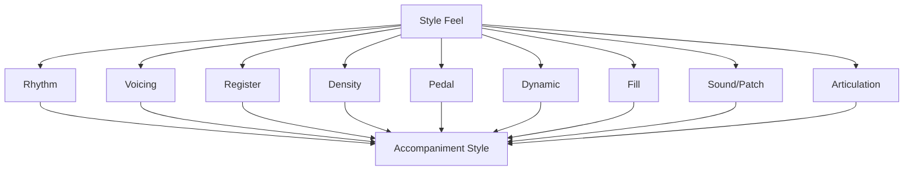
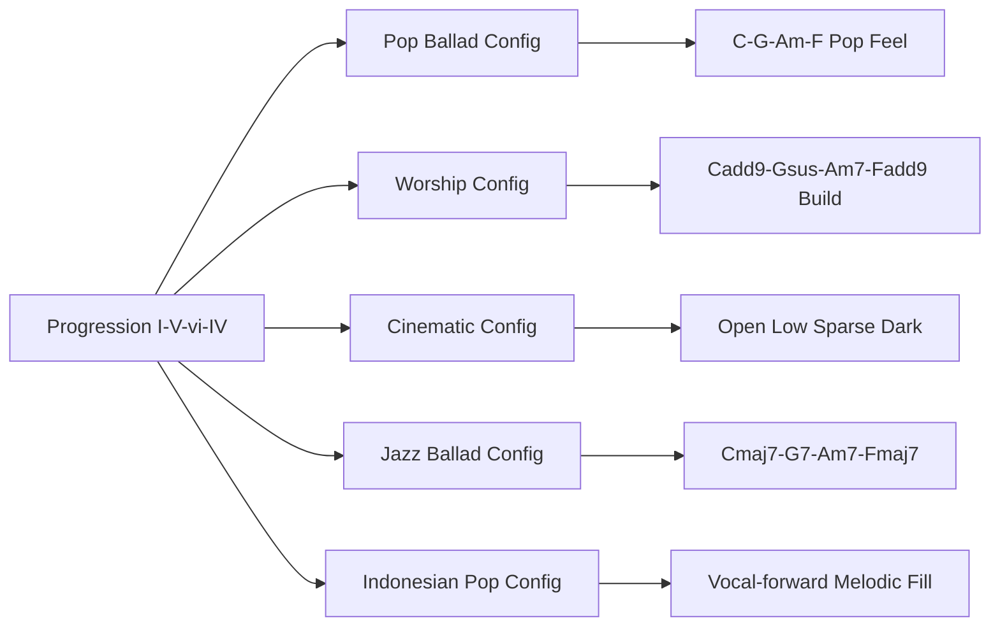
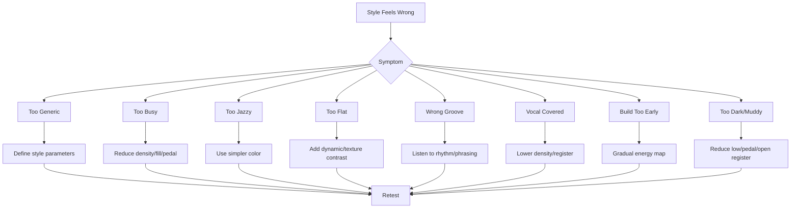
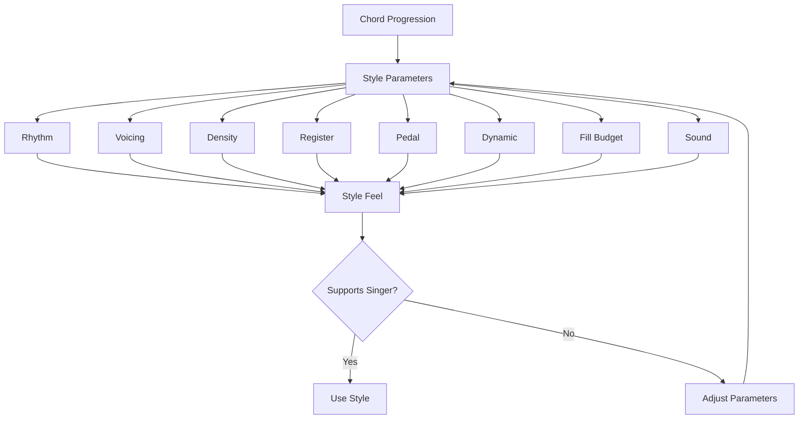

# learn-piano-accompaniment-part-030.md

# Part 030 — Stylistic Expansion: Pop, Worship, Jazz Ballad, Cinematic, dan Indonesian Feel

> Seri: **Learn Piano Accompaniment for Singer Performance**  
> Fokus: **belajar piano untuk mengiringi penyanyi**  
> Framework utama: **The First 20 Hours — Josh Kaufman**  
> Tahap: **Phase N — Style Vocabulary dan Adaptasi Rasa**

---

## Status Seri

| Item | Status |
|---|---|
| Part | 030 |
| Nama file | `learn-piano-accompaniment-part-030.md` |
| Fokus | Memperluas vocabulary style accompaniment: pop ballad, worship, jazz ballad basic, cinematic, Indonesian pop, Melayu/dangdut-adjacent feel, dan acoustic folk |
| Prasyarat | Part 000–029 |
| Output praktis | Bisa mengubah satu chord progression menjadi beberapa rasa/style yang berbeda tanpa kehilangan fungsi pengiring |
| Status seri | Belum selesai |

---

## Daftar Isi

- [1. Tujuan Part Ini](#1-tujuan-part-ini)
- [2. Posisi Part Ini dalam Framework Kaufman](#2-posisi-part-ini-dalam-framework-kaufman)
- [3. Masalah Utama: Chord Sama, Rasa Tidak Cocok](#3-masalah-utama-chord-sama-rasa-tidak-cocok)
- [4. Mental Model: Style sebagai Configuration Layer](#4-mental-model-style-sebagai-configuration-layer)
- [5. Apa Itu Style dalam Piano Accompaniment?](#5-apa-itu-style-dalam-piano-accompaniment)
- [6. Style Bukan Genre Label Saja](#6-style-bukan-genre-label-saja)
- [7. Parameter Style](#7-parameter-style)
- [8. Base Progression untuk Eksperimen Style](#8-base-progression-untuk-eksperimen-style)
- [9. Style 1 — Pop Ballad](#9-style-1--pop-ballad)
- [10. Pattern Pop Ballad](#10-pattern-pop-ballad)
- [11. Voicing Pop Ballad](#11-voicing-pop-ballad)
- [12. Dynamic dan Fill Pop Ballad](#12-dynamic-dan-fill-pop-ballad)
- [13. Style 2 — Worship / Gospel-Lite](#13-style-2--worship--gospel-lite)
- [14. Pattern Worship](#14-pattern-worship)
- [15. Voicing Worship](#15-voicing-worship)
- [16. Build, Pad Feel, dan Sus Resolution dalam Worship](#16-build-pad-feel-dan-sus-resolution-dalam-worship)
- [17. Style 3 — Jazz Ballad Basic](#17-style-3--jazz-ballad-basic)
- [18. Chord Color Jazz Ballad Basic](#18-chord-color-jazz-ballad-basic)
- [19. Rhythm dan Voicing Jazz Ballad Basic](#19-rhythm-dan-voicing-jazz-ballad-basic)
- [20. Kapan Jazz Color Tidak Cocok](#20-kapan-jazz-color-tidak-cocok)
- [21. Style 4 — Cinematic / Dark Ballad](#21-style-4--cinematic--dark-ballad)
- [22. Pattern Cinematic](#22-pattern-cinematic)
- [23. Voicing Cinematic](#23-voicing-cinematic)
- [24. Silence, Low Register, dan Pedal Cinematic](#24-silence-low-register-dan-pedal-cinematic)
- [25. Style 5 — Indonesian Pop Feel](#25-style-5--indonesian-pop-feel)
- [26. Pattern Indonesian Pop](#26-pattern-indonesian-pop)
- [27. Voicing dan Fill Indonesian Pop](#27-voicing-dan-fill-indonesian-pop)
- [28. Style 6 — Melayu / Dangdut-Adjacent Awareness](#28-style-6--melayu--dangdut-adjacent-awareness)
- [29. Rhythm Awareness untuk Melayu/Dangdut-Adjacent Feel](#29-rhythm-awareness-untuk-melayudangdut-adjacent-feel)
- [30. Piano Strategy untuk Lagu Beraroma Melayu/Dangdut](#30-piano-strategy-untuk-lagu-beraroma-melayudangdut)
- [31. Style 7 — Acoustic Folk / Singer-Songwriter](#31-style-7--acoustic-folk--singer-songwriter)
- [32. Pattern Acoustic Folk](#32-pattern-acoustic-folk)
- [33. Style Map: Memilih Style Berdasarkan Lagu dan Penyanyi](#33-style-map-memilih-style-berdasarkan-lagu-dan-penyanyi)
- [34. Mengubah Satu Progression ke Banyak Style](#34-mengubah-satu-progression-ke-banyak-style)
- [35. Style Contrast antar Section](#35-style-contrast-antar-section)
- [36. Style dan Range Penyanyi](#36-style-dan-range-penyanyi)
- [37. Style dan Tempo](#37-style-dan-tempo)
- [38. Style dan Pedal](#38-style-dan-pedal)
- [39. Style dan Fill Budget](#39-style-dan-fill-budget)
- [40. Style dan Sound/Gear](#40-style-dan-soundgear)
- [41. Mini Case Study 1: `C-G-Am-F` dalam 5 Style](#41-mini-case-study-1-c-g-am-f-dalam-5-style)
- [42. Mini Case Study 2: Lagu Pop Dibuat Cinematic](#42-mini-case-study-2-lagu-pop-dibuat-cinematic)
- [43. Mini Case Study 3: Lagu Worship Dibuat Lebih Intimate](#43-mini-case-study-3-lagu-worship-dibuat-lebih-intimate)
- [44. Mini Case Study 4: Lagu Indonesian Pop yang Terlalu Barat](#44-mini-case-study-4-lagu-indonesian-pop-yang-terlalu-barat)
- [45. Mini Case Study 5: Jazz Color yang Membuat Penyanyi Bingung](#45-mini-case-study-5-jazz-color-yang-membuat-penyanyi-bingung)
- [46. Latihan 1: Satu Progression, Tiga Style](#46-latihan-1-satu-progression-tiga-style)
- [47. Latihan 2: Style A/B Recording](#47-latihan-2-style-ab-recording)
- [48. Latihan 3: Pop Ballad ke Cinematic](#48-latihan-3-pop-ballad-ke-cinematic)
- [49. Latihan 4: Worship Build](#49-latihan-4-worship-build)
- [50. Latihan 5: Jazz Color Minimal](#50-latihan-5-jazz-color-minimal)
- [51. Latihan 6: Indonesian Pop Fill Budget](#51-latihan-6-indonesian-pop-fill-budget)
- [52. Debugging Style](#52-debugging-style)
- [53. Failure Mode Pemula](#53-failure-mode-pemula)
- [54. Practice Protocol 7 Hari](#54-practice-protocol-7-hari)
- [55. Practice Protocol 45 Menit](#55-practice-protocol-45-menit)
- [56. Checklist Kelulusan Part 030](#56-checklist-kelulusan-part-030)
- [57. Ringkasan Mental Model](#57-ringkasan-mental-model)
- [58. Persiapan ke Part 031](#58-persiapan-ke-part-031)

---

# 1. Tujuan Part Ini

Sampai Part 029, kita sudah membangun fondasi piano accompaniment yang sangat luas:

- chord;
- progression;
- rhythm;
- voicing;
- inversion;
- chord color;
- structure;
- intro;
- ending;
- transition;
- transposition;
- repertoire;
- practice system;
- performance readiness;
- gear/sound setup;
- ear training;
- fill;
- arranging;
- rehearsal dan komunikasi dengan penyanyi.

Sekarang kita masuk ke pertanyaan baru:

```text
Bagaimana membuat iringan terasa sesuai style lagu?
```

Chord yang sama bisa terdengar sangat berbeda.

Progression:

```text
C - G - Am - F
```

bisa terdengar:

- pop ballad;
- worship;
- cinematic dark ballad;
- jazz ballad;
- Indonesian pop;
- acoustic folk;
- Melayu/dangdut-adjacent;
- atau terlalu generik.

Target part ini:

> Anda mampu mengubah satu progression atau chord chart menjadi beberapa style dasar dengan mengatur rhythm, voicing, register, density, pedal, dynamic, fill, dan sound.

Part ini bukan untuk membuat Anda langsung ahli semua genre.

Tujuan realistis sesuai framework *The First 20 Hours* adalah:

```text
mengenali parameter style
mampu membuat versi sederhana yang cukup cocok
tidak memakai style yang salah
bisa berdiskusi dengan penyanyi tentang rasa yang diinginkan
```

---

# 2. Posisi Part Ini dalam Framework Kaufman

Josh Kaufman menekankan deconstruction.

Style bukan satu hal besar yang misterius.

Style bisa dipecah menjadi parameter kecil.

Diagram:



Daripada berpikir:

```text
Saya harus belajar genre X secara total.
```

Kita mulai dari:

```text
Apa parameter yang membuat iringan ini terasa seperti X?
```

Ini cocok dengan mindset engineering.

---

# 3. Masalah Utama: Chord Sama, Rasa Tidak Cocok

Pemula sering memainkan chord yang benar tetapi rasa lagu salah.

Contoh:

- lagu intimate tetapi piano terlalu besar;
- lagu worship tetapi tidak ada build;
- lagu cinematic tetapi fill terlalu pop;
- lagu Indonesian pop tetapi comping terlalu Barat/generic;
- lagu jazz ballad tetapi chord terlalu polos;
- lagu sederhana tetapi voicing terlalu jazzy sehingga penyanyi bingung;
- lagu 6/8 tetapi dimainkan seperti 4/4 lambat;
- lagu dengan groove Melayu/dangdut tetapi piano terlalu lurus.

## 3.1 Gejala Style Mismatch

- penyanyi berkata “rasanya kurang dapet”;
- chord benar tetapi mood tidak keluar;
- chorus tidak terasa sesuai genre;
- fill terasa asing;
- voicing terasa terlalu modern/terlalu polos;
- rhythm tidak cocok dengan lyric phrasing;
- aransemen terdengar seperti template, bukan lagu.

## 3.2 Root Cause

Karena pianist hanya memikirkan chord name.

Padahal style dibentuk oleh banyak layer.

## 3.3 Prinsip

```text
Chord adalah harmony.
Style adalah cara harmony berjalan dalam waktu, ruang, dan emosi.
```

---

# 4. Mental Model: Style sebagai Configuration Layer

Anggap chord progression sebagai business logic.

Style adalah configuration layer.

Progression:

```text
I - V - vi - IV
```

Config pop ballad:

```text
4/4, steady comping, add9, medium density, soft fills
```

Config cinematic:

```text
slow, low register, open fifth, sparse, heavy silence, dark pedal
```

Config worship:

```text
build arc, sus resolution, pad-like sustain, gradual density
```

Config jazz ballad:

```text
seventh, shell voicing, ii-V-I, softer swing/laid-back feel
```

Diagram:



## 4.1 Style Bisa Diganti tanpa Mengganti Chord

Anda bisa memakai chord sama tetapi mengubah:

- rhythm;
- voicing;
- dynamic;
- register;
- fill.

## 4.2 Style Bisa Salah Walau Chord Benar

Ini seperti configuration benar secara syntax tetapi salah environment.

## 4.3 Prinsip

```text
Style adalah configuration yang membuat chord cocok dengan konteks emosional.
```

---

# 5. Apa Itu Style dalam Piano Accompaniment?

Style adalah kombinasi kebiasaan musikal yang membuat iringan terasa seperti dunia tertentu.

Dalam piano accompaniment, style muncul dari:

- pola rhythm;
- density;
- pilihan chord color;
- cara pedal;
- register;
- articulation;
- dynamic arc;
- fill vocabulary;
- groove;
- treatment intro/ending;
- sound patch;
- hubungan dengan vokal.

## 5.1 Style Bukan Kostum

Jangan hanya menambahkan satu elemen lalu menganggap style selesai.

Misalnya:

```text
pakai maj7 = jazz
pakai pad = worship
pakai minor = cinematic
```

Tidak cukup.

Style adalah sistem kecil.

## 5.2 Style Harus Melayani Lagu

Jangan memaksakan style yang membuat lyric/vokal tidak cocok.

## 5.3 Style Bisa Hybrid

Banyak performance piano-vocal adalah hybrid:

- pop ballad + worship build;
- Indonesian pop + cinematic intro;
- folk + pop chorus;
- jazz color minimal + pop structure.

## 5.4 Prinsip

```text
Style terbaik adalah style yang membuat lagu dan penyanyi terasa natural.
```

---

# 6. Style Bukan Genre Label Saja

Genre label sering terlalu besar.

“Pop” bisa banyak bentuk.

“Worship” bisa intimate atau stadium.

“Jazz ballad” bisa sangat simple atau sangat complex.

“Indonesian pop” bisa sangat luas.

Karena itu, lebih baik bertanya parameter.

## 6.1 Pertanyaan Style

```text
Feel-nya straight atau swing?
Padat atau sparse?
Bright atau dark?
Groove atau rubato?
Chord polos atau color?
Vokal bebas atau tight?
Ending soft atau big?
Piano foreground atau background?
```

## 6.2 Dengan Penyanyi

Daripada bertanya:

```text
mau genre apa?
```

lebih useful:

```text
Mau lebih intimate atau lebih besar?
Mau lebih lurus atau lebih mengalun?
Mau lebih cinematic atau pop?
Mau chorus build gradual atau langsung masuk?
```

## 6.3 Prinsip

```text
Genre adalah label.
Style parameter adalah kontrol nyata.
```

---

# 7. Parameter Style

Gunakan tabel ini.

| Parameter | Pilihan Umum | Dampak |
|---|---|---|
| Meter | 4/4, 3/4, 6/8 | feel dasar |
| Rhythm | straight, syncopated, rolling, sparse | groove |
| Density | rendah–tinggi | ruang vokal |
| Register | low, mid, high, wide | warna dan ruang |
| Voicing | triad, add9, sus, seventh, open | modern/classic/jazz |
| Pedal | dry, light, lush | clarity vs atmosphere |
| Dynamic | flat, gradual build, dramatic contrast | emotional arc |
| Fill | none, sparse, melodic, rhythmic | respons piano |
| Articulation | smooth, percussive, legato, detached | character |
| Sound | warm piano, bright piano, pad layer | production feel |

## 7.1 Cara Pakai

Saat ingin style tertentu, jangan langsung mencari “pattern ajaib”.

Atur parameter.

## 7.2 Example

Cinematic dark ballad:

```text
Meter: 6/8 or slow 4/4
Rhythm: sparse/rolling
Density: low to medium
Register: low-mid, open
Voicing: open fifth, add9, minor7
Pedal: atmospheric but controlled
Dynamic: slow build
Fill: very sparse
Sound: warm/dark piano
```

## 7.3 Prinsip

```text
Style adalah hasil gabungan parameter kecil.
```

---

# 8. Base Progression untuk Eksperimen Style

Gunakan progression yang sama agar perbedaan style terasa.

## 8.1 Progression A

```text
C - G - Am - F
```

Function:

```text
I - V - vi - IV
```

## 8.2 Progression B

```text
Am - F - C - G
```

Function:

```text
vi - IV - I - V
```

## 8.3 Progression C

```text
C - Am - F - G
```

Function:

```text
I - vi - IV - V
```

## 8.4 Cadence

```text
F - G - C
Gsus4 - G - C
Dm7 - G7 - C
```

## 8.5 Tujuan

Anda akan mendengar:

```text
chord sama, rasa berbeda
```

karena style parameter berubah.

---

# 9. Style 1 — Pop Ballad

Pop ballad adalah style paling aman untuk banyak lagu piano-vocal.

## 9.1 Karakter

- vokal foreground;
- chord jelas;
- pulse stabil;
- verse sparse;
- chorus fuller;
- dynamic build natural;
- fill pendek;
- add9/sus sering cocok;
- pedal sedang;
- emotional tetapi tidak terlalu rumit.

## 9.2 Cocok Untuk

- lagu pop Indonesia;
- acoustic cover;
- lagu cinta;
- worship sederhana;
- ballad modern;
- lagu rehearsal awal.

## 9.3 Harmonic Vocabulary

Umum:

```text
C, G, Am, F
Cadd9, Gsus4, Am7, Fadd9
Dm7, G7, C
```

## 9.4 Risiko

- terdengar generic jika semua lagu diperlakukan sama;
- chorus bisa terlalu datar jika dynamic tidak naik;
- fill bisa overuse;
- pedal bisa muddy.

## 9.5 Rule

```text
Pop ballad adalah default safe style, tetapi tetap perlu emotional arc.
```

---

# 10. Pattern Pop Ballad

## 10.1 Pattern Verse Sparse

4/4:

```text
Beat: 1   2   3   4
LH:   R       R
RH:       chord    chord light
```

Atau lebih simple:

```text
LH root beat 1
RH partial beat 1/3
```

## 10.2 Pattern Chorus

```text
1     2     3     4
LH R       R
RH chord   chord chord
```

Atau:

```text
X - x - X - x -
```

## 10.3 Broken Ballad

```text
LH root
RH 1-5-3-5
```

## 10.4 Transition

Gunakan:

```text
Gsus4 - G - C
```

## 10.5 Rule

```text
Pop ballad pattern harus stabil dan tidak mengganggu lyric rhythm.
```

---

# 11. Voicing Pop Ballad

## 11.1 Basic Modern Voicing

Cadd9:

```text
LH C
RH E-G-D
```

G:

```text
LH G
RH B-D
```

Am7:

```text
LH A
RH C-E-G
```

Fadd9:

```text
LH F
RH A-C-G
```

## 11.2 Partial Voicing

Saat vokal aktif:

```text
C: E-G
G: B-D
Am: C-E
F: A-C
```

## 11.3 Chorus Voicing

Boleh lebih penuh tetapi tetap vocal-safe.

## 11.4 Avoid

- terlalu banyak notes di low-mid;
- fill tinggi saat vocal hook;
- add9 terlalu keras jika menabrak melody.

## 11.5 Rule

```text
Pop ballad voicing harus terdengar modern tetapi tetap clear.
```

---

# 12. Dynamic dan Fill Pop Ballad

## 12.1 Dynamic Arc

```text
Intro E1
Verse E2
Chorus E3
Bridge E1.5/E2
Final Chorus E4
Ending E1 atau E3
```

## 12.2 Fill

Fill pendek di akhir phrase.

Contoh:

```text
E-G
A-B-C
G-E-C
```

## 12.3 Jangan Fill di Hook

Hook vokal harus jelas.

## 12.4 Ending

Aman:

```text
Fadd9 - Gsus4 G - Cadd9
```

## 12.5 Rule

```text
Pop ballad fill harus terasa seperti respons, bukan komentar berlebihan.
```

---

# 13. Style 2 — Worship / Gospel-Lite

Catatan: “worship” di sini berarti approach accompaniment yang sering dipakai dalam lagu ibadah modern/praise-worship piano-vocal, bukan pembahasan teologis.

## 13.1 Karakter

- gradual build;
- banyak sus/add2/add9;
- pad-like sustain;
- repeated progression;
- dynamic rise;
- chorus/tag bisa diulang;
- piano sering menjadi atmosphere + harmonic anchor;
- vocal/leader cue sangat penting.

## 13.2 Cocok Untuk

- lagu ibadah modern;
- lagu komunitas;
- ballad spiritual;
- chorus yang ingin build;
- lagu dengan tag/repeat.

## 13.3 Harmonic Vocabulary

```text
Cadd9
Gsus4
Am7
Fadd9
Dm7
Gsus4-G
```

## 13.4 Risiko

- terlalu banyak pedal/pad;
- chord change blur;
- tag tanpa cue;
- build terlalu cepat;
- piano menutup leader/vocal.

## 13.5 Rule

```text
Worship-style accompaniment sering tentang build dan ruang, bukan chord rumit.
```

---

# 14. Pattern Worship

## 14.1 Sparse Intro

```text
LH root
RH pad-like chord
long sustain
```

## 14.2 Verse

```text
root + partial
light broken chord
```

## 14.3 Chorus Build

```text
repeated chord pulse
gradual density
```

## 14.4 Tag

Loop progression:

```text
F - G - C
```

atau:

```text
C - G - Am - F
```

dengan dynamic sesuai vocal.

## 14.5 Bridge Build

Mulai rendah, tambah:

- octave LH;
- RH pulse;
- sus resolution;
- dynamic.

## 14.6 Rule

```text
Build worship harus bertahap. Jangan peak terlalu awal.
```

---

# 15. Voicing Worship

## 15.1 Add2/Add9 Feel

Cadd9:

```text
C E G D
```

Fadd9:

```text
F A C G
```

## 15.2 Sus Feel

Gsus4:

```text
G C D
```

resolve to:

```text
G B D
```

## 15.3 Open Voicing

Gunakan interval luas:

```text
LH root
RH 5th + 9th / 3rd
```

## 15.4 Avoid Third Sometimes

Chord tanpa third bisa terasa lebih open.

Contoh:

```text
C-G-D
```

Namun jangan terlalu ambiguous jika penyanyi butuh pitch.

## 15.5 Rule

```text
Worship voicing sering open dan sustained, tetapi clarity tetap penting.
```

---

# 16. Build, Pad Feel, dan Sus Resolution dalam Worship

## 16.1 Build

Build bisa dilakukan dengan:

- density naik;
- dynamic naik;
- register melebar;
- LH octave;
- RH repeated chord;
- sus tension;
- pedal sedikit lebih lush.

## 16.2 Pad Feel

Jika tidak memakai pad layer, piano bisa membuat pad feel dengan:

```text
long chord
soft pedal
slow broken chord
wide voicing
```

## 16.3 Sus Resolution

```text
Gsus4 - G - C
```

sangat berguna untuk cue.

## 16.4 Tag Control

Jika tag diulang, jangan selalu makin keras.

Kadang tag terakhir harus turun.

## 16.5 Rule

```text
Build yang baik punya arah. Build yang buruk hanya makin ramai.
```

---

# 17. Style 3 — Jazz Ballad Basic

Jazz ballad basic di sini sangat sederhana.

Bukan jazz advanced.

Fokus kita:

- seventh chord;
- shell voicing;
- ii-V-I;
- voice leading lembut;
- swing/laid-back awareness;
- restraint.

## 17.1 Karakter

- chord color lebih kaya;
- tempo lambat;
- voicing lembut;
- banyak seventh;
- cadence ii-V-I;
- fill minimal dan tasteful;
- rubato/laid-back bisa muncul.

## 17.2 Cocok Untuk

- ballad romantic;
- standard-like songs;
- lagu pop yang ingin lebih sophisticated;
- lounge/cafe feel;
- intimate performance.

## 17.3 Risiko

- terlalu banyak color membuat penyanyi bingung;
- chord terlalu “jazzy” untuk lagu sederhana;
- rhythm jadi berat;
- pianist overthink.

## 17.4 Rule

```text
Jazz color harus memperkaya lagu, bukan mengganti identitas lagu.
```

---

# 18. Chord Color Jazz Ballad Basic

## 18.1 Basic Substitution Ringan

C:

```text
Cmaj7
```

Am:

```text
Am7
```

F:

```text
Fmaj7
```

G:

```text
G7
```

Dm:

```text
Dm7
```

## 18.2 ii-V-I

Dalam C:

```text
Dm7 - G7 - Cmaj7
```

## 18.3 Progression

Original:

```text
C - G - Am - F
```

Jazz color:

```text
Cmaj7 - G7 - Am7 - Fmaj7
```

Namun tidak selalu cocok.

## 18.4 Shell Voicing

Cmaj7 shell:

```text
LH C
RH E-B
```

G7 shell:

```text
LH G
RH B-F
```

Am7 shell:

```text
LH A
RH C-G
```

Fmaj7 shell:

```text
LH F
RH A-E
```

## 18.5 Rule

```text
Untuk jazz ballad basic, lebih baik sedikit color yang jelas daripada banyak extension yang kabur.
```

---

# 19. Rhythm dan Voicing Jazz Ballad Basic

## 19.1 Rhythm

Jazz ballad bisa:

- rubato intro;
- laid-back;
- sparse chord;
- gentle comping;
- occasional swing feel.

Untuk pemula, jangan memaksakan swing kompleks.

## 19.2 Voicing

Gunakan:

- shell voicing;
- seventh;
- smooth voice leading;
- low density.

## 19.3 Pedal

Lebih bersih daripada cinematic.

Chord color harus terdengar.

## 19.4 Fill

Minimal, dari chord tones/scale.

## 19.5 Ending

```text
Dm7 - G7 - Cmaj7
```

atau:

```text
Gsus4 - G7 - Cmaj7
```

## 19.6 Rule

```text
Jazz ballad basic adalah tentang taste dan spacing, bukan banyak chord.
```

---

# 20. Kapan Jazz Color Tidak Cocok

Jazz color tidak selalu cocok.

## 20.1 Tidak Cocok Jika

- lagu sangat simple/anthemic;
- penyanyi butuh pitch sangat jelas;
- melody bertabrakan dengan maj7/9;
- mood harus polos;
- style original tidak mendukung;
- Anda belum bisa memainkan color stabil.

## 20.2 Gejala

- penyanyi masuk ragu;
- chord terasa terlalu “asing”;
- lagu kehilangan innocence;
- lirik terasa terlalu sophisticated;
- audience merasa versi aneh.

## 20.3 Solusi

Kembali ke triad/add9/sus yang lebih pop.

## 20.4 Rule

```text
Jangan menjadikan semua lagu jazz hanya karena Anda baru belajar maj7.
```

---

# 21. Style 4 — Cinematic / Dark Ballad

Cinematic/dark ballad cocok untuk lagu yang ingin terasa dramatis, intimate, tragis, atau teaterikal.

## 21.1 Karakter

- tempo lambat;
- minor color;
- low register hati-hati;
- open voicing;
- silence penting;
- pedal atmospheric;
- dynamic contrast;
- fill sangat sparse;
- rhythm tidak terlalu sibuk;
- often 6/8 or slow 4/4.

## 21.2 Harmonic Vocabulary

```text
Am
Fmaj7/Fadd9
Cadd9
Gsus4/G
Dm7
Em
```

## 21.3 Progression Umum

```text
Am - F - C - G
```

atau:

```text
vi - IV - I - V
```

## 21.4 Risiko

- terlalu gelap/muddy;
- pedal terlalu banyak;
- tempo terlalu lambat sampai kehilangan pulse;
- vocal pitch ambiguous;
- drama berlebihan.

## 21.5 Rule

```text
Cinematic style membutuhkan ruang dan restraint.
Bukan hanya main minor chord dengan pedal panjang.
```

---

# 22. Pattern Cinematic

## 22.1 Slow Pulse

4/4:

```text
LH root on beat 1
RH chord hold
space
```

## 22.2 Broken Dark

```text
LH root/octave
RH 1-5-9 or 1-5-3
slow broken
```

## 22.3 6/8 Cinematic

```text
ONE two three FOUR five six
LH root on ONE
RH broken on two/three/four/six
```

## 22.4 Stop and Silence

Silence adalah bagian dari style.

## 22.5 Rule

```text
Cinematic pattern harus memberi rasa ruang, bukan mengisi semua beat.
```

---

# 23. Voicing Cinematic

## 23.1 Open Fifth

Am:

```text
A - E
```

C:

```text
C - G
```

F:

```text
F - C
```

## 23.2 Add9

Cadd9:

```text
C-G-D-E
```

Fadd9:

```text
F-C-G-A
```

## 23.3 Minor7

Am7:

```text
A-G-C/E
```

## 23.4 Low Register

Gunakan low root, tetapi jangan block chord rendah penuh.

## 23.5 Rule

```text
Cinematic voicing sering terbuka, rendah, dan bernafas.
```

---

# 24. Silence, Low Register, dan Pedal Cinematic

## 24.1 Silence

Gunakan silence untuk tension.

Jangan takut kosong.

## 24.2 Low Register

Low root bisa dramatis.

Namun low chord penuh bisa muddy.

## 24.3 Pedal

Pedal memberi atmosphere.

Tetapi chord change harus tetap jelas.

## 24.4 Dynamic

Cinematic sering memakai:

- very soft;
- sudden emphasis;
- slow crescendo;
- final decay.

## 24.5 Rule

```text
Cinematic accompaniment sering lebih banyak tentang apa yang tidak dimainkan.
```

---

# 25. Style 5 — Indonesian Pop Feel

Indonesian pop sangat luas, tetapi ada beberapa kecenderungan yang sering berguna dalam piano-vocal.

## 25.1 Karakter Umum

- vokal sangat foreground;
- lyric phrasing penting;
- melody sering emosional dan jelas;
- chord bisa pop sederhana;
- fill melodic pendek sering cocok;
- verse harus memberi ruang lirik;
- chorus butuh lift yang natural;
- ending sering memakai tag/ritardando.

## 25.2 Cocok Untuk

- lagu pop Indonesia;
- ballad Indonesia;
- acoustic cover;
- lagu cinta;
- lagu melankolis.

## 25.3 Harmonic Vocabulary

Sering cukup:

```text
I, V, vi, IV, ii, iii
```

Dengan color ringan:

```text
add9, sus4, m7
```

## 25.4 Risiko

- comping terlalu Barat/generic sehingga lyric feel kurang natural;
- fill terlalu banyak;
- jazz color berlebihan;
- rhythm terlalu kaku;
- ending tidak cukup emosional.

## 25.5 Rule

```text
Untuk Indonesian pop, jangan mengalahkan lirik. Vokal dan kata harus menjadi pusat.
```

---

# 26. Pattern Indonesian Pop

## 26.1 Verse

Sparse dan mengikuti phrase.

```text
LH root
RH partial
fill minimal
```

## 26.2 Chorus

Pop ballad comping bisa cocok, tetapi jangan terlalu padat.

## 26.3 Rhythm

Perhatikan lyric rhythm.

Bahasa Indonesia punya flow suku kata yang berbeda dari English pop.

Jangan pattern terlalu memaksa jika lirik butuh ruang.

## 26.4 Ending

Sering cocok:

```text
ritardando ringan
tag last line
F - G - C
Gsus4 - G - C
```

## 26.5 Rule

```text
Pattern harus mengikuti natural phrasing bahasa, bukan hanya grid.
```

---

# 27. Voicing dan Fill Indonesian Pop

## 27.1 Voicing

Gunakan modern pop:

```text
Cadd9
Am7
Fadd9
Gsus4
Dm7
```

Tetapi jika penyanyi ragu, kembali ke triad jelas.

## 27.2 Fill

Fill melodic 2–3 nada di akhir frase.

Contoh:

```text
E-G
A-B-C
G-E-C
```

## 27.3 Jangan Terlalu Jazzy

Jika lagu sederhana dan lirik polos, maj7/altered chord bisa terasa asing.

## 27.4 Vocal Space

Lirik adalah pusat.

## 27.5 Rule

```text
Fill Indonesian pop harus terasa seperti menanggapi kalimat, bukan menyisipkan lick.
```

---

# 28. Style 6 — Melayu / Dangdut-Adjacent Awareness

Catatan penting: ini bukan materi mendalam dangdut atau Melayu. Fokus kita hanya awareness agar pianis pengiring tidak memaksakan pattern pop Barat pada lagu yang punya rasa Melayu/dangdut-adjacent.

## 28.1 Karakter Umum yang Perlu Didengar

- groove lebih bergoyang;
- rhythmic accent berbeda dari pop ballad lurus;
- ornament vocal bisa lebih banyak;
- phrase bisa melengkung/melismatic;
- percussion feel kuat;
- bass/rhythm pattern penting;
- chord kadang sederhana tetapi feel kuat.

## 28.2 Risiko Pianis Pop Ballad

Jika dimainkan terlalu straight:

```text
rasa goyang hilang
```

Jika dimainkan terlalu banyak chord:

```text
vokal ornament terganggu
```

## 28.3 Prinsip

```text
Untuk style ber-groove, piano harus menghormati rhythm dan ruang ornament vokal.
```

---

# 29. Rhythm Awareness untuk Melayu/Dangdut-Adjacent Feel

## 29.1 Jangan Mengubah Jadi Ballad Barat Otomatis

Jika lagu punya groove, jangan selalu jadikan slow pop ballad kecuali memang aransemen baru disepakati.

## 29.2 Accent

Dengarkan aksen percussion/bass.

Piano bisa memberi chord ringan di tempat yang mendukung groove.

## 29.3 Left Hand

LH jangan terlalu berat jika groove perlu lincah.

## 29.4 Right Hand

RH bisa memakai rhythmic chord pendek, bukan sustained chord besar terus.

## 29.5 Ornament Vokal

Saat penyanyi melakukan ornament, piano harus memberi ruang.

## 29.6 Rule

```text
Di style berornamen, piano harus lebih banyak mendengar frase vokal.
```

---

# 30. Piano Strategy untuk Lagu Beraroma Melayu/Dangdut

## 30.1 Simplify Harmony

Chord sering tidak perlu terlalu jazzy.

## 30.2 Support Groove

Gunakan rhythm chord yang ringan.

## 30.3 Avoid Over-Pedal

Pedal terlalu banyak bisa membunuh groove.

## 30.4 Give Vocal Ornament Space

Jangan fill di atas cengkok/ornament.

## 30.5 Ending

Ikuti vocal cue; ending bisa punya ritardando/cadence lebih ekspresif.

## 30.6 Rule

```text
Jika tidak menguasai style, mainkan lebih sedikit dan dengarkan groove.
```

---

# 31. Style 7 — Acoustic Folk / Singer-Songwriter

Acoustic folk/singer-songwriter feel cocok untuk lagu yang ingin sederhana, jujur, dan lyric-forward.

## 31.1 Karakter

- sederhana;
- warm;
- steady;
- tidak terlalu banyak color;
- pattern seperti gitar strum/picking;
- vocal sangat foreground;
- fill minimal;
- natural tempo.

## 31.2 Cocok Untuk

- lagu cerita;
- acoustic set;
- folk/pop;
- cover sederhana;
- intimate performance.

## 31.3 Harmonic Vocabulary

Triad dan add9 ringan.

```text
C
G
Am
F
Cadd9
Gsus4
```

## 31.4 Risiko

- terlalu polos jika tidak ada dynamic;
- terlalu kaku jika pattern mechanical;
- terlalu ramai jika mencoba mengisi semua seperti gitar.

## 31.5 Rule

```text
Singer-songwriter style harus terasa jujur, bukan dihias berlebihan.
```

---

# 32. Pattern Acoustic Folk

## 32.1 Root + Chord Pulse

```text
LH root beat 1
RH chord beat 2/4
```

## 32.2 Broken Picking Simulation

```text
LH root
RH 1-5-3-5
```

atau:

```text
1-3-5-3
```

## 32.3 Light Strum Simulation

Chord re-strike ringan.

## 32.4 Fill

Sedikit.

Lebih sering chord movement daripada melodic fill.

## 32.5 Rule

```text
Acoustic folk piano sering meniru fungsi gitar, bukan meniru semua detail gitar.
```

---

# 33. Style Map: Memilih Style Berdasarkan Lagu dan Penyanyi

Gunakan decision table.

| Jika lagu/penyanyi ingin... | Coba style |
|---|---|
| simple, emotional, modern | pop ballad |
| build spiritual/anthemic | worship/gospel-lite |
| intimate sophisticated | jazz ballad basic |
| dark, dramatic, theatrical | cinematic/dark ballad |
| lyric-forward Indonesian ballad | Indonesian pop feel |
| groove Melayu/dangdut | Melayu/dangdut-aware |
| honest acoustic | acoustic folk |

## 33.1 Tanya Penyanyi

```text
Mau lebih pop, lebih cinematic, lebih intimate, atau lebih worship build?
```

## 33.2 Jangan Memutuskan Sendiri Selalu

Style harus cocok dengan penyanyi.

## 33.3 Rule

```text
Style adalah agreement, bukan hanya preferensi pianis.
```

---

# 34. Mengubah Satu Progression ke Banyak Style

Progression:

```text
C - G - Am - F
```

## 34.1 Pop Ballad

```text
Cadd9 - G - Am7 - Fadd9
steady 4/4
verse sparse, chorus fuller
```

## 34.2 Worship

```text
Cadd9 - Gsus4/G - Am7 - Fadd9
slow build
pad-like sustain
```

## 34.3 Jazz Ballad Basic

```text
Cmaj7 - G7 - Am7 - Fmaj7
shell voicing
laid-back
```

## 34.4 Cinematic

```text
C5/add9 - Gsus - Am7 - Fadd9
open voicing
slow, sparse, low-mid
```

## 34.5 Indonesian Pop

```text
Cadd9 - G - Am7 - Fadd9
vocal phrase-driven
melodic fill sparse
rit/tag ending
```

## 34.6 Acoustic Folk

```text
C - G - Am - F
root + picking pattern
dry/warm
```

## 34.7 Prinsip

```text
Nama chord bisa berubah sedikit, tetapi style terutama berubah lewat cara memainkan.
```

---

# 35. Style Contrast antar Section

Satu lagu bisa memakai style contrast ringan.

## 35.1 Contoh

Verse:

```text
acoustic folk sparse
```

Chorus:

```text
pop ballad fuller
```

Bridge:

```text
cinematic breakdown
```

Final chorus:

```text
worship-like build
```

## 35.2 Hati-Hati

Jangan membuat lagu seperti ganti genre setiap section tanpa alasan.

## 35.3 Smooth Transition

Gunakan:

- shared voicing;
- gradual dynamic;
- sus cue;
- same progression;
- motif.

## 35.4 Rule

```text
Style contrast harus mendukung emotional arc, bukan membuat lagu tercerai-berai.
```

---

# 36. Style dan Range Penyanyi

Style memengaruhi range perception.

## 36.1 High Chorus

Jika chorus tinggi, style terlalu besar bisa membuat penyanyi teriak.

Solusi:

- piano support dari bawah;
- jangan high fill;
- dynamic jangan terlalu memaksa.

## 36.2 Low Verse

Jika verse rendah, piano jangan terlalu low/muddy.

Solusi:

- RH lebih clear;
- LH ringan;
- chord tidak menutup low vocal.

## 36.3 Ornament Vocal

Jika penyanyi banyak ornament, style harus memberi ruang.

## 36.4 Intimate Vocal

Jika penyanyi soft, hindari bright piano dan dense comping.

## 36.5 Rule

```text
Style harus dipilih berdasarkan tubuh penyanyi, bukan hanya genre lagu.
```

---

# 37. Style dan Tempo

Tempo mengubah style.

## 37.1 Terlalu Lambat

Risiko:

- pulse hilang;
- sustain blur;
- penyanyi kehabisan napas;
- lagu terasa berat.

## 37.2 Terlalu Cepat

Risiko:

- lyric tidak jelas;
- chord transition panik;
- emotional phrase tidak sempat.

## 37.3 Style Tempo

- pop ballad: steady medium-slow;
- cinematic: slow but pulse clear;
- worship: can build over repeated sections;
- jazz ballad: laid-back;
- folk: natural speech-like;
- dangdut/Melayu-adjacent: groove matters.

## 37.4 Rule

```text
Tempo bukan angka saja.
Tempo adalah cara lirik bernapas.
```

---

# 38. Style dan Pedal

Pedal sangat memengaruhi style.

## 38.1 Pop Ballad

Pedal sedang, chord change bersih.

## 38.2 Worship

Pedal lebih lush, tetapi jangan blur.

## 38.3 Jazz Ballad

Pedal bersih agar chord color terdengar.

## 38.4 Cinematic

Pedal atmospheric, tetapi low register hati-hati.

## 38.5 Indonesian Pop

Pedal mengikuti phrasing lyric.

## 38.6 Melayu/Dangdut-Adjacent

Pedal lebih ringan agar groove tidak mati.

## 38.7 Rule

```text
Pedal yang sama bisa benar di satu style dan salah di style lain.
```

---

# 39. Style dan Fill Budget

## 39.1 Pop Ballad

Fill pendek akhir phrase.

## 39.2 Worship

Fill minimal, lebih banyak build/cue/sus.

## 39.3 Jazz Ballad

Fill tasteful, chord-tone/seventh color, sparse.

## 39.4 Cinematic

Fill sangat sedikit. Silence penting.

## 39.5 Indonesian Pop

Melodic response kecil, lyric-driven.

## 39.6 Melayu/Dangdut-Adjacent

Jangan menabrak vocal ornament.

## 39.7 Acoustic Folk

Minimal; rhythm/chord motion lebih penting.

## 39.8 Rule

```text
Setiap style punya fill budget berbeda.
```

---

# 40. Style dan Sound/Gear

## 40.1 Pop Ballad

Warm clean piano.

## 40.2 Worship

Warm piano, optional light pad.

## 40.3 Jazz Ballad

Mellow piano, less reverb, chord clarity.

## 40.4 Cinematic

Dark/warm piano, subtle reverb, possible pad very low.

## 40.5 Indonesian Pop

Clean warm piano, vocal clarity.

## 40.6 Melayu/Dangdut-Adjacent

Clear piano, less reverb, rhythmic clarity.

## 40.7 Acoustic Folk

Dry/warm, natural.

## 40.8 Rule

```text
Sound patch harus mendukung style dan vokal, bukan sekadar terdengar indah sendiri.
```

---

# 41. Mini Case Study 1: `C-G-Am-F` dalam 5 Style

## 41.1 Pop Ballad

```text
Cadd9 - G - Am7 - Fadd9
4/4
verse sparse
chorus fuller
```

## 41.2 Worship

```text
Cadd9 - Gsus4/G - Am7 - Fadd9
slow build
repeat/tag possible
```

## 41.3 Jazz Ballad Basic

```text
Cmaj7 - G7 - Am7 - Fmaj7
shell voicing
soft laid-back
```

## 41.4 Cinematic

```text
C5/add9 - Gsus - Am7 - Fadd9
open, dark, sparse
```

## 41.5 Acoustic Folk

```text
C - G - Am - F
root + picking-like RH
little pedal
```

## 41.6 Lesson

Progression sama, rasa berubah karena parameter berubah.

---

# 42. Mini Case Study 2: Lagu Pop Dibuat Cinematic

## 42.1 Original

Pop ballad bright.

## 42.2 Goal

Cinematic dark version.

## 42.3 Changes

- tempo sedikit lebih lambat;
- start verse with Am if possible;
- open fifth voicing;
- lower density;
- more silence;
- darker sound;
- fill minimal;
- ending soft/tragic.

## 42.4 Example

Original:

```text
C - G - Am - F
```

Cinematic arrangement:

```text
Am7 - Fadd9 - Cadd9 - Gsus4
```

Verse dark, chorus resolves to C.

## 42.5 Warning

Pastikan penyanyi tetap punya pitch center.

---

# 43. Mini Case Study 3: Lagu Worship Dibuat Lebih Intimate

## 43.1 Original

Big build, repeated chorus/tag.

## 43.2 Goal

Small room, piano-vocal intimate.

## 43.3 Changes

- remove pad/layer heavy;
- lower density;
- fewer repeats;
- softer dynamic;
- keep sus resolution;
- clear vocal entry;
- tag maybe soft.

## 43.4 Rule

```text
Worship intimate bukan worship tanpa emosi.
Itu worship dengan ruang lebih besar untuk lirik dan napas.
```

---

# 44. Mini Case Study 4: Lagu Indonesian Pop yang Terlalu Barat

## 44.1 Problem

Piano memakai generic pop ballad comping sepanjang lagu.

Lirik terasa tidak natural.

## 44.2 Diagnosis

Pattern tidak mengikuti phrasing Bahasa Indonesia.

Fill terlalu banyak saat lirik aktif.

## 44.3 Fix

- verse lebih sparse;
- fill hanya setelah phrase;
- dynamic mengikuti kata;
- ending pakai rit/tag natural;
- chord color tidak berlebihan.

## 44.4 Rule

```text
Lagu Indonesia sering membutuhkan piano yang mendengar kata, bukan hanya beat.
```

---

# 45. Mini Case Study 5: Jazz Color yang Membuat Penyanyi Bingung

## 45.1 Problem

Pianis mengganti:

```text
C -> Cmaj7
G -> G13
Am -> Am9
F -> Fmaj7#11
```

Penyanyi ragu masuk.

## 45.2 Diagnosis

Color terlalu kompleks untuk context.

Starting pitch kurang jelas.

## 45.3 Fix

- kembali ke triad/add9;
- gunakan seventh hanya di ending/cadence;
- chord entry lebih jelas;
- color lembut, bukan dominan.

## 45.4 Rule

```text
Jika color membuat penyanyi kehilangan pitch, color itu tidak membantu.
```

---

# 46. Latihan 1: Satu Progression, Tiga Style

Progression:

```text
C - G - Am - F
```

Mainkan dalam:

1. pop ballad;
2. cinematic;
3. acoustic folk.

## 46.1 Catat

```text
Rhythm:
Voicing:
Pedal:
Density:
Fill:
Sound:
```

## 46.2 Goal

Merasakan style parameter.

---

# 47. Latihan 2: Style A/B Recording

Rekam dua versi:

- Version A: pop ballad;
- Version B: worship build atau cinematic.

## 47.1 Dengarkan

Tanya:

- mana lebih cocok untuk lyric?
- mana lebih mendukung vocal?
- mana terlalu ramai?
- mana lebih natural?

## 47.2 Output

```text
Chosen style:
Reason:
What to keep:
What to remove:
```

---

# 48. Latihan 3: Pop Ballad ke Cinematic

Ambil arrangement pop ballad.

Ubah:

- density turun;
- register lebih open;
- tempo sedikit lebih luas;
- fill dikurangi;
- chord color lebih dark;
- pedal atmospheric;
- ending soft.

## 48.1 Record

Bandingkan dengan versi pop.

## 48.2 Goal

Belajar mengubah mood tanpa mengganti semua chord.

---

# 49. Latihan 4: Worship Build

Progression:

```text
Cadd9 - Gsus4/G - Am7 - Fadd9
```

## 49.1 Round 1

E1/D1.

## 49.2 Round 2

E2/D2.

## 49.3 Round 3

E3/D3.

## 49.4 Round 4

E4/D4.

## 49.5 Rule

Build harus bertahap, bukan langsung ramai.

---

# 50. Latihan 5: Jazz Color Minimal

Progression:

```text
C - G - Am - F
```

Ubah minimal:

```text
Cmaj7 - G7 - Am7 - Fmaj7
```

## 50.1 Constraint

- no complex extension;
- shell voicing;
- soft dynamic;
- vocal/humming test.

## 50.2 Evaluasi

Apakah color membantu atau membuat asing?

## 50.3 Goal

Taste, bukan kompleksitas.

---

# 51. Latihan 6: Indonesian Pop Fill Budget

Pilih lagu Indonesia sederhana.

## 51.1 Tugas

Tandai phrase lyric.

Isi fill hanya setelah phrase.

## 51.2 Constraint

- maksimal 1 fill per phrase;
- fill 2–3 nada;
- tidak fill saat kata penting;
- ending tag/rit dicoba.

## 51.3 Record

Dengarkan apakah lirik tetap foreground.

---

# 52. Debugging Style

Jika style terasa salah, debug.



## 52.1 Too Generic

Fix:

- choose style target;
- adjust rhythm/voicing/fill.

## 52.2 Too Busy

Fix:

- reduce density;
- set fill budget.

## 52.3 Too Jazzy

Fix:

- remove extension;
- use add9/sus.

## 52.4 Wrong Groove

Fix:

- listen to original rhythm;
- simplify until groove clear.

---

# 53. Failure Mode Pemula

## 53.1 Menganggap Style = Satu Pattern

Style adalah banyak parameter.

## 53.2 Semua Lagu Jadi Pop Ballad

Pop ballad aman, tetapi bisa generic.

## 53.3 Semua Lagu Jadi Cinematic

Tidak semua lagu cocok dibuat gelap dan lambat.

## 53.4 Semua Lagu Diberi Jazz Color

Color bisa merusak clarity.

## 53.5 Worship Build Terlalu Cepat

Peak terlalu awal.

## 53.6 Pedal Sama untuk Semua Style

Pedal harus adaptif.

## 53.7 Fill Budget Sama untuk Semua Style

Setiap style punya ruang berbeda.

## 53.8 Tidak Tanya Penyanyi

Style harus cocok dengan vocal interpretation.

## 53.9 Meniru Full Genre tanpa Skill Cukup

Lebih baik versi sederhana yang menghormati style.

## 53.10 Tidak Rekam A/B

Tanpa rekaman, Anda sulit menilai style cocok atau tidak.

---

# 54. Practice Protocol 7 Hari

## Hari 1 — Parameter Awareness

Main `C-G-Am-F`.

Ubah hanya rhythm.

## Hari 2 — Pop Ballad

Buat versi pop ballad lengkap.

## Hari 3 — Worship Build

Buat build E1-E4.

## Hari 4 — Cinematic

Buat versi dark/sparse.

## Hari 5 — Jazz Color Minimal

Tambahkan seventh/shell.

## Hari 6 — Indonesian Pop / Lyric-Driven

Latih fill setelah phrase dan ending tag.

## Hari 7 — A/B Recording

Rekam 3 style.

Pilih yang paling cocok untuk satu lagu.

## Prinsip

```text
Belajar style berarti membandingkan rasa, bukan hanya menghafal pattern.
```

---

# 55. Practice Protocol 45 Menit

## 55.1 Menit 0–5: Base Progression

Main:

```text
C - G - Am - F
```

plain.

## 55.2 Menit 5–10: Pop Ballad Version

Add9/sus, steady comping.

## 55.3 Menit 10–15: Cinematic Version

Sparse, open, slow, silence.

## 55.4 Menit 15–20: Worship Build

Gradual density.

## 55.5 Menit 20–25: Jazz Minimal

Seventh/shell.

## 55.6 Menit 25–30: Indonesian Pop Feel

Lyric/humming phrase, fill only after phrase.

## 55.7 Menit 30–35: Choose One Song

Apply 2 style options to a real song.

## 55.8 Menit 35–40: Record A/B

Record two versions.

## 55.9 Menit 40–45: Review

Tulis:

```text
Style A:
Style B:
Which supports vocal better?
Which feels authentic?
What to change?
```

---

# 56. Checklist Kelulusan Part 030

Anda boleh lanjut ke Part 031 jika sebagian besar checklist ini terpenuhi.

## 56.1 Pemahaman

- [ ] Saya tahu style bukan hanya genre label.
- [ ] Saya tahu style dibentuk oleh rhythm, voicing, register, density, pedal, dynamic, fill, dan sound.
- [ ] Saya tahu chord sama bisa terdengar berbeda dalam style berbeda.
- [ ] Saya tahu pop ballad adalah default aman tetapi bisa generic.
- [ ] Saya tahu worship style sering tentang build, sus, dan ruang.
- [ ] Saya tahu jazz ballad basic harus memakai color secara tastefully.
- [ ] Saya tahu cinematic style membutuhkan silence dan open voicing.
- [ ] Saya tahu Indonesian pop harus lyric-forward.
- [ ] Saya tahu Melayu/dangdut-adjacent feel membutuhkan rhythm/groove awareness.
- [ ] Saya tahu style harus cocok dengan penyanyi.

## 56.2 Praktik

- [ ] Saya bisa memainkan `C-G-Am-F` dalam style pop ballad.
- [ ] Saya bisa memainkan `C-G-Am-F` dalam style cinematic.
- [ ] Saya bisa memainkan `C-G-Am-F` dalam style acoustic folk.
- [ ] Saya bisa membuat worship build bertahap.
- [ ] Saya bisa memakai jazz color minimal.
- [ ] Saya bisa mengurangi jazz color jika penyanyi bingung.
- [ ] Saya bisa membuat fill budget berdasarkan style.
- [ ] Saya bisa membuat A/B recording dua style.
- [ ] Saya bisa memilih style berdasarkan lyric dan penyanyi.
- [ ] Saya bisa mencatat style parameter dalam arrangement sheet.

## 56.3 Self-Correction

- [ ] Saya bisa mendeteksi style terlalu generic.
- [ ] Saya bisa mendeteksi style terlalu ramai.
- [ ] Saya bisa mendeteksi style terlalu jazzy.
- [ ] Saya bisa mendeteksi build terlalu cepat.
- [ ] Saya bisa mendeteksi cinematic yang menjadi muddy.
- [ ] Saya bisa mendeteksi fill yang tidak sesuai style.
- [ ] Saya bisa mengubah style tanpa mengganti semua chord.
- [ ] Saya bisa bertanya ke penyanyi tentang feel dengan bahasa parameter.

---

# 57. Ringkasan Mental Model

Style adalah configuration layer.

Progression sama:

```text
C - G - Am - F
```

bisa menjadi:

```text
pop ballad
worship
jazz ballad
cinematic
Indonesian pop
acoustic folk
```

dengan mengubah:

```text
rhythm
voicing
register
density
pedal
dynamic
fill
sound
articulation
```

Diagram akhir:



Kalimat kunci:

```text
Style bukan pattern tunggal.
Style adalah kombinasi keputusan kecil yang membuat lagu terasa berada di dunia yang tepat.
```

Dan:

```text
Style yang baik bukan style yang paling keren.
Style yang baik adalah style yang membuat penyanyi, lirik, dan emosi lagu terasa natural.
```

---

# 58. Persiapan ke Part 031

Part berikutnya adalah:

```text
learn-piano-accompaniment-part-031.md
```

Judul:

```text
Capstone: 20-Hour Piano Accompaniment Performance Project
```

Part 031 akan menjadi integrasi akhir seri.

Kita akan membangun capstone project:

- memilih 3–5 lagu;
- menentukan penyanyi;
- menentukan key;
- membuat arrangement sheet;
- membuat style map;
- membuat rehearsal plan;
- membuat recording plan;
- melakukan performance simulation;
- membuat readiness rubric;
- membuat final checklist;
- membuat post-performance review;
- membuat roadmap lanjutan setelah 20 jam.

Part 031 akan mengubah seluruh seri menjadi project nyata:

```text
siap mengiringi penyanyi dalam mini performance / rehearsal / recording sederhana
```

---

## Status Akhir Part 030

```text
Part 030 selesai.
Seri belum selesai.
Lanjut ke Part 031.
```
