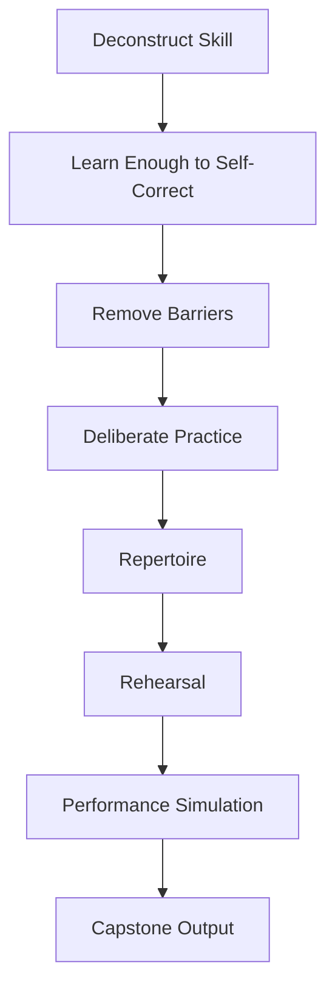
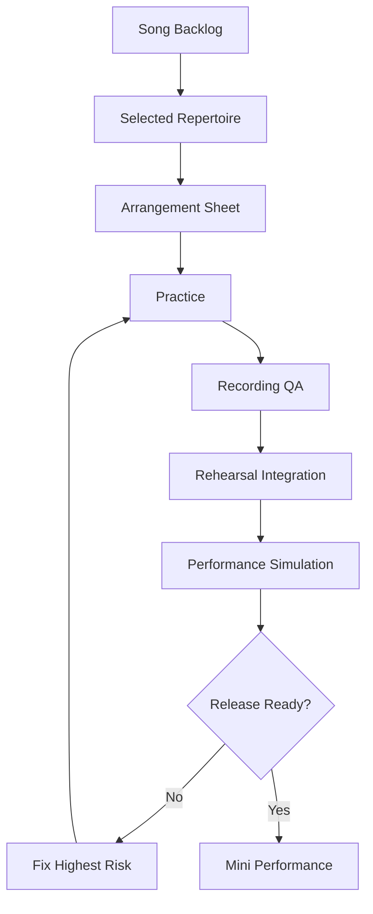
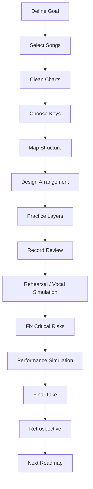
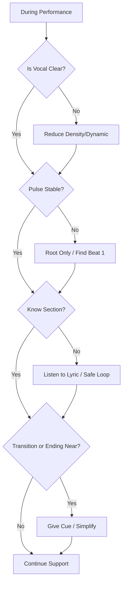
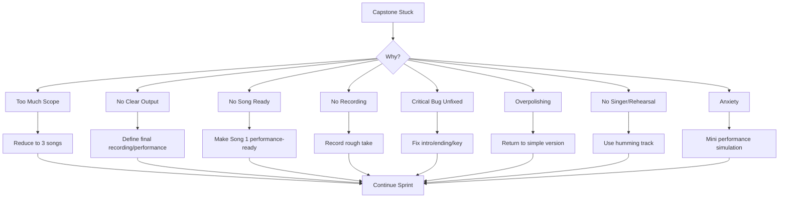
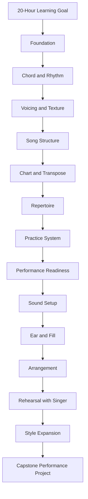

# learn-piano-accompaniment-part-031.md

# Part 031 — Capstone: 20-Hour Piano Accompaniment Performance Project

> Seri: **Learn Piano Accompaniment for Singer Performance**  
> Fokus: **belajar piano untuk mengiringi penyanyi**  
> Framework utama: **The First 20 Hours — Josh Kaufman**  
> Tahap: **Phase O — Integrasi Akhir, Performance Project, dan Roadmap Lanjutan**

---

## Status Seri

| Item | Status |
|---|---|
| Part | 031 |
| Nama file | `learn-piano-accompaniment-part-031.md` |
| Fokus | Capstone project untuk menyiapkan mini performance piano-vocal berbasis 20-hour learning sprint |
| Prasyarat | Part 000–030 |
| Output praktis | 3–5 lagu siap rehearsal/performance sederhana dengan chart, key, aransemen, style, cue, recording review, dan readiness rubric |
| Status seri | **Bagian terakhir — seri selesai** |

---

## Daftar Isi

- [1. Tujuan Part Ini](#1-tujuan-part-ini)
- [2. Posisi Capstone dalam Framework Kaufman](#2-posisi-capstone-dalam-framework-kaufman)
- [3. Definisi Sukses Capstone](#3-definisi-sukses-capstone)
- [4. Mental Model: Capstone sebagai Release Candidate](#4-mental-model-capstone-sebagai-release-candidate)
- [5. Output Akhir Capstone](#5-output-akhir-capstone)
- [6. Scope Capstone: Apa yang Masuk dan Tidak Masuk](#6-scope-capstone-apa-yang-masuk-dan-tidak-masuk)
- [7. Pilihan Format Capstone](#7-pilihan-format-capstone)
- [8. Capstone Track A — Solo Practice dengan Humming](#8-capstone-track-a--solo-practice-dengan-humming)
- [9. Capstone Track B — Rehearsal dengan Penyanyi](#9-capstone-track-b--rehearsal-dengan-penyanyi)
- [10. Capstone Track C — Mini Performance / Recording](#10-capstone-track-c--mini-performance--recording)
- [11. Struktur 20-Hour Sprint](#11-struktur-20-hour-sprint)
- [12. Sprint Board](#12-sprint-board)
- [13. Pemilihan 3–5 Lagu](#13-pemilihan-35-lagu)
- [14. Song Selection Rubric](#14-song-selection-rubric)
- [15. Repertoire Design: Komposisi 5 Lagu](#15-repertoire-design-komposisi-5-lagu)
- [16. Capstone Song Sheet Template](#16-capstone-song-sheet-template)
- [17. Arrangement Sheet Template](#17-arrangement-sheet-template)
- [18. Style Map Template](#18-style-map-template)
- [19. Key Decision Template](#19-key-decision-template)
- [20. Rehearsal Agreement Template](#20-rehearsal-agreement-template)
- [21. Recording Review Template](#21-recording-review-template)
- [22. Performance Readiness Rubric](#22-performance-readiness-rubric)
- [23. Skill Scorecard](#23-skill-scorecard)
- [24. Risk Register](#24-risk-register)
- [25. Recovery Plan per Lagu](#25-recovery-plan-per-lagu)
- [26. 20-Hour Plan Detail](#26-20-hour-plan-detail)
- [27. Hour 1–2: Setup, Goal, dan Baseline](#27-hour-12-setup-goal-dan-baseline)
- [28. Hour 3–4: Chord, Key, dan Chart Cleanup](#28-hour-34-chord-key-dan-chart-cleanup)
- [29. Hour 5–6: Pattern, Rhythm, dan Texture](#29-hour-56-pattern-rhythm-dan-texture)
- [30. Hour 7–8: Intro, Interlude, Ending](#30-hour-78-intro-interlude-ending)
- [31. Hour 9–10: Voicing, Register, dan Chord Color](#31-hour-910-voicing-register-dan-chord-color)
- [32. Hour 11–12: Transition dan Cue](#32-hour-1112-transition-dan-cue)
- [33. Hour 13–14: Vocal Simulation dan Ear Training](#33-hour-1314-vocal-simulation-dan-ear-training)
- [34. Hour 15–16: Rehearsal / Integration Test](#34-hour-1516-rehearsal--integration-test)
- [35. Hour 17–18: Performance Simulation](#35-hour-1718-performance-simulation)
- [36. Hour 19: Final Recording / Mini Performance](#36-hour-19-final-recording--mini-performance)
- [37. Hour 20: Review, Retrospective, dan Next Roadmap](#37-hour-20-review-retrospective-dan-next-roadmap)
- [38. Daily Plan 10 Hari x 2 Jam](#38-daily-plan-10-hari-x-2-jam)
- [39. Daily Plan 20 Hari x 1 Jam](#39-daily-plan-20-hari-x-1-jam)
- [40. Daily Plan 40 Sesi x 30 Menit](#40-daily-plan-40-sesi-x-30-menit)
- [41. Capstone Workflow End-to-End](#41-capstone-workflow-end-to-end)
- [42. Example Capstone: 5 Lagu Fiktif](#42-example-capstone-5-lagu-fiktif)
- [43. Example Song 1 — Pop Ballad 4 Chord](#43-example-song-1--pop-ballad-4-chord)
- [44. Example Song 2 — Minor Verse to Major Chorus](#44-example-song-2--minor-verse-to-major-chorus)
- [45. Example Song 3 — 6/8 Cinematic Ballad](#45-example-song-3--68-cinematic-ballad)
- [46. Example Song 4 — Worship Build](#46-example-song-4--worship-build)
- [47. Example Song 5 — Indonesian Pop Lyric-Forward](#47-example-song-5--indonesian-pop-lyric-forward)
- [48. Final Performance Setlist](#48-final-performance-setlist)
- [49. Pre-Performance Checklist](#49-pre-performance-checklist)
- [50. During-Performance Decision Tree](#50-during-performance-decision-tree)
- [51. Post-Performance Review](#51-post-performance-review)
- [52. Common Capstone Failure Modes](#52-common-capstone-failure-modes)
- [53. Debugging Capstone](#53-debugging-capstone)
- [54. Acceptance Criteria](#54-acceptance-criteria)
- [55. What “Good Enough” Means After 20 Hours](#55-what-good-enough-means-after-20-hours)
- [56. Roadmap Lanjutan Setelah Seri Ini](#56-roadmap-lanjutan-setelah-seri-ini)
- [57. Level 2 — Better Accompanist](#57-level-2--better-accompanist)
- [58. Level 3 — Arranger / Music Director Basic](#58-level-3--arranger--music-director-basic)
- [59. Level 4 — Advanced Harmony, Ear, dan Style](#59-level-4--advanced-harmony-ear-dan-style)
- [60. Rekomendasi Latihan Jangka Panjang](#60-rekomendasi-latihan-jangka-panjang)
- [61. Final Checklist Seri](#61-final-checklist-seri)
- [62. Ringkasan Semua Mental Model](#62-ringkasan-semua-mental-model)
- [63. Penutup Seri](#63-penutup-seri)

---

# 1. Tujuan Part Ini

Ini adalah bagian terakhir dari seri **Learn Piano Accompaniment for Singer Performance**.

Sampai Part 030, kita sudah membangun banyak sub-skill:

- framework belajar 20 jam;
- deconstruction skill;
- keyboard geography;
- major scale;
- chord triad;
- progression pop;
- LH root + RH chord;
- rhythm;
- broken chord;
- pop ballad comping;
- 6/8 cinematic feel;
- inversion;
- voice leading;
- register;
- density;
- chord color;
- modern voicing;
- song structure;
- intro/interlude/ending;
- transition;
- mengikuti penyanyi;
- chord chart;
- transposition;
- repertoire;
- deliberate practice;
- recording review;
- performance readiness;
- gear/sound setup;
- ear training;
- fill;
- arranging;
- rehearsal communication;
- style expansion.

Sekarang semua itu harus diintegrasikan menjadi project nyata.

Target part ini:

> Anda menyelesaikan capstone project berupa 3–5 lagu piano-vocal yang siap untuk rehearsal, mini performance, atau recording sederhana.

Output bukan lagi “saya paham”.

Output harus menjadi:

```text
Saya bisa mengiringi penyanyi untuk beberapa lagu dengan chart, key, intro, ending, cue, style, rehearsal note, dan recovery plan yang jelas.
```

---

# 2. Posisi Capstone dalam Framework Kaufman

Dalam *The First 20 Hours*, tujuan awal bukan menjadi master.

Tujuan awal adalah:

```text
mencapai performa fungsional secepat mungkin melalui latihan terarah
```

Capstone adalah bukti bahwa skill sudah fungsional.

Diagram:



Capstone ini memaksa semua sub-skill bekerja bersama.

Jika salah satu layer lemah, akan terlihat.

---

# 3. Definisi Sukses Capstone

Capstone sukses bukan berarti Anda bermain sempurna.

Capstone sukses jika:

- Anda punya 3–5 lagu yang dipilih dengan sadar;
- setiap lagu punya key final;
- setiap lagu punya chart performable;
- setiap lagu punya intro dan ending;
- setiap lagu punya texture map;
- setiap lagu punya style direction;
- setiap lagu bisa dimainkan full no-stop;
- minimal 1–2 lagu bisa dimainkan dengan penyanyi/humming;
- ada recording review;
- ada readiness score;
- ada recovery plan;
- Anda tahu next improvement.

## 3.1 Output Minimal

```text
3 lagu siap no-stop run
1 recording review
1 performance simulation
```

## 3.2 Output Ideal

```text
5 lagu siap rehearsal/performance kecil
5 arrangement sheets
5 recording reviews
1 mini performance setlist
1 post-performance review
```

## 3.3 Prinsip

```text
Capstone bukan ujian kesempurnaan.
Capstone adalah bukti integrasi.
```

---

# 4. Mental Model: Capstone sebagai Release Candidate

Sebagai software engineer, anggap capstone seperti release candidate.

Anda sudah develop fitur-fitur:

- chord engine;
- rhythm engine;
- voicing renderer;
- chart parser;
- transposition layer;
- performance runtime;
- recovery handler;
- singer interface.

Capstone adalah release candidate:

```text
Apakah sistem accompaniment ini bisa berjalan end-to-end?
```

Diagram:



## 4.1 Release Candidate Tidak Sempurna

Release candidate masih bisa punya bug kecil.

Namun bug kritis harus terkendali.

## 4.2 Bug Kritis

- tidak tahu key;
- intro membuat penyanyi bingung;
- ending tidak jelas;
- sering berhenti saat salah;
- chart tidak terbaca;
- tidak punya fallback;
- vocal tertutup.

## 4.3 Bug Non-Kritis

- satu fill kurang indah;
- chord color belum kaya;
- voicing belum super smooth;
- style belum sangat authentic;
- recording belum studio quality.

## 4.4 Prinsip

```text
Fix critical risk before polish.
```

---

# 5. Output Akhir Capstone

Buat folder/project seperti ini:

```text
piano-accompaniment-capstone/
  README.md
  repertoire-board.md
  song-01-arrangement.md
  song-02-arrangement.md
  song-03-arrangement.md
  song-04-arrangement.md
  song-05-arrangement.md
  recording-review.md
  rehearsal-agreement.md
  performance-checklist.md
  retrospective.md
```

## 5.1 Minimal jika Tidak Mau Folder

Satu file juga cukup:

```text
capstone-piano-accompaniment.md
```

Berisi semua template.

## 5.2 Evidence

Evidence capstone:

- recording audio/video;
- completed arrangement sheets;
- readiness score;
- rehearsal note;
- mini performance run.

## 5.3 Prinsip

```text
Apa yang tidak ditulis dan tidak direkam sulit diperbaiki.
```

---

# 6. Scope Capstone: Apa yang Masuk dan Tidak Masuk

## 6.1 Masuk Scope

- mengiringi penyanyi;
- chord chart;
- key selection;
- basic transposition;
- intro/ending;
- texture map;
- style direction;
- recording review;
- rehearsal communication;
- performance simulation;
- recovery plan.

## 6.2 Tidak Masuk Scope

- solo piano advanced;
- jazz improvisation advanced;
- membaca not balok kompleks;
- reharmonization berat;
- produksi musik full;
- mixing/mastering;
- menjadi session pianist professional;
- memainkan semua style secara expert.

## 6.3 Kenapa Scope Dibatasi?

Agar 20 jam pertama menghasilkan kemampuan nyata, bukan daftar ambisi yang terlalu luas.

## 6.4 Prinsip

```text
Scope kecil yang selesai mengalahkan scope besar yang tidak pernah selesai.
```

---

# 7. Pilihan Format Capstone

Pilih salah satu track.

## 7.1 Track A

Solo practice dengan humming.

Cocok jika belum ada penyanyi.

## 7.2 Track B

Rehearsal dengan penyanyi.

Cocok jika ada partner.

## 7.3 Track C

Mini performance atau recording.

Cocok jika ingin output nyata.

## 7.4 Recommendation

Jika memungkinkan:

```text
Track B + recording sederhana
```

Karena tujuan utama adalah mengiringi penyanyi.

Jika belum ada penyanyi, Track A tetap valid.

---

# 8. Capstone Track A — Solo Practice dengan Humming

## 8.1 Output

- 3–5 lagu;
- humming vocal simulation;
- recording review;
- self-score.

## 8.2 Keuntungan

- bisa dilakukan sendiri;
- tidak bergantung jadwal orang lain;
- bagus untuk membangun baseline.

## 8.3 Keterbatasan

- tidak menguji singer interaction penuh;
- tidak menguji feedback penyanyi;
- tidak menguji range real singer.

## 8.4 Acceptance Criteria

- full no-stop run;
- humming tidak tertutup piano;
- intro/ending jelas;
- recording review selesai.

## 8.5 Prinsip

```text
Jika belum ada penyanyi, humming adalah integration test minimal.
```

---

# 9. Capstone Track B — Rehearsal dengan Penyanyi

## 9.1 Output

- final key;
- rehearsal agreement;
- recording rehearsal;
- problem spot log;
- performance readiness score.

## 9.2 Keuntungan

- menguji real human timing;
- menguji key;
- menguji cue;
- menguji feedback;
- menguji trust.

## 9.3 Keterbatasan

- butuh koordinasi;
- penyanyi bisa punya preferensi berbeda;
- rehearsal bisa emosional jika komunikasi buruk.

## 9.4 Acceptance Criteria

- key disepakati;
- intro/ending disepakati;
- minimal 1 full run;
- recording review;
- next action jelas.

## 9.5 Prinsip

```text
Rehearsal adalah integration test utama untuk accompaniment.
```

---

# 10. Capstone Track C — Mini Performance / Recording

## 10.1 Output

- 1 setlist 3–5 lagu;
- no-stop performance;
- recording;
- post-performance review.

## 10.2 Bentuk Mini Performance

- di depan 1 teman;
- live acoustic kecil;
- recording video;
- rehearsal room take;
- keluarga/komunitas;
- online private recording.

## 10.3 Keuntungan

- melatih pressure;
- menghasilkan evidence;
- menguji recovery;
- membangun confidence.

## 10.4 Keterbatasan

- anxiety lebih tinggi;
- setup/sound matters;
- perlu readiness lebih tinggi.

## 10.5 Prinsip

```text
Performance kecil lebih berharga daripada latihan besar yang tidak pernah diuji.
```

---

# 11. Struktur 20-Hour Sprint

Sprint 20 jam ini dirancang untuk mengubah semua materi menjadi output.

## 11.1 High-Level Plan

| Hour | Focus |
|---:|---|
| 1–2 | goal, setup, baseline |
| 3–4 | song selection, chart, key |
| 5–6 | rhythm, pattern, texture |
| 7–8 | intro, interlude, ending |
| 9–10 | voicing, register, color |
| 11–12 | transition, cue |
| 13–14 | vocal simulation, ear training |
| 15–16 | rehearsal/integration |
| 17–18 | performance simulation |
| 19 | final recording/performance |
| 20 | retrospective and next roadmap |

## 11.2 Jangan Lompat ke Polish

Urutan penting:

```text
stability -> vocal support -> performance simulation -> polish
```

## 11.3 Prinsip

```text
20 jam harus menghasilkan repertoire, bukan hanya latihan teknik.
```

---

# 12. Sprint Board

Gunakan board ini.

```text
Backlog:
Selected:
Chart Ready:
Arrangement Ready:
Practice:
Rehearsal:
Performance Simulation:
Capstone Done:
```

## 12.1 Contoh

```text
Backlog:
- Song A
- Song B

Selected:
- Song 1
- Song 2
- Song 3

Arrangement Ready:
- Song 1

Practice:
- Song 2

Performance Simulation:
- Song 3
```

## 12.2 WIP Limit

- maksimal 5 lagu selected;
- maksimal 2 lagu active practice;
- maksimal 3 critical bugs.

## 12.3 Prinsip

```text
Board membuat progress terlihat dan mencegah latihan random.
```

---

# 13. Pemilihan 3–5 Lagu

Pilih lagu dengan strategi.

## 13.1 Minimal 3 Lagu

Jika waktu terbatas:

1. pop ballad 4 chord;
2. minor verse / major chorus;
3. 6/8 atau cinematic ballad.

## 13.2 Ideal 5 Lagu

1. pop ballad;
2. minor verse / major chorus;
3. 6/8 cinematic;
4. worship/build atau acoustic folk;
5. Indonesian pop lyric-forward.

## 13.3 Jangan Pilih Semua Lagu Sulit

Capstone bukan tempat membuktikan selera rumit.

Pilih lagu yang bisa selesai.

## 13.4 Prinsip

```text
Repertoire pertama harus memberi confidence dan coverage skill.
```

---

# 14. Song Selection Rubric

Beri skor 1–5.

| Criteria | Score |
|---|---:|
| chord mudah | |
| struktur jelas | |
| range penyanyi cocok | |
| bisa dibuat piano-vocal | |
| style jelas | |
| intro/ending bisa dibuat | |
| emosi lagu disukai | |
| chart tersedia/terverifikasi | |
| risiko performance rendah | |

## 14.1 Total

Pilih lagu dengan total tinggi.

## 14.2 Red Flag

Hindari jika:

- chord terlalu kompleks;
- modulasi banyak;
- tempo terlalu cepat;
- structure tidak jelas;
- high note terlalu ekstrem;
- style terlalu jauh dari kemampuan.

## 14.3 Prinsip

```text
Lagu capstone harus cukup menantang untuk belajar, tetapi cukup mudah untuk selesai.
```

---

# 15. Repertoire Design: Komposisi 5 Lagu

## 15.1 Song 1 — Safe Pop Ballad

Fokus:

- stability;
- intro/ending;
- verse/chorus.

## 15.2 Song 2 — Minor Verse to Major Chorus

Fokus:

- emotional contrast;
- transition;
- key.

## 15.3 Song 3 — 6/8 Cinematic

Fokus:

- meter/feel;
- pedal;
- dynamic.

## 15.4 Song 4 — Build Style

Fokus:

- worship/pop build;
- sus resolution;
- final chorus.

## 15.5 Song 5 — Lyric-Forward Indonesian Pop

Fokus:

- phrase;
- fill budget;
- vocal space;
- tag ending.

## 15.6 Prinsip

```text
Setiap lagu harus punya fungsi belajar berbeda.
```

---

# 16. Capstone Song Sheet Template

Gunakan template ini untuk setiap lagu.

```text
Song Number:
Title:
Reference Version:
Singer:
Original Key:
Final Key:
Meter:
Tempo:
Style:
Mood:

Why selected:
Skill focus:
Risk level:

Structure:
Intro:
Verse:
Pre-Chorus:
Chorus:
Interlude:
Bridge:
Final Chorus:
Ending:

Chord Chart:
[Intro]
...

Intro Plan:
Vocal Entry Cue:
Transition Cues:
Ending Plan:

Texture Map:
Intro:
Verse:
Chorus:
Bridge:
Ending:

Voicing Notes:
Chord colors:
Register notes:
Pedal notes:

Fill Budget:
Verse:
Chorus:
Interlude:
Ending:

Recovery Plan:
If wrong chord:
If lost section:
If singer delays:
If ending changes:

Readiness Score:
Chord:
Timing:
Structure:
Vocal Support:
Ending:
Recovery:
Overall:

Next Action:
```

## 16.1 Jangan Kosongkan Bagian Penting

Minimal isi:

- key;
- structure;
- intro;
- ending;
- texture;
- recovery.

## 16.2 Prinsip

```text
Song sheet adalah source of truth.
```

---

# 17. Arrangement Sheet Template

Arrangement sheet lebih fokus pada desain.

```text
Title:
Key:
Style:
Mood:
Core Identity:

Emotional Arc:
Intro:
Verse:
Chorus:
Bridge:
Final Chorus:
Ending:

Texture Map:
Density Map:
Register Map:
Dynamic Map:
Chord Color Map:
Fill Budget:

Simple Version:
Polished Version:
Do Not Do:
Performance Risk:
```

## 17.1 Do Not Do

Contoh:

```text
Do not fill during chorus hook.
Do not use heavy pedal in verse.
Do not make intro longer than 4 bars.
```

## 17.2 Prinsip

```text
Aransemen bukan hanya keputusan tentang apa yang dimainkan, tetapi juga apa yang tidak dimainkan.
```

---

# 18. Style Map Template

```text
Song:
Primary Style:
Secondary Influence:

Style Parameters:
Meter:
Rhythm:
Voicing:
Density:
Register:
Pedal:
Fill:
Sound:
Dynamic Arc:
Articulation:

Style Risks:
- 

Adjustment after rehearsal:
- 
```

## 18.1 Contoh

```text
Primary Style: Pop Ballad
Secondary: Cinematic
Rhythm: slow 4/4 sparse verse, fuller chorus
Voicing: add9/sus
Pedal: moderate, more space in verse
Fill: phrase-ending only
```

## 18.2 Prinsip

```text
Style harus ditulis sebagai parameter, bukan label saja.
```

---

# 19. Key Decision Template

```text
Song:
Original Key:
Tested Keys:
Singer Comfort:
Verse Low Note:
Chorus High Note:
Final Chorus Stamina:
Piano Playability:
Final Key:
Reason:
Transpose Notes:
```

## 19.1 Jika Tidak Ada Penyanyi

Tulis:

```text
Temporary key for practice:
Likely singer adjustment:
```

## 19.2 Prinsip

```text
Key terbaik adalah key yang membuat penyanyi terdengar natural dan piano tetap bisa support.
```

---

# 20. Rehearsal Agreement Template

```text
Song:
Singer:
Final Key:
Version:
Tempo:
Structure:
Intro:
Vocal Entry:
Interlude:
Bridge:
Final Chorus:
Ending:
Tag:
Ritardando:
Cue:
Problem Spots:
Next Rehearsal Focus:
```

## 20.1 Jika Rehearsal Solo

Isi dengan keputusan sendiri.

## 20.2 Prinsip

```text
Agreement tertulis mengurangi error rehearsal berikutnya.
```

---

# 21. Recording Review Template

```text
Recording:
Date:
Song:
Take:
Context:
With singer / humming / solo:

Timing:
Chord:
Structure:
Vocal Support:
Intro:
Ending:
Style:
Sound:
Recovery:

What worked:
What failed:
Top 3 fixes:
Ready score:
```

## 21.1 Review Minimal

Jika waktu pendek, cukup:

```text
What worked?
What failed?
Next action?
```

## 21.2 Prinsip

```text
Recording adalah mirror dan QA.
```

---

# 22. Performance Readiness Rubric

Skor 1–5.

## 22.1 Categories

| Category | 1 | 3 | 5 |
|---|---|---|---|
| Chord | sering salah | mayoritas benar | stabil dan adaptif |
| Timing | sering berhenti | full run dengan drift | stable/no-stop |
| Structure | tersesat | bisa dengan chart | bisa recovery |
| Intro | ragu | cukup jelas | memberi cue kuat |
| Ending | random | bisa selesai | disepakati/bersih |
| Vocal Support | menutup vokal | cukup support | singer feels safe |
| Style | generic/salah | cukup cocok | mendukung mood |
| Recovery | panik | bisa lanjut | fallback otomatis |

## 22.2 Performance Ready

Minimal:

```text
Chord >= 4
Timing >= 4
Structure >= 4
Intro >= 4
Ending >= 4
Vocal Support >= 4
Recovery >= 3
```

## 22.3 Prinsip

```text
Readiness adalah risk management, bukan perasaan percaya diri saja.
```

---

# 23. Skill Scorecard

Isi sebelum dan sesudah capstone.

| Skill | Before | After | Evidence |
|---|---:|---:|---|
| Chord change | | | |
| Rhythm stability | | | |
| 6/8 feel | | | |
| Inversion/voicing | | | |
| Chord chart reading | | | |
| Transpose | | | |
| Intro/ending | | | |
| Vocal support | | | |
| Fill restraint | | | |
| Ear training | | | |
| Style adaptation | | | |
| Performance recovery | | | |

## 23.1 Evidence

Contoh:

```text
Song 3 recording, 6/8 stable at 54 BPM.
```

## 23.2 Prinsip

```text
Progress harus punya evidence, bukan hanya feeling.
```

---

# 24. Risk Register

Risk register mencegah capstone gagal di titik kritis.

```text
Risk:
Severity:
Probability:
Mitigation:
Owner:
Status:
```

## 24.1 Contoh

```text
Risk: Ending Song 2 belum jelas
Severity: High
Probability: Medium
Mitigation: define tag x2 + Gsus4-G-C, drill 10x
Status: Open
```

## 24.2 Common Risks

- key belum final;
- intro ambiguous;
- ending tidak disepakati;
- bridge transition lemah;
- piano terlalu ramai;
- 6/8 rushing;
- transpose key sulit;
- chart tidak terbaca;
- pedal muddy.

## 24.3 Prinsip

```text
Capstone gagal bukan karena semua hal buruk, tetapi karena satu risiko kritis tidak dimitigasi.
```

---

# 25. Recovery Plan per Lagu

Setiap lagu harus punya recovery plan.

## 25.1 Template

```text
Song:
Fallback Pattern:
Safe Loop:
Safe Ending:
If wrong chord:
If lost section:
If singer delays:
If singer repeats tag:
If pedal/sound problem:
Emergency root notes:
```

## 25.2 Contoh

```text
Fallback Pattern: LH root beat 1 + RH partial
Safe Loop: C-G-Am-F
Safe Ending: F-G-C
If lost: listen vocal, stay root-only until phrase boundary
```

## 25.3 Prinsip

```text
Recovery plan harus sederhana dan sudah dilatih.
```

---

# 26. 20-Hour Plan Detail

Bagian berikut menjabarkan 20 jam.

Anda bisa menjalaninya dalam:

- 10 hari x 2 jam;
- 20 hari x 1 jam;
- 40 sesi x 30 menit.

Yang penting totalnya diarahkan ke output.

---

# 27. Hour 1–2: Setup, Goal, dan Baseline

## 27.1 Goal

Tulis goal:

```text
Dalam 20 jam, saya akan menyiapkan 3–5 lagu piano-vocal yang bisa dimainkan full no-stop, dengan intro, ending, style, dan recovery plan.
```

## 27.2 Setup

- keyboard/piano;
- pedal;
- chart system;
- recording device;
- metronome;
- practice log;
- folder/project.

## 27.3 Baseline Recording

Main satu lagu yang paling mudah.

Rekam.

Jangan edit.

## 27.4 Baseline Review

Catat:

- chord;
- timing;
- structure;
- vocal space;
- ending.

## 27.5 Output

```text
baseline recording
goal statement
practice folder
initial skill scorecard
```

---

# 28. Hour 3–4: Chord, Key, dan Chart Cleanup

## 28.1 Pilih Lagu

Gunakan song selection rubric.

## 28.2 Bersihkan Chart

Ubah chart mentah menjadi performable.

## 28.3 Tentukan Key

Jika ada penyanyi, test chorus.

Jika belum, pilih practice key.

## 28.4 Roman Numeral

Tulis progression sebagai function.

Contoh:

```text
C-G-Am-F = I-V-vi-IV
```

## 28.5 Output

```text
3–5 chart ready
key decision draft
section map
```

---

# 29. Hour 5–6: Pattern, Rhythm, dan Texture

## 29.1 Pilih Pattern

Untuk tiap lagu:

- verse;
- chorus;
- bridge;
- ending.

## 29.2 Rhythm Check

Gunakan metronome.

Latih:

- 4/4 stability;
- 6/8 count jika ada.

## 29.3 Texture Map

Tulis texture per section.

## 29.4 Output

```text
texture map for each song
root-only run
basic pattern run
```

---

# 30. Hour 7–8: Intro, Interlude, Ending

## 30.1 Intro

Buat intro 2/4 bar.

Harus memberi key dan cue.

## 30.2 Interlude

Tentukan panjang.

## 30.3 Ending

Pilih:

- soft;
- big;
- tag;
- ritardando.

## 30.4 Drill

Latih intro dan ending 10x.

## 30.5 Output

```text
intro plan
ending plan
interlude plan
entry cue
```

---

# 31. Hour 9–10: Voicing, Register, dan Chord Color

## 31.1 Voicing

Pilih voicing aman.

## 31.2 Register

Cek vocal space.

## 31.3 Color

Tambahkan hanya yang perlu:

- add9;
- sus;
- m7;
- maj7 minimal.

## 31.4 A/B

Bandingkan simple vs polished.

## 31.5 Output

```text
voicing notes
color map
register map
simple/polished decision
```

---

# 32. Hour 11–12: Transition dan Cue

## 32.1 Problem Boundaries

Latih:

- intro -> vocal entry;
- verse -> chorus;
- bridge -> final chorus;
- final chorus -> ending.

## 32.2 Cue

Pilih:

- harmonic cue;
- fill cue;
- hold cue;
- visual cue.

## 32.3 Loop 2 Bar

Latih transition rawan.

## 32.4 Output

```text
cue map
transition drills
problem spot log
```

---

# 33. Hour 13–14: Vocal Simulation dan Ear Training

## 33.1 Humming

Main sambil humming.

## 33.2 Vocal Space

Cek apakah piano menutup vokal.

## 33.3 Ear Check

- tonic clear?
- cadence resolve?
- bass movement smooth?
- chord chart terasa benar?

## 33.4 Recording

Rekam 1–2 lagu dengan humming.

## 33.5 Output

```text
vocal simulation recording
vocal support notes
ear correction notes
```

---

# 34. Hour 15–16: Rehearsal / Integration Test

## 34.1 Jika Ada Penyanyi

Lakukan rehearsal 60 menit.

- test key;
- intro entry;
- verse/chorus;
- ending;
- full run.

## 34.2 Jika Tidak Ada Penyanyi

Lakukan rehearsal simulation dengan humming dan recording.

## 34.3 Agreement

Tulis final agreement.

## 34.4 Output

```text
rehearsal recording
agreement sheet
updated arrangement
```

---

# 35. Hour 17–18: Performance Simulation

## 35.1 No-Stop Run

Main 3–5 lagu tanpa berhenti.

## 35.2 Simulasi Gangguan

- salah chord, lanjut;
- root-only fallback;
- ending tag ekstra;
- no pedal if needed.

## 35.3 Score

Beri readiness score.

## 35.4 Output

```text
performance simulation recording
readiness rubric
risk register update
```

---

# 36. Hour 19: Final Recording / Mini Performance

## 36.1 Pilih Format

- audio recording;
- video recording;
- live to one friend;
- rehearsal take with singer;
- small performance.

## 36.2 Rules

- no stop;
- use chart;
- recover;
- finish ending;
- no post-comment during take.

## 36.3 Output

```text
final capstone take
```

## 36.4 Prinsip

```text
Final take bukan harus perfect.
Final take harus complete.
```

---

# 37. Hour 20: Review, Retrospective, dan Next Roadmap

## 37.1 Review

Dengarkan final take.

Isi:

```text
What worked:
What failed:
Biggest improvement:
Top 3 next fixes:
Songs performance-ready:
Songs need more work:
```

## 37.2 Skill Scorecard

Update before/after.

## 37.3 Next Roadmap

Pilih arah lanjutan.

## 37.4 Output

```text
retrospective.md
next roadmap
```

## 37.5 Prinsip

```text
Capstone selesai ketika Anda tahu kemampuan saat ini dan next step berikutnya.
```

---

# 38. Daily Plan 10 Hari x 2 Jam

| Hari | Fokus |
|---:|---|
| 1 | setup + baseline |
| 2 | pilih lagu + chart cleanup |
| 3 | key + structure |
| 4 | pattern + texture |
| 5 | intro/ending |
| 6 | voicing/color |
| 7 | transition/cue |
| 8 | vocal simulation/rehearsal |
| 9 | performance simulation |
| 10 | final recording + review |

## 38.1 Cocok Untuk

Jika Anda punya blok waktu cukup besar.

## 38.2 Prinsip

```text
Setiap hari harus menghasilkan artifact.
```

---

# 39. Daily Plan 20 Hari x 1 Jam

| Hari | Fokus |
|---:|---|
| 1 | setup |
| 2 | baseline |
| 3 | song selection |
| 4 | chart cleanup |
| 5 | key |
| 6 | structure |
| 7 | texture song 1 |
| 8 | texture song 2–3 |
| 9 | intro |
| 10 | ending |
| 11 | voicing |
| 12 | color |
| 13 | transitions |
| 14 | cue |
| 15 | vocal simulation |
| 16 | recording review |
| 17 | rehearsal |
| 18 | performance simulation |
| 19 | final take |
| 20 | retrospective |

## 39.1 Cocok Untuk

Jika Anda ingin konsistensi harian.

---

# 40. Daily Plan 40 Sesi x 30 Menit

Jika waktu sangat terbatas.

## 40.1 Format Sesi

Setiap sesi:

```text
5 min goal
20 min focused work
5 min log
```

## 40.2 Prinsip

Jangan mencoba semua hal dalam 30 menit.

Satu sesi = satu objective.

## 40.3 Example

```text
Session 12: Song 1 ending F-G-C, 10 repetitions, recording review.
```

---

# 41. Capstone Workflow End-to-End



## 41.1 Jangan Lewati Recording

Recording adalah QA.

## 41.2 Jangan Lewati Ending

Ending adalah critical path.

## 41.3 Jangan Lewati Recovery

Error kecil pasti terjadi.

---

# 42. Example Capstone: 5 Lagu Fiktif

Agar tidak bergantung pada lagu tertentu, kita gunakan contoh fiktif.

| Song | Style | Focus |
|---|---|---|
| Song 1 | Pop ballad | stable 4 chord |
| Song 2 | Minor verse / major chorus | emotional contrast |
| Song 3 | 6/8 cinematic | meter + pedal |
| Song 4 | Worship build | dynamic build + sus |
| Song 5 | Indonesian pop | lyric phrasing + fill budget |

---

# 43. Example Song 1 — Pop Ballad 4 Chord

## 43.1 Progression

```text
C - G - Am - F
```

## 43.2 Structure

```text
Intro 4
Verse 8
Chorus 8
Verse 8
Chorus 8
Ending 4
```

## 43.3 Arrangement

Verse:

```text
LH root + RH partial
```

Chorus:

```text
pop ballad comping
```

Ending:

```text
Fadd9 - Gsus4 G - Cadd9
```

## 43.4 Recovery

Fallback:

```text
LH root beat 1
```

Safe loop:

```text
C-G-Am-F
```

## 43.5 Readiness Target

This song should become first performance-ready.

---

# 44. Example Song 2 — Minor Verse to Major Chorus

## 44.1 Progression

Verse:

```text
Am - F - C - G
```

Chorus:

```text
C - G - Am - F
```

## 44.2 Focus

- contrast;
- transition;
- chorus entry.

## 44.3 Cue

```text
Gsus4 - G - C
```

## 44.4 Risk

Chorus transition late.

## 44.5 Mitigation

Loop:

```text
| Gsus4 G | C |
```

20x.

---

# 45. Example Song 3 — 6/8 Cinematic Ballad

## 45.1 Meter

```text
6/8
ONE two three FOUR five six
```

## 45.2 Progression

```text
Am7 - Fadd9 - Cadd9 - Gsus4
```

## 45.3 Texture

- intro rolling;
- verse sparse;
- chorus fuller;
- ending soft.

## 45.4 Risk

6/8 becomes muddy.

## 45.5 Mitigation

- less pedal;
- count 1 and 4;
- fill only count 4-5-6.

---

# 46. Example Song 4 — Worship Build

## 46.1 Progression

```text
Cadd9 - Gsus4/G - Am7 - Fadd9
```

## 46.2 Structure

```text
Verse
Chorus
Bridge build
Final chorus/tag
```

## 46.3 Focus

- gradual build;
- sus resolution;
- tag control.

## 46.4 Risk

Peak too early.

## 46.5 Mitigation

Energy map:

```text
Verse E1
Chorus E2.5
Bridge E1->E4
Final E4
Ending E2
```

---

# 47. Example Song 5 — Indonesian Pop Lyric-Forward

## 47.1 Focus

- lirik foreground;
- phrase ending fill;
- tag/ritardando.

## 47.2 Pattern

Verse:

```text
very sparse
```

Chorus:

```text
medium pop ballad
```

## 47.3 Fill Budget

```text
max 1 fill per phrase
no fill during important lyric
```

## 47.4 Ending

```text
tag x2
F - G - C
rit. light
```

## 47.5 Risk

Piano too generic/too busy.

## 47.6 Mitigation

Record with humming and audit fill.

---

# 48. Final Performance Setlist

Setlist should manage energy.

## 48.1 Example

1. Song 1 — safe opener;
2. Song 2 — emotional;
3. Song 3 — cinematic slow;
4. Song 4 — build;
5. Song 5 — lyric-forward closer.

## 48.2 Setlist Principle

Start with stable song.

Do not start with highest-risk song.

## 48.3 Closing Song

Pick song with clear ending.

## 48.4 Template

```text
Setlist:
1.
2.
3.
4.
5.

Opening risk:
Peak:
Closing:
```

---

# 49. Pre-Performance Checklist

## 49.1 Music

- [ ] final key;
- [ ] chart ready;
- [ ] intro;
- [ ] vocal entry;
- [ ] ending;
- [ ] tag count;
- [ ] fallback pattern.

## 49.2 Gear

- [ ] piano/keyboard;
- [ ] pedal;
- [ ] volume;
- [ ] sound;
- [ ] chart/tablet;
- [ ] recording device.

## 49.3 Mental

- [ ] breathe;
- [ ] first chord;
- [ ] tempo;
- [ ] singer cue;
- [ ] recovery mindset.

## 49.4 Rule

```text
Before performance, do not add new ideas.
Stabilize what already works.
```

---

# 50. During-Performance Decision Tree



## 50.1 Remember

```text
Vocal -> Pulse -> Root -> Section -> Cue
```

## 50.2 Rule

```text
Saat ragu, main lebih sedikit dan dengar lebih banyak.
```

---

# 51. Post-Performance Review

## 51.1 Jangan Hanya Emosional

Hindari:

```text
jelek banget
bagus banget
```

Gunakan review.

## 51.2 Template

```text
Date:
Context:
Songs:
What worked:
What failed:
Best recovery:
Worst risk:
Singer feedback:
Audience/context feedback:
Top 3 fixes:
Next performance goal:
```

## 51.3 After-Action Review

Tanya:

```text
Apa yang direncanakan?
Apa yang terjadi?
Apa perbedaannya?
Apa yang dipelajari?
Apa next action?
```

## 51.4 Prinsip

```text
Setiap performance adalah data untuk performance berikutnya.
```

---

# 52. Common Capstone Failure Modes

## 52.1 Terlalu Banyak Lagu

Fix:

```text
kurangi ke 3 lagu
```

## 52.2 Lagu Terlalu Sulit

Fix:

```text
pilih lagu lebih sederhana
```

## 52.3 Terlalu Banyak Polish

Fix:

```text
kembali ke simple version
```

## 52.4 Tidak Ada Rekaman

Fix:

```text
record 60 seconds today
```

## 52.5 Tidak Ada Ending

Fix:

```text
define F-G-C or Gsus4-G-C
```

## 52.6 Tidak Ada Vocal Simulation

Fix:

```text
humming full run
```

## 52.7 Tidak Ada Recovery Plan

Fix:

```text
root-only fallback
```

## 52.8 Terlalu Perfeksionis

Fix:

```text
ship capstone take
```

---

# 53. Debugging Capstone



## 53.1 Rule

```text
When stuck, reduce scope and produce evidence.
```

---

# 54. Acceptance Criteria

Capstone accepted if:

## 54.1 Minimum

- [ ] 3 songs selected;
- [ ] 3 performable charts;
- [ ] 3 key decisions;
- [ ] 3 intro/ending plans;
- [ ] 3 no-stop runs;
- [ ] 1 recording review;
- [ ] 1 retrospective.

## 54.2 Standard

- [ ] 5 songs selected;
- [ ] 5 arrangement sheets;
- [ ] 5 readiness scores;
- [ ] 3 recording reviews;
- [ ] 1 rehearsal/humming integration;
- [ ] 1 performance simulation.

## 54.3 Strong

- [ ] 5 songs performance-ready;
- [ ] rehearsal with singer;
- [ ] final mini performance recording;
- [ ] post-performance review;
- [ ] next roadmap defined.

## 54.4 Prinsip

```text
Acceptance criteria harus jelas sebelum mulai.
```

---

# 55. What “Good Enough” Means After 20 Hours

Setelah 20 jam, “good enough” berarti:

- bisa mengiringi lagu sederhana;
- chord mayoritas benar;
- pulse cukup stabil;
- tidak berhenti saat error kecil;
- intro/ending jelas;
- bisa membaca chart;
- bisa mengikuti penyanyi dasar;
- bisa memberi ruang vokal;
- bisa memilih key;
- bisa membuat aransemen sederhana;
- bisa self-correct dengan recording.

## 55.1 Bukan Berarti

- bisa semua key lancar;
- bisa improvisasi kompleks;
- bisa jazz advanced;
- bisa semua style authentic;
- bisa tampil tanpa gugup;
- bisa membaca notasi penuh;
- bisa menjadi professional accompanist.

## 55.2 Prinsip

```text
20 jam pertama membuka pintu.
Bukan menyelesaikan seluruh perjalanan.
```

---

# 56. Roadmap Lanjutan Setelah Seri Ini

Setelah capstone, Anda bisa lanjut ke beberapa jalur.

## 56.1 Jalur A — Repertoire Expansion

Tambah lagu.

Target:

```text
20 lagu siap iring
```

## 56.2 Jalur B — Ear and Transpose

Fokus:

- mencari chord lagu;
- transpose semua key;
- number system;
- bass movement.

## 56.3 Jalur C — Style Deepening

Fokus satu style:

- pop ballad;
- worship;
- jazz ballad;
- Indonesian pop;
- cinematic;
- folk.

## 56.4 Jalur D — Advanced Harmony

Fokus:

- secondary dominant;
- borrowed chord;
- modal interchange;
- passing diminished;
- reharmonization.

## 56.5 Jalur E — Performance

Fokus:

- live set;
- band coordination;
- stage sound;
- setlist management;
- MD basic.

## 56.6 Prinsip

```text
Pilih satu jalur lanjutan, jangan semua sekaligus.
```

---

# 57. Level 2 — Better Accompanist

Target Level 2:

```text
lebih stabil, lebih cepat belajar lagu, lebih peka ke penyanyi
```

## 57.1 Skills

- 20 lagu repertoire;
- transpose ke C/G/D/F/A/Eb/Bb;
- 4/4, 6/8, 3/4;
- slash chord smooth;
- better endings;
- phrase-aware fill;
- singer rehearsal fluency.

## 57.2 Practice

- 3 lagu baru per bulan;
- 1 rehearsal per bulan;
- 1 recording review per minggu.

## 57.3 Metric

```text
bisa menyiapkan lagu sederhana dalam 30–60 menit
```

---

# 58. Level 3 — Arranger / Music Director Basic

Target Level 3:

```text
bisa membuat versi lagu dan memimpin rehearsal kecil
```

## 58.1 Skills

- arrangement sheet cepat;
- dynamic arc;
- cue system;
- band-aware piano;
- vocal key testing;
- rehearsal leadership;
- setlist flow.

## 58.2 Practice

- buat 1 arrangement per minggu;
- rekam A/B style;
- latih komunikasi rehearsal.

## 58.3 Metric

```text
bisa membuat piano-vocal arrangement usable untuk penyanyi lain
```

---

# 59. Level 4 — Advanced Harmony, Ear, dan Style

Target Level 4:

```text
lebih bebas, lebih sophisticated, lebih adaptif
```

## 59.1 Skills

- advanced ear training;
- chord substitution;
- reharmonization;
- jazz voicing;
- gospel passing chord;
- modulation;
- improvisation;
- style authenticity.

## 59.2 Practice

- transcribe real songs;
- learn from recordings;
- play with singers/bands;
- study harmony deeply.

## 59.3 Metric

```text
bisa mengubah style/key/arrangement secara musical, bukan trial-and-error random
```

---

# 60. Rekomendasi Latihan Jangka Panjang

## 60.1 Daily 20 Minutes

```text
5 min chord/voicing
5 min rhythm/pattern
5 min repertoire
5 min ear/fill
```

## 60.2 Weekly

- 1 recording review;
- 1 new song section;
- 1 transpose exercise;
- 1 performance simulation.

## 60.3 Monthly

- add 2–4 songs;
- rehearse with singer;
- update repertoire board;
- do mini performance/recording.

## 60.4 Quarterly

- choose focus style;
- build 10-song set;
- record progress;
- evaluate gaps.

## 60.5 Prinsip

```text
Skill accompaniment tumbuh dari repertoire + feedback + real singer interaction.
```

---

# 61. Final Checklist Seri

Anda telah menyelesaikan seri jika bisa mencentang banyak item berikut.

## 61.1 Foundation

- [ ] Saya tahu layout keyboard.
- [ ] Saya tahu major scale formula.
- [ ] Saya tahu triad major/minor.
- [ ] Saya bisa memainkan C, G, Am, F, Dm, Em.
- [ ] Saya tahu Roman numeral dasar.

## 61.2 Accompaniment

- [ ] Saya bisa LH root + RH chord.
- [ ] Saya bisa block chord.
- [ ] Saya bisa broken chord.
- [ ] Saya bisa pop ballad comping.
- [ ] Saya bisa 6/8 basic.

## 61.3 Musicality

- [ ] Saya tahu register aman untuk vokal.
- [ ] Saya bisa mengatur density.
- [ ] Saya bisa memakai inversion.
- [ ] Saya bisa memakai add9/sus/m7 secara ringan.
- [ ] Saya bisa memberi fill 2–3 nada.

## 61.4 Song

- [ ] Saya bisa membaca chord chart.
- [ ] Saya bisa membuat chart performable.
- [ ] Saya bisa menentukan intro.
- [ ] Saya bisa menentukan ending.
- [ ] Saya bisa membuat texture map.
- [ ] Saya bisa membuat aransemen simple.

## 61.5 Singer

- [ ] Saya bisa menyesuaikan key.
- [ ] Saya bisa mendengar napas.
- [ ] Saya bisa memberi cue.
- [ ] Saya bisa menerima feedback penyanyi.
- [ ] Saya bisa menjaga vokal foreground.

## 61.6 Practice and Performance

- [ ] Saya bisa membuat error log.
- [ ] Saya bisa recording review.
- [ ] Saya bisa no-stop run.
- [ ] Saya punya fallback root-only.
- [ ] Saya bisa recovery dari error kecil.
- [ ] Saya bisa melakukan post-performance review.

---

# 62. Ringkasan Semua Mental Model

## 62.1 Skill as System

```text
Piano accompaniment = harmony + rhythm + structure + vocal support + recovery
```

## 62.2 Chord as Data Structure

```text
chord = root + quality + tones + voicing
```

## 62.3 Progression as Control Flow

```text
chord progression = state transition of emotional tension
```

## 62.4 Song as State Machine

```text
intro -> verse -> chorus -> bridge -> final chorus -> ending
```

## 62.5 Chart as Source Code

```text
chart harus readable, annotated, performable
```

## 62.6 Practice as Feedback Loop

```text
play -> record -> diagnose -> isolate -> fix -> retest
```

## 62.7 Repertoire as Product Release

```text
lagu siap = chart + key + arrangement + rehearsal + recovery
```

## 62.8 Singer as Primary User

```text
piano sukses jika penyanyi merasa aman dan terdengar lebih baik
```

## 62.9 Performance as Runtime

```text
saat error, degrade gracefully
```

## 62.10 Style as Configuration Layer

```text
style = rhythm + voicing + density + register + pedal + dynamic + fill + sound
```

## 62.11 Arrangement as System Design

```text
arrangement = keputusan section-by-section untuk membawa emosi lagu
```

## 62.12 Capstone as Release Candidate

```text
proof that the accompaniment system works end-to-end
```

Diagram final:



---

# 63. Penutup Seri

Seri ini selesai.

Namun skill accompaniment baru benar-benar hidup ketika Anda memainkannya bersama manusia.

Jika Anda mengambil satu hal dari seluruh seri ini, ambil ini:

```text
Tugas pianis pengiring bukan membuat piano terdengar hebat sendirian.
Tugas pianis pengiring adalah membuat penyanyi, lagu, dan momen terdengar lebih hidup.
```

Dan:

```text
Main lebih sedikit, dengar lebih banyak.
```

Arah terbaik setelah ini:

1. pilih 3–5 lagu;
2. buat song sheet;
3. rekam;
4. rehearsal dengan penyanyi;
5. tampil kecil;
6. review;
7. tambah repertoire.

Jangan menunggu sempurna.

Mulai dengan versi sederhana yang stabil.

Lalu polish.

Lalu dengarkan.

Lalu ulangi.

---

## Status Akhir Part 031

```text
Part 031 selesai.
Seri learn-piano-accompaniment selesai.
Seluruh bagian 000–031 telah selesai.
```
