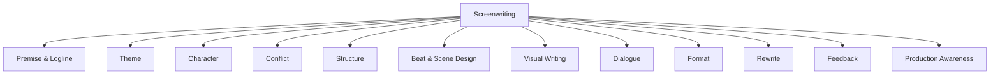
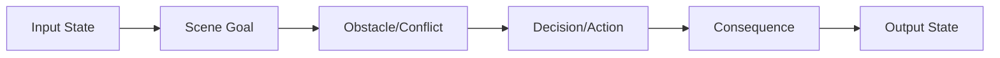
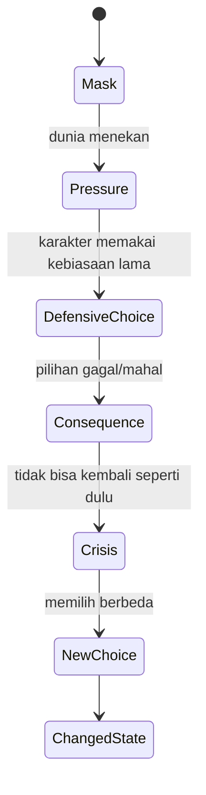
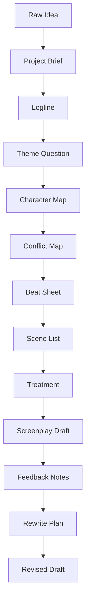

# Learn Screenwriting for Film Project — Part 000

## Daftar Isi, Target Performa, dan Kontrak Belajar 20 Jam

**Nama file:** `learn-screenwriting-film-script-part-000.md`  
**Seri:** `learn-screenwriting-film-script`  
**Part:** 000  
**Status seri:** Belum selesai. Ini adalah bagian pembuka/fondasi.  
**Target utama:** Membantu software engineer memulai kemampuan menulis naskah film dengan pendekatan 20 jam pertama ala Josh Kaufman: praktis, terstruktur, berorientasi output, dan cukup dalam untuk membangun mental model.

---

# 0. Tujuan Bagian Ini

Bagian ini bukan langsung mengajarkan semua teknik screenwriting. Bagian ini berfungsi sebagai **kontrak belajar** dan **arsitektur pembelajaran**.

Sebelum belajar menulis naskah film, masalah terbesar biasanya bukan kurang ide, tetapi:

1. Tidak tahu skill apa saja yang sebenarnya membentuk kemampuan menulis naskah.
2. Mengira menulis naskah sama dengan menulis cerita biasa.
3. Terlalu cepat menulis draft panjang tanpa struktur.
4. Terjebak riset tanpa latihan.
5. Mengukur progress dengan perasaan, bukan output yang bisa diperiksa.
6. Menulis scene yang “bagus secara kalimat” tetapi tidak bisa dimainkan, difilmkan, atau diproduksi.
7. Memaksakan formula struktur tanpa memahami fungsi dramatiknya.

Karena itu, Part 000 akan membangun fondasi:

- apa itu target 20 jam pertama,
- apa output realistisnya,
- bagaimana skill screenwriting dipecah,
- bagaimana cara latihan,
- bagaimana cara berpikir sebagai software engineer tanpa membuat cerita terasa mekanis,
- bagaimana menyiapkan project folder,
- bagaimana mengukur progress,
- bagaimana melanjutkan ke part berikutnya.

---

# 1. Prinsip Dasar: Apa yang Kita Pelajari?

Kita tidak sedang belajar “menulis cerita” secara umum. Kita sedang belajar **menulis naskah film**.

Naskah film adalah dokumen kerja yang mengubah ide cerita menjadi instruksi dramatik-audiovisual yang bisa dibaca, dibayangkan, dimainkan, disutradarai, diproduksi, dan direvisi.

Dengan kata lain:

> Naskah film bukan tempat penulis menjelaskan semua isi kepala karakter.  
> Naskah film adalah blueprint pengalaman yang akan diterima penonton melalui gambar, suara, tindakan, konflik, ritme, dan perubahan.

## 1.1 Perbedaan Cerita Biasa dan Naskah Film

| Aspek | Cerita Prosa / Novel | Naskah Film |
|---|---|---|
| Medium utama | Bahasa naratif | Gambar, suara, aksi, dialog |
| Isi batin | Bisa dijelaskan langsung | Harus divisualkan/diaudiokan |
| Deskripsi | Bisa panjang dan literer | Harus ringkas, dapat difilmkan |
| Waktu konsumsi | Pembaca mengatur tempo | Film mengatur tempo penonton |
| Dokumen akhir | Karya final | Blueprint produksi |
| Pembaca utama | Pembaca umum | Sutradara, produser, aktor, crew, investor, reader |
| Unit kerja | Paragraf, bab | Scene, beat, sequence |
| Validasi | Estetika bahasa + pengalaman membaca | Dapat diproduksi + pengalaman audiovisual |

Contoh perbedaan:

```text
Prosa:
Raka merasa bersalah karena selama bertahun-tahun ia meninggalkan ibunya sendirian.

Screenplay:
Raka berdiri di depan pintu kamar ibunya. Di tangannya, sekotak obat.
Ia mengetuk sekali. Tidak masuk.
Obat itu ia letakkan di lantai.
Ia pergi sebelum pintu terbuka.
```

Versi screenplay tidak berkata “bersalah”. Ia membuat rasa bersalah menjadi perilaku yang bisa dilihat.

---

# 2. Framework The First 20 Hours

Josh Kaufman mempopulerkan pendekatan bahwa tahap awal belajar skill tidak harus dimulai dengan ribuan jam. Yang dibutuhkan untuk mencapai tingkat awal yang usable adalah latihan terfokus, target jelas, dan pemecahan skill menjadi sub-skill yang paling penting.

Kerangka yang akan kita gunakan:

1. **Deconstruct the skill**  
   Pecah skill besar menjadi bagian kecil.

2. **Learn enough to self-correct**  
   Pelajari teori secukupnya agar bisa mendeteksi kesalahan sendiri.

3. **Remove practice barriers**  
   Hilangkan hambatan latihan: software, template, waktu, distraksi, perfeksionisme.

4. **Practice deliberately for at least 20 hours**  
   Latihan terarah dengan output, feedback, dan revisi.

Dalam konteks screenwriting, artinya kita tidak akan mulai dari membaca semua buku teori film, sejarah sinema, atau membuat worldbuilding ratusan halaman. Kita akan fokus pada sub-skill yang langsung menghasilkan kemampuan menulis draft.

---

# 3. Batas Realistis 20 Jam Pertama

Penting untuk jujur sejak awal.

Dalam 20 jam pertama, targetnya **bukan**:

- menjadi screenwriter profesional,
- menulis feature film 120 halaman yang siap dijual,
- memahami semua teori struktur cerita,
- menguasai semua genre,
- menguasai bisnis pitching,
- memahami directing, cinematography, editing, sound, dan production design secara penuh,
- membuat naskah sempurna sekali jalan.

Target 20 jam pertama adalah:

- memahami bentuk dasar naskah film,
- mampu membedakan ide, premis, logline, konflik, scene, beat, dan draft,
- mampu membuat satu project brief,
- mampu membuat logline yang punya konflik,
- mampu membuat karakter utama yang memiliki want, need, flaw, pressure, dan arc,
- mampu membuat beat sheet,
- mampu membuat scene list,
- mampu menulis beberapa scene dalam format screenplay,
- mampu melakukan self-diagnosis sederhana,
- mampu membuat draft awal film pendek atau blueprint film panjang.

## 3.1 Target Jika Project Anda Film Pendek

Jika project Anda adalah film pendek, target realistis 20 jam:

| Output | Target |
|---|---|
| Project brief | 1 dokumen ringkas |
| Logline | 1 logline final + beberapa alternatif |
| Theme question | 1 pertanyaan tematik |
| Character map | Protagonist + oposisi utama |
| Conflict map | Konflik utama + escalation |
| Beat sheet | 8–20 beat |
| Scene list | 5–15 scene |
| Draft | 8–20 halaman kasar |
| Feedback notes | Minimal 1 ronde feedback |
| Rewrite plan | Daftar revisi prioritas |

Film pendek sangat cocok untuk 20 jam pertama karena scope-nya lebih terkendali. Satu perubahan karakter yang kuat lebih berguna daripada plot besar yang belum matang.

## 3.2 Target Jika Project Anda Film Panjang

Jika project Anda adalah film panjang, target realistis 20 jam:

| Output | Target |
|---|---|
| Project brief | 1 dokumen ringkas |
| Logline | 1 logline kuat |
| Theme question | 1 pertanyaan tematik |
| Character web | Protagonist, antagonist, key supporting characters |
| Conflict architecture | Main conflict + internal conflict + stakes |
| 8-sequence outline | Draft awal |
| Treatment | 3–8 halaman |
| Scene samples | 3–5 scene kunci |
| Opening pages | 5–15 halaman awal |
| Roadmap full draft | Rencana penulisan lanjutan |

Untuk film panjang, jangan memaksakan 90–120 halaman dalam 20 jam jika Anda belum pernah menulis screenplay. Yang lebih berharga adalah fondasi yang kuat.

---

# 4. Skill Decomposition: Screenwriting Dipecah Menjadi Apa?

“Menulis naskah film” terdengar seperti satu skill, padahal sebenarnya gabungan beberapa sub-skill.



## 4.1 Sub-skill Paling Bernilai untuk 20 Jam Pertama

Kita akan prioritaskan sub-skill yang paling cepat meningkatkan kualitas draft.

| Prioritas | Sub-skill | Kenapa penting? | Output latihan |
|---:|---|---|---|
| 1 | Premis/logline | Menentukan arah semua keputusan cerita | 10–20 logline |
| 2 | Karakter | Film bergerak lewat pilihan karakter | Character map |
| 3 | Konflik | Tanpa konflik, scene mati | Conflict matrix |
| 4 | Struktur dasar | Mencegah cerita melantur | Beat sheet |
| 5 | Scene design | Unit kerja utama screenplay | Scene cards |
| 6 | Visual writing | Membuat naskah terasa filmik | Action lines |
| 7 | Dialog | Membuat karakter hidup | Dialogue rewrite |
| 8 | Rewrite | Draft pertama hampir pasti bermasalah | Revision plan |
| 9 | Feedback | Menemukan blind spot | Script notes |
| 10 | Format | Agar naskah terbaca sebagai screenplay | Sample pages |

## 4.2 Sub-skill yang Sengaja Ditunda

Untuk 20 jam pertama, beberapa hal akan disentuh ringan tetapi tidak menjadi fokus utama:

- teori genre yang terlalu luas,
- sejarah film,
- teori sinematografi detail,
- pitching industri,
- legal/kontrak penulis,
- budgeting detail,
- festival strategy,
- market positioning,
- analisis auteur,
- advanced nonlinear structure,
- multi-protagonist ensemble writing kompleks,
- franchise/world bible besar.

Bukan karena tidak penting, tetapi karena belum menjadi bottleneck awal.

---

# 5. Mental Model untuk Software Engineer

Sebagai software engineer, Anda kemungkinan nyaman dengan sistem yang deterministik: input, proses, output, state, dependency, invariant, failure mode.

Screenwriting bisa dibantu dengan model seperti itu, tetapi tidak boleh direduksi menjadi formula mekanis.

Cerita yang baik bukan sekadar “alur benar”. Cerita yang baik membuat penonton mengalami tekanan, empati, rasa ingin tahu, ketakutan, harapan, kejutan, dan perubahan.

Jadi kita akan memakai dua mode berpikir:

1. **Mode arsitek**: struktur, dependency, state transition, constraint.
2. **Mode seniman**: rasa, ironi, ritme, ketegangan, subtext, ambiguitas.

Keduanya perlu berjalan bersama.

## 5.1 Analogi Engineering ke Screenwriting

| Engineering | Screenwriting | Penjelasan |
|---|---|---|
| Requirement | Project brief | Apa yang ingin dibuat dan untuk siapa |
| Domain model | World + character system | Entitas dan relasi dalam cerita |
| State machine | Character arc | Perubahan karakter karena tekanan |
| Event | Plot beat | Sesuatu terjadi dan mengubah state |
| Function | Scene | Unit kerja yang menerima input state dan menghasilkan output state |
| Side effect | Consequence | Dampak pilihan karakter |
| Exception | Reversal | Kejadian yang membalik arah ekspektasi |
| Integration test | Table read | Menguji apakah naskah dipahami manusia lain |
| Bug report | Script note | Catatan masalah naskah |
| Refactor | Rewrite | Mengubah struktur internal tanpa kehilangan tujuan cerita |
| Release candidate | Shooting draft | Draft yang cukup stabil untuk produksi |

## 5.2 Scene sebagai Function

Sebuah scene bisa dianalogikan seperti function:



Jika scene tidak mengubah apa pun, kemungkinan scene itu tidak perlu ada.

Contoh:

```text
Input state:
Raka percaya ia bisa menghindari konflik keluarga.

Scene:
Ibunya menolak uang darinya dan menanyakan kenapa ia baru pulang sekarang.

Output state:
Raka tidak bisa lagi berpura-pura bahwa kepulangannya hanya kunjungan biasa.
```

Scene tersebut memiliki perubahan. Ada tekanan. Ada relasi yang bergeser.

## 5.3 Karakter sebagai State Machine

Karakter film biasanya bergerak dari satu kondisi psikologis ke kondisi lain.



Contoh abstrak:

```text
Mask:
Karakter terlihat dingin dan mandiri.

Pressure:
Ia harus merawat orang yang dulu ia benci.

Defensive choice:
Ia menghindar, membayar orang lain, menjaga jarak.

Consequence:
Orang itu hampir mati sendirian.

Crisis:
Ia sadar uang tidak bisa menggantikan kehadiran.

New choice:
Ia tinggal.

Changed state:
Ia belajar menerima kedekatan, meski tidak nyaman.
```

## 5.4 Batas Analogi Engineering

Analogi engineering membantu membuat struktur, tetapi ada batasnya.

Cerita tidak bisa sepenuhnya diperlakukan seperti program karena:

- manusia tidak selalu rasional,
- karakter bisa kontradiktif,
- penonton merespons emosi sebelum logika,
- ambiguitas kadang lebih kuat daripada penjelasan,
- subtext sering lebih penting daripada statement eksplisit,
- scene yang “benar secara plot” bisa tetap terasa mati jika tidak punya rasa.

Jadi prinsipnya:

> Gunakan struktur untuk menemukan arah.  
> Gunakan rasa untuk membuatnya hidup.

---

# 6. Target Performa Seri Ini

Kita perlu mendefinisikan “selesai” secara konkret.

## 6.1 Definisi Sukses Minimum

Setelah menyelesaikan 20 jam latihan pertama dan mengikuti part utama seri ini, Anda minimal harus mampu membuat:

1. **Project brief**  
   Dokumen ringkas tentang film yang ingin ditulis.

2. **Logline**  
   Satu kalimat yang menjelaskan protagonist, tujuan, hambatan, dan stakes.

3. **Theme question**  
   Pertanyaan nilai yang diuji oleh cerita.

4. **Character map**  
   Peta protagonist, want, need, flaw, wound, mask, dan perubahan.

5. **Conflict map**  
   Peta konflik internal, interpersonal, sosial, situasional, dan escalation.

6. **Beat sheet**  
   Rangkaian perubahan cerita.

7. **Scene list**  
   Daftar scene dengan tujuan dramatik.

8. **Sample screenplay pages**  
   Beberapa halaman screenplay dengan format dasar.

9. **Feedback notes**  
   Catatan dari pembaca/table read.

10. **Rewrite plan**  
   Daftar revisi berdasarkan prioritas.

## 6.2 Definisi Sukses Ideal

Jika project Anda film pendek:

- Anda menyelesaikan draft kasar 8–20 halaman.
- Draft memiliki beginning, middle, end.
- Setiap scene punya perubahan.
- Karakter utama punya konflik dan pilihan.
- Ending terasa seperti konsekuensi, bukan tempelan.
- Draft bisa dibaca tim produksi untuk diskusi.

Jika project Anda film panjang:

- Anda menyelesaikan logline, treatment, 8-sequence outline, dan beberapa scene kunci.
- Anda punya roadmap menuju full draft.
- Anda tahu bagian mana yang masih lemah.
- Anda belum perlu memaksakan draft penuh.

---

# 7. Apa yang Harus Dihindari Sejak Awal

## 7.1 Over-Researching

Belajar teori bisa menjadi bentuk procrastination.

Tanda-tandanya:

- membaca terlalu banyak buku sebelum menulis satu scene,
- menonton video teori berjam-jam tanpa output,
- mengumpulkan template tetapi tidak mengisi template,
- mencari struktur paling sempurna,
- takut menulis karena belum merasa “cukup tahu”.

Solusi:

> Untuk setiap 30–45 menit belajar teori, harus ada minimal 30–45 menit latihan output.

## 7.2 Menulis Premis yang Tidak Punya Konflik

Contoh premis lemah:

```text
Seorang pria pulang ke kampung halaman dan mengenang masa lalunya.
```

Masalahnya: belum ada tekanan dramatik.

Versi lebih kuat:

```text
Seorang pria yang kabur dari keluarganya harus pulang untuk menjual rumah ibunya yang sakit, tetapi ibunya menolak pergi sebelum ia mengakui rahasia yang menghancurkan keluarga mereka.
```

Ada protagonist, tujuan, oposisi, stakes emosional, dan konflik masa lalu.

## 7.3 Membuat Karakter Pasif

Karakter pasif hanya mengalami hal-hal yang terjadi padanya. Karakter aktif membuat pilihan, meski pilihan itu salah.

Karakter aktif tidak harus kuat, heroik, atau dominan. Ia hanya harus punya keinginan dan mengambil tindakan.

## 7.4 Menulis Scene Tanpa Perubahan

Scene buruk sering hanya berisi:

- orang datang,
- ngobrol informasi,
- pergi,
- tidak ada yang berubah.

Scene yang berguna minimal mengubah salah satu hal:

- informasi,
- relasi,
- posisi kuasa,
- emosi,
- rencana,
- stakes,
- pemahaman penonton,
- pilihan karakter.

## 7.5 Dialog yang Menjelaskan Semua

Dialog pemula sering terdengar seperti karakter sedang membaca sinopsis.

Contoh buruk:

```text
RINA
Aku marah karena kamu meninggalkanku lima tahun lalu dan sekarang kamu kembali seolah tidak terjadi apa-apa.
```

Versi lebih dramatis:

```text
RINA
Kopimu masih tanpa gula?

RAKA
Masih.

RINA
Lucu. Ada yang tetap kau ingat.
```

Informasinya tidak dijelaskan langsung, tetapi relasi dan luka terasa.

---

# 8. Struktur Latihan 20 Jam

Berikut distribusi latihan yang akan dipakai.

```mermaid
gantt
    title 20-Hour Screenwriting Practice Plan
    dateFormat  X
    axisFormat %s
    section Foundation
    Target & Constraint      :0, 2
    Premise & Logline        :2, 2
    Character & Conflict     :4, 2
    section Structure
    Beat Sheet               :6, 2
    Scene Design             :8, 2
    section Draft
    Drafting Pages           :10, 4
    Dialogue/Visual Rewrite  :14, 2
    section Feedback
    Feedback & Diagnosis     :16, 2
    Revision & Polish        :18, 2
```



## 8.1 Jam 0–2: Target dan Constraint

Fokus:

- menentukan jenis film,
- menentukan durasi,
- menentukan genre,
- menentukan tone,
- menentukan batas lokasi,
- menentukan jumlah karakter,
- menentukan audience,
- memilih referensi film.

Output:

- project brief.

Pertanyaan kunci:

1. Film ini pendek atau panjang?
2. Untuk siapa film ini dibuat?
3. Apa rasa utama yang ingin ditinggalkan?
4. Apakah project ini harus realistis diproduksi dengan budget kecil?
5. Berapa karakter utama maksimal?
6. Berapa lokasi maksimal?
7. Apakah ada tema personal yang ingin diuji?

## 8.2 Jam 2–4: Premis dan Logline

Fokus:

- membedakan ide, premis, dan logline,
- membuat banyak variasi,
- memilih yang paling kuat.

Output:

- 10–20 logline,
- 1 logline terpilih.

Formula kerja:

```text
Ketika [inciting event], seorang [protagonist dengan flaw/condition] harus [goal],
tetapi [obstacle/opposition], sebelum [stakes/consequence].
```

Formula ini bukan aturan kaku. Ia hanya alat diagnosis.

## 8.3 Jam 4–6: Karakter dan Konflik

Fokus:

- protagonist,
- want,
- need,
- flaw,
- wound,
- mask,
- antagonist/opposition,
- stakes.

Output:

- character map,
- conflict map.

Pertanyaan kunci:

1. Apa yang karakter inginkan secara sadar?
2. Apa yang sebenarnya ia butuhkan?
3. Apa kebiasaan buruk yang membuatnya gagal?
4. Apa luka lama yang membentuk perilakunya?
5. Apa yang ia tampilkan ke dunia?
6. Siapa atau apa yang menekannya?
7. Apa harga kegagalannya?

## 8.4 Jam 6–8: Beat Sheet

Fokus:

- menyusun perubahan cerita,
- bukan hanya daftar kejadian.

Output:

- beat sheet.

Contoh beat yang lemah:

```text
Raka pulang ke rumah.
```

Contoh beat yang lebih berguna:

```text
Raka pulang ke rumah untuk menjualnya, tetapi menemukan ibunya sudah mengubah kamar lamanya menjadi gudang barang orang mati.
```

Beat kedua punya informasi, konflik, dan tekanan psikologis.

## 8.5 Jam 8–10: Scene Design

Fokus:

- mengubah beat menjadi scene,
- menentukan input-output scene,
- memastikan setiap scene punya perubahan.

Output:

- scene list.

Template scene card:

```text
Scene #:
Lokasi/Waktu:
Karakter:
Input state:
Scene goal:
Obstacle/conflict:
Turn/change:
Output state:
Fungsi scene:
```

## 8.6 Jam 10–14: Drafting

Fokus:

- menulis halaman,
- tidak berhenti untuk memoles terlalu dini,
- menyelesaikan aliran scene.

Output:

- rough pages.

Aturan:

1. Jangan mengedit kalimat terlalu lama.
2. Gunakan placeholder jika stuck.
3. Tulis scene yang paling jelas dulu jika urutan linear macet.
4. Jangan menunggu rasa percaya diri.
5. Draft buruk lebih berguna daripada draft sempurna yang tidak ada.

## 8.7 Jam 14–16: Dialog dan Visual Rewrite

Fokus:

- mengurangi dialog eksposisi,
- memperkuat subtext,
- mengganti emosi abstrak menjadi aksi visual,
- membuat scene lebih playable.

Output:

- revisi dialog dan action line.

Checklist:

- Apakah karakter mengatakan persis apa yang ia rasakan?
- Apakah dialog bisa dipotong?
- Apakah ada silence yang lebih kuat daripada kata-kata?
- Apakah aksi kecil bisa menggantikan penjelasan?
- Apakah setiap karakter punya cara bicara berbeda?

## 8.8 Jam 16–18: Feedback dan Diagnosis

Fokus:

- membaca naskah keras-keras,
- meminta feedback spesifik,
- mencatat confusion point.

Output:

- bug list naskah.

Pertanyaan feedback yang lebih berguna daripada “menurutmu bagus tidak?”:

1. Di bagian mana kamu mulai bingung?
2. Karakter mana yang paling jelas keinginannya?
3. Scene mana yang terasa tidak perlu?
4. Bagian mana yang emosinya terasa paling kuat?
5. Dialog mana yang terdengar tidak natural?
6. Apakah ending terasa earned?
7. Apa yang kamu kira film ini sebenarnya bicarakan?

## 8.9 Jam 18–20: Rewrite dan Polish

Fokus:

- memilih revisi prioritas,
- memperbaiki masalah terbesar dulu,
- tidak terjebak kosmetik.

Output:

- revised draft atau rewrite plan.

Prioritas revisi:

1. Struktur.
2. Karakter.
3. Konflik.
4. Scene function.
5. Dialog.
6. Format.
7. Typo.

Jangan mulai dari typo jika struktur cerita masih patah.

---

# 9. Learning Backlog: Apa yang Akan Dipelajari Sepanjang Seri

Backlog ini akan menjadi peta dari part 001 sampai part 030.

| Area | Dipelajari di part | Output |
|---|---:|---|
| Mental model screenplay | 001 | Pemahaman medium |
| Framework 20 jam | 002 | Sistem latihan |
| Project definition | 003 | Project brief |
| Premise/logline | 004 | Logline final |
| Theme | 005 | Theme question |
| Character | 006 | Character map |
| Antagonism/opposition | 007 | Opposition map |
| Conflict | 008 | Conflict matrix |
| Structure | 009 | Story skeleton |
| Beat sheet | 010 | Beat sheet |
| Scene design | 011 | Scene cards |
| Visual writing | 012 | Filmic action lines |
| Screenplay format | 013 | Proper script page |
| Dialogue | 014 | Dialogue rewrite |
| Exposition | 015 | Information strategy |
| Genre/tone | 016 | Genre contract |
| Worldbuilding | 017 | World rules |
| Short film | 018 | Short outline |
| Feature film | 019 | Feature outline |
| Treatment/outline | 020 | Treatment |
| Drafting workflow | 021 | Draft pages |
| Rewrite | 022 | Rewrite plan |
| Feedback/table read | 023 | Script notes |
| Production-aware writing | 024 | Feasibility pass |
| Collaboration | 025 | Handoff awareness |
| Tooling | 026 | Workflow system |
| 20-hour schedule | 027 | Practice tracker |
| Short capstone | 028 | Short script |
| Feature capstone | 029 | Feature blueprint |
| Final review | 030 | Checklist + next path |

---

# 10. Struktur Folder Project

Agar latihan tidak berantakan, gunakan folder seperti ini:

```text
film-project/
  00-admin/
    learning-contract.md
    practice-tracker.md
    reference-list.md

  01-idea/
    raw-ideas.md
    selected-idea.md
    project-brief.md

  02-premise/
    logline-variants.md
    final-logline.md
    theme-question.md

  03-character/
    protagonist.md
    antagonist-or-opposition.md
    character-web.md

  04-structure/
    beat-sheet.md
    sequence-outline.md
    scene-list.md

  05-draft/
    draft-v001.fountain
    draft-v002.fountain
    draft-v003.fountain

  06-feedback/
    table-read-notes.md
    reader-notes.md
    bug-list.md

  07-rewrite/
    rewrite-plan.md
    changelog.md

  08-production/
    location-list.md
    character-list.md
    props-list.md
    feasibility-notes.md
```

Jika Anda nyaman dengan Git, bisa gunakan versioning sederhana:

```text
main
  draft/v001-rough
  draft/v002-structure-fix
  draft/v003-dialogue-pass
```

Namun jangan sampai tooling menjadi pengganti menulis. Tool hanya membantu jika membuat latihan lebih mudah.

---

# 11. Template: Learning Contract

Gunakan template ini sebelum masuk Part 001.

```markdown
# Learning Contract — Screenwriting 20 Hours

## 1. Target Project

Saya ingin menulis:
- [ ] Film pendek
- [ ] Film panjang
- [ ] Proof-of-concept
- [ ] Web film
- [ ] Lainnya: ...

Durasi target:

Genre utama:

Tone utama:

Audience utama:

## 2. Target Output 20 Jam

Dalam 20 jam pertama, saya ingin menghasilkan:

- [ ] Project brief
- [ ] Logline final
- [ ] Theme question
- [ ] Character map
- [ ] Conflict map
- [ ] Beat sheet
- [ ] Scene list
- [ ] Draft scene/sample pages
- [ ] Feedback notes
- [ ] Rewrite plan

Target spesifik saya:

...

## 3. Constraint Produksi

Jumlah karakter utama maksimal:

Jumlah lokasi maksimal:

Apakah ada budget constraint?

Apakah ada aktor/lokasi/asset yang sudah tersedia?

Apakah ada deadline project?

## 4. Komitmen Latihan

Saya akan latihan total 20 jam dengan pola:

- Durasi per sesi:
- Jumlah sesi per minggu:
- Waktu latihan utama:
- Tempat latihan:

## 5. Hambatan yang Harus Dihilangkan

Hambatan saya:

- [ ] Terlalu banyak riset
- [ ] Takut draft jelek
- [ ] Tidak punya software
- [ ] Tidak punya ide jelas
- [ ] Tidak punya waktu tetap
- [ ] Distraksi internet
- [ ] Perfeksionisme
- [ ] Lainnya: ...

Rencana menghilangkan hambatan:

...

## 6. Definisi Selesai

Setelah 20 jam, saya akan menganggap fase pertama selesai jika:

...
```

---

# 12. Template: Project Brief

```markdown
# Project Brief

## Judul Sementara

...

## Format

Film pendek / film panjang / proof-of-concept / lainnya.

## Durasi Target

...

## Genre

...

## Tone

...

## Audience

...

## Premis Kasar

...

## Tema yang Ingin Diuji

...

## Karakter Utama

...

## Konflik Utama

...

## Stakes

Apa yang hilang jika karakter gagal?

...

## Constraint Produksi

Lokasi maksimal:

Karakter maksimal:

Budget constraint:

Asset tersedia:

Deadline:

## Referensi Film

1. ...
2. ...
3. ...

## Kenapa Film Ini Perlu Ditulis?

...
```

---

# 13. Template: Practice Tracker

```markdown
# Practice Tracker — First 20 Hours Screenwriting

| Sesi | Durasi | Fokus | Output | Masalah ditemukan | Next action |
|---:|---:|---|---|---|---|
| 1 | 45m | Project brief | Draft brief | Masih terlalu luas | Batasi durasi/lokasi |
| 2 | 45m | Logline | 10 variasi | Stakes belum jelas | Tambah consequence |
| 3 | 45m | Character | Protagonist map | Need belum kuat | Cari flaw/wound |
| 4 | 45m | Conflict | Conflict map | Oposisi pasif | Buat pressure aktif |
| 5 | 45m | Beat sheet | 12 beat | Midpoint lemah | Tambah reversal |
| 6 | 45m | Scene list | 8 scene | Scene 3 tidak berubah | Revisi function |
| 7 | 45m | Drafting | 3 halaman | Dialog eksposisi | Rewrite subtext |
| 8 | 45m | Drafting | 4 halaman | Pacing lambat | Cut opening |
| 9 | 45m | Feedback | Notes | Ending membingungkan | Clarify final choice |
| 10 | 45m | Rewrite | New draft | - | Continue |
```

Target total:

```text
20 jam = 1200 menit
Jika 45 menit per sesi, butuh sekitar 27 sesi.
Jika 60 menit per sesi, butuh 20 sesi.
Jika 90 menit per sesi, butuh sekitar 14 sesi.
```

---

# 14. Template: Skill Deconstruction Sheet

```markdown
# Skill Deconstruction — Screenwriting

## Skill Besar

Menulis naskah film untuk project film.

## Target Performa

Saya mampu menghasilkan naskah/draft/blueprint yang bisa dibaca dan didiskusikan oleh tim project.

## Sub-skill

| Sub-skill | Level sekarang | Target 20 jam | Latihan |
|---|---:|---:|---|
| Logline | 0/5 | 3/5 | Tulis 20 logline |
| Character | 0/5 | 3/5 | Character map |
| Conflict | 0/5 | 3/5 | Conflict matrix |
| Structure | 0/5 | 2/5 | Beat sheet |
| Scene design | 0/5 | 3/5 | Scene cards |
| Visual writing | 0/5 | 2/5 | Rewrite action lines |
| Dialogue | 0/5 | 2/5 | Dialogue rewrite |
| Format | 0/5 | 2/5 | 3 formatted pages |
| Rewrite | 0/5 | 2/5 | Revision plan |
| Feedback | 0/5 | 2/5 | Reader questions |

## Bottleneck Terbesar Saat Ini

...

## Sub-skill yang Akan Dilatih Dulu

1. ...
2. ...
3. ...
```

---

# 15. Template: Reference Selection

Pilih 3–5 film referensi. Jangan terlalu banyak.

Gunakan kategori:

```markdown
# Reference List

## Film Referensi Utama

| Film | Kenapa dipilih? | Yang akan dipelajari |
|---|---|---|
| ... | ... | Struktur |
| ... | ... | Tone |
| ... | ... | Karakter |
| ... | ... | Dialog |
| ... | ... | Ending |

## Catatan Analisis

### Film 1

Logline kira-kira:

Protagonist:

Goal:

Obstacle:

Stakes:

Scene paling kuat:

Kenapa scene itu kuat:

Hal yang bisa ditiru secara prinsip:

Hal yang tidak perlu ditiru:
```

Jangan memilih referensi hanya karena “filmnya bagus”. Pilih karena ada aspek spesifik yang relevan dengan project Anda.

---

# 16. Definisi Istilah Dasar

## 16.1 Ide

Ide adalah bahan mentah.

Contoh:

```text
Seorang anak pulang ke rumah ibunya setelah lama pergi.
```

Ide belum cukup karena belum punya tekanan dramatik.

## 16.2 Premis

Premis adalah ide yang mulai memiliki konflik.

Contoh:

```text
Seorang anak yang lama meninggalkan ibunya harus pulang untuk menjual rumah keluarga, tetapi ibunya menolak pergi sebelum rahasia lama mereka dibongkar.
```

## 16.3 Logline

Logline adalah ringkasan satu kalimat yang menjual konflik utama.

Komponen umum:

- protagonist,
- kondisi/flaw,
- triggering event,
- goal,
- opposition,
- stakes.

## 16.4 Theme Question

Theme question adalah pertanyaan nilai yang diuji cerita.

Contoh:

```text
Apakah menebus kesalahan cukup dengan memberi uang, atau harus dengan hadir dan menerima luka lama?
```

## 16.5 Beat

Beat adalah unit perubahan.

Bukan hanya “kejadian”, tetapi momen yang menggeser informasi, emosi, relasi, keputusan, atau stakes.

## 16.6 Scene

Scene adalah unit dramatik yang terjadi di lokasi/waktu tertentu dan menghasilkan perubahan.

## 16.7 Sequence

Sequence adalah kumpulan scene yang membentuk satu mini-arc.

## 16.8 Treatment

Treatment adalah narasi ringkas cerita dari awal sampai akhir, biasanya dalam bentuk prosa, sebelum masuk format screenplay penuh.

## 16.9 Draft

Draft adalah versi naskah. Draft pertama bukan produk final. Draft pertama adalah bahan mentah untuk didiagnosis.

## 16.10 Rewrite

Rewrite adalah proses memperbaiki naskah secara struktural dan dramatik. Rewrite bukan sekadar memperbaiki typo.

---

# 17. Screenplay Format Minimal yang Perlu Diketahui Dulu

Format detail akan dibahas di Part 013, tetapi sejak awal Anda perlu tahu elemen dasar.

```text
INT. RUMAH IBU - MALAM

Raka berdiri di ambang pintu. Rumah itu gelap, kecuali cahaya televisi dari ruang tengah.

IBU (70-an) duduk membelakangi Raka. Di pangkuannya, album foto terbuka.

RAKA
Bu.

Ibu tidak menoleh.

IBU
Kau bawa kunci rumah?

RAKA
Masih.

IBU
Lucu. Rumah ini masih ingat kau.
```

Elemen dasar:

| Elemen | Fungsi |
|---|---|
| Scene heading | Menunjukkan interior/eksterior, lokasi, waktu |
| Action line | Menjelaskan hal yang terlihat/terdengar |
| Character cue | Nama karakter yang berbicara |
| Dialogue | Ucapan karakter |
| Parenthetical | Instruksi singkat jika sangat perlu |
| Transition | Perpindahan, jarang dipakai berlebihan |

Prinsip awal:

- Tulis dalam present tense.
- Tulis yang bisa dilihat/didengar.
- Jangan menjelaskan pikiran abstrak kecuali bisa diwujudkan dalam aksi.
- Jangan terlalu banyak arahan kamera.
- Jangan membuat paragraf action terlalu panjang.
- Jangan memakai dialog untuk menjelaskan semua backstory.

---

# 18. Output Pipeline Seri

Selama seri ini, setiap part akan menambahkan satu lapisan output.



Setiap dokumen memiliki fungsi:

| Dokumen | Fungsi |
|---|---|
| Project brief | Menjaga scope project |
| Logline | Menguji kekuatan konflik utama |
| Theme question | Menjaga kedalaman cerita |
| Character map | Menjaga motivasi dan arc |
| Conflict map | Menjaga tekanan dramatik |
| Beat sheet | Menjaga struktur perubahan |
| Scene list | Menjaga urutan eksekusi |
| Treatment | Menjembatani outline ke draft |
| Draft | Bahan nyata untuk feedback |
| Feedback notes | Menemukan blind spot |
| Rewrite plan | Mengubah feedback menjadi tindakan |

---

# 19. Rubrik Self-Assessment Awal

Gunakan rubrik ini sebelum dan sesudah 20 jam.

Skala:

```text
0 = belum paham
1 = pernah dengar
2 = bisa menjelaskan secara dasar
3 = bisa menerapkan dengan bantuan template
4 = bisa menerapkan mandiri
5 = bisa mendiagnosis dan memperbaiki masalah
```

| Skill | Nilai awal | Target setelah 20 jam | Catatan |
|---|---:|---:|---|
| Memahami screenplay sebagai medium visual | 0 | 3 |  |
| Membuat logline | 0 | 3 |  |
| Membuat protagonist aktif | 0 | 3 |  |
| Mendesain konflik | 0 | 3 |  |
| Membuat beat sheet | 0 | 3 |  |
| Mendesain scene | 0 | 3 |  |
| Menulis action line | 0 | 2–3 |  |
| Menulis dialog dengan subtext | 0 | 2–3 |  |
| Memakai format screenplay | 0 | 2–3 |  |
| Melakukan rewrite | 0 | 2 |  |
| Meminta dan memilah feedback | 0 | 2 |  |

Jangan mengejar nilai 5 di awal. Targetnya adalah cukup bisa untuk terus berkembang.

---

# 20. Kualitas Minimum Naskah yang Kita Kejar

Naskah awal yang usable tidak harus indah, tetapi harus jelas.

Minimal harus menjawab:

1. Siapa karakter utamanya?
2. Apa yang ia inginkan?
3. Kenapa ia menginginkannya sekarang?
4. Apa yang menghalangi?
5. Apa yang hilang jika ia gagal?
6. Apa yang berubah dari awal ke akhir?
7. Kenapa cerita ini harus menjadi film, bukan artikel, cerpen, atau monolog?
8. Scene mana yang paling kuat secara visual?
9. Apa konflik emosional terdalam?
10. Apa pertanyaan tematiknya?

Jika sepuluh pertanyaan ini belum bisa dijawab, jangan buru-buru menulis draft panjang.

---

# 21. Anti-Pattern Besar untuk Pemula

## 21.1 “Saya Punya Banyak Ide” tetapi Tidak Ada Konflik

Ide banyak tidak sama dengan cerita siap tulis.

Cerita mulai hidup saat ada:

- karakter,
- keinginan,
- hambatan,
- pilihan,
- konsekuensi.

## 21.2 Semua Karakter Berbicara Seperti Penulis

Jika semua karakter terdengar sama, biasanya karena penulis belum memberi mereka:

- latar sosial,
- strategi bicara,
- rasa takut,
- kebiasaan menyembunyikan sesuatu,
- tujuan berbeda di setiap scene.

## 21.3 Scene Ada karena Informasi, Bukan Drama

Informasi harus masuk lewat tekanan. Jangan membuat scene hanya agar penonton tahu sesuatu.

## 21.4 Struktur Terlalu Dipuja

Struktur membantu, tetapi tidak menyelamatkan cerita yang tidak punya karakter hidup.

## 21.5 Tema Terlalu Diceramahkan

Jika karakter terus menyampaikan pesan moral, film akan terasa seperti pidato.

Tema harus diuji lewat pilihan dan konsekuensi.

## 21.6 Terlalu Mahal untuk Diproduksi

Untuk project awal, hindari:

- terlalu banyak lokasi,
- terlalu banyak karakter,
- ledakan,
- kendaraan kompleks,
- kerumunan besar,
- hewan,
- anak kecil,
- hujan buatan,
- banyak adegan malam,
- VFX besar,
- period setting mahal.

Constraint bukan musuh. Constraint sering membuat cerita lebih tajam.

---

# 22. Cara Memakai Seri Ini

Setiap part sebaiknya dipakai dengan pola:

1. Baca konsep.
2. Isi template.
3. Kerjakan latihan.
4. Simpan output ke folder project.
5. Jangan lanjut terlalu jauh tanpa output minimal.

Contoh:

- Setelah Part 004, Anda harus punya logline.
- Setelah Part 006, Anda harus punya character map.
- Setelah Part 010, Anda harus punya beat sheet.
- Setelah Part 011, Anda harus punya scene list.
- Setelah Part 021, Anda harus punya draft pages.

Jika hanya membaca tanpa output, Anda belum berlatih screenwriting. Anda baru membaca tentang screenwriting.

---

# 23. Minimum Tooling

Anda tidak perlu langsung membeli software mahal.

Pilihan awal:

1. Markdown biasa untuk notes.
2. Fountain untuk screenplay plain text.
3. Google Docs/Word untuk treatment.
4. Spreadsheet untuk beat sheet jika nyaman.
5. Git jika ingin versioning.
6. Screenwriting software jika ingin auto-format.

Fountain cocok untuk software engineer karena bentuknya plain text.

Contoh Fountain:

```fountain
Title: Rumah yang Tidak Mengunci
Author: Nama Anda

INT. RUMAH IBU - MALAM

Raka berdiri di ambang pintu. Rumah itu gelap.

IBU
Kau masih ingat jalan pulang?

RAKA
Aku bawa kunci.

IBU
Kunci bukan ingatan.
```

Namun jangan habiskan energi memilih tool. Untuk 20 jam pertama, tool terbaik adalah tool yang membuat Anda paling cepat menulis dan merevisi.

---

# 24. Kriteria Referensi Belajar

Untuk fase awal, cukup pakai 2–5 sumber. Terlalu banyak sumber akan membuat Anda bingung.

Pilih sumber yang membantu menjawab:

1. Apa bentuk screenplay?
2. Bagaimana membuat premis/logline?
3. Bagaimana struktur cerita bekerja?
4. Bagaimana menulis scene?
5. Bagaimana dialog bekerja?

Tetapi jangan menunggu semua teori selesai. Teori harus langsung diuji dengan output.

---

# 25. Checklist Sebelum Lanjut ke Part 001

Sebelum lanjut, pastikan Anda sudah melakukan minimal ini:

- [ ] Membuat folder project.
- [ ] Menentukan apakah target awal film pendek atau film panjang.
- [ ] Mengisi learning contract kasar.
- [ ] Menulis project brief awal walaupun belum sempurna.
- [ ] Memilih 3 referensi film.
- [ ] Menyediakan tempat menulis screenplay.
- [ ] Menentukan jadwal latihan 20 jam.
- [ ] Menerima bahwa draft pertama boleh jelek.
- [ ] Siap membuat output di setiap part.

Jika belum punya ide film final, tidak apa-apa. Part 003 dan Part 004 akan membantu memperjelas.

---

# 26. Ringkasan Part 000

Bagian ini menetapkan fondasi:

1. Naskah film adalah blueprint pengalaman audiovisual.
2. Target 20 jam pertama harus realistis.
3. Skill screenwriting harus dipecah menjadi sub-skill.
4. Untuk awal, fokus pada premis, karakter, konflik, struktur, scene, dialog, dan rewrite.
5. Cara pikir software engineer berguna untuk struktur, tetapi cerita tetap membutuhkan rasa, ambiguitas, dan emosi.
6. Setiap latihan harus menghasilkan output.
7. Draft pertama bukan final; draft pertama adalah bahan diagnosis.
8. Project perlu folder, tracker, template, dan definisi selesai.
9. Jangan over-researching.
10. Jangan lanjut terlalu jauh tanpa menulis.

---

# 27. Latihan Part 000

Kerjakan latihan berikut sebelum melanjutkan.

## Latihan 1 — Tentukan Target Awal

Jawab:

```text
Saya ingin menulis:
Durasi target:
Genre:
Tone:
Audience:
Kenapa saya ingin menulis film ini:
```

## Latihan 2 — Buat Constraint Produksi

Jawab:

```text
Jumlah karakter maksimal:
Jumlah lokasi maksimal:
Budget constraint:
Asset yang sudah tersedia:
Hal yang harus dihindari karena terlalu mahal/sulit:
```

## Latihan 3 — Pilih Referensi

Pilih 3 film:

```text
Film 1:
Saya ingin belajar apa dari film ini:

Film 2:
Saya ingin belajar apa dari film ini:

Film 3:
Saya ingin belajar apa dari film ini:
```

## Latihan 4 — Buat Jadwal 20 Jam

Pilih salah satu:

```text
Opsi A: 20 sesi x 60 menit
Opsi B: 27 sesi x 45 menit
Opsi C: 14 sesi x 90 menit
Opsi D: custom
```

Tulis jadwal Anda:

```text
Hari latihan:
Jam latihan:
Durasi per sesi:
Target selesai 20 jam pada tanggal:
```

## Latihan 5 — Tulis Komitmen Anti-Perfeksionisme

Lengkapi:

```text
Saya menerima bahwa draft pertama saya boleh buruk karena fungsi draft pertama adalah menjadi bahan revisi, bukan bukti kemampuan final.

Selama 20 jam pertama, saya akan mengukur progress dari output yang selesai, bukan dari rasa percaya diri.
```

---

# 28. Output yang Harus Ada Setelah Part 000

Minimal:

```text
film-project/
  00-admin/
    learning-contract.md
    practice-tracker.md
    reference-list.md

  01-idea/
    project-brief.md
```

Isi boleh kasar. Yang penting ada.

---

# 29. Preview Part Berikutnya

Part 001 akan membahas:

> **Mental Model Naskah Film: Bukan Cerita, tapi Blueprint Pengalaman Audiovisual**

Kita akan masuk ke pertanyaan paling fundamental:

- Kenapa screenplay harus visual?
- Apa arti “bisa difilmkan”?
- Kenapa scene adalah unit kerja utama?
- Bagaimana cara menulis emosi tanpa menjelaskan emosi?
- Bagaimana membuat cerita terasa hidup tanpa kehilangan struktur?

---

# 30. Status Seri

**Part 000 selesai.**  
**Seri belum selesai.**  
Lanjutkan ke `learn-screenwriting-film-script-part-001.md`.

---

# Referensi Singkat

Bagian ini disusun berdasarkan adaptasi prinsip belajar cepat dari Josh Kaufman dalam *The First 20 Hours*, terutama gagasan deconstruct skill, learn enough to self-correct, remove barriers, dan deliberate practice minimal 20 jam. Untuk aspek format screenplay, bagian ini memakai prinsip umum format screenplay standar seperti scene heading, action, character cue, dialogue, dan parenthetical. Untuk opsi plain-text screenplay, Fountain digunakan sebagai salah satu pilihan workflow karena syntax-nya sederhana dan human-readable.
